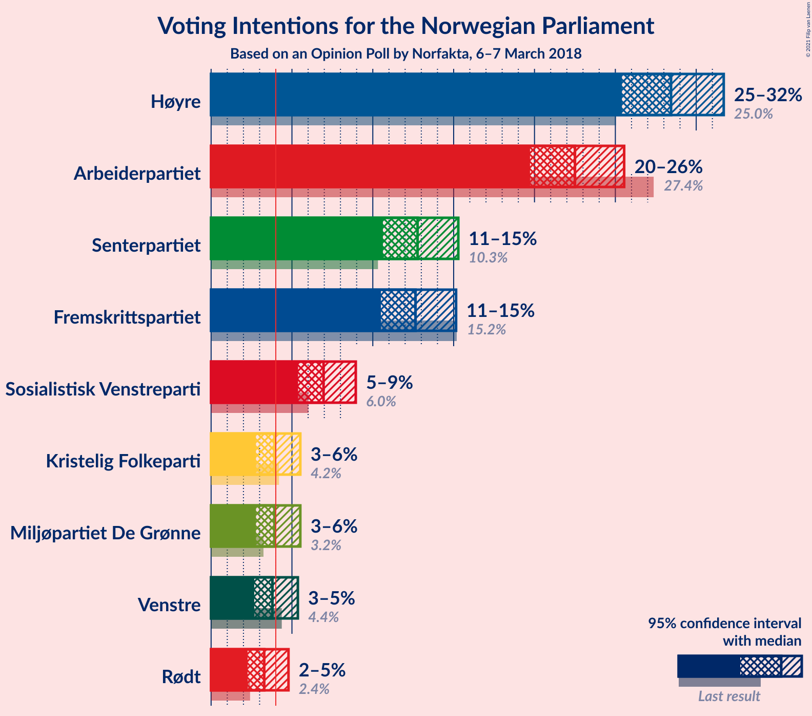
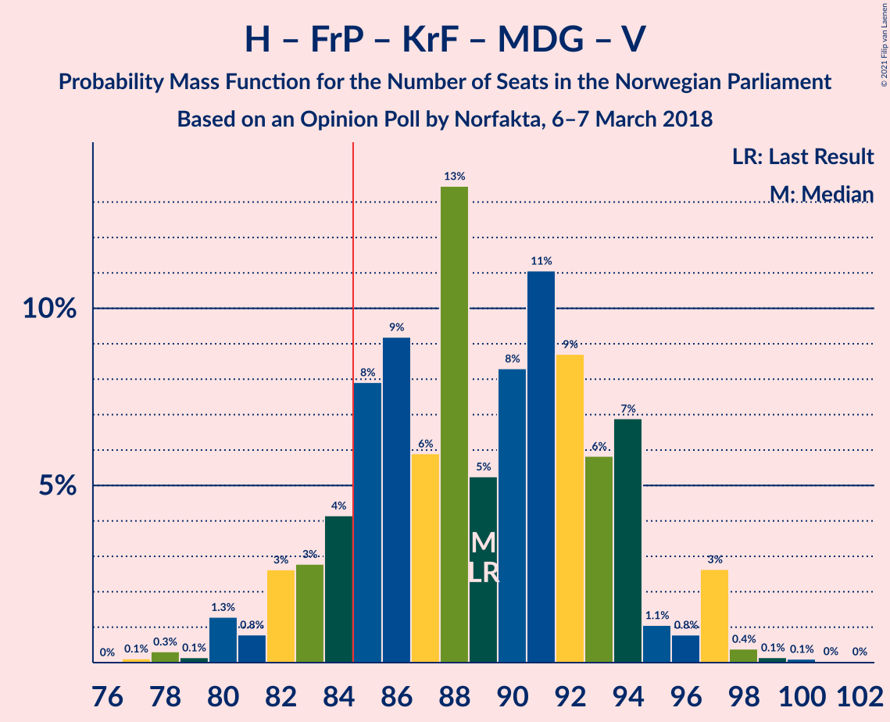
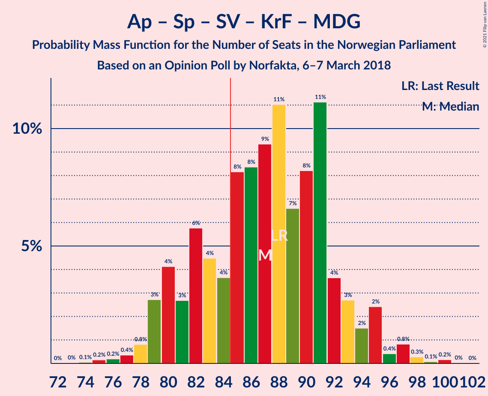
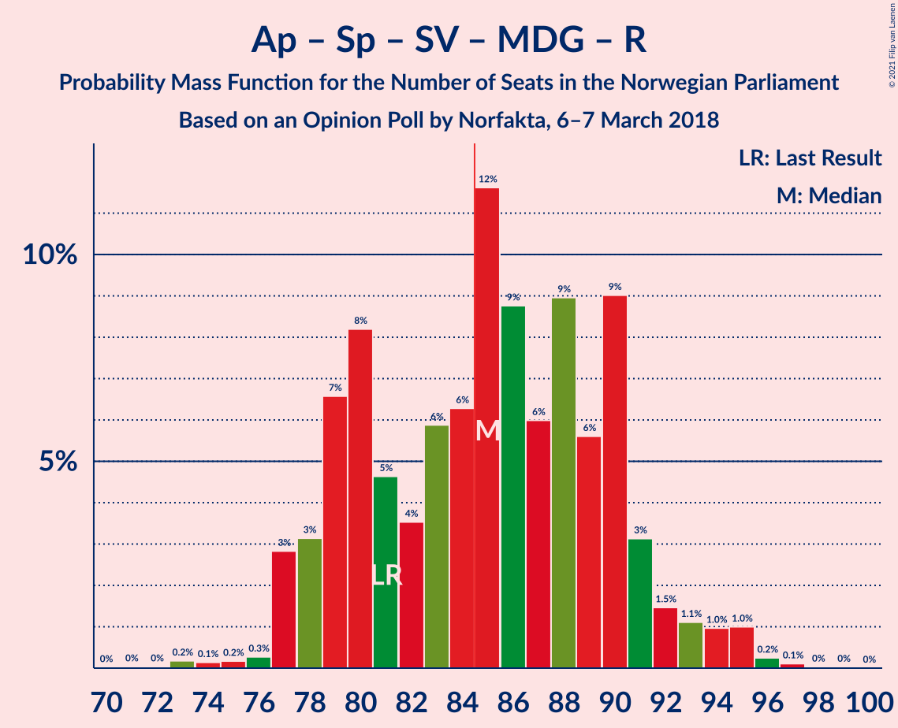
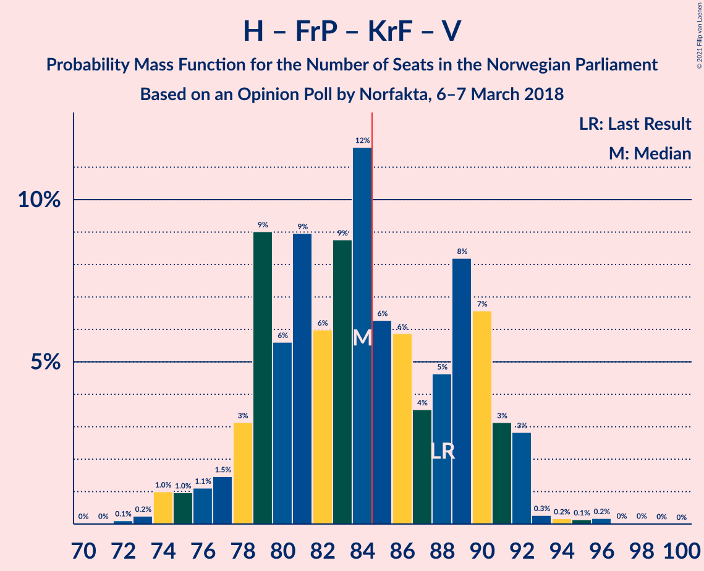
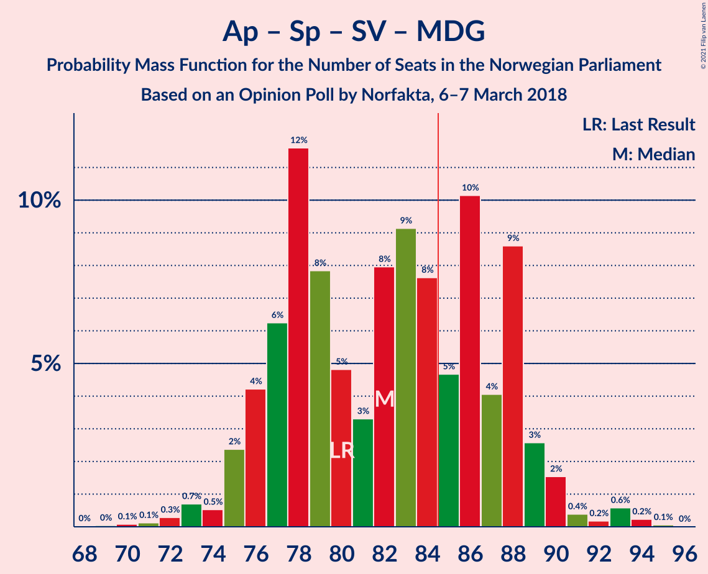
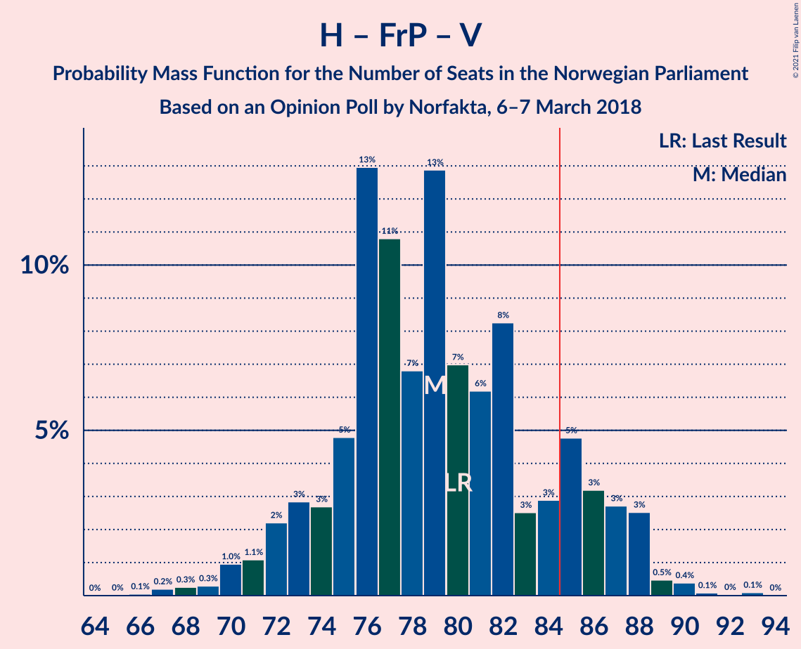
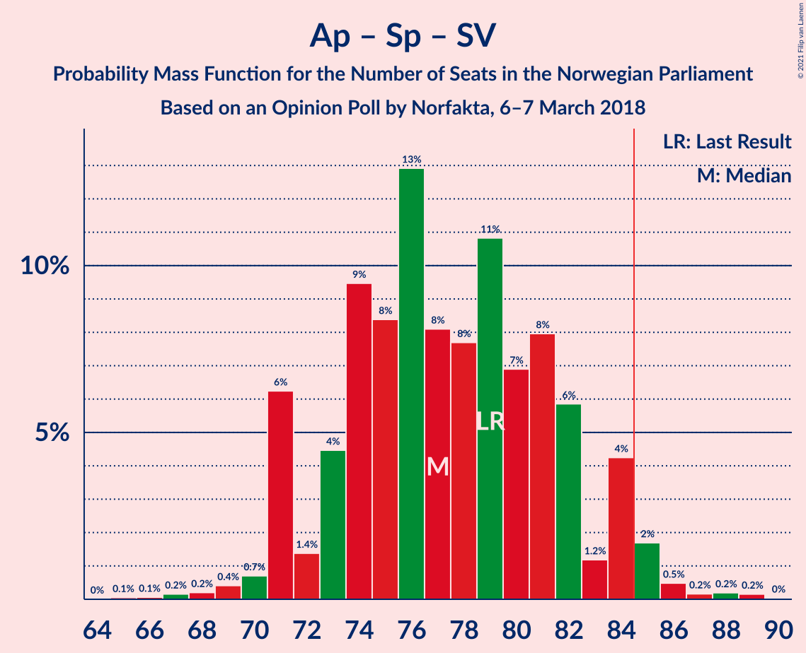
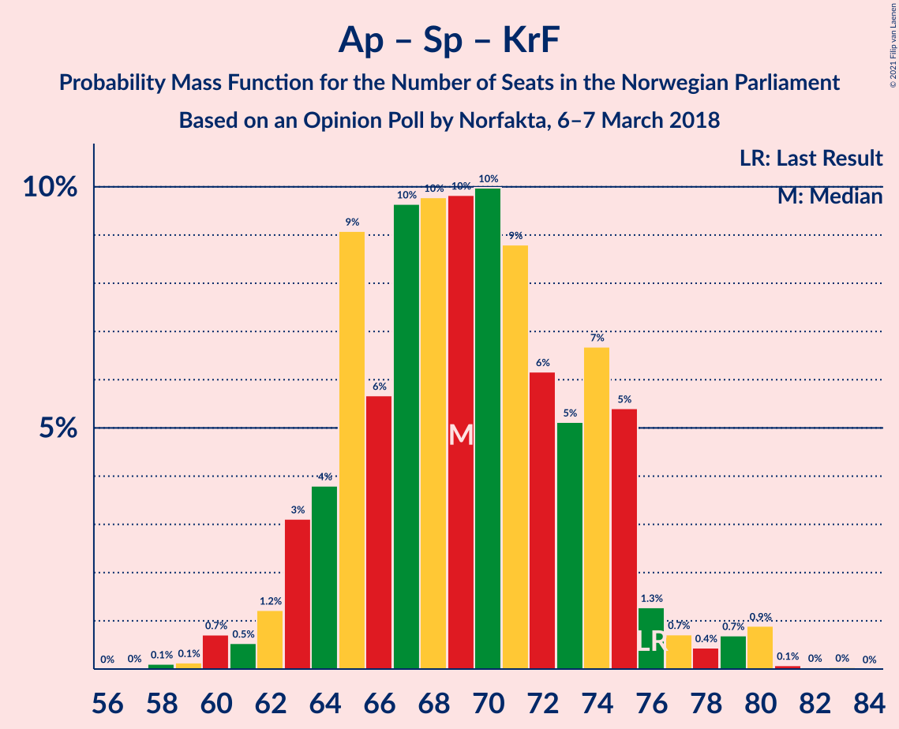

# Opinion Poll by Norfakta, 6–7 March 2018

<a href="#voting-intentions">Voting Intentions</a> | <a href="#seats">Seats</a> | <a href="#coalitions">Coalitions</a> | <a href="#technical-information">Technical Information</a>

## Voting Intentions

### Confidence Intervals

| Party | Last Result | Poll Result | 80% Confidence Interval | 90% Confidence Interval | 95% Confidence Interval | 99% Confidence Interval |
|:-----:|:-----------:|:-----------:|:-----------------------:|:-----------------------:|:-----------------------:|:-----------------------:|
| Høyre | 25.0% | 28.4% | 26.4–30.6% |25.9–31.2% |25.4–31.7% |24.5–32.7% |
| Arbeiderpartiet | 27.4% | 22.5% | 20.7–24.5% |20.2–25.1% |19.7–25.5% |18.9–26.5% |
| Senterpartiet | 10.3% | 12.8% | 11.4–14.4% |11.0–14.9% |10.6–15.3% |10.0–16.1% |
| Fremskrittspartiet | 15.2% | 12.6% | 11.2–14.3% |10.8–14.7% |10.5–15.2% |9.9–16.0% |
| Sosialistisk Venstreparti | 6.0% | 7.0% | 5.9–8.3% |5.6–8.6% |5.4–8.9% |4.9–9.6% |
| Miljøpartiet De Grønne | 3.2% | 3.9% | 3.2–5.0% |2.9–5.3% |2.8–5.5% |2.5–6.1% |
| Kristelig Folkeparti | 4.2% | 3.9% | 3.2–5.0% |2.9–5.3% |2.8–5.5% |2.5–6.1% |
| Venstre | 4.4% | 3.8% | 3.0–4.8% |2.8–5.1% |2.7–5.4% |2.3–5.9% |
| Rødt | 2.4% | 3.3% | 2.6–4.3% |2.4–4.5% |2.3–4.8% |2.0–5.3% |

*Note:* The poll result column reflects the actual value used in the calculations. Published results may vary slightly, and in addition be rounded to fewer digits.

## Seats

### Confidence Intervals

| Party | Last Result | Median | 80% Confidence Interval | 90% Confidence Interval | 95% Confidence Interval | 99% Confidence Interval |
|:-----:|:-----------:|:------:|:-----------------------:|:-----------------------:|:-----------------------:|:-----------------------:|
| <a href="#høyre">Høyre</a> | 45 | 51 | 47–55 |46–56 |46–57 |44–59 |
| <a href="#arbeiderpartiet">Arbeiderpartiet</a> | 49 | 41 | 37–45 |37–46 |36–47 |34–49 |
| <a href="#senterpartiet">Senterpartiet</a> | 19 | 23 | 20–26 |20–27 |19–28 |18–30 |
| <a href="#fremskrittspartiet">Fremskrittspartiet</a> | 27 | 24 | 20–26 |20–27 |19–27 |18–29 |
| <a href="#sosialistisk-venstreparti">Sosialistisk Venstreparti</a> | 11 | 13 | 11–14 |10–16 |10–17 |9–17 |
| <a href="#miljøpartiet-de-grønne">Miljøpartiet De Grønne</a> | 1 | 3 | 2–9 |1–9 |1–10 |1–11 |
| <a href="#kristelig-folkeparti">Kristelig Folkeparti</a> | 8 | 3 | 2–8 |1–9 |1–9 |1–11 |
| <a href="#venstre">Venstre</a> | 8 | 3 | 2–9 |2–9 |2–10 |1–11 |
| <a href="#rødt">Rødt</a> | 1 | 2 | 1–7 |1–8 |1–9 |1–10 |

### Høyre

*For a full overview of the results for this party, see the [Høyre](party-høyre.html) page.*

| Number of Seats | Probability | Accumulated | Special Marks |
|:---------------:|:-----------:|:-----------:|:-------------:|
| 41 | 0.1% | 100% |  |
| 42 | 0.1% | 99.9% |  |
| 43 | 0.3% | 99.8% |  |
| 44 | 0.6% | 99.5% |  |
| 45 | 1.4% | 98.9% | Last Result |
| 46 | 3% | 98% |  |
| 47 | 9% | 95% |  |
| 48 | 5% | 86% |  |
| 49 | 13% | 81% |  |
| 50 | 10% | 69% |  |
| 51 | 13% | 58% | Median |
| 52 | 15% | 45% |  |
| 53 | 9% | 29% |  |
| 54 | 10% | 21% |  |
| 55 | 2% | 11% |  |
| 56 | 5% | 8% |  |
| 57 | 1.2% | 4% |  |
| 58 | 1.4% | 2% |  |
| 59 | 0.6% | 1.0% |  |
| 60 | 0.2% | 0.4% |  |
| 61 | 0.1% | 0.2% |  |
| 62 | 0% | 0% |  |

### Arbeiderpartiet

*For a full overview of the results for this party, see the [Arbeiderpartiet](party-arbeiderpartiet.html) page.*

| Number of Seats | Probability | Accumulated | Special Marks |
|:---------------:|:-----------:|:-----------:|:-------------:|
| 32 | 0.1% | 100% |  |
| 33 | 0.2% | 99.9% |  |
| 34 | 0.3% | 99.7% |  |
| 35 | 0.8% | 99.4% |  |
| 36 | 3% | 98.6% |  |
| 37 | 6% | 96% |  |
| 38 | 10% | 89% |  |
| 39 | 10% | 80% |  |
| 40 | 12% | 70% |  |
| 41 | 15% | 58% | Median |
| 42 | 15% | 43% |  |
| 43 | 10% | 29% |  |
| 44 | 6% | 19% |  |
| 45 | 5% | 13% |  |
| 46 | 5% | 8% |  |
| 47 | 2% | 3% |  |
| 48 | 0.8% | 2% |  |
| 49 | 0.4% | 0.7% | Last Result |
| 50 | 0.2% | 0.3% |  |
| 51 | 0% | 0.1% |  |
| 52 | 0% | 0% |  |

### Senterpartiet

*For a full overview of the results for this party, see the [Senterpartiet](party-senterpartiet.html) page.*

| Number of Seats | Probability | Accumulated | Special Marks |
|:---------------:|:-----------:|:-----------:|:-------------:|
| 17 | 0.3% | 100% |  |
| 18 | 0.7% | 99.7% |  |
| 19 | 3% | 99.0% | Last Result |
| 20 | 8% | 96% |  |
| 21 | 13% | 88% |  |
| 22 | 12% | 75% |  |
| 23 | 17% | 64% | Median |
| 24 | 14% | 46% |  |
| 25 | 15% | 32% |  |
| 26 | 9% | 17% |  |
| 27 | 3% | 8% |  |
| 28 | 3% | 4% |  |
| 29 | 0.8% | 1.4% |  |
| 30 | 0.4% | 0.6% |  |
| 31 | 0.1% | 0.1% |  |
| 32 | 0% | 0.1% |  |
| 33 | 0% | 0% |  |

### Fremskrittspartiet

*For a full overview of the results for this party, see the [Fremskrittspartiet](party-fremskrittspartiet.html) page.*

| Number of Seats | Probability | Accumulated | Special Marks |
|:---------------:|:-----------:|:-----------:|:-------------:|
| 16 | 0.1% | 100% |  |
| 17 | 0.3% | 99.9% |  |
| 18 | 1.0% | 99.7% |  |
| 19 | 3% | 98.6% |  |
| 20 | 7% | 96% |  |
| 21 | 7% | 89% |  |
| 22 | 16% | 82% |  |
| 23 | 15% | 65% |  |
| 24 | 21% | 51% | Median |
| 25 | 13% | 29% |  |
| 26 | 8% | 16% |  |
| 27 | 7% | 8% | Last Result |
| 28 | 1.2% | 2% |  |
| 29 | 0.4% | 0.6% |  |
| 30 | 0.2% | 0.2% |  |
| 31 | 0% | 0% |  |

### Sosialistisk Venstreparti

*For a full overview of the results for this party, see the [Sosialistisk Venstreparti](party-sosialistiskvenstreparti.html) page.*

| Number of Seats | Probability | Accumulated | Special Marks |
|:---------------:|:-----------:|:-----------:|:-------------:|
| 8 | 0.2% | 100% |  |
| 9 | 1.2% | 99.8% |  |
| 10 | 7% | 98.6% |  |
| 11 | 6% | 92% | Last Result |
| 12 | 13% | 86% |  |
| 13 | 40% | 72% | Median |
| 14 | 23% | 33% |  |
| 15 | 4% | 9% |  |
| 16 | 3% | 5% |  |
| 17 | 2% | 3% |  |
| 18 | 0.3% | 0.5% |  |
| 19 | 0.1% | 0.1% |  |
| 20 | 0% | 0% |  |

### Miljøpartiet De Grønne

*For a full overview of the results for this party, see the [Miljøpartiet De Grønne](party-miljøpartietdegrønne.html) page.*

| Number of Seats | Probability | Accumulated | Special Marks |
|:---------------:|:-----------:|:-----------:|:-------------:|
| 1 | 10% | 100% | Last Result |
| 2 | 40% | 90% |  |
| 3 | 3% | 51% | Median |
| 4 | 0.8% | 47% |  |
| 5 | 0% | 47% |  |
| 6 | 0.1% | 47% |  |
| 7 | 12% | 47% |  |
| 8 | 18% | 35% |  |
| 9 | 13% | 17% |  |
| 10 | 3% | 4% |  |
| 11 | 0.7% | 0.8% |  |
| 12 | 0.1% | 0.1% |  |
| 13 | 0% | 0% |  |

### Kristelig Folkeparti

*For a full overview of the results for this party, see the [Kristelig Folkeparti](party-kristeligfolkeparti.html) page.*

| Number of Seats | Probability | Accumulated | Special Marks |
|:---------------:|:-----------:|:-----------:|:-------------:|
| 0 | 0.1% | 100% |  |
| 1 | 6% | 99.9% |  |
| 2 | 10% | 94% |  |
| 3 | 41% | 84% | Median |
| 4 | 0% | 43% |  |
| 5 | 0% | 43% |  |
| 6 | 0% | 43% |  |
| 7 | 14% | 43% |  |
| 8 | 22% | 29% | Last Result |
| 9 | 5% | 7% |  |
| 10 | 1.2% | 2% |  |
| 11 | 0.6% | 0.8% |  |
| 12 | 0.2% | 0.2% |  |
| 13 | 0% | 0% |  |

### Venstre

*For a full overview of the results for this party, see the [Venstre](party-venstre.html) page.*

| Number of Seats | Probability | Accumulated | Special Marks |
|:---------------:|:-----------:|:-----------:|:-------------:|
| 1 | 0.6% | 100% |  |
| 2 | 47% | 99.3% |  |
| 3 | 9% | 52% | Median |
| 4 | 0% | 43% |  |
| 5 | 0% | 43% |  |
| 6 | 0% | 43% |  |
| 7 | 8% | 43% |  |
| 8 | 25% | 35% | Last Result |
| 9 | 8% | 10% |  |
| 10 | 2% | 3% |  |
| 11 | 0.6% | 0.7% |  |
| 12 | 0.1% | 0.1% |  |
| 13 | 0% | 0% |  |

### Rødt

*For a full overview of the results for this party, see the [Rødt](party-rødt.html) page.*

| Number of Seats | Probability | Accumulated | Special Marks |
|:---------------:|:-----------:|:-----------:|:-------------:|
| 1 | 26% | 100% | Last Result |
| 2 | 57% | 74% | Median |
| 3 | 0% | 17% |  |
| 4 | 0% | 17% |  |
| 5 | 0% | 17% |  |
| 6 | 0% | 17% |  |
| 7 | 7% | 17% |  |
| 8 | 7% | 10% |  |
| 9 | 3% | 3% |  |
| 10 | 0.5% | 0.5% |  |
| 11 | 0% | 0% |  |

## Coalitions

### Confidence Intervals

| Coalition | Last Result | Median | Majority? | 80% Confidence Interval | 90% Confidence Interval | 95% Confidence Interval | 99% Confidence Interval |
|:---------:|:-----------:|:------:|:---------:|:-----------------------:|:-----------------------:|:-----------------------:|:-----------------------:|
| Høyre – Senterpartiet – Fremskrittspartiet – Kristelig Folkeparti – Venstre | 107 | 107 | 100% | 102–114 | 101–115 | 99–116 | 97–117 |
| Høyre – Fremskrittspartiet – Kristelig Folkeparti – Miljøpartiet De Grønne – Venstre | 89 | 89 | 88% | 84–94 | 82–95 | 81–97 | 79–98 |
| Arbeiderpartiet – Senterpartiet – Sosialistisk Venstreparti – Kristelig Folkeparti – Miljøpartiet De Grønne | 88 | 87 | 75% | 81–92 | 80–94 | 79–95 | 77–98 |
| Arbeiderpartiet – Senterpartiet – Sosialistisk Venstreparti – Miljøpartiet De Grønne – Rødt | 81 | 85 | 58% | 79–90 | 78–91 | 77–93 | 75–95 |
| Høyre – Fremskrittspartiet – Kristelig Folkeparti – Venstre | 88 | 84 | 42% | 79–90 | 78–91 | 76–92 | 74–94 |
| Arbeiderpartiet – Senterpartiet – Sosialistisk Venstreparti – Miljøpartiet De Grønne | 80 | 82 | 33% | 77–88 | 76–89 | 75–90 | 72–93 |
| Arbeiderpartiet – Senterpartiet – Sosialistisk Venstreparti – Rødt | 80 | 80 | 12% | 75–85 | 74–87 | 72–88 | 71–90 |
| Høyre – Fremskrittspartiet – Venstre | 80 | 79 | 14% | 74–85 | 72–87 | 71–88 | 68–90 |
| Arbeiderpartiet – Senterpartiet – Sosialistisk Venstreparti | 79 | 77 | 3% | 73–82 | 71–84 | 71–85 | 69–87 |
| Høyre – Fremskrittspartiet | 72 | 74 | 0.4% | 70–79 | 68–80 | 67–82 | 65–84 |
| Arbeiderpartiet – Senterpartiet – Kristelig Folkeparti – Miljøpartiet De Grønne | 77 | 74 | 0.5% | 68–79 | 67–81 | 66–82 | 64–85 |
| Arbeiderpartiet – Senterpartiet – Kristelig Folkeparti | 76 | 69 | 0% | 65–74 | 63–75 | 62–77 | 60–80 |
| Arbeiderpartiet – Senterpartiet | 68 | 64 | 0% | 60–69 | 58–71 | 58–71 | 57–74 |
| Arbeiderpartiet – Sosialistisk Venstreparti – Miljøpartiet De Grønne – Rødt | 62 | 62 | 0% | 55–67 | 54–68 | 53–70 | 52–72 |
| Høyre – Kristelig Folkeparti – Venstre | 61 | 61 | 0% | 55–66 | 54–67 | 54–68 | 52–72 |
| Arbeiderpartiet – Sosialistisk Venstreparti | 60 | 54 | 0% | 50–59 | 50–59 | 48–60 | 46–63 |
| Senterpartiet – Kristelig Folkeparti – Venstre | 35 | 33 | 0% | 28–39 | 26–40 | 26–41 | 24–43 |

### Høyre – Senterpartiet – Fremskrittspartiet – Kristelig Folkeparti – Venstre

| Number of Seats | Probability | Accumulated | Special Marks |
|:---------------:|:-----------:|:-----------:|:-------------:|
| 94 | 0% | 100% |  |
| 95 | 0.2% | 99.9% |  |
| 96 | 0.2% | 99.7% |  |
| 97 | 0.3% | 99.6% |  |
| 98 | 1.3% | 99.3% |  |
| 99 | 2% | 98% |  |
| 100 | 1.5% | 96% |  |
| 101 | 3% | 95% |  |
| 102 | 7% | 92% |  |
| 103 | 4% | 85% |  |
| 104 | 5% | 81% | Median |
| 105 | 9% | 76% |  |
| 106 | 11% | 66% |  |
| 107 | 7% | 55% | Last Result |
| 108 | 14% | 48% |  |
| 109 | 5% | 34% |  |
| 110 | 6% | 29% |  |
| 111 | 4% | 23% |  |
| 112 | 5% | 20% |  |
| 113 | 4% | 15% |  |
| 114 | 4% | 10% |  |
| 115 | 3% | 7% |  |
| 116 | 3% | 4% |  |
| 117 | 0.2% | 0.7% |  |
| 118 | 0.3% | 0.4% |  |
| 119 | 0.1% | 0.1% |  |
| 120 | 0% | 0% |  |

### Høyre – Fremskrittspartiet – Kristelig Folkeparti – Miljøpartiet De Grønne – Venstre

| Number of Seats | Probability | Accumulated | Special Marks |
|:---------------:|:-----------:|:-----------:|:-------------:|
| 77 | 0.1% | 100% |  |
| 78 | 0.3% | 99.9% |  |
| 79 | 0.1% | 99.5% |  |
| 80 | 1.3% | 99.4% |  |
| 81 | 0.8% | 98% |  |
| 82 | 3% | 97% |  |
| 83 | 3% | 95% |  |
| 84 | 4% | 92% | Median |
| 85 | 8% | 88% | Majority |
| 86 | 9% | 80% |  |
| 87 | 6% | 71% |  |
| 88 | 13% | 65% |  |
| 89 | 5% | 51% | Last Result |
| 90 | 8% | 46% |  |
| 91 | 11% | 38% |  |
| 92 | 9% | 27% |  |
| 93 | 6% | 18% |  |
| 94 | 7% | 12% |  |
| 95 | 1.1% | 5% |  |
| 96 | 0.8% | 4% |  |
| 97 | 3% | 3% |  |
| 98 | 0.4% | 0.7% |  |
| 99 | 0.1% | 0.3% |  |
| 100 | 0.1% | 0.2% |  |
| 101 | 0% | 0.1% |  |
| 102 | 0% | 0% |  |

### Arbeiderpartiet – Senterpartiet – Sosialistisk Venstreparti – Kristelig Folkeparti – Miljøpartiet De Grønne

| Number of Seats | Probability | Accumulated | Special Marks |
|:---------------:|:-----------:|:-----------:|:-------------:|
| 73 | 0% | 100% |  |
| 74 | 0.1% | 99.9% |  |
| 75 | 0.2% | 99.9% |  |
| 76 | 0.2% | 99.7% |  |
| 77 | 0.4% | 99.5% |  |
| 78 | 0.8% | 99.2% |  |
| 79 | 3% | 98% |  |
| 80 | 4% | 96% |  |
| 81 | 3% | 92% |  |
| 82 | 6% | 89% |  |
| 83 | 4% | 83% | Median |
| 84 | 4% | 79% |  |
| 85 | 8% | 75% | Majority |
| 86 | 8% | 67% |  |
| 87 | 9% | 58% |  |
| 88 | 11% | 49% | Last Result |
| 89 | 7% | 38% |  |
| 90 | 8% | 31% |  |
| 91 | 11% | 23% |  |
| 92 | 4% | 12% |  |
| 93 | 3% | 8% |  |
| 94 | 2% | 6% |  |
| 95 | 2% | 4% |  |
| 96 | 0.4% | 2% |  |
| 97 | 0.8% | 1.4% |  |
| 98 | 0.3% | 0.6% |  |
| 99 | 0.1% | 0.3% |  |
| 100 | 0.2% | 0.2% |  |
| 101 | 0% | 0% |  |

### Arbeiderpartiet – Senterpartiet – Sosialistisk Venstreparti – Miljøpartiet De Grønne – Rødt

| Number of Seats | Probability | Accumulated | Special Marks |
|:---------------:|:-----------:|:-----------:|:-------------:|
| 71 | 0% | 100% |  |
| 72 | 0% | 99.9% |  |
| 73 | 0.2% | 99.9% |  |
| 74 | 0.1% | 99.7% |  |
| 75 | 0.2% | 99.6% |  |
| 76 | 0.3% | 99.4% |  |
| 77 | 3% | 99.1% |  |
| 78 | 3% | 96% |  |
| 79 | 7% | 93% |  |
| 80 | 8% | 87% |  |
| 81 | 5% | 78% | Last Result |
| 82 | 4% | 74% | Median |
| 83 | 6% | 70% |  |
| 84 | 6% | 64% |  |
| 85 | 12% | 58% | Majority |
| 86 | 9% | 46% |  |
| 87 | 6% | 38% |  |
| 88 | 9% | 32% |  |
| 89 | 6% | 23% |  |
| 90 | 9% | 17% |  |
| 91 | 3% | 8% |  |
| 92 | 1.5% | 5% |  |
| 93 | 1.1% | 4% |  |
| 94 | 1.0% | 2% |  |
| 95 | 1.0% | 1.4% |  |
| 96 | 0.2% | 0.4% |  |
| 97 | 0.1% | 0.2% |  |
| 98 | 0% | 0.1% |  |
| 99 | 0% | 0% |  |

### Høyre – Fremskrittspartiet – Kristelig Folkeparti – Venstre

| Number of Seats | Probability | Accumulated | Special Marks |
|:---------------:|:-----------:|:-----------:|:-------------:|
| 71 | 0% | 100% |  |
| 72 | 0.1% | 99.9% |  |
| 73 | 0.2% | 99.8% |  |
| 74 | 1.0% | 99.6% |  |
| 75 | 1.0% | 98.6% |  |
| 76 | 1.1% | 98% |  |
| 77 | 1.5% | 96% |  |
| 78 | 3% | 95% |  |
| 79 | 9% | 92% |  |
| 80 | 6% | 83% |  |
| 81 | 9% | 77% | Median |
| 82 | 6% | 68% |  |
| 83 | 9% | 62% |  |
| 84 | 12% | 54% |  |
| 85 | 6% | 42% | Majority |
| 86 | 6% | 36% |  |
| 87 | 4% | 30% |  |
| 88 | 5% | 26% | Last Result |
| 89 | 8% | 22% |  |
| 90 | 7% | 13% |  |
| 91 | 3% | 7% |  |
| 92 | 3% | 4% |  |
| 93 | 0.3% | 0.9% |  |
| 94 | 0.2% | 0.6% |  |
| 95 | 0.1% | 0.4% |  |
| 96 | 0.2% | 0.3% |  |
| 97 | 0% | 0.1% |  |
| 98 | 0% | 0.1% |  |
| 99 | 0% | 0% |  |

### Arbeiderpartiet – Senterpartiet – Sosialistisk Venstreparti – Miljøpartiet De Grønne

| Number of Seats | Probability | Accumulated | Special Marks |
|:---------------:|:-----------:|:-----------:|:-------------:|
| 69 | 0% | 100% |  |
| 70 | 0.1% | 99.9% |  |
| 71 | 0.1% | 99.8% |  |
| 72 | 0.3% | 99.7% |  |
| 73 | 0.7% | 99.4% |  |
| 74 | 0.5% | 98.7% |  |
| 75 | 2% | 98% |  |
| 76 | 4% | 96% |  |
| 77 | 6% | 92% |  |
| 78 | 12% | 85% |  |
| 79 | 8% | 74% |  |
| 80 | 5% | 66% | Last Result, Median |
| 81 | 3% | 61% |  |
| 82 | 8% | 58% |  |
| 83 | 9% | 50% |  |
| 84 | 8% | 41% |  |
| 85 | 5% | 33% | Majority |
| 86 | 10% | 28% |  |
| 87 | 4% | 18% |  |
| 88 | 9% | 14% |  |
| 89 | 3% | 6% |  |
| 90 | 2% | 3% |  |
| 91 | 0.4% | 1.5% |  |
| 92 | 0.2% | 1.1% |  |
| 93 | 0.6% | 0.9% |  |
| 94 | 0.2% | 0.3% |  |
| 95 | 0.1% | 0.1% |  |
| 96 | 0% | 0% |  |

### Arbeiderpartiet – Senterpartiet – Sosialistisk Venstreparti – Rødt

| Number of Seats | Probability | Accumulated | Special Marks |
|:---------------:|:-----------:|:-----------:|:-------------:|
| 68 | 0% | 100% |  |
| 69 | 0.1% | 99.9% |  |
| 70 | 0.1% | 99.8% |  |
| 71 | 0.4% | 99.7% |  |
| 72 | 3% | 99.3% |  |
| 73 | 0.8% | 97% |  |
| 74 | 1.1% | 96% |  |
| 75 | 7% | 95% |  |
| 76 | 6% | 88% |  |
| 77 | 9% | 82% |  |
| 78 | 11% | 73% |  |
| 79 | 8% | 62% | Median |
| 80 | 5% | 54% | Last Result |
| 81 | 13% | 49% |  |
| 82 | 6% | 35% |  |
| 83 | 9% | 29% |  |
| 84 | 8% | 20% |  |
| 85 | 4% | 12% | Majority |
| 86 | 3% | 8% |  |
| 87 | 3% | 5% |  |
| 88 | 0.8% | 3% |  |
| 89 | 1.3% | 2% |  |
| 90 | 0.1% | 0.6% |  |
| 91 | 0.3% | 0.5% |  |
| 92 | 0.1% | 0.1% |  |
| 93 | 0% | 0% |  |

### Høyre – Fremskrittspartiet – Venstre

| Number of Seats | Probability | Accumulated | Special Marks |
|:---------------:|:-----------:|:-----------:|:-------------:|
| 66 | 0.1% | 100% |  |
| 67 | 0.2% | 99.9% |  |
| 68 | 0.3% | 99.7% |  |
| 69 | 0.3% | 99.5% |  |
| 70 | 1.0% | 99.2% |  |
| 71 | 1.1% | 98% |  |
| 72 | 2% | 97% |  |
| 73 | 3% | 95% |  |
| 74 | 3% | 92% |  |
| 75 | 5% | 89% |  |
| 76 | 13% | 85% |  |
| 77 | 11% | 72% |  |
| 78 | 7% | 61% | Median |
| 79 | 13% | 54% |  |
| 80 | 7% | 41% | Last Result |
| 81 | 6% | 34% |  |
| 82 | 8% | 28% |  |
| 83 | 3% | 20% |  |
| 84 | 3% | 17% |  |
| 85 | 5% | 14% | Majority |
| 86 | 3% | 10% |  |
| 87 | 3% | 6% |  |
| 88 | 3% | 4% |  |
| 89 | 0.5% | 1.1% |  |
| 90 | 0.4% | 0.6% |  |
| 91 | 0.1% | 0.2% |  |
| 92 | 0% | 0.1% |  |
| 93 | 0.1% | 0.1% |  |
| 94 | 0% | 0% |  |

### Arbeiderpartiet – Senterpartiet – Sosialistisk Venstreparti

| Number of Seats | Probability | Accumulated | Special Marks |
|:---------------:|:-----------:|:-----------:|:-------------:|
| 65 | 0.1% | 100% |  |
| 66 | 0.1% | 99.9% |  |
| 67 | 0.2% | 99.9% |  |
| 68 | 0.2% | 99.7% |  |
| 69 | 0.4% | 99.5% |  |
| 70 | 0.7% | 99.1% |  |
| 71 | 6% | 98% |  |
| 72 | 1.4% | 92% |  |
| 73 | 4% | 91% |  |
| 74 | 9% | 86% |  |
| 75 | 8% | 77% |  |
| 76 | 13% | 68% |  |
| 77 | 8% | 56% | Median |
| 78 | 8% | 47% |  |
| 79 | 11% | 40% | Last Result |
| 80 | 7% | 29% |  |
| 81 | 8% | 22% |  |
| 82 | 6% | 14% |  |
| 83 | 1.2% | 8% |  |
| 84 | 4% | 7% |  |
| 85 | 2% | 3% | Majority |
| 86 | 0.5% | 1.0% |  |
| 87 | 0.2% | 0.6% |  |
| 88 | 0.2% | 0.4% |  |
| 89 | 0.2% | 0.2% |  |
| 90 | 0% | 0% |  |

### Høyre – Fremskrittspartiet

| Number of Seats | Probability | Accumulated | Special Marks |
|:---------------:|:-----------:|:-----------:|:-------------:|
| 62 | 0.1% | 100% |  |
| 63 | 0.1% | 99.9% |  |
| 64 | 0.1% | 99.8% |  |
| 65 | 0.9% | 99.7% |  |
| 66 | 0.5% | 98.8% |  |
| 67 | 0.9% | 98% |  |
| 68 | 4% | 97% |  |
| 69 | 4% | 94% |  |
| 70 | 6% | 90% |  |
| 71 | 6% | 85% |  |
| 72 | 6% | 78% | Last Result |
| 73 | 9% | 72% |  |
| 74 | 13% | 63% |  |
| 75 | 12% | 49% | Median |
| 76 | 10% | 37% |  |
| 77 | 8% | 27% |  |
| 78 | 4% | 19% |  |
| 79 | 7% | 15% |  |
| 80 | 4% | 8% |  |
| 81 | 1.1% | 4% |  |
| 82 | 0.6% | 3% |  |
| 83 | 0.5% | 2% |  |
| 84 | 1.3% | 2% |  |
| 85 | 0.2% | 0.4% | Majority |
| 86 | 0.1% | 0.2% |  |
| 87 | 0.1% | 0.1% |  |
| 88 | 0% | 0% |  |

### Arbeiderpartiet – Senterpartiet – Kristelig Folkeparti – Miljøpartiet De Grønne

| Number of Seats | Probability | Accumulated | Special Marks |
|:---------------:|:-----------:|:-----------:|:-------------:|
| 61 | 0% | 100% |  |
| 62 | 0.1% | 99.9% |  |
| 63 | 0.2% | 99.8% |  |
| 64 | 0.6% | 99.6% |  |
| 65 | 1.1% | 99.1% |  |
| 66 | 3% | 98% |  |
| 67 | 4% | 95% |  |
| 68 | 2% | 91% |  |
| 69 | 6% | 89% |  |
| 70 | 4% | 83% | Median |
| 71 | 5% | 80% |  |
| 72 | 6% | 75% |  |
| 73 | 9% | 69% |  |
| 74 | 13% | 59% |  |
| 75 | 5% | 47% |  |
| 76 | 8% | 41% |  |
| 77 | 15% | 33% | Last Result |
| 78 | 6% | 18% |  |
| 79 | 3% | 12% |  |
| 80 | 3% | 9% |  |
| 81 | 3% | 7% |  |
| 82 | 2% | 4% |  |
| 83 | 1.4% | 2% |  |
| 84 | 0.2% | 0.8% |  |
| 85 | 0.2% | 0.5% | Majority |
| 86 | 0.2% | 0.3% |  |
| 87 | 0.1% | 0.1% |  |
| 88 | 0% | 0.1% |  |
| 89 | 0% | 0% |  |

### Arbeiderpartiet – Senterpartiet – Kristelig Folkeparti

| Number of Seats | Probability | Accumulated | Special Marks |
|:---------------:|:-----------:|:-----------:|:-------------:|
| 58 | 0.1% | 100% |  |
| 59 | 0.1% | 99.9% |  |
| 60 | 0.7% | 99.7% |  |
| 61 | 0.5% | 99.0% |  |
| 62 | 1.2% | 98% |  |
| 63 | 3% | 97% |  |
| 64 | 4% | 94% |  |
| 65 | 9% | 90% |  |
| 66 | 6% | 81% |  |
| 67 | 10% | 76% | Median |
| 68 | 10% | 66% |  |
| 69 | 10% | 56% |  |
| 70 | 10% | 46% |  |
| 71 | 9% | 36% |  |
| 72 | 6% | 28% |  |
| 73 | 5% | 21% |  |
| 74 | 7% | 16% |  |
| 75 | 5% | 10% |  |
| 76 | 1.3% | 4% | Last Result |
| 77 | 0.7% | 3% |  |
| 78 | 0.4% | 2% |  |
| 79 | 0.7% | 2% |  |
| 80 | 0.9% | 1.0% |  |
| 81 | 0.1% | 0.2% |  |
| 82 | 0% | 0.1% |  |
| 83 | 0% | 0% |  |

### Arbeiderpartiet – Senterpartiet

| Number of Seats | Probability | Accumulated | Special Marks |
|:---------------:|:-----------:|:-----------:|:-------------:|
| 54 | 0.1% | 100% |  |
| 55 | 0.1% | 99.9% |  |
| 56 | 0.2% | 99.8% |  |
| 57 | 0.6% | 99.6% |  |
| 58 | 6% | 99.0% |  |
| 59 | 2% | 93% |  |
| 60 | 4% | 91% |  |
| 61 | 11% | 88% |  |
| 62 | 8% | 77% |  |
| 63 | 6% | 68% |  |
| 64 | 13% | 62% | Median |
| 65 | 15% | 49% |  |
| 66 | 5% | 34% |  |
| 67 | 11% | 29% |  |
| 68 | 7% | 18% | Last Result |
| 69 | 3% | 12% |  |
| 70 | 2% | 9% |  |
| 71 | 4% | 7% |  |
| 72 | 2% | 2% |  |
| 73 | 0.4% | 0.9% |  |
| 74 | 0.2% | 0.6% |  |
| 75 | 0.1% | 0.4% |  |
| 76 | 0.2% | 0.3% |  |
| 77 | 0.1% | 0.1% |  |
| 78 | 0% | 0% |  |

### Arbeiderpartiet – Sosialistisk Venstreparti – Miljøpartiet De Grønne – Rødt

| Number of Seats | Probability | Accumulated | Special Marks |
|:---------------:|:-----------:|:-----------:|:-------------:|
| 50 | 0.1% | 100% |  |
| 51 | 0.3% | 99.9% |  |
| 52 | 0.2% | 99.6% |  |
| 53 | 3% | 99.3% |  |
| 54 | 3% | 96% |  |
| 55 | 4% | 93% |  |
| 56 | 4% | 90% |  |
| 57 | 5% | 85% |  |
| 58 | 4% | 80% |  |
| 59 | 6% | 77% | Median |
| 60 | 5% | 71% |  |
| 61 | 14% | 66% |  |
| 62 | 7% | 52% | Last Result |
| 63 | 11% | 45% |  |
| 64 | 9% | 33% |  |
| 65 | 5% | 24% |  |
| 66 | 4% | 19% |  |
| 67 | 7% | 15% |  |
| 68 | 3% | 7% |  |
| 69 | 1.4% | 5% |  |
| 70 | 2% | 4% |  |
| 71 | 1.3% | 2% |  |
| 72 | 0.3% | 0.7% |  |
| 73 | 0.1% | 0.4% |  |
| 74 | 0.2% | 0.3% |  |
| 75 | 0% | 0.1% |  |
| 76 | 0% | 0% |  |

### Høyre – Kristelig Folkeparti – Venstre

| Number of Seats | Probability | Accumulated | Special Marks |
|:---------------:|:-----------:|:-----------:|:-------------:|
| 50 | 0.1% | 100% |  |
| 51 | 0.1% | 99.8% |  |
| 52 | 0.8% | 99.8% |  |
| 53 | 0.8% | 99.0% |  |
| 54 | 7% | 98% |  |
| 55 | 3% | 91% |  |
| 56 | 4% | 88% |  |
| 57 | 10% | 84% | Median |
| 58 | 4% | 74% |  |
| 59 | 9% | 70% |  |
| 60 | 10% | 61% |  |
| 61 | 9% | 51% | Last Result |
| 62 | 5% | 42% |  |
| 63 | 15% | 37% |  |
| 64 | 3% | 23% |  |
| 65 | 5% | 19% |  |
| 66 | 6% | 14% |  |
| 67 | 5% | 8% |  |
| 68 | 0.7% | 3% |  |
| 69 | 1.3% | 2% |  |
| 70 | 0.4% | 1.0% |  |
| 71 | 0.1% | 0.7% |  |
| 72 | 0.2% | 0.5% |  |
| 73 | 0.2% | 0.4% |  |
| 74 | 0.1% | 0.1% |  |
| 75 | 0% | 0.1% |  |
| 76 | 0.1% | 0.1% |  |
| 77 | 0% | 0% |  |

### Arbeiderpartiet – Sosialistisk Venstreparti

| Number of Seats | Probability | Accumulated | Special Marks |
|:---------------:|:-----------:|:-----------:|:-------------:|
| 43 | 0.1% | 100% |  |
| 44 | 0.1% | 99.9% |  |
| 45 | 0.1% | 99.9% |  |
| 46 | 0.3% | 99.7% |  |
| 47 | 0.7% | 99.4% |  |
| 48 | 1.4% | 98.7% |  |
| 49 | 2% | 97% |  |
| 50 | 10% | 95% |  |
| 51 | 10% | 85% |  |
| 52 | 11% | 76% |  |
| 53 | 9% | 65% |  |
| 54 | 14% | 56% | Median |
| 55 | 7% | 41% |  |
| 56 | 11% | 35% |  |
| 57 | 8% | 24% |  |
| 58 | 4% | 16% |  |
| 59 | 7% | 11% |  |
| 60 | 2% | 4% | Last Result |
| 61 | 0.8% | 2% |  |
| 62 | 0.7% | 1.2% |  |
| 63 | 0.4% | 0.5% |  |
| 64 | 0% | 0.1% |  |
| 65 | 0% | 0.1% |  |
| 66 | 0% | 0.1% |  |
| 67 | 0% | 0% |  |

### Senterpartiet – Kristelig Folkeparti – Venstre

| Number of Seats | Probability | Accumulated | Special Marks |
|:---------------:|:-----------:|:-----------:|:-------------:|
| 22 | 0.1% | 100% |  |
| 23 | 0.2% | 99.9% |  |
| 24 | 0.9% | 99.7% |  |
| 25 | 1.3% | 98.8% |  |
| 26 | 4% | 98% |  |
| 27 | 3% | 94% |  |
| 28 | 5% | 91% |  |
| 29 | 10% | 85% | Median |
| 30 | 7% | 76% |  |
| 31 | 10% | 69% |  |
| 32 | 6% | 59% |  |
| 33 | 11% | 54% |  |
| 34 | 9% | 43% |  |
| 35 | 6% | 34% | Last Result |
| 36 | 5% | 28% |  |
| 37 | 9% | 22% |  |
| 38 | 3% | 14% |  |
| 39 | 1.1% | 11% |  |
| 40 | 5% | 10% |  |
| 41 | 3% | 5% |  |
| 42 | 0.4% | 1.4% |  |
| 43 | 0.6% | 1.0% |  |
| 44 | 0.2% | 0.4% |  |
| 45 | 0.1% | 0.2% |  |
| 46 | 0% | 0% |  |

## Technical Information

### Opinion Poll

+ **Polling firm:** Norfakta
+ **Commissioner(s):** —
+ **Fieldwork period:** 6–7 March 2018

### Calculations

+ **Sample size:** 791
+ **Simulations done:** 1,048,576
+ **Error estimate:** 1.34%

