# Opinion Poll by Sentio, 13–19 March 2018

<a href="#voting-intentions">Voting Intentions</a> | <a href="#seats">Seats</a> | <a href="#coalitions">Coalitions</a> | <a href="#technical-information">Technical Information</a>

## Voting Intentions

### Confidence Intervals

| Party | Last Result | Poll Result | 80% Confidence Interval | 90% Confidence Interval | 95% Confidence Interval | 99% Confidence Interval |
|:-----:|:-----------:|:-----------:|:-----------------------:|:-----------------------:|:-----------------------:|:-----------------------:|
| Høyre | 25.0% | 26.6% | 24.6–28.8% |24.0–29.5% |23.5–30.0% |22.5–31.1% |
| Arbeiderpartiet | 27.4% | 23.2% | 21.3–25.4% |20.7–26.0% |20.3–26.5% |19.4–27.5% |
| Fremskrittspartiet | 15.2% | 15.8% | 14.1–17.6% |13.7–18.2% |13.3–18.7% |12.5–19.6% |
| Senterpartiet | 10.3% | 11.8% | 10.4–13.5% |10.0–14.0% |9.6–14.4% |9.0–15.3% |
| Sosialistisk Venstreparti | 6.0% | 7.0% | 5.9–8.4% |5.6–8.8% |5.4–9.2% |4.9–9.9% |
| Kristelig Folkeparti | 4.2% | 4.1% | 3.3–5.2% |3.0–5.5% |2.9–5.8% |2.5–6.4% |
| Rødt | 2.4% | 3.9% | 3.2–5.1% |2.9–5.4% |2.7–5.7% |2.4–6.2% |
| Venstre | 4.4% | 3.5% | 2.8–4.6% |2.6–4.9% |2.4–5.2% |2.1–5.7% |
| Miljøpartiet De Grønne | 3.2% | 2.5% | 1.9–3.5% |1.8–3.7% |1.6–4.0% |1.4–4.5% |

*Note:* The poll result column reflects the actual value used in the calculations. Published results may vary slightly, and in addition be rounded to fewer digits.

## Seats

### Confidence Intervals

| Party | Last Result | Median | 80% Confidence Interval | 90% Confidence Interval | 95% Confidence Interval | 99% Confidence Interval |
|:-----:|:-----------:|:------:|:-----------------------:|:-----------------------:|:-----------------------:|:-----------------------:|
| <a href="#høyre">Høyre</a> | 45 | 48 | 44–52 |43–53 |42–55 |40–57 |
| <a href="#arbeiderpartiet">Arbeiderpartiet</a> | 49 | 43 | 39–46 |38–47 |37–49 |34–50 |
| <a href="#fremskrittspartiet">Fremskrittspartiet</a> | 27 | 28 | 25–32 |24–33 |24–34 |22–36 |
| <a href="#senterpartiet">Senterpartiet</a> | 19 | 21 | 18–24 |18–25 |17–26 |16–28 |
| <a href="#sosialistisk-venstreparti">Sosialistisk Venstreparti</a> | 11 | 13 | 11–15 |10–16 |9–17 |9–18 |
| <a href="#kristelig-folkeparti">Kristelig Folkeparti</a> | 8 | 8 | 3–9 |2–10 |1–10 |1–11 |
| <a href="#rødt">Rødt</a> | 1 | 2 | 2–9 |2–10 |1–10 |1–11 |
| <a href="#venstre">Venstre</a> | 8 | 2 | 2–8 |2–9 |2–9 |1–10 |
| <a href="#miljøpartiet-de-grønne">Miljøpartiet De Grønne</a> | 1 | 1 | 0–2 |0–2 |0–2 |0–8 |

### Høyre

*For a full overview of the results for this party, see the [Høyre](party-høyre.html) page.*

| Number of Seats | Probability | Accumulated | Special Marks |
|:---------------:|:-----------:|:-----------:|:-------------:|
| 37 | 0.1% | 100% |  |
| 38 | 0.1% | 99.9% |  |
| 39 | 0.3% | 99.9% |  |
| 40 | 0.2% | 99.5% |  |
| 41 | 1.1% | 99.3% |  |
| 42 | 2% | 98% |  |
| 43 | 5% | 96% |  |
| 44 | 6% | 91% |  |
| 45 | 9% | 85% | Last Result |
| 46 | 10% | 76% |  |
| 47 | 15% | 65% |  |
| 48 | 13% | 51% | Median |
| 49 | 7% | 38% |  |
| 50 | 11% | 31% |  |
| 51 | 5% | 20% |  |
| 52 | 6% | 15% |  |
| 53 | 4% | 8% |  |
| 54 | 2% | 5% |  |
| 55 | 2% | 3% |  |
| 56 | 0.5% | 1.1% |  |
| 57 | 0.1% | 0.6% |  |
| 58 | 0.3% | 0.4% |  |
| 59 | 0.1% | 0.1% |  |
| 60 | 0% | 0.1% |  |
| 61 | 0% | 0% |  |

### Arbeiderpartiet

*For a full overview of the results for this party, see the [Arbeiderpartiet](party-arbeiderpartiet.html) page.*

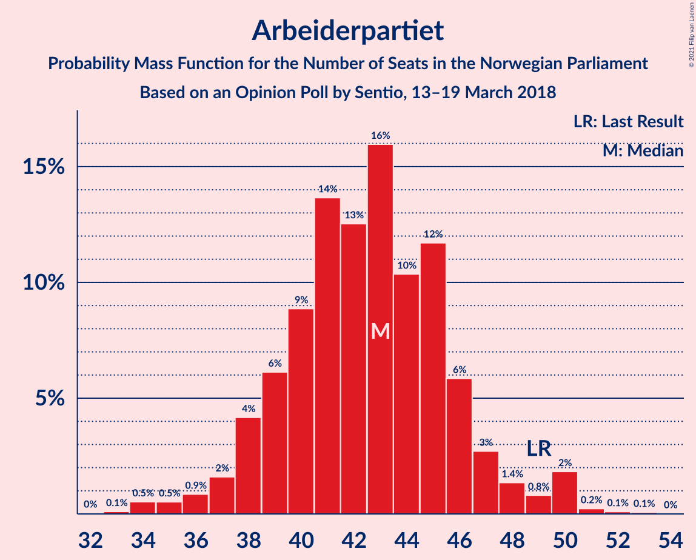

| Number of Seats | Probability | Accumulated | Special Marks |
|:---------------:|:-----------:|:-----------:|:-------------:|
| 32 | 0% | 100% |  |
| 33 | 0.1% | 99.9% |  |
| 34 | 0.5% | 99.8% |  |
| 35 | 0.5% | 99.3% |  |
| 36 | 0.9% | 98.8% |  |
| 37 | 2% | 98% |  |
| 38 | 4% | 96% |  |
| 39 | 6% | 92% |  |
| 40 | 9% | 86% |  |
| 41 | 14% | 77% |  |
| 42 | 13% | 64% |  |
| 43 | 16% | 51% | Median |
| 44 | 10% | 35% |  |
| 45 | 12% | 25% |  |
| 46 | 6% | 13% |  |
| 47 | 3% | 7% |  |
| 48 | 1.4% | 4% |  |
| 49 | 0.8% | 3% | Last Result |
| 50 | 2% | 2% |  |
| 51 | 0.2% | 0.4% |  |
| 52 | 0.1% | 0.2% |  |
| 53 | 0.1% | 0.1% |  |
| 54 | 0% | 0% |  |

### Fremskrittspartiet

*For a full overview of the results for this party, see the [Fremskrittspartiet](party-fremskrittspartiet.html) page.*

| Number of Seats | Probability | Accumulated | Special Marks |
|:---------------:|:-----------:|:-----------:|:-------------:|
| 20 | 0.1% | 100% |  |
| 21 | 0.1% | 99.9% |  |
| 22 | 0.5% | 99.8% |  |
| 23 | 0.9% | 99.3% |  |
| 24 | 3% | 98% |  |
| 25 | 6% | 95% |  |
| 26 | 10% | 89% |  |
| 27 | 16% | 79% | Last Result |
| 28 | 14% | 63% | Median |
| 29 | 12% | 49% |  |
| 30 | 14% | 37% |  |
| 31 | 6% | 24% |  |
| 32 | 9% | 17% |  |
| 33 | 4% | 8% |  |
| 34 | 2% | 4% |  |
| 35 | 1.3% | 2% |  |
| 36 | 0.6% | 1.1% |  |
| 37 | 0.3% | 0.4% |  |
| 38 | 0.1% | 0.1% |  |
| 39 | 0% | 0% |  |

### Senterpartiet

*For a full overview of the results for this party, see the [Senterpartiet](party-senterpartiet.html) page.*

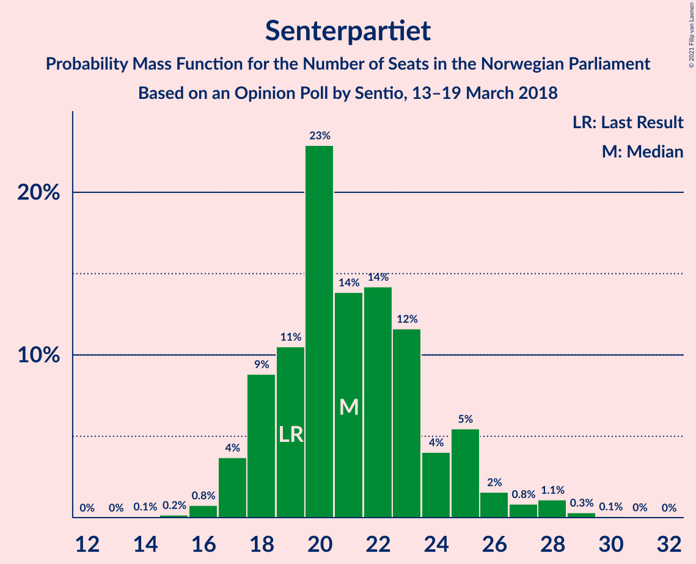

| Number of Seats | Probability | Accumulated | Special Marks |
|:---------------:|:-----------:|:-----------:|:-------------:|
| 14 | 0.1% | 100% |  |
| 15 | 0.2% | 99.9% |  |
| 16 | 0.8% | 99.8% |  |
| 17 | 4% | 99.0% |  |
| 18 | 9% | 95% |  |
| 19 | 11% | 86% | Last Result |
| 20 | 23% | 76% |  |
| 21 | 14% | 53% | Median |
| 22 | 14% | 39% |  |
| 23 | 12% | 25% |  |
| 24 | 4% | 13% |  |
| 25 | 5% | 9% |  |
| 26 | 2% | 4% |  |
| 27 | 0.8% | 2% |  |
| 28 | 1.1% | 2% |  |
| 29 | 0.3% | 0.4% |  |
| 30 | 0.1% | 0.1% |  |
| 31 | 0% | 0% |  |

### Sosialistisk Venstreparti

*For a full overview of the results for this party, see the [Sosialistisk Venstreparti](party-sosialistiskvenstreparti.html) page.*

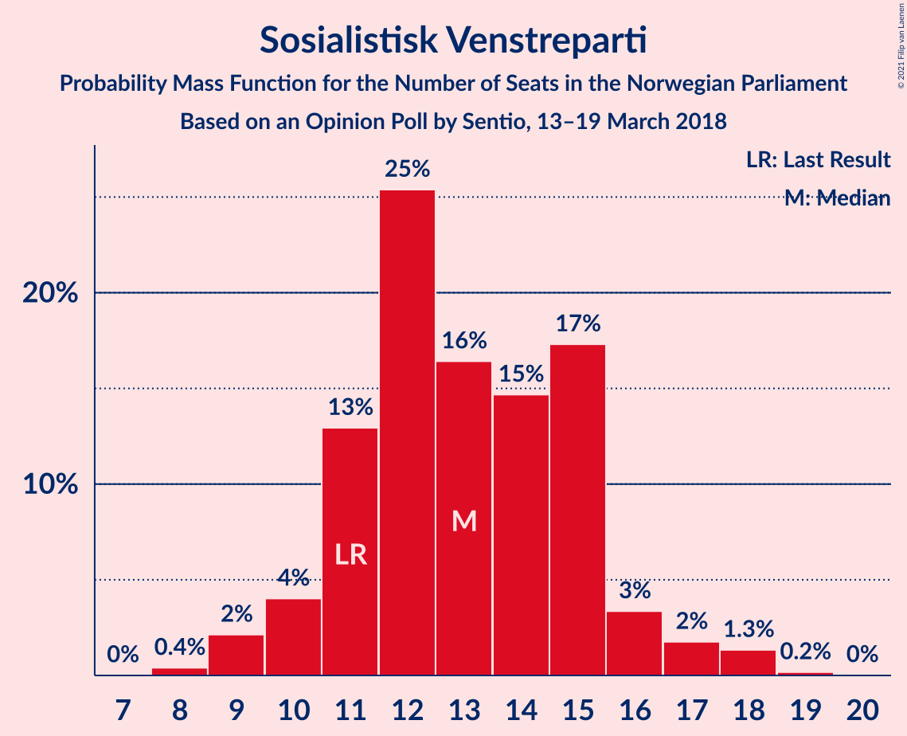

| Number of Seats | Probability | Accumulated | Special Marks |
|:---------------:|:-----------:|:-----------:|:-------------:|
| 8 | 0.4% | 100% |  |
| 9 | 2% | 99.6% |  |
| 10 | 4% | 97% |  |
| 11 | 13% | 93% | Last Result |
| 12 | 25% | 80% |  |
| 13 | 16% | 55% | Median |
| 14 | 15% | 39% |  |
| 15 | 17% | 24% |  |
| 16 | 3% | 7% |  |
| 17 | 2% | 3% |  |
| 18 | 1.3% | 2% |  |
| 19 | 0.2% | 0.2% |  |
| 20 | 0% | 0% |  |

### Kristelig Folkeparti

*For a full overview of the results for this party, see the [Kristelig Folkeparti](party-kristeligfolkeparti.html) page.*

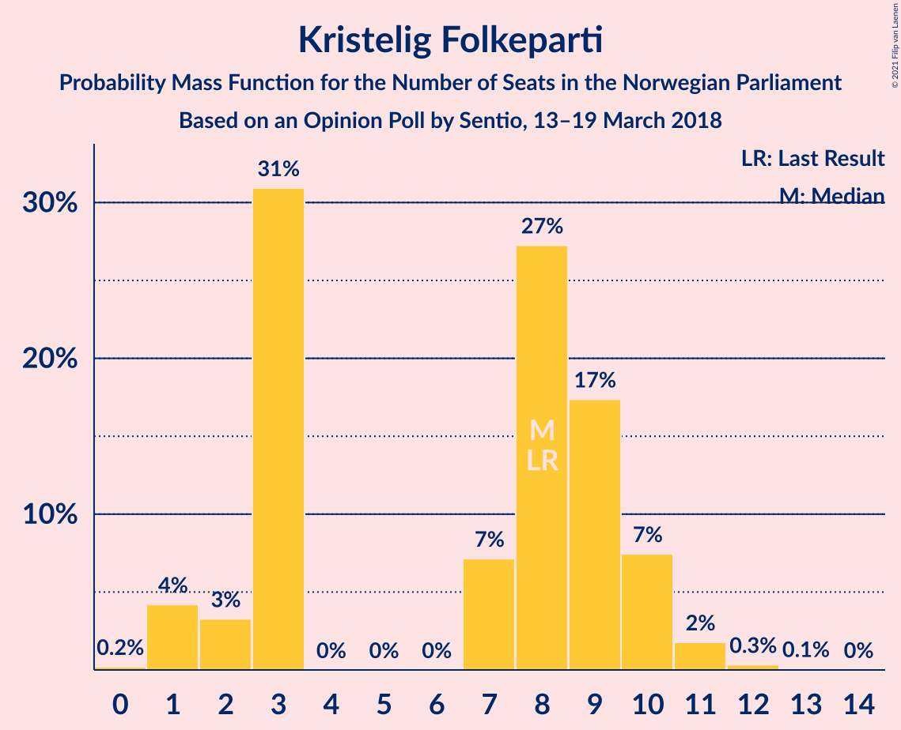

| Number of Seats | Probability | Accumulated | Special Marks |
|:---------------:|:-----------:|:-----------:|:-------------:|
| 0 | 0.2% | 100% |  |
| 1 | 4% | 99.8% |  |
| 2 | 3% | 96% |  |
| 3 | 31% | 92% |  |
| 4 | 0% | 61% |  |
| 5 | 0% | 61% |  |
| 6 | 0% | 61% |  |
| 7 | 7% | 61% |  |
| 8 | 27% | 54% | Last Result, Median |
| 9 | 17% | 27% |  |
| 10 | 7% | 10% |  |
| 11 | 2% | 2% |  |
| 12 | 0.3% | 0.4% |  |
| 13 | 0.1% | 0.1% |  |
| 14 | 0% | 0% |  |

### Rødt

*For a full overview of the results for this party, see the [Rødt](party-rødt.html) page.*

| Number of Seats | Probability | Accumulated | Special Marks |
|:---------------:|:-----------:|:-----------:|:-------------:|
| 1 | 3% | 100% | Last Result |
| 2 | 51% | 97% | Median |
| 3 | 0% | 46% |  |
| 4 | 0% | 46% |  |
| 5 | 0% | 46% |  |
| 6 | 0.1% | 46% |  |
| 7 | 7% | 46% |  |
| 8 | 26% | 39% |  |
| 9 | 8% | 13% |  |
| 10 | 4% | 5% |  |
| 11 | 1.3% | 2% |  |
| 12 | 0.3% | 0.4% |  |
| 13 | 0% | 0% |  |

### Venstre

*For a full overview of the results for this party, see the [Venstre](party-venstre.html) page.*

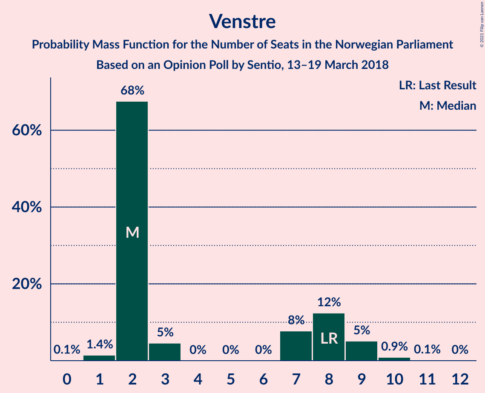

| Number of Seats | Probability | Accumulated | Special Marks |
|:---------------:|:-----------:|:-----------:|:-------------:|
| 0 | 0.1% | 100% |  |
| 1 | 1.4% | 99.9% |  |
| 2 | 68% | 98% | Median |
| 3 | 5% | 31% |  |
| 4 | 0% | 26% |  |
| 5 | 0% | 26% |  |
| 6 | 0% | 26% |  |
| 7 | 8% | 26% |  |
| 8 | 12% | 19% | Last Result |
| 9 | 5% | 6% |  |
| 10 | 0.9% | 1.1% |  |
| 11 | 0.1% | 0.2% |  |
| 12 | 0% | 0% |  |

### Miljøpartiet De Grønne

*For a full overview of the results for this party, see the [Miljøpartiet De Grønne](party-miljøpartietdegrønne.html) page.*

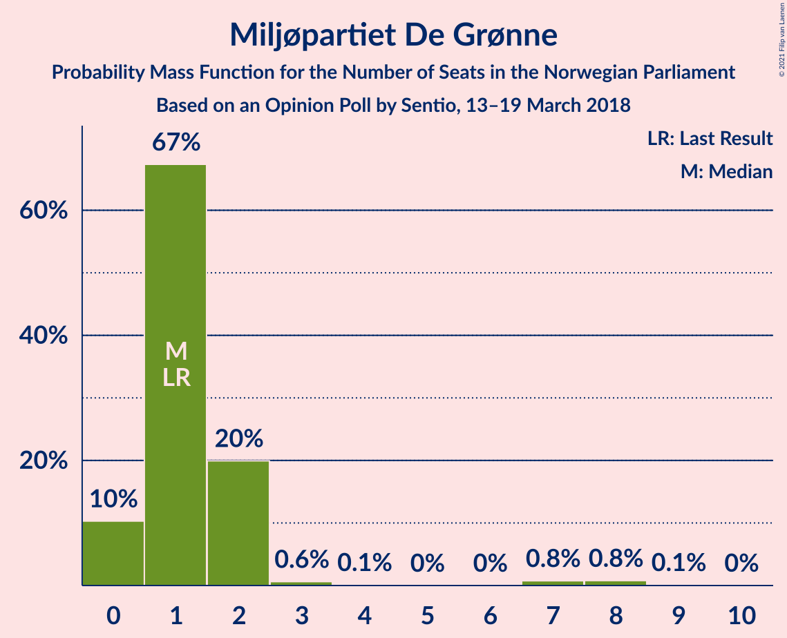

| Number of Seats | Probability | Accumulated | Special Marks |
|:---------------:|:-----------:|:-----------:|:-------------:|
| 0 | 10% | 100% |  |
| 1 | 67% | 90% | Last Result, Median |
| 2 | 20% | 22% |  |
| 3 | 0.6% | 2% |  |
| 4 | 0.1% | 2% |  |
| 5 | 0% | 2% |  |
| 6 | 0% | 2% |  |
| 7 | 0.8% | 2% |  |
| 8 | 0.8% | 0.9% |  |
| 9 | 0.1% | 0.1% |  |
| 10 | 0% | 0% |  |

## Coalitions

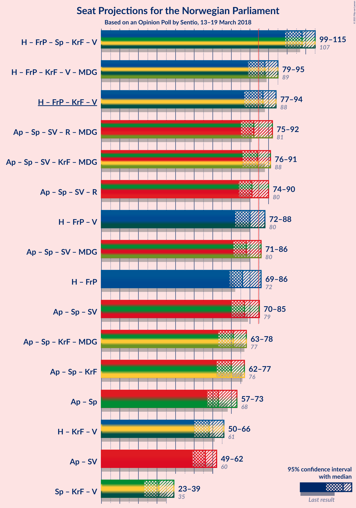

### Confidence Intervals

| Coalition | Last Result | Median | Majority? | 80% Confidence Interval | 90% Confidence Interval | 95% Confidence Interval | 99% Confidence Interval |
|:---------:|:-----------:|:------:|:---------:|:-----------------------:|:-----------------------:|:-----------------------:|:-----------------------:|
| Høyre – Fremskrittspartiet – Senterpartiet – Kristelig Folkeparti – Venstre | 107 | 108 | 100% | 102–113 | 100–114 | 99–115 | 97–118 |
| Høyre – Fremskrittspartiet – Kristelig Folkeparti – Venstre – Miljøpartiet De Grønne | 89 | 88 | 75% | 81–93 | 79–95 | 79–95 | 78–97 |
| Høyre – Fremskrittspartiet – Kristelig Folkeparti – Venstre | 88 | 87 | 69% | 80–92 | 78–93 | 77–94 | 76–96 |
| Arbeiderpartiet – Senterpartiet – Sosialistisk Venstreparti – Rødt – Miljøpartiet De Grønne | 81 | 82 | 31% | 77–89 | 76–91 | 75–92 | 73–93 |
| Arbeiderpartiet – Senterpartiet – Sosialistisk Venstreparti – Kristelig Folkeparti – Miljøpartiet De Grønne | 88 | 84 | 46% | 79–89 | 78–90 | 76–91 | 74–94 |
| Arbeiderpartiet – Senterpartiet – Sosialistisk Venstreparti – Rødt | 80 | 81 | 25% | 76–88 | 74–90 | 74–90 | 72–91 |
| Høyre – Fremskrittspartiet – Venstre | 80 | 80 | 14% | 75–86 | 73–86 | 72–88 | 70–91 |
| Arbeiderpartiet – Senterpartiet – Sosialistisk Venstreparti – Miljøpartiet De Grønne | 80 | 78 | 5% | 73–83 | 72–84 | 71–86 | 69–89 |
| Høyre – Fremskrittspartiet | 72 | 76 | 3% | 71–82 | 69–84 | 69–86 | 67–87 |
| Arbeiderpartiet – Senterpartiet – Sosialistisk Venstreparti | 79 | 77 | 4% | 72–82 | 71–83 | 70–85 | 67–87 |
| Arbeiderpartiet – Senterpartiet – Kristelig Folkeparti – Miljøpartiet De Grønne | 77 | 71 | 0% | 66–75 | 65–77 | 63–78 | 61–82 |
| Arbeiderpartiet – Senterpartiet – Kristelig Folkeparti | 76 | 70 | 0% | 65–74 | 64–76 | 62–77 | 60–81 |
| Arbeiderpartiet – Senterpartiet | 68 | 63 | 0% | 59–68 | 58–71 | 57–73 | 55–74 |
| Høyre – Kristelig Folkeparti – Venstre | 61 | 58 | 0% | 52–63 | 50–65 | 50–66 | 48–68 |
| Arbeiderpartiet – Sosialistisk Venstreparti | 60 | 56 | 0% | 51–60 | 50–61 | 49–62 | 46–64 |
| Senterpartiet – Kristelig Folkeparti – Venstre | 35 | 31 | 0% | 26–36 | 24–38 | 23–39 | 22–41 |

### Høyre – Fremskrittspartiet – Senterpartiet – Kristelig Folkeparti – Venstre

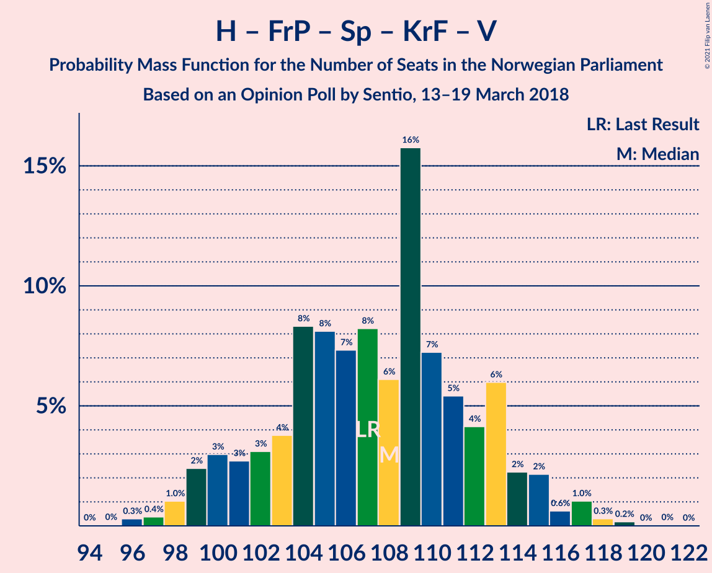

| Number of Seats | Probability | Accumulated | Special Marks |
|:---------------:|:-----------:|:-----------:|:-------------:|
| 95 | 0% | 100% |  |
| 96 | 0.3% | 99.9% |  |
| 97 | 0.4% | 99.6% |  |
| 98 | 1.0% | 99.2% |  |
| 99 | 2% | 98% |  |
| 100 | 3% | 96% |  |
| 101 | 3% | 93% |  |
| 102 | 3% | 90% |  |
| 103 | 4% | 87% |  |
| 104 | 8% | 83% |  |
| 105 | 8% | 75% |  |
| 106 | 7% | 67% |  |
| 107 | 8% | 59% | Last Result, Median |
| 108 | 6% | 51% |  |
| 109 | 16% | 45% |  |
| 110 | 7% | 29% |  |
| 111 | 5% | 22% |  |
| 112 | 4% | 17% |  |
| 113 | 6% | 13% |  |
| 114 | 2% | 7% |  |
| 115 | 2% | 4% |  |
| 116 | 0.6% | 2% |  |
| 117 | 1.0% | 2% |  |
| 118 | 0.3% | 0.5% |  |
| 119 | 0.2% | 0.2% |  |
| 120 | 0% | 0.1% |  |
| 121 | 0% | 0.1% |  |
| 122 | 0% | 0% |  |

### Høyre – Fremskrittspartiet – Kristelig Folkeparti – Venstre – Miljøpartiet De Grønne

| Number of Seats | Probability | Accumulated | Special Marks |
|:---------------:|:-----------:|:-----------:|:-------------:|
| 75 | 0.1% | 100% |  |
| 76 | 0.1% | 99.9% |  |
| 77 | 0.2% | 99.8% |  |
| 78 | 0.8% | 99.6% |  |
| 79 | 5% | 98.8% |  |
| 80 | 3% | 94% |  |
| 81 | 3% | 91% |  |
| 82 | 5% | 88% |  |
| 83 | 5% | 83% |  |
| 84 | 3% | 78% |  |
| 85 | 5% | 75% | Majority |
| 86 | 5% | 69% |  |
| 87 | 9% | 65% | Median |
| 88 | 10% | 56% |  |
| 89 | 5% | 46% | Last Result |
| 90 | 16% | 40% |  |
| 91 | 5% | 24% |  |
| 92 | 6% | 19% |  |
| 93 | 5% | 13% |  |
| 94 | 3% | 9% |  |
| 95 | 4% | 5% |  |
| 96 | 0.8% | 2% |  |
| 97 | 0.7% | 1.1% |  |
| 98 | 0.2% | 0.4% |  |
| 99 | 0.1% | 0.2% |  |
| 100 | 0% | 0.1% |  |
| 101 | 0% | 0% |  |

### Høyre – Fremskrittspartiet – Kristelig Folkeparti – Venstre

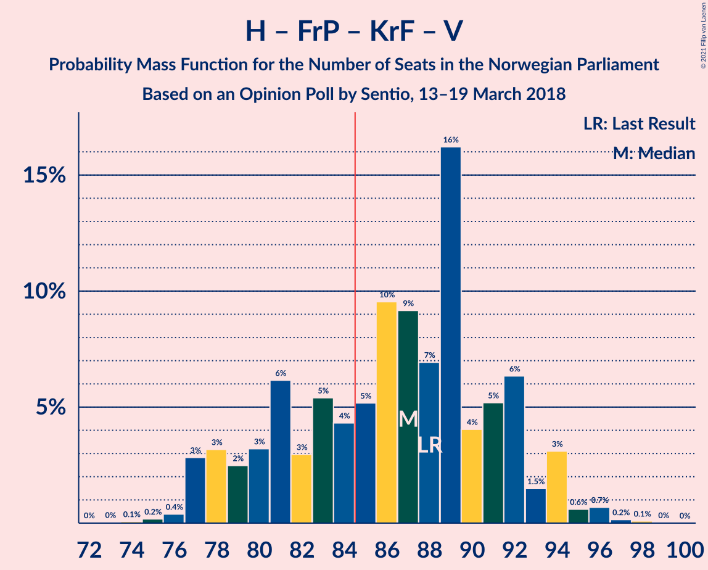

| Number of Seats | Probability | Accumulated | Special Marks |
|:---------------:|:-----------:|:-----------:|:-------------:|
| 73 | 0% | 100% |  |
| 74 | 0.1% | 99.9% |  |
| 75 | 0.2% | 99.9% |  |
| 76 | 0.4% | 99.7% |  |
| 77 | 3% | 99.3% |  |
| 78 | 3% | 96% |  |
| 79 | 2% | 93% |  |
| 80 | 3% | 91% |  |
| 81 | 6% | 88% |  |
| 82 | 3% | 81% |  |
| 83 | 5% | 78% |  |
| 84 | 4% | 73% |  |
| 85 | 5% | 69% | Majority |
| 86 | 10% | 64% | Median |
| 87 | 9% | 54% |  |
| 88 | 7% | 45% | Last Result |
| 89 | 16% | 38% |  |
| 90 | 4% | 22% |  |
| 91 | 5% | 18% |  |
| 92 | 6% | 13% |  |
| 93 | 1.5% | 6% |  |
| 94 | 3% | 5% |  |
| 95 | 0.6% | 2% |  |
| 96 | 0.7% | 1.0% |  |
| 97 | 0.2% | 0.3% |  |
| 98 | 0.1% | 0.1% |  |
| 99 | 0% | 0% |  |

### Arbeiderpartiet – Senterpartiet – Sosialistisk Venstreparti – Rødt – Miljøpartiet De Grønne

| Number of Seats | Probability | Accumulated | Special Marks |
|:---------------:|:-----------:|:-----------:|:-------------:|
| 71 | 0.1% | 100% |  |
| 72 | 0.2% | 99.9% |  |
| 73 | 0.7% | 99.7% |  |
| 74 | 0.6% | 99.0% |  |
| 75 | 3% | 98% |  |
| 76 | 1.5% | 95% |  |
| 77 | 6% | 94% |  |
| 78 | 5% | 87% |  |
| 79 | 4% | 82% |  |
| 80 | 16% | 78% | Median |
| 81 | 7% | 62% | Last Result |
| 82 | 9% | 55% |  |
| 83 | 10% | 46% |  |
| 84 | 5% | 36% |  |
| 85 | 4% | 31% | Majority |
| 86 | 5% | 27% |  |
| 87 | 3% | 22% |  |
| 88 | 6% | 19% |  |
| 89 | 3% | 12% |  |
| 90 | 2% | 9% |  |
| 91 | 3% | 7% |  |
| 92 | 3% | 4% |  |
| 93 | 0.4% | 0.7% |  |
| 94 | 0.2% | 0.3% |  |
| 95 | 0.1% | 0.1% |  |
| 96 | 0% | 0.1% |  |
| 97 | 0% | 0% |  |

### Arbeiderpartiet – Senterpartiet – Sosialistisk Venstreparti – Kristelig Folkeparti – Miljøpartiet De Grønne

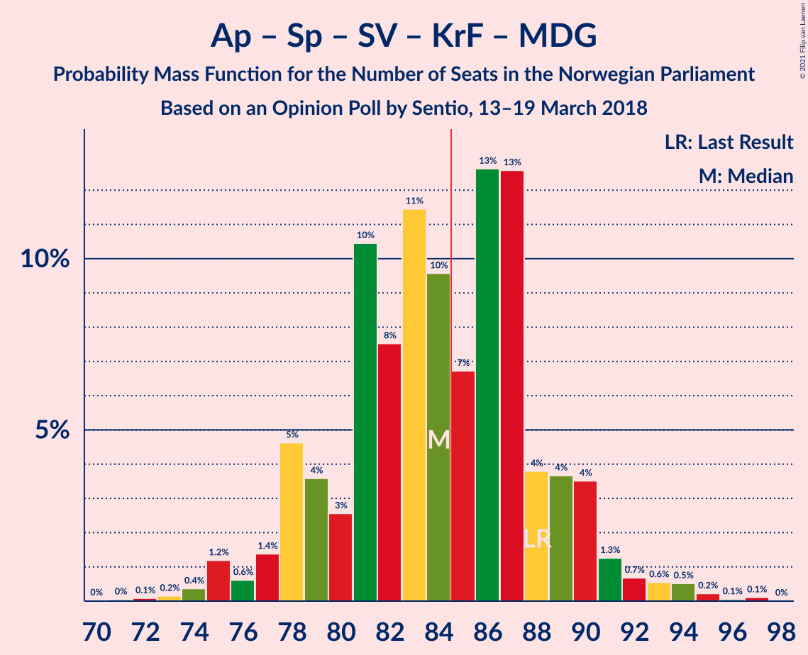

| Number of Seats | Probability | Accumulated | Special Marks |
|:---------------:|:-----------:|:-----------:|:-------------:|
| 71 | 0% | 100% |  |
| 72 | 0.1% | 99.9% |  |
| 73 | 0.2% | 99.8% |  |
| 74 | 0.4% | 99.7% |  |
| 75 | 1.2% | 99.3% |  |
| 76 | 0.6% | 98% |  |
| 77 | 1.4% | 97% |  |
| 78 | 5% | 96% |  |
| 79 | 4% | 91% |  |
| 80 | 3% | 88% |  |
| 81 | 10% | 85% |  |
| 82 | 8% | 75% |  |
| 83 | 11% | 67% |  |
| 84 | 10% | 56% |  |
| 85 | 7% | 46% | Majority |
| 86 | 13% | 40% | Median |
| 87 | 13% | 27% |  |
| 88 | 4% | 14% | Last Result |
| 89 | 4% | 11% |  |
| 90 | 4% | 7% |  |
| 91 | 1.3% | 3% |  |
| 92 | 0.7% | 2% |  |
| 93 | 0.6% | 1.5% |  |
| 94 | 0.5% | 0.9% |  |
| 95 | 0.2% | 0.4% |  |
| 96 | 0.1% | 0.2% |  |
| 97 | 0.1% | 0.1% |  |
| 98 | 0% | 0% |  |

### Arbeiderpartiet – Senterpartiet – Sosialistisk Venstreparti – Rødt

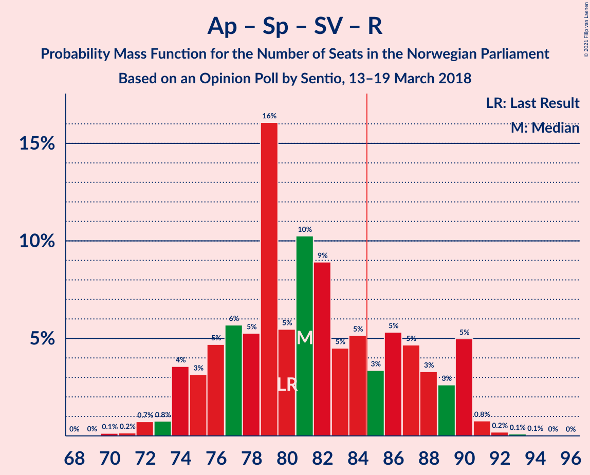

| Number of Seats | Probability | Accumulated | Special Marks |
|:---------------:|:-----------:|:-----------:|:-------------:|
| 69 | 0% | 100% |  |
| 70 | 0.1% | 99.9% |  |
| 71 | 0.2% | 99.8% |  |
| 72 | 0.7% | 99.6% |  |
| 73 | 0.8% | 98.9% |  |
| 74 | 4% | 98% |  |
| 75 | 3% | 95% |  |
| 76 | 5% | 91% |  |
| 77 | 6% | 87% |  |
| 78 | 5% | 81% |  |
| 79 | 16% | 76% | Median |
| 80 | 5% | 60% | Last Result |
| 81 | 10% | 54% |  |
| 82 | 9% | 44% |  |
| 83 | 5% | 35% |  |
| 84 | 5% | 31% |  |
| 85 | 3% | 25% | Majority |
| 86 | 5% | 22% |  |
| 87 | 5% | 17% |  |
| 88 | 3% | 12% |  |
| 89 | 3% | 9% |  |
| 90 | 5% | 6% |  |
| 91 | 0.8% | 1.2% |  |
| 92 | 0.2% | 0.4% |  |
| 93 | 0.1% | 0.2% |  |
| 94 | 0.1% | 0.1% |  |
| 95 | 0% | 0% |  |

### Høyre – Fremskrittspartiet – Venstre

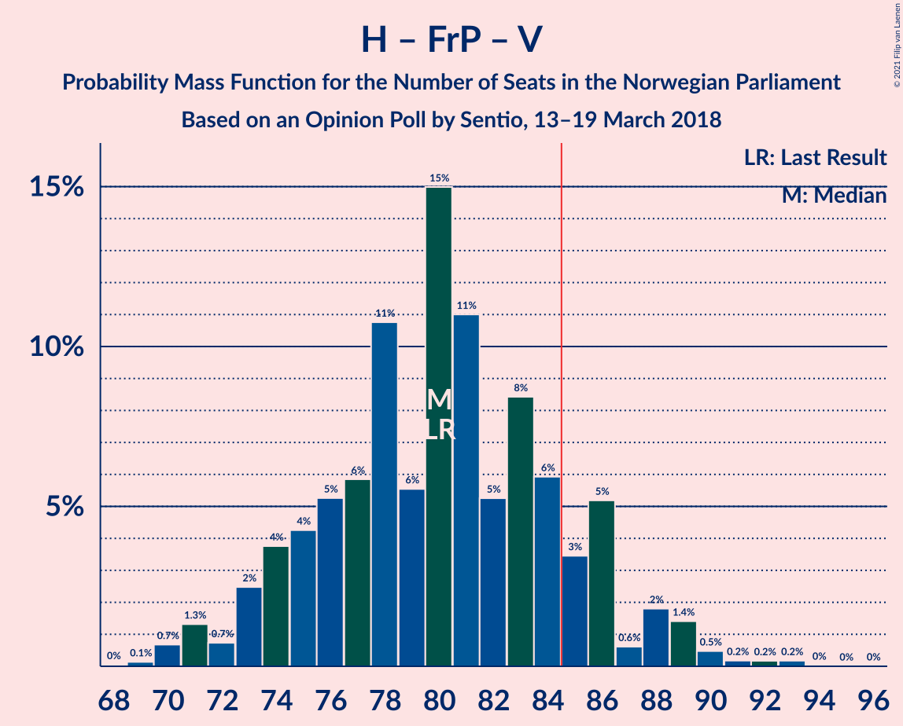

| Number of Seats | Probability | Accumulated | Special Marks |
|:---------------:|:-----------:|:-----------:|:-------------:|
| 68 | 0% | 100% |  |
| 69 | 0.1% | 99.9% |  |
| 70 | 0.7% | 99.8% |  |
| 71 | 1.3% | 99.1% |  |
| 72 | 0.7% | 98% |  |
| 73 | 2% | 97% |  |
| 74 | 4% | 95% |  |
| 75 | 4% | 91% |  |
| 76 | 5% | 87% |  |
| 77 | 6% | 81% |  |
| 78 | 11% | 75% | Median |
| 79 | 6% | 65% |  |
| 80 | 15% | 59% | Last Result |
| 81 | 11% | 44% |  |
| 82 | 5% | 33% |  |
| 83 | 8% | 28% |  |
| 84 | 6% | 19% |  |
| 85 | 3% | 14% | Majority |
| 86 | 5% | 10% |  |
| 87 | 0.6% | 5% |  |
| 88 | 2% | 4% |  |
| 89 | 1.4% | 2% |  |
| 90 | 0.5% | 1.1% |  |
| 91 | 0.2% | 0.6% |  |
| 92 | 0.2% | 0.4% |  |
| 93 | 0.2% | 0.2% |  |
| 94 | 0% | 0.1% |  |
| 95 | 0% | 0% |  |

### Arbeiderpartiet – Senterpartiet – Sosialistisk Venstreparti – Miljøpartiet De Grønne

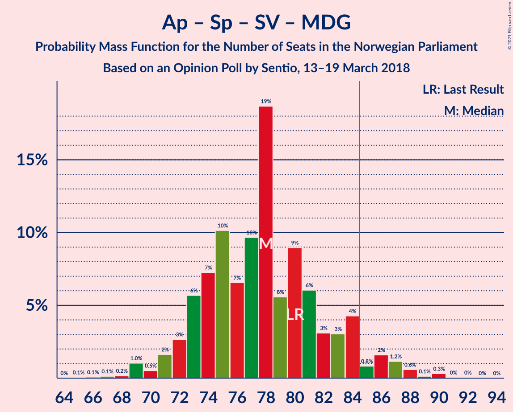

| Number of Seats | Probability | Accumulated | Special Marks |
|:---------------:|:-----------:|:-----------:|:-------------:|
| 65 | 0.1% | 100% |  |
| 66 | 0.1% | 99.9% |  |
| 67 | 0.1% | 99.9% |  |
| 68 | 0.2% | 99.7% |  |
| 69 | 1.0% | 99.6% |  |
| 70 | 0.5% | 98.5% |  |
| 71 | 2% | 98% |  |
| 72 | 3% | 96% |  |
| 73 | 6% | 94% |  |
| 74 | 7% | 88% |  |
| 75 | 10% | 81% |  |
| 76 | 7% | 71% |  |
| 77 | 10% | 64% |  |
| 78 | 19% | 54% | Median |
| 79 | 6% | 36% |  |
| 80 | 9% | 30% | Last Result |
| 81 | 6% | 21% |  |
| 82 | 3% | 15% |  |
| 83 | 3% | 12% |  |
| 84 | 4% | 9% |  |
| 85 | 0.8% | 5% | Majority |
| 86 | 2% | 4% |  |
| 87 | 1.2% | 2% |  |
| 88 | 0.6% | 1.1% |  |
| 89 | 0.1% | 0.5% |  |
| 90 | 0.3% | 0.4% |  |
| 91 | 0% | 0.1% |  |
| 92 | 0% | 0.1% |  |
| 93 | 0% | 0% |  |

### Høyre – Fremskrittspartiet

| Number of Seats | Probability | Accumulated | Special Marks |
|:---------------:|:-----------:|:-----------:|:-------------:|
| 64 | 0.1% | 100% |  |
| 65 | 0.2% | 99.9% |  |
| 66 | 0.2% | 99.8% |  |
| 67 | 0.3% | 99.6% |  |
| 68 | 2% | 99.3% |  |
| 69 | 3% | 98% |  |
| 70 | 1.5% | 95% |  |
| 71 | 4% | 93% |  |
| 72 | 7% | 90% | Last Result |
| 73 | 6% | 83% |  |
| 74 | 7% | 76% |  |
| 75 | 9% | 70% |  |
| 76 | 12% | 60% | Median |
| 77 | 7% | 48% |  |
| 78 | 11% | 41% |  |
| 79 | 11% | 30% |  |
| 80 | 3% | 18% |  |
| 81 | 4% | 15% |  |
| 82 | 4% | 11% |  |
| 83 | 1.3% | 7% |  |
| 84 | 3% | 6% |  |
| 85 | 0.2% | 3% | Majority |
| 86 | 0.9% | 3% |  |
| 87 | 1.4% | 2% |  |
| 88 | 0.1% | 0.3% |  |
| 89 | 0.1% | 0.3% |  |
| 90 | 0.1% | 0.1% |  |
| 91 | 0% | 0% |  |

### Arbeiderpartiet – Senterpartiet – Sosialistisk Venstreparti

| Number of Seats | Probability | Accumulated | Special Marks |
|:---------------:|:-----------:|:-----------:|:-------------:|
| 64 | 0% | 100% |  |
| 65 | 0.1% | 99.9% |  |
| 66 | 0.2% | 99.8% |  |
| 67 | 0.5% | 99.7% |  |
| 68 | 0.8% | 99.2% |  |
| 69 | 0.6% | 98% |  |
| 70 | 1.3% | 98% |  |
| 71 | 3% | 96% |  |
| 72 | 7% | 93% |  |
| 73 | 8% | 86% |  |
| 74 | 8% | 78% |  |
| 75 | 8% | 70% |  |
| 76 | 10% | 61% |  |
| 77 | 16% | 52% | Median |
| 78 | 7% | 35% |  |
| 79 | 8% | 28% | Last Result |
| 80 | 5% | 20% |  |
| 81 | 3% | 14% |  |
| 82 | 5% | 11% |  |
| 83 | 2% | 6% |  |
| 84 | 0.6% | 4% |  |
| 85 | 2% | 4% | Majority |
| 86 | 1.0% | 2% |  |
| 87 | 0.5% | 1.0% |  |
| 88 | 0.2% | 0.5% |  |
| 89 | 0.2% | 0.3% |  |
| 90 | 0.1% | 0.1% |  |
| 91 | 0% | 0% |  |

### Arbeiderpartiet – Senterpartiet – Kristelig Folkeparti – Miljøpartiet De Grønne

| Number of Seats | Probability | Accumulated | Special Marks |
|:---------------:|:-----------:|:-----------:|:-------------:|
| 58 | 0% | 100% |  |
| 59 | 0.1% | 99.9% |  |
| 60 | 0.1% | 99.9% |  |
| 61 | 0.5% | 99.7% |  |
| 62 | 0.6% | 99.2% |  |
| 63 | 2% | 98.6% |  |
| 64 | 1.4% | 97% |  |
| 65 | 2% | 96% |  |
| 66 | 4% | 94% |  |
| 67 | 5% | 90% |  |
| 68 | 7% | 85% |  |
| 69 | 11% | 78% |  |
| 70 | 7% | 67% |  |
| 71 | 17% | 60% |  |
| 72 | 12% | 43% |  |
| 73 | 6% | 31% | Median |
| 74 | 6% | 25% |  |
| 75 | 11% | 19% |  |
| 76 | 2% | 9% |  |
| 77 | 4% | 7% | Last Result |
| 78 | 0.9% | 3% |  |
| 79 | 1.0% | 2% |  |
| 80 | 0.3% | 1.3% |  |
| 81 | 0.2% | 1.0% |  |
| 82 | 0.5% | 0.8% |  |
| 83 | 0.2% | 0.3% |  |
| 84 | 0.1% | 0.1% |  |
| 85 | 0% | 0% | Majority |

### Arbeiderpartiet – Senterpartiet – Kristelig Folkeparti

| Number of Seats | Probability | Accumulated | Special Marks |
|:---------------:|:-----------:|:-----------:|:-------------:|
| 57 | 0% | 100% |  |
| 58 | 0.1% | 99.9% |  |
| 59 | 0.1% | 99.8% |  |
| 60 | 0.7% | 99.7% |  |
| 61 | 0.4% | 99.0% |  |
| 62 | 2% | 98.5% |  |
| 63 | 1.3% | 97% |  |
| 64 | 2% | 95% |  |
| 65 | 5% | 94% |  |
| 66 | 5% | 89% |  |
| 67 | 7% | 84% |  |
| 68 | 10% | 77% |  |
| 69 | 11% | 67% |  |
| 70 | 19% | 57% |  |
| 71 | 8% | 38% |  |
| 72 | 8% | 30% | Median |
| 73 | 6% | 22% |  |
| 74 | 8% | 16% |  |
| 75 | 2% | 8% |  |
| 76 | 4% | 6% | Last Result |
| 77 | 0.6% | 3% |  |
| 78 | 0.6% | 2% |  |
| 79 | 0.4% | 1.3% |  |
| 80 | 0.2% | 0.9% |  |
| 81 | 0.4% | 0.7% |  |
| 82 | 0.2% | 0.2% |  |
| 83 | 0.1% | 0.1% |  |
| 84 | 0% | 0% |  |

### Arbeiderpartiet – Senterpartiet

| Number of Seats | Probability | Accumulated | Special Marks |
|:---------------:|:-----------:|:-----------:|:-------------:|
| 53 | 0% | 100% |  |
| 54 | 0.2% | 99.9% |  |
| 55 | 0.3% | 99.8% |  |
| 56 | 0.6% | 99.5% |  |
| 57 | 2% | 98.8% |  |
| 58 | 2% | 97% |  |
| 59 | 6% | 95% |  |
| 60 | 5% | 89% |  |
| 61 | 10% | 83% |  |
| 62 | 17% | 73% |  |
| 63 | 12% | 56% |  |
| 64 | 6% | 44% | Median |
| 65 | 13% | 39% |  |
| 66 | 6% | 25% |  |
| 67 | 8% | 19% |  |
| 68 | 2% | 11% | Last Result |
| 69 | 3% | 9% |  |
| 70 | 1.1% | 6% |  |
| 71 | 2% | 5% |  |
| 72 | 0.7% | 3% |  |
| 73 | 2% | 3% |  |
| 74 | 0.5% | 0.7% |  |
| 75 | 0.2% | 0.3% |  |
| 76 | 0.1% | 0.1% |  |
| 77 | 0% | 0% |  |

### Høyre – Kristelig Folkeparti – Venstre

| Number of Seats | Probability | Accumulated | Special Marks |
|:---------------:|:-----------:|:-----------:|:-------------:|
| 45 | 0.1% | 100% |  |
| 46 | 0.2% | 99.9% |  |
| 47 | 0.2% | 99.8% |  |
| 48 | 0.2% | 99.5% |  |
| 49 | 1.3% | 99.3% |  |
| 50 | 4% | 98% |  |
| 51 | 3% | 94% |  |
| 52 | 4% | 91% |  |
| 53 | 6% | 87% |  |
| 54 | 6% | 81% |  |
| 55 | 6% | 75% |  |
| 56 | 6% | 69% |  |
| 57 | 11% | 64% |  |
| 58 | 9% | 53% | Median |
| 59 | 10% | 44% |  |
| 60 | 7% | 34% |  |
| 61 | 6% | 27% | Last Result |
| 62 | 7% | 21% |  |
| 63 | 6% | 14% |  |
| 64 | 2% | 8% |  |
| 65 | 3% | 6% |  |
| 66 | 2% | 4% |  |
| 67 | 0.7% | 1.4% |  |
| 68 | 0.4% | 0.8% |  |
| 69 | 0.2% | 0.3% |  |
| 70 | 0.1% | 0.2% |  |
| 71 | 0.1% | 0.1% |  |
| 72 | 0% | 0% |  |

### Arbeiderpartiet – Sosialistisk Venstreparti

| Number of Seats | Probability | Accumulated | Special Marks |
|:---------------:|:-----------:|:-----------:|:-------------:|
| 45 | 0.3% | 100% |  |
| 46 | 0.1% | 99.6% |  |
| 47 | 0.5% | 99.5% |  |
| 48 | 1.4% | 98.9% |  |
| 49 | 2% | 98% |  |
| 50 | 4% | 96% |  |
| 51 | 3% | 92% |  |
| 52 | 6% | 88% |  |
| 53 | 10% | 82% |  |
| 54 | 8% | 73% |  |
| 55 | 10% | 65% |  |
| 56 | 10% | 54% | Median |
| 57 | 18% | 44% |  |
| 58 | 8% | 25% |  |
| 59 | 7% | 17% |  |
| 60 | 5% | 10% | Last Result |
| 61 | 2% | 5% |  |
| 62 | 2% | 3% |  |
| 63 | 0.6% | 1.2% |  |
| 64 | 0.3% | 0.6% |  |
| 65 | 0.2% | 0.3% |  |
| 66 | 0.1% | 0.1% |  |
| 67 | 0% | 0% |  |

### Senterpartiet – Kristelig Folkeparti – Venstre

| Number of Seats | Probability | Accumulated | Special Marks |
|:---------------:|:-----------:|:-----------:|:-------------:|
| 20 | 0.1% | 100% |  |
| 21 | 0.2% | 99.9% |  |
| 22 | 1.0% | 99.7% |  |
| 23 | 1.4% | 98.8% |  |
| 24 | 3% | 97% |  |
| 25 | 2% | 95% |  |
| 26 | 6% | 92% |  |
| 27 | 5% | 87% |  |
| 28 | 10% | 82% |  |
| 29 | 5% | 72% |  |
| 30 | 12% | 67% |  |
| 31 | 13% | 55% | Median |
| 32 | 10% | 42% |  |
| 33 | 7% | 32% |  |
| 34 | 8% | 25% |  |
| 35 | 4% | 17% | Last Result |
| 36 | 3% | 12% |  |
| 37 | 4% | 10% |  |
| 38 | 3% | 6% |  |
| 39 | 1.5% | 3% |  |
| 40 | 0.6% | 1.3% |  |
| 41 | 0.3% | 0.7% |  |
| 42 | 0.3% | 0.4% |  |
| 43 | 0.1% | 0.2% |  |
| 44 | 0% | 0.1% |  |
| 45 | 0% | 0% |  |

## Technical Information

### Opinion Poll

+ **Polling firm:** Sentio
+ **Commissioner(s):** —
+ **Fieldwork period:** 13–19 March 2018

### Calculations

+ **Sample size:** 710
+ **Simulations done:** 1,048,576
+ **Error estimate:** 2.00%

