# Opinion Poll by Norstat, 20–24 March 2018

<a href="#voting-intentions">Voting Intentions</a> | <a href="#seats">Seats</a> | <a href="#coalitions">Coalitions</a> | <a href="#technical-information">Technical Information</a>

## Voting Intentions

### Confidence Intervals

| Party | Last Result | Poll Result | 80% Confidence Interval | 90% Confidence Interval | 95% Confidence Interval | 99% Confidence Interval |
|:-----:|:-----------:|:-----------:|:-----------------------:|:-----------------------:|:-----------------------:|:-----------------------:|
| Høyre | 25.0% | 25.3% | 23.6–27.2% |23.1–27.7% |22.7–28.2% |21.9–29.1% |
| Arbeiderpartiet | 27.4% | 24.3% | 22.6–26.1% |22.1–26.7% |21.7–27.1% |20.9–28.0% |
| Fremskrittspartiet | 15.2% | 15.4% | 14.0–17.0% |13.6–17.4% |13.2–17.8% |12.6–18.6% |
| Senterpartiet | 10.3% | 11.0% | 9.8–12.4% |9.4–12.8% |9.2–13.2% |8.6–13.8% |
| Sosialistisk Venstreparti | 6.0% | 6.6% | 5.7–7.7% |5.4–8.1% |5.2–8.4% |4.8–8.9% |
| Kristelig Folkeparti | 4.2% | 4.8% | 4.0–5.8% |3.8–6.1% |3.6–6.4% |3.3–6.9% |
| Venstre | 4.4% | 4.3% | 3.6–5.3% |3.4–5.5% |3.2–5.8% |2.9–6.3% |
| Rødt | 2.4% | 4.0% | 3.3–4.9% |3.1–5.2% |2.9–5.4% |2.6–5.9% |
| Miljøpartiet De Grønne | 3.2% | 2.3% | 1.8–3.1% |1.6–3.3% |1.5–3.5% |1.3–3.9% |

*Note:* The poll result column reflects the actual value used in the calculations. Published results may vary slightly, and in addition be rounded to fewer digits.

## Seats

### Confidence Intervals

| Party | Last Result | Median | 80% Confidence Interval | 90% Confidence Interval | 95% Confidence Interval | 99% Confidence Interval |
|:-----:|:-----------:|:------:|:-----------------------:|:-----------------------:|:-----------------------:|:-----------------------:|
| <a href="#høyre">Høyre</a> | 45 | 45 | 42–49 |41–51 |41–51 |39–53 |
| <a href="#arbeiderpartiet">Arbeiderpartiet</a> | 49 | 44 | 41–47 |39–48 |39–49 |38–51 |
| <a href="#fremskrittspartiet">Fremskrittspartiet</a> | 27 | 28 | 25–30 |24–31 |24–32 |23–34 |
| <a href="#senterpartiet">Senterpartiet</a> | 19 | 19 | 17–22 |17–23 |16–23 |15–25 |
| <a href="#sosialistisk-venstreparti">Sosialistisk Venstreparti</a> | 11 | 12 | 10–14 |10–15 |9–15 |8–16 |
| <a href="#kristelig-folkeparti">Kristelig Folkeparti</a> | 8 | 8 | 3–10 |3–11 |3–11 |3–12 |
| <a href="#venstre">Venstre</a> | 8 | 8 | 2–9 |2–10 |2–10 |2–11 |
| <a href="#rødt">Rødt</a> | 1 | 7 | 2–8 |2–9 |2–10 |1–10 |
| <a href="#miljøpartiet-de-grønne">Miljøpartiet De Grønne</a> | 1 | 1 | 0–2 |0–2 |0–2 |0–3 |

### Høyre

*For a full overview of the results for this party, see the [Høyre](party-høyre.html) page.*

| Number of Seats | Probability | Accumulated | Special Marks |
|:---------------:|:-----------:|:-----------:|:-------------:|
| 36 | 0.1% | 100% |  |
| 37 | 0.1% | 99.9% |  |
| 38 | 0.2% | 99.8% |  |
| 39 | 0.9% | 99.6% |  |
| 40 | 1.1% | 98.7% |  |
| 41 | 3% | 98% |  |
| 42 | 7% | 95% |  |
| 43 | 13% | 88% |  |
| 44 | 16% | 75% |  |
| 45 | 13% | 59% | Last Result, Median |
| 46 | 10% | 47% |  |
| 47 | 11% | 37% |  |
| 48 | 6% | 25% |  |
| 49 | 11% | 20% |  |
| 50 | 2% | 9% |  |
| 51 | 5% | 7% |  |
| 52 | 1.4% | 2% |  |
| 53 | 0.3% | 0.7% |  |
| 54 | 0.3% | 0.4% |  |
| 55 | 0.1% | 0.1% |  |
| 56 | 0% | 0% |  |

### Arbeiderpartiet

*For a full overview of the results for this party, see the [Arbeiderpartiet](party-arbeiderpartiet.html) page.*

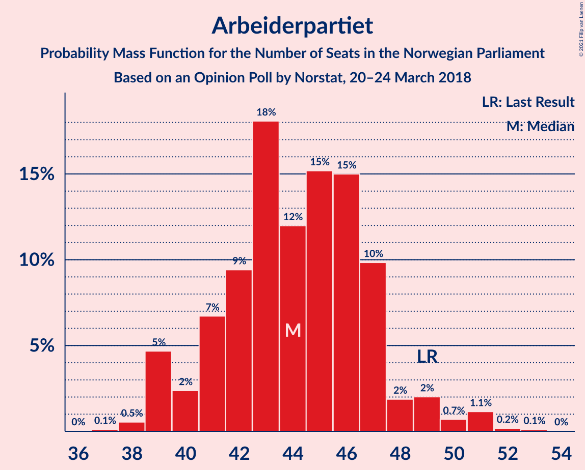

| Number of Seats | Probability | Accumulated | Special Marks |
|:---------------:|:-----------:|:-----------:|:-------------:|
| 37 | 0.1% | 100% |  |
| 38 | 0.5% | 99.9% |  |
| 39 | 5% | 99.3% |  |
| 40 | 2% | 95% |  |
| 41 | 7% | 92% |  |
| 42 | 9% | 86% |  |
| 43 | 18% | 76% |  |
| 44 | 12% | 58% | Median |
| 45 | 15% | 46% |  |
| 46 | 15% | 31% |  |
| 47 | 10% | 16% |  |
| 48 | 2% | 6% |  |
| 49 | 2% | 4% | Last Result |
| 50 | 0.7% | 2% |  |
| 51 | 1.1% | 1.5% |  |
| 52 | 0.2% | 0.3% |  |
| 53 | 0.1% | 0.1% |  |
| 54 | 0% | 0% |  |

### Fremskrittspartiet

*For a full overview of the results for this party, see the [Fremskrittspartiet](party-fremskrittspartiet.html) page.*

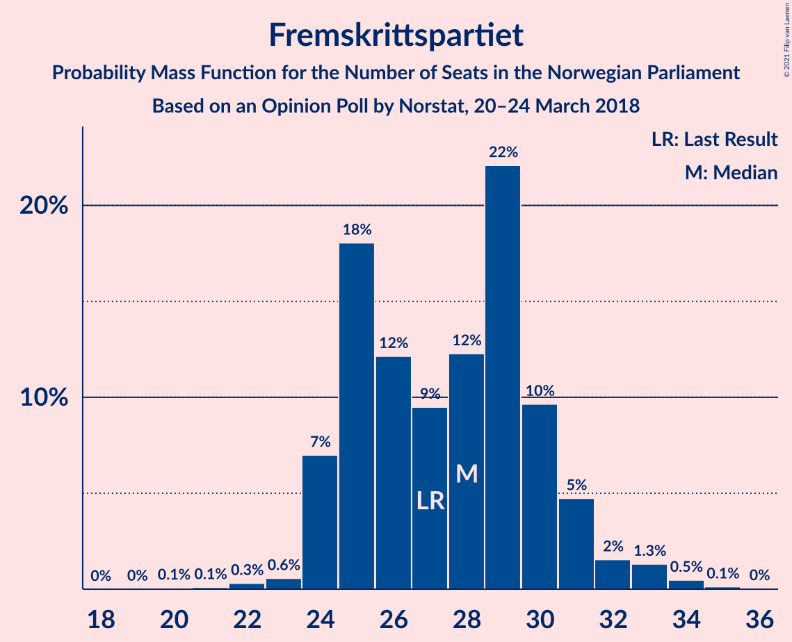

| Number of Seats | Probability | Accumulated | Special Marks |
|:---------------:|:-----------:|:-----------:|:-------------:|
| 20 | 0.1% | 100% |  |
| 21 | 0.1% | 99.9% |  |
| 22 | 0.3% | 99.8% |  |
| 23 | 0.6% | 99.5% |  |
| 24 | 7% | 98.9% |  |
| 25 | 18% | 92% |  |
| 26 | 12% | 74% |  |
| 27 | 9% | 62% | Last Result |
| 28 | 12% | 52% | Median |
| 29 | 22% | 40% |  |
| 30 | 10% | 18% |  |
| 31 | 5% | 8% |  |
| 32 | 2% | 4% |  |
| 33 | 1.3% | 2% |  |
| 34 | 0.5% | 0.7% |  |
| 35 | 0.1% | 0.2% |  |
| 36 | 0% | 0% |  |

### Senterpartiet

*For a full overview of the results for this party, see the [Senterpartiet](party-senterpartiet.html) page.*

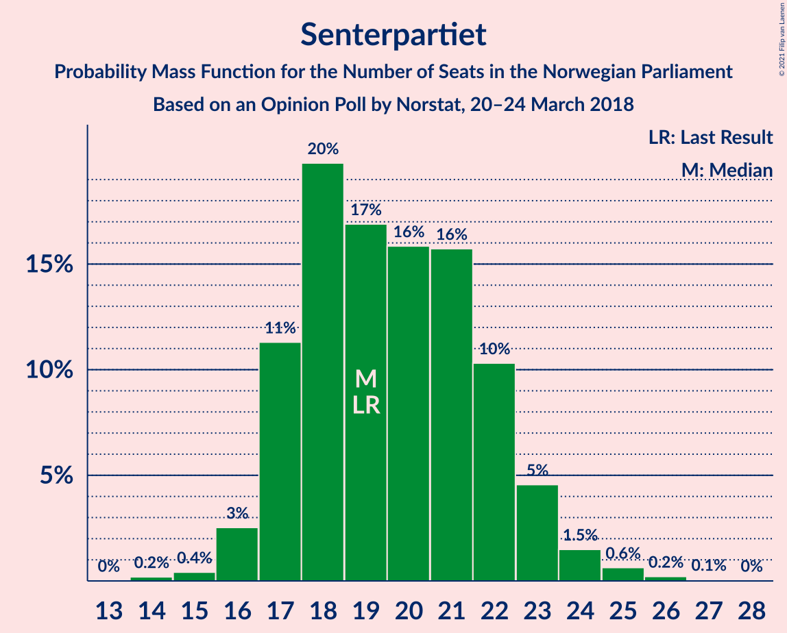

| Number of Seats | Probability | Accumulated | Special Marks |
|:---------------:|:-----------:|:-----------:|:-------------:|
| 14 | 0.2% | 100% |  |
| 15 | 0.4% | 99.8% |  |
| 16 | 3% | 99.4% |  |
| 17 | 11% | 97% |  |
| 18 | 20% | 86% |  |
| 19 | 17% | 66% | Last Result, Median |
| 20 | 16% | 49% |  |
| 21 | 16% | 33% |  |
| 22 | 10% | 17% |  |
| 23 | 5% | 7% |  |
| 24 | 1.5% | 2% |  |
| 25 | 0.6% | 0.9% |  |
| 26 | 0.2% | 0.3% |  |
| 27 | 0.1% | 0.1% |  |
| 28 | 0% | 0% |  |

### Sosialistisk Venstreparti

*For a full overview of the results for this party, see the [Sosialistisk Venstreparti](party-sosialistiskvenstreparti.html) page.*

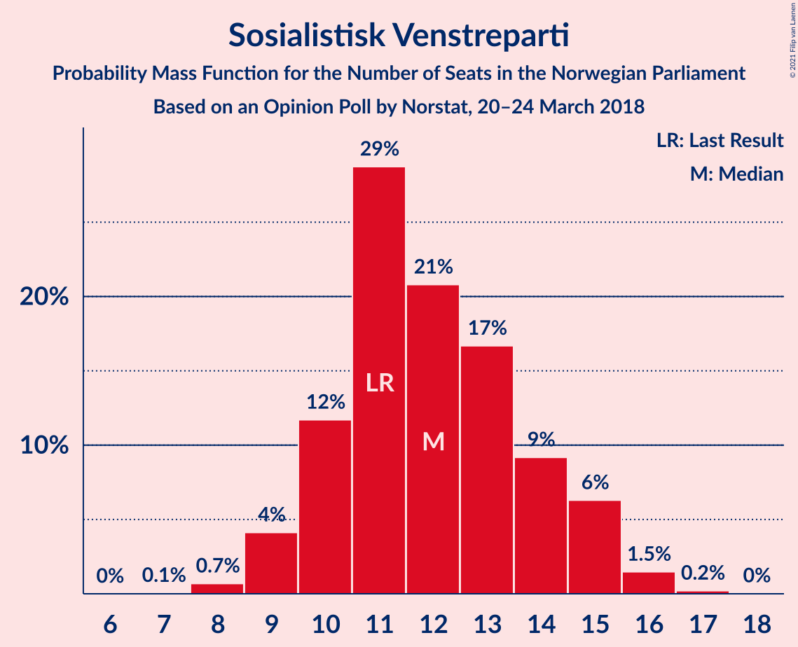

| Number of Seats | Probability | Accumulated | Special Marks |
|:---------------:|:-----------:|:-----------:|:-------------:|
| 7 | 0.1% | 100% |  |
| 8 | 0.7% | 99.9% |  |
| 9 | 4% | 99.2% |  |
| 10 | 12% | 95% |  |
| 11 | 29% | 83% | Last Result |
| 12 | 21% | 55% | Median |
| 13 | 17% | 34% |  |
| 14 | 9% | 17% |  |
| 15 | 6% | 8% |  |
| 16 | 1.5% | 2% |  |
| 17 | 0.2% | 0.2% |  |
| 18 | 0% | 0% |  |

### Kristelig Folkeparti

*For a full overview of the results for this party, see the [Kristelig Folkeparti](party-kristeligfolkeparti.html) page.*

| Number of Seats | Probability | Accumulated | Special Marks |
|:---------------:|:-----------:|:-----------:|:-------------:|
| 1 | 0.1% | 100% |  |
| 2 | 0.3% | 99.9% |  |
| 3 | 10% | 99.6% |  |
| 4 | 0% | 90% |  |
| 5 | 0% | 90% |  |
| 6 | 0% | 90% |  |
| 7 | 8% | 89% |  |
| 8 | 36% | 82% | Last Result, Median |
| 9 | 22% | 46% |  |
| 10 | 18% | 24% |  |
| 11 | 4% | 6% |  |
| 12 | 2% | 2% |  |
| 13 | 0.2% | 0.3% |  |
| 14 | 0% | 0.1% |  |
| 15 | 0% | 0% |  |

### Venstre

*For a full overview of the results for this party, see the [Venstre](party-venstre.html) page.*

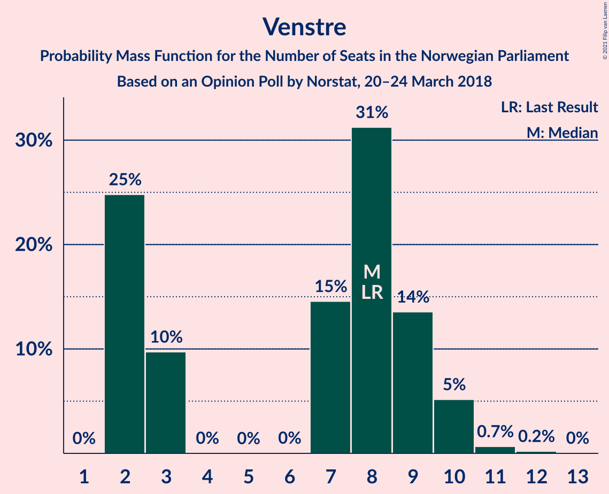

| Number of Seats | Probability | Accumulated | Special Marks |
|:---------------:|:-----------:|:-----------:|:-------------:|
| 2 | 25% | 100% |  |
| 3 | 10% | 75% |  |
| 4 | 0% | 65% |  |
| 5 | 0% | 65% |  |
| 6 | 0% | 65% |  |
| 7 | 15% | 65% |  |
| 8 | 31% | 51% | Last Result, Median |
| 9 | 14% | 20% |  |
| 10 | 5% | 6% |  |
| 11 | 0.7% | 0.9% |  |
| 12 | 0.2% | 0.2% |  |
| 13 | 0% | 0% |  |

### Rødt

*For a full overview of the results for this party, see the [Rødt](party-rødt.html) page.*

| Number of Seats | Probability | Accumulated | Special Marks |
|:---------------:|:-----------:|:-----------:|:-------------:|
| 1 | 2% | 100% | Last Result |
| 2 | 46% | 98% |  |
| 3 | 0% | 52% |  |
| 4 | 0% | 52% |  |
| 5 | 0% | 52% |  |
| 6 | 0.1% | 52% |  |
| 7 | 23% | 52% | Median |
| 8 | 19% | 29% |  |
| 9 | 7% | 10% |  |
| 10 | 3% | 3% |  |
| 11 | 0.4% | 0.5% |  |
| 12 | 0% | 0% |  |

### Miljøpartiet De Grønne

*For a full overview of the results for this party, see the [Miljøpartiet De Grønne](party-miljøpartietdegrønne.html) page.*

| Number of Seats | Probability | Accumulated | Special Marks |
|:---------------:|:-----------:|:-----------:|:-------------:|
| 0 | 23% | 100% |  |
| 1 | 63% | 77% | Last Result, Median |
| 2 | 14% | 15% |  |
| 3 | 0.1% | 0.5% |  |
| 4 | 0.1% | 0.5% |  |
| 5 | 0% | 0.4% |  |
| 6 | 0% | 0.4% |  |
| 7 | 0.2% | 0.4% |  |
| 8 | 0.1% | 0.1% |  |
| 9 | 0% | 0% |  |

## Coalitions

### Confidence Intervals

| Coalition | Last Result | Median | Majority? | 80% Confidence Interval | 90% Confidence Interval | 95% Confidence Interval | 99% Confidence Interval |
|:---------:|:-----------:|:------:|:---------:|:-----------------------:|:-----------------------:|:-----------------------:|:-----------------------:|
| Høyre – Fremskrittspartiet – Senterpartiet – Kristelig Folkeparti – Venstre | 107 | 107 | 100% | 102–111 | 101–112 | 101–113 | 98–115 |
| Høyre – Fremskrittspartiet – Kristelig Folkeparti – Venstre – Miljøpartiet De Grønne | 89 | 88 | 85% | 83–93 | 83–93 | 81–95 | 79–97 |
| Høyre – Fremskrittspartiet – Kristelig Folkeparti – Venstre | 88 | 87 | 79% | 82–91 | 82–93 | 80–93 | 78–96 |
| Arbeiderpartiet – Senterpartiet – Sosialistisk Venstreparti – Kristelig Folkeparti – Miljøpartiet De Grønne | 88 | 85 | 53% | 81–89 | 79–90 | 77–92 | 76–94 |
| Arbeiderpartiet – Senterpartiet – Sosialistisk Venstreparti – Rødt – Miljøpartiet De Grønne | 81 | 82 | 21% | 78–87 | 76–87 | 76–89 | 73–91 |
| Arbeiderpartiet – Senterpartiet – Sosialistisk Venstreparti – Rødt | 80 | 81 | 15% | 76–86 | 76–86 | 74–88 | 72–90 |
| Høyre – Fremskrittspartiet – Venstre | 80 | 79 | 5% | 75–83 | 74–84 | 73–86 | 70–89 |
| Arbeiderpartiet – Senterpartiet – Sosialistisk Venstreparti – Miljøpartiet De Grønne | 80 | 76 | 1.2% | 72–81 | 71–82 | 71–83 | 69–87 |
| Arbeiderpartiet – Senterpartiet – Sosialistisk Venstreparti | 79 | 76 | 1.0% | 71–80 | 71–81 | 70–82 | 68–86 |
| Høyre – Fremskrittspartiet | 72 | 73 | 0% | 69–77 | 68–79 | 67–80 | 66–82 |
| Arbeiderpartiet – Senterpartiet – Kristelig Folkeparti – Miljøpartiet De Grønne | 77 | 73 | 0.1% | 69–77 | 68–78 | 66–79 | 63–81 |
| Arbeiderpartiet – Senterpartiet – Kristelig Folkeparti | 76 | 72 | 0% | 68–76 | 66–76 | 65–78 | 62–80 |
| Arbeiderpartiet – Senterpartiet | 68 | 64 | 0% | 60–67 | 59–68 | 58–70 | 57–73 |
| Høyre – Kristelig Folkeparti – Venstre | 61 | 60 | 0% | 55–65 | 54–66 | 52–67 | 51–69 |
| Arbeiderpartiet – Sosialistisk Venstreparti | 60 | 56 | 0% | 52–60 | 51–61 | 50–62 | 49–64 |
| Senterpartiet – Kristelig Folkeparti – Venstre | 35 | 34 | 0% | 29–38 | 28–39 | 26–40 | 24–42 |

### Høyre – Fremskrittspartiet – Senterpartiet – Kristelig Folkeparti – Venstre

| Number of Seats | Probability | Accumulated | Special Marks |
|:---------------:|:-----------:|:-----------:|:-------------:|
| 95 | 0% | 100% |  |
| 96 | 0.1% | 99.9% |  |
| 97 | 0.1% | 99.9% |  |
| 98 | 0.5% | 99.8% |  |
| 99 | 0.5% | 99.3% |  |
| 100 | 0.9% | 98.7% |  |
| 101 | 3% | 98% |  |
| 102 | 5% | 95% |  |
| 103 | 7% | 89% |  |
| 104 | 5% | 82% |  |
| 105 | 11% | 77% |  |
| 106 | 11% | 66% |  |
| 107 | 9% | 55% | Last Result |
| 108 | 10% | 46% | Median |
| 109 | 13% | 35% |  |
| 110 | 3% | 22% |  |
| 111 | 10% | 19% |  |
| 112 | 5% | 9% |  |
| 113 | 2% | 4% |  |
| 114 | 1.0% | 2% |  |
| 115 | 0.8% | 1.2% |  |
| 116 | 0.3% | 0.4% |  |
| 117 | 0% | 0.1% |  |
| 118 | 0% | 0.1% |  |
| 119 | 0% | 0% |  |

### Høyre – Fremskrittspartiet – Kristelig Folkeparti – Venstre – Miljøpartiet De Grønne

| Number of Seats | Probability | Accumulated | Special Marks |
|:---------------:|:-----------:|:-----------:|:-------------:|
| 77 | 0.2% | 100% |  |
| 78 | 0.1% | 99.8% |  |
| 79 | 0.9% | 99.7% |  |
| 80 | 0.2% | 98.8% |  |
| 81 | 1.2% | 98.7% |  |
| 82 | 1.2% | 97% |  |
| 83 | 9% | 96% |  |
| 84 | 3% | 87% |  |
| 85 | 6% | 85% | Majority |
| 86 | 11% | 79% |  |
| 87 | 9% | 68% |  |
| 88 | 10% | 59% |  |
| 89 | 7% | 49% | Last Result |
| 90 | 12% | 42% | Median |
| 91 | 9% | 30% |  |
| 92 | 7% | 21% |  |
| 93 | 9% | 14% |  |
| 94 | 2% | 5% |  |
| 95 | 1.0% | 3% |  |
| 96 | 0.9% | 2% |  |
| 97 | 0.3% | 0.8% |  |
| 98 | 0.3% | 0.4% |  |
| 99 | 0.1% | 0.1% |  |
| 100 | 0% | 0% |  |

### Høyre – Fremskrittspartiet – Kristelig Folkeparti – Venstre

| Number of Seats | Probability | Accumulated | Special Marks |
|:---------------:|:-----------:|:-----------:|:-------------:|
| 75 | 0% | 100% |  |
| 76 | 0.1% | 99.9% |  |
| 77 | 0.1% | 99.9% |  |
| 78 | 0.5% | 99.7% |  |
| 79 | 0.7% | 99.2% |  |
| 80 | 1.2% | 98.5% |  |
| 81 | 0.7% | 97% |  |
| 82 | 9% | 97% |  |
| 83 | 2% | 87% |  |
| 84 | 6% | 85% |  |
| 85 | 7% | 79% | Majority |
| 86 | 14% | 73% |  |
| 87 | 9% | 59% |  |
| 88 | 7% | 50% | Last Result |
| 89 | 9% | 42% | Median |
| 90 | 11% | 34% |  |
| 91 | 14% | 22% |  |
| 92 | 1.5% | 8% |  |
| 93 | 4% | 7% |  |
| 94 | 0.9% | 2% |  |
| 95 | 0.8% | 1.4% |  |
| 96 | 0.2% | 0.7% |  |
| 97 | 0.3% | 0.5% |  |
| 98 | 0.1% | 0.1% |  |
| 99 | 0% | 0% |  |

### Arbeiderpartiet – Senterpartiet – Sosialistisk Venstreparti – Kristelig Folkeparti – Miljøpartiet De Grønne

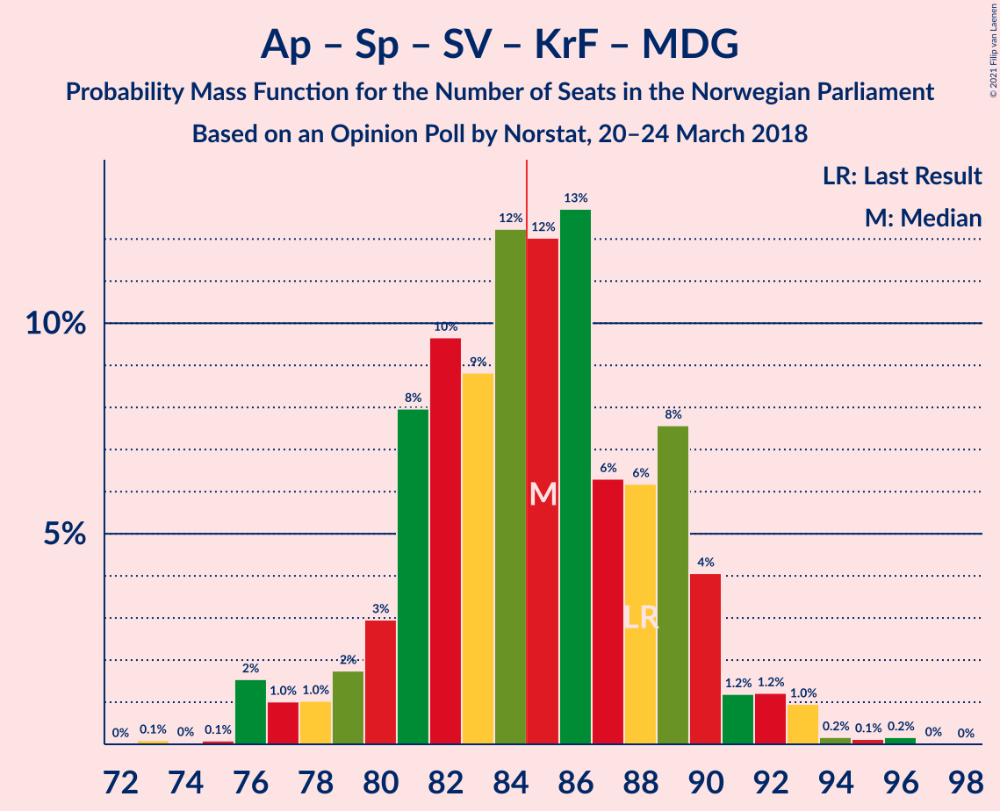

| Number of Seats | Probability | Accumulated | Special Marks |
|:---------------:|:-----------:|:-----------:|:-------------:|
| 73 | 0.1% | 100% |  |
| 74 | 0% | 99.9% |  |
| 75 | 0.1% | 99.8% |  |
| 76 | 2% | 99.7% |  |
| 77 | 1.0% | 98% |  |
| 78 | 1.0% | 97% |  |
| 79 | 2% | 96% |  |
| 80 | 3% | 94% |  |
| 81 | 8% | 91% |  |
| 82 | 10% | 83% |  |
| 83 | 9% | 74% |  |
| 84 | 12% | 65% | Median |
| 85 | 12% | 53% | Majority |
| 86 | 13% | 41% |  |
| 87 | 6% | 28% |  |
| 88 | 6% | 22% | Last Result |
| 89 | 8% | 16% |  |
| 90 | 4% | 8% |  |
| 91 | 1.2% | 4% |  |
| 92 | 1.2% | 3% |  |
| 93 | 1.0% | 1.5% |  |
| 94 | 0.2% | 0.5% |  |
| 95 | 0.1% | 0.3% |  |
| 96 | 0.2% | 0.2% |  |
| 97 | 0% | 0% |  |

### Arbeiderpartiet – Senterpartiet – Sosialistisk Venstreparti – Rødt – Miljøpartiet De Grønne

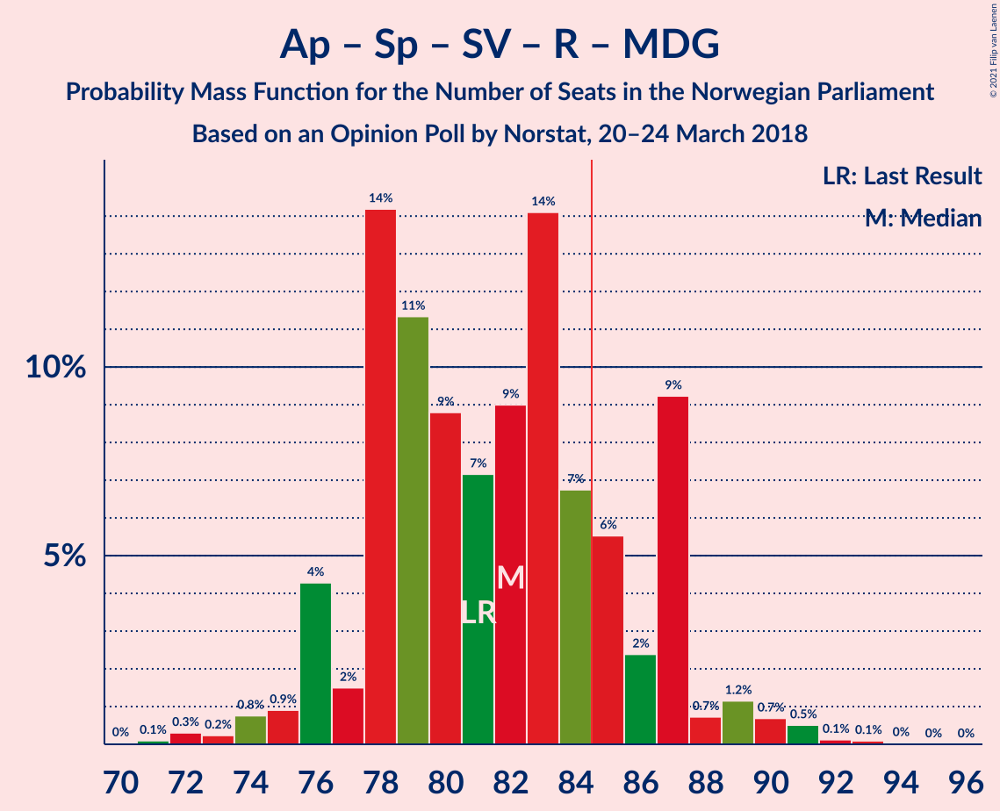

| Number of Seats | Probability | Accumulated | Special Marks |
|:---------------:|:-----------:|:-----------:|:-------------:|
| 71 | 0.1% | 100% |  |
| 72 | 0.3% | 99.9% |  |
| 73 | 0.2% | 99.5% |  |
| 74 | 0.8% | 99.3% |  |
| 75 | 0.9% | 98.6% |  |
| 76 | 4% | 98% |  |
| 77 | 2% | 93% |  |
| 78 | 14% | 92% |  |
| 79 | 11% | 78% |  |
| 80 | 9% | 66% |  |
| 81 | 7% | 58% | Last Result |
| 82 | 9% | 50% |  |
| 83 | 14% | 41% | Median |
| 84 | 7% | 27% |  |
| 85 | 6% | 21% | Majority |
| 86 | 2% | 15% |  |
| 87 | 9% | 13% |  |
| 88 | 0.7% | 3% |  |
| 89 | 1.2% | 3% |  |
| 90 | 0.7% | 1.5% |  |
| 91 | 0.5% | 0.8% |  |
| 92 | 0.1% | 0.3% |  |
| 93 | 0.1% | 0.1% |  |
| 94 | 0% | 0.1% |  |
| 95 | 0% | 0% |  |

### Arbeiderpartiet – Senterpartiet – Sosialistisk Venstreparti – Rødt

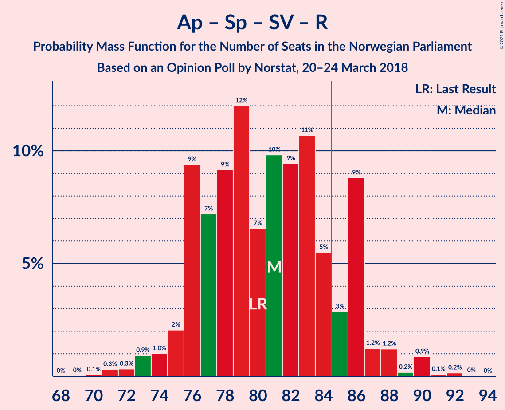

| Number of Seats | Probability | Accumulated | Special Marks |
|:---------------:|:-----------:|:-----------:|:-------------:|
| 70 | 0.1% | 100% |  |
| 71 | 0.3% | 99.9% |  |
| 72 | 0.3% | 99.6% |  |
| 73 | 0.9% | 99.2% |  |
| 74 | 1.0% | 98% |  |
| 75 | 2% | 97% |  |
| 76 | 9% | 95% |  |
| 77 | 7% | 86% |  |
| 78 | 9% | 79% |  |
| 79 | 12% | 69% |  |
| 80 | 7% | 57% | Last Result |
| 81 | 10% | 51% |  |
| 82 | 9% | 41% | Median |
| 83 | 11% | 32% |  |
| 84 | 5% | 21% |  |
| 85 | 3% | 15% | Majority |
| 86 | 9% | 13% |  |
| 87 | 1.2% | 4% |  |
| 88 | 1.2% | 3% |  |
| 89 | 0.2% | 1.3% |  |
| 90 | 0.9% | 1.2% |  |
| 91 | 0.1% | 0.3% |  |
| 92 | 0.2% | 0.2% |  |
| 93 | 0% | 0% |  |

### Høyre – Fremskrittspartiet – Venstre

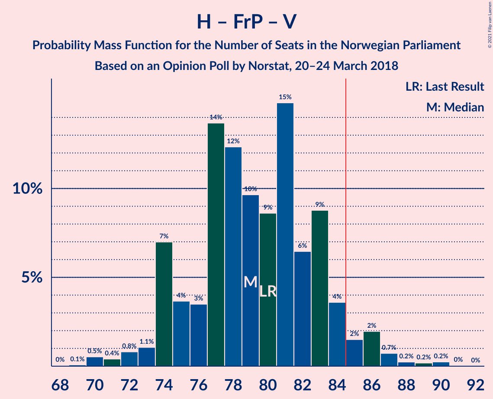

| Number of Seats | Probability | Accumulated | Special Marks |
|:---------------:|:-----------:|:-----------:|:-------------:|
| 68 | 0% | 100% |  |
| 69 | 0.1% | 99.9% |  |
| 70 | 0.5% | 99.8% |  |
| 71 | 0.4% | 99.3% |  |
| 72 | 0.8% | 98.9% |  |
| 73 | 1.1% | 98% |  |
| 74 | 7% | 97% |  |
| 75 | 4% | 90% |  |
| 76 | 3% | 86% |  |
| 77 | 14% | 83% |  |
| 78 | 12% | 69% |  |
| 79 | 10% | 57% |  |
| 80 | 9% | 47% | Last Result |
| 81 | 15% | 39% | Median |
| 82 | 6% | 24% |  |
| 83 | 9% | 17% |  |
| 84 | 4% | 9% |  |
| 85 | 2% | 5% | Majority |
| 86 | 2% | 3% |  |
| 87 | 0.7% | 1.5% |  |
| 88 | 0.2% | 0.7% |  |
| 89 | 0.2% | 0.5% |  |
| 90 | 0.2% | 0.3% |  |
| 91 | 0% | 0.1% |  |
| 92 | 0% | 0% |  |

### Arbeiderpartiet – Senterpartiet – Sosialistisk Venstreparti – Miljøpartiet De Grønne

| Number of Seats | Probability | Accumulated | Special Marks |
|:---------------:|:-----------:|:-----------:|:-------------:|
| 67 | 0.2% | 100% |  |
| 68 | 0.2% | 99.8% |  |
| 69 | 0.6% | 99.6% |  |
| 70 | 1.2% | 99.0% |  |
| 71 | 3% | 98% |  |
| 72 | 6% | 95% |  |
| 73 | 8% | 89% |  |
| 74 | 9% | 81% |  |
| 75 | 7% | 72% |  |
| 76 | 20% | 65% | Median |
| 77 | 9% | 45% |  |
| 78 | 8% | 37% |  |
| 79 | 7% | 29% |  |
| 80 | 9% | 21% | Last Result |
| 81 | 5% | 12% |  |
| 82 | 3% | 7% |  |
| 83 | 2% | 4% |  |
| 84 | 0.6% | 2% |  |
| 85 | 0.3% | 1.2% | Majority |
| 86 | 0.1% | 0.9% |  |
| 87 | 0.8% | 0.9% |  |
| 88 | 0.1% | 0.1% |  |
| 89 | 0% | 0% |  |

### Arbeiderpartiet – Senterpartiet – Sosialistisk Venstreparti

| Number of Seats | Probability | Accumulated | Special Marks |
|:---------------:|:-----------:|:-----------:|:-------------:|
| 65 | 0.1% | 100% |  |
| 66 | 0.1% | 99.9% |  |
| 67 | 0.2% | 99.8% |  |
| 68 | 0.4% | 99.6% |  |
| 69 | 1.3% | 99.3% |  |
| 70 | 2% | 98% |  |
| 71 | 7% | 96% |  |
| 72 | 6% | 89% |  |
| 73 | 8% | 82% |  |
| 74 | 15% | 74% |  |
| 75 | 9% | 59% | Median |
| 76 | 12% | 50% |  |
| 77 | 9% | 38% |  |
| 78 | 8% | 29% |  |
| 79 | 9% | 21% | Last Result |
| 80 | 4% | 12% |  |
| 81 | 3% | 7% |  |
| 82 | 3% | 4% |  |
| 83 | 0.2% | 2% |  |
| 84 | 0.4% | 1.4% |  |
| 85 | 0.1% | 1.0% | Majority |
| 86 | 0.8% | 0.8% |  |
| 87 | 0% | 0.1% |  |
| 88 | 0% | 0% |  |

### Høyre – Fremskrittspartiet

| Number of Seats | Probability | Accumulated | Special Marks |
|:---------------:|:-----------:|:-----------:|:-------------:|
| 63 | 0% | 100% |  |
| 64 | 0.1% | 99.9% |  |
| 65 | 0.2% | 99.9% |  |
| 66 | 0.6% | 99.7% |  |
| 67 | 4% | 99.0% |  |
| 68 | 2% | 95% |  |
| 69 | 6% | 93% |  |
| 70 | 11% | 87% |  |
| 71 | 7% | 76% |  |
| 72 | 11% | 69% | Last Result |
| 73 | 12% | 58% | Median |
| 74 | 18% | 46% |  |
| 75 | 7% | 28% |  |
| 76 | 7% | 22% |  |
| 77 | 5% | 15% |  |
| 78 | 3% | 10% |  |
| 79 | 4% | 7% |  |
| 80 | 0.5% | 3% |  |
| 81 | 2% | 2% |  |
| 82 | 0.4% | 0.5% |  |
| 83 | 0.1% | 0.2% |  |
| 84 | 0.1% | 0.1% |  |
| 85 | 0% | 0% | Majority |

### Arbeiderpartiet – Senterpartiet – Kristelig Folkeparti – Miljøpartiet De Grønne

| Number of Seats | Probability | Accumulated | Special Marks |
|:---------------:|:-----------:|:-----------:|:-------------:|
| 62 | 0.1% | 100% |  |
| 63 | 1.3% | 99.9% |  |
| 64 | 0.6% | 98.6% |  |
| 65 | 0.3% | 98% |  |
| 66 | 1.4% | 98% |  |
| 67 | 1.2% | 96% |  |
| 68 | 4% | 95% |  |
| 69 | 6% | 91% |  |
| 70 | 9% | 85% |  |
| 71 | 9% | 76% |  |
| 72 | 10% | 67% | Median |
| 73 | 12% | 58% |  |
| 74 | 12% | 46% |  |
| 75 | 17% | 33% |  |
| 76 | 6% | 16% |  |
| 77 | 6% | 11% | Last Result |
| 78 | 1.4% | 5% |  |
| 79 | 1.4% | 4% |  |
| 80 | 2% | 2% |  |
| 81 | 0.4% | 0.8% |  |
| 82 | 0.2% | 0.4% |  |
| 83 | 0% | 0.2% |  |
| 84 | 0.1% | 0.2% |  |
| 85 | 0.1% | 0.1% | Majority |
| 86 | 0% | 0% |  |

### Arbeiderpartiet – Senterpartiet – Kristelig Folkeparti

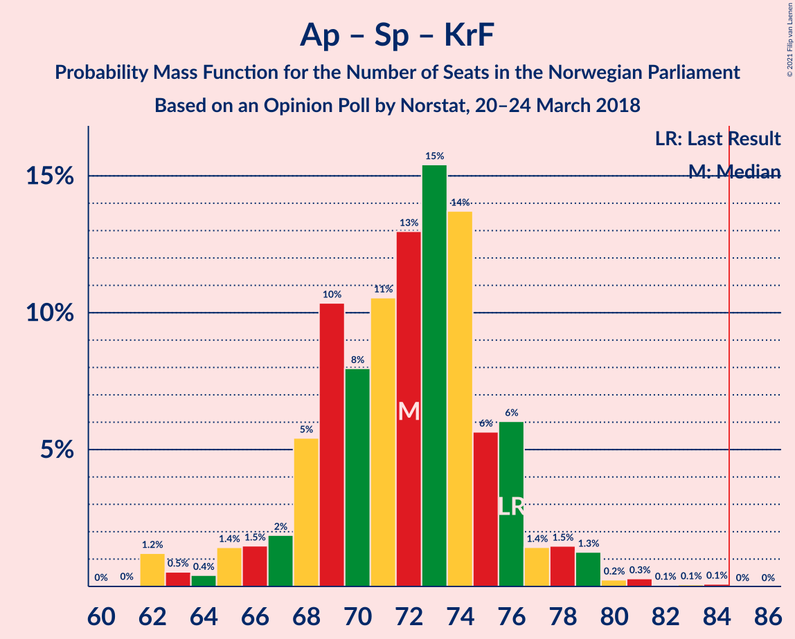

| Number of Seats | Probability | Accumulated | Special Marks |
|:---------------:|:-----------:|:-----------:|:-------------:|
| 61 | 0% | 100% |  |
| 62 | 1.2% | 99.9% |  |
| 63 | 0.5% | 98.7% |  |
| 64 | 0.4% | 98% |  |
| 65 | 1.4% | 98% |  |
| 66 | 1.5% | 96% |  |
| 67 | 2% | 95% |  |
| 68 | 5% | 93% |  |
| 69 | 10% | 88% |  |
| 70 | 8% | 77% |  |
| 71 | 11% | 69% | Median |
| 72 | 13% | 59% |  |
| 73 | 15% | 46% |  |
| 74 | 14% | 30% |  |
| 75 | 6% | 17% |  |
| 76 | 6% | 11% | Last Result |
| 77 | 1.4% | 5% |  |
| 78 | 1.5% | 3% |  |
| 79 | 1.3% | 2% |  |
| 80 | 0.2% | 0.7% |  |
| 81 | 0.3% | 0.5% |  |
| 82 | 0.1% | 0.2% |  |
| 83 | 0.1% | 0.2% |  |
| 84 | 0.1% | 0.1% |  |
| 85 | 0% | 0% | Majority |

### Arbeiderpartiet – Senterpartiet

| Number of Seats | Probability | Accumulated | Special Marks |
|:---------------:|:-----------:|:-----------:|:-------------:|
| 55 | 0% | 100% |  |
| 56 | 0.2% | 99.9% |  |
| 57 | 0.7% | 99.7% |  |
| 58 | 2% | 99.0% |  |
| 59 | 5% | 97% |  |
| 60 | 7% | 93% |  |
| 61 | 10% | 86% |  |
| 62 | 8% | 76% |  |
| 63 | 16% | 68% | Median |
| 64 | 16% | 52% |  |
| 65 | 11% | 37% |  |
| 66 | 10% | 26% |  |
| 67 | 6% | 16% |  |
| 68 | 5% | 9% | Last Result |
| 69 | 2% | 5% |  |
| 70 | 0.9% | 3% |  |
| 71 | 0.3% | 2% |  |
| 72 | 0.5% | 1.3% |  |
| 73 | 0.7% | 0.9% |  |
| 74 | 0.1% | 0.2% |  |
| 75 | 0.1% | 0.1% |  |
| 76 | 0% | 0% |  |

### Høyre – Kristelig Folkeparti – Venstre

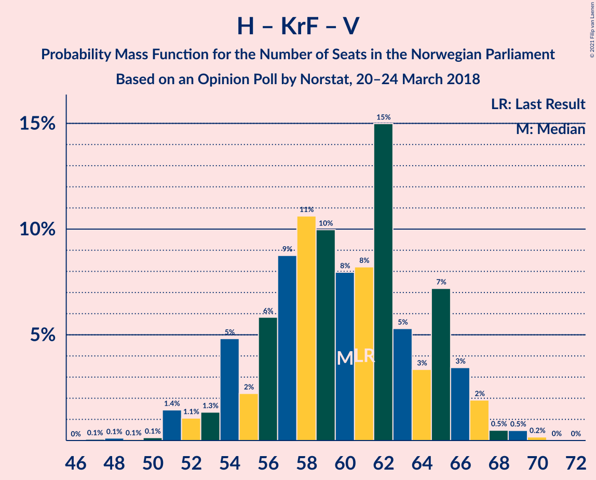

| Number of Seats | Probability | Accumulated | Special Marks |
|:---------------:|:-----------:|:-----------:|:-------------:|
| 47 | 0.1% | 100% |  |
| 48 | 0.1% | 99.9% |  |
| 49 | 0.1% | 99.8% |  |
| 50 | 0.1% | 99.8% |  |
| 51 | 1.4% | 99.6% |  |
| 52 | 1.1% | 98% |  |
| 53 | 1.3% | 97% |  |
| 54 | 5% | 96% |  |
| 55 | 2% | 91% |  |
| 56 | 6% | 89% |  |
| 57 | 9% | 83% |  |
| 58 | 11% | 74% |  |
| 59 | 10% | 64% |  |
| 60 | 8% | 54% |  |
| 61 | 8% | 46% | Last Result, Median |
| 62 | 15% | 37% |  |
| 63 | 5% | 22% |  |
| 64 | 3% | 17% |  |
| 65 | 7% | 14% |  |
| 66 | 3% | 7% |  |
| 67 | 2% | 3% |  |
| 68 | 0.5% | 1.2% |  |
| 69 | 0.5% | 0.7% |  |
| 70 | 0.2% | 0.2% |  |
| 71 | 0% | 0% |  |

### Arbeiderpartiet – Sosialistisk Venstreparti

| Number of Seats | Probability | Accumulated | Special Marks |
|:---------------:|:-----------:|:-----------:|:-------------:|
| 47 | 0.1% | 100% |  |
| 48 | 0.2% | 99.9% |  |
| 49 | 0.3% | 99.7% |  |
| 50 | 4% | 99.5% |  |
| 51 | 4% | 96% |  |
| 52 | 4% | 92% |  |
| 53 | 6% | 87% |  |
| 54 | 10% | 81% |  |
| 55 | 10% | 71% |  |
| 56 | 17% | 61% | Median |
| 57 | 12% | 43% |  |
| 58 | 9% | 31% |  |
| 59 | 11% | 22% |  |
| 60 | 4% | 11% | Last Result |
| 61 | 4% | 7% |  |
| 62 | 1.5% | 3% |  |
| 63 | 0.4% | 2% |  |
| 64 | 1.0% | 1.1% |  |
| 65 | 0.1% | 0.2% |  |
| 66 | 0% | 0.1% |  |
| 67 | 0% | 0% |  |

### Senterpartiet – Kristelig Folkeparti – Venstre

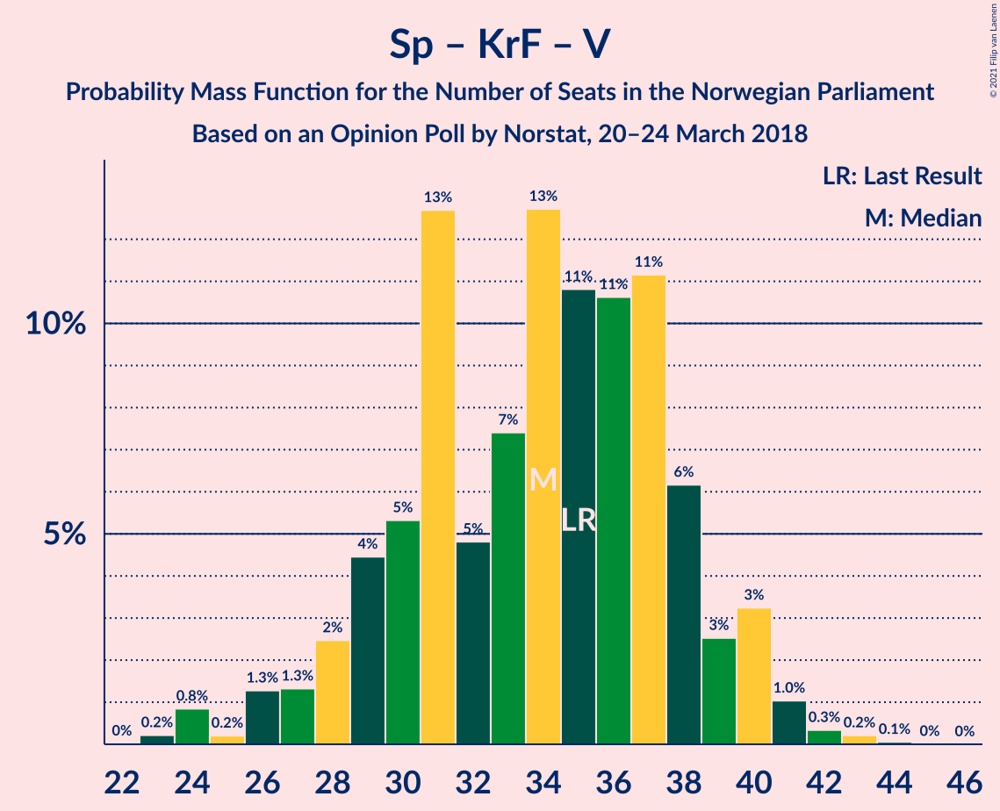

| Number of Seats | Probability | Accumulated | Special Marks |
|:---------------:|:-----------:|:-----------:|:-------------:|
| 23 | 0.2% | 100% |  |
| 24 | 0.8% | 99.7% |  |
| 25 | 0.2% | 98.9% |  |
| 26 | 1.3% | 98.7% |  |
| 27 | 1.3% | 97% |  |
| 28 | 2% | 96% |  |
| 29 | 4% | 94% |  |
| 30 | 5% | 89% |  |
| 31 | 13% | 84% |  |
| 32 | 5% | 71% |  |
| 33 | 7% | 66% |  |
| 34 | 13% | 59% |  |
| 35 | 11% | 46% | Last Result, Median |
| 36 | 11% | 35% |  |
| 37 | 11% | 25% |  |
| 38 | 6% | 14% |  |
| 39 | 3% | 7% |  |
| 40 | 3% | 5% |  |
| 41 | 1.0% | 2% |  |
| 42 | 0.3% | 0.6% |  |
| 43 | 0.2% | 0.3% |  |
| 44 | 0.1% | 0.1% |  |
| 45 | 0% | 0% |  |

## Technical Information

### Opinion Poll

+ **Polling firm:** Norstat
+ **Commissioner(s):** —
+ **Fieldwork period:** 20–24 March 2018

### Calculations

+ **Sample size:** 955
+ **Simulations done:** 524,288
+ **Error estimate:** 1.98%

