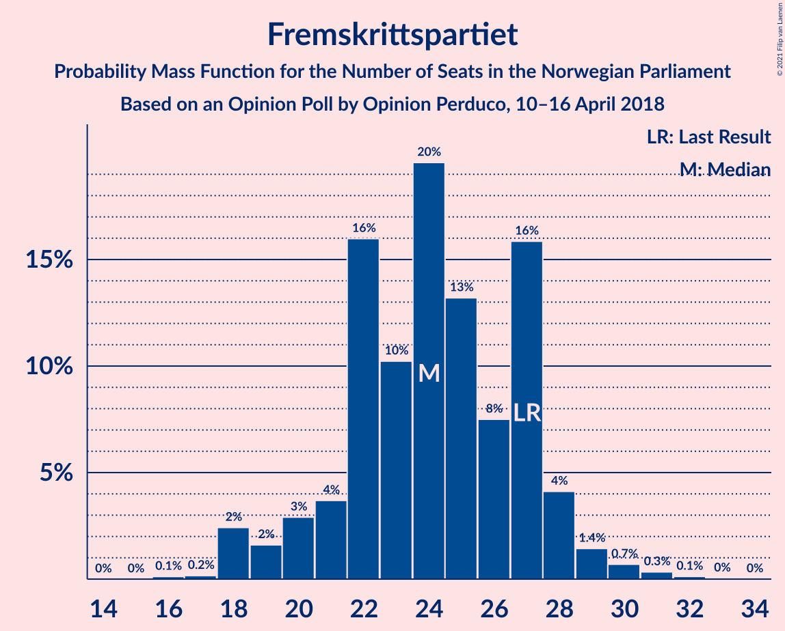
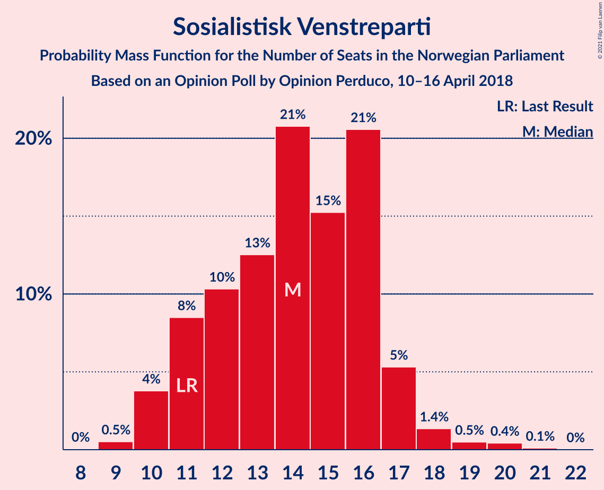
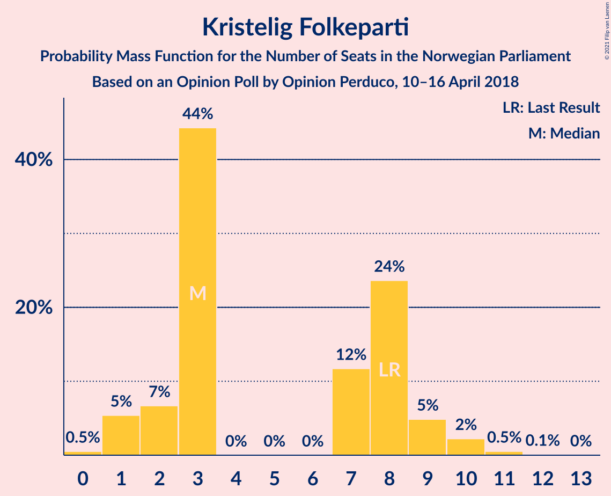
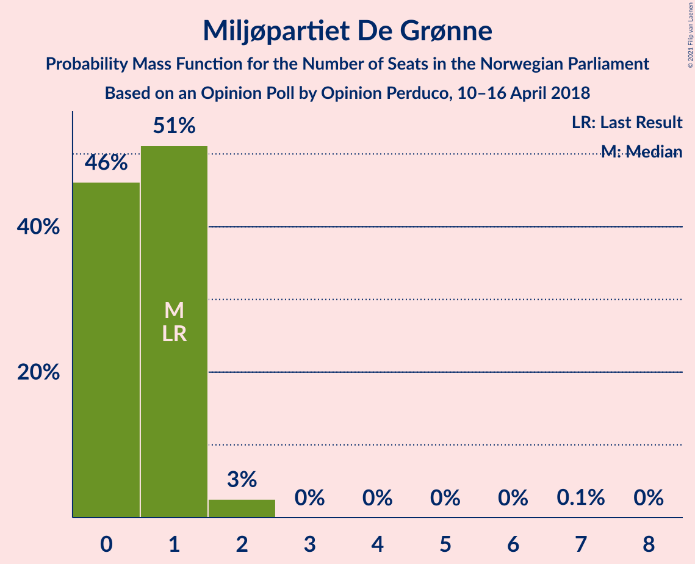
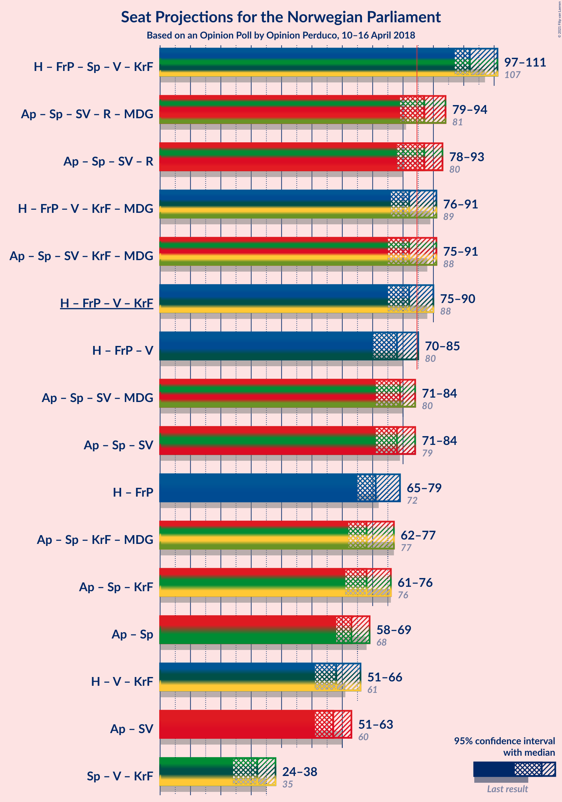
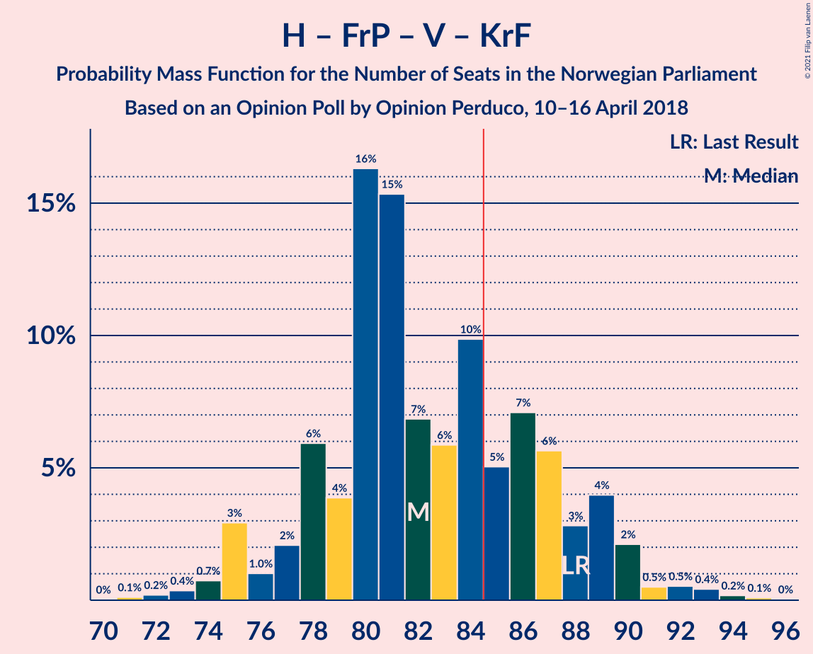
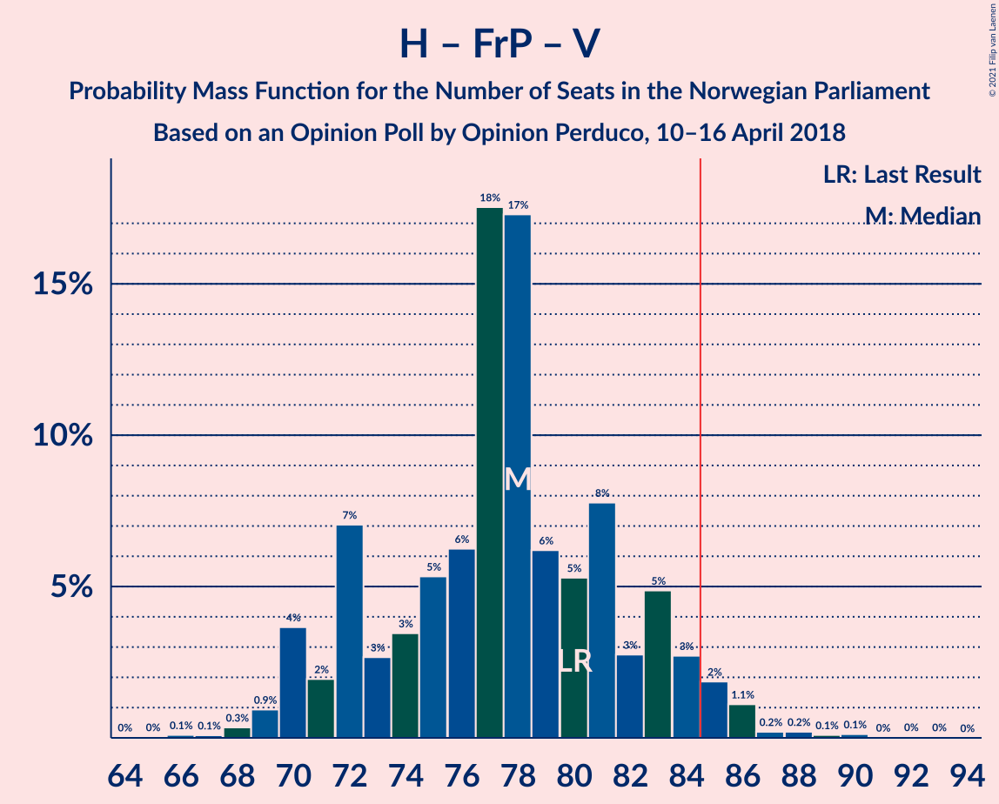
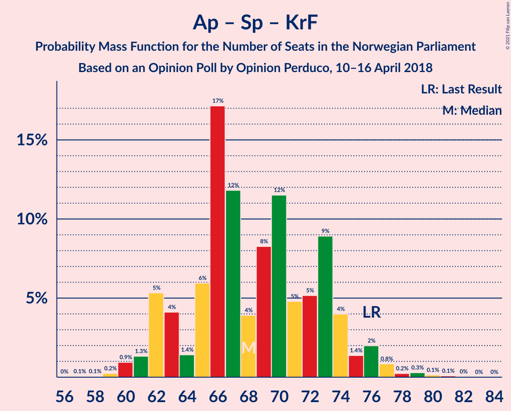
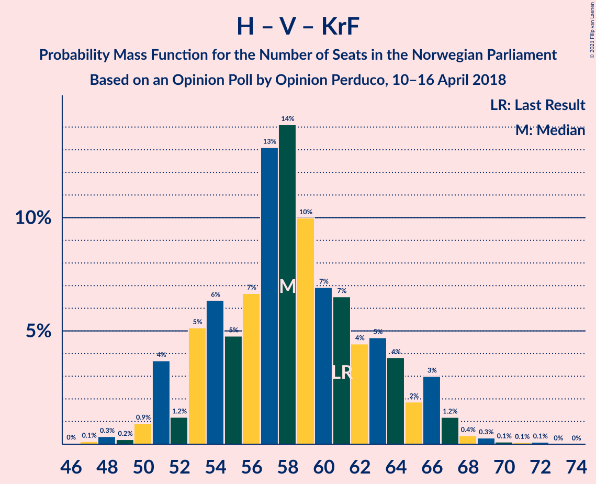

# Opinion Poll by Opinion Perduco, 10–16 April 2018

<a href="#voting-intentions">Voting Intentions</a> | <a href="#seats">Seats</a> | <a href="#coalitions">Coalitions</a> | <a href="#technical-information">Technical Information</a>

## Voting Intentions

### Confidence Intervals

| Party | Last Result | Poll Result | 80% Confidence Interval | 90% Confidence Interval | 95% Confidence Interval | 99% Confidence Interval |
|:-----:|:-----------:|:-----------:|:-----------------------:|:-----------------------:|:-----------------------:|:-----------------------:|
| Høyre | 25.0% | 26.9% | 24.9–29.2% |24.3–29.8% |23.8–30.3% |22.8–31.4% |
| Arbeiderpartiet | 27.4% | 24.0% | 22.0–26.1% |21.4–26.7% |21.0–27.3% |20.1–28.3% |
| Fremskrittspartiet | 15.2% | 13.5% | 12.0–15.3% |11.6–15.8% |11.2–16.3% |10.5–17.1% |
| Senterpartiet | 10.3% | 11.6% | 10.2–13.2% |9.8–13.7% |9.4–14.1% |8.8–15.0% |
| Sosialistisk Venstreparti | 6.0% | 7.8% | 6.6–9.2% |6.3–9.6% |6.0–10.0% |5.5–10.7% |
| Rødt | 2.4% | 4.9% | 4.0–6.1% |3.8–6.5% |3.6–6.8% |3.2–7.4% |
| Venstre | 4.4% | 4.1% | 3.3–5.2% |3.0–5.5% |2.9–5.8% |2.5–6.4% |
| Kristelig Folkeparti | 4.2% | 3.9% | 3.2–5.1% |2.9–5.4% |2.7–5.7% |2.4–6.2% |
| Miljøpartiet De Grønne | 3.2% | 1.8% | 1.3–2.7% |1.2–2.9% |1.1–3.1% |0.9–3.6% |

*Note:* The poll result column reflects the actual value used in the calculations. Published results may vary slightly, and in addition be rounded to fewer digits.

## Seats

### Confidence Intervals

| Party | Last Result | Median | 80% Confidence Interval | 90% Confidence Interval | 95% Confidence Interval | 99% Confidence Interval |
|:-----:|:-----------:|:------:|:-----------------------:|:-----------------------:|:-----------------------:|:-----------------------:|
| <a href="#høyre">Høyre</a> | 45 | 47 | 44–51 |43–54 |42–55 |40–56 |
| <a href="#arbeiderpartiet">Arbeiderpartiet</a> | 49 | 43 | 39–45 |39–47 |38–49 |36–51 |
| <a href="#fremskrittspartiet">Fremskrittspartiet</a> | 27 | 24 | 21–27 |20–28 |18–29 |18–31 |
| <a href="#senterpartiet">Senterpartiet</a> | 19 | 21 | 18–24 |17–25 |17–26 |16–27 |
| <a href="#sosialistisk-venstreparti">Sosialistisk Venstreparti</a> | 11 | 14 | 11–16 |11–17 |10–17 |9–20 |
| <a href="#rødt">Rødt</a> | 1 | 9 | 7–11 |2–11 |2–12 |2–13 |
| <a href="#venstre">Venstre</a> | 8 | 7 | 2–9 |2–9 |2–10 |2–11 |
| <a href="#kristelig-folkeparti">Kristelig Folkeparti</a> | 8 | 3 | 2–8 |1–9 |1–10 |0–11 |
| <a href="#miljøpartiet-de-grønne">Miljøpartiet De Grønne</a> | 1 | 1 | 0–1 |0–1 |0–2 |0–2 |

### Høyre

*For a full overview of the results for this party, see the [Høyre](party-høyre.html) page.*

| Number of Seats | Probability | Accumulated | Special Marks |
|:---------------:|:-----------:|:-----------:|:-------------:|
| 38 | 0.2% | 100% |  |
| 39 | 0.3% | 99.8% |  |
| 40 | 0.4% | 99.5% |  |
| 41 | 0.4% | 99.1% |  |
| 42 | 2% | 98.8% |  |
| 43 | 4% | 97% |  |
| 44 | 5% | 93% |  |
| 45 | 8% | 88% | Last Result |
| 46 | 19% | 80% |  |
| 47 | 15% | 62% | Median |
| 48 | 12% | 46% |  |
| 49 | 15% | 35% |  |
| 50 | 6% | 20% |  |
| 51 | 5% | 14% |  |
| 52 | 1.2% | 9% |  |
| 53 | 2% | 8% |  |
| 54 | 2% | 5% |  |
| 55 | 2% | 3% |  |
| 56 | 0.3% | 0.7% |  |
| 57 | 0.2% | 0.4% |  |
| 58 | 0.2% | 0.3% |  |
| 59 | 0% | 0% |  |

### Arbeiderpartiet

*For a full overview of the results for this party, see the [Arbeiderpartiet](party-arbeiderpartiet.html) page.*

| Number of Seats | Probability | Accumulated | Special Marks |
|:---------------:|:-----------:|:-----------:|:-------------:|
| 35 | 0.1% | 100% |  |
| 36 | 0.6% | 99.9% |  |
| 37 | 1.4% | 99.3% |  |
| 38 | 1.5% | 98% |  |
| 39 | 8% | 96% |  |
| 40 | 3% | 89% |  |
| 41 | 9% | 86% |  |
| 42 | 26% | 77% |  |
| 43 | 24% | 51% | Median |
| 44 | 12% | 27% |  |
| 45 | 6% | 16% |  |
| 46 | 3% | 9% |  |
| 47 | 2% | 7% |  |
| 48 | 2% | 4% |  |
| 49 | 0.9% | 3% | Last Result |
| 50 | 0.7% | 2% |  |
| 51 | 0.5% | 0.8% |  |
| 52 | 0.2% | 0.3% |  |
| 53 | 0% | 0.2% |  |
| 54 | 0% | 0.1% |  |
| 55 | 0% | 0.1% |  |
| 56 | 0% | 0% |  |

### Fremskrittspartiet

*For a full overview of the results for this party, see the [Fremskrittspartiet](party-fremskrittspartiet.html) page.*

| Number of Seats | Probability | Accumulated | Special Marks |
|:---------------:|:-----------:|:-----------:|:-------------:|
| 16 | 0.1% | 100% |  |
| 17 | 0.2% | 99.9% |  |
| 18 | 2% | 99.7% |  |
| 19 | 2% | 97% |  |
| 20 | 3% | 96% |  |
| 21 | 4% | 93% |  |
| 22 | 16% | 89% |  |
| 23 | 10% | 73% |  |
| 24 | 20% | 63% | Median |
| 25 | 13% | 43% |  |
| 26 | 8% | 30% |  |
| 27 | 16% | 23% | Last Result |
| 28 | 4% | 7% |  |
| 29 | 1.4% | 3% |  |
| 30 | 0.7% | 1.2% |  |
| 31 | 0.3% | 0.5% |  |
| 32 | 0.1% | 0.2% |  |
| 33 | 0% | 0.1% |  |
| 34 | 0% | 0% |  |

### Senterpartiet

*For a full overview of the results for this party, see the [Senterpartiet](party-senterpartiet.html) page.*

| Number of Seats | Probability | Accumulated | Special Marks |
|:---------------:|:-----------:|:-----------:|:-------------:|
| 14 | 0.1% | 100% |  |
| 15 | 0.3% | 99.9% |  |
| 16 | 2% | 99.5% |  |
| 17 | 8% | 98% |  |
| 18 | 10% | 90% |  |
| 19 | 11% | 80% | Last Result |
| 20 | 12% | 69% |  |
| 21 | 21% | 58% | Median |
| 22 | 17% | 36% |  |
| 23 | 9% | 19% |  |
| 24 | 5% | 11% |  |
| 25 | 2% | 6% |  |
| 26 | 3% | 4% |  |
| 27 | 0.5% | 0.7% |  |
| 28 | 0.2% | 0.3% |  |
| 29 | 0.1% | 0.1% |  |
| 30 | 0% | 0% |  |

### Sosialistisk Venstreparti

*For a full overview of the results for this party, see the [Sosialistisk Venstreparti](party-sosialistiskvenstreparti.html) page.*

| Number of Seats | Probability | Accumulated | Special Marks |
|:---------------:|:-----------:|:-----------:|:-------------:|
| 8 | 0% | 100% |  |
| 9 | 0.5% | 99.9% |  |
| 10 | 4% | 99.4% |  |
| 11 | 8% | 96% | Last Result |
| 12 | 10% | 87% |  |
| 13 | 13% | 77% |  |
| 14 | 21% | 64% | Median |
| 15 | 15% | 44% |  |
| 16 | 21% | 28% |  |
| 17 | 5% | 8% |  |
| 18 | 1.4% | 2% |  |
| 19 | 0.5% | 1.0% |  |
| 20 | 0.4% | 0.6% |  |
| 21 | 0.1% | 0.1% |  |
| 22 | 0% | 0% |  |

### Rødt

*For a full overview of the results for this party, see the [Rødt](party-rødt.html) page.*

| Number of Seats | Probability | Accumulated | Special Marks |
|:---------------:|:-----------:|:-----------:|:-------------:|
| 1 | 0.2% | 100% | Last Result |
| 2 | 7% | 99.8% |  |
| 3 | 0% | 93% |  |
| 4 | 0% | 93% |  |
| 5 | 0% | 93% |  |
| 6 | 0% | 93% |  |
| 7 | 10% | 93% |  |
| 8 | 21% | 83% |  |
| 9 | 32% | 62% | Median |
| 10 | 20% | 31% |  |
| 11 | 8% | 11% |  |
| 12 | 2% | 3% |  |
| 13 | 0.6% | 0.8% |  |
| 14 | 0.2% | 0.2% |  |
| 15 | 0% | 0% |  |

### Venstre

*For a full overview of the results for this party, see the [Venstre](party-venstre.html) page.*

| Number of Seats | Probability | Accumulated | Special Marks |
|:---------------:|:-----------:|:-----------:|:-------------:|
| 1 | 0.1% | 100% |  |
| 2 | 38% | 99.9% |  |
| 3 | 2% | 62% |  |
| 4 | 0% | 60% |  |
| 5 | 0% | 60% |  |
| 6 | 0% | 60% |  |
| 7 | 12% | 60% | Median |
| 8 | 33% | 48% | Last Result |
| 9 | 11% | 15% |  |
| 10 | 3% | 4% |  |
| 11 | 0.9% | 1.2% |  |
| 12 | 0.3% | 0.3% |  |
| 13 | 0% | 0% |  |

### Kristelig Folkeparti

*For a full overview of the results for this party, see the [Kristelig Folkeparti](party-kristeligfolkeparti.html) page.*

| Number of Seats | Probability | Accumulated | Special Marks |
|:---------------:|:-----------:|:-----------:|:-------------:|
| 0 | 0.5% | 100% |  |
| 1 | 5% | 99.5% |  |
| 2 | 7% | 94% |  |
| 3 | 44% | 87% | Median |
| 4 | 0% | 43% |  |
| 5 | 0% | 43% |  |
| 6 | 0% | 43% |  |
| 7 | 12% | 43% |  |
| 8 | 24% | 31% | Last Result |
| 9 | 5% | 8% |  |
| 10 | 2% | 3% |  |
| 11 | 0.5% | 0.7% |  |
| 12 | 0.1% | 0.1% |  |
| 13 | 0% | 0% |  |

### Miljøpartiet De Grønne

*For a full overview of the results for this party, see the [Miljøpartiet De Grønne](party-miljøpartietdegrønne.html) page.*

| Number of Seats | Probability | Accumulated | Special Marks |
|:---------------:|:-----------:|:-----------:|:-------------:|
| 0 | 46% | 100% |  |
| 1 | 51% | 54% | Last Result, Median |
| 2 | 3% | 3% |  |
| 3 | 0% | 0.1% |  |
| 4 | 0% | 0.1% |  |
| 5 | 0% | 0.1% |  |
| 6 | 0% | 0.1% |  |
| 7 | 0.1% | 0.1% |  |
| 8 | 0% | 0% |  |

## Coalitions

### Confidence Intervals

| Coalition | Last Result | Median | Majority? | 80% Confidence Interval | 90% Confidence Interval | 95% Confidence Interval | 99% Confidence Interval |
|:---------:|:-----------:|:------:|:---------:|:-----------------------:|:-----------------------:|:-----------------------:|:-----------------------:|
| Høyre – Fremskrittspartiet – Senterpartiet – Venstre – Kristelig Folkeparti | 107 | 102 | 100% | 99–107 | 98–110 | 97–111 | 94–113 |
| Arbeiderpartiet – Senterpartiet – Sosialistisk Venstreparti – Rødt – Miljøpartiet De Grønne | 81 | 87 | 72% | 81–91 | 80–93 | 79–94 | 76–96 |
| Arbeiderpartiet – Senterpartiet – Sosialistisk Venstreparti – Rødt | 80 | 87 | 61% | 81–90 | 79–92 | 78–93 | 75–96 |
| Høyre – Fremskrittspartiet – Venstre – Kristelig Folkeparti – Miljøpartiet De Grønne | 89 | 82 | 39% | 79–88 | 77–90 | 76–91 | 73–94 |
| Arbeiderpartiet – Senterpartiet – Sosialistisk Venstreparti – Kristelig Folkeparti – Miljøpartiet De Grønne | 88 | 82 | 34% | 78–88 | 76–91 | 75–91 | 74–94 |
| Høyre – Fremskrittspartiet – Venstre – Kristelig Folkeparti | 88 | 82 | 28% | 78–88 | 76–89 | 75–90 | 73–93 |
| Høyre – Fremskrittspartiet – Venstre | 80 | 78 | 4% | 72–83 | 70–84 | 70–85 | 68–88 |
| Arbeiderpartiet – Senterpartiet – Sosialistisk Venstreparti – Miljøpartiet De Grønne | 80 | 79 | 2% | 73–83 | 72–84 | 71–84 | 69–88 |
| Arbeiderpartiet – Senterpartiet – Sosialistisk Venstreparti | 79 | 78 | 2% | 73–82 | 71–83 | 71–84 | 69–87 |
| Høyre – Fremskrittspartiet | 72 | 71 | 0.1% | 68–77 | 67–78 | 65–79 | 63–82 |
| Arbeiderpartiet – Senterpartiet – Kristelig Folkeparti – Miljøpartiet De Grønne | 77 | 68 | 0% | 64–74 | 63–75 | 62–77 | 60–79 |
| Arbeiderpartiet – Senterpartiet – Kristelig Folkeparti | 76 | 68 | 0% | 63–73 | 62–75 | 61–76 | 60–79 |
| Arbeiderpartiet – Senterpartiet | 68 | 63 | 0% | 59–67 | 59–69 | 58–69 | 56–73 |
| Høyre – Venstre – Kristelig Folkeparti | 61 | 58 | 0% | 53–64 | 51–66 | 51–66 | 48–69 |
| Arbeiderpartiet – Sosialistisk Venstreparti | 60 | 57 | 0% | 53–60 | 52–61 | 51–63 | 49–66 |
| Senterpartiet – Venstre – Kristelig Folkeparti | 35 | 32 | 0% | 27–36 | 25–38 | 24–38 | 22–41 |

### Høyre – Fremskrittspartiet – Senterpartiet – Venstre – Kristelig Folkeparti

| Number of Seats | Probability | Accumulated | Special Marks |
|:---------------:|:-----------:|:-----------:|:-------------:|
| 91 | 0% | 100% |  |
| 92 | 0.1% | 99.9% |  |
| 93 | 0.1% | 99.8% |  |
| 94 | 0.3% | 99.7% |  |
| 95 | 0.3% | 99.4% |  |
| 96 | 1.3% | 99.0% |  |
| 97 | 2% | 98% |  |
| 98 | 1.3% | 96% |  |
| 99 | 5% | 94% |  |
| 100 | 8% | 89% |  |
| 101 | 11% | 81% |  |
| 102 | 22% | 70% | Median |
| 103 | 7% | 49% |  |
| 104 | 13% | 42% |  |
| 105 | 5% | 29% |  |
| 106 | 5% | 23% |  |
| 107 | 9% | 19% | Last Result |
| 108 | 3% | 10% |  |
| 109 | 1.3% | 7% |  |
| 110 | 3% | 6% |  |
| 111 | 2% | 3% |  |
| 112 | 0.4% | 1.4% |  |
| 113 | 0.5% | 0.9% |  |
| 114 | 0.3% | 0.5% |  |
| 115 | 0.1% | 0.1% |  |
| 116 | 0.1% | 0.1% |  |
| 117 | 0% | 0% |  |

### Arbeiderpartiet – Senterpartiet – Sosialistisk Venstreparti – Rødt – Miljøpartiet De Grønne

| Number of Seats | Probability | Accumulated | Special Marks |
|:---------------:|:-----------:|:-----------:|:-------------:|
| 74 | 0.1% | 100% |  |
| 75 | 0.2% | 99.9% |  |
| 76 | 0.4% | 99.7% |  |
| 77 | 0.5% | 99.3% |  |
| 78 | 0.5% | 98.7% |  |
| 79 | 2% | 98% |  |
| 80 | 4% | 96% |  |
| 81 | 3% | 92% | Last Result |
| 82 | 6% | 89% |  |
| 83 | 7% | 84% |  |
| 84 | 5% | 77% |  |
| 85 | 10% | 72% | Majority |
| 86 | 6% | 62% |  |
| 87 | 7% | 56% |  |
| 88 | 15% | 49% | Median |
| 89 | 16% | 34% |  |
| 90 | 4% | 17% |  |
| 91 | 6% | 13% |  |
| 92 | 2% | 7% |  |
| 93 | 1.0% | 5% |  |
| 94 | 3% | 4% |  |
| 95 | 0.7% | 1.5% |  |
| 96 | 0.4% | 0.7% |  |
| 97 | 0.2% | 0.4% |  |
| 98 | 0.1% | 0.2% |  |
| 99 | 0% | 0.1% |  |
| 100 | 0% | 0% |  |

### Arbeiderpartiet – Senterpartiet – Sosialistisk Venstreparti – Rødt

| Number of Seats | Probability | Accumulated | Special Marks |
|:---------------:|:-----------:|:-----------:|:-------------:|
| 73 | 0.1% | 100% |  |
| 74 | 0.1% | 99.9% |  |
| 75 | 0.3% | 99.7% |  |
| 76 | 0.4% | 99.4% |  |
| 77 | 0.6% | 99.0% |  |
| 78 | 2% | 98% |  |
| 79 | 3% | 96% |  |
| 80 | 2% | 94% | Last Result |
| 81 | 6% | 91% |  |
| 82 | 3% | 86% |  |
| 83 | 7% | 83% |  |
| 84 | 14% | 75% |  |
| 85 | 4% | 61% | Majority |
| 86 | 6% | 58% |  |
| 87 | 9% | 52% | Median |
| 88 | 21% | 43% |  |
| 89 | 6% | 22% |  |
| 90 | 7% | 16% |  |
| 91 | 3% | 9% |  |
| 92 | 2% | 7% |  |
| 93 | 3% | 5% |  |
| 94 | 0.9% | 2% |  |
| 95 | 0.2% | 0.8% |  |
| 96 | 0.4% | 0.6% |  |
| 97 | 0.1% | 0.2% |  |
| 98 | 0.1% | 0.1% |  |
| 99 | 0% | 0.1% |  |
| 100 | 0% | 0% |  |

### Høyre – Fremskrittspartiet – Venstre – Kristelig Folkeparti – Miljøpartiet De Grønne

| Number of Seats | Probability | Accumulated | Special Marks |
|:---------------:|:-----------:|:-----------:|:-------------:|
| 70 | 0% | 100% |  |
| 71 | 0.1% | 99.9% |  |
| 72 | 0.1% | 99.9% |  |
| 73 | 0.4% | 99.8% |  |
| 74 | 0.2% | 99.4% |  |
| 75 | 0.9% | 99.2% |  |
| 76 | 3% | 98% |  |
| 77 | 2% | 95% |  |
| 78 | 3% | 93% |  |
| 79 | 7% | 91% |  |
| 80 | 6% | 84% |  |
| 81 | 21% | 78% |  |
| 82 | 9% | 57% | Median |
| 83 | 6% | 48% |  |
| 84 | 4% | 42% |  |
| 85 | 14% | 39% | Majority |
| 86 | 7% | 25% |  |
| 87 | 3% | 17% |  |
| 88 | 6% | 14% |  |
| 89 | 2% | 9% | Last Result |
| 90 | 3% | 6% |  |
| 91 | 2% | 4% |  |
| 92 | 0.6% | 2% |  |
| 93 | 0.4% | 1.0% |  |
| 94 | 0.3% | 0.6% |  |
| 95 | 0.1% | 0.3% |  |
| 96 | 0.1% | 0.1% |  |
| 97 | 0% | 0% |  |

### Arbeiderpartiet – Senterpartiet – Sosialistisk Venstreparti – Kristelig Folkeparti – Miljøpartiet De Grønne

| Number of Seats | Probability | Accumulated | Special Marks |
|:---------------:|:-----------:|:-----------:|:-------------:|
| 71 | 0.1% | 100% |  |
| 72 | 0% | 99.9% |  |
| 73 | 0.1% | 99.9% |  |
| 74 | 2% | 99.7% |  |
| 75 | 0.8% | 98% |  |
| 76 | 3% | 97% |  |
| 77 | 4% | 95% |  |
| 78 | 2% | 91% |  |
| 79 | 7% | 89% |  |
| 80 | 5% | 83% |  |
| 81 | 8% | 77% |  |
| 82 | 22% | 69% | Median |
| 83 | 9% | 47% |  |
| 84 | 4% | 38% |  |
| 85 | 10% | 34% | Majority |
| 86 | 3% | 24% |  |
| 87 | 8% | 20% |  |
| 88 | 5% | 13% | Last Result |
| 89 | 2% | 8% |  |
| 90 | 0.8% | 6% |  |
| 91 | 3% | 6% |  |
| 92 | 1.1% | 2% |  |
| 93 | 0.3% | 1.1% |  |
| 94 | 0.6% | 0.8% |  |
| 95 | 0.1% | 0.2% |  |
| 96 | 0.1% | 0.1% |  |
| 97 | 0% | 0% |  |

### Høyre – Fremskrittspartiet – Venstre – Kristelig Folkeparti

| Number of Seats | Probability | Accumulated | Special Marks |
|:---------------:|:-----------:|:-----------:|:-------------:|
| 70 | 0% | 100% |  |
| 71 | 0.1% | 99.9% |  |
| 72 | 0.2% | 99.8% |  |
| 73 | 0.4% | 99.6% |  |
| 74 | 0.7% | 99.3% |  |
| 75 | 3% | 98.5% |  |
| 76 | 1.0% | 96% |  |
| 77 | 2% | 95% |  |
| 78 | 6% | 93% |  |
| 79 | 4% | 87% |  |
| 80 | 16% | 83% |  |
| 81 | 15% | 66% | Median |
| 82 | 7% | 51% |  |
| 83 | 6% | 44% |  |
| 84 | 10% | 38% |  |
| 85 | 5% | 28% | Majority |
| 86 | 7% | 23% |  |
| 87 | 6% | 16% |  |
| 88 | 3% | 11% | Last Result |
| 89 | 4% | 8% |  |
| 90 | 2% | 4% |  |
| 91 | 0.5% | 2% |  |
| 92 | 0.5% | 1.3% |  |
| 93 | 0.4% | 0.7% |  |
| 94 | 0.2% | 0.3% |  |
| 95 | 0.1% | 0.1% |  |
| 96 | 0% | 0% |  |

### Høyre – Fremskrittspartiet – Venstre

| Number of Seats | Probability | Accumulated | Special Marks |
|:---------------:|:-----------:|:-----------:|:-------------:|
| 65 | 0% | 100% |  |
| 66 | 0.1% | 99.9% |  |
| 67 | 0.1% | 99.8% |  |
| 68 | 0.3% | 99.7% |  |
| 69 | 0.9% | 99.4% |  |
| 70 | 4% | 98% |  |
| 71 | 2% | 95% |  |
| 72 | 7% | 93% |  |
| 73 | 3% | 86% |  |
| 74 | 3% | 83% |  |
| 75 | 5% | 80% |  |
| 76 | 6% | 74% |  |
| 77 | 18% | 68% |  |
| 78 | 17% | 51% | Median |
| 79 | 6% | 33% |  |
| 80 | 5% | 27% | Last Result |
| 81 | 8% | 22% |  |
| 82 | 3% | 14% |  |
| 83 | 5% | 11% |  |
| 84 | 3% | 6% |  |
| 85 | 2% | 4% | Majority |
| 86 | 1.1% | 2% |  |
| 87 | 0.2% | 0.7% |  |
| 88 | 0.2% | 0.5% |  |
| 89 | 0.1% | 0.3% |  |
| 90 | 0.1% | 0.2% |  |
| 91 | 0% | 0.1% |  |
| 92 | 0% | 0.1% |  |
| 93 | 0% | 0% |  |

### Arbeiderpartiet – Senterpartiet – Sosialistisk Venstreparti – Miljøpartiet De Grønne

| Number of Seats | Probability | Accumulated | Special Marks |
|:---------------:|:-----------:|:-----------:|:-------------:|
| 67 | 0.1% | 100% |  |
| 68 | 0.2% | 99.9% |  |
| 69 | 0.2% | 99.7% |  |
| 70 | 0.8% | 99.5% |  |
| 71 | 2% | 98.7% |  |
| 72 | 4% | 97% |  |
| 73 | 5% | 93% |  |
| 74 | 5% | 88% |  |
| 75 | 8% | 83% |  |
| 76 | 5% | 75% |  |
| 77 | 10% | 70% |  |
| 78 | 7% | 60% |  |
| 79 | 25% | 53% | Median |
| 80 | 11% | 28% | Last Result |
| 81 | 2% | 17% |  |
| 82 | 4% | 15% |  |
| 83 | 4% | 11% |  |
| 84 | 5% | 7% |  |
| 85 | 1.0% | 2% | Majority |
| 86 | 0.5% | 1.4% |  |
| 87 | 0.3% | 0.9% |  |
| 88 | 0.3% | 0.6% |  |
| 89 | 0.1% | 0.4% |  |
| 90 | 0.2% | 0.3% |  |
| 91 | 0% | 0.1% |  |
| 92 | 0% | 0.1% |  |
| 93 | 0% | 0% |  |

### Arbeiderpartiet – Senterpartiet – Sosialistisk Venstreparti

| Number of Seats | Probability | Accumulated | Special Marks |
|:---------------:|:-----------:|:-----------:|:-------------:|
| 66 | 0.1% | 100% |  |
| 67 | 0.1% | 99.9% |  |
| 68 | 0.3% | 99.9% |  |
| 69 | 0.5% | 99.6% |  |
| 70 | 0.8% | 99.1% |  |
| 71 | 5% | 98% |  |
| 72 | 3% | 94% |  |
| 73 | 4% | 91% |  |
| 74 | 6% | 86% |  |
| 75 | 9% | 81% |  |
| 76 | 11% | 72% |  |
| 77 | 7% | 61% |  |
| 78 | 14% | 54% | Median |
| 79 | 18% | 40% | Last Result |
| 80 | 6% | 23% |  |
| 81 | 2% | 16% |  |
| 82 | 6% | 14% |  |
| 83 | 5% | 8% |  |
| 84 | 1.5% | 3% |  |
| 85 | 0.6% | 2% | Majority |
| 86 | 0.4% | 1.1% |  |
| 87 | 0.2% | 0.7% |  |
| 88 | 0.2% | 0.5% |  |
| 89 | 0.2% | 0.3% |  |
| 90 | 0.1% | 0.1% |  |
| 91 | 0% | 0.1% |  |
| 92 | 0% | 0% |  |

### Høyre – Fremskrittspartiet

| Number of Seats | Probability | Accumulated | Special Marks |
|:---------------:|:-----------:|:-----------:|:-------------:|
| 60 | 0% | 100% |  |
| 61 | 0.1% | 99.9% |  |
| 62 | 0.3% | 99.8% |  |
| 63 | 0.3% | 99.5% |  |
| 64 | 0.5% | 99.2% |  |
| 65 | 2% | 98.7% |  |
| 66 | 1.4% | 97% |  |
| 67 | 2% | 96% |  |
| 68 | 6% | 94% |  |
| 69 | 19% | 87% |  |
| 70 | 18% | 69% |  |
| 71 | 7% | 51% | Median |
| 72 | 8% | 44% | Last Result |
| 73 | 4% | 36% |  |
| 74 | 4% | 32% |  |
| 75 | 7% | 28% |  |
| 76 | 11% | 21% |  |
| 77 | 4% | 10% |  |
| 78 | 3% | 6% |  |
| 79 | 1.1% | 3% |  |
| 80 | 1.1% | 2% |  |
| 81 | 0.4% | 1.2% |  |
| 82 | 0.2% | 0.7% |  |
| 83 | 0.3% | 0.5% |  |
| 84 | 0.1% | 0.2% |  |
| 85 | 0% | 0.1% | Majority |
| 86 | 0% | 0% |  |

### Arbeiderpartiet – Senterpartiet – Kristelig Folkeparti – Miljøpartiet De Grønne

| Number of Seats | Probability | Accumulated | Special Marks |
|:---------------:|:-----------:|:-----------:|:-------------:|
| 57 | 0% | 100% |  |
| 58 | 0.1% | 99.9% |  |
| 59 | 0.1% | 99.9% |  |
| 60 | 0.4% | 99.7% |  |
| 61 | 1.4% | 99.3% |  |
| 62 | 2% | 98% |  |
| 63 | 5% | 96% |  |
| 64 | 4% | 91% |  |
| 65 | 3% | 87% |  |
| 66 | 15% | 84% |  |
| 67 | 7% | 69% |  |
| 68 | 13% | 62% | Median |
| 69 | 3% | 49% |  |
| 70 | 13% | 46% |  |
| 71 | 6% | 33% |  |
| 72 | 5% | 27% |  |
| 73 | 11% | 22% |  |
| 74 | 2% | 11% |  |
| 75 | 4% | 9% |  |
| 76 | 1.0% | 4% |  |
| 77 | 2% | 3% | Last Result |
| 78 | 0.4% | 1.1% |  |
| 79 | 0.4% | 0.7% |  |
| 80 | 0.2% | 0.4% |  |
| 81 | 0.1% | 0.2% |  |
| 82 | 0.1% | 0.1% |  |
| 83 | 0% | 0% |  |

### Arbeiderpartiet – Senterpartiet – Kristelig Folkeparti

| Number of Seats | Probability | Accumulated | Special Marks |
|:---------------:|:-----------:|:-----------:|:-------------:|
| 57 | 0.1% | 100% |  |
| 58 | 0.1% | 99.9% |  |
| 59 | 0.2% | 99.9% |  |
| 60 | 0.9% | 99.6% |  |
| 61 | 1.3% | 98.7% |  |
| 62 | 5% | 97% |  |
| 63 | 4% | 92% |  |
| 64 | 1.4% | 88% |  |
| 65 | 6% | 86% |  |
| 66 | 17% | 81% |  |
| 67 | 12% | 63% | Median |
| 68 | 4% | 52% |  |
| 69 | 8% | 48% |  |
| 70 | 12% | 39% |  |
| 71 | 5% | 28% |  |
| 72 | 5% | 23% |  |
| 73 | 9% | 18% |  |
| 74 | 4% | 9% |  |
| 75 | 1.4% | 5% |  |
| 76 | 2% | 4% | Last Result |
| 77 | 0.8% | 2% |  |
| 78 | 0.2% | 0.8% |  |
| 79 | 0.3% | 0.6% |  |
| 80 | 0.1% | 0.3% |  |
| 81 | 0.1% | 0.1% |  |
| 82 | 0% | 0.1% |  |
| 83 | 0% | 0% |  |

### Arbeiderpartiet – Senterpartiet

| Number of Seats | Probability | Accumulated | Special Marks |
|:---------------:|:-----------:|:-----------:|:-------------:|
| 53 | 0% | 100% |  |
| 54 | 0.1% | 99.9% |  |
| 55 | 0.3% | 99.9% |  |
| 56 | 0.5% | 99.5% |  |
| 57 | 1.2% | 99.0% |  |
| 58 | 1.2% | 98% |  |
| 59 | 7% | 97% |  |
| 60 | 8% | 89% |  |
| 61 | 4% | 82% |  |
| 62 | 13% | 77% |  |
| 63 | 20% | 64% |  |
| 64 | 13% | 44% | Median |
| 65 | 9% | 31% |  |
| 66 | 9% | 22% |  |
| 67 | 5% | 13% |  |
| 68 | 2% | 9% | Last Result |
| 69 | 4% | 7% |  |
| 70 | 0.8% | 2% |  |
| 71 | 0.4% | 2% |  |
| 72 | 0.6% | 1.2% |  |
| 73 | 0.3% | 0.6% |  |
| 74 | 0.1% | 0.3% |  |
| 75 | 0.1% | 0.2% |  |
| 76 | 0% | 0.1% |  |
| 77 | 0% | 0.1% |  |
| 78 | 0% | 0% |  |

### Høyre – Venstre – Kristelig Folkeparti

| Number of Seats | Probability | Accumulated | Special Marks |
|:---------------:|:-----------:|:-----------:|:-------------:|
| 46 | 0% | 100% |  |
| 47 | 0.1% | 99.9% |  |
| 48 | 0.3% | 99.8% |  |
| 49 | 0.2% | 99.5% |  |
| 50 | 0.9% | 99.3% |  |
| 51 | 4% | 98% |  |
| 52 | 1.2% | 95% |  |
| 53 | 5% | 93% |  |
| 54 | 6% | 88% |  |
| 55 | 5% | 82% |  |
| 56 | 7% | 77% |  |
| 57 | 13% | 71% | Median |
| 58 | 14% | 57% |  |
| 59 | 10% | 43% |  |
| 60 | 7% | 33% |  |
| 61 | 7% | 26% | Last Result |
| 62 | 4% | 20% |  |
| 63 | 5% | 15% |  |
| 64 | 4% | 11% |  |
| 65 | 2% | 7% |  |
| 66 | 3% | 5% |  |
| 67 | 1.2% | 2% |  |
| 68 | 0.4% | 0.9% |  |
| 69 | 0.3% | 0.6% |  |
| 70 | 0.1% | 0.3% |  |
| 71 | 0.1% | 0.2% |  |
| 72 | 0.1% | 0.1% |  |
| 73 | 0% | 0% |  |

### Arbeiderpartiet – Sosialistisk Venstreparti

| Number of Seats | Probability | Accumulated | Special Marks |
|:---------------:|:-----------:|:-----------:|:-------------:|
| 47 | 0.1% | 100% |  |
| 48 | 0.1% | 99.9% |  |
| 49 | 0.5% | 99.7% |  |
| 50 | 1.3% | 99.3% |  |
| 51 | 3% | 98% |  |
| 52 | 2% | 95% |  |
| 53 | 8% | 94% |  |
| 54 | 5% | 86% |  |
| 55 | 13% | 81% |  |
| 56 | 14% | 68% |  |
| 57 | 12% | 54% | Median |
| 58 | 19% | 42% |  |
| 59 | 7% | 22% |  |
| 60 | 8% | 15% | Last Result |
| 61 | 2% | 7% |  |
| 62 | 1.2% | 5% |  |
| 63 | 2% | 3% |  |
| 64 | 0.6% | 2% |  |
| 65 | 0.5% | 1.1% |  |
| 66 | 0.3% | 0.7% |  |
| 67 | 0.2% | 0.3% |  |
| 68 | 0% | 0.1% |  |
| 69 | 0% | 0.1% |  |
| 70 | 0% | 0.1% |  |
| 71 | 0% | 0% |  |

### Senterpartiet – Venstre – Kristelig Folkeparti

| Number of Seats | Probability | Accumulated | Special Marks |
|:---------------:|:-----------:|:-----------:|:-------------:|
| 20 | 0.2% | 100% |  |
| 21 | 0.1% | 99.8% |  |
| 22 | 0.2% | 99.6% |  |
| 23 | 0.8% | 99.4% |  |
| 24 | 3% | 98.6% |  |
| 25 | 2% | 95% |  |
| 26 | 3% | 94% |  |
| 27 | 5% | 91% |  |
| 28 | 11% | 86% |  |
| 29 | 5% | 75% |  |
| 30 | 4% | 70% |  |
| 31 | 12% | 66% | Median |
| 32 | 16% | 54% |  |
| 33 | 13% | 38% |  |
| 34 | 4% | 24% |  |
| 35 | 8% | 20% | Last Result |
| 36 | 5% | 12% |  |
| 37 | 2% | 7% |  |
| 38 | 3% | 5% |  |
| 39 | 0.8% | 2% |  |
| 40 | 0.4% | 1.0% |  |
| 41 | 0.4% | 0.6% |  |
| 42 | 0.1% | 0.3% |  |
| 43 | 0.1% | 0.2% |  |
| 44 | 0% | 0.1% |  |
| 45 | 0% | 0% |  |

## Technical Information

### Opinion Poll

+ **Polling firm:** Opinion Perduco
+ **Commissioner(s):** —
+ **Fieldwork period:** 10–16 April 2018

### Calculations

+ **Sample size:** 709
+ **Simulations done:** 524,288
+ **Error estimate:** 1.25%

