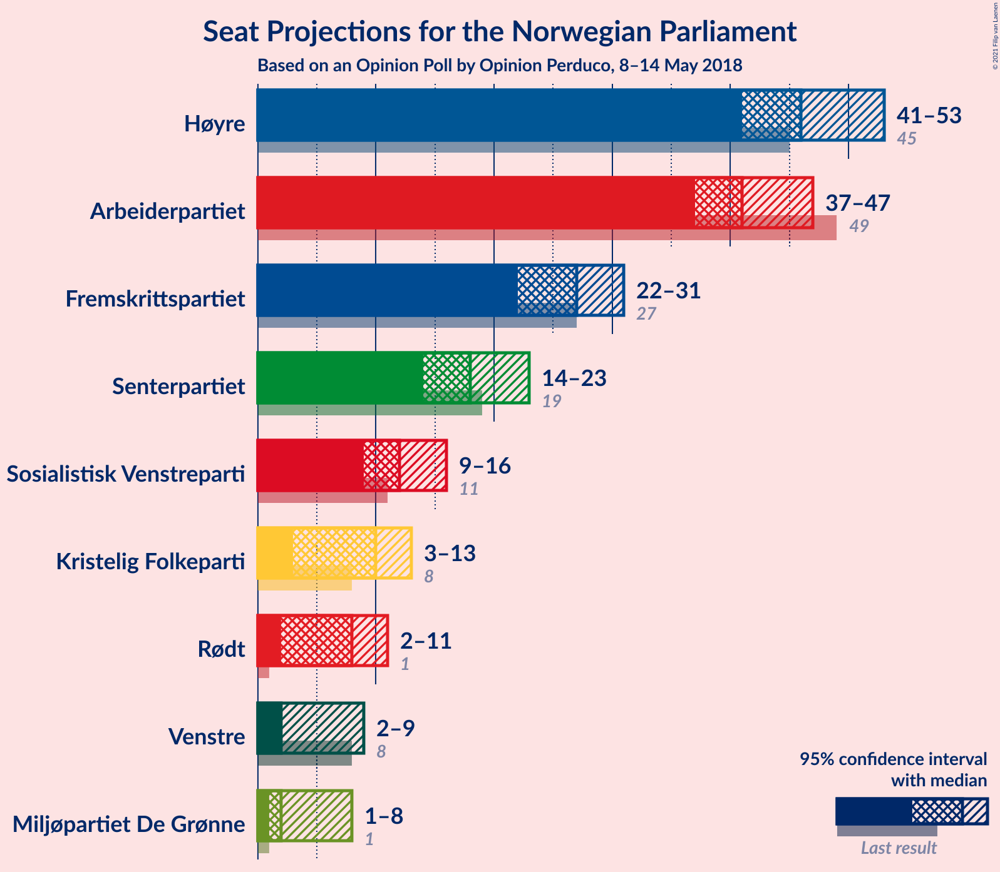
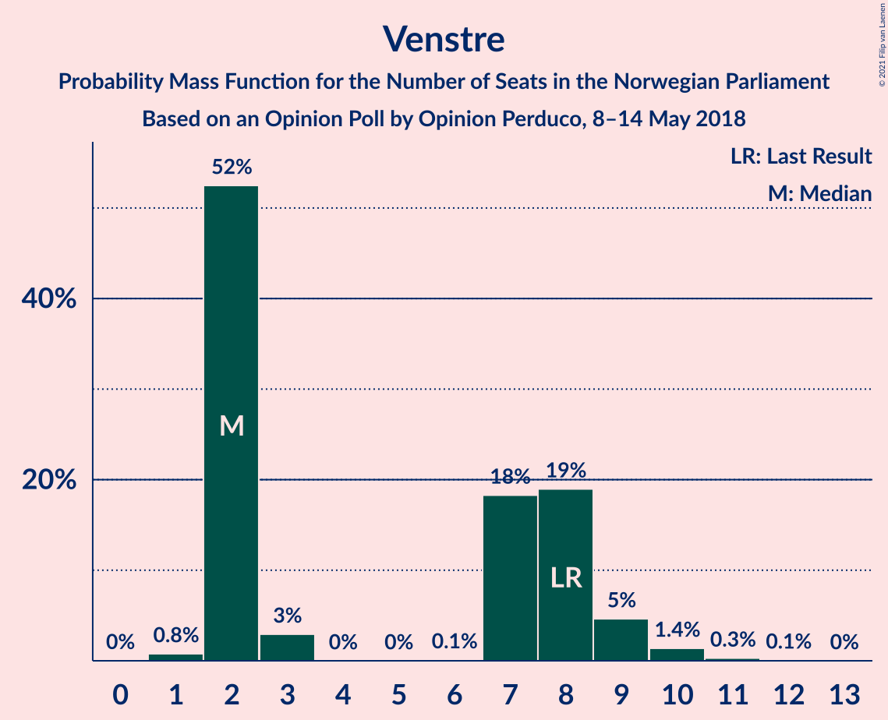
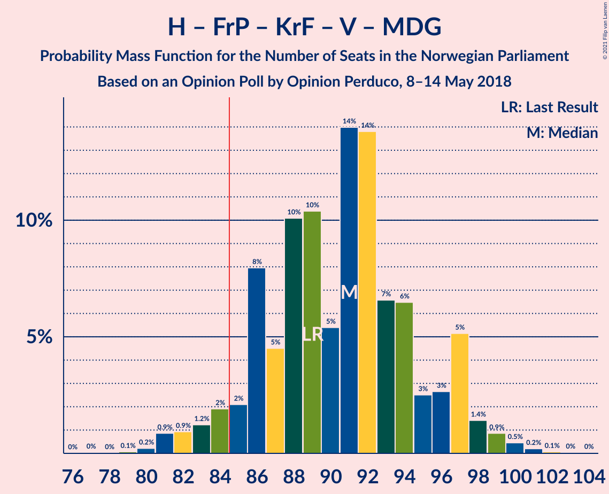
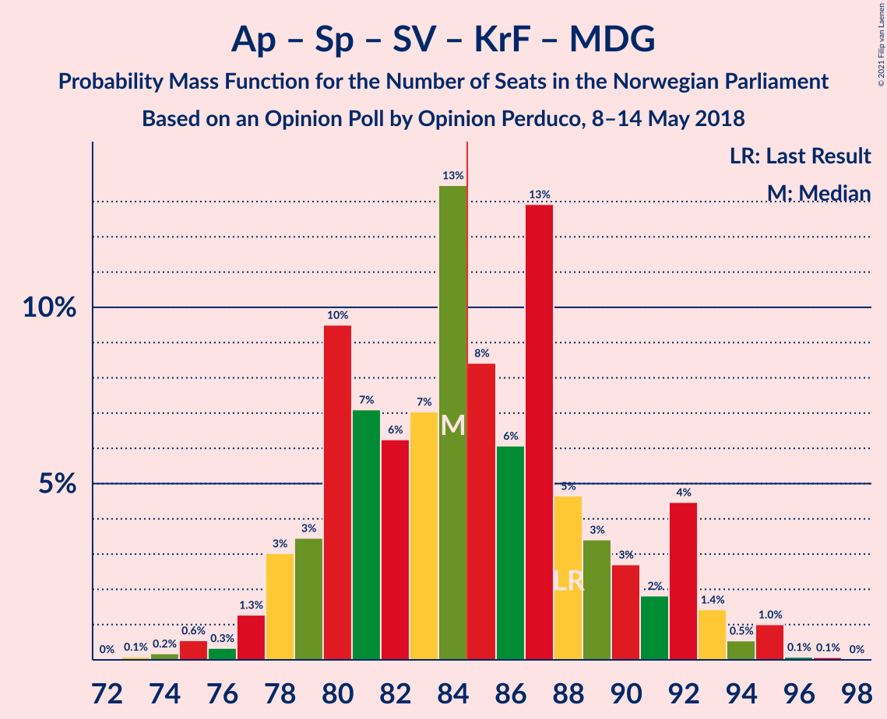
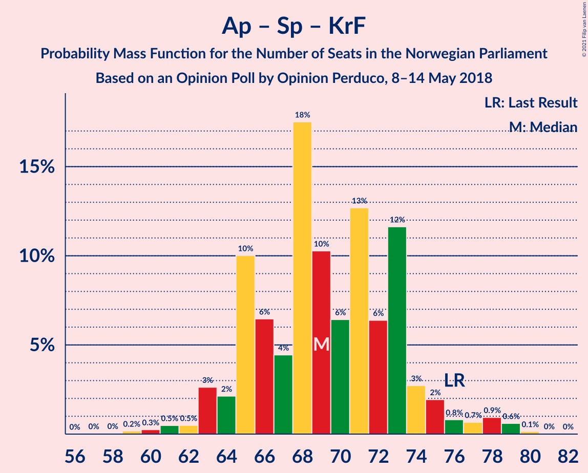
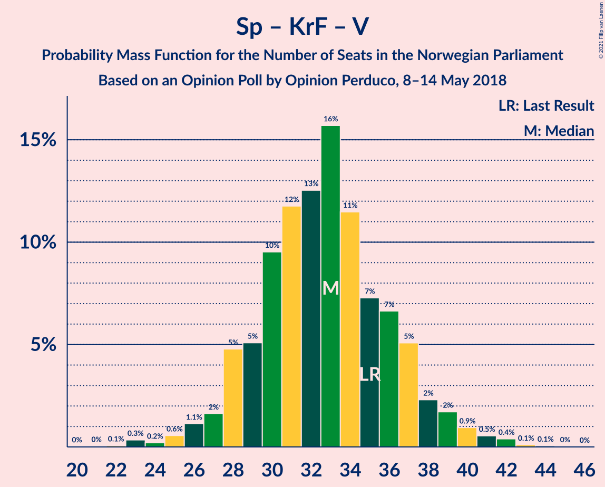

# Opinion Poll by Opinion Perduco, 8–14 May 2018

<a href="#voting-intentions">Voting Intentions</a> | <a href="#seats">Seats</a> | <a href="#coalitions">Coalitions</a> | <a href="#technical-information">Technical Information</a>

## Voting Intentions

### Confidence Intervals

| Party | Last Result | Poll Result | 80% Confidence Interval | 90% Confidence Interval | 95% Confidence Interval | 99% Confidence Interval |
|:-----:|:-----------:|:-----------:|:-----------------------:|:-----------------------:|:-----------------------:|:-----------------------:|
| Høyre | 25.0% | 26.5% | 24.4–28.8% |23.9–29.4% |23.4–29.9% |22.4–31.0% |
| Arbeiderpartiet | 27.4% | 22.8% | 20.8–24.9% |20.2–25.5% |19.8–26.0% |18.9–27.1% |
| Fremskrittspartiet | 15.2% | 14.9% | 13.3–16.8% |12.8–17.3% |12.5–17.8% |11.7–18.7% |
| Senterpartiet | 10.3% | 10.4% | 9.1–12.1% |8.7–12.5% |8.4–13.0% |7.8–13.8% |
| Sosialistisk Venstreparti | 6.0% | 7.1% | 6.0–8.5% |5.7–8.9% |5.4–9.3% |4.9–10.0% |
| Kristelig Folkeparti | 4.2% | 5.5% | 4.5–6.8% |4.3–7.1% |4.0–7.5% |3.6–8.1% |
| Rødt | 2.4% | 4.3% | 3.5–5.5% |3.3–5.9% |3.1–6.1% |2.7–6.8% |
| Venstre | 4.4% | 3.8% | 3.0–4.9% |2.8–5.2% |2.6–5.5% |2.3–6.1% |
| Miljøpartiet De Grønne | 3.2% | 3.3% | 2.6–4.4% |2.4–4.7% |2.2–5.0% |1.9–5.5% |

*Note:* The poll result column reflects the actual value used in the calculations. Published results may vary slightly, and in addition be rounded to fewer digits.

## Seats

### Confidence Intervals

| Party | Last Result | Median | 80% Confidence Interval | 90% Confidence Interval | 95% Confidence Interval | 99% Confidence Interval |
|:-----:|:-----------:|:------:|:-----------------------:|:-----------------------:|:-----------------------:|:-----------------------:|
| <a href="#høyre">Høyre</a> | 45 | 46 | 43–51 |42–53 |41–53 |39–56 |
| <a href="#arbeiderpartiet">Arbeiderpartiet</a> | 49 | 41 | 37–44 |37–45 |37–47 |34–49 |
| <a href="#fremskrittspartiet">Fremskrittspartiet</a> | 27 | 27 | 23–30 |23–31 |22–31 |20–34 |
| <a href="#senterpartiet">Senterpartiet</a> | 19 | 18 | 16–21 |15–22 |14–23 |13–25 |
| <a href="#sosialistisk-venstreparti">Sosialistisk Venstreparti</a> | 11 | 12 | 10–15 |10–16 |9–16 |8–18 |
| <a href="#kristelig-folkeparti">Kristelig Folkeparti</a> | 8 | 10 | 8–12 |7–12 |3–13 |3–14 |
| <a href="#rødt">Rødt</a> | 1 | 8 | 2–9 |2–10 |2–11 |1–12 |
| <a href="#venstre">Venstre</a> | 8 | 2 | 2–8 |2–9 |2–9 |1–10 |
| <a href="#miljøpartiet-de-grønne">Miljøpartiet De Grønne</a> | 1 | 2 | 1–7 |1–8 |1–8 |1–9 |

### Høyre

*For a full overview of the results for this party, see the [Høyre](party-høyre.html) page.*

| Number of Seats | Probability | Accumulated | Special Marks |
|:---------------:|:-----------:|:-----------:|:-------------:|
| 36 | 0% | 100% |  |
| 37 | 0.1% | 99.9% |  |
| 38 | 0.2% | 99.9% |  |
| 39 | 0.3% | 99.7% |  |
| 40 | 0.6% | 99.4% |  |
| 41 | 2% | 98.8% |  |
| 42 | 4% | 97% |  |
| 43 | 7% | 93% |  |
| 44 | 16% | 86% |  |
| 45 | 10% | 71% | Last Result |
| 46 | 13% | 61% | Median |
| 47 | 13% | 48% |  |
| 48 | 7% | 35% |  |
| 49 | 5% | 28% |  |
| 50 | 9% | 23% |  |
| 51 | 5% | 15% |  |
| 52 | 4% | 9% |  |
| 53 | 3% | 5% |  |
| 54 | 0.6% | 2% |  |
| 55 | 0.7% | 1.4% |  |
| 56 | 0.3% | 0.7% |  |
| 57 | 0.4% | 0.4% |  |
| 58 | 0% | 0.1% |  |
| 59 | 0% | 0% |  |

### Arbeiderpartiet

*For a full overview of the results for this party, see the [Arbeiderpartiet](party-arbeiderpartiet.html) page.*

| Number of Seats | Probability | Accumulated | Special Marks |
|:---------------:|:-----------:|:-----------:|:-------------:|
| 31 | 0.1% | 100% |  |
| 32 | 0% | 99.9% |  |
| 33 | 0.1% | 99.9% |  |
| 34 | 0.3% | 99.8% |  |
| 35 | 0.5% | 99.5% |  |
| 36 | 1.3% | 99.0% |  |
| 37 | 9% | 98% |  |
| 38 | 5% | 89% |  |
| 39 | 11% | 84% |  |
| 40 | 9% | 73% |  |
| 41 | 20% | 64% | Median |
| 42 | 18% | 44% |  |
| 43 | 9% | 27% |  |
| 44 | 8% | 17% |  |
| 45 | 5% | 9% |  |
| 46 | 1.1% | 4% |  |
| 47 | 1.3% | 3% |  |
| 48 | 1.1% | 2% |  |
| 49 | 0.4% | 0.8% | Last Result |
| 50 | 0.1% | 0.3% |  |
| 51 | 0.2% | 0.2% |  |
| 52 | 0% | 0% |  |

### Fremskrittspartiet

*For a full overview of the results for this party, see the [Fremskrittspartiet](party-fremskrittspartiet.html) page.*

| Number of Seats | Probability | Accumulated | Special Marks |
|:---------------:|:-----------:|:-----------:|:-------------:|
| 18 | 0.1% | 100% |  |
| 19 | 0.2% | 99.9% |  |
| 20 | 0.8% | 99.7% |  |
| 21 | 1.4% | 98.9% |  |
| 22 | 2% | 98% |  |
| 23 | 6% | 95% |  |
| 24 | 4% | 90% |  |
| 25 | 18% | 85% |  |
| 26 | 14% | 68% |  |
| 27 | 15% | 54% | Last Result, Median |
| 28 | 18% | 39% |  |
| 29 | 7% | 21% |  |
| 30 | 9% | 14% |  |
| 31 | 3% | 5% |  |
| 32 | 0.9% | 2% |  |
| 33 | 0.3% | 0.9% |  |
| 34 | 0.4% | 0.6% |  |
| 35 | 0.2% | 0.2% |  |
| 36 | 0% | 0% |  |

### Senterpartiet

*For a full overview of the results for this party, see the [Senterpartiet](party-senterpartiet.html) page.*

| Number of Seats | Probability | Accumulated | Special Marks |
|:---------------:|:-----------:|:-----------:|:-------------:|
| 12 | 0.1% | 100% |  |
| 13 | 0.4% | 99.9% |  |
| 14 | 4% | 99.4% |  |
| 15 | 3% | 96% |  |
| 16 | 8% | 93% |  |
| 17 | 20% | 85% |  |
| 18 | 21% | 65% | Median |
| 19 | 17% | 44% | Last Result |
| 20 | 11% | 26% |  |
| 21 | 9% | 15% |  |
| 22 | 3% | 6% |  |
| 23 | 2% | 3% |  |
| 24 | 0.7% | 1.2% |  |
| 25 | 0.4% | 0.6% |  |
| 26 | 0.1% | 0.2% |  |
| 27 | 0.1% | 0.1% |  |
| 28 | 0% | 0% |  |

### Sosialistisk Venstreparti

*For a full overview of the results for this party, see the [Sosialistisk Venstreparti](party-sosialistiskvenstreparti.html) page.*

| Number of Seats | Probability | Accumulated | Special Marks |
|:---------------:|:-----------:|:-----------:|:-------------:|
| 7 | 0% | 100% |  |
| 8 | 0.5% | 99.9% |  |
| 9 | 3% | 99.4% |  |
| 10 | 11% | 97% |  |
| 11 | 13% | 86% | Last Result |
| 12 | 23% | 72% | Median |
| 13 | 21% | 50% |  |
| 14 | 15% | 29% |  |
| 15 | 7% | 14% |  |
| 16 | 5% | 7% |  |
| 17 | 1.3% | 2% |  |
| 18 | 0.4% | 0.6% |  |
| 19 | 0.2% | 0.3% |  |
| 20 | 0% | 0% |  |

### Kristelig Folkeparti

*For a full overview of the results for this party, see the [Kristelig Folkeparti](party-kristeligfolkeparti.html) page.*

| Number of Seats | Probability | Accumulated | Special Marks |
|:---------------:|:-----------:|:-----------:|:-------------:|
| 2 | 0.1% | 100% |  |
| 3 | 2% | 99.9% |  |
| 4 | 0% | 97% |  |
| 5 | 0% | 97% |  |
| 6 | 0.2% | 97% |  |
| 7 | 4% | 97% |  |
| 8 | 11% | 94% | Last Result |
| 9 | 25% | 82% |  |
| 10 | 25% | 58% | Median |
| 11 | 17% | 33% |  |
| 12 | 12% | 16% |  |
| 13 | 3% | 4% |  |
| 14 | 1.1% | 2% |  |
| 15 | 0.3% | 0.4% |  |
| 16 | 0.1% | 0.1% |  |
| 17 | 0% | 0% |  |

### Rødt

*For a full overview of the results for this party, see the [Rødt](party-rødt.html) page.*

| Number of Seats | Probability | Accumulated | Special Marks |
|:---------------:|:-----------:|:-----------:|:-------------:|
| 1 | 2% | 100% | Last Result |
| 2 | 27% | 98% |  |
| 3 | 0% | 72% |  |
| 4 | 0% | 72% |  |
| 5 | 0% | 72% |  |
| 6 | 0.4% | 72% |  |
| 7 | 18% | 71% |  |
| 8 | 32% | 53% | Median |
| 9 | 12% | 21% |  |
| 10 | 6% | 9% |  |
| 11 | 2% | 3% |  |
| 12 | 0.6% | 0.7% |  |
| 13 | 0.1% | 0.1% |  |
| 14 | 0% | 0% |  |

### Venstre

*For a full overview of the results for this party, see the [Venstre](party-venstre.html) page.*

| Number of Seats | Probability | Accumulated | Special Marks |
|:---------------:|:-----------:|:-----------:|:-------------:|
| 1 | 0.8% | 100% |  |
| 2 | 52% | 99.2% | Median |
| 3 | 3% | 47% |  |
| 4 | 0% | 44% |  |
| 5 | 0% | 44% |  |
| 6 | 0.1% | 44% |  |
| 7 | 18% | 44% |  |
| 8 | 19% | 25% | Last Result |
| 9 | 5% | 6% |  |
| 10 | 1.4% | 2% |  |
| 11 | 0.3% | 0.4% |  |
| 12 | 0.1% | 0.1% |  |
| 13 | 0% | 0% |  |

### Miljøpartiet De Grønne

*For a full overview of the results for this party, see the [Miljøpartiet De Grønne](party-miljøpartietdegrønne.html) page.*

| Number of Seats | Probability | Accumulated | Special Marks |
|:---------------:|:-----------:|:-----------:|:-------------:|
| 0 | 0.4% | 100% |  |
| 1 | 31% | 99.6% | Last Result |
| 2 | 42% | 68% | Median |
| 3 | 8% | 26% |  |
| 4 | 0% | 18% |  |
| 5 | 0% | 18% |  |
| 6 | 0.9% | 18% |  |
| 7 | 9% | 17% |  |
| 8 | 6% | 8% |  |
| 9 | 2% | 2% |  |
| 10 | 0.2% | 0.3% |  |
| 11 | 0% | 0.1% |  |
| 12 | 0% | 0% |  |

## Coalitions

### Confidence Intervals

| Coalition | Last Result | Median | Majority? | 80% Confidence Interval | 90% Confidence Interval | 95% Confidence Interval | 99% Confidence Interval |
|:---------:|:-----------:|:------:|:---------:|:-----------------------:|:-----------------------:|:-----------------------:|:-----------------------:|
| Høyre – Fremskrittspartiet – Senterpartiet – Kristelig Folkeparti – Venstre | 107 | 106 | 100% | 101–111 | 99–113 | 98–113 | 96–116 |
| Høyre – Fremskrittspartiet – Kristelig Folkeparti – Venstre – Miljøpartiet De Grønne | 89 | 91 | 95% | 86–96 | 84–97 | 83–98 | 81–100 |
| Høyre – Fremskrittspartiet – Kristelig Folkeparti – Venstre | 88 | 88 | 80% | 83–93 | 81–95 | 79–95 | 78–97 |
| Arbeiderpartiet – Senterpartiet – Sosialistisk Venstreparti – Kristelig Folkeparti – Miljøpartiet De Grønne | 88 | 84 | 48% | 80–90 | 78–92 | 78–93 | 75–95 |
| Arbeiderpartiet – Senterpartiet – Sosialistisk Venstreparti – Rødt – Miljøpartiet De Grønne | 81 | 81 | 20% | 76–86 | 74–88 | 74–90 | 72–91 |
| Arbeiderpartiet – Senterpartiet – Sosialistisk Venstreparti – Rødt | 80 | 78 | 5% | 73–83 | 72–85 | 71–86 | 69–88 |
| Høyre – Fremskrittspartiet – Venstre | 80 | 78 | 3% | 73–83 | 71–84 | 70–85 | 68–88 |
| Arbeiderpartiet – Senterpartiet – Sosialistisk Venstreparti – Miljøpartiet De Grønne | 80 | 75 | 0.5% | 71–81 | 69–82 | 68–83 | 66–85 |
| Høyre – Fremskrittspartiet | 72 | 73 | 0.3% | 69–79 | 68–81 | 67–81 | 65–83 |
| Arbeiderpartiet – Senterpartiet – Kristelig Folkeparti – Miljøpartiet De Grønne | 77 | 72 | 0.1% | 67–77 | 66–78 | 65–80 | 63–82 |
| Arbeiderpartiet – Senterpartiet – Sosialistisk Venstreparti | 79 | 71 | 0.1% | 68–77 | 67–79 | 66–79 | 64–82 |
| Arbeiderpartiet – Senterpartiet – Kristelig Folkeparti | 76 | 69 | 0% | 65–73 | 64–75 | 63–76 | 60–79 |
| Høyre – Kristelig Folkeparti – Venstre | 61 | 61 | 0% | 56–66 | 55–67 | 54–68 | 51–71 |
| Arbeiderpartiet – Senterpartiet | 68 | 59 | 0% | 56–63 | 55–65 | 54–66 | 52–69 |
| Arbeiderpartiet – Sosialistisk Venstreparti | 60 | 54 | 0% | 50–58 | 49–60 | 48–60 | 46–62 |
| Senterpartiet – Kristelig Folkeparti – Venstre | 35 | 33 | 0% | 29–37 | 28–38 | 27–39 | 24–42 |

### Høyre – Fremskrittspartiet – Senterpartiet – Kristelig Folkeparti – Venstre

| Number of Seats | Probability | Accumulated | Special Marks |
|:---------------:|:-----------:|:-----------:|:-------------:|
| 93 | 0% | 100% |  |
| 94 | 0.1% | 99.9% |  |
| 95 | 0.3% | 99.8% |  |
| 96 | 0.4% | 99.5% |  |
| 97 | 1.1% | 99.1% |  |
| 98 | 1.3% | 98% |  |
| 99 | 2% | 97% |  |
| 100 | 3% | 95% |  |
| 101 | 4% | 92% |  |
| 102 | 3% | 89% |  |
| 103 | 6% | 86% | Median |
| 104 | 10% | 80% |  |
| 105 | 17% | 69% |  |
| 106 | 10% | 52% |  |
| 107 | 8% | 42% | Last Result |
| 108 | 8% | 34% |  |
| 109 | 7% | 26% |  |
| 110 | 6% | 19% |  |
| 111 | 4% | 13% |  |
| 112 | 3% | 9% |  |
| 113 | 4% | 6% |  |
| 114 | 0.8% | 2% |  |
| 115 | 0.8% | 2% |  |
| 116 | 0.5% | 0.8% |  |
| 117 | 0.2% | 0.4% |  |
| 118 | 0.1% | 0.2% |  |
| 119 | 0% | 0.1% |  |
| 120 | 0% | 0.1% |  |
| 121 | 0% | 0% |  |

### Høyre – Fremskrittspartiet – Kristelig Folkeparti – Venstre – Miljøpartiet De Grønne

| Number of Seats | Probability | Accumulated | Special Marks |
|:---------------:|:-----------:|:-----------:|:-------------:|
| 77 | 0% | 100% |  |
| 78 | 0% | 99.9% |  |
| 79 | 0.1% | 99.9% |  |
| 80 | 0.2% | 99.8% |  |
| 81 | 0.9% | 99.6% |  |
| 82 | 0.9% | 98.8% |  |
| 83 | 1.2% | 98% |  |
| 84 | 2% | 97% |  |
| 85 | 2% | 95% | Majority |
| 86 | 8% | 93% |  |
| 87 | 5% | 85% | Median |
| 88 | 10% | 80% |  |
| 89 | 10% | 70% | Last Result |
| 90 | 5% | 60% |  |
| 91 | 14% | 54% |  |
| 92 | 14% | 40% |  |
| 93 | 7% | 26% |  |
| 94 | 6% | 20% |  |
| 95 | 3% | 13% |  |
| 96 | 3% | 11% |  |
| 97 | 5% | 8% |  |
| 98 | 1.4% | 3% |  |
| 99 | 0.9% | 2% |  |
| 100 | 0.5% | 0.8% |  |
| 101 | 0.2% | 0.4% |  |
| 102 | 0.1% | 0.2% |  |
| 103 | 0% | 0.1% |  |
| 104 | 0% | 0% |  |

### Høyre – Fremskrittspartiet – Kristelig Folkeparti – Venstre

| Number of Seats | Probability | Accumulated | Special Marks |
|:---------------:|:-----------:|:-----------:|:-------------:|
| 75 | 0.1% | 100% |  |
| 76 | 0.1% | 99.9% |  |
| 77 | 0.1% | 99.8% |  |
| 78 | 0.9% | 99.6% |  |
| 79 | 2% | 98.7% |  |
| 80 | 0.8% | 97% |  |
| 81 | 2% | 96% |  |
| 82 | 3% | 94% |  |
| 83 | 4% | 91% |  |
| 84 | 7% | 87% |  |
| 85 | 10% | 80% | Median, Majority |
| 86 | 7% | 70% |  |
| 87 | 10% | 64% |  |
| 88 | 9% | 54% | Last Result |
| 89 | 7% | 44% |  |
| 90 | 15% | 37% |  |
| 91 | 8% | 22% |  |
| 92 | 3% | 14% |  |
| 93 | 4% | 11% |  |
| 94 | 1.2% | 7% |  |
| 95 | 4% | 6% |  |
| 96 | 0.8% | 2% |  |
| 97 | 0.8% | 1.2% |  |
| 98 | 0.2% | 0.4% |  |
| 99 | 0.1% | 0.3% |  |
| 100 | 0.1% | 0.1% |  |
| 101 | 0% | 0% |  |

### Arbeiderpartiet – Senterpartiet – Sosialistisk Venstreparti – Kristelig Folkeparti – Miljøpartiet De Grønne

| Number of Seats | Probability | Accumulated | Special Marks |
|:---------------:|:-----------:|:-----------:|:-------------:|
| 73 | 0.1% | 100% |  |
| 74 | 0.2% | 99.9% |  |
| 75 | 0.6% | 99.7% |  |
| 76 | 0.3% | 99.1% |  |
| 77 | 1.3% | 98.8% |  |
| 78 | 3% | 98% |  |
| 79 | 3% | 94% |  |
| 80 | 10% | 91% |  |
| 81 | 7% | 82% |  |
| 82 | 6% | 74% |  |
| 83 | 7% | 68% | Median |
| 84 | 13% | 61% |  |
| 85 | 8% | 48% | Majority |
| 86 | 6% | 39% |  |
| 87 | 13% | 33% |  |
| 88 | 5% | 20% | Last Result |
| 89 | 3% | 16% |  |
| 90 | 3% | 12% |  |
| 91 | 2% | 9% |  |
| 92 | 4% | 8% |  |
| 93 | 1.4% | 3% |  |
| 94 | 0.5% | 2% |  |
| 95 | 1.0% | 1.2% |  |
| 96 | 0.1% | 0.2% |  |
| 97 | 0.1% | 0.1% |  |
| 98 | 0% | 0% |  |

### Arbeiderpartiet – Senterpartiet – Sosialistisk Venstreparti – Rødt – Miljøpartiet De Grønne

| Number of Seats | Probability | Accumulated | Special Marks |
|:---------------:|:-----------:|:-----------:|:-------------:|
| 69 | 0.1% | 100% |  |
| 70 | 0.1% | 99.9% |  |
| 71 | 0.2% | 99.7% |  |
| 72 | 0.8% | 99.6% |  |
| 73 | 0.8% | 98.8% |  |
| 74 | 4% | 98% |  |
| 75 | 1.2% | 94% |  |
| 76 | 4% | 93% |  |
| 77 | 3% | 89% |  |
| 78 | 8% | 86% |  |
| 79 | 15% | 78% |  |
| 80 | 7% | 63% |  |
| 81 | 9% | 56% | Last Result, Median |
| 82 | 10% | 46% |  |
| 83 | 7% | 36% |  |
| 84 | 10% | 30% |  |
| 85 | 7% | 20% | Majority |
| 86 | 4% | 13% |  |
| 87 | 3% | 9% |  |
| 88 | 2% | 6% |  |
| 89 | 0.8% | 4% |  |
| 90 | 2% | 3% |  |
| 91 | 0.9% | 1.3% |  |
| 92 | 0.1% | 0.4% |  |
| 93 | 0.1% | 0.2% |  |
| 94 | 0.1% | 0.1% |  |
| 95 | 0% | 0% |  |

### Arbeiderpartiet – Senterpartiet – Sosialistisk Venstreparti – Rødt

| Number of Seats | Probability | Accumulated | Special Marks |
|:---------------:|:-----------:|:-----------:|:-------------:|
| 66 | 0% | 100% |  |
| 67 | 0.1% | 99.9% |  |
| 68 | 0.2% | 99.8% |  |
| 69 | 0.5% | 99.6% |  |
| 70 | 0.9% | 99.2% |  |
| 71 | 1.4% | 98% |  |
| 72 | 5% | 97% |  |
| 73 | 3% | 92% |  |
| 74 | 3% | 89% |  |
| 75 | 6% | 87% |  |
| 76 | 7% | 80% |  |
| 77 | 14% | 74% |  |
| 78 | 14% | 60% |  |
| 79 | 5% | 46% | Median |
| 80 | 10% | 40% | Last Result |
| 81 | 10% | 30% |  |
| 82 | 5% | 20% |  |
| 83 | 8% | 15% |  |
| 84 | 2% | 7% |  |
| 85 | 2% | 5% | Majority |
| 86 | 1.2% | 3% |  |
| 87 | 0.9% | 2% |  |
| 88 | 0.9% | 1.2% |  |
| 89 | 0.2% | 0.4% |  |
| 90 | 0.1% | 0.2% |  |
| 91 | 0% | 0.1% |  |
| 92 | 0% | 0.1% |  |
| 93 | 0% | 0% |  |

### Høyre – Fremskrittspartiet – Venstre

| Number of Seats | Probability | Accumulated | Special Marks |
|:---------------:|:-----------:|:-----------:|:-------------:|
| 66 | 0.1% | 100% |  |
| 67 | 0.1% | 99.9% |  |
| 68 | 0.6% | 99.8% |  |
| 69 | 1.1% | 99.1% |  |
| 70 | 0.7% | 98% |  |
| 71 | 2% | 97% |  |
| 72 | 3% | 95% |  |
| 73 | 2% | 91% |  |
| 74 | 10% | 89% |  |
| 75 | 9% | 79% | Median |
| 76 | 10% | 71% |  |
| 77 | 5% | 61% |  |
| 78 | 9% | 56% |  |
| 79 | 8% | 47% |  |
| 80 | 10% | 39% | Last Result |
| 81 | 8% | 29% |  |
| 82 | 7% | 21% |  |
| 83 | 9% | 14% |  |
| 84 | 2% | 5% |  |
| 85 | 0.9% | 3% | Majority |
| 86 | 0.7% | 2% |  |
| 87 | 0.9% | 2% |  |
| 88 | 0.5% | 0.8% |  |
| 89 | 0.2% | 0.3% |  |
| 90 | 0% | 0.1% |  |
| 91 | 0% | 0% |  |

### Arbeiderpartiet – Senterpartiet – Sosialistisk Venstreparti – Miljøpartiet De Grønne

| Number of Seats | Probability | Accumulated | Special Marks |
|:---------------:|:-----------:|:-----------:|:-------------:|
| 63 | 0% | 100% |  |
| 64 | 0.1% | 99.9% |  |
| 65 | 0.1% | 99.8% |  |
| 66 | 0.5% | 99.7% |  |
| 67 | 1.2% | 99.1% |  |
| 68 | 1.3% | 98% |  |
| 69 | 3% | 97% |  |
| 70 | 4% | 94% |  |
| 71 | 13% | 90% |  |
| 72 | 13% | 77% |  |
| 73 | 6% | 64% | Median |
| 74 | 6% | 58% |  |
| 75 | 10% | 52% |  |
| 76 | 8% | 41% |  |
| 77 | 12% | 34% |  |
| 78 | 4% | 21% |  |
| 79 | 5% | 17% |  |
| 80 | 2% | 12% | Last Result |
| 81 | 2% | 10% |  |
| 82 | 5% | 8% |  |
| 83 | 1.4% | 4% |  |
| 84 | 2% | 2% |  |
| 85 | 0.2% | 0.5% | Majority |
| 86 | 0.2% | 0.4% |  |
| 87 | 0.1% | 0.2% |  |
| 88 | 0% | 0.1% |  |
| 89 | 0% | 0% |  |

### Høyre – Fremskrittspartiet

| Number of Seats | Probability | Accumulated | Special Marks |
|:---------------:|:-----------:|:-----------:|:-------------:|
| 62 | 0.1% | 100% |  |
| 63 | 0.1% | 99.9% |  |
| 64 | 0.2% | 99.8% |  |
| 65 | 0.4% | 99.5% |  |
| 66 | 2% | 99.2% |  |
| 67 | 1.5% | 98% |  |
| 68 | 2% | 96% |  |
| 69 | 5% | 94% |  |
| 70 | 9% | 89% |  |
| 71 | 5% | 80% |  |
| 72 | 19% | 75% | Last Result |
| 73 | 10% | 56% | Median |
| 74 | 19% | 46% |  |
| 75 | 4% | 28% |  |
| 76 | 4% | 23% |  |
| 77 | 4% | 19% |  |
| 78 | 4% | 15% |  |
| 79 | 3% | 12% |  |
| 80 | 3% | 9% |  |
| 81 | 4% | 5% |  |
| 82 | 0.5% | 1.4% |  |
| 83 | 0.4% | 0.9% |  |
| 84 | 0.2% | 0.4% |  |
| 85 | 0.1% | 0.3% | Majority |
| 86 | 0.1% | 0.2% |  |
| 87 | 0% | 0.1% |  |
| 88 | 0% | 0% |  |

### Arbeiderpartiet – Senterpartiet – Kristelig Folkeparti – Miljøpartiet De Grønne

| Number of Seats | Probability | Accumulated | Special Marks |
|:---------------:|:-----------:|:-----------:|:-------------:|
| 60 | 0% | 100% |  |
| 61 | 0.1% | 99.9% |  |
| 62 | 0.3% | 99.9% |  |
| 63 | 0.4% | 99.6% |  |
| 64 | 0.6% | 99.1% |  |
| 65 | 2% | 98.6% |  |
| 66 | 3% | 97% |  |
| 67 | 7% | 94% |  |
| 68 | 4% | 87% |  |
| 69 | 7% | 83% |  |
| 70 | 12% | 75% |  |
| 71 | 10% | 63% | Median |
| 72 | 8% | 53% |  |
| 73 | 9% | 44% |  |
| 74 | 9% | 35% |  |
| 75 | 9% | 27% |  |
| 76 | 8% | 18% |  |
| 77 | 3% | 10% | Last Result |
| 78 | 2% | 7% |  |
| 79 | 1.3% | 5% |  |
| 80 | 2% | 4% |  |
| 81 | 0.7% | 1.4% |  |
| 82 | 0.4% | 0.7% |  |
| 83 | 0.1% | 0.3% |  |
| 84 | 0.1% | 0.2% |  |
| 85 | 0.1% | 0.1% | Majority |
| 86 | 0% | 0% |  |

### Arbeiderpartiet – Senterpartiet – Sosialistisk Venstreparti

| Number of Seats | Probability | Accumulated | Special Marks |
|:---------------:|:-----------:|:-----------:|:-------------:|
| 61 | 0% | 100% |  |
| 62 | 0.1% | 99.9% |  |
| 63 | 0.2% | 99.8% |  |
| 64 | 0.3% | 99.6% |  |
| 65 | 1.2% | 99.2% |  |
| 66 | 2% | 98% |  |
| 67 | 2% | 96% |  |
| 68 | 8% | 94% |  |
| 69 | 9% | 85% |  |
| 70 | 19% | 76% |  |
| 71 | 10% | 57% | Median |
| 72 | 6% | 47% |  |
| 73 | 6% | 42% |  |
| 74 | 7% | 35% |  |
| 75 | 13% | 28% |  |
| 76 | 4% | 15% |  |
| 77 | 3% | 11% |  |
| 78 | 1.4% | 8% |  |
| 79 | 4% | 6% | Last Result |
| 80 | 1.1% | 2% |  |
| 81 | 0.5% | 1.1% |  |
| 82 | 0.1% | 0.6% |  |
| 83 | 0.3% | 0.5% |  |
| 84 | 0.1% | 0.2% |  |
| 85 | 0% | 0.1% | Majority |
| 86 | 0% | 0% |  |

### Arbeiderpartiet – Senterpartiet – Kristelig Folkeparti

| Number of Seats | Probability | Accumulated | Special Marks |
|:---------------:|:-----------:|:-----------:|:-------------:|
| 57 | 0% | 100% |  |
| 58 | 0% | 99.9% |  |
| 59 | 0.2% | 99.9% |  |
| 60 | 0.3% | 99.7% |  |
| 61 | 0.5% | 99.5% |  |
| 62 | 0.5% | 99.0% |  |
| 63 | 3% | 98.5% |  |
| 64 | 2% | 96% |  |
| 65 | 10% | 94% |  |
| 66 | 6% | 84% |  |
| 67 | 4% | 77% |  |
| 68 | 18% | 73% |  |
| 69 | 10% | 55% | Median |
| 70 | 6% | 45% |  |
| 71 | 13% | 39% |  |
| 72 | 6% | 26% |  |
| 73 | 12% | 20% |  |
| 74 | 3% | 8% |  |
| 75 | 2% | 5% |  |
| 76 | 0.8% | 3% | Last Result |
| 77 | 0.7% | 2% |  |
| 78 | 0.9% | 2% |  |
| 79 | 0.6% | 0.8% |  |
| 80 | 0.1% | 0.2% |  |
| 81 | 0% | 0.1% |  |
| 82 | 0% | 0% |  |

### Høyre – Kristelig Folkeparti – Venstre

| Number of Seats | Probability | Accumulated | Special Marks |
|:---------------:|:-----------:|:-----------:|:-------------:|
| 48 | 0% | 100% |  |
| 49 | 0% | 99.9% |  |
| 50 | 0.3% | 99.9% |  |
| 51 | 0.2% | 99.6% |  |
| 52 | 1.0% | 99.4% |  |
| 53 | 0.8% | 98% |  |
| 54 | 1.4% | 98% |  |
| 55 | 4% | 96% |  |
| 56 | 5% | 92% |  |
| 57 | 3% | 88% |  |
| 58 | 9% | 84% | Median |
| 59 | 10% | 76% |  |
| 60 | 11% | 66% |  |
| 61 | 10% | 55% | Last Result |
| 62 | 8% | 45% |  |
| 63 | 10% | 37% |  |
| 64 | 9% | 27% |  |
| 65 | 6% | 17% |  |
| 66 | 2% | 11% |  |
| 67 | 6% | 10% |  |
| 68 | 2% | 4% |  |
| 69 | 0.8% | 2% |  |
| 70 | 0.7% | 1.5% |  |
| 71 | 0.4% | 0.8% |  |
| 72 | 0.3% | 0.4% |  |
| 73 | 0.1% | 0.1% |  |
| 74 | 0% | 0.1% |  |
| 75 | 0% | 0% |  |

### Arbeiderpartiet – Senterpartiet

| Number of Seats | Probability | Accumulated | Special Marks |
|:---------------:|:-----------:|:-----------:|:-------------:|
| 50 | 0.1% | 100% |  |
| 51 | 0.2% | 99.8% |  |
| 52 | 0.3% | 99.7% |  |
| 53 | 0.5% | 99.3% |  |
| 54 | 2% | 98.8% |  |
| 55 | 4% | 97% |  |
| 56 | 10% | 93% |  |
| 57 | 15% | 83% |  |
| 58 | 8% | 68% |  |
| 59 | 17% | 60% | Median |
| 60 | 7% | 43% |  |
| 61 | 7% | 36% |  |
| 62 | 9% | 29% |  |
| 63 | 12% | 20% |  |
| 64 | 2% | 8% |  |
| 65 | 2% | 6% |  |
| 66 | 1.5% | 3% |  |
| 67 | 0.6% | 2% |  |
| 68 | 0.6% | 1.2% | Last Result |
| 69 | 0.4% | 0.6% |  |
| 70 | 0.1% | 0.2% |  |
| 71 | 0.1% | 0.1% |  |
| 72 | 0% | 0% |  |

### Arbeiderpartiet – Sosialistisk Venstreparti

| Number of Seats | Probability | Accumulated | Special Marks |
|:---------------:|:-----------:|:-----------:|:-------------:|
| 43 | 0% | 100% |  |
| 44 | 0.2% | 99.9% |  |
| 45 | 0.1% | 99.8% |  |
| 46 | 0.3% | 99.6% |  |
| 47 | 1.2% | 99.3% |  |
| 48 | 1.1% | 98% |  |
| 49 | 5% | 97% |  |
| 50 | 6% | 92% |  |
| 51 | 10% | 86% |  |
| 52 | 14% | 76% |  |
| 53 | 9% | 62% | Median |
| 54 | 16% | 52% |  |
| 55 | 11% | 37% |  |
| 56 | 9% | 26% |  |
| 57 | 6% | 17% |  |
| 58 | 3% | 11% |  |
| 59 | 1.3% | 8% |  |
| 60 | 4% | 6% | Last Result |
| 61 | 0.8% | 2% |  |
| 62 | 0.8% | 1.2% |  |
| 63 | 0.3% | 0.4% |  |
| 64 | 0.1% | 0.1% |  |
| 65 | 0% | 0.1% |  |
| 66 | 0% | 0% |  |

### Senterpartiet – Kristelig Folkeparti – Venstre

| Number of Seats | Probability | Accumulated | Special Marks |
|:---------------:|:-----------:|:-----------:|:-------------:|
| 21 | 0% | 100% |  |
| 22 | 0.1% | 99.9% |  |
| 23 | 0.3% | 99.9% |  |
| 24 | 0.2% | 99.5% |  |
| 25 | 0.6% | 99.3% |  |
| 26 | 1.1% | 98.7% |  |
| 27 | 2% | 98% |  |
| 28 | 5% | 96% |  |
| 29 | 5% | 91% |  |
| 30 | 10% | 86% | Median |
| 31 | 12% | 77% |  |
| 32 | 13% | 65% |  |
| 33 | 16% | 52% |  |
| 34 | 11% | 37% |  |
| 35 | 7% | 25% | Last Result |
| 36 | 7% | 18% |  |
| 37 | 5% | 11% |  |
| 38 | 2% | 6% |  |
| 39 | 2% | 4% |  |
| 40 | 0.9% | 2% |  |
| 41 | 0.5% | 1.1% |  |
| 42 | 0.4% | 0.6% |  |
| 43 | 0.1% | 0.2% |  |
| 44 | 0.1% | 0.1% |  |
| 45 | 0% | 0% |  |

## Technical Information

### Opinion Poll

+ **Polling firm:** Opinion Perduco
+ **Commissioner(s):** —
+ **Fieldwork period:** 8–14 May 2018

### Calculations

+ **Sample size:** 690
+ **Simulations done:** 1,048,576
+ **Error estimate:** 1.92%

