# Opinion Poll by Norstat, 27 May–4 June 2018

<a href="#voting-intentions">Voting Intentions</a> | <a href="#seats">Seats</a> | <a href="#coalitions">Coalitions</a> | <a href="#technical-information">Technical Information</a>

## Voting Intentions

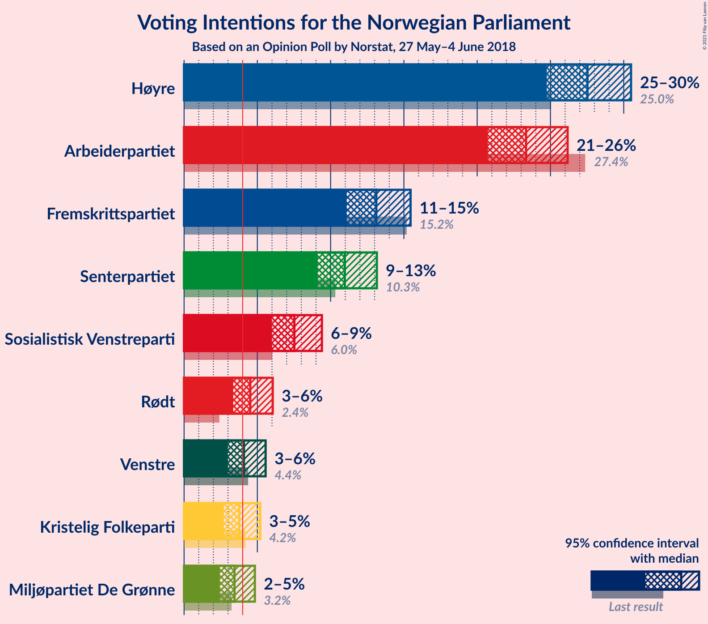

### Confidence Intervals

| Party | Last Result | Poll Result | 80% Confidence Interval | 90% Confidence Interval | 95% Confidence Interval | 99% Confidence Interval |
|:-----:|:-----------:|:-----------:|:-----------------------:|:-----------------------:|:-----------------------:|:-----------------------:|
| Høyre | 25.0% | 27.5% | 25.7–29.5% |25.2–30.0% |24.8–30.5% |23.9–31.4% |
| Arbeiderpartiet | 27.4% | 23.3% | 21.6–25.2% |21.1–25.7% |20.7–26.2% |19.9–27.1% |
| Fremskrittspartiet | 15.2% | 13.1% | 11.8–14.6% |11.4–15.1% |11.1–15.5% |10.5–16.2% |
| Senterpartiet | 10.3% | 11.0% | 9.8–12.4% |9.4–12.8% |9.1–13.2% |8.6–13.9% |
| Sosialistisk Venstreparti | 6.0% | 7.5% | 6.5–8.8% |6.2–9.1% |6.0–9.4% |5.5–10.0% |
| Rødt | 2.4% | 4.5% | 3.7–5.5% |3.5–5.8% |3.4–6.1% |3.0–6.6% |
| Venstre | 4.4% | 4.1% | 3.4–5.0% |3.2–5.3% |3.0–5.6% |2.7–6.1% |
| Kristelig Folkeparti | 4.2% | 3.8% | 3.1–4.7% |2.9–5.0% |2.7–5.2% |2.4–5.7% |
| Miljøpartiet De Grønne | 3.2% | 3.4% | 2.8–4.3% |2.6–4.6% |2.4–4.8% |2.2–5.3% |

*Note:* The poll result column reflects the actual value used in the calculations. Published results may vary slightly, and in addition be rounded to fewer digits.

## Seats

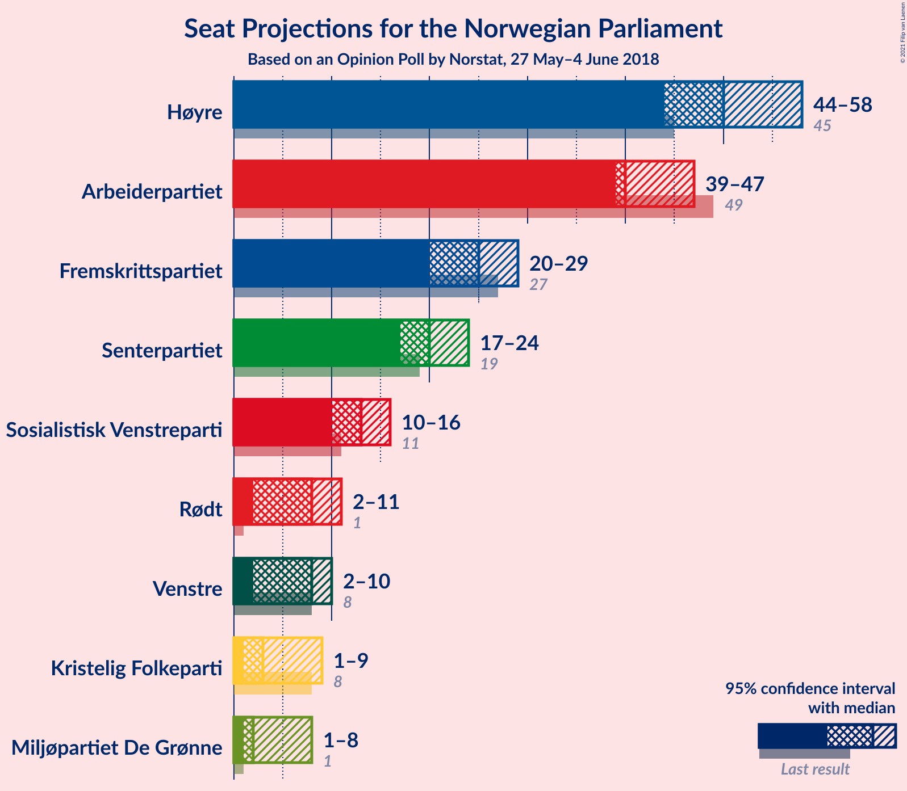

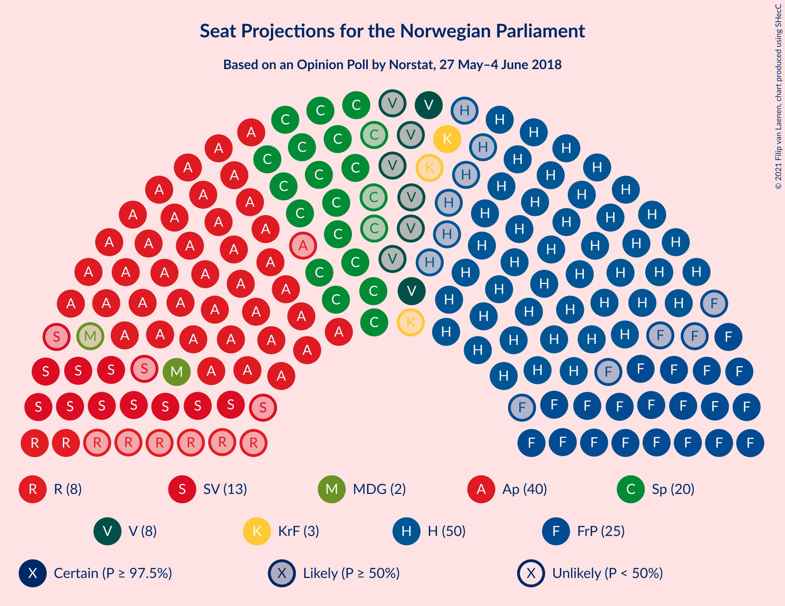

### Confidence Intervals

| Party | Last Result | Median | 80% Confidence Interval | 90% Confidence Interval | 95% Confidence Interval | 99% Confidence Interval |
|:-----:|:-----------:|:------:|:-----------------------:|:-----------------------:|:-----------------------:|:-----------------------:|
| <a href="#høyre">Høyre</a> | 45 | 50 | 46–54 |46–57 |44–58 |42–59 |
| <a href="#arbeiderpartiet">Arbeiderpartiet</a> | 49 | 40 | 39–44 |39–45 |39–47 |38–49 |
| <a href="#fremskrittspartiet">Fremskrittspartiet</a> | 27 | 25 | 22–26 |20–28 |20–29 |18–30 |
| <a href="#senterpartiet">Senterpartiet</a> | 19 | 20 | 17–22 |17–22 |17–24 |15–26 |
| <a href="#sosialistisk-venstreparti">Sosialistisk Venstreparti</a> | 11 | 13 | 12–16 |11–16 |10–16 |9–18 |
| <a href="#rødt">Rødt</a> | 1 | 8 | 2–10 |2–10 |2–11 |2–12 |
| <a href="#venstre">Venstre</a> | 8 | 8 | 2–9 |2–10 |2–10 |2–11 |
| <a href="#kristelig-folkeparti">Kristelig Folkeparti</a> | 8 | 3 | 3–8 |2–8 |1–9 |1–10 |
| <a href="#miljøpartiet-de-grønne">Miljøpartiet De Grønne</a> | 1 | 2 | 1–3 |1–7 |1–8 |1–9 |

### Høyre

*For a full overview of the results for this party, see the [Høyre](party-høyre.html) page.*

| Number of Seats | Probability | Accumulated | Special Marks |
|:---------------:|:-----------:|:-----------:|:-------------:|
| 41 | 0% | 100% |  |
| 42 | 0.9% | 99.9% |  |
| 43 | 0.4% | 99.1% |  |
| 44 | 2% | 98.7% |  |
| 45 | 1.2% | 96% | Last Result |
| 46 | 15% | 95% |  |
| 47 | 3% | 80% |  |
| 48 | 6% | 77% |  |
| 49 | 19% | 71% |  |
| 50 | 28% | 52% | Median |
| 51 | 10% | 24% |  |
| 52 | 2% | 14% |  |
| 53 | 0.6% | 12% |  |
| 54 | 4% | 11% |  |
| 55 | 0.8% | 7% |  |
| 56 | 1.2% | 6% |  |
| 57 | 0.2% | 5% |  |
| 58 | 3% | 5% |  |
| 59 | 1.4% | 2% |  |
| 60 | 0.1% | 0.1% |  |
| 61 | 0% | 0% |  |

### Arbeiderpartiet

*For a full overview of the results for this party, see the [Arbeiderpartiet](party-arbeiderpartiet.html) page.*

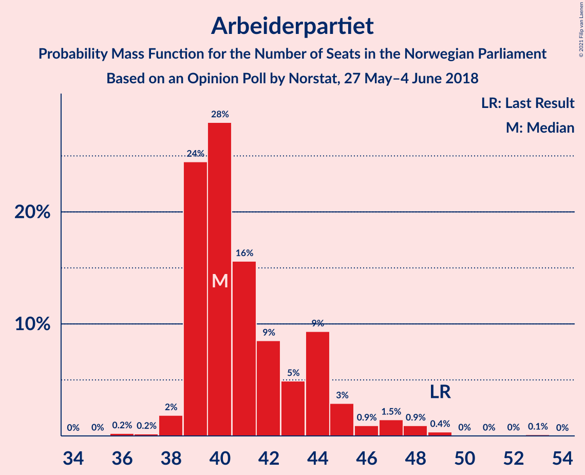

| Number of Seats | Probability | Accumulated | Special Marks |
|:---------------:|:-----------:|:-----------:|:-------------:|
| 35 | 0% | 100% |  |
| 36 | 0.2% | 99.9% |  |
| 37 | 0.2% | 99.7% |  |
| 38 | 2% | 99.5% |  |
| 39 | 24% | 98% |  |
| 40 | 28% | 73% | Median |
| 41 | 16% | 45% |  |
| 42 | 9% | 30% |  |
| 43 | 5% | 21% |  |
| 44 | 9% | 16% |  |
| 45 | 3% | 7% |  |
| 46 | 0.9% | 4% |  |
| 47 | 1.5% | 3% |  |
| 48 | 0.9% | 2% |  |
| 49 | 0.4% | 0.6% | Last Result |
| 50 | 0% | 0.3% |  |
| 51 | 0% | 0.2% |  |
| 52 | 0% | 0.2% |  |
| 53 | 0.1% | 0.1% |  |
| 54 | 0% | 0% |  |

### Fremskrittspartiet

*For a full overview of the results for this party, see the [Fremskrittspartiet](party-fremskrittspartiet.html) page.*

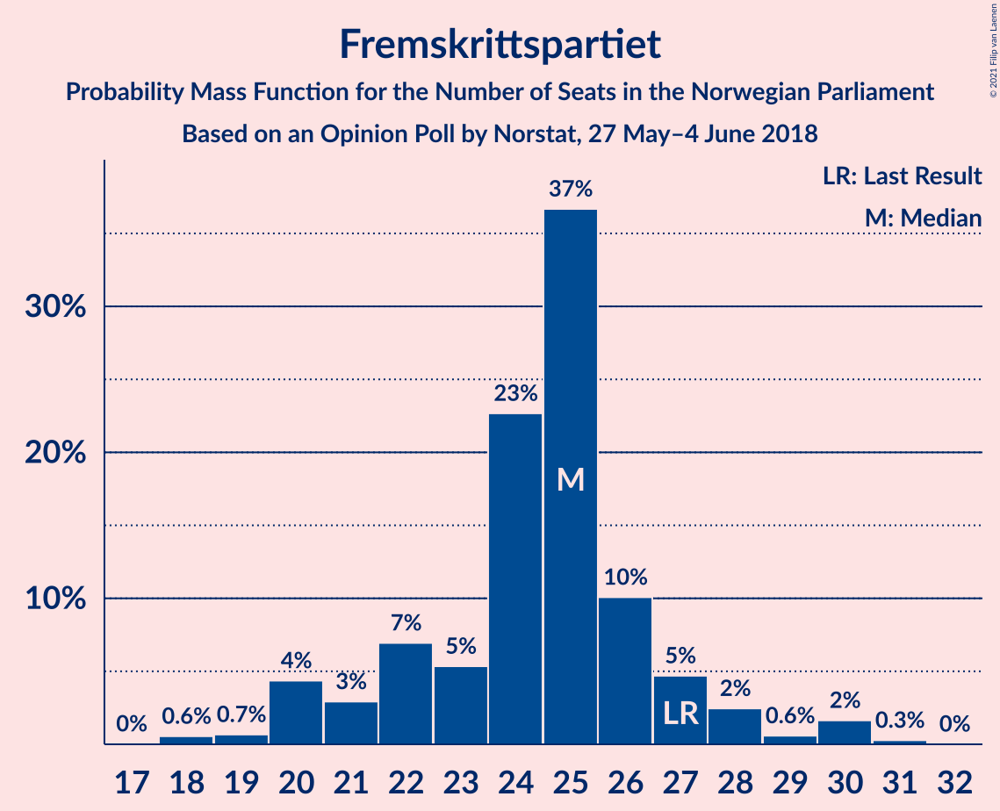

| Number of Seats | Probability | Accumulated | Special Marks |
|:---------------:|:-----------:|:-----------:|:-------------:|
| 17 | 0% | 100% |  |
| 18 | 0.6% | 99.9% |  |
| 19 | 0.7% | 99.4% |  |
| 20 | 4% | 98.7% |  |
| 21 | 3% | 94% |  |
| 22 | 7% | 91% |  |
| 23 | 5% | 84% |  |
| 24 | 23% | 79% |  |
| 25 | 37% | 56% | Median |
| 26 | 10% | 20% |  |
| 27 | 5% | 10% | Last Result |
| 28 | 2% | 5% |  |
| 29 | 0.6% | 3% |  |
| 30 | 2% | 2% |  |
| 31 | 0.3% | 0.3% |  |
| 32 | 0% | 0% |  |

### Senterpartiet

*For a full overview of the results for this party, see the [Senterpartiet](party-senterpartiet.html) page.*

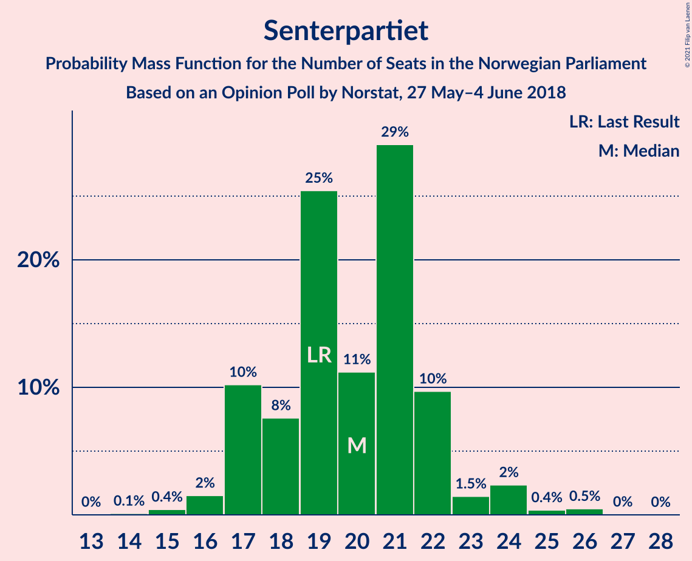

| Number of Seats | Probability | Accumulated | Special Marks |
|:---------------:|:-----------:|:-----------:|:-------------:|
| 14 | 0.1% | 100% |  |
| 15 | 0.4% | 99.9% |  |
| 16 | 2% | 99.4% |  |
| 17 | 10% | 98% |  |
| 18 | 8% | 88% |  |
| 19 | 25% | 80% | Last Result |
| 20 | 11% | 55% | Median |
| 21 | 29% | 43% |  |
| 22 | 10% | 14% |  |
| 23 | 1.5% | 5% |  |
| 24 | 2% | 3% |  |
| 25 | 0.4% | 0.9% |  |
| 26 | 0.5% | 0.5% |  |
| 27 | 0% | 0.1% |  |
| 28 | 0% | 0% |  |

### Sosialistisk Venstreparti

*For a full overview of the results for this party, see the [Sosialistisk Venstreparti](party-sosialistiskvenstreparti.html) page.*

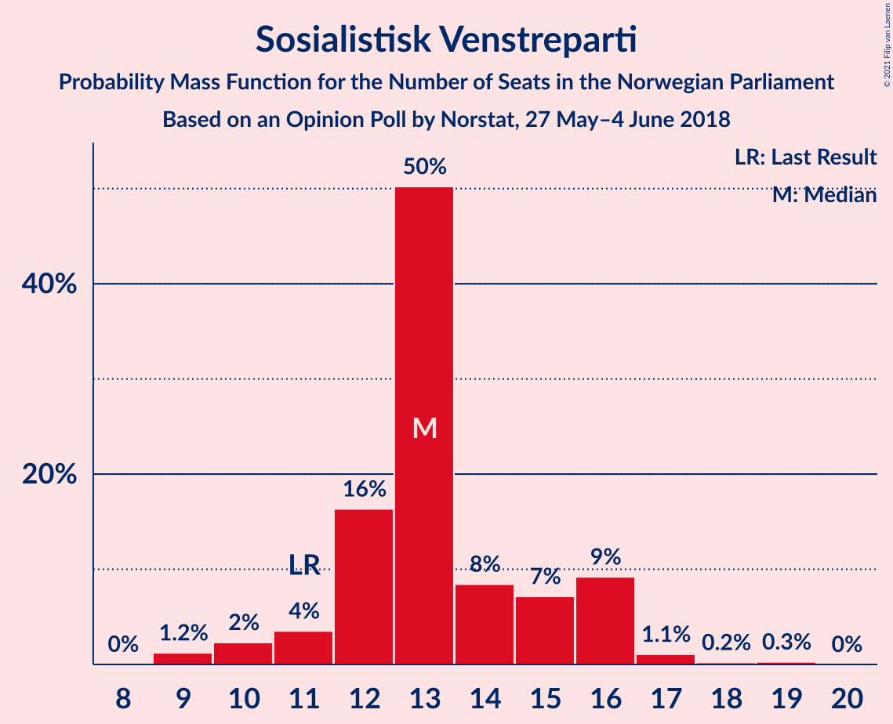

| Number of Seats | Probability | Accumulated | Special Marks |
|:---------------:|:-----------:|:-----------:|:-------------:|
| 9 | 1.2% | 100% |  |
| 10 | 2% | 98.7% |  |
| 11 | 4% | 96% | Last Result |
| 12 | 16% | 93% |  |
| 13 | 50% | 77% | Median |
| 14 | 8% | 26% |  |
| 15 | 7% | 18% |  |
| 16 | 9% | 11% |  |
| 17 | 1.1% | 2% |  |
| 18 | 0.2% | 0.5% |  |
| 19 | 0.3% | 0.3% |  |
| 20 | 0% | 0% |  |

### Rødt

*For a full overview of the results for this party, see the [Rødt](party-rødt.html) page.*

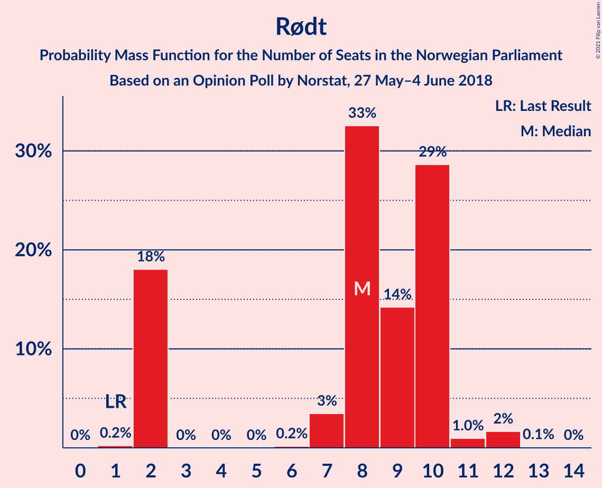

| Number of Seats | Probability | Accumulated | Special Marks |
|:---------------:|:-----------:|:-----------:|:-------------:|
| 1 | 0.2% | 100% | Last Result |
| 2 | 18% | 99.8% |  |
| 3 | 0% | 82% |  |
| 4 | 0% | 82% |  |
| 5 | 0% | 82% |  |
| 6 | 0.2% | 82% |  |
| 7 | 3% | 82% |  |
| 8 | 33% | 78% | Median |
| 9 | 14% | 46% |  |
| 10 | 29% | 31% |  |
| 11 | 1.0% | 3% |  |
| 12 | 2% | 2% |  |
| 13 | 0.1% | 0.1% |  |
| 14 | 0% | 0% |  |

### Venstre

*For a full overview of the results for this party, see the [Venstre](party-venstre.html) page.*

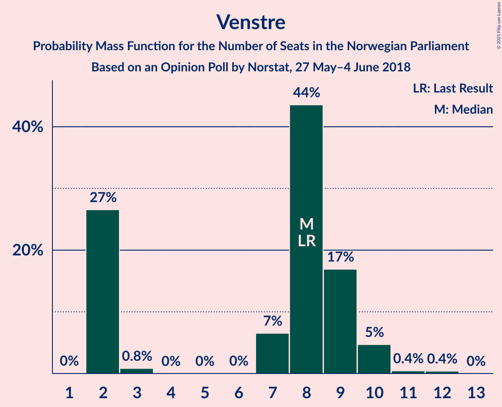

| Number of Seats | Probability | Accumulated | Special Marks |
|:---------------:|:-----------:|:-----------:|:-------------:|
| 2 | 27% | 100% |  |
| 3 | 0.8% | 73% |  |
| 4 | 0% | 73% |  |
| 5 | 0% | 73% |  |
| 6 | 0% | 73% |  |
| 7 | 7% | 73% |  |
| 8 | 44% | 66% | Last Result, Median |
| 9 | 17% | 22% |  |
| 10 | 5% | 6% |  |
| 11 | 0.4% | 0.8% |  |
| 12 | 0.4% | 0.4% |  |
| 13 | 0% | 0% |  |

### Kristelig Folkeparti

*For a full overview of the results for this party, see the [Kristelig Folkeparti](party-kristeligfolkeparti.html) page.*

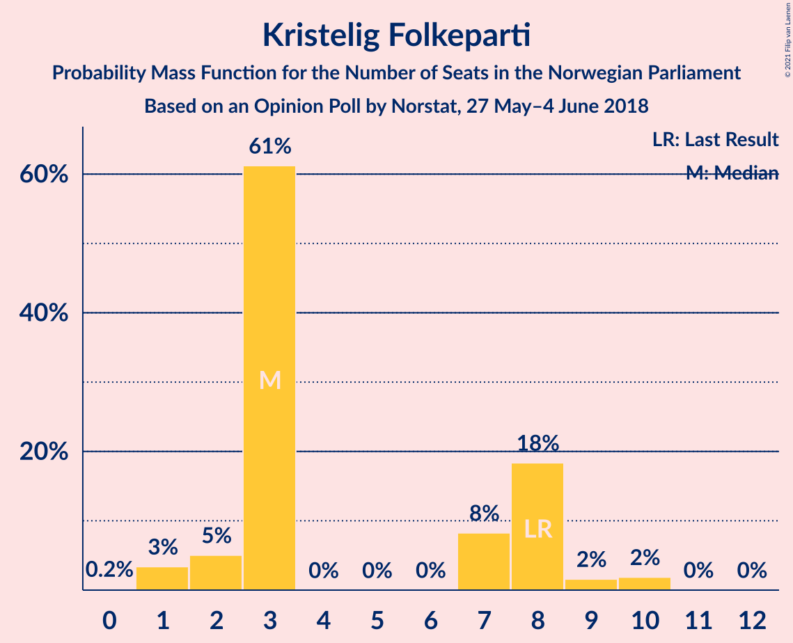

| Number of Seats | Probability | Accumulated | Special Marks |
|:---------------:|:-----------:|:-----------:|:-------------:|
| 0 | 0.2% | 100% |  |
| 1 | 3% | 99.8% |  |
| 2 | 5% | 96% |  |
| 3 | 61% | 91% | Median |
| 4 | 0% | 30% |  |
| 5 | 0% | 30% |  |
| 6 | 0% | 30% |  |
| 7 | 8% | 30% |  |
| 8 | 18% | 22% | Last Result |
| 9 | 2% | 4% |  |
| 10 | 2% | 2% |  |
| 11 | 0% | 0.1% |  |
| 12 | 0% | 0% |  |

### Miljøpartiet De Grønne

*For a full overview of the results for this party, see the [Miljøpartiet De Grønne](party-miljøpartietdegrønne.html) page.*

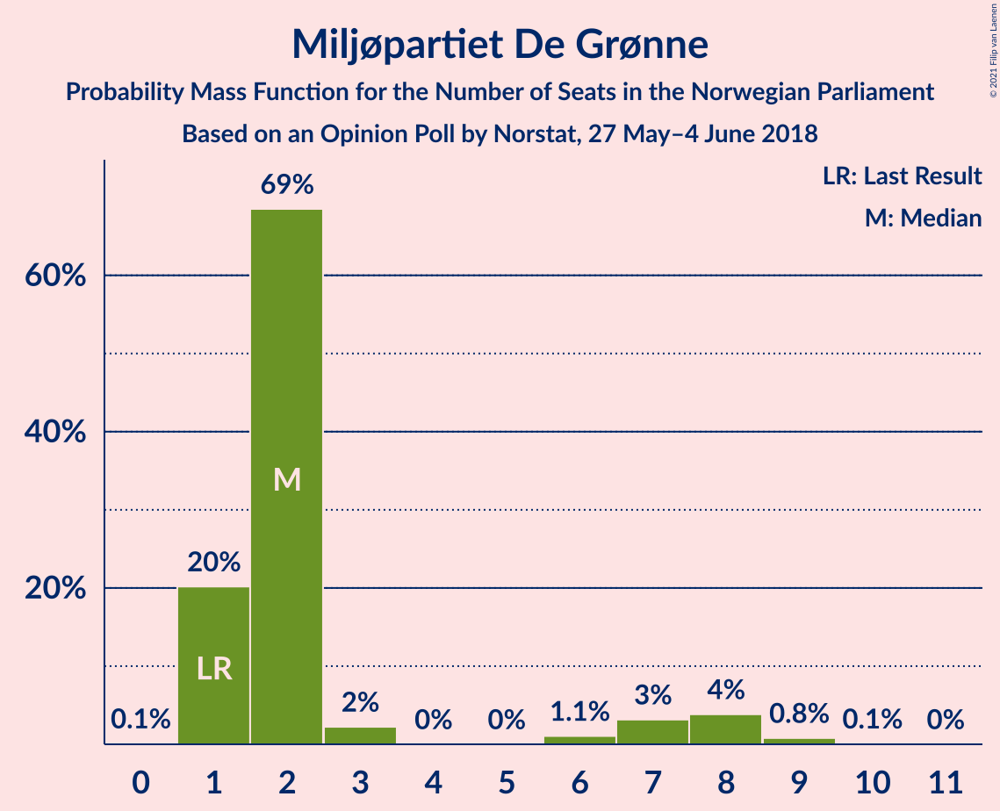

| Number of Seats | Probability | Accumulated | Special Marks |
|:---------------:|:-----------:|:-----------:|:-------------:|
| 0 | 0.1% | 100% |  |
| 1 | 20% | 99.9% | Last Result |
| 2 | 69% | 80% | Median |
| 3 | 2% | 11% |  |
| 4 | 0% | 9% |  |
| 5 | 0% | 9% |  |
| 6 | 1.1% | 9% |  |
| 7 | 3% | 8% |  |
| 8 | 4% | 5% |  |
| 9 | 0.8% | 0.9% |  |
| 10 | 0.1% | 0.1% |  |
| 11 | 0% | 0% |  |

## Coalitions

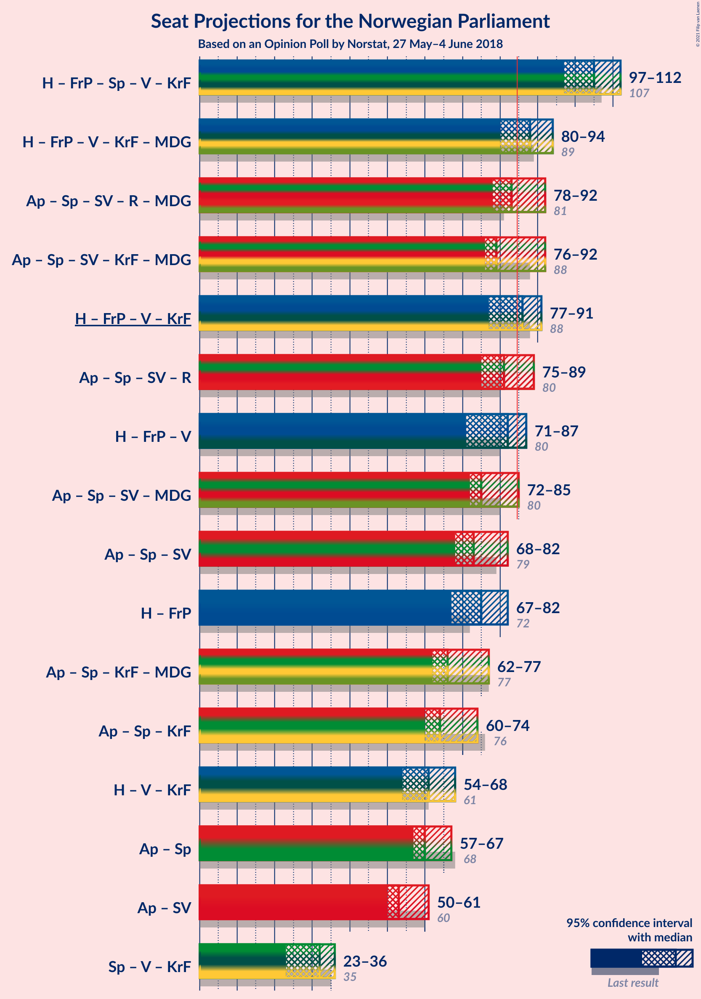

### Confidence Intervals

| Coalition | Last Result | Median | Majority? | 80% Confidence Interval | 90% Confidence Interval | 95% Confidence Interval | 99% Confidence Interval |
|:---------:|:-----------:|:------:|:---------:|:-----------------------:|:-----------------------:|:-----------------------:|:-----------------------:|
| Høyre – Fremskrittspartiet – Senterpartiet – Venstre – Kristelig Folkeparti | 107 | 105 | 100% | 100–107 | 99–110 | 97–112 | 95–113 |
| Høyre – Fremskrittspartiet – Venstre – Kristelig Folkeparti – Miljøpartiet De Grønne | 89 | 88 | 80% | 83–91 | 81–93 | 80–94 | 79–95 |
| Arbeiderpartiet – Senterpartiet – Sosialistisk Venstreparti – Rødt – Miljøpartiet De Grønne | 81 | 83 | 30% | 80–89 | 79–91 | 78–92 | 77–93 |
| Arbeiderpartiet – Senterpartiet – Sosialistisk Venstreparti – Kristelig Folkeparti – Miljøpartiet De Grønne | 88 | 79 | 18% | 77–88 | 77–91 | 76–92 | 75–94 |
| Høyre – Fremskrittspartiet – Venstre – Kristelig Folkeparti | 88 | 86 | 70% | 80–89 | 78–90 | 77–91 | 76–92 |
| Arbeiderpartiet – Senterpartiet – Sosialistisk Venstreparti – Rødt | 80 | 81 | 20% | 78–86 | 76–88 | 75–89 | 74–90 |
| Høyre – Fremskrittspartiet – Venstre | 80 | 82 | 7% | 75–83 | 73–86 | 71–87 | 69–89 |
| Arbeiderpartiet – Senterpartiet – Sosialistisk Venstreparti – Miljøpartiet De Grønne | 80 | 75 | 3% | 72–81 | 72–83 | 72–85 | 70–88 |
| Arbeiderpartiet – Senterpartiet – Sosialistisk Venstreparti | 79 | 73 | 0.5% | 70–79 | 70–80 | 68–82 | 67–85 |
| Høyre – Fremskrittspartiet | 72 | 75 | 2% | 69–78 | 68–80 | 67–82 | 66–85 |
| Arbeiderpartiet – Senterpartiet – Kristelig Folkeparti – Miljøpartiet De Grønne | 77 | 66 | 0% | 64–74 | 64–76 | 62–77 | 62–81 |
| Arbeiderpartiet – Senterpartiet – Kristelig Folkeparti | 76 | 64 | 0% | 62–70 | 61–74 | 60–74 | 58–76 |
| Høyre – Venstre – Kristelig Folkeparti | 61 | 61 | 0% | 56–64 | 55–65 | 54–68 | 52–71 |
| Arbeiderpartiet – Senterpartiet | 68 | 60 | 0% | 58–64 | 57–66 | 57–67 | 56–69 |
| Arbeiderpartiet – Sosialistisk Venstreparti | 60 | 53 | 0% | 52–60 | 51–60 | 50–61 | 49–64 |
| Senterpartiet – Venstre – Kristelig Folkeparti | 35 | 32 | 0% | 27–34 | 24–35 | 23–36 | 21–38 |

### Høyre – Fremskrittspartiet – Senterpartiet – Venstre – Kristelig Folkeparti

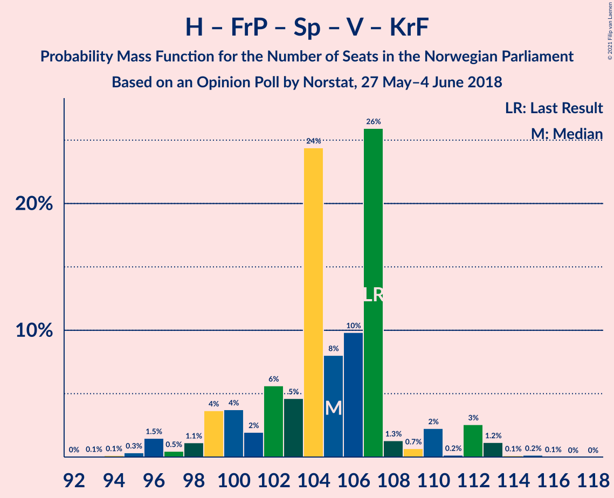

| Number of Seats | Probability | Accumulated | Special Marks |
|:---------------:|:-----------:|:-----------:|:-------------:|
| 92 | 0% | 100% |  |
| 93 | 0.1% | 99.9% |  |
| 94 | 0.1% | 99.8% |  |
| 95 | 0.3% | 99.7% |  |
| 96 | 1.5% | 99.4% |  |
| 97 | 0.5% | 98% |  |
| 98 | 1.1% | 97% |  |
| 99 | 4% | 96% |  |
| 100 | 4% | 93% |  |
| 101 | 2% | 89% |  |
| 102 | 6% | 87% |  |
| 103 | 5% | 81% |  |
| 104 | 24% | 77% |  |
| 105 | 8% | 52% |  |
| 106 | 10% | 44% | Median |
| 107 | 26% | 34% | Last Result |
| 108 | 1.3% | 8% |  |
| 109 | 0.7% | 7% |  |
| 110 | 2% | 6% |  |
| 111 | 0.2% | 4% |  |
| 112 | 3% | 4% |  |
| 113 | 1.2% | 1.5% |  |
| 114 | 0.1% | 0.3% |  |
| 115 | 0.2% | 0.2% |  |
| 116 | 0.1% | 0.1% |  |
| 117 | 0% | 0% |  |

### Høyre – Fremskrittspartiet – Venstre – Kristelig Folkeparti – Miljøpartiet De Grønne

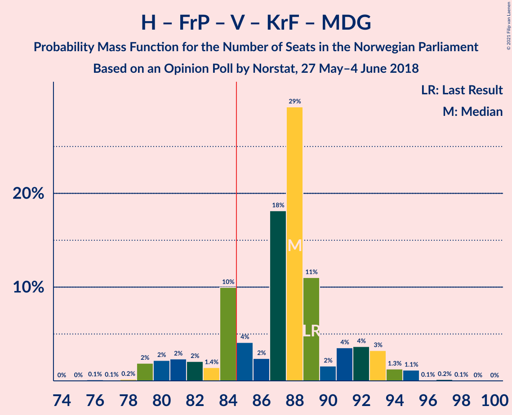

| Number of Seats | Probability | Accumulated | Special Marks |
|:---------------:|:-----------:|:-----------:|:-------------:|
| 75 | 0% | 100% |  |
| 76 | 0.1% | 99.9% |  |
| 77 | 0.1% | 99.8% |  |
| 78 | 0.2% | 99.7% |  |
| 79 | 2% | 99.6% |  |
| 80 | 2% | 98% |  |
| 81 | 2% | 95% |  |
| 82 | 2% | 93% |  |
| 83 | 1.4% | 91% |  |
| 84 | 10% | 90% |  |
| 85 | 4% | 80% | Majority |
| 86 | 2% | 76% |  |
| 87 | 18% | 73% |  |
| 88 | 29% | 55% | Median |
| 89 | 11% | 26% | Last Result |
| 90 | 2% | 15% |  |
| 91 | 4% | 13% |  |
| 92 | 4% | 10% |  |
| 93 | 3% | 6% |  |
| 94 | 1.3% | 3% |  |
| 95 | 1.1% | 2% |  |
| 96 | 0.1% | 0.4% |  |
| 97 | 0.2% | 0.3% |  |
| 98 | 0.1% | 0.1% |  |
| 99 | 0% | 0.1% |  |
| 100 | 0% | 0% |  |

### Arbeiderpartiet – Senterpartiet – Sosialistisk Venstreparti – Rødt – Miljøpartiet De Grønne

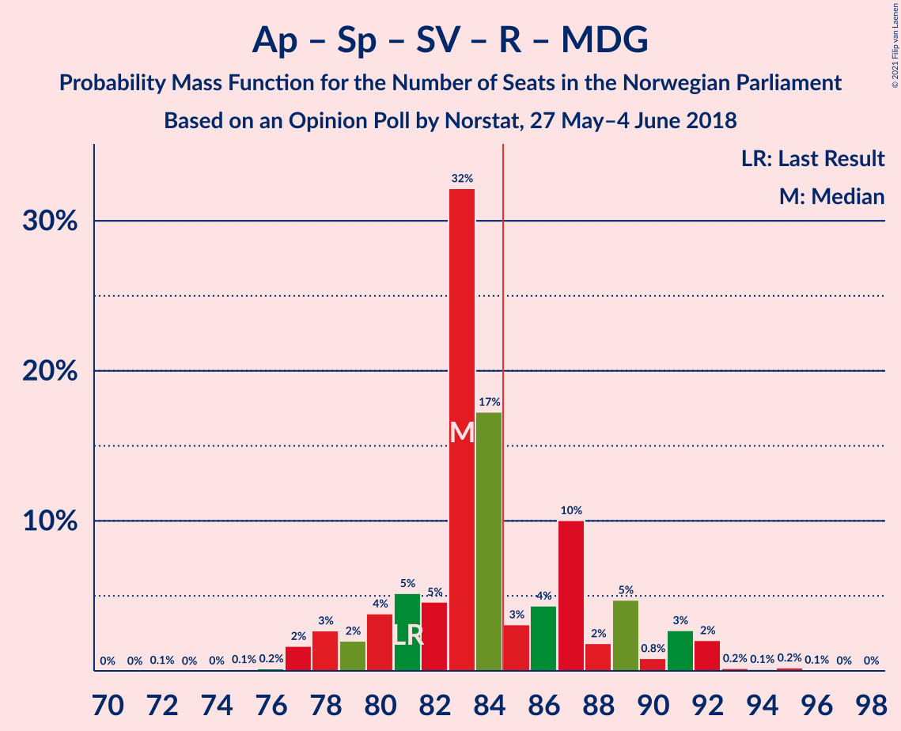

| Number of Seats | Probability | Accumulated | Special Marks |
|:---------------:|:-----------:|:-----------:|:-------------:|
| 72 | 0.1% | 100% |  |
| 73 | 0% | 99.9% |  |
| 74 | 0% | 99.9% |  |
| 75 | 0.1% | 99.9% |  |
| 76 | 0.2% | 99.8% |  |
| 77 | 2% | 99.6% |  |
| 78 | 3% | 98% |  |
| 79 | 2% | 95% |  |
| 80 | 4% | 93% |  |
| 81 | 5% | 89% | Last Result |
| 82 | 5% | 84% |  |
| 83 | 32% | 80% | Median |
| 84 | 17% | 48% |  |
| 85 | 3% | 30% | Majority |
| 86 | 4% | 27% |  |
| 87 | 10% | 23% |  |
| 88 | 2% | 13% |  |
| 89 | 5% | 11% |  |
| 90 | 0.8% | 6% |  |
| 91 | 3% | 5% |  |
| 92 | 2% | 3% |  |
| 93 | 0.2% | 0.7% |  |
| 94 | 0.1% | 0.5% |  |
| 95 | 0.2% | 0.4% |  |
| 96 | 0.1% | 0.1% |  |
| 97 | 0% | 0.1% |  |
| 98 | 0% | 0% |  |

### Arbeiderpartiet – Senterpartiet – Sosialistisk Venstreparti – Kristelig Folkeparti – Miljøpartiet De Grønne

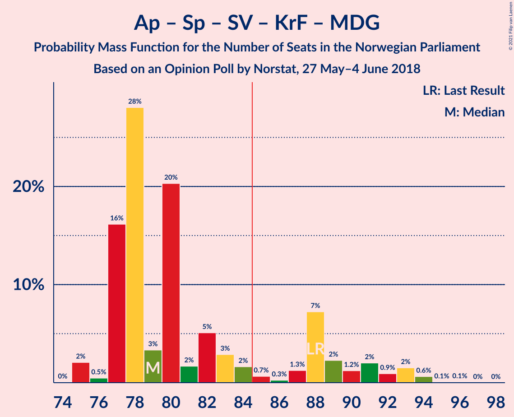

| Number of Seats | Probability | Accumulated | Special Marks |
|:---------------:|:-----------:|:-----------:|:-------------:|
| 74 | 0% | 100% |  |
| 75 | 2% | 99.9% |  |
| 76 | 0.5% | 98% |  |
| 77 | 16% | 97% |  |
| 78 | 28% | 81% | Median |
| 79 | 3% | 53% |  |
| 80 | 20% | 50% |  |
| 81 | 2% | 29% |  |
| 82 | 5% | 28% |  |
| 83 | 3% | 23% |  |
| 84 | 2% | 20% |  |
| 85 | 0.7% | 18% | Majority |
| 86 | 0.3% | 18% |  |
| 87 | 1.3% | 17% |  |
| 88 | 7% | 16% | Last Result |
| 89 | 2% | 9% |  |
| 90 | 1.2% | 6% |  |
| 91 | 2% | 5% |  |
| 92 | 0.9% | 3% |  |
| 93 | 2% | 2% |  |
| 94 | 0.6% | 0.8% |  |
| 95 | 0.1% | 0.1% |  |
| 96 | 0.1% | 0.1% |  |
| 97 | 0% | 0% |  |

### Høyre – Fremskrittspartiet – Venstre – Kristelig Folkeparti

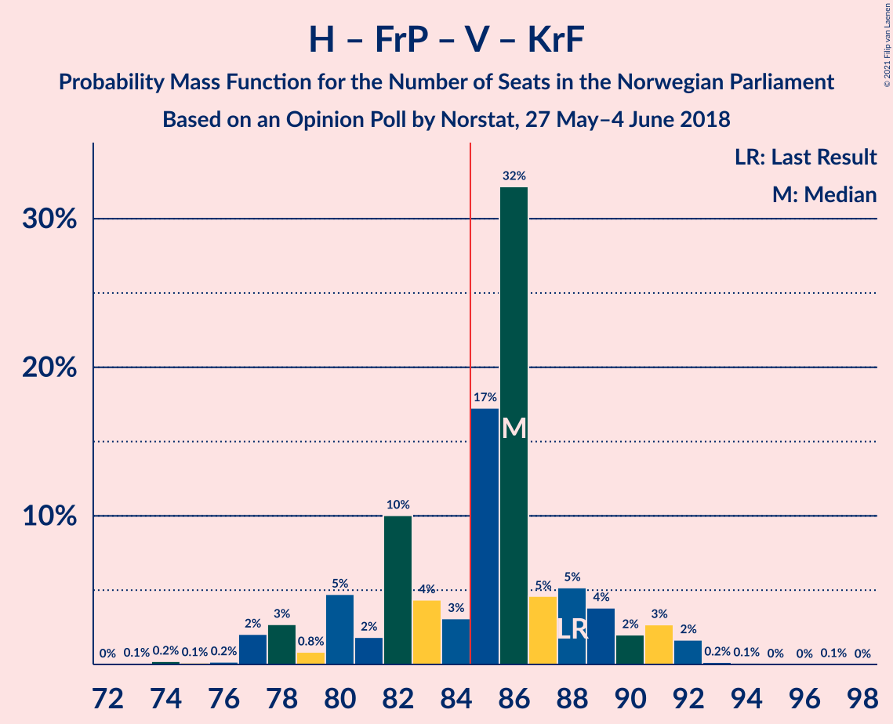

| Number of Seats | Probability | Accumulated | Special Marks |
|:---------------:|:-----------:|:-----------:|:-------------:|
| 72 | 0% | 100% |  |
| 73 | 0.1% | 99.9% |  |
| 74 | 0.2% | 99.9% |  |
| 75 | 0.1% | 99.6% |  |
| 76 | 0.2% | 99.5% |  |
| 77 | 2% | 99.3% |  |
| 78 | 3% | 97% |  |
| 79 | 0.8% | 95% |  |
| 80 | 5% | 94% |  |
| 81 | 2% | 89% |  |
| 82 | 10% | 87% |  |
| 83 | 4% | 77% |  |
| 84 | 3% | 73% |  |
| 85 | 17% | 70% | Majority |
| 86 | 32% | 52% | Median |
| 87 | 5% | 20% |  |
| 88 | 5% | 16% | Last Result |
| 89 | 4% | 11% |  |
| 90 | 2% | 7% |  |
| 91 | 3% | 5% |  |
| 92 | 2% | 2% |  |
| 93 | 0.2% | 0.4% |  |
| 94 | 0.1% | 0.2% |  |
| 95 | 0% | 0.1% |  |
| 96 | 0% | 0.1% |  |
| 97 | 0.1% | 0.1% |  |
| 98 | 0% | 0% |  |

### Arbeiderpartiet – Senterpartiet – Sosialistisk Venstreparti – Rødt

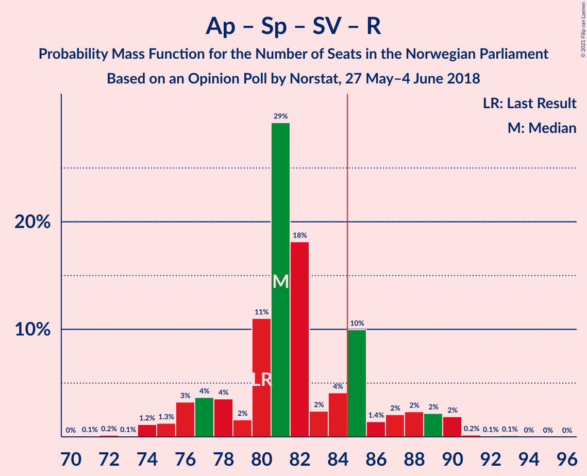

| Number of Seats | Probability | Accumulated | Special Marks |
|:---------------:|:-----------:|:-----------:|:-------------:|
| 70 | 0% | 100% |  |
| 71 | 0.1% | 99.9% |  |
| 72 | 0.2% | 99.9% |  |
| 73 | 0.1% | 99.7% |  |
| 74 | 1.2% | 99.6% |  |
| 75 | 1.3% | 98% |  |
| 76 | 3% | 97% |  |
| 77 | 4% | 94% |  |
| 78 | 4% | 90% |  |
| 79 | 2% | 87% |  |
| 80 | 11% | 85% | Last Result |
| 81 | 29% | 74% | Median |
| 82 | 18% | 45% |  |
| 83 | 2% | 27% |  |
| 84 | 4% | 24% |  |
| 85 | 10% | 20% | Majority |
| 86 | 1.4% | 10% |  |
| 87 | 2% | 9% |  |
| 88 | 2% | 7% |  |
| 89 | 2% | 5% |  |
| 90 | 2% | 2% |  |
| 91 | 0.2% | 0.4% |  |
| 92 | 0.1% | 0.3% |  |
| 93 | 0.1% | 0.2% |  |
| 94 | 0% | 0.1% |  |
| 95 | 0% | 0% |  |

### Høyre – Fremskrittspartiet – Venstre

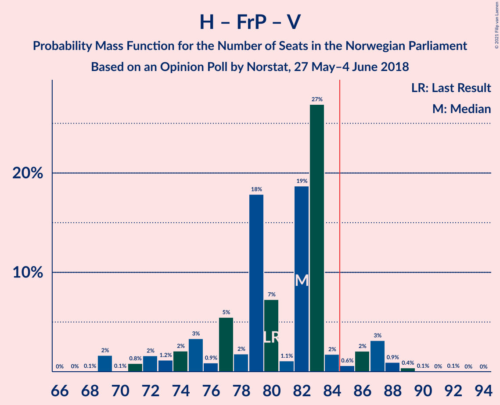

| Number of Seats | Probability | Accumulated | Special Marks |
|:---------------:|:-----------:|:-----------:|:-------------:|
| 67 | 0% | 100% |  |
| 68 | 0.1% | 99.9% |  |
| 69 | 2% | 99.9% |  |
| 70 | 0.1% | 98% |  |
| 71 | 0.8% | 98% |  |
| 72 | 2% | 97% |  |
| 73 | 1.2% | 96% |  |
| 74 | 2% | 95% |  |
| 75 | 3% | 92% |  |
| 76 | 0.9% | 89% |  |
| 77 | 5% | 88% |  |
| 78 | 2% | 83% |  |
| 79 | 18% | 81% |  |
| 80 | 7% | 63% | Last Result |
| 81 | 1.1% | 56% |  |
| 82 | 19% | 55% |  |
| 83 | 27% | 36% | Median |
| 84 | 2% | 9% |  |
| 85 | 0.6% | 7% | Majority |
| 86 | 2% | 7% |  |
| 87 | 3% | 5% |  |
| 88 | 0.9% | 2% |  |
| 89 | 0.4% | 0.6% |  |
| 90 | 0.1% | 0.2% |  |
| 91 | 0% | 0.1% |  |
| 92 | 0.1% | 0.1% |  |
| 93 | 0% | 0% |  |

### Arbeiderpartiet – Senterpartiet – Sosialistisk Venstreparti – Miljøpartiet De Grønne

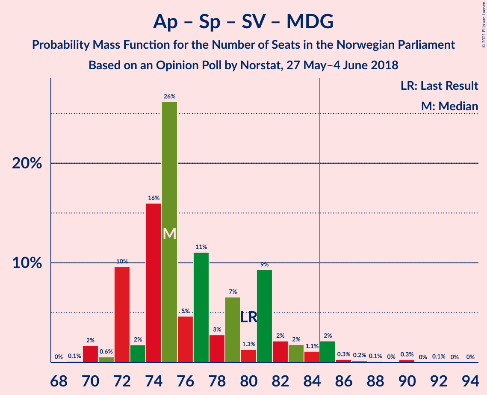

| Number of Seats | Probability | Accumulated | Special Marks |
|:---------------:|:-----------:|:-----------:|:-------------:|
| 68 | 0% | 100% |  |
| 69 | 0.1% | 99.9% |  |
| 70 | 2% | 99.8% |  |
| 71 | 0.6% | 98% |  |
| 72 | 10% | 98% |  |
| 73 | 2% | 88% |  |
| 74 | 16% | 86% |  |
| 75 | 26% | 70% | Median |
| 76 | 5% | 44% |  |
| 77 | 11% | 39% |  |
| 78 | 3% | 28% |  |
| 79 | 7% | 26% |  |
| 80 | 1.3% | 19% | Last Result |
| 81 | 9% | 18% |  |
| 82 | 2% | 8% |  |
| 83 | 2% | 6% |  |
| 84 | 1.1% | 4% |  |
| 85 | 2% | 3% | Majority |
| 86 | 0.3% | 1.1% |  |
| 87 | 0.2% | 0.8% |  |
| 88 | 0.1% | 0.6% |  |
| 89 | 0% | 0.5% |  |
| 90 | 0.3% | 0.4% |  |
| 91 | 0% | 0.1% |  |
| 92 | 0.1% | 0.1% |  |
| 93 | 0% | 0% |  |

### Arbeiderpartiet – Senterpartiet – Sosialistisk Venstreparti

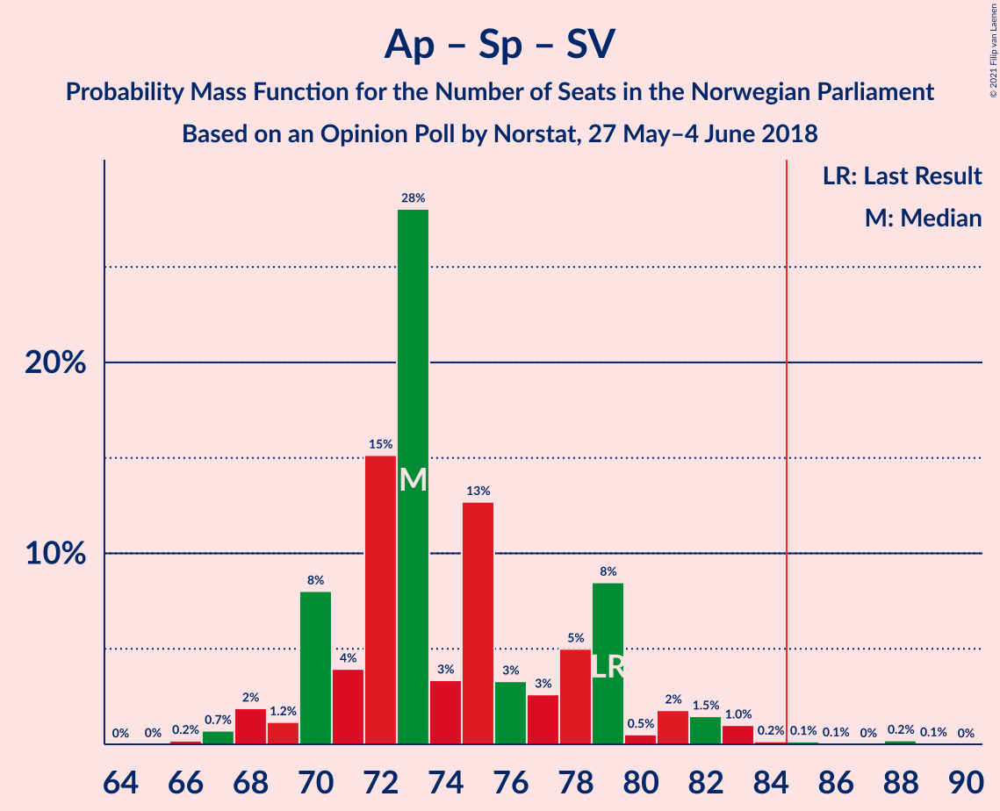

| Number of Seats | Probability | Accumulated | Special Marks |
|:---------------:|:-----------:|:-----------:|:-------------:|
| 66 | 0.2% | 100% |  |
| 67 | 0.7% | 99.8% |  |
| 68 | 2% | 99.1% |  |
| 69 | 1.2% | 97% |  |
| 70 | 8% | 96% |  |
| 71 | 4% | 88% |  |
| 72 | 15% | 84% |  |
| 73 | 28% | 69% | Median |
| 74 | 3% | 41% |  |
| 75 | 13% | 38% |  |
| 76 | 3% | 25% |  |
| 77 | 3% | 22% |  |
| 78 | 5% | 19% |  |
| 79 | 8% | 14% | Last Result |
| 80 | 0.5% | 5% |  |
| 81 | 2% | 5% |  |
| 82 | 1.5% | 3% |  |
| 83 | 1.0% | 2% |  |
| 84 | 0.2% | 0.7% |  |
| 85 | 0.1% | 0.5% | Majority |
| 86 | 0.1% | 0.4% |  |
| 87 | 0% | 0.3% |  |
| 88 | 0.2% | 0.3% |  |
| 89 | 0.1% | 0.1% |  |
| 90 | 0% | 0% |  |

### Høyre – Fremskrittspartiet

| Number of Seats | Probability | Accumulated | Special Marks |
|:---------------:|:-----------:|:-----------:|:-------------:|
| 63 | 0% | 100% |  |
| 64 | 0.1% | 99.9% |  |
| 65 | 0.3% | 99.8% |  |
| 66 | 1.1% | 99.6% |  |
| 67 | 2% | 98% |  |
| 68 | 1.4% | 96% |  |
| 69 | 5% | 95% |  |
| 70 | 3% | 89% |  |
| 71 | 12% | 87% |  |
| 72 | 4% | 75% | Last Result |
| 73 | 18% | 71% |  |
| 74 | 2% | 53% |  |
| 75 | 27% | 50% | Median |
| 76 | 2% | 23% |  |
| 77 | 6% | 20% |  |
| 78 | 7% | 15% |  |
| 79 | 0.4% | 7% |  |
| 80 | 3% | 7% |  |
| 81 | 0.6% | 4% |  |
| 82 | 1.4% | 3% |  |
| 83 | 0% | 2% |  |
| 84 | 0% | 2% |  |
| 85 | 2% | 2% | Majority |
| 86 | 0% | 0% |  |

### Arbeiderpartiet – Senterpartiet – Kristelig Folkeparti – Miljøpartiet De Grønne

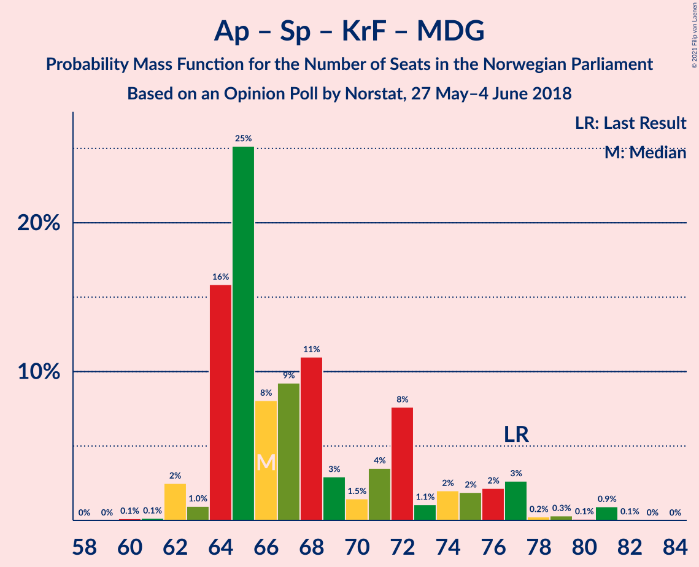

| Number of Seats | Probability | Accumulated | Special Marks |
|:---------------:|:-----------:|:-----------:|:-------------:|
| 60 | 0.1% | 100% |  |
| 61 | 0.1% | 99.9% |  |
| 62 | 2% | 99.7% |  |
| 63 | 1.0% | 97% |  |
| 64 | 16% | 96% |  |
| 65 | 25% | 80% | Median |
| 66 | 8% | 55% |  |
| 67 | 9% | 47% |  |
| 68 | 11% | 38% |  |
| 69 | 3% | 27% |  |
| 70 | 1.5% | 24% |  |
| 71 | 4% | 23% |  |
| 72 | 8% | 19% |  |
| 73 | 1.1% | 11% |  |
| 74 | 2% | 10% |  |
| 75 | 2% | 8% |  |
| 76 | 2% | 6% |  |
| 77 | 3% | 4% | Last Result |
| 78 | 0.2% | 2% |  |
| 79 | 0.3% | 1.4% |  |
| 80 | 0.1% | 1.1% |  |
| 81 | 0.9% | 1.0% |  |
| 82 | 0.1% | 0.1% |  |
| 83 | 0% | 0% |  |

### Arbeiderpartiet – Senterpartiet – Kristelig Folkeparti

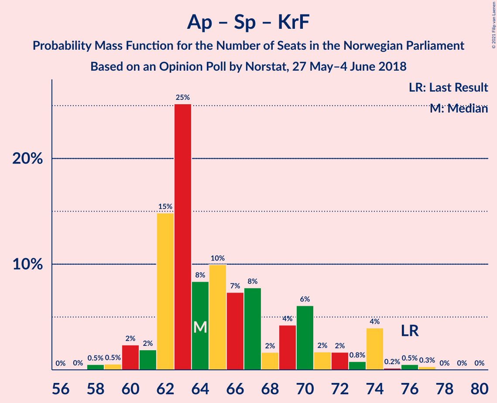

| Number of Seats | Probability | Accumulated | Special Marks |
|:---------------:|:-----------:|:-----------:|:-------------:|
| 57 | 0% | 100% |  |
| 58 | 0.5% | 99.9% |  |
| 59 | 0.5% | 99.4% |  |
| 60 | 2% | 98.9% |  |
| 61 | 2% | 97% |  |
| 62 | 15% | 95% |  |
| 63 | 25% | 80% | Median |
| 64 | 8% | 55% |  |
| 65 | 10% | 46% |  |
| 66 | 7% | 36% |  |
| 67 | 8% | 29% |  |
| 68 | 2% | 21% |  |
| 69 | 4% | 20% |  |
| 70 | 6% | 15% |  |
| 71 | 2% | 9% |  |
| 72 | 2% | 8% |  |
| 73 | 0.8% | 6% |  |
| 74 | 4% | 5% |  |
| 75 | 0.2% | 1.1% |  |
| 76 | 0.5% | 0.9% | Last Result |
| 77 | 0.3% | 0.4% |  |
| 78 | 0% | 0.1% |  |
| 79 | 0% | 0.1% |  |
| 80 | 0% | 0% |  |

### Høyre – Venstre – Kristelig Folkeparti

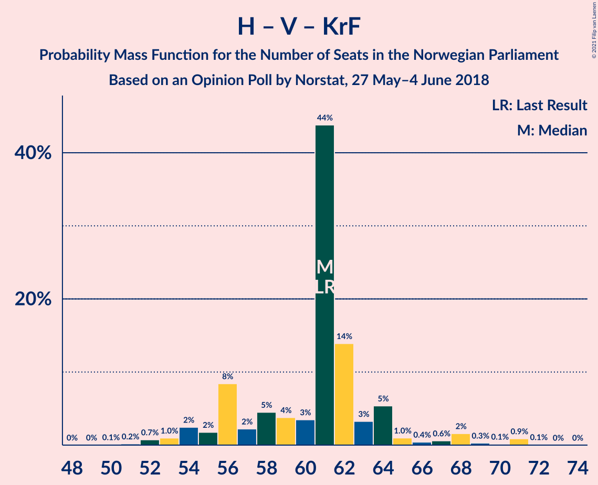

| Number of Seats | Probability | Accumulated | Special Marks |
|:---------------:|:-----------:|:-----------:|:-------------:|
| 49 | 0% | 100% |  |
| 50 | 0.1% | 99.9% |  |
| 51 | 0.2% | 99.9% |  |
| 52 | 0.7% | 99.7% |  |
| 53 | 1.0% | 98.9% |  |
| 54 | 2% | 98% |  |
| 55 | 2% | 96% |  |
| 56 | 8% | 94% |  |
| 57 | 2% | 85% |  |
| 58 | 5% | 83% |  |
| 59 | 4% | 79% |  |
| 60 | 3% | 75% |  |
| 61 | 44% | 71% | Last Result, Median |
| 62 | 14% | 28% |  |
| 63 | 3% | 14% |  |
| 64 | 5% | 10% |  |
| 65 | 1.0% | 5% |  |
| 66 | 0.4% | 4% |  |
| 67 | 0.6% | 4% |  |
| 68 | 2% | 3% |  |
| 69 | 0.3% | 1.4% |  |
| 70 | 0.1% | 1.1% |  |
| 71 | 0.9% | 1.0% |  |
| 72 | 0.1% | 0.1% |  |
| 73 | 0% | 0% |  |

### Arbeiderpartiet – Senterpartiet

| Number of Seats | Probability | Accumulated | Special Marks |
|:---------------:|:-----------:|:-----------:|:-------------:|
| 54 | 0.2% | 100% |  |
| 55 | 0.1% | 99.8% |  |
| 56 | 2% | 99.7% |  |
| 57 | 4% | 98% |  |
| 58 | 6% | 94% |  |
| 59 | 21% | 88% |  |
| 60 | 23% | 68% | Median |
| 61 | 12% | 44% |  |
| 62 | 8% | 33% |  |
| 63 | 10% | 25% |  |
| 64 | 7% | 15% |  |
| 65 | 1.2% | 8% |  |
| 66 | 4% | 7% |  |
| 67 | 0.7% | 3% |  |
| 68 | 1.3% | 2% | Last Result |
| 69 | 0.3% | 0.6% |  |
| 70 | 0.1% | 0.3% |  |
| 71 | 0% | 0.2% |  |
| 72 | 0.1% | 0.2% |  |
| 73 | 0% | 0.1% |  |
| 74 | 0.1% | 0.1% |  |
| 75 | 0% | 0% |  |

### Arbeiderpartiet – Sosialistisk Venstreparti

| Number of Seats | Probability | Accumulated | Special Marks |
|:---------------:|:-----------:|:-----------:|:-------------:|
| 48 | 0.3% | 100% |  |
| 49 | 1.3% | 99.7% |  |
| 50 | 2% | 98% |  |
| 51 | 2% | 97% |  |
| 52 | 27% | 95% |  |
| 53 | 33% | 67% | Median |
| 54 | 4% | 35% |  |
| 55 | 5% | 31% |  |
| 56 | 5% | 26% |  |
| 57 | 2% | 20% |  |
| 58 | 4% | 19% |  |
| 59 | 4% | 15% |  |
| 60 | 8% | 11% | Last Result |
| 61 | 1.5% | 3% |  |
| 62 | 0.6% | 2% |  |
| 63 | 0.2% | 1.1% |  |
| 64 | 0.5% | 0.9% |  |
| 65 | 0% | 0.4% |  |
| 66 | 0.1% | 0.3% |  |
| 67 | 0.2% | 0.3% |  |
| 68 | 0.1% | 0.1% |  |
| 69 | 0% | 0% |  |

### Senterpartiet – Venstre – Kristelig Folkeparti

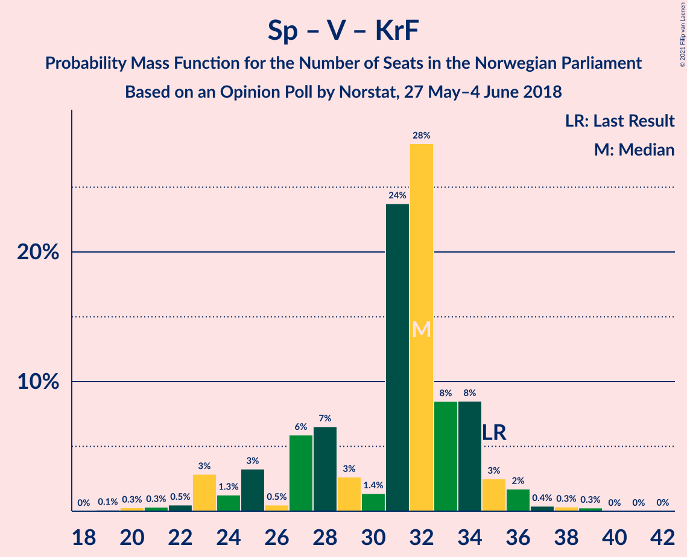

| Number of Seats | Probability | Accumulated | Special Marks |
|:---------------:|:-----------:|:-----------:|:-------------:|
| 19 | 0.1% | 100% |  |
| 20 | 0.3% | 99.9% |  |
| 21 | 0.3% | 99.6% |  |
| 22 | 0.5% | 99.3% |  |
| 23 | 3% | 98.8% |  |
| 24 | 1.3% | 96% |  |
| 25 | 3% | 95% |  |
| 26 | 0.5% | 91% |  |
| 27 | 6% | 91% |  |
| 28 | 7% | 85% |  |
| 29 | 3% | 78% |  |
| 30 | 1.4% | 76% |  |
| 31 | 24% | 74% | Median |
| 32 | 28% | 51% |  |
| 33 | 8% | 22% |  |
| 34 | 8% | 14% |  |
| 35 | 3% | 5% | Last Result |
| 36 | 2% | 3% |  |
| 37 | 0.4% | 1.1% |  |
| 38 | 0.3% | 0.7% |  |
| 39 | 0.3% | 0.4% |  |
| 40 | 0% | 0.1% |  |
| 41 | 0% | 0.1% |  |
| 42 | 0% | 0% |  |

## Technical Information

### Opinion Poll

+ **Polling firm:** Norstat
+ **Commissioner(s):** —
+ **Fieldwork period:** 27 May–4 June 2018

### Calculations

+ **Sample size:** 930
+ **Simulations done:** 131,072
+ **Error estimate:** 1.05%

