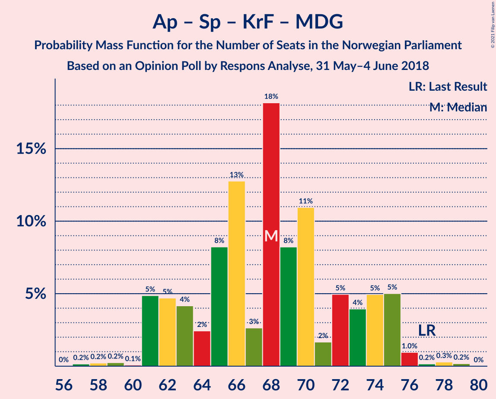
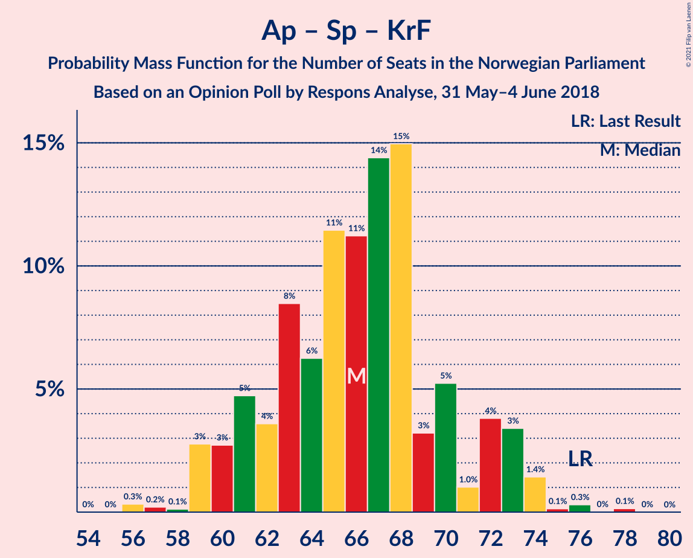

# Opinion Poll by Respons Analyse, 31 May–4 June 2018

<a href="#voting-intentions">Voting Intentions</a> | <a href="#seats">Seats</a> | <a href="#coalitions">Coalitions</a> | <a href="#technical-information">Technical Information</a>

## Voting Intentions

### Confidence Intervals

| Party | Last Result | Poll Result | 80% Confidence Interval | 90% Confidence Interval | 95% Confidence Interval | 99% Confidence Interval |
|:-----:|:-----------:|:-----------:|:-----------------------:|:-----------------------:|:-----------------------:|:-----------------------:|
| Høyre | 25.0% | 26.4% | 24.7–28.2% |24.2–28.8% |23.8–29.2% |22.9–30.1% |
| Arbeiderpartiet | 27.4% | 22.0% | 20.4–23.7% |19.9–24.2% |19.5–24.7% |18.8–25.5% |
| Fremskrittspartiet | 15.2% | 15.1% | 13.7–16.6% |13.3–17.1% |13.0–17.5% |12.4–18.2% |
| Senterpartiet | 10.3% | 11.0% | 9.8–12.4% |9.5–12.8% |9.2–13.1% |8.7–13.8% |
| Sosialistisk Venstreparti | 6.0% | 7.6% | 6.6–8.8% |6.3–9.1% |6.1–9.4% |5.7–10.0% |
| Rødt | 2.4% | 4.8% | 4.0–5.8% |3.8–6.1% |3.6–6.3% |3.3–6.8% |
| Kristelig Folkeparti | 4.2% | 4.1% | 3.4–5.0% |3.2–5.3% |3.0–5.5% |2.7–6.0% |
| Venstre | 4.4% | 3.7% | 3.0–4.6% |2.9–4.8% |2.7–5.1% |2.4–5.5% |
| Miljøpartiet De Grønne | 3.2% | 2.9% | 2.3–3.7% |2.2–3.9% |2.0–4.1% |1.8–4.6% |

*Note:* The poll result column reflects the actual value used in the calculations. Published results may vary slightly, and in addition be rounded to fewer digits.

## Seats

### Confidence Intervals

| Party | Last Result | Median | 80% Confidence Interval | 90% Confidence Interval | 95% Confidence Interval | 99% Confidence Interval |
|:-----:|:-----------:|:------:|:-----------------------:|:-----------------------:|:-----------------------:|:-----------------------:|
| <a href="#høyre">Høyre</a> | 45 | 47 | 43–52 |43–54 |42–54 |41–56 |
| <a href="#arbeiderpartiet">Arbeiderpartiet</a> | 49 | 41 | 38–43 |37–45 |36–46 |34–48 |
| <a href="#fremskrittspartiet">Fremskrittspartiet</a> | 27 | 27 | 25–30 |24–31 |23–32 |22–33 |
| <a href="#senterpartiet">Senterpartiet</a> | 19 | 20 | 17–23 |17–24 |17–24 |15–26 |
| <a href="#sosialistisk-venstreparti">Sosialistisk Venstreparti</a> | 11 | 14 | 11–16 |10–17 |10–17 |10–18 |
| <a href="#rødt">Rødt</a> | 1 | 9 | 2–11 |2–12 |2–12 |2–12 |
| <a href="#kristelig-folkeparti">Kristelig Folkeparti</a> | 8 | 3 | 3–9 |2–10 |2–10 |1–11 |
| <a href="#venstre">Venstre</a> | 8 | 2 | 2–8 |2–9 |2–9 |2–10 |
| <a href="#miljøpartiet-de-grønne">Miljøpartiet De Grønne</a> | 1 | 1 | 1–2 |1–7 |1–8 |0–9 |

### Høyre

*For a full overview of the results for this party, see the [Høyre](party-høyre.html) page.*

| Number of Seats | Probability | Accumulated | Special Marks |
|:---------------:|:-----------:|:-----------:|:-------------:|
| 39 | 0.1% | 100% |  |
| 40 | 0% | 99.9% |  |
| 41 | 0.8% | 99.8% |  |
| 42 | 4% | 99.1% |  |
| 43 | 7% | 95% |  |
| 44 | 10% | 88% |  |
| 45 | 9% | 78% | Last Result |
| 46 | 9% | 69% |  |
| 47 | 19% | 60% | Median |
| 48 | 4% | 41% |  |
| 49 | 13% | 37% |  |
| 50 | 6% | 25% |  |
| 51 | 6% | 19% |  |
| 52 | 3% | 12% |  |
| 53 | 2% | 9% |  |
| 54 | 5% | 7% |  |
| 55 | 2% | 2% |  |
| 56 | 0.3% | 0.5% |  |
| 57 | 0.2% | 0.2% |  |
| 58 | 0% | 0% |  |

### Arbeiderpartiet

*For a full overview of the results for this party, see the [Arbeiderpartiet](party-arbeiderpartiet.html) page.*

| Number of Seats | Probability | Accumulated | Special Marks |
|:---------------:|:-----------:|:-----------:|:-------------:|
| 31 | 0% | 100% |  |
| 32 | 0.1% | 99.9% |  |
| 33 | 0.3% | 99.9% |  |
| 34 | 0.2% | 99.6% |  |
| 35 | 1.5% | 99.4% |  |
| 36 | 0.7% | 98% |  |
| 37 | 5% | 97% |  |
| 38 | 7% | 92% |  |
| 39 | 9% | 85% |  |
| 40 | 23% | 75% |  |
| 41 | 21% | 52% | Median |
| 42 | 12% | 31% |  |
| 43 | 11% | 19% |  |
| 44 | 2% | 8% |  |
| 45 | 3% | 7% |  |
| 46 | 1.3% | 3% |  |
| 47 | 0.2% | 2% |  |
| 48 | 2% | 2% |  |
| 49 | 0% | 0% | Last Result |

### Fremskrittspartiet

*For a full overview of the results for this party, see the [Fremskrittspartiet](party-fremskrittspartiet.html) page.*

| Number of Seats | Probability | Accumulated | Special Marks |
|:---------------:|:-----------:|:-----------:|:-------------:|
| 20 | 0.3% | 100% |  |
| 21 | 0.1% | 99.7% |  |
| 22 | 2% | 99.6% |  |
| 23 | 2% | 98% |  |
| 24 | 5% | 95% |  |
| 25 | 16% | 90% |  |
| 26 | 9% | 74% |  |
| 27 | 22% | 65% | Last Result, Median |
| 28 | 14% | 43% |  |
| 29 | 12% | 29% |  |
| 30 | 7% | 16% |  |
| 31 | 5% | 9% |  |
| 32 | 3% | 4% |  |
| 33 | 0.5% | 0.6% |  |
| 34 | 0.1% | 0.2% |  |
| 35 | 0.1% | 0.1% |  |
| 36 | 0% | 0% |  |

### Senterpartiet

*For a full overview of the results for this party, see the [Senterpartiet](party-senterpartiet.html) page.*

| Number of Seats | Probability | Accumulated | Special Marks |
|:---------------:|:-----------:|:-----------:|:-------------:|
| 14 | 0.4% | 100% |  |
| 15 | 0.3% | 99.5% |  |
| 16 | 2% | 99.3% |  |
| 17 | 9% | 98% |  |
| 18 | 12% | 89% |  |
| 19 | 20% | 76% | Last Result |
| 20 | 16% | 56% | Median |
| 21 | 19% | 41% |  |
| 22 | 8% | 21% |  |
| 23 | 8% | 14% |  |
| 24 | 4% | 6% |  |
| 25 | 0.8% | 2% |  |
| 26 | 0.8% | 0.9% |  |
| 27 | 0.1% | 0.1% |  |
| 28 | 0% | 0% |  |

### Sosialistisk Venstreparti

*For a full overview of the results for this party, see the [Sosialistisk Venstreparti](party-sosialistiskvenstreparti.html) page.*

| Number of Seats | Probability | Accumulated | Special Marks |
|:---------------:|:-----------:|:-----------:|:-------------:|
| 9 | 0.1% | 100% |  |
| 10 | 6% | 99.8% |  |
| 11 | 8% | 94% | Last Result |
| 12 | 6% | 86% |  |
| 13 | 22% | 80% |  |
| 14 | 19% | 58% | Median |
| 15 | 12% | 39% |  |
| 16 | 18% | 27% |  |
| 17 | 8% | 9% |  |
| 18 | 0.6% | 1.1% |  |
| 19 | 0.2% | 0.5% |  |
| 20 | 0.2% | 0.2% |  |
| 21 | 0.1% | 0.1% |  |
| 22 | 0% | 0% |  |

### Rødt

*For a full overview of the results for this party, see the [Rødt](party-rødt.html) page.*

| Number of Seats | Probability | Accumulated | Special Marks |
|:---------------:|:-----------:|:-----------:|:-------------:|
| 1 | 0% | 100% | Last Result |
| 2 | 18% | 100% |  |
| 3 | 0% | 82% |  |
| 4 | 0% | 82% |  |
| 5 | 0% | 82% |  |
| 6 | 0% | 82% |  |
| 7 | 5% | 82% |  |
| 8 | 22% | 77% |  |
| 9 | 21% | 55% | Median |
| 10 | 18% | 35% |  |
| 11 | 10% | 16% |  |
| 12 | 6% | 6% |  |
| 13 | 0.1% | 0.2% |  |
| 14 | 0.1% | 0.1% |  |
| 15 | 0% | 0% |  |

### Kristelig Folkeparti

*For a full overview of the results for this party, see the [Kristelig Folkeparti](party-kristeligfolkeparti.html) page.*

| Number of Seats | Probability | Accumulated | Special Marks |
|:---------------:|:-----------:|:-----------:|:-------------:|
| 0 | 0.1% | 100% |  |
| 1 | 1.4% | 99.9% |  |
| 2 | 5% | 98.6% |  |
| 3 | 46% | 93% | Median |
| 4 | 0% | 47% |  |
| 5 | 0% | 47% |  |
| 6 | 0% | 47% |  |
| 7 | 8% | 47% |  |
| 8 | 23% | 39% | Last Result |
| 9 | 9% | 15% |  |
| 10 | 5% | 6% |  |
| 11 | 0.8% | 1.0% |  |
| 12 | 0.2% | 0.2% |  |
| 13 | 0% | 0% |  |

### Venstre

*For a full overview of the results for this party, see the [Venstre](party-venstre.html) page.*

| Number of Seats | Probability | Accumulated | Special Marks |
|:---------------:|:-----------:|:-----------:|:-------------:|
| 1 | 0.4% | 100% |  |
| 2 | 59% | 99.6% | Median |
| 3 | 2% | 41% |  |
| 4 | 0% | 39% |  |
| 5 | 0% | 39% |  |
| 6 | 0% | 39% |  |
| 7 | 10% | 39% |  |
| 8 | 20% | 29% | Last Result |
| 9 | 8% | 9% |  |
| 10 | 0.6% | 0.7% |  |
| 11 | 0.1% | 0.1% |  |
| 12 | 0% | 0% |  |

### Miljøpartiet De Grønne

*For a full overview of the results for this party, see the [Miljøpartiet De Grønne](party-miljøpartietdegrønne.html) page.*

| Number of Seats | Probability | Accumulated | Special Marks |
|:---------------:|:-----------:|:-----------:|:-------------:|
| 0 | 2% | 100% |  |
| 1 | 49% | 98% | Last Result, Median |
| 2 | 41% | 49% |  |
| 3 | 2% | 8% |  |
| 4 | 0.1% | 7% |  |
| 5 | 0% | 7% |  |
| 6 | 0.3% | 7% |  |
| 7 | 4% | 7% |  |
| 8 | 2% | 3% |  |
| 9 | 0.6% | 0.6% |  |
| 10 | 0% | 0% |  |

## Coalitions

### Confidence Intervals

| Coalition | Last Result | Median | Majority? | 80% Confidence Interval | 90% Confidence Interval | 95% Confidence Interval | 99% Confidence Interval |
|:---------:|:-----------:|:------:|:---------:|:-----------------------:|:-----------------------:|:-----------------------:|:-----------------------:|
| Høyre – Fremskrittspartiet – Senterpartiet – Kristelig Folkeparti – Venstre | 107 | 104 | 100% | 100–109 | 98–111 | 96–112 | 96–115 |
| Høyre – Fremskrittspartiet – Kristelig Folkeparti – Venstre – Miljøpartiet De Grønne | 89 | 86 | 64% | 82–91 | 78–93 | 78–94 | 78–97 |
| Arbeiderpartiet – Senterpartiet – Sosialistisk Venstreparti – Rødt – Miljøpartiet De Grønne | 81 | 85 | 52% | 79–91 | 77–93 | 77–93 | 74–93 |
| Høyre – Fremskrittspartiet – Kristelig Folkeparti – Venstre | 88 | 84 | 48% | 78–89 | 76–91 | 76–92 | 76–95 |
| Arbeiderpartiet – Senterpartiet – Sosialistisk Venstreparti – Rødt | 80 | 83 | 36% | 78–87 | 76–91 | 75–91 | 72–91 |
| Arbeiderpartiet – Senterpartiet – Sosialistisk Venstreparti – Kristelig Folkeparti – Miljøpartiet De Grønne | 88 | 82 | 28% | 77–88 | 75–89 | 74–89 | 73–91 |
| Høyre – Fremskrittspartiet – Venstre | 80 | 80 | 7% | 73–84 | 73–86 | 73–88 | 70–89 |
| Arbeiderpartiet – Senterpartiet – Sosialistisk Venstreparti – Miljøpartiet De Grønne | 80 | 76 | 4% | 71–82 | 70–84 | 69–85 | 66–86 |
| Høyre – Fremskrittspartiet | 72 | 74 | 0.3% | 71–80 | 69–81 | 68–82 | 66–83 |
| Arbeiderpartiet – Senterpartiet – Sosialistisk Venstreparti | 79 | 75 | 0.3% | 70–80 | 69–81 | 68–81 | 65–81 |
| Arbeiderpartiet – Senterpartiet – Kristelig Folkeparti – Miljøpartiet De Grønne | 77 | 68 | 0% | 62–74 | 61–75 | 61–75 | 59–77 |
| Arbeiderpartiet – Senterpartiet – Kristelig Folkeparti | 76 | 66 | 0% | 61–71 | 60–73 | 59–73 | 57–75 |
| Arbeiderpartiet – Senterpartiet | 68 | 61 | 0% | 57–65 | 56–65 | 55–67 | 53–68 |
| Høyre – Kristelig Folkeparti – Venstre | 61 | 58 | 0% | 51–62 | 49–63 | 49–66 | 49–67 |
| Arbeiderpartiet – Sosialistisk Venstreparti | 60 | 55 | 0% | 51–59 | 49–60 | 48–60 | 47–61 |
| Senterpartiet – Kristelig Folkeparti – Venstre | 35 | 30 | 0% | 25–34 | 24–35 | 23–36 | 21–38 |

### Høyre – Fremskrittspartiet – Senterpartiet – Kristelig Folkeparti – Venstre

| Number of Seats | Probability | Accumulated | Special Marks |
|:---------------:|:-----------:|:-----------:|:-------------:|
| 94 | 0.1% | 100% |  |
| 95 | 0.4% | 99.9% |  |
| 96 | 3% | 99.6% |  |
| 97 | 0.3% | 97% |  |
| 98 | 5% | 97% |  |
| 99 | 1.2% | 91% | Median |
| 100 | 6% | 90% |  |
| 101 | 5% | 84% |  |
| 102 | 4% | 80% |  |
| 103 | 13% | 76% |  |
| 104 | 17% | 62% |  |
| 105 | 13% | 45% |  |
| 106 | 3% | 33% |  |
| 107 | 7% | 29% | Last Result |
| 108 | 6% | 23% |  |
| 109 | 7% | 17% |  |
| 110 | 1.5% | 10% |  |
| 111 | 5% | 8% |  |
| 112 | 2% | 3% |  |
| 113 | 0.4% | 1.0% |  |
| 114 | 0.1% | 0.6% |  |
| 115 | 0.2% | 0.5% |  |
| 116 | 0.2% | 0.3% |  |
| 117 | 0% | 0.1% |  |
| 118 | 0.1% | 0.1% |  |
| 119 | 0% | 0% |  |

### Høyre – Fremskrittspartiet – Kristelig Folkeparti – Venstre – Miljøpartiet De Grønne

| Number of Seats | Probability | Accumulated | Special Marks |
|:---------------:|:-----------:|:-----------:|:-------------:|
| 77 | 0.2% | 100% |  |
| 78 | 5% | 99.7% |  |
| 79 | 2% | 94% |  |
| 80 | 0.4% | 93% | Median |
| 81 | 0.7% | 92% |  |
| 82 | 2% | 91% |  |
| 83 | 8% | 89% |  |
| 84 | 17% | 81% |  |
| 85 | 11% | 64% | Majority |
| 86 | 4% | 53% |  |
| 87 | 6% | 49% |  |
| 88 | 14% | 43% |  |
| 89 | 9% | 28% | Last Result |
| 90 | 6% | 19% |  |
| 91 | 5% | 14% |  |
| 92 | 2% | 9% |  |
| 93 | 5% | 7% |  |
| 94 | 0.7% | 3% |  |
| 95 | 1.2% | 2% |  |
| 96 | 0.1% | 0.6% |  |
| 97 | 0.3% | 0.5% |  |
| 98 | 0.1% | 0.2% |  |
| 99 | 0% | 0% |  |

### Arbeiderpartiet – Senterpartiet – Sosialistisk Venstreparti – Rødt – Miljøpartiet De Grønne

| Number of Seats | Probability | Accumulated | Special Marks |
|:---------------:|:-----------:|:-----------:|:-------------:|
| 72 | 0% | 100% |  |
| 73 | 0.2% | 99.9% |  |
| 74 | 0.3% | 99.7% |  |
| 75 | 1.1% | 99.4% |  |
| 76 | 0.6% | 98% |  |
| 77 | 3% | 98% |  |
| 78 | 3% | 95% |  |
| 79 | 2% | 92% |  |
| 80 | 6% | 90% |  |
| 81 | 5% | 84% | Last Result |
| 82 | 10% | 78% |  |
| 83 | 10% | 69% |  |
| 84 | 7% | 59% |  |
| 85 | 7% | 52% | Median, Majority |
| 86 | 19% | 45% |  |
| 87 | 10% | 26% |  |
| 88 | 3% | 16% |  |
| 89 | 1.3% | 13% |  |
| 90 | 0.6% | 11% |  |
| 91 | 1.0% | 11% |  |
| 92 | 4% | 10% |  |
| 93 | 6% | 6% |  |
| 94 | 0% | 0.2% |  |
| 95 | 0% | 0.2% |  |
| 96 | 0.1% | 0.1% |  |
| 97 | 0% | 0% |  |

### Høyre – Fremskrittspartiet – Kristelig Folkeparti – Venstre

| Number of Seats | Probability | Accumulated | Special Marks |
|:---------------:|:-----------:|:-----------:|:-------------:|
| 73 | 0.1% | 100% |  |
| 74 | 0% | 99.9% |  |
| 75 | 0% | 99.8% |  |
| 76 | 6% | 99.8% |  |
| 77 | 4% | 94% |  |
| 78 | 1.0% | 90% |  |
| 79 | 0.6% | 89% | Median |
| 80 | 1.4% | 89% |  |
| 81 | 3% | 87% |  |
| 82 | 10% | 84% |  |
| 83 | 19% | 74% |  |
| 84 | 7% | 55% |  |
| 85 | 7% | 48% | Majority |
| 86 | 10% | 41% |  |
| 87 | 10% | 31% |  |
| 88 | 5% | 21% | Last Result |
| 89 | 6% | 16% |  |
| 90 | 2% | 10% |  |
| 91 | 2% | 7% |  |
| 92 | 3% | 5% |  |
| 93 | 0.6% | 2% |  |
| 94 | 1.1% | 2% |  |
| 95 | 0.3% | 0.5% |  |
| 96 | 0.2% | 0.3% |  |
| 97 | 0% | 0.1% |  |
| 98 | 0% | 0% |  |

### Arbeiderpartiet – Senterpartiet – Sosialistisk Venstreparti – Rødt

| Number of Seats | Probability | Accumulated | Special Marks |
|:---------------:|:-----------:|:-----------:|:-------------:|
| 70 | 0% | 100% |  |
| 71 | 0.1% | 99.9% |  |
| 72 | 0.4% | 99.8% |  |
| 73 | 0.1% | 99.5% |  |
| 74 | 1.2% | 99.3% |  |
| 75 | 0.7% | 98% |  |
| 76 | 5% | 97% |  |
| 77 | 2% | 93% |  |
| 78 | 5% | 91% |  |
| 79 | 6% | 86% |  |
| 80 | 9% | 80% | Last Result |
| 81 | 14% | 71% |  |
| 82 | 6% | 57% |  |
| 83 | 4% | 51% |  |
| 84 | 11% | 47% | Median |
| 85 | 17% | 36% | Majority |
| 86 | 8% | 19% |  |
| 87 | 2% | 11% |  |
| 88 | 0.7% | 9% |  |
| 89 | 0.3% | 8% |  |
| 90 | 2% | 7% |  |
| 91 | 5% | 6% |  |
| 92 | 0.2% | 0.3% |  |
| 93 | 0% | 0% |  |

### Arbeiderpartiet – Senterpartiet – Sosialistisk Venstreparti – Kristelig Folkeparti – Miljøpartiet De Grønne

| Number of Seats | Probability | Accumulated | Special Marks |
|:---------------:|:-----------:|:-----------:|:-------------:|
| 69 | 0% | 100% |  |
| 70 | 0% | 99.9% |  |
| 71 | 0.3% | 99.9% |  |
| 72 | 0.1% | 99.7% |  |
| 73 | 1.3% | 99.6% |  |
| 74 | 1.2% | 98% |  |
| 75 | 4% | 97% |  |
| 76 | 1.2% | 93% |  |
| 77 | 3% | 91% |  |
| 78 | 6% | 88% |  |
| 79 | 16% | 82% | Median |
| 80 | 9% | 66% |  |
| 81 | 3% | 57% |  |
| 82 | 9% | 54% |  |
| 83 | 5% | 45% |  |
| 84 | 12% | 40% |  |
| 85 | 9% | 28% | Majority |
| 86 | 4% | 19% |  |
| 87 | 3% | 15% |  |
| 88 | 5% | 12% | Last Result |
| 89 | 5% | 7% |  |
| 90 | 1.5% | 2% |  |
| 91 | 0.3% | 0.5% |  |
| 92 | 0.2% | 0.2% |  |
| 93 | 0% | 0% |  |

### Høyre – Fremskrittspartiet – Venstre

| Number of Seats | Probability | Accumulated | Special Marks |
|:---------------:|:-----------:|:-----------:|:-------------:|
| 69 | 0.2% | 100% |  |
| 70 | 0.7% | 99.8% |  |
| 71 | 0.4% | 99.0% |  |
| 72 | 0.6% | 98.6% |  |
| 73 | 8% | 98% |  |
| 74 | 8% | 89% |  |
| 75 | 4% | 81% |  |
| 76 | 8% | 77% | Median |
| 77 | 3% | 70% |  |
| 78 | 6% | 66% |  |
| 79 | 10% | 60% |  |
| 80 | 15% | 51% | Last Result |
| 81 | 10% | 35% |  |
| 82 | 6% | 25% |  |
| 83 | 6% | 19% |  |
| 84 | 6% | 13% |  |
| 85 | 2% | 7% | Majority |
| 86 | 1.4% | 5% |  |
| 87 | 1.3% | 4% |  |
| 88 | 0.2% | 3% |  |
| 89 | 2% | 2% |  |
| 90 | 0.1% | 0.1% |  |
| 91 | 0% | 0% |  |

### Arbeiderpartiet – Senterpartiet – Sosialistisk Venstreparti – Miljøpartiet De Grønne

| Number of Seats | Probability | Accumulated | Special Marks |
|:---------------:|:-----------:|:-----------:|:-------------:|
| 65 | 0% | 100% |  |
| 66 | 0.9% | 99.9% |  |
| 67 | 0.6% | 99.0% |  |
| 68 | 0.4% | 98% |  |
| 69 | 1.1% | 98% |  |
| 70 | 4% | 97% |  |
| 71 | 3% | 93% |  |
| 72 | 11% | 89% |  |
| 73 | 3% | 79% |  |
| 74 | 6% | 76% |  |
| 75 | 8% | 70% |  |
| 76 | 17% | 62% | Median |
| 77 | 10% | 45% |  |
| 78 | 3% | 35% |  |
| 79 | 5% | 31% |  |
| 80 | 6% | 27% | Last Result |
| 81 | 6% | 21% |  |
| 82 | 9% | 15% |  |
| 83 | 0.5% | 6% |  |
| 84 | 0.8% | 5% |  |
| 85 | 3% | 4% | Majority |
| 86 | 1.3% | 2% |  |
| 87 | 0.3% | 0.4% |  |
| 88 | 0.1% | 0.1% |  |
| 89 | 0% | 0% |  |

### Høyre – Fremskrittspartiet

| Number of Seats | Probability | Accumulated | Special Marks |
|:---------------:|:-----------:|:-----------:|:-------------:|
| 66 | 0.9% | 100% |  |
| 67 | 0.6% | 99.1% |  |
| 68 | 1.2% | 98% |  |
| 69 | 3% | 97% |  |
| 70 | 3% | 95% |  |
| 71 | 13% | 92% |  |
| 72 | 16% | 79% | Last Result |
| 73 | 11% | 63% |  |
| 74 | 8% | 52% | Median |
| 75 | 3% | 44% |  |
| 76 | 6% | 40% |  |
| 77 | 9% | 35% |  |
| 78 | 6% | 26% |  |
| 79 | 6% | 20% |  |
| 80 | 4% | 13% |  |
| 81 | 6% | 9% |  |
| 82 | 3% | 4% |  |
| 83 | 0.4% | 0.8% |  |
| 84 | 0.2% | 0.4% |  |
| 85 | 0.1% | 0.3% | Majority |
| 86 | 0.1% | 0.1% |  |
| 87 | 0% | 0% |  |

### Arbeiderpartiet – Senterpartiet – Sosialistisk Venstreparti

| Number of Seats | Probability | Accumulated | Special Marks |
|:---------------:|:-----------:|:-----------:|:-------------:|
| 64 | 0% | 100% |  |
| 65 | 0.9% | 99.9% |  |
| 66 | 0.8% | 99.0% |  |
| 67 | 0.3% | 98% |  |
| 68 | 2% | 98% |  |
| 69 | 5% | 96% |  |
| 70 | 10% | 91% |  |
| 71 | 4% | 80% |  |
| 72 | 5% | 76% |  |
| 73 | 5% | 72% |  |
| 74 | 10% | 67% |  |
| 75 | 19% | 57% | Median |
| 76 | 6% | 38% |  |
| 77 | 5% | 32% |  |
| 78 | 7% | 27% |  |
| 79 | 9% | 20% | Last Result |
| 80 | 6% | 11% |  |
| 81 | 5% | 5% |  |
| 82 | 0% | 0.4% |  |
| 83 | 0.1% | 0.4% |  |
| 84 | 0% | 0.4% |  |
| 85 | 0% | 0.3% | Majority |
| 86 | 0.3% | 0.3% |  |
| 87 | 0% | 0% |  |

### Arbeiderpartiet – Senterpartiet – Kristelig Folkeparti – Miljøpartiet De Grønne

| Number of Seats | Probability | Accumulated | Special Marks |
|:---------------:|:-----------:|:-----------:|:-------------:|
| 57 | 0.2% | 100% |  |
| 58 | 0.2% | 99.8% |  |
| 59 | 0.2% | 99.6% |  |
| 60 | 0.1% | 99.4% |  |
| 61 | 5% | 99.3% |  |
| 62 | 5% | 94% |  |
| 63 | 4% | 90% |  |
| 64 | 2% | 86% |  |
| 65 | 8% | 83% | Median |
| 66 | 13% | 75% |  |
| 67 | 3% | 62% |  |
| 68 | 18% | 59% |  |
| 69 | 8% | 41% |  |
| 70 | 11% | 33% |  |
| 71 | 2% | 22% |  |
| 72 | 5% | 20% |  |
| 73 | 4% | 16% |  |
| 74 | 5% | 12% |  |
| 75 | 5% | 7% |  |
| 76 | 1.0% | 2% |  |
| 77 | 0.2% | 0.7% | Last Result |
| 78 | 0.3% | 0.5% |  |
| 79 | 0.2% | 0.2% |  |
| 80 | 0% | 0% |  |

### Arbeiderpartiet – Senterpartiet – Kristelig Folkeparti

| Number of Seats | Probability | Accumulated | Special Marks |
|:---------------:|:-----------:|:-----------:|:-------------:|
| 56 | 0.3% | 100% |  |
| 57 | 0.2% | 99.6% |  |
| 58 | 0.1% | 99.4% |  |
| 59 | 3% | 99.3% |  |
| 60 | 3% | 97% |  |
| 61 | 5% | 94% |  |
| 62 | 4% | 89% |  |
| 63 | 8% | 86% |  |
| 64 | 6% | 77% | Median |
| 65 | 11% | 71% |  |
| 66 | 11% | 59% |  |
| 67 | 14% | 48% |  |
| 68 | 15% | 34% |  |
| 69 | 3% | 19% |  |
| 70 | 5% | 16% |  |
| 71 | 1.0% | 10% |  |
| 72 | 4% | 9% |  |
| 73 | 3% | 5% |  |
| 74 | 1.4% | 2% |  |
| 75 | 0.1% | 0.6% |  |
| 76 | 0.3% | 0.5% | Last Result |
| 77 | 0% | 0.2% |  |
| 78 | 0.1% | 0.2% |  |
| 79 | 0% | 0% |  |

### Arbeiderpartiet – Senterpartiet

| Number of Seats | Probability | Accumulated | Special Marks |
|:---------------:|:-----------:|:-----------:|:-------------:|
| 50 | 0% | 100% |  |
| 51 | 0.1% | 99.9% |  |
| 52 | 0.2% | 99.9% |  |
| 53 | 0.8% | 99.7% |  |
| 54 | 0.3% | 99.0% |  |
| 55 | 2% | 98.6% |  |
| 56 | 5% | 96% |  |
| 57 | 5% | 92% |  |
| 58 | 9% | 87% |  |
| 59 | 13% | 78% |  |
| 60 | 14% | 65% |  |
| 61 | 12% | 51% | Median |
| 62 | 10% | 39% |  |
| 63 | 8% | 29% |  |
| 64 | 10% | 21% |  |
| 65 | 7% | 11% |  |
| 66 | 0.8% | 4% |  |
| 67 | 2% | 3% |  |
| 68 | 0.6% | 1.1% | Last Result |
| 69 | 0.1% | 0.4% |  |
| 70 | 0.3% | 0.3% |  |
| 71 | 0% | 0% |  |

### Høyre – Kristelig Folkeparti – Venstre

| Number of Seats | Probability | Accumulated | Special Marks |
|:---------------:|:-----------:|:-----------:|:-------------:|
| 47 | 0.1% | 100% |  |
| 48 | 0.1% | 99.9% |  |
| 49 | 5% | 99.8% |  |
| 50 | 1.3% | 94% |  |
| 51 | 4% | 93% |  |
| 52 | 7% | 89% | Median |
| 53 | 2% | 83% |  |
| 54 | 5% | 81% |  |
| 55 | 2% | 76% |  |
| 56 | 11% | 74% |  |
| 57 | 7% | 63% |  |
| 58 | 16% | 56% |  |
| 59 | 14% | 39% |  |
| 60 | 9% | 26% |  |
| 61 | 4% | 17% | Last Result |
| 62 | 4% | 13% |  |
| 63 | 4% | 8% |  |
| 64 | 0.6% | 4% |  |
| 65 | 1.3% | 4% |  |
| 66 | 2% | 3% |  |
| 67 | 0.7% | 0.9% |  |
| 68 | 0% | 0.1% |  |
| 69 | 0.1% | 0.1% |  |
| 70 | 0% | 0% |  |

### Arbeiderpartiet – Sosialistisk Venstreparti

| Number of Seats | Probability | Accumulated | Special Marks |
|:---------------:|:-----------:|:-----------:|:-------------:|
| 45 | 0.1% | 100% |  |
| 46 | 0.3% | 99.9% |  |
| 47 | 0.1% | 99.6% |  |
| 48 | 3% | 99.5% |  |
| 49 | 2% | 96% |  |
| 50 | 1.2% | 94% |  |
| 51 | 7% | 93% |  |
| 52 | 10% | 86% |  |
| 53 | 10% | 76% |  |
| 54 | 12% | 66% |  |
| 55 | 13% | 54% | Median |
| 56 | 19% | 42% |  |
| 57 | 7% | 23% |  |
| 58 | 6% | 16% |  |
| 59 | 4% | 10% |  |
| 60 | 4% | 6% | Last Result |
| 61 | 2% | 2% |  |
| 62 | 0.1% | 0.4% |  |
| 63 | 0% | 0.4% |  |
| 64 | 0.3% | 0.3% |  |
| 65 | 0% | 0% |  |

### Senterpartiet – Kristelig Folkeparti – Venstre

| Number of Seats | Probability | Accumulated | Special Marks |
|:---------------:|:-----------:|:-----------:|:-------------:|
| 20 | 0.1% | 100% |  |
| 21 | 0.5% | 99.9% |  |
| 22 | 1.3% | 99.4% |  |
| 23 | 3% | 98% |  |
| 24 | 2% | 95% |  |
| 25 | 7% | 93% | Median |
| 26 | 3% | 86% |  |
| 27 | 8% | 84% |  |
| 28 | 11% | 76% |  |
| 29 | 14% | 65% |  |
| 30 | 7% | 52% |  |
| 31 | 12% | 45% |  |
| 32 | 13% | 33% |  |
| 33 | 4% | 21% |  |
| 34 | 6% | 16% |  |
| 35 | 6% | 10% | Last Result |
| 36 | 2% | 4% |  |
| 37 | 1.4% | 2% |  |
| 38 | 0.5% | 0.8% |  |
| 39 | 0.2% | 0.3% |  |
| 40 | 0% | 0.1% |  |
| 41 | 0% | 0.1% |  |
| 42 | 0% | 0% |  |

## Technical Information

### Opinion Poll

+ **Polling firm:** Respons Analyse
+ **Commissioner(s):** —
+ **Fieldwork period:** 31 May–4 June 2018

### Calculations

+ **Sample size:** 1000
+ **Simulations done:** 131,072
+ **Error estimate:** 1.27%

