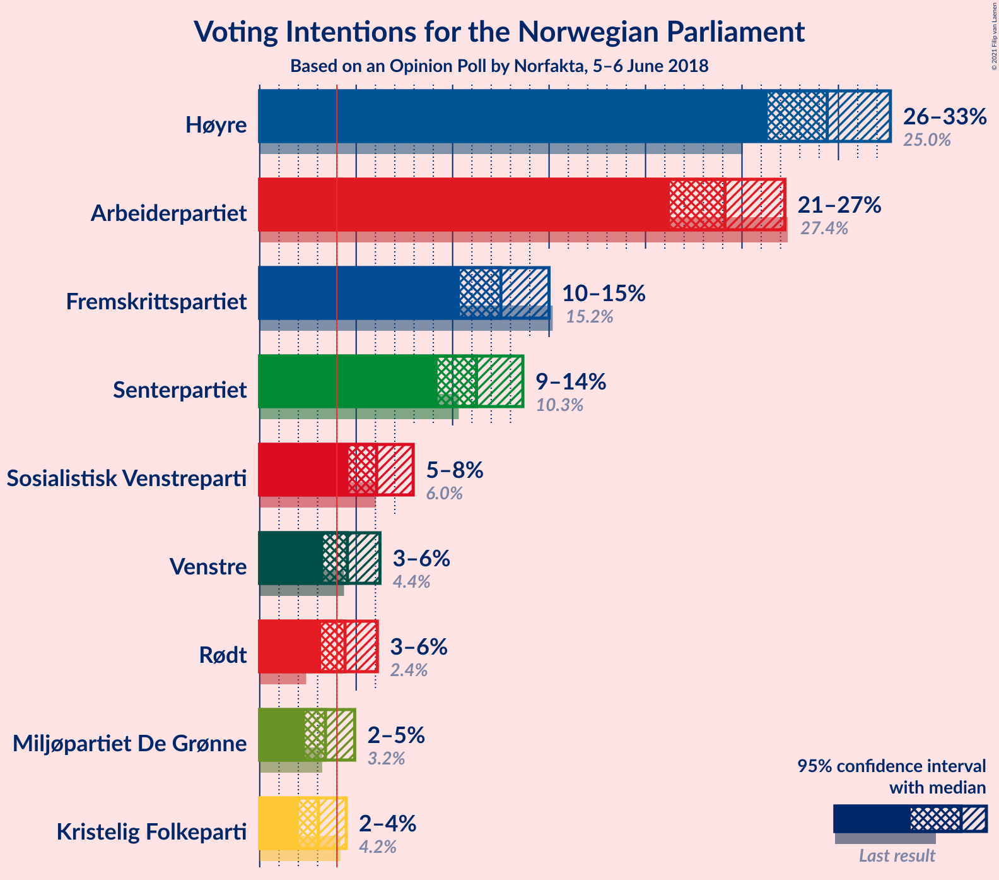
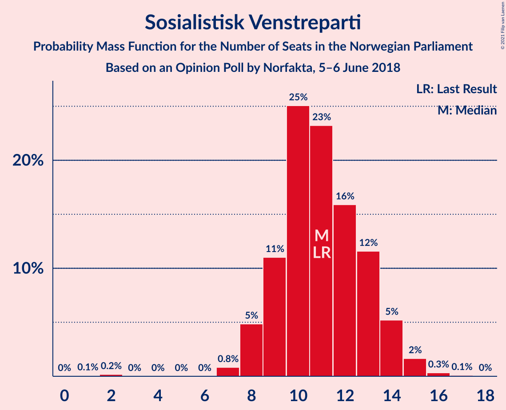
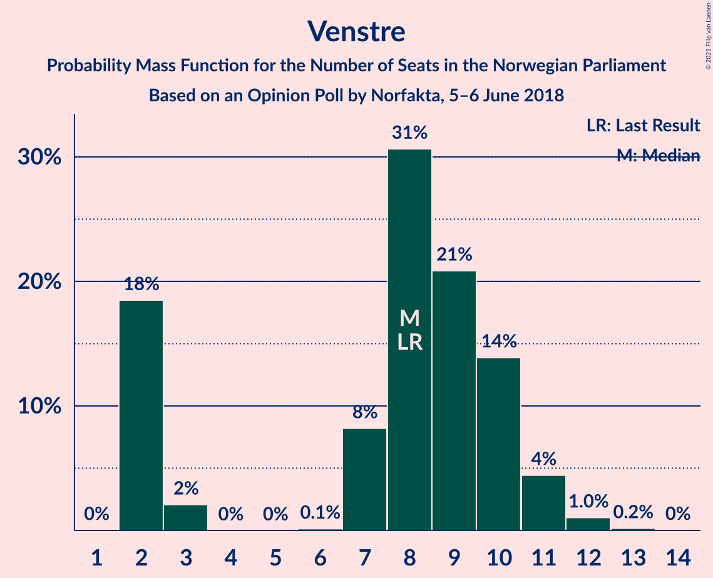
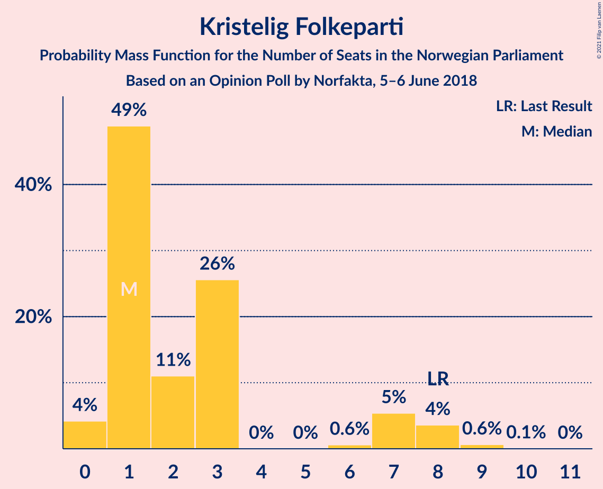
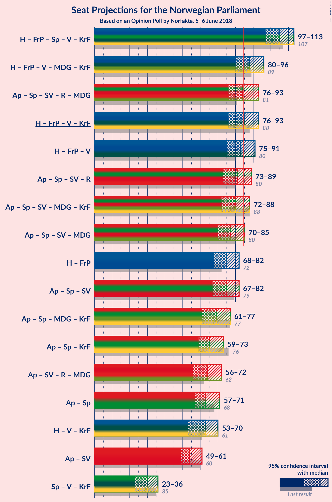
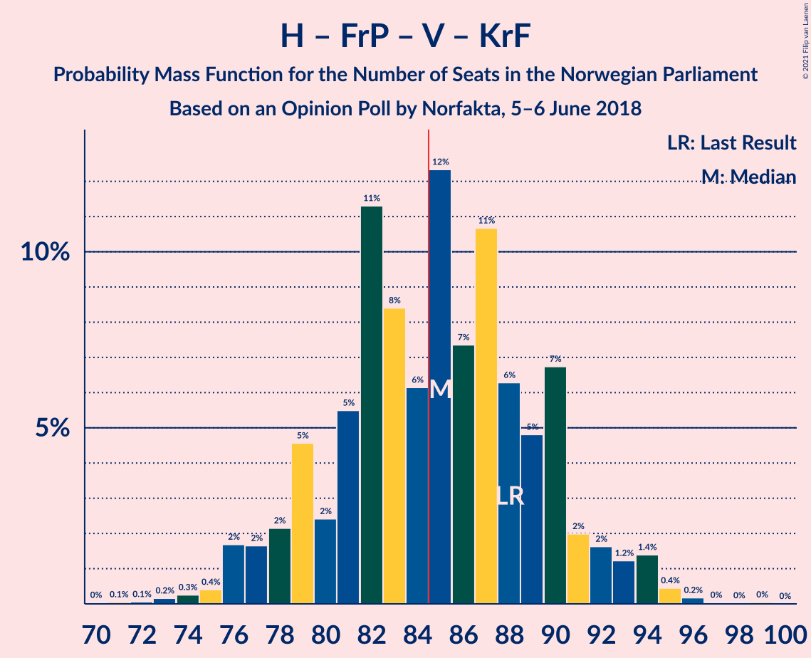
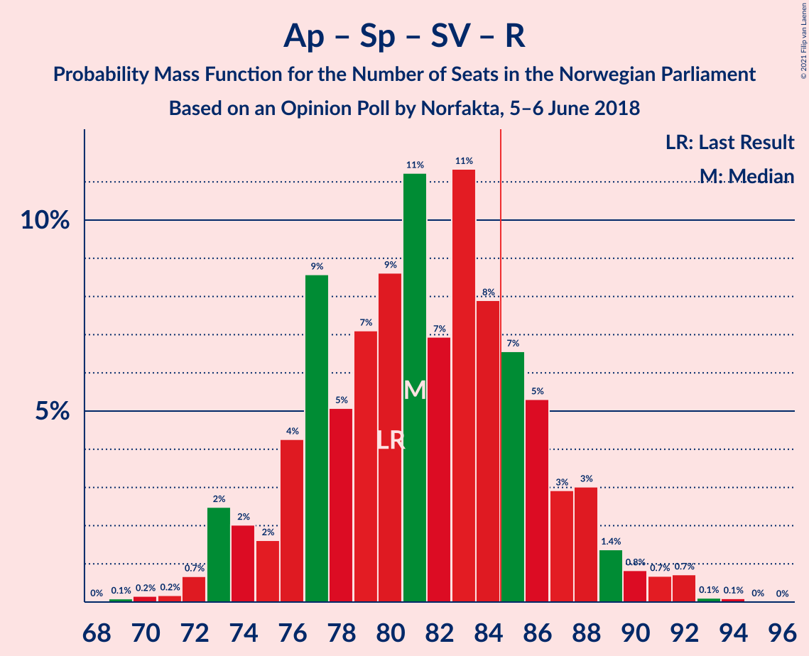
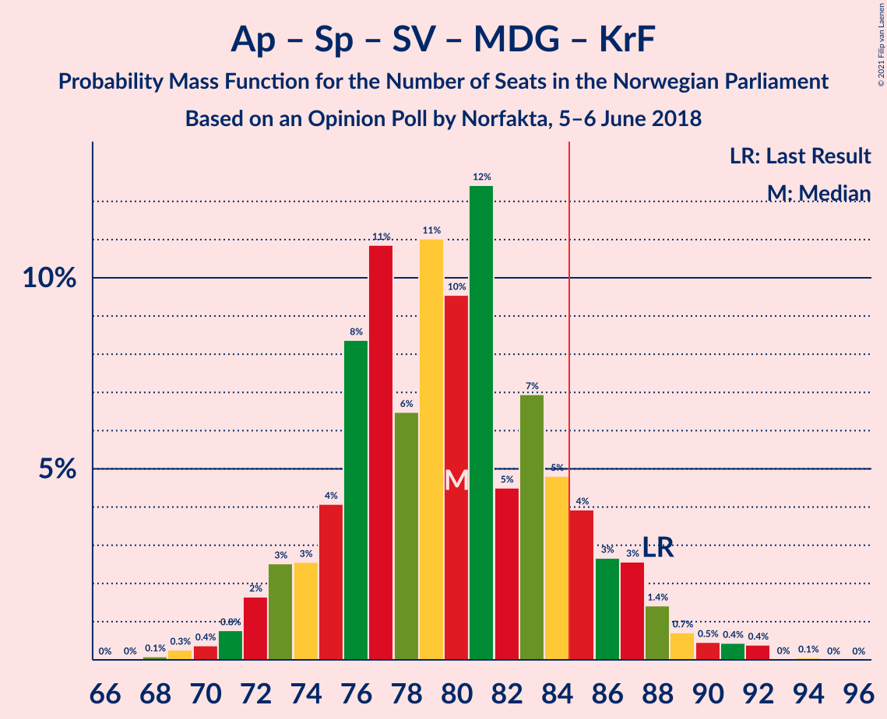
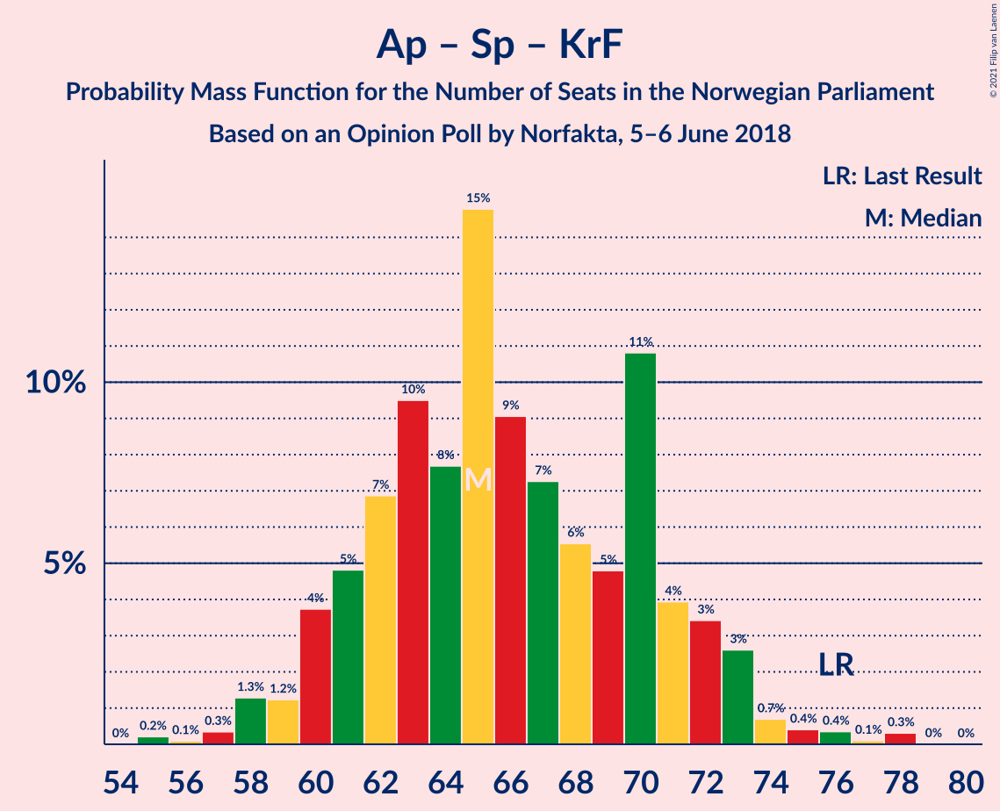
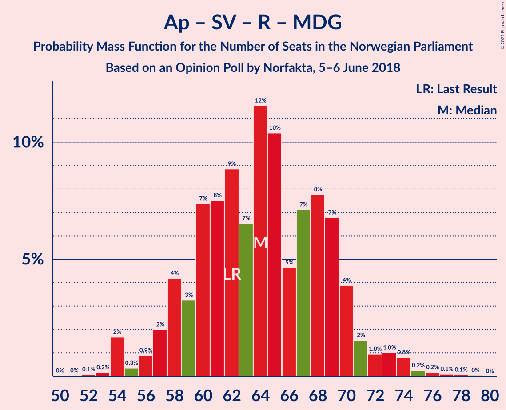

# Opinion Poll by Norfakta, 5–6 June 2018

<a href="#voting-intentions">Voting Intentions</a> | <a href="#seats">Seats</a> | <a href="#coalitions">Coalitions</a> | <a href="#technical-information">Technical Information</a>

## Voting Intentions

### Confidence Intervals

| Party | Last Result | Poll Result | 80% Confidence Interval | 90% Confidence Interval | 95% Confidence Interval | 99% Confidence Interval |
|:-----:|:-----------:|:-----------:|:-----------------------:|:-----------------------:|:-----------------------:|:-----------------------:|
| Høyre | 25.0% | 29.4% | 27.4–31.6% |26.8–32.2% |26.3–32.7% |25.4–33.7% |
| Arbeiderpartiet | 27.4% | 24.1% | 22.2–26.2% |21.7–26.7% |21.3–27.2% |20.4–28.2% |
| Fremskrittspartiet | 15.2% | 12.5% | 11.1–14.1% |10.7–14.6% |10.4–15.0% |9.7–15.8% |
| Senterpartiet | 10.3% | 11.2% | 9.9–12.8% |9.5–13.2% |9.2–13.6% |8.6–14.4% |
| Sosialistisk Venstreparti | 6.0% | 6.1% | 5.1–7.3% |4.8–7.6% |4.6–8.0% |4.2–8.6% |
| Venstre | 4.4% | 4.5% | 3.7–5.6% |3.5–6.0% |3.3–6.2% |2.9–6.8% |
| Rødt | 2.4% | 4.4% | 3.6–5.5% |3.4–5.8% |3.2–6.1% |2.9–6.7% |
| Miljøpartiet De Grønne | 3.2% | 3.4% | 2.7–4.4% |2.5–4.7% |2.3–4.9% |2.1–5.4% |
| Kristelig Folkeparti | 4.2% | 3.0% | 2.4–4.0% |2.2–4.2% |2.0–4.5% |1.8–5.0% |

*Note:* The poll result column reflects the actual value used in the calculations. Published results may vary slightly, and in addition be rounded to fewer digits.

## Seats

### Confidence Intervals

| Party | Last Result | Median | 80% Confidence Interval | 90% Confidence Interval | 95% Confidence Interval | 99% Confidence Interval |
|:-----:|:-----------:|:------:|:-----------------------:|:-----------------------:|:-----------------------:|:-----------------------:|
| <a href="#høyre">Høyre</a> | 45 | 53 | 48–58 |47–59 |46–60 |45–61 |
| <a href="#arbeiderpartiet">Arbeiderpartiet</a> | 49 | 43 | 40–47 |39–49 |38–50 |37–52 |
| <a href="#fremskrittspartiet">Fremskrittspartiet</a> | 27 | 22 | 19–25 |18–26 |18–27 |16–29 |
| <a href="#senterpartiet">Senterpartiet</a> | 19 | 20 | 17–23 |17–24 |16–24 |15–26 |
| <a href="#sosialistisk-venstreparti">Sosialistisk Venstreparti</a> | 11 | 11 | 9–13 |8–14 |8–14 |7–15 |
| <a href="#venstre">Venstre</a> | 8 | 8 | 2–10 |2–11 |2–11 |2–12 |
| <a href="#rødt">Rødt</a> | 1 | 8 | 2–10 |2–10 |2–11 |1–12 |
| <a href="#miljøpartiet-de-grønne">Miljøpartiet De Grønne</a> | 1 | 2 | 1–8 |1–8 |1–9 |1–10 |
| <a href="#kristelig-folkeparti">Kristelig Folkeparti</a> | 8 | 1 | 1–6 |1–7 |0–8 |0–9 |

### Høyre

*For a full overview of the results for this party, see the [Høyre](party-høyre.html) page.*

| Number of Seats | Probability | Accumulated | Special Marks |
|:---------------:|:-----------:|:-----------:|:-------------:|
| 43 | 0.1% | 100% |  |
| 44 | 0.3% | 99.9% |  |
| 45 | 1.0% | 99.6% | Last Result |
| 46 | 2% | 98.5% |  |
| 47 | 3% | 96% |  |
| 48 | 6% | 94% |  |
| 49 | 5% | 88% |  |
| 50 | 6% | 83% |  |
| 51 | 12% | 77% |  |
| 52 | 9% | 65% |  |
| 53 | 17% | 57% | Median |
| 54 | 8% | 40% |  |
| 55 | 9% | 32% |  |
| 56 | 7% | 23% |  |
| 57 | 5% | 16% |  |
| 58 | 4% | 11% |  |
| 59 | 3% | 7% |  |
| 60 | 3% | 4% |  |
| 61 | 1.0% | 1.4% |  |
| 62 | 0.3% | 0.4% |  |
| 63 | 0.1% | 0.2% |  |
| 64 | 0% | 0.1% |  |
| 65 | 0% | 0% |  |

### Arbeiderpartiet

*For a full overview of the results for this party, see the [Arbeiderpartiet](party-arbeiderpartiet.html) page.*

| Number of Seats | Probability | Accumulated | Special Marks |
|:---------------:|:-----------:|:-----------:|:-------------:|
| 35 | 0.1% | 100% |  |
| 36 | 0.1% | 99.9% |  |
| 37 | 1.0% | 99.7% |  |
| 38 | 1.5% | 98.8% |  |
| 39 | 5% | 97% |  |
| 40 | 5% | 93% |  |
| 41 | 14% | 88% |  |
| 42 | 14% | 74% |  |
| 43 | 11% | 59% | Median |
| 44 | 12% | 48% |  |
| 45 | 8% | 36% |  |
| 46 | 11% | 28% |  |
| 47 | 9% | 18% |  |
| 48 | 2% | 8% |  |
| 49 | 2% | 6% | Last Result |
| 50 | 1.2% | 4% |  |
| 51 | 1.4% | 2% |  |
| 52 | 0.4% | 0.9% |  |
| 53 | 0.4% | 0.5% |  |
| 54 | 0.1% | 0.1% |  |
| 55 | 0% | 0% |  |

### Fremskrittspartiet

*For a full overview of the results for this party, see the [Fremskrittspartiet](party-fremskrittspartiet.html) page.*

| Number of Seats | Probability | Accumulated | Special Marks |
|:---------------:|:-----------:|:-----------:|:-------------:|
| 15 | 0.1% | 100% |  |
| 16 | 0.6% | 99.9% |  |
| 17 | 2% | 99.3% |  |
| 18 | 6% | 98% |  |
| 19 | 12% | 91% |  |
| 20 | 11% | 79% |  |
| 21 | 9% | 68% |  |
| 22 | 9% | 59% | Median |
| 23 | 11% | 50% |  |
| 24 | 11% | 39% |  |
| 25 | 19% | 28% |  |
| 26 | 4% | 8% |  |
| 27 | 2% | 4% | Last Result |
| 28 | 2% | 2% |  |
| 29 | 0.5% | 0.7% |  |
| 30 | 0.2% | 0.2% |  |
| 31 | 0% | 0% |  |

### Senterpartiet

*For a full overview of the results for this party, see the [Senterpartiet](party-senterpartiet.html) page.*

| Number of Seats | Probability | Accumulated | Special Marks |
|:---------------:|:-----------:|:-----------:|:-------------:|
| 14 | 0.2% | 100% |  |
| 15 | 0.6% | 99.8% |  |
| 16 | 2% | 99.2% |  |
| 17 | 8% | 97% |  |
| 18 | 15% | 90% |  |
| 19 | 15% | 75% | Last Result |
| 20 | 20% | 60% | Median |
| 21 | 13% | 40% |  |
| 22 | 15% | 26% |  |
| 23 | 5% | 11% |  |
| 24 | 5% | 7% |  |
| 25 | 1.0% | 2% |  |
| 26 | 0.4% | 0.9% |  |
| 27 | 0.4% | 0.5% |  |
| 28 | 0.1% | 0.1% |  |
| 29 | 0% | 0% |  |

### Sosialistisk Venstreparti

*For a full overview of the results for this party, see the [Sosialistisk Venstreparti](party-sosialistiskvenstreparti.html) page.*

| Number of Seats | Probability | Accumulated | Special Marks |
|:---------------:|:-----------:|:-----------:|:-------------:|
| 1 | 0.1% | 100% |  |
| 2 | 0.2% | 99.9% |  |
| 3 | 0% | 99.8% |  |
| 4 | 0% | 99.8% |  |
| 5 | 0% | 99.8% |  |
| 6 | 0% | 99.8% |  |
| 7 | 0.8% | 99.8% |  |
| 8 | 5% | 98.9% |  |
| 9 | 11% | 94% |  |
| 10 | 25% | 83% |  |
| 11 | 23% | 58% | Last Result, Median |
| 12 | 16% | 35% |  |
| 13 | 12% | 19% |  |
| 14 | 5% | 7% |  |
| 15 | 2% | 2% |  |
| 16 | 0.3% | 0.4% |  |
| 17 | 0.1% | 0.1% |  |
| 18 | 0% | 0% |  |

### Venstre

*For a full overview of the results for this party, see the [Venstre](party-venstre.html) page.*

| Number of Seats | Probability | Accumulated | Special Marks |
|:---------------:|:-----------:|:-----------:|:-------------:|
| 2 | 18% | 100% |  |
| 3 | 2% | 81% |  |
| 4 | 0% | 79% |  |
| 5 | 0% | 79% |  |
| 6 | 0.1% | 79% |  |
| 7 | 8% | 79% |  |
| 8 | 31% | 71% | Last Result, Median |
| 9 | 21% | 40% |  |
| 10 | 14% | 20% |  |
| 11 | 4% | 6% |  |
| 12 | 1.0% | 1.2% |  |
| 13 | 0.2% | 0.2% |  |
| 14 | 0% | 0% |  |

### Rødt

*For a full overview of the results for this party, see the [Rødt](party-rødt.html) page.*

| Number of Seats | Probability | Accumulated | Special Marks |
|:---------------:|:-----------:|:-----------:|:-------------:|
| 1 | 0.9% | 100% | Last Result |
| 2 | 28% | 99.1% |  |
| 3 | 0% | 72% |  |
| 4 | 0% | 72% |  |
| 5 | 0% | 72% |  |
| 6 | 0.2% | 72% |  |
| 7 | 11% | 71% |  |
| 8 | 28% | 60% | Median |
| 9 | 19% | 32% |  |
| 10 | 11% | 14% |  |
| 11 | 3% | 3% |  |
| 12 | 0.4% | 0.5% |  |
| 13 | 0.1% | 0.1% |  |
| 14 | 0% | 0% |  |

### Miljøpartiet De Grønne

*For a full overview of the results for this party, see the [Miljøpartiet De Grønne](party-miljøpartietdegrønne.html) page.*

| Number of Seats | Probability | Accumulated | Special Marks |
|:---------------:|:-----------:|:-----------:|:-------------:|
| 0 | 0.3% | 100% |  |
| 1 | 39% | 99.7% | Last Result |
| 2 | 36% | 61% | Median |
| 3 | 3% | 24% |  |
| 4 | 0% | 22% |  |
| 5 | 0% | 22% |  |
| 6 | 0.2% | 22% |  |
| 7 | 11% | 22% |  |
| 8 | 8% | 11% |  |
| 9 | 2% | 3% |  |
| 10 | 0.4% | 0.5% |  |
| 11 | 0.1% | 0.1% |  |
| 12 | 0% | 0% |  |

### Kristelig Folkeparti

*For a full overview of the results for this party, see the [Kristelig Folkeparti](party-kristeligfolkeparti.html) page.*

| Number of Seats | Probability | Accumulated | Special Marks |
|:---------------:|:-----------:|:-----------:|:-------------:|
| 0 | 4% | 100% |  |
| 1 | 49% | 96% | Median |
| 2 | 11% | 47% |  |
| 3 | 26% | 36% |  |
| 4 | 0% | 10% |  |
| 5 | 0% | 10% |  |
| 6 | 0.6% | 10% |  |
| 7 | 5% | 10% |  |
| 8 | 4% | 4% | Last Result |
| 9 | 0.6% | 0.7% |  |
| 10 | 0.1% | 0.1% |  |
| 11 | 0% | 0% |  |

## Coalitions

### Confidence Intervals

| Coalition | Last Result | Median | Majority? | 80% Confidence Interval | 90% Confidence Interval | 95% Confidence Interval | 99% Confidence Interval |
|:---------:|:-----------:|:------:|:---------:|:-----------------------:|:-----------------------:|:-----------------------:|:-----------------------:|
| Høyre – Fremskrittspartiet – Senterpartiet – Venstre – Kristelig Folkeparti | 107 | 105 | 100% | 100–110 | 99–112 | 97–113 | 94–115 |
| Høyre – Fremskrittspartiet – Venstre – Miljøpartiet De Grønne – Kristelig Folkeparti | 89 | 88 | 78% | 83–93 | 81–95 | 80–96 | 77–97 |
| Arbeiderpartiet – Senterpartiet – Sosialistisk Venstreparti – Rødt – Miljøpartiet De Grønne | 81 | 84 | 45% | 79–90 | 78–91 | 76–93 | 74–95 |
| Høyre – Fremskrittspartiet – Venstre – Kristelig Folkeparti | 88 | 85 | 55% | 79–90 | 78–91 | 76–93 | 74–95 |
| Høyre – Fremskrittspartiet – Venstre | 80 | 83 | 30% | 77–88 | 76–89 | 75–91 | 72–94 |
| Arbeiderpartiet – Senterpartiet – Sosialistisk Venstreparti – Rødt | 80 | 81 | 22% | 76–86 | 74–88 | 73–89 | 72–92 |
| Arbeiderpartiet – Senterpartiet – Sosialistisk Venstreparti – Miljøpartiet De Grønne – Kristelig Folkeparti | 88 | 80 | 13% | 75–85 | 73–87 | 72–88 | 70–91 |
| Arbeiderpartiet – Senterpartiet – Sosialistisk Venstreparti – Miljøpartiet De Grønne | 80 | 77 | 4% | 73–83 | 71–84 | 70–85 | 68–89 |
| Høyre – Fremskrittspartiet | 72 | 75 | 0.6% | 71–80 | 70–81 | 68–82 | 66–85 |
| Arbeiderpartiet – Senterpartiet – Sosialistisk Venstreparti | 79 | 75 | 0.7% | 70–80 | 68–82 | 67–82 | 66–85 |
| Arbeiderpartiet – Senterpartiet – Miljøpartiet De Grønne – Kristelig Folkeparti | 77 | 69 | 0% | 63–74 | 62–76 | 61–77 | 59–81 |
| Arbeiderpartiet – Senterpartiet – Kristelig Folkeparti | 76 | 65 | 0% | 61–71 | 60–72 | 59–73 | 57–76 |
| Arbeiderpartiet – Sosialistisk Venstreparti – Rødt – Miljøpartiet De Grønne | 62 | 64 | 0% | 59–69 | 57–70 | 56–72 | 54–75 |
| Arbeiderpartiet – Senterpartiet | 68 | 63 | 0% | 59–69 | 58–70 | 57–71 | 56–74 |
| Høyre – Venstre – Kristelig Folkeparti | 61 | 63 | 0% | 56–68 | 55–70 | 53–70 | 51–72 |
| Arbeiderpartiet – Sosialistisk Venstreparti | 60 | 54 | 0% | 50–59 | 49–60 | 49–61 | 47–63 |
| Senterpartiet – Venstre – Kristelig Folkeparti | 35 | 30 | 0% | 25–34 | 23–35 | 23–36 | 20–38 |

### Høyre – Fremskrittspartiet – Senterpartiet – Venstre – Kristelig Folkeparti

| Number of Seats | Probability | Accumulated | Special Marks |
|:---------------:|:-----------:|:-----------:|:-------------:|
| 90 | 0% | 100% |  |
| 91 | 0.1% | 99.9% |  |
| 92 | 0.1% | 99.9% |  |
| 93 | 0.2% | 99.8% |  |
| 94 | 0.2% | 99.6% |  |
| 95 | 0.8% | 99.4% |  |
| 96 | 1.0% | 98.6% |  |
| 97 | 1.0% | 98% |  |
| 98 | 2% | 97% |  |
| 99 | 4% | 95% |  |
| 100 | 7% | 91% |  |
| 101 | 8% | 84% |  |
| 102 | 7% | 77% |  |
| 103 | 5% | 70% |  |
| 104 | 10% | 65% | Median |
| 105 | 12% | 55% |  |
| 106 | 7% | 43% |  |
| 107 | 9% | 36% | Last Result |
| 108 | 8% | 28% |  |
| 109 | 7% | 20% |  |
| 110 | 3% | 13% |  |
| 111 | 4% | 9% |  |
| 112 | 2% | 5% |  |
| 113 | 0.9% | 3% |  |
| 114 | 0.3% | 2% |  |
| 115 | 2% | 2% |  |
| 116 | 0.2% | 0.3% |  |
| 117 | 0.1% | 0.1% |  |
| 118 | 0% | 0.1% |  |
| 119 | 0% | 0% |  |

### Høyre – Fremskrittspartiet – Venstre – Miljøpartiet De Grønne – Kristelig Folkeparti

| Number of Seats | Probability | Accumulated | Special Marks |
|:---------------:|:-----------:|:-----------:|:-------------:|
| 74 | 0% | 100% |  |
| 75 | 0.1% | 99.9% |  |
| 76 | 0.1% | 99.9% |  |
| 77 | 0.7% | 99.7% |  |
| 78 | 0.7% | 99.0% |  |
| 79 | 0.8% | 98% |  |
| 80 | 1.4% | 98% |  |
| 81 | 3% | 96% |  |
| 82 | 3% | 93% |  |
| 83 | 5% | 90% |  |
| 84 | 7% | 85% |  |
| 85 | 8% | 78% | Majority |
| 86 | 11% | 70% | Median |
| 87 | 7% | 59% |  |
| 88 | 11% | 52% |  |
| 89 | 9% | 41% | Last Result |
| 90 | 7% | 32% |  |
| 91 | 5% | 25% |  |
| 92 | 9% | 20% |  |
| 93 | 4% | 12% |  |
| 94 | 2% | 7% |  |
| 95 | 2% | 6% |  |
| 96 | 2% | 4% |  |
| 97 | 0.7% | 1.2% |  |
| 98 | 0.2% | 0.5% |  |
| 99 | 0.2% | 0.3% |  |
| 100 | 0.1% | 0.1% |  |
| 101 | 0% | 0.1% |  |
| 102 | 0% | 0% |  |

### Arbeiderpartiet – Senterpartiet – Sosialistisk Venstreparti – Rødt – Miljøpartiet De Grønne

| Number of Seats | Probability | Accumulated | Special Marks |
|:---------------:|:-----------:|:-----------:|:-------------:|
| 70 | 0% | 100% |  |
| 71 | 0% | 99.9% |  |
| 72 | 0% | 99.9% |  |
| 73 | 0.2% | 99.9% |  |
| 74 | 0.4% | 99.7% |  |
| 75 | 1.4% | 99.3% |  |
| 76 | 1.2% | 98% |  |
| 77 | 2% | 97% |  |
| 78 | 2% | 95% |  |
| 79 | 7% | 93% |  |
| 80 | 5% | 86% |  |
| 81 | 6% | 81% | Last Result |
| 82 | 11% | 75% |  |
| 83 | 7% | 65% |  |
| 84 | 12% | 57% | Median |
| 85 | 6% | 45% | Majority |
| 86 | 8% | 39% |  |
| 87 | 11% | 30% |  |
| 88 | 5% | 19% |  |
| 89 | 2% | 13% |  |
| 90 | 5% | 11% |  |
| 91 | 2% | 6% |  |
| 92 | 2% | 4% |  |
| 93 | 2% | 3% |  |
| 94 | 0.4% | 1.0% |  |
| 95 | 0.3% | 0.6% |  |
| 96 | 0.2% | 0.3% |  |
| 97 | 0.1% | 0.2% |  |
| 98 | 0.1% | 0.1% |  |
| 99 | 0% | 0.1% |  |
| 100 | 0% | 0% |  |

### Høyre – Fremskrittspartiet – Venstre – Kristelig Folkeparti

| Number of Seats | Probability | Accumulated | Special Marks |
|:---------------:|:-----------:|:-----------:|:-------------:|
| 70 | 0% | 100% |  |
| 71 | 0.1% | 99.9% |  |
| 72 | 0.1% | 99.9% |  |
| 73 | 0.2% | 99.8% |  |
| 74 | 0.3% | 99.7% |  |
| 75 | 0.4% | 99.4% |  |
| 76 | 2% | 99.0% |  |
| 77 | 2% | 97% |  |
| 78 | 2% | 96% |  |
| 79 | 5% | 94% |  |
| 80 | 2% | 89% |  |
| 81 | 5% | 87% |  |
| 82 | 11% | 81% |  |
| 83 | 8% | 70% |  |
| 84 | 6% | 61% | Median |
| 85 | 12% | 55% | Majority |
| 86 | 7% | 43% |  |
| 87 | 11% | 35% |  |
| 88 | 6% | 25% | Last Result |
| 89 | 5% | 19% |  |
| 90 | 7% | 14% |  |
| 91 | 2% | 7% |  |
| 92 | 2% | 5% |  |
| 93 | 1.2% | 3% |  |
| 94 | 1.4% | 2% |  |
| 95 | 0.4% | 0.7% |  |
| 96 | 0.2% | 0.3% |  |
| 97 | 0% | 0.1% |  |
| 98 | 0% | 0.1% |  |
| 99 | 0% | 0.1% |  |
| 100 | 0% | 0% |  |

### Høyre – Fremskrittspartiet – Venstre

| Number of Seats | Probability | Accumulated | Special Marks |
|:---------------:|:-----------:|:-----------:|:-------------:|
| 68 | 0% | 100% |  |
| 69 | 0% | 99.9% |  |
| 70 | 0.1% | 99.9% |  |
| 71 | 0.1% | 99.8% |  |
| 72 | 0.3% | 99.7% |  |
| 73 | 0.5% | 99.4% |  |
| 74 | 1.5% | 99.0% |  |
| 75 | 2% | 98% |  |
| 76 | 2% | 95% |  |
| 77 | 4% | 93% |  |
| 78 | 7% | 89% |  |
| 79 | 5% | 83% |  |
| 80 | 11% | 77% | Last Result |
| 81 | 8% | 67% |  |
| 82 | 7% | 59% |  |
| 83 | 9% | 52% | Median |
| 84 | 13% | 43% |  |
| 85 | 3% | 30% | Majority |
| 86 | 10% | 27% |  |
| 87 | 7% | 17% |  |
| 88 | 3% | 10% |  |
| 89 | 2% | 7% |  |
| 90 | 1.1% | 5% |  |
| 91 | 2% | 4% |  |
| 92 | 0.6% | 1.4% |  |
| 93 | 0.3% | 0.8% |  |
| 94 | 0.4% | 0.5% |  |
| 95 | 0% | 0.1% |  |
| 96 | 0.1% | 0.1% |  |
| 97 | 0% | 0% |  |

### Arbeiderpartiet – Senterpartiet – Sosialistisk Venstreparti – Rødt

| Number of Seats | Probability | Accumulated | Special Marks |
|:---------------:|:-----------:|:-----------:|:-------------:|
| 68 | 0% | 100% |  |
| 69 | 0.1% | 99.9% |  |
| 70 | 0.2% | 99.9% |  |
| 71 | 0.2% | 99.7% |  |
| 72 | 0.7% | 99.5% |  |
| 73 | 2% | 98.8% |  |
| 74 | 2% | 96% |  |
| 75 | 2% | 94% |  |
| 76 | 4% | 93% |  |
| 77 | 9% | 88% |  |
| 78 | 5% | 80% |  |
| 79 | 7% | 75% |  |
| 80 | 9% | 68% | Last Result |
| 81 | 11% | 59% |  |
| 82 | 7% | 48% | Median |
| 83 | 11% | 41% |  |
| 84 | 8% | 30% |  |
| 85 | 7% | 22% | Majority |
| 86 | 5% | 15% |  |
| 87 | 3% | 10% |  |
| 88 | 3% | 7% |  |
| 89 | 1.4% | 4% |  |
| 90 | 0.8% | 2% |  |
| 91 | 0.7% | 2% |  |
| 92 | 0.7% | 1.0% |  |
| 93 | 0.1% | 0.3% |  |
| 94 | 0.1% | 0.1% |  |
| 95 | 0% | 0.1% |  |
| 96 | 0% | 0% |  |

### Arbeiderpartiet – Senterpartiet – Sosialistisk Venstreparti – Miljøpartiet De Grønne – Kristelig Folkeparti

| Number of Seats | Probability | Accumulated | Special Marks |
|:---------------:|:-----------:|:-----------:|:-------------:|
| 68 | 0.1% | 100% |  |
| 69 | 0.3% | 99.9% |  |
| 70 | 0.4% | 99.6% |  |
| 71 | 0.8% | 99.3% |  |
| 72 | 2% | 98% |  |
| 73 | 3% | 97% |  |
| 74 | 3% | 94% |  |
| 75 | 4% | 92% |  |
| 76 | 8% | 88% |  |
| 77 | 11% | 79% | Median |
| 78 | 6% | 68% |  |
| 79 | 11% | 62% |  |
| 80 | 10% | 51% |  |
| 81 | 12% | 41% |  |
| 82 | 5% | 29% |  |
| 83 | 7% | 24% |  |
| 84 | 5% | 18% |  |
| 85 | 4% | 13% | Majority |
| 86 | 3% | 9% |  |
| 87 | 3% | 6% |  |
| 88 | 1.4% | 4% | Last Result |
| 89 | 0.7% | 2% |  |
| 90 | 0.5% | 1.4% |  |
| 91 | 0.4% | 0.9% |  |
| 92 | 0.4% | 0.5% |  |
| 93 | 0% | 0.1% |  |
| 94 | 0.1% | 0.1% |  |
| 95 | 0% | 0% |  |

### Arbeiderpartiet – Senterpartiet – Sosialistisk Venstreparti – Miljøpartiet De Grønne

| Number of Seats | Probability | Accumulated | Special Marks |
|:---------------:|:-----------:|:-----------:|:-------------:|
| 66 | 0.1% | 100% |  |
| 67 | 0.1% | 99.9% |  |
| 68 | 0.4% | 99.7% |  |
| 69 | 1.1% | 99.3% |  |
| 70 | 2% | 98% |  |
| 71 | 3% | 96% |  |
| 72 | 3% | 93% |  |
| 73 | 7% | 90% |  |
| 74 | 6% | 84% |  |
| 75 | 7% | 78% |  |
| 76 | 10% | 70% | Median |
| 77 | 13% | 60% |  |
| 78 | 9% | 47% |  |
| 79 | 7% | 38% |  |
| 80 | 10% | 31% | Last Result |
| 81 | 5% | 22% |  |
| 82 | 4% | 17% |  |
| 83 | 4% | 12% |  |
| 84 | 4% | 8% |  |
| 85 | 1.3% | 4% | Majority |
| 86 | 0.8% | 2% |  |
| 87 | 0.6% | 2% |  |
| 88 | 0.4% | 1.0% |  |
| 89 | 0.4% | 0.6% |  |
| 90 | 0% | 0.2% |  |
| 91 | 0.1% | 0.1% |  |
| 92 | 0% | 0% |  |

### Høyre – Fremskrittspartiet

| Number of Seats | Probability | Accumulated | Special Marks |
|:---------------:|:-----------:|:-----------:|:-------------:|
| 64 | 0.1% | 100% |  |
| 65 | 0.2% | 99.9% |  |
| 66 | 0.3% | 99.7% |  |
| 67 | 0.9% | 99.3% |  |
| 68 | 1.0% | 98% |  |
| 69 | 2% | 97% |  |
| 70 | 4% | 96% |  |
| 71 | 6% | 92% |  |
| 72 | 9% | 85% | Last Result |
| 73 | 9% | 76% |  |
| 74 | 7% | 67% |  |
| 75 | 12% | 60% | Median |
| 76 | 14% | 48% |  |
| 77 | 7% | 34% |  |
| 78 | 12% | 27% |  |
| 79 | 4% | 15% |  |
| 80 | 3% | 11% |  |
| 81 | 3% | 7% |  |
| 82 | 2% | 4% |  |
| 83 | 1.3% | 2% |  |
| 84 | 0.2% | 0.8% |  |
| 85 | 0.2% | 0.6% | Majority |
| 86 | 0.2% | 0.4% |  |
| 87 | 0.1% | 0.2% |  |
| 88 | 0% | 0.1% |  |
| 89 | 0% | 0.1% |  |
| 90 | 0% | 0% |  |

### Arbeiderpartiet – Senterpartiet – Sosialistisk Venstreparti

| Number of Seats | Probability | Accumulated | Special Marks |
|:---------------:|:-----------:|:-----------:|:-------------:|
| 63 | 0% | 100% |  |
| 64 | 0.2% | 99.9% |  |
| 65 | 0.2% | 99.7% |  |
| 66 | 0.6% | 99.5% |  |
| 67 | 1.5% | 98.9% |  |
| 68 | 3% | 97% |  |
| 69 | 4% | 95% |  |
| 70 | 5% | 91% |  |
| 71 | 7% | 85% |  |
| 72 | 10% | 78% |  |
| 73 | 4% | 68% |  |
| 74 | 11% | 64% | Median |
| 75 | 16% | 52% |  |
| 76 | 6% | 36% |  |
| 77 | 7% | 30% |  |
| 78 | 4% | 23% |  |
| 79 | 8% | 19% | Last Result |
| 80 | 3% | 11% |  |
| 81 | 2% | 8% |  |
| 82 | 3% | 5% |  |
| 83 | 0.7% | 2% |  |
| 84 | 0.6% | 1.3% |  |
| 85 | 0.3% | 0.7% | Majority |
| 86 | 0.4% | 0.4% |  |
| 87 | 0.1% | 0.1% |  |
| 88 | 0% | 0% |  |

### Arbeiderpartiet – Senterpartiet – Miljøpartiet De Grønne – Kristelig Folkeparti

| Number of Seats | Probability | Accumulated | Special Marks |
|:---------------:|:-----------:|:-----------:|:-------------:|
| 57 | 0.1% | 100% |  |
| 58 | 0.1% | 99.9% |  |
| 59 | 0.4% | 99.8% |  |
| 60 | 0.3% | 99.5% |  |
| 61 | 3% | 99.1% |  |
| 62 | 3% | 96% |  |
| 63 | 4% | 94% |  |
| 64 | 3% | 89% |  |
| 65 | 6% | 86% |  |
| 66 | 8% | 79% | Median |
| 67 | 11% | 71% |  |
| 68 | 9% | 60% |  |
| 69 | 8% | 51% |  |
| 70 | 8% | 43% |  |
| 71 | 9% | 35% |  |
| 72 | 7% | 26% |  |
| 73 | 8% | 19% |  |
| 74 | 2% | 11% |  |
| 75 | 3% | 8% |  |
| 76 | 2% | 5% |  |
| 77 | 2% | 4% | Last Result |
| 78 | 0.6% | 2% |  |
| 79 | 0.5% | 1.3% |  |
| 80 | 0.1% | 0.8% |  |
| 81 | 0.5% | 0.7% |  |
| 82 | 0.1% | 0.2% |  |
| 83 | 0% | 0.1% |  |
| 84 | 0% | 0% |  |

### Arbeiderpartiet – Senterpartiet – Kristelig Folkeparti

| Number of Seats | Probability | Accumulated | Special Marks |
|:---------------:|:-----------:|:-----------:|:-------------:|
| 55 | 0.2% | 100% |  |
| 56 | 0.1% | 99.8% |  |
| 57 | 0.3% | 99.7% |  |
| 58 | 1.3% | 99.3% |  |
| 59 | 1.2% | 98% |  |
| 60 | 4% | 97% |  |
| 61 | 5% | 93% |  |
| 62 | 7% | 88% |  |
| 63 | 10% | 81% |  |
| 64 | 8% | 72% | Median |
| 65 | 15% | 64% |  |
| 66 | 9% | 49% |  |
| 67 | 7% | 40% |  |
| 68 | 6% | 33% |  |
| 69 | 5% | 28% |  |
| 70 | 11% | 23% |  |
| 71 | 4% | 12% |  |
| 72 | 3% | 8% |  |
| 73 | 3% | 5% |  |
| 74 | 0.7% | 2% |  |
| 75 | 0.4% | 1.2% |  |
| 76 | 0.4% | 0.8% | Last Result |
| 77 | 0.1% | 0.4% |  |
| 78 | 0.3% | 0.3% |  |
| 79 | 0% | 0% |  |

### Arbeiderpartiet – Sosialistisk Venstreparti – Rødt – Miljøpartiet De Grønne

| Number of Seats | Probability | Accumulated | Special Marks |
|:---------------:|:-----------:|:-----------:|:-------------:|
| 51 | 0% | 100% |  |
| 52 | 0.1% | 99.9% |  |
| 53 | 0.2% | 99.9% |  |
| 54 | 2% | 99.7% |  |
| 55 | 0.3% | 98% |  |
| 56 | 0.9% | 98% |  |
| 57 | 2% | 97% |  |
| 58 | 4% | 95% |  |
| 59 | 3% | 91% |  |
| 60 | 7% | 87% |  |
| 61 | 8% | 80% |  |
| 62 | 9% | 72% | Last Result |
| 63 | 7% | 64% |  |
| 64 | 12% | 57% | Median |
| 65 | 10% | 45% |  |
| 66 | 5% | 35% |  |
| 67 | 7% | 30% |  |
| 68 | 8% | 23% |  |
| 69 | 7% | 16% |  |
| 70 | 4% | 9% |  |
| 71 | 2% | 5% |  |
| 72 | 1.0% | 3% |  |
| 73 | 1.0% | 2% |  |
| 74 | 0.8% | 1.4% |  |
| 75 | 0.2% | 0.6% |  |
| 76 | 0.2% | 0.4% |  |
| 77 | 0.1% | 0.2% |  |
| 78 | 0.1% | 0.1% |  |
| 79 | 0% | 0.1% |  |
| 80 | 0% | 0% |  |

### Arbeiderpartiet – Senterpartiet

| Number of Seats | Probability | Accumulated | Special Marks |
|:---------------:|:-----------:|:-----------:|:-------------:|
| 54 | 0.2% | 100% |  |
| 55 | 0.2% | 99.7% |  |
| 56 | 0.4% | 99.5% |  |
| 57 | 2% | 99.2% |  |
| 58 | 3% | 97% |  |
| 59 | 7% | 95% |  |
| 60 | 8% | 87% |  |
| 61 | 8% | 79% |  |
| 62 | 12% | 70% |  |
| 63 | 12% | 58% | Median |
| 64 | 10% | 46% |  |
| 65 | 5% | 37% |  |
| 66 | 8% | 31% |  |
| 67 | 5% | 23% |  |
| 68 | 3% | 18% | Last Result |
| 69 | 10% | 15% |  |
| 70 | 2% | 6% |  |
| 71 | 1.3% | 4% |  |
| 72 | 1.2% | 2% |  |
| 73 | 0.5% | 1.1% |  |
| 74 | 0.1% | 0.6% |  |
| 75 | 0.4% | 0.5% |  |
| 76 | 0.1% | 0.1% |  |
| 77 | 0% | 0% |  |

### Høyre – Venstre – Kristelig Folkeparti

| Number of Seats | Probability | Accumulated | Special Marks |
|:---------------:|:-----------:|:-----------:|:-------------:|
| 50 | 0.2% | 100% |  |
| 51 | 0.5% | 99.8% |  |
| 52 | 0.2% | 99.3% |  |
| 53 | 2% | 99.1% |  |
| 54 | 2% | 97% |  |
| 55 | 3% | 96% |  |
| 56 | 6% | 93% |  |
| 57 | 4% | 87% |  |
| 58 | 6% | 84% |  |
| 59 | 4% | 77% |  |
| 60 | 6% | 73% |  |
| 61 | 4% | 67% | Last Result |
| 62 | 9% | 62% | Median |
| 63 | 10% | 53% |  |
| 64 | 5% | 43% |  |
| 65 | 9% | 39% |  |
| 66 | 8% | 30% |  |
| 67 | 9% | 22% |  |
| 68 | 4% | 13% |  |
| 69 | 2% | 9% |  |
| 70 | 5% | 7% |  |
| 71 | 1.2% | 2% |  |
| 72 | 0.3% | 0.5% |  |
| 73 | 0.1% | 0.3% |  |
| 74 | 0.1% | 0.1% |  |
| 75 | 0% | 0% |  |

### Arbeiderpartiet – Sosialistisk Venstreparti

| Number of Seats | Probability | Accumulated | Special Marks |
|:---------------:|:-----------:|:-----------:|:-------------:|
| 43 | 0% | 100% |  |
| 44 | 0% | 99.9% |  |
| 45 | 0.1% | 99.9% |  |
| 46 | 0.2% | 99.8% |  |
| 47 | 0.7% | 99.6% |  |
| 48 | 1.0% | 98.8% |  |
| 49 | 3% | 98% |  |
| 50 | 5% | 95% |  |
| 51 | 7% | 90% |  |
| 52 | 12% | 83% |  |
| 53 | 8% | 71% |  |
| 54 | 14% | 63% | Median |
| 55 | 13% | 49% |  |
| 56 | 6% | 36% |  |
| 57 | 10% | 30% |  |
| 58 | 8% | 20% |  |
| 59 | 4% | 12% |  |
| 60 | 4% | 7% | Last Result |
| 61 | 0.8% | 3% |  |
| 62 | 1.1% | 2% |  |
| 63 | 0.6% | 1.1% |  |
| 64 | 0.3% | 0.5% |  |
| 65 | 0.1% | 0.2% |  |
| 66 | 0.1% | 0.1% |  |
| 67 | 0% | 0% |  |

### Senterpartiet – Venstre – Kristelig Folkeparti

| Number of Seats | Probability | Accumulated | Special Marks |
|:---------------:|:-----------:|:-----------:|:-------------:|
| 19 | 0.2% | 100% |  |
| 20 | 0.4% | 99.8% |  |
| 21 | 1.1% | 99.4% |  |
| 22 | 0.8% | 98% |  |
| 23 | 3% | 98% |  |
| 24 | 1.3% | 94% |  |
| 25 | 5% | 93% |  |
| 26 | 4% | 88% |  |
| 27 | 7% | 85% |  |
| 28 | 9% | 78% |  |
| 29 | 17% | 69% | Median |
| 30 | 11% | 52% |  |
| 31 | 13% | 41% |  |
| 32 | 6% | 27% |  |
| 33 | 7% | 22% |  |
| 34 | 9% | 14% |  |
| 35 | 2% | 6% | Last Result |
| 36 | 1.3% | 3% |  |
| 37 | 1.2% | 2% |  |
| 38 | 0.4% | 0.8% |  |
| 39 | 0.2% | 0.4% |  |
| 40 | 0.1% | 0.2% |  |
| 41 | 0% | 0.1% |  |
| 42 | 0.1% | 0.1% |  |
| 43 | 0% | 0% |  |

## Technical Information

### Opinion Poll

+ **Polling firm:** Norfakta
+ **Commissioner(s):** —
+ **Fieldwork period:** 5–6 June 2018

### Calculations

+ **Sample size:** 792
+ **Simulations done:** 1,048,576
+ **Error estimate:** 2.62%

