# Opinion Poll by Ipsos MMI, 25–27 June 2018

<a href="#voting-intentions">Voting Intentions</a> | <a href="#seats">Seats</a> | <a href="#coalitions">Coalitions</a> | <a href="#technical-information">Technical Information</a>

## Voting Intentions

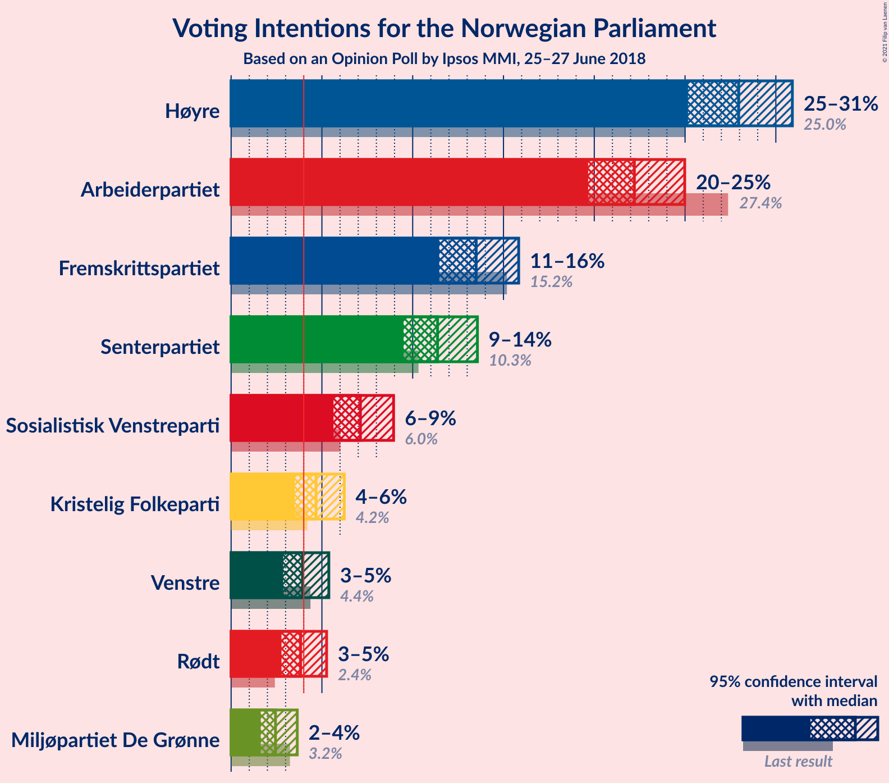

### Confidence Intervals

| Party | Last Result | Poll Result | 80% Confidence Interval | 90% Confidence Interval | 95% Confidence Interval | 99% Confidence Interval |
|:-----:|:-----------:|:-----------:|:-----------------------:|:-----------------------:|:-----------------------:|:-----------------------:|
| Høyre | 25.0% | 27.9% | 26.1–29.9% |25.6–30.4% |25.2–30.9% |24.3–31.9% |
| Arbeiderpartiet | 27.4% | 22.2% | 20.5–24.0% |20.1–24.5% |19.7–25.0% |18.9–25.9% |
| Fremskrittspartiet | 15.2% | 13.5% | 12.1–15.0% |11.8–15.5% |11.5–15.8% |10.8–16.6% |
| Senterpartiet | 10.3% | 11.4% | 10.1–12.8% |9.8–13.2% |9.5–13.6% |8.9–14.3% |
| Sosialistisk Venstreparti | 6.0% | 7.1% | 6.1–8.3% |5.9–8.7% |5.6–8.9% |5.2–9.6% |
| Kristelig Folkeparti | 4.2% | 4.7% | 3.9–5.7% |3.7–6.0% |3.5–6.2% |3.2–6.7% |
| Venstre | 4.4% | 3.9% | 3.2–4.9% |3.0–5.1% |2.9–5.4% |2.6–5.9% |
| Rødt | 2.4% | 3.8% | 3.1–4.8% |2.9–5.0% |2.8–5.3% |2.5–5.7% |
| Miljøpartiet De Grønne | 3.2% | 2.4% | 1.9–3.2% |1.8–3.4% |1.6–3.6% |1.4–4.1% |

*Note:* The poll result column reflects the actual value used in the calculations. Published results may vary slightly, and in addition be rounded to fewer digits.

## Seats

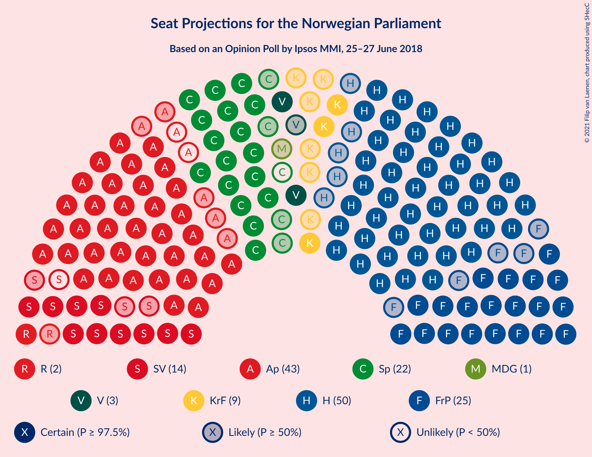

### Confidence Intervals

| Party | Last Result | Median | 80% Confidence Interval | 90% Confidence Interval | 95% Confidence Interval | 99% Confidence Interval |
|:-----:|:-----------:|:------:|:-----------------------:|:-----------------------:|:-----------------------:|:-----------------------:|
| <a href="#høyre">Høyre</a> | 45 | 50 | 47–55 |45–56 |45–57 |44–59 |
| <a href="#arbeiderpartiet">Arbeiderpartiet</a> | 49 | 41 | 38–44 |37–45 |36–46 |35–47 |
| <a href="#fremskrittspartiet">Fremskrittspartiet</a> | 27 | 25 | 22–27 |21–28 |20–29 |19–30 |
| <a href="#senterpartiet">Senterpartiet</a> | 19 | 21 | 18–23 |17–24 |17–24 |17–26 |
| <a href="#sosialistisk-venstreparti">Sosialistisk Venstreparti</a> | 11 | 13 | 11–15 |10–16 |10–16 |9–17 |
| <a href="#kristelig-folkeparti">Kristelig Folkeparti</a> | 8 | 9 | 3–10 |3–11 |3–11 |2–12 |
| <a href="#venstre">Venstre</a> | 8 | 3 | 2–8 |2–9 |2–10 |2–10 |
| <a href="#rødt">Rødt</a> | 1 | 2 | 2–8 |2–9 |1–9 |1–10 |
| <a href="#miljøpartiet-de-grønne">Miljøpartiet De Grønne</a> | 1 | 1 | 1–2 |0–2 |0–2 |0–7 |

### Høyre

*For a full overview of the results for this party, see the [Høyre](party-høyre.html) page.*

| Number of Seats | Probability | Accumulated | Special Marks |
|:---------------:|:-----------:|:-----------:|:-------------:|
| 42 | 0.1% | 100% |  |
| 43 | 0.3% | 99.9% |  |
| 44 | 0.9% | 99.6% |  |
| 45 | 5% | 98.6% | Last Result |
| 46 | 2% | 94% |  |
| 47 | 4% | 91% |  |
| 48 | 8% | 87% |  |
| 49 | 11% | 79% |  |
| 50 | 24% | 68% | Median |
| 51 | 7% | 44% |  |
| 52 | 11% | 38% |  |
| 53 | 5% | 27% |  |
| 54 | 10% | 22% |  |
| 55 | 4% | 12% |  |
| 56 | 5% | 8% |  |
| 57 | 2% | 3% |  |
| 58 | 0.6% | 1.2% |  |
| 59 | 0.4% | 0.7% |  |
| 60 | 0.2% | 0.3% |  |
| 61 | 0.1% | 0.1% |  |
| 62 | 0% | 0% |  |

### Arbeiderpartiet

*For a full overview of the results for this party, see the [Arbeiderpartiet](party-arbeiderpartiet.html) page.*

| Number of Seats | Probability | Accumulated | Special Marks |
|:---------------:|:-----------:|:-----------:|:-------------:|
| 33 | 0.1% | 100% |  |
| 34 | 0.2% | 99.9% |  |
| 35 | 0.4% | 99.8% |  |
| 36 | 2% | 99.4% |  |
| 37 | 5% | 97% |  |
| 38 | 6% | 92% |  |
| 39 | 11% | 86% |  |
| 40 | 21% | 75% |  |
| 41 | 11% | 54% | Median |
| 42 | 12% | 42% |  |
| 43 | 17% | 30% |  |
| 44 | 7% | 14% |  |
| 45 | 4% | 7% |  |
| 46 | 2% | 3% |  |
| 47 | 1.1% | 1.5% |  |
| 48 | 0.2% | 0.4% |  |
| 49 | 0.1% | 0.2% | Last Result |
| 50 | 0% | 0% |  |

### Fremskrittspartiet

*For a full overview of the results for this party, see the [Fremskrittspartiet](party-fremskrittspartiet.html) page.*

| Number of Seats | Probability | Accumulated | Special Marks |
|:---------------:|:-----------:|:-----------:|:-------------:|
| 17 | 0% | 100% |  |
| 18 | 0.4% | 99.9% |  |
| 19 | 0.6% | 99.5% |  |
| 20 | 2% | 98.9% |  |
| 21 | 4% | 97% |  |
| 22 | 16% | 93% |  |
| 23 | 11% | 77% |  |
| 24 | 10% | 66% |  |
| 25 | 28% | 56% | Median |
| 26 | 11% | 28% |  |
| 27 | 7% | 17% | Last Result |
| 28 | 6% | 9% |  |
| 29 | 1.2% | 3% |  |
| 30 | 2% | 2% |  |
| 31 | 0.2% | 0.3% |  |
| 32 | 0.1% | 0.2% |  |
| 33 | 0% | 0% |  |

### Senterpartiet

*For a full overview of the results for this party, see the [Senterpartiet](party-senterpartiet.html) page.*

| Number of Seats | Probability | Accumulated | Special Marks |
|:---------------:|:-----------:|:-----------:|:-------------:|
| 15 | 0.1% | 100% |  |
| 16 | 0.3% | 99.8% |  |
| 17 | 6% | 99.5% |  |
| 18 | 12% | 94% |  |
| 19 | 18% | 82% | Last Result |
| 20 | 11% | 64% |  |
| 21 | 15% | 53% | Median |
| 22 | 18% | 38% |  |
| 23 | 13% | 20% |  |
| 24 | 5% | 7% |  |
| 25 | 1.2% | 2% |  |
| 26 | 0.8% | 1.1% |  |
| 27 | 0.2% | 0.3% |  |
| 28 | 0.1% | 0.1% |  |
| 29 | 0% | 0% |  |

### Sosialistisk Venstreparti

*For a full overview of the results for this party, see the [Sosialistisk Venstreparti](party-sosialistiskvenstreparti.html) page.*

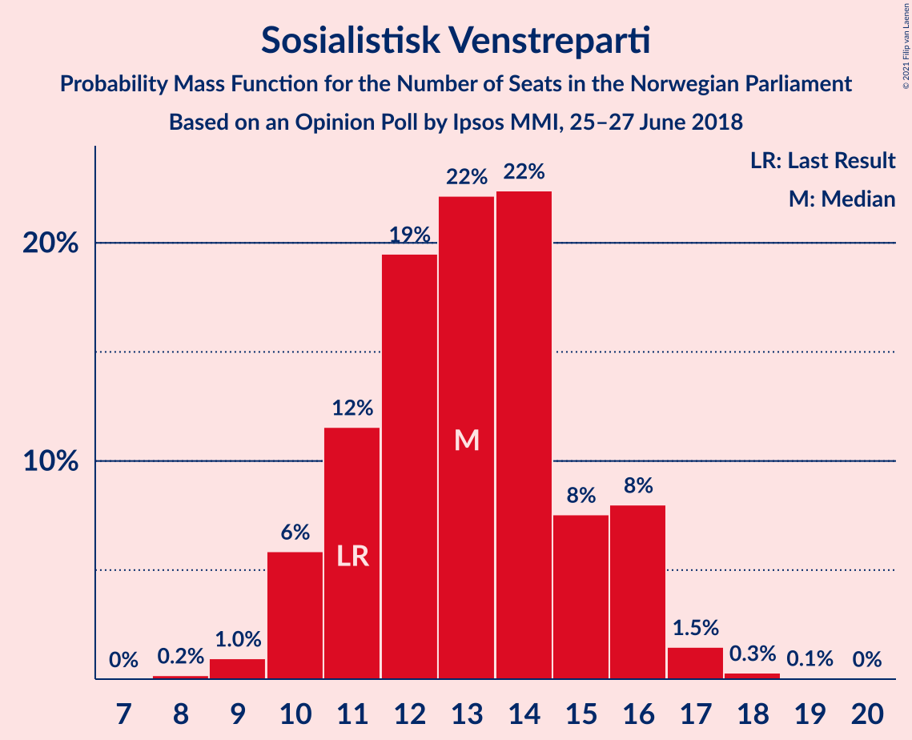

| Number of Seats | Probability | Accumulated | Special Marks |
|:---------------:|:-----------:|:-----------:|:-------------:|
| 8 | 0.2% | 100% |  |
| 9 | 1.0% | 99.8% |  |
| 10 | 6% | 98.9% |  |
| 11 | 12% | 93% | Last Result |
| 12 | 19% | 81% |  |
| 13 | 22% | 62% | Median |
| 14 | 22% | 40% |  |
| 15 | 8% | 17% |  |
| 16 | 8% | 10% |  |
| 17 | 1.5% | 2% |  |
| 18 | 0.3% | 0.4% |  |
| 19 | 0.1% | 0.1% |  |
| 20 | 0% | 0% |  |

### Kristelig Folkeparti

*For a full overview of the results for this party, see the [Kristelig Folkeparti](party-kristeligfolkeparti.html) page.*

| Number of Seats | Probability | Accumulated | Special Marks |
|:---------------:|:-----------:|:-----------:|:-------------:|
| 1 | 0.2% | 100% |  |
| 2 | 0.4% | 99.8% |  |
| 3 | 12% | 99.4% |  |
| 4 | 0% | 87% |  |
| 5 | 0% | 87% |  |
| 6 | 0.1% | 87% |  |
| 7 | 7% | 87% |  |
| 8 | 28% | 80% | Last Result |
| 9 | 30% | 52% | Median |
| 10 | 14% | 22% |  |
| 11 | 7% | 8% |  |
| 12 | 1.2% | 1.4% |  |
| 13 | 0.2% | 0.3% |  |
| 14 | 0% | 0% |  |

### Venstre

*For a full overview of the results for this party, see the [Venstre](party-venstre.html) page.*

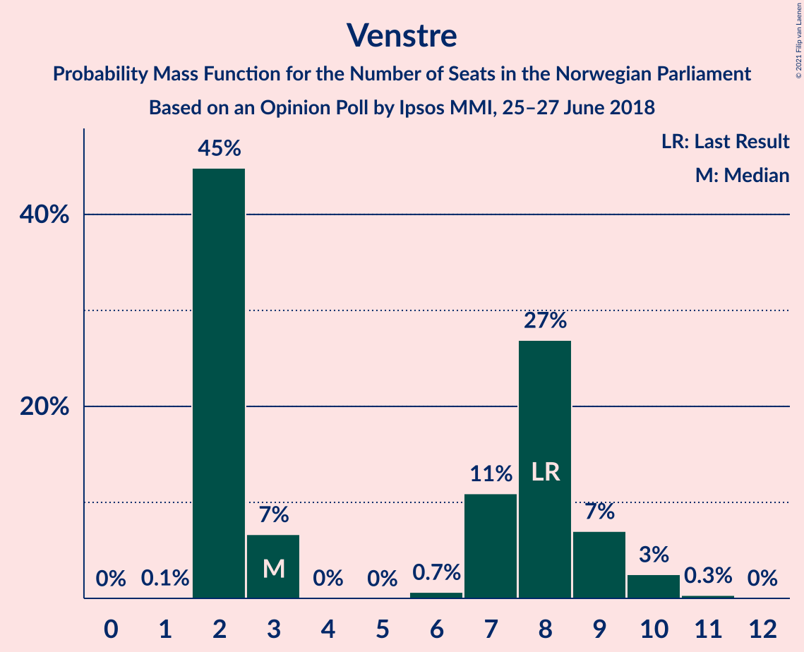

| Number of Seats | Probability | Accumulated | Special Marks |
|:---------------:|:-----------:|:-----------:|:-------------:|
| 1 | 0.1% | 100% |  |
| 2 | 45% | 99.9% |  |
| 3 | 7% | 55% | Median |
| 4 | 0% | 48% |  |
| 5 | 0% | 48% |  |
| 6 | 0.7% | 48% |  |
| 7 | 11% | 48% |  |
| 8 | 27% | 37% | Last Result |
| 9 | 7% | 10% |  |
| 10 | 3% | 3% |  |
| 11 | 0.3% | 0.4% |  |
| 12 | 0% | 0% |  |

### Rødt

*For a full overview of the results for this party, see the [Rødt](party-rødt.html) page.*

| Number of Seats | Probability | Accumulated | Special Marks |
|:---------------:|:-----------:|:-----------:|:-------------:|
| 1 | 3% | 100% | Last Result |
| 2 | 56% | 97% | Median |
| 3 | 0% | 41% |  |
| 4 | 0% | 41% |  |
| 5 | 0% | 41% |  |
| 6 | 0.4% | 41% |  |
| 7 | 12% | 40% |  |
| 8 | 20% | 28% |  |
| 9 | 6% | 8% |  |
| 10 | 2% | 2% |  |
| 11 | 0.3% | 0.3% |  |
| 12 | 0% | 0% |  |

### Miljøpartiet De Grønne

*For a full overview of the results for this party, see the [Miljøpartiet De Grønne](party-miljøpartietdegrønne.html) page.*

| Number of Seats | Probability | Accumulated | Special Marks |
|:---------------:|:-----------:|:-----------:|:-------------:|
| 0 | 9% | 100% |  |
| 1 | 68% | 91% | Last Result, Median |
| 2 | 22% | 23% |  |
| 3 | 0.5% | 1.1% |  |
| 4 | 0% | 0.6% |  |
| 5 | 0% | 0.6% |  |
| 6 | 0% | 0.6% |  |
| 7 | 0.3% | 0.6% |  |
| 8 | 0.3% | 0.3% |  |
| 9 | 0% | 0% |  |

## Coalitions

### Confidence Intervals

| Coalition | Last Result | Median | Majority? | 80% Confidence Interval | 90% Confidence Interval | 95% Confidence Interval | 99% Confidence Interval |
|:---------:|:-----------:|:------:|:---------:|:-----------------------:|:-----------------------:|:-----------------------:|:-----------------------:|
| Høyre – Fremskrittspartiet – Senterpartiet – Kristelig Folkeparti – Venstre | 107 | 109 | 100% | 104–114 | 103–116 | 101–116 | 99–118 |
| Høyre – Fremskrittspartiet – Kristelig Folkeparti – Venstre – Miljøpartiet De Grønne | 89 | 90 | 88% | 84–94 | 83–96 | 82–96 | 80–99 |
| Høyre – Fremskrittspartiet – Kristelig Folkeparti – Venstre | 88 | 89 | 84% | 83–93 | 82–95 | 81–96 | 79–98 |
| Arbeiderpartiet – Senterpartiet – Sosialistisk Venstreparti – Kristelig Folkeparti – Miljøpartiet De Grønne | 88 | 84 | 48% | 78–88 | 77–90 | 76–91 | 75–93 |
| Arbeiderpartiet – Senterpartiet – Sosialistisk Venstreparti – Rødt – Miljøpartiet De Grønne | 81 | 80 | 13% | 75–85 | 74–86 | 73–87 | 71–90 |
| Høyre – Fremskrittspartiet – Venstre | 80 | 80 | 11% | 75–85 | 74–87 | 73–87 | 72–90 |
| Arbeiderpartiet – Senterpartiet – Sosialistisk Venstreparti – Rødt | 80 | 79 | 9% | 74–84 | 73–85 | 72–86 | 70–89 |
| Arbeiderpartiet – Senterpartiet – Sosialistisk Venstreparti – Miljøpartiet De Grønne | 80 | 76 | 0.8% | 71–81 | 69–81 | 69–83 | 67–85 |
| Arbeiderpartiet – Senterpartiet – Sosialistisk Venstreparti | 79 | 75 | 0.2% | 70–79 | 68–80 | 68–82 | 66–84 |
| Høyre – Fremskrittspartiet | 72 | 75 | 0.5% | 71–80 | 70–81 | 68–82 | 67–85 |
| Arbeiderpartiet – Senterpartiet – Kristelig Folkeparti – Miljøpartiet De Grønne | 77 | 71 | 0% | 66–75 | 65–76 | 64–77 | 62–79 |
| Arbeiderpartiet – Senterpartiet – Kristelig Folkeparti | 76 | 70 | 0% | 65–74 | 64–75 | 63–76 | 60–78 |
| Høyre – Kristelig Folkeparti – Venstre | 61 | 64 | 0% | 59–69 | 58–70 | 56–71 | 54–73 |
| Arbeiderpartiet – Senterpartiet | 68 | 62 | 0% | 57–65 | 56–67 | 56–68 | 55–70 |
| Arbeiderpartiet – Sosialistisk Venstreparti – Rødt – Miljøpartiet De Grønne | 62 | 60 | 0% | 54–65 | 53–65 | 52–66 | 51–69 |
| Arbeiderpartiet – Sosialistisk Venstreparti | 60 | 54 | 0% | 50–58 | 49–59 | 48–60 | 47–62 |
| Senterpartiet – Kristelig Folkeparti – Venstre | 35 | 34 | 0% | 28–39 | 27–39 | 26–40 | 24–42 |

### Høyre – Fremskrittspartiet – Senterpartiet – Kristelig Folkeparti – Venstre

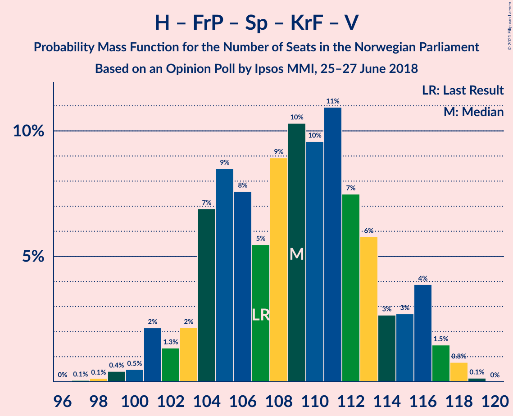

| Number of Seats | Probability | Accumulated | Special Marks |
|:---------------:|:-----------:|:-----------:|:-------------:|
| 96 | 0% | 100% |  |
| 97 | 0.1% | 99.9% |  |
| 98 | 0.1% | 99.9% |  |
| 99 | 0.4% | 99.7% |  |
| 100 | 0.5% | 99.3% |  |
| 101 | 2% | 98.8% |  |
| 102 | 1.3% | 97% |  |
| 103 | 2% | 95% |  |
| 104 | 7% | 93% |  |
| 105 | 9% | 86% |  |
| 106 | 8% | 78% |  |
| 107 | 5% | 70% | Last Result |
| 108 | 9% | 65% | Median |
| 109 | 10% | 56% |  |
| 110 | 10% | 45% |  |
| 111 | 11% | 36% |  |
| 112 | 7% | 25% |  |
| 113 | 6% | 17% |  |
| 114 | 3% | 12% |  |
| 115 | 3% | 9% |  |
| 116 | 4% | 6% |  |
| 117 | 1.5% | 2% |  |
| 118 | 0.8% | 1.0% |  |
| 119 | 0.1% | 0.2% |  |
| 120 | 0% | 0% |  |

### Høyre – Fremskrittspartiet – Kristelig Folkeparti – Venstre – Miljøpartiet De Grønne

| Number of Seats | Probability | Accumulated | Special Marks |
|:---------------:|:-----------:|:-----------:|:-------------:|
| 78 | 0.2% | 100% |  |
| 79 | 0.2% | 99.8% |  |
| 80 | 0.4% | 99.6% |  |
| 81 | 0.8% | 99.2% |  |
| 82 | 1.0% | 98% |  |
| 83 | 3% | 97% |  |
| 84 | 6% | 94% |  |
| 85 | 3% | 88% | Majority |
| 86 | 6% | 85% |  |
| 87 | 13% | 79% |  |
| 88 | 7% | 67% | Median |
| 89 | 7% | 59% | Last Result |
| 90 | 7% | 53% |  |
| 91 | 18% | 46% |  |
| 92 | 7% | 28% |  |
| 93 | 6% | 21% |  |
| 94 | 6% | 15% |  |
| 95 | 3% | 9% |  |
| 96 | 4% | 6% |  |
| 97 | 1.2% | 2% |  |
| 98 | 0.3% | 1.2% |  |
| 99 | 0.7% | 0.9% |  |
| 100 | 0.1% | 0.2% |  |
| 101 | 0.1% | 0.2% |  |
| 102 | 0% | 0% |  |

### Høyre – Fremskrittspartiet – Kristelig Folkeparti – Venstre

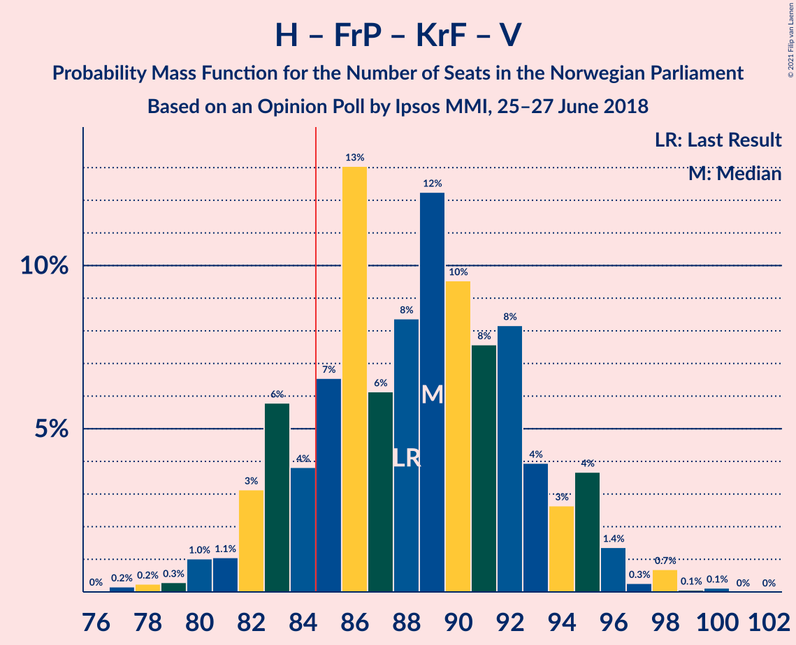

| Number of Seats | Probability | Accumulated | Special Marks |
|:---------------:|:-----------:|:-----------:|:-------------:|
| 76 | 0% | 100% |  |
| 77 | 0.2% | 99.9% |  |
| 78 | 0.2% | 99.8% |  |
| 79 | 0.3% | 99.5% |  |
| 80 | 1.0% | 99.2% |  |
| 81 | 1.1% | 98% |  |
| 82 | 3% | 97% |  |
| 83 | 6% | 94% |  |
| 84 | 4% | 88% |  |
| 85 | 7% | 84% | Majority |
| 86 | 13% | 78% |  |
| 87 | 6% | 65% | Median |
| 88 | 8% | 59% | Last Result |
| 89 | 12% | 50% |  |
| 90 | 10% | 38% |  |
| 91 | 8% | 29% |  |
| 92 | 8% | 21% |  |
| 93 | 4% | 13% |  |
| 94 | 3% | 9% |  |
| 95 | 4% | 6% |  |
| 96 | 1.4% | 3% |  |
| 97 | 0.3% | 1.2% |  |
| 98 | 0.7% | 0.9% |  |
| 99 | 0.1% | 0.2% |  |
| 100 | 0.1% | 0.1% |  |
| 101 | 0% | 0% |  |

### Arbeiderpartiet – Senterpartiet – Sosialistisk Venstreparti – Kristelig Folkeparti – Miljøpartiet De Grønne

| Number of Seats | Probability | Accumulated | Special Marks |
|:---------------:|:-----------:|:-----------:|:-------------:|
| 71 | 0% | 100% |  |
| 72 | 0% | 99.9% |  |
| 73 | 0.1% | 99.9% |  |
| 74 | 0.2% | 99.8% |  |
| 75 | 1.2% | 99.6% |  |
| 76 | 3% | 98% |  |
| 77 | 2% | 96% |  |
| 78 | 5% | 94% |  |
| 79 | 2% | 89% |  |
| 80 | 7% | 87% |  |
| 81 | 6% | 80% |  |
| 82 | 5% | 74% |  |
| 83 | 8% | 69% |  |
| 84 | 12% | 61% |  |
| 85 | 12% | 48% | Median, Majority |
| 86 | 7% | 36% |  |
| 87 | 12% | 29% |  |
| 88 | 7% | 17% | Last Result |
| 89 | 4% | 9% |  |
| 90 | 3% | 6% |  |
| 91 | 1.2% | 3% |  |
| 92 | 0.4% | 1.3% |  |
| 93 | 0.5% | 0.9% |  |
| 94 | 0.3% | 0.4% |  |
| 95 | 0.1% | 0.1% |  |
| 96 | 0% | 0% |  |

### Arbeiderpartiet – Senterpartiet – Sosialistisk Venstreparti – Rødt – Miljøpartiet De Grønne

| Number of Seats | Probability | Accumulated | Special Marks |
|:---------------:|:-----------:|:-----------:|:-------------:|
| 69 | 0.1% | 100% |  |
| 70 | 0.1% | 99.8% |  |
| 71 | 2% | 99.7% |  |
| 72 | 0.4% | 98% |  |
| 73 | 2% | 98% |  |
| 74 | 4% | 96% |  |
| 75 | 4% | 92% |  |
| 76 | 4% | 89% |  |
| 77 | 8% | 84% |  |
| 78 | 7% | 76% | Median |
| 79 | 11% | 69% |  |
| 80 | 12% | 58% |  |
| 81 | 8% | 45% | Last Result |
| 82 | 6% | 38% |  |
| 83 | 13% | 32% |  |
| 84 | 6% | 19% |  |
| 85 | 4% | 13% | Majority |
| 86 | 5% | 9% |  |
| 87 | 2% | 4% |  |
| 88 | 0.9% | 2% |  |
| 89 | 0.8% | 1.3% |  |
| 90 | 0.2% | 0.5% |  |
| 91 | 0.2% | 0.3% |  |
| 92 | 0.1% | 0.2% |  |
| 93 | 0% | 0% |  |

### Høyre – Fremskrittspartiet – Venstre

| Number of Seats | Probability | Accumulated | Special Marks |
|:---------------:|:-----------:|:-----------:|:-------------:|
| 69 | 0% | 100% |  |
| 70 | 0.2% | 99.9% |  |
| 71 | 0.2% | 99.7% |  |
| 72 | 1.1% | 99.5% |  |
| 73 | 1.3% | 98% |  |
| 74 | 5% | 97% |  |
| 75 | 3% | 92% |  |
| 76 | 6% | 90% |  |
| 77 | 10% | 83% |  |
| 78 | 4% | 74% | Median |
| 79 | 10% | 69% |  |
| 80 | 15% | 59% | Last Result |
| 81 | 8% | 44% |  |
| 82 | 9% | 36% |  |
| 83 | 10% | 27% |  |
| 84 | 6% | 18% |  |
| 85 | 3% | 11% | Majority |
| 86 | 2% | 8% |  |
| 87 | 4% | 6% |  |
| 88 | 0.6% | 2% |  |
| 89 | 1.0% | 2% |  |
| 90 | 0.4% | 0.8% |  |
| 91 | 0.2% | 0.4% |  |
| 92 | 0.2% | 0.2% |  |
| 93 | 0% | 0% |  |

### Arbeiderpartiet – Senterpartiet – Sosialistisk Venstreparti – Rødt

| Number of Seats | Probability | Accumulated | Special Marks |
|:---------------:|:-----------:|:-----------:|:-------------:|
| 67 | 0% | 100% |  |
| 68 | 0.2% | 99.9% |  |
| 69 | 0.2% | 99.8% |  |
| 70 | 2% | 99.6% |  |
| 71 | 0.4% | 98% |  |
| 72 | 1.4% | 98% |  |
| 73 | 4% | 96% |  |
| 74 | 4% | 92% |  |
| 75 | 6% | 88% |  |
| 76 | 6% | 82% |  |
| 77 | 6% | 76% | Median |
| 78 | 19% | 69% |  |
| 79 | 7% | 50% |  |
| 80 | 6% | 43% | Last Result |
| 81 | 7% | 37% |  |
| 82 | 12% | 30% |  |
| 83 | 6% | 18% |  |
| 84 | 3% | 12% |  |
| 85 | 5% | 9% | Majority |
| 86 | 2% | 4% |  |
| 87 | 1.0% | 2% |  |
| 88 | 0.6% | 1.1% |  |
| 89 | 0.2% | 0.5% |  |
| 90 | 0.1% | 0.3% |  |
| 91 | 0.1% | 0.2% |  |
| 92 | 0% | 0% |  |

### Arbeiderpartiet – Senterpartiet – Sosialistisk Venstreparti – Miljøpartiet De Grønne

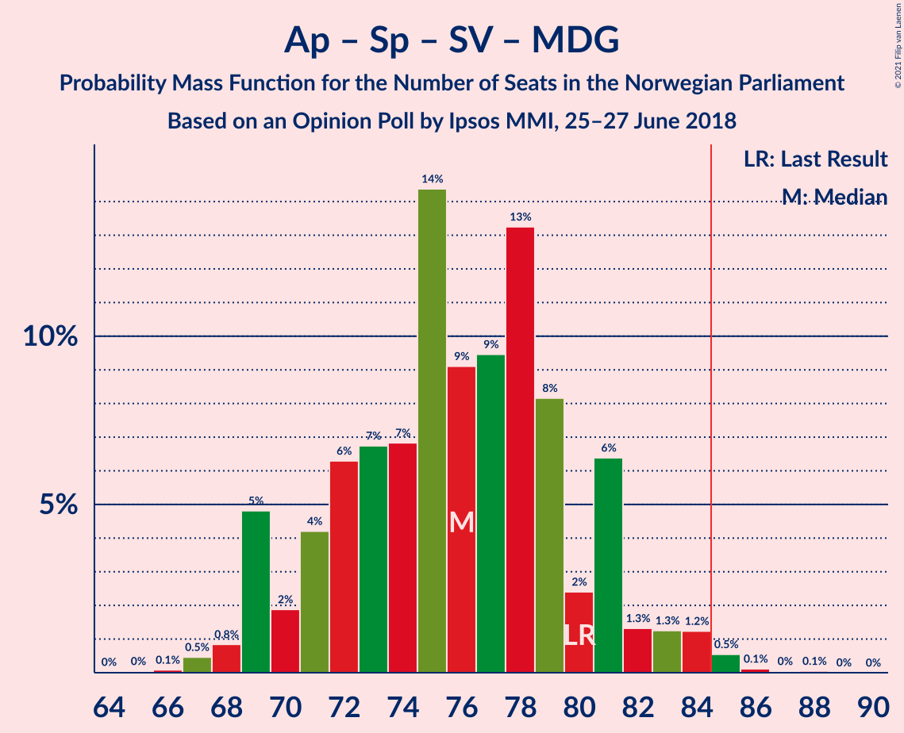

| Number of Seats | Probability | Accumulated | Special Marks |
|:---------------:|:-----------:|:-----------:|:-------------:|
| 65 | 0% | 100% |  |
| 66 | 0.1% | 99.9% |  |
| 67 | 0.5% | 99.8% |  |
| 68 | 0.8% | 99.4% |  |
| 69 | 5% | 98.5% |  |
| 70 | 2% | 94% |  |
| 71 | 4% | 92% |  |
| 72 | 6% | 88% |  |
| 73 | 7% | 81% |  |
| 74 | 7% | 75% |  |
| 75 | 14% | 68% |  |
| 76 | 9% | 53% | Median |
| 77 | 9% | 44% |  |
| 78 | 13% | 35% |  |
| 79 | 8% | 22% |  |
| 80 | 2% | 13% | Last Result |
| 81 | 6% | 11% |  |
| 82 | 1.3% | 5% |  |
| 83 | 1.3% | 3% |  |
| 84 | 1.2% | 2% |  |
| 85 | 0.5% | 0.8% | Majority |
| 86 | 0.1% | 0.2% |  |
| 87 | 0% | 0.1% |  |
| 88 | 0.1% | 0.1% |  |
| 89 | 0% | 0% |  |

### Arbeiderpartiet – Senterpartiet – Sosialistisk Venstreparti

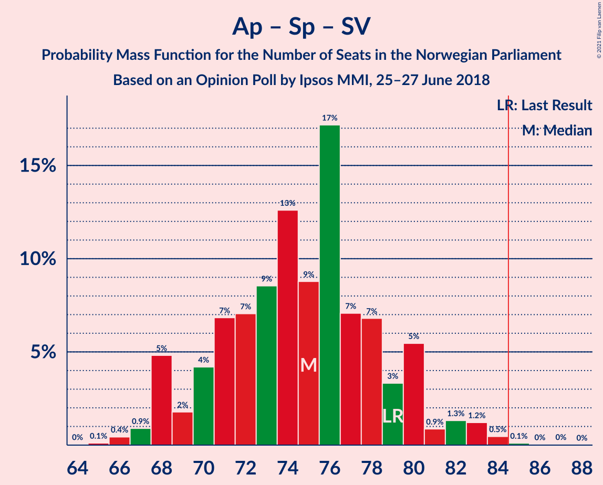

| Number of Seats | Probability | Accumulated | Special Marks |
|:---------------:|:-----------:|:-----------:|:-------------:|
| 64 | 0% | 100% |  |
| 65 | 0.1% | 99.9% |  |
| 66 | 0.4% | 99.8% |  |
| 67 | 0.9% | 99.4% |  |
| 68 | 5% | 98% |  |
| 69 | 2% | 94% |  |
| 70 | 4% | 92% |  |
| 71 | 7% | 88% |  |
| 72 | 7% | 81% |  |
| 73 | 9% | 74% |  |
| 74 | 13% | 65% |  |
| 75 | 9% | 53% | Median |
| 76 | 17% | 44% |  |
| 77 | 7% | 27% |  |
| 78 | 7% | 20% |  |
| 79 | 3% | 13% | Last Result |
| 80 | 5% | 10% |  |
| 81 | 0.9% | 4% |  |
| 82 | 1.3% | 3% |  |
| 83 | 1.2% | 2% |  |
| 84 | 0.5% | 0.7% |  |
| 85 | 0.1% | 0.2% | Majority |
| 86 | 0% | 0.1% |  |
| 87 | 0% | 0.1% |  |
| 88 | 0% | 0% |  |

### Høyre – Fremskrittspartiet

| Number of Seats | Probability | Accumulated | Special Marks |
|:---------------:|:-----------:|:-----------:|:-------------:|
| 65 | 0.1% | 100% |  |
| 66 | 0.1% | 99.9% |  |
| 67 | 0.3% | 99.8% |  |
| 68 | 2% | 99.4% |  |
| 69 | 1.3% | 97% |  |
| 70 | 5% | 96% |  |
| 71 | 4% | 91% |  |
| 72 | 14% | 87% | Last Result |
| 73 | 8% | 73% |  |
| 74 | 8% | 65% |  |
| 75 | 13% | 57% | Median |
| 76 | 7% | 43% |  |
| 77 | 11% | 36% |  |
| 78 | 6% | 26% |  |
| 79 | 7% | 20% |  |
| 80 | 4% | 13% |  |
| 81 | 4% | 9% |  |
| 82 | 2% | 4% |  |
| 83 | 1.1% | 2% |  |
| 84 | 0.6% | 1.1% |  |
| 85 | 0.2% | 0.5% | Majority |
| 86 | 0.1% | 0.3% |  |
| 87 | 0% | 0.1% |  |
| 88 | 0.1% | 0.1% |  |
| 89 | 0% | 0% |  |

### Arbeiderpartiet – Senterpartiet – Kristelig Folkeparti – Miljøpartiet De Grønne

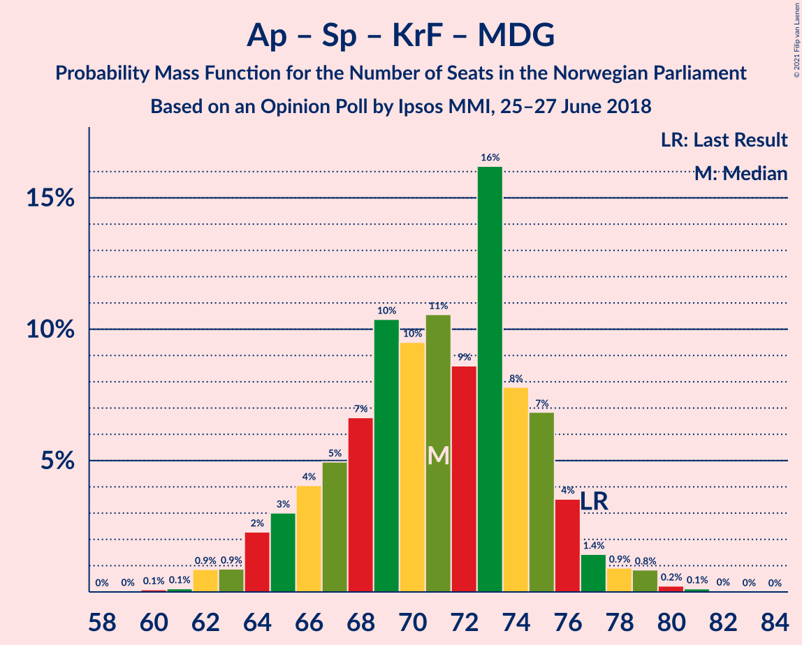

| Number of Seats | Probability | Accumulated | Special Marks |
|:---------------:|:-----------:|:-----------:|:-------------:|
| 60 | 0.1% | 100% |  |
| 61 | 0.1% | 99.9% |  |
| 62 | 0.9% | 99.7% |  |
| 63 | 0.9% | 98.9% |  |
| 64 | 2% | 98% |  |
| 65 | 3% | 96% |  |
| 66 | 4% | 93% |  |
| 67 | 5% | 89% |  |
| 68 | 7% | 84% |  |
| 69 | 10% | 77% |  |
| 70 | 10% | 67% |  |
| 71 | 11% | 57% |  |
| 72 | 9% | 47% | Median |
| 73 | 16% | 38% |  |
| 74 | 8% | 22% |  |
| 75 | 7% | 14% |  |
| 76 | 4% | 7% |  |
| 77 | 1.4% | 4% | Last Result |
| 78 | 0.9% | 2% |  |
| 79 | 0.8% | 1.3% |  |
| 80 | 0.2% | 0.4% |  |
| 81 | 0.1% | 0.2% |  |
| 82 | 0% | 0.1% |  |
| 83 | 0% | 0% |  |

### Arbeiderpartiet – Senterpartiet – Kristelig Folkeparti

| Number of Seats | Probability | Accumulated | Special Marks |
|:---------------:|:-----------:|:-----------:|:-------------:|
| 58 | 0% | 100% |  |
| 59 | 0.1% | 99.9% |  |
| 60 | 0.5% | 99.9% |  |
| 61 | 0.6% | 99.4% |  |
| 62 | 0.8% | 98.8% |  |
| 63 | 2% | 98% |  |
| 64 | 4% | 96% |  |
| 65 | 4% | 92% |  |
| 66 | 6% | 88% |  |
| 67 | 5% | 82% |  |
| 68 | 11% | 77% |  |
| 69 | 10% | 66% |  |
| 70 | 13% | 56% |  |
| 71 | 13% | 44% | Median |
| 72 | 10% | 31% |  |
| 73 | 8% | 20% |  |
| 74 | 6% | 13% |  |
| 75 | 3% | 7% |  |
| 76 | 1.3% | 3% | Last Result |
| 77 | 0.7% | 2% |  |
| 78 | 0.8% | 1.1% |  |
| 79 | 0.2% | 0.4% |  |
| 80 | 0.1% | 0.1% |  |
| 81 | 0% | 0% |  |

### Høyre – Kristelig Folkeparti – Venstre

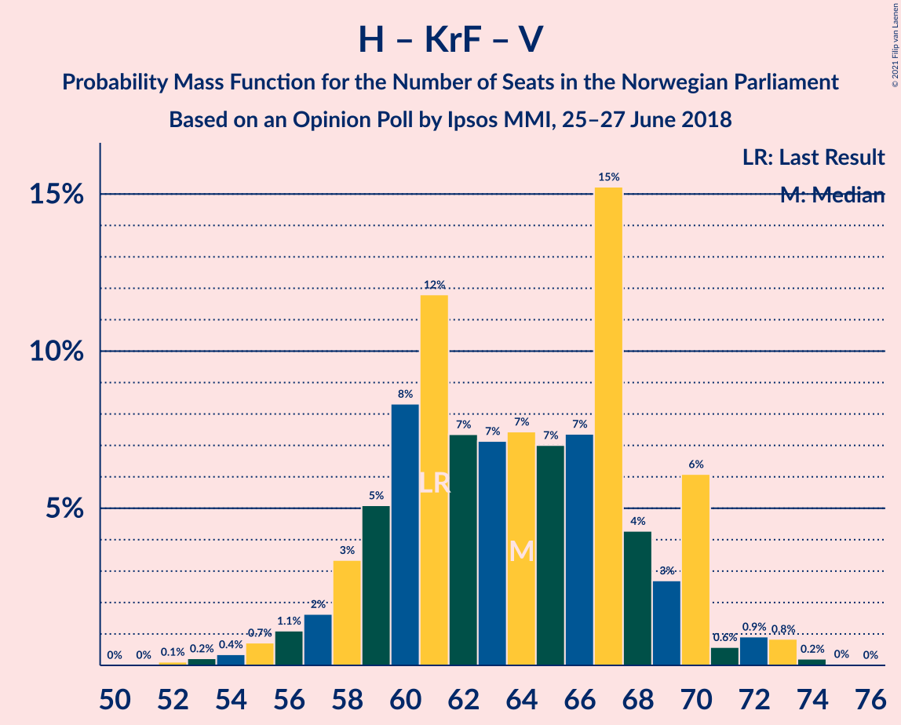

| Number of Seats | Probability | Accumulated | Special Marks |
|:---------------:|:-----------:|:-----------:|:-------------:|
| 52 | 0.1% | 100% |  |
| 53 | 0.2% | 99.8% |  |
| 54 | 0.4% | 99.6% |  |
| 55 | 0.7% | 99.3% |  |
| 56 | 1.1% | 98.5% |  |
| 57 | 2% | 97% |  |
| 58 | 3% | 96% |  |
| 59 | 5% | 92% |  |
| 60 | 8% | 87% |  |
| 61 | 12% | 79% | Last Result |
| 62 | 7% | 67% | Median |
| 63 | 7% | 60% |  |
| 64 | 7% | 53% |  |
| 65 | 7% | 45% |  |
| 66 | 7% | 38% |  |
| 67 | 15% | 31% |  |
| 68 | 4% | 16% |  |
| 69 | 3% | 11% |  |
| 70 | 6% | 9% |  |
| 71 | 0.6% | 3% |  |
| 72 | 0.9% | 2% |  |
| 73 | 0.8% | 1.1% |  |
| 74 | 0.2% | 0.3% |  |
| 75 | 0% | 0.1% |  |
| 76 | 0% | 0% |  |

### Arbeiderpartiet – Senterpartiet

| Number of Seats | Probability | Accumulated | Special Marks |
|:---------------:|:-----------:|:-----------:|:-------------:|
| 53 | 0.1% | 100% |  |
| 54 | 0.3% | 99.9% |  |
| 55 | 0.9% | 99.6% |  |
| 56 | 4% | 98.8% |  |
| 57 | 5% | 95% |  |
| 58 | 5% | 90% |  |
| 59 | 7% | 85% |  |
| 60 | 12% | 77% |  |
| 61 | 10% | 66% |  |
| 62 | 20% | 55% | Median |
| 63 | 11% | 35% |  |
| 64 | 8% | 24% |  |
| 65 | 7% | 16% |  |
| 66 | 3% | 9% |  |
| 67 | 4% | 7% |  |
| 68 | 1.3% | 3% | Last Result |
| 69 | 0.7% | 1.5% |  |
| 70 | 0.5% | 0.8% |  |
| 71 | 0.1% | 0.2% |  |
| 72 | 0.1% | 0.1% |  |
| 73 | 0% | 0% |  |

### Arbeiderpartiet – Sosialistisk Venstreparti – Rødt – Miljøpartiet De Grønne

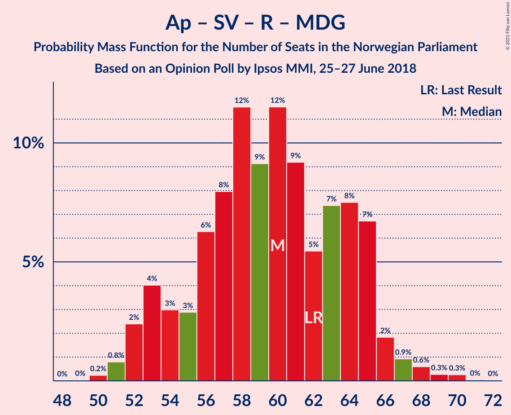

| Number of Seats | Probability | Accumulated | Special Marks |
|:---------------:|:-----------:|:-----------:|:-------------:|
| 49 | 0% | 100% |  |
| 50 | 0.2% | 99.9% |  |
| 51 | 0.8% | 99.7% |  |
| 52 | 2% | 98.9% |  |
| 53 | 4% | 97% |  |
| 54 | 3% | 92% |  |
| 55 | 3% | 90% |  |
| 56 | 6% | 87% |  |
| 57 | 8% | 80% | Median |
| 58 | 12% | 72% |  |
| 59 | 9% | 61% |  |
| 60 | 12% | 52% |  |
| 61 | 9% | 40% |  |
| 62 | 5% | 31% | Last Result |
| 63 | 7% | 26% |  |
| 64 | 8% | 18% |  |
| 65 | 7% | 11% |  |
| 66 | 2% | 4% |  |
| 67 | 0.9% | 2% |  |
| 68 | 0.6% | 1.2% |  |
| 69 | 0.3% | 0.6% |  |
| 70 | 0.3% | 0.3% |  |
| 71 | 0% | 0.1% |  |
| 72 | 0% | 0% |  |

### Arbeiderpartiet – Sosialistisk Venstreparti

| Number of Seats | Probability | Accumulated | Special Marks |
|:---------------:|:-----------:|:-----------:|:-------------:|
| 44 | 0% | 100% |  |
| 45 | 0.1% | 99.9% |  |
| 46 | 0.1% | 99.9% |  |
| 47 | 0.5% | 99.8% |  |
| 48 | 2% | 99.3% |  |
| 49 | 4% | 97% |  |
| 50 | 9% | 93% |  |
| 51 | 5% | 84% |  |
| 52 | 9% | 79% |  |
| 53 | 8% | 70% |  |
| 54 | 19% | 63% | Median |
| 55 | 10% | 44% |  |
| 56 | 12% | 34% |  |
| 57 | 11% | 22% |  |
| 58 | 5% | 11% |  |
| 59 | 2% | 5% |  |
| 60 | 2% | 4% | Last Result |
| 61 | 0.5% | 1.2% |  |
| 62 | 0.4% | 0.7% |  |
| 63 | 0.2% | 0.3% |  |
| 64 | 0.1% | 0.1% |  |
| 65 | 0% | 0% |  |

### Senterpartiet – Kristelig Folkeparti – Venstre

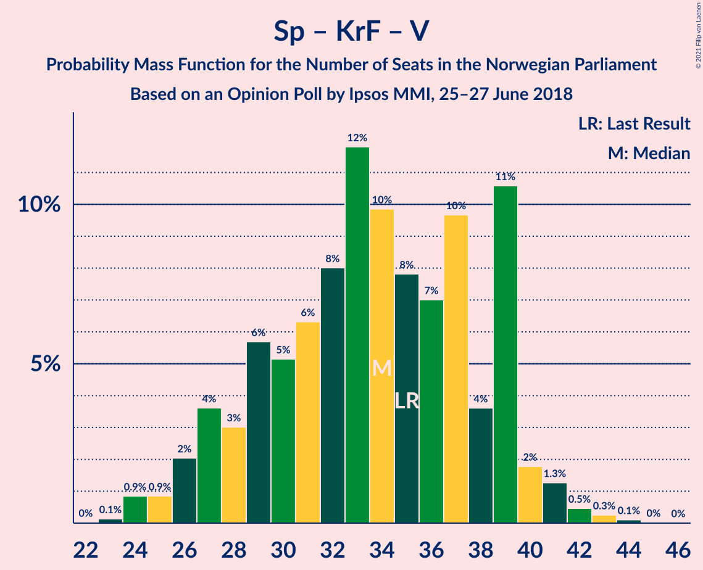

| Number of Seats | Probability | Accumulated | Special Marks |
|:---------------:|:-----------:|:-----------:|:-------------:|
| 23 | 0.1% | 100% |  |
| 24 | 0.9% | 99.8% |  |
| 25 | 0.9% | 99.0% |  |
| 26 | 2% | 98% |  |
| 27 | 4% | 96% |  |
| 28 | 3% | 92% |  |
| 29 | 6% | 89% |  |
| 30 | 5% | 84% |  |
| 31 | 6% | 79% |  |
| 32 | 8% | 72% |  |
| 33 | 12% | 64% | Median |
| 34 | 10% | 52% |  |
| 35 | 8% | 43% | Last Result |
| 36 | 7% | 35% |  |
| 37 | 10% | 28% |  |
| 38 | 4% | 18% |  |
| 39 | 11% | 14% |  |
| 40 | 2% | 4% |  |
| 41 | 1.3% | 2% |  |
| 42 | 0.5% | 0.9% |  |
| 43 | 0.3% | 0.4% |  |
| 44 | 0.1% | 0.1% |  |
| 45 | 0% | 0% |  |

## Technical Information

### Opinion Poll

+ **Polling firm:** Ipsos MMI
+ **Commissioner(s):** —
+ **Fieldwork period:** 25–27 June 2018

### Calculations

+ **Sample size:** 941
+ **Simulations done:** 1,048,576
+ **Error estimate:** 1.43%

