# Opinion Poll by Kantar TNS, 1–7 August 2018

<a href="#voting-intentions">Voting Intentions</a> | <a href="#seats">Seats</a> | <a href="#coalitions">Coalitions</a> | <a href="#technical-information">Technical Information</a>

## Voting Intentions

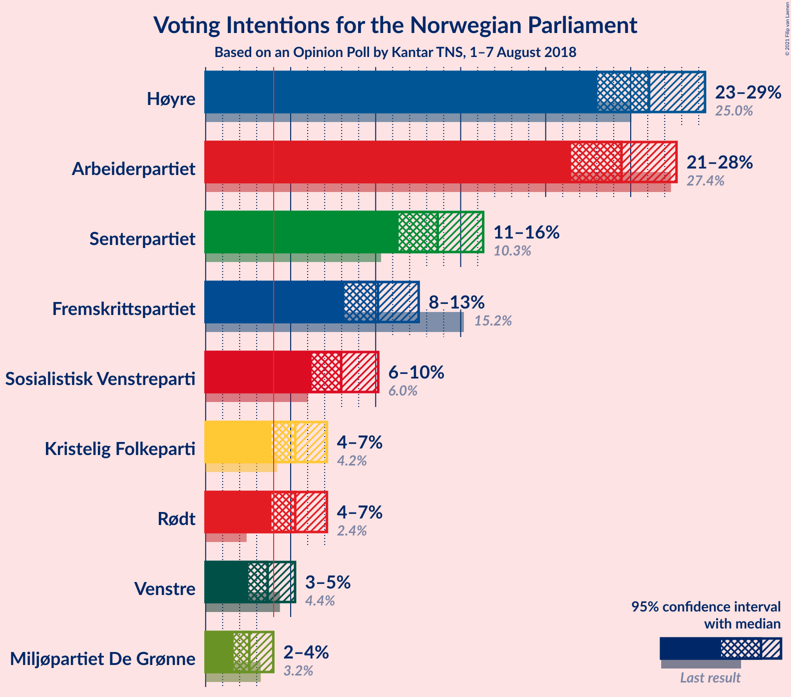

### Confidence Intervals

| Party | Last Result | Poll Result | 80% Confidence Interval | 90% Confidence Interval | 95% Confidence Interval | 99% Confidence Interval |
|:-----:|:-----------:|:-----------:|:-----------------------:|:-----------------------:|:-----------------------:|:-----------------------:|
| Høyre | 25.0% | 26.1% | 24.1–28.2% |23.5–28.8% |23.0–29.4% |22.1–30.4% |
| Arbeiderpartiet | 27.4% | 24.5% | 22.5–26.6% |22.0–27.2% |21.5–27.7% |20.6–28.7% |
| Senterpartiet | 10.3% | 13.6% | 12.1–15.4% |11.7–15.9% |11.4–16.3% |10.7–17.2% |
| Fremskrittspartiet | 15.2% | 10.1% | 8.8–11.7% |8.5–12.1% |8.2–12.5% |7.6–13.3% |
| Sosialistisk Venstreparti | 6.0% | 8.0% | 6.8–9.4% |6.5–9.8% |6.2–10.2% |5.7–10.9% |
| Rødt | 2.4% | 5.3% | 4.3–6.5% |4.1–6.8% |3.9–7.1% |3.5–7.8% |
| Kristelig Folkeparti | 4.2% | 5.3% | 4.3–6.5% |4.1–6.8% |3.9–7.1% |3.5–7.8% |
| Venstre | 4.4% | 3.6% | 2.9–4.7% |2.7–5.0% |2.5–5.3% |2.2–5.8% |
| Miljøpartiet De Grønne | 3.2% | 2.6% | 2.0–3.5% |1.8–3.7% |1.6–4.0% |1.4–4.5% |

*Note:* The poll result column reflects the actual value used in the calculations. Published results may vary slightly, and in addition be rounded to fewer digits.

## Seats

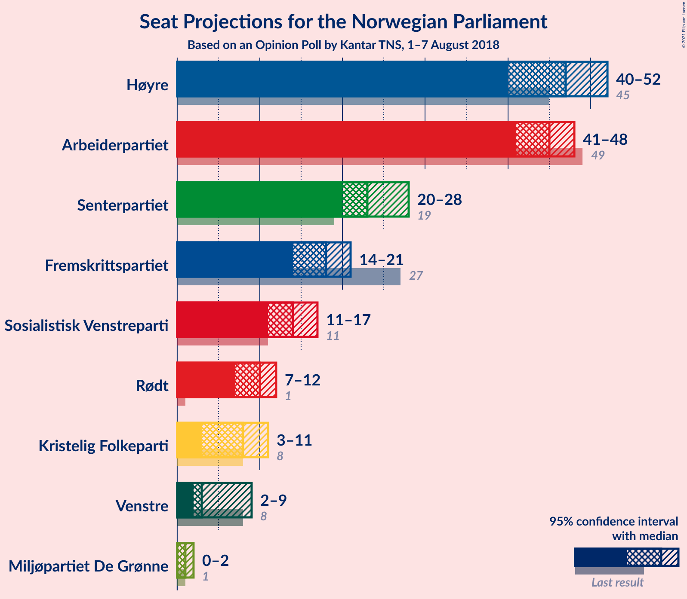

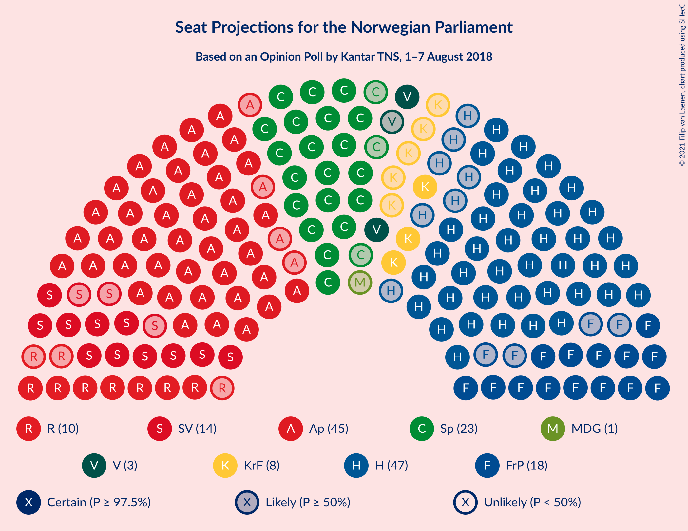

### Confidence Intervals

| Party | Last Result | Median | 80% Confidence Interval | 90% Confidence Interval | 95% Confidence Interval | 99% Confidence Interval |
|:-----:|:-----------:|:------:|:-----------------------:|:-----------------------:|:-----------------------:|:-----------------------:|
| <a href="#høyre">Høyre</a> | 45 | 47 | 43–47 |41–50 |40–52 |38–54 |
| <a href="#arbeiderpartiet">Arbeiderpartiet</a> | 49 | 45 | 43–45 |41–47 |41–48 |38–51 |
| <a href="#senterpartiet">Senterpartiet</a> | 19 | 23 | 23–28 |21–28 |20–28 |19–30 |
| <a href="#fremskrittspartiet">Fremskrittspartiet</a> | 27 | 18 | 15–18 |15–20 |14–21 |13–24 |
| <a href="#sosialistisk-venstreparti">Sosialistisk Venstreparti</a> | 11 | 14 | 13–16 |12–16 |11–17 |10–18 |
| <a href="#rødt">Rødt</a> | 1 | 10 | 8–10 |7–11 |7–12 |2–13 |
| <a href="#kristelig-folkeparti">Kristelig Folkeparti</a> | 8 | 8 | 8–10 |7–11 |3–11 |3–13 |
| <a href="#venstre">Venstre</a> | 8 | 3 | 2–7 |2–8 |2–9 |1–10 |
| <a href="#miljøpartiet-de-grønne">Miljøpartiet De Grønne</a> | 1 | 1 | 1–2 |1–2 |0–2 |0–8 |

### Høyre

*For a full overview of the results for this party, see the [Høyre](party-høyre.html) page.*

| Number of Seats | Probability | Accumulated | Special Marks |
|:---------------:|:-----------:|:-----------:|:-------------:|
| 37 | 0% | 100% |  |
| 38 | 1.2% | 99.9% |  |
| 39 | 0.2% | 98.8% |  |
| 40 | 2% | 98.6% |  |
| 41 | 1.3% | 96% |  |
| 42 | 1.3% | 95% |  |
| 43 | 10% | 94% |  |
| 44 | 4% | 84% |  |
| 45 | 19% | 80% | Last Result |
| 46 | 2% | 62% |  |
| 47 | 50% | 59% | Median |
| 48 | 2% | 9% |  |
| 49 | 1.5% | 7% |  |
| 50 | 1.4% | 6% |  |
| 51 | 1.0% | 4% |  |
| 52 | 2% | 3% |  |
| 53 | 0.5% | 1.1% |  |
| 54 | 0.1% | 0.6% |  |
| 55 | 0.2% | 0.5% |  |
| 56 | 0.3% | 0.3% |  |
| 57 | 0% | 0% |  |

### Arbeiderpartiet

*For a full overview of the results for this party, see the [Arbeiderpartiet](party-arbeiderpartiet.html) page.*

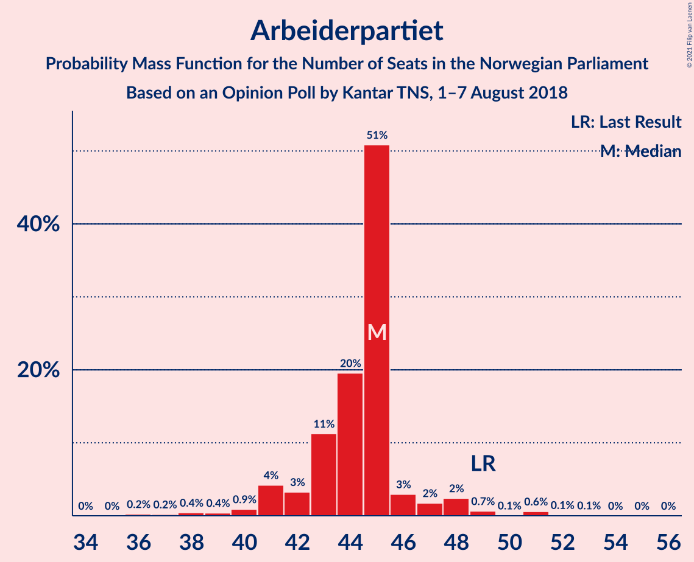

| Number of Seats | Probability | Accumulated | Special Marks |
|:---------------:|:-----------:|:-----------:|:-------------:|
| 36 | 0.2% | 100% |  |
| 37 | 0.2% | 99.7% |  |
| 38 | 0.4% | 99.5% |  |
| 39 | 0.4% | 99.1% |  |
| 40 | 0.9% | 98.7% |  |
| 41 | 4% | 98% |  |
| 42 | 3% | 94% |  |
| 43 | 11% | 90% |  |
| 44 | 20% | 79% |  |
| 45 | 51% | 60% | Median |
| 46 | 3% | 9% |  |
| 47 | 2% | 6% |  |
| 48 | 2% | 4% |  |
| 49 | 0.7% | 2% | Last Result |
| 50 | 0.1% | 0.9% |  |
| 51 | 0.6% | 0.8% |  |
| 52 | 0.1% | 0.2% |  |
| 53 | 0.1% | 0.1% |  |
| 54 | 0% | 0.1% |  |
| 55 | 0% | 0% |  |

### Senterpartiet

*For a full overview of the results for this party, see the [Senterpartiet](party-senterpartiet.html) page.*

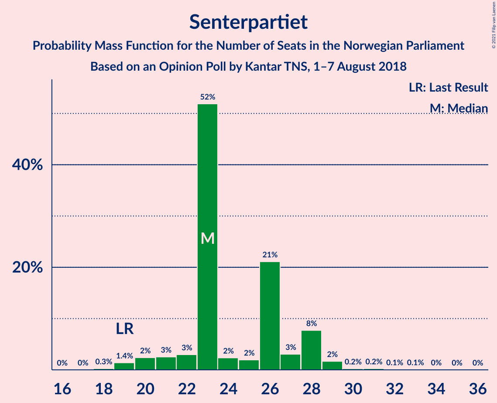

| Number of Seats | Probability | Accumulated | Special Marks |
|:---------------:|:-----------:|:-----------:|:-------------:|
| 18 | 0.3% | 100% |  |
| 19 | 1.4% | 99.7% | Last Result |
| 20 | 2% | 98% |  |
| 21 | 3% | 96% |  |
| 22 | 3% | 93% |  |
| 23 | 52% | 90% | Median |
| 24 | 2% | 39% |  |
| 25 | 2% | 36% |  |
| 26 | 21% | 34% |  |
| 27 | 3% | 13% |  |
| 28 | 8% | 10% |  |
| 29 | 2% | 2% |  |
| 30 | 0.2% | 0.7% |  |
| 31 | 0.2% | 0.5% |  |
| 32 | 0.1% | 0.2% |  |
| 33 | 0.1% | 0.2% |  |
| 34 | 0% | 0.1% |  |
| 35 | 0% | 0% |  |

### Fremskrittspartiet

*For a full overview of the results for this party, see the [Fremskrittspartiet](party-fremskrittspartiet.html) page.*

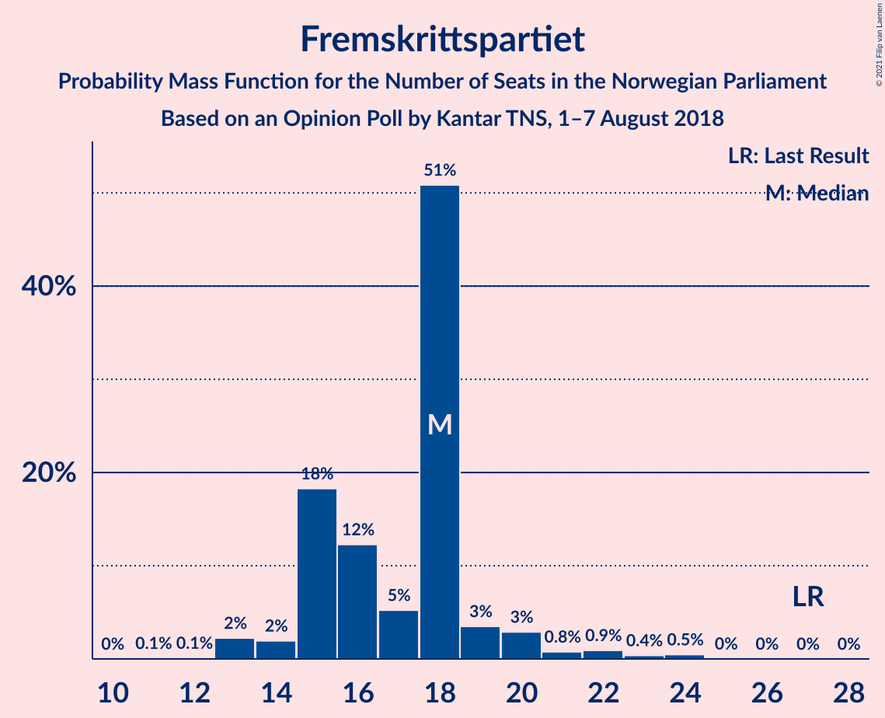

| Number of Seats | Probability | Accumulated | Special Marks |
|:---------------:|:-----------:|:-----------:|:-------------:|
| 11 | 0.1% | 100% |  |
| 12 | 0.1% | 99.9% |  |
| 13 | 2% | 99.8% |  |
| 14 | 2% | 98% |  |
| 15 | 18% | 96% |  |
| 16 | 12% | 77% |  |
| 17 | 5% | 65% |  |
| 18 | 51% | 60% | Median |
| 19 | 3% | 9% |  |
| 20 | 3% | 5% |  |
| 21 | 0.8% | 3% |  |
| 22 | 0.9% | 2% |  |
| 23 | 0.4% | 0.9% |  |
| 24 | 0.5% | 0.5% |  |
| 25 | 0% | 0% |  |
| 26 | 0% | 0% |  |
| 27 | 0% | 0% | Last Result |

### Sosialistisk Venstreparti

*For a full overview of the results for this party, see the [Sosialistisk Venstreparti](party-sosialistiskvenstreparti.html) page.*

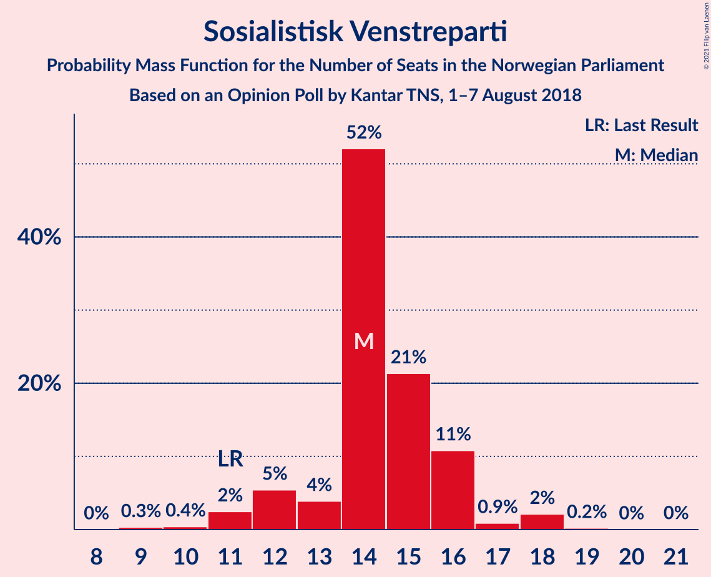

| Number of Seats | Probability | Accumulated | Special Marks |
|:---------------:|:-----------:|:-----------:|:-------------:|
| 9 | 0.3% | 100% |  |
| 10 | 0.4% | 99.7% |  |
| 11 | 2% | 99.3% | Last Result |
| 12 | 5% | 97% |  |
| 13 | 4% | 91% |  |
| 14 | 52% | 87% | Median |
| 15 | 21% | 35% |  |
| 16 | 11% | 14% |  |
| 17 | 0.9% | 3% |  |
| 18 | 2% | 2% |  |
| 19 | 0.2% | 0.3% |  |
| 20 | 0% | 0.1% |  |
| 21 | 0% | 0% |  |

### Rødt

*For a full overview of the results for this party, see the [Rødt](party-rødt.html) page.*

| Number of Seats | Probability | Accumulated | Special Marks |
|:---------------:|:-----------:|:-----------:|:-------------:|
| 1 | 0% | 100% | Last Result |
| 2 | 1.5% | 100% |  |
| 3 | 0% | 98.5% |  |
| 4 | 0% | 98.5% |  |
| 5 | 0% | 98.5% |  |
| 6 | 0% | 98.5% |  |
| 7 | 4% | 98.5% |  |
| 8 | 24% | 95% |  |
| 9 | 5% | 71% |  |
| 10 | 58% | 66% | Median |
| 11 | 4% | 8% |  |
| 12 | 3% | 4% |  |
| 13 | 1.0% | 1.3% |  |
| 14 | 0.3% | 0.3% |  |
| 15 | 0% | 0% |  |

### Kristelig Folkeparti

*For a full overview of the results for this party, see the [Kristelig Folkeparti](party-kristeligfolkeparti.html) page.*

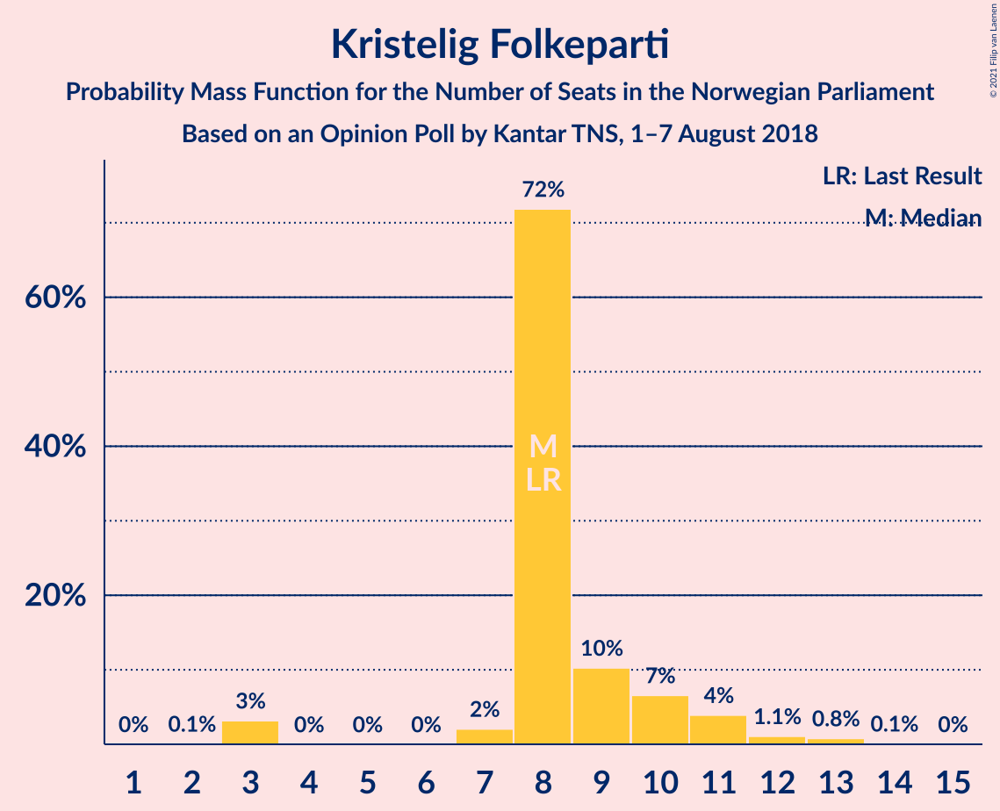

| Number of Seats | Probability | Accumulated | Special Marks |
|:---------------:|:-----------:|:-----------:|:-------------:|
| 2 | 0.1% | 100% |  |
| 3 | 3% | 99.9% |  |
| 4 | 0% | 97% |  |
| 5 | 0% | 97% |  |
| 6 | 0% | 97% |  |
| 7 | 2% | 97% |  |
| 8 | 72% | 95% | Last Result, Median |
| 9 | 10% | 23% |  |
| 10 | 7% | 13% |  |
| 11 | 4% | 6% |  |
| 12 | 1.1% | 2% |  |
| 13 | 0.8% | 0.9% |  |
| 14 | 0.1% | 0.1% |  |
| 15 | 0% | 0% |  |

### Venstre

*For a full overview of the results for this party, see the [Venstre](party-venstre.html) page.*

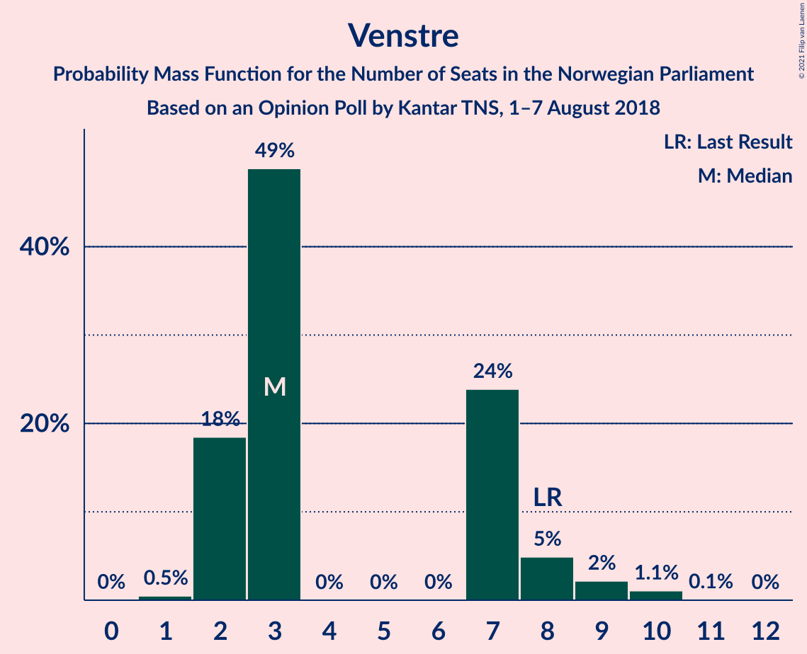

| Number of Seats | Probability | Accumulated | Special Marks |
|:---------------:|:-----------:|:-----------:|:-------------:|
| 1 | 0.5% | 100% |  |
| 2 | 18% | 99.5% |  |
| 3 | 49% | 81% | Median |
| 4 | 0% | 32% |  |
| 5 | 0% | 32% |  |
| 6 | 0% | 32% |  |
| 7 | 24% | 32% |  |
| 8 | 5% | 8% | Last Result |
| 9 | 2% | 3% |  |
| 10 | 1.1% | 1.2% |  |
| 11 | 0.1% | 0.1% |  |
| 12 | 0% | 0% |  |

### Miljøpartiet De Grønne

*For a full overview of the results for this party, see the [Miljøpartiet De Grønne](party-miljøpartietdegrønne.html) page.*

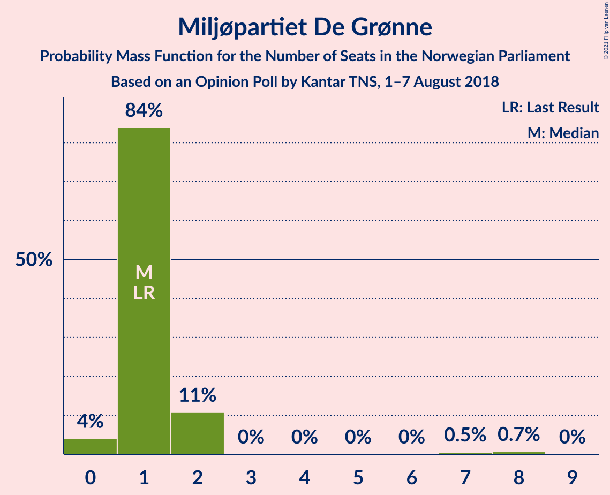

| Number of Seats | Probability | Accumulated | Special Marks |
|:---------------:|:-----------:|:-----------:|:-------------:|
| 0 | 4% | 100% |  |
| 1 | 84% | 96% | Last Result, Median |
| 2 | 11% | 12% |  |
| 3 | 0% | 1.3% |  |
| 4 | 0% | 1.3% |  |
| 5 | 0% | 1.3% |  |
| 6 | 0% | 1.3% |  |
| 7 | 0.5% | 1.3% |  |
| 8 | 0.7% | 0.7% |  |
| 9 | 0% | 0% |  |

## Coalitions

### Confidence Intervals

| Coalition | Last Result | Median | Majority? | 80% Confidence Interval | 90% Confidence Interval | 95% Confidence Interval | 99% Confidence Interval |
|:---------:|:-----------:|:------:|:---------:|:-----------------------:|:-----------------------:|:-----------------------:|:-----------------------:|
| Høyre – Senterpartiet – Fremskrittspartiet – Kristelig Folkeparti – Venstre | 107 | 99 | 100% | 98–102 | 96–105 | 95–106 | 93–109 |
| Arbeiderpartiet – Senterpartiet – Sosialistisk Venstreparti – Kristelig Folkeparti – Miljøpartiet De Grønne | 88 | 91 | 99.5% | 89–97 | 88–98 | 87–100 | 84–101 |
| Arbeiderpartiet – Senterpartiet – Sosialistisk Venstreparti – Rødt – Miljøpartiet De Grønne | 81 | 93 | 99.5% | 90–97 | 88–99 | 88–99 | 84–100 |
| Arbeiderpartiet – Senterpartiet – Sosialistisk Venstreparti – Rødt | 80 | 92 | 98% | 88–96 | 87–97 | 86–97 | 82–99 |
| Arbeiderpartiet – Senterpartiet – Sosialistisk Venstreparti – Miljøpartiet De Grønne | 80 | 83 | 35% | 81–88 | 80–89 | 79–89 | 76–91 |
| Arbeiderpartiet – Senterpartiet – Sosialistisk Venstreparti | 79 | 82 | 31% | 79–87 | 79–87 | 77–88 | 74–90 |
| Arbeiderpartiet – Senterpartiet – Kristelig Folkeparti – Miljøpartiet De Grønne | 77 | 77 | 2% | 76–82 | 73–82 | 72–84 | 70–86 |
| Høyre – Fremskrittspartiet – Kristelig Folkeparti – Venstre – Miljøpartiet De Grønne | 89 | 77 | 2% | 73–81 | 72–82 | 72–83 | 70–87 |
| Arbeiderpartiet – Senterpartiet – Kristelig Folkeparti | 76 | 76 | 1.0% | 75–80 | 72–81 | 71–82 | 69–85 |
| Høyre – Fremskrittspartiet – Kristelig Folkeparti – Venstre | 88 | 76 | 0.5% | 72–79 | 70–81 | 70–81 | 69–85 |
| Arbeiderpartiet – Senterpartiet | 68 | 68 | 0% | 67–71 | 64–71 | 63–73 | 61–76 |
| Høyre – Fremskrittspartiet – Venstre | 80 | 68 | 0% | 61–70 | 61–72 | 61–73 | 59–76 |
| Høyre – Fremskrittspartiet | 72 | 65 | 0% | 59–65 | 59–67 | 56–69 | 55–71 |
| Høyre – Kristelig Folkeparti – Venstre | 61 | 58 | 0% | 55–61 | 54–64 | 53–67 | 49–68 |
| Arbeiderpartiet – Sosialistisk Venstreparti | 60 | 59 | 0% | 56–60 | 55–61 | 53–62 | 51–67 |
| Senterpartiet – Kristelig Folkeparti – Venstre | 35 | 34 | 0% | 34–41 | 33–41 | 30–46 | 28–47 |

### Høyre – Senterpartiet – Fremskrittspartiet – Kristelig Folkeparti – Venstre

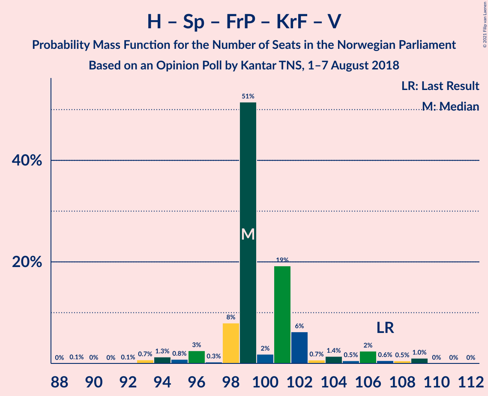

| Number of Seats | Probability | Accumulated | Special Marks |
|:---------------:|:-----------:|:-----------:|:-------------:|
| 89 | 0.1% | 100% |  |
| 90 | 0% | 99.9% |  |
| 91 | 0% | 99.8% |  |
| 92 | 0.1% | 99.8% |  |
| 93 | 0.7% | 99.7% |  |
| 94 | 1.3% | 99.0% |  |
| 95 | 0.8% | 98% |  |
| 96 | 3% | 97% |  |
| 97 | 0.3% | 94% |  |
| 98 | 8% | 94% |  |
| 99 | 51% | 86% | Median |
| 100 | 2% | 35% |  |
| 101 | 19% | 33% |  |
| 102 | 6% | 14% |  |
| 103 | 0.7% | 7% |  |
| 104 | 1.4% | 7% |  |
| 105 | 0.5% | 5% |  |
| 106 | 2% | 5% |  |
| 107 | 0.6% | 2% | Last Result |
| 108 | 0.5% | 2% |  |
| 109 | 1.0% | 1.1% |  |
| 110 | 0% | 0.1% |  |
| 111 | 0% | 0.1% |  |
| 112 | 0% | 0% |  |

### Arbeiderpartiet – Senterpartiet – Sosialistisk Venstreparti – Kristelig Folkeparti – Miljøpartiet De Grønne

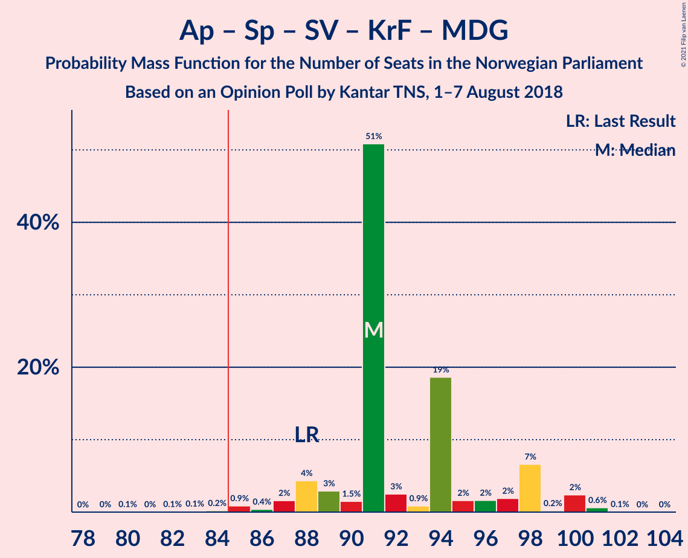

| Number of Seats | Probability | Accumulated | Special Marks |
|:---------------:|:-----------:|:-----------:|:-------------:|
| 80 | 0.1% | 100% |  |
| 81 | 0% | 99.9% |  |
| 82 | 0.1% | 99.9% |  |
| 83 | 0.1% | 99.8% |  |
| 84 | 0.2% | 99.7% |  |
| 85 | 0.9% | 99.5% | Majority |
| 86 | 0.4% | 98.6% |  |
| 87 | 2% | 98% |  |
| 88 | 4% | 97% | Last Result |
| 89 | 3% | 92% |  |
| 90 | 1.5% | 89% |  |
| 91 | 51% | 88% | Median |
| 92 | 3% | 37% |  |
| 93 | 0.9% | 35% |  |
| 94 | 19% | 34% |  |
| 95 | 2% | 15% |  |
| 96 | 2% | 13% |  |
| 97 | 2% | 12% |  |
| 98 | 7% | 10% |  |
| 99 | 0.2% | 3% |  |
| 100 | 2% | 3% |  |
| 101 | 0.6% | 0.7% |  |
| 102 | 0.1% | 0.1% |  |
| 103 | 0% | 0.1% |  |
| 104 | 0% | 0% |  |

### Arbeiderpartiet – Senterpartiet – Sosialistisk Venstreparti – Rødt – Miljøpartiet De Grønne

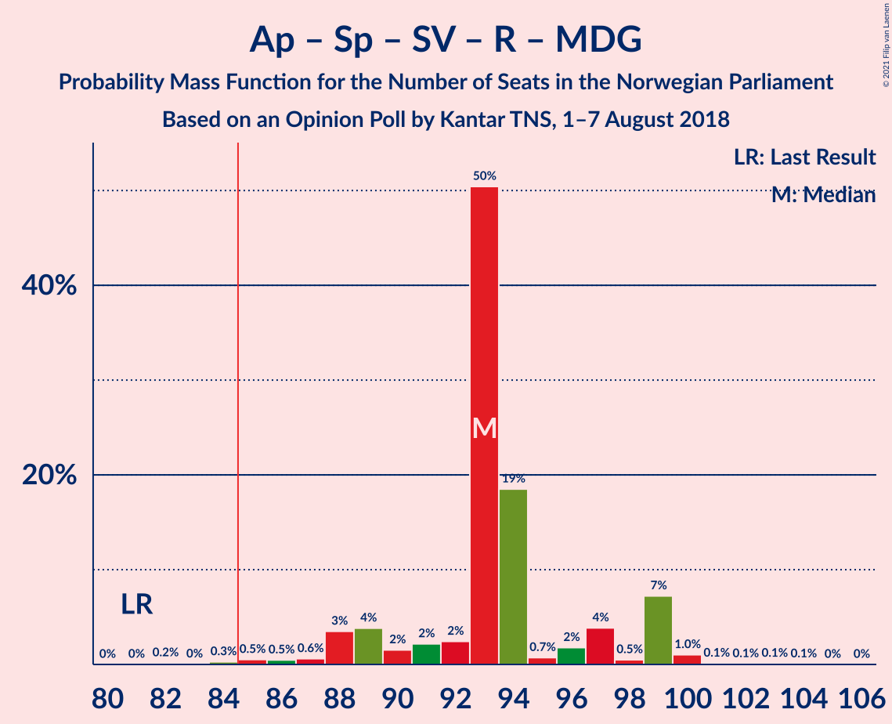

| Number of Seats | Probability | Accumulated | Special Marks |
|:---------------:|:-----------:|:-----------:|:-------------:|
| 81 | 0% | 100% | Last Result |
| 82 | 0.2% | 100% |  |
| 83 | 0% | 99.8% |  |
| 84 | 0.3% | 99.8% |  |
| 85 | 0.5% | 99.5% | Majority |
| 86 | 0.5% | 99.0% |  |
| 87 | 0.6% | 98% |  |
| 88 | 3% | 98% |  |
| 89 | 4% | 94% |  |
| 90 | 2% | 91% |  |
| 91 | 2% | 89% |  |
| 92 | 2% | 87% |  |
| 93 | 50% | 84% | Median |
| 94 | 19% | 34% |  |
| 95 | 0.7% | 15% |  |
| 96 | 2% | 15% |  |
| 97 | 4% | 13% |  |
| 98 | 0.5% | 9% |  |
| 99 | 7% | 9% |  |
| 100 | 1.0% | 1.4% |  |
| 101 | 0.1% | 0.4% |  |
| 102 | 0.1% | 0.3% |  |
| 103 | 0.1% | 0.2% |  |
| 104 | 0.1% | 0.1% |  |
| 105 | 0% | 0% |  |

### Arbeiderpartiet – Senterpartiet – Sosialistisk Venstreparti – Rødt

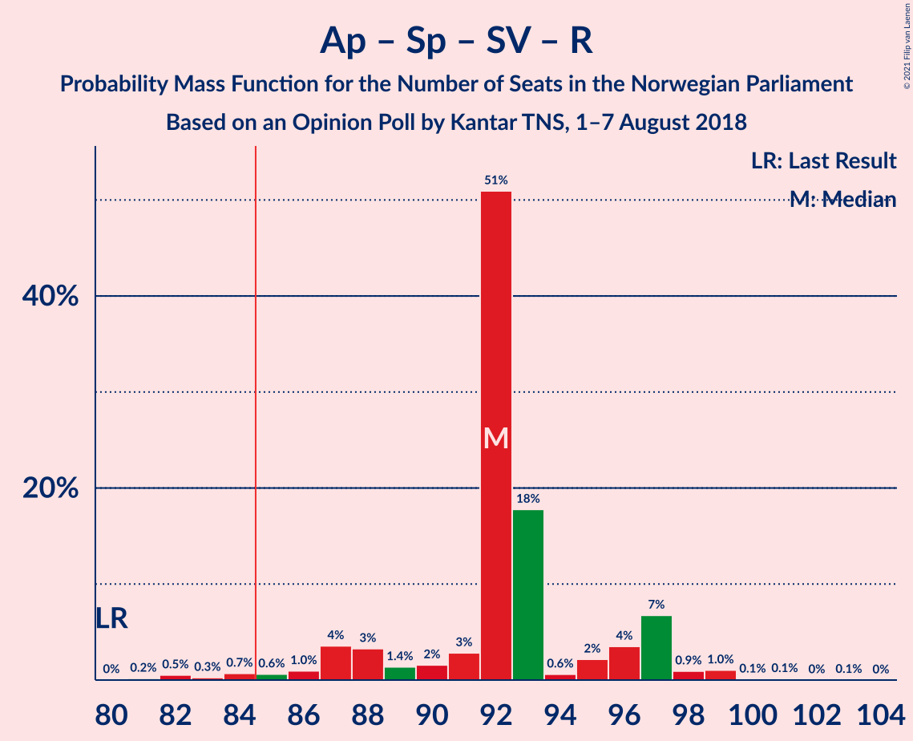

| Number of Seats | Probability | Accumulated | Special Marks |
|:---------------:|:-----------:|:-----------:|:-------------:|
| 80 | 0% | 100% | Last Result |
| 81 | 0.2% | 99.9% |  |
| 82 | 0.5% | 99.8% |  |
| 83 | 0.3% | 99.2% |  |
| 84 | 0.7% | 99.0% |  |
| 85 | 0.6% | 98% | Majority |
| 86 | 1.0% | 98% |  |
| 87 | 4% | 97% |  |
| 88 | 3% | 93% |  |
| 89 | 1.4% | 90% |  |
| 90 | 2% | 88% |  |
| 91 | 3% | 87% |  |
| 92 | 51% | 84% | Median |
| 93 | 18% | 33% |  |
| 94 | 0.6% | 15% |  |
| 95 | 2% | 15% |  |
| 96 | 4% | 13% |  |
| 97 | 7% | 9% |  |
| 98 | 0.9% | 2% |  |
| 99 | 1.0% | 1.3% |  |
| 100 | 0.1% | 0.3% |  |
| 101 | 0.1% | 0.2% |  |
| 102 | 0% | 0.1% |  |
| 103 | 0.1% | 0.1% |  |
| 104 | 0% | 0% |  |

### Arbeiderpartiet – Senterpartiet – Sosialistisk Venstreparti – Miljøpartiet De Grønne

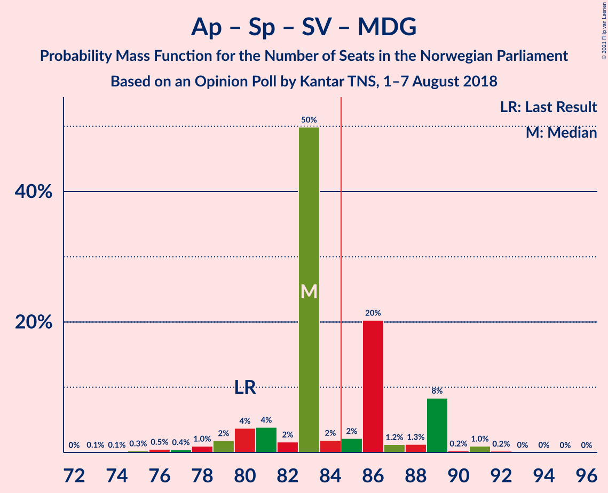

| Number of Seats | Probability | Accumulated | Special Marks |
|:---------------:|:-----------:|:-----------:|:-------------:|
| 73 | 0.1% | 100% |  |
| 74 | 0.1% | 99.9% |  |
| 75 | 0.3% | 99.9% |  |
| 76 | 0.5% | 99.6% |  |
| 77 | 0.4% | 99.1% |  |
| 78 | 1.0% | 98.7% |  |
| 79 | 2% | 98% |  |
| 80 | 4% | 96% | Last Result |
| 81 | 4% | 92% |  |
| 82 | 2% | 88% |  |
| 83 | 50% | 87% | Median |
| 84 | 2% | 37% |  |
| 85 | 2% | 35% | Majority |
| 86 | 20% | 33% |  |
| 87 | 1.2% | 12% |  |
| 88 | 1.3% | 11% |  |
| 89 | 8% | 10% |  |
| 90 | 0.2% | 2% |  |
| 91 | 1.0% | 1.3% |  |
| 92 | 0.2% | 0.3% |  |
| 93 | 0% | 0.1% |  |
| 94 | 0% | 0.1% |  |
| 95 | 0% | 0% |  |

### Arbeiderpartiet – Senterpartiet – Sosialistisk Venstreparti

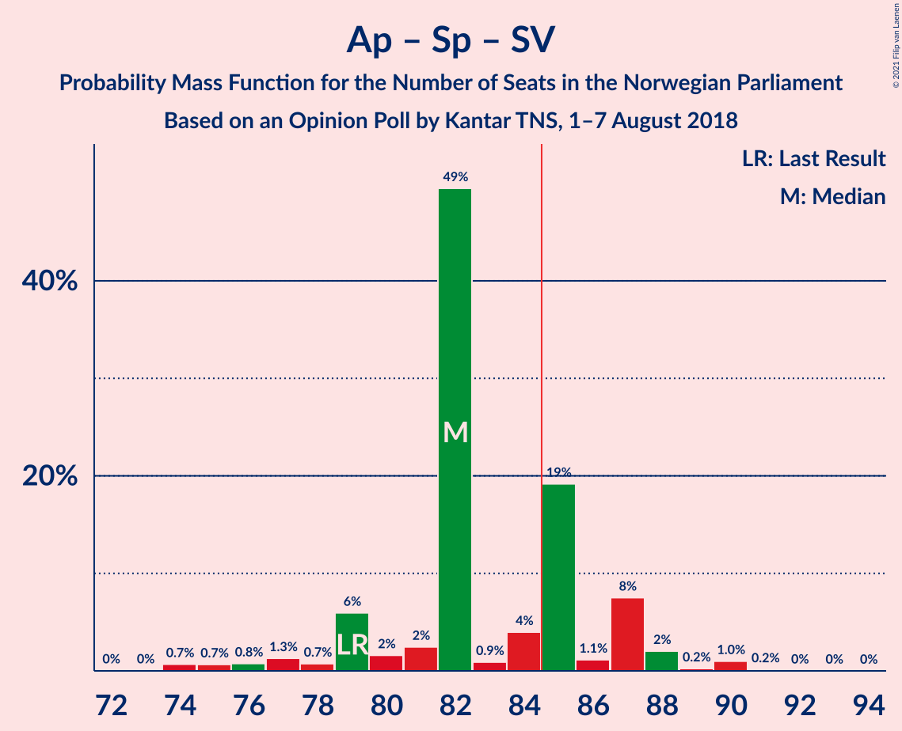

| Number of Seats | Probability | Accumulated | Special Marks |
|:---------------:|:-----------:|:-----------:|:-------------:|
| 72 | 0% | 100% |  |
| 73 | 0% | 99.9% |  |
| 74 | 0.7% | 99.9% |  |
| 75 | 0.7% | 99.2% |  |
| 76 | 0.8% | 98.5% |  |
| 77 | 1.3% | 98% |  |
| 78 | 0.7% | 96% |  |
| 79 | 6% | 96% | Last Result |
| 80 | 2% | 90% |  |
| 81 | 2% | 88% |  |
| 82 | 49% | 86% | Median |
| 83 | 0.9% | 36% |  |
| 84 | 4% | 35% |  |
| 85 | 19% | 31% | Majority |
| 86 | 1.1% | 12% |  |
| 87 | 8% | 11% |  |
| 88 | 2% | 4% |  |
| 89 | 0.2% | 1.5% |  |
| 90 | 1.0% | 1.2% |  |
| 91 | 0.2% | 0.2% |  |
| 92 | 0% | 0.1% |  |
| 93 | 0% | 0% |  |

### Arbeiderpartiet – Senterpartiet – Kristelig Folkeparti – Miljøpartiet De Grønne

| Number of Seats | Probability | Accumulated | Special Marks |
|:---------------:|:-----------:|:-----------:|:-------------:|
| 68 | 0.1% | 100% |  |
| 69 | 0.2% | 99.9% |  |
| 70 | 0.4% | 99.6% |  |
| 71 | 0.1% | 99.3% |  |
| 72 | 3% | 99.1% |  |
| 73 | 2% | 96% |  |
| 74 | 0.8% | 95% |  |
| 75 | 2% | 94% |  |
| 76 | 3% | 92% |  |
| 77 | 51% | 89% | Last Result, Median |
| 78 | 2% | 38% |  |
| 79 | 19% | 36% |  |
| 80 | 2% | 17% |  |
| 81 | 1.0% | 15% |  |
| 82 | 10% | 14% |  |
| 83 | 2% | 4% |  |
| 84 | 0.9% | 3% |  |
| 85 | 0.6% | 2% | Majority |
| 86 | 0.7% | 1.1% |  |
| 87 | 0.2% | 0.4% |  |
| 88 | 0.1% | 0.2% |  |
| 89 | 0% | 0.1% |  |
| 90 | 0% | 0% |  |

### Høyre – Fremskrittspartiet – Kristelig Folkeparti – Venstre – Miljøpartiet De Grønne

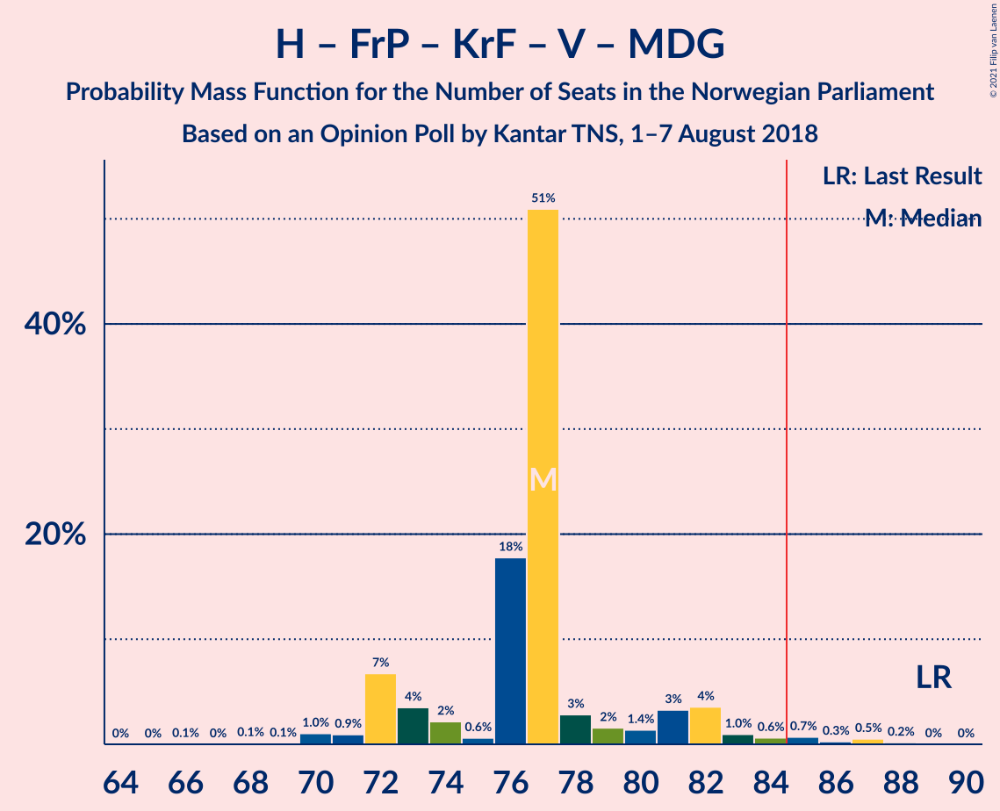

| Number of Seats | Probability | Accumulated | Special Marks |
|:---------------:|:-----------:|:-----------:|:-------------:|
| 66 | 0.1% | 100% |  |
| 67 | 0% | 99.9% |  |
| 68 | 0.1% | 99.9% |  |
| 69 | 0.1% | 99.8% |  |
| 70 | 1.0% | 99.7% |  |
| 71 | 0.9% | 98.7% |  |
| 72 | 7% | 98% |  |
| 73 | 4% | 91% |  |
| 74 | 2% | 87% |  |
| 75 | 0.6% | 85% |  |
| 76 | 18% | 85% |  |
| 77 | 51% | 67% | Median |
| 78 | 3% | 16% |  |
| 79 | 2% | 13% |  |
| 80 | 1.4% | 12% |  |
| 81 | 3% | 10% |  |
| 82 | 4% | 7% |  |
| 83 | 1.0% | 3% |  |
| 84 | 0.6% | 2% |  |
| 85 | 0.7% | 2% | Majority |
| 86 | 0.3% | 1.0% |  |
| 87 | 0.5% | 0.8% |  |
| 88 | 0.2% | 0.2% |  |
| 89 | 0% | 0.1% | Last Result |
| 90 | 0% | 0% |  |

### Arbeiderpartiet – Senterpartiet – Kristelig Folkeparti

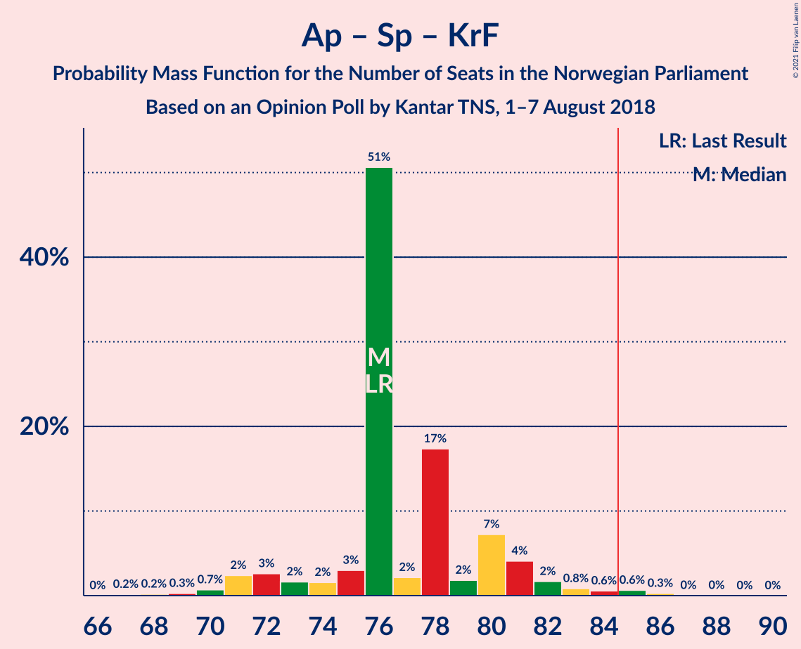

| Number of Seats | Probability | Accumulated | Special Marks |
|:---------------:|:-----------:|:-----------:|:-------------:|
| 67 | 0.2% | 100% |  |
| 68 | 0.2% | 99.8% |  |
| 69 | 0.3% | 99.6% |  |
| 70 | 0.7% | 99.4% |  |
| 71 | 2% | 98.6% |  |
| 72 | 3% | 96% |  |
| 73 | 2% | 94% |  |
| 74 | 2% | 92% |  |
| 75 | 3% | 90% |  |
| 76 | 51% | 87% | Last Result, Median |
| 77 | 2% | 37% |  |
| 78 | 17% | 35% |  |
| 79 | 2% | 17% |  |
| 80 | 7% | 15% |  |
| 81 | 4% | 8% |  |
| 82 | 2% | 4% |  |
| 83 | 0.8% | 2% |  |
| 84 | 0.6% | 2% |  |
| 85 | 0.6% | 1.0% | Majority |
| 86 | 0.3% | 0.4% |  |
| 87 | 0% | 0.1% |  |
| 88 | 0% | 0.1% |  |
| 89 | 0% | 0% |  |

### Høyre – Fremskrittspartiet – Kristelig Folkeparti – Venstre

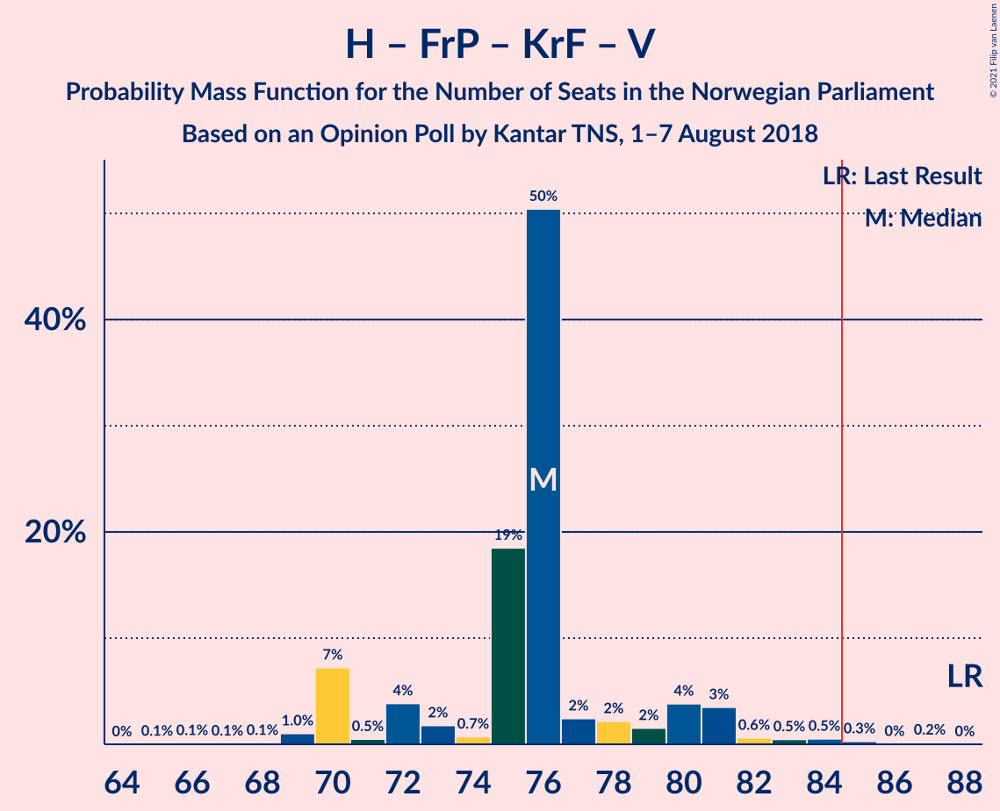

| Number of Seats | Probability | Accumulated | Special Marks |
|:---------------:|:-----------:|:-----------:|:-------------:|
| 65 | 0.1% | 100% |  |
| 66 | 0.1% | 99.9% |  |
| 67 | 0.1% | 99.8% |  |
| 68 | 0.1% | 99.7% |  |
| 69 | 1.0% | 99.6% |  |
| 70 | 7% | 98.6% |  |
| 71 | 0.5% | 91% |  |
| 72 | 4% | 91% |  |
| 73 | 2% | 87% |  |
| 74 | 0.7% | 85% |  |
| 75 | 19% | 85% |  |
| 76 | 50% | 66% | Median |
| 77 | 2% | 16% |  |
| 78 | 2% | 13% |  |
| 79 | 2% | 11% |  |
| 80 | 4% | 9% |  |
| 81 | 3% | 6% |  |
| 82 | 0.6% | 2% |  |
| 83 | 0.5% | 2% |  |
| 84 | 0.5% | 1.0% |  |
| 85 | 0.3% | 0.5% | Majority |
| 86 | 0% | 0.2% |  |
| 87 | 0.2% | 0.2% |  |
| 88 | 0% | 0% | Last Result |

### Arbeiderpartiet – Senterpartiet

| Number of Seats | Probability | Accumulated | Special Marks |
|:---------------:|:-----------:|:-----------:|:-------------:|
| 58 | 0.1% | 100% |  |
| 59 | 0.1% | 99.9% |  |
| 60 | 0.1% | 99.9% |  |
| 61 | 1.3% | 99.8% |  |
| 62 | 0.3% | 98% |  |
| 63 | 2% | 98% |  |
| 64 | 2% | 96% |  |
| 65 | 3% | 95% |  |
| 66 | 1.1% | 92% |  |
| 67 | 3% | 91% |  |
| 68 | 51% | 88% | Last Result, Median |
| 69 | 4% | 38% |  |
| 70 | 20% | 34% |  |
| 71 | 10% | 14% |  |
| 72 | 1.3% | 4% |  |
| 73 | 0.6% | 3% |  |
| 74 | 1.3% | 2% |  |
| 75 | 0.2% | 0.8% |  |
| 76 | 0.3% | 0.6% |  |
| 77 | 0.2% | 0.3% |  |
| 78 | 0% | 0.1% |  |
| 79 | 0% | 0% |  |

### Høyre – Fremskrittspartiet – Venstre

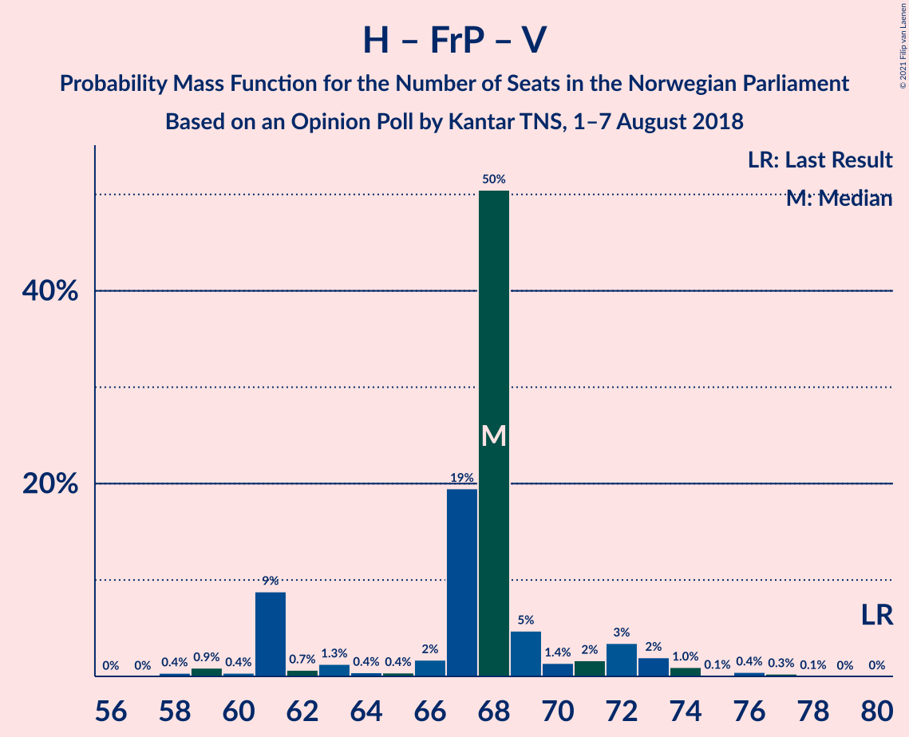

| Number of Seats | Probability | Accumulated | Special Marks |
|:---------------:|:-----------:|:-----------:|:-------------:|
| 58 | 0.4% | 100% |  |
| 59 | 0.9% | 99.6% |  |
| 60 | 0.4% | 98.7% |  |
| 61 | 9% | 98% |  |
| 62 | 0.7% | 90% |  |
| 63 | 1.3% | 89% |  |
| 64 | 0.4% | 88% |  |
| 65 | 0.4% | 87% |  |
| 66 | 2% | 87% |  |
| 67 | 19% | 85% |  |
| 68 | 50% | 66% | Median |
| 69 | 5% | 15% |  |
| 70 | 1.4% | 10% |  |
| 71 | 2% | 9% |  |
| 72 | 3% | 7% |  |
| 73 | 2% | 4% |  |
| 74 | 1.0% | 2% |  |
| 75 | 0.1% | 1.0% |  |
| 76 | 0.4% | 0.9% |  |
| 77 | 0.3% | 0.4% |  |
| 78 | 0.1% | 0.1% |  |
| 79 | 0% | 0.1% |  |
| 80 | 0% | 0% | Last Result |

### Høyre – Fremskrittspartiet

| Number of Seats | Probability | Accumulated | Special Marks |
|:---------------:|:-----------:|:-----------:|:-------------:|
| 52 | 0% | 100% |  |
| 53 | 0.1% | 99.9% |  |
| 54 | 0% | 99.9% |  |
| 55 | 1.1% | 99.9% |  |
| 56 | 1.4% | 98.8% |  |
| 57 | 1.1% | 97% |  |
| 58 | 1.0% | 96% |  |
| 59 | 9% | 95% |  |
| 60 | 18% | 86% |  |
| 61 | 2% | 68% |  |
| 62 | 4% | 66% |  |
| 63 | 0.2% | 62% |  |
| 64 | 2% | 62% |  |
| 65 | 53% | 60% | Median |
| 66 | 1.4% | 8% |  |
| 67 | 2% | 6% |  |
| 68 | 1.4% | 4% |  |
| 69 | 1.1% | 3% |  |
| 70 | 0.8% | 1.5% |  |
| 71 | 0.4% | 0.7% |  |
| 72 | 0% | 0.3% | Last Result |
| 73 | 0.1% | 0.3% |  |
| 74 | 0.2% | 0.2% |  |
| 75 | 0% | 0% |  |

### Høyre – Kristelig Folkeparti – Venstre

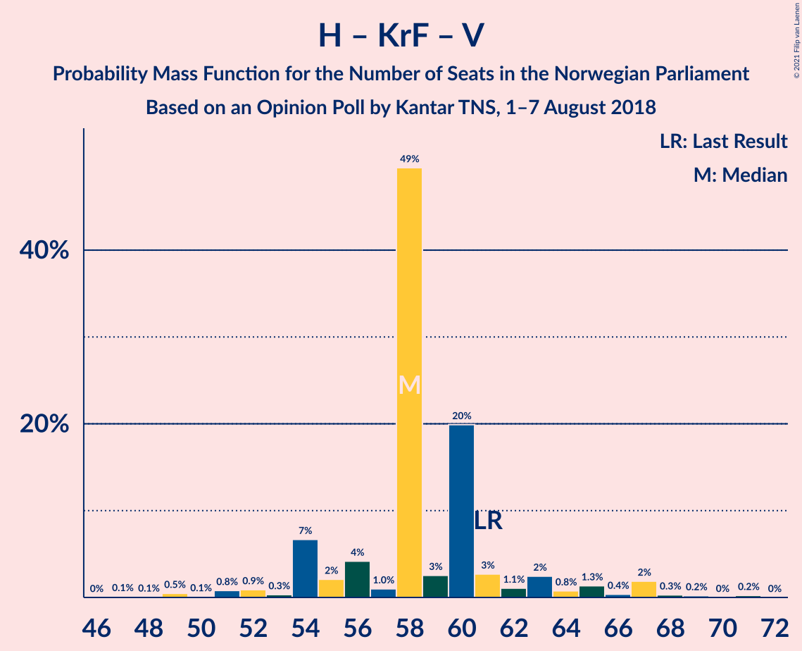

| Number of Seats | Probability | Accumulated | Special Marks |
|:---------------:|:-----------:|:-----------:|:-------------:|
| 47 | 0.1% | 100% |  |
| 48 | 0.1% | 99.9% |  |
| 49 | 0.5% | 99.8% |  |
| 50 | 0.1% | 99.4% |  |
| 51 | 0.8% | 99.3% |  |
| 52 | 0.9% | 98% |  |
| 53 | 0.3% | 98% |  |
| 54 | 7% | 97% |  |
| 55 | 2% | 91% |  |
| 56 | 4% | 88% |  |
| 57 | 1.0% | 84% |  |
| 58 | 49% | 83% | Median |
| 59 | 3% | 34% |  |
| 60 | 20% | 31% |  |
| 61 | 3% | 11% | Last Result |
| 62 | 1.1% | 9% |  |
| 63 | 2% | 8% |  |
| 64 | 0.8% | 5% |  |
| 65 | 1.3% | 4% |  |
| 66 | 0.4% | 3% |  |
| 67 | 2% | 3% |  |
| 68 | 0.3% | 0.7% |  |
| 69 | 0.2% | 0.5% |  |
| 70 | 0% | 0.2% |  |
| 71 | 0.2% | 0.2% |  |
| 72 | 0% | 0% |  |

### Arbeiderpartiet – Sosialistisk Venstreparti

| Number of Seats | Probability | Accumulated | Special Marks |
|:---------------:|:-----------:|:-----------:|:-------------:|
| 49 | 0% | 100% |  |
| 50 | 0.3% | 99.9% |  |
| 51 | 0.2% | 99.7% |  |
| 52 | 0.7% | 99.4% |  |
| 53 | 3% | 98.8% |  |
| 54 | 1.1% | 96% |  |
| 55 | 2% | 95% |  |
| 56 | 3% | 93% |  |
| 57 | 4% | 90% |  |
| 58 | 3% | 86% |  |
| 59 | 73% | 83% | Median |
| 60 | 3% | 10% | Last Result |
| 61 | 3% | 7% |  |
| 62 | 2% | 4% |  |
| 63 | 0.5% | 2% |  |
| 64 | 0.6% | 2% |  |
| 65 | 0.4% | 1.2% |  |
| 66 | 0% | 0.8% |  |
| 67 | 0.7% | 0.7% |  |
| 68 | 0.1% | 0.1% |  |
| 69 | 0% | 0% |  |

### Senterpartiet – Kristelig Folkeparti – Venstre

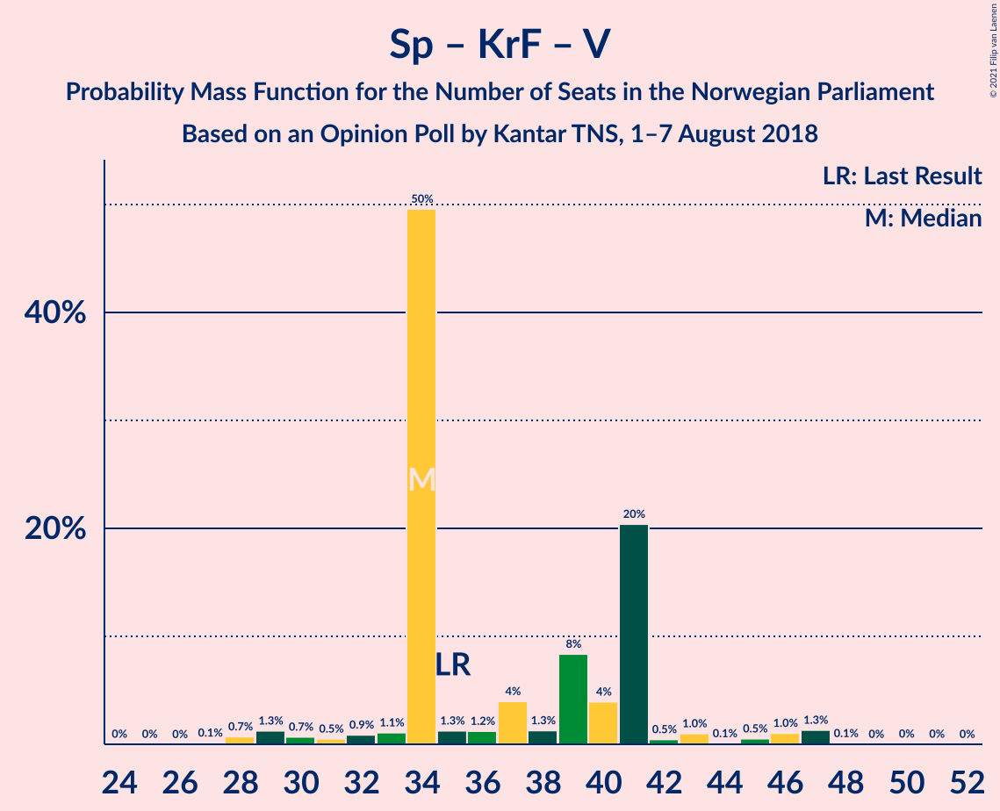

| Number of Seats | Probability | Accumulated | Special Marks |
|:---------------:|:-----------:|:-----------:|:-------------:|
| 25 | 0% | 100% |  |
| 26 | 0% | 99.9% |  |
| 27 | 0.1% | 99.9% |  |
| 28 | 0.7% | 99.8% |  |
| 29 | 1.3% | 99.1% |  |
| 30 | 0.7% | 98% |  |
| 31 | 0.5% | 97% |  |
| 32 | 0.9% | 97% |  |
| 33 | 1.1% | 96% |  |
| 34 | 50% | 95% | Median |
| 35 | 1.3% | 45% | Last Result |
| 36 | 1.2% | 44% |  |
| 37 | 4% | 43% |  |
| 38 | 1.3% | 39% |  |
| 39 | 8% | 37% |  |
| 40 | 4% | 29% |  |
| 41 | 20% | 25% |  |
| 42 | 0.5% | 5% |  |
| 43 | 1.0% | 4% |  |
| 44 | 0.1% | 3% |  |
| 45 | 0.5% | 3% |  |
| 46 | 1.0% | 3% |  |
| 47 | 1.3% | 2% |  |
| 48 | 0.1% | 0.2% |  |
| 49 | 0% | 0.1% |  |
| 50 | 0% | 0.1% |  |
| 51 | 0% | 0% |  |

## Technical Information

### Opinion Poll

+ **Polling firm:** Kantar TNS
+ **Commissioner(s):** —
+ **Fieldwork period:** 1–7 August 2018

### Calculations

+ **Sample size:** 740
+ **Simulations done:** 131,072
+ **Error estimate:** 1.25%

