# Opinion Poll by Norfakta, 7–8 August 2018

<a href="#voting-intentions">Voting Intentions</a> | <a href="#seats">Seats</a> | <a href="#coalitions">Coalitions</a> | <a href="#technical-information">Technical Information</a>

## Voting Intentions

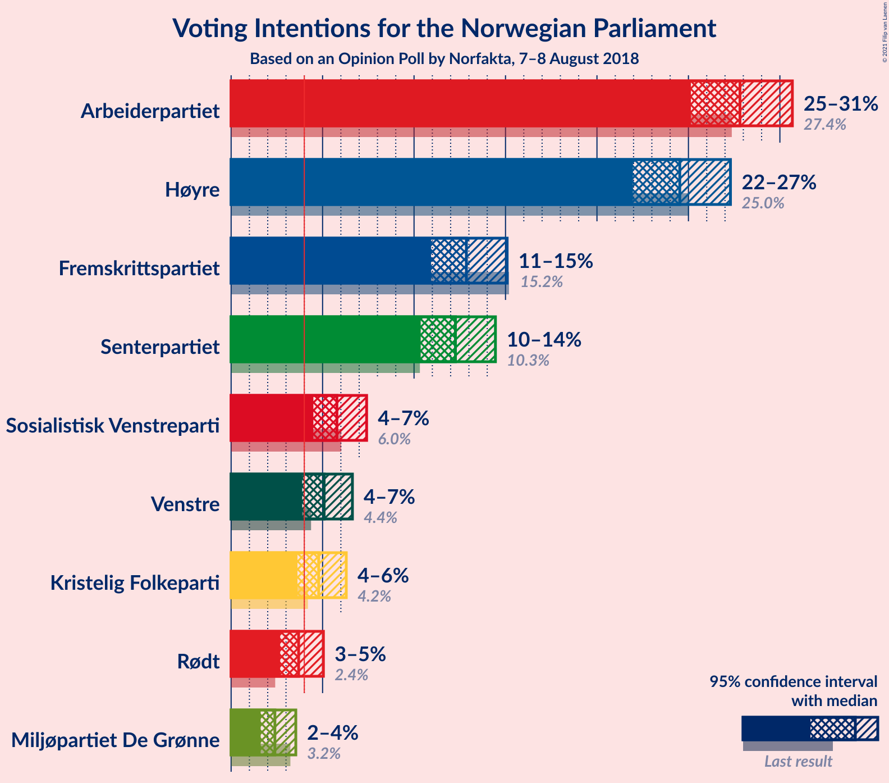

### Confidence Intervals

| Party | Last Result | Poll Result | 80% Confidence Interval | 90% Confidence Interval | 95% Confidence Interval | 99% Confidence Interval |
|:-----:|:-----------:|:-----------:|:-----------------------:|:-----------------------:|:-----------------------:|:-----------------------:|
| Arbeiderpartiet | 27.4% | 27.8% | 26.0–29.7% |25.6–30.2% |25.1–30.7% |24.3–31.6% |
| Høyre | 25.0% | 24.5% | 22.8–26.3% |22.4–26.8% |22.0–27.3% |21.2–28.2% |
| Fremskrittspartiet | 15.2% | 12.9% | 11.6–14.3% |11.2–14.7% |10.9–15.1% |10.3–15.8% |
| Senterpartiet | 10.3% | 12.3% | 11.0–13.7% |10.7–14.1% |10.4–14.4% |9.8–15.2% |
| Sosialistisk Venstreparti | 6.0% | 5.8% | 4.9–6.8% |4.7–7.1% |4.5–7.4% |4.1–8.0% |
| Venstre | 4.4% | 5.1% | 4.3–6.1% |4.1–6.4% |3.9–6.6% |3.5–7.1% |
| Kristelig Folkeparti | 4.2% | 4.8% | 4.0–5.8% |3.8–6.1% |3.6–6.3% |3.3–6.8% |
| Rødt | 2.4% | 3.7% | 3.0–4.6% |2.8–4.8% |2.7–5.0% |2.4–5.5% |
| Miljøpartiet De Grønne | 3.2% | 2.4% | 1.9–3.1% |1.7–3.4% |1.6–3.5% |1.4–3.9% |

*Note:* The poll result column reflects the actual value used in the calculations. Published results may vary slightly, and in addition be rounded to fewer digits.

## Seats

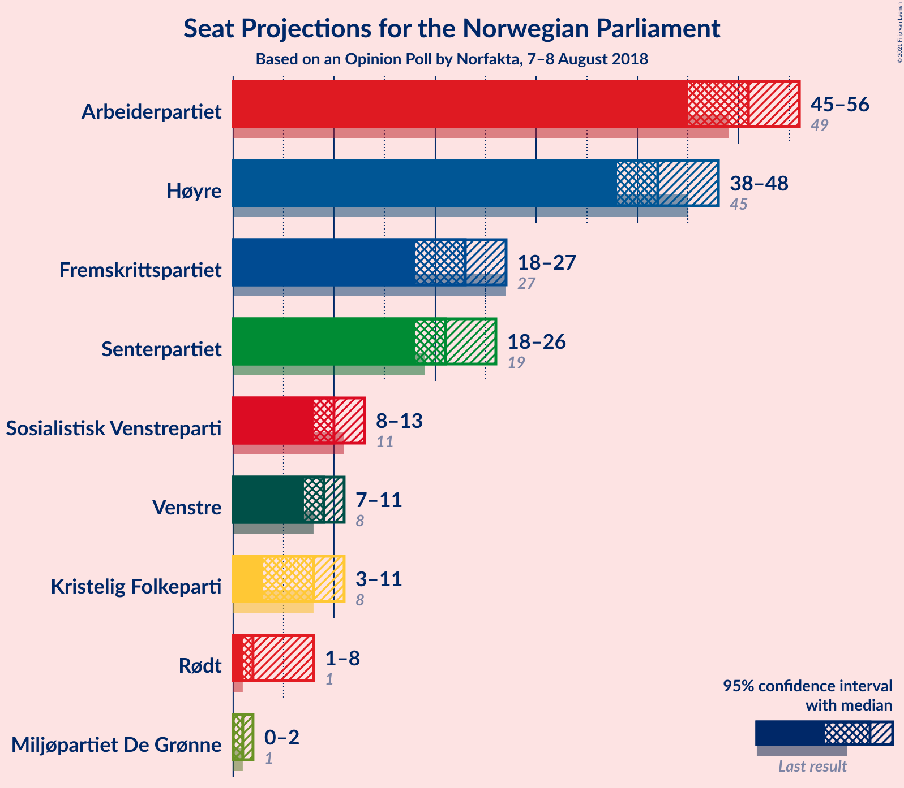

### Confidence Intervals

| Party | Last Result | Median | 80% Confidence Interval | 90% Confidence Interval | 95% Confidence Interval | 99% Confidence Interval |
|:-----:|:-----------:|:------:|:-----------------------:|:-----------------------:|:-----------------------:|:-----------------------:|
| <a href="#arbeiderpartiet">Arbeiderpartiet</a> | 49 | 51 | 47–55 |45–55 |45–56 |43–58 |
| <a href="#høyre">Høyre</a> | 45 | 42 | 40–46 |39–47 |38–48 |37–51 |
| <a href="#fremskrittspartiet">Fremskrittspartiet</a> | 27 | 23 | 20–25 |19–26 |18–27 |17–29 |
| <a href="#senterpartiet">Senterpartiet</a> | 19 | 21 | 19–25 |18–25 |18–26 |17–27 |
| <a href="#sosialistisk-venstreparti">Sosialistisk Venstreparti</a> | 11 | 10 | 8–12 |8–13 |8–13 |7–14 |
| <a href="#venstre">Venstre</a> | 8 | 9 | 7–10 |7–11 |7–11 |2–12 |
| <a href="#kristelig-folkeparti">Kristelig Folkeparti</a> | 8 | 8 | 7–10 |3–10 |3–11 |2–12 |
| <a href="#rødt">Rødt</a> | 1 | 2 | 1–7 |1–8 |1–8 |1–9 |
| <a href="#miljøpartiet-de-grønne">Miljøpartiet De Grønne</a> | 1 | 1 | 0–1 |0–2 |0–2 |0–2 |

### Arbeiderpartiet

*For a full overview of the results for this party, see the [Arbeiderpartiet](party-arbeiderpartiet.html) page.*

| Number of Seats | Probability | Accumulated | Special Marks |
|:---------------:|:-----------:|:-----------:|:-------------:|
| 41 | 0.1% | 100% |  |
| 42 | 0.2% | 99.9% |  |
| 43 | 0.7% | 99.7% |  |
| 44 | 2% | 99.1% |  |
| 45 | 5% | 98% |  |
| 46 | 2% | 93% |  |
| 47 | 8% | 90% |  |
| 48 | 10% | 83% |  |
| 49 | 10% | 73% | Last Result |
| 50 | 9% | 63% |  |
| 51 | 9% | 54% | Median |
| 52 | 15% | 45% |  |
| 53 | 13% | 30% |  |
| 54 | 6% | 18% |  |
| 55 | 8% | 11% |  |
| 56 | 2% | 3% |  |
| 57 | 1.0% | 1.5% |  |
| 58 | 0.4% | 0.5% |  |
| 59 | 0.1% | 0.1% |  |
| 60 | 0% | 0.1% |  |
| 61 | 0% | 0% |  |

### Høyre

*For a full overview of the results for this party, see the [Høyre](party-høyre.html) page.*

| Number of Seats | Probability | Accumulated | Special Marks |
|:---------------:|:-----------:|:-----------:|:-------------:|
| 35 | 0.1% | 100% |  |
| 36 | 0.2% | 99.9% |  |
| 37 | 1.1% | 99.7% |  |
| 38 | 2% | 98.6% |  |
| 39 | 2% | 97% |  |
| 40 | 14% | 94% |  |
| 41 | 17% | 80% |  |
| 42 | 17% | 63% | Median |
| 43 | 12% | 47% |  |
| 44 | 12% | 35% |  |
| 45 | 10% | 23% | Last Result |
| 46 | 5% | 13% |  |
| 47 | 3% | 8% |  |
| 48 | 2% | 4% |  |
| 49 | 1.1% | 2% |  |
| 50 | 0.8% | 1.3% |  |
| 51 | 0.4% | 0.5% |  |
| 52 | 0.1% | 0.1% |  |
| 53 | 0% | 0% |  |

### Fremskrittspartiet

*For a full overview of the results for this party, see the [Fremskrittspartiet](party-fremskrittspartiet.html) page.*

| Number of Seats | Probability | Accumulated | Special Marks |
|:---------------:|:-----------:|:-----------:|:-------------:|
| 16 | 0.1% | 100% |  |
| 17 | 0.4% | 99.8% |  |
| 18 | 2% | 99.4% |  |
| 19 | 6% | 97% |  |
| 20 | 8% | 91% |  |
| 21 | 15% | 83% |  |
| 22 | 10% | 69% |  |
| 23 | 17% | 59% | Median |
| 24 | 24% | 41% |  |
| 25 | 11% | 17% |  |
| 26 | 4% | 6% |  |
| 27 | 1.4% | 3% | Last Result |
| 28 | 0.8% | 1.4% |  |
| 29 | 0.5% | 0.5% |  |
| 30 | 0.1% | 0.1% |  |
| 31 | 0% | 0% |  |

### Senterpartiet

*For a full overview of the results for this party, see the [Senterpartiet](party-senterpartiet.html) page.*

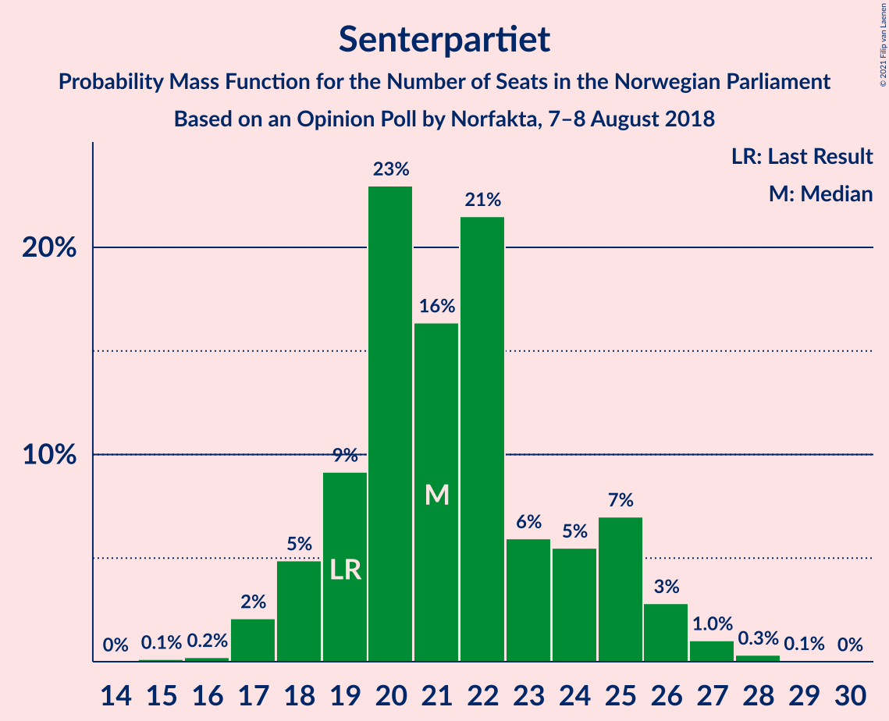

| Number of Seats | Probability | Accumulated | Special Marks |
|:---------------:|:-----------:|:-----------:|:-------------:|
| 15 | 0.1% | 100% |  |
| 16 | 0.2% | 99.9% |  |
| 17 | 2% | 99.7% |  |
| 18 | 5% | 98% |  |
| 19 | 9% | 93% | Last Result |
| 20 | 23% | 84% |  |
| 21 | 16% | 61% | Median |
| 22 | 21% | 44% |  |
| 23 | 6% | 23% |  |
| 24 | 5% | 17% |  |
| 25 | 7% | 11% |  |
| 26 | 3% | 4% |  |
| 27 | 1.0% | 1.4% |  |
| 28 | 0.3% | 0.4% |  |
| 29 | 0.1% | 0.1% |  |
| 30 | 0% | 0% |  |

### Sosialistisk Venstreparti

*For a full overview of the results for this party, see the [Sosialistisk Venstreparti](party-sosialistiskvenstreparti.html) page.*

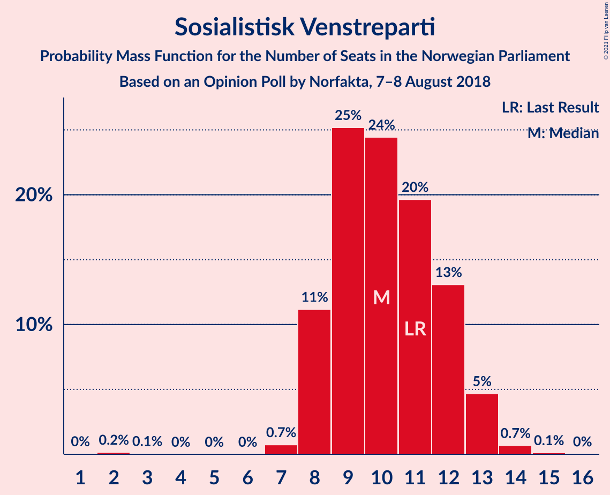

| Number of Seats | Probability | Accumulated | Special Marks |
|:---------------:|:-----------:|:-----------:|:-------------:|
| 2 | 0.2% | 100% |  |
| 3 | 0.1% | 99.8% |  |
| 4 | 0% | 99.8% |  |
| 5 | 0% | 99.8% |  |
| 6 | 0% | 99.8% |  |
| 7 | 0.7% | 99.7% |  |
| 8 | 11% | 99.0% |  |
| 9 | 25% | 88% |  |
| 10 | 24% | 63% | Median |
| 11 | 20% | 38% | Last Result |
| 12 | 13% | 19% |  |
| 13 | 5% | 6% |  |
| 14 | 0.7% | 0.8% |  |
| 15 | 0.1% | 0.1% |  |
| 16 | 0% | 0% |  |

### Venstre

*For a full overview of the results for this party, see the [Venstre](party-venstre.html) page.*

| Number of Seats | Probability | Accumulated | Special Marks |
|:---------------:|:-----------:|:-----------:|:-------------:|
| 2 | 2% | 100% |  |
| 3 | 0.3% | 98% |  |
| 4 | 0% | 98% |  |
| 5 | 0% | 98% |  |
| 6 | 0% | 98% |  |
| 7 | 17% | 98% |  |
| 8 | 24% | 81% | Last Result |
| 9 | 26% | 57% | Median |
| 10 | 21% | 31% |  |
| 11 | 8% | 10% |  |
| 12 | 0.9% | 1.4% |  |
| 13 | 0.4% | 0.5% |  |
| 14 | 0% | 0% |  |

### Kristelig Folkeparti

*For a full overview of the results for this party, see the [Kristelig Folkeparti](party-kristeligfolkeparti.html) page.*

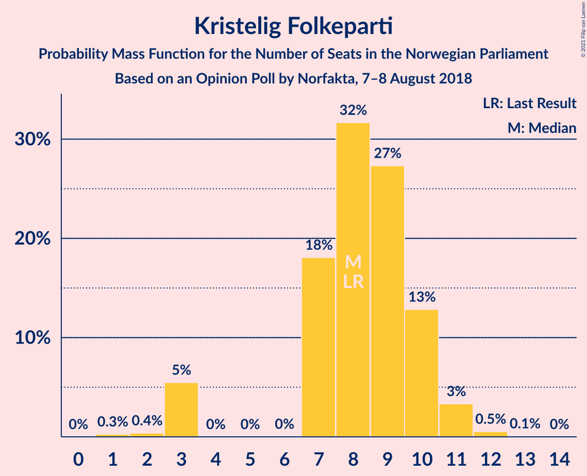

| Number of Seats | Probability | Accumulated | Special Marks |
|:---------------:|:-----------:|:-----------:|:-------------:|
| 1 | 0.3% | 100% |  |
| 2 | 0.4% | 99.7% |  |
| 3 | 5% | 99.4% |  |
| 4 | 0% | 94% |  |
| 5 | 0% | 94% |  |
| 6 | 0% | 94% |  |
| 7 | 18% | 94% |  |
| 8 | 32% | 76% | Last Result, Median |
| 9 | 27% | 44% |  |
| 10 | 13% | 17% |  |
| 11 | 3% | 4% |  |
| 12 | 0.5% | 0.6% |  |
| 13 | 0.1% | 0.1% |  |
| 14 | 0% | 0% |  |

### Rødt

*For a full overview of the results for this party, see the [Rødt](party-rødt.html) page.*

| Number of Seats | Probability | Accumulated | Special Marks |
|:---------------:|:-----------:|:-----------:|:-------------:|
| 1 | 12% | 100% | Last Result |
| 2 | 52% | 88% | Median |
| 3 | 0% | 36% |  |
| 4 | 0% | 36% |  |
| 5 | 0% | 36% |  |
| 6 | 0% | 36% |  |
| 7 | 28% | 36% |  |
| 8 | 6% | 8% |  |
| 9 | 2% | 2% |  |
| 10 | 0.2% | 0.3% |  |
| 11 | 0% | 0% |  |

### Miljøpartiet De Grønne

*For a full overview of the results for this party, see the [Miljøpartiet De Grønne](party-miljøpartietdegrønne.html) page.*

| Number of Seats | Probability | Accumulated | Special Marks |
|:---------------:|:-----------:|:-----------:|:-------------:|
| 0 | 17% | 100% |  |
| 1 | 75% | 83% | Last Result, Median |
| 2 | 8% | 8% |  |
| 3 | 0% | 0.3% |  |
| 4 | 0% | 0.2% |  |
| 5 | 0% | 0.2% |  |
| 6 | 0% | 0.2% |  |
| 7 | 0.2% | 0.2% |  |
| 8 | 0% | 0% |  |

## Coalitions

### Confidence Intervals

| Coalition | Last Result | Median | Majority? | 80% Confidence Interval | 90% Confidence Interval | 95% Confidence Interval | 99% Confidence Interval |
|:---------:|:-----------:|:------:|:---------:|:-----------------------:|:-----------------------:|:-----------------------:|:-----------------------:|
| Høyre – Fremskrittspartiet – Senterpartiet – Venstre – Kristelig Folkeparti | 107 | 103 | 100% | 99–108 | 98–109 | 96–111 | 95–112 |
| Arbeiderpartiet – Senterpartiet – Sosialistisk Venstreparti – Kristelig Folkeparti – Miljøpartiet De Grønne | 88 | 91 | 95% | 87–96 | 84–96 | 82–97 | 81–99 |
| Arbeiderpartiet – Senterpartiet – Sosialistisk Venstreparti – Rødt – Miljøpartiet De Grønne | 81 | 87 | 74% | 82–91 | 81–92 | 80–94 | 77–95 |
| Arbeiderpartiet – Senterpartiet – Sosialistisk Venstreparti – Rødt | 80 | 86 | 68% | 81–90 | 80–91 | 79–93 | 77–95 |
| Høyre – Fremskrittspartiet – Venstre – Kristelig Folkeparti – Miljøpartiet De Grønne | 89 | 83 | 32% | 79–88 | 78–89 | 76–90 | 74–92 |
| Arbeiderpartiet – Senterpartiet – Sosialistisk Venstreparti – Miljøpartiet De Grønne | 80 | 83 | 34% | 79–87 | 77–88 | 75–89 | 74–91 |
| Høyre – Fremskrittspartiet – Venstre – Kristelig Folkeparti | 88 | 82 | 26% | 78–87 | 77–88 | 75–89 | 74–92 |
| Arbeiderpartiet – Senterpartiet – Sosialistisk Venstreparti | 79 | 82 | 26% | 78–86 | 76–87 | 74–88 | 73–90 |
| Arbeiderpartiet – Senterpartiet – Kristelig Folkeparti – Miljøpartiet De Grønne | 77 | 81 | 18% | 76–85 | 74–86 | 73–87 | 71–89 |
| Arbeiderpartiet – Senterpartiet – Kristelig Folkeparti | 76 | 80 | 9% | 75–84 | 73–85 | 72–86 | 71–88 |
| Høyre – Fremskrittspartiet – Venstre | 80 | 73 | 0.2% | 70–78 | 69–80 | 68–81 | 65–84 |
| Arbeiderpartiet – Senterpartiet | 68 | 72 | 0% | 67–76 | 66–77 | 65–78 | 63–79 |
| Arbeiderpartiet – Sosialistisk Venstreparti – Rødt – Miljøpartiet De Grønne | 62 | 66 | 0% | 61–70 | 60–71 | 58–73 | 57–74 |
| Høyre – Fremskrittspartiet | 72 | 65 | 0% | 61–70 | 61–71 | 59–72 | 58–74 |
| Arbeiderpartiet – Sosialistisk Venstreparti | 60 | 61 | 0% | 57–65 | 55–65 | 54–66 | 53–68 |
| Høyre – Venstre – Kristelig Folkeparti | 61 | 59 | 0% | 55–64 | 55–64 | 53–66 | 51–69 |
| Senterpartiet – Venstre – Kristelig Folkeparti | 35 | 39 | 0% | 34–42 | 33–42 | 33–44 | 30–45 |

### Høyre – Fremskrittspartiet – Senterpartiet – Venstre – Kristelig Folkeparti

| Number of Seats | Probability | Accumulated | Special Marks |
|:---------------:|:-----------:|:-----------:|:-------------:|
| 92 | 0.1% | 100% |  |
| 93 | 0.1% | 99.9% |  |
| 94 | 0.2% | 99.8% |  |
| 95 | 0.4% | 99.7% |  |
| 96 | 2% | 99.3% |  |
| 97 | 1.0% | 97% |  |
| 98 | 4% | 96% |  |
| 99 | 3% | 92% |  |
| 100 | 9% | 89% |  |
| 101 | 10% | 80% |  |
| 102 | 11% | 70% |  |
| 103 | 14% | 59% | Median |
| 104 | 7% | 45% |  |
| 105 | 6% | 38% |  |
| 106 | 6% | 32% |  |
| 107 | 8% | 26% | Last Result |
| 108 | 12% | 18% |  |
| 109 | 2% | 6% |  |
| 110 | 2% | 5% |  |
| 111 | 2% | 3% |  |
| 112 | 1.1% | 2% |  |
| 113 | 0.2% | 0.4% |  |
| 114 | 0.1% | 0.2% |  |
| 115 | 0% | 0.1% |  |
| 116 | 0.1% | 0.1% |  |
| 117 | 0% | 0% |  |

### Arbeiderpartiet – Senterpartiet – Sosialistisk Venstreparti – Kristelig Folkeparti – Miljøpartiet De Grønne

| Number of Seats | Probability | Accumulated | Special Marks |
|:---------------:|:-----------:|:-----------:|:-------------:|
| 79 | 0.1% | 100% |  |
| 80 | 0.2% | 99.9% |  |
| 81 | 0.8% | 99.7% |  |
| 82 | 2% | 98.9% |  |
| 83 | 1.1% | 97% |  |
| 84 | 1.3% | 96% |  |
| 85 | 2% | 95% | Majority |
| 86 | 1.4% | 93% |  |
| 87 | 2% | 92% |  |
| 88 | 5% | 89% | Last Result |
| 89 | 18% | 84% |  |
| 90 | 8% | 66% |  |
| 91 | 16% | 59% | Median |
| 92 | 6% | 42% |  |
| 93 | 11% | 37% |  |
| 94 | 6% | 25% |  |
| 95 | 4% | 20% |  |
| 96 | 11% | 16% |  |
| 97 | 3% | 5% |  |
| 98 | 0.8% | 1.5% |  |
| 99 | 0.3% | 0.7% |  |
| 100 | 0.1% | 0.3% |  |
| 101 | 0.1% | 0.2% |  |
| 102 | 0.1% | 0.1% |  |
| 103 | 0% | 0% |  |

### Arbeiderpartiet – Senterpartiet – Sosialistisk Venstreparti – Rødt – Miljøpartiet De Grønne

| Number of Seats | Probability | Accumulated | Special Marks |
|:---------------:|:-----------:|:-----------:|:-------------:|
| 76 | 0.2% | 100% |  |
| 77 | 0.3% | 99.8% |  |
| 78 | 0.4% | 99.5% |  |
| 79 | 1.2% | 99.1% |  |
| 80 | 2% | 98% |  |
| 81 | 5% | 96% | Last Result |
| 82 | 6% | 91% |  |
| 83 | 5% | 85% |  |
| 84 | 6% | 80% |  |
| 85 | 5% | 74% | Median, Majority |
| 86 | 11% | 69% |  |
| 87 | 12% | 58% |  |
| 88 | 11% | 46% |  |
| 89 | 15% | 35% |  |
| 90 | 9% | 21% |  |
| 91 | 5% | 12% |  |
| 92 | 2% | 7% |  |
| 93 | 2% | 5% |  |
| 94 | 2% | 3% |  |
| 95 | 0.6% | 1.0% |  |
| 96 | 0.2% | 0.5% |  |
| 97 | 0.1% | 0.2% |  |
| 98 | 0.1% | 0.1% |  |
| 99 | 0% | 0% |  |

### Arbeiderpartiet – Senterpartiet – Sosialistisk Venstreparti – Rødt

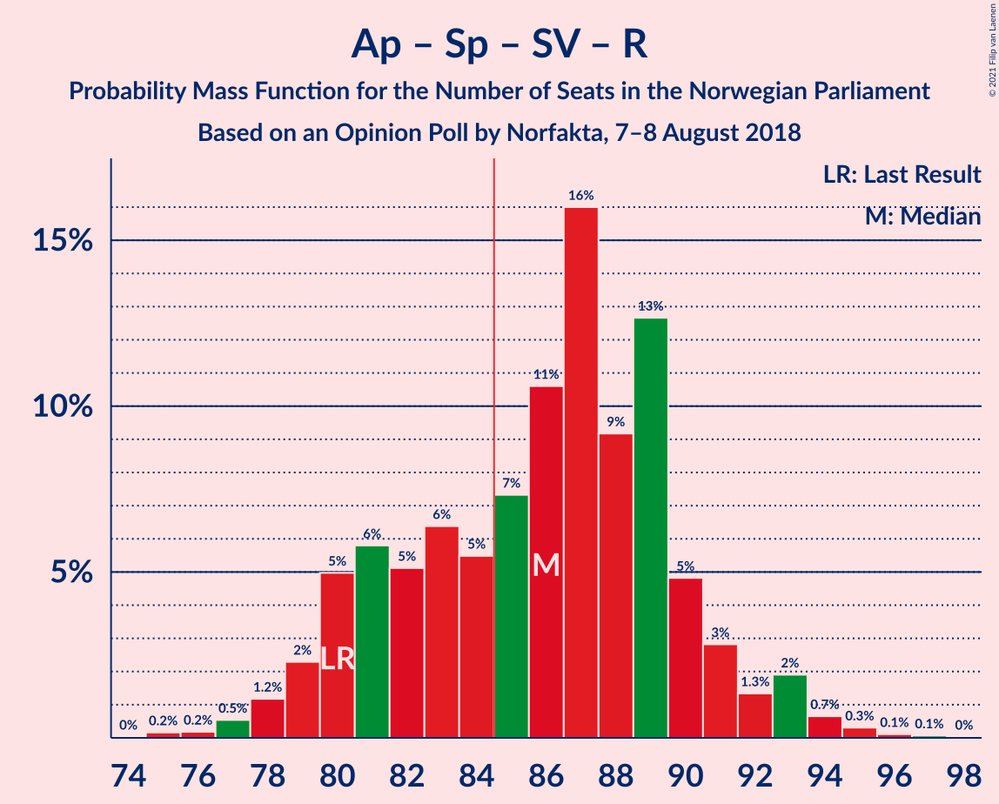

| Number of Seats | Probability | Accumulated | Special Marks |
|:---------------:|:-----------:|:-----------:|:-------------:|
| 75 | 0.2% | 100% |  |
| 76 | 0.2% | 99.8% |  |
| 77 | 0.5% | 99.6% |  |
| 78 | 1.2% | 99.1% |  |
| 79 | 2% | 98% |  |
| 80 | 5% | 96% | Last Result |
| 81 | 6% | 91% |  |
| 82 | 5% | 85% |  |
| 83 | 6% | 80% |  |
| 84 | 5% | 73% | Median |
| 85 | 7% | 68% | Majority |
| 86 | 11% | 61% |  |
| 87 | 16% | 50% |  |
| 88 | 9% | 34% |  |
| 89 | 13% | 25% |  |
| 90 | 5% | 12% |  |
| 91 | 3% | 7% |  |
| 92 | 1.3% | 4% |  |
| 93 | 2% | 3% |  |
| 94 | 0.7% | 1.2% |  |
| 95 | 0.3% | 0.5% |  |
| 96 | 0.1% | 0.2% |  |
| 97 | 0.1% | 0.1% |  |
| 98 | 0% | 0% |  |

### Høyre – Fremskrittspartiet – Venstre – Kristelig Folkeparti – Miljøpartiet De Grønne

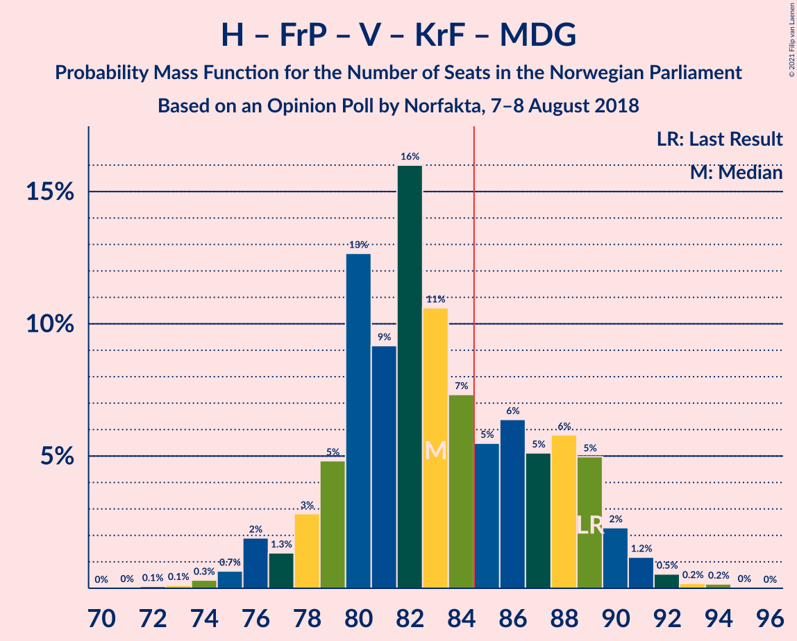

| Number of Seats | Probability | Accumulated | Special Marks |
|:---------------:|:-----------:|:-----------:|:-------------:|
| 72 | 0.1% | 100% |  |
| 73 | 0.1% | 99.9% |  |
| 74 | 0.3% | 99.8% |  |
| 75 | 0.7% | 99.5% |  |
| 76 | 2% | 98.8% |  |
| 77 | 1.3% | 97% |  |
| 78 | 3% | 96% |  |
| 79 | 5% | 93% |  |
| 80 | 13% | 88% |  |
| 81 | 9% | 75% |  |
| 82 | 16% | 66% |  |
| 83 | 11% | 50% | Median |
| 84 | 7% | 39% |  |
| 85 | 5% | 32% | Majority |
| 86 | 6% | 27% |  |
| 87 | 5% | 20% |  |
| 88 | 6% | 15% |  |
| 89 | 5% | 9% | Last Result |
| 90 | 2% | 4% |  |
| 91 | 1.2% | 2% |  |
| 92 | 0.5% | 0.9% |  |
| 93 | 0.2% | 0.4% |  |
| 94 | 0.2% | 0.2% |  |
| 95 | 0% | 0% |  |

### Arbeiderpartiet – Senterpartiet – Sosialistisk Venstreparti – Miljøpartiet De Grønne

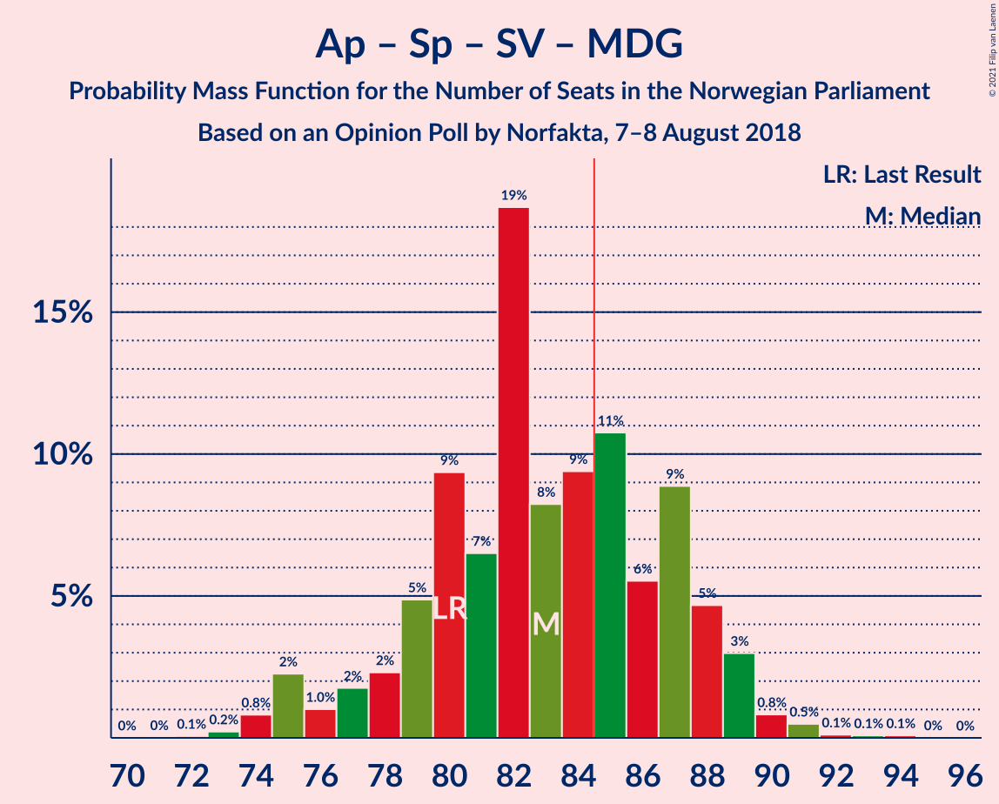

| Number of Seats | Probability | Accumulated | Special Marks |
|:---------------:|:-----------:|:-----------:|:-------------:|
| 72 | 0.1% | 100% |  |
| 73 | 0.2% | 99.9% |  |
| 74 | 0.8% | 99.7% |  |
| 75 | 2% | 98.9% |  |
| 76 | 1.0% | 97% |  |
| 77 | 2% | 96% |  |
| 78 | 2% | 94% |  |
| 79 | 5% | 92% |  |
| 80 | 9% | 87% | Last Result |
| 81 | 7% | 77% |  |
| 82 | 19% | 71% |  |
| 83 | 8% | 52% | Median |
| 84 | 9% | 44% |  |
| 85 | 11% | 34% | Majority |
| 86 | 6% | 24% |  |
| 87 | 9% | 18% |  |
| 88 | 5% | 9% |  |
| 89 | 3% | 5% |  |
| 90 | 0.8% | 2% |  |
| 91 | 0.5% | 0.8% |  |
| 92 | 0.1% | 0.3% |  |
| 93 | 0.1% | 0.2% |  |
| 94 | 0.1% | 0.1% |  |
| 95 | 0% | 0% |  |

### Høyre – Fremskrittspartiet – Venstre – Kristelig Folkeparti

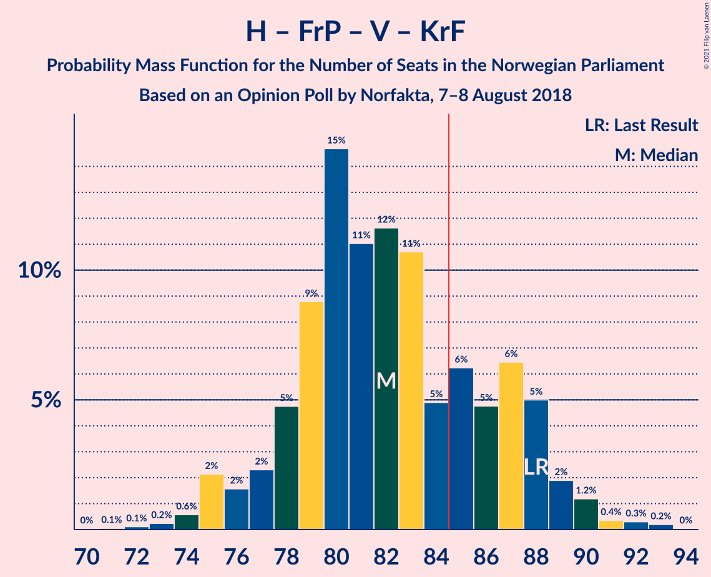

| Number of Seats | Probability | Accumulated | Special Marks |
|:---------------:|:-----------:|:-----------:|:-------------:|
| 71 | 0.1% | 100% |  |
| 72 | 0.1% | 99.9% |  |
| 73 | 0.2% | 99.8% |  |
| 74 | 0.6% | 99.5% |  |
| 75 | 2% | 99.0% |  |
| 76 | 2% | 97% |  |
| 77 | 2% | 95% |  |
| 78 | 5% | 93% |  |
| 79 | 9% | 88% |  |
| 80 | 15% | 79% |  |
| 81 | 11% | 65% |  |
| 82 | 12% | 54% | Median |
| 83 | 11% | 42% |  |
| 84 | 5% | 31% |  |
| 85 | 6% | 26% | Majority |
| 86 | 5% | 20% |  |
| 87 | 6% | 15% |  |
| 88 | 5% | 9% | Last Result |
| 89 | 2% | 4% |  |
| 90 | 1.2% | 2% |  |
| 91 | 0.4% | 0.9% |  |
| 92 | 0.3% | 0.5% |  |
| 93 | 0.2% | 0.2% |  |
| 94 | 0% | 0% |  |

### Arbeiderpartiet – Senterpartiet – Sosialistisk Venstreparti

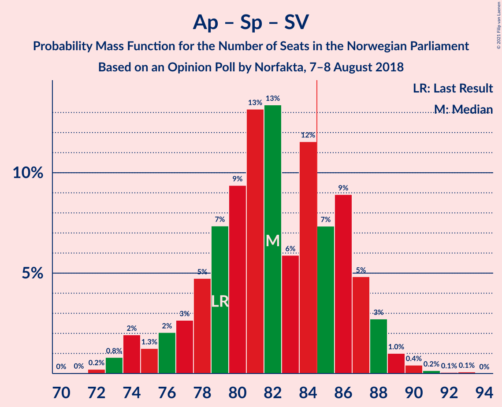

| Number of Seats | Probability | Accumulated | Special Marks |
|:---------------:|:-----------:|:-----------:|:-------------:|
| 71 | 0% | 100% |  |
| 72 | 0.2% | 99.9% |  |
| 73 | 0.8% | 99.7% |  |
| 74 | 2% | 98.9% |  |
| 75 | 1.3% | 97% |  |
| 76 | 2% | 96% |  |
| 77 | 3% | 94% |  |
| 78 | 5% | 91% |  |
| 79 | 7% | 86% | Last Result |
| 80 | 9% | 79% |  |
| 81 | 13% | 70% |  |
| 82 | 13% | 56% | Median |
| 83 | 6% | 43% |  |
| 84 | 12% | 37% |  |
| 85 | 7% | 26% | Majority |
| 86 | 9% | 18% |  |
| 87 | 5% | 9% |  |
| 88 | 3% | 4% |  |
| 89 | 1.0% | 2% |  |
| 90 | 0.4% | 0.7% |  |
| 91 | 0.2% | 0.3% |  |
| 92 | 0.1% | 0.2% |  |
| 93 | 0.1% | 0.1% |  |
| 94 | 0% | 0% |  |

### Arbeiderpartiet – Senterpartiet – Kristelig Folkeparti – Miljøpartiet De Grønne

| Number of Seats | Probability | Accumulated | Special Marks |
|:---------------:|:-----------:|:-----------:|:-------------:|
| 69 | 0.2% | 100% |  |
| 70 | 0.1% | 99.8% |  |
| 71 | 0.2% | 99.7% |  |
| 72 | 1.1% | 99.5% |  |
| 73 | 2% | 98% |  |
| 74 | 1.3% | 96% |  |
| 75 | 2% | 95% |  |
| 76 | 3% | 93% |  |
| 77 | 4% | 90% | Last Result |
| 78 | 5% | 86% |  |
| 79 | 12% | 81% |  |
| 80 | 11% | 69% |  |
| 81 | 13% | 58% | Median |
| 82 | 12% | 45% |  |
| 83 | 6% | 33% |  |
| 84 | 9% | 27% |  |
| 85 | 9% | 18% | Majority |
| 86 | 7% | 10% |  |
| 87 | 2% | 3% |  |
| 88 | 0.3% | 1.4% |  |
| 89 | 0.8% | 1.0% |  |
| 90 | 0.1% | 0.2% |  |
| 91 | 0.1% | 0.1% |  |
| 92 | 0.1% | 0.1% |  |
| 93 | 0% | 0% |  |

### Arbeiderpartiet – Senterpartiet – Kristelig Folkeparti

| Number of Seats | Probability | Accumulated | Special Marks |
|:---------------:|:-----------:|:-----------:|:-------------:|
| 68 | 0.2% | 100% |  |
| 69 | 0.1% | 99.8% |  |
| 70 | 0.1% | 99.7% |  |
| 71 | 1.1% | 99.5% |  |
| 72 | 2% | 98% |  |
| 73 | 1.5% | 96% |  |
| 74 | 2% | 95% |  |
| 75 | 3% | 92% |  |
| 76 | 4% | 90% | Last Result |
| 77 | 5% | 86% |  |
| 78 | 8% | 81% |  |
| 79 | 16% | 73% |  |
| 80 | 13% | 57% | Median |
| 81 | 11% | 45% |  |
| 82 | 5% | 33% |  |
| 83 | 5% | 28% |  |
| 84 | 13% | 23% |  |
| 85 | 6% | 9% | Majority |
| 86 | 2% | 3% |  |
| 87 | 0.4% | 1.4% |  |
| 88 | 0.7% | 1.0% |  |
| 89 | 0.1% | 0.2% |  |
| 90 | 0.1% | 0.1% |  |
| 91 | 0% | 0.1% |  |
| 92 | 0% | 0% |  |

### Høyre – Fremskrittspartiet – Venstre

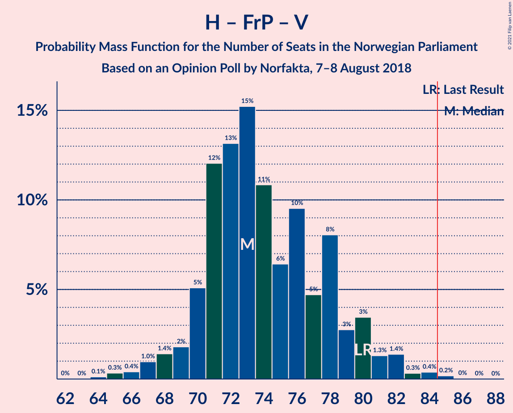

| Number of Seats | Probability | Accumulated | Special Marks |
|:---------------:|:-----------:|:-----------:|:-------------:|
| 64 | 0.1% | 100% |  |
| 65 | 0.3% | 99.8% |  |
| 66 | 0.4% | 99.5% |  |
| 67 | 1.0% | 99.1% |  |
| 68 | 1.4% | 98% |  |
| 69 | 2% | 97% |  |
| 70 | 5% | 95% |  |
| 71 | 12% | 90% |  |
| 72 | 13% | 78% |  |
| 73 | 15% | 65% |  |
| 74 | 11% | 49% | Median |
| 75 | 6% | 39% |  |
| 76 | 10% | 32% |  |
| 77 | 5% | 23% |  |
| 78 | 8% | 18% |  |
| 79 | 3% | 10% |  |
| 80 | 3% | 7% | Last Result |
| 81 | 1.3% | 4% |  |
| 82 | 1.4% | 2% |  |
| 83 | 0.3% | 0.9% |  |
| 84 | 0.4% | 0.6% |  |
| 85 | 0.2% | 0.2% | Majority |
| 86 | 0% | 0.1% |  |
| 87 | 0% | 0% |  |

### Arbeiderpartiet – Senterpartiet

| Number of Seats | Probability | Accumulated | Special Marks |
|:---------------:|:-----------:|:-----------:|:-------------:|
| 62 | 0.1% | 100% |  |
| 63 | 0.4% | 99.9% |  |
| 64 | 1.1% | 99.5% |  |
| 65 | 3% | 98% |  |
| 66 | 2% | 95% |  |
| 67 | 4% | 94% |  |
| 68 | 5% | 90% | Last Result |
| 69 | 7% | 85% |  |
| 70 | 8% | 77% |  |
| 71 | 11% | 70% |  |
| 72 | 15% | 58% | Median |
| 73 | 10% | 43% |  |
| 74 | 7% | 33% |  |
| 75 | 14% | 27% |  |
| 76 | 4% | 13% |  |
| 77 | 6% | 9% |  |
| 78 | 2% | 3% |  |
| 79 | 0.8% | 1.1% |  |
| 80 | 0.1% | 0.4% |  |
| 81 | 0.1% | 0.2% |  |
| 82 | 0.1% | 0.1% |  |
| 83 | 0% | 0% |  |

### Arbeiderpartiet – Sosialistisk Venstreparti – Rødt – Miljøpartiet De Grønne

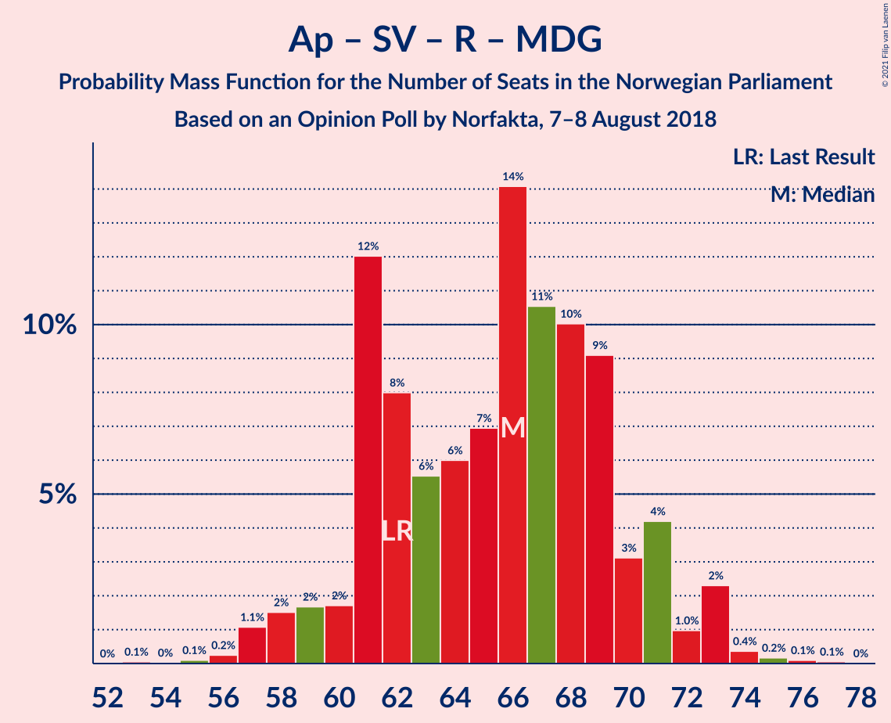

| Number of Seats | Probability | Accumulated | Special Marks |
|:---------------:|:-----------:|:-----------:|:-------------:|
| 53 | 0.1% | 100% |  |
| 54 | 0% | 99.9% |  |
| 55 | 0.1% | 99.9% |  |
| 56 | 0.2% | 99.8% |  |
| 57 | 1.1% | 99.6% |  |
| 58 | 2% | 98% |  |
| 59 | 2% | 97% |  |
| 60 | 2% | 95% |  |
| 61 | 12% | 94% |  |
| 62 | 8% | 82% | Last Result |
| 63 | 6% | 74% |  |
| 64 | 6% | 68% | Median |
| 65 | 7% | 62% |  |
| 66 | 14% | 55% |  |
| 67 | 11% | 41% |  |
| 68 | 10% | 30% |  |
| 69 | 9% | 20% |  |
| 70 | 3% | 11% |  |
| 71 | 4% | 8% |  |
| 72 | 1.0% | 4% |  |
| 73 | 2% | 3% |  |
| 74 | 0.4% | 0.7% |  |
| 75 | 0.2% | 0.3% |  |
| 76 | 0.1% | 0.2% |  |
| 77 | 0.1% | 0.1% |  |
| 78 | 0% | 0% |  |

### Høyre – Fremskrittspartiet

| Number of Seats | Probability | Accumulated | Special Marks |
|:---------------:|:-----------:|:-----------:|:-------------:|
| 56 | 0.3% | 100% |  |
| 57 | 0.1% | 99.7% |  |
| 58 | 0.9% | 99.6% |  |
| 59 | 1.3% | 98.7% |  |
| 60 | 2% | 97% |  |
| 61 | 7% | 96% |  |
| 62 | 6% | 88% |  |
| 63 | 9% | 83% |  |
| 64 | 19% | 73% |  |
| 65 | 8% | 55% | Median |
| 66 | 15% | 47% |  |
| 67 | 7% | 32% |  |
| 68 | 9% | 25% |  |
| 69 | 4% | 16% |  |
| 70 | 5% | 12% |  |
| 71 | 4% | 7% |  |
| 72 | 1.2% | 3% | Last Result |
| 73 | 1.5% | 2% |  |
| 74 | 0.3% | 0.7% |  |
| 75 | 0.2% | 0.3% |  |
| 76 | 0.1% | 0.1% |  |
| 77 | 0% | 0% |  |

### Arbeiderpartiet – Sosialistisk Venstreparti

| Number of Seats | Probability | Accumulated | Special Marks |
|:---------------:|:-----------:|:-----------:|:-------------:|
| 50 | 0.1% | 100% |  |
| 51 | 0.1% | 99.9% |  |
| 52 | 0.2% | 99.8% |  |
| 53 | 0.5% | 99.6% |  |
| 54 | 3% | 99.1% |  |
| 55 | 2% | 96% |  |
| 56 | 2% | 93% |  |
| 57 | 5% | 91% |  |
| 58 | 15% | 86% |  |
| 59 | 9% | 71% |  |
| 60 | 9% | 62% | Last Result |
| 61 | 10% | 53% | Median |
| 62 | 10% | 43% |  |
| 63 | 6% | 33% |  |
| 64 | 14% | 27% |  |
| 65 | 10% | 13% |  |
| 66 | 1.5% | 3% |  |
| 67 | 0.6% | 2% |  |
| 68 | 0.7% | 0.9% |  |
| 69 | 0.1% | 0.2% |  |
| 70 | 0% | 0.1% |  |
| 71 | 0.1% | 0.1% |  |
| 72 | 0% | 0% |  |

### Høyre – Venstre – Kristelig Folkeparti

| Number of Seats | Probability | Accumulated | Special Marks |
|:---------------:|:-----------:|:-----------:|:-------------:|
| 48 | 0.1% | 100% |  |
| 49 | 0.1% | 99.9% |  |
| 50 | 0.1% | 99.8% |  |
| 51 | 0.5% | 99.7% |  |
| 52 | 1.3% | 99.2% |  |
| 53 | 0.6% | 98% |  |
| 54 | 1.4% | 97% |  |
| 55 | 6% | 96% |  |
| 56 | 7% | 90% |  |
| 57 | 9% | 82% |  |
| 58 | 15% | 74% |  |
| 59 | 11% | 58% | Median |
| 60 | 7% | 47% |  |
| 61 | 11% | 40% | Last Result |
| 62 | 10% | 30% |  |
| 63 | 7% | 19% |  |
| 64 | 8% | 12% |  |
| 65 | 2% | 4% |  |
| 66 | 0.9% | 3% |  |
| 67 | 0.4% | 2% |  |
| 68 | 0.5% | 1.4% |  |
| 69 | 0.5% | 0.9% |  |
| 70 | 0.3% | 0.4% |  |
| 71 | 0.1% | 0.1% |  |
| 72 | 0% | 0% |  |

### Senterpartiet – Venstre – Kristelig Folkeparti

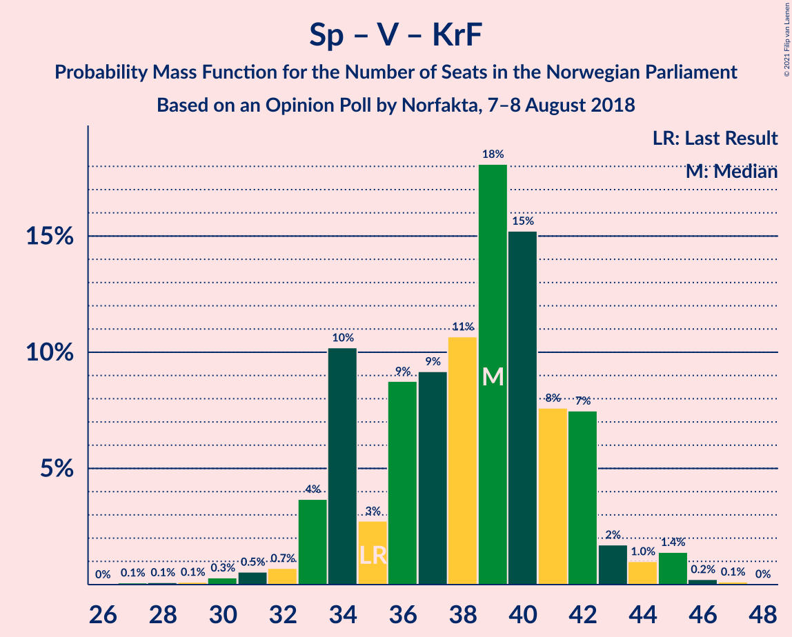

| Number of Seats | Probability | Accumulated | Special Marks |
|:---------------:|:-----------:|:-----------:|:-------------:|
| 27 | 0.1% | 100% |  |
| 28 | 0.1% | 99.9% |  |
| 29 | 0.1% | 99.8% |  |
| 30 | 0.3% | 99.7% |  |
| 31 | 0.5% | 99.4% |  |
| 32 | 0.7% | 98.8% |  |
| 33 | 4% | 98% |  |
| 34 | 10% | 94% |  |
| 35 | 3% | 84% | Last Result |
| 36 | 9% | 82% |  |
| 37 | 9% | 73% |  |
| 38 | 11% | 64% | Median |
| 39 | 18% | 53% |  |
| 40 | 15% | 35% |  |
| 41 | 8% | 20% |  |
| 42 | 7% | 12% |  |
| 43 | 2% | 4% |  |
| 44 | 1.0% | 3% |  |
| 45 | 1.4% | 2% |  |
| 46 | 0.2% | 0.4% |  |
| 47 | 0.1% | 0.2% |  |
| 48 | 0% | 0% |  |

## Technical Information

### Opinion Poll

+ **Polling firm:** Norfakta
+ **Commissioner(s):** —
+ **Fieldwork period:** 7–8 August 2018

### Calculations

+ **Sample size:** 1003
+ **Simulations done:** 1,048,576
+ **Error estimate:** 1.16%

