# Opinion Poll by Ipsos MMI, 20–25 August 2018

<a href="#voting-intentions">Voting Intentions</a> | <a href="#seats">Seats</a> | <a href="#coalitions">Coalitions</a> | <a href="#technical-information">Technical Information</a>

## Voting Intentions

### Confidence Intervals

| Party | Last Result | Poll Result | 80% Confidence Interval | 90% Confidence Interval | 95% Confidence Interval | 99% Confidence Interval |
|:-----:|:-----------:|:-----------:|:-----------------------:|:-----------------------:|:-----------------------:|:-----------------------:|
| Arbeiderpartiet | 27.4% | 28.5% | 26.7–30.5% |26.2–31.0% |25.7–31.5% |24.9–32.4% |
| Høyre | 25.0% | 24.8% | 23.1–26.7% |22.6–27.2% |22.2–27.7% |21.3–28.6% |
| Fremskrittspartiet | 15.2% | 13.0% | 11.7–14.6% |11.4–15.0% |11.0–15.3% |10.4–16.1% |
| Senterpartiet | 10.3% | 11.5% | 10.2–12.9% |9.9–13.3% |9.6–13.7% |9.0–14.4% |
| Sosialistisk Venstreparti | 6.0% | 6.0% | 5.2–7.2% |4.9–7.5% |4.7–7.8% |4.3–8.3% |
| Venstre | 4.4% | 3.9% | 3.2–4.9% |3.0–5.1% |2.9–5.4% |2.5–5.9% |
| Rødt | 2.4% | 3.7% | 3.0–4.6% |2.8–4.9% |2.7–5.1% |2.4–5.6% |
| Kristelig Folkeparti | 4.2% | 3.3% | 2.7–4.2% |2.5–4.4% |2.3–4.6% |2.1–5.1% |
| Miljøpartiet De Grønne | 3.2% | 3.2% | 2.6–4.1% |2.4–4.3% |2.2–4.5% |2.0–5.0% |

*Note:* The poll result column reflects the actual value used in the calculations. Published results may vary slightly, and in addition be rounded to fewer digits.

## Seats

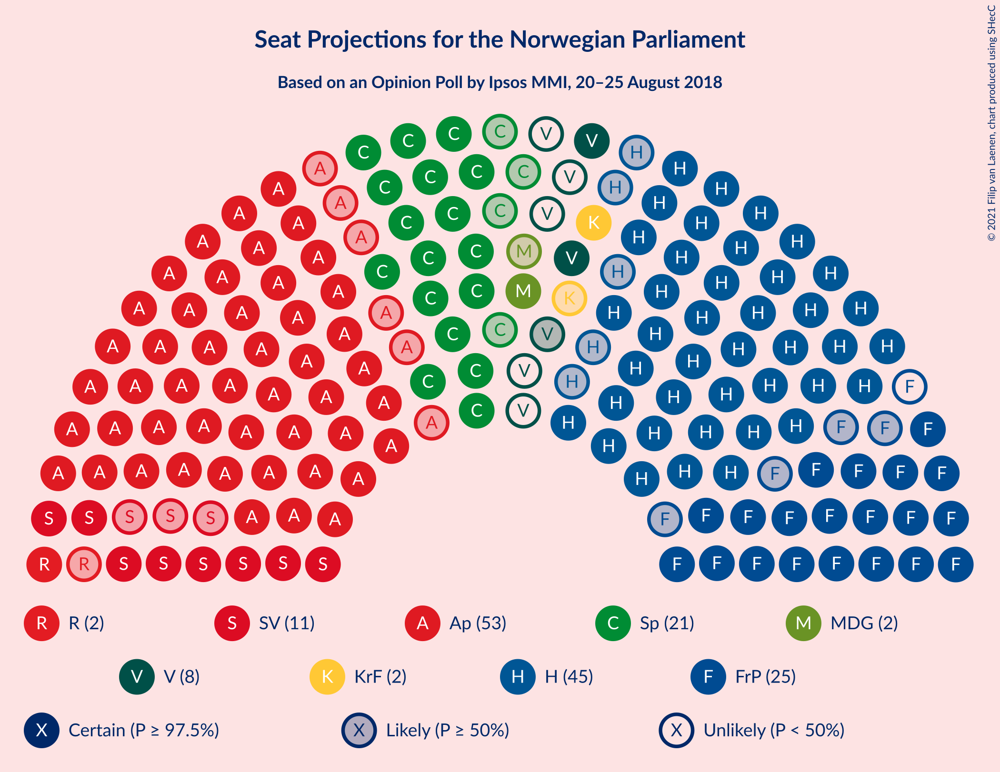

### Confidence Intervals

| Party | Last Result | Median | 80% Confidence Interval | 90% Confidence Interval | 95% Confidence Interval | 99% Confidence Interval |
|:-----:|:-----------:|:------:|:-----------------------:|:-----------------------:|:-----------------------:|:-----------------------:|
| <a href="#arbeiderpartiet">Arbeiderpartiet</a> | 49 | 53 | 49–57 |48–58 |47–60 |45–61 |
| <a href="#høyre">Høyre</a> | 45 | 45 | 42–50 |41–51 |40–52 |38–54 |
| <a href="#fremskrittspartiet">Fremskrittspartiet</a> | 27 | 24 | 21–27 |20–28 |20–29 |18–30 |
| <a href="#senterpartiet">Senterpartiet</a> | 19 | 21 | 18–24 |18–25 |17–25 |16–27 |
| <a href="#sosialistisk-venstreparti">Sosialistisk Venstreparti</a> | 11 | 11 | 10–13 |9–14 |8–14 |8–15 |
| <a href="#venstre">Venstre</a> | 8 | 3 | 2–9 |2–9 |2–10 |2–11 |
| <a href="#rødt">Rødt</a> | 1 | 2 | 2–8 |1–9 |1–9 |1–10 |
| <a href="#kristelig-folkeparti">Kristelig Folkeparti</a> | 8 | 2 | 1–7 |1–8 |1–8 |0–9 |
| <a href="#miljøpartiet-de-grønne">Miljøpartiet De Grønne</a> | 1 | 2 | 1–7 |1–8 |1–8 |1–9 |

### Arbeiderpartiet

*For a full overview of the results for this party, see the [Arbeiderpartiet](party-arbeiderpartiet.html) page.*

| Number of Seats | Probability | Accumulated | Special Marks |
|:---------------:|:-----------:|:-----------:|:-------------:|
| 43 | 0.1% | 100% |  |
| 44 | 0.2% | 99.8% |  |
| 45 | 0.6% | 99.7% |  |
| 46 | 0.8% | 99.1% |  |
| 47 | 3% | 98% |  |
| 48 | 5% | 96% |  |
| 49 | 4% | 91% | Last Result |
| 50 | 10% | 87% |  |
| 51 | 10% | 77% |  |
| 52 | 10% | 66% |  |
| 53 | 10% | 57% | Median |
| 54 | 13% | 46% |  |
| 55 | 8% | 34% |  |
| 56 | 12% | 26% |  |
| 57 | 6% | 14% |  |
| 58 | 5% | 8% |  |
| 59 | 1.1% | 4% |  |
| 60 | 2% | 3% |  |
| 61 | 0.3% | 0.6% |  |
| 62 | 0.2% | 0.3% |  |
| 63 | 0.1% | 0.1% |  |
| 64 | 0% | 0% |  |

### Høyre

*For a full overview of the results for this party, see the [Høyre](party-høyre.html) page.*

| Number of Seats | Probability | Accumulated | Special Marks |
|:---------------:|:-----------:|:-----------:|:-------------:|
| 37 | 0.1% | 100% |  |
| 38 | 0.5% | 99.9% |  |
| 39 | 1.1% | 99.3% |  |
| 40 | 2% | 98% |  |
| 41 | 5% | 96% |  |
| 42 | 5% | 91% |  |
| 43 | 17% | 86% |  |
| 44 | 9% | 69% |  |
| 45 | 15% | 61% | Last Result, Median |
| 46 | 9% | 46% |  |
| 47 | 6% | 37% |  |
| 48 | 15% | 31% |  |
| 49 | 6% | 16% |  |
| 50 | 4% | 10% |  |
| 51 | 2% | 6% |  |
| 52 | 1.5% | 3% |  |
| 53 | 1.3% | 2% |  |
| 54 | 0.6% | 0.7% |  |
| 55 | 0.1% | 0.1% |  |
| 56 | 0% | 0% |  |

### Fremskrittspartiet

*For a full overview of the results for this party, see the [Fremskrittspartiet](party-fremskrittspartiet.html) page.*

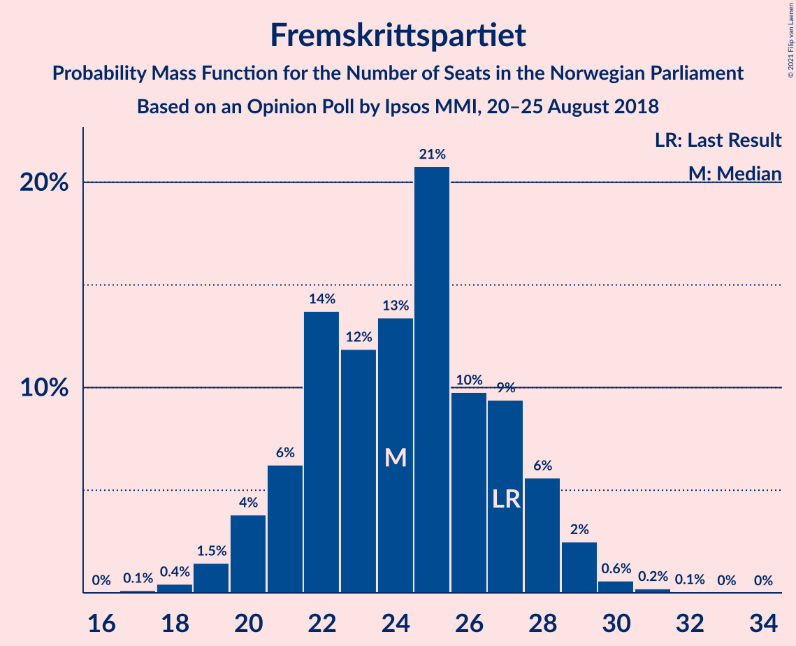

| Number of Seats | Probability | Accumulated | Special Marks |
|:---------------:|:-----------:|:-----------:|:-------------:|
| 17 | 0.1% | 100% |  |
| 18 | 0.4% | 99.9% |  |
| 19 | 1.5% | 99.4% |  |
| 20 | 4% | 98% |  |
| 21 | 6% | 94% |  |
| 22 | 14% | 88% |  |
| 23 | 12% | 74% |  |
| 24 | 13% | 62% | Median |
| 25 | 21% | 49% |  |
| 26 | 10% | 28% |  |
| 27 | 9% | 18% | Last Result |
| 28 | 6% | 9% |  |
| 29 | 2% | 3% |  |
| 30 | 0.6% | 0.9% |  |
| 31 | 0.2% | 0.3% |  |
| 32 | 0.1% | 0.1% |  |
| 33 | 0% | 0% |  |

### Senterpartiet

*For a full overview of the results for this party, see the [Senterpartiet](party-senterpartiet.html) page.*

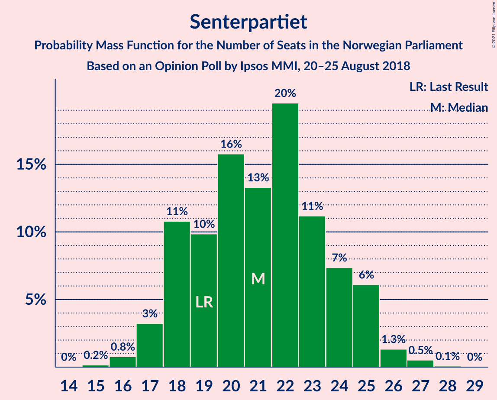

| Number of Seats | Probability | Accumulated | Special Marks |
|:---------------:|:-----------:|:-----------:|:-------------:|
| 15 | 0.2% | 100% |  |
| 16 | 0.8% | 99.8% |  |
| 17 | 3% | 99.1% |  |
| 18 | 11% | 96% |  |
| 19 | 10% | 85% | Last Result |
| 20 | 16% | 75% |  |
| 21 | 13% | 59% | Median |
| 22 | 20% | 46% |  |
| 23 | 11% | 27% |  |
| 24 | 7% | 15% |  |
| 25 | 6% | 8% |  |
| 26 | 1.3% | 2% |  |
| 27 | 0.5% | 0.6% |  |
| 28 | 0.1% | 0.1% |  |
| 29 | 0% | 0% |  |

### Sosialistisk Venstreparti

*For a full overview of the results for this party, see the [Sosialistisk Venstreparti](party-sosialistiskvenstreparti.html) page.*

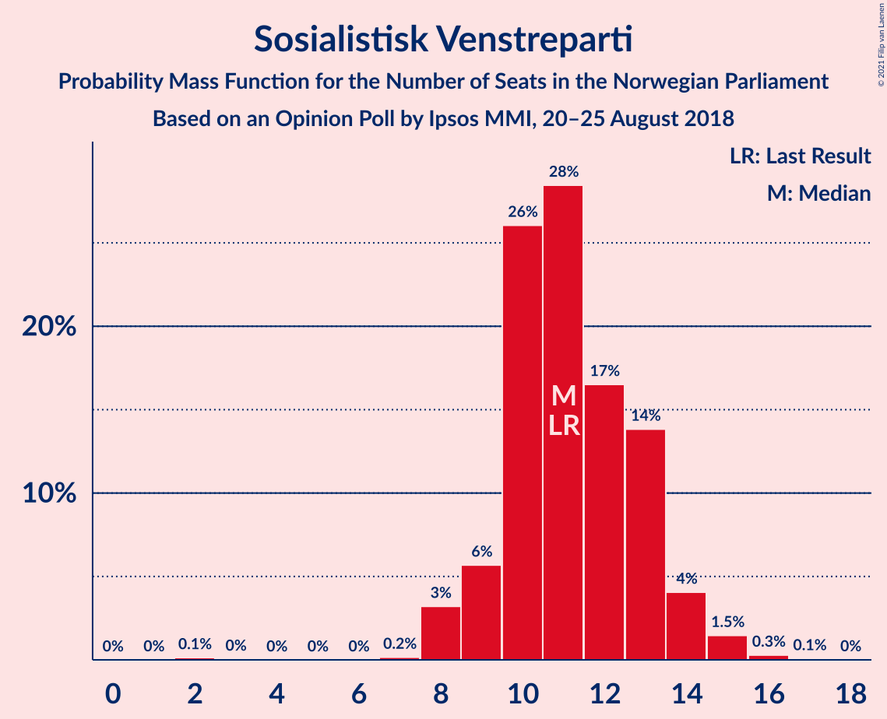

| Number of Seats | Probability | Accumulated | Special Marks |
|:---------------:|:-----------:|:-----------:|:-------------:|
| 2 | 0.1% | 100% |  |
| 3 | 0% | 99.9% |  |
| 4 | 0% | 99.8% |  |
| 5 | 0% | 99.8% |  |
| 6 | 0% | 99.8% |  |
| 7 | 0.2% | 99.8% |  |
| 8 | 3% | 99.7% |  |
| 9 | 6% | 96% |  |
| 10 | 26% | 91% |  |
| 11 | 28% | 65% | Last Result, Median |
| 12 | 17% | 36% |  |
| 13 | 14% | 20% |  |
| 14 | 4% | 6% |  |
| 15 | 1.5% | 2% |  |
| 16 | 0.3% | 0.4% |  |
| 17 | 0.1% | 0.1% |  |
| 18 | 0% | 0% |  |

### Venstre

*For a full overview of the results for this party, see the [Venstre](party-venstre.html) page.*

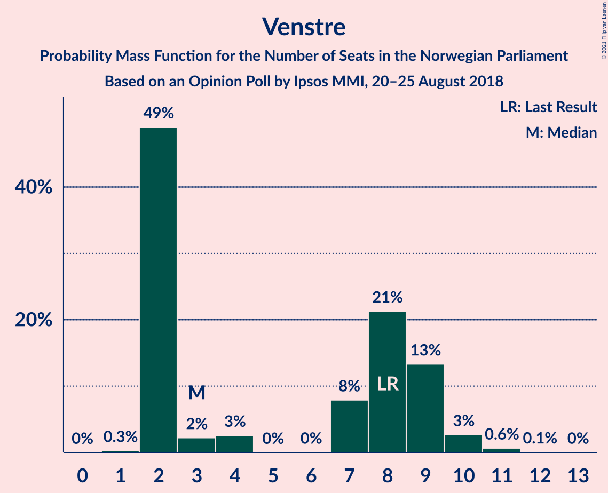

| Number of Seats | Probability | Accumulated | Special Marks |
|:---------------:|:-----------:|:-----------:|:-------------:|
| 1 | 0.3% | 100% |  |
| 2 | 49% | 99.7% |  |
| 3 | 2% | 51% | Median |
| 4 | 3% | 48% |  |
| 5 | 0% | 46% |  |
| 6 | 0% | 46% |  |
| 7 | 8% | 46% |  |
| 8 | 21% | 38% | Last Result |
| 9 | 13% | 17% |  |
| 10 | 3% | 3% |  |
| 11 | 0.6% | 0.7% |  |
| 12 | 0.1% | 0.1% |  |
| 13 | 0% | 0% |  |

### Rødt

*For a full overview of the results for this party, see the [Rødt](party-rødt.html) page.*

| Number of Seats | Probability | Accumulated | Special Marks |
|:---------------:|:-----------:|:-----------:|:-------------:|
| 1 | 9% | 100% | Last Result |
| 2 | 60% | 91% | Median |
| 3 | 0% | 31% |  |
| 4 | 0% | 31% |  |
| 5 | 0% | 31% |  |
| 6 | 0% | 31% |  |
| 7 | 5% | 31% |  |
| 8 | 18% | 27% |  |
| 9 | 6% | 8% |  |
| 10 | 2% | 2% |  |
| 11 | 0.3% | 0.3% |  |
| 12 | 0% | 0% |  |

### Kristelig Folkeparti

*For a full overview of the results for this party, see the [Kristelig Folkeparti](party-kristeligfolkeparti.html) page.*

| Number of Seats | Probability | Accumulated | Special Marks |
|:---------------:|:-----------:|:-----------:|:-------------:|
| 0 | 1.4% | 100% |  |
| 1 | 33% | 98.6% |  |
| 2 | 21% | 66% | Median |
| 3 | 31% | 45% |  |
| 4 | 0% | 14% |  |
| 5 | 0% | 14% |  |
| 6 | 0.1% | 14% |  |
| 7 | 5% | 14% |  |
| 8 | 7% | 9% | Last Result |
| 9 | 2% | 2% |  |
| 10 | 0.3% | 0.3% |  |
| 11 | 0% | 0% |  |

### Miljøpartiet De Grønne

*For a full overview of the results for this party, see the [Miljøpartiet De Grønne](party-miljøpartietdegrønne.html) page.*

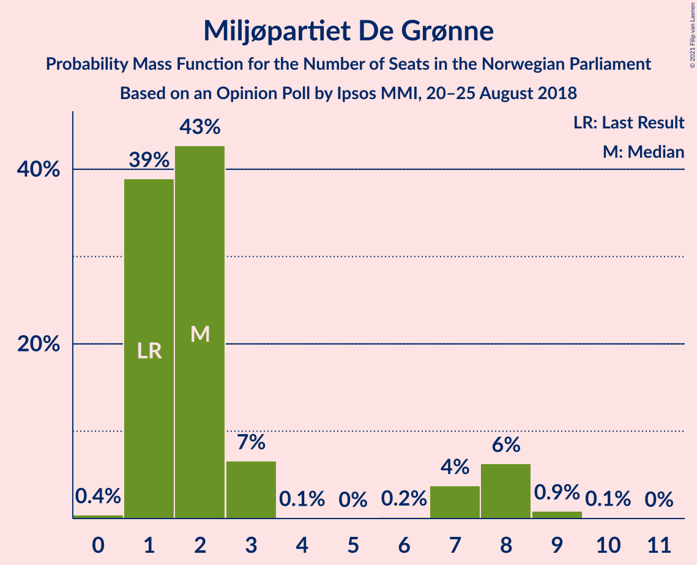

| Number of Seats | Probability | Accumulated | Special Marks |
|:---------------:|:-----------:|:-----------:|:-------------:|
| 0 | 0.4% | 100% |  |
| 1 | 39% | 99.6% | Last Result |
| 2 | 43% | 61% | Median |
| 3 | 7% | 18% |  |
| 4 | 0.1% | 11% |  |
| 5 | 0% | 11% |  |
| 6 | 0.2% | 11% |  |
| 7 | 4% | 11% |  |
| 8 | 6% | 7% |  |
| 9 | 0.9% | 1.0% |  |
| 10 | 0.1% | 0.1% |  |
| 11 | 0% | 0% |  |

## Coalitions

### Confidence Intervals

| Coalition | Last Result | Median | Majority? | 80% Confidence Interval | 90% Confidence Interval | 95% Confidence Interval | 99% Confidence Interval |
|:---------:|:-----------:|:------:|:---------:|:-----------------------:|:-----------------------:|:-----------------------:|:-----------------------:|
| Høyre – Fremskrittspartiet – Senterpartiet – Venstre – Kristelig Folkeparti | 107 | 98 | 100% | 93–104 | 92–105 | 90–106 | 88–108 |
| Arbeiderpartiet – Senterpartiet – Sosialistisk Venstreparti – Rødt – Miljøpartiet De Grønne | 81 | 92 | 96% | 85–97 | 85–98 | 84–99 | 82–102 |
| Arbeiderpartiet – Senterpartiet – Sosialistisk Venstreparti – Kristelig Folkeparti – Miljøpartiet De Grønne | 88 | 90 | 94% | 85–96 | 84–97 | 82–98 | 80–100 |
| Arbeiderpartiet – Senterpartiet – Sosialistisk Venstreparti – Rødt | 80 | 89 | 83% | 83–95 | 83–96 | 82–97 | 80–99 |
| Arbeiderpartiet – Senterpartiet – Sosialistisk Venstreparti – Miljøpartiet De Grønne | 80 | 88 | 77% | 83–93 | 81–94 | 79–95 | 77–98 |
| Arbeiderpartiet – Senterpartiet – Sosialistisk Venstreparti | 79 | 86 | 59% | 80–91 | 78–92 | 77–92 | 75–96 |
| Arbeiderpartiet – Senterpartiet – Kristelig Folkeparti – Miljøpartiet De Grønne | 77 | 79 | 10% | 74–84 | 73–86 | 72–87 | 69–89 |
| Høyre – Fremskrittspartiet – Venstre – Kristelig Folkeparti – Miljøpartiet De Grønne | 89 | 80 | 17% | 74–86 | 73–86 | 72–87 | 70–89 |
| Høyre – Fremskrittspartiet – Venstre – Kristelig Folkeparti | 88 | 77 | 4% | 72–84 | 71–84 | 70–85 | 67–87 |
| Arbeiderpartiet – Senterpartiet – Kristelig Folkeparti | 76 | 78 | 3% | 72–82 | 70–83 | 69–85 | 67–86 |
| Høyre – Fremskrittspartiet – Venstre | 80 | 74 | 0.3% | 70–81 | 68–82 | 67–83 | 64–84 |
| Arbeiderpartiet – Senterpartiet | 68 | 74 | 0.1% | 69–79 | 67–81 | 67–82 | 64–83 |
| Arbeiderpartiet – Sosialistisk Venstreparti – Rødt – Miljøpartiet De Grønne | 62 | 71 | 0% | 65–76 | 64–77 | 63–79 | 61–81 |
| Høyre – Fremskrittspartiet | 72 | 70 | 0% | 65–74 | 63–76 | 62–78 | 60–80 |
| Arbeiderpartiet – Sosialistisk Venstreparti | 60 | 64 | 0% | 60–68 | 58–70 | 57–71 | 55–73 |
| Høyre – Venstre – Kristelig Folkeparti | 61 | 53 | 0% | 48–59 | 47–60 | 46–60 | 44–63 |
| Senterpartiet – Venstre – Kristelig Folkeparti | 35 | 29 | 0% | 23–34 | 23–36 | 22–37 | 21–39 |

### Høyre – Fremskrittspartiet – Senterpartiet – Venstre – Kristelig Folkeparti

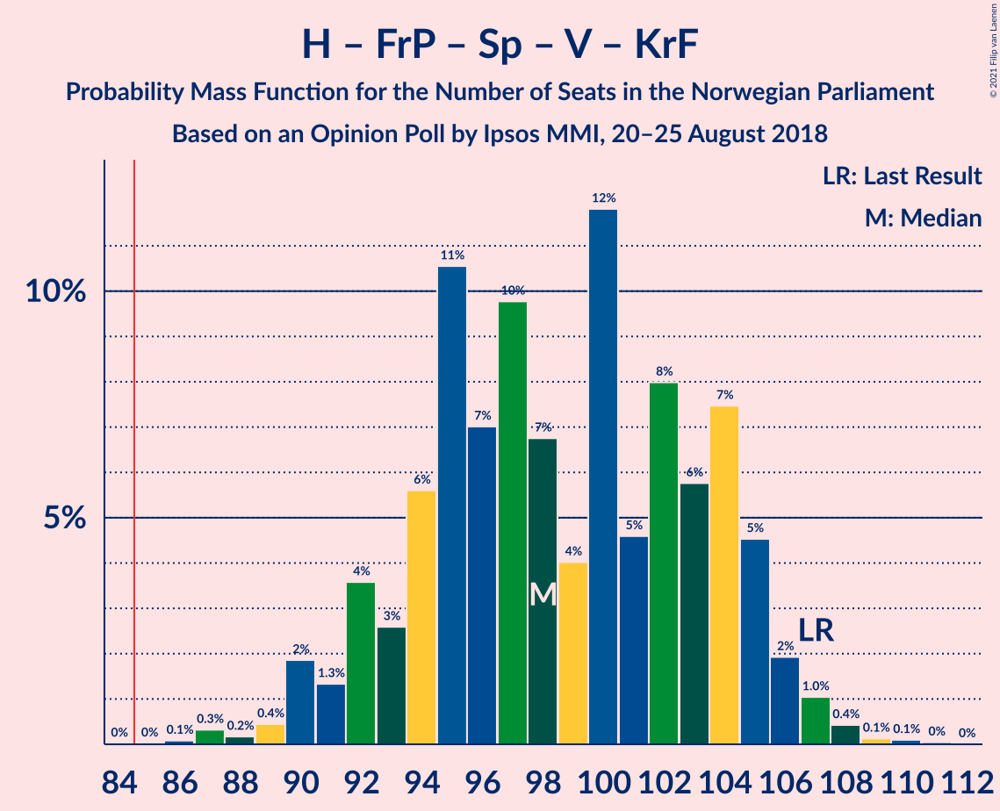

| Number of Seats | Probability | Accumulated | Special Marks |
|:---------------:|:-----------:|:-----------:|:-------------:|
| 86 | 0.1% | 100% |  |
| 87 | 0.3% | 99.9% |  |
| 88 | 0.2% | 99.6% |  |
| 89 | 0.4% | 99.4% |  |
| 90 | 2% | 98.9% |  |
| 91 | 1.3% | 97% |  |
| 92 | 4% | 96% |  |
| 93 | 3% | 92% |  |
| 94 | 6% | 90% |  |
| 95 | 11% | 84% | Median |
| 96 | 7% | 73% |  |
| 97 | 10% | 66% |  |
| 98 | 7% | 57% |  |
| 99 | 4% | 50% |  |
| 100 | 12% | 46% |  |
| 101 | 5% | 34% |  |
| 102 | 8% | 29% |  |
| 103 | 6% | 21% |  |
| 104 | 7% | 16% |  |
| 105 | 5% | 8% |  |
| 106 | 2% | 4% |  |
| 107 | 1.0% | 2% | Last Result |
| 108 | 0.4% | 0.7% |  |
| 109 | 0.1% | 0.3% |  |
| 110 | 0.1% | 0.2% |  |
| 111 | 0% | 0.1% |  |
| 112 | 0% | 0% |  |

### Arbeiderpartiet – Senterpartiet – Sosialistisk Venstreparti – Rødt – Miljøpartiet De Grønne

| Number of Seats | Probability | Accumulated | Special Marks |
|:---------------:|:-----------:|:-----------:|:-------------:|
| 79 | 0.1% | 100% |  |
| 80 | 0.1% | 99.9% |  |
| 81 | 0.1% | 99.8% | Last Result |
| 82 | 0.3% | 99.8% |  |
| 83 | 0.8% | 99.5% |  |
| 84 | 3% | 98.7% |  |
| 85 | 7% | 96% | Majority |
| 86 | 4% | 89% |  |
| 87 | 9% | 85% |  |
| 88 | 6% | 76% |  |
| 89 | 6% | 71% | Median |
| 90 | 6% | 64% |  |
| 91 | 7% | 58% |  |
| 92 | 7% | 51% |  |
| 93 | 7% | 44% |  |
| 94 | 9% | 38% |  |
| 95 | 8% | 29% |  |
| 96 | 9% | 21% |  |
| 97 | 4% | 12% |  |
| 98 | 4% | 8% |  |
| 99 | 2% | 4% |  |
| 100 | 0.7% | 2% |  |
| 101 | 0.5% | 1.1% |  |
| 102 | 0.4% | 0.6% |  |
| 103 | 0.1% | 0.3% |  |
| 104 | 0.1% | 0.1% |  |
| 105 | 0% | 0% |  |

### Arbeiderpartiet – Senterpartiet – Sosialistisk Venstreparti – Kristelig Folkeparti – Miljøpartiet De Grønne

| Number of Seats | Probability | Accumulated | Special Marks |
|:---------------:|:-----------:|:-----------:|:-------------:|
| 78 | 0% | 100% |  |
| 79 | 0.1% | 99.9% |  |
| 80 | 0.3% | 99.8% |  |
| 81 | 1.1% | 99.5% |  |
| 82 | 0.9% | 98% |  |
| 83 | 1.4% | 97% |  |
| 84 | 2% | 96% |  |
| 85 | 5% | 94% | Majority |
| 86 | 7% | 89% |  |
| 87 | 6% | 82% |  |
| 88 | 9% | 76% | Last Result |
| 89 | 5% | 67% | Median |
| 90 | 12% | 62% |  |
| 91 | 9% | 49% |  |
| 92 | 8% | 41% |  |
| 93 | 13% | 33% |  |
| 94 | 5% | 20% |  |
| 95 | 5% | 15% |  |
| 96 | 4% | 10% |  |
| 97 | 3% | 6% |  |
| 98 | 2% | 3% |  |
| 99 | 0.5% | 2% |  |
| 100 | 0.6% | 1.0% |  |
| 101 | 0.1% | 0.4% |  |
| 102 | 0.1% | 0.3% |  |
| 103 | 0.1% | 0.2% |  |
| 104 | 0.1% | 0.1% |  |
| 105 | 0% | 0% |  |

### Arbeiderpartiet – Senterpartiet – Sosialistisk Venstreparti – Rødt

| Number of Seats | Probability | Accumulated | Special Marks |
|:---------------:|:-----------:|:-----------:|:-------------:|
| 76 | 0% | 100% |  |
| 77 | 0.1% | 99.9% |  |
| 78 | 0.1% | 99.9% |  |
| 79 | 0.1% | 99.8% |  |
| 80 | 1.1% | 99.6% | Last Result |
| 81 | 0.6% | 98.6% |  |
| 82 | 3% | 98% |  |
| 83 | 7% | 95% |  |
| 84 | 5% | 89% |  |
| 85 | 11% | 83% | Majority |
| 86 | 4% | 73% |  |
| 87 | 8% | 68% | Median |
| 88 | 7% | 61% |  |
| 89 | 4% | 53% |  |
| 90 | 9% | 49% |  |
| 91 | 4% | 40% |  |
| 92 | 6% | 35% |  |
| 93 | 9% | 29% |  |
| 94 | 7% | 20% |  |
| 95 | 6% | 14% |  |
| 96 | 4% | 7% |  |
| 97 | 2% | 4% |  |
| 98 | 0.9% | 2% |  |
| 99 | 0.4% | 0.6% |  |
| 100 | 0% | 0.1% |  |
| 101 | 0% | 0.1% |  |
| 102 | 0% | 0% |  |

### Arbeiderpartiet – Senterpartiet – Sosialistisk Venstreparti – Miljøpartiet De Grønne

| Number of Seats | Probability | Accumulated | Special Marks |
|:---------------:|:-----------:|:-----------:|:-------------:|
| 75 | 0.1% | 100% |  |
| 76 | 0.2% | 99.9% |  |
| 77 | 0.4% | 99.7% |  |
| 78 | 1.1% | 99.3% |  |
| 79 | 0.7% | 98% |  |
| 80 | 1.2% | 97% | Last Result |
| 81 | 2% | 96% |  |
| 82 | 3% | 95% |  |
| 83 | 8% | 91% |  |
| 84 | 6% | 83% |  |
| 85 | 9% | 77% | Majority |
| 86 | 8% | 68% |  |
| 87 | 7% | 60% | Median |
| 88 | 11% | 53% |  |
| 89 | 10% | 43% |  |
| 90 | 8% | 32% |  |
| 91 | 5% | 24% |  |
| 92 | 6% | 19% |  |
| 93 | 6% | 13% |  |
| 94 | 2% | 6% |  |
| 95 | 2% | 4% |  |
| 96 | 0.7% | 2% |  |
| 97 | 1.1% | 2% |  |
| 98 | 0.4% | 0.6% |  |
| 99 | 0.1% | 0.2% |  |
| 100 | 0% | 0.1% |  |
| 101 | 0% | 0% |  |

### Arbeiderpartiet – Senterpartiet – Sosialistisk Venstreparti

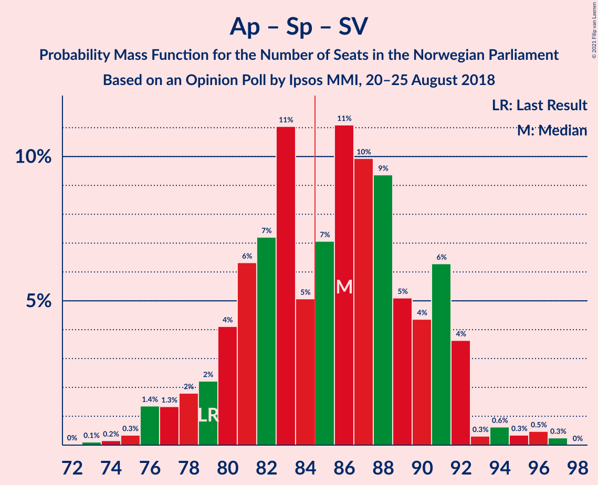

| Number of Seats | Probability | Accumulated | Special Marks |
|:---------------:|:-----------:|:-----------:|:-------------:|
| 73 | 0.1% | 100% |  |
| 74 | 0.2% | 99.8% |  |
| 75 | 0.3% | 99.7% |  |
| 76 | 1.4% | 99.3% |  |
| 77 | 1.3% | 98% |  |
| 78 | 2% | 97% |  |
| 79 | 2% | 95% | Last Result |
| 80 | 4% | 93% |  |
| 81 | 6% | 89% |  |
| 82 | 7% | 82% |  |
| 83 | 11% | 75% |  |
| 84 | 5% | 64% |  |
| 85 | 7% | 59% | Median, Majority |
| 86 | 11% | 52% |  |
| 87 | 10% | 41% |  |
| 88 | 9% | 31% |  |
| 89 | 5% | 21% |  |
| 90 | 4% | 16% |  |
| 91 | 6% | 12% |  |
| 92 | 4% | 6% |  |
| 93 | 0.3% | 2% |  |
| 94 | 0.6% | 2% |  |
| 95 | 0.3% | 1.1% |  |
| 96 | 0.5% | 0.7% |  |
| 97 | 0.3% | 0.3% |  |
| 98 | 0% | 0% |  |

### Arbeiderpartiet – Senterpartiet – Kristelig Folkeparti – Miljøpartiet De Grønne

| Number of Seats | Probability | Accumulated | Special Marks |
|:---------------:|:-----------:|:-----------:|:-------------:|
| 67 | 0% | 100% |  |
| 68 | 0.3% | 99.9% |  |
| 69 | 0.3% | 99.6% |  |
| 70 | 0.4% | 99.3% |  |
| 71 | 1.3% | 98.9% |  |
| 72 | 2% | 98% |  |
| 73 | 3% | 96% |  |
| 74 | 4% | 93% |  |
| 75 | 5% | 89% |  |
| 76 | 11% | 85% |  |
| 77 | 8% | 73% | Last Result |
| 78 | 8% | 66% | Median |
| 79 | 10% | 58% |  |
| 80 | 11% | 47% |  |
| 81 | 5% | 36% |  |
| 82 | 10% | 31% |  |
| 83 | 6% | 21% |  |
| 84 | 6% | 15% |  |
| 85 | 3% | 10% | Majority |
| 86 | 3% | 7% |  |
| 87 | 2% | 3% |  |
| 88 | 0.8% | 1.4% |  |
| 89 | 0.2% | 0.6% |  |
| 90 | 0.1% | 0.4% |  |
| 91 | 0.1% | 0.3% |  |
| 92 | 0.1% | 0.2% |  |
| 93 | 0% | 0% |  |

### Høyre – Fremskrittspartiet – Venstre – Kristelig Folkeparti – Miljøpartiet De Grønne

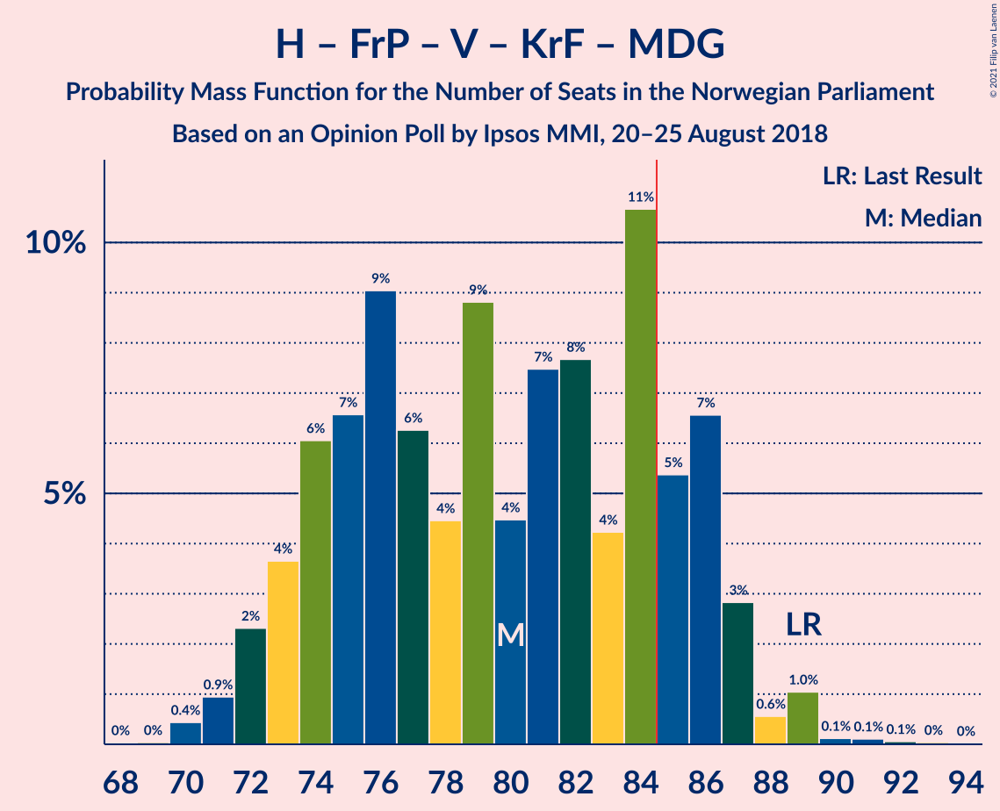

| Number of Seats | Probability | Accumulated | Special Marks |
|:---------------:|:-----------:|:-----------:|:-------------:|
| 68 | 0% | 100% |  |
| 69 | 0% | 99.9% |  |
| 70 | 0.4% | 99.9% |  |
| 71 | 0.9% | 99.4% |  |
| 72 | 2% | 98% |  |
| 73 | 4% | 96% |  |
| 74 | 6% | 93% |  |
| 75 | 7% | 86% |  |
| 76 | 9% | 80% | Median |
| 77 | 6% | 71% |  |
| 78 | 4% | 65% |  |
| 79 | 9% | 60% |  |
| 80 | 4% | 51% |  |
| 81 | 7% | 47% |  |
| 82 | 8% | 39% |  |
| 83 | 4% | 32% |  |
| 84 | 11% | 27% |  |
| 85 | 5% | 17% | Majority |
| 86 | 7% | 11% |  |
| 87 | 3% | 5% |  |
| 88 | 0.6% | 2% |  |
| 89 | 1.0% | 1.4% | Last Result |
| 90 | 0.1% | 0.4% |  |
| 91 | 0.1% | 0.2% |  |
| 92 | 0.1% | 0.1% |  |
| 93 | 0% | 0.1% |  |
| 94 | 0% | 0% |  |

### Høyre – Fremskrittspartiet – Venstre – Kristelig Folkeparti

| Number of Seats | Probability | Accumulated | Special Marks |
|:---------------:|:-----------:|:-----------:|:-------------:|
| 65 | 0.1% | 100% |  |
| 66 | 0.1% | 99.9% |  |
| 67 | 0.4% | 99.7% |  |
| 68 | 0.5% | 99.4% |  |
| 69 | 0.7% | 98.9% |  |
| 70 | 2% | 98% |  |
| 71 | 4% | 96% |  |
| 72 | 4% | 92% |  |
| 73 | 9% | 88% |  |
| 74 | 8% | 79% | Median |
| 75 | 9% | 71% |  |
| 76 | 7% | 62% |  |
| 77 | 7% | 56% |  |
| 78 | 7% | 49% |  |
| 79 | 6% | 42% |  |
| 80 | 6% | 36% |  |
| 81 | 6% | 29% |  |
| 82 | 9% | 23% |  |
| 83 | 4% | 15% |  |
| 84 | 7% | 11% |  |
| 85 | 3% | 4% | Majority |
| 86 | 0.8% | 1.3% |  |
| 87 | 0.3% | 0.5% |  |
| 88 | 0.1% | 0.2% | Last Result |
| 89 | 0.1% | 0.2% |  |
| 90 | 0.1% | 0.1% |  |
| 91 | 0% | 0% |  |

### Arbeiderpartiet – Senterpartiet – Kristelig Folkeparti

| Number of Seats | Probability | Accumulated | Special Marks |
|:---------------:|:-----------:|:-----------:|:-------------:|
| 65 | 0% | 100% |  |
| 66 | 0.1% | 99.9% |  |
| 67 | 0.5% | 99.8% |  |
| 68 | 0.4% | 99.3% |  |
| 69 | 2% | 98.9% |  |
| 70 | 3% | 97% |  |
| 71 | 3% | 94% |  |
| 72 | 5% | 90% |  |
| 73 | 5% | 85% |  |
| 74 | 9% | 81% |  |
| 75 | 11% | 71% |  |
| 76 | 6% | 60% | Last Result, Median |
| 77 | 4% | 54% |  |
| 78 | 13% | 50% |  |
| 79 | 10% | 37% |  |
| 80 | 6% | 27% |  |
| 81 | 6% | 21% |  |
| 82 | 8% | 15% |  |
| 83 | 3% | 7% |  |
| 84 | 2% | 5% |  |
| 85 | 2% | 3% | Majority |
| 86 | 0.6% | 0.9% |  |
| 87 | 0.1% | 0.3% |  |
| 88 | 0% | 0.1% |  |
| 89 | 0% | 0.1% |  |
| 90 | 0.1% | 0.1% |  |
| 91 | 0% | 0% |  |

### Høyre – Fremskrittspartiet – Venstre

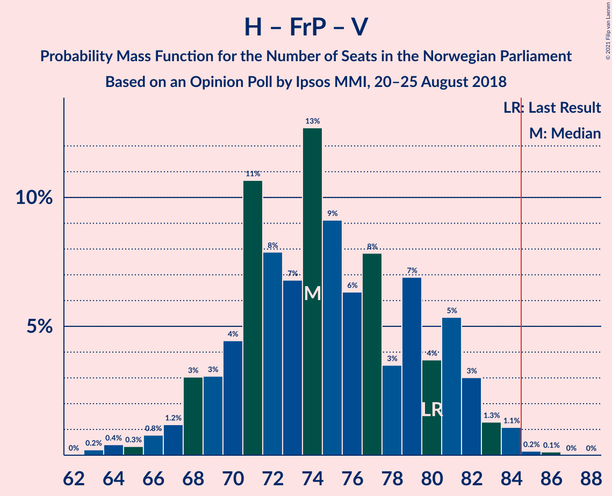

| Number of Seats | Probability | Accumulated | Special Marks |
|:---------------:|:-----------:|:-----------:|:-------------:|
| 63 | 0.2% | 100% |  |
| 64 | 0.4% | 99.7% |  |
| 65 | 0.3% | 99.3% |  |
| 66 | 0.8% | 99.0% |  |
| 67 | 1.2% | 98% |  |
| 68 | 3% | 97% |  |
| 69 | 3% | 94% |  |
| 70 | 4% | 91% |  |
| 71 | 11% | 86% |  |
| 72 | 8% | 76% | Median |
| 73 | 7% | 68% |  |
| 74 | 13% | 61% |  |
| 75 | 9% | 48% |  |
| 76 | 6% | 39% |  |
| 77 | 8% | 33% |  |
| 78 | 3% | 25% |  |
| 79 | 7% | 22% |  |
| 80 | 4% | 15% | Last Result |
| 81 | 5% | 11% |  |
| 82 | 3% | 6% |  |
| 83 | 1.3% | 3% |  |
| 84 | 1.1% | 1.4% |  |
| 85 | 0.2% | 0.3% | Majority |
| 86 | 0.1% | 0.2% |  |
| 87 | 0% | 0% |  |

### Arbeiderpartiet – Senterpartiet

| Number of Seats | Probability | Accumulated | Special Marks |
|:---------------:|:-----------:|:-----------:|:-------------:|
| 62 | 0% | 100% |  |
| 63 | 0.1% | 99.9% |  |
| 64 | 0.6% | 99.8% |  |
| 65 | 0.5% | 99.2% |  |
| 66 | 1.2% | 98.8% |  |
| 67 | 3% | 98% |  |
| 68 | 3% | 94% | Last Result |
| 69 | 3% | 92% |  |
| 70 | 7% | 89% |  |
| 71 | 9% | 82% |  |
| 72 | 9% | 73% |  |
| 73 | 10% | 64% |  |
| 74 | 7% | 54% | Median |
| 75 | 5% | 47% |  |
| 76 | 10% | 41% |  |
| 77 | 10% | 32% |  |
| 78 | 8% | 22% |  |
| 79 | 5% | 14% |  |
| 80 | 3% | 9% |  |
| 81 | 3% | 6% |  |
| 82 | 2% | 3% |  |
| 83 | 0.7% | 1.0% |  |
| 84 | 0.2% | 0.3% |  |
| 85 | 0% | 0.1% | Majority |
| 86 | 0% | 0.1% |  |
| 87 | 0% | 0% |  |

### Arbeiderpartiet – Sosialistisk Venstreparti – Rødt – Miljøpartiet De Grønne

| Number of Seats | Probability | Accumulated | Special Marks |
|:---------------:|:-----------:|:-----------:|:-------------:|
| 58 | 0% | 100% |  |
| 59 | 0.1% | 99.9% |  |
| 60 | 0.1% | 99.8% |  |
| 61 | 0.4% | 99.7% |  |
| 62 | 1.0% | 99.3% | Last Result |
| 63 | 2% | 98% |  |
| 64 | 5% | 96% |  |
| 65 | 7% | 92% |  |
| 66 | 6% | 84% |  |
| 67 | 8% | 79% |  |
| 68 | 5% | 71% | Median |
| 69 | 12% | 66% |  |
| 70 | 4% | 54% |  |
| 71 | 7% | 50% |  |
| 72 | 10% | 43% |  |
| 73 | 7% | 34% |  |
| 74 | 11% | 27% |  |
| 75 | 6% | 16% |  |
| 76 | 3% | 10% |  |
| 77 | 4% | 8% |  |
| 78 | 1.3% | 4% |  |
| 79 | 2% | 3% |  |
| 80 | 0.4% | 1.1% |  |
| 81 | 0.2% | 0.6% |  |
| 82 | 0.3% | 0.4% |  |
| 83 | 0.1% | 0.1% |  |
| 84 | 0% | 0% |  |

### Høyre – Fremskrittspartiet

| Number of Seats | Probability | Accumulated | Special Marks |
|:---------------:|:-----------:|:-----------:|:-------------:|
| 58 | 0.1% | 100% |  |
| 59 | 0.3% | 99.8% |  |
| 60 | 0.4% | 99.5% |  |
| 61 | 0.7% | 99.1% |  |
| 62 | 1.2% | 98% |  |
| 63 | 3% | 97% |  |
| 64 | 3% | 94% |  |
| 65 | 8% | 91% |  |
| 66 | 6% | 83% |  |
| 67 | 7% | 77% |  |
| 68 | 6% | 70% |  |
| 69 | 10% | 64% | Median |
| 70 | 7% | 54% |  |
| 71 | 11% | 47% |  |
| 72 | 9% | 36% | Last Result |
| 73 | 12% | 27% |  |
| 74 | 6% | 15% |  |
| 75 | 3% | 9% |  |
| 76 | 2% | 6% |  |
| 77 | 1.2% | 4% |  |
| 78 | 1.3% | 3% |  |
| 79 | 0.3% | 1.5% |  |
| 80 | 1.2% | 1.2% |  |
| 81 | 0% | 0% |  |

### Arbeiderpartiet – Sosialistisk Venstreparti

| Number of Seats | Probability | Accumulated | Special Marks |
|:---------------:|:-----------:|:-----------:|:-------------:|
| 53 | 0% | 100% |  |
| 54 | 0.1% | 99.9% |  |
| 55 | 0.3% | 99.8% |  |
| 56 | 0.5% | 99.5% |  |
| 57 | 2% | 99.0% |  |
| 58 | 2% | 97% |  |
| 59 | 4% | 95% |  |
| 60 | 7% | 91% | Last Result |
| 61 | 8% | 85% |  |
| 62 | 7% | 76% |  |
| 63 | 9% | 69% |  |
| 64 | 13% | 61% | Median |
| 65 | 11% | 48% |  |
| 66 | 13% | 37% |  |
| 67 | 7% | 24% |  |
| 68 | 8% | 17% |  |
| 69 | 3% | 9% |  |
| 70 | 2% | 6% |  |
| 71 | 3% | 4% |  |
| 72 | 0.8% | 2% |  |
| 73 | 0.4% | 0.7% |  |
| 74 | 0.1% | 0.3% |  |
| 75 | 0.2% | 0.2% |  |
| 76 | 0% | 0% |  |

### Høyre – Venstre – Kristelig Folkeparti

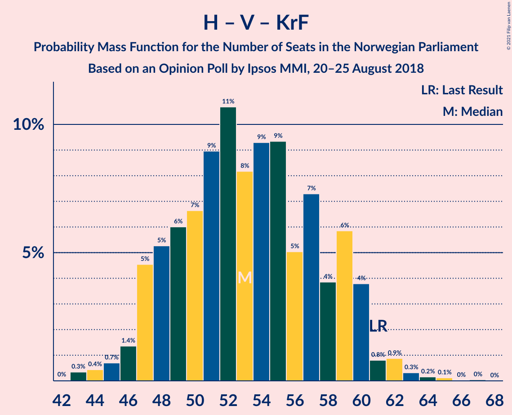

| Number of Seats | Probability | Accumulated | Special Marks |
|:---------------:|:-----------:|:-----------:|:-------------:|
| 42 | 0% | 100% |  |
| 43 | 0.3% | 99.9% |  |
| 44 | 0.4% | 99.6% |  |
| 45 | 0.7% | 99.2% |  |
| 46 | 1.4% | 98% |  |
| 47 | 5% | 97% |  |
| 48 | 5% | 93% |  |
| 49 | 6% | 87% |  |
| 50 | 7% | 81% | Median |
| 51 | 9% | 75% |  |
| 52 | 11% | 66% |  |
| 53 | 8% | 55% |  |
| 54 | 9% | 47% |  |
| 55 | 9% | 38% |  |
| 56 | 5% | 28% |  |
| 57 | 7% | 23% |  |
| 58 | 4% | 16% |  |
| 59 | 6% | 12% |  |
| 60 | 4% | 6% |  |
| 61 | 0.8% | 2% | Last Result |
| 62 | 0.9% | 2% |  |
| 63 | 0.3% | 0.7% |  |
| 64 | 0.2% | 0.4% |  |
| 65 | 0.1% | 0.2% |  |
| 66 | 0% | 0.1% |  |
| 67 | 0% | 0.1% |  |
| 68 | 0% | 0% |  |

### Senterpartiet – Venstre – Kristelig Folkeparti

| Number of Seats | Probability | Accumulated | Special Marks |
|:---------------:|:-----------:|:-----------:|:-------------:|
| 19 | 0.1% | 100% |  |
| 20 | 0.3% | 99.9% |  |
| 21 | 1.3% | 99.6% |  |
| 22 | 2% | 98% |  |
| 23 | 7% | 96% |  |
| 24 | 4% | 90% |  |
| 25 | 6% | 85% |  |
| 26 | 10% | 79% | Median |
| 27 | 10% | 69% |  |
| 28 | 6% | 59% |  |
| 29 | 10% | 53% |  |
| 30 | 6% | 43% |  |
| 31 | 8% | 37% |  |
| 32 | 11% | 29% |  |
| 33 | 6% | 18% |  |
| 34 | 4% | 12% |  |
| 35 | 2% | 7% | Last Result |
| 36 | 2% | 5% |  |
| 37 | 1.4% | 3% |  |
| 38 | 1.1% | 2% |  |
| 39 | 0.4% | 0.8% |  |
| 40 | 0.2% | 0.4% |  |
| 41 | 0.1% | 0.2% |  |
| 42 | 0% | 0.1% |  |
| 43 | 0% | 0% |  |

## Technical Information

### Opinion Poll

+ **Polling firm:** Ipsos MMI
+ **Commissioner(s):** —
+ **Fieldwork period:** 20–25 August 2018

### Calculations

+ **Sample size:** 943
+ **Simulations done:** 1,048,576
+ **Error estimate:** 2.42%

