# Opinion Poll by Norstat, 20–26 August 2018

<a href="#voting-intentions">Voting Intentions</a> | <a href="#seats">Seats</a> | <a href="#coalitions">Coalitions</a> | <a href="#technical-information">Technical Information</a>

## Voting Intentions

### Confidence Intervals

| Party | Last Result | Poll Result | 80% Confidence Interval | 90% Confidence Interval | 95% Confidence Interval | 99% Confidence Interval |
|:-----:|:-----------:|:-----------:|:-----------------------:|:-----------------------:|:-----------------------:|:-----------------------:|
| Høyre | 25.0% | 27.5% | 25.7–29.4% |25.1–30.0% |24.7–30.5% |23.8–31.4% |
| Arbeiderpartiet | 27.4% | 24.5% | 22.7–26.3% |22.2–26.9% |21.8–27.3% |21.0–28.3% |
| Fremskrittspartiet | 15.2% | 12.9% | 11.6–14.4% |11.2–14.9% |10.9–15.3% |10.3–16.0% |
| Senterpartiet | 10.3% | 12.5% | 11.2–14.0% |10.8–14.4% |10.5–14.8% |9.9–15.5% |
| Sosialistisk Venstreparti | 6.0% | 6.9% | 5.9–8.1% |5.7–8.4% |5.4–8.7% |5.0–9.3% |
| Rødt | 2.4% | 4.2% | 3.5–5.2% |3.3–5.5% |3.1–5.7% |2.8–6.2% |
| Miljøpartiet De Grønne | 3.2% | 3.6% | 2.9–4.5% |2.7–4.7% |2.5–5.0% |2.3–5.4% |
| Kristelig Folkeparti | 4.2% | 3.6% | 2.9–4.5% |2.7–4.7% |2.5–5.0% |2.3–5.4% |
| Venstre | 4.4% | 3.0% | 2.4–3.9% |2.2–4.1% |2.1–4.3% |1.8–4.8% |

*Note:* The poll result column reflects the actual value used in the calculations. Published results may vary slightly, and in addition be rounded to fewer digits.

## Seats

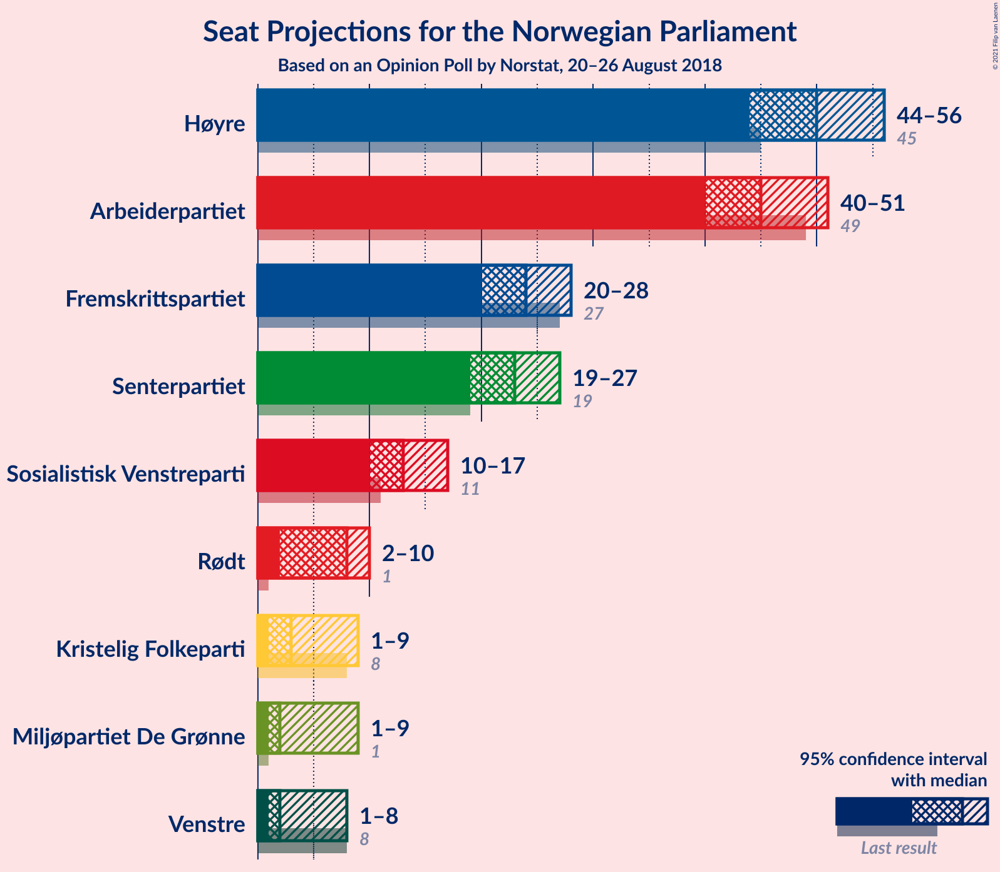

### Confidence Intervals

| Party | Last Result | Median | 80% Confidence Interval | 90% Confidence Interval | 95% Confidence Interval | 99% Confidence Interval |
|:-----:|:-----------:|:------:|:-----------------------:|:-----------------------:|:-----------------------:|:-----------------------:|
| <a href="#høyre">Høyre</a> | 45 | 50 | 46–54 |45–55 |44–56 |42–58 |
| <a href="#arbeiderpartiet">Arbeiderpartiet</a> | 49 | 45 | 41–49 |41–50 |40–51 |38–52 |
| <a href="#fremskrittspartiet">Fremskrittspartiet</a> | 27 | 24 | 21–26 |20–27 |20–28 |18–29 |
| <a href="#senterpartiet">Senterpartiet</a> | 19 | 23 | 20–26 |19–26 |19–27 |18–28 |
| <a href="#sosialistisk-venstreparti">Sosialistisk Venstreparti</a> | 11 | 13 | 11–15 |10–16 |10–17 |9–17 |
| <a href="#rødt">Rødt</a> | 1 | 8 | 2–9 |2–10 |2–10 |1–11 |
| <a href="#miljøpartiet-de-grønne">Miljøpartiet De Grønne</a> | 1 | 2 | 1–8 |1–8 |1–9 |1–10 |
| <a href="#kristelig-folkeparti">Kristelig Folkeparti</a> | 8 | 3 | 1–8 |1–8 |1–9 |0–10 |
| <a href="#venstre">Venstre</a> | 8 | 2 | 1–2 |1–7 |1–8 |1–8 |

### Høyre

*For a full overview of the results for this party, see the [Høyre](party-høyre.html) page.*

| Number of Seats | Probability | Accumulated | Special Marks |
|:---------------:|:-----------:|:-----------:|:-------------:|
| 40 | 0.1% | 100% |  |
| 41 | 0.1% | 99.9% |  |
| 42 | 0.3% | 99.8% |  |
| 43 | 0.5% | 99.5% |  |
| 44 | 2% | 99.0% |  |
| 45 | 3% | 97% | Last Result |
| 46 | 9% | 94% |  |
| 47 | 7% | 85% |  |
| 48 | 11% | 77% |  |
| 49 | 11% | 66% |  |
| 50 | 14% | 54% | Median |
| 51 | 14% | 40% |  |
| 52 | 9% | 26% |  |
| 53 | 3% | 17% |  |
| 54 | 4% | 14% |  |
| 55 | 6% | 10% |  |
| 56 | 2% | 3% |  |
| 57 | 0.5% | 1.2% |  |
| 58 | 0.4% | 0.6% |  |
| 59 | 0.1% | 0.2% |  |
| 60 | 0.1% | 0.1% |  |
| 61 | 0% | 0% |  |

### Arbeiderpartiet

*For a full overview of the results for this party, see the [Arbeiderpartiet](party-arbeiderpartiet.html) page.*

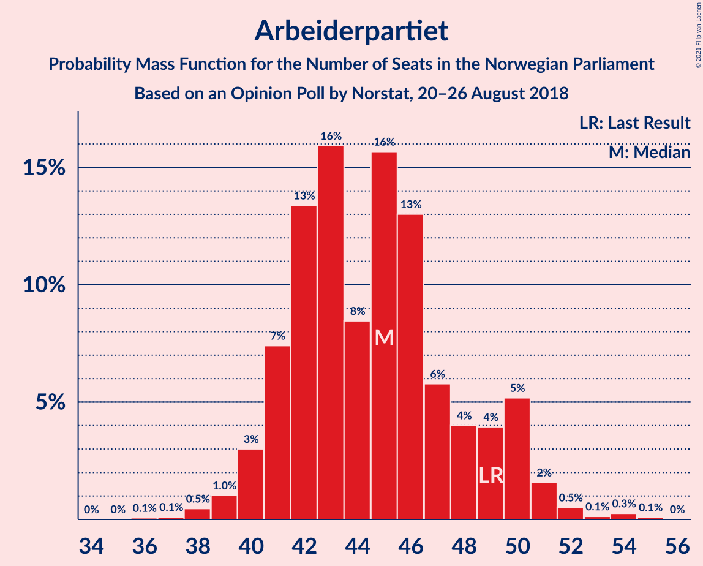

| Number of Seats | Probability | Accumulated | Special Marks |
|:---------------:|:-----------:|:-----------:|:-------------:|
| 36 | 0.1% | 100% |  |
| 37 | 0.1% | 99.9% |  |
| 38 | 0.5% | 99.8% |  |
| 39 | 1.0% | 99.4% |  |
| 40 | 3% | 98% |  |
| 41 | 7% | 95% |  |
| 42 | 13% | 88% |  |
| 43 | 16% | 75% |  |
| 44 | 8% | 59% |  |
| 45 | 16% | 50% | Median |
| 46 | 13% | 34% |  |
| 47 | 6% | 21% |  |
| 48 | 4% | 16% |  |
| 49 | 4% | 12% | Last Result |
| 50 | 5% | 8% |  |
| 51 | 2% | 3% |  |
| 52 | 0.5% | 1.0% |  |
| 53 | 0.1% | 0.5% |  |
| 54 | 0.3% | 0.4% |  |
| 55 | 0.1% | 0.1% |  |
| 56 | 0% | 0% |  |

### Fremskrittspartiet

*For a full overview of the results for this party, see the [Fremskrittspartiet](party-fremskrittspartiet.html) page.*

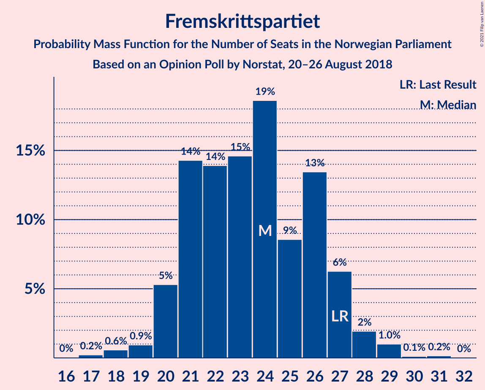

| Number of Seats | Probability | Accumulated | Special Marks |
|:---------------:|:-----------:|:-----------:|:-------------:|
| 17 | 0.2% | 100% |  |
| 18 | 0.6% | 99.7% |  |
| 19 | 0.9% | 99.2% |  |
| 20 | 5% | 98% |  |
| 21 | 14% | 93% |  |
| 22 | 14% | 79% |  |
| 23 | 15% | 65% |  |
| 24 | 19% | 50% | Median |
| 25 | 9% | 32% |  |
| 26 | 13% | 23% |  |
| 27 | 6% | 9% | Last Result |
| 28 | 2% | 3% |  |
| 29 | 1.0% | 1.3% |  |
| 30 | 0.1% | 0.3% |  |
| 31 | 0.2% | 0.2% |  |
| 32 | 0% | 0% |  |

### Senterpartiet

*For a full overview of the results for this party, see the [Senterpartiet](party-senterpartiet.html) page.*

| Number of Seats | Probability | Accumulated | Special Marks |
|:---------------:|:-----------:|:-----------:|:-------------:|
| 17 | 0.2% | 100% |  |
| 18 | 1.2% | 99.8% |  |
| 19 | 5% | 98.6% | Last Result |
| 20 | 8% | 93% |  |
| 21 | 20% | 86% |  |
| 22 | 13% | 66% |  |
| 23 | 17% | 54% | Median |
| 24 | 9% | 37% |  |
| 25 | 16% | 27% |  |
| 26 | 7% | 11% |  |
| 27 | 2% | 4% |  |
| 28 | 1.5% | 2% |  |
| 29 | 0.3% | 0.4% |  |
| 30 | 0.1% | 0.1% |  |
| 31 | 0% | 0% |  |

### Sosialistisk Venstreparti

*For a full overview of the results for this party, see the [Sosialistisk Venstreparti](party-sosialistiskvenstreparti.html) page.*

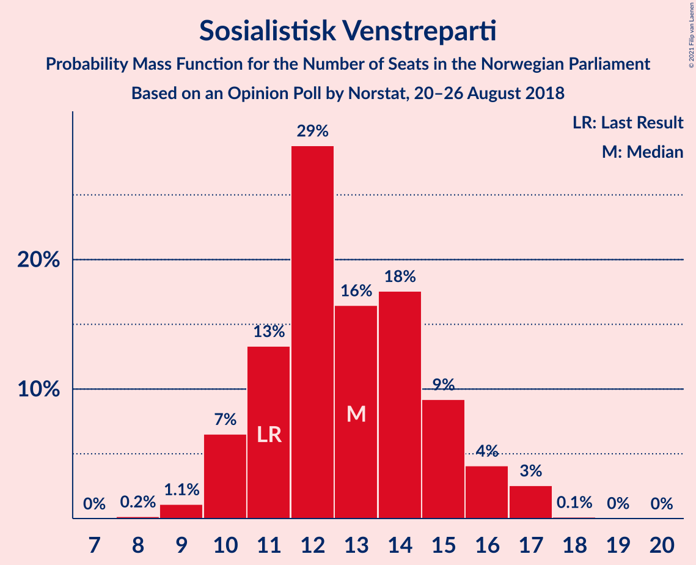

| Number of Seats | Probability | Accumulated | Special Marks |
|:---------------:|:-----------:|:-----------:|:-------------:|
| 8 | 0.2% | 100% |  |
| 9 | 1.1% | 99.8% |  |
| 10 | 7% | 98.7% |  |
| 11 | 13% | 92% | Last Result |
| 12 | 29% | 79% |  |
| 13 | 16% | 50% | Median |
| 14 | 18% | 34% |  |
| 15 | 9% | 16% |  |
| 16 | 4% | 7% |  |
| 17 | 3% | 3% |  |
| 18 | 0.1% | 0.2% |  |
| 19 | 0% | 0.1% |  |
| 20 | 0% | 0% |  |

### Rødt

*For a full overview of the results for this party, see the [Rødt](party-rødt.html) page.*

| Number of Seats | Probability | Accumulated | Special Marks |
|:---------------:|:-----------:|:-----------:|:-------------:|
| 1 | 0.8% | 100% | Last Result |
| 2 | 34% | 99.2% |  |
| 3 | 0% | 66% |  |
| 4 | 0% | 66% |  |
| 5 | 0% | 66% |  |
| 6 | 0% | 66% |  |
| 7 | 8% | 66% |  |
| 8 | 29% | 58% | Median |
| 9 | 21% | 29% |  |
| 10 | 6% | 8% |  |
| 11 | 1.3% | 2% |  |
| 12 | 0.3% | 0.3% |  |
| 13 | 0% | 0% |  |

### Miljøpartiet De Grønne

*For a full overview of the results for this party, see the [Miljøpartiet De Grønne](party-miljøpartietdegrønne.html) page.*

| Number of Seats | Probability | Accumulated | Special Marks |
|:---------------:|:-----------:|:-----------:|:-------------:|
| 1 | 19% | 100% | Last Result |
| 2 | 44% | 81% | Median |
| 3 | 10% | 38% |  |
| 4 | 1.0% | 27% |  |
| 5 | 0% | 26% |  |
| 6 | 0% | 26% |  |
| 7 | 6% | 26% |  |
| 8 | 16% | 20% |  |
| 9 | 4% | 5% |  |
| 10 | 0.5% | 0.6% |  |
| 11 | 0.1% | 0.1% |  |
| 12 | 0% | 0% |  |

### Kristelig Folkeparti

*For a full overview of the results for this party, see the [Kristelig Folkeparti](party-kristeligfolkeparti.html) page.*

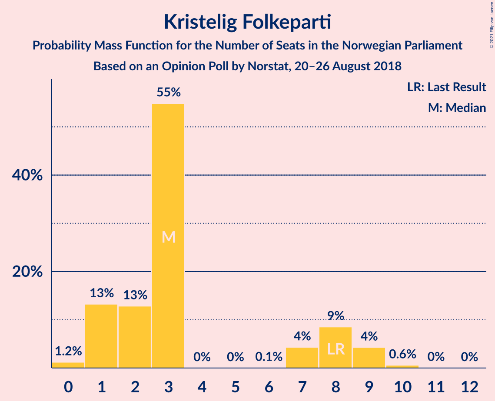

| Number of Seats | Probability | Accumulated | Special Marks |
|:---------------:|:-----------:|:-----------:|:-------------:|
| 0 | 1.2% | 100% |  |
| 1 | 13% | 98.8% |  |
| 2 | 13% | 86% |  |
| 3 | 55% | 73% | Median |
| 4 | 0% | 18% |  |
| 5 | 0% | 18% |  |
| 6 | 0.1% | 18% |  |
| 7 | 4% | 18% |  |
| 8 | 9% | 13% | Last Result |
| 9 | 4% | 5% |  |
| 10 | 0.6% | 0.6% |  |
| 11 | 0% | 0.1% |  |
| 12 | 0% | 0% |  |

### Venstre

*For a full overview of the results for this party, see the [Venstre](party-venstre.html) page.*

| Number of Seats | Probability | Accumulated | Special Marks |
|:---------------:|:-----------:|:-----------:|:-------------:|
| 0 | 0.3% | 100% |  |
| 1 | 10% | 99.7% |  |
| 2 | 83% | 90% | Median |
| 3 | 0.4% | 7% |  |
| 4 | 0% | 6% |  |
| 5 | 0% | 6% |  |
| 6 | 0% | 6% |  |
| 7 | 3% | 6% |  |
| 8 | 3% | 3% | Last Result |
| 9 | 0.3% | 0.4% |  |
| 10 | 0% | 0% |  |

## Coalitions

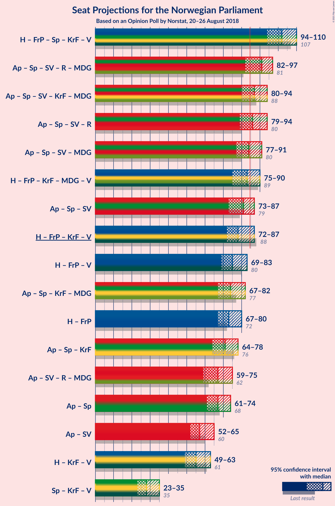

### Confidence Intervals

| Coalition | Last Result | Median | Majority? | 80% Confidence Interval | 90% Confidence Interval | 95% Confidence Interval | 99% Confidence Interval |
|:---------:|:-----------:|:------:|:---------:|:-----------------------:|:-----------------------:|:-----------------------:|:-----------------------:|
| Høyre – Fremskrittspartiet – Senterpartiet – Kristelig Folkeparti – Venstre | 107 | 102 | 100% | 97–107 | 96–108 | 94–110 | 92–112 |
| Arbeiderpartiet – Senterpartiet – Sosialistisk Venstreparti – Rødt – Miljøpartiet De Grønne | 81 | 91 | 91% | 85–95 | 83–96 | 82–97 | 80–99 |
| Arbeiderpartiet – Senterpartiet – Sosialistisk Venstreparti – Kristelig Folkeparti – Miljøpartiet De Grønne | 88 | 87 | 77% | 81–93 | 80–93 | 80–94 | 78–97 |
| Arbeiderpartiet – Senterpartiet – Sosialistisk Venstreparti – Rødt | 80 | 86 | 63% | 81–91 | 80–93 | 79–94 | 77–96 |
| Arbeiderpartiet – Senterpartiet – Sosialistisk Venstreparti – Miljøpartiet De Grønne | 80 | 84 | 37% | 78–90 | 78–90 | 77–91 | 74–93 |
| Høyre – Fremskrittspartiet – Kristelig Folkeparti – Miljøpartiet De Grønne – Venstre | 89 | 83 | 37% | 78–88 | 76–89 | 75–90 | 73–92 |
| Arbeiderpartiet – Senterpartiet – Sosialistisk Venstreparti | 79 | 81 | 13% | 75–85 | 74–87 | 73–87 | 71–90 |
| Høyre – Fremskrittspartiet – Kristelig Folkeparti – Venstre | 88 | 78 | 9% | 74–84 | 73–86 | 72–87 | 70–89 |
| Høyre – Fremskrittspartiet – Venstre | 80 | 75 | 1.3% | 71–81 | 70–82 | 69–83 | 67–86 |
| Arbeiderpartiet – Senterpartiet – Kristelig Folkeparti – Miljøpartiet De Grønne | 77 | 74 | 0.4% | 69–80 | 68–81 | 67–82 | 65–84 |
| Høyre – Fremskrittspartiet | 72 | 73 | 0% | 69–79 | 68–79 | 67–80 | 65–83 |
| Arbeiderpartiet – Senterpartiet – Kristelig Folkeparti | 76 | 71 | 0% | 66–75 | 65–77 | 64–78 | 63–80 |
| Arbeiderpartiet – Sosialistisk Venstreparti – Rødt – Miljøpartiet De Grønne | 62 | 67 | 0% | 62–72 | 61–73 | 59–75 | 57–77 |
| Arbeiderpartiet – Senterpartiet | 68 | 67 | 0% | 63–72 | 62–73 | 61–74 | 60–76 |
| Arbeiderpartiet – Sosialistisk Venstreparti | 60 | 57 | 0% | 53–62 | 52–64 | 52–65 | 50–66 |
| Høyre – Kristelig Folkeparti – Venstre | 61 | 55 | 0% | 51–60 | 50–62 | 49–63 | 47–66 |
| Senterpartiet – Kristelig Folkeparti – Venstre | 35 | 28 | 0% | 25–33 | 24–35 | 23–35 | 23–38 |

### Høyre – Fremskrittspartiet – Senterpartiet – Kristelig Folkeparti – Venstre

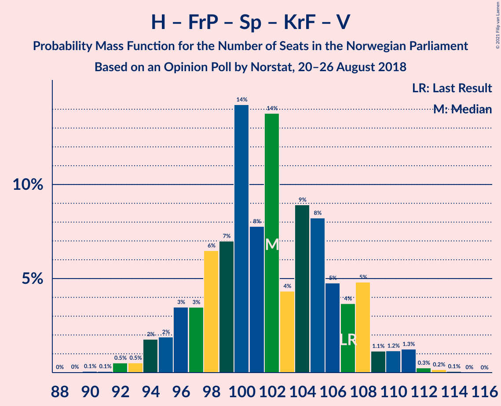

| Number of Seats | Probability | Accumulated | Special Marks |
|:---------------:|:-----------:|:-----------:|:-------------:|
| 89 | 0% | 100% |  |
| 90 | 0.1% | 99.9% |  |
| 91 | 0.1% | 99.9% |  |
| 92 | 0.5% | 99.8% |  |
| 93 | 0.5% | 99.3% |  |
| 94 | 2% | 98.7% |  |
| 95 | 2% | 97% |  |
| 96 | 3% | 95% |  |
| 97 | 3% | 92% |  |
| 98 | 6% | 88% |  |
| 99 | 7% | 82% |  |
| 100 | 14% | 75% |  |
| 101 | 8% | 60% |  |
| 102 | 14% | 53% | Median |
| 103 | 4% | 39% |  |
| 104 | 9% | 34% |  |
| 105 | 8% | 26% |  |
| 106 | 5% | 17% |  |
| 107 | 4% | 13% | Last Result |
| 108 | 5% | 9% |  |
| 109 | 1.1% | 4% |  |
| 110 | 1.2% | 3% |  |
| 111 | 1.3% | 2% |  |
| 112 | 0.3% | 0.5% |  |
| 113 | 0.2% | 0.3% |  |
| 114 | 0.1% | 0.1% |  |
| 115 | 0% | 0% |  |

### Arbeiderpartiet – Senterpartiet – Sosialistisk Venstreparti – Rødt – Miljøpartiet De Grønne

| Number of Seats | Probability | Accumulated | Special Marks |
|:---------------:|:-----------:|:-----------:|:-------------:|
| 76 | 0% | 100% |  |
| 77 | 0% | 99.9% |  |
| 78 | 0.1% | 99.9% |  |
| 79 | 0.3% | 99.8% |  |
| 80 | 0.4% | 99.5% |  |
| 81 | 1.4% | 99.1% | Last Result |
| 82 | 0.8% | 98% |  |
| 83 | 2% | 97% |  |
| 84 | 4% | 95% |  |
| 85 | 3% | 91% | Majority |
| 86 | 10% | 88% |  |
| 87 | 7% | 77% |  |
| 88 | 5% | 71% |  |
| 89 | 6% | 66% |  |
| 90 | 7% | 60% |  |
| 91 | 10% | 52% | Median |
| 92 | 22% | 43% |  |
| 93 | 6% | 21% |  |
| 94 | 4% | 15% |  |
| 95 | 6% | 11% |  |
| 96 | 2% | 5% |  |
| 97 | 2% | 3% |  |
| 98 | 0.7% | 1.4% |  |
| 99 | 0.4% | 0.7% |  |
| 100 | 0.2% | 0.3% |  |
| 101 | 0.1% | 0.1% |  |
| 102 | 0% | 0% |  |

### Arbeiderpartiet – Senterpartiet – Sosialistisk Venstreparti – Kristelig Folkeparti – Miljøpartiet De Grønne

| Number of Seats | Probability | Accumulated | Special Marks |
|:---------------:|:-----------:|:-----------:|:-------------:|
| 76 | 0.1% | 100% |  |
| 77 | 0.3% | 99.9% |  |
| 78 | 0.3% | 99.6% |  |
| 79 | 2% | 99.3% |  |
| 80 | 6% | 98% |  |
| 81 | 3% | 92% |  |
| 82 | 4% | 89% |  |
| 83 | 3% | 85% |  |
| 84 | 5% | 82% |  |
| 85 | 5% | 77% | Majority |
| 86 | 13% | 72% | Median |
| 87 | 15% | 59% |  |
| 88 | 8% | 43% | Last Result |
| 89 | 7% | 36% |  |
| 90 | 8% | 29% |  |
| 91 | 3% | 21% |  |
| 92 | 7% | 18% |  |
| 93 | 8% | 11% |  |
| 94 | 1.5% | 3% |  |
| 95 | 0.6% | 1.5% |  |
| 96 | 0.4% | 0.9% |  |
| 97 | 0.3% | 0.5% |  |
| 98 | 0.2% | 0.3% |  |
| 99 | 0% | 0.1% |  |
| 100 | 0% | 0.1% |  |
| 101 | 0% | 0% |  |

### Arbeiderpartiet – Senterpartiet – Sosialistisk Venstreparti – Rødt

| Number of Seats | Probability | Accumulated | Special Marks |
|:---------------:|:-----------:|:-----------:|:-------------:|
| 74 | 0.1% | 100% |  |
| 75 | 0.1% | 99.9% |  |
| 76 | 0.2% | 99.8% |  |
| 77 | 0.7% | 99.5% |  |
| 78 | 0.6% | 98.8% |  |
| 79 | 2% | 98% |  |
| 80 | 2% | 96% | Last Result |
| 81 | 5% | 94% |  |
| 82 | 4% | 89% |  |
| 83 | 6% | 85% |  |
| 84 | 16% | 80% |  |
| 85 | 8% | 63% | Majority |
| 86 | 7% | 56% |  |
| 87 | 7% | 49% |  |
| 88 | 7% | 42% |  |
| 89 | 13% | 35% | Median |
| 90 | 11% | 22% |  |
| 91 | 3% | 12% |  |
| 92 | 3% | 9% |  |
| 93 | 4% | 6% |  |
| 94 | 0.6% | 3% |  |
| 95 | 1.3% | 2% |  |
| 96 | 0.4% | 0.6% |  |
| 97 | 0.2% | 0.3% |  |
| 98 | 0% | 0.1% |  |
| 99 | 0% | 0% |  |

### Arbeiderpartiet – Senterpartiet – Sosialistisk Venstreparti – Miljøpartiet De Grønne

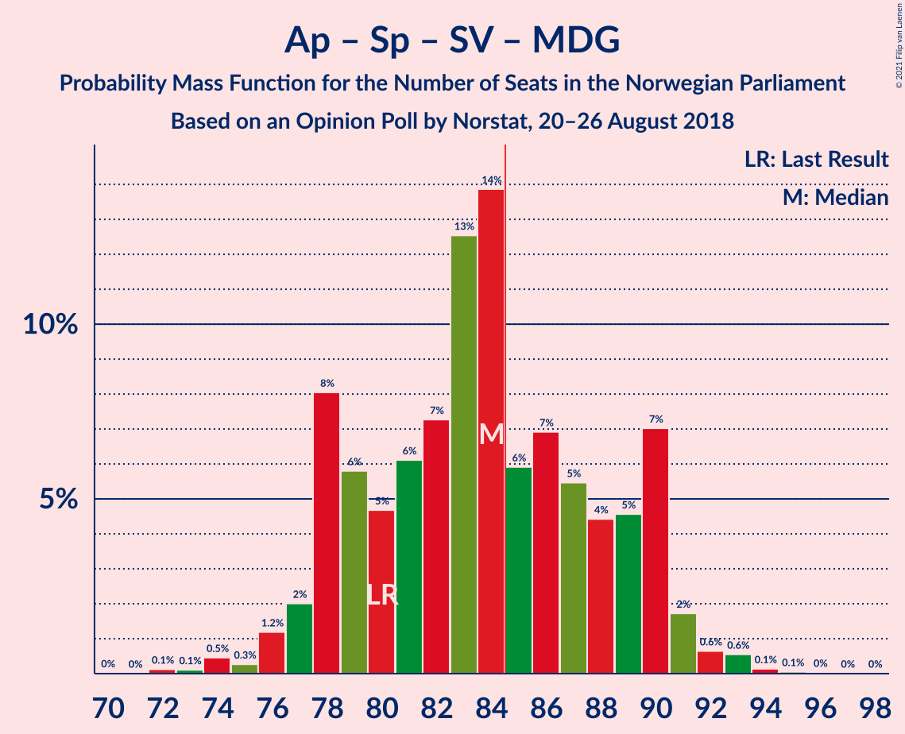

| Number of Seats | Probability | Accumulated | Special Marks |
|:---------------:|:-----------:|:-----------:|:-------------:|
| 72 | 0.1% | 100% |  |
| 73 | 0.1% | 99.8% |  |
| 74 | 0.5% | 99.7% |  |
| 75 | 0.3% | 99.3% |  |
| 76 | 1.2% | 99.0% |  |
| 77 | 2% | 98% |  |
| 78 | 8% | 96% |  |
| 79 | 6% | 88% |  |
| 80 | 5% | 82% | Last Result |
| 81 | 6% | 77% |  |
| 82 | 7% | 71% |  |
| 83 | 13% | 64% | Median |
| 84 | 14% | 51% |  |
| 85 | 6% | 37% | Majority |
| 86 | 7% | 32% |  |
| 87 | 5% | 25% |  |
| 88 | 4% | 19% |  |
| 89 | 5% | 15% |  |
| 90 | 7% | 10% |  |
| 91 | 2% | 3% |  |
| 92 | 0.6% | 1.4% |  |
| 93 | 0.6% | 0.8% |  |
| 94 | 0.1% | 0.2% |  |
| 95 | 0.1% | 0.1% |  |
| 96 | 0% | 0.1% |  |
| 97 | 0% | 0% |  |

### Høyre – Fremskrittspartiet – Kristelig Folkeparti – Miljøpartiet De Grønne – Venstre

| Number of Seats | Probability | Accumulated | Special Marks |
|:---------------:|:-----------:|:-----------:|:-------------:|
| 71 | 0% | 100% |  |
| 72 | 0.2% | 99.9% |  |
| 73 | 0.4% | 99.7% |  |
| 74 | 1.3% | 99.4% |  |
| 75 | 0.6% | 98% |  |
| 76 | 4% | 97% |  |
| 77 | 3% | 94% |  |
| 78 | 3% | 91% |  |
| 79 | 11% | 88% |  |
| 80 | 13% | 78% |  |
| 81 | 7% | 65% | Median |
| 82 | 7% | 58% |  |
| 83 | 7% | 51% |  |
| 84 | 8% | 44% |  |
| 85 | 16% | 37% | Majority |
| 86 | 6% | 20% |  |
| 87 | 4% | 15% |  |
| 88 | 5% | 11% |  |
| 89 | 2% | 6% | Last Result |
| 90 | 2% | 4% |  |
| 91 | 0.6% | 2% |  |
| 92 | 0.7% | 1.2% |  |
| 93 | 0.2% | 0.5% |  |
| 94 | 0.1% | 0.2% |  |
| 95 | 0.1% | 0.1% |  |
| 96 | 0% | 0% |  |

### Arbeiderpartiet – Senterpartiet – Sosialistisk Venstreparti

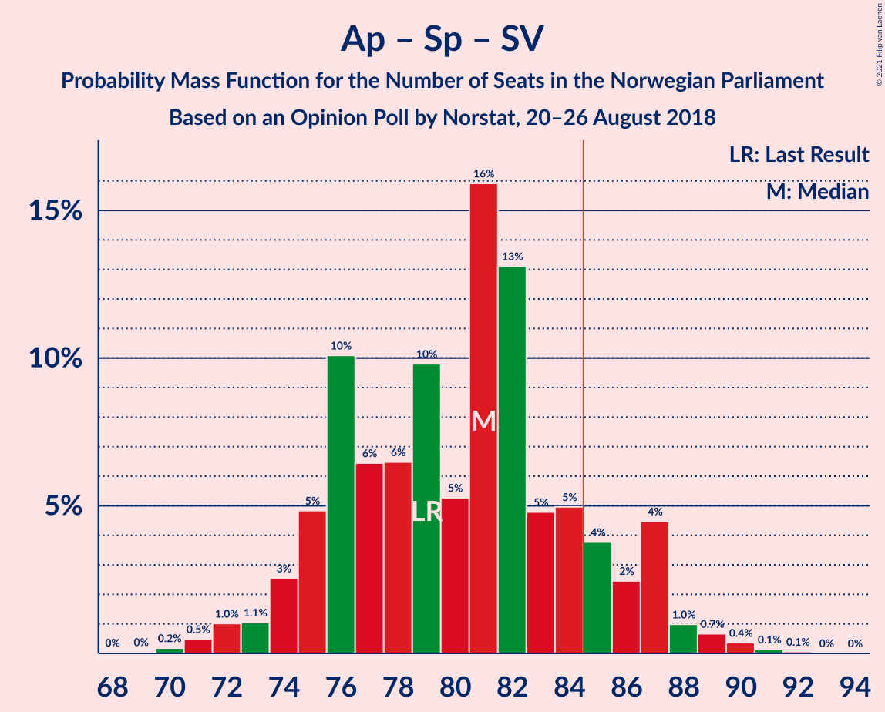

| Number of Seats | Probability | Accumulated | Special Marks |
|:---------------:|:-----------:|:-----------:|:-------------:|
| 69 | 0% | 100% |  |
| 70 | 0.2% | 99.9% |  |
| 71 | 0.5% | 99.7% |  |
| 72 | 1.0% | 99.2% |  |
| 73 | 1.1% | 98% |  |
| 74 | 3% | 97% |  |
| 75 | 5% | 95% |  |
| 76 | 10% | 90% |  |
| 77 | 6% | 80% |  |
| 78 | 6% | 73% |  |
| 79 | 10% | 67% | Last Result |
| 80 | 5% | 57% |  |
| 81 | 16% | 52% | Median |
| 82 | 13% | 36% |  |
| 83 | 5% | 23% |  |
| 84 | 5% | 18% |  |
| 85 | 4% | 13% | Majority |
| 86 | 2% | 9% |  |
| 87 | 4% | 7% |  |
| 88 | 1.0% | 2% |  |
| 89 | 0.7% | 1.2% |  |
| 90 | 0.4% | 0.6% |  |
| 91 | 0.1% | 0.2% |  |
| 92 | 0.1% | 0.1% |  |
| 93 | 0% | 0% |  |

### Høyre – Fremskrittspartiet – Kristelig Folkeparti – Venstre

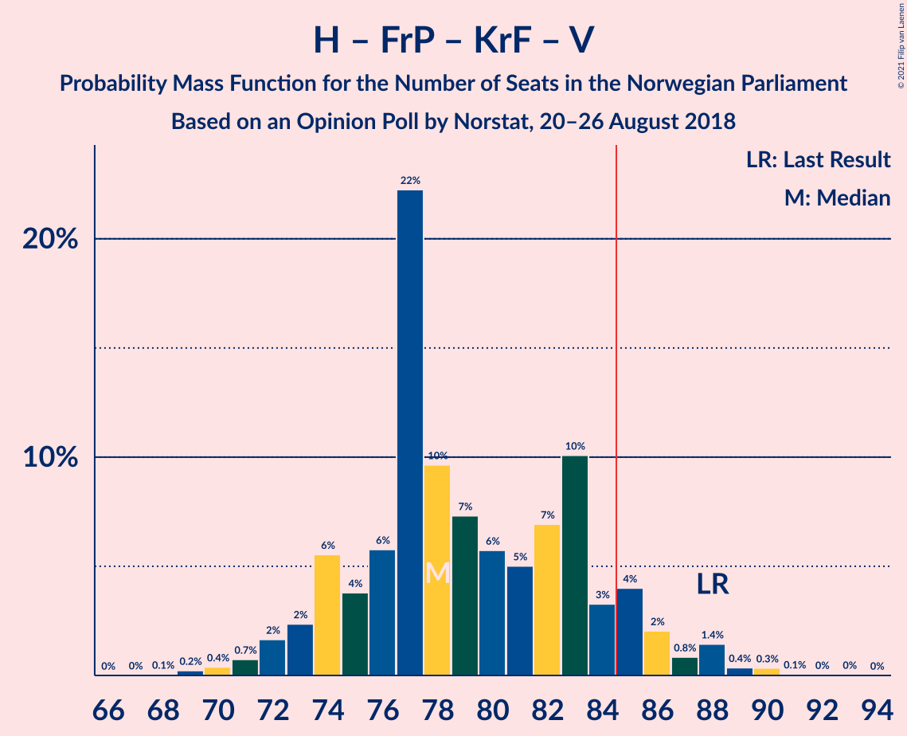

| Number of Seats | Probability | Accumulated | Special Marks |
|:---------------:|:-----------:|:-----------:|:-------------:|
| 68 | 0.1% | 100% |  |
| 69 | 0.2% | 99.9% |  |
| 70 | 0.4% | 99.7% |  |
| 71 | 0.7% | 99.3% |  |
| 72 | 2% | 98.6% |  |
| 73 | 2% | 97% |  |
| 74 | 6% | 95% |  |
| 75 | 4% | 89% |  |
| 76 | 6% | 85% |  |
| 77 | 22% | 79% |  |
| 78 | 10% | 57% |  |
| 79 | 7% | 48% | Median |
| 80 | 6% | 40% |  |
| 81 | 5% | 34% |  |
| 82 | 7% | 29% |  |
| 83 | 10% | 23% |  |
| 84 | 3% | 12% |  |
| 85 | 4% | 9% | Majority |
| 86 | 2% | 5% |  |
| 87 | 0.8% | 3% |  |
| 88 | 1.4% | 2% | Last Result |
| 89 | 0.4% | 0.9% |  |
| 90 | 0.3% | 0.5% |  |
| 91 | 0.1% | 0.2% |  |
| 92 | 0% | 0.1% |  |
| 93 | 0% | 0.1% |  |
| 94 | 0% | 0% |  |

### Høyre – Fremskrittspartiet – Venstre

| Number of Seats | Probability | Accumulated | Special Marks |
|:---------------:|:-----------:|:-----------:|:-------------:|
| 64 | 0% | 100% |  |
| 65 | 0.1% | 99.9% |  |
| 66 | 0.2% | 99.8% |  |
| 67 | 0.5% | 99.6% |  |
| 68 | 0.4% | 99.1% |  |
| 69 | 1.4% | 98.7% |  |
| 70 | 3% | 97% |  |
| 71 | 5% | 94% |  |
| 72 | 4% | 89% |  |
| 73 | 9% | 85% |  |
| 74 | 24% | 76% |  |
| 75 | 10% | 52% |  |
| 76 | 8% | 42% | Median |
| 77 | 8% | 34% |  |
| 78 | 4% | 26% |  |
| 79 | 4% | 22% |  |
| 80 | 4% | 18% | Last Result |
| 81 | 8% | 14% |  |
| 82 | 3% | 6% |  |
| 83 | 2% | 3% |  |
| 84 | 0.3% | 2% |  |
| 85 | 0.6% | 1.3% | Majority |
| 86 | 0.3% | 0.7% |  |
| 87 | 0.3% | 0.3% |  |
| 88 | 0% | 0% |  |

### Arbeiderpartiet – Senterpartiet – Kristelig Folkeparti – Miljøpartiet De Grønne

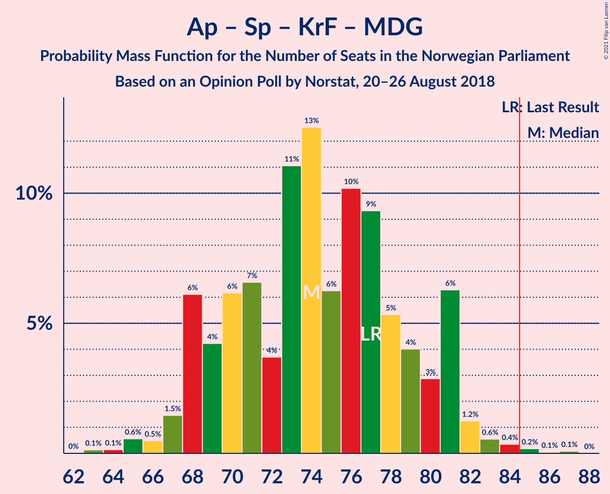

| Number of Seats | Probability | Accumulated | Special Marks |
|:---------------:|:-----------:|:-----------:|:-------------:|
| 63 | 0.1% | 100% |  |
| 64 | 0.1% | 99.8% |  |
| 65 | 0.6% | 99.7% |  |
| 66 | 0.5% | 99.1% |  |
| 67 | 1.5% | 98.6% |  |
| 68 | 6% | 97% |  |
| 69 | 4% | 91% |  |
| 70 | 6% | 87% |  |
| 71 | 7% | 81% |  |
| 72 | 4% | 74% |  |
| 73 | 11% | 70% | Median |
| 74 | 13% | 59% |  |
| 75 | 6% | 47% |  |
| 76 | 10% | 41% |  |
| 77 | 9% | 30% | Last Result |
| 78 | 5% | 21% |  |
| 79 | 4% | 16% |  |
| 80 | 3% | 12% |  |
| 81 | 6% | 9% |  |
| 82 | 1.2% | 3% |  |
| 83 | 0.6% | 1.3% |  |
| 84 | 0.4% | 0.7% |  |
| 85 | 0.2% | 0.4% | Majority |
| 86 | 0.1% | 0.2% |  |
| 87 | 0.1% | 0.1% |  |
| 88 | 0% | 0% |  |

### Høyre – Fremskrittspartiet

| Number of Seats | Probability | Accumulated | Special Marks |
|:---------------:|:-----------:|:-----------:|:-------------:|
| 62 | 0% | 100% |  |
| 63 | 0.1% | 99.9% |  |
| 64 | 0.3% | 99.8% |  |
| 65 | 0.6% | 99.5% |  |
| 66 | 0.5% | 99.0% |  |
| 67 | 2% | 98% |  |
| 68 | 3% | 96% |  |
| 69 | 6% | 94% |  |
| 70 | 4% | 87% |  |
| 71 | 8% | 83% |  |
| 72 | 24% | 75% | Last Result |
| 73 | 11% | 51% |  |
| 74 | 6% | 39% | Median |
| 75 | 9% | 33% |  |
| 76 | 4% | 24% |  |
| 77 | 4% | 20% |  |
| 78 | 4% | 16% |  |
| 79 | 8% | 12% |  |
| 80 | 2% | 4% |  |
| 81 | 1.2% | 2% |  |
| 82 | 0.2% | 1.0% |  |
| 83 | 0.5% | 0.8% |  |
| 84 | 0.3% | 0.3% |  |
| 85 | 0% | 0% | Majority |

### Arbeiderpartiet – Senterpartiet – Kristelig Folkeparti

| Number of Seats | Probability | Accumulated | Special Marks |
|:---------------:|:-----------:|:-----------:|:-------------:|
| 60 | 0% | 100% |  |
| 61 | 0.2% | 99.9% |  |
| 62 | 0.2% | 99.8% |  |
| 63 | 0.8% | 99.5% |  |
| 64 | 2% | 98.7% |  |
| 65 | 2% | 97% |  |
| 66 | 9% | 95% |  |
| 67 | 7% | 86% |  |
| 68 | 9% | 79% |  |
| 69 | 7% | 70% |  |
| 70 | 10% | 62% |  |
| 71 | 6% | 52% | Median |
| 72 | 11% | 46% |  |
| 73 | 12% | 35% |  |
| 74 | 7% | 24% |  |
| 75 | 7% | 17% |  |
| 76 | 3% | 10% | Last Result |
| 77 | 3% | 7% |  |
| 78 | 2% | 4% |  |
| 79 | 0.9% | 2% |  |
| 80 | 0.4% | 0.9% |  |
| 81 | 0.3% | 0.4% |  |
| 82 | 0.1% | 0.2% |  |
| 83 | 0.1% | 0.1% |  |
| 84 | 0% | 0% |  |

### Arbeiderpartiet – Sosialistisk Venstreparti – Rødt – Miljøpartiet De Grønne

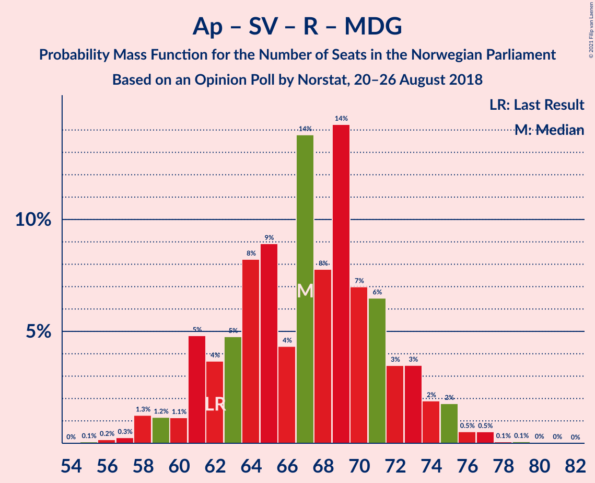

| Number of Seats | Probability | Accumulated | Special Marks |
|:---------------:|:-----------:|:-----------:|:-------------:|
| 55 | 0.1% | 100% |  |
| 56 | 0.2% | 99.9% |  |
| 57 | 0.3% | 99.7% |  |
| 58 | 1.3% | 99.5% |  |
| 59 | 1.2% | 98% |  |
| 60 | 1.1% | 97% |  |
| 61 | 5% | 96% |  |
| 62 | 4% | 91% | Last Result |
| 63 | 5% | 87% |  |
| 64 | 8% | 83% |  |
| 65 | 9% | 74% |  |
| 66 | 4% | 66% |  |
| 67 | 14% | 61% |  |
| 68 | 8% | 47% | Median |
| 69 | 14% | 40% |  |
| 70 | 7% | 25% |  |
| 71 | 6% | 18% |  |
| 72 | 3% | 12% |  |
| 73 | 3% | 8% |  |
| 74 | 2% | 5% |  |
| 75 | 2% | 3% |  |
| 76 | 0.5% | 1.3% |  |
| 77 | 0.5% | 0.7% |  |
| 78 | 0.1% | 0.2% |  |
| 79 | 0.1% | 0.1% |  |
| 80 | 0% | 0.1% |  |
| 81 | 0% | 0% |  |

### Arbeiderpartiet – Senterpartiet

| Number of Seats | Probability | Accumulated | Special Marks |
|:---------------:|:-----------:|:-----------:|:-------------:|
| 58 | 0.1% | 100% |  |
| 59 | 0.3% | 99.8% |  |
| 60 | 1.3% | 99.6% |  |
| 61 | 2% | 98% |  |
| 62 | 3% | 97% |  |
| 63 | 5% | 93% |  |
| 64 | 12% | 88% |  |
| 65 | 9% | 77% |  |
| 66 | 10% | 68% |  |
| 67 | 12% | 58% |  |
| 68 | 6% | 46% | Last Result, Median |
| 69 | 11% | 39% |  |
| 70 | 10% | 28% |  |
| 71 | 7% | 19% |  |
| 72 | 5% | 12% |  |
| 73 | 3% | 7% |  |
| 74 | 2% | 4% |  |
| 75 | 1.5% | 2% |  |
| 76 | 0.5% | 0.8% |  |
| 77 | 0.1% | 0.3% |  |
| 78 | 0.2% | 0.2% |  |
| 79 | 0% | 0% |  |

### Arbeiderpartiet – Sosialistisk Venstreparti

| Number of Seats | Probability | Accumulated | Special Marks |
|:---------------:|:-----------:|:-----------:|:-------------:|
| 48 | 0.1% | 100% |  |
| 49 | 0.3% | 99.9% |  |
| 50 | 0.6% | 99.5% |  |
| 51 | 1.1% | 99.0% |  |
| 52 | 3% | 98% |  |
| 53 | 5% | 94% |  |
| 54 | 7% | 89% |  |
| 55 | 12% | 82% |  |
| 56 | 11% | 71% |  |
| 57 | 14% | 59% |  |
| 58 | 13% | 45% | Median |
| 59 | 8% | 31% |  |
| 60 | 7% | 23% | Last Result |
| 61 | 5% | 16% |  |
| 62 | 2% | 11% |  |
| 63 | 3% | 9% |  |
| 64 | 3% | 7% |  |
| 65 | 3% | 4% |  |
| 66 | 0.3% | 0.5% |  |
| 67 | 0.2% | 0.3% |  |
| 68 | 0% | 0.1% |  |
| 69 | 0% | 0% |  |

### Høyre – Kristelig Folkeparti – Venstre

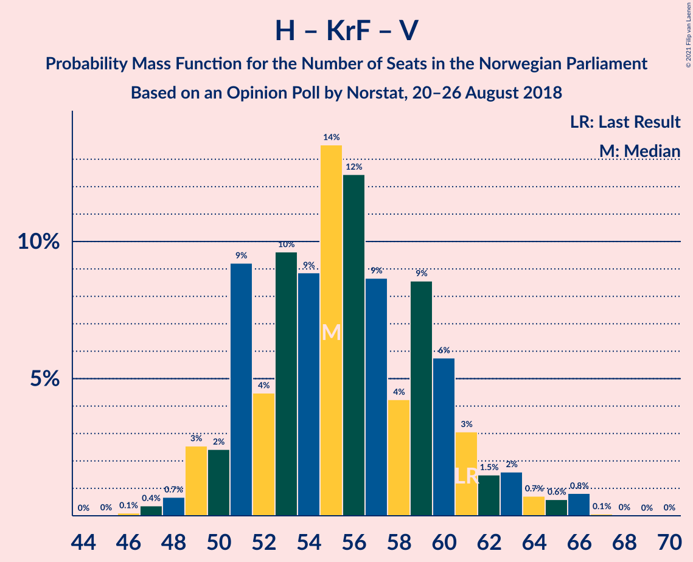

| Number of Seats | Probability | Accumulated | Special Marks |
|:---------------:|:-----------:|:-----------:|:-------------:|
| 46 | 0.1% | 100% |  |
| 47 | 0.4% | 99.9% |  |
| 48 | 0.7% | 99.5% |  |
| 49 | 3% | 98.8% |  |
| 50 | 2% | 96% |  |
| 51 | 9% | 94% |  |
| 52 | 4% | 85% |  |
| 53 | 10% | 80% |  |
| 54 | 9% | 71% |  |
| 55 | 14% | 62% | Median |
| 56 | 12% | 48% |  |
| 57 | 9% | 36% |  |
| 58 | 4% | 27% |  |
| 59 | 9% | 23% |  |
| 60 | 6% | 14% |  |
| 61 | 3% | 8% | Last Result |
| 62 | 1.5% | 5% |  |
| 63 | 2% | 4% |  |
| 64 | 0.7% | 2% |  |
| 65 | 0.6% | 2% |  |
| 66 | 0.8% | 1.0% |  |
| 67 | 0.1% | 0.1% |  |
| 68 | 0% | 0.1% |  |
| 69 | 0% | 0% |  |

### Senterpartiet – Kristelig Folkeparti – Venstre

| Number of Seats | Probability | Accumulated | Special Marks |
|:---------------:|:-----------:|:-----------:|:-------------:|
| 20 | 0.1% | 100% |  |
| 21 | 0.1% | 99.9% |  |
| 22 | 0.3% | 99.8% |  |
| 23 | 2% | 99.5% |  |
| 24 | 6% | 97% |  |
| 25 | 11% | 91% |  |
| 26 | 12% | 80% |  |
| 27 | 8% | 68% |  |
| 28 | 14% | 60% | Median |
| 29 | 7% | 46% |  |
| 30 | 16% | 39% |  |
| 31 | 7% | 23% |  |
| 32 | 4% | 16% |  |
| 33 | 5% | 13% |  |
| 34 | 2% | 8% |  |
| 35 | 3% | 5% | Last Result |
| 36 | 1.3% | 2% |  |
| 37 | 0.4% | 1.2% |  |
| 38 | 0.4% | 0.7% |  |
| 39 | 0.2% | 0.3% |  |
| 40 | 0% | 0.1% |  |
| 41 | 0.1% | 0.1% |  |
| 42 | 0% | 0% |  |

## Technical Information

### Opinion Poll

+ **Polling firm:** Norstat
+ **Commissioner(s):** —
+ **Fieldwork period:** 20–26 August 2018

### Calculations

+ **Sample size:** 928
+ **Simulations done:** 1,048,576
+ **Error estimate:** 2.30%

