# Opinion Poll by Opinion Perduco, 4–10 September 2018

<a href="#voting-intentions">Voting Intentions</a> | <a href="#seats">Seats</a> | <a href="#coalitions">Coalitions</a> | <a href="#technical-information">Technical Information</a>

## Voting Intentions

### Confidence Intervals

| Party | Last Result | Poll Result | 80% Confidence Interval | 90% Confidence Interval | 95% Confidence Interval | 99% Confidence Interval |
|:-----:|:-----------:|:-----------:|:-----------------------:|:-----------------------:|:-----------------------:|:-----------------------:|
| Arbeiderpartiet | 27.4% | 27.6% | 25.5–29.9% |24.9–30.6% |24.4–31.1% |23.4–32.3% |
| Høyre | 25.0% | 26.5% | 24.4–28.7% |23.8–29.4% |23.3–29.9% |22.3–31.0% |
| Fremskrittspartiet | 15.2% | 13.1% | 11.6–14.9% |11.1–15.4% |10.8–15.8% |10.1–16.7% |
| Senterpartiet | 10.3% | 10.6% | 9.2–12.3% |8.8–12.7% |8.5–13.1% |7.9–14.0% |
| Sosialistisk Venstreparti | 6.0% | 7.1% | 5.9–8.5% |5.6–8.9% |5.4–9.3% |4.9–10.0% |
| Rødt | 2.4% | 3.5% | 2.8–4.6% |2.6–4.9% |2.4–5.2% |2.1–5.8% |
| Venstre | 4.4% | 3.4% | 2.6–4.5% |2.4–4.8% |2.3–5.0% |2.0–5.6% |
| Miljøpartiet De Grønne | 3.2% | 2.9% | 2.3–4.0% |2.1–4.3% |1.9–4.5% |1.6–5.0% |
| Kristelig Folkeparti | 4.2% | 2.9% | 2.3–4.0% |2.1–4.3% |1.9–4.5% |1.6–5.0% |

*Note:* The poll result column reflects the actual value used in the calculations. Published results may vary slightly, and in addition be rounded to fewer digits.

## Seats

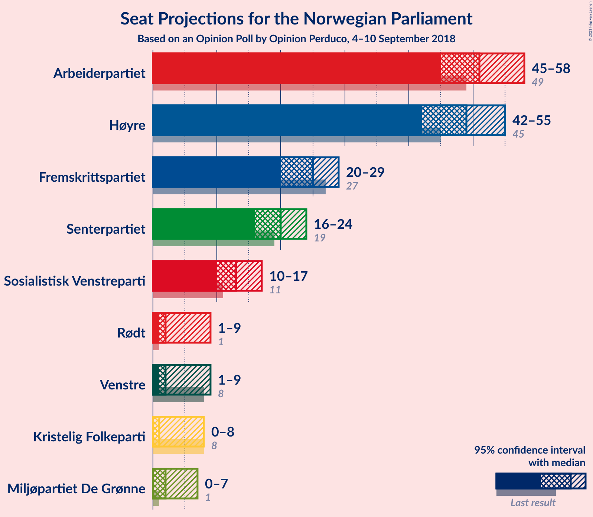

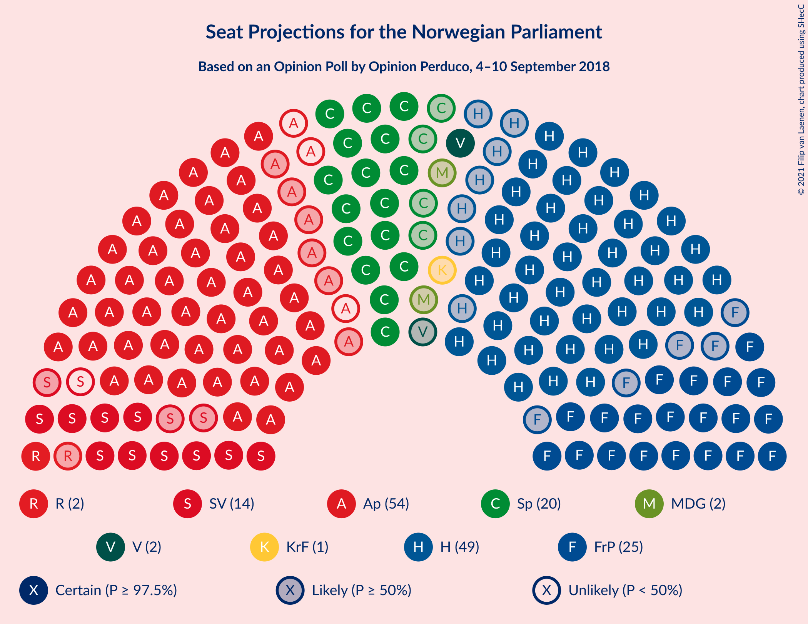

### Confidence Intervals

| Party | Last Result | Median | 80% Confidence Interval | 90% Confidence Interval | 95% Confidence Interval | 99% Confidence Interval |
|:-----:|:-----------:|:------:|:-----------------------:|:-----------------------:|:-----------------------:|:-----------------------:|
| <a href="#arbeiderpartiet">Arbeiderpartiet</a> | 49 | 51 | 47–56 |46–57 |45–58 |43–60 |
| <a href="#høyre">Høyre</a> | 45 | 49 | 45–53 |44–54 |42–55 |41–58 |
| <a href="#fremskrittspartiet">Fremskrittspartiet</a> | 27 | 25 | 21–28 |20–29 |20–29 |18–31 |
| <a href="#senterpartiet">Senterpartiet</a> | 19 | 20 | 17–22 |16–24 |16–24 |14–27 |
| <a href="#sosialistisk-venstreparti">Sosialistisk Venstreparti</a> | 11 | 13 | 11–15 |10–16 |10–17 |9–19 |
| <a href="#rødt">Rødt</a> | 1 | 2 | 1–8 |1–9 |1–9 |1–10 |
| <a href="#venstre">Venstre</a> | 8 | 2 | 2–8 |2–9 |1–9 |1–10 |
| <a href="#miljøpartiet-de-grønne">Miljøpartiet De Grønne</a> | 1 | 2 | 1–3 |0–7 |0–7 |0–8 |
| <a href="#kristelig-folkeparti">Kristelig Folkeparti</a> | 8 | 1 | 0–3 |0–8 |0–8 |0–9 |

### Arbeiderpartiet

*For a full overview of the results for this party, see the [Arbeiderpartiet](party-arbeiderpartiet.html) page.*

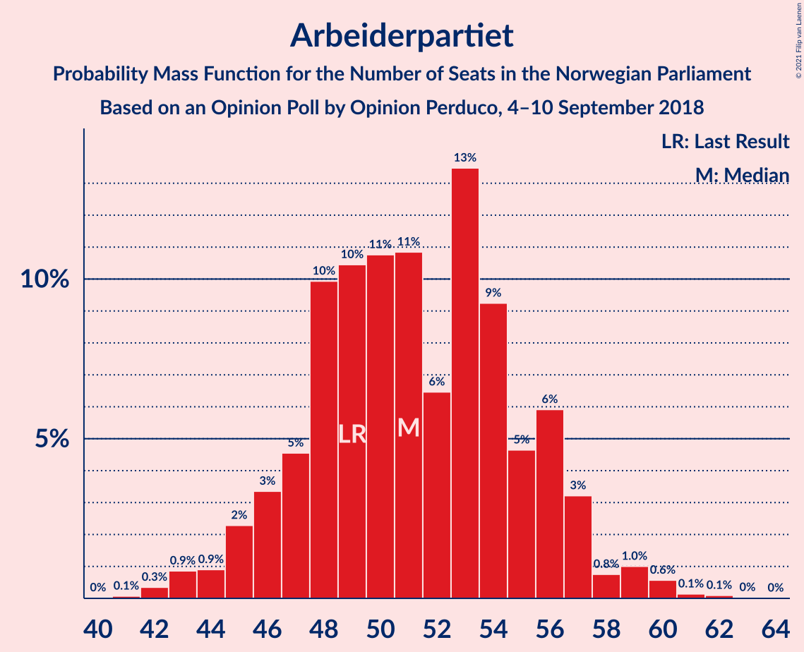

| Number of Seats | Probability | Accumulated | Special Marks |
|:---------------:|:-----------:|:-----------:|:-------------:|
| 41 | 0.1% | 100% |  |
| 42 | 0.3% | 99.9% |  |
| 43 | 0.9% | 99.6% |  |
| 44 | 0.9% | 98.7% |  |
| 45 | 2% | 98% |  |
| 46 | 3% | 95% |  |
| 47 | 5% | 92% |  |
| 48 | 10% | 88% |  |
| 49 | 10% | 78% | Last Result |
| 50 | 11% | 67% |  |
| 51 | 11% | 56% | Median |
| 52 | 6% | 46% |  |
| 53 | 13% | 39% |  |
| 54 | 9% | 26% |  |
| 55 | 5% | 16% |  |
| 56 | 6% | 12% |  |
| 57 | 3% | 6% |  |
| 58 | 0.8% | 3% |  |
| 59 | 1.0% | 2% |  |
| 60 | 0.6% | 0.9% |  |
| 61 | 0.1% | 0.3% |  |
| 62 | 0.1% | 0.1% |  |
| 63 | 0% | 0% |  |

### Høyre

*For a full overview of the results for this party, see the [Høyre](party-høyre.html) page.*

| Number of Seats | Probability | Accumulated | Special Marks |
|:---------------:|:-----------:|:-----------:|:-------------:|
| 38 | 0% | 100% |  |
| 39 | 0.1% | 99.9% |  |
| 40 | 0.3% | 99.8% |  |
| 41 | 1.1% | 99.6% |  |
| 42 | 1.1% | 98% |  |
| 43 | 2% | 97% |  |
| 44 | 3% | 95% |  |
| 45 | 4% | 92% | Last Result |
| 46 | 5% | 88% |  |
| 47 | 9% | 83% |  |
| 48 | 12% | 74% |  |
| 49 | 24% | 63% | Median |
| 50 | 7% | 39% |  |
| 51 | 9% | 32% |  |
| 52 | 13% | 23% |  |
| 53 | 5% | 10% |  |
| 54 | 1.3% | 5% |  |
| 55 | 1.5% | 4% |  |
| 56 | 0.9% | 2% |  |
| 57 | 0.6% | 1.4% |  |
| 58 | 0.4% | 0.8% |  |
| 59 | 0.2% | 0.4% |  |
| 60 | 0.2% | 0.3% |  |
| 61 | 0% | 0.1% |  |
| 62 | 0% | 0% |  |

### Fremskrittspartiet

*For a full overview of the results for this party, see the [Fremskrittspartiet](party-fremskrittspartiet.html) page.*

| Number of Seats | Probability | Accumulated | Special Marks |
|:---------------:|:-----------:|:-----------:|:-------------:|
| 17 | 0.1% | 100% |  |
| 18 | 0.6% | 99.8% |  |
| 19 | 2% | 99.2% |  |
| 20 | 3% | 98% |  |
| 21 | 9% | 95% |  |
| 22 | 12% | 86% |  |
| 23 | 10% | 74% |  |
| 24 | 10% | 64% |  |
| 25 | 23% | 53% | Median |
| 26 | 15% | 30% |  |
| 27 | 4% | 15% | Last Result |
| 28 | 6% | 11% |  |
| 29 | 3% | 5% |  |
| 30 | 2% | 2% |  |
| 31 | 0.3% | 0.7% |  |
| 32 | 0.2% | 0.3% |  |
| 33 | 0.1% | 0.1% |  |
| 34 | 0% | 0% |  |

### Senterpartiet

*For a full overview of the results for this party, see the [Senterpartiet](party-senterpartiet.html) page.*

| Number of Seats | Probability | Accumulated | Special Marks |
|:---------------:|:-----------:|:-----------:|:-------------:|
| 13 | 0.1% | 100% |  |
| 14 | 0.5% | 99.9% |  |
| 15 | 1.5% | 99.4% |  |
| 16 | 4% | 98% |  |
| 17 | 9% | 94% |  |
| 18 | 14% | 85% |  |
| 19 | 15% | 71% | Last Result |
| 20 | 26% | 56% | Median |
| 21 | 12% | 29% |  |
| 22 | 8% | 18% |  |
| 23 | 4% | 10% |  |
| 24 | 4% | 5% |  |
| 25 | 0.6% | 2% |  |
| 26 | 0.7% | 1.2% |  |
| 27 | 0.4% | 0.5% |  |
| 28 | 0.1% | 0.1% |  |
| 29 | 0% | 0% |  |

### Sosialistisk Venstreparti

*For a full overview of the results for this party, see the [Sosialistisk Venstreparti](party-sosialistiskvenstreparti.html) page.*

| Number of Seats | Probability | Accumulated | Special Marks |
|:---------------:|:-----------:|:-----------:|:-------------:|
| 8 | 0.1% | 100% |  |
| 9 | 1.5% | 99.8% |  |
| 10 | 5% | 98% |  |
| 11 | 9% | 94% | Last Result |
| 12 | 25% | 85% |  |
| 13 | 22% | 59% | Median |
| 14 | 20% | 38% |  |
| 15 | 9% | 18% |  |
| 16 | 5% | 9% |  |
| 17 | 2% | 4% |  |
| 18 | 2% | 2% |  |
| 19 | 0.4% | 0.5% |  |
| 20 | 0.1% | 0.1% |  |
| 21 | 0% | 0% |  |

### Rødt

*For a full overview of the results for this party, see the [Rødt](party-rødt.html) page.*

| Number of Seats | Probability | Accumulated | Special Marks |
|:---------------:|:-----------:|:-----------:|:-------------:|
| 1 | 19% | 100% | Last Result |
| 2 | 48% | 81% | Median |
| 3 | 0% | 32% |  |
| 4 | 0% | 32% |  |
| 5 | 0% | 32% |  |
| 6 | 0% | 32% |  |
| 7 | 9% | 32% |  |
| 8 | 15% | 24% |  |
| 9 | 7% | 8% |  |
| 10 | 1.3% | 2% |  |
| 11 | 0.4% | 0.4% |  |
| 12 | 0.1% | 0.1% |  |
| 13 | 0% | 0% |  |

### Venstre

*For a full overview of the results for this party, see the [Venstre](party-venstre.html) page.*

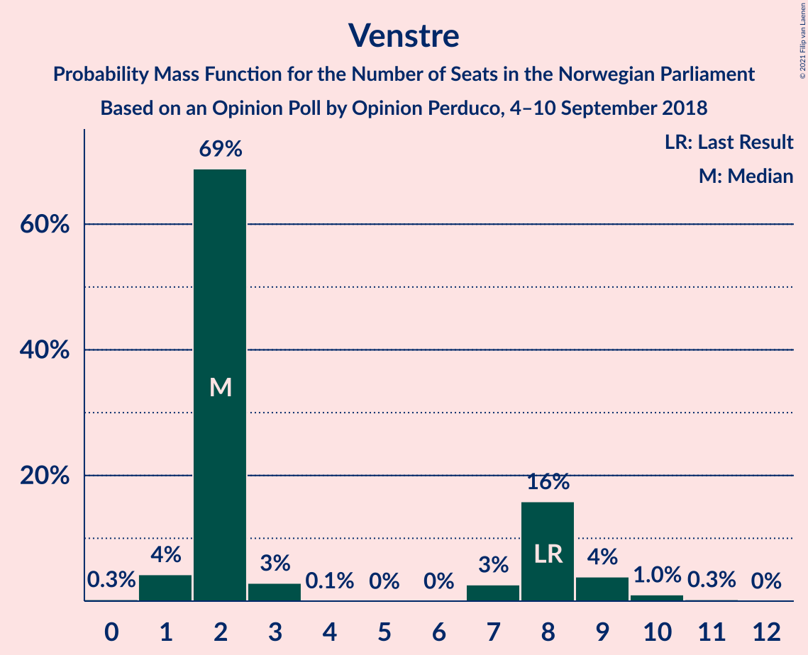

| Number of Seats | Probability | Accumulated | Special Marks |
|:---------------:|:-----------:|:-----------:|:-------------:|
| 0 | 0.3% | 100% |  |
| 1 | 4% | 99.7% |  |
| 2 | 69% | 95% | Median |
| 3 | 3% | 27% |  |
| 4 | 0.1% | 24% |  |
| 5 | 0% | 24% |  |
| 6 | 0% | 24% |  |
| 7 | 3% | 24% |  |
| 8 | 16% | 21% | Last Result |
| 9 | 4% | 5% |  |
| 10 | 1.0% | 1.3% |  |
| 11 | 0.3% | 0.3% |  |
| 12 | 0% | 0% |  |

### Miljøpartiet De Grønne

*For a full overview of the results for this party, see the [Miljøpartiet De Grønne](party-miljøpartietdegrønne.html) page.*

| Number of Seats | Probability | Accumulated | Special Marks |
|:---------------:|:-----------:|:-----------:|:-------------:|
| 0 | 8% | 100% |  |
| 1 | 5% | 92% | Last Result |
| 2 | 55% | 87% | Median |
| 3 | 26% | 32% |  |
| 4 | 0.5% | 7% |  |
| 5 | 0% | 6% |  |
| 6 | 0% | 6% |  |
| 7 | 4% | 6% |  |
| 8 | 1.3% | 2% |  |
| 9 | 0% | 0.3% |  |
| 10 | 0.1% | 0.3% |  |
| 11 | 0.1% | 0.2% |  |
| 12 | 0% | 0% |  |

### Kristelig Folkeparti

*For a full overview of the results for this party, see the [Kristelig Folkeparti](party-kristeligfolkeparti.html) page.*

| Number of Seats | Probability | Accumulated | Special Marks |
|:---------------:|:-----------:|:-----------:|:-------------:|
| 0 | 14% | 100% |  |
| 1 | 47% | 86% | Median |
| 2 | 10% | 39% |  |
| 3 | 23% | 30% |  |
| 4 | 0% | 7% |  |
| 5 | 0% | 7% |  |
| 6 | 0% | 7% |  |
| 7 | 2% | 7% |  |
| 8 | 3% | 5% | Last Result |
| 9 | 2% | 2% |  |
| 10 | 0.3% | 0.3% |  |
| 11 | 0% | 0.1% |  |
| 12 | 0% | 0% |  |

## Coalitions

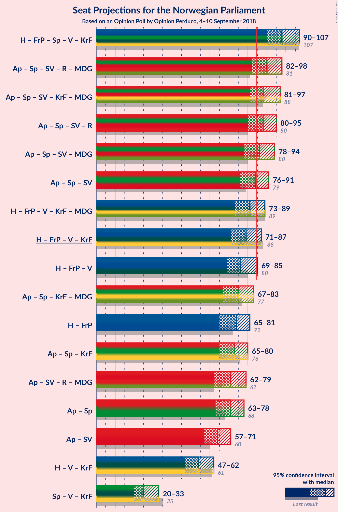

### Confidence Intervals

| Coalition | Last Result | Median | Majority? | 80% Confidence Interval | 90% Confidence Interval | 95% Confidence Interval | 99% Confidence Interval |
|:---------:|:-----------:|:------:|:---------:|:-----------------------:|:-----------------------:|:-----------------------:|:-----------------------:|
| Høyre – Fremskrittspartiet – Senterpartiet – Venstre – Kristelig Folkeparti | 107 | 98 | 99.9% | 93–104 | 91–105 | 90–107 | 88–108 |
| Arbeiderpartiet – Senterpartiet – Sosialistisk Venstreparti – Rødt – Miljøpartiet De Grønne | 81 | 90 | 91% | 85–95 | 83–96 | 82–98 | 80–101 |
| Arbeiderpartiet – Senterpartiet – Sosialistisk Venstreparti – Kristelig Folkeparti – Miljøpartiet De Grønne | 88 | 88 | 83% | 83–94 | 82–95 | 81–97 | 78–99 |
| Arbeiderpartiet – Senterpartiet – Sosialistisk Venstreparti – Rødt | 80 | 88 | 79% | 83–93 | 81–94 | 80–95 | 77–99 |
| Arbeiderpartiet – Senterpartiet – Sosialistisk Venstreparti – Miljøpartiet De Grønne | 80 | 86 | 67% | 81–92 | 80–93 | 78–94 | 76–97 |
| Arbeiderpartiet – Senterpartiet – Sosialistisk Venstreparti | 79 | 84 | 46% | 79–89 | 78–90 | 76–91 | 74–94 |
| Høyre – Fremskrittspartiet – Venstre – Kristelig Folkeparti – Miljøpartiet De Grønne | 89 | 81 | 20% | 76–86 | 75–88 | 73–89 | 70–92 |
| Høyre – Fremskrittspartiet – Venstre – Kristelig Folkeparti | 88 | 79 | 9% | 74–84 | 73–86 | 71–87 | 68–89 |
| Høyre – Fremskrittspartiet – Venstre | 80 | 76 | 3% | 72–83 | 70–83 | 69–85 | 66–87 |
| Arbeiderpartiet – Senterpartiet – Kristelig Folkeparti – Miljøpartiet De Grønne | 77 | 75 | 1.2% | 70–81 | 68–82 | 67–83 | 65–86 |
| Høyre – Fremskrittspartiet | 72 | 74 | 0.2% | 69–78 | 67–80 | 65–81 | 63–83 |
| Arbeiderpartiet – Senterpartiet – Kristelig Folkeparti | 76 | 73 | 0.2% | 68–78 | 66–79 | 65–80 | 63–83 |
| Arbeiderpartiet – Sosialistisk Venstreparti – Rødt – Miljøpartiet De Grønne | 62 | 71 | 0% | 65–76 | 64–77 | 62–79 | 60–81 |
| Arbeiderpartiet – Senterpartiet | 68 | 71 | 0% | 66–76 | 64–77 | 63–78 | 61–81 |
| Arbeiderpartiet – Sosialistisk Venstreparti | 60 | 64 | 0% | 60–69 | 58–70 | 57–71 | 55–74 |
| Høyre – Venstre – Kristelig Folkeparti | 61 | 54 | 0% | 50–60 | 49–61 | 47–62 | 45–65 |
| Senterpartiet – Venstre – Kristelig Folkeparti | 35 | 25 | 0% | 21–30 | 20–31 | 20–33 | 18–35 |

### Høyre – Fremskrittspartiet – Senterpartiet – Venstre – Kristelig Folkeparti

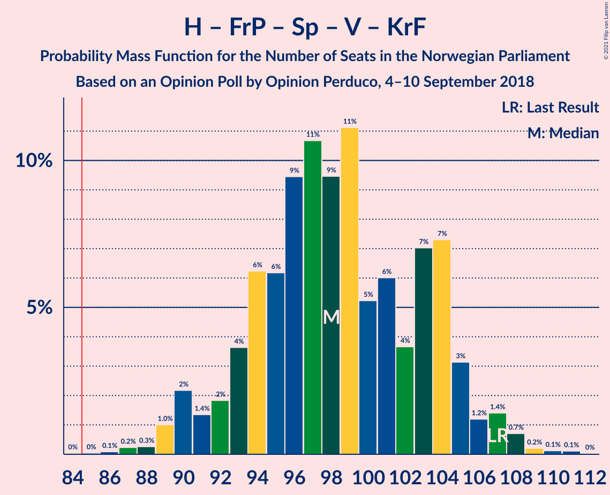

| Number of Seats | Probability | Accumulated | Special Marks |
|:---------------:|:-----------:|:-----------:|:-------------:|
| 84 | 0% | 100% |  |
| 85 | 0% | 99.9% | Majority |
| 86 | 0.1% | 99.9% |  |
| 87 | 0.2% | 99.8% |  |
| 88 | 0.3% | 99.6% |  |
| 89 | 1.0% | 99.3% |  |
| 90 | 2% | 98% |  |
| 91 | 1.4% | 96% |  |
| 92 | 2% | 95% |  |
| 93 | 4% | 93% |  |
| 94 | 6% | 89% |  |
| 95 | 6% | 83% |  |
| 96 | 9% | 77% |  |
| 97 | 11% | 67% | Median |
| 98 | 9% | 57% |  |
| 99 | 11% | 47% |  |
| 100 | 5% | 36% |  |
| 101 | 6% | 31% |  |
| 102 | 4% | 25% |  |
| 103 | 7% | 21% |  |
| 104 | 7% | 14% |  |
| 105 | 3% | 7% |  |
| 106 | 1.2% | 4% |  |
| 107 | 1.4% | 3% | Last Result |
| 108 | 0.7% | 1.2% |  |
| 109 | 0.2% | 0.5% |  |
| 110 | 0.1% | 0.3% |  |
| 111 | 0.1% | 0.2% |  |
| 112 | 0% | 0% |  |

### Arbeiderpartiet – Senterpartiet – Sosialistisk Venstreparti – Rødt – Miljøpartiet De Grønne

| Number of Seats | Probability | Accumulated | Special Marks |
|:---------------:|:-----------:|:-----------:|:-------------:|
| 77 | 0.1% | 100% |  |
| 78 | 0.2% | 99.9% |  |
| 79 | 0.2% | 99.7% |  |
| 80 | 0.5% | 99.5% |  |
| 81 | 0.9% | 99.0% | Last Result |
| 82 | 0.9% | 98% |  |
| 83 | 4% | 97% |  |
| 84 | 2% | 93% |  |
| 85 | 5% | 91% | Majority |
| 86 | 5% | 85% |  |
| 87 | 6% | 80% |  |
| 88 | 8% | 74% | Median |
| 89 | 5% | 66% |  |
| 90 | 12% | 61% |  |
| 91 | 7% | 49% |  |
| 92 | 16% | 41% |  |
| 93 | 5% | 25% |  |
| 94 | 7% | 20% |  |
| 95 | 5% | 13% |  |
| 96 | 4% | 8% |  |
| 97 | 2% | 5% |  |
| 98 | 1.1% | 3% |  |
| 99 | 0.6% | 2% |  |
| 100 | 0.6% | 1.3% |  |
| 101 | 0.5% | 0.7% |  |
| 102 | 0.2% | 0.3% |  |
| 103 | 0.1% | 0.1% |  |
| 104 | 0% | 0% |  |

### Arbeiderpartiet – Senterpartiet – Sosialistisk Venstreparti – Kristelig Folkeparti – Miljøpartiet De Grønne

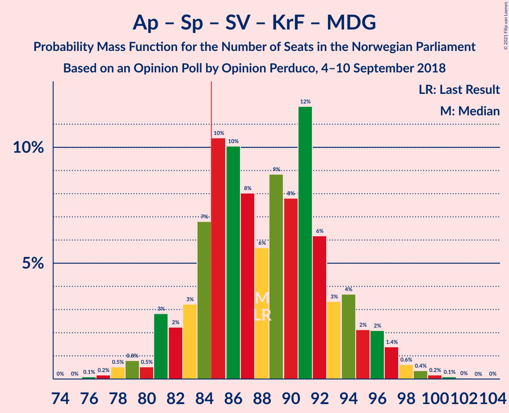

| Number of Seats | Probability | Accumulated | Special Marks |
|:---------------:|:-----------:|:-----------:|:-------------:|
| 76 | 0.1% | 100% |  |
| 77 | 0.2% | 99.9% |  |
| 78 | 0.5% | 99.7% |  |
| 79 | 0.8% | 99.2% |  |
| 80 | 0.5% | 98% |  |
| 81 | 3% | 98% |  |
| 82 | 2% | 95% |  |
| 83 | 3% | 93% |  |
| 84 | 7% | 90% |  |
| 85 | 10% | 83% | Majority |
| 86 | 10% | 72% |  |
| 87 | 8% | 62% | Median |
| 88 | 6% | 54% | Last Result |
| 89 | 9% | 49% |  |
| 90 | 8% | 40% |  |
| 91 | 12% | 32% |  |
| 92 | 6% | 20% |  |
| 93 | 3% | 14% |  |
| 94 | 4% | 11% |  |
| 95 | 2% | 7% |  |
| 96 | 2% | 5% |  |
| 97 | 1.4% | 3% |  |
| 98 | 0.6% | 1.3% |  |
| 99 | 0.4% | 0.7% |  |
| 100 | 0.2% | 0.4% |  |
| 101 | 0.1% | 0.2% |  |
| 102 | 0% | 0.1% |  |
| 103 | 0% | 0% |  |

### Arbeiderpartiet – Senterpartiet – Sosialistisk Venstreparti – Rødt

| Number of Seats | Probability | Accumulated | Special Marks |
|:---------------:|:-----------:|:-----------:|:-------------:|
| 74 | 0% | 100% |  |
| 75 | 0.1% | 99.9% |  |
| 76 | 0.3% | 99.8% |  |
| 77 | 0.3% | 99.6% |  |
| 78 | 0.8% | 99.3% |  |
| 79 | 0.6% | 98% |  |
| 80 | 1.0% | 98% | Last Result |
| 81 | 4% | 97% |  |
| 82 | 2% | 93% |  |
| 83 | 7% | 91% |  |
| 84 | 5% | 84% |  |
| 85 | 6% | 79% | Majority |
| 86 | 8% | 73% | Median |
| 87 | 12% | 64% |  |
| 88 | 6% | 52% |  |
| 89 | 15% | 46% |  |
| 90 | 9% | 31% |  |
| 91 | 5% | 22% |  |
| 92 | 5% | 17% |  |
| 93 | 5% | 12% |  |
| 94 | 3% | 7% |  |
| 95 | 2% | 4% |  |
| 96 | 0.7% | 2% |  |
| 97 | 0.6% | 2% |  |
| 98 | 0.5% | 1.2% |  |
| 99 | 0.4% | 0.7% |  |
| 100 | 0.1% | 0.2% |  |
| 101 | 0.1% | 0.1% |  |
| 102 | 0% | 0% |  |

### Arbeiderpartiet – Senterpartiet – Sosialistisk Venstreparti – Miljøpartiet De Grønne

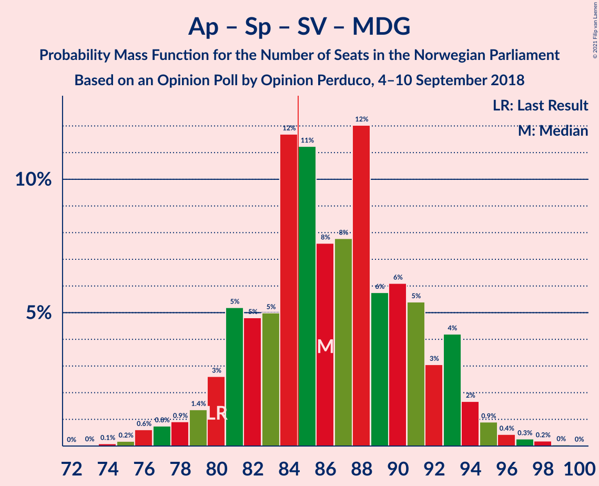

| Number of Seats | Probability | Accumulated | Special Marks |
|:---------------:|:-----------:|:-----------:|:-------------:|
| 73 | 0% | 100% |  |
| 74 | 0.1% | 99.9% |  |
| 75 | 0.2% | 99.8% |  |
| 76 | 0.6% | 99.7% |  |
| 77 | 0.8% | 99.1% |  |
| 78 | 0.9% | 98% |  |
| 79 | 1.4% | 97% |  |
| 80 | 3% | 96% | Last Result |
| 81 | 5% | 93% |  |
| 82 | 5% | 88% |  |
| 83 | 5% | 83% |  |
| 84 | 12% | 78% |  |
| 85 | 11% | 67% | Majority |
| 86 | 8% | 55% | Median |
| 87 | 8% | 48% |  |
| 88 | 12% | 40% |  |
| 89 | 6% | 28% |  |
| 90 | 6% | 22% |  |
| 91 | 5% | 16% |  |
| 92 | 3% | 11% |  |
| 93 | 4% | 8% |  |
| 94 | 2% | 4% |  |
| 95 | 0.9% | 2% |  |
| 96 | 0.4% | 1.0% |  |
| 97 | 0.3% | 0.5% |  |
| 98 | 0.2% | 0.3% |  |
| 99 | 0% | 0.1% |  |
| 100 | 0% | 0% |  |

### Arbeiderpartiet – Senterpartiet – Sosialistisk Venstreparti

| Number of Seats | Probability | Accumulated | Special Marks |
|:---------------:|:-----------:|:-----------:|:-------------:|
| 71 | 0.1% | 100% |  |
| 72 | 0.1% | 99.9% |  |
| 73 | 0.2% | 99.8% |  |
| 74 | 0.5% | 99.6% |  |
| 75 | 1.3% | 99.0% |  |
| 76 | 1.3% | 98% |  |
| 77 | 1.1% | 96% |  |
| 78 | 3% | 95% |  |
| 79 | 5% | 92% | Last Result |
| 80 | 5% | 87% |  |
| 81 | 6% | 83% |  |
| 82 | 15% | 76% |  |
| 83 | 7% | 61% |  |
| 84 | 8% | 54% | Median |
| 85 | 13% | 46% | Majority |
| 86 | 6% | 33% |  |
| 87 | 9% | 27% |  |
| 88 | 6% | 18% |  |
| 89 | 2% | 12% |  |
| 90 | 5% | 10% |  |
| 91 | 3% | 5% |  |
| 92 | 0.7% | 2% |  |
| 93 | 0.8% | 2% |  |
| 94 | 0.3% | 0.7% |  |
| 95 | 0.2% | 0.4% |  |
| 96 | 0.1% | 0.2% |  |
| 97 | 0% | 0.1% |  |
| 98 | 0% | 0% |  |

### Høyre – Fremskrittspartiet – Venstre – Kristelig Folkeparti – Miljøpartiet De Grønne

| Number of Seats | Probability | Accumulated | Special Marks |
|:---------------:|:-----------:|:-----------:|:-------------:|
| 68 | 0.1% | 100% |  |
| 69 | 0.2% | 99.9% |  |
| 70 | 0.4% | 99.7% |  |
| 71 | 0.5% | 99.3% |  |
| 72 | 0.6% | 98.7% |  |
| 73 | 0.8% | 98% |  |
| 74 | 2% | 97% |  |
| 75 | 3% | 96% |  |
| 76 | 5% | 92% |  |
| 77 | 5% | 88% |  |
| 78 | 6% | 82% |  |
| 79 | 9% | 77% | Median |
| 80 | 16% | 68% |  |
| 81 | 6% | 52% |  |
| 82 | 12% | 46% |  |
| 83 | 8% | 35% |  |
| 84 | 6% | 26% |  |
| 85 | 4% | 20% | Majority |
| 86 | 7% | 16% |  |
| 87 | 2% | 9% |  |
| 88 | 4% | 7% |  |
| 89 | 1.0% | 3% | Last Result |
| 90 | 0.6% | 2% |  |
| 91 | 0.8% | 1.4% |  |
| 92 | 0.3% | 0.6% |  |
| 93 | 0.2% | 0.4% |  |
| 94 | 0.1% | 0.1% |  |
| 95 | 0% | 0.1% |  |
| 96 | 0% | 0% |  |

### Høyre – Fremskrittspartiet – Venstre – Kristelig Folkeparti

| Number of Seats | Probability | Accumulated | Special Marks |
|:---------------:|:-----------:|:-----------:|:-------------:|
| 66 | 0.1% | 100% |  |
| 67 | 0.2% | 99.9% |  |
| 68 | 0.5% | 99.7% |  |
| 69 | 0.6% | 99.2% |  |
| 70 | 0.6% | 98.6% |  |
| 71 | 1.2% | 98% |  |
| 72 | 2% | 97% |  |
| 73 | 4% | 95% |  |
| 74 | 5% | 91% |  |
| 75 | 8% | 86% |  |
| 76 | 5% | 79% |  |
| 77 | 16% | 74% | Median |
| 78 | 7% | 57% |  |
| 79 | 12% | 50% |  |
| 80 | 5% | 38% |  |
| 81 | 8% | 33% |  |
| 82 | 6% | 25% |  |
| 83 | 5% | 19% |  |
| 84 | 5% | 14% |  |
| 85 | 2% | 9% | Majority |
| 86 | 4% | 7% |  |
| 87 | 0.8% | 3% |  |
| 88 | 0.8% | 2% | Last Result |
| 89 | 0.5% | 0.9% |  |
| 90 | 0.1% | 0.4% |  |
| 91 | 0.1% | 0.3% |  |
| 92 | 0.1% | 0.1% |  |
| 93 | 0% | 0% |  |

### Høyre – Fremskrittspartiet – Venstre

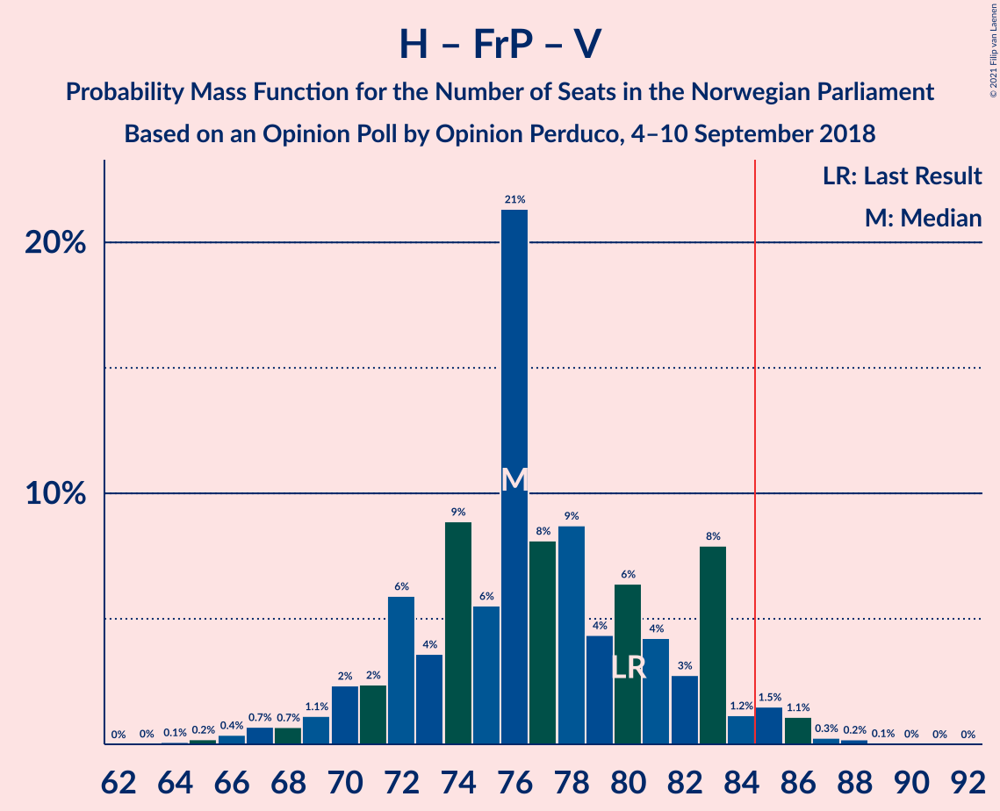

| Number of Seats | Probability | Accumulated | Special Marks |
|:---------------:|:-----------:|:-----------:|:-------------:|
| 63 | 0% | 100% |  |
| 64 | 0.1% | 99.9% |  |
| 65 | 0.2% | 99.9% |  |
| 66 | 0.4% | 99.7% |  |
| 67 | 0.7% | 99.3% |  |
| 68 | 0.7% | 98.6% |  |
| 69 | 1.1% | 98% |  |
| 70 | 2% | 97% |  |
| 71 | 2% | 94% |  |
| 72 | 6% | 92% |  |
| 73 | 4% | 86% |  |
| 74 | 9% | 83% |  |
| 75 | 6% | 74% |  |
| 76 | 21% | 68% | Median |
| 77 | 8% | 47% |  |
| 78 | 9% | 39% |  |
| 79 | 4% | 30% |  |
| 80 | 6% | 26% | Last Result |
| 81 | 4% | 19% |  |
| 82 | 3% | 15% |  |
| 83 | 8% | 12% |  |
| 84 | 1.2% | 4% |  |
| 85 | 1.5% | 3% | Majority |
| 86 | 1.1% | 2% |  |
| 87 | 0.3% | 0.6% |  |
| 88 | 0.2% | 0.3% |  |
| 89 | 0.1% | 0.1% |  |
| 90 | 0% | 0.1% |  |
| 91 | 0% | 0% |  |

### Arbeiderpartiet – Senterpartiet – Kristelig Folkeparti – Miljøpartiet De Grønne

| Number of Seats | Probability | Accumulated | Special Marks |
|:---------------:|:-----------:|:-----------:|:-------------:|
| 63 | 0.1% | 100% |  |
| 64 | 0.2% | 99.9% |  |
| 65 | 0.3% | 99.7% |  |
| 66 | 0.6% | 99.5% |  |
| 67 | 2% | 98.9% |  |
| 68 | 2% | 96% |  |
| 69 | 3% | 95% |  |
| 70 | 3% | 92% |  |
| 71 | 9% | 89% |  |
| 72 | 7% | 80% |  |
| 73 | 8% | 73% |  |
| 74 | 12% | 64% | Median |
| 75 | 7% | 53% |  |
| 76 | 9% | 46% |  |
| 77 | 7% | 37% | Last Result |
| 78 | 4% | 30% |  |
| 79 | 13% | 26% |  |
| 80 | 2% | 13% |  |
| 81 | 4% | 11% |  |
| 82 | 2% | 7% |  |
| 83 | 3% | 5% |  |
| 84 | 0.9% | 2% |  |
| 85 | 0.4% | 1.2% | Majority |
| 86 | 0.4% | 0.8% |  |
| 87 | 0.2% | 0.4% |  |
| 88 | 0.1% | 0.2% |  |
| 89 | 0% | 0.1% |  |
| 90 | 0% | 0.1% |  |
| 91 | 0% | 0% |  |

### Høyre – Fremskrittspartiet

| Number of Seats | Probability | Accumulated | Special Marks |
|:---------------:|:-----------:|:-----------:|:-------------:|
| 60 | 0% | 100% |  |
| 61 | 0.1% | 99.9% |  |
| 62 | 0.2% | 99.8% |  |
| 63 | 0.3% | 99.6% |  |
| 64 | 0.8% | 99.3% |  |
| 65 | 2% | 98.5% |  |
| 66 | 1.3% | 97% |  |
| 67 | 2% | 96% |  |
| 68 | 3% | 94% |  |
| 69 | 4% | 91% |  |
| 70 | 7% | 86% |  |
| 71 | 4% | 79% |  |
| 72 | 10% | 75% | Last Result |
| 73 | 7% | 65% |  |
| 74 | 22% | 58% | Median |
| 75 | 12% | 36% |  |
| 76 | 7% | 23% |  |
| 77 | 4% | 16% |  |
| 78 | 4% | 12% |  |
| 79 | 2% | 8% |  |
| 80 | 2% | 5% |  |
| 81 | 2% | 3% |  |
| 82 | 0.6% | 2% |  |
| 83 | 0.7% | 1.1% |  |
| 84 | 0.2% | 0.4% |  |
| 85 | 0.1% | 0.2% | Majority |
| 86 | 0% | 0.1% |  |
| 87 | 0% | 0% |  |

### Arbeiderpartiet – Senterpartiet – Kristelig Folkeparti

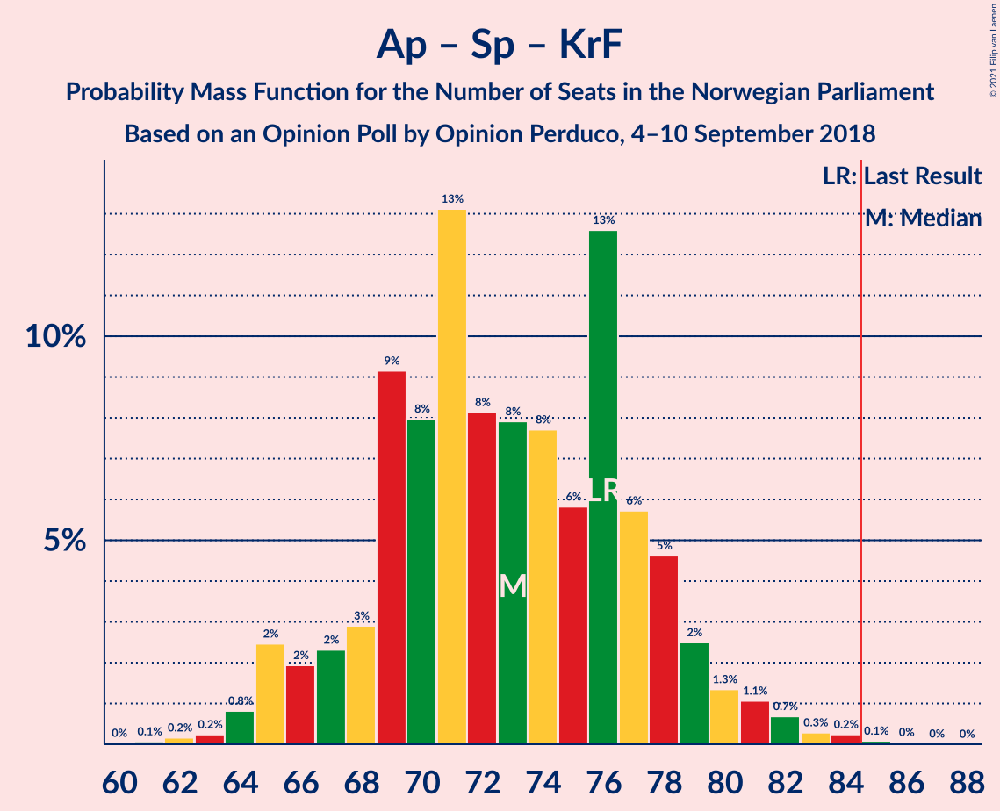

| Number of Seats | Probability | Accumulated | Special Marks |
|:---------------:|:-----------:|:-----------:|:-------------:|
| 61 | 0.1% | 100% |  |
| 62 | 0.2% | 99.9% |  |
| 63 | 0.2% | 99.7% |  |
| 64 | 0.8% | 99.5% |  |
| 65 | 2% | 98.7% |  |
| 66 | 2% | 96% |  |
| 67 | 2% | 94% |  |
| 68 | 3% | 92% |  |
| 69 | 9% | 89% |  |
| 70 | 8% | 80% |  |
| 71 | 13% | 72% |  |
| 72 | 8% | 59% | Median |
| 73 | 8% | 51% |  |
| 74 | 8% | 43% |  |
| 75 | 6% | 35% |  |
| 76 | 13% | 29% | Last Result |
| 77 | 6% | 17% |  |
| 78 | 5% | 11% |  |
| 79 | 2% | 6% |  |
| 80 | 1.3% | 4% |  |
| 81 | 1.1% | 2% |  |
| 82 | 0.7% | 1.4% |  |
| 83 | 0.3% | 0.7% |  |
| 84 | 0.2% | 0.4% |  |
| 85 | 0.1% | 0.2% | Majority |
| 86 | 0% | 0.1% |  |
| 87 | 0% | 0% |  |

### Arbeiderpartiet – Sosialistisk Venstreparti – Rødt – Miljøpartiet De Grønne

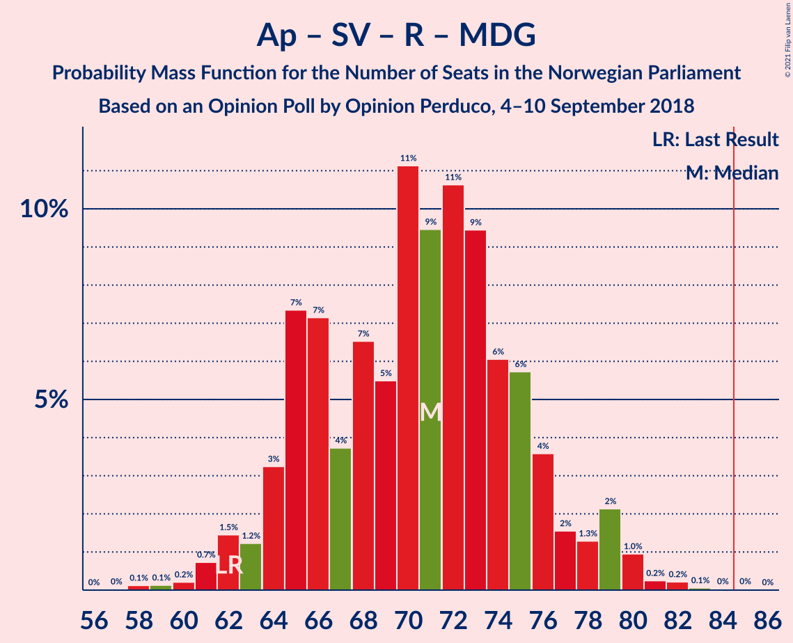

| Number of Seats | Probability | Accumulated | Special Marks |
|:---------------:|:-----------:|:-----------:|:-------------:|
| 58 | 0.1% | 100% |  |
| 59 | 0.1% | 99.8% |  |
| 60 | 0.2% | 99.7% |  |
| 61 | 0.7% | 99.5% |  |
| 62 | 1.5% | 98.8% | Last Result |
| 63 | 1.2% | 97% |  |
| 64 | 3% | 96% |  |
| 65 | 7% | 93% |  |
| 66 | 7% | 85% |  |
| 67 | 4% | 78% |  |
| 68 | 7% | 75% | Median |
| 69 | 5% | 68% |  |
| 70 | 11% | 63% |  |
| 71 | 9% | 51% |  |
| 72 | 11% | 42% |  |
| 73 | 9% | 31% |  |
| 74 | 6% | 22% |  |
| 75 | 6% | 16% |  |
| 76 | 4% | 10% |  |
| 77 | 2% | 7% |  |
| 78 | 1.3% | 5% |  |
| 79 | 2% | 4% |  |
| 80 | 1.0% | 2% |  |
| 81 | 0.2% | 0.6% |  |
| 82 | 0.2% | 0.4% |  |
| 83 | 0.1% | 0.1% |  |
| 84 | 0% | 0.1% |  |
| 85 | 0% | 0% | Majority |

### Arbeiderpartiet – Senterpartiet

| Number of Seats | Probability | Accumulated | Special Marks |
|:---------------:|:-----------:|:-----------:|:-------------:|
| 59 | 0.1% | 100% |  |
| 60 | 0.2% | 99.9% |  |
| 61 | 0.5% | 99.7% |  |
| 62 | 0.6% | 99.2% |  |
| 63 | 1.5% | 98.5% |  |
| 64 | 2% | 97% |  |
| 65 | 3% | 95% |  |
| 66 | 3% | 92% |  |
| 67 | 7% | 89% |  |
| 68 | 10% | 82% | Last Result |
| 69 | 7% | 72% |  |
| 70 | 12% | 65% |  |
| 71 | 7% | 53% | Median |
| 72 | 10% | 46% |  |
| 73 | 13% | 36% |  |
| 74 | 5% | 23% |  |
| 75 | 7% | 18% |  |
| 76 | 3% | 11% |  |
| 77 | 4% | 7% |  |
| 78 | 0.9% | 3% |  |
| 79 | 1.4% | 2% |  |
| 80 | 0.5% | 1.0% |  |
| 81 | 0.3% | 0.5% |  |
| 82 | 0.1% | 0.3% |  |
| 83 | 0.1% | 0.2% |  |
| 84 | 0% | 0.1% |  |
| 85 | 0% | 0% | Majority |

### Arbeiderpartiet – Sosialistisk Venstreparti

| Number of Seats | Probability | Accumulated | Special Marks |
|:---------------:|:-----------:|:-----------:|:-------------:|
| 53 | 0.1% | 100% |  |
| 54 | 0.2% | 99.9% |  |
| 55 | 0.7% | 99.7% |  |
| 56 | 0.5% | 99.0% |  |
| 57 | 1.4% | 98% |  |
| 58 | 2% | 97% |  |
| 59 | 2% | 95% |  |
| 60 | 5% | 93% | Last Result |
| 61 | 7% | 87% |  |
| 62 | 15% | 80% |  |
| 63 | 10% | 65% |  |
| 64 | 7% | 55% | Median |
| 65 | 13% | 48% |  |
| 66 | 9% | 34% |  |
| 67 | 6% | 25% |  |
| 68 | 3% | 19% |  |
| 69 | 7% | 16% |  |
| 70 | 5% | 9% |  |
| 71 | 1.4% | 4% |  |
| 72 | 1.1% | 2% |  |
| 73 | 0.7% | 1.4% |  |
| 74 | 0.3% | 0.7% |  |
| 75 | 0.3% | 0.4% |  |
| 76 | 0.1% | 0.1% |  |
| 77 | 0% | 0.1% |  |
| 78 | 0% | 0% |  |

### Høyre – Venstre – Kristelig Folkeparti

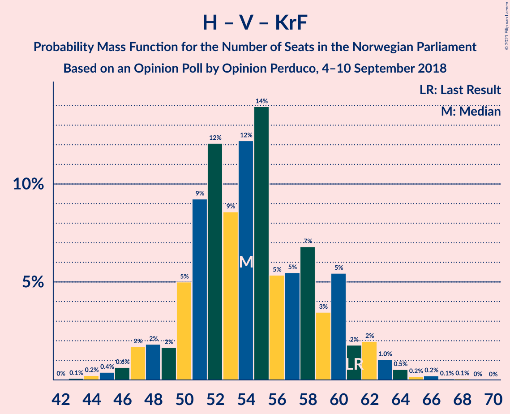

| Number of Seats | Probability | Accumulated | Special Marks |
|:---------------:|:-----------:|:-----------:|:-------------:|
| 42 | 0% | 100% |  |
| 43 | 0.1% | 99.9% |  |
| 44 | 0.2% | 99.9% |  |
| 45 | 0.4% | 99.6% |  |
| 46 | 0.6% | 99.2% |  |
| 47 | 2% | 98.6% |  |
| 48 | 2% | 97% |  |
| 49 | 2% | 95% |  |
| 50 | 5% | 93% |  |
| 51 | 9% | 88% |  |
| 52 | 12% | 79% | Median |
| 53 | 9% | 67% |  |
| 54 | 12% | 59% |  |
| 55 | 14% | 46% |  |
| 56 | 5% | 32% |  |
| 57 | 5% | 27% |  |
| 58 | 7% | 22% |  |
| 59 | 3% | 15% |  |
| 60 | 5% | 11% |  |
| 61 | 2% | 6% | Last Result |
| 62 | 2% | 4% |  |
| 63 | 1.0% | 2% |  |
| 64 | 0.5% | 1.1% |  |
| 65 | 0.2% | 0.5% |  |
| 66 | 0.2% | 0.4% |  |
| 67 | 0.1% | 0.1% |  |
| 68 | 0.1% | 0.1% |  |
| 69 | 0% | 0% |  |

### Senterpartiet – Venstre – Kristelig Folkeparti

| Number of Seats | Probability | Accumulated | Special Marks |
|:---------------:|:-----------:|:-----------:|:-------------:|
| 16 | 0% | 100% |  |
| 17 | 0.3% | 99.9% |  |
| 18 | 0.6% | 99.7% |  |
| 19 | 1.2% | 99.1% |  |
| 20 | 5% | 98% |  |
| 21 | 5% | 92% |  |
| 22 | 14% | 87% |  |
| 23 | 13% | 73% | Median |
| 24 | 8% | 61% |  |
| 25 | 15% | 53% |  |
| 26 | 8% | 38% |  |
| 27 | 5% | 29% |  |
| 28 | 5% | 24% |  |
| 29 | 8% | 19% |  |
| 30 | 3% | 11% |  |
| 31 | 3% | 8% |  |
| 32 | 1.4% | 4% |  |
| 33 | 1.2% | 3% |  |
| 34 | 1.0% | 2% |  |
| 35 | 0.3% | 0.8% | Last Result |
| 36 | 0.2% | 0.5% |  |
| 37 | 0.1% | 0.2% |  |
| 38 | 0% | 0.1% |  |
| 39 | 0% | 0.1% |  |
| 40 | 0% | 0% |  |

## Technical Information

### Opinion Poll

+ **Polling firm:** Opinion Perduco
+ **Commissioner(s):** —
+ **Fieldwork period:** 4–10 September 2018

### Calculations

+ **Sample size:** 680
+ **Simulations done:** 1,048,576
+ **Error estimate:** 2.12%

