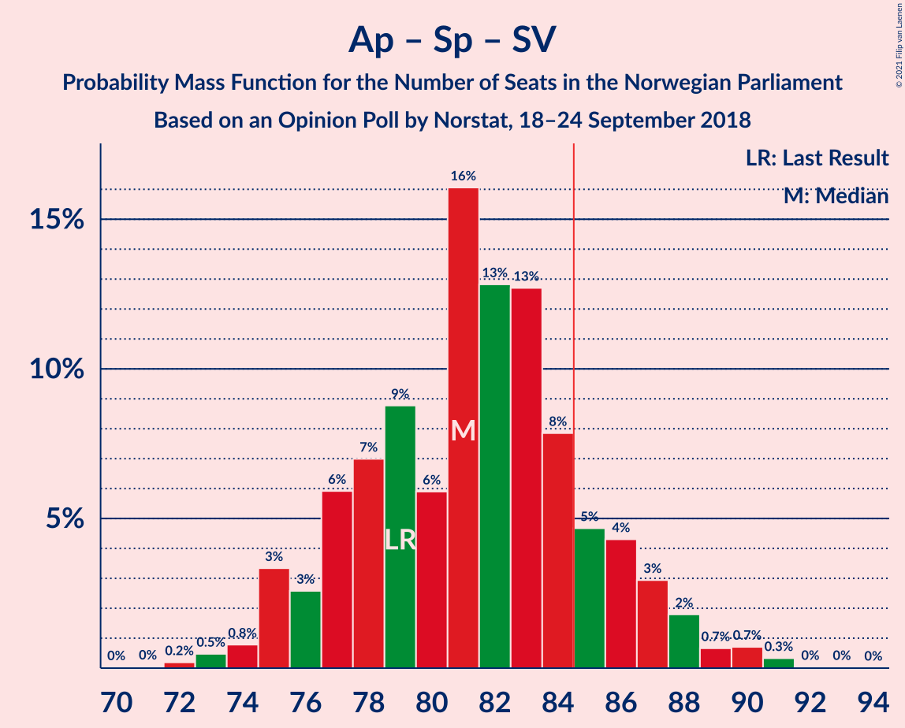

# Opinion Poll by Norstat, 18–24 September 2018

<a href="#voting-intentions">Voting Intentions</a> | <a href="#seats">Seats</a> | <a href="#coalitions">Coalitions</a> | <a href="#technical-information">Technical Information</a>

## Voting Intentions

### Confidence Intervals

| Party | Last Result | Poll Result | 80% Confidence Interval | 90% Confidence Interval | 95% Confidence Interval | 99% Confidence Interval |
|:-----:|:-----------:|:-----------:|:-----------------------:|:-----------------------:|:-----------------------:|:-----------------------:|
| Arbeiderpartiet | 27.4% | 26.6% | 24.8–28.5% |24.3–29.1% |23.9–29.6% |23.0–30.5% |
| Høyre | 25.0% | 24.4% | 22.6–26.2% |22.1–26.8% |21.7–27.2% |20.9–28.1% |
| Fremskrittspartiet | 15.2% | 15.7% | 14.2–17.3% |13.8–17.7% |13.5–18.2% |12.8–18.9% |
| Senterpartiet | 10.3% | 12.0% | 10.7–13.5% |10.4–13.9% |10.1–14.3% |9.5–15.0% |
| Sosialistisk Venstreparti | 6.0% | 6.2% | 5.3–7.4% |5.1–7.7% |4.8–8.0% |4.4–8.6% |
| Rødt | 2.4% | 5.0% | 4.2–6.1% |4.0–6.4% |3.8–6.6% |3.5–7.2% |
| Venstre | 4.4% | 3.4% | 2.8–4.3% |2.6–4.6% |2.4–4.8% |2.2–5.3% |
| Kristelig Folkeparti | 4.2% | 3.0% | 2.4–3.9% |2.2–4.1% |2.1–4.3% |1.8–4.8% |
| Miljøpartiet De Grønne | 3.2% | 2.3% | 1.7–3.0% |1.6–3.2% |1.5–3.4% |1.3–3.8% |

*Note:* The poll result column reflects the actual value used in the calculations. Published results may vary slightly, and in addition be rounded to fewer digits.

## Seats

### Confidence Intervals

| Party | Last Result | Median | 80% Confidence Interval | 90% Confidence Interval | 95% Confidence Interval | 99% Confidence Interval |
|:-----:|:-----------:|:------:|:-----------------------:|:-----------------------:|:-----------------------:|:-----------------------:|
| <a href="#arbeiderpartiet">Arbeiderpartiet</a> | 49 | 47 | 44–52 |43–53 |43–54 |41–55 |
| <a href="#høyre">Høyre</a> | 45 | 44 | 40–48 |39–48 |38–49 |37–50 |
| <a href="#fremskrittspartiet">Fremskrittspartiet</a> | 27 | 29 | 26–32 |25–33 |25–34 |23–35 |
| <a href="#senterpartiet">Senterpartiet</a> | 19 | 22 | 19–25 |19–25 |18–26 |17–28 |
| <a href="#sosialistisk-venstreparti">Sosialistisk Venstreparti</a> | 11 | 12 | 10–14 |9–14 |9–14 |8–15 |
| <a href="#rødt">Rødt</a> | 1 | 9 | 7–11 |2–11 |2–12 |2–13 |
| <a href="#venstre">Venstre</a> | 8 | 2 | 2–7 |2–8 |1–8 |1–9 |
| <a href="#kristelig-folkeparti">Kristelig Folkeparti</a> | 8 | 2 | 1–3 |0–7 |0–8 |0–9 |
| <a href="#miljøpartiet-de-grønne">Miljøpartiet De Grønne</a> | 1 | 1 | 0–1 |0–2 |0–2 |0–3 |

### Arbeiderpartiet

*For a full overview of the results for this party, see the [Arbeiderpartiet](party-arbeiderpartiet.html) page.*

| Number of Seats | Probability | Accumulated | Special Marks |
|:---------------:|:-----------:|:-----------:|:-------------:|
| 40 | 0.1% | 100% |  |
| 41 | 0.6% | 99.9% |  |
| 42 | 2% | 99.3% |  |
| 43 | 4% | 98% |  |
| 44 | 8% | 94% |  |
| 45 | 13% | 86% |  |
| 46 | 11% | 73% |  |
| 47 | 16% | 62% | Median |
| 48 | 8% | 46% |  |
| 49 | 9% | 38% | Last Result |
| 50 | 12% | 29% |  |
| 51 | 6% | 17% |  |
| 52 | 4% | 11% |  |
| 53 | 4% | 7% |  |
| 54 | 2% | 3% |  |
| 55 | 0.6% | 1.0% |  |
| 56 | 0.3% | 0.4% |  |
| 57 | 0.1% | 0.1% |  |
| 58 | 0% | 0% |  |

### Høyre

*For a full overview of the results for this party, see the [Høyre](party-høyre.html) page.*

| Number of Seats | Probability | Accumulated | Special Marks |
|:---------------:|:-----------:|:-----------:|:-------------:|
| 36 | 0.1% | 100% |  |
| 37 | 0.9% | 99.8% |  |
| 38 | 2% | 99.0% |  |
| 39 | 3% | 97% |  |
| 40 | 9% | 94% |  |
| 41 | 9% | 86% |  |
| 42 | 11% | 77% |  |
| 43 | 10% | 66% |  |
| 44 | 10% | 56% | Median |
| 45 | 9% | 46% | Last Result |
| 46 | 12% | 37% |  |
| 47 | 14% | 24% |  |
| 48 | 6% | 11% |  |
| 49 | 3% | 4% |  |
| 50 | 1.0% | 2% |  |
| 51 | 0.2% | 0.5% |  |
| 52 | 0.1% | 0.2% |  |
| 53 | 0.1% | 0.1% |  |
| 54 | 0% | 0% |  |

### Fremskrittspartiet

*For a full overview of the results for this party, see the [Fremskrittspartiet](party-fremskrittspartiet.html) page.*

| Number of Seats | Probability | Accumulated | Special Marks |
|:---------------:|:-----------:|:-----------:|:-------------:|
| 21 | 0.1% | 100% |  |
| 22 | 0.2% | 99.9% |  |
| 23 | 0.7% | 99.7% |  |
| 24 | 1.4% | 99.0% |  |
| 25 | 6% | 98% |  |
| 26 | 7% | 92% |  |
| 27 | 12% | 85% | Last Result |
| 28 | 19% | 73% |  |
| 29 | 16% | 54% | Median |
| 30 | 12% | 38% |  |
| 31 | 10% | 26% |  |
| 32 | 9% | 15% |  |
| 33 | 4% | 7% |  |
| 34 | 2% | 3% |  |
| 35 | 0.7% | 0.9% |  |
| 36 | 0.1% | 0.2% |  |
| 37 | 0% | 0% |  |

### Senterpartiet

*For a full overview of the results for this party, see the [Senterpartiet](party-senterpartiet.html) page.*

| Number of Seats | Probability | Accumulated | Special Marks |
|:---------------:|:-----------:|:-----------:|:-------------:|
| 16 | 0.2% | 100% |  |
| 17 | 0.6% | 99.8% |  |
| 18 | 4% | 99.2% |  |
| 19 | 7% | 95% | Last Result |
| 20 | 13% | 88% |  |
| 21 | 18% | 75% |  |
| 22 | 24% | 57% | Median |
| 23 | 14% | 33% |  |
| 24 | 9% | 19% |  |
| 25 | 6% | 11% |  |
| 26 | 4% | 5% |  |
| 27 | 0.7% | 1.3% |  |
| 28 | 0.4% | 0.5% |  |
| 29 | 0.1% | 0.1% |  |
| 30 | 0% | 0% |  |

### Sosialistisk Venstreparti

*For a full overview of the results for this party, see the [Sosialistisk Venstreparti](party-sosialistiskvenstreparti.html) page.*

| Number of Seats | Probability | Accumulated | Special Marks |
|:---------------:|:-----------:|:-----------:|:-------------:|
| 2 | 0% | 100% |  |
| 3 | 0% | 99.9% |  |
| 4 | 0% | 99.9% |  |
| 5 | 0% | 99.9% |  |
| 6 | 0% | 99.9% |  |
| 7 | 0.3% | 99.9% |  |
| 8 | 2% | 99.7% |  |
| 9 | 4% | 98% |  |
| 10 | 7% | 93% |  |
| 11 | 18% | 86% | Last Result |
| 12 | 39% | 68% | Median |
| 13 | 17% | 29% |  |
| 14 | 12% | 13% |  |
| 15 | 0.8% | 1.0% |  |
| 16 | 0.2% | 0.2% |  |
| 17 | 0% | 0.1% |  |
| 18 | 0% | 0% |  |

### Rødt

*For a full overview of the results for this party, see the [Rødt](party-rødt.html) page.*

| Number of Seats | Probability | Accumulated | Special Marks |
|:---------------:|:-----------:|:-----------:|:-------------:|
| 1 | 0% | 100% | Last Result |
| 2 | 7% | 100% |  |
| 3 | 0% | 93% |  |
| 4 | 0% | 93% |  |
| 5 | 0% | 93% |  |
| 6 | 0% | 93% |  |
| 7 | 5% | 93% |  |
| 8 | 24% | 88% |  |
| 9 | 26% | 63% | Median |
| 10 | 21% | 38% |  |
| 11 | 12% | 17% |  |
| 12 | 3% | 4% |  |
| 13 | 1.2% | 1.3% |  |
| 14 | 0.1% | 0.1% |  |
| 15 | 0% | 0% |  |

### Venstre

*For a full overview of the results for this party, see the [Venstre](party-venstre.html) page.*

| Number of Seats | Probability | Accumulated | Special Marks |
|:---------------:|:-----------:|:-----------:|:-------------:|
| 1 | 3% | 100% |  |
| 2 | 76% | 97% | Median |
| 3 | 5% | 22% |  |
| 4 | 0% | 16% |  |
| 5 | 0% | 16% |  |
| 6 | 0% | 16% |  |
| 7 | 7% | 16% |  |
| 8 | 7% | 9% | Last Result |
| 9 | 2% | 2% |  |
| 10 | 0.2% | 0.3% |  |
| 11 | 0% | 0.1% |  |
| 12 | 0% | 0% |  |

### Kristelig Folkeparti

*For a full overview of the results for this party, see the [Kristelig Folkeparti](party-kristeligfolkeparti.html) page.*

| Number of Seats | Probability | Accumulated | Special Marks |
|:---------------:|:-----------:|:-----------:|:-------------:|
| 0 | 7% | 100% |  |
| 1 | 40% | 93% |  |
| 2 | 17% | 53% | Median |
| 3 | 28% | 36% |  |
| 4 | 0% | 8% |  |
| 5 | 0% | 8% |  |
| 6 | 0% | 8% |  |
| 7 | 3% | 8% |  |
| 8 | 4% | 5% | Last Result |
| 9 | 0.5% | 0.5% |  |
| 10 | 0% | 0% |  |

### Miljøpartiet De Grønne

*For a full overview of the results for this party, see the [Miljøpartiet De Grønne](party-miljøpartietdegrønne.html) page.*

| Number of Seats | Probability | Accumulated | Special Marks |
|:---------------:|:-----------:|:-----------:|:-------------:|
| 0 | 20% | 100% |  |
| 1 | 75% | 80% | Last Result, Median |
| 2 | 4% | 5% |  |
| 3 | 0.2% | 0.6% |  |
| 4 | 0% | 0.4% |  |
| 5 | 0% | 0.3% |  |
| 6 | 0% | 0.3% |  |
| 7 | 0.2% | 0.3% |  |
| 8 | 0.1% | 0.1% |  |
| 9 | 0% | 0% |  |

## Coalitions

### Confidence Intervals

| Coalition | Last Result | Median | Majority? | 80% Confidence Interval | 90% Confidence Interval | 95% Confidence Interval | 99% Confidence Interval |
|:---------:|:-----------:|:------:|:---------:|:-----------------------:|:-----------------------:|:-----------------------:|:-----------------------:|
| Høyre – Fremskrittspartiet – Senterpartiet – Venstre – Kristelig Folkeparti | 107 | 100 | 100% | 95–104 | 94–105 | 93–107 | 91–109 |
| Arbeiderpartiet – Senterpartiet – Sosialistisk Venstreparti – Rødt – Miljøpartiet De Grønne | 81 | 91 | 96% | 86–95 | 85–97 | 84–98 | 82–99 |
| Arbeiderpartiet – Senterpartiet – Sosialistisk Venstreparti – Rødt | 80 | 90 | 93% | 85–94 | 84–96 | 83–97 | 81–98 |
| Arbeiderpartiet – Senterpartiet – Sosialistisk Venstreparti – Kristelig Folkeparti – Miljøpartiet De Grønne | 88 | 84 | 45% | 80–89 | 79–90 | 78–91 | 76–94 |
| Arbeiderpartiet – Senterpartiet – Sosialistisk Venstreparti – Miljøpartiet De Grønne | 80 | 82 | 21% | 78–87 | 76–88 | 76–89 | 74–91 |
| Arbeiderpartiet – Senterpartiet – Sosialistisk Venstreparti | 79 | 81 | 16% | 77–86 | 76–87 | 75–88 | 73–90 |
| Høyre – Fremskrittspartiet – Venstre – Kristelig Folkeparti – Miljøpartiet De Grønne | 89 | 79 | 7% | 75–84 | 73–85 | 72–86 | 71–88 |
| Høyre – Fremskrittspartiet – Venstre – Kristelig Folkeparti | 88 | 78 | 4% | 74–83 | 72–84 | 71–85 | 70–87 |
| Høyre – Fremskrittspartiet – Venstre | 80 | 76 | 0.5% | 71–80 | 70–81 | 69–83 | 67–84 |
| Høyre – Fremskrittspartiet | 72 | 73 | 0% | 69–77 | 67–79 | 66–80 | 64–81 |
| Arbeiderpartiet – Senterpartiet – Kristelig Folkeparti – Miljøpartiet De Grønne | 77 | 72 | 0% | 69–77 | 67–78 | 67–79 | 65–83 |
| Arbeiderpartiet – Senterpartiet – Kristelig Folkeparti | 76 | 71 | 0% | 68–76 | 67–77 | 66–79 | 64–82 |
| Arbeiderpartiet – Senterpartiet | 68 | 69 | 0% | 65–74 | 64–75 | 64–76 | 62–79 |
| Arbeiderpartiet – Sosialistisk Venstreparti – Rødt – Miljøpartiet De Grønne | 62 | 69 | 0% | 65–74 | 64–75 | 62–76 | 60–78 |
| Arbeiderpartiet – Sosialistisk Venstreparti | 60 | 59 | 0% | 55–64 | 55–65 | 54–66 | 52–68 |
| Høyre – Venstre – Kristelig Folkeparti | 61 | 49 | 0% | 44–53 | 43–55 | 42–56 | 41–59 |
| Senterpartiet – Venstre – Kristelig Folkeparti | 35 | 26 | 0% | 23–32 | 23–33 | 22–34 | 21–37 |

### Høyre – Fremskrittspartiet – Senterpartiet – Venstre – Kristelig Folkeparti

| Number of Seats | Probability | Accumulated | Special Marks |
|:---------------:|:-----------:|:-----------:|:-------------:|
| 89 | 0.1% | 100% |  |
| 90 | 0.1% | 99.9% |  |
| 91 | 0.5% | 99.8% |  |
| 92 | 0.8% | 99.3% |  |
| 93 | 2% | 98.6% |  |
| 94 | 3% | 97% |  |
| 95 | 4% | 94% |  |
| 96 | 6% | 90% |  |
| 97 | 7% | 84% |  |
| 98 | 10% | 77% |  |
| 99 | 16% | 67% | Median |
| 100 | 8% | 52% |  |
| 101 | 13% | 44% |  |
| 102 | 7% | 31% |  |
| 103 | 10% | 23% |  |
| 104 | 5% | 13% |  |
| 105 | 3% | 8% |  |
| 106 | 2% | 5% |  |
| 107 | 1.2% | 3% | Last Result |
| 108 | 0.5% | 2% |  |
| 109 | 0.9% | 1.1% |  |
| 110 | 0.1% | 0.2% |  |
| 111 | 0% | 0.1% |  |
| 112 | 0% | 0% |  |

### Arbeiderpartiet – Senterpartiet – Sosialistisk Venstreparti – Rødt – Miljøpartiet De Grønne

| Number of Seats | Probability | Accumulated | Special Marks |
|:---------------:|:-----------:|:-----------:|:-------------:|
| 80 | 0.1% | 100% |  |
| 81 | 0.2% | 99.9% | Last Result |
| 82 | 0.7% | 99.7% |  |
| 83 | 1.1% | 99.0% |  |
| 84 | 2% | 98% |  |
| 85 | 4% | 96% | Majority |
| 86 | 4% | 93% |  |
| 87 | 4% | 88% |  |
| 88 | 6% | 84% |  |
| 89 | 8% | 78% |  |
| 90 | 12% | 70% |  |
| 91 | 12% | 58% | Median |
| 92 | 10% | 45% |  |
| 93 | 13% | 35% |  |
| 94 | 9% | 22% |  |
| 95 | 4% | 13% |  |
| 96 | 2% | 9% |  |
| 97 | 4% | 7% |  |
| 98 | 2% | 3% |  |
| 99 | 0.5% | 1.0% |  |
| 100 | 0.3% | 0.5% |  |
| 101 | 0.1% | 0.2% |  |
| 102 | 0% | 0.1% |  |
| 103 | 0% | 0% |  |

### Arbeiderpartiet – Senterpartiet – Sosialistisk Venstreparti – Rødt

| Number of Seats | Probability | Accumulated | Special Marks |
|:---------------:|:-----------:|:-----------:|:-------------:|
| 79 | 0.1% | 100% |  |
| 80 | 0.2% | 99.9% | Last Result |
| 81 | 0.7% | 99.7% |  |
| 82 | 1.1% | 99.0% |  |
| 83 | 2% | 98% |  |
| 84 | 4% | 96% |  |
| 85 | 4% | 93% | Majority |
| 86 | 3% | 89% |  |
| 87 | 6% | 85% |  |
| 88 | 8% | 79% |  |
| 89 | 14% | 71% |  |
| 90 | 11% | 58% | Median |
| 91 | 9% | 47% |  |
| 92 | 13% | 38% |  |
| 93 | 11% | 25% |  |
| 94 | 5% | 14% |  |
| 95 | 2% | 9% |  |
| 96 | 4% | 7% |  |
| 97 | 2% | 3% |  |
| 98 | 0.7% | 1.1% |  |
| 99 | 0.2% | 0.4% |  |
| 100 | 0.1% | 0.2% |  |
| 101 | 0% | 0.1% |  |
| 102 | 0% | 0% |  |

### Arbeiderpartiet – Senterpartiet – Sosialistisk Venstreparti – Kristelig Folkeparti – Miljøpartiet De Grønne

| Number of Seats | Probability | Accumulated | Special Marks |
|:---------------:|:-----------:|:-----------:|:-------------:|
| 74 | 0.1% | 100% |  |
| 75 | 0.1% | 99.9% |  |
| 76 | 0.5% | 99.7% |  |
| 77 | 0.7% | 99.2% |  |
| 78 | 2% | 98% |  |
| 79 | 4% | 97% |  |
| 80 | 4% | 93% |  |
| 81 | 8% | 88% |  |
| 82 | 7% | 80% |  |
| 83 | 13% | 73% |  |
| 84 | 15% | 60% | Median |
| 85 | 10% | 45% | Majority |
| 86 | 9% | 35% |  |
| 87 | 8% | 26% |  |
| 88 | 6% | 18% | Last Result |
| 89 | 6% | 13% |  |
| 90 | 2% | 6% |  |
| 91 | 2% | 4% |  |
| 92 | 0.5% | 2% |  |
| 93 | 0.6% | 2% |  |
| 94 | 0.5% | 1.0% |  |
| 95 | 0.4% | 0.5% |  |
| 96 | 0% | 0.1% |  |
| 97 | 0% | 0% |  |

### Arbeiderpartiet – Senterpartiet – Sosialistisk Venstreparti – Miljøpartiet De Grønne

| Number of Seats | Probability | Accumulated | Special Marks |
|:---------------:|:-----------:|:-----------:|:-------------:|
| 72 | 0.1% | 100% |  |
| 73 | 0.2% | 99.9% |  |
| 74 | 0.5% | 99.7% |  |
| 75 | 0.8% | 99.2% |  |
| 76 | 4% | 98% |  |
| 77 | 2% | 95% |  |
| 78 | 7% | 92% |  |
| 79 | 6% | 85% |  |
| 80 | 9% | 79% | Last Result |
| 81 | 6% | 70% |  |
| 82 | 20% | 64% | Median |
| 83 | 8% | 44% |  |
| 84 | 14% | 36% |  |
| 85 | 6% | 21% | Majority |
| 86 | 6% | 16% |  |
| 87 | 3% | 10% |  |
| 88 | 4% | 7% |  |
| 89 | 1.1% | 3% |  |
| 90 | 0.6% | 2% |  |
| 91 | 0.7% | 1.1% |  |
| 92 | 0.3% | 0.4% |  |
| 93 | 0% | 0.1% |  |
| 94 | 0% | 0% |  |

### Arbeiderpartiet – Senterpartiet – Sosialistisk Venstreparti

| Number of Seats | Probability | Accumulated | Special Marks |
|:---------------:|:-----------:|:-----------:|:-------------:|
| 71 | 0% | 100% |  |
| 72 | 0.2% | 99.9% |  |
| 73 | 0.5% | 99.7% |  |
| 74 | 0.8% | 99.2% |  |
| 75 | 3% | 98% |  |
| 76 | 3% | 95% |  |
| 77 | 6% | 93% |  |
| 78 | 7% | 87% |  |
| 79 | 9% | 80% | Last Result |
| 80 | 6% | 71% |  |
| 81 | 16% | 65% | Median |
| 82 | 13% | 49% |  |
| 83 | 13% | 36% |  |
| 84 | 8% | 23% |  |
| 85 | 5% | 16% | Majority |
| 86 | 4% | 11% |  |
| 87 | 3% | 7% |  |
| 88 | 2% | 4% |  |
| 89 | 0.7% | 2% |  |
| 90 | 0.7% | 1.1% |  |
| 91 | 0.3% | 0.4% |  |
| 92 | 0% | 0.1% |  |
| 93 | 0% | 0.1% |  |
| 94 | 0% | 0% |  |

### Høyre – Fremskrittspartiet – Venstre – Kristelig Folkeparti – Miljøpartiet De Grønne

| Number of Seats | Probability | Accumulated | Special Marks |
|:---------------:|:-----------:|:-----------:|:-------------:|
| 68 | 0% | 100% |  |
| 69 | 0.1% | 99.9% |  |
| 70 | 0.2% | 99.8% |  |
| 71 | 0.7% | 99.6% |  |
| 72 | 2% | 98.9% |  |
| 73 | 4% | 97% |  |
| 74 | 2% | 93% |  |
| 75 | 5% | 91% |  |
| 76 | 11% | 86% |  |
| 77 | 13% | 75% |  |
| 78 | 9% | 62% | Median |
| 79 | 11% | 53% |  |
| 80 | 14% | 42% |  |
| 81 | 8% | 29% |  |
| 82 | 6% | 21% |  |
| 83 | 3% | 15% |  |
| 84 | 4% | 11% |  |
| 85 | 4% | 7% | Majority |
| 86 | 2% | 4% |  |
| 87 | 1.1% | 2% |  |
| 88 | 0.7% | 1.0% |  |
| 89 | 0.2% | 0.3% | Last Result |
| 90 | 0.1% | 0.1% |  |
| 91 | 0% | 0% |  |

### Høyre – Fremskrittspartiet – Venstre – Kristelig Folkeparti

| Number of Seats | Probability | Accumulated | Special Marks |
|:---------------:|:-----------:|:-----------:|:-------------:|
| 67 | 0% | 100% |  |
| 68 | 0.1% | 99.9% |  |
| 69 | 0.3% | 99.8% |  |
| 70 | 0.5% | 99.5% |  |
| 71 | 2% | 99.0% |  |
| 72 | 4% | 97% |  |
| 73 | 2% | 93% |  |
| 74 | 4% | 91% |  |
| 75 | 9% | 87% |  |
| 76 | 13% | 78% |  |
| 77 | 10% | 65% | Median |
| 78 | 12% | 55% |  |
| 79 | 12% | 42% |  |
| 80 | 8% | 30% |  |
| 81 | 6% | 22% |  |
| 82 | 4% | 16% |  |
| 83 | 4% | 12% |  |
| 84 | 4% | 7% |  |
| 85 | 2% | 4% | Majority |
| 86 | 1.1% | 2% |  |
| 87 | 0.7% | 1.0% |  |
| 88 | 0.2% | 0.3% | Last Result |
| 89 | 0.1% | 0.1% |  |
| 90 | 0% | 0% |  |

### Høyre – Fremskrittspartiet – Venstre

| Number of Seats | Probability | Accumulated | Special Marks |
|:---------------:|:-----------:|:-----------:|:-------------:|
| 65 | 0% | 100% |  |
| 66 | 0.1% | 99.9% |  |
| 67 | 0.8% | 99.8% |  |
| 68 | 0.6% | 99.0% |  |
| 69 | 1.3% | 98% |  |
| 70 | 4% | 97% |  |
| 71 | 4% | 93% |  |
| 72 | 6% | 90% |  |
| 73 | 7% | 84% |  |
| 74 | 9% | 77% |  |
| 75 | 12% | 67% | Median |
| 76 | 12% | 55% |  |
| 77 | 16% | 44% |  |
| 78 | 9% | 28% |  |
| 79 | 6% | 19% |  |
| 80 | 5% | 14% | Last Result |
| 81 | 4% | 9% |  |
| 82 | 2% | 5% |  |
| 83 | 2% | 3% |  |
| 84 | 0.3% | 0.8% |  |
| 85 | 0.4% | 0.5% | Majority |
| 86 | 0.1% | 0.1% |  |
| 87 | 0% | 0.1% |  |
| 88 | 0% | 0% |  |

### Høyre – Fremskrittspartiet

| Number of Seats | Probability | Accumulated | Special Marks |
|:---------------:|:-----------:|:-----------:|:-------------:|
| 62 | 0.1% | 100% |  |
| 63 | 0.2% | 99.9% |  |
| 64 | 0.3% | 99.8% |  |
| 65 | 0.9% | 99.4% |  |
| 66 | 1.2% | 98% |  |
| 67 | 3% | 97% |  |
| 68 | 4% | 94% |  |
| 69 | 6% | 90% |  |
| 70 | 8% | 84% |  |
| 71 | 9% | 76% |  |
| 72 | 11% | 67% | Last Result |
| 73 | 12% | 56% | Median |
| 74 | 11% | 44% |  |
| 75 | 15% | 33% |  |
| 76 | 6% | 18% |  |
| 77 | 4% | 12% |  |
| 78 | 3% | 8% |  |
| 79 | 3% | 5% |  |
| 80 | 1.3% | 3% |  |
| 81 | 1.0% | 1.2% |  |
| 82 | 0.1% | 0.2% |  |
| 83 | 0% | 0.1% |  |
| 84 | 0% | 0% |  |

### Arbeiderpartiet – Senterpartiet – Kristelig Folkeparti – Miljøpartiet De Grønne

| Number of Seats | Probability | Accumulated | Special Marks |
|:---------------:|:-----------:|:-----------:|:-------------:|
| 63 | 0.1% | 100% |  |
| 64 | 0.3% | 99.9% |  |
| 65 | 0.5% | 99.6% |  |
| 66 | 1.0% | 99.2% |  |
| 67 | 4% | 98% |  |
| 68 | 4% | 94% |  |
| 69 | 7% | 90% |  |
| 70 | 12% | 83% |  |
| 71 | 12% | 72% |  |
| 72 | 14% | 60% | Median |
| 73 | 10% | 45% |  |
| 74 | 10% | 36% |  |
| 75 | 6% | 26% |  |
| 76 | 7% | 20% |  |
| 77 | 6% | 13% | Last Result |
| 78 | 2% | 7% |  |
| 79 | 2% | 5% |  |
| 80 | 0.6% | 2% |  |
| 81 | 0.8% | 2% |  |
| 82 | 0.4% | 1.0% |  |
| 83 | 0.4% | 0.5% |  |
| 84 | 0.1% | 0.1% |  |
| 85 | 0% | 0% | Majority |

### Arbeiderpartiet – Senterpartiet – Kristelig Folkeparti

| Number of Seats | Probability | Accumulated | Special Marks |
|:---------------:|:-----------:|:-----------:|:-------------:|
| 62 | 0.1% | 100% |  |
| 63 | 0.2% | 99.9% |  |
| 64 | 0.5% | 99.7% |  |
| 65 | 1.0% | 99.2% |  |
| 66 | 2% | 98% |  |
| 67 | 6% | 96% |  |
| 68 | 5% | 90% |  |
| 69 | 13% | 85% |  |
| 70 | 9% | 73% |  |
| 71 | 18% | 64% | Median |
| 72 | 8% | 46% |  |
| 73 | 12% | 38% |  |
| 74 | 5% | 26% |  |
| 75 | 7% | 20% |  |
| 76 | 7% | 14% | Last Result |
| 77 | 2% | 7% |  |
| 78 | 2% | 5% |  |
| 79 | 0.9% | 3% |  |
| 80 | 0.7% | 2% |  |
| 81 | 0.6% | 1.1% |  |
| 82 | 0.5% | 0.5% |  |
| 83 | 0.1% | 0.1% |  |
| 84 | 0% | 0% |  |

### Arbeiderpartiet – Senterpartiet

| Number of Seats | Probability | Accumulated | Special Marks |
|:---------------:|:-----------:|:-----------:|:-------------:|
| 60 | 0.1% | 100% |  |
| 61 | 0.2% | 99.9% |  |
| 62 | 0.7% | 99.8% |  |
| 63 | 1.2% | 99.1% |  |
| 64 | 5% | 98% |  |
| 65 | 3% | 93% |  |
| 66 | 9% | 90% |  |
| 67 | 7% | 81% |  |
| 68 | 10% | 74% | Last Result |
| 69 | 18% | 64% | Median |
| 70 | 11% | 46% |  |
| 71 | 9% | 35% |  |
| 72 | 10% | 26% |  |
| 73 | 5% | 16% |  |
| 74 | 4% | 11% |  |
| 75 | 4% | 8% |  |
| 76 | 1.2% | 3% |  |
| 77 | 0.9% | 2% |  |
| 78 | 0.6% | 1.1% |  |
| 79 | 0.4% | 0.5% |  |
| 80 | 0.1% | 0.1% |  |
| 81 | 0% | 0.1% |  |
| 82 | 0% | 0% |  |

### Arbeiderpartiet – Sosialistisk Venstreparti – Rødt – Miljøpartiet De Grønne

| Number of Seats | Probability | Accumulated | Special Marks |
|:---------------:|:-----------:|:-----------:|:-------------:|
| 58 | 0% | 100% |  |
| 59 | 0.1% | 99.9% |  |
| 60 | 0.9% | 99.8% |  |
| 61 | 0.5% | 98.9% |  |
| 62 | 1.2% | 98% | Last Result |
| 63 | 2% | 97% |  |
| 64 | 3% | 95% |  |
| 65 | 5% | 92% |  |
| 66 | 10% | 87% |  |
| 67 | 7% | 77% |  |
| 68 | 13% | 69% |  |
| 69 | 8% | 56% | Median |
| 70 | 16% | 48% |  |
| 71 | 10% | 33% |  |
| 72 | 7% | 23% |  |
| 73 | 6% | 16% |  |
| 74 | 4% | 10% |  |
| 75 | 3% | 6% |  |
| 76 | 2% | 3% |  |
| 77 | 0.8% | 1.4% |  |
| 78 | 0.5% | 0.7% |  |
| 79 | 0.1% | 0.2% |  |
| 80 | 0.1% | 0.1% |  |
| 81 | 0% | 0% |  |

### Arbeiderpartiet – Sosialistisk Venstreparti

| Number of Seats | Probability | Accumulated | Special Marks |
|:---------------:|:-----------:|:-----------:|:-------------:|
| 50 | 0% | 100% |  |
| 51 | 0.2% | 99.9% |  |
| 52 | 0.4% | 99.8% |  |
| 53 | 1.3% | 99.4% |  |
| 54 | 2% | 98% |  |
| 55 | 6% | 96% |  |
| 56 | 7% | 90% |  |
| 57 | 10% | 83% |  |
| 58 | 10% | 73% |  |
| 59 | 17% | 63% | Median |
| 60 | 8% | 46% | Last Result |
| 61 | 11% | 38% |  |
| 62 | 11% | 27% |  |
| 63 | 6% | 16% |  |
| 64 | 3% | 10% |  |
| 65 | 4% | 7% |  |
| 66 | 2% | 3% |  |
| 67 | 0.5% | 1.3% |  |
| 68 | 0.5% | 0.8% |  |
| 69 | 0.2% | 0.3% |  |
| 70 | 0% | 0.1% |  |
| 71 | 0% | 0% |  |

### Høyre – Venstre – Kristelig Folkeparti

| Number of Seats | Probability | Accumulated | Special Marks |
|:---------------:|:-----------:|:-----------:|:-------------:|
| 40 | 0.1% | 100% |  |
| 41 | 1.4% | 99.8% |  |
| 42 | 1.1% | 98% |  |
| 43 | 4% | 97% |  |
| 44 | 7% | 94% |  |
| 45 | 6% | 87% |  |
| 46 | 6% | 81% |  |
| 47 | 5% | 75% |  |
| 48 | 8% | 70% | Median |
| 49 | 15% | 62% |  |
| 50 | 8% | 47% |  |
| 51 | 17% | 39% |  |
| 52 | 6% | 22% |  |
| 53 | 6% | 16% |  |
| 54 | 4% | 10% |  |
| 55 | 2% | 6% |  |
| 56 | 1.4% | 3% |  |
| 57 | 0.7% | 2% |  |
| 58 | 0.9% | 1.4% |  |
| 59 | 0.3% | 0.5% |  |
| 60 | 0.1% | 0.2% |  |
| 61 | 0% | 0.1% | Last Result |
| 62 | 0% | 0% |  |

### Senterpartiet – Venstre – Kristelig Folkeparti

| Number of Seats | Probability | Accumulated | Special Marks |
|:---------------:|:-----------:|:-----------:|:-------------:|
| 19 | 0.1% | 100% |  |
| 20 | 0.4% | 99.9% |  |
| 21 | 1.1% | 99.5% |  |
| 22 | 3% | 98% |  |
| 23 | 5% | 95% |  |
| 24 | 10% | 90% |  |
| 25 | 16% | 80% |  |
| 26 | 18% | 64% | Median |
| 27 | 10% | 46% |  |
| 28 | 9% | 36% |  |
| 29 | 7% | 28% |  |
| 30 | 6% | 21% |  |
| 31 | 5% | 15% |  |
| 32 | 4% | 10% |  |
| 33 | 3% | 6% |  |
| 34 | 1.4% | 3% |  |
| 35 | 0.9% | 2% | Last Result |
| 36 | 0.4% | 1.2% |  |
| 37 | 0.7% | 0.8% |  |
| 38 | 0% | 0.1% |  |
| 39 | 0% | 0.1% |  |
| 40 | 0.1% | 0.1% |  |
| 41 | 0% | 0% |  |

## Technical Information

### Opinion Poll

+ **Polling firm:** Norstat
+ **Commissioner(s):** —
+ **Fieldwork period:** 18–24 September 2018

### Calculations

+ **Sample size:** 932
+ **Simulations done:** 1,048,576
+ **Error estimate:** 1.57%

