# Opinion Poll by Ipsos MMI, 24–26 September 2018

<a href="#voting-intentions">Voting Intentions</a> | <a href="#seats">Seats</a> | <a href="#coalitions">Coalitions</a> | <a href="#technical-information">Technical Information</a>

## Voting Intentions

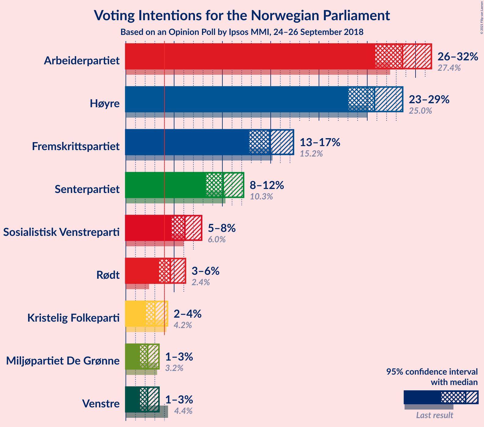

### Confidence Intervals

| Party | Last Result | Poll Result | 80% Confidence Interval | 90% Confidence Interval | 95% Confidence Interval | 99% Confidence Interval |
|:-----:|:-----------:|:-----------:|:-----------------------:|:-----------------------:|:-----------------------:|:-----------------------:|
| Arbeiderpartiet | 27.4% | 28.6% | 26.8–30.6% |26.3–31.2% |25.8–31.6% |25.0–32.6% |
| Høyre | 25.0% | 25.8% | 24.0–27.6% |23.5–28.2% |23.0–28.7% |22.2–29.6% |
| Fremskrittspartiet | 15.2% | 14.9% | 13.5–16.5% |13.1–17.0% |12.8–17.4% |12.1–18.1% |
| Senterpartiet | 10.3% | 10.1% | 8.9–11.5% |8.6–11.9% |8.3–12.2% |7.8–12.9% |
| Sosialistisk Venstreparti | 6.0% | 6.1% | 5.2–7.2% |5.0–7.6% |4.7–7.8% |4.3–8.4% |
| Rødt | 2.4% | 4.6% | 3.8–5.6% |3.6–5.9% |3.4–6.2% |3.1–6.7% |
| Kristelig Folkeparti | 4.2% | 3.0% | 2.4–3.9% |2.2–4.1% |2.1–4.3% |1.8–4.8% |
| Miljøpartiet De Grønne | 3.2% | 2.3% | 1.7–3.0% |1.6–3.2% |1.5–3.4% |1.3–3.8% |
| Venstre | 4.4% | 2.3% | 1.7–3.0% |1.6–3.2% |1.5–3.4% |1.3–3.8% |

*Note:* The poll result column reflects the actual value used in the calculations. Published results may vary slightly, and in addition be rounded to fewer digits.

## Seats

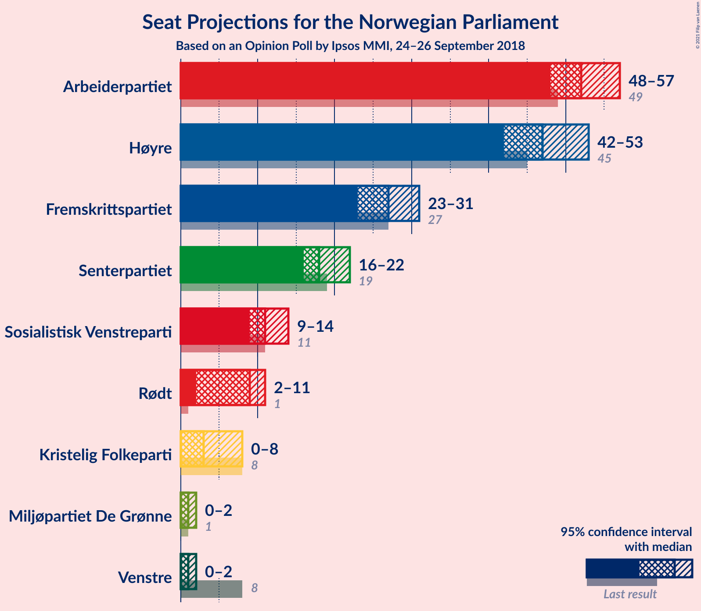

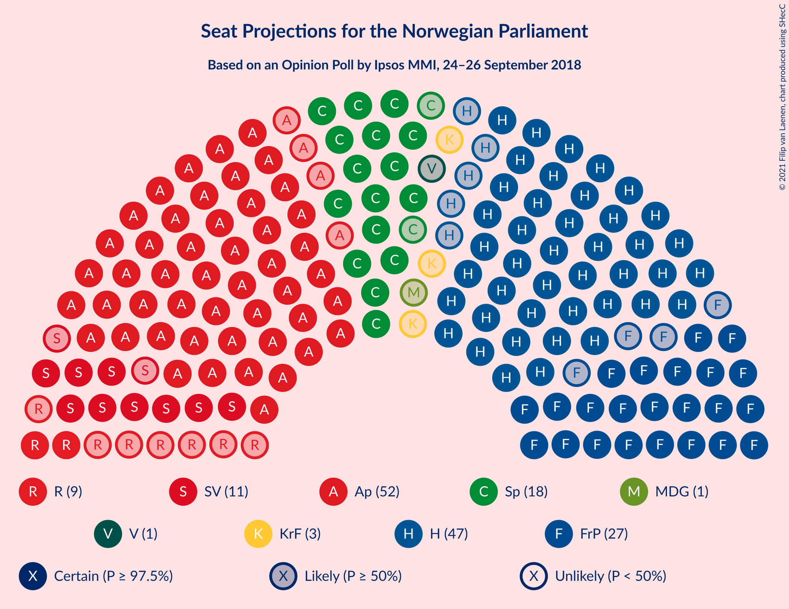

### Confidence Intervals

| Party | Last Result | Median | 80% Confidence Interval | 90% Confidence Interval | 95% Confidence Interval | 99% Confidence Interval |
|:-----:|:-----------:|:------:|:-----------------------:|:-----------------------:|:-----------------------:|:-----------------------:|
| <a href="#arbeiderpartiet">Arbeiderpartiet</a> | 49 | 52 | 49–55 |48–55 |48–57 |46–60 |
| <a href="#høyre">Høyre</a> | 45 | 47 | 43–50 |43–51 |42–53 |41–55 |
| <a href="#fremskrittspartiet">Fremskrittspartiet</a> | 27 | 27 | 24–29 |24–30 |23–31 |21–33 |
| <a href="#senterpartiet">Senterpartiet</a> | 19 | 18 | 16–21 |16–22 |16–22 |15–23 |
| <a href="#sosialistisk-venstreparti">Sosialistisk Venstreparti</a> | 11 | 11 | 10–13 |10–14 |9–14 |8–16 |
| <a href="#rødt">Rødt</a> | 1 | 9 | 2–10 |2–11 |2–11 |2–12 |
| <a href="#kristelig-folkeparti">Kristelig Folkeparti</a> | 8 | 3 | 1–3 |0–7 |0–8 |0–9 |
| <a href="#miljøpartiet-de-grønne">Miljøpartiet De Grønne</a> | 1 | 1 | 1–2 |1–2 |0–2 |0–2 |
| <a href="#venstre">Venstre</a> | 8 | 1 | 0–2 |0–2 |0–2 |0–2 |

### Arbeiderpartiet

*For a full overview of the results for this party, see the [Arbeiderpartiet](party-arbeiderpartiet.html) page.*

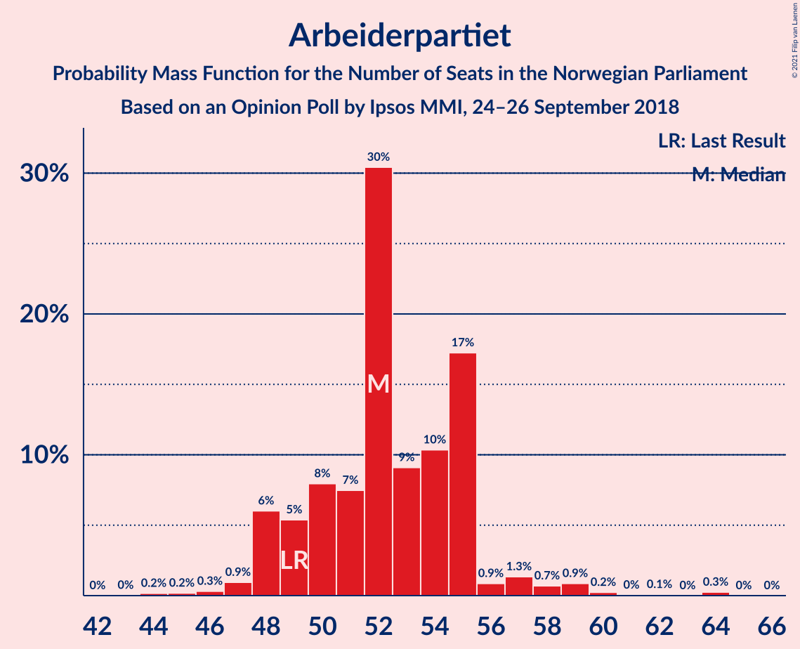

| Number of Seats | Probability | Accumulated | Special Marks |
|:---------------:|:-----------:|:-----------:|:-------------:|
| 44 | 0.2% | 100% |  |
| 45 | 0.2% | 99.8% |  |
| 46 | 0.3% | 99.6% |  |
| 47 | 0.9% | 99.3% |  |
| 48 | 6% | 98% |  |
| 49 | 5% | 92% | Last Result |
| 50 | 8% | 87% |  |
| 51 | 7% | 79% |  |
| 52 | 30% | 72% | Median |
| 53 | 9% | 41% |  |
| 54 | 10% | 32% |  |
| 55 | 17% | 22% |  |
| 56 | 0.9% | 4% |  |
| 57 | 1.3% | 4% |  |
| 58 | 0.7% | 2% |  |
| 59 | 0.9% | 1.5% |  |
| 60 | 0.2% | 0.6% |  |
| 61 | 0% | 0.4% |  |
| 62 | 0.1% | 0.3% |  |
| 63 | 0% | 0.3% |  |
| 64 | 0.3% | 0.3% |  |
| 65 | 0% | 0% |  |

### Høyre

*For a full overview of the results for this party, see the [Høyre](party-høyre.html) page.*

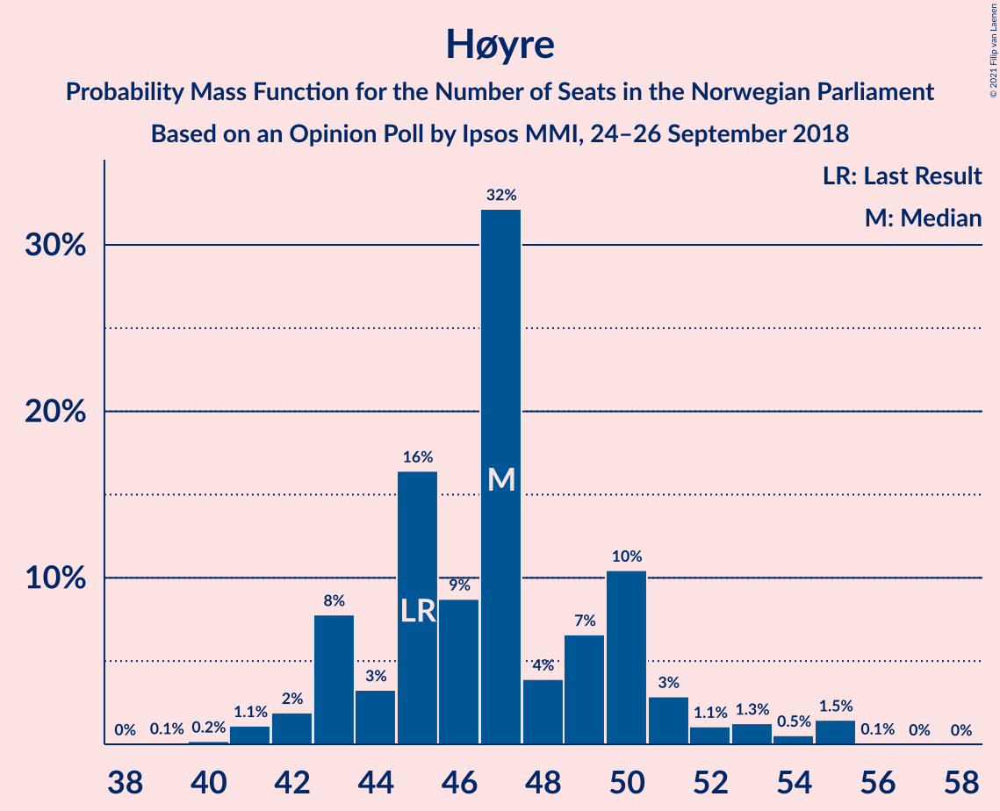

| Number of Seats | Probability | Accumulated | Special Marks |
|:---------------:|:-----------:|:-----------:|:-------------:|
| 39 | 0.1% | 100% |  |
| 40 | 0.2% | 99.9% |  |
| 41 | 1.1% | 99.7% |  |
| 42 | 2% | 98.6% |  |
| 43 | 8% | 97% |  |
| 44 | 3% | 89% |  |
| 45 | 16% | 86% | Last Result |
| 46 | 9% | 69% |  |
| 47 | 32% | 60% | Median |
| 48 | 4% | 28% |  |
| 49 | 7% | 24% |  |
| 50 | 10% | 18% |  |
| 51 | 3% | 7% |  |
| 52 | 1.1% | 4% |  |
| 53 | 1.3% | 3% |  |
| 54 | 0.5% | 2% |  |
| 55 | 1.5% | 2% |  |
| 56 | 0.1% | 0.1% |  |
| 57 | 0% | 0% |  |

### Fremskrittspartiet

*For a full overview of the results for this party, see the [Fremskrittspartiet](party-fremskrittspartiet.html) page.*

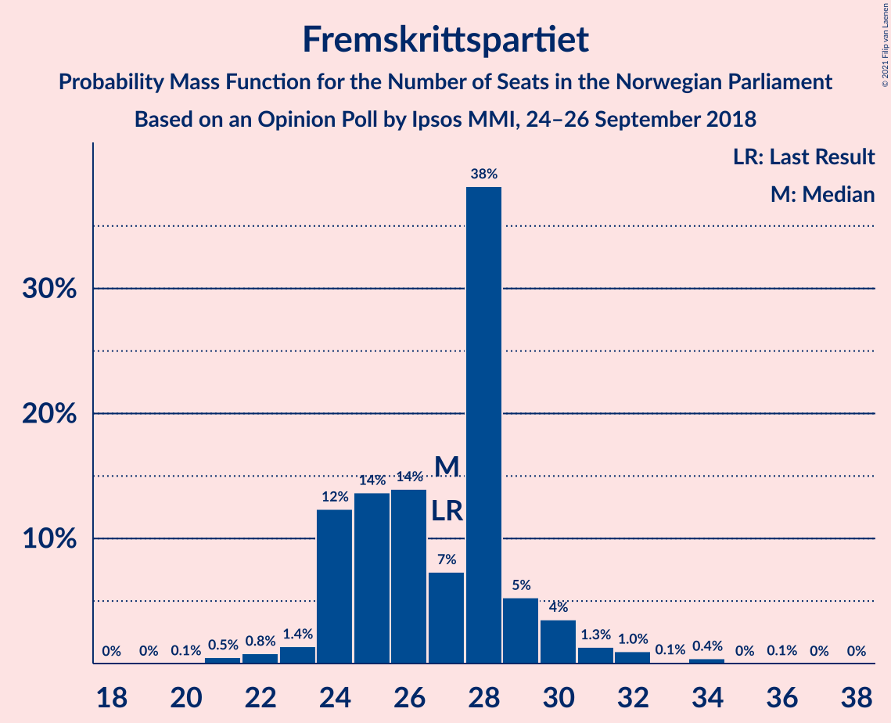

| Number of Seats | Probability | Accumulated | Special Marks |
|:---------------:|:-----------:|:-----------:|:-------------:|
| 20 | 0.1% | 100% |  |
| 21 | 0.5% | 99.9% |  |
| 22 | 0.8% | 99.4% |  |
| 23 | 1.4% | 98.6% |  |
| 24 | 12% | 97% |  |
| 25 | 14% | 85% |  |
| 26 | 14% | 71% |  |
| 27 | 7% | 57% | Last Result, Median |
| 28 | 38% | 50% |  |
| 29 | 5% | 12% |  |
| 30 | 4% | 6% |  |
| 31 | 1.3% | 3% |  |
| 32 | 1.0% | 2% |  |
| 33 | 0.1% | 0.6% |  |
| 34 | 0.4% | 0.5% |  |
| 35 | 0% | 0.1% |  |
| 36 | 0.1% | 0.1% |  |
| 37 | 0% | 0% |  |

### Senterpartiet

*For a full overview of the results for this party, see the [Senterpartiet](party-senterpartiet.html) page.*

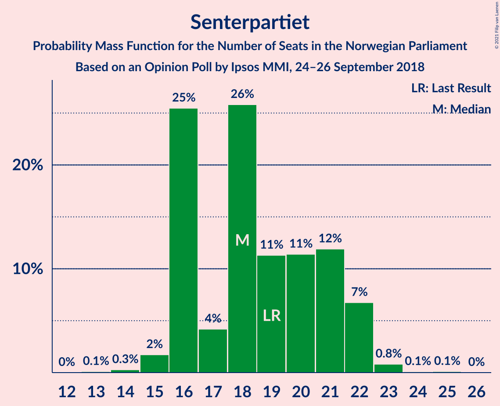

| Number of Seats | Probability | Accumulated | Special Marks |
|:---------------:|:-----------:|:-----------:|:-------------:|
| 13 | 0.1% | 100% |  |
| 14 | 0.3% | 99.9% |  |
| 15 | 2% | 99.6% |  |
| 16 | 25% | 98% |  |
| 17 | 4% | 72% |  |
| 18 | 26% | 68% | Median |
| 19 | 11% | 42% | Last Result |
| 20 | 11% | 31% |  |
| 21 | 12% | 20% |  |
| 22 | 7% | 8% |  |
| 23 | 0.8% | 1.0% |  |
| 24 | 0.1% | 0.2% |  |
| 25 | 0.1% | 0.1% |  |
| 26 | 0% | 0% |  |

### Sosialistisk Venstreparti

*For a full overview of the results for this party, see the [Sosialistisk Venstreparti](party-sosialistiskvenstreparti.html) page.*

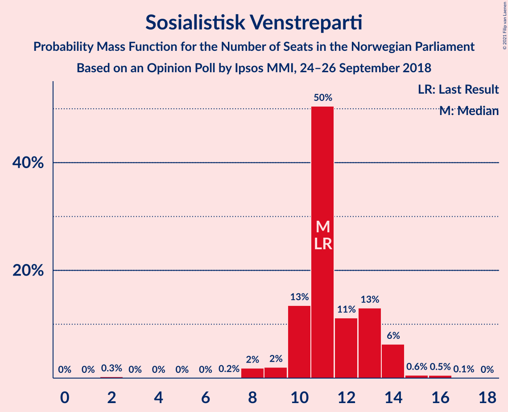

| Number of Seats | Probability | Accumulated | Special Marks |
|:---------------:|:-----------:|:-----------:|:-------------:|
| 2 | 0.3% | 100% |  |
| 3 | 0% | 99.7% |  |
| 4 | 0% | 99.7% |  |
| 5 | 0% | 99.7% |  |
| 6 | 0% | 99.7% |  |
| 7 | 0.2% | 99.7% |  |
| 8 | 2% | 99.6% |  |
| 9 | 2% | 98% |  |
| 10 | 13% | 96% |  |
| 11 | 50% | 82% | Last Result, Median |
| 12 | 11% | 32% |  |
| 13 | 13% | 21% |  |
| 14 | 6% | 7% |  |
| 15 | 0.6% | 1.2% |  |
| 16 | 0.5% | 0.6% |  |
| 17 | 0.1% | 0.1% |  |
| 18 | 0% | 0% |  |

### Rødt

*For a full overview of the results for this party, see the [Rødt](party-rødt.html) page.*

| Number of Seats | Probability | Accumulated | Special Marks |
|:---------------:|:-----------:|:-----------:|:-------------:|
| 1 | 0.1% | 100% | Last Result |
| 2 | 13% | 99.9% |  |
| 3 | 0% | 87% |  |
| 4 | 0% | 87% |  |
| 5 | 0% | 87% |  |
| 6 | 0% | 87% |  |
| 7 | 3% | 87% |  |
| 8 | 23% | 84% |  |
| 9 | 25% | 61% | Median |
| 10 | 28% | 36% |  |
| 11 | 6% | 8% |  |
| 12 | 2% | 2% |  |
| 13 | 0.1% | 0.1% |  |
| 14 | 0% | 0% |  |

### Kristelig Folkeparti

*For a full overview of the results for this party, see the [Kristelig Folkeparti](party-kristeligfolkeparti.html) page.*

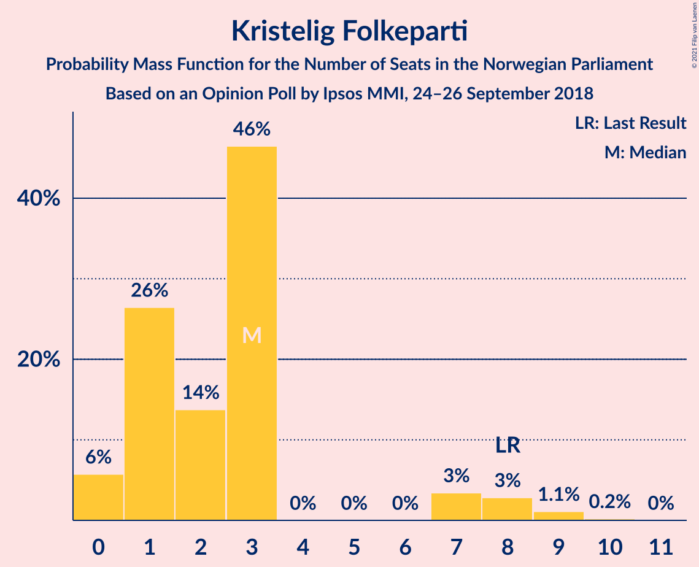

| Number of Seats | Probability | Accumulated | Special Marks |
|:---------------:|:-----------:|:-----------:|:-------------:|
| 0 | 6% | 100% |  |
| 1 | 26% | 94% |  |
| 2 | 14% | 68% |  |
| 3 | 46% | 54% | Median |
| 4 | 0% | 8% |  |
| 5 | 0% | 8% |  |
| 6 | 0% | 8% |  |
| 7 | 3% | 8% |  |
| 8 | 3% | 4% | Last Result |
| 9 | 1.1% | 1.3% |  |
| 10 | 0.2% | 0.2% |  |
| 11 | 0% | 0% |  |

### Miljøpartiet De Grønne

*For a full overview of the results for this party, see the [Miljøpartiet De Grønne](party-miljøpartietdegrønne.html) page.*

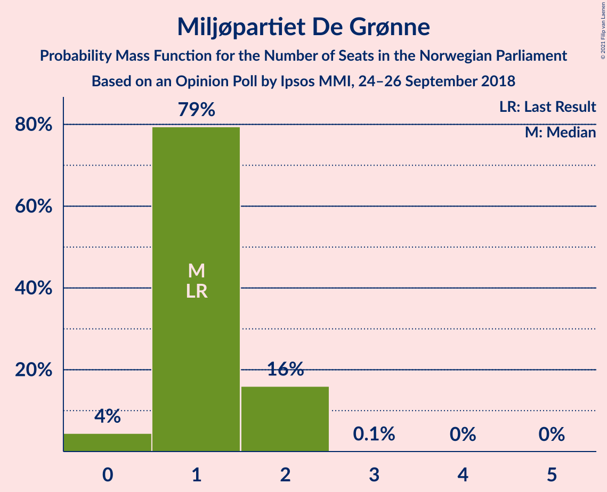

| Number of Seats | Probability | Accumulated | Special Marks |
|:---------------:|:-----------:|:-----------:|:-------------:|
| 0 | 4% | 100% |  |
| 1 | 79% | 96% | Last Result, Median |
| 2 | 16% | 16% |  |
| 3 | 0.1% | 0.1% |  |
| 4 | 0% | 0% |  |

### Venstre

*For a full overview of the results for this party, see the [Venstre](party-venstre.html) page.*

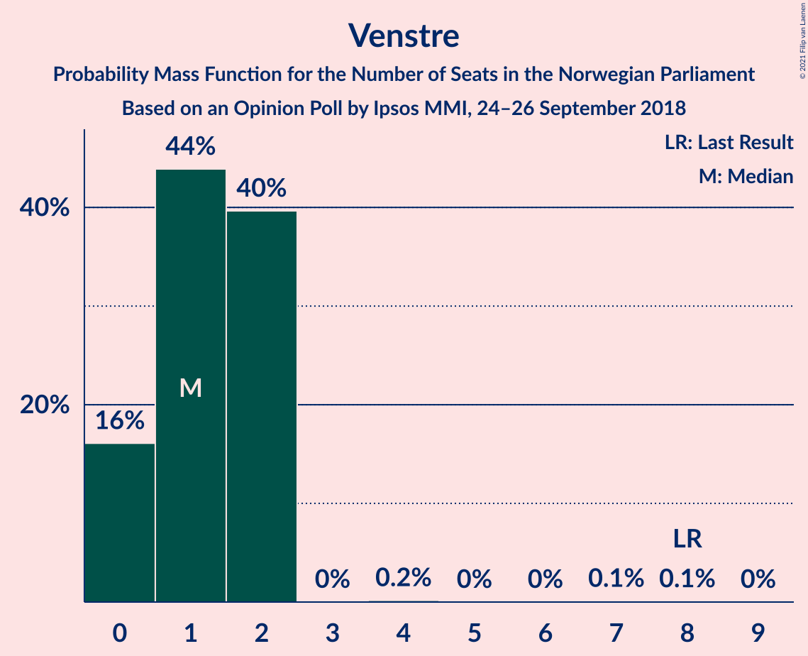

| Number of Seats | Probability | Accumulated | Special Marks |
|:---------------:|:-----------:|:-----------:|:-------------:|
| 0 | 16% | 100% |  |
| 1 | 44% | 84% | Median |
| 2 | 40% | 40% |  |
| 3 | 0% | 0.4% |  |
| 4 | 0.2% | 0.3% |  |
| 5 | 0% | 0.2% |  |
| 6 | 0% | 0.2% |  |
| 7 | 0.1% | 0.2% |  |
| 8 | 0.1% | 0.1% | Last Result |
| 9 | 0% | 0% |  |

## Coalitions

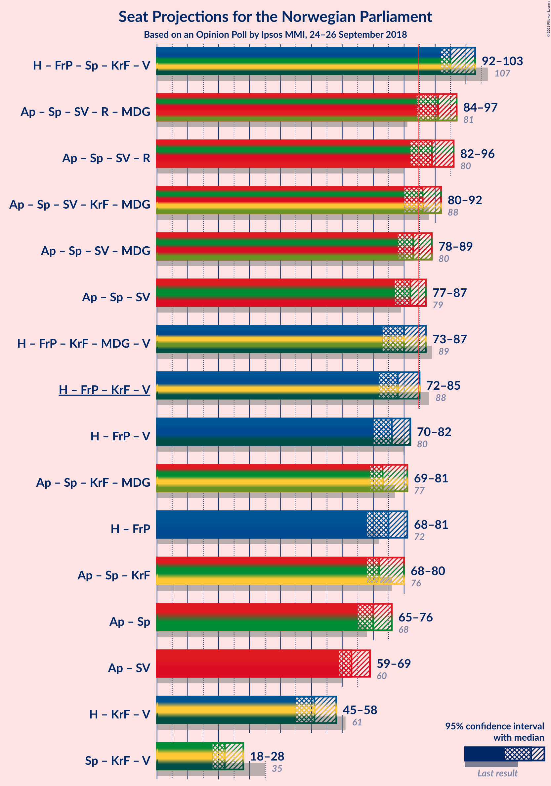

### Confidence Intervals

| Coalition | Last Result | Median | Majority? | 80% Confidence Interval | 90% Confidence Interval | 95% Confidence Interval | 99% Confidence Interval |
|:---------:|:-----------:|:------:|:---------:|:-----------------------:|:-----------------------:|:-----------------------:|:-----------------------:|
| Høyre – Fremskrittspartiet – Senterpartiet – Kristelig Folkeparti – Venstre | 107 | 95 | 100% | 92–100 | 92–102 | 92–103 | 88–105 |
| Arbeiderpartiet – Senterpartiet – Sosialistisk Venstreparti – Rødt – Miljøpartiet De Grønne | 81 | 91 | 96% | 88–96 | 86–97 | 84–97 | 83–99 |
| Arbeiderpartiet – Senterpartiet – Sosialistisk Venstreparti – Rødt | 80 | 89 | 95% | 87–95 | 84–96 | 82–96 | 82–98 |
| Arbeiderpartiet – Senterpartiet – Sosialistisk Venstreparti – Kristelig Folkeparti – Miljøpartiet De Grønne | 88 | 86 | 53% | 83–90 | 81–90 | 80–92 | 78–95 |
| Arbeiderpartiet – Senterpartiet – Sosialistisk Venstreparti – Miljøpartiet De Grønne | 80 | 83 | 39% | 80–88 | 79–89 | 78–89 | 75–94 |
| Arbeiderpartiet – Senterpartiet – Sosialistisk Venstreparti | 79 | 82 | 28% | 79–87 | 78–87 | 77–87 | 74–93 |
| Høyre – Fremskrittspartiet – Kristelig Folkeparti – Miljøpartiet De Grønne – Venstre | 89 | 80 | 5% | 74–82 | 73–84 | 73–87 | 71–87 |
| Høyre – Fremskrittspartiet – Kristelig Folkeparti – Venstre | 88 | 78 | 4% | 73–81 | 72–83 | 72–85 | 70–86 |
| Høyre – Fremskrittspartiet – Venstre | 80 | 76 | 1.2% | 70–78 | 70–81 | 70–82 | 67–85 |
| Arbeiderpartiet – Senterpartiet – Kristelig Folkeparti – Miljøpartiet De Grønne | 77 | 73 | 0.5% | 70–79 | 69–79 | 69–81 | 67–84 |
| Høyre – Fremskrittspartiet | 72 | 75 | 0.1% | 70–77 | 68–79 | 68–81 | 66–83 |
| Arbeiderpartiet – Senterpartiet – Kristelig Folkeparti | 76 | 72 | 0% | 69–78 | 69–78 | 68–80 | 66–83 |
| Arbeiderpartiet – Senterpartiet | 68 | 70 | 0% | 67–76 | 66–76 | 65–76 | 64–80 |
| Arbeiderpartiet – Sosialistisk Venstreparti | 60 | 63 | 0% | 61–66 | 60–67 | 59–69 | 57–72 |
| Høyre – Kristelig Folkeparti – Venstre | 61 | 51 | 0% | 48–55 | 46–58 | 45–58 | 44–59 |
| Senterpartiet – Kristelig Folkeparti – Venstre | 35 | 22 | 0% | 20–25 | 19–27 | 18–28 | 17–30 |

### Høyre – Fremskrittspartiet – Senterpartiet – Kristelig Folkeparti – Venstre

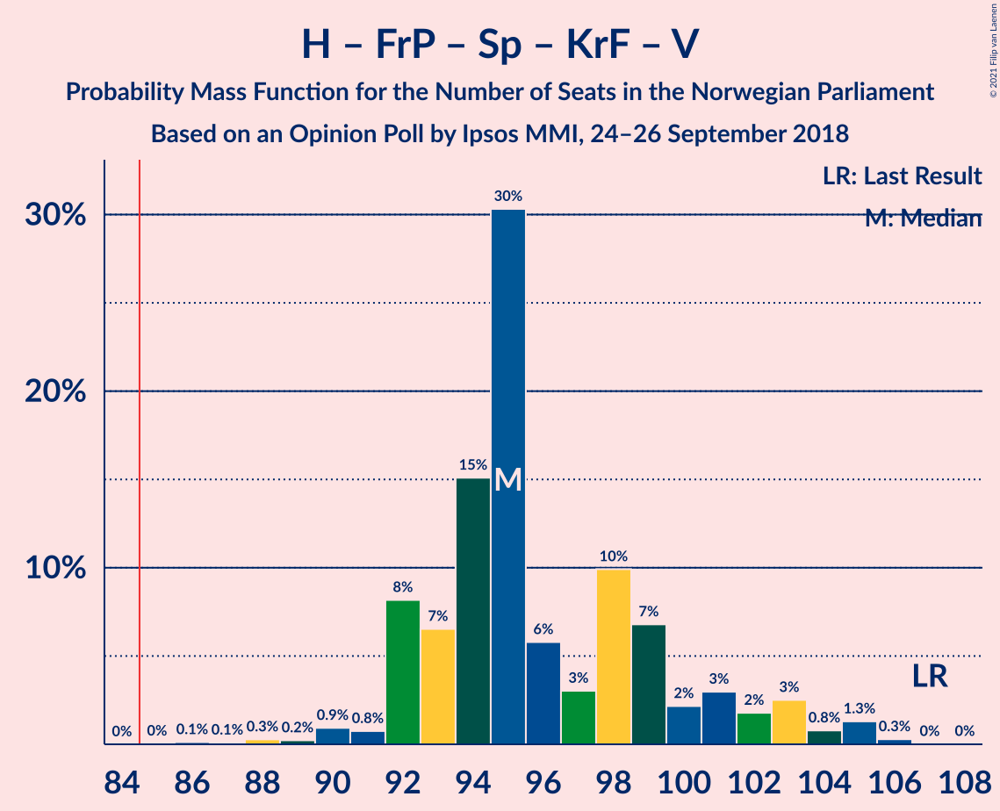

| Number of Seats | Probability | Accumulated | Special Marks |
|:---------------:|:-----------:|:-----------:|:-------------:|
| 86 | 0.1% | 100% |  |
| 87 | 0.1% | 99.8% |  |
| 88 | 0.3% | 99.7% |  |
| 89 | 0.2% | 99.4% |  |
| 90 | 0.9% | 99.2% |  |
| 91 | 0.8% | 98% |  |
| 92 | 8% | 98% |  |
| 93 | 7% | 89% |  |
| 94 | 15% | 83% |  |
| 95 | 30% | 68% |  |
| 96 | 6% | 37% | Median |
| 97 | 3% | 32% |  |
| 98 | 10% | 29% |  |
| 99 | 7% | 19% |  |
| 100 | 2% | 12% |  |
| 101 | 3% | 10% |  |
| 102 | 2% | 7% |  |
| 103 | 3% | 5% |  |
| 104 | 0.8% | 2% |  |
| 105 | 1.3% | 2% |  |
| 106 | 0.3% | 0.4% |  |
| 107 | 0% | 0.1% | Last Result |
| 108 | 0% | 0% |  |

### Arbeiderpartiet – Senterpartiet – Sosialistisk Venstreparti – Rødt – Miljøpartiet De Grønne

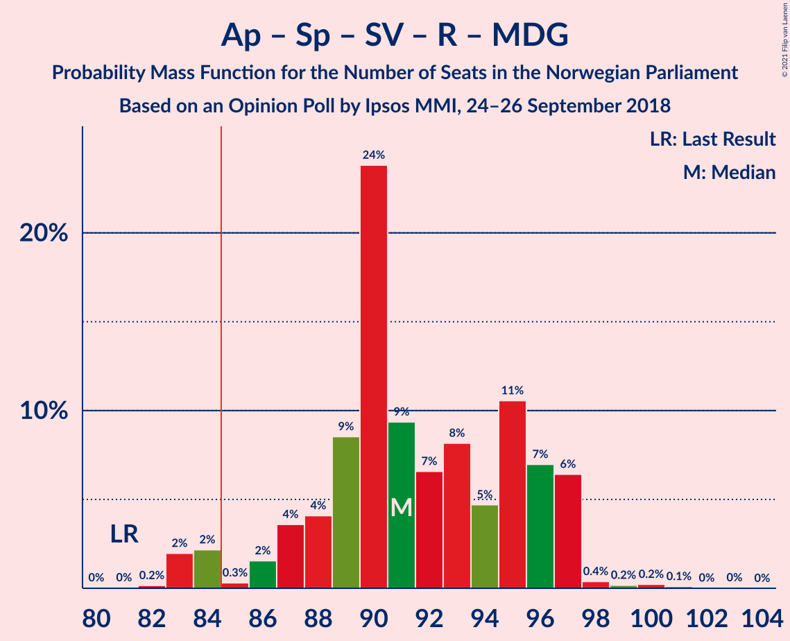

| Number of Seats | Probability | Accumulated | Special Marks |
|:---------------:|:-----------:|:-----------:|:-------------:|
| 80 | 0% | 100% |  |
| 81 | 0% | 99.9% | Last Result |
| 82 | 0.2% | 99.9% |  |
| 83 | 2% | 99.7% |  |
| 84 | 2% | 98% |  |
| 85 | 0.3% | 96% | Majority |
| 86 | 2% | 95% |  |
| 87 | 4% | 94% |  |
| 88 | 4% | 90% |  |
| 89 | 9% | 86% |  |
| 90 | 24% | 78% |  |
| 91 | 9% | 54% | Median |
| 92 | 7% | 44% |  |
| 93 | 8% | 38% |  |
| 94 | 5% | 30% |  |
| 95 | 11% | 25% |  |
| 96 | 7% | 14% |  |
| 97 | 6% | 7% |  |
| 98 | 0.4% | 0.9% |  |
| 99 | 0.2% | 0.6% |  |
| 100 | 0.2% | 0.4% |  |
| 101 | 0.1% | 0.2% |  |
| 102 | 0% | 0.1% |  |
| 103 | 0% | 0% |  |

### Arbeiderpartiet – Senterpartiet – Sosialistisk Venstreparti – Rødt

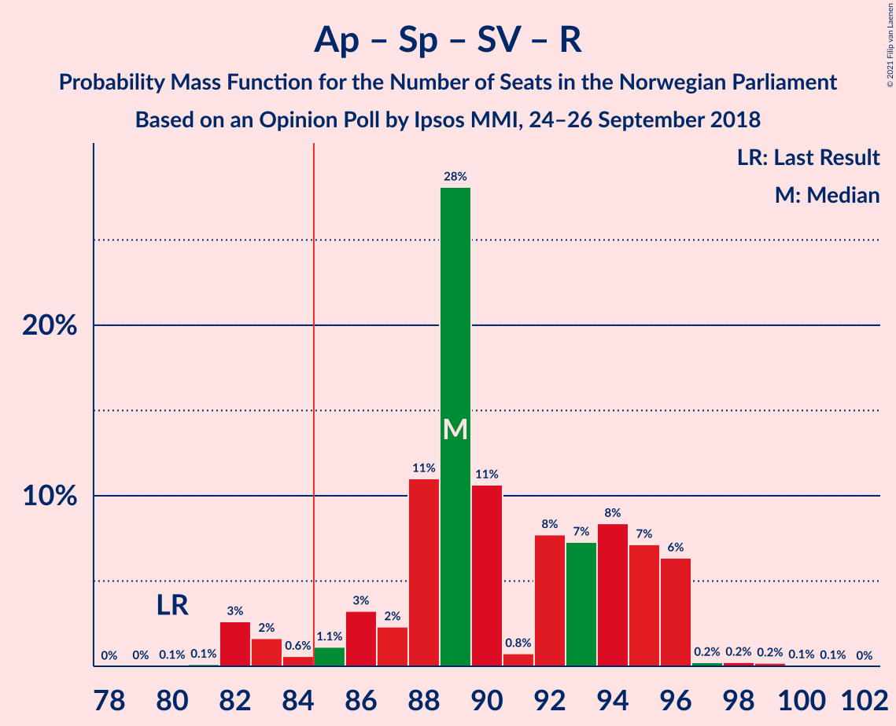

| Number of Seats | Probability | Accumulated | Special Marks |
|:---------------:|:-----------:|:-----------:|:-------------:|
| 79 | 0% | 100% |  |
| 80 | 0.1% | 99.9% | Last Result |
| 81 | 0.1% | 99.9% |  |
| 82 | 3% | 99.8% |  |
| 83 | 2% | 97% |  |
| 84 | 0.6% | 95% |  |
| 85 | 1.1% | 95% | Majority |
| 86 | 3% | 94% |  |
| 87 | 2% | 91% |  |
| 88 | 11% | 88% |  |
| 89 | 28% | 77% |  |
| 90 | 11% | 49% | Median |
| 91 | 0.8% | 38% |  |
| 92 | 8% | 38% |  |
| 93 | 7% | 30% |  |
| 94 | 8% | 23% |  |
| 95 | 7% | 14% |  |
| 96 | 6% | 7% |  |
| 97 | 0.2% | 0.8% |  |
| 98 | 0.2% | 0.6% |  |
| 99 | 0.2% | 0.3% |  |
| 100 | 0.1% | 0.1% |  |
| 101 | 0.1% | 0.1% |  |
| 102 | 0% | 0% |  |

### Arbeiderpartiet – Senterpartiet – Sosialistisk Venstreparti – Kristelig Folkeparti – Miljøpartiet De Grønne

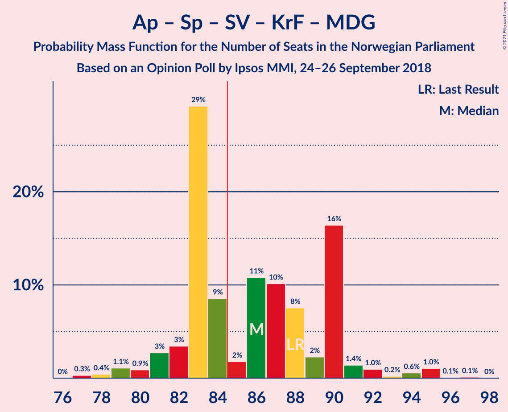

| Number of Seats | Probability | Accumulated | Special Marks |
|:---------------:|:-----------:|:-----------:|:-------------:|
| 76 | 0% | 100% |  |
| 77 | 0.3% | 99.9% |  |
| 78 | 0.4% | 99.6% |  |
| 79 | 1.1% | 99.2% |  |
| 80 | 0.9% | 98% |  |
| 81 | 3% | 97% |  |
| 82 | 3% | 95% |  |
| 83 | 29% | 91% |  |
| 84 | 9% | 62% |  |
| 85 | 2% | 53% | Median, Majority |
| 86 | 11% | 52% |  |
| 87 | 10% | 41% |  |
| 88 | 8% | 31% | Last Result |
| 89 | 2% | 23% |  |
| 90 | 16% | 21% |  |
| 91 | 1.4% | 4% |  |
| 92 | 1.0% | 3% |  |
| 93 | 0.2% | 2% |  |
| 94 | 0.6% | 2% |  |
| 95 | 1.0% | 1.2% |  |
| 96 | 0.1% | 0.2% |  |
| 97 | 0.1% | 0.1% |  |
| 98 | 0% | 0% |  |

### Arbeiderpartiet – Senterpartiet – Sosialistisk Venstreparti – Miljøpartiet De Grønne

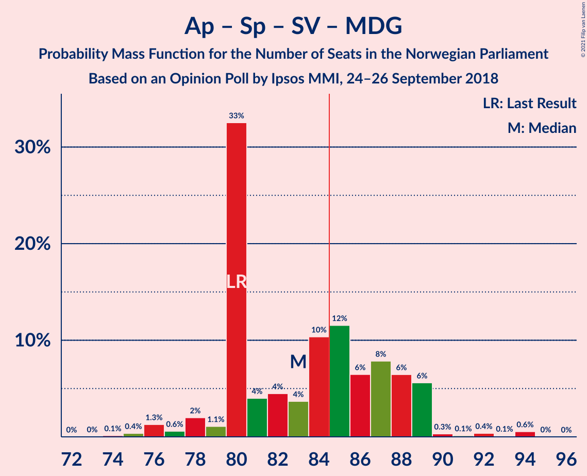

| Number of Seats | Probability | Accumulated | Special Marks |
|:---------------:|:-----------:|:-----------:|:-------------:|
| 74 | 0.1% | 100% |  |
| 75 | 0.4% | 99.8% |  |
| 76 | 1.3% | 99.4% |  |
| 77 | 0.6% | 98% |  |
| 78 | 2% | 98% |  |
| 79 | 1.1% | 96% |  |
| 80 | 33% | 94% | Last Result |
| 81 | 4% | 62% |  |
| 82 | 4% | 58% | Median |
| 83 | 4% | 53% |  |
| 84 | 10% | 50% |  |
| 85 | 12% | 39% | Majority |
| 86 | 6% | 28% |  |
| 87 | 8% | 21% |  |
| 88 | 6% | 14% |  |
| 89 | 6% | 7% |  |
| 90 | 0.3% | 1.5% |  |
| 91 | 0.1% | 1.2% |  |
| 92 | 0.4% | 1.1% |  |
| 93 | 0.1% | 0.7% |  |
| 94 | 0.6% | 0.6% |  |
| 95 | 0% | 0% |  |

### Arbeiderpartiet – Senterpartiet – Sosialistisk Venstreparti

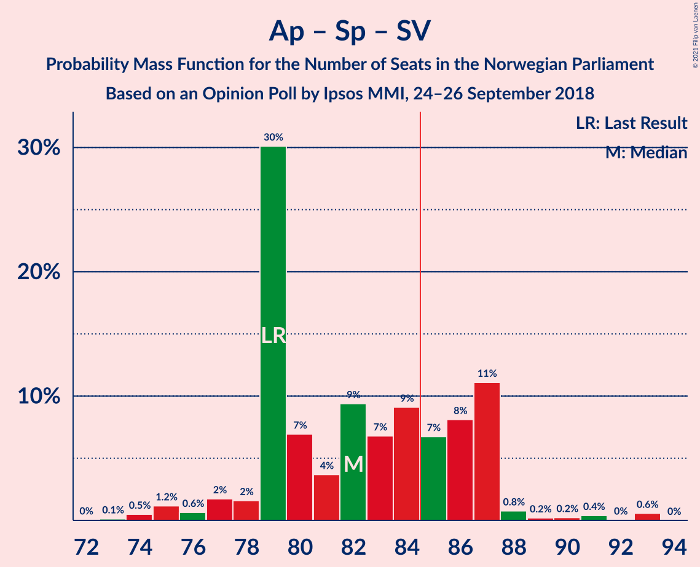

| Number of Seats | Probability | Accumulated | Special Marks |
|:---------------:|:-----------:|:-----------:|:-------------:|
| 73 | 0.1% | 100% |  |
| 74 | 0.5% | 99.8% |  |
| 75 | 1.2% | 99.3% |  |
| 76 | 0.6% | 98% |  |
| 77 | 2% | 98% |  |
| 78 | 2% | 96% |  |
| 79 | 30% | 94% | Last Result |
| 80 | 7% | 64% |  |
| 81 | 4% | 57% | Median |
| 82 | 9% | 53% |  |
| 83 | 7% | 44% |  |
| 84 | 9% | 37% |  |
| 85 | 7% | 28% | Majority |
| 86 | 8% | 21% |  |
| 87 | 11% | 13% |  |
| 88 | 0.8% | 2% |  |
| 89 | 0.2% | 1.4% |  |
| 90 | 0.2% | 1.2% |  |
| 91 | 0.4% | 1.0% |  |
| 92 | 0% | 0.6% |  |
| 93 | 0.6% | 0.6% |  |
| 94 | 0% | 0% |  |

### Høyre – Fremskrittspartiet – Kristelig Folkeparti – Miljøpartiet De Grønne – Venstre

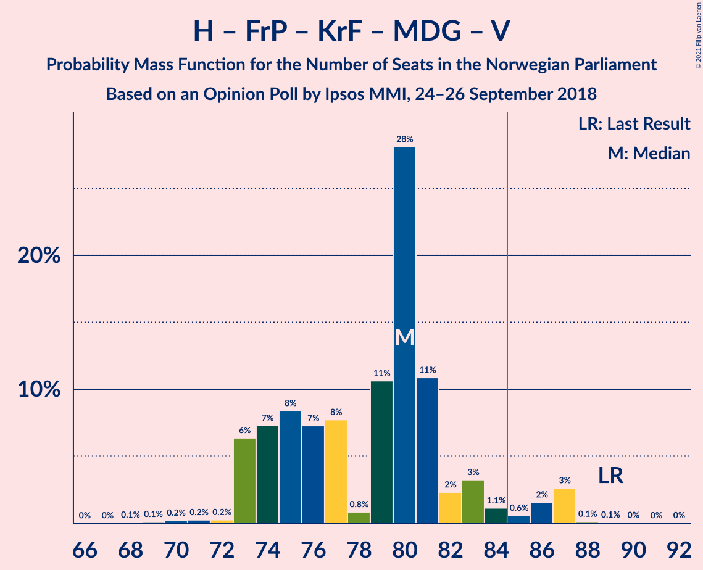

| Number of Seats | Probability | Accumulated | Special Marks |
|:---------------:|:-----------:|:-----------:|:-------------:|
| 68 | 0.1% | 100% |  |
| 69 | 0.1% | 99.9% |  |
| 70 | 0.2% | 99.8% |  |
| 71 | 0.2% | 99.6% |  |
| 72 | 0.2% | 99.4% |  |
| 73 | 6% | 99.1% |  |
| 74 | 7% | 93% |  |
| 75 | 8% | 85% |  |
| 76 | 7% | 77% |  |
| 77 | 8% | 70% |  |
| 78 | 0.8% | 62% |  |
| 79 | 11% | 61% | Median |
| 80 | 28% | 51% |  |
| 81 | 11% | 23% |  |
| 82 | 2% | 12% |  |
| 83 | 3% | 9% |  |
| 84 | 1.1% | 6% |  |
| 85 | 0.6% | 5% | Majority |
| 86 | 2% | 4% |  |
| 87 | 3% | 3% |  |
| 88 | 0.1% | 0.2% |  |
| 89 | 0.1% | 0.1% | Last Result |
| 90 | 0% | 0.1% |  |
| 91 | 0% | 0% |  |

### Høyre – Fremskrittspartiet – Kristelig Folkeparti – Venstre

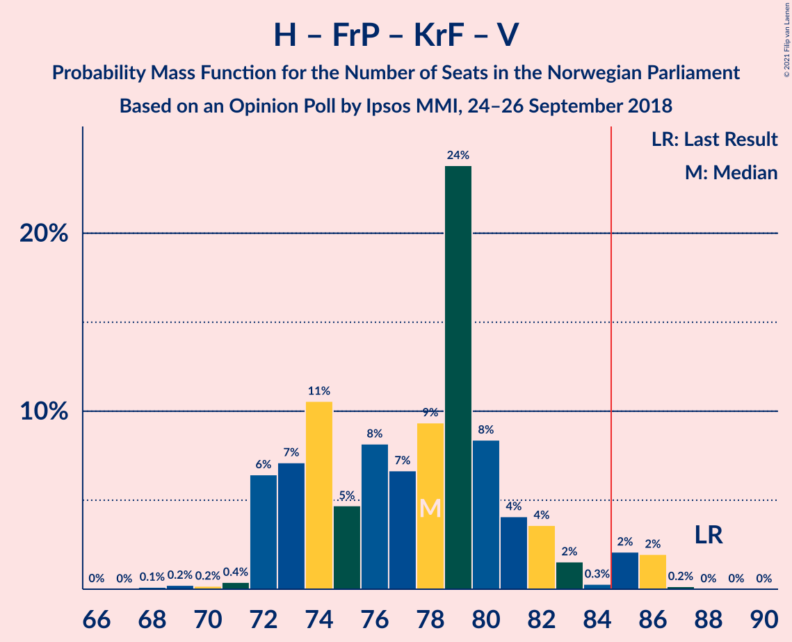

| Number of Seats | Probability | Accumulated | Special Marks |
|:---------------:|:-----------:|:-----------:|:-------------:|
| 67 | 0% | 100% |  |
| 68 | 0.1% | 99.9% |  |
| 69 | 0.2% | 99.8% |  |
| 70 | 0.2% | 99.6% |  |
| 71 | 0.4% | 99.4% |  |
| 72 | 6% | 99.0% |  |
| 73 | 7% | 93% |  |
| 74 | 11% | 85% |  |
| 75 | 5% | 75% |  |
| 76 | 8% | 70% |  |
| 77 | 7% | 62% |  |
| 78 | 9% | 55% | Median |
| 79 | 24% | 46% |  |
| 80 | 8% | 22% |  |
| 81 | 4% | 14% |  |
| 82 | 4% | 10% |  |
| 83 | 2% | 6% |  |
| 84 | 0.3% | 5% |  |
| 85 | 2% | 4% | Majority |
| 86 | 2% | 2% |  |
| 87 | 0.2% | 0.2% |  |
| 88 | 0% | 0.1% | Last Result |
| 89 | 0% | 0.1% |  |
| 90 | 0% | 0% |  |

### Høyre – Fremskrittspartiet – Venstre

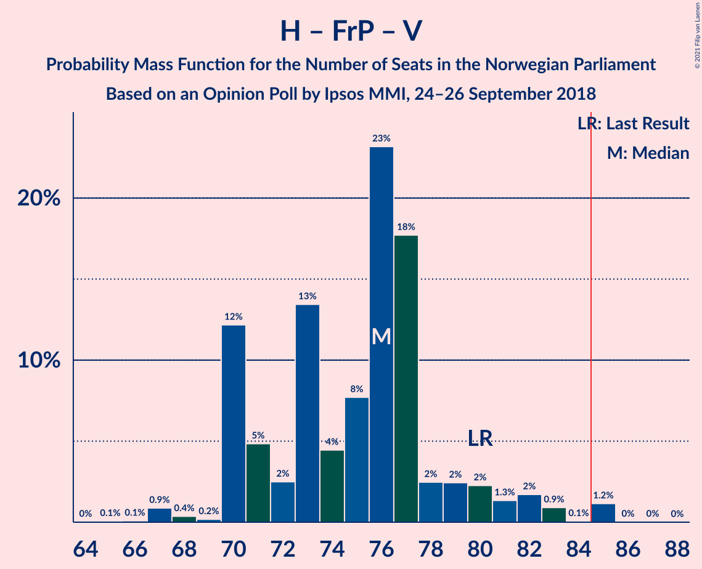

| Number of Seats | Probability | Accumulated | Special Marks |
|:---------------:|:-----------:|:-----------:|:-------------:|
| 65 | 0.1% | 100% |  |
| 66 | 0.1% | 99.9% |  |
| 67 | 0.9% | 99.8% |  |
| 68 | 0.4% | 99.0% |  |
| 69 | 0.2% | 98.6% |  |
| 70 | 12% | 98% |  |
| 71 | 5% | 86% |  |
| 72 | 2% | 81% |  |
| 73 | 13% | 79% |  |
| 74 | 4% | 65% |  |
| 75 | 8% | 61% | Median |
| 76 | 23% | 53% |  |
| 77 | 18% | 30% |  |
| 78 | 2% | 12% |  |
| 79 | 2% | 10% |  |
| 80 | 2% | 7% | Last Result |
| 81 | 1.3% | 5% |  |
| 82 | 2% | 4% |  |
| 83 | 0.9% | 2% |  |
| 84 | 0.1% | 1.3% |  |
| 85 | 1.2% | 1.2% | Majority |
| 86 | 0% | 0.1% |  |
| 87 | 0% | 0% |  |

### Arbeiderpartiet – Senterpartiet – Kristelig Folkeparti – Miljøpartiet De Grønne

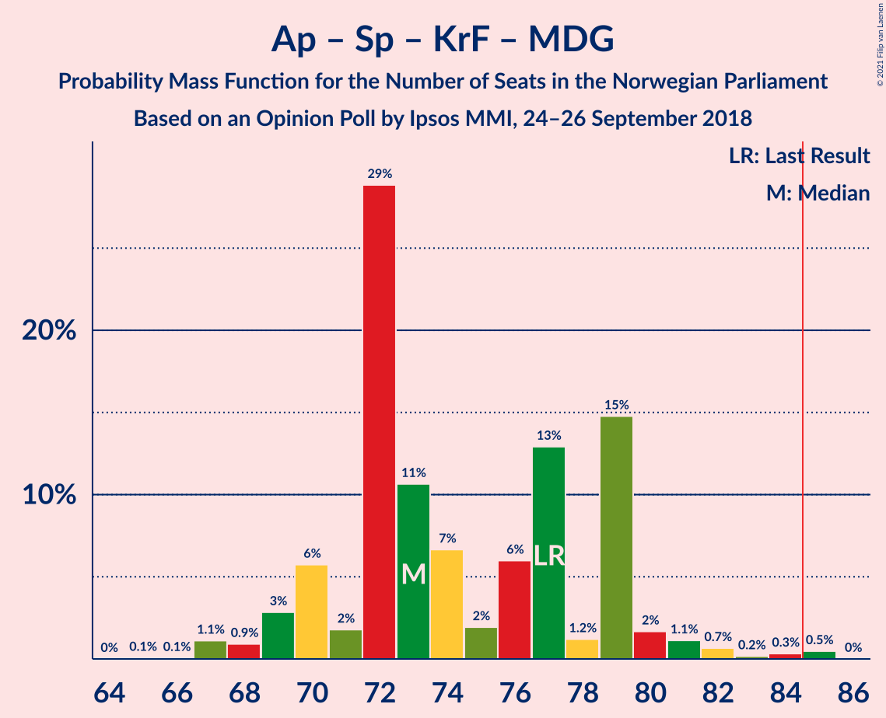

| Number of Seats | Probability | Accumulated | Special Marks |
|:---------------:|:-----------:|:-----------:|:-------------:|
| 65 | 0.1% | 100% |  |
| 66 | 0.1% | 99.9% |  |
| 67 | 1.1% | 99.8% |  |
| 68 | 0.9% | 98.7% |  |
| 69 | 3% | 98% |  |
| 70 | 6% | 95% |  |
| 71 | 2% | 89% |  |
| 72 | 29% | 87% |  |
| 73 | 11% | 59% |  |
| 74 | 7% | 48% | Median |
| 75 | 2% | 41% |  |
| 76 | 6% | 39% |  |
| 77 | 13% | 33% | Last Result |
| 78 | 1.2% | 20% |  |
| 79 | 15% | 19% |  |
| 80 | 2% | 4% |  |
| 81 | 1.1% | 3% |  |
| 82 | 0.7% | 2% |  |
| 83 | 0.2% | 1.0% |  |
| 84 | 0.3% | 0.8% |  |
| 85 | 0.5% | 0.5% | Majority |
| 86 | 0% | 0% |  |

### Høyre – Fremskrittspartiet

| Number of Seats | Probability | Accumulated | Special Marks |
|:---------------:|:-----------:|:-----------:|:-------------:|
| 64 | 0% | 100% |  |
| 65 | 0.1% | 99.9% |  |
| 66 | 0.8% | 99.8% |  |
| 67 | 0.4% | 98.9% |  |
| 68 | 6% | 98.6% |  |
| 69 | 2% | 92% |  |
| 70 | 11% | 91% |  |
| 71 | 8% | 80% |  |
| 72 | 5% | 72% | Last Result |
| 73 | 8% | 67% |  |
| 74 | 7% | 59% | Median |
| 75 | 31% | 52% |  |
| 76 | 5% | 21% |  |
| 77 | 7% | 15% |  |
| 78 | 2% | 8% |  |
| 79 | 0.9% | 6% |  |
| 80 | 1.2% | 5% |  |
| 81 | 2% | 4% |  |
| 82 | 0.2% | 1.4% |  |
| 83 | 1.1% | 1.2% |  |
| 84 | 0% | 0.1% |  |
| 85 | 0% | 0.1% | Majority |
| 86 | 0% | 0% |  |

### Arbeiderpartiet – Senterpartiet – Kristelig Folkeparti

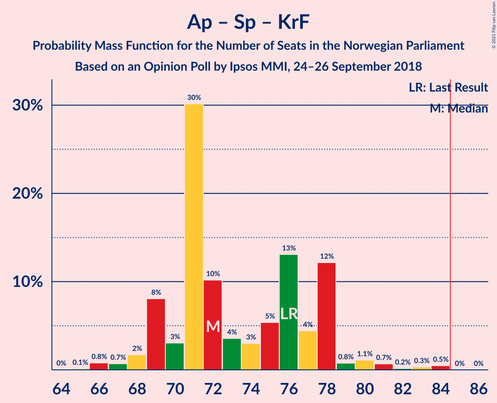

| Number of Seats | Probability | Accumulated | Special Marks |
|:---------------:|:-----------:|:-----------:|:-------------:|
| 64 | 0% | 100% |  |
| 65 | 0.1% | 99.9% |  |
| 66 | 0.8% | 99.8% |  |
| 67 | 0.7% | 99.0% |  |
| 68 | 2% | 98% |  |
| 69 | 8% | 97% |  |
| 70 | 3% | 89% |  |
| 71 | 30% | 85% |  |
| 72 | 10% | 55% |  |
| 73 | 4% | 45% | Median |
| 74 | 3% | 42% |  |
| 75 | 5% | 39% |  |
| 76 | 13% | 33% | Last Result |
| 77 | 4% | 20% |  |
| 78 | 12% | 16% |  |
| 79 | 0.8% | 4% |  |
| 80 | 1.1% | 3% |  |
| 81 | 0.7% | 2% |  |
| 82 | 0.2% | 1.0% |  |
| 83 | 0.3% | 0.8% |  |
| 84 | 0.5% | 0.5% |  |
| 85 | 0% | 0% | Majority |

### Arbeiderpartiet – Senterpartiet

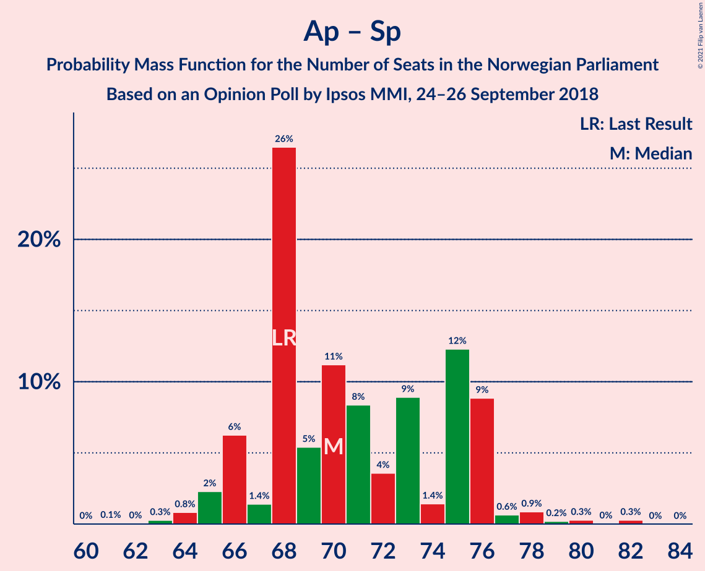

| Number of Seats | Probability | Accumulated | Special Marks |
|:---------------:|:-----------:|:-----------:|:-------------:|
| 61 | 0.1% | 100% |  |
| 62 | 0% | 99.9% |  |
| 63 | 0.3% | 99.9% |  |
| 64 | 0.8% | 99.6% |  |
| 65 | 2% | 98.8% |  |
| 66 | 6% | 96% |  |
| 67 | 1.4% | 90% |  |
| 68 | 26% | 89% | Last Result |
| 69 | 5% | 62% |  |
| 70 | 11% | 57% | Median |
| 71 | 8% | 46% |  |
| 72 | 4% | 37% |  |
| 73 | 9% | 34% |  |
| 74 | 1.4% | 25% |  |
| 75 | 12% | 23% |  |
| 76 | 9% | 11% |  |
| 77 | 0.6% | 2% |  |
| 78 | 0.9% | 2% |  |
| 79 | 0.2% | 0.8% |  |
| 80 | 0.3% | 0.6% |  |
| 81 | 0% | 0.3% |  |
| 82 | 0.3% | 0.3% |  |
| 83 | 0% | 0% |  |

### Arbeiderpartiet – Sosialistisk Venstreparti

| Number of Seats | Probability | Accumulated | Special Marks |
|:---------------:|:-----------:|:-----------:|:-------------:|
| 55 | 0.2% | 100% |  |
| 56 | 0.2% | 99.8% |  |
| 57 | 0.7% | 99.6% |  |
| 58 | 0.9% | 98.9% |  |
| 59 | 2% | 98% |  |
| 60 | 3% | 96% | Last Result |
| 61 | 9% | 93% |  |
| 62 | 8% | 84% |  |
| 63 | 29% | 76% | Median |
| 64 | 12% | 47% |  |
| 65 | 11% | 35% |  |
| 66 | 18% | 24% |  |
| 67 | 3% | 6% |  |
| 68 | 1.0% | 4% |  |
| 69 | 0.6% | 3% |  |
| 70 | 0.5% | 2% |  |
| 71 | 0.7% | 2% |  |
| 72 | 0.4% | 0.9% |  |
| 73 | 0.2% | 0.5% |  |
| 74 | 0% | 0.3% |  |
| 75 | 0.2% | 0.3% |  |
| 76 | 0% | 0% |  |

### Høyre – Kristelig Folkeparti – Venstre

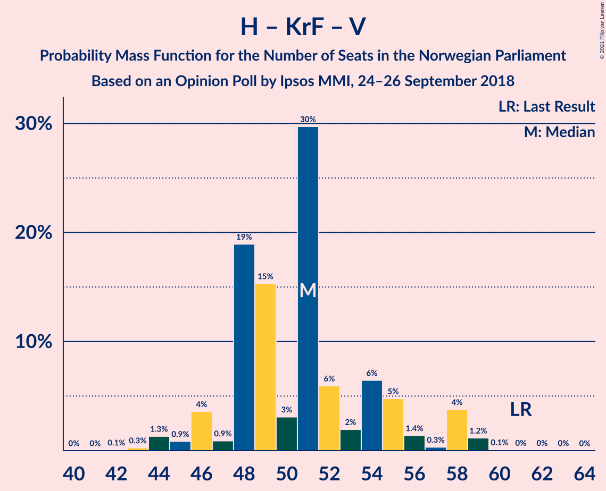

| Number of Seats | Probability | Accumulated | Special Marks |
|:---------------:|:-----------:|:-----------:|:-------------:|
| 42 | 0.1% | 100% |  |
| 43 | 0.3% | 99.9% |  |
| 44 | 1.3% | 99.7% |  |
| 45 | 0.9% | 98% |  |
| 46 | 4% | 97% |  |
| 47 | 0.9% | 94% |  |
| 48 | 19% | 93% |  |
| 49 | 15% | 74% |  |
| 50 | 3% | 59% |  |
| 51 | 30% | 56% | Median |
| 52 | 6% | 26% |  |
| 53 | 2% | 20% |  |
| 54 | 6% | 18% |  |
| 55 | 5% | 12% |  |
| 56 | 1.4% | 7% |  |
| 57 | 0.3% | 5% |  |
| 58 | 4% | 5% |  |
| 59 | 1.2% | 1.4% |  |
| 60 | 0.1% | 0.2% |  |
| 61 | 0% | 0.1% | Last Result |
| 62 | 0% | 0.1% |  |
| 63 | 0% | 0% |  |

### Senterpartiet – Kristelig Folkeparti – Venstre

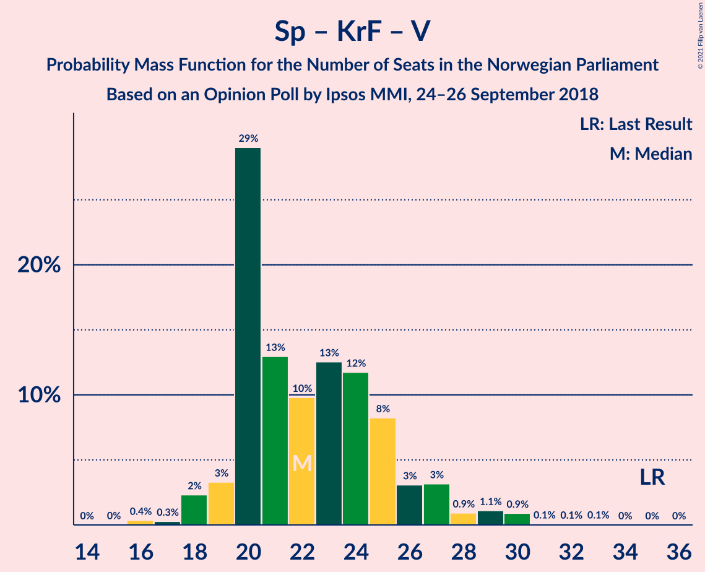

| Number of Seats | Probability | Accumulated | Special Marks |
|:---------------:|:-----------:|:-----------:|:-------------:|
| 16 | 0.4% | 100% |  |
| 17 | 0.3% | 99.6% |  |
| 18 | 2% | 99.3% |  |
| 19 | 3% | 97% |  |
| 20 | 29% | 94% |  |
| 21 | 13% | 65% |  |
| 22 | 10% | 52% | Median |
| 23 | 13% | 42% |  |
| 24 | 12% | 29% |  |
| 25 | 8% | 18% |  |
| 26 | 3% | 9% |  |
| 27 | 3% | 6% |  |
| 28 | 0.9% | 3% |  |
| 29 | 1.1% | 2% |  |
| 30 | 0.9% | 1.1% |  |
| 31 | 0.1% | 0.2% |  |
| 32 | 0.1% | 0.1% |  |
| 33 | 0.1% | 0.1% |  |
| 34 | 0% | 0% |  |
| 35 | 0% | 0% | Last Result |

## Technical Information

### Opinion Poll

+ **Polling firm:** Ipsos MMI
+ **Commissioner(s):** —
+ **Fieldwork period:** 24–26 September 2018

### Calculations

+ **Sample size:** 932
+ **Simulations done:** 131,072
+ **Error estimate:** 1.23%

