# Opinion Poll by Norstat, 24–29 September 2018

<a href="#voting-intentions">Voting Intentions</a> | <a href="#seats">Seats</a> | <a href="#coalitions">Coalitions</a> | <a href="#technical-information">Technical Information</a>

## Voting Intentions

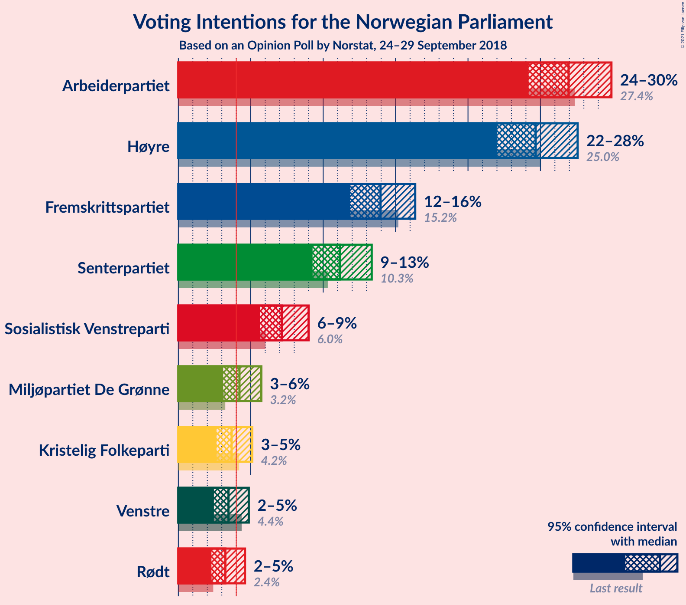

### Confidence Intervals

| Party | Last Result | Poll Result | 80% Confidence Interval | 90% Confidence Interval | 95% Confidence Interval | 99% Confidence Interval |
|:-----:|:-----------:|:-----------:|:-----------------------:|:-----------------------:|:-----------------------:|:-----------------------:|
| Arbeiderpartiet | 27.4% | 26.9% | 25.1–28.9% |24.6–29.4% |24.2–29.9% |23.3–30.8% |
| Høyre | 25.0% | 24.7% | 22.9–26.6% |22.4–27.1% |22.0–27.6% |21.2–28.5% |
| Fremskrittspartiet | 15.2% | 14.0% | 12.6–15.5% |12.2–16.0% |11.9–16.4% |11.2–17.1% |
| Senterpartiet | 10.3% | 11.1% | 9.9–12.6% |9.6–13.0% |9.3–13.4% |8.7–14.1% |
| Sosialistisk Venstreparti | 6.0% | 7.1% | 6.2–8.4% |5.9–8.7% |5.7–9.0% |5.2–9.6% |
| Miljøpartiet De Grønne | 3.2% | 4.2% | 3.5–5.2% |3.3–5.5% |3.1–5.7% |2.8–6.2% |
| Kristelig Folkeparti | 4.2% | 3.7% | 3.0–4.6% |2.8–4.9% |2.6–5.1% |2.3–5.6% |
| Venstre | 4.4% | 3.5% | 2.8–4.4% |2.6–4.6% |2.5–4.9% |2.2–5.3% |
| Rødt | 2.4% | 3.2% | 2.6–4.1% |2.4–4.4% |2.3–4.6% |2.0–5.1% |

*Note:* The poll result column reflects the actual value used in the calculations. Published results may vary slightly, and in addition be rounded to fewer digits.

## Seats

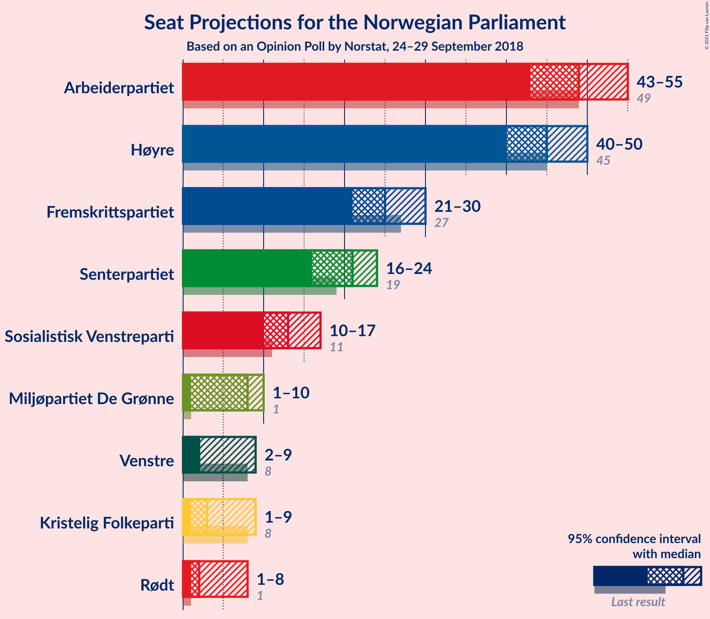

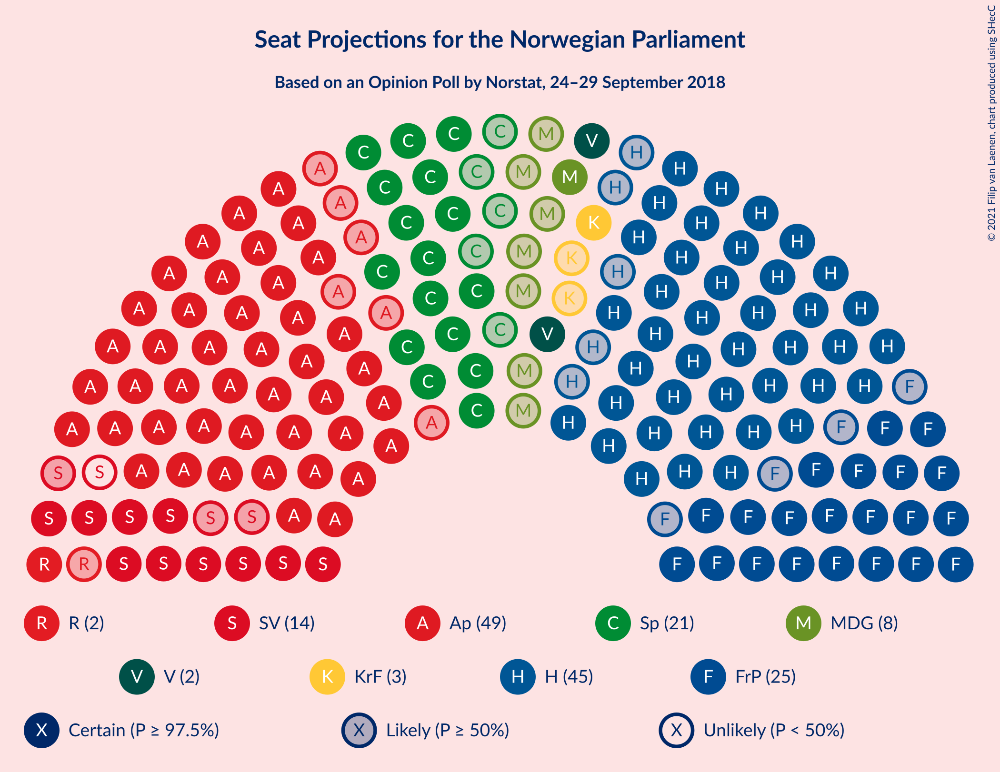

### Confidence Intervals

| Party | Last Result | Median | 80% Confidence Interval | 90% Confidence Interval | 95% Confidence Interval | 99% Confidence Interval |
|:-----:|:-----------:|:------:|:-----------------------:|:-----------------------:|:-----------------------:|:-----------------------:|
| <a href="#arbeiderpartiet">Arbeiderpartiet</a> | 49 | 49 | 45–53 |44–54 |43–55 |42–57 |
| <a href="#høyre">Høyre</a> | 45 | 45 | 41–48 |41–49 |40–50 |38–52 |
| <a href="#fremskrittspartiet">Fremskrittspartiet</a> | 27 | 25 | 23–28 |22–29 |21–30 |20–31 |
| <a href="#senterpartiet">Senterpartiet</a> | 19 | 21 | 18–23 |17–24 |16–24 |15–26 |
| <a href="#sosialistisk-venstreparti">Sosialistisk Venstreparti</a> | 11 | 13 | 11–15 |10–16 |10–17 |9–17 |
| <a href="#miljøpartiet-de-grønne">Miljøpartiet De Grønne</a> | 1 | 8 | 2–9 |2–10 |1–10 |1–11 |
| <a href="#kristelig-folkeparti">Kristelig Folkeparti</a> | 8 | 3 | 1–8 |1–9 |1–9 |1–10 |
| <a href="#venstre">Venstre</a> | 8 | 2 | 2–8 |2–8 |2–9 |1–9 |
| <a href="#rødt">Rødt</a> | 1 | 2 | 1–7 |1–8 |1–8 |1–9 |

### Arbeiderpartiet

*For a full overview of the results for this party, see the [Arbeiderpartiet](party-arbeiderpartiet.html) page.*

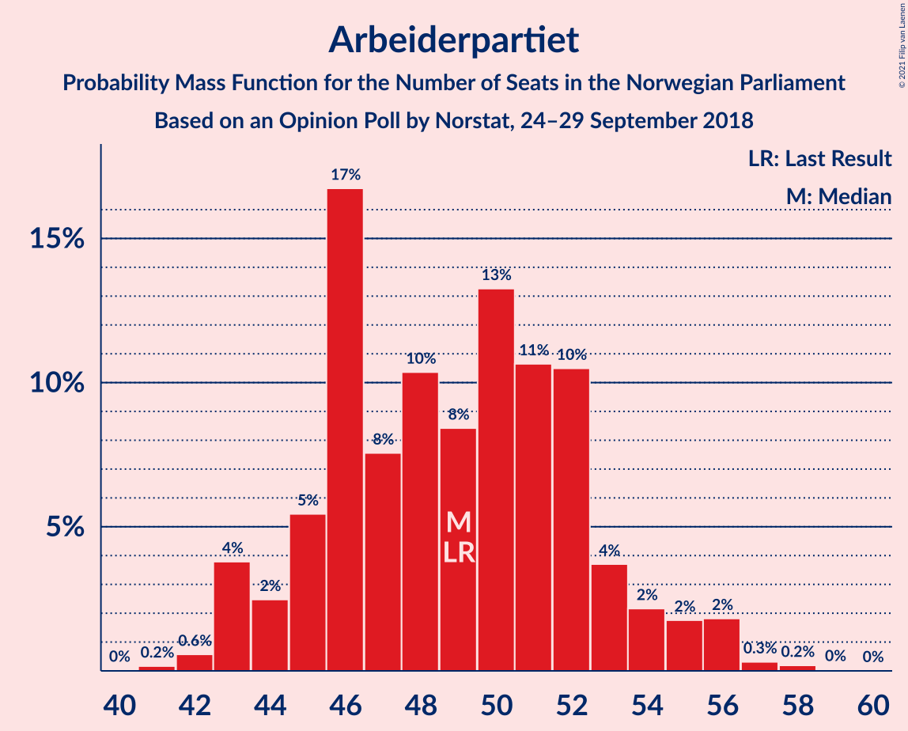

| Number of Seats | Probability | Accumulated | Special Marks |
|:---------------:|:-----------:|:-----------:|:-------------:|
| 41 | 0.2% | 100% |  |
| 42 | 0.6% | 99.8% |  |
| 43 | 4% | 99.2% |  |
| 44 | 2% | 95% |  |
| 45 | 5% | 93% |  |
| 46 | 17% | 88% |  |
| 47 | 8% | 71% |  |
| 48 | 10% | 63% |  |
| 49 | 8% | 53% | Last Result, Median |
| 50 | 13% | 44% |  |
| 51 | 11% | 31% |  |
| 52 | 10% | 21% |  |
| 53 | 4% | 10% |  |
| 54 | 2% | 6% |  |
| 55 | 2% | 4% |  |
| 56 | 2% | 2% |  |
| 57 | 0.3% | 0.6% |  |
| 58 | 0.2% | 0.3% |  |
| 59 | 0% | 0.1% |  |
| 60 | 0% | 0% |  |

### Høyre

*For a full overview of the results for this party, see the [Høyre](party-høyre.html) page.*

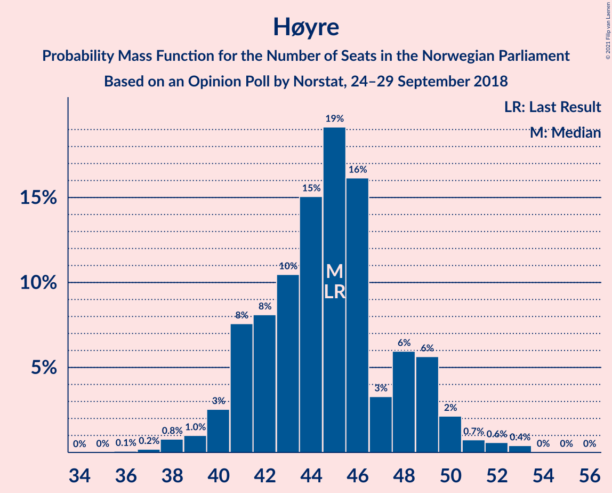

| Number of Seats | Probability | Accumulated | Special Marks |
|:---------------:|:-----------:|:-----------:|:-------------:|
| 36 | 0.1% | 100% |  |
| 37 | 0.2% | 99.9% |  |
| 38 | 0.8% | 99.7% |  |
| 39 | 1.0% | 98.9% |  |
| 40 | 3% | 98% |  |
| 41 | 8% | 95% |  |
| 42 | 8% | 88% |  |
| 43 | 10% | 80% |  |
| 44 | 15% | 69% |  |
| 45 | 19% | 54% | Last Result, Median |
| 46 | 16% | 35% |  |
| 47 | 3% | 19% |  |
| 48 | 6% | 16% |  |
| 49 | 6% | 10% |  |
| 50 | 2% | 4% |  |
| 51 | 0.7% | 2% |  |
| 52 | 0.6% | 1.1% |  |
| 53 | 0.4% | 0.5% |  |
| 54 | 0% | 0.1% |  |
| 55 | 0% | 0.1% |  |
| 56 | 0% | 0% |  |

### Fremskrittspartiet

*For a full overview of the results for this party, see the [Fremskrittspartiet](party-fremskrittspartiet.html) page.*

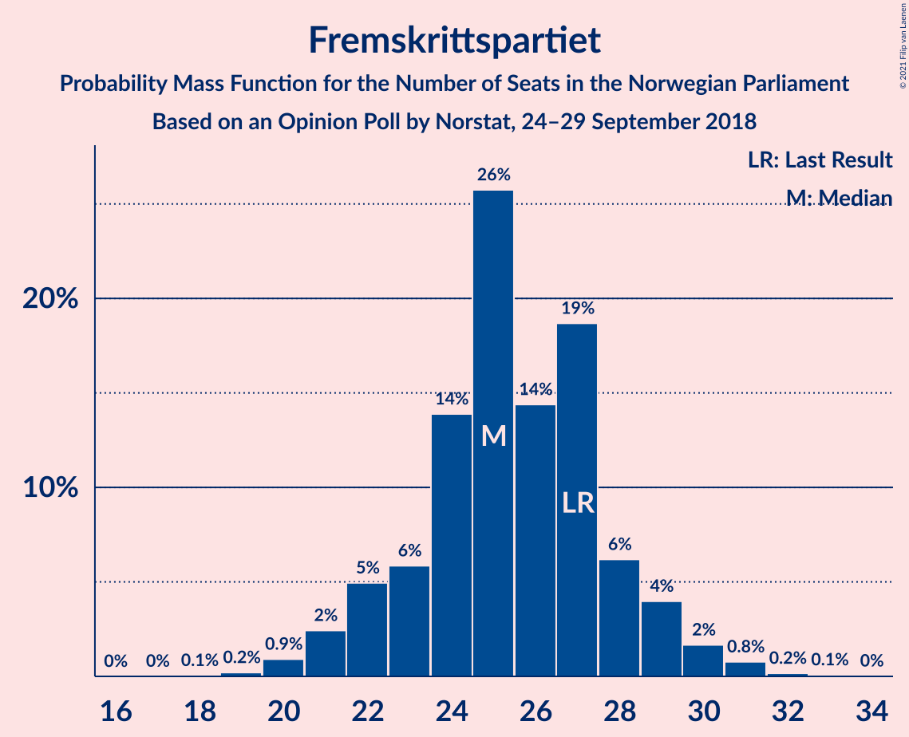

| Number of Seats | Probability | Accumulated | Special Marks |
|:---------------:|:-----------:|:-----------:|:-------------:|
| 18 | 0.1% | 100% |  |
| 19 | 0.2% | 99.9% |  |
| 20 | 0.9% | 99.7% |  |
| 21 | 2% | 98.8% |  |
| 22 | 5% | 96% |  |
| 23 | 6% | 91% |  |
| 24 | 14% | 86% |  |
| 25 | 26% | 72% | Median |
| 26 | 14% | 46% |  |
| 27 | 19% | 32% | Last Result |
| 28 | 6% | 13% |  |
| 29 | 4% | 7% |  |
| 30 | 2% | 3% |  |
| 31 | 0.8% | 1.1% |  |
| 32 | 0.2% | 0.3% |  |
| 33 | 0.1% | 0.1% |  |
| 34 | 0% | 0% |  |

### Senterpartiet

*For a full overview of the results for this party, see the [Senterpartiet](party-senterpartiet.html) page.*

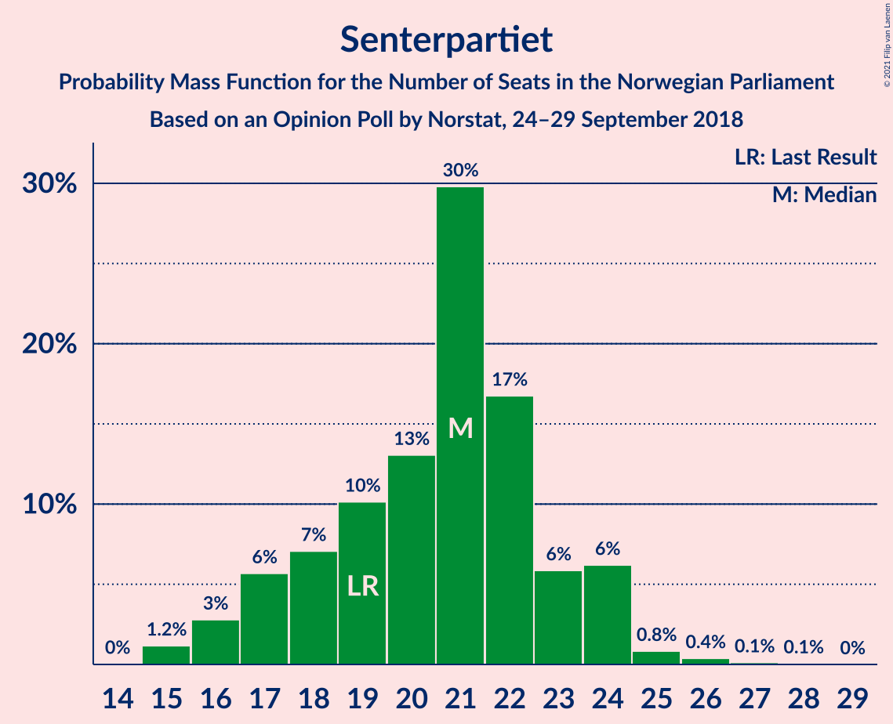

| Number of Seats | Probability | Accumulated | Special Marks |
|:---------------:|:-----------:|:-----------:|:-------------:|
| 15 | 1.2% | 100% |  |
| 16 | 3% | 98.8% |  |
| 17 | 6% | 96% |  |
| 18 | 7% | 90% |  |
| 19 | 10% | 83% | Last Result |
| 20 | 13% | 73% |  |
| 21 | 30% | 60% | Median |
| 22 | 17% | 30% |  |
| 23 | 6% | 13% |  |
| 24 | 6% | 8% |  |
| 25 | 0.8% | 1.4% |  |
| 26 | 0.4% | 0.6% |  |
| 27 | 0.1% | 0.2% |  |
| 28 | 0.1% | 0.1% |  |
| 29 | 0% | 0% |  |

### Sosialistisk Venstreparti

*For a full overview of the results for this party, see the [Sosialistisk Venstreparti](party-sosialistiskvenstreparti.html) page.*

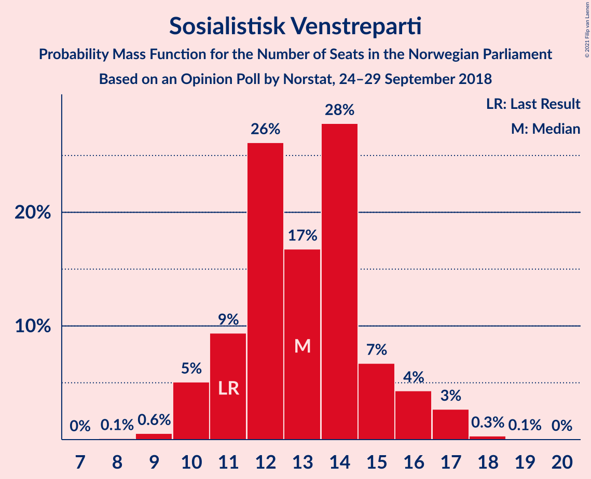

| Number of Seats | Probability | Accumulated | Special Marks |
|:---------------:|:-----------:|:-----------:|:-------------:|
| 8 | 0.1% | 100% |  |
| 9 | 0.6% | 99.9% |  |
| 10 | 5% | 99.3% |  |
| 11 | 9% | 94% | Last Result |
| 12 | 26% | 85% |  |
| 13 | 17% | 59% | Median |
| 14 | 28% | 42% |  |
| 15 | 7% | 14% |  |
| 16 | 4% | 7% |  |
| 17 | 3% | 3% |  |
| 18 | 0.3% | 0.5% |  |
| 19 | 0.1% | 0.1% |  |
| 20 | 0% | 0% |  |

### Miljøpartiet De Grønne

*For a full overview of the results for this party, see the [Miljøpartiet De Grønne](party-miljøpartietdegrønne.html) page.*

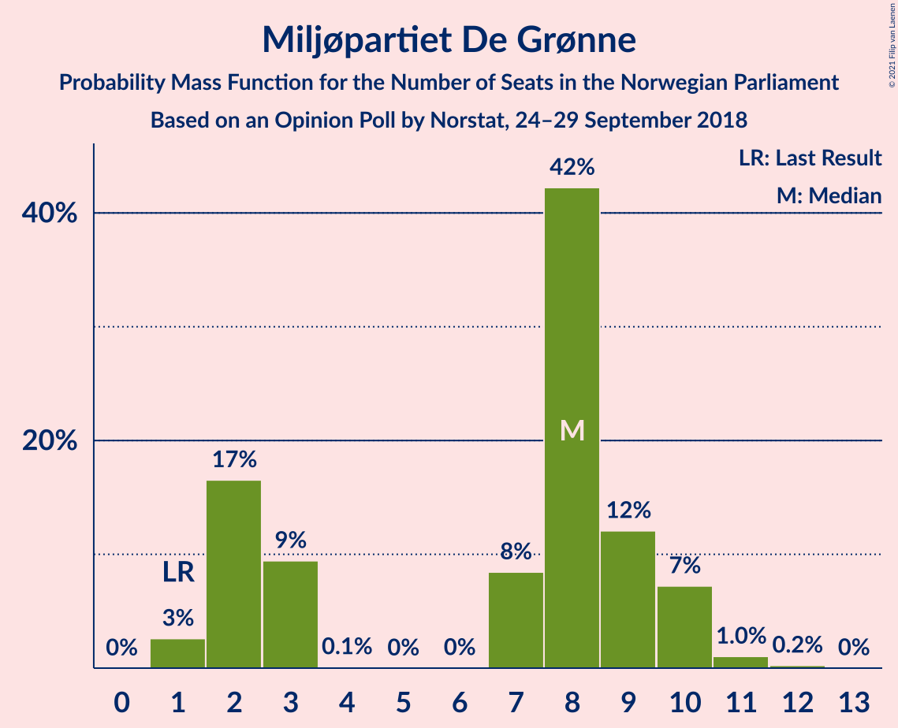

| Number of Seats | Probability | Accumulated | Special Marks |
|:---------------:|:-----------:|:-----------:|:-------------:|
| 1 | 3% | 100% | Last Result |
| 2 | 17% | 97% |  |
| 3 | 9% | 81% |  |
| 4 | 0.1% | 71% |  |
| 5 | 0% | 71% |  |
| 6 | 0% | 71% |  |
| 7 | 8% | 71% |  |
| 8 | 42% | 63% | Median |
| 9 | 12% | 21% |  |
| 10 | 7% | 9% |  |
| 11 | 1.0% | 1.3% |  |
| 12 | 0.2% | 0.3% |  |
| 13 | 0% | 0% |  |

### Kristelig Folkeparti

*For a full overview of the results for this party, see the [Kristelig Folkeparti](party-kristeligfolkeparti.html) page.*

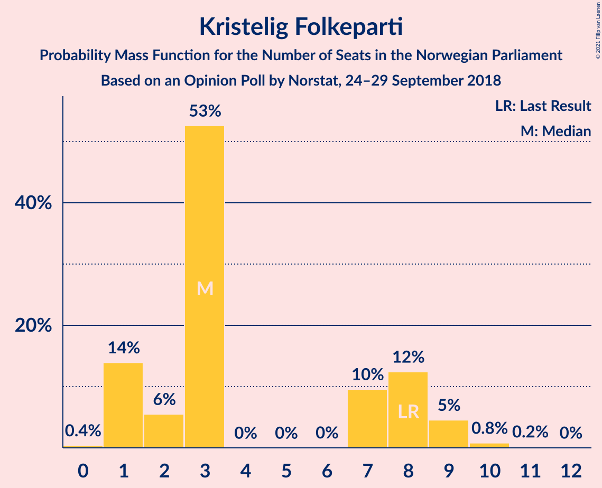

| Number of Seats | Probability | Accumulated | Special Marks |
|:---------------:|:-----------:|:-----------:|:-------------:|
| 0 | 0.4% | 100% |  |
| 1 | 14% | 99.6% |  |
| 2 | 6% | 86% |  |
| 3 | 53% | 80% | Median |
| 4 | 0% | 28% |  |
| 5 | 0% | 28% |  |
| 6 | 0% | 28% |  |
| 7 | 10% | 28% |  |
| 8 | 12% | 18% | Last Result |
| 9 | 5% | 6% |  |
| 10 | 0.8% | 1.0% |  |
| 11 | 0.2% | 0.2% |  |
| 12 | 0% | 0% |  |

### Venstre

*For a full overview of the results for this party, see the [Venstre](party-venstre.html) page.*

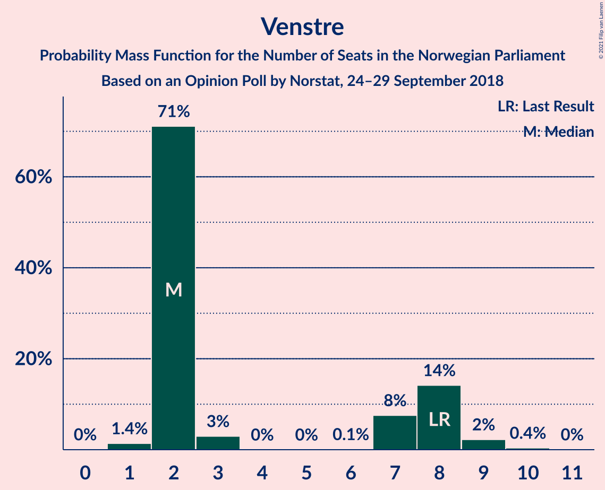

| Number of Seats | Probability | Accumulated | Special Marks |
|:---------------:|:-----------:|:-----------:|:-------------:|
| 1 | 1.4% | 100% |  |
| 2 | 71% | 98.6% | Median |
| 3 | 3% | 27% |  |
| 4 | 0% | 24% |  |
| 5 | 0% | 24% |  |
| 6 | 0.1% | 24% |  |
| 7 | 8% | 24% |  |
| 8 | 14% | 17% | Last Result |
| 9 | 2% | 3% |  |
| 10 | 0.4% | 0.4% |  |
| 11 | 0% | 0% |  |

### Rødt

*For a full overview of the results for this party, see the [Rødt](party-rødt.html) page.*

| Number of Seats | Probability | Accumulated | Special Marks |
|:---------------:|:-----------:|:-----------:|:-------------:|
| 1 | 24% | 100% | Last Result |
| 2 | 64% | 76% | Median |
| 3 | 0% | 12% |  |
| 4 | 0% | 12% |  |
| 5 | 0% | 12% |  |
| 6 | 0.5% | 12% |  |
| 7 | 6% | 12% |  |
| 8 | 5% | 6% |  |
| 9 | 1.3% | 1.4% |  |
| 10 | 0.1% | 0.1% |  |
| 11 | 0% | 0% |  |

## Coalitions

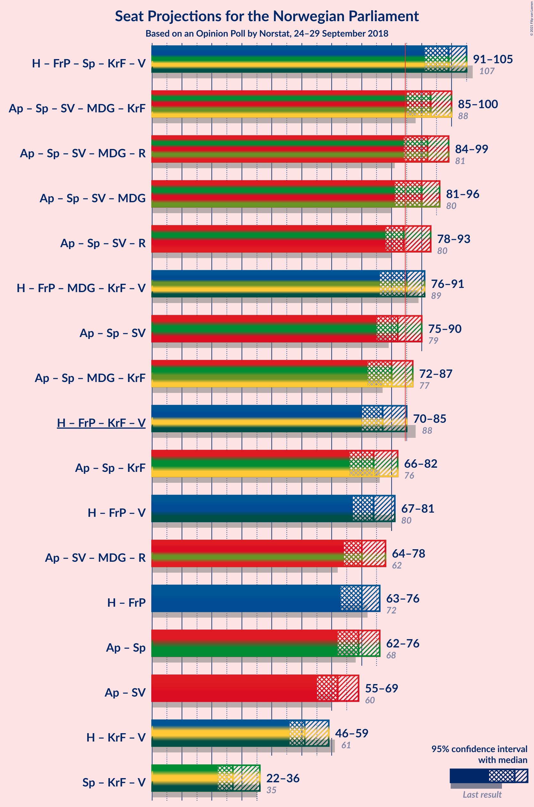

### Confidence Intervals

| Coalition | Last Result | Median | Majority? | 80% Confidence Interval | 90% Confidence Interval | 95% Confidence Interval | 99% Confidence Interval |
|:---------:|:-----------:|:------:|:---------:|:-----------------------:|:-----------------------:|:-----------------------:|:-----------------------:|
| Høyre – Fremskrittspartiet – Senterpartiet – Kristelig Folkeparti – Venstre | 107 | 99 | 100% | 93–103 | 92–104 | 91–105 | 88–108 |
| Arbeiderpartiet – Senterpartiet – Sosialistisk Venstreparti – Miljøpartiet De Grønne – Kristelig Folkeparti | 88 | 93 | 98% | 89–98 | 87–99 | 85–100 | 83–102 |
| Arbeiderpartiet – Senterpartiet – Sosialistisk Venstreparti – Miljøpartiet De Grønne – Rødt | 81 | 92 | 96% | 86–97 | 85–97 | 84–99 | 81–101 |
| Arbeiderpartiet – Senterpartiet – Sosialistisk Venstreparti – Miljøpartiet De Grønne | 80 | 90 | 87% | 84–94 | 82–95 | 81–96 | 78–98 |
| Arbeiderpartiet – Senterpartiet – Sosialistisk Venstreparti – Rødt | 80 | 84 | 48% | 80–90 | 78–91 | 78–93 | 75–96 |
| Høyre – Fremskrittspartiet – Miljøpartiet De Grønne – Kristelig Folkeparti – Venstre | 89 | 85 | 52% | 79–89 | 78–91 | 76–91 | 73–94 |
| Arbeiderpartiet – Senterpartiet – Sosialistisk Venstreparti | 79 | 82 | 29% | 77–88 | 76–89 | 75–90 | 73–92 |
| Arbeiderpartiet – Senterpartiet – Miljøpartiet De Grønne – Kristelig Folkeparti | 77 | 80 | 11% | 75–85 | 74–86 | 72–87 | 70–90 |
| Høyre – Fremskrittspartiet – Kristelig Folkeparti – Venstre | 88 | 77 | 4% | 72–83 | 72–84 | 70–85 | 68–88 |
| Arbeiderpartiet – Senterpartiet – Kristelig Folkeparti | 76 | 74 | 0.1% | 68–78 | 67–80 | 66–82 | 64–83 |
| Høyre – Fremskrittspartiet – Venstre | 80 | 74 | 0.3% | 69–77 | 68–80 | 67–81 | 64–83 |
| Arbeiderpartiet – Sosialistisk Venstreparti – Miljøpartiet De Grønne – Rødt | 62 | 70 | 0% | 66–76 | 65–77 | 64–78 | 61–81 |
| Høyre – Fremskrittspartiet | 72 | 70 | 0% | 66–74 | 64–75 | 63–76 | 61–80 |
| Arbeiderpartiet – Senterpartiet | 68 | 69 | 0% | 65–74 | 64–75 | 62–76 | 61–79 |
| Arbeiderpartiet – Sosialistisk Venstreparti | 60 | 62 | 0% | 58–66 | 56–68 | 55–69 | 54–71 |
| Høyre – Kristelig Folkeparti – Venstre | 61 | 51 | 0% | 48–57 | 47–58 | 46–59 | 44–62 |
| Senterpartiet – Kristelig Folkeparti – Venstre | 35 | 27 | 0% | 24–32 | 22–34 | 22–36 | 21–37 |

### Høyre – Fremskrittspartiet – Senterpartiet – Kristelig Folkeparti – Venstre

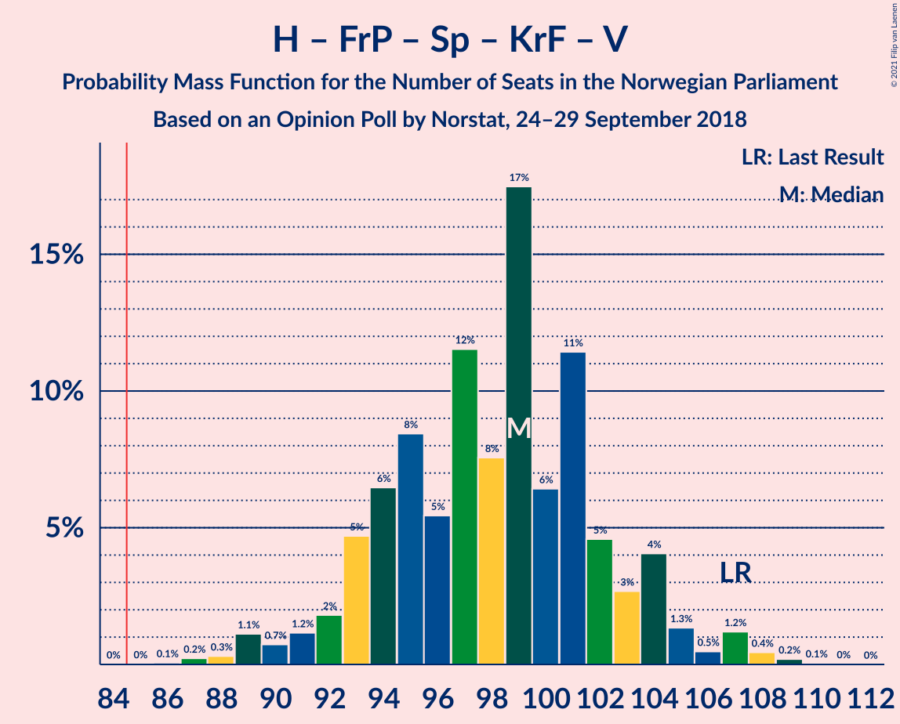

| Number of Seats | Probability | Accumulated | Special Marks |
|:---------------:|:-----------:|:-----------:|:-------------:|
| 86 | 0.1% | 100% |  |
| 87 | 0.2% | 99.9% |  |
| 88 | 0.3% | 99.7% |  |
| 89 | 1.1% | 99.4% |  |
| 90 | 0.7% | 98% |  |
| 91 | 1.2% | 98% |  |
| 92 | 2% | 96% |  |
| 93 | 5% | 95% |  |
| 94 | 6% | 90% |  |
| 95 | 8% | 83% |  |
| 96 | 5% | 75% | Median |
| 97 | 12% | 69% |  |
| 98 | 8% | 58% |  |
| 99 | 17% | 50% |  |
| 100 | 6% | 33% |  |
| 101 | 11% | 26% |  |
| 102 | 5% | 15% |  |
| 103 | 3% | 10% |  |
| 104 | 4% | 8% |  |
| 105 | 1.3% | 4% |  |
| 106 | 0.5% | 2% |  |
| 107 | 1.2% | 2% | Last Result |
| 108 | 0.4% | 0.7% |  |
| 109 | 0.2% | 0.3% |  |
| 110 | 0.1% | 0.1% |  |
| 111 | 0% | 0% |  |

### Arbeiderpartiet – Senterpartiet – Sosialistisk Venstreparti – Miljøpartiet De Grønne – Kristelig Folkeparti

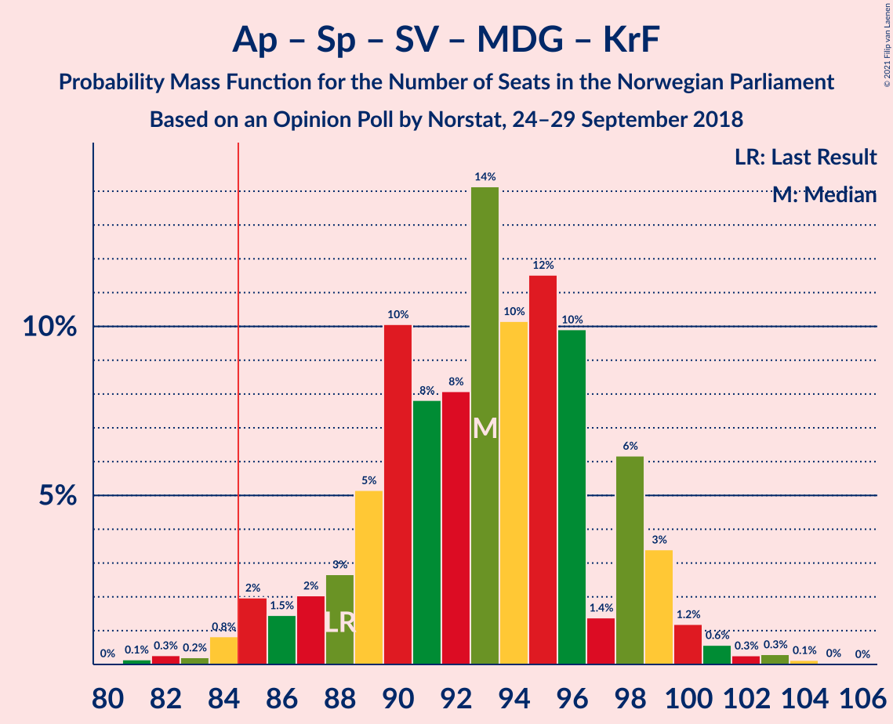

| Number of Seats | Probability | Accumulated | Special Marks |
|:---------------:|:-----------:|:-----------:|:-------------:|
| 80 | 0% | 100% |  |
| 81 | 0.1% | 99.9% |  |
| 82 | 0.3% | 99.8% |  |
| 83 | 0.2% | 99.5% |  |
| 84 | 0.8% | 99.3% |  |
| 85 | 2% | 98% | Majority |
| 86 | 1.5% | 97% |  |
| 87 | 2% | 95% |  |
| 88 | 3% | 93% | Last Result |
| 89 | 5% | 90% |  |
| 90 | 10% | 85% |  |
| 91 | 8% | 75% |  |
| 92 | 8% | 67% |  |
| 93 | 14% | 59% |  |
| 94 | 10% | 45% | Median |
| 95 | 12% | 35% |  |
| 96 | 10% | 23% |  |
| 97 | 1.4% | 13% |  |
| 98 | 6% | 12% |  |
| 99 | 3% | 6% |  |
| 100 | 1.2% | 3% |  |
| 101 | 0.6% | 1.3% |  |
| 102 | 0.3% | 0.8% |  |
| 103 | 0.3% | 0.5% |  |
| 104 | 0.1% | 0.2% |  |
| 105 | 0% | 0.1% |  |
| 106 | 0% | 0% |  |

### Arbeiderpartiet – Senterpartiet – Sosialistisk Venstreparti – Miljøpartiet De Grønne – Rødt

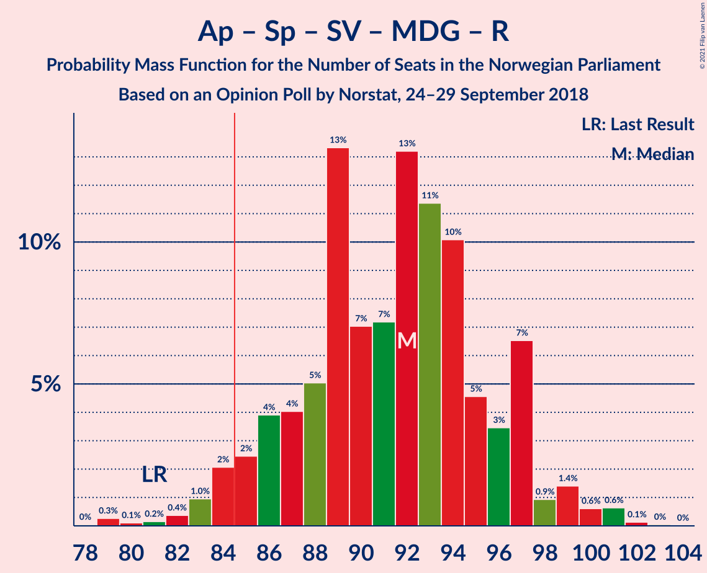

| Number of Seats | Probability | Accumulated | Special Marks |
|:---------------:|:-----------:|:-----------:|:-------------:|
| 78 | 0% | 100% |  |
| 79 | 0.3% | 99.9% |  |
| 80 | 0.1% | 99.7% |  |
| 81 | 0.2% | 99.6% | Last Result |
| 82 | 0.4% | 99.4% |  |
| 83 | 1.0% | 99.0% |  |
| 84 | 2% | 98% |  |
| 85 | 2% | 96% | Majority |
| 86 | 4% | 94% |  |
| 87 | 4% | 90% |  |
| 88 | 5% | 86% |  |
| 89 | 13% | 81% |  |
| 90 | 7% | 67% |  |
| 91 | 7% | 60% |  |
| 92 | 13% | 53% |  |
| 93 | 11% | 40% | Median |
| 94 | 10% | 28% |  |
| 95 | 5% | 18% |  |
| 96 | 3% | 14% |  |
| 97 | 7% | 10% |  |
| 98 | 0.9% | 4% |  |
| 99 | 1.4% | 3% |  |
| 100 | 0.6% | 1.5% |  |
| 101 | 0.6% | 0.8% |  |
| 102 | 0.1% | 0.2% |  |
| 103 | 0% | 0.1% |  |
| 104 | 0% | 0% |  |

### Arbeiderpartiet – Senterpartiet – Sosialistisk Venstreparti – Miljøpartiet De Grønne

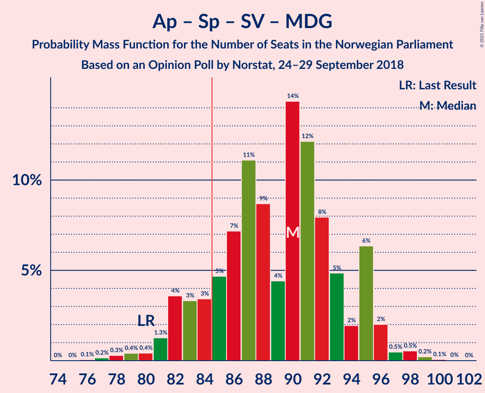

| Number of Seats | Probability | Accumulated | Special Marks |
|:---------------:|:-----------:|:-----------:|:-------------:|
| 76 | 0.1% | 100% |  |
| 77 | 0.2% | 99.9% |  |
| 78 | 0.3% | 99.8% |  |
| 79 | 0.4% | 99.5% |  |
| 80 | 0.4% | 99.1% | Last Result |
| 81 | 1.3% | 98.6% |  |
| 82 | 4% | 97% |  |
| 83 | 3% | 94% |  |
| 84 | 3% | 90% |  |
| 85 | 5% | 87% | Majority |
| 86 | 7% | 82% |  |
| 87 | 11% | 75% |  |
| 88 | 9% | 64% |  |
| 89 | 4% | 55% |  |
| 90 | 14% | 51% |  |
| 91 | 12% | 37% | Median |
| 92 | 8% | 24% |  |
| 93 | 5% | 17% |  |
| 94 | 2% | 12% |  |
| 95 | 6% | 10% |  |
| 96 | 2% | 3% |  |
| 97 | 0.5% | 1.3% |  |
| 98 | 0.5% | 0.9% |  |
| 99 | 0.2% | 0.3% |  |
| 100 | 0.1% | 0.1% |  |
| 101 | 0% | 0% |  |

### Arbeiderpartiet – Senterpartiet – Sosialistisk Venstreparti – Rødt

| Number of Seats | Probability | Accumulated | Special Marks |
|:---------------:|:-----------:|:-----------:|:-------------:|
| 74 | 0.1% | 100% |  |
| 75 | 0.3% | 99.8% |  |
| 76 | 0.6% | 99.5% |  |
| 77 | 0.9% | 98.9% |  |
| 78 | 3% | 98% |  |
| 79 | 2% | 95% |  |
| 80 | 4% | 92% | Last Result |
| 81 | 12% | 88% |  |
| 82 | 6% | 77% |  |
| 83 | 7% | 71% |  |
| 84 | 16% | 64% |  |
| 85 | 9% | 48% | Median, Majority |
| 86 | 6% | 39% |  |
| 87 | 7% | 33% |  |
| 88 | 5% | 26% |  |
| 89 | 8% | 21% |  |
| 90 | 3% | 13% |  |
| 91 | 5% | 10% |  |
| 92 | 2% | 5% |  |
| 93 | 2% | 3% |  |
| 94 | 0.3% | 1.2% |  |
| 95 | 0.1% | 0.9% |  |
| 96 | 0.4% | 0.8% |  |
| 97 | 0.1% | 0.4% |  |
| 98 | 0.3% | 0.4% |  |
| 99 | 0% | 0% |  |

### Høyre – Fremskrittspartiet – Miljøpartiet De Grønne – Kristelig Folkeparti – Venstre

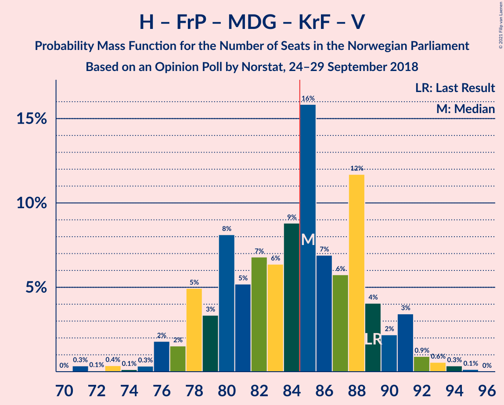

| Number of Seats | Probability | Accumulated | Special Marks |
|:---------------:|:-----------:|:-----------:|:-------------:|
| 71 | 0.3% | 100% |  |
| 72 | 0.1% | 99.6% |  |
| 73 | 0.4% | 99.6% |  |
| 74 | 0.1% | 99.2% |  |
| 75 | 0.3% | 99.1% |  |
| 76 | 2% | 98.8% |  |
| 77 | 2% | 97% |  |
| 78 | 5% | 95% |  |
| 79 | 3% | 90% |  |
| 80 | 8% | 87% |  |
| 81 | 5% | 79% |  |
| 82 | 7% | 74% |  |
| 83 | 6% | 67% | Median |
| 84 | 9% | 61% |  |
| 85 | 16% | 52% | Majority |
| 86 | 7% | 36% |  |
| 87 | 6% | 29% |  |
| 88 | 12% | 23% |  |
| 89 | 4% | 12% | Last Result |
| 90 | 2% | 8% |  |
| 91 | 3% | 5% |  |
| 92 | 0.9% | 2% |  |
| 93 | 0.6% | 1.1% |  |
| 94 | 0.3% | 0.5% |  |
| 95 | 0.1% | 0.2% |  |
| 96 | 0% | 0% |  |

### Arbeiderpartiet – Senterpartiet – Sosialistisk Venstreparti

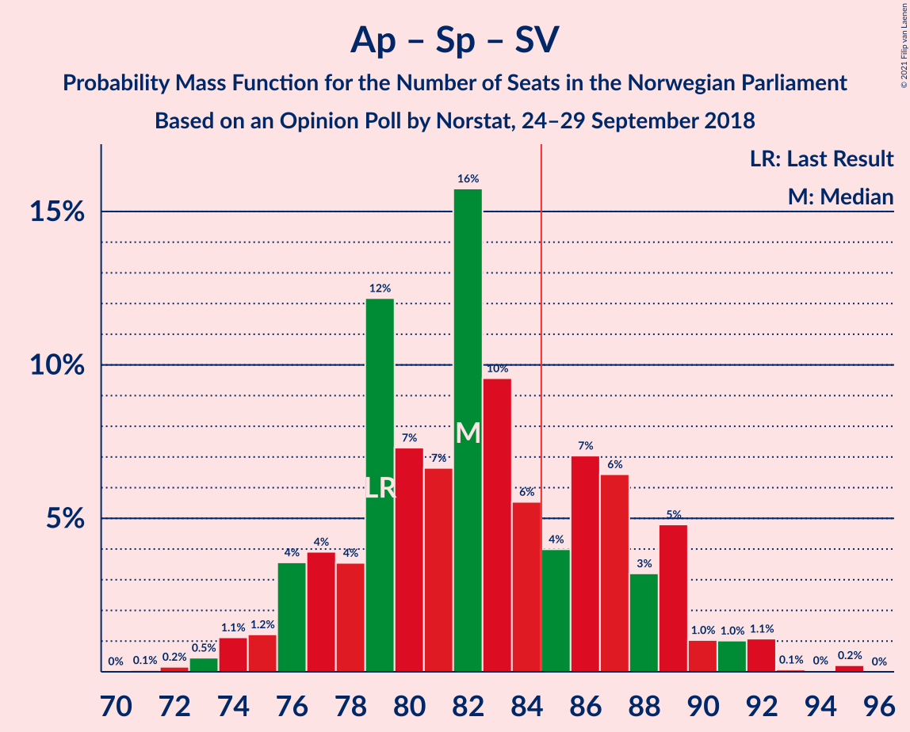

| Number of Seats | Probability | Accumulated | Special Marks |
|:---------------:|:-----------:|:-----------:|:-------------:|
| 71 | 0.1% | 100% |  |
| 72 | 0.2% | 99.9% |  |
| 73 | 0.5% | 99.8% |  |
| 74 | 1.1% | 99.3% |  |
| 75 | 1.2% | 98% |  |
| 76 | 4% | 97% |  |
| 77 | 4% | 93% |  |
| 78 | 4% | 89% |  |
| 79 | 12% | 86% | Last Result |
| 80 | 7% | 74% |  |
| 81 | 7% | 66% |  |
| 82 | 16% | 60% |  |
| 83 | 10% | 44% | Median |
| 84 | 6% | 34% |  |
| 85 | 4% | 29% | Majority |
| 86 | 7% | 25% |  |
| 87 | 6% | 18% |  |
| 88 | 3% | 11% |  |
| 89 | 5% | 8% |  |
| 90 | 1.0% | 3% |  |
| 91 | 1.0% | 2% |  |
| 92 | 1.1% | 1.4% |  |
| 93 | 0.1% | 0.3% |  |
| 94 | 0% | 0.3% |  |
| 95 | 0.2% | 0.2% |  |
| 96 | 0% | 0% |  |

### Arbeiderpartiet – Senterpartiet – Miljøpartiet De Grønne – Kristelig Folkeparti

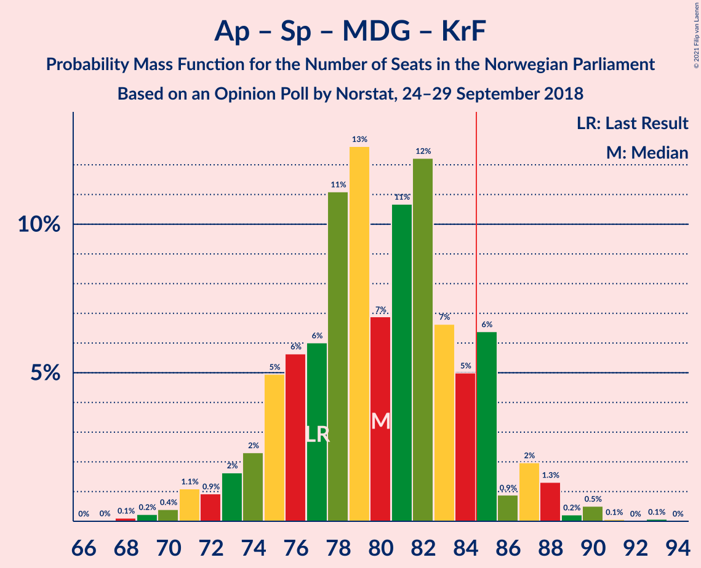

| Number of Seats | Probability | Accumulated | Special Marks |
|:---------------:|:-----------:|:-----------:|:-------------:|
| 68 | 0.1% | 100% |  |
| 69 | 0.2% | 99.8% |  |
| 70 | 0.4% | 99.6% |  |
| 71 | 1.1% | 99.2% |  |
| 72 | 0.9% | 98% |  |
| 73 | 2% | 97% |  |
| 74 | 2% | 96% |  |
| 75 | 5% | 93% |  |
| 76 | 6% | 88% |  |
| 77 | 6% | 83% | Last Result |
| 78 | 11% | 77% |  |
| 79 | 13% | 66% |  |
| 80 | 7% | 53% |  |
| 81 | 11% | 46% | Median |
| 82 | 12% | 35% |  |
| 83 | 7% | 23% |  |
| 84 | 5% | 16% |  |
| 85 | 6% | 11% | Majority |
| 86 | 0.9% | 5% |  |
| 87 | 2% | 4% |  |
| 88 | 1.3% | 2% |  |
| 89 | 0.2% | 0.9% |  |
| 90 | 0.5% | 0.7% |  |
| 91 | 0.1% | 0.2% |  |
| 92 | 0% | 0.1% |  |
| 93 | 0.1% | 0.1% |  |
| 94 | 0% | 0% |  |

### Høyre – Fremskrittspartiet – Kristelig Folkeparti – Venstre

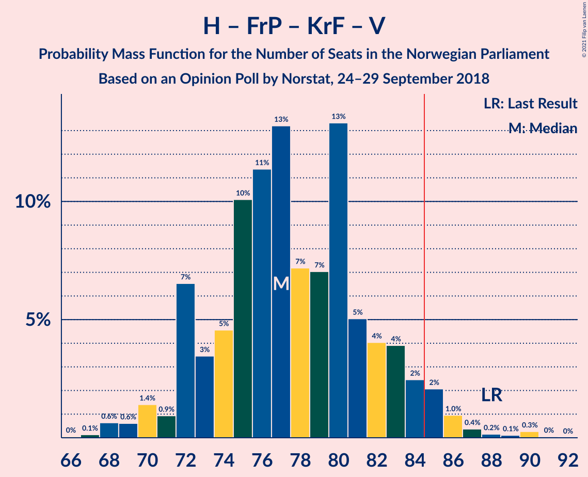

| Number of Seats | Probability | Accumulated | Special Marks |
|:---------------:|:-----------:|:-----------:|:-------------:|
| 66 | 0% | 100% |  |
| 67 | 0.1% | 99.9% |  |
| 68 | 0.6% | 99.8% |  |
| 69 | 0.6% | 99.2% |  |
| 70 | 1.4% | 98.5% |  |
| 71 | 0.9% | 97% |  |
| 72 | 7% | 96% |  |
| 73 | 3% | 90% |  |
| 74 | 5% | 86% |  |
| 75 | 10% | 82% | Median |
| 76 | 11% | 72% |  |
| 77 | 13% | 60% |  |
| 78 | 7% | 47% |  |
| 79 | 7% | 40% |  |
| 80 | 13% | 33% |  |
| 81 | 5% | 19% |  |
| 82 | 4% | 14% |  |
| 83 | 4% | 10% |  |
| 84 | 2% | 6% |  |
| 85 | 2% | 4% | Majority |
| 86 | 1.0% | 2% |  |
| 87 | 0.4% | 1.0% |  |
| 88 | 0.2% | 0.6% | Last Result |
| 89 | 0.1% | 0.4% |  |
| 90 | 0.3% | 0.3% |  |
| 91 | 0% | 0.1% |  |
| 92 | 0% | 0% |  |

### Arbeiderpartiet – Senterpartiet – Kristelig Folkeparti

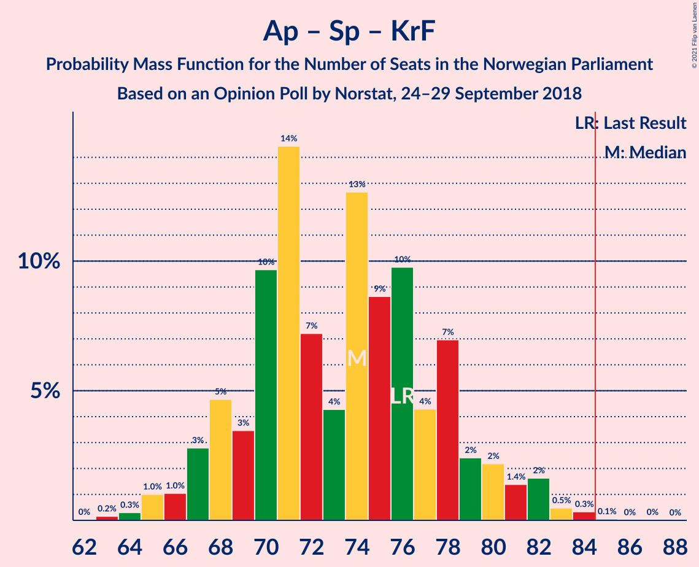

| Number of Seats | Probability | Accumulated | Special Marks |
|:---------------:|:-----------:|:-----------:|:-------------:|
| 63 | 0.2% | 100% |  |
| 64 | 0.3% | 99.8% |  |
| 65 | 1.0% | 99.5% |  |
| 66 | 1.0% | 98% |  |
| 67 | 3% | 97% |  |
| 68 | 5% | 95% |  |
| 69 | 3% | 90% |  |
| 70 | 10% | 86% |  |
| 71 | 14% | 77% |  |
| 72 | 7% | 62% |  |
| 73 | 4% | 55% | Median |
| 74 | 13% | 51% |  |
| 75 | 9% | 38% |  |
| 76 | 10% | 30% | Last Result |
| 77 | 4% | 20% |  |
| 78 | 7% | 16% |  |
| 79 | 2% | 9% |  |
| 80 | 2% | 6% |  |
| 81 | 1.4% | 4% |  |
| 82 | 2% | 3% |  |
| 83 | 0.5% | 0.9% |  |
| 84 | 0.3% | 0.4% |  |
| 85 | 0.1% | 0.1% | Majority |
| 86 | 0% | 0.1% |  |
| 87 | 0% | 0% |  |

### Høyre – Fremskrittspartiet – Venstre

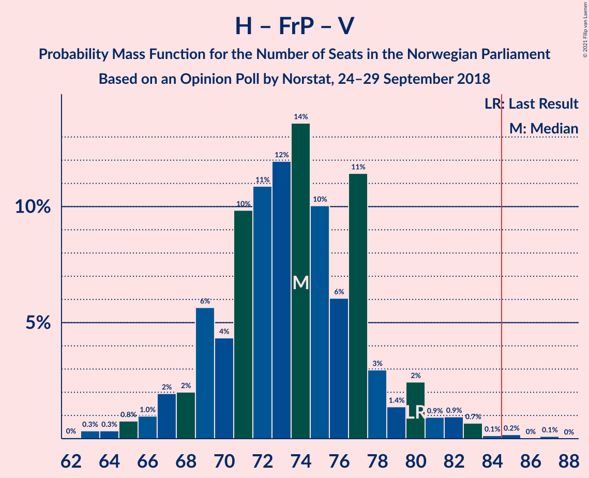

| Number of Seats | Probability | Accumulated | Special Marks |
|:---------------:|:-----------:|:-----------:|:-------------:|
| 62 | 0% | 100% |  |
| 63 | 0.3% | 99.9% |  |
| 64 | 0.3% | 99.6% |  |
| 65 | 0.8% | 99.3% |  |
| 66 | 1.0% | 98% |  |
| 67 | 2% | 98% |  |
| 68 | 2% | 96% |  |
| 69 | 6% | 94% |  |
| 70 | 4% | 88% |  |
| 71 | 10% | 84% |  |
| 72 | 11% | 74% | Median |
| 73 | 12% | 63% |  |
| 74 | 14% | 51% |  |
| 75 | 10% | 37% |  |
| 76 | 6% | 27% |  |
| 77 | 11% | 21% |  |
| 78 | 3% | 10% |  |
| 79 | 1.4% | 7% |  |
| 80 | 2% | 5% | Last Result |
| 81 | 0.9% | 3% |  |
| 82 | 0.9% | 2% |  |
| 83 | 0.7% | 1.1% |  |
| 84 | 0.1% | 0.4% |  |
| 85 | 0.2% | 0.3% | Majority |
| 86 | 0% | 0.1% |  |
| 87 | 0.1% | 0.1% |  |
| 88 | 0% | 0% |  |

### Arbeiderpartiet – Sosialistisk Venstreparti – Miljøpartiet De Grønne – Rødt

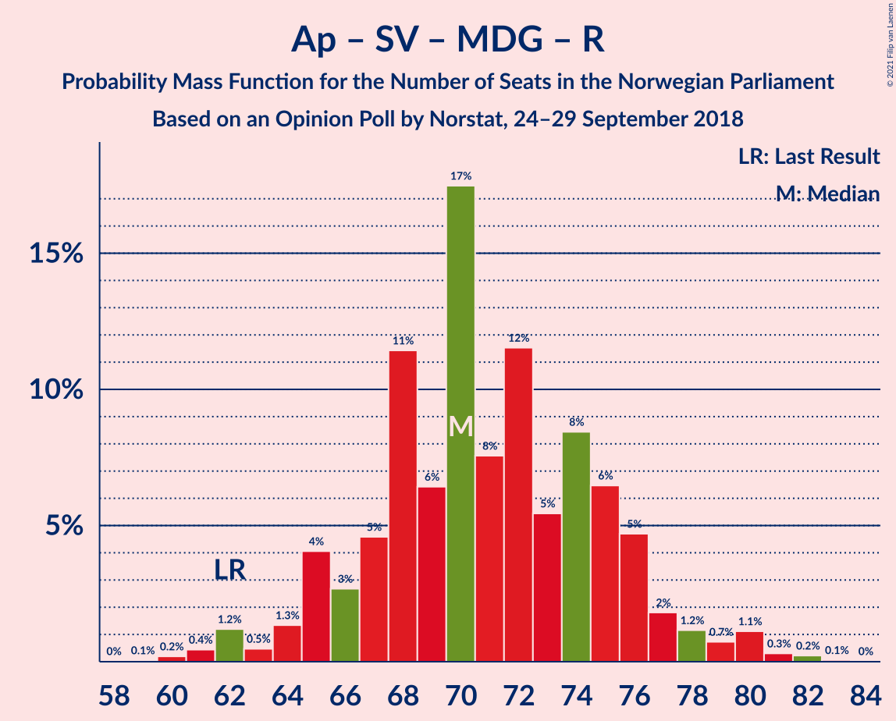

| Number of Seats | Probability | Accumulated | Special Marks |
|:---------------:|:-----------:|:-----------:|:-------------:|
| 59 | 0.1% | 100% |  |
| 60 | 0.2% | 99.9% |  |
| 61 | 0.4% | 99.7% |  |
| 62 | 1.2% | 99.3% | Last Result |
| 63 | 0.5% | 98% |  |
| 64 | 1.3% | 98% |  |
| 65 | 4% | 96% |  |
| 66 | 3% | 92% |  |
| 67 | 5% | 90% |  |
| 68 | 11% | 85% |  |
| 69 | 6% | 74% |  |
| 70 | 17% | 67% |  |
| 71 | 8% | 50% |  |
| 72 | 12% | 42% | Median |
| 73 | 5% | 31% |  |
| 74 | 8% | 25% |  |
| 75 | 6% | 17% |  |
| 76 | 5% | 10% |  |
| 77 | 2% | 5% |  |
| 78 | 1.2% | 4% |  |
| 79 | 0.7% | 2% |  |
| 80 | 1.1% | 2% |  |
| 81 | 0.3% | 0.6% |  |
| 82 | 0.2% | 0.3% |  |
| 83 | 0.1% | 0.1% |  |
| 84 | 0% | 0% |  |

### Høyre – Fremskrittspartiet

| Number of Seats | Probability | Accumulated | Special Marks |
|:---------------:|:-----------:|:-----------:|:-------------:|
| 59 | 0% | 100% |  |
| 60 | 0.1% | 99.9% |  |
| 61 | 0.4% | 99.8% |  |
| 62 | 1.3% | 99.4% |  |
| 63 | 1.1% | 98% |  |
| 64 | 2% | 97% |  |
| 65 | 3% | 95% |  |
| 66 | 4% | 92% |  |
| 67 | 8% | 89% |  |
| 68 | 5% | 80% |  |
| 69 | 18% | 75% |  |
| 70 | 11% | 57% | Median |
| 71 | 13% | 46% |  |
| 72 | 11% | 33% | Last Result |
| 73 | 9% | 22% |  |
| 74 | 6% | 13% |  |
| 75 | 3% | 7% |  |
| 76 | 2% | 4% |  |
| 77 | 0.5% | 2% |  |
| 78 | 0.6% | 2% |  |
| 79 | 0.5% | 1.1% |  |
| 80 | 0.5% | 0.6% |  |
| 81 | 0% | 0.1% |  |
| 82 | 0% | 0% |  |

### Arbeiderpartiet – Senterpartiet

| Number of Seats | Probability | Accumulated | Special Marks |
|:---------------:|:-----------:|:-----------:|:-------------:|
| 59 | 0.1% | 100% |  |
| 60 | 0.2% | 99.9% |  |
| 61 | 0.5% | 99.8% |  |
| 62 | 2% | 99.2% |  |
| 63 | 2% | 97% |  |
| 64 | 5% | 95% |  |
| 65 | 5% | 90% |  |
| 66 | 4% | 85% |  |
| 67 | 13% | 82% |  |
| 68 | 15% | 69% | Last Result |
| 69 | 9% | 54% |  |
| 70 | 5% | 45% | Median |
| 71 | 12% | 40% |  |
| 72 | 5% | 28% |  |
| 73 | 9% | 23% |  |
| 74 | 4% | 13% |  |
| 75 | 6% | 9% |  |
| 76 | 0.8% | 3% |  |
| 77 | 0.7% | 2% |  |
| 78 | 0.4% | 2% |  |
| 79 | 1.1% | 1.3% |  |
| 80 | 0.1% | 0.2% |  |
| 81 | 0% | 0.1% |  |
| 82 | 0% | 0% |  |

### Arbeiderpartiet – Sosialistisk Venstreparti

| Number of Seats | Probability | Accumulated | Special Marks |
|:---------------:|:-----------:|:-----------:|:-------------:|
| 52 | 0.1% | 100% |  |
| 53 | 0.2% | 99.9% |  |
| 54 | 0.4% | 99.7% |  |
| 55 | 2% | 99.3% |  |
| 56 | 3% | 97% |  |
| 57 | 2% | 94% |  |
| 58 | 11% | 92% |  |
| 59 | 6% | 81% |  |
| 60 | 13% | 75% | Last Result |
| 61 | 9% | 62% |  |
| 62 | 12% | 53% | Median |
| 63 | 9% | 41% |  |
| 64 | 8% | 31% |  |
| 65 | 7% | 24% |  |
| 66 | 8% | 16% |  |
| 67 | 3% | 9% |  |
| 68 | 2% | 6% |  |
| 69 | 1.5% | 3% |  |
| 70 | 0.7% | 2% |  |
| 71 | 0.5% | 0.9% |  |
| 72 | 0.2% | 0.3% |  |
| 73 | 0.1% | 0.1% |  |
| 74 | 0% | 0% |  |

### Høyre – Kristelig Folkeparti – Venstre

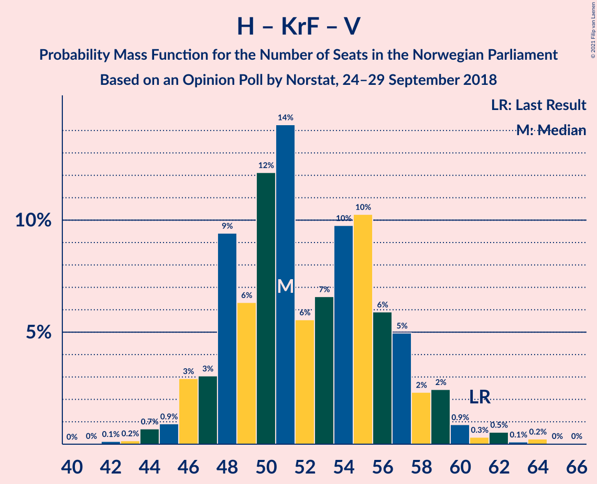

| Number of Seats | Probability | Accumulated | Special Marks |
|:---------------:|:-----------:|:-----------:|:-------------:|
| 42 | 0.1% | 100% |  |
| 43 | 0.2% | 99.8% |  |
| 44 | 0.7% | 99.7% |  |
| 45 | 0.9% | 99.0% |  |
| 46 | 3% | 98% |  |
| 47 | 3% | 95% |  |
| 48 | 9% | 92% |  |
| 49 | 6% | 83% |  |
| 50 | 12% | 76% | Median |
| 51 | 14% | 64% |  |
| 52 | 6% | 50% |  |
| 53 | 7% | 44% |  |
| 54 | 10% | 38% |  |
| 55 | 10% | 28% |  |
| 56 | 6% | 18% |  |
| 57 | 5% | 12% |  |
| 58 | 2% | 7% |  |
| 59 | 2% | 5% |  |
| 60 | 0.9% | 2% |  |
| 61 | 0.3% | 1.3% | Last Result |
| 62 | 0.5% | 1.0% |  |
| 63 | 0.1% | 0.4% |  |
| 64 | 0.2% | 0.3% |  |
| 65 | 0% | 0.1% |  |
| 66 | 0% | 0% |  |

### Senterpartiet – Kristelig Folkeparti – Venstre

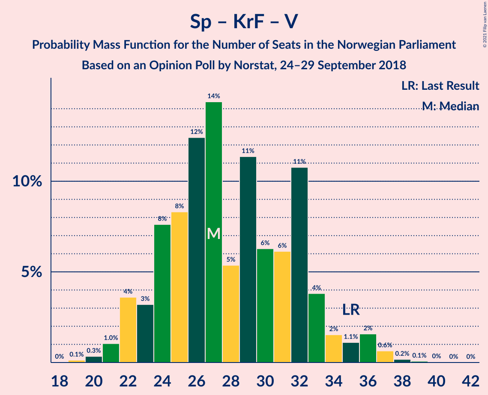

| Number of Seats | Probability | Accumulated | Special Marks |
|:---------------:|:-----------:|:-----------:|:-------------:|
| 19 | 0.1% | 100% |  |
| 20 | 0.3% | 99.8% |  |
| 21 | 1.0% | 99.5% |  |
| 22 | 4% | 98% |  |
| 23 | 3% | 95% |  |
| 24 | 8% | 92% |  |
| 25 | 8% | 84% |  |
| 26 | 12% | 76% | Median |
| 27 | 14% | 63% |  |
| 28 | 5% | 49% |  |
| 29 | 11% | 44% |  |
| 30 | 6% | 32% |  |
| 31 | 6% | 26% |  |
| 32 | 11% | 20% |  |
| 33 | 4% | 9% |  |
| 34 | 2% | 5% |  |
| 35 | 1.1% | 4% | Last Result |
| 36 | 2% | 3% |  |
| 37 | 0.6% | 1.0% |  |
| 38 | 0.2% | 0.3% |  |
| 39 | 0.1% | 0.1% |  |
| 40 | 0% | 0.1% |  |
| 41 | 0% | 0% |  |

## Technical Information

### Opinion Poll

+ **Polling firm:** Norstat
+ **Commissioner(s):** —
+ **Fieldwork period:** 24–29 September 2018

### Calculations

+ **Sample size:** 924
+ **Simulations done:** 1,048,576
+ **Error estimate:** 2.13%

