# Opinion Poll by Norfakta, 2–3 October 2018

<a href="#voting-intentions">Voting Intentions</a> | <a href="#seats">Seats</a> | <a href="#coalitions">Coalitions</a> | <a href="#technical-information">Technical Information</a>

## Voting Intentions

### Confidence Intervals

| Party | Last Result | Poll Result | 80% Confidence Interval | 90% Confidence Interval | 95% Confidence Interval | 99% Confidence Interval |
|:-----:|:-----------:|:-----------:|:-----------------------:|:-----------------------:|:-----------------------:|:-----------------------:|
| Arbeiderpartiet | 27.4% | 28.2% | 26.4–30.1% |25.9–30.6% |25.5–31.0% |24.6–32.0% |
| Høyre | 25.0% | 26.0% | 24.2–27.8% |23.8–28.3% |23.4–28.8% |22.5–29.7% |
| Fremskrittspartiet | 15.2% | 13.3% | 12.0–14.8% |11.6–15.2% |11.3–15.5% |10.7–16.3% |
| Senterpartiet | 10.3% | 11.2% | 10.0–12.6% |9.7–13.0% |9.4–13.3% |8.8–14.0% |
| Sosialistisk Venstreparti | 6.0% | 6.6% | 5.7–7.7% |5.4–8.0% |5.2–8.3% |4.8–8.9% |
| Kristelig Folkeparti | 4.2% | 4.1% | 3.4–5.0% |3.2–5.3% |3.0–5.5% |2.7–6.0% |
| Rødt | 2.4% | 4.0% | 3.3–4.9% |3.1–5.2% |2.9–5.4% |2.6–5.9% |
| Venstre | 4.4% | 2.4% | 1.9–3.2% |1.7–3.4% |1.6–3.6% |1.4–3.9% |
| Miljøpartiet De Grønne | 3.2% | 2.2% | 1.7–2.9% |1.6–3.1% |1.4–3.3% |1.2–3.7% |

*Note:* The poll result column reflects the actual value used in the calculations. Published results may vary slightly, and in addition be rounded to fewer digits.

## Seats

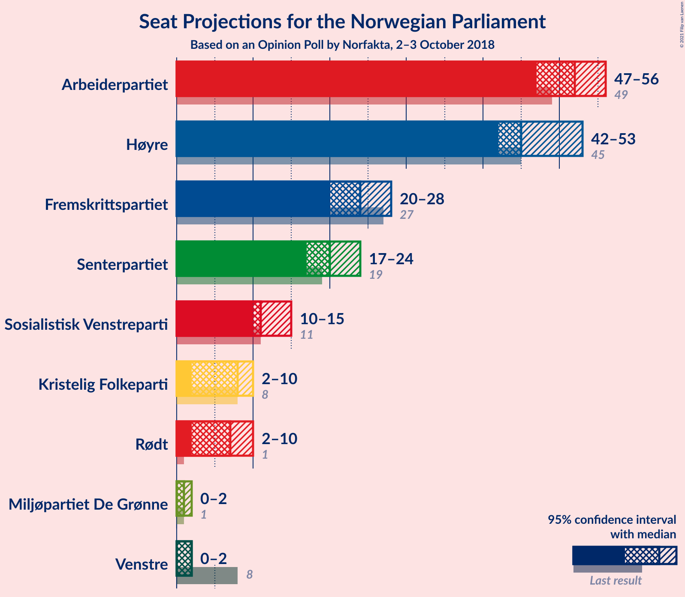

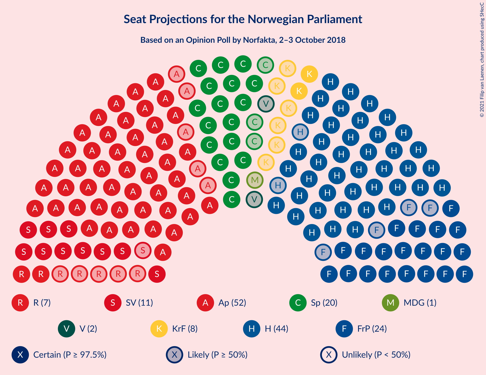

### Confidence Intervals

| Party | Last Result | Median | 80% Confidence Interval | 90% Confidence Interval | 95% Confidence Interval | 99% Confidence Interval |
|:-----:|:-----------:|:------:|:-----------------------:|:-----------------------:|:-----------------------:|:-----------------------:|
| <a href="#arbeiderpartiet">Arbeiderpartiet</a> | 49 | 52 | 48–54 |48–55 |47–56 |44–59 |
| <a href="#høyre">Høyre</a> | 45 | 45 | 44–50 |43–52 |42–53 |41–54 |
| <a href="#fremskrittspartiet">Fremskrittspartiet</a> | 27 | 24 | 22–27 |21–27 |20–28 |19–29 |
| <a href="#senterpartiet">Senterpartiet</a> | 19 | 20 | 19–22 |18–22 |17–24 |16–25 |
| <a href="#sosialistisk-venstreparti">Sosialistisk Venstreparti</a> | 11 | 11 | 11–14 |10–15 |10–15 |9–16 |
| <a href="#kristelig-folkeparti">Kristelig Folkeparti</a> | 8 | 8 | 3–8 |3–9 |2–10 |1–10 |
| <a href="#rødt">Rødt</a> | 1 | 7 | 2–9 |2–9 |2–10 |1–10 |
| <a href="#venstre">Venstre</a> | 8 | 2 | 1–2 |0–2 |0–2 |0–2 |
| <a href="#miljøpartiet-de-grønne">Miljøpartiet De Grønne</a> | 1 | 1 | 0–1 |0–2 |0–2 |0–2 |

### Arbeiderpartiet

*For a full overview of the results for this party, see the [Arbeiderpartiet](party-arbeiderpartiet.html) page.*

| Number of Seats | Probability | Accumulated | Special Marks |
|:---------------:|:-----------:|:-----------:|:-------------:|
| 43 | 0.1% | 100% |  |
| 44 | 0.7% | 99.9% |  |
| 45 | 0.6% | 99.2% |  |
| 46 | 0.8% | 98.6% |  |
| 47 | 2% | 98% |  |
| 48 | 8% | 96% |  |
| 49 | 2% | 87% | Last Result |
| 50 | 9% | 86% |  |
| 51 | 7% | 77% |  |
| 52 | 47% | 70% | Median |
| 53 | 6% | 23% |  |
| 54 | 7% | 17% |  |
| 55 | 6% | 10% |  |
| 56 | 2% | 4% |  |
| 57 | 1.3% | 2% |  |
| 58 | 0.3% | 0.9% |  |
| 59 | 0.4% | 0.6% |  |
| 60 | 0.1% | 0.2% |  |
| 61 | 0% | 0.1% |  |
| 62 | 0% | 0% |  |

### Høyre

*For a full overview of the results for this party, see the [Høyre](party-høyre.html) page.*

| Number of Seats | Probability | Accumulated | Special Marks |
|:---------------:|:-----------:|:-----------:|:-------------:|
| 40 | 0.1% | 100% |  |
| 41 | 2% | 99.9% |  |
| 42 | 2% | 98% |  |
| 43 | 2% | 96% |  |
| 44 | 42% | 94% |  |
| 45 | 12% | 52% | Last Result, Median |
| 46 | 5% | 41% |  |
| 47 | 6% | 36% |  |
| 48 | 9% | 30% |  |
| 49 | 7% | 21% |  |
| 50 | 5% | 14% |  |
| 51 | 3% | 10% |  |
| 52 | 2% | 6% |  |
| 53 | 4% | 5% |  |
| 54 | 0.5% | 0.7% |  |
| 55 | 0.2% | 0.3% |  |
| 56 | 0.1% | 0.1% |  |
| 57 | 0.1% | 0.1% |  |
| 58 | 0% | 0% |  |

### Fremskrittspartiet

*For a full overview of the results for this party, see the [Fremskrittspartiet](party-fremskrittspartiet.html) page.*

| Number of Seats | Probability | Accumulated | Special Marks |
|:---------------:|:-----------:|:-----------:|:-------------:|
| 18 | 0.1% | 100% |  |
| 19 | 0.5% | 99.8% |  |
| 20 | 3% | 99.4% |  |
| 21 | 4% | 96% |  |
| 22 | 10% | 92% |  |
| 23 | 10% | 82% |  |
| 24 | 45% | 72% | Median |
| 25 | 9% | 27% |  |
| 26 | 5% | 18% |  |
| 27 | 9% | 12% | Last Result |
| 28 | 2% | 3% |  |
| 29 | 2% | 2% |  |
| 30 | 0.1% | 0.3% |  |
| 31 | 0.1% | 0.2% |  |
| 32 | 0% | 0% |  |

### Senterpartiet

*For a full overview of the results for this party, see the [Senterpartiet](party-senterpartiet.html) page.*

| Number of Seats | Probability | Accumulated | Special Marks |
|:---------------:|:-----------:|:-----------:|:-------------:|
| 15 | 0.1% | 100% |  |
| 16 | 0.7% | 99.9% |  |
| 17 | 3% | 99.2% |  |
| 18 | 6% | 96% |  |
| 19 | 8% | 90% | Last Result |
| 20 | 52% | 82% | Median |
| 21 | 14% | 29% |  |
| 22 | 10% | 15% |  |
| 23 | 2% | 5% |  |
| 24 | 2% | 3% |  |
| 25 | 0.6% | 1.0% |  |
| 26 | 0.3% | 0.4% |  |
| 27 | 0.1% | 0.1% |  |
| 28 | 0% | 0% |  |

### Sosialistisk Venstreparti

*For a full overview of the results for this party, see the [Sosialistisk Venstreparti](party-sosialistiskvenstreparti.html) page.*

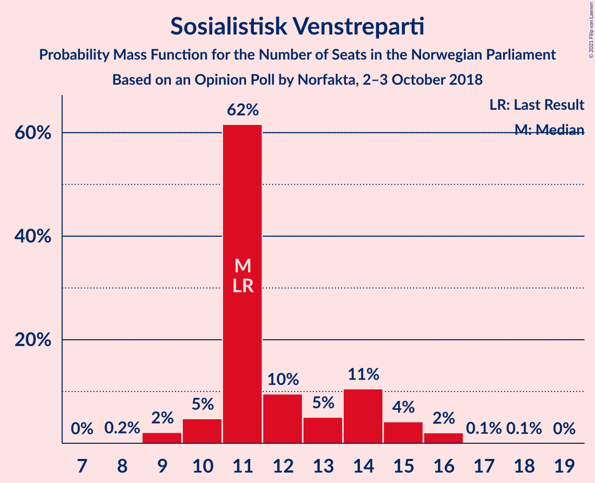

| Number of Seats | Probability | Accumulated | Special Marks |
|:---------------:|:-----------:|:-----------:|:-------------:|
| 8 | 0.2% | 100% |  |
| 9 | 2% | 99.8% |  |
| 10 | 5% | 98% |  |
| 11 | 62% | 93% | Last Result, Median |
| 12 | 10% | 31% |  |
| 13 | 5% | 22% |  |
| 14 | 11% | 17% |  |
| 15 | 4% | 6% |  |
| 16 | 2% | 2% |  |
| 17 | 0.1% | 0.1% |  |
| 18 | 0.1% | 0.1% |  |
| 19 | 0% | 0% |  |

### Kristelig Folkeparti

*For a full overview of the results for this party, see the [Kristelig Folkeparti](party-kristeligfolkeparti.html) page.*

| Number of Seats | Probability | Accumulated | Special Marks |
|:---------------:|:-----------:|:-----------:|:-------------:|
| 1 | 2% | 100% |  |
| 2 | 3% | 98% |  |
| 3 | 22% | 96% |  |
| 4 | 0% | 74% |  |
| 5 | 0% | 74% |  |
| 6 | 0% | 74% |  |
| 7 | 12% | 74% |  |
| 8 | 53% | 62% | Last Result, Median |
| 9 | 6% | 9% |  |
| 10 | 3% | 3% |  |
| 11 | 0.3% | 0.4% |  |
| 12 | 0.1% | 0.1% |  |
| 13 | 0% | 0% |  |

### Rødt

*For a full overview of the results for this party, see the [Rødt](party-rødt.html) page.*

| Number of Seats | Probability | Accumulated | Special Marks |
|:---------------:|:-----------:|:-----------:|:-------------:|
| 1 | 1.3% | 100% | Last Result |
| 2 | 27% | 98.7% |  |
| 3 | 0% | 72% |  |
| 4 | 0% | 72% |  |
| 5 | 0% | 72% |  |
| 6 | 0% | 72% |  |
| 7 | 45% | 72% | Median |
| 8 | 14% | 27% |  |
| 9 | 10% | 13% |  |
| 10 | 2% | 3% |  |
| 11 | 0.2% | 0.2% |  |
| 12 | 0% | 0.1% |  |
| 13 | 0% | 0% |  |

### Venstre

*For a full overview of the results for this party, see the [Venstre](party-venstre.html) page.*

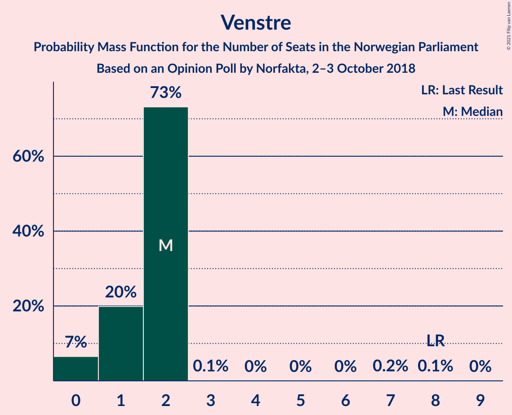

| Number of Seats | Probability | Accumulated | Special Marks |
|:---------------:|:-----------:|:-----------:|:-------------:|
| 0 | 7% | 100% |  |
| 1 | 20% | 93% |  |
| 2 | 73% | 74% | Median |
| 3 | 0.1% | 0.4% |  |
| 4 | 0% | 0.3% |  |
| 5 | 0% | 0.3% |  |
| 6 | 0% | 0.3% |  |
| 7 | 0.2% | 0.3% |  |
| 8 | 0.1% | 0.1% | Last Result |
| 9 | 0% | 0% |  |

### Miljøpartiet De Grønne

*For a full overview of the results for this party, see the [Miljøpartiet De Grønne](party-miljøpartietdegrønne.html) page.*

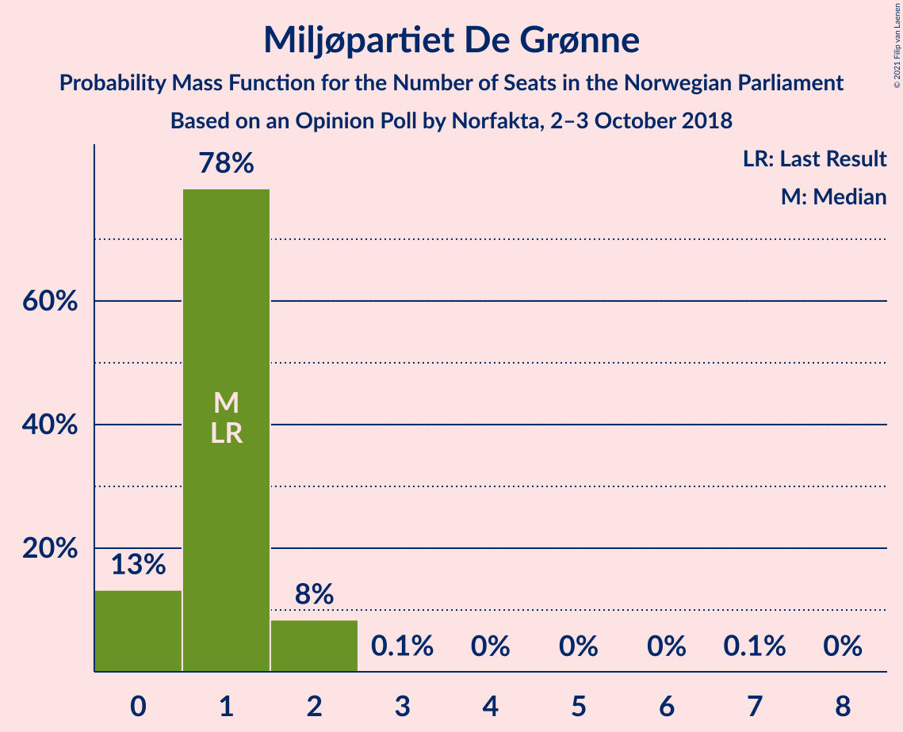

| Number of Seats | Probability | Accumulated | Special Marks |
|:---------------:|:-----------:|:-----------:|:-------------:|
| 0 | 13% | 100% |  |
| 1 | 78% | 87% | Last Result, Median |
| 2 | 8% | 9% |  |
| 3 | 0.1% | 0.1% |  |
| 4 | 0% | 0.1% |  |
| 5 | 0% | 0.1% |  |
| 6 | 0% | 0.1% |  |
| 7 | 0.1% | 0.1% |  |
| 8 | 0% | 0% |  |

## Coalitions

### Confidence Intervals

| Coalition | Last Result | Median | Majority? | 80% Confidence Interval | 90% Confidence Interval | 95% Confidence Interval | 99% Confidence Interval |
|:---------:|:-----------:|:------:|:---------:|:-----------------------:|:-----------------------:|:-----------------------:|:-----------------------:|
| Høyre – Fremskrittspartiet – Senterpartiet – Kristelig Folkeparti – Venstre | 107 | 98 | 100% | 95–102 | 94–104 | 93–106 | 91–107 |
| Arbeiderpartiet – Senterpartiet – Sosialistisk Venstreparti – Kristelig Folkeparti – Miljøpartiet De Grønne | 88 | 92 | 98% | 87–94 | 85–96 | 85–97 | 83–99 |
| Arbeiderpartiet – Senterpartiet – Sosialistisk Venstreparti – Rødt – Miljøpartiet De Grønne | 81 | 91 | 96% | 87–95 | 85–95 | 84–97 | 82–99 |
| Arbeiderpartiet – Senterpartiet – Sosialistisk Venstreparti – Rødt | 80 | 90 | 92% | 86–94 | 84–94 | 83–96 | 81–98 |
| Arbeiderpartiet – Senterpartiet – Sosialistisk Venstreparti – Miljøpartiet De Grønne | 80 | 84 | 39% | 81–88 | 79–90 | 78–90 | 76–93 |
| Arbeiderpartiet – Senterpartiet – Sosialistisk Venstreparti | 79 | 83 | 33% | 81–87 | 78–88 | 78–89 | 76–92 |
| Høyre – Fremskrittspartiet – Kristelig Folkeparti – Venstre – Miljøpartiet De Grønne | 89 | 79 | 8% | 75–83 | 75–85 | 73–86 | 71–88 |
| Arbeiderpartiet – Senterpartiet – Kristelig Folkeparti – Miljøpartiet De Grønne | 77 | 81 | 4% | 74–83 | 74–84 | 73–85 | 70–87 |
| Arbeiderpartiet – Senterpartiet – Kristelig Folkeparti | 76 | 80 | 3% | 73–81 | 73–83 | 73–85 | 69–86 |
| Høyre – Fremskrittspartiet – Kristelig Folkeparti – Venstre | 88 | 78 | 4% | 74–82 | 74–84 | 72–85 | 70–87 |
| Høyre – Fremskrittspartiet – Venstre | 80 | 70 | 0% | 69–76 | 67–79 | 67–79 | 64–82 |
| Høyre – Fremskrittspartiet | 72 | 69 | 0% | 68–75 | 65–77 | 65–78 | 63–80 |
| Arbeiderpartiet – Senterpartiet | 68 | 72 | 0% | 68–75 | 66–76 | 66–77 | 65–80 |
| Arbeiderpartiet – Sosialistisk Venstreparti – Rødt – Miljøpartiet De Grønne | 62 | 71 | 0% | 67–74 | 65–75 | 63–76 | 62–78 |
| Arbeiderpartiet – Sosialistisk Venstreparti | 60 | 63 | 0% | 61–66 | 59–68 | 58–69 | 55–70 |
| Høyre – Kristelig Folkeparti – Venstre | 61 | 54 | 0% | 52–58 | 50–59 | 49–61 | 46–63 |
| Senterpartiet – Kristelig Folkeparti – Venstre | 35 | 30 | 0% | 24–30 | 24–32 | 23–33 | 21–35 |

### Høyre – Fremskrittspartiet – Senterpartiet – Kristelig Folkeparti – Venstre

| Number of Seats | Probability | Accumulated | Special Marks |
|:---------------:|:-----------:|:-----------:|:-------------:|
| 89 | 0.1% | 100% |  |
| 90 | 0.1% | 99.9% |  |
| 91 | 0.5% | 99.8% |  |
| 92 | 2% | 99.3% |  |
| 93 | 1.0% | 98% |  |
| 94 | 2% | 97% |  |
| 95 | 12% | 95% |  |
| 96 | 3% | 83% |  |
| 97 | 5% | 80% |  |
| 98 | 40% | 75% |  |
| 99 | 6% | 35% | Median |
| 100 | 4% | 29% |  |
| 101 | 6% | 25% |  |
| 102 | 10% | 19% |  |
| 103 | 1.3% | 10% |  |
| 104 | 4% | 8% |  |
| 105 | 0.9% | 4% |  |
| 106 | 2% | 3% |  |
| 107 | 1.1% | 2% | Last Result |
| 108 | 0.2% | 0.4% |  |
| 109 | 0.1% | 0.2% |  |
| 110 | 0% | 0.1% |  |
| 111 | 0.1% | 0.1% |  |
| 112 | 0% | 0% |  |

### Arbeiderpartiet – Senterpartiet – Sosialistisk Venstreparti – Kristelig Folkeparti – Miljøpartiet De Grønne

| Number of Seats | Probability | Accumulated | Special Marks |
|:---------------:|:-----------:|:-----------:|:-------------:|
| 80 | 0.2% | 100% |  |
| 81 | 0.2% | 99.8% |  |
| 82 | 0.1% | 99.6% |  |
| 83 | 0.4% | 99.5% |  |
| 84 | 0.9% | 99.1% |  |
| 85 | 4% | 98% | Majority |
| 86 | 4% | 95% |  |
| 87 | 2% | 91% |  |
| 88 | 9% | 88% | Last Result |
| 89 | 6% | 79% |  |
| 90 | 5% | 73% |  |
| 91 | 3% | 68% |  |
| 92 | 42% | 65% | Median |
| 93 | 6% | 24% |  |
| 94 | 9% | 18% |  |
| 95 | 3% | 9% |  |
| 96 | 2% | 6% |  |
| 97 | 2% | 4% |  |
| 98 | 2% | 2% |  |
| 99 | 0.4% | 0.7% |  |
| 100 | 0.1% | 0.3% |  |
| 101 | 0.2% | 0.2% |  |
| 102 | 0% | 0% |  |

### Arbeiderpartiet – Senterpartiet – Sosialistisk Venstreparti – Rødt – Miljøpartiet De Grønne

| Number of Seats | Probability | Accumulated | Special Marks |
|:---------------:|:-----------:|:-----------:|:-------------:|
| 79 | 0% | 100% |  |
| 80 | 0.1% | 99.9% |  |
| 81 | 0.3% | 99.9% | Last Result |
| 82 | 0.1% | 99.5% |  |
| 83 | 2% | 99.5% |  |
| 84 | 2% | 98% |  |
| 85 | 4% | 96% | Majority |
| 86 | 0.8% | 92% |  |
| 87 | 9% | 92% |  |
| 88 | 4% | 83% |  |
| 89 | 7% | 79% |  |
| 90 | 5% | 72% |  |
| 91 | 43% | 66% | Median |
| 92 | 2% | 23% |  |
| 93 | 6% | 21% |  |
| 94 | 3% | 15% |  |
| 95 | 8% | 12% |  |
| 96 | 0.9% | 4% |  |
| 97 | 2% | 3% |  |
| 98 | 0.3% | 1.0% |  |
| 99 | 0.2% | 0.7% |  |
| 100 | 0.4% | 0.5% |  |
| 101 | 0% | 0% |  |

### Arbeiderpartiet – Senterpartiet – Sosialistisk Venstreparti – Rødt

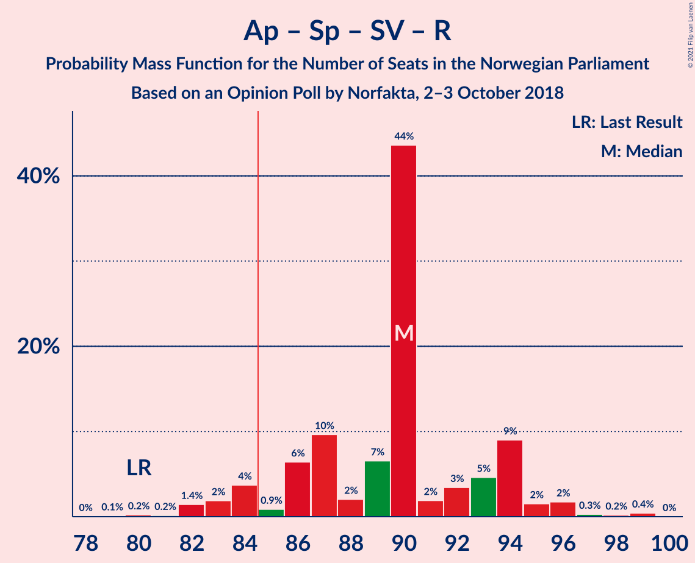

| Number of Seats | Probability | Accumulated | Special Marks |
|:---------------:|:-----------:|:-----------:|:-------------:|
| 78 | 0% | 100% |  |
| 79 | 0.1% | 99.9% |  |
| 80 | 0.2% | 99.8% | Last Result |
| 81 | 0.2% | 99.6% |  |
| 82 | 1.4% | 99.5% |  |
| 83 | 2% | 98% |  |
| 84 | 4% | 96% |  |
| 85 | 0.9% | 92% | Majority |
| 86 | 6% | 92% |  |
| 87 | 10% | 85% |  |
| 88 | 2% | 75% |  |
| 89 | 7% | 73% |  |
| 90 | 44% | 67% | Median |
| 91 | 2% | 23% |  |
| 92 | 3% | 21% |  |
| 93 | 5% | 18% |  |
| 94 | 9% | 13% |  |
| 95 | 2% | 4% |  |
| 96 | 2% | 3% |  |
| 97 | 0.3% | 1.0% |  |
| 98 | 0.2% | 0.7% |  |
| 99 | 0.4% | 0.5% |  |
| 100 | 0% | 0% |  |

### Arbeiderpartiet – Senterpartiet – Sosialistisk Venstreparti – Miljøpartiet De Grønne

| Number of Seats | Probability | Accumulated | Special Marks |
|:---------------:|:-----------:|:-----------:|:-------------:|
| 75 | 0.1% | 100% |  |
| 76 | 0.5% | 99.8% |  |
| 77 | 0.4% | 99.3% |  |
| 78 | 2% | 98.9% |  |
| 79 | 2% | 97% |  |
| 80 | 1.0% | 94% | Last Result |
| 81 | 3% | 93% |  |
| 82 | 5% | 90% |  |
| 83 | 4% | 85% |  |
| 84 | 42% | 81% | Median |
| 85 | 11% | 39% | Majority |
| 86 | 9% | 29% |  |
| 87 | 9% | 20% |  |
| 88 | 3% | 11% |  |
| 89 | 3% | 8% |  |
| 90 | 3% | 5% |  |
| 91 | 0.4% | 2% |  |
| 92 | 0.4% | 1.4% |  |
| 93 | 0.8% | 1.0% |  |
| 94 | 0.1% | 0.3% |  |
| 95 | 0.1% | 0.2% |  |
| 96 | 0.1% | 0.1% |  |
| 97 | 0% | 0% |  |

### Arbeiderpartiet – Senterpartiet – Sosialistisk Venstreparti

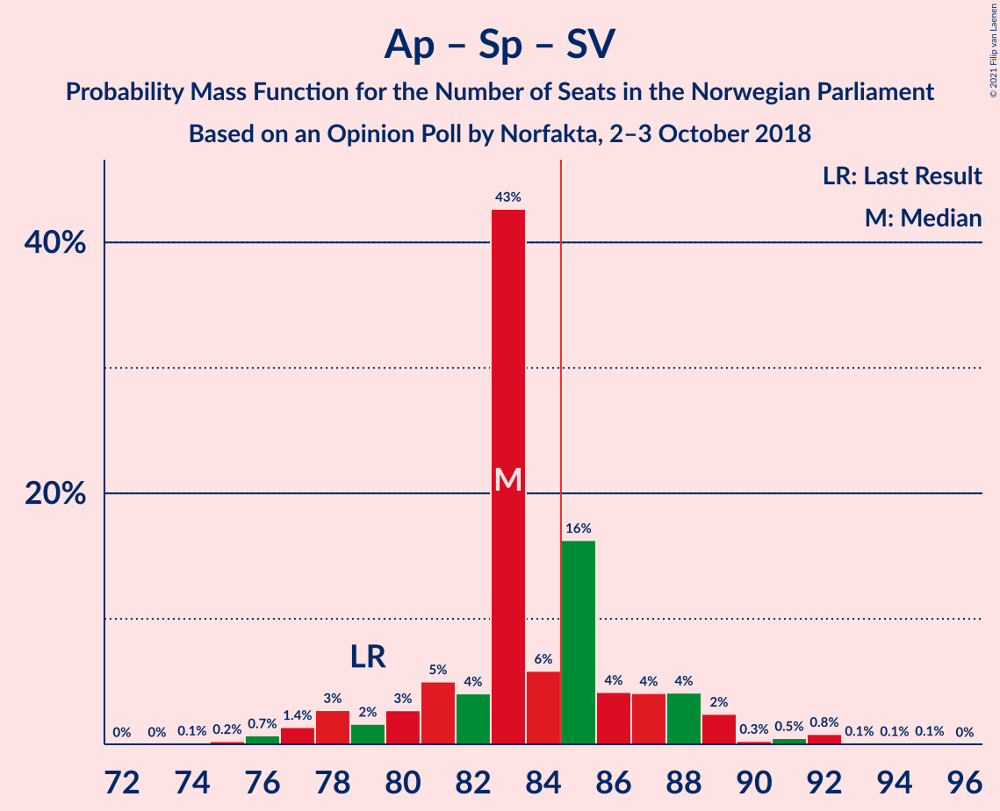

| Number of Seats | Probability | Accumulated | Special Marks |
|:---------------:|:-----------:|:-----------:|:-------------:|
| 74 | 0.1% | 100% |  |
| 75 | 0.2% | 99.8% |  |
| 76 | 0.7% | 99.6% |  |
| 77 | 1.4% | 98.9% |  |
| 78 | 3% | 98% |  |
| 79 | 2% | 95% | Last Result |
| 80 | 3% | 93% |  |
| 81 | 5% | 90% |  |
| 82 | 4% | 85% |  |
| 83 | 43% | 81% | Median |
| 84 | 6% | 39% |  |
| 85 | 16% | 33% | Majority |
| 86 | 4% | 17% |  |
| 87 | 4% | 12% |  |
| 88 | 4% | 8% |  |
| 89 | 2% | 4% |  |
| 90 | 0.3% | 2% |  |
| 91 | 0.5% | 2% |  |
| 92 | 0.8% | 1.1% |  |
| 93 | 0.1% | 0.3% |  |
| 94 | 0.1% | 0.2% |  |
| 95 | 0.1% | 0.1% |  |
| 96 | 0% | 0% |  |

### Høyre – Fremskrittspartiet – Kristelig Folkeparti – Venstre – Miljøpartiet De Grønne

| Number of Seats | Probability | Accumulated | Special Marks |
|:---------------:|:-----------:|:-----------:|:-------------:|
| 70 | 0.4% | 100% |  |
| 71 | 0.2% | 99.5% |  |
| 72 | 0.3% | 99.3% |  |
| 73 | 2% | 99.0% |  |
| 74 | 2% | 97% |  |
| 75 | 9% | 96% |  |
| 76 | 5% | 87% |  |
| 77 | 3% | 82% |  |
| 78 | 2% | 79% |  |
| 79 | 44% | 77% |  |
| 80 | 7% | 33% | Median |
| 81 | 2% | 27% |  |
| 82 | 10% | 25% |  |
| 83 | 6% | 15% |  |
| 84 | 0.9% | 8% |  |
| 85 | 4% | 8% | Majority |
| 86 | 2% | 4% |  |
| 87 | 1.4% | 2% |  |
| 88 | 0.2% | 0.5% |  |
| 89 | 0.2% | 0.4% | Last Result |
| 90 | 0.1% | 0.2% |  |
| 91 | 0% | 0.1% |  |
| 92 | 0% | 0% |  |

### Arbeiderpartiet – Senterpartiet – Kristelig Folkeparti – Miljøpartiet De Grønne

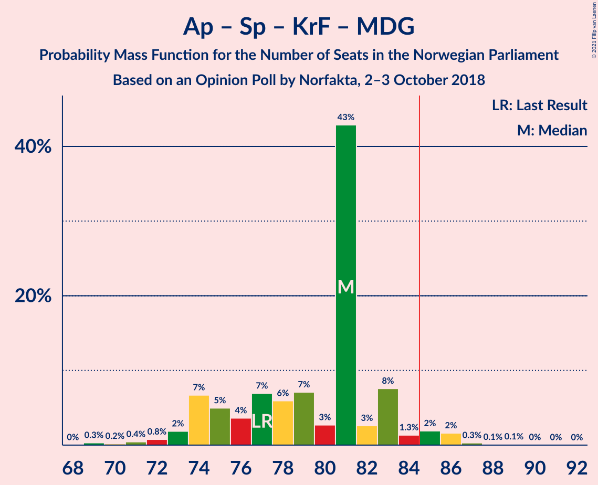

| Number of Seats | Probability | Accumulated | Special Marks |
|:---------------:|:-----------:|:-----------:|:-------------:|
| 68 | 0% | 100% |  |
| 69 | 0.3% | 99.9% |  |
| 70 | 0.2% | 99.6% |  |
| 71 | 0.4% | 99.4% |  |
| 72 | 0.8% | 99.0% |  |
| 73 | 2% | 98% |  |
| 74 | 7% | 96% |  |
| 75 | 5% | 90% |  |
| 76 | 4% | 85% |  |
| 77 | 7% | 81% | Last Result |
| 78 | 6% | 74% |  |
| 79 | 7% | 68% |  |
| 80 | 3% | 61% |  |
| 81 | 43% | 58% | Median |
| 82 | 3% | 16% |  |
| 83 | 8% | 13% |  |
| 84 | 1.3% | 5% |  |
| 85 | 2% | 4% | Majority |
| 86 | 2% | 2% |  |
| 87 | 0.3% | 0.5% |  |
| 88 | 0.1% | 0.2% |  |
| 89 | 0.1% | 0.2% |  |
| 90 | 0% | 0.1% |  |
| 91 | 0% | 0% |  |

### Arbeiderpartiet – Senterpartiet – Kristelig Folkeparti

| Number of Seats | Probability | Accumulated | Special Marks |
|:---------------:|:-----------:|:-----------:|:-------------:|
| 67 | 0% | 100% |  |
| 68 | 0.2% | 99.9% |  |
| 69 | 0.2% | 99.7% |  |
| 70 | 0.5% | 99.5% |  |
| 71 | 0.8% | 99.0% |  |
| 72 | 0.5% | 98% |  |
| 73 | 8% | 98% |  |
| 74 | 4% | 89% |  |
| 75 | 4% | 85% |  |
| 76 | 4% | 81% | Last Result |
| 77 | 9% | 77% |  |
| 78 | 5% | 68% |  |
| 79 | 5% | 63% |  |
| 80 | 42% | 58% | Median |
| 81 | 6% | 16% |  |
| 82 | 4% | 10% |  |
| 83 | 1.4% | 5% |  |
| 84 | 0.9% | 4% |  |
| 85 | 3% | 3% | Majority |
| 86 | 0.4% | 0.6% |  |
| 87 | 0.1% | 0.2% |  |
| 88 | 0.1% | 0.2% |  |
| 89 | 0% | 0.1% |  |
| 90 | 0% | 0% |  |

### Høyre – Fremskrittspartiet – Kristelig Folkeparti – Venstre

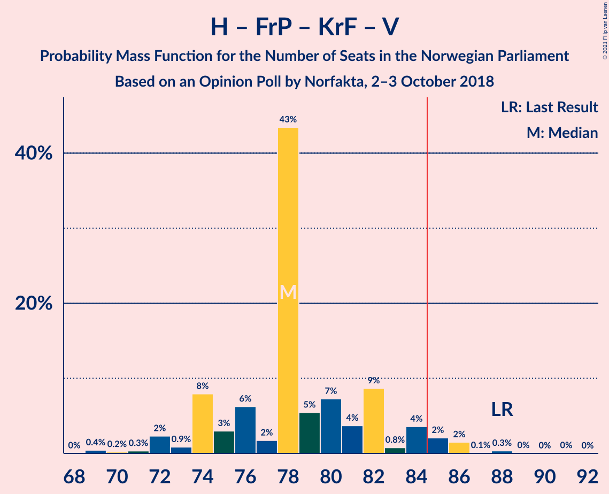

| Number of Seats | Probability | Accumulated | Special Marks |
|:---------------:|:-----------:|:-----------:|:-------------:|
| 69 | 0.4% | 100% |  |
| 70 | 0.2% | 99.5% |  |
| 71 | 0.3% | 99.3% |  |
| 72 | 2% | 99.0% |  |
| 73 | 0.9% | 97% |  |
| 74 | 8% | 96% |  |
| 75 | 3% | 88% |  |
| 76 | 6% | 85% |  |
| 77 | 2% | 79% |  |
| 78 | 43% | 77% |  |
| 79 | 5% | 34% | Median |
| 80 | 7% | 28% |  |
| 81 | 4% | 21% |  |
| 82 | 9% | 17% |  |
| 83 | 0.8% | 8% |  |
| 84 | 4% | 8% |  |
| 85 | 2% | 4% | Majority |
| 86 | 2% | 2% |  |
| 87 | 0.1% | 0.5% |  |
| 88 | 0.3% | 0.5% | Last Result |
| 89 | 0% | 0.1% |  |
| 90 | 0% | 0.1% |  |
| 91 | 0% | 0% |  |

### Høyre – Fremskrittspartiet – Venstre

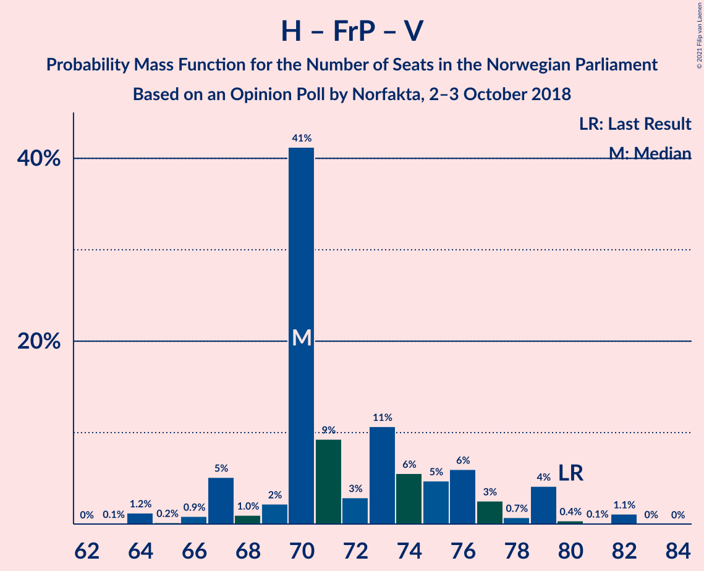

| Number of Seats | Probability | Accumulated | Special Marks |
|:---------------:|:-----------:|:-----------:|:-------------:|
| 63 | 0.1% | 100% |  |
| 64 | 1.2% | 99.9% |  |
| 65 | 0.2% | 98.7% |  |
| 66 | 0.9% | 98.5% |  |
| 67 | 5% | 98% |  |
| 68 | 1.0% | 93% |  |
| 69 | 2% | 92% |  |
| 70 | 41% | 89% |  |
| 71 | 9% | 48% | Median |
| 72 | 3% | 39% |  |
| 73 | 11% | 36% |  |
| 74 | 6% | 25% |  |
| 75 | 5% | 20% |  |
| 76 | 6% | 15% |  |
| 77 | 3% | 9% |  |
| 78 | 0.7% | 7% |  |
| 79 | 4% | 6% |  |
| 80 | 0.4% | 2% | Last Result |
| 81 | 0.1% | 1.3% |  |
| 82 | 1.1% | 1.2% |  |
| 83 | 0% | 0.1% |  |
| 84 | 0% | 0% |  |

### Høyre – Fremskrittspartiet

| Number of Seats | Probability | Accumulated | Special Marks |
|:---------------:|:-----------:|:-----------:|:-------------:|
| 61 | 0.1% | 100% |  |
| 62 | 0.1% | 99.9% |  |
| 63 | 1.2% | 99.9% |  |
| 64 | 0.9% | 98.7% |  |
| 65 | 4% | 98% |  |
| 66 | 2% | 94% |  |
| 67 | 2% | 92% |  |
| 68 | 40% | 90% |  |
| 69 | 6% | 50% | Median |
| 70 | 2% | 44% |  |
| 71 | 11% | 41% |  |
| 72 | 10% | 30% | Last Result |
| 73 | 3% | 20% |  |
| 74 | 7% | 18% |  |
| 75 | 4% | 11% |  |
| 76 | 1.1% | 7% |  |
| 77 | 1.2% | 6% |  |
| 78 | 3% | 5% |  |
| 79 | 0.1% | 1.3% |  |
| 80 | 1.1% | 1.2% |  |
| 81 | 0.1% | 0.2% |  |
| 82 | 0% | 0% |  |

### Arbeiderpartiet – Senterpartiet

| Number of Seats | Probability | Accumulated | Special Marks |
|:---------------:|:-----------:|:-----------:|:-------------:|
| 62 | 0.1% | 100% |  |
| 63 | 0.1% | 99.9% |  |
| 64 | 0.2% | 99.8% |  |
| 65 | 2% | 99.6% |  |
| 66 | 3% | 98% |  |
| 67 | 2% | 95% |  |
| 68 | 4% | 93% | Last Result |
| 69 | 2% | 89% |  |
| 70 | 8% | 87% |  |
| 71 | 7% | 79% |  |
| 72 | 42% | 71% | Median |
| 73 | 4% | 29% |  |
| 74 | 13% | 25% |  |
| 75 | 4% | 12% |  |
| 76 | 3% | 8% |  |
| 77 | 3% | 4% |  |
| 78 | 0.9% | 2% |  |
| 79 | 0.3% | 0.8% |  |
| 80 | 0.1% | 0.5% |  |
| 81 | 0.2% | 0.4% |  |
| 82 | 0.2% | 0.2% |  |
| 83 | 0% | 0% |  |

### Arbeiderpartiet – Sosialistisk Venstreparti – Rødt – Miljøpartiet De Grønne

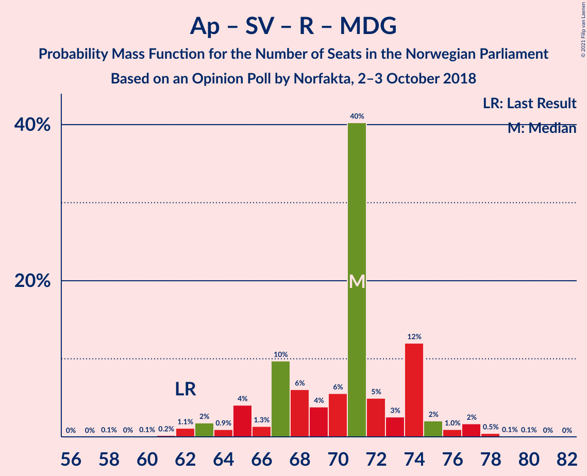

| Number of Seats | Probability | Accumulated | Special Marks |
|:---------------:|:-----------:|:-----------:|:-------------:|
| 58 | 0.1% | 100% |  |
| 59 | 0% | 99.9% |  |
| 60 | 0.1% | 99.9% |  |
| 61 | 0.2% | 99.8% |  |
| 62 | 1.1% | 99.6% | Last Result |
| 63 | 2% | 98% |  |
| 64 | 0.9% | 97% |  |
| 65 | 4% | 96% |  |
| 66 | 1.3% | 92% |  |
| 67 | 10% | 90% |  |
| 68 | 6% | 81% |  |
| 69 | 4% | 75% |  |
| 70 | 6% | 71% |  |
| 71 | 40% | 65% | Median |
| 72 | 5% | 25% |  |
| 73 | 3% | 20% |  |
| 74 | 12% | 17% |  |
| 75 | 2% | 5% |  |
| 76 | 1.0% | 3% |  |
| 77 | 2% | 2% |  |
| 78 | 0.5% | 0.7% |  |
| 79 | 0.1% | 0.2% |  |
| 80 | 0.1% | 0.1% |  |
| 81 | 0% | 0% |  |

### Arbeiderpartiet – Sosialistisk Venstreparti

| Number of Seats | Probability | Accumulated | Special Marks |
|:---------------:|:-----------:|:-----------:|:-------------:|
| 54 | 0.3% | 100% |  |
| 55 | 0.6% | 99.7% |  |
| 56 | 0.5% | 99.1% |  |
| 57 | 0.8% | 98.6% |  |
| 58 | 0.6% | 98% |  |
| 59 | 3% | 97% |  |
| 60 | 4% | 94% | Last Result |
| 61 | 4% | 91% |  |
| 62 | 7% | 87% |  |
| 63 | 45% | 79% | Median |
| 64 | 11% | 34% |  |
| 65 | 7% | 23% |  |
| 66 | 6% | 16% |  |
| 67 | 3% | 10% |  |
| 68 | 2% | 7% |  |
| 69 | 3% | 4% |  |
| 70 | 0.5% | 0.9% |  |
| 71 | 0.1% | 0.4% |  |
| 72 | 0.1% | 0.3% |  |
| 73 | 0.2% | 0.3% |  |
| 74 | 0% | 0.1% |  |
| 75 | 0% | 0% |  |

### Høyre – Kristelig Folkeparti – Venstre

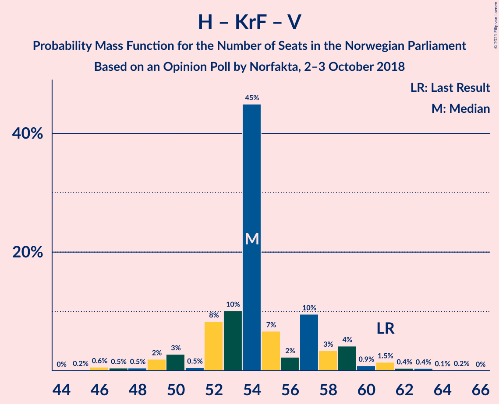

| Number of Seats | Probability | Accumulated | Special Marks |
|:---------------:|:-----------:|:-----------:|:-------------:|
| 45 | 0.2% | 100% |  |
| 46 | 0.6% | 99.8% |  |
| 47 | 0.5% | 99.2% |  |
| 48 | 0.5% | 98.7% |  |
| 49 | 2% | 98% |  |
| 50 | 3% | 96% |  |
| 51 | 0.5% | 93% |  |
| 52 | 8% | 93% |  |
| 53 | 10% | 85% |  |
| 54 | 45% | 74% |  |
| 55 | 7% | 30% | Median |
| 56 | 2% | 23% |  |
| 57 | 10% | 21% |  |
| 58 | 3% | 11% |  |
| 59 | 4% | 8% |  |
| 60 | 0.9% | 3% |  |
| 61 | 1.5% | 3% | Last Result |
| 62 | 0.4% | 1.1% |  |
| 63 | 0.4% | 0.7% |  |
| 64 | 0.1% | 0.3% |  |
| 65 | 0.2% | 0.2% |  |
| 66 | 0% | 0% |  |

### Senterpartiet – Kristelig Folkeparti – Venstre

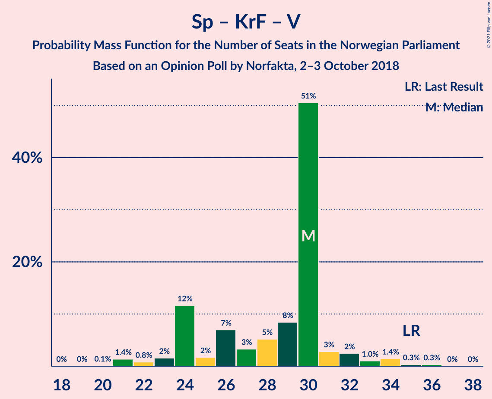

| Number of Seats | Probability | Accumulated | Special Marks |
|:---------------:|:-----------:|:-----------:|:-------------:|
| 19 | 0% | 100% |  |
| 20 | 0.1% | 99.9% |  |
| 21 | 1.4% | 99.9% |  |
| 22 | 0.8% | 98.5% |  |
| 23 | 2% | 98% |  |
| 24 | 12% | 96% |  |
| 25 | 2% | 84% |  |
| 26 | 7% | 83% |  |
| 27 | 3% | 76% |  |
| 28 | 5% | 73% |  |
| 29 | 8% | 67% |  |
| 30 | 51% | 59% | Median |
| 31 | 3% | 8% |  |
| 32 | 2% | 6% |  |
| 33 | 1.0% | 3% |  |
| 34 | 1.4% | 2% |  |
| 35 | 0.3% | 0.7% | Last Result |
| 36 | 0.3% | 0.4% |  |
| 37 | 0% | 0% |  |

## Technical Information

### Opinion Poll

+ **Polling firm:** Norfakta
+ **Commissioner(s):** —
+ **Fieldwork period:** 2–3 October 2018

### Calculations

+ **Sample size:** 1001
+ **Simulations done:** 262,144
+ **Error estimate:** 2.33%

