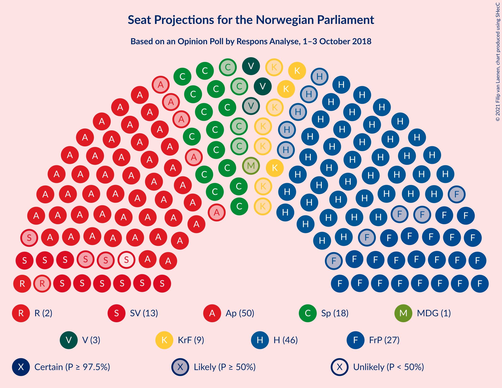
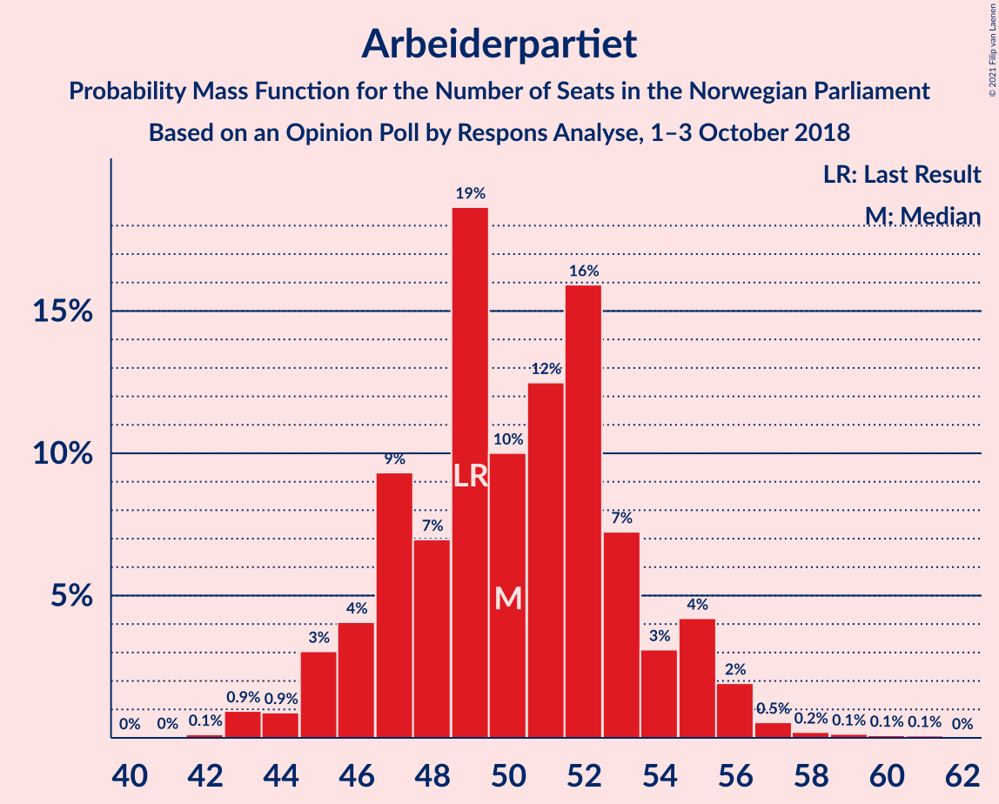
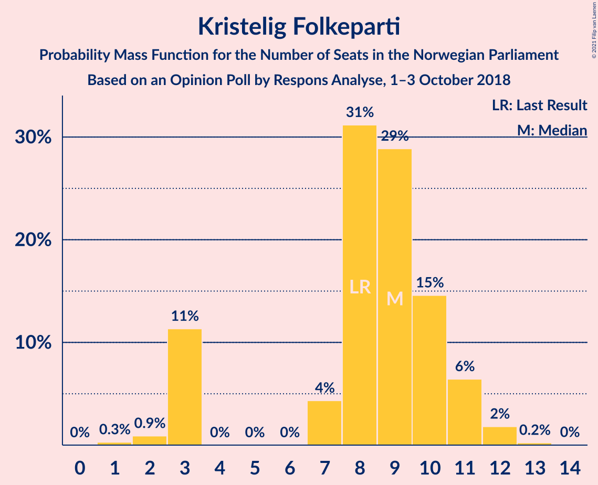
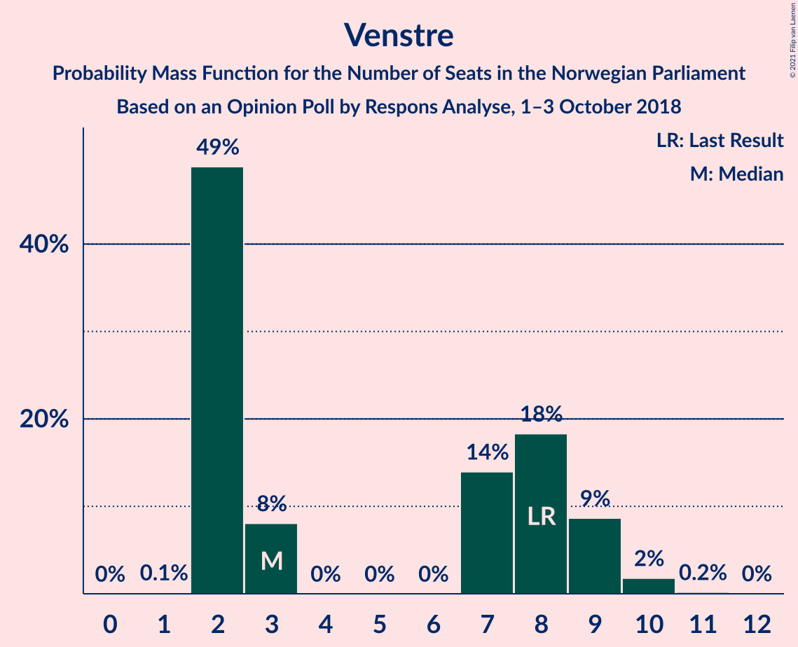
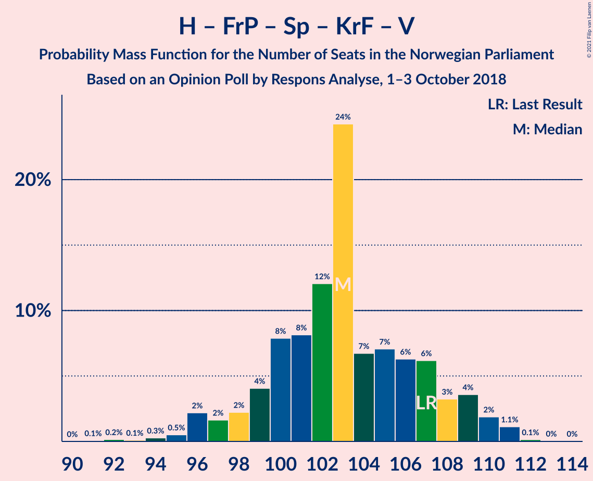
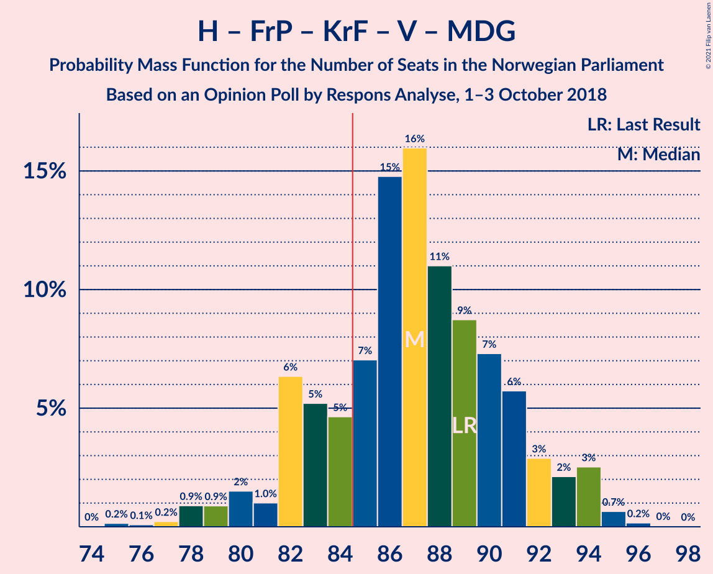
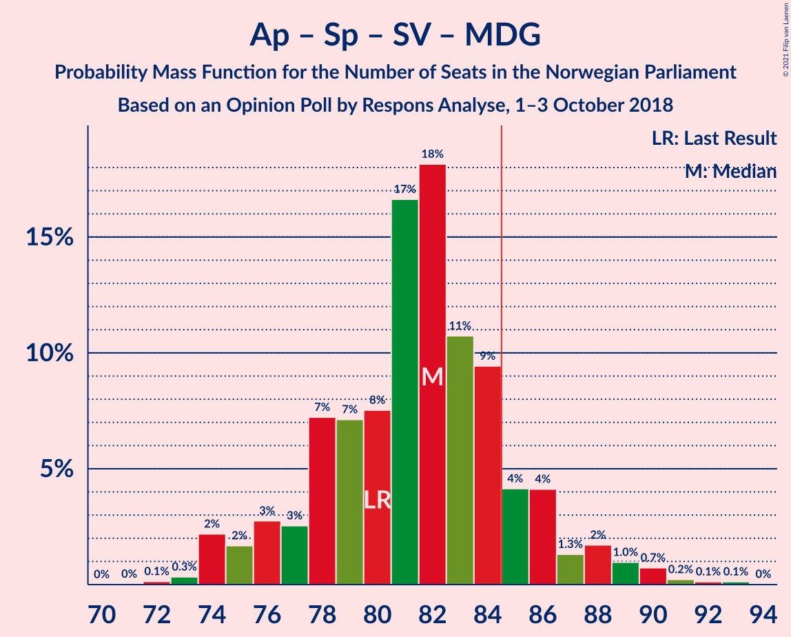
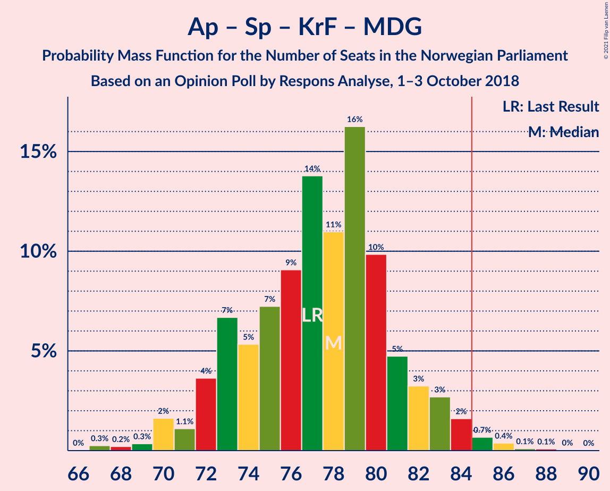

# Opinion Poll by Respons Analyse, 1–3 October 2018

<a href="#voting-intentions">Voting Intentions</a> | <a href="#seats">Seats</a> | <a href="#coalitions">Coalitions</a> | <a href="#technical-information">Technical Information</a>

## Voting Intentions

### Confidence Intervals

| Party | Last Result | Poll Result | 80% Confidence Interval | 90% Confidence Interval | 95% Confidence Interval | 99% Confidence Interval |
|:-----:|:-----------:|:-----------:|:-----------------------:|:-----------------------:|:-----------------------:|:-----------------------:|
| Arbeiderpartiet | 27.4% | 27.7% | 25.9–29.6% |25.4–30.1% |25.0–30.6% |24.2–31.5% |
| Høyre | 25.0% | 25.5% | 23.8–27.3% |23.3–27.8% |22.9–28.3% |22.1–29.2% |
| Fremskrittspartiet | 15.2% | 14.4% | 13.1–15.9% |12.7–16.3% |12.4–16.7% |11.7–17.5% |
| Senterpartiet | 10.3% | 9.8% | 8.7–11.1% |8.4–11.5% |8.1–11.8% |7.6–12.5% |
| Sosialistisk Venstreparti | 6.0% | 6.7% | 5.8–7.8% |5.5–8.2% |5.3–8.4% |4.9–9.0% |
| Kristelig Folkeparti | 4.2% | 4.7% | 3.9–5.7% |3.7–6.0% |3.6–6.2% |3.2–6.7% |
| Venstre | 4.4% | 3.9% | 3.2–4.8% |3.0–5.1% |2.9–5.3% |2.6–5.8% |
| Rødt | 2.4% | 3.0% | 2.4–3.8% |2.2–4.1% |2.1–4.3% |1.9–4.7% |
| Miljøpartiet De Grønne | 3.2% | 2.7% | 2.1–3.5% |2.0–3.7% |1.9–3.9% |1.6–4.3% |

*Note:* The poll result column reflects the actual value used in the calculations. Published results may vary slightly, and in addition be rounded to fewer digits.

## Seats

### Confidence Intervals

| Party | Last Result | Median | 80% Confidence Interval | 90% Confidence Interval | 95% Confidence Interval | 99% Confidence Interval |
|:-----:|:-----------:|:------:|:-----------------------:|:-----------------------:|:-----------------------:|:-----------------------:|
| <a href="#arbeiderpartiet">Arbeiderpartiet</a> | 49 | 50 | 47–54 |45–55 |45–56 |43–58 |
| <a href="#høyre">Høyre</a> | 45 | 46 | 42–50 |42–51 |41–52 |40–53 |
| <a href="#fremskrittspartiet">Fremskrittspartiet</a> | 27 | 27 | 23–29 |23–30 |22–30 |21–32 |
| <a href="#senterpartiet">Senterpartiet</a> | 19 | 18 | 16–20 |15–21 |14–21 |14–23 |
| <a href="#sosialistisk-venstreparti">Sosialistisk Venstreparti</a> | 11 | 12 | 11–14 |10–15 |9–15 |9–16 |
| <a href="#kristelig-folkeparti">Kristelig Folkeparti</a> | 8 | 9 | 3–10 |3–11 |3–11 |2–12 |
| <a href="#venstre">Venstre</a> | 8 | 3 | 2–9 |2–9 |2–9 |2–10 |
| <a href="#rødt">Rødt</a> | 1 | 2 | 1–2 |1–7 |1–7 |1–9 |
| <a href="#miljøpartiet-de-grønne">Miljøpartiet De Grønne</a> | 1 | 1 | 1–2 |1–2 |0–3 |0–8 |

### Arbeiderpartiet

*For a full overview of the results for this party, see the [Arbeiderpartiet](party-arbeiderpartiet.html) page.*

| Number of Seats | Probability | Accumulated | Special Marks |
|:---------------:|:-----------:|:-----------:|:-------------:|
| 42 | 0.1% | 100% |  |
| 43 | 0.9% | 99.9% |  |
| 44 | 0.9% | 98.9% |  |
| 45 | 3% | 98% |  |
| 46 | 4% | 95% |  |
| 47 | 9% | 91% |  |
| 48 | 7% | 82% |  |
| 49 | 19% | 75% | Last Result |
| 50 | 10% | 56% | Median |
| 51 | 12% | 46% |  |
| 52 | 16% | 33% |  |
| 53 | 7% | 18% |  |
| 54 | 3% | 10% |  |
| 55 | 4% | 7% |  |
| 56 | 2% | 3% |  |
| 57 | 0.5% | 1.1% |  |
| 58 | 0.2% | 0.5% |  |
| 59 | 0.1% | 0.3% |  |
| 60 | 0.1% | 0.2% |  |
| 61 | 0.1% | 0.1% |  |
| 62 | 0% | 0% |  |

### Høyre

*For a full overview of the results for this party, see the [Høyre](party-høyre.html) page.*

| Number of Seats | Probability | Accumulated | Special Marks |
|:---------------:|:-----------:|:-----------:|:-------------:|
| 38 | 0.1% | 100% |  |
| 39 | 0.3% | 99.9% |  |
| 40 | 0.5% | 99.6% |  |
| 41 | 4% | 99.1% |  |
| 42 | 9% | 95% |  |
| 43 | 4% | 87% |  |
| 44 | 13% | 82% |  |
| 45 | 12% | 69% | Last Result |
| 46 | 17% | 57% | Median |
| 47 | 12% | 40% |  |
| 48 | 7% | 27% |  |
| 49 | 7% | 20% |  |
| 50 | 8% | 13% |  |
| 51 | 2% | 6% |  |
| 52 | 2% | 3% |  |
| 53 | 1.2% | 1.4% |  |
| 54 | 0.2% | 0.3% |  |
| 55 | 0.1% | 0.1% |  |
| 56 | 0% | 0% |  |

### Fremskrittspartiet

*For a full overview of the results for this party, see the [Fremskrittspartiet](party-fremskrittspartiet.html) page.*

| Number of Seats | Probability | Accumulated | Special Marks |
|:---------------:|:-----------:|:-----------:|:-------------:|
| 19 | 0.1% | 100% |  |
| 20 | 0.4% | 99.9% |  |
| 21 | 0.9% | 99.5% |  |
| 22 | 1.4% | 98.6% |  |
| 23 | 8% | 97% |  |
| 24 | 6% | 90% |  |
| 25 | 14% | 84% |  |
| 26 | 16% | 70% |  |
| 27 | 13% | 54% | Last Result, Median |
| 28 | 16% | 41% |  |
| 29 | 20% | 25% |  |
| 30 | 3% | 5% |  |
| 31 | 1.2% | 2% |  |
| 32 | 0.7% | 0.8% |  |
| 33 | 0.1% | 0.1% |  |
| 34 | 0% | 0% |  |

### Senterpartiet

*For a full overview of the results for this party, see the [Senterpartiet](party-senterpartiet.html) page.*

| Number of Seats | Probability | Accumulated | Special Marks |
|:---------------:|:-----------:|:-----------:|:-------------:|
| 12 | 0.1% | 100% |  |
| 13 | 0.2% | 99.9% |  |
| 14 | 2% | 99.7% |  |
| 15 | 6% | 97% |  |
| 16 | 18% | 91% |  |
| 17 | 22% | 73% |  |
| 18 | 23% | 51% | Median |
| 19 | 14% | 28% | Last Result |
| 20 | 8% | 13% |  |
| 21 | 4% | 6% |  |
| 22 | 1.0% | 2% |  |
| 23 | 0.9% | 1.0% |  |
| 24 | 0.1% | 0.1% |  |
| 25 | 0% | 0% |  |

### Sosialistisk Venstreparti

*For a full overview of the results for this party, see the [Sosialistisk Venstreparti](party-sosialistiskvenstreparti.html) page.*

| Number of Seats | Probability | Accumulated | Special Marks |
|:---------------:|:-----------:|:-----------:|:-------------:|
| 8 | 0.2% | 100% |  |
| 9 | 3% | 99.8% |  |
| 10 | 4% | 97% |  |
| 11 | 28% | 92% | Last Result |
| 12 | 15% | 64% | Median |
| 13 | 30% | 48% |  |
| 14 | 12% | 19% |  |
| 15 | 5% | 7% |  |
| 16 | 2% | 2% |  |
| 17 | 0.2% | 0.3% |  |
| 18 | 0.1% | 0.1% |  |
| 19 | 0% | 0% |  |

### Kristelig Folkeparti

*For a full overview of the results for this party, see the [Kristelig Folkeparti](party-kristeligfolkeparti.html) page.*

| Number of Seats | Probability | Accumulated | Special Marks |
|:---------------:|:-----------:|:-----------:|:-------------:|
| 1 | 0.3% | 100% |  |
| 2 | 0.9% | 99.7% |  |
| 3 | 11% | 98.8% |  |
| 4 | 0% | 87% |  |
| 5 | 0% | 87% |  |
| 6 | 0% | 87% |  |
| 7 | 4% | 87% |  |
| 8 | 31% | 83% | Last Result |
| 9 | 29% | 52% | Median |
| 10 | 15% | 23% |  |
| 11 | 6% | 8% |  |
| 12 | 2% | 2% |  |
| 13 | 0.2% | 0.3% |  |
| 14 | 0% | 0% |  |

### Venstre

*For a full overview of the results for this party, see the [Venstre](party-venstre.html) page.*

| Number of Seats | Probability | Accumulated | Special Marks |
|:---------------:|:-----------:|:-----------:|:-------------:|
| 1 | 0.1% | 100% |  |
| 2 | 49% | 99.8% |  |
| 3 | 8% | 51% | Median |
| 4 | 0% | 43% |  |
| 5 | 0% | 43% |  |
| 6 | 0% | 43% |  |
| 7 | 14% | 43% |  |
| 8 | 18% | 29% | Last Result |
| 9 | 9% | 11% |  |
| 10 | 2% | 2% |  |
| 11 | 0.2% | 0.2% |  |
| 12 | 0% | 0% |  |

### Rødt

*For a full overview of the results for this party, see the [Rødt](party-rødt.html) page.*

| Number of Seats | Probability | Accumulated | Special Marks |
|:---------------:|:-----------:|:-----------:|:-------------:|
| 1 | 36% | 100% | Last Result |
| 2 | 57% | 64% | Median |
| 3 | 0% | 7% |  |
| 4 | 0% | 7% |  |
| 5 | 0% | 7% |  |
| 6 | 0% | 7% |  |
| 7 | 5% | 7% |  |
| 8 | 2% | 2% |  |
| 9 | 0.6% | 0.6% |  |
| 10 | 0% | 0% |  |

### Miljøpartiet De Grønne

*For a full overview of the results for this party, see the [Miljøpartiet De Grønne](party-miljøpartietdegrønne.html) page.*

| Number of Seats | Probability | Accumulated | Special Marks |
|:---------------:|:-----------:|:-----------:|:-------------:|
| 0 | 4% | 100% |  |
| 1 | 60% | 96% | Last Result, Median |
| 2 | 32% | 36% |  |
| 3 | 2% | 4% |  |
| 4 | 0.3% | 2% |  |
| 5 | 0% | 2% |  |
| 6 | 0% | 2% |  |
| 7 | 0.9% | 2% |  |
| 8 | 0.6% | 0.6% |  |
| 9 | 0% | 0% |  |

## Coalitions

### Confidence Intervals

| Coalition | Last Result | Median | Majority? | 80% Confidence Interval | 90% Confidence Interval | 95% Confidence Interval | 99% Confidence Interval |
|:---------:|:-----------:|:------:|:---------:|:-----------------------:|:-----------------------:|:-----------------------:|:-----------------------:|
| Høyre – Fremskrittspartiet – Senterpartiet – Kristelig Folkeparti – Venstre | 107 | 103 | 100% | 99–108 | 98–109 | 96–110 | 94–111 |
| Arbeiderpartiet – Senterpartiet – Sosialistisk Venstreparti – Kristelig Folkeparti – Miljøpartiet De Grønne | 88 | 90 | 92% | 85–93 | 83–94 | 83–96 | 81–98 |
| Høyre – Fremskrittspartiet – Kristelig Folkeparti – Venstre – Miljøpartiet De Grønne | 89 | 87 | 79% | 82–91 | 82–93 | 80–94 | 78–95 |
| Høyre – Fremskrittspartiet – Kristelig Folkeparti – Venstre | 88 | 85 | 64% | 81–90 | 80–91 | 78–93 | 76–94 |
| Arbeiderpartiet – Senterpartiet – Sosialistisk Venstreparti – Rødt – Miljøpartiet De Grønne | 81 | 84 | 36% | 79–88 | 78–89 | 76–91 | 75–93 |
| Arbeiderpartiet – Senterpartiet – Sosialistisk Venstreparti – Rødt | 80 | 82 | 21% | 78–87 | 76–87 | 75–89 | 74–91 |
| Arbeiderpartiet – Senterpartiet – Sosialistisk Venstreparti – Miljøpartiet De Grønne | 80 | 82 | 13% | 78–85 | 76–87 | 74–88 | 73–91 |
| Arbeiderpartiet – Senterpartiet – Sosialistisk Venstreparti | 79 | 80 | 9% | 76–84 | 74–85 | 73–87 | 72–89 |
| Høyre – Fremskrittspartiet – Venstre | 80 | 77 | 3% | 73–82 | 72–84 | 71–85 | 68–87 |
| Arbeiderpartiet – Senterpartiet – Kristelig Folkeparti – Miljøpartiet De Grønne | 77 | 78 | 1.3% | 73–81 | 72–83 | 71–84 | 68–86 |
| Arbeiderpartiet – Senterpartiet – Kristelig Folkeparti | 76 | 76 | 0.5% | 71–80 | 71–81 | 69–82 | 67–84 |
| Høyre – Fremskrittspartiet | 72 | 73 | 0% | 68–77 | 66–78 | 66–79 | 64–81 |
| Arbeiderpartiet – Senterpartiet | 68 | 68 | 0% | 64–72 | 63–73 | 62–74 | 60–76 |
| Arbeiderpartiet – Sosialistisk Venstreparti | 60 | 63 | 0% | 58–66 | 57–67 | 56–68 | 55–71 |
| Høyre – Kristelig Folkeparti – Venstre | 61 | 59 | 0% | 55–64 | 54–65 | 52–66 | 50–67 |
| Senterpartiet – Kristelig Folkeparti – Venstre | 35 | 30 | 0% | 26–35 | 24–37 | 22–37 | 21–39 |

### Høyre – Fremskrittspartiet – Senterpartiet – Kristelig Folkeparti – Venstre

| Number of Seats | Probability | Accumulated | Special Marks |
|:---------------:|:-----------:|:-----------:|:-------------:|
| 91 | 0.1% | 100% |  |
| 92 | 0.2% | 99.9% |  |
| 93 | 0.1% | 99.8% |  |
| 94 | 0.3% | 99.6% |  |
| 95 | 0.5% | 99.4% |  |
| 96 | 2% | 98.9% |  |
| 97 | 2% | 97% |  |
| 98 | 2% | 95% |  |
| 99 | 4% | 93% |  |
| 100 | 8% | 89% |  |
| 101 | 8% | 81% |  |
| 102 | 12% | 73% |  |
| 103 | 24% | 61% | Median |
| 104 | 7% | 36% |  |
| 105 | 7% | 30% |  |
| 106 | 6% | 23% |  |
| 107 | 6% | 16% | Last Result |
| 108 | 3% | 10% |  |
| 109 | 4% | 7% |  |
| 110 | 2% | 3% |  |
| 111 | 1.1% | 1.4% |  |
| 112 | 0.1% | 0.2% |  |
| 113 | 0% | 0.1% |  |
| 114 | 0% | 0% |  |

### Arbeiderpartiet – Senterpartiet – Sosialistisk Venstreparti – Kristelig Folkeparti – Miljøpartiet De Grønne

| Number of Seats | Probability | Accumulated | Special Marks |
|:---------------:|:-----------:|:-----------:|:-------------:|
| 78 | 0% | 100% |  |
| 79 | 0% | 99.9% |  |
| 80 | 0.1% | 99.9% |  |
| 81 | 0.8% | 99.8% |  |
| 82 | 1.0% | 99.0% |  |
| 83 | 3% | 98% |  |
| 84 | 3% | 95% |  |
| 85 | 3% | 92% | Majority |
| 86 | 5% | 89% |  |
| 87 | 8% | 84% |  |
| 88 | 7% | 76% | Last Result |
| 89 | 10% | 69% |  |
| 90 | 18% | 59% | Median |
| 91 | 14% | 42% |  |
| 92 | 12% | 27% |  |
| 93 | 7% | 15% |  |
| 94 | 4% | 9% |  |
| 95 | 2% | 5% |  |
| 96 | 1.3% | 3% |  |
| 97 | 0.9% | 2% |  |
| 98 | 0.3% | 0.7% |  |
| 99 | 0.2% | 0.4% |  |
| 100 | 0.1% | 0.2% |  |
| 101 | 0% | 0% |  |

### Høyre – Fremskrittspartiet – Kristelig Folkeparti – Venstre – Miljøpartiet De Grønne

| Number of Seats | Probability | Accumulated | Special Marks |
|:---------------:|:-----------:|:-----------:|:-------------:|
| 75 | 0.2% | 100% |  |
| 76 | 0.1% | 99.8% |  |
| 77 | 0.2% | 99.7% |  |
| 78 | 0.9% | 99.5% |  |
| 79 | 0.9% | 98.6% |  |
| 80 | 2% | 98% |  |
| 81 | 1.0% | 96% |  |
| 82 | 6% | 95% |  |
| 83 | 5% | 89% |  |
| 84 | 5% | 84% |  |
| 85 | 7% | 79% | Majority |
| 86 | 15% | 72% | Median |
| 87 | 16% | 57% |  |
| 88 | 11% | 41% |  |
| 89 | 9% | 30% | Last Result |
| 90 | 7% | 21% |  |
| 91 | 6% | 14% |  |
| 92 | 3% | 8% |  |
| 93 | 2% | 6% |  |
| 94 | 3% | 3% |  |
| 95 | 0.7% | 0.9% |  |
| 96 | 0.2% | 0.2% |  |
| 97 | 0% | 0.1% |  |
| 98 | 0% | 0% |  |

### Høyre – Fremskrittspartiet – Kristelig Folkeparti – Venstre

| Number of Seats | Probability | Accumulated | Special Marks |
|:---------------:|:-----------:|:-----------:|:-------------:|
| 73 | 0% | 100% |  |
| 74 | 0.2% | 99.9% |  |
| 75 | 0.1% | 99.8% |  |
| 76 | 0.3% | 99.6% |  |
| 77 | 1.1% | 99.4% |  |
| 78 | 0.8% | 98% |  |
| 79 | 2% | 97% |  |
| 80 | 2% | 95% |  |
| 81 | 5% | 93% |  |
| 82 | 5% | 88% |  |
| 83 | 6% | 82% |  |
| 84 | 12% | 76% |  |
| 85 | 15% | 64% | Median, Majority |
| 86 | 16% | 49% |  |
| 87 | 8% | 34% |  |
| 88 | 6% | 26% | Last Result |
| 89 | 7% | 20% |  |
| 90 | 5% | 12% |  |
| 91 | 2% | 7% |  |
| 92 | 2% | 5% |  |
| 93 | 2% | 3% |  |
| 94 | 0.6% | 0.7% |  |
| 95 | 0.1% | 0.2% |  |
| 96 | 0% | 0% |  |

### Arbeiderpartiet – Senterpartiet – Sosialistisk Venstreparti – Rødt – Miljøpartiet De Grønne

| Number of Seats | Probability | Accumulated | Special Marks |
|:---------------:|:-----------:|:-----------:|:-------------:|
| 74 | 0.1% | 100% |  |
| 75 | 0.6% | 99.8% |  |
| 76 | 2% | 99.3% |  |
| 77 | 2% | 97% |  |
| 78 | 2% | 95% |  |
| 79 | 5% | 93% |  |
| 80 | 7% | 88% |  |
| 81 | 6% | 80% | Last Result |
| 82 | 8% | 74% |  |
| 83 | 16% | 66% | Median |
| 84 | 15% | 51% |  |
| 85 | 12% | 36% | Majority |
| 86 | 6% | 24% |  |
| 87 | 5% | 18% |  |
| 88 | 5% | 12% |  |
| 89 | 2% | 7% |  |
| 90 | 2% | 5% |  |
| 91 | 0.8% | 3% |  |
| 92 | 1.1% | 2% |  |
| 93 | 0.3% | 0.6% |  |
| 94 | 0.1% | 0.4% |  |
| 95 | 0.2% | 0.2% |  |
| 96 | 0% | 0.1% |  |
| 97 | 0% | 0% |  |

### Arbeiderpartiet – Senterpartiet – Sosialistisk Venstreparti – Rødt

| Number of Seats | Probability | Accumulated | Special Marks |
|:---------------:|:-----------:|:-----------:|:-------------:|
| 72 | 0% | 100% |  |
| 73 | 0.2% | 99.9% |  |
| 74 | 0.7% | 99.8% |  |
| 75 | 3% | 99.1% |  |
| 76 | 2% | 97% |  |
| 77 | 3% | 94% |  |
| 78 | 6% | 92% |  |
| 79 | 7% | 86% |  |
| 80 | 9% | 79% | Last Result |
| 81 | 11% | 70% |  |
| 82 | 16% | 59% | Median |
| 83 | 15% | 43% |  |
| 84 | 7% | 28% |  |
| 85 | 5% | 21% | Majority |
| 86 | 5% | 16% |  |
| 87 | 6% | 11% |  |
| 88 | 1.0% | 5% |  |
| 89 | 2% | 4% |  |
| 90 | 0.9% | 2% |  |
| 91 | 0.9% | 1.4% |  |
| 92 | 0.2% | 0.5% |  |
| 93 | 0.1% | 0.3% |  |
| 94 | 0.2% | 0.2% |  |
| 95 | 0% | 0% |  |

### Arbeiderpartiet – Senterpartiet – Sosialistisk Venstreparti – Miljøpartiet De Grønne

| Number of Seats | Probability | Accumulated | Special Marks |
|:---------------:|:-----------:|:-----------:|:-------------:|
| 72 | 0.1% | 100% |  |
| 73 | 0.3% | 99.8% |  |
| 74 | 2% | 99.5% |  |
| 75 | 2% | 97% |  |
| 76 | 3% | 96% |  |
| 77 | 3% | 93% |  |
| 78 | 7% | 90% |  |
| 79 | 7% | 83% |  |
| 80 | 8% | 76% | Last Result |
| 81 | 17% | 68% | Median |
| 82 | 18% | 52% |  |
| 83 | 11% | 34% |  |
| 84 | 9% | 23% |  |
| 85 | 4% | 13% | Majority |
| 86 | 4% | 9% |  |
| 87 | 1.3% | 5% |  |
| 88 | 2% | 4% |  |
| 89 | 1.0% | 2% |  |
| 90 | 0.7% | 1.2% |  |
| 91 | 0.2% | 0.5% |  |
| 92 | 0.1% | 0.3% |  |
| 93 | 0.1% | 0.2% |  |
| 94 | 0% | 0% |  |

### Arbeiderpartiet – Senterpartiet – Sosialistisk Venstreparti

| Number of Seats | Probability | Accumulated | Special Marks |
|:---------------:|:-----------:|:-----------:|:-------------:|
| 70 | 0% | 100% |  |
| 71 | 0.2% | 99.9% |  |
| 72 | 0.7% | 99.8% |  |
| 73 | 2% | 99.1% |  |
| 74 | 2% | 97% |  |
| 75 | 3% | 95% |  |
| 76 | 4% | 92% |  |
| 77 | 7% | 89% |  |
| 78 | 8% | 81% |  |
| 79 | 10% | 73% | Last Result |
| 80 | 23% | 63% | Median |
| 81 | 11% | 39% |  |
| 82 | 11% | 29% |  |
| 83 | 5% | 17% |  |
| 84 | 4% | 12% |  |
| 85 | 4% | 9% | Majority |
| 86 | 1.1% | 4% |  |
| 87 | 1.3% | 3% |  |
| 88 | 0.6% | 2% |  |
| 89 | 0.7% | 1.1% |  |
| 90 | 0.2% | 0.4% |  |
| 91 | 0.1% | 0.2% |  |
| 92 | 0.1% | 0.1% |  |
| 93 | 0% | 0% |  |

### Høyre – Fremskrittspartiet – Venstre

| Number of Seats | Probability | Accumulated | Special Marks |
|:---------------:|:-----------:|:-----------:|:-------------:|
| 66 | 0% | 100% |  |
| 67 | 0.1% | 99.9% |  |
| 68 | 0.4% | 99.8% |  |
| 69 | 0.4% | 99.4% |  |
| 70 | 1.0% | 99.0% |  |
| 71 | 1.5% | 98% |  |
| 72 | 3% | 97% |  |
| 73 | 6% | 94% |  |
| 74 | 6% | 88% |  |
| 75 | 9% | 83% |  |
| 76 | 16% | 73% | Median |
| 77 | 16% | 57% |  |
| 78 | 8% | 41% |  |
| 79 | 8% | 33% |  |
| 80 | 7% | 25% | Last Result |
| 81 | 8% | 18% |  |
| 82 | 2% | 10% |  |
| 83 | 2% | 8% |  |
| 84 | 3% | 5% |  |
| 85 | 2% | 3% | Majority |
| 86 | 0.4% | 1.0% |  |
| 87 | 0.6% | 0.6% |  |
| 88 | 0% | 0.1% |  |
| 89 | 0% | 0% |  |

### Arbeiderpartiet – Senterpartiet – Kristelig Folkeparti – Miljøpartiet De Grønne

| Number of Seats | Probability | Accumulated | Special Marks |
|:---------------:|:-----------:|:-----------:|:-------------:|
| 67 | 0.3% | 100% |  |
| 68 | 0.2% | 99.7% |  |
| 69 | 0.3% | 99.5% |  |
| 70 | 2% | 99.1% |  |
| 71 | 1.1% | 98% |  |
| 72 | 4% | 96% |  |
| 73 | 7% | 93% |  |
| 74 | 5% | 86% |  |
| 75 | 7% | 81% |  |
| 76 | 9% | 74% |  |
| 77 | 14% | 64% | Last Result |
| 78 | 11% | 51% | Median |
| 79 | 16% | 40% |  |
| 80 | 10% | 23% |  |
| 81 | 5% | 14% |  |
| 82 | 3% | 9% |  |
| 83 | 3% | 6% |  |
| 84 | 2% | 3% |  |
| 85 | 0.7% | 1.3% | Majority |
| 86 | 0.4% | 0.6% |  |
| 87 | 0.1% | 0.2% |  |
| 88 | 0.1% | 0.1% |  |
| 89 | 0% | 0.1% |  |
| 90 | 0% | 0% |  |

### Arbeiderpartiet – Senterpartiet – Kristelig Folkeparti

| Number of Seats | Probability | Accumulated | Special Marks |
|:---------------:|:-----------:|:-----------:|:-------------:|
| 65 | 0.1% | 100% |  |
| 66 | 0.3% | 99.9% |  |
| 67 | 0.3% | 99.7% |  |
| 68 | 0.6% | 99.3% |  |
| 69 | 1.5% | 98.7% |  |
| 70 | 2% | 97% |  |
| 71 | 6% | 96% |  |
| 72 | 5% | 90% |  |
| 73 | 7% | 85% |  |
| 74 | 8% | 78% |  |
| 75 | 13% | 70% |  |
| 76 | 13% | 58% | Last Result |
| 77 | 13% | 45% | Median |
| 78 | 13% | 32% |  |
| 79 | 6% | 19% |  |
| 80 | 5% | 12% |  |
| 81 | 2% | 7% |  |
| 82 | 3% | 5% |  |
| 83 | 0.9% | 2% |  |
| 84 | 0.4% | 0.9% |  |
| 85 | 0.3% | 0.5% | Majority |
| 86 | 0.1% | 0.2% |  |
| 87 | 0% | 0.1% |  |
| 88 | 0% | 0% |  |

### Høyre – Fremskrittspartiet

| Number of Seats | Probability | Accumulated | Special Marks |
|:---------------:|:-----------:|:-----------:|:-------------:|
| 62 | 0.2% | 100% |  |
| 63 | 0.2% | 99.8% |  |
| 64 | 0.4% | 99.6% |  |
| 65 | 0.7% | 99.2% |  |
| 66 | 5% | 98% |  |
| 67 | 2% | 94% |  |
| 68 | 6% | 91% |  |
| 69 | 6% | 86% |  |
| 70 | 9% | 80% |  |
| 71 | 7% | 72% |  |
| 72 | 7% | 65% | Last Result |
| 73 | 14% | 57% | Median |
| 74 | 9% | 44% |  |
| 75 | 14% | 34% |  |
| 76 | 8% | 21% |  |
| 77 | 4% | 13% |  |
| 78 | 5% | 9% |  |
| 79 | 3% | 4% |  |
| 80 | 0.3% | 0.9% |  |
| 81 | 0.4% | 0.7% |  |
| 82 | 0.2% | 0.3% |  |
| 83 | 0% | 0.1% |  |
| 84 | 0% | 0% |  |

### Arbeiderpartiet – Senterpartiet

| Number of Seats | Probability | Accumulated | Special Marks |
|:---------------:|:-----------:|:-----------:|:-------------:|
| 59 | 0.1% | 100% |  |
| 60 | 0.4% | 99.9% |  |
| 61 | 1.3% | 99.5% |  |
| 62 | 3% | 98% |  |
| 63 | 3% | 95% |  |
| 64 | 7% | 93% |  |
| 65 | 9% | 86% |  |
| 66 | 9% | 77% |  |
| 67 | 15% | 68% |  |
| 68 | 14% | 53% | Last Result, Median |
| 69 | 16% | 40% |  |
| 70 | 7% | 23% |  |
| 71 | 5% | 16% |  |
| 72 | 4% | 11% |  |
| 73 | 3% | 7% |  |
| 74 | 3% | 5% |  |
| 75 | 0.7% | 2% |  |
| 76 | 0.9% | 1.4% |  |
| 77 | 0.2% | 0.5% |  |
| 78 | 0.1% | 0.3% |  |
| 79 | 0.1% | 0.1% |  |
| 80 | 0% | 0% |  |

### Arbeiderpartiet – Sosialistisk Venstreparti

| Number of Seats | Probability | Accumulated | Special Marks |
|:---------------:|:-----------:|:-----------:|:-------------:|
| 53 | 0.1% | 100% |  |
| 54 | 0.2% | 99.9% |  |
| 55 | 0.8% | 99.7% |  |
| 56 | 3% | 98.9% |  |
| 57 | 2% | 96% |  |
| 58 | 4% | 94% |  |
| 59 | 5% | 90% |  |
| 60 | 9% | 85% | Last Result |
| 61 | 8% | 76% |  |
| 62 | 16% | 68% | Median |
| 63 | 15% | 51% |  |
| 64 | 15% | 36% |  |
| 65 | 10% | 22% |  |
| 66 | 5% | 12% |  |
| 67 | 3% | 6% |  |
| 68 | 1.3% | 3% |  |
| 69 | 0.7% | 2% |  |
| 70 | 0.6% | 1.1% |  |
| 71 | 0.2% | 0.5% |  |
| 72 | 0.1% | 0.3% |  |
| 73 | 0% | 0.2% |  |
| 74 | 0.2% | 0.2% |  |
| 75 | 0% | 0% |  |

### Høyre – Kristelig Folkeparti – Venstre

| Number of Seats | Probability | Accumulated | Special Marks |
|:---------------:|:-----------:|:-----------:|:-------------:|
| 47 | 0% | 100% |  |
| 48 | 0% | 99.9% |  |
| 49 | 0.2% | 99.9% |  |
| 50 | 0.3% | 99.7% |  |
| 51 | 1.1% | 99.3% |  |
| 52 | 1.0% | 98% |  |
| 53 | 2% | 97% |  |
| 54 | 3% | 95% |  |
| 55 | 9% | 92% |  |
| 56 | 14% | 83% |  |
| 57 | 7% | 69% |  |
| 58 | 11% | 62% | Median |
| 59 | 11% | 51% |  |
| 60 | 7% | 40% |  |
| 61 | 12% | 33% | Last Result |
| 62 | 3% | 21% |  |
| 63 | 7% | 18% |  |
| 64 | 5% | 11% |  |
| 65 | 3% | 7% |  |
| 66 | 2% | 3% |  |
| 67 | 0.8% | 1.2% |  |
| 68 | 0.2% | 0.3% |  |
| 69 | 0.1% | 0.1% |  |
| 70 | 0% | 0.1% |  |
| 71 | 0% | 0% |  |

### Senterpartiet – Kristelig Folkeparti – Venstre

| Number of Seats | Probability | Accumulated | Special Marks |
|:---------------:|:-----------:|:-----------:|:-------------:|
| 19 | 0.1% | 100% |  |
| 20 | 0.1% | 99.9% |  |
| 21 | 2% | 99.7% |  |
| 22 | 0.8% | 98% |  |
| 23 | 0.5% | 97% |  |
| 24 | 2% | 96% |  |
| 25 | 2% | 95% |  |
| 26 | 4% | 92% |  |
| 27 | 4% | 89% |  |
| 28 | 16% | 84% |  |
| 29 | 12% | 69% |  |
| 30 | 8% | 56% | Median |
| 31 | 9% | 48% |  |
| 32 | 9% | 40% |  |
| 33 | 11% | 31% |  |
| 34 | 6% | 19% |  |
| 35 | 4% | 13% | Last Result |
| 36 | 4% | 9% |  |
| 37 | 3% | 5% |  |
| 38 | 2% | 2% |  |
| 39 | 0.4% | 0.6% |  |
| 40 | 0.2% | 0.2% |  |
| 41 | 0% | 0% |  |

## Technical Information

### Opinion Poll

+ **Polling firm:** Respons Analyse
+ **Commissioner(s):** —
+ **Fieldwork period:** 1–3 October 2018

### Calculations

+ **Sample size:** 1000
+ **Simulations done:** 1,048,576
+ **Error estimate:** 0.58%

