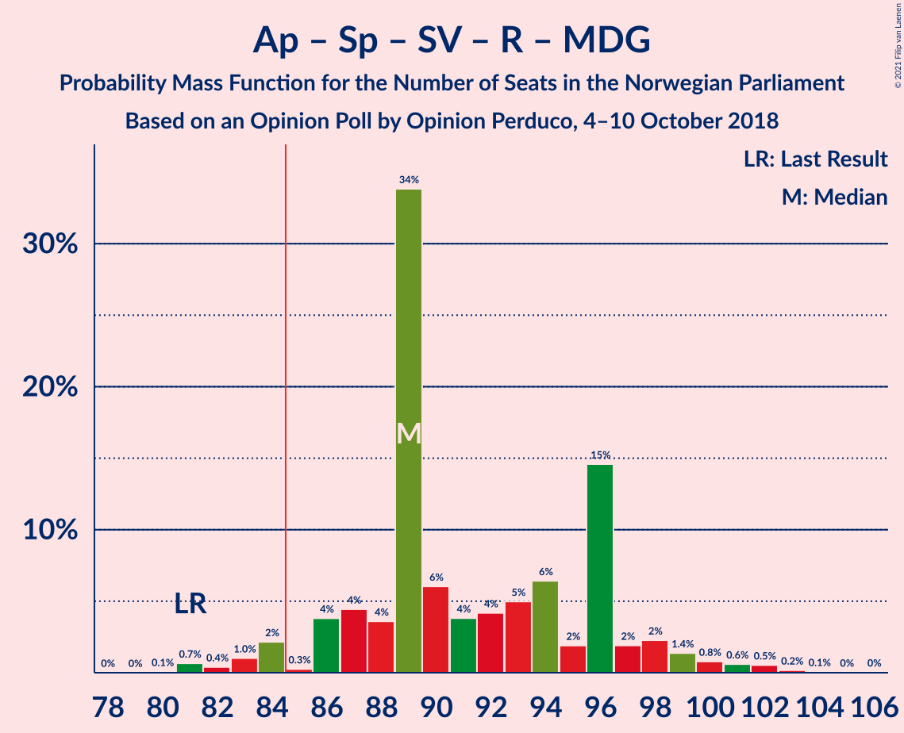

# Opinion Poll by Opinion Perduco, 4–10 October 2018

<a href="#voting-intentions">Voting Intentions</a> | <a href="#seats">Seats</a> | <a href="#coalitions">Coalitions</a> | <a href="#technical-information">Technical Information</a>

## Voting Intentions

### Confidence Intervals

| Party | Last Result | Poll Result | 80% Confidence Interval | 90% Confidence Interval | 95% Confidence Interval | 99% Confidence Interval |
|:-----:|:-----------:|:-----------:|:-----------------------:|:-----------------------:|:-----------------------:|:-----------------------:|
| Arbeiderpartiet | 27.4% | 26.6% | 24.5–28.9% |23.9–29.5% |23.4–30.1% |22.5–31.2% |
| Høyre | 25.0% | 25.0% | 23.0–27.2% |22.4–27.8% |21.9–28.4% |20.9–29.5% |
| Fremskrittspartiet | 15.2% | 12.9% | 11.4–14.7% |11.0–15.2% |10.6–15.7% |9.9–16.6% |
| Senterpartiet | 10.3% | 12.6% | 11.1–14.4% |10.7–14.9% |10.3–15.4% |9.7–16.2% |
| Sosialistisk Venstreparti | 6.0% | 5.9% | 4.9–7.2% |4.6–7.6% |4.3–7.9% |3.9–8.6% |
| Rødt | 2.4% | 5.1% | 4.2–6.4% |3.9–6.8% |3.7–7.1% |3.3–7.7% |
| Kristelig Folkeparti | 4.2% | 5.0% | 4.1–6.2% |3.8–6.6% |3.6–6.9% |3.2–7.6% |
| Miljøpartiet De Grønne | 3.2% | 3.2% | 2.5–4.3% |2.3–4.6% |2.1–4.9% |1.8–5.4% |
| Venstre | 4.4% | 2.6% | 2.0–3.6% |1.8–3.9% |1.7–4.1% |1.4–4.7% |

*Note:* The poll result column reflects the actual value used in the calculations. Published results may vary slightly, and in addition be rounded to fewer digits.

## Seats

### Confidence Intervals

| Party | Last Result | Median | 80% Confidence Interval | 90% Confidence Interval | 95% Confidence Interval | 99% Confidence Interval |
|:-----:|:-----------:|:------:|:-----------------------:|:-----------------------:|:-----------------------:|:-----------------------:|
| <a href="#arbeiderpartiet">Arbeiderpartiet</a> | 49 | 44 | 43–54 |42–55 |41–55 |40–57 |
| <a href="#høyre">Høyre</a> | 45 | 46 | 40–49 |40–50 |38–50 |36–53 |
| <a href="#fremskrittspartiet">Fremskrittspartiet</a> | 27 | 22 | 20–25 |19–26 |19–28 |17–29 |
| <a href="#senterpartiet">Senterpartiet</a> | 19 | 22 | 21–25 |20–26 |19–26 |17–28 |
| <a href="#sosialistisk-venstreparti">Sosialistisk Venstreparti</a> | 11 | 10 | 9–12 |8–13 |7–13 |2–15 |
| <a href="#rødt">Rødt</a> | 1 | 11 | 8–12 |2–12 |2–14 |2–14 |
| <a href="#kristelig-folkeparti">Kristelig Folkeparti</a> | 8 | 9 | 8–11 |3–11 |2–12 |2–13 |
| <a href="#miljøpartiet-de-grønne">Miljøpartiet De Grønne</a> | 1 | 2 | 1–7 |1–7 |1–8 |0–9 |
| <a href="#venstre">Venstre</a> | 8 | 2 | 1–2 |1–2 |0–7 |0–8 |

### Arbeiderpartiet

*For a full overview of the results for this party, see the [Arbeiderpartiet](party-arbeiderpartiet.html) page.*

| Number of Seats | Probability | Accumulated | Special Marks |
|:---------------:|:-----------:|:-----------:|:-------------:|
| 39 | 0.1% | 100% |  |
| 40 | 0.4% | 99.8% |  |
| 41 | 3% | 99.4% |  |
| 42 | 4% | 96% |  |
| 43 | 7% | 92% |  |
| 44 | 41% | 85% | Median |
| 45 | 1.4% | 44% |  |
| 46 | 4% | 43% |  |
| 47 | 6% | 39% |  |
| 48 | 2% | 33% |  |
| 49 | 3% | 31% | Last Result |
| 50 | 1.3% | 28% |  |
| 51 | 0.8% | 27% |  |
| 52 | 4% | 26% |  |
| 53 | 3% | 21% |  |
| 54 | 12% | 19% |  |
| 55 | 6% | 6% |  |
| 56 | 0.1% | 0.6% |  |
| 57 | 0.4% | 0.5% |  |
| 58 | 0.1% | 0.1% |  |
| 59 | 0% | 0% |  |

### Høyre

*For a full overview of the results for this party, see the [Høyre](party-høyre.html) page.*

| Number of Seats | Probability | Accumulated | Special Marks |
|:---------------:|:-----------:|:-----------:|:-------------:|
| 34 | 0.1% | 100% |  |
| 35 | 0.3% | 99.9% |  |
| 36 | 0.6% | 99.6% |  |
| 37 | 0.7% | 98.9% |  |
| 38 | 3% | 98% |  |
| 39 | 0.6% | 96% |  |
| 40 | 14% | 95% |  |
| 41 | 3% | 81% |  |
| 42 | 10% | 78% |  |
| 43 | 5% | 68% |  |
| 44 | 6% | 63% |  |
| 45 | 4% | 57% | Last Result |
| 46 | 7% | 53% | Median |
| 47 | 35% | 46% |  |
| 48 | 1.1% | 11% |  |
| 49 | 4% | 10% |  |
| 50 | 4% | 6% |  |
| 51 | 0.3% | 2% |  |
| 52 | 1.1% | 2% |  |
| 53 | 0.5% | 0.7% |  |
| 54 | 0.2% | 0.2% |  |
| 55 | 0% | 0% |  |

### Fremskrittspartiet

*For a full overview of the results for this party, see the [Fremskrittspartiet](party-fremskrittspartiet.html) page.*

| Number of Seats | Probability | Accumulated | Special Marks |
|:---------------:|:-----------:|:-----------:|:-------------:|
| 15 | 0.2% | 100% |  |
| 16 | 0.1% | 99.7% |  |
| 17 | 1.1% | 99.7% |  |
| 18 | 0.6% | 98.6% |  |
| 19 | 4% | 98% |  |
| 20 | 15% | 94% |  |
| 21 | 7% | 79% |  |
| 22 | 43% | 71% | Median |
| 23 | 7% | 29% |  |
| 24 | 11% | 21% |  |
| 25 | 3% | 10% |  |
| 26 | 2% | 7% |  |
| 27 | 2% | 5% | Last Result |
| 28 | 2% | 3% |  |
| 29 | 0.7% | 0.9% |  |
| 30 | 0.2% | 0.2% |  |
| 31 | 0% | 0% |  |

### Senterpartiet

*For a full overview of the results for this party, see the [Senterpartiet](party-senterpartiet.html) page.*

| Number of Seats | Probability | Accumulated | Special Marks |
|:---------------:|:-----------:|:-----------:|:-------------:|
| 15 | 0.1% | 100% |  |
| 16 | 0.3% | 99.9% |  |
| 17 | 0.9% | 99.6% |  |
| 18 | 0.6% | 98.7% |  |
| 19 | 0.8% | 98% | Last Result |
| 20 | 6% | 97% |  |
| 21 | 7% | 91% |  |
| 22 | 46% | 84% | Median |
| 23 | 22% | 39% |  |
| 24 | 6% | 17% |  |
| 25 | 4% | 10% |  |
| 26 | 5% | 6% |  |
| 27 | 1.0% | 2% |  |
| 28 | 0.4% | 0.6% |  |
| 29 | 0.1% | 0.3% |  |
| 30 | 0.1% | 0.1% |  |
| 31 | 0% | 0.1% |  |
| 32 | 0% | 0% |  |

### Sosialistisk Venstreparti

*For a full overview of the results for this party, see the [Sosialistisk Venstreparti](party-sosialistiskvenstreparti.html) page.*

| Number of Seats | Probability | Accumulated | Special Marks |
|:---------------:|:-----------:|:-----------:|:-------------:|
| 1 | 0.1% | 100% |  |
| 2 | 2% | 99.9% |  |
| 3 | 0.2% | 98% |  |
| 4 | 0% | 98% |  |
| 5 | 0% | 98% |  |
| 6 | 0% | 98% |  |
| 7 | 0.8% | 98% |  |
| 8 | 6% | 97% |  |
| 9 | 26% | 92% |  |
| 10 | 39% | 66% | Median |
| 11 | 10% | 27% | Last Result |
| 12 | 8% | 17% |  |
| 13 | 6% | 8% |  |
| 14 | 1.1% | 2% |  |
| 15 | 0.5% | 0.9% |  |
| 16 | 0.2% | 0.4% |  |
| 17 | 0.1% | 0.1% |  |
| 18 | 0% | 0% |  |

### Rødt

*For a full overview of the results for this party, see the [Rødt](party-rødt.html) page.*

| Number of Seats | Probability | Accumulated | Special Marks |
|:---------------:|:-----------:|:-----------:|:-------------:|
| 1 | 0% | 100% | Last Result |
| 2 | 9% | 100% |  |
| 3 | 0% | 91% |  |
| 4 | 0% | 91% |  |
| 5 | 0% | 91% |  |
| 6 | 0% | 91% |  |
| 7 | 0.6% | 91% |  |
| 8 | 20% | 91% |  |
| 9 | 10% | 71% |  |
| 10 | 3% | 61% |  |
| 11 | 47% | 58% | Median |
| 12 | 7% | 12% |  |
| 13 | 1.4% | 4% |  |
| 14 | 3% | 3% |  |
| 15 | 0% | 0% |  |

### Kristelig Folkeparti

*For a full overview of the results for this party, see the [Kristelig Folkeparti](party-kristeligfolkeparti.html) page.*

| Number of Seats | Probability | Accumulated | Special Marks |
|:---------------:|:-----------:|:-----------:|:-------------:|
| 1 | 0.3% | 100% |  |
| 2 | 2% | 99.7% |  |
| 3 | 4% | 97% |  |
| 4 | 0% | 94% |  |
| 5 | 0% | 94% |  |
| 6 | 0% | 94% |  |
| 7 | 2% | 94% |  |
| 8 | 16% | 92% | Last Result |
| 9 | 43% | 76% | Median |
| 10 | 8% | 33% |  |
| 11 | 21% | 25% |  |
| 12 | 2% | 4% |  |
| 13 | 1.0% | 1.2% |  |
| 14 | 0.2% | 0.2% |  |
| 15 | 0% | 0% |  |

### Miljøpartiet De Grønne

*For a full overview of the results for this party, see the [Miljøpartiet De Grønne](party-miljøpartietdegrønne.html) page.*

| Number of Seats | Probability | Accumulated | Special Marks |
|:---------------:|:-----------:|:-----------:|:-------------:|
| 0 | 2% | 100% |  |
| 1 | 26% | 98% | Last Result |
| 2 | 61% | 72% | Median |
| 3 | 0.6% | 11% |  |
| 4 | 0% | 10% |  |
| 5 | 0% | 10% |  |
| 6 | 0% | 10% |  |
| 7 | 5% | 10% |  |
| 8 | 4% | 5% |  |
| 9 | 0.4% | 0.6% |  |
| 10 | 0.1% | 0.2% |  |
| 11 | 0% | 0% |  |

### Venstre

*For a full overview of the results for this party, see the [Venstre](party-venstre.html) page.*

| Number of Seats | Probability | Accumulated | Special Marks |
|:---------------:|:-----------:|:-----------:|:-------------:|
| 0 | 5% | 100% |  |
| 1 | 9% | 95% |  |
| 2 | 84% | 87% | Median |
| 3 | 0% | 3% |  |
| 4 | 0% | 3% |  |
| 5 | 0% | 3% |  |
| 6 | 0% | 3% |  |
| 7 | 2% | 3% |  |
| 8 | 0.9% | 1.1% | Last Result |
| 9 | 0.2% | 0.2% |  |
| 10 | 0% | 0% |  |

## Coalitions

### Confidence Intervals

| Coalition | Last Result | Median | Majority? | 80% Confidence Interval | 90% Confidence Interval | 95% Confidence Interval | 99% Confidence Interval |
|:---------:|:-----------:|:------:|:---------:|:-----------------------:|:-----------------------:|:-----------------------:|:-----------------------:|
| Høyre – Fremskrittspartiet – Senterpartiet – Kristelig Folkeparti – Venstre | 107 | 102 | 100% | 96–104 | 94–106 | 92–108 | 91–110 |
| Arbeiderpartiet – Senterpartiet – Sosialistisk Venstreparti – Kristelig Folkeparti – Miljøpartiet De Grønne | 88 | 88 | 91% | 85–99 | 84–99 | 84–101 | 81–104 |
| Arbeiderpartiet – Senterpartiet – Sosialistisk Venstreparti – Rødt – Miljøpartiet De Grønne | 81 | 89 | 96% | 87–96 | 86–98 | 84–99 | 81–102 |
| Arbeiderpartiet – Senterpartiet – Sosialistisk Venstreparti – Rødt | 80 | 87 | 92% | 85–94 | 82–96 | 81–97 | 80–100 |
| Arbeiderpartiet – Senterpartiet – Sosialistisk Venstreparti – Miljøpartiet De Grønne | 80 | 80 | 34% | 77–88 | 76–88 | 74–91 | 73–95 |
| Arbeiderpartiet – Senterpartiet – Kristelig Folkeparti – Miljøpartiet De Grønne | 77 | 77 | 28% | 75–90 | 74–90 | 74–90 | 71–95 |
| Arbeiderpartiet – Senterpartiet – Kristelig Folkeparti | 76 | 75 | 24% | 74–88 | 73–88 | 72–88 | 69–89 |
| Arbeiderpartiet – Senterpartiet – Sosialistisk Venstreparti | 79 | 76 | 26% | 75–86 | 74–86 | 72–88 | 71–92 |
| Høyre – Fremskrittspartiet – Kristelig Folkeparti – Miljøpartiet De Grønne – Venstre | 89 | 82 | 8% | 75–84 | 73–87 | 72–88 | 69–89 |
| Høyre – Fremskrittspartiet – Kristelig Folkeparti – Venstre | 88 | 80 | 4% | 73–82 | 71–83 | 70–85 | 67–88 |
| Arbeiderpartiet – Senterpartiet | 68 | 66 | 0% | 65–77 | 65–77 | 63–77 | 61–81 |
| Høyre – Fremskrittspartiet – Venstre | 80 | 71 | 0% | 62–74 | 62–75 | 61–77 | 58–80 |
| Høyre – Fremskrittspartiet | 72 | 69 | 0% | 60–72 | 60–72 | 59–74 | 56–76 |
| Arbeiderpartiet – Sosialistisk Venstreparti | 60 | 54 | 0% | 53–63 | 52–64 | 50–65 | 48–66 |
| Høyre – Kristelig Folkeparti – Venstre | 61 | 57 | 0% | 51–59 | 49–60 | 47–61 | 45–66 |
| Senterpartiet – Kristelig Folkeparti – Venstre | 35 | 33 | 0% | 32–36 | 30–37 | 28–38 | 24–41 |

### Høyre – Fremskrittspartiet – Senterpartiet – Kristelig Folkeparti – Venstre

| Number of Seats | Probability | Accumulated | Special Marks |
|:---------------:|:-----------:|:-----------:|:-------------:|
| 86 | 0% | 100% |  |
| 87 | 0% | 99.9% |  |
| 88 | 0.1% | 99.9% |  |
| 89 | 0% | 99.8% |  |
| 90 | 0.1% | 99.8% |  |
| 91 | 1.2% | 99.6% |  |
| 92 | 1.4% | 98% |  |
| 93 | 1.4% | 97% |  |
| 94 | 1.3% | 96% |  |
| 95 | 2% | 94% |  |
| 96 | 17% | 92% |  |
| 97 | 5% | 75% |  |
| 98 | 4% | 70% |  |
| 99 | 3% | 65% |  |
| 100 | 2% | 63% |  |
| 101 | 5% | 61% | Median |
| 102 | 38% | 56% |  |
| 103 | 2% | 18% |  |
| 104 | 7% | 16% |  |
| 105 | 2% | 9% |  |
| 106 | 3% | 7% |  |
| 107 | 0.8% | 4% | Last Result |
| 108 | 2% | 3% |  |
| 109 | 0.9% | 2% |  |
| 110 | 0.6% | 0.8% |  |
| 111 | 0.1% | 0.2% |  |
| 112 | 0% | 0% |  |

### Arbeiderpartiet – Senterpartiet – Sosialistisk Venstreparti – Kristelig Folkeparti – Miljøpartiet De Grønne

| Number of Seats | Probability | Accumulated | Special Marks |
|:---------------:|:-----------:|:-----------:|:-------------:|
| 80 | 0.4% | 100% |  |
| 81 | 0.3% | 99.5% |  |
| 82 | 0.5% | 99.3% |  |
| 83 | 0.4% | 98.8% |  |
| 84 | 7% | 98% |  |
| 85 | 3% | 91% | Majority |
| 86 | 2% | 88% |  |
| 87 | 36% | 86% | Median |
| 88 | 4% | 51% | Last Result |
| 89 | 5% | 47% |  |
| 90 | 4% | 42% |  |
| 91 | 4% | 38% |  |
| 92 | 1.4% | 34% |  |
| 93 | 2% | 33% |  |
| 94 | 0.9% | 31% |  |
| 95 | 2% | 30% |  |
| 96 | 5% | 28% |  |
| 97 | 3% | 22% |  |
| 98 | 1.3% | 19% |  |
| 99 | 15% | 18% |  |
| 100 | 0.4% | 3% |  |
| 101 | 2% | 3% |  |
| 102 | 0.3% | 1.1% |  |
| 103 | 0.1% | 0.8% |  |
| 104 | 0.3% | 0.7% |  |
| 105 | 0.4% | 0.4% |  |
| 106 | 0% | 0% |  |

### Arbeiderpartiet – Senterpartiet – Sosialistisk Venstreparti – Rødt – Miljøpartiet De Grønne

| Number of Seats | Probability | Accumulated | Special Marks |
|:---------------:|:-----------:|:-----------:|:-------------:|
| 80 | 0.1% | 100% |  |
| 81 | 0.7% | 99.9% | Last Result |
| 82 | 0.4% | 99.2% |  |
| 83 | 1.0% | 98.8% |  |
| 84 | 2% | 98% |  |
| 85 | 0.3% | 96% | Majority |
| 86 | 4% | 95% |  |
| 87 | 4% | 92% |  |
| 88 | 4% | 87% |  |
| 89 | 34% | 84% | Median |
| 90 | 6% | 50% |  |
| 91 | 4% | 44% |  |
| 92 | 4% | 40% |  |
| 93 | 5% | 36% |  |
| 94 | 6% | 31% |  |
| 95 | 2% | 24% |  |
| 96 | 15% | 22% |  |
| 97 | 2% | 8% |  |
| 98 | 2% | 6% |  |
| 99 | 1.4% | 4% |  |
| 100 | 0.8% | 2% |  |
| 101 | 0.6% | 1.5% |  |
| 102 | 0.5% | 0.9% |  |
| 103 | 0.2% | 0.3% |  |
| 104 | 0.1% | 0.1% |  |
| 105 | 0% | 0.1% |  |
| 106 | 0% | 0% |  |

### Arbeiderpartiet – Senterpartiet – Sosialistisk Venstreparti – Rødt

| Number of Seats | Probability | Accumulated | Special Marks |
|:---------------:|:-----------:|:-----------:|:-------------:|
| 75 | 0% | 100% |  |
| 76 | 0% | 99.9% |  |
| 77 | 0.1% | 99.9% |  |
| 78 | 0% | 99.9% |  |
| 79 | 0.2% | 99.8% |  |
| 80 | 0.9% | 99.7% | Last Result |
| 81 | 2% | 98.7% |  |
| 82 | 3% | 97% |  |
| 83 | 1.0% | 94% |  |
| 84 | 0.9% | 93% |  |
| 85 | 3% | 92% | Majority |
| 86 | 9% | 89% |  |
| 87 | 35% | 80% | Median |
| 88 | 5% | 45% |  |
| 89 | 5% | 40% |  |
| 90 | 4% | 35% |  |
| 91 | 1.4% | 31% |  |
| 92 | 7% | 30% |  |
| 93 | 1.3% | 23% |  |
| 94 | 14% | 22% |  |
| 95 | 2% | 8% |  |
| 96 | 2% | 6% |  |
| 97 | 2% | 5% |  |
| 98 | 1.3% | 2% |  |
| 99 | 0.5% | 1.0% |  |
| 100 | 0.4% | 0.5% |  |
| 101 | 0% | 0.1% |  |
| 102 | 0% | 0.1% |  |
| 103 | 0% | 0.1% |  |
| 104 | 0% | 0% |  |

### Arbeiderpartiet – Senterpartiet – Sosialistisk Venstreparti – Miljøpartiet De Grønne

| Number of Seats | Probability | Accumulated | Special Marks |
|:---------------:|:-----------:|:-----------:|:-------------:|
| 71 | 0% | 100% |  |
| 72 | 0.1% | 99.9% |  |
| 73 | 2% | 99.8% |  |
| 74 | 0.4% | 98% |  |
| 75 | 2% | 97% |  |
| 76 | 5% | 96% |  |
| 77 | 3% | 91% |  |
| 78 | 36% | 88% | Median |
| 79 | 1.2% | 52% |  |
| 80 | 6% | 51% | Last Result |
| 81 | 3% | 45% |  |
| 82 | 0.5% | 43% |  |
| 83 | 6% | 42% |  |
| 84 | 2% | 36% |  |
| 85 | 5% | 34% | Majority |
| 86 | 5% | 28% |  |
| 87 | 3% | 23% |  |
| 88 | 16% | 20% |  |
| 89 | 0.7% | 5% |  |
| 90 | 0.9% | 4% |  |
| 91 | 0.7% | 3% |  |
| 92 | 0.3% | 2% |  |
| 93 | 1.2% | 2% |  |
| 94 | 0.4% | 0.9% |  |
| 95 | 0.5% | 0.5% |  |
| 96 | 0% | 0.1% |  |
| 97 | 0% | 0.1% |  |
| 98 | 0% | 0% |  |

### Arbeiderpartiet – Senterpartiet – Kristelig Folkeparti – Miljøpartiet De Grønne

| Number of Seats | Probability | Accumulated | Special Marks |
|:---------------:|:-----------:|:-----------:|:-------------:|
| 69 | 0.1% | 100% |  |
| 70 | 0.1% | 99.9% |  |
| 71 | 0.5% | 99.9% |  |
| 72 | 0.7% | 99.3% |  |
| 73 | 0.3% | 98.6% |  |
| 74 | 5% | 98% |  |
| 75 | 9% | 94% |  |
| 76 | 2% | 85% |  |
| 77 | 36% | 83% | Last Result, Median |
| 78 | 2% | 47% |  |
| 79 | 2% | 45% |  |
| 80 | 4% | 43% |  |
| 81 | 2% | 39% |  |
| 82 | 6% | 37% |  |
| 83 | 0.8% | 31% |  |
| 84 | 3% | 31% |  |
| 85 | 2% | 28% | Majority |
| 86 | 1.4% | 26% |  |
| 87 | 5% | 24% |  |
| 88 | 4% | 20% |  |
| 89 | 2% | 16% |  |
| 90 | 13% | 14% |  |
| 91 | 0.4% | 2% |  |
| 92 | 0.4% | 1.2% |  |
| 93 | 0% | 0.8% |  |
| 94 | 0.1% | 0.8% |  |
| 95 | 0.6% | 0.6% |  |
| 96 | 0% | 0% |  |

### Arbeiderpartiet – Senterpartiet – Kristelig Folkeparti

| Number of Seats | Probability | Accumulated | Special Marks |
|:---------------:|:-----------:|:-----------:|:-------------:|
| 63 | 0.1% | 100% |  |
| 64 | 0% | 99.9% |  |
| 65 | 0.1% | 99.9% |  |
| 66 | 0% | 99.8% |  |
| 67 | 0.1% | 99.8% |  |
| 68 | 0.2% | 99.7% |  |
| 69 | 0.1% | 99.5% |  |
| 70 | 1.2% | 99.4% |  |
| 71 | 0.1% | 98% |  |
| 72 | 1.4% | 98% |  |
| 73 | 5% | 97% |  |
| 74 | 13% | 92% |  |
| 75 | 34% | 79% | Median |
| 76 | 5% | 44% | Last Result |
| 77 | 2% | 39% |  |
| 78 | 5% | 37% |  |
| 79 | 0.8% | 33% |  |
| 80 | 2% | 32% |  |
| 81 | 0.8% | 30% |  |
| 82 | 1.2% | 29% |  |
| 83 | 2% | 28% |  |
| 84 | 1.4% | 26% |  |
| 85 | 1.5% | 24% | Majority |
| 86 | 7% | 23% |  |
| 87 | 2% | 16% |  |
| 88 | 12% | 13% |  |
| 89 | 1.1% | 1.5% |  |
| 90 | 0.3% | 0.4% |  |
| 91 | 0% | 0.1% |  |
| 92 | 0% | 0% |  |

### Arbeiderpartiet – Senterpartiet – Sosialistisk Venstreparti

| Number of Seats | Probability | Accumulated | Special Marks |
|:---------------:|:-----------:|:-----------:|:-------------:|
| 68 | 0% | 100% |  |
| 69 | 0.1% | 99.9% |  |
| 70 | 0.1% | 99.8% |  |
| 71 | 2% | 99.7% |  |
| 72 | 1.1% | 98% |  |
| 73 | 0.6% | 97% |  |
| 74 | 2% | 96% |  |
| 75 | 8% | 95% |  |
| 76 | 37% | 87% | Median |
| 77 | 3% | 49% |  |
| 78 | 6% | 46% |  |
| 79 | 3% | 40% | Last Result |
| 80 | 2% | 37% |  |
| 81 | 0.8% | 35% |  |
| 82 | 1.3% | 34% |  |
| 83 | 2% | 33% |  |
| 84 | 5% | 30% |  |
| 85 | 5% | 26% | Majority |
| 86 | 16% | 20% |  |
| 87 | 1.2% | 4% |  |
| 88 | 0.8% | 3% |  |
| 89 | 0.4% | 2% |  |
| 90 | 0.2% | 2% |  |
| 91 | 0.4% | 1.4% |  |
| 92 | 0.9% | 1.0% |  |
| 93 | 0.1% | 0.1% |  |
| 94 | 0% | 0.1% |  |
| 95 | 0% | 0% |  |

### Høyre – Fremskrittspartiet – Kristelig Folkeparti – Miljøpartiet De Grønne – Venstre

| Number of Seats | Probability | Accumulated | Special Marks |
|:---------------:|:-----------:|:-----------:|:-------------:|
| 66 | 0% | 100% |  |
| 67 | 0% | 99.9% |  |
| 68 | 0% | 99.9% |  |
| 69 | 0.4% | 99.9% |  |
| 70 | 0.5% | 99.5% |  |
| 71 | 1.3% | 99.0% |  |
| 72 | 2% | 98% |  |
| 73 | 2% | 95% |  |
| 74 | 2% | 94% |  |
| 75 | 14% | 92% |  |
| 76 | 1.3% | 78% |  |
| 77 | 7% | 77% |  |
| 78 | 1.4% | 70% |  |
| 79 | 4% | 69% |  |
| 80 | 5% | 65% |  |
| 81 | 5% | 60% | Median |
| 82 | 35% | 55% |  |
| 83 | 9% | 20% |  |
| 84 | 3% | 11% |  |
| 85 | 0.9% | 8% | Majority |
| 86 | 1.0% | 7% |  |
| 87 | 3% | 6% |  |
| 88 | 2% | 3% |  |
| 89 | 0.9% | 1.3% | Last Result |
| 90 | 0.2% | 0.3% |  |
| 91 | 0% | 0.2% |  |
| 92 | 0.1% | 0.1% |  |
| 93 | 0% | 0.1% |  |
| 94 | 0% | 0.1% |  |
| 95 | 0% | 0% |  |

### Høyre – Fremskrittspartiet – Kristelig Folkeparti – Venstre

| Number of Seats | Probability | Accumulated | Special Marks |
|:---------------:|:-----------:|:-----------:|:-------------:|
| 64 | 0% | 100% |  |
| 65 | 0.1% | 99.9% |  |
| 66 | 0.2% | 99.9% |  |
| 67 | 0.5% | 99.7% |  |
| 68 | 0.6% | 99.1% |  |
| 69 | 0.8% | 98.5% |  |
| 70 | 1.4% | 98% |  |
| 71 | 2% | 96% |  |
| 72 | 2% | 94% |  |
| 73 | 15% | 92% |  |
| 74 | 2% | 78% |  |
| 75 | 6% | 76% |  |
| 76 | 5% | 69% |  |
| 77 | 4% | 64% |  |
| 78 | 4% | 60% |  |
| 79 | 6% | 56% | Median |
| 80 | 34% | 50% |  |
| 81 | 4% | 16% |  |
| 82 | 4% | 13% |  |
| 83 | 4% | 8% |  |
| 84 | 0.3% | 5% |  |
| 85 | 2% | 4% | Majority |
| 86 | 1.0% | 2% |  |
| 87 | 0.4% | 1.2% |  |
| 88 | 0.7% | 0.8% | Last Result |
| 89 | 0.1% | 0.1% |  |
| 90 | 0% | 0% |  |

### Arbeiderpartiet – Senterpartiet

| Number of Seats | Probability | Accumulated | Special Marks |
|:---------------:|:-----------:|:-----------:|:-------------:|
| 59 | 0.1% | 100% |  |
| 60 | 0.3% | 99.9% |  |
| 61 | 0.3% | 99.6% |  |
| 62 | 0.9% | 99.3% |  |
| 63 | 1.2% | 98% |  |
| 64 | 0.4% | 97% |  |
| 65 | 11% | 97% |  |
| 66 | 41% | 86% | Median |
| 67 | 2% | 45% |  |
| 68 | 2% | 43% | Last Result |
| 69 | 3% | 40% |  |
| 70 | 2% | 37% |  |
| 71 | 2% | 36% |  |
| 72 | 4% | 34% |  |
| 73 | 3% | 30% |  |
| 74 | 2% | 28% |  |
| 75 | 8% | 25% |  |
| 76 | 2% | 17% |  |
| 77 | 14% | 16% |  |
| 78 | 0.2% | 2% |  |
| 79 | 0.4% | 2% |  |
| 80 | 0.1% | 1.5% |  |
| 81 | 0.9% | 1.3% |  |
| 82 | 0.4% | 0.5% |  |
| 83 | 0% | 0% |  |

### Høyre – Fremskrittspartiet – Venstre

| Number of Seats | Probability | Accumulated | Special Marks |
|:---------------:|:-----------:|:-----------:|:-------------:|
| 56 | 0.1% | 100% |  |
| 57 | 0.3% | 99.9% |  |
| 58 | 0.3% | 99.7% |  |
| 59 | 0.9% | 99.3% |  |
| 60 | 0.6% | 98% |  |
| 61 | 1.2% | 98% |  |
| 62 | 12% | 97% |  |
| 63 | 3% | 85% |  |
| 64 | 2% | 82% |  |
| 65 | 6% | 80% |  |
| 66 | 3% | 74% |  |
| 67 | 5% | 71% |  |
| 68 | 7% | 67% |  |
| 69 | 2% | 60% |  |
| 70 | 6% | 57% | Median |
| 71 | 34% | 51% |  |
| 72 | 3% | 17% |  |
| 73 | 1.2% | 14% |  |
| 74 | 7% | 13% |  |
| 75 | 2% | 6% |  |
| 76 | 0.4% | 4% |  |
| 77 | 2% | 3% |  |
| 78 | 0.7% | 1.4% |  |
| 79 | 0.1% | 0.6% |  |
| 80 | 0.1% | 0.5% | Last Result |
| 81 | 0.4% | 0.4% |  |
| 82 | 0% | 0% |  |

### Høyre – Fremskrittspartiet

| Number of Seats | Probability | Accumulated | Special Marks |
|:---------------:|:-----------:|:-----------:|:-------------:|
| 54 | 0.1% | 100% |  |
| 55 | 0.3% | 99.9% |  |
| 56 | 0.2% | 99.7% |  |
| 57 | 0.6% | 99.5% |  |
| 58 | 1.0% | 98.9% |  |
| 59 | 1.1% | 98% |  |
| 60 | 12% | 97% |  |
| 61 | 1.4% | 85% |  |
| 62 | 3% | 84% |  |
| 63 | 6% | 81% |  |
| 64 | 3% | 75% |  |
| 65 | 4% | 71% |  |
| 66 | 9% | 68% |  |
| 67 | 1.1% | 59% |  |
| 68 | 5% | 58% | Median |
| 69 | 34% | 53% |  |
| 70 | 4% | 19% |  |
| 71 | 3% | 15% |  |
| 72 | 7% | 12% | Last Result |
| 73 | 2% | 5% |  |
| 74 | 0.8% | 3% |  |
| 75 | 0.6% | 2% |  |
| 76 | 1.0% | 1.2% |  |
| 77 | 0% | 0.2% |  |
| 78 | 0.1% | 0.2% |  |
| 79 | 0% | 0% |  |

### Arbeiderpartiet – Sosialistisk Venstreparti

| Number of Seats | Probability | Accumulated | Special Marks |
|:---------------:|:-----------:|:-----------:|:-------------:|
| 47 | 0.3% | 100% |  |
| 48 | 1.1% | 99.6% |  |
| 49 | 0.3% | 98% |  |
| 50 | 0.9% | 98% |  |
| 51 | 1.2% | 97% |  |
| 52 | 2% | 96% |  |
| 53 | 11% | 95% |  |
| 54 | 35% | 84% | Median |
| 55 | 5% | 48% |  |
| 56 | 4% | 44% |  |
| 57 | 4% | 40% |  |
| 58 | 1.5% | 36% |  |
| 59 | 4% | 34% |  |
| 60 | 2% | 30% | Last Result |
| 61 | 3% | 29% |  |
| 62 | 2% | 26% |  |
| 63 | 16% | 24% |  |
| 64 | 4% | 8% |  |
| 65 | 2% | 4% |  |
| 66 | 1.2% | 2% |  |
| 67 | 0.2% | 0.4% |  |
| 68 | 0.1% | 0.2% |  |
| 69 | 0% | 0.1% |  |
| 70 | 0% | 0% |  |

### Høyre – Kristelig Folkeparti – Venstre

| Number of Seats | Probability | Accumulated | Special Marks |
|:---------------:|:-----------:|:-----------:|:-------------:|
| 42 | 0% | 100% |  |
| 43 | 0.1% | 99.9% |  |
| 44 | 0.1% | 99.8% |  |
| 45 | 0.8% | 99.8% |  |
| 46 | 0.2% | 99.0% |  |
| 47 | 2% | 98.8% |  |
| 48 | 1.1% | 97% |  |
| 49 | 2% | 95% |  |
| 50 | 3% | 94% |  |
| 51 | 3% | 91% |  |
| 52 | 3% | 88% |  |
| 53 | 13% | 85% |  |
| 54 | 7% | 71% |  |
| 55 | 9% | 65% |  |
| 56 | 5% | 56% |  |
| 57 | 4% | 51% | Median |
| 58 | 35% | 47% |  |
| 59 | 3% | 12% |  |
| 60 | 6% | 9% |  |
| 61 | 1.0% | 3% | Last Result |
| 62 | 0.7% | 2% |  |
| 63 | 0.5% | 1.4% |  |
| 64 | 0.3% | 0.8% |  |
| 65 | 0.1% | 0.6% |  |
| 66 | 0.4% | 0.5% |  |
| 67 | 0% | 0.1% |  |
| 68 | 0% | 0.1% |  |
| 69 | 0% | 0% |  |

### Senterpartiet – Kristelig Folkeparti – Venstre

| Number of Seats | Probability | Accumulated | Special Marks |
|:---------------:|:-----------:|:-----------:|:-------------:|
| 22 | 0.1% | 100% |  |
| 23 | 0.3% | 99.8% |  |
| 24 | 0.1% | 99.5% |  |
| 25 | 0.1% | 99.4% |  |
| 26 | 0.2% | 99.3% |  |
| 27 | 0.9% | 99.1% |  |
| 28 | 1.2% | 98% |  |
| 29 | 0.3% | 97% |  |
| 30 | 2% | 97% |  |
| 31 | 4% | 95% |  |
| 32 | 13% | 91% |  |
| 33 | 47% | 78% | Median |
| 34 | 4% | 31% |  |
| 35 | 5% | 27% | Last Result |
| 36 | 18% | 23% |  |
| 37 | 2% | 5% |  |
| 38 | 2% | 3% |  |
| 39 | 0.3% | 1.0% |  |
| 40 | 0.1% | 0.7% |  |
| 41 | 0.4% | 0.6% |  |
| 42 | 0.1% | 0.2% |  |
| 43 | 0.1% | 0.1% |  |
| 44 | 0% | 0% |  |

## Technical Information

### Opinion Poll

+ **Polling firm:** Opinion Perduco
+ **Commissioner(s):** —
+ **Fieldwork period:** 4–10 October 2018

### Calculations

+ **Sample size:** 680
+ **Simulations done:** 131,072
+ **Error estimate:** 1.19%

