# Opinion Poll by Sentio, 9–18 October 2018

<a href="#voting-intentions">Voting Intentions</a> | <a href="#seats">Seats</a> | <a href="#coalitions">Coalitions</a> | <a href="#technical-information">Technical Information</a>

## Voting Intentions

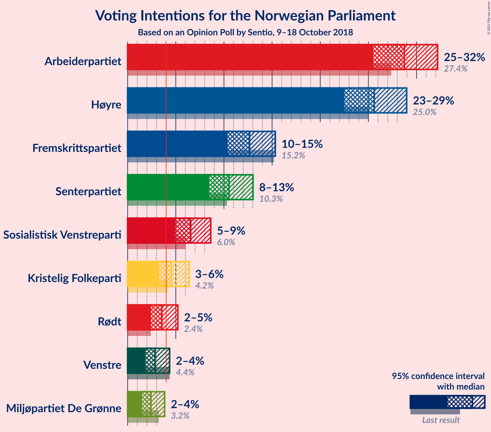

### Confidence Intervals

| Party | Last Result | Poll Result | 80% Confidence Interval | 90% Confidence Interval | 95% Confidence Interval | 99% Confidence Interval |
|:-----:|:-----------:|:-----------:|:-----------------------:|:-----------------------:|:-----------------------:|:-----------------------:|
| Arbeiderpartiet | 27.4% | 28.7% | 26.6–31.0% |26.0–31.6% |25.5–32.2% |24.5–33.3% |
| Høyre | 25.0% | 25.6% | 23.6–27.8% |23.0–28.4% |22.5–29.0% |21.6–30.0% |
| Fremskrittspartiet | 15.2% | 12.7% | 11.2–14.4% |10.8–14.9% |10.4–15.3% |9.7–16.2% |
| Senterpartiet | 10.3% | 10.5% | 9.2–12.2% |8.8–12.6% |8.5–13.0% |7.8–13.8% |
| Sosialistisk Venstreparti | 6.0% | 6.5% | 5.5–7.9% |5.2–8.3% |4.9–8.6% |4.5–9.3% |
| Kristelig Folkeparti | 4.2% | 4.6% | 3.7–5.7% |3.4–6.1% |3.2–6.4% |2.9–7.0% |
| Rødt | 2.4% | 3.6% | 2.8–4.6% |2.6–4.9% |2.4–5.2% |2.1–5.8% |
| Venstre | 4.4% | 2.8% | 2.2–3.8% |2.0–4.1% |1.8–4.4% |1.6–4.9% |
| Miljøpartiet De Grønne | 3.2% | 2.4% | 1.8–3.3% |1.6–3.6% |1.5–3.8% |1.3–4.3% |

*Note:* The poll result column reflects the actual value used in the calculations. Published results may vary slightly, and in addition be rounded to fewer digits.

## Seats

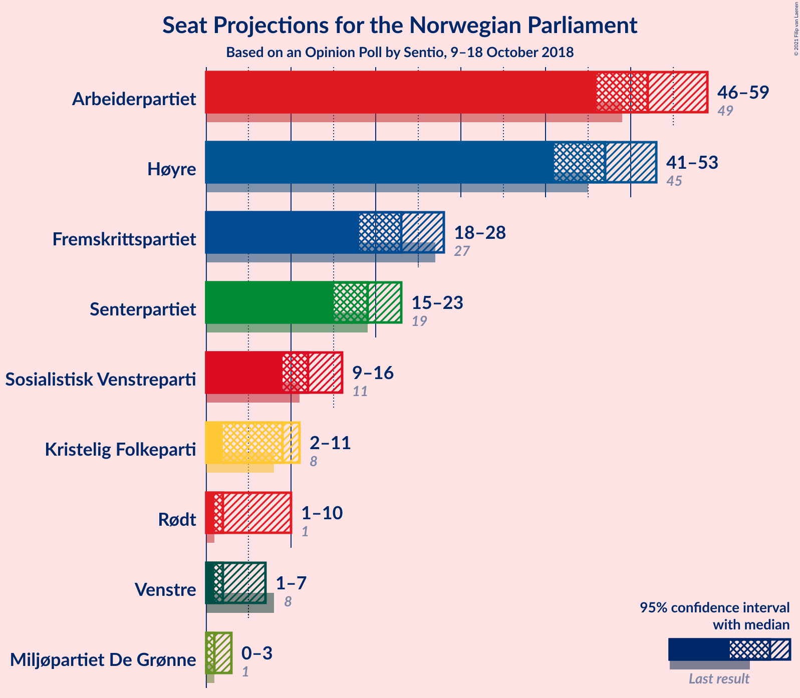

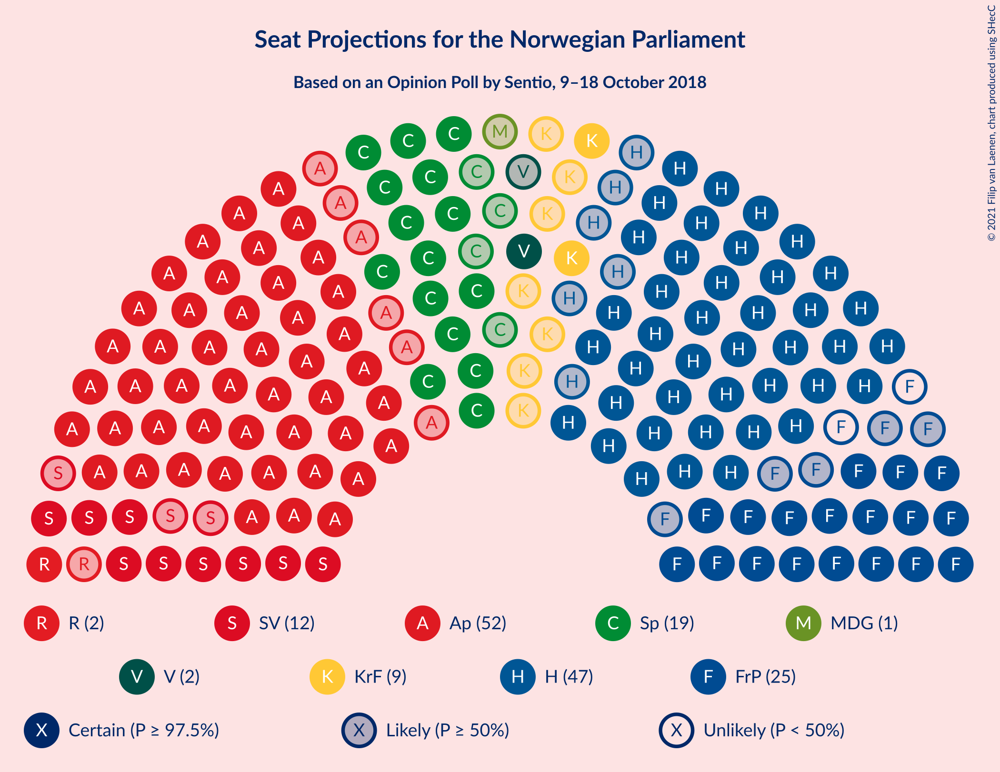

### Confidence Intervals

| Party | Last Result | Median | 80% Confidence Interval | 90% Confidence Interval | 95% Confidence Interval | 99% Confidence Interval |
|:-----:|:-----------:|:------:|:-----------------------:|:-----------------------:|:-----------------------:|:-----------------------:|
| <a href="#arbeiderpartiet">Arbeiderpartiet</a> | 49 | 52 | 48–57 |47–59 |46–59 |45–62 |
| <a href="#høyre">Høyre</a> | 45 | 47 | 42–51 |41–52 |41–53 |40–55 |
| <a href="#fremskrittspartiet">Fremskrittspartiet</a> | 27 | 23 | 20–27 |19–27 |18–28 |17–30 |
| <a href="#senterpartiet">Senterpartiet</a> | 19 | 19 | 17–22 |16–23 |15–23 |15–25 |
| <a href="#sosialistisk-venstreparti">Sosialistisk Venstreparti</a> | 11 | 12 | 10–14 |10–16 |9–16 |8–16 |
| <a href="#kristelig-folkeparti">Kristelig Folkeparti</a> | 8 | 9 | 2–10 |2–10 |2–11 |1–13 |
| <a href="#rødt">Rødt</a> | 1 | 2 | 1–8 |1–10 |1–10 |1–10 |
| <a href="#venstre">Venstre</a> | 8 | 2 | 1–2 |1–2 |1–7 |0–9 |
| <a href="#miljøpartiet-de-grønne">Miljøpartiet De Grønne</a> | 1 | 1 | 0–2 |0–2 |0–3 |0–7 |

### Arbeiderpartiet

*For a full overview of the results for this party, see the [Arbeiderpartiet](party-arbeiderpartiet.html) page.*

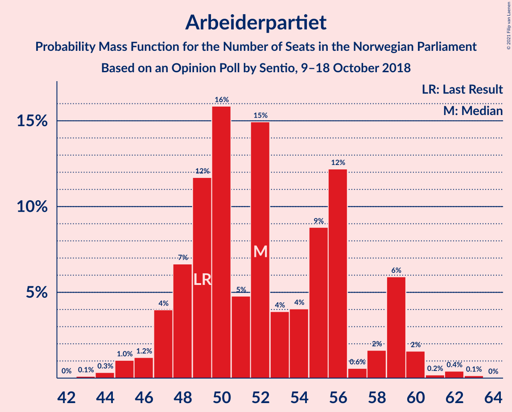

| Number of Seats | Probability | Accumulated | Special Marks |
|:---------------:|:-----------:|:-----------:|:-------------:|
| 42 | 0% | 100% |  |
| 43 | 0.1% | 99.9% |  |
| 44 | 0.3% | 99.8% |  |
| 45 | 1.0% | 99.5% |  |
| 46 | 1.2% | 98% |  |
| 47 | 4% | 97% |  |
| 48 | 7% | 93% |  |
| 49 | 12% | 87% | Last Result |
| 50 | 16% | 75% |  |
| 51 | 5% | 59% |  |
| 52 | 15% | 54% | Median |
| 53 | 4% | 39% |  |
| 54 | 4% | 35% |  |
| 55 | 9% | 31% |  |
| 56 | 12% | 23% |  |
| 57 | 0.6% | 10% |  |
| 58 | 2% | 10% |  |
| 59 | 6% | 8% |  |
| 60 | 2% | 2% |  |
| 61 | 0.2% | 0.8% |  |
| 62 | 0.4% | 0.6% |  |
| 63 | 0.1% | 0.2% |  |
| 64 | 0% | 0% |  |

### Høyre

*For a full overview of the results for this party, see the [Høyre](party-høyre.html) page.*

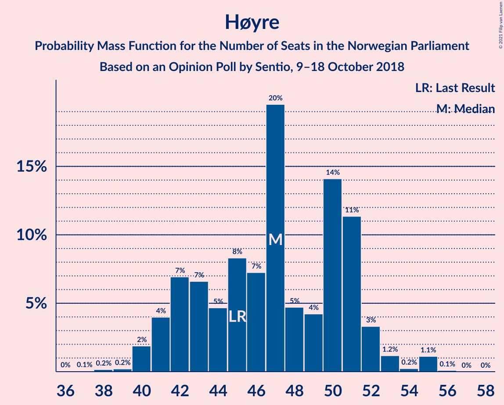

| Number of Seats | Probability | Accumulated | Special Marks |
|:---------------:|:-----------:|:-----------:|:-------------:|
| 37 | 0.1% | 100% |  |
| 38 | 0.2% | 99.9% |  |
| 39 | 0.2% | 99.7% |  |
| 40 | 2% | 99.5% |  |
| 41 | 4% | 98% |  |
| 42 | 7% | 94% |  |
| 43 | 7% | 87% |  |
| 44 | 5% | 80% |  |
| 45 | 8% | 75% | Last Result |
| 46 | 7% | 67% |  |
| 47 | 20% | 60% | Median |
| 48 | 5% | 40% |  |
| 49 | 4% | 36% |  |
| 50 | 14% | 31% |  |
| 51 | 11% | 17% |  |
| 52 | 3% | 6% |  |
| 53 | 1.2% | 3% |  |
| 54 | 0.2% | 1.5% |  |
| 55 | 1.1% | 1.3% |  |
| 56 | 0.1% | 0.1% |  |
| 57 | 0% | 0% |  |

### Fremskrittspartiet

*For a full overview of the results for this party, see the [Fremskrittspartiet](party-fremskrittspartiet.html) page.*

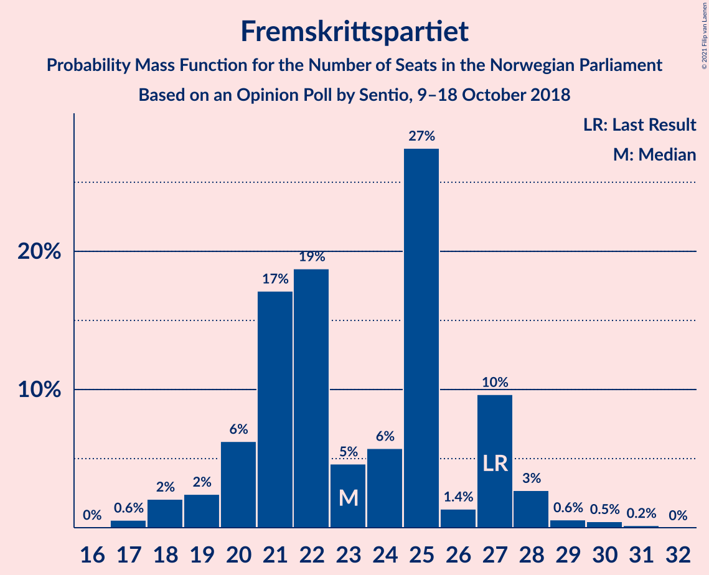

| Number of Seats | Probability | Accumulated | Special Marks |
|:---------------:|:-----------:|:-----------:|:-------------:|
| 16 | 0% | 100% |  |
| 17 | 0.6% | 99.9% |  |
| 18 | 2% | 99.4% |  |
| 19 | 2% | 97% |  |
| 20 | 6% | 95% |  |
| 21 | 17% | 89% |  |
| 22 | 19% | 72% |  |
| 23 | 5% | 53% | Median |
| 24 | 6% | 48% |  |
| 25 | 27% | 42% |  |
| 26 | 1.4% | 15% |  |
| 27 | 10% | 14% | Last Result |
| 28 | 3% | 4% |  |
| 29 | 0.6% | 1.2% |  |
| 30 | 0.5% | 0.6% |  |
| 31 | 0.2% | 0.2% |  |
| 32 | 0% | 0% |  |

### Senterpartiet

*For a full overview of the results for this party, see the [Senterpartiet](party-senterpartiet.html) page.*

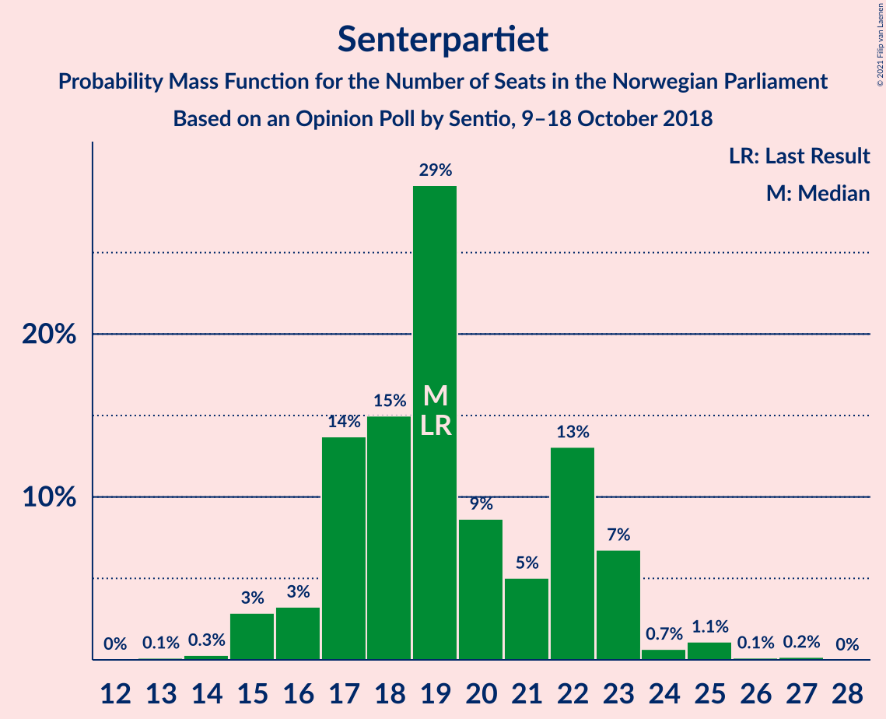

| Number of Seats | Probability | Accumulated | Special Marks |
|:---------------:|:-----------:|:-----------:|:-------------:|
| 12 | 0% | 100% |  |
| 13 | 0.1% | 99.9% |  |
| 14 | 0.3% | 99.8% |  |
| 15 | 3% | 99.5% |  |
| 16 | 3% | 97% |  |
| 17 | 14% | 93% |  |
| 18 | 15% | 80% |  |
| 19 | 29% | 65% | Last Result, Median |
| 20 | 9% | 36% |  |
| 21 | 5% | 27% |  |
| 22 | 13% | 22% |  |
| 23 | 7% | 9% |  |
| 24 | 0.7% | 2% |  |
| 25 | 1.1% | 1.4% |  |
| 26 | 0.1% | 0.3% |  |
| 27 | 0.2% | 0.2% |  |
| 28 | 0% | 0% |  |

### Sosialistisk Venstreparti

*For a full overview of the results for this party, see the [Sosialistisk Venstreparti](party-sosialistiskvenstreparti.html) page.*

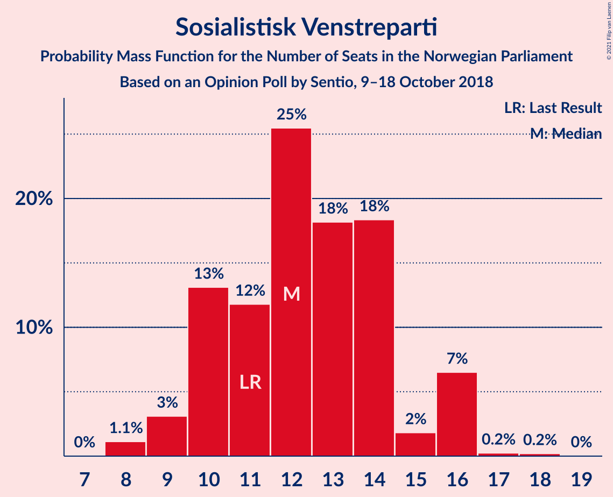

| Number of Seats | Probability | Accumulated | Special Marks |
|:---------------:|:-----------:|:-----------:|:-------------:|
| 7 | 0% | 100% |  |
| 8 | 1.1% | 99.9% |  |
| 9 | 3% | 98.8% |  |
| 10 | 13% | 96% |  |
| 11 | 12% | 83% | Last Result |
| 12 | 25% | 71% | Median |
| 13 | 18% | 45% |  |
| 14 | 18% | 27% |  |
| 15 | 2% | 9% |  |
| 16 | 7% | 7% |  |
| 17 | 0.2% | 0.5% |  |
| 18 | 0.2% | 0.2% |  |
| 19 | 0% | 0% |  |

### Kristelig Folkeparti

*For a full overview of the results for this party, see the [Kristelig Folkeparti](party-kristeligfolkeparti.html) page.*

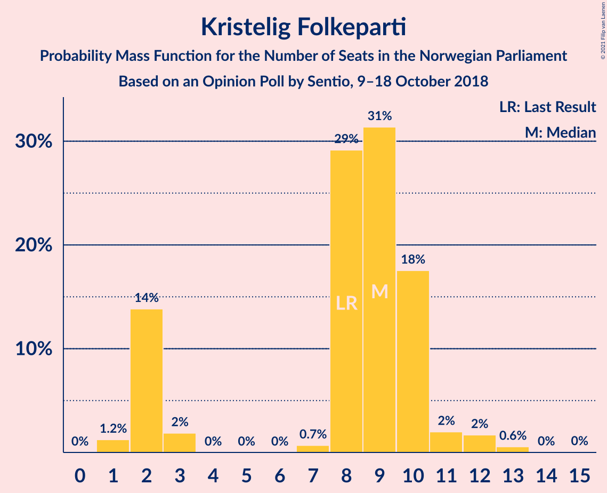

| Number of Seats | Probability | Accumulated | Special Marks |
|:---------------:|:-----------:|:-----------:|:-------------:|
| 1 | 1.2% | 100% |  |
| 2 | 14% | 98.8% |  |
| 3 | 2% | 85% |  |
| 4 | 0% | 83% |  |
| 5 | 0% | 83% |  |
| 6 | 0% | 83% |  |
| 7 | 0.7% | 83% |  |
| 8 | 29% | 82% | Last Result |
| 9 | 31% | 53% | Median |
| 10 | 18% | 22% |  |
| 11 | 2% | 4% |  |
| 12 | 2% | 2% |  |
| 13 | 0.6% | 0.6% |  |
| 14 | 0% | 0.1% |  |
| 15 | 0% | 0% |  |

### Rødt

*For a full overview of the results for this party, see the [Rødt](party-rødt.html) page.*

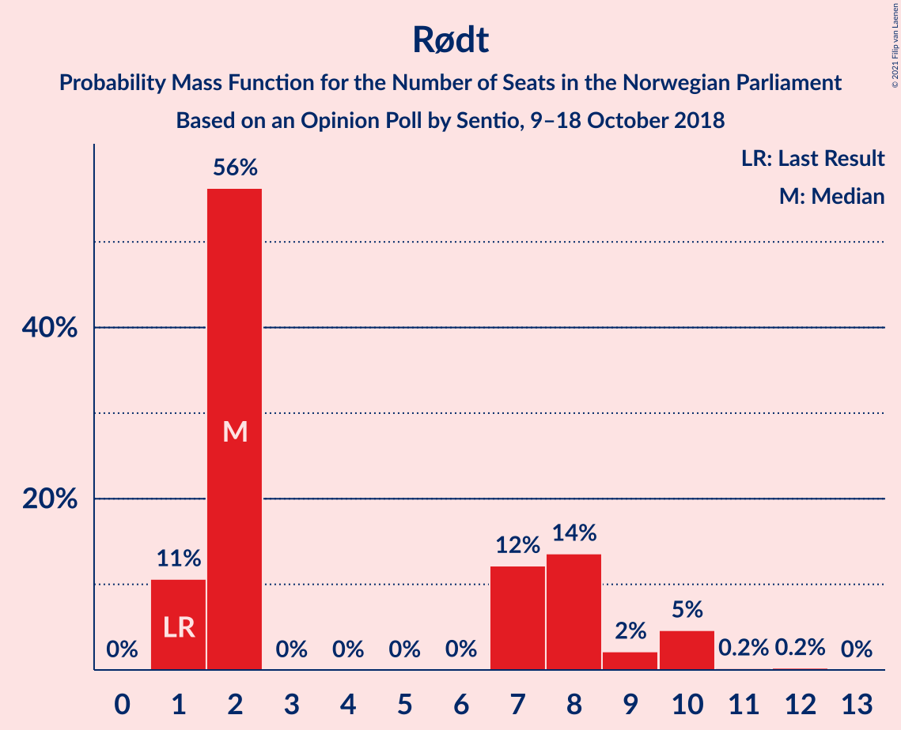

| Number of Seats | Probability | Accumulated | Special Marks |
|:---------------:|:-----------:|:-----------:|:-------------:|
| 1 | 11% | 100% | Last Result |
| 2 | 56% | 89% | Median |
| 3 | 0% | 33% |  |
| 4 | 0% | 33% |  |
| 5 | 0% | 33% |  |
| 6 | 0% | 33% |  |
| 7 | 12% | 33% |  |
| 8 | 14% | 21% |  |
| 9 | 2% | 7% |  |
| 10 | 5% | 5% |  |
| 11 | 0.2% | 0.5% |  |
| 12 | 0.2% | 0.3% |  |
| 13 | 0% | 0% |  |

### Venstre

*For a full overview of the results for this party, see the [Venstre](party-venstre.html) page.*

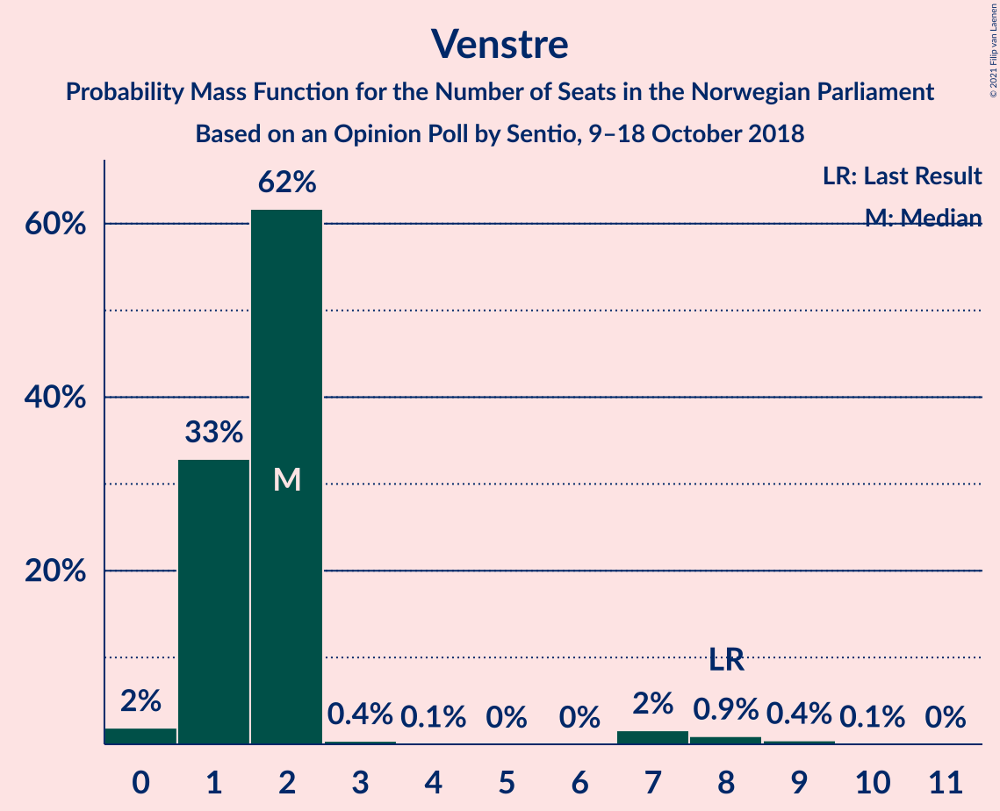

| Number of Seats | Probability | Accumulated | Special Marks |
|:---------------:|:-----------:|:-----------:|:-------------:|
| 0 | 2% | 100% |  |
| 1 | 33% | 98% |  |
| 2 | 62% | 65% | Median |
| 3 | 0.4% | 4% |  |
| 4 | 0.1% | 3% |  |
| 5 | 0% | 3% |  |
| 6 | 0% | 3% |  |
| 7 | 2% | 3% |  |
| 8 | 0.9% | 1.5% | Last Result |
| 9 | 0.4% | 0.5% |  |
| 10 | 0.1% | 0.1% |  |
| 11 | 0% | 0% |  |

### Miljøpartiet De Grønne

*For a full overview of the results for this party, see the [Miljøpartiet De Grønne](party-miljøpartietdegrønne.html) page.*

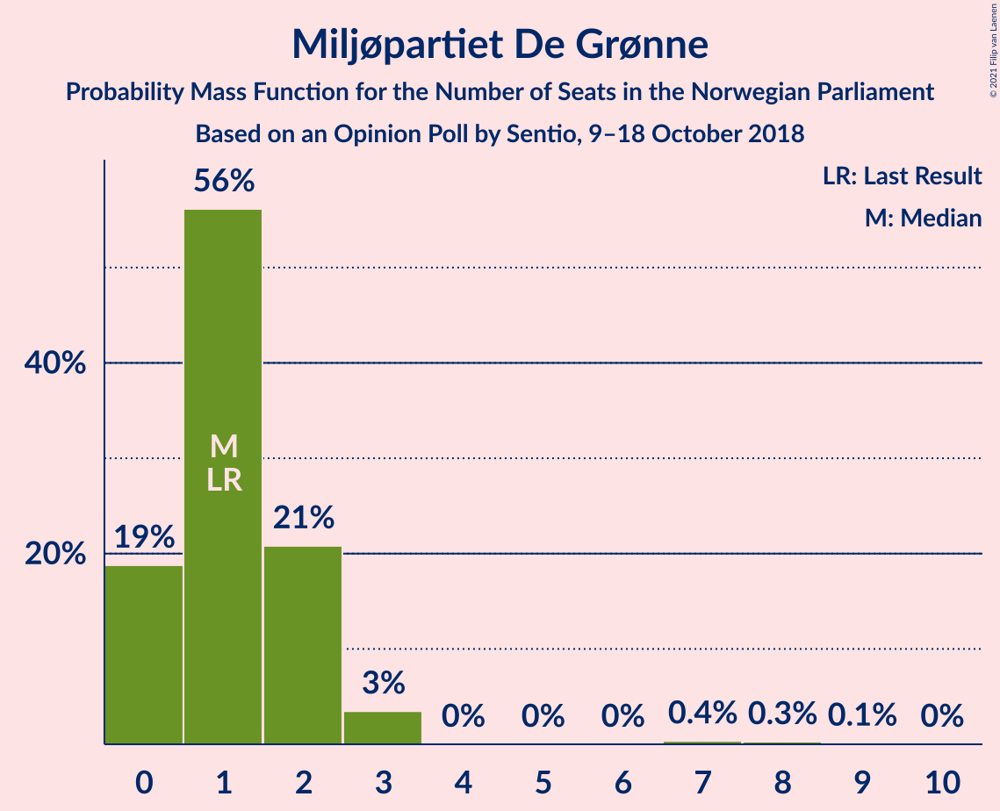

| Number of Seats | Probability | Accumulated | Special Marks |
|:---------------:|:-----------:|:-----------:|:-------------:|
| 0 | 19% | 100% |  |
| 1 | 56% | 81% | Last Result, Median |
| 2 | 21% | 25% |  |
| 3 | 3% | 4% |  |
| 4 | 0% | 0.8% |  |
| 5 | 0% | 0.8% |  |
| 6 | 0% | 0.8% |  |
| 7 | 0.4% | 0.8% |  |
| 8 | 0.3% | 0.4% |  |
| 9 | 0.1% | 0.1% |  |
| 10 | 0% | 0% |  |

## Coalitions

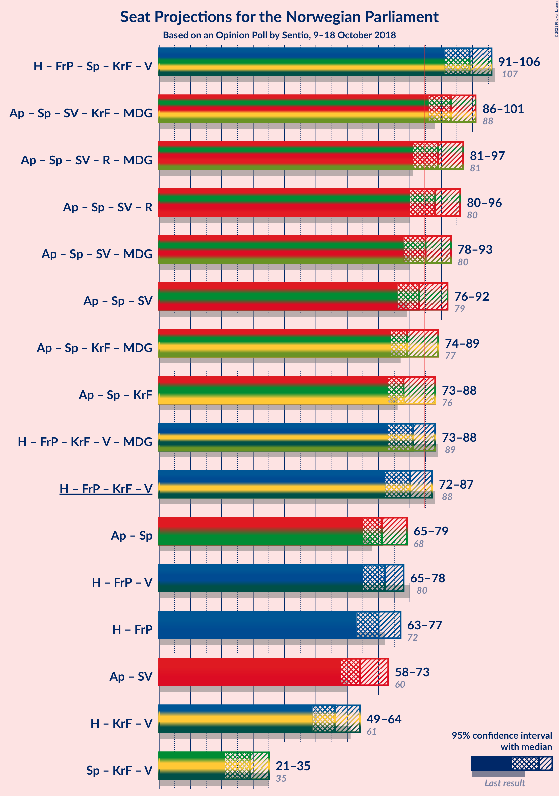

### Confidence Intervals

| Coalition | Last Result | Median | Majority? | 80% Confidence Interval | 90% Confidence Interval | 95% Confidence Interval | 99% Confidence Interval |
|:---------:|:-----------:|:------:|:---------:|:-----------------------:|:-----------------------:|:-----------------------:|:-----------------------:|
| Høyre – Fremskrittspartiet – Senterpartiet – Kristelig Folkeparti – Venstre | 107 | 99 | 100% | 93–106 | 92–106 | 91–106 | 89–108 |
| Arbeiderpartiet – Senterpartiet – Sosialistisk Venstreparti – Kristelig Folkeparti – Miljøpartiet De Grønne | 88 | 93 | 98% | 88–99 | 88–101 | 86–101 | 83–102 |
| Arbeiderpartiet – Senterpartiet – Sosialistisk Venstreparti – Rødt – Miljøpartiet De Grønne | 81 | 89 | 81% | 82–94 | 82–95 | 81–97 | 78–101 |
| Arbeiderpartiet – Senterpartiet – Sosialistisk Venstreparti – Rødt | 80 | 88 | 74% | 81–93 | 81–94 | 80–96 | 77–100 |
| Arbeiderpartiet – Senterpartiet – Sosialistisk Venstreparti – Miljøpartiet De Grønne | 80 | 85 | 51% | 80–91 | 79–92 | 78–93 | 76–95 |
| Arbeiderpartiet – Senterpartiet – Sosialistisk Venstreparti | 79 | 83 | 45% | 79–91 | 78–91 | 76–92 | 75–94 |
| Arbeiderpartiet – Senterpartiet – Kristelig Folkeparti – Miljøpartiet De Grønne | 77 | 79 | 21% | 75–87 | 74–89 | 74–89 | 71–91 |
| Arbeiderpartiet – Senterpartiet – Kristelig Folkeparti | 76 | 78 | 12% | 74–86 | 74–88 | 73–88 | 70–90 |
| Høyre – Fremskrittspartiet – Kristelig Folkeparti – Venstre – Miljøpartiet De Grønne | 89 | 81 | 25% | 76–88 | 75–88 | 73–88 | 68–91 |
| Høyre – Fremskrittspartiet – Kristelig Folkeparti – Venstre | 88 | 80 | 18% | 75–87 | 74–87 | 72–87 | 68–90 |
| Arbeiderpartiet – Senterpartiet | 68 | 71 | 0% | 66–78 | 66–78 | 65–79 | 62–82 |
| Høyre – Fremskrittspartiet – Venstre | 80 | 72 | 0% | 66–78 | 66–78 | 65–78 | 63–81 |
| Høyre – Fremskrittspartiet | 72 | 70 | 0% | 64–76 | 64–77 | 63–77 | 61–79 |
| Arbeiderpartiet – Sosialistisk Venstreparti | 60 | 64 | 0% | 60–71 | 60–72 | 58–73 | 56–74 |
| Høyre – Kristelig Folkeparti – Venstre | 61 | 56 | 0% | 51–62 | 50–62 | 49–64 | 46–66 |
| Senterpartiet – Kristelig Folkeparti – Venstre | 35 | 29 | 0% | 23–33 | 23–35 | 21–35 | 20–38 |

### Høyre – Fremskrittspartiet – Senterpartiet – Kristelig Folkeparti – Venstre

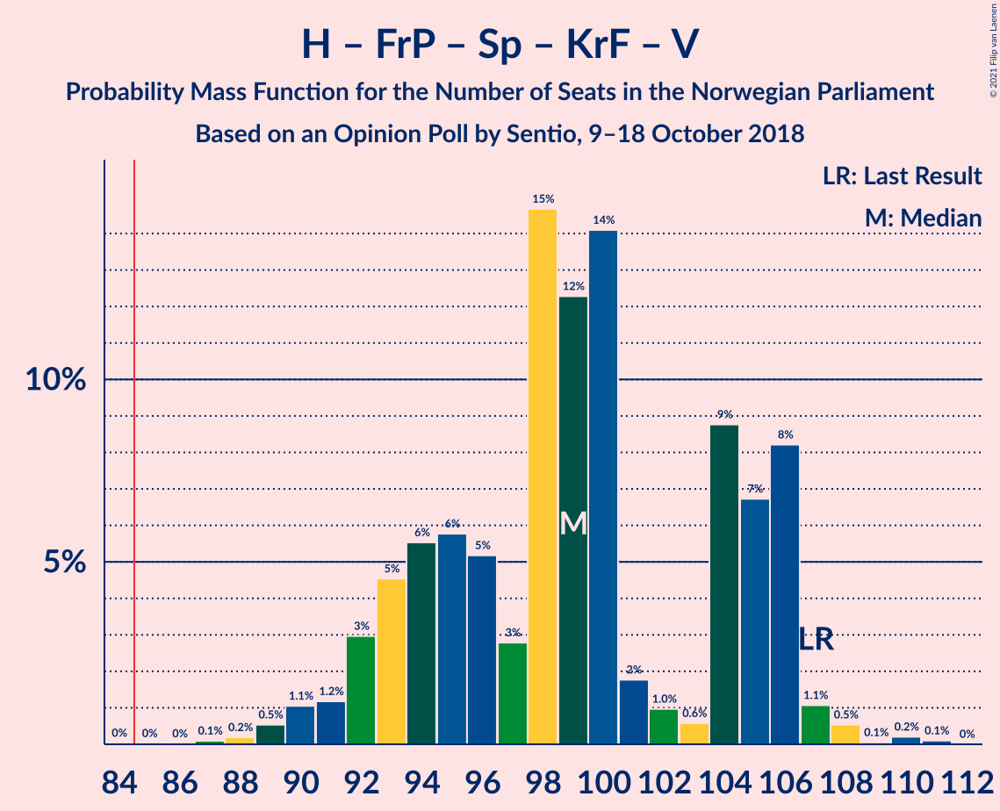

| Number of Seats | Probability | Accumulated | Special Marks |
|:---------------:|:-----------:|:-----------:|:-------------:|
| 85 | 0% | 100% | Majority |
| 86 | 0% | 99.9% |  |
| 87 | 0.1% | 99.9% |  |
| 88 | 0.2% | 99.8% |  |
| 89 | 0.5% | 99.6% |  |
| 90 | 1.1% | 99.1% |  |
| 91 | 1.2% | 98% |  |
| 92 | 3% | 97% |  |
| 93 | 5% | 94% |  |
| 94 | 6% | 89% |  |
| 95 | 6% | 84% |  |
| 96 | 5% | 78% |  |
| 97 | 3% | 73% |  |
| 98 | 15% | 70% |  |
| 99 | 12% | 55% |  |
| 100 | 14% | 43% | Median |
| 101 | 2% | 29% |  |
| 102 | 1.0% | 27% |  |
| 103 | 0.6% | 26% |  |
| 104 | 9% | 26% |  |
| 105 | 7% | 17% |  |
| 106 | 8% | 10% |  |
| 107 | 1.1% | 2% | Last Result |
| 108 | 0.5% | 0.9% |  |
| 109 | 0.1% | 0.4% |  |
| 110 | 0.2% | 0.3% |  |
| 111 | 0.1% | 0.1% |  |
| 112 | 0% | 0% |  |

### Arbeiderpartiet – Senterpartiet – Sosialistisk Venstreparti – Kristelig Folkeparti – Miljøpartiet De Grønne

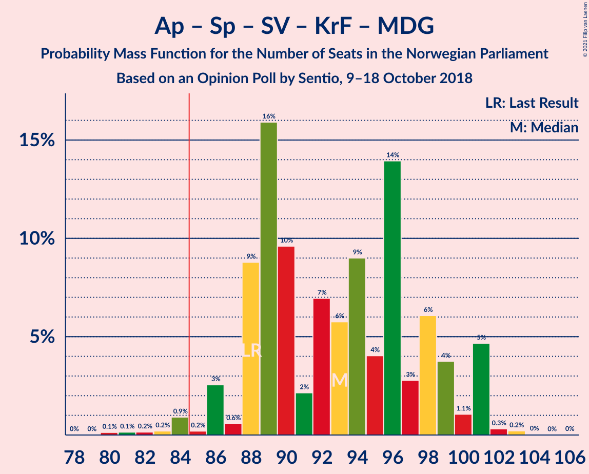

| Number of Seats | Probability | Accumulated | Special Marks |
|:---------------:|:-----------:|:-----------:|:-------------:|
| 80 | 0.1% | 100% |  |
| 81 | 0.1% | 99.8% |  |
| 82 | 0.2% | 99.7% |  |
| 83 | 0.2% | 99.5% |  |
| 84 | 0.9% | 99.3% |  |
| 85 | 0.2% | 98% | Majority |
| 86 | 3% | 98% |  |
| 87 | 0.6% | 96% |  |
| 88 | 9% | 95% | Last Result |
| 89 | 16% | 86% |  |
| 90 | 10% | 70% |  |
| 91 | 2% | 61% |  |
| 92 | 7% | 59% |  |
| 93 | 6% | 52% | Median |
| 94 | 9% | 46% |  |
| 95 | 4% | 37% |  |
| 96 | 14% | 33% |  |
| 97 | 3% | 19% |  |
| 98 | 6% | 16% |  |
| 99 | 4% | 10% |  |
| 100 | 1.1% | 6% |  |
| 101 | 5% | 5% |  |
| 102 | 0.3% | 0.6% |  |
| 103 | 0.2% | 0.3% |  |
| 104 | 0% | 0.1% |  |
| 105 | 0% | 0% |  |

### Arbeiderpartiet – Senterpartiet – Sosialistisk Venstreparti – Rødt – Miljøpartiet De Grønne

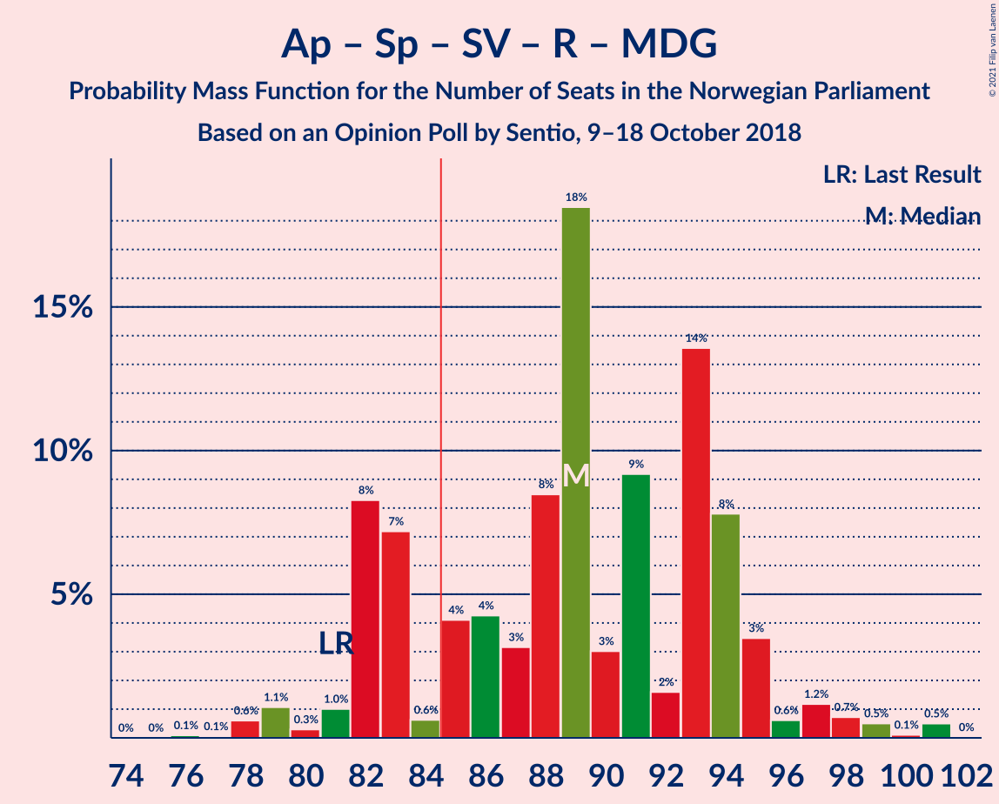

| Number of Seats | Probability | Accumulated | Special Marks |
|:---------------:|:-----------:|:-----------:|:-------------:|
| 76 | 0.1% | 100% |  |
| 77 | 0.1% | 99.9% |  |
| 78 | 0.6% | 99.8% |  |
| 79 | 1.1% | 99.2% |  |
| 80 | 0.3% | 98% |  |
| 81 | 1.0% | 98% | Last Result |
| 82 | 8% | 97% |  |
| 83 | 7% | 89% |  |
| 84 | 0.6% | 81% |  |
| 85 | 4% | 81% | Majority |
| 86 | 4% | 77% | Median |
| 87 | 3% | 72% |  |
| 88 | 8% | 69% |  |
| 89 | 18% | 61% |  |
| 90 | 3% | 42% |  |
| 91 | 9% | 39% |  |
| 92 | 2% | 30% |  |
| 93 | 14% | 29% |  |
| 94 | 8% | 15% |  |
| 95 | 3% | 7% |  |
| 96 | 0.6% | 4% |  |
| 97 | 1.2% | 3% |  |
| 98 | 0.7% | 2% |  |
| 99 | 0.5% | 1.1% |  |
| 100 | 0.1% | 0.6% |  |
| 101 | 0.5% | 0.5% |  |
| 102 | 0% | 0% |  |

### Arbeiderpartiet – Senterpartiet – Sosialistisk Venstreparti – Rødt

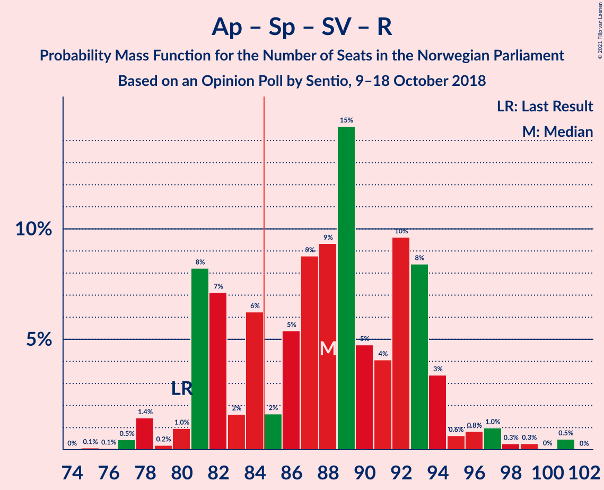

| Number of Seats | Probability | Accumulated | Special Marks |
|:---------------:|:-----------:|:-----------:|:-------------:|
| 75 | 0.1% | 100% |  |
| 76 | 0.1% | 99.9% |  |
| 77 | 0.5% | 99.8% |  |
| 78 | 1.4% | 99.4% |  |
| 79 | 0.2% | 98% |  |
| 80 | 1.0% | 98% | Last Result |
| 81 | 8% | 97% |  |
| 82 | 7% | 89% |  |
| 83 | 2% | 81% |  |
| 84 | 6% | 80% |  |
| 85 | 2% | 74% | Median, Majority |
| 86 | 5% | 72% |  |
| 87 | 9% | 67% |  |
| 88 | 9% | 58% |  |
| 89 | 15% | 48% |  |
| 90 | 5% | 34% |  |
| 91 | 4% | 29% |  |
| 92 | 10% | 25% |  |
| 93 | 8% | 15% |  |
| 94 | 3% | 7% |  |
| 95 | 0.6% | 4% |  |
| 96 | 0.8% | 3% |  |
| 97 | 1.0% | 2% |  |
| 98 | 0.3% | 1.1% |  |
| 99 | 0.3% | 0.8% |  |
| 100 | 0% | 0.5% |  |
| 101 | 0.5% | 0.5% |  |
| 102 | 0% | 0% |  |

### Arbeiderpartiet – Senterpartiet – Sosialistisk Venstreparti – Miljøpartiet De Grønne

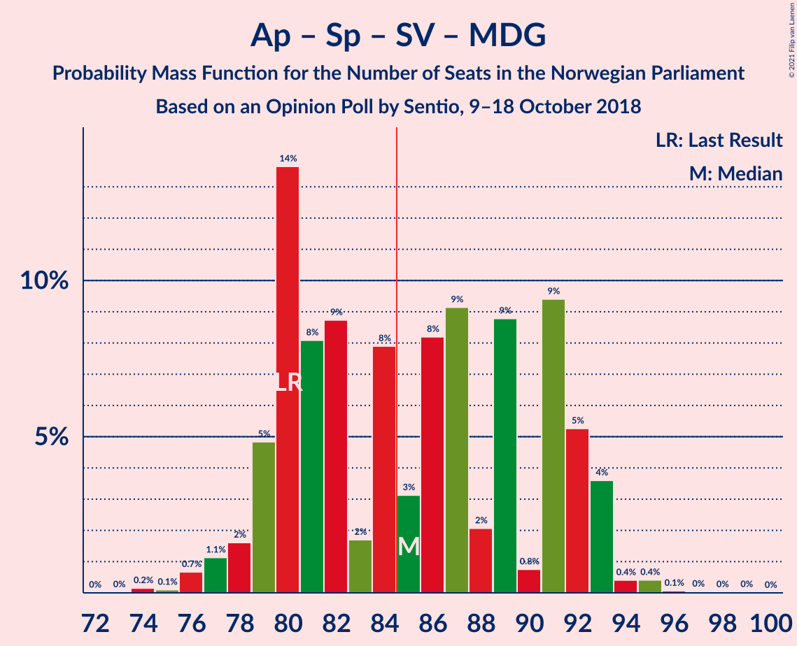

| Number of Seats | Probability | Accumulated | Special Marks |
|:---------------:|:-----------:|:-----------:|:-------------:|
| 73 | 0% | 100% |  |
| 74 | 0.2% | 99.9% |  |
| 75 | 0.1% | 99.8% |  |
| 76 | 0.7% | 99.7% |  |
| 77 | 1.1% | 99.0% |  |
| 78 | 2% | 98% |  |
| 79 | 5% | 96% |  |
| 80 | 14% | 91% | Last Result |
| 81 | 8% | 78% |  |
| 82 | 9% | 70% |  |
| 83 | 2% | 61% |  |
| 84 | 8% | 59% | Median |
| 85 | 3% | 51% | Majority |
| 86 | 8% | 48% |  |
| 87 | 9% | 40% |  |
| 88 | 2% | 31% |  |
| 89 | 9% | 29% |  |
| 90 | 0.8% | 20% |  |
| 91 | 9% | 19% |  |
| 92 | 5% | 10% |  |
| 93 | 4% | 5% |  |
| 94 | 0.4% | 1.0% |  |
| 95 | 0.4% | 0.6% |  |
| 96 | 0.1% | 0.2% |  |
| 97 | 0% | 0.1% |  |
| 98 | 0% | 0.1% |  |
| 99 | 0% | 0% |  |

### Arbeiderpartiet – Senterpartiet – Sosialistisk Venstreparti

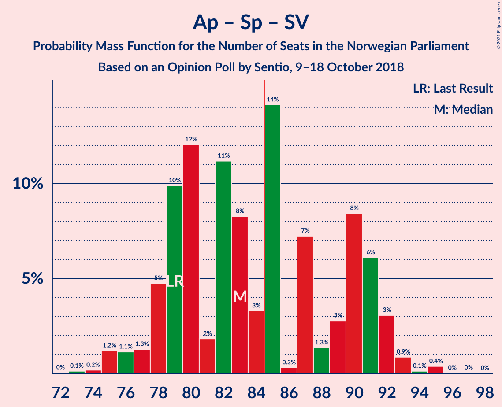

| Number of Seats | Probability | Accumulated | Special Marks |
|:---------------:|:-----------:|:-----------:|:-------------:|
| 72 | 0% | 100% |  |
| 73 | 0.1% | 99.9% |  |
| 74 | 0.2% | 99.8% |  |
| 75 | 1.2% | 99.6% |  |
| 76 | 1.1% | 98% |  |
| 77 | 1.3% | 97% |  |
| 78 | 5% | 96% |  |
| 79 | 10% | 91% | Last Result |
| 80 | 12% | 81% |  |
| 81 | 2% | 69% |  |
| 82 | 11% | 68% |  |
| 83 | 8% | 56% | Median |
| 84 | 3% | 48% |  |
| 85 | 14% | 45% | Majority |
| 86 | 0.3% | 31% |  |
| 87 | 7% | 30% |  |
| 88 | 1.3% | 23% |  |
| 89 | 3% | 22% |  |
| 90 | 8% | 19% |  |
| 91 | 6% | 11% |  |
| 92 | 3% | 4% |  |
| 93 | 0.9% | 1.4% |  |
| 94 | 0.1% | 0.6% |  |
| 95 | 0.4% | 0.4% |  |
| 96 | 0% | 0.1% |  |
| 97 | 0% | 0% |  |

### Arbeiderpartiet – Senterpartiet – Kristelig Folkeparti – Miljøpartiet De Grønne

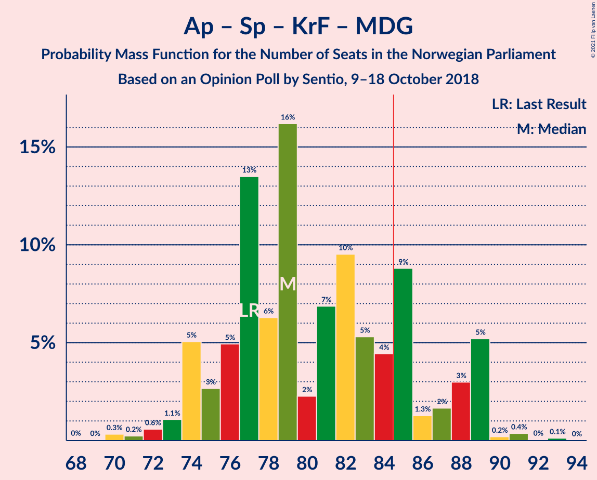

| Number of Seats | Probability | Accumulated | Special Marks |
|:---------------:|:-----------:|:-----------:|:-------------:|
| 68 | 0% | 100% |  |
| 69 | 0% | 99.9% |  |
| 70 | 0.3% | 99.9% |  |
| 71 | 0.2% | 99.6% |  |
| 72 | 0.6% | 99.3% |  |
| 73 | 1.1% | 98.7% |  |
| 74 | 5% | 98% |  |
| 75 | 3% | 93% |  |
| 76 | 5% | 90% |  |
| 77 | 13% | 85% | Last Result |
| 78 | 6% | 72% |  |
| 79 | 16% | 65% |  |
| 80 | 2% | 49% |  |
| 81 | 7% | 47% | Median |
| 82 | 10% | 40% |  |
| 83 | 5% | 30% |  |
| 84 | 4% | 25% |  |
| 85 | 9% | 21% | Majority |
| 86 | 1.3% | 12% |  |
| 87 | 2% | 11% |  |
| 88 | 3% | 9% |  |
| 89 | 5% | 6% |  |
| 90 | 0.2% | 0.8% |  |
| 91 | 0.4% | 0.6% |  |
| 92 | 0% | 0.2% |  |
| 93 | 0.1% | 0.1% |  |
| 94 | 0% | 0% |  |

### Arbeiderpartiet – Senterpartiet – Kristelig Folkeparti

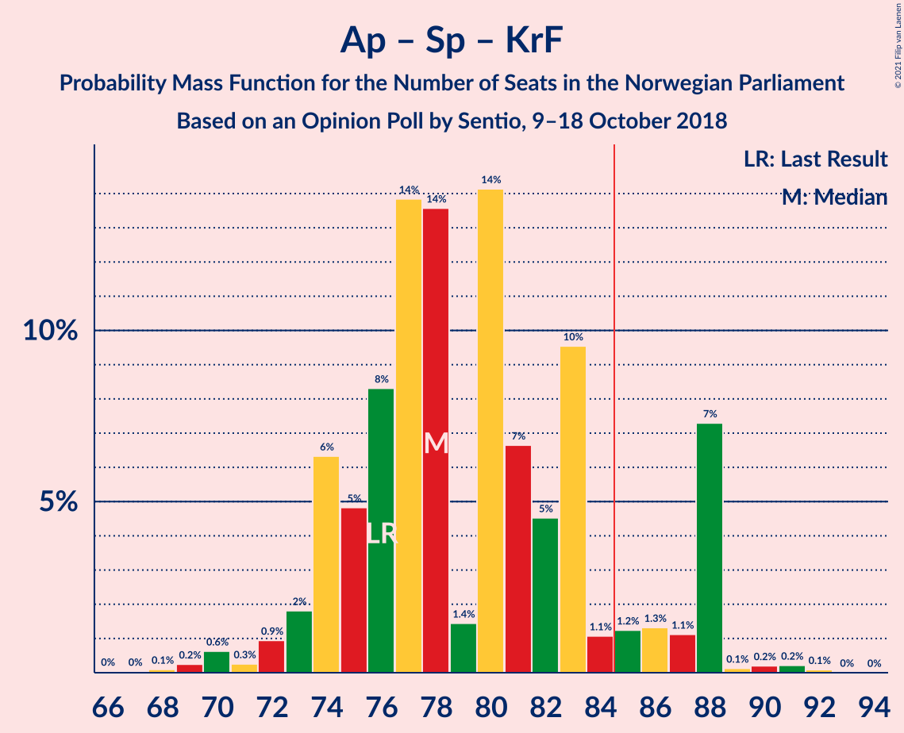

| Number of Seats | Probability | Accumulated | Special Marks |
|:---------------:|:-----------:|:-----------:|:-------------:|
| 67 | 0% | 100% |  |
| 68 | 0.1% | 99.9% |  |
| 69 | 0.2% | 99.8% |  |
| 70 | 0.6% | 99.6% |  |
| 71 | 0.3% | 98.9% |  |
| 72 | 0.9% | 98.7% |  |
| 73 | 2% | 98% |  |
| 74 | 6% | 96% |  |
| 75 | 5% | 90% |  |
| 76 | 8% | 85% | Last Result |
| 77 | 14% | 76% |  |
| 78 | 14% | 63% |  |
| 79 | 1.4% | 49% |  |
| 80 | 14% | 48% | Median |
| 81 | 7% | 33% |  |
| 82 | 5% | 27% |  |
| 83 | 10% | 22% |  |
| 84 | 1.1% | 13% |  |
| 85 | 1.2% | 12% | Majority |
| 86 | 1.3% | 10% |  |
| 87 | 1.1% | 9% |  |
| 88 | 7% | 8% |  |
| 89 | 0.1% | 0.7% |  |
| 90 | 0.2% | 0.5% |  |
| 91 | 0.2% | 0.3% |  |
| 92 | 0.1% | 0.1% |  |
| 93 | 0% | 0% |  |

### Høyre – Fremskrittspartiet – Kristelig Folkeparti – Venstre – Miljøpartiet De Grønne

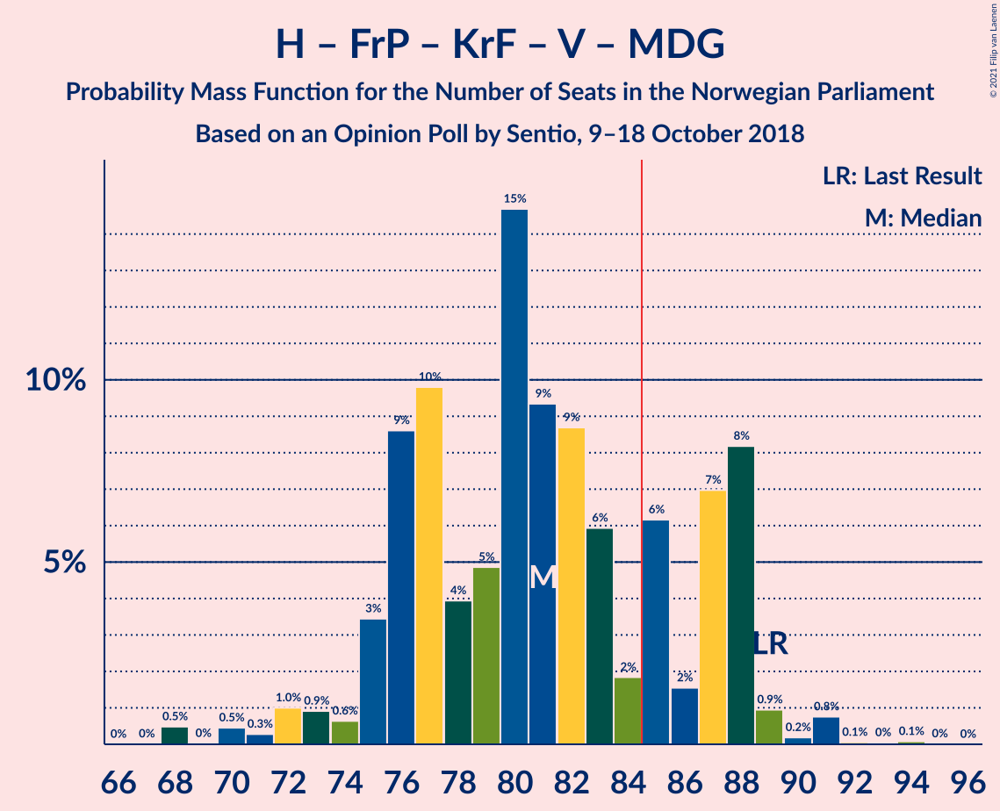

| Number of Seats | Probability | Accumulated | Special Marks |
|:---------------:|:-----------:|:-----------:|:-------------:|
| 67 | 0% | 100% |  |
| 68 | 0.5% | 99.9% |  |
| 69 | 0% | 99.5% |  |
| 70 | 0.5% | 99.4% |  |
| 71 | 0.3% | 99.0% |  |
| 72 | 1.0% | 98.7% |  |
| 73 | 0.9% | 98% |  |
| 74 | 0.6% | 97% |  |
| 75 | 3% | 96% |  |
| 76 | 9% | 93% |  |
| 77 | 10% | 84% |  |
| 78 | 4% | 74% |  |
| 79 | 5% | 70% |  |
| 80 | 15% | 65% |  |
| 81 | 9% | 51% |  |
| 82 | 9% | 41% | Median |
| 83 | 6% | 33% |  |
| 84 | 2% | 27% |  |
| 85 | 6% | 25% | Majority |
| 86 | 2% | 19% |  |
| 87 | 7% | 17% |  |
| 88 | 8% | 10% |  |
| 89 | 0.9% | 2% | Last Result |
| 90 | 0.2% | 1.1% |  |
| 91 | 0.8% | 1.0% |  |
| 92 | 0.1% | 0.2% |  |
| 93 | 0% | 0.1% |  |
| 94 | 0.1% | 0.1% |  |
| 95 | 0% | 0% |  |

### Høyre – Fremskrittspartiet – Kristelig Folkeparti – Venstre

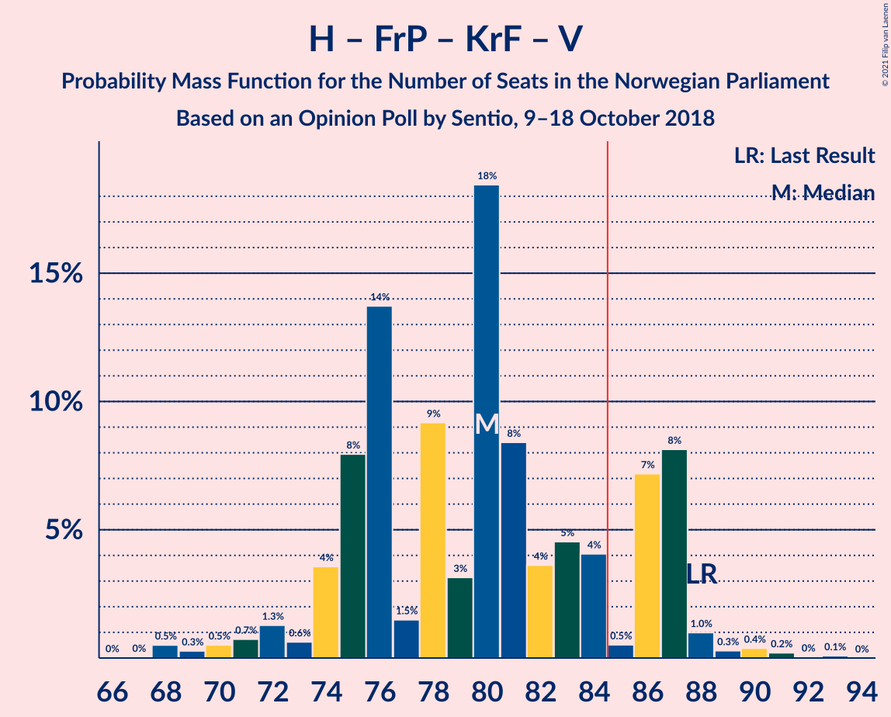

| Number of Seats | Probability | Accumulated | Special Marks |
|:---------------:|:-----------:|:-----------:|:-------------:|
| 66 | 0% | 100% |  |
| 67 | 0% | 99.9% |  |
| 68 | 0.5% | 99.9% |  |
| 69 | 0.3% | 99.4% |  |
| 70 | 0.5% | 99.1% |  |
| 71 | 0.7% | 98.6% |  |
| 72 | 1.3% | 98% |  |
| 73 | 0.6% | 97% |  |
| 74 | 4% | 96% |  |
| 75 | 8% | 92% |  |
| 76 | 14% | 84% |  |
| 77 | 1.5% | 71% |  |
| 78 | 9% | 69% |  |
| 79 | 3% | 60% |  |
| 80 | 18% | 57% |  |
| 81 | 8% | 38% | Median |
| 82 | 4% | 30% |  |
| 83 | 5% | 26% |  |
| 84 | 4% | 22% |  |
| 85 | 0.5% | 18% | Majority |
| 86 | 7% | 17% |  |
| 87 | 8% | 10% |  |
| 88 | 1.0% | 2% | Last Result |
| 89 | 0.3% | 1.0% |  |
| 90 | 0.4% | 0.7% |  |
| 91 | 0.2% | 0.3% |  |
| 92 | 0% | 0.1% |  |
| 93 | 0.1% | 0.1% |  |
| 94 | 0% | 0% |  |

### Arbeiderpartiet – Senterpartiet

| Number of Seats | Probability | Accumulated | Special Marks |
|:---------------:|:-----------:|:-----------:|:-------------:|
| 61 | 0% | 100% |  |
| 62 | 0.6% | 99.9% |  |
| 63 | 0.3% | 99.3% |  |
| 64 | 1.2% | 99.0% |  |
| 65 | 1.1% | 98% |  |
| 66 | 11% | 97% |  |
| 67 | 1.1% | 86% |  |
| 68 | 8% | 85% | Last Result |
| 69 | 17% | 77% |  |
| 70 | 3% | 60% |  |
| 71 | 11% | 57% | Median |
| 72 | 8% | 47% |  |
| 73 | 6% | 38% |  |
| 74 | 6% | 33% |  |
| 75 | 8% | 27% |  |
| 76 | 5% | 19% |  |
| 77 | 0.7% | 14% |  |
| 78 | 11% | 14% |  |
| 79 | 1.2% | 3% |  |
| 80 | 0.2% | 2% |  |
| 81 | 0.9% | 1.4% |  |
| 82 | 0.3% | 0.5% |  |
| 83 | 0.2% | 0.2% |  |
| 84 | 0% | 0.1% |  |
| 85 | 0% | 0% | Majority |

### Høyre – Fremskrittspartiet – Venstre

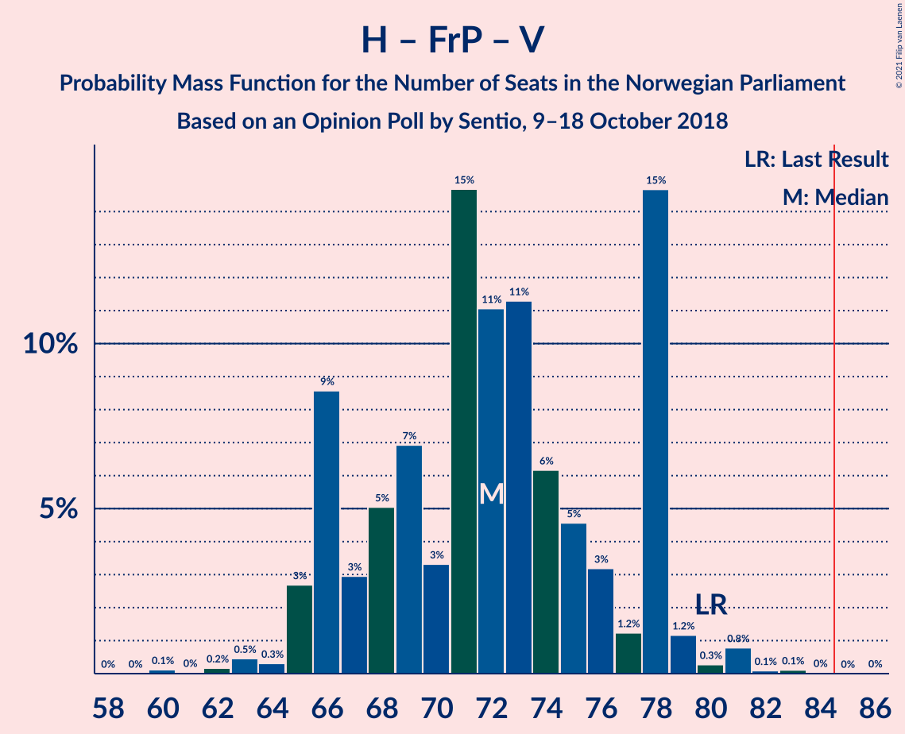

| Number of Seats | Probability | Accumulated | Special Marks |
|:---------------:|:-----------:|:-----------:|:-------------:|
| 60 | 0.1% | 100% |  |
| 61 | 0% | 99.9% |  |
| 62 | 0.2% | 99.8% |  |
| 63 | 0.5% | 99.7% |  |
| 64 | 0.3% | 99.2% |  |
| 65 | 3% | 98.9% |  |
| 66 | 9% | 96% |  |
| 67 | 3% | 88% |  |
| 68 | 5% | 85% |  |
| 69 | 7% | 80% |  |
| 70 | 3% | 73% |  |
| 71 | 15% | 69% |  |
| 72 | 11% | 55% | Median |
| 73 | 11% | 44% |  |
| 74 | 6% | 32% |  |
| 75 | 5% | 26% |  |
| 76 | 3% | 22% |  |
| 77 | 1.2% | 18% |  |
| 78 | 15% | 17% |  |
| 79 | 1.2% | 2% |  |
| 80 | 0.3% | 1.3% | Last Result |
| 81 | 0.8% | 1.1% |  |
| 82 | 0.1% | 0.3% |  |
| 83 | 0.1% | 0.2% |  |
| 84 | 0% | 0.1% |  |
| 85 | 0% | 0% | Majority |

### Høyre – Fremskrittspartiet

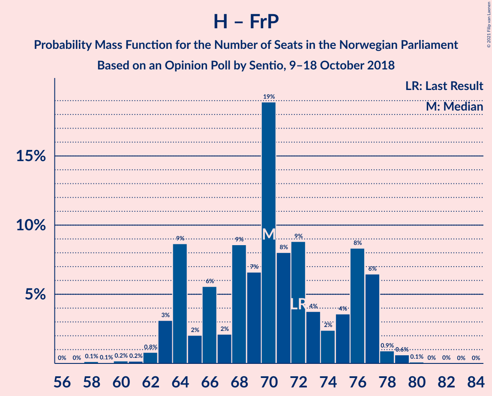

| Number of Seats | Probability | Accumulated | Special Marks |
|:---------------:|:-----------:|:-----------:|:-------------:|
| 58 | 0.1% | 100% |  |
| 59 | 0.1% | 99.8% |  |
| 60 | 0.2% | 99.8% |  |
| 61 | 0.2% | 99.6% |  |
| 62 | 0.8% | 99.4% |  |
| 63 | 3% | 98.6% |  |
| 64 | 9% | 96% |  |
| 65 | 2% | 87% |  |
| 66 | 6% | 85% |  |
| 67 | 2% | 79% |  |
| 68 | 9% | 77% |  |
| 69 | 7% | 69% |  |
| 70 | 19% | 62% | Median |
| 71 | 8% | 43% |  |
| 72 | 9% | 35% | Last Result |
| 73 | 4% | 26% |  |
| 74 | 2% | 22% |  |
| 75 | 4% | 20% |  |
| 76 | 8% | 17% |  |
| 77 | 6% | 8% |  |
| 78 | 0.9% | 2% |  |
| 79 | 0.6% | 0.8% |  |
| 80 | 0.1% | 0.2% |  |
| 81 | 0% | 0.1% |  |
| 82 | 0% | 0.1% |  |
| 83 | 0% | 0% |  |

### Arbeiderpartiet – Sosialistisk Venstreparti

| Number of Seats | Probability | Accumulated | Special Marks |
|:---------------:|:-----------:|:-----------:|:-------------:|
| 53 | 0% | 100% |  |
| 54 | 0% | 99.9% |  |
| 55 | 0.2% | 99.9% |  |
| 56 | 0.4% | 99.7% |  |
| 57 | 0.9% | 99.3% |  |
| 58 | 0.9% | 98% |  |
| 59 | 1.3% | 97% |  |
| 60 | 16% | 96% | Last Result |
| 61 | 4% | 80% |  |
| 62 | 15% | 76% |  |
| 63 | 8% | 61% |  |
| 64 | 6% | 53% | Median |
| 65 | 9% | 46% |  |
| 66 | 7% | 37% |  |
| 67 | 6% | 30% |  |
| 68 | 5% | 24% |  |
| 69 | 2% | 19% |  |
| 70 | 6% | 17% |  |
| 71 | 2% | 12% |  |
| 72 | 5% | 9% |  |
| 73 | 3% | 4% |  |
| 74 | 0.2% | 0.7% |  |
| 75 | 0.1% | 0.5% |  |
| 76 | 0.3% | 0.4% |  |
| 77 | 0.1% | 0.1% |  |
| 78 | 0% | 0% |  |

### Høyre – Kristelig Folkeparti – Venstre

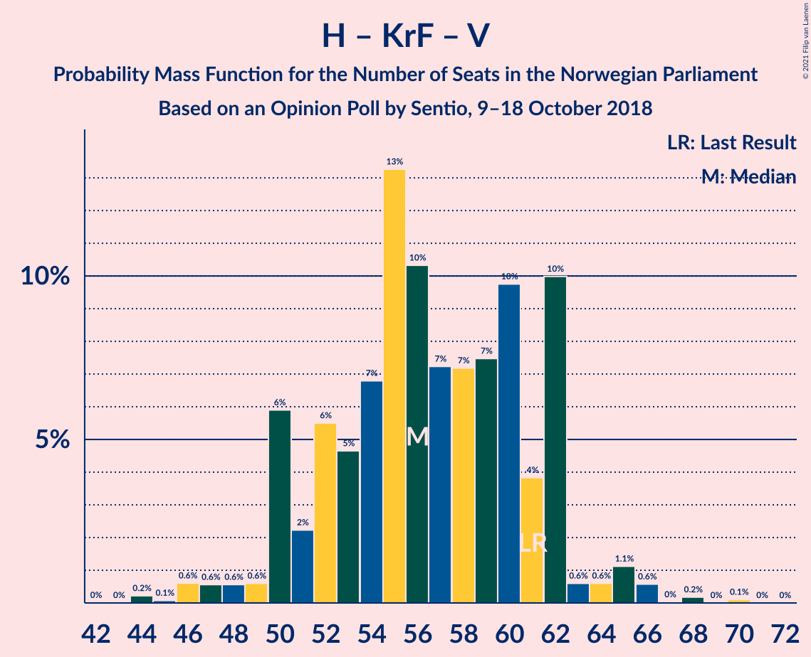

| Number of Seats | Probability | Accumulated | Special Marks |
|:---------------:|:-----------:|:-----------:|:-------------:|
| 44 | 0.2% | 100% |  |
| 45 | 0.1% | 99.8% |  |
| 46 | 0.6% | 99.7% |  |
| 47 | 0.6% | 99.1% |  |
| 48 | 0.6% | 98.5% |  |
| 49 | 0.6% | 98% |  |
| 50 | 6% | 97% |  |
| 51 | 2% | 91% |  |
| 52 | 6% | 89% |  |
| 53 | 5% | 84% |  |
| 54 | 7% | 79% |  |
| 55 | 13% | 72% |  |
| 56 | 10% | 59% |  |
| 57 | 7% | 49% |  |
| 58 | 7% | 41% | Median |
| 59 | 7% | 34% |  |
| 60 | 10% | 27% |  |
| 61 | 4% | 17% | Last Result |
| 62 | 10% | 13% |  |
| 63 | 0.6% | 3% |  |
| 64 | 0.6% | 3% |  |
| 65 | 1.1% | 2% |  |
| 66 | 0.6% | 0.9% |  |
| 67 | 0% | 0.3% |  |
| 68 | 0.2% | 0.3% |  |
| 69 | 0% | 0.1% |  |
| 70 | 0.1% | 0.1% |  |
| 71 | 0% | 0% |  |

### Senterpartiet – Kristelig Folkeparti – Venstre

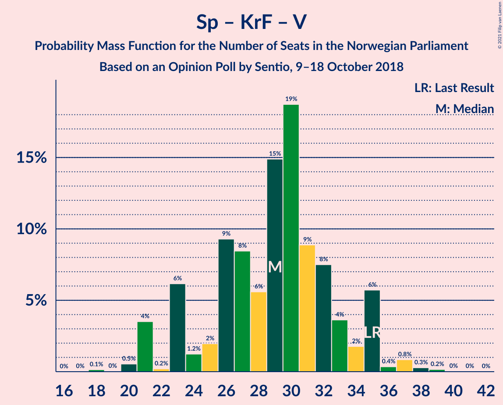

| Number of Seats | Probability | Accumulated | Special Marks |
|:---------------:|:-----------:|:-----------:|:-------------:|
| 18 | 0.1% | 100% |  |
| 19 | 0% | 99.8% |  |
| 20 | 0.5% | 99.8% |  |
| 21 | 4% | 99.3% |  |
| 22 | 0.2% | 96% |  |
| 23 | 6% | 96% |  |
| 24 | 1.2% | 89% |  |
| 25 | 2% | 88% |  |
| 26 | 9% | 86% |  |
| 27 | 8% | 77% |  |
| 28 | 6% | 68% |  |
| 29 | 15% | 63% |  |
| 30 | 19% | 48% | Median |
| 31 | 9% | 29% |  |
| 32 | 8% | 20% |  |
| 33 | 4% | 13% |  |
| 34 | 2% | 9% |  |
| 35 | 6% | 7% | Last Result |
| 36 | 0.4% | 2% |  |
| 37 | 0.8% | 1.4% |  |
| 38 | 0.3% | 0.5% |  |
| 39 | 0.2% | 0.2% |  |
| 40 | 0% | 0.1% |  |
| 41 | 0% | 0% |  |

## Technical Information

### Opinion Poll

+ **Polling firm:** Sentio
+ **Commissioner(s):** —
+ **Fieldwork period:** 9–18 October 2018

### Calculations

+ **Sample size:** 703
+ **Simulations done:** 131,072
+ **Error estimate:** 1.27%

