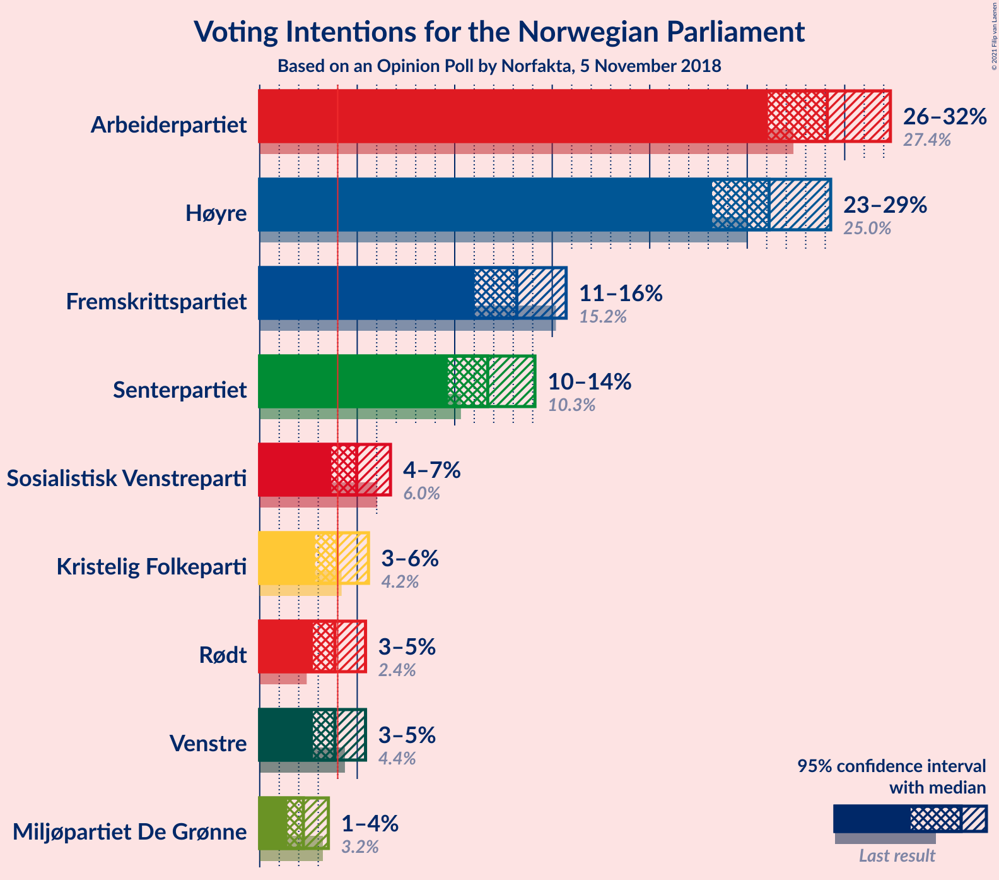
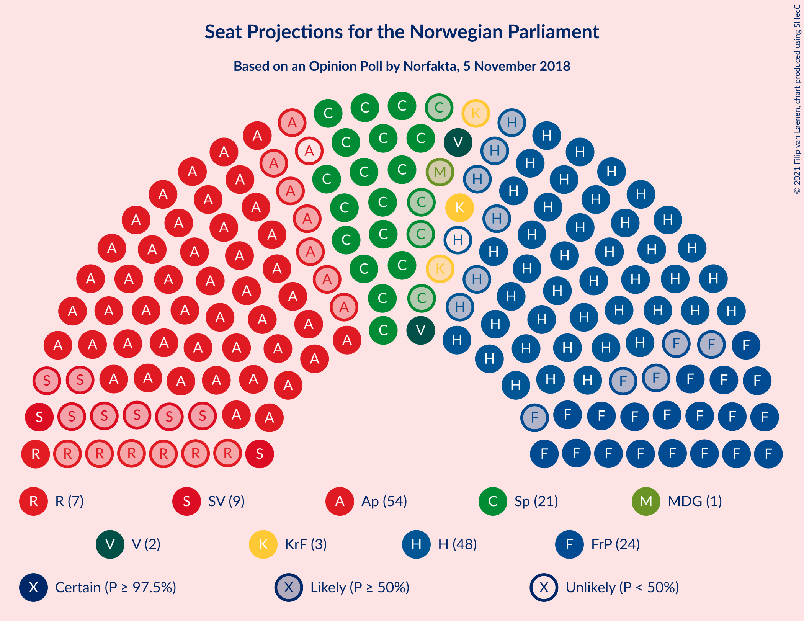
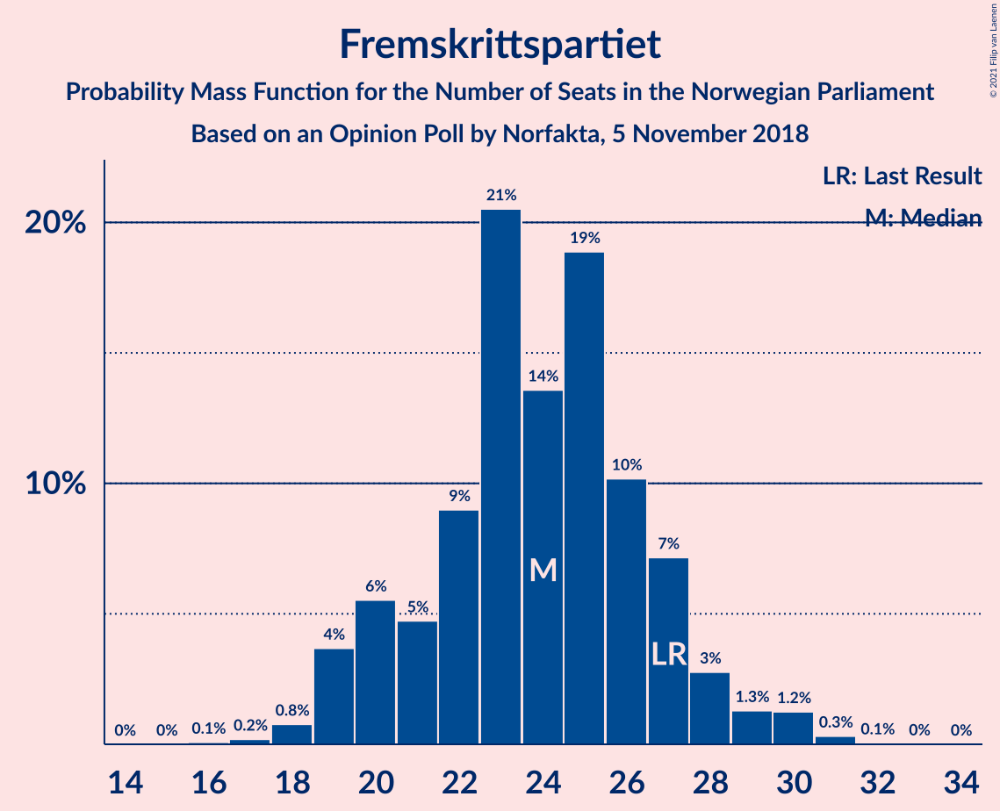
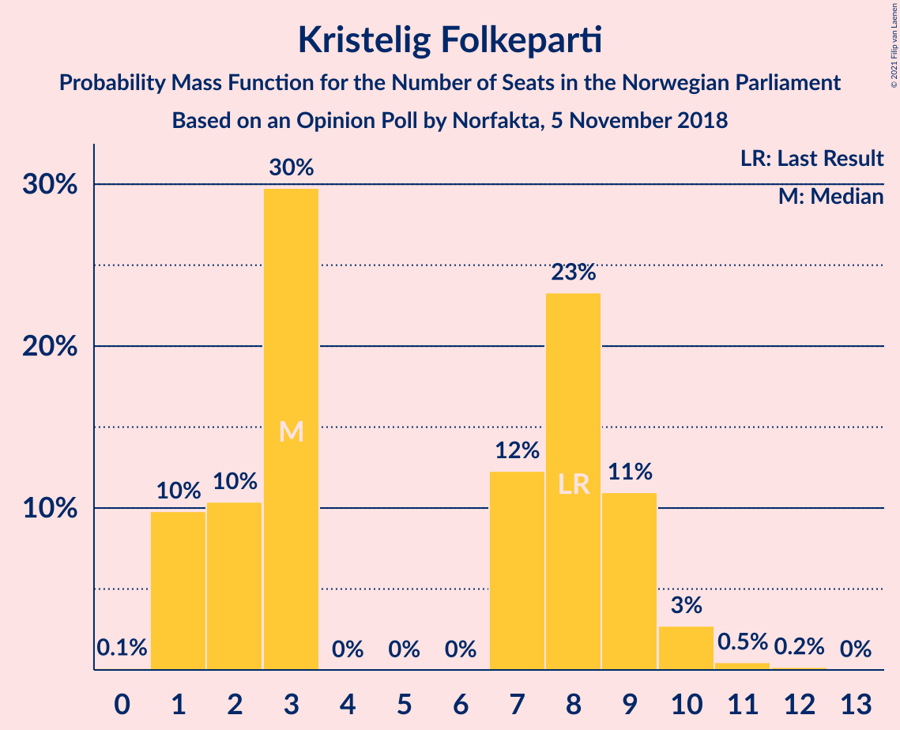
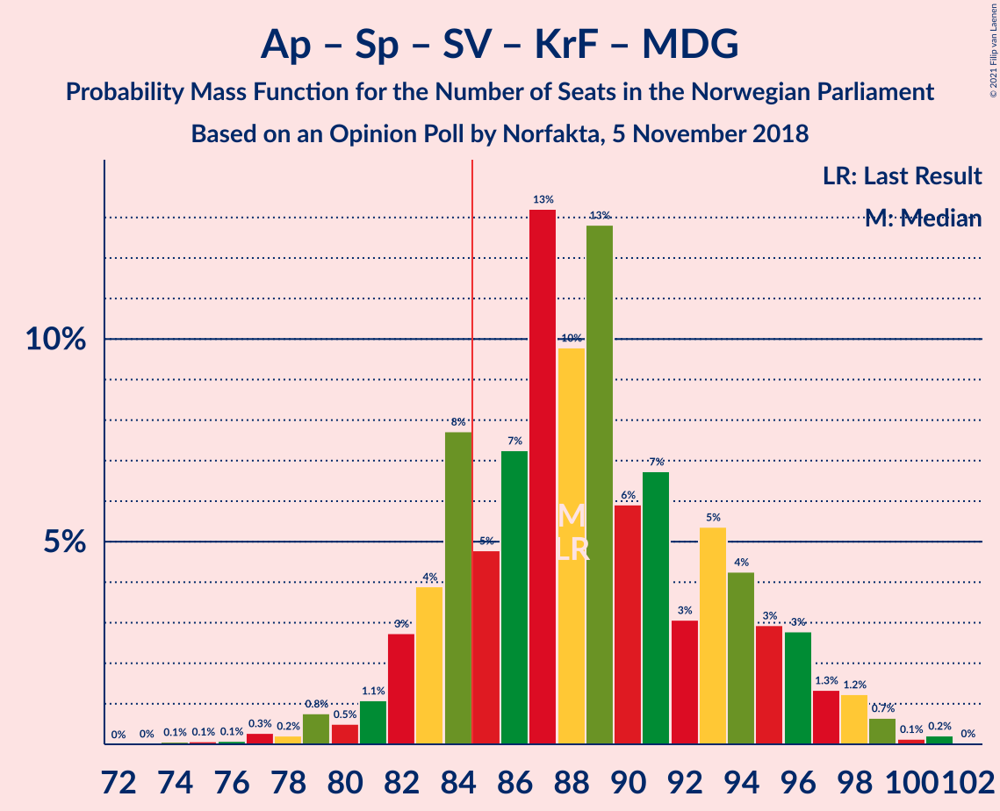
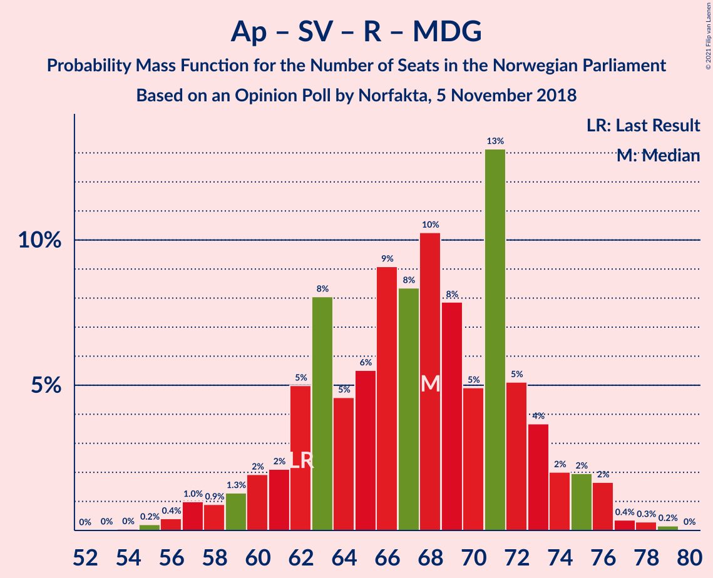
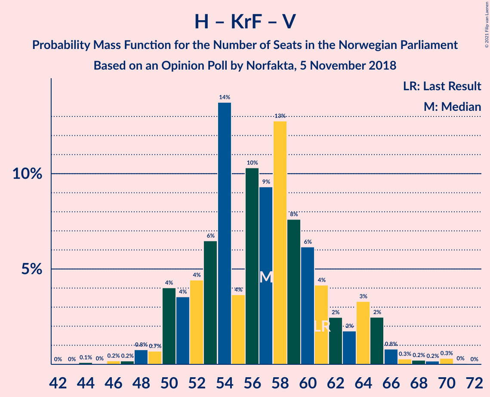
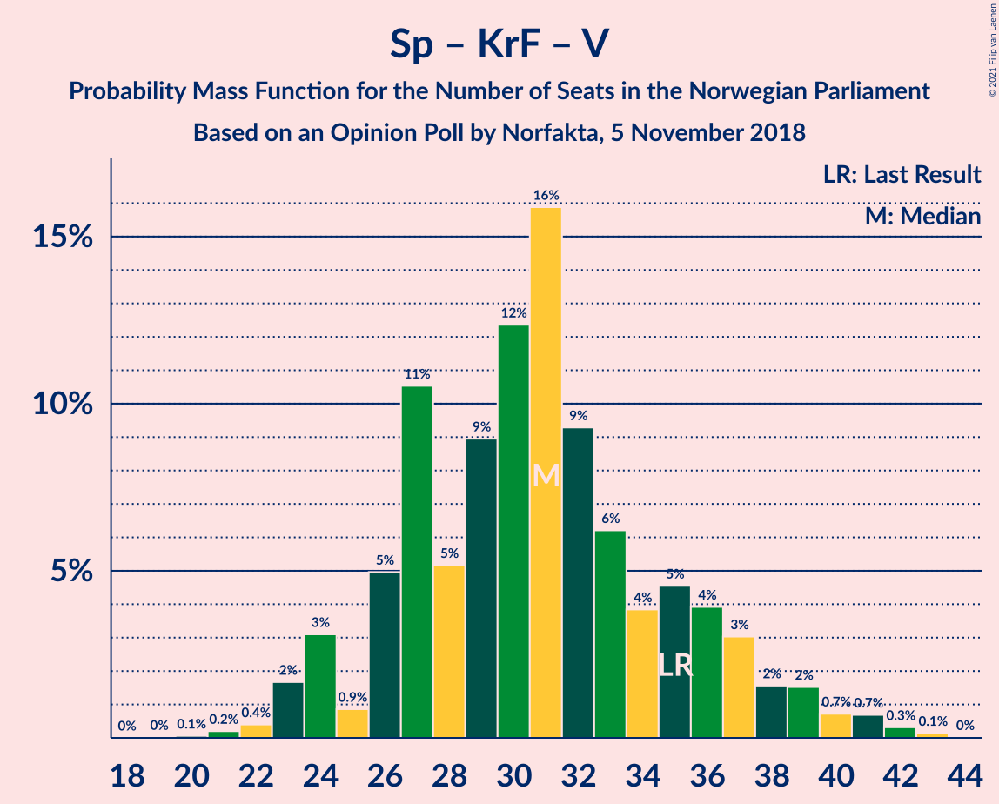

# Opinion Poll by Norfakta, 5 November 2018

<a href="#voting-intentions">Voting Intentions</a> | <a href="#seats">Seats</a> | <a href="#coalitions">Coalitions</a> | <a href="#technical-information">Technical Information</a>

## Voting Intentions

### Confidence Intervals

| Party | Last Result | Poll Result | 80% Confidence Interval | 90% Confidence Interval | 95% Confidence Interval | 99% Confidence Interval |
|:-----:|:-----------:|:-----------:|:-----------------------:|:-----------------------:|:-----------------------:|:-----------------------:|
| Arbeiderpartiet | 27.4% | 29.1% | 27.1–31.2% |26.6–31.8% |26.1–32.3% |25.1–33.4% |
| Høyre | 25.0% | 26.1% | 24.2–28.2% |23.7–28.8% |23.2–29.3% |22.3–30.3% |
| Fremskrittspartiet | 15.2% | 13.2% | 11.8–14.8% |11.4–15.3% |11.0–15.7% |10.4–16.5% |
| Senterpartiet | 10.3% | 11.7% | 10.3–13.3% |10.0–13.7% |9.6–14.1% |9.0–14.9% |
| Sosialistisk Venstreparti | 6.0% | 5.0% | 4.1–6.1% |3.9–6.4% |3.7–6.7% |3.3–7.3% |
| Kristelig Folkeparti | 4.2% | 4.0% | 3.2–5.0% |3.0–5.3% |2.8–5.6% |2.5–6.1% |
| Rødt | 2.4% | 3.9% | 3.1–4.9% |2.9–5.2% |2.7–5.4% |2.4–6.0% |
| Venstre | 4.4% | 3.9% | 3.1–4.9% |2.9–5.2% |2.7–5.4% |2.4–6.0% |
| Miljøpartiet De Grønne | 3.2% | 2.2% | 1.7–3.1% |1.5–3.3% |1.4–3.5% |1.2–4.0% |

*Note:* The poll result column reflects the actual value used in the calculations. Published results may vary slightly, and in addition be rounded to fewer digits.

## Seats

### Confidence Intervals

| Party | Last Result | Median | 80% Confidence Interval | 90% Confidence Interval | 95% Confidence Interval | 99% Confidence Interval |
|:-----:|:-----------:|:------:|:-----------------------:|:-----------------------:|:-----------------------:|:-----------------------:|
| <a href="#arbeiderpartiet">Arbeiderpartiet</a> | 49 | 53 | 49–57 |48–58 |46–59 |45–61 |
| <a href="#høyre">Høyre</a> | 45 | 47 | 43–51 |42–52 |41–53 |39–55 |
| <a href="#fremskrittspartiet">Fremskrittspartiet</a> | 27 | 24 | 20–27 |20–28 |19–29 |18–30 |
| <a href="#senterpartiet">Senterpartiet</a> | 19 | 21 | 18–24 |18–25 |17–26 |16–27 |
| <a href="#sosialistisk-venstreparti">Sosialistisk Venstreparti</a> | 11 | 9 | 7–11 |2–12 |2–12 |1–13 |
| <a href="#kristelig-folkeparti">Kristelig Folkeparti</a> | 8 | 3 | 2–9 |1–9 |1–10 |1–11 |
| <a href="#rødt">Rødt</a> | 1 | 7 | 2–9 |1–9 |1–10 |1–11 |
| <a href="#venstre">Venstre</a> | 8 | 2 | 2–9 |2–9 |2–10 |2–11 |
| <a href="#miljøpartiet-de-grønne">Miljøpartiet De Grønne</a> | 1 | 1 | 0–1 |0–2 |0–2 |0–3 |

### Arbeiderpartiet

*For a full overview of the results for this party, see the [Arbeiderpartiet](party-arbeiderpartiet.html) page.*

| Number of Seats | Probability | Accumulated | Special Marks |
|:---------------:|:-----------:|:-----------:|:-------------:|
| 42 | 0.1% | 100% |  |
| 43 | 0.1% | 99.9% |  |
| 44 | 0.3% | 99.8% |  |
| 45 | 0.5% | 99.5% |  |
| 46 | 2% | 99.0% |  |
| 47 | 2% | 97% |  |
| 48 | 3% | 95% |  |
| 49 | 4% | 92% | Last Result |
| 50 | 13% | 88% |  |
| 51 | 12% | 74% |  |
| 52 | 9% | 62% |  |
| 53 | 9% | 54% | Median |
| 54 | 16% | 44% |  |
| 55 | 10% | 28% |  |
| 56 | 6% | 18% |  |
| 57 | 3% | 12% |  |
| 58 | 4% | 8% |  |
| 59 | 2% | 4% |  |
| 60 | 0.9% | 2% |  |
| 61 | 0.4% | 0.8% |  |
| 62 | 0.3% | 0.5% |  |
| 63 | 0.1% | 0.2% |  |
| 64 | 0.1% | 0.1% |  |
| 65 | 0.1% | 0.1% |  |
| 66 | 0% | 0% |  |

### Høyre

*For a full overview of the results for this party, see the [Høyre](party-høyre.html) page.*

| Number of Seats | Probability | Accumulated | Special Marks |
|:---------------:|:-----------:|:-----------:|:-------------:|
| 37 | 0.1% | 100% |  |
| 38 | 0.1% | 99.9% |  |
| 39 | 0.4% | 99.7% |  |
| 40 | 0.7% | 99.3% |  |
| 41 | 3% | 98.6% |  |
| 42 | 4% | 95% |  |
| 43 | 5% | 91% |  |
| 44 | 7% | 86% |  |
| 45 | 11% | 79% | Last Result |
| 46 | 11% | 68% |  |
| 47 | 7% | 57% | Median |
| 48 | 20% | 50% |  |
| 49 | 11% | 30% |  |
| 50 | 7% | 18% |  |
| 51 | 3% | 11% |  |
| 52 | 4% | 8% |  |
| 53 | 2% | 4% |  |
| 54 | 1.2% | 2% |  |
| 55 | 0.5% | 0.9% |  |
| 56 | 0.2% | 0.5% |  |
| 57 | 0.2% | 0.3% |  |
| 58 | 0.1% | 0.1% |  |
| 59 | 0% | 0% |  |

### Fremskrittspartiet

*For a full overview of the results for this party, see the [Fremskrittspartiet](party-fremskrittspartiet.html) page.*

| Number of Seats | Probability | Accumulated | Special Marks |
|:---------------:|:-----------:|:-----------:|:-------------:|
| 16 | 0.1% | 100% |  |
| 17 | 0.2% | 99.9% |  |
| 18 | 0.8% | 99.7% |  |
| 19 | 4% | 99.0% |  |
| 20 | 6% | 95% |  |
| 21 | 5% | 90% |  |
| 22 | 9% | 85% |  |
| 23 | 21% | 76% |  |
| 24 | 14% | 55% | Median |
| 25 | 19% | 42% |  |
| 26 | 10% | 23% |  |
| 27 | 7% | 13% | Last Result |
| 28 | 3% | 6% |  |
| 29 | 1.3% | 3% |  |
| 30 | 1.2% | 2% |  |
| 31 | 0.3% | 0.4% |  |
| 32 | 0.1% | 0.1% |  |
| 33 | 0% | 0% |  |

### Senterpartiet

*For a full overview of the results for this party, see the [Senterpartiet](party-senterpartiet.html) page.*

| Number of Seats | Probability | Accumulated | Special Marks |
|:---------------:|:-----------:|:-----------:|:-------------:|
| 14 | 0% | 100% |  |
| 15 | 0.2% | 99.9% |  |
| 16 | 1.4% | 99.8% |  |
| 17 | 3% | 98% |  |
| 18 | 7% | 95% |  |
| 19 | 14% | 89% | Last Result |
| 20 | 16% | 75% |  |
| 21 | 26% | 60% | Median |
| 22 | 12% | 34% |  |
| 23 | 9% | 22% |  |
| 24 | 7% | 13% |  |
| 25 | 3% | 6% |  |
| 26 | 2% | 3% |  |
| 27 | 1.1% | 1.3% |  |
| 28 | 0.1% | 0.2% |  |
| 29 | 0% | 0.1% |  |
| 30 | 0% | 0% |  |

### Sosialistisk Venstreparti

*For a full overview of the results for this party, see the [Sosialistisk Venstreparti](party-sosialistiskvenstreparti.html) page.*

| Number of Seats | Probability | Accumulated | Special Marks |
|:---------------:|:-----------:|:-----------:|:-------------:|
| 1 | 2% | 100% |  |
| 2 | 5% | 98% |  |
| 3 | 1.0% | 93% |  |
| 4 | 0% | 92% |  |
| 5 | 0% | 92% |  |
| 6 | 0% | 92% |  |
| 7 | 4% | 92% |  |
| 8 | 27% | 88% |  |
| 9 | 29% | 61% | Median |
| 10 | 18% | 32% |  |
| 11 | 9% | 15% | Last Result |
| 12 | 5% | 6% |  |
| 13 | 0.4% | 0.9% |  |
| 14 | 0.4% | 0.4% |  |
| 15 | 0% | 0% |  |

### Kristelig Folkeparti

*For a full overview of the results for this party, see the [Kristelig Folkeparti](party-kristeligfolkeparti.html) page.*

| Number of Seats | Probability | Accumulated | Special Marks |
|:---------------:|:-----------:|:-----------:|:-------------:|
| 0 | 0.1% | 100% |  |
| 1 | 10% | 99.9% |  |
| 2 | 10% | 90% |  |
| 3 | 30% | 80% | Median |
| 4 | 0% | 50% |  |
| 5 | 0% | 50% |  |
| 6 | 0% | 50% |  |
| 7 | 12% | 50% |  |
| 8 | 23% | 38% | Last Result |
| 9 | 11% | 14% |  |
| 10 | 3% | 3% |  |
| 11 | 0.5% | 0.7% |  |
| 12 | 0.2% | 0.2% |  |
| 13 | 0% | 0% |  |

### Rødt

*For a full overview of the results for this party, see the [Rødt](party-rødt.html) page.*

| Number of Seats | Probability | Accumulated | Special Marks |
|:---------------:|:-----------:|:-----------:|:-------------:|
| 1 | 6% | 100% | Last Result |
| 2 | 42% | 94% |  |
| 3 | 0% | 53% |  |
| 4 | 0% | 53% |  |
| 5 | 0% | 53% |  |
| 6 | 0% | 53% |  |
| 7 | 16% | 53% | Median |
| 8 | 24% | 36% |  |
| 9 | 10% | 12% |  |
| 10 | 2% | 3% |  |
| 11 | 0.5% | 0.6% |  |
| 12 | 0.1% | 0.1% |  |
| 13 | 0% | 0% |  |

### Venstre

*For a full overview of the results for this party, see the [Venstre](party-venstre.html) page.*

| Number of Seats | Probability | Accumulated | Special Marks |
|:---------------:|:-----------:|:-----------:|:-------------:|
| 1 | 0.4% | 100% |  |
| 2 | 50% | 99.6% | Median |
| 3 | 10% | 49% |  |
| 4 | 0% | 40% |  |
| 5 | 0% | 40% |  |
| 6 | 0% | 40% |  |
| 7 | 12% | 40% |  |
| 8 | 17% | 27% | Last Result |
| 9 | 7% | 11% |  |
| 10 | 2% | 3% |  |
| 11 | 0.6% | 0.7% |  |
| 12 | 0.1% | 0.1% |  |
| 13 | 0% | 0% |  |

### Miljøpartiet De Grønne

*For a full overview of the results for this party, see the [Miljøpartiet De Grønne](party-miljøpartietdegrønne.html) page.*

| Number of Seats | Probability | Accumulated | Special Marks |
|:---------------:|:-----------:|:-----------:|:-------------:|
| 0 | 20% | 100% |  |
| 1 | 70% | 80% | Last Result, Median |
| 2 | 9% | 9% |  |
| 3 | 0.5% | 0.8% |  |
| 4 | 0% | 0.3% |  |
| 5 | 0% | 0.3% |  |
| 6 | 0% | 0.3% |  |
| 7 | 0.2% | 0.3% |  |
| 8 | 0.1% | 0.1% |  |
| 9 | 0% | 0% |  |

## Coalitions

### Confidence Intervals

| Coalition | Last Result | Median | Majority? | 80% Confidence Interval | 90% Confidence Interval | 95% Confidence Interval | 99% Confidence Interval |
|:---------:|:-----------:|:------:|:---------:|:-----------------------:|:-----------------------:|:-----------------------:|:-----------------------:|
| Høyre – Fremskrittspartiet – Senterpartiet – Kristelig Folkeparti – Venstre | 107 | 101 | 100% | 96–107 | 95–109 | 93–111 | 91–113 |
| Arbeiderpartiet – Senterpartiet – Sosialistisk Venstreparti – Kristelig Folkeparti – Miljøpartiet De Grønne | 88 | 88 | 83% | 84–94 | 82–96 | 81–97 | 77–99 |
| Arbeiderpartiet – Senterpartiet – Sosialistisk Venstreparti – Rødt – Miljøpartiet De Grønne | 81 | 88 | 82% | 83–94 | 81–95 | 80–96 | 77–99 |
| Arbeiderpartiet – Senterpartiet – Sosialistisk Venstreparti – Rødt | 80 | 87 | 74% | 82–93 | 80–94 | 79–95 | 76–97 |
| Arbeiderpartiet – Senterpartiet – Sosialistisk Venstreparti – Miljøpartiet De Grønne | 80 | 83 | 34% | 79–88 | 77–90 | 75–91 | 72–93 |
| Arbeiderpartiet – Senterpartiet – Sosialistisk Venstreparti | 79 | 83 | 26% | 78–87 | 76–89 | 74–90 | 71–92 |
| Høyre – Fremskrittspartiet – Kristelig Folkeparti – Venstre – Miljøpartiet De Grønne | 89 | 82 | 26% | 76–87 | 75–89 | 74–90 | 72–93 |
| Høyre – Fremskrittspartiet – Kristelig Folkeparti – Venstre | 88 | 81 | 18% | 75–86 | 74–88 | 73–89 | 70–92 |
| Arbeiderpartiet – Senterpartiet – Kristelig Folkeparti – Miljøpartiet De Grønne | 77 | 80 | 15% | 75–85 | 73–86 | 72–88 | 70–90 |
| Arbeiderpartiet – Senterpartiet – Kristelig Folkeparti | 76 | 79 | 11% | 74–85 | 73–86 | 72–87 | 69–90 |
| Høyre – Fremskrittspartiet – Venstre | 80 | 75 | 2% | 70–81 | 69–83 | 67–84 | 65–86 |
| Arbeiderpartiet – Senterpartiet | 68 | 74 | 0.4% | 69–78 | 68–80 | 66–81 | 64–84 |
| Høyre – Fremskrittspartiet | 72 | 71 | 0.1% | 65–76 | 64–77 | 63–78 | 61–80 |
| Arbeiderpartiet – Sosialistisk Venstreparti – Rødt – Miljøpartiet De Grønne | 62 | 68 | 0% | 62–73 | 60–74 | 58–76 | 56–78 |
| Arbeiderpartiet – Sosialistisk Venstreparti | 60 | 62 | 0% | 57–66 | 55–67 | 53–68 | 50–70 |
| Høyre – Kristelig Folkeparti – Venstre | 61 | 57 | 0% | 52–62 | 50–64 | 50–65 | 47–69 |
| Senterpartiet – Kristelig Folkeparti – Venstre | 35 | 31 | 0% | 26–36 | 24–37 | 24–39 | 22–41 |

### Høyre – Fremskrittspartiet – Senterpartiet – Kristelig Folkeparti – Venstre

| Number of Seats | Probability | Accumulated | Special Marks |
|:---------------:|:-----------:|:-----------:|:-------------:|
| 90 | 0.2% | 100% |  |
| 91 | 0.3% | 99.8% |  |
| 92 | 0.4% | 99.5% |  |
| 93 | 2% | 99.1% |  |
| 94 | 2% | 97% |  |
| 95 | 2% | 96% |  |
| 96 | 4% | 93% |  |
| 97 | 5% | 90% | Median |
| 98 | 13% | 85% |  |
| 99 | 5% | 72% |  |
| 100 | 8% | 67% |  |
| 101 | 10% | 59% |  |
| 102 | 8% | 49% |  |
| 103 | 9% | 40% |  |
| 104 | 6% | 31% |  |
| 105 | 5% | 26% |  |
| 106 | 8% | 21% |  |
| 107 | 5% | 13% | Last Result |
| 108 | 2% | 8% |  |
| 109 | 2% | 6% |  |
| 110 | 1.3% | 4% |  |
| 111 | 0.9% | 3% |  |
| 112 | 1.0% | 2% |  |
| 113 | 0.4% | 0.7% |  |
| 114 | 0.2% | 0.3% |  |
| 115 | 0% | 0.1% |  |
| 116 | 0% | 0.1% |  |
| 117 | 0% | 0% |  |

### Arbeiderpartiet – Senterpartiet – Sosialistisk Venstreparti – Kristelig Folkeparti – Miljøpartiet De Grønne

| Number of Seats | Probability | Accumulated | Special Marks |
|:---------------:|:-----------:|:-----------:|:-------------:|
| 74 | 0.1% | 100% |  |
| 75 | 0.1% | 99.9% |  |
| 76 | 0.1% | 99.8% |  |
| 77 | 0.3% | 99.8% |  |
| 78 | 0.2% | 99.5% |  |
| 79 | 0.8% | 99.3% |  |
| 80 | 0.5% | 98% |  |
| 81 | 1.1% | 98% |  |
| 82 | 3% | 97% |  |
| 83 | 4% | 94% |  |
| 84 | 8% | 90% |  |
| 85 | 5% | 83% | Majority |
| 86 | 7% | 78% |  |
| 87 | 13% | 71% | Median |
| 88 | 10% | 57% | Last Result |
| 89 | 13% | 48% |  |
| 90 | 6% | 35% |  |
| 91 | 7% | 29% |  |
| 92 | 3% | 22% |  |
| 93 | 5% | 19% |  |
| 94 | 4% | 14% |  |
| 95 | 3% | 9% |  |
| 96 | 3% | 6% |  |
| 97 | 1.3% | 4% |  |
| 98 | 1.2% | 2% |  |
| 99 | 0.7% | 1.0% |  |
| 100 | 0.1% | 0.4% |  |
| 101 | 0.2% | 0.3% |  |
| 102 | 0% | 0% |  |

### Arbeiderpartiet – Senterpartiet – Sosialistisk Venstreparti – Rødt – Miljøpartiet De Grønne

| Number of Seats | Probability | Accumulated | Special Marks |
|:---------------:|:-----------:|:-----------:|:-------------:|
| 75 | 0.1% | 100% |  |
| 76 | 0.1% | 99.9% |  |
| 77 | 0.4% | 99.8% |  |
| 78 | 0.3% | 99.4% |  |
| 79 | 1.5% | 99.0% |  |
| 80 | 1.1% | 98% |  |
| 81 | 3% | 96% | Last Result |
| 82 | 3% | 94% |  |
| 83 | 4% | 90% |  |
| 84 | 4% | 87% |  |
| 85 | 8% | 82% | Majority |
| 86 | 7% | 74% |  |
| 87 | 7% | 67% |  |
| 88 | 14% | 61% |  |
| 89 | 6% | 46% |  |
| 90 | 6% | 40% |  |
| 91 | 7% | 34% | Median |
| 92 | 12% | 27% |  |
| 93 | 4% | 15% |  |
| 94 | 3% | 10% |  |
| 95 | 3% | 8% |  |
| 96 | 3% | 5% |  |
| 97 | 0.5% | 2% |  |
| 98 | 0.6% | 1.2% |  |
| 99 | 0.4% | 0.6% |  |
| 100 | 0.2% | 0.3% |  |
| 101 | 0% | 0.1% |  |
| 102 | 0.1% | 0.1% |  |
| 103 | 0% | 0% |  |

### Arbeiderpartiet – Senterpartiet – Sosialistisk Venstreparti – Rødt

| Number of Seats | Probability | Accumulated | Special Marks |
|:---------------:|:-----------:|:-----------:|:-------------:|
| 74 | 0.1% | 100% |  |
| 75 | 0% | 99.8% |  |
| 76 | 0.5% | 99.8% |  |
| 77 | 0.3% | 99.4% |  |
| 78 | 2% | 99.1% |  |
| 79 | 0.9% | 98% |  |
| 80 | 2% | 97% | Last Result |
| 81 | 4% | 95% |  |
| 82 | 3% | 90% |  |
| 83 | 5% | 87% |  |
| 84 | 8% | 82% |  |
| 85 | 5% | 74% | Majority |
| 86 | 8% | 69% |  |
| 87 | 13% | 61% |  |
| 88 | 8% | 48% |  |
| 89 | 6% | 41% |  |
| 90 | 6% | 35% | Median |
| 91 | 14% | 29% |  |
| 92 | 5% | 15% |  |
| 93 | 2% | 10% |  |
| 94 | 3% | 8% |  |
| 95 | 3% | 5% |  |
| 96 | 0.8% | 2% |  |
| 97 | 0.8% | 1.3% |  |
| 98 | 0.1% | 0.4% |  |
| 99 | 0.2% | 0.3% |  |
| 100 | 0.1% | 0.2% |  |
| 101 | 0.1% | 0.1% |  |
| 102 | 0% | 0% |  |

### Arbeiderpartiet – Senterpartiet – Sosialistisk Venstreparti – Miljøpartiet De Grønne

| Number of Seats | Probability | Accumulated | Special Marks |
|:---------------:|:-----------:|:-----------:|:-------------:|
| 70 | 0% | 100% |  |
| 71 | 0.4% | 99.9% |  |
| 72 | 0.2% | 99.5% |  |
| 73 | 0.7% | 99.4% |  |
| 74 | 0.4% | 98.6% |  |
| 75 | 1.3% | 98% |  |
| 76 | 1.4% | 97% |  |
| 77 | 3% | 95% |  |
| 78 | 3% | 93% |  |
| 79 | 3% | 90% |  |
| 80 | 7% | 87% | Last Result |
| 81 | 15% | 81% |  |
| 82 | 6% | 66% |  |
| 83 | 10% | 60% |  |
| 84 | 15% | 49% | Median |
| 85 | 9% | 34% | Majority |
| 86 | 5% | 25% |  |
| 87 | 6% | 20% |  |
| 88 | 5% | 14% |  |
| 89 | 3% | 9% |  |
| 90 | 3% | 6% |  |
| 91 | 1.2% | 3% |  |
| 92 | 1.4% | 2% |  |
| 93 | 0.4% | 0.9% |  |
| 94 | 0.2% | 0.5% |  |
| 95 | 0.2% | 0.2% |  |
| 96 | 0% | 0.1% |  |
| 97 | 0% | 0% |  |

### Arbeiderpartiet – Senterpartiet – Sosialistisk Venstreparti

| Number of Seats | Probability | Accumulated | Special Marks |
|:---------------:|:-----------:|:-----------:|:-------------:|
| 68 | 0% | 100% |  |
| 69 | 0% | 99.9% |  |
| 70 | 0.4% | 99.9% |  |
| 71 | 0.1% | 99.5% |  |
| 72 | 0.8% | 99.5% |  |
| 73 | 0.4% | 98.7% |  |
| 74 | 1.1% | 98% |  |
| 75 | 1.4% | 97% |  |
| 76 | 3% | 96% |  |
| 77 | 2% | 93% |  |
| 78 | 2% | 91% |  |
| 79 | 9% | 89% | Last Result |
| 80 | 13% | 80% |  |
| 81 | 7% | 67% |  |
| 82 | 10% | 60% |  |
| 83 | 15% | 50% | Median |
| 84 | 9% | 35% |  |
| 85 | 4% | 26% | Majority |
| 86 | 7% | 21% |  |
| 87 | 4% | 14% |  |
| 88 | 3% | 9% |  |
| 89 | 3% | 6% |  |
| 90 | 0.8% | 3% |  |
| 91 | 1.3% | 2% |  |
| 92 | 0.6% | 1.1% |  |
| 93 | 0.2% | 0.5% |  |
| 94 | 0.2% | 0.3% |  |
| 95 | 0% | 0.1% |  |
| 96 | 0% | 0% |  |

### Høyre – Fremskrittspartiet – Kristelig Folkeparti – Venstre – Miljøpartiet De Grønne

| Number of Seats | Probability | Accumulated | Special Marks |
|:---------------:|:-----------:|:-----------:|:-------------:|
| 68 | 0.1% | 100% |  |
| 69 | 0.1% | 99.9% |  |
| 70 | 0.2% | 99.8% |  |
| 71 | 0.1% | 99.7% |  |
| 72 | 0.8% | 99.6% |  |
| 73 | 0.8% | 98.7% |  |
| 74 | 3% | 98% |  |
| 75 | 3% | 95% |  |
| 76 | 2% | 92% |  |
| 77 | 5% | 90% | Median |
| 78 | 14% | 85% |  |
| 79 | 6% | 71% |  |
| 80 | 6% | 65% |  |
| 81 | 8% | 59% |  |
| 82 | 13% | 52% |  |
| 83 | 8% | 39% |  |
| 84 | 5% | 31% |  |
| 85 | 8% | 26% | Majority |
| 86 | 5% | 18% |  |
| 87 | 3% | 13% |  |
| 88 | 4% | 10% |  |
| 89 | 2% | 5% | Last Result |
| 90 | 0.9% | 3% |  |
| 91 | 2% | 2% |  |
| 92 | 0.3% | 0.9% |  |
| 93 | 0.5% | 0.6% |  |
| 94 | 0% | 0.2% |  |
| 95 | 0.1% | 0.2% |  |
| 96 | 0% | 0% |  |

### Høyre – Fremskrittspartiet – Kristelig Folkeparti – Venstre

| Number of Seats | Probability | Accumulated | Special Marks |
|:---------------:|:-----------:|:-----------:|:-------------:|
| 67 | 0.1% | 100% |  |
| 68 | 0% | 99.9% |  |
| 69 | 0.2% | 99.9% |  |
| 70 | 0.4% | 99.7% |  |
| 71 | 0.6% | 99.4% |  |
| 72 | 0.5% | 98.8% |  |
| 73 | 3% | 98% |  |
| 74 | 3% | 95% |  |
| 75 | 3% | 92% |  |
| 76 | 4% | 90% | Median |
| 77 | 12% | 85% |  |
| 78 | 7% | 73% |  |
| 79 | 6% | 66% |  |
| 80 | 6% | 60% |  |
| 81 | 14% | 54% |  |
| 82 | 7% | 39% |  |
| 83 | 7% | 33% |  |
| 84 | 8% | 26% |  |
| 85 | 4% | 18% | Majority |
| 86 | 4% | 13% |  |
| 87 | 3% | 10% |  |
| 88 | 3% | 6% | Last Result |
| 89 | 1.1% | 4% |  |
| 90 | 1.5% | 2% |  |
| 91 | 0.3% | 1.0% |  |
| 92 | 0.4% | 0.6% |  |
| 93 | 0.1% | 0.2% |  |
| 94 | 0.1% | 0.1% |  |
| 95 | 0% | 0% |  |

### Arbeiderpartiet – Senterpartiet – Kristelig Folkeparti – Miljøpartiet De Grønne

| Number of Seats | Probability | Accumulated | Special Marks |
|:---------------:|:-----------:|:-----------:|:-------------:|
| 67 | 0% | 100% |  |
| 68 | 0.2% | 99.9% |  |
| 69 | 0.2% | 99.8% |  |
| 70 | 0.3% | 99.5% |  |
| 71 | 0.6% | 99.3% |  |
| 72 | 1.2% | 98.6% |  |
| 73 | 2% | 97% |  |
| 74 | 3% | 95% |  |
| 75 | 6% | 92% |  |
| 76 | 5% | 86% |  |
| 77 | 8% | 81% | Last Result |
| 78 | 5% | 73% | Median |
| 79 | 15% | 68% |  |
| 80 | 16% | 53% |  |
| 81 | 8% | 37% |  |
| 82 | 3% | 29% |  |
| 83 | 4% | 26% |  |
| 84 | 7% | 22% |  |
| 85 | 5% | 15% | Majority |
| 86 | 5% | 10% |  |
| 87 | 1.1% | 4% |  |
| 88 | 1.4% | 3% |  |
| 89 | 0.5% | 2% |  |
| 90 | 0.8% | 1.3% |  |
| 91 | 0.2% | 0.5% |  |
| 92 | 0.2% | 0.3% |  |
| 93 | 0.1% | 0.1% |  |
| 94 | 0% | 0% |  |

### Arbeiderpartiet – Senterpartiet – Kristelig Folkeparti

| Number of Seats | Probability | Accumulated | Special Marks |
|:---------------:|:-----------:|:-----------:|:-------------:|
| 66 | 0% | 100% |  |
| 67 | 0.2% | 99.9% |  |
| 68 | 0.1% | 99.8% |  |
| 69 | 0.3% | 99.6% |  |
| 70 | 0.7% | 99.3% |  |
| 71 | 0.8% | 98.7% |  |
| 72 | 3% | 98% |  |
| 73 | 4% | 95% |  |
| 74 | 5% | 91% |  |
| 75 | 4% | 86% |  |
| 76 | 7% | 82% | Last Result |
| 77 | 6% | 75% | Median |
| 78 | 15% | 69% |  |
| 79 | 16% | 54% |  |
| 80 | 8% | 38% |  |
| 81 | 4% | 30% |  |
| 82 | 4% | 26% |  |
| 83 | 7% | 21% |  |
| 84 | 4% | 15% |  |
| 85 | 6% | 11% | Majority |
| 86 | 2% | 5% |  |
| 87 | 1.0% | 3% |  |
| 88 | 0.7% | 2% |  |
| 89 | 0.7% | 1.2% |  |
| 90 | 0.3% | 0.5% |  |
| 91 | 0.1% | 0.3% |  |
| 92 | 0.1% | 0.1% |  |
| 93 | 0% | 0% |  |

### Høyre – Fremskrittspartiet – Venstre

| Number of Seats | Probability | Accumulated | Special Marks |
|:---------------:|:-----------:|:-----------:|:-------------:|
| 63 | 0.1% | 100% |  |
| 64 | 0.2% | 99.9% |  |
| 65 | 0.5% | 99.7% |  |
| 66 | 1.0% | 99.2% |  |
| 67 | 0.9% | 98% |  |
| 68 | 2% | 97% |  |
| 69 | 2% | 95% |  |
| 70 | 4% | 93% |  |
| 71 | 7% | 89% |  |
| 72 | 5% | 82% |  |
| 73 | 9% | 77% | Median |
| 74 | 17% | 68% |  |
| 75 | 7% | 50% |  |
| 76 | 6% | 43% |  |
| 77 | 6% | 37% |  |
| 78 | 8% | 31% |  |
| 79 | 5% | 23% |  |
| 80 | 5% | 18% | Last Result |
| 81 | 4% | 13% |  |
| 82 | 2% | 9% |  |
| 83 | 4% | 7% |  |
| 84 | 0.9% | 3% |  |
| 85 | 1.5% | 2% | Majority |
| 86 | 0.4% | 0.8% |  |
| 87 | 0.1% | 0.3% |  |
| 88 | 0.1% | 0.2% |  |
| 89 | 0% | 0% |  |

### Arbeiderpartiet – Senterpartiet

| Number of Seats | Probability | Accumulated | Special Marks |
|:---------------:|:-----------:|:-----------:|:-------------:|
| 62 | 0.1% | 100% |  |
| 63 | 0.1% | 99.9% |  |
| 64 | 0.4% | 99.8% |  |
| 65 | 0.5% | 99.4% |  |
| 66 | 2% | 98.9% |  |
| 67 | 2% | 97% |  |
| 68 | 2% | 95% | Last Result |
| 69 | 5% | 93% |  |
| 70 | 5% | 89% |  |
| 71 | 13% | 84% |  |
| 72 | 10% | 71% |  |
| 73 | 8% | 61% |  |
| 74 | 9% | 53% | Median |
| 75 | 16% | 44% |  |
| 76 | 6% | 28% |  |
| 77 | 7% | 22% |  |
| 78 | 6% | 16% |  |
| 79 | 3% | 9% |  |
| 80 | 3% | 6% |  |
| 81 | 1.0% | 3% |  |
| 82 | 1.5% | 2% |  |
| 83 | 0.3% | 0.9% |  |
| 84 | 0.3% | 0.6% |  |
| 85 | 0.1% | 0.4% | Majority |
| 86 | 0.2% | 0.3% |  |
| 87 | 0% | 0.1% |  |
| 88 | 0.1% | 0.1% |  |
| 89 | 0% | 0% |  |

### Høyre – Fremskrittspartiet

| Number of Seats | Probability | Accumulated | Special Marks |
|:---------------:|:-----------:|:-----------:|:-------------:|
| 57 | 0% | 100% |  |
| 58 | 0.1% | 99.9% |  |
| 59 | 0.1% | 99.9% |  |
| 60 | 0.2% | 99.8% |  |
| 61 | 0.4% | 99.6% |  |
| 62 | 1.4% | 99.2% |  |
| 63 | 1.4% | 98% |  |
| 64 | 5% | 96% |  |
| 65 | 2% | 92% |  |
| 66 | 5% | 90% |  |
| 67 | 5% | 85% |  |
| 68 | 6% | 80% |  |
| 69 | 6% | 75% |  |
| 70 | 8% | 69% |  |
| 71 | 19% | 61% | Median |
| 72 | 10% | 42% | Last Result |
| 73 | 7% | 31% |  |
| 74 | 5% | 24% |  |
| 75 | 7% | 19% |  |
| 76 | 3% | 11% |  |
| 77 | 4% | 8% |  |
| 78 | 3% | 5% |  |
| 79 | 0.8% | 2% |  |
| 80 | 0.5% | 0.9% |  |
| 81 | 0.2% | 0.4% |  |
| 82 | 0.1% | 0.2% |  |
| 83 | 0% | 0.1% |  |
| 84 | 0% | 0.1% |  |
| 85 | 0% | 0.1% | Majority |
| 86 | 0% | 0% |  |

### Arbeiderpartiet – Sosialistisk Venstreparti – Rødt – Miljøpartiet De Grønne

| Number of Seats | Probability | Accumulated | Special Marks |
|:---------------:|:-----------:|:-----------:|:-------------:|
| 53 | 0% | 100% |  |
| 54 | 0% | 99.9% |  |
| 55 | 0.2% | 99.9% |  |
| 56 | 0.4% | 99.7% |  |
| 57 | 1.0% | 99.3% |  |
| 58 | 0.9% | 98% |  |
| 59 | 1.3% | 97% |  |
| 60 | 2% | 96% |  |
| 61 | 2% | 94% |  |
| 62 | 5% | 92% | Last Result |
| 63 | 8% | 87% |  |
| 64 | 5% | 79% |  |
| 65 | 6% | 74% |  |
| 66 | 9% | 69% |  |
| 67 | 8% | 60% |  |
| 68 | 10% | 51% |  |
| 69 | 8% | 41% |  |
| 70 | 5% | 33% | Median |
| 71 | 13% | 28% |  |
| 72 | 5% | 15% |  |
| 73 | 4% | 10% |  |
| 74 | 2% | 7% |  |
| 75 | 2% | 4% |  |
| 76 | 2% | 3% |  |
| 77 | 0.4% | 0.9% |  |
| 78 | 0.3% | 0.5% |  |
| 79 | 0.2% | 0.2% |  |
| 80 | 0% | 0% |  |

### Arbeiderpartiet – Sosialistisk Venstreparti

| Number of Seats | Probability | Accumulated | Special Marks |
|:---------------:|:-----------:|:-----------:|:-------------:|
| 48 | 0% | 100% |  |
| 49 | 0% | 99.9% |  |
| 50 | 0.5% | 99.9% |  |
| 51 | 0.6% | 99.4% |  |
| 52 | 0.5% | 98.8% |  |
| 53 | 1.0% | 98% |  |
| 54 | 2% | 97% |  |
| 55 | 1.3% | 96% |  |
| 56 | 3% | 94% |  |
| 57 | 3% | 92% |  |
| 58 | 5% | 88% |  |
| 59 | 10% | 84% |  |
| 60 | 17% | 74% | Last Result |
| 61 | 5% | 57% |  |
| 62 | 16% | 52% | Median |
| 63 | 9% | 35% |  |
| 64 | 8% | 27% |  |
| 65 | 6% | 19% |  |
| 66 | 5% | 13% |  |
| 67 | 4% | 8% |  |
| 68 | 2% | 4% |  |
| 69 | 1.2% | 2% |  |
| 70 | 0.3% | 0.8% |  |
| 71 | 0.3% | 0.4% |  |
| 72 | 0.1% | 0.2% |  |
| 73 | 0.1% | 0.1% |  |
| 74 | 0% | 0% |  |

### Høyre – Kristelig Folkeparti – Venstre

| Number of Seats | Probability | Accumulated | Special Marks |
|:---------------:|:-----------:|:-----------:|:-------------:|
| 44 | 0.1% | 100% |  |
| 45 | 0% | 99.9% |  |
| 46 | 0.2% | 99.8% |  |
| 47 | 0.2% | 99.7% |  |
| 48 | 0.8% | 99.5% |  |
| 49 | 0.7% | 98.7% |  |
| 50 | 4% | 98% |  |
| 51 | 4% | 94% |  |
| 52 | 4% | 90% | Median |
| 53 | 6% | 86% |  |
| 54 | 14% | 80% |  |
| 55 | 4% | 66% |  |
| 56 | 10% | 62% |  |
| 57 | 9% | 52% |  |
| 58 | 13% | 43% |  |
| 59 | 8% | 30% |  |
| 60 | 6% | 22% |  |
| 61 | 4% | 16% | Last Result |
| 62 | 2% | 12% |  |
| 63 | 2% | 9% |  |
| 64 | 3% | 8% |  |
| 65 | 2% | 4% |  |
| 66 | 0.8% | 2% |  |
| 67 | 0.3% | 1.1% |  |
| 68 | 0.2% | 0.8% |  |
| 69 | 0.2% | 0.6% |  |
| 70 | 0.3% | 0.4% |  |
| 71 | 0% | 0.1% |  |
| 72 | 0% | 0% |  |

### Senterpartiet – Kristelig Folkeparti – Venstre

| Number of Seats | Probability | Accumulated | Special Marks |
|:---------------:|:-----------:|:-----------:|:-------------:|
| 20 | 0.1% | 100% |  |
| 21 | 0.2% | 99.9% |  |
| 22 | 0.4% | 99.7% |  |
| 23 | 2% | 99.3% |  |
| 24 | 3% | 98% |  |
| 25 | 0.9% | 95% |  |
| 26 | 5% | 94% | Median |
| 27 | 11% | 89% |  |
| 28 | 5% | 78% |  |
| 29 | 9% | 73% |  |
| 30 | 12% | 64% |  |
| 31 | 16% | 52% |  |
| 32 | 9% | 36% |  |
| 33 | 6% | 27% |  |
| 34 | 4% | 20% |  |
| 35 | 5% | 16% | Last Result |
| 36 | 4% | 12% |  |
| 37 | 3% | 8% |  |
| 38 | 2% | 5% |  |
| 39 | 2% | 3% |  |
| 40 | 0.7% | 2% |  |
| 41 | 0.7% | 1.2% |  |
| 42 | 0.3% | 0.5% |  |
| 43 | 0.1% | 0.2% |  |
| 44 | 0% | 0% |  |

## Technical Information

### Opinion Poll

+ **Polling firm:** Norfakta
+ **Commissioner(s):** —
+ **Fieldwork period:** 5 November 2018

### Calculations

+ **Sample size:** 804
+ **Simulations done:** 1,048,576
+ **Error estimate:** 2.30%

