# Opinion Poll by Respons Analyse, 5–7 November 2018

<a href="#voting-intentions">Voting Intentions</a> | <a href="#seats">Seats</a> | <a href="#coalitions">Coalitions</a> | <a href="#technical-information">Technical Information</a>

## Voting Intentions

### Confidence Intervals

| Party | Last Result | Poll Result | 80% Confidence Interval | 90% Confidence Interval | 95% Confidence Interval | 99% Confidence Interval |
|:-----:|:-----------:|:-----------:|:-----------------------:|:-----------------------:|:-----------------------:|:-----------------------:|
| Arbeiderpartiet | 27.4% | 28.4% | 26.6–30.3% |26.1–30.8% |25.7–31.3% |24.8–32.2% |
| Høyre | 25.0% | 26.5% | 24.8–28.3% |24.3–28.9% |23.9–29.3% |23.0–30.2% |
| Fremskrittspartiet | 15.2% | 12.8% | 11.5–14.3% |11.2–14.7% |10.9–15.0% |10.3–15.7% |
| Senterpartiet | 10.3% | 10.3% | 9.2–11.6% |8.8–12.0% |8.6–12.3% |8.0–13.0% |
| Sosialistisk Venstreparti | 6.0% | 6.0% | 5.1–7.1% |4.9–7.4% |4.7–7.7% |4.3–8.2% |
| Kristelig Folkeparti | 4.2% | 4.2% | 3.5–5.1% |3.3–5.4% |3.1–5.6% |2.8–6.1% |
| Venstre | 4.4% | 4.1% | 3.4–5.0% |3.2–5.3% |3.0–5.5% |2.7–6.0% |
| Rødt | 2.4% | 3.9% | 3.2–4.8% |3.0–5.1% |2.9–5.3% |2.6–5.8% |
| Miljøpartiet De Grønne | 3.2% | 2.9% | 2.3–3.7% |2.2–3.9% |2.0–4.1% |1.8–4.6% |

*Note:* The poll result column reflects the actual value used in the calculations. Published results may vary slightly, and in addition be rounded to fewer digits.

## Seats

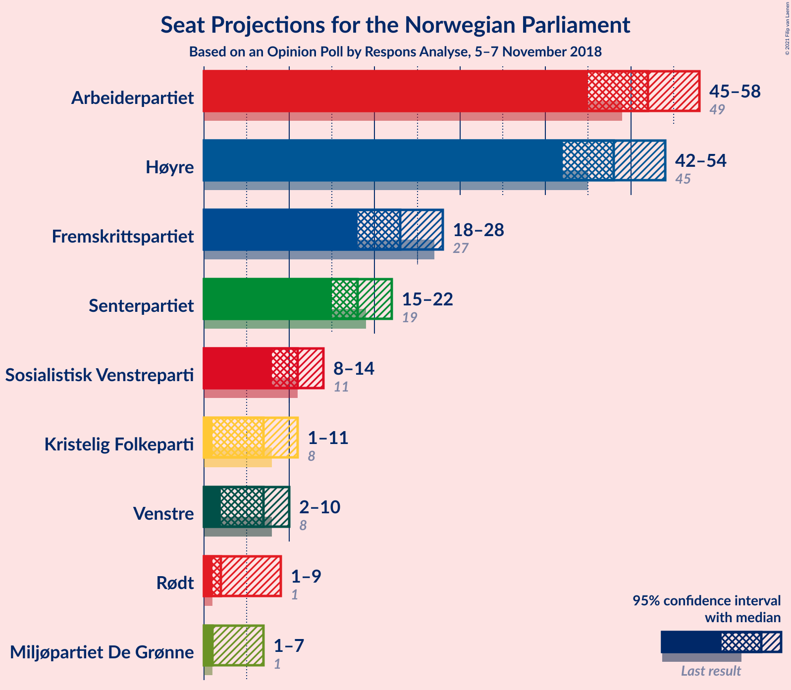

### Confidence Intervals

| Party | Last Result | Median | 80% Confidence Interval | 90% Confidence Interval | 95% Confidence Interval | 99% Confidence Interval |
|:-----:|:-----------:|:------:|:-----------------------:|:-----------------------:|:-----------------------:|:-----------------------:|
| <a href="#arbeiderpartiet">Arbeiderpartiet</a> | 49 | 52 | 48–55 |46–57 |45–58 |44–60 |
| <a href="#høyre">Høyre</a> | 45 | 48 | 44–52 |42–53 |42–54 |41–56 |
| <a href="#fremskrittspartiet">Fremskrittspartiet</a> | 27 | 23 | 20–26 |19–27 |18–28 |17–29 |
| <a href="#senterpartiet">Senterpartiet</a> | 19 | 18 | 16–21 |15–22 |15–22 |14–23 |
| <a href="#sosialistisk-venstreparti">Sosialistisk Venstreparti</a> | 11 | 11 | 9–13 |8–14 |8–14 |7–15 |
| <a href="#kristelig-folkeparti">Kristelig Folkeparti</a> | 8 | 7 | 2–10 |2–10 |1–11 |1–11 |
| <a href="#venstre">Venstre</a> | 8 | 7 | 2–9 |2–9 |2–10 |2–11 |
| <a href="#rødt">Rødt</a> | 1 | 2 | 2–8 |1–9 |1–9 |1–10 |
| <a href="#miljøpartiet-de-grønne">Miljøpartiet De Grønne</a> | 1 | 1 | 1–2 |1–7 |1–7 |0–8 |

### Arbeiderpartiet

*For a full overview of the results for this party, see the [Arbeiderpartiet](party-arbeiderpartiet.html) page.*

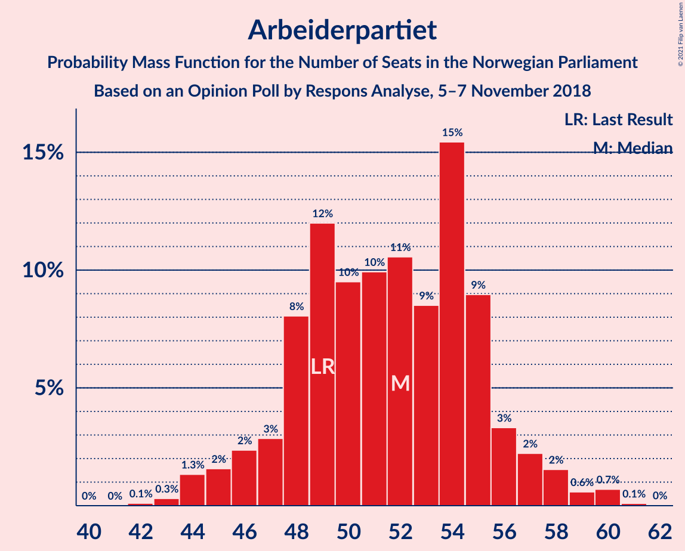

| Number of Seats | Probability | Accumulated | Special Marks |
|:---------------:|:-----------:|:-----------:|:-------------:|
| 42 | 0.1% | 100% |  |
| 43 | 0.3% | 99.9% |  |
| 44 | 1.3% | 99.6% |  |
| 45 | 2% | 98% |  |
| 46 | 2% | 97% |  |
| 47 | 3% | 94% |  |
| 48 | 8% | 91% |  |
| 49 | 12% | 83% | Last Result |
| 50 | 10% | 71% |  |
| 51 | 10% | 62% |  |
| 52 | 11% | 52% | Median |
| 53 | 9% | 41% |  |
| 54 | 15% | 33% |  |
| 55 | 9% | 17% |  |
| 56 | 3% | 8% |  |
| 57 | 2% | 5% |  |
| 58 | 2% | 3% |  |
| 59 | 0.6% | 1.4% |  |
| 60 | 0.7% | 0.8% |  |
| 61 | 0.1% | 0.1% |  |
| 62 | 0% | 0% |  |

### Høyre

*For a full overview of the results for this party, see the [Høyre](party-høyre.html) page.*

| Number of Seats | Probability | Accumulated | Special Marks |
|:---------------:|:-----------:|:-----------:|:-------------:|
| 39 | 0.1% | 100% |  |
| 40 | 0.3% | 99.9% |  |
| 41 | 1.0% | 99.6% |  |
| 42 | 4% | 98.6% |  |
| 43 | 4% | 95% |  |
| 44 | 5% | 91% |  |
| 45 | 12% | 86% | Last Result |
| 46 | 8% | 74% |  |
| 47 | 15% | 66% |  |
| 48 | 15% | 50% | Median |
| 49 | 7% | 35% |  |
| 50 | 6% | 28% |  |
| 51 | 10% | 22% |  |
| 52 | 5% | 12% |  |
| 53 | 4% | 7% |  |
| 54 | 2% | 3% |  |
| 55 | 0.6% | 1.3% |  |
| 56 | 0.4% | 0.7% |  |
| 57 | 0.1% | 0.3% |  |
| 58 | 0.1% | 0.2% |  |
| 59 | 0.1% | 0.1% |  |
| 60 | 0% | 0% |  |

### Fremskrittspartiet

*For a full overview of the results for this party, see the [Fremskrittspartiet](party-fremskrittspartiet.html) page.*

| Number of Seats | Probability | Accumulated | Special Marks |
|:---------------:|:-----------:|:-----------:|:-------------:|
| 16 | 0% | 100% |  |
| 17 | 1.5% | 99.9% |  |
| 18 | 2% | 98% |  |
| 19 | 4% | 97% |  |
| 20 | 11% | 92% |  |
| 21 | 10% | 81% |  |
| 22 | 12% | 71% |  |
| 23 | 12% | 59% | Median |
| 24 | 11% | 48% |  |
| 25 | 20% | 37% |  |
| 26 | 8% | 17% |  |
| 27 | 5% | 9% | Last Result |
| 28 | 3% | 4% |  |
| 29 | 1.2% | 2% |  |
| 30 | 0.1% | 0.5% |  |
| 31 | 0.3% | 0.3% |  |
| 32 | 0% | 0% |  |

### Senterpartiet

*For a full overview of the results for this party, see the [Senterpartiet](party-senterpartiet.html) page.*

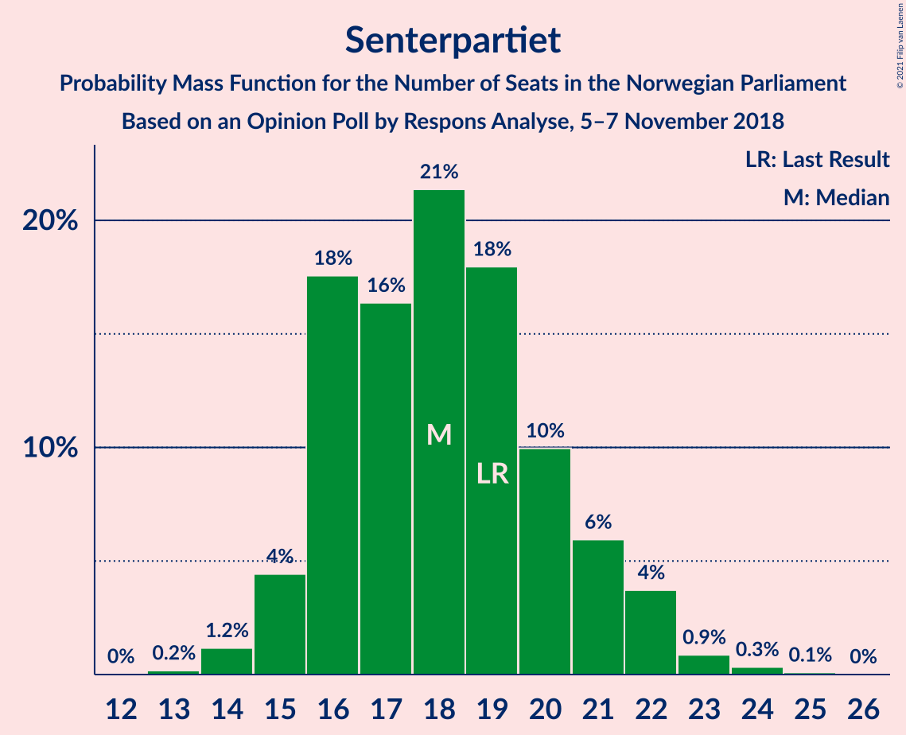

| Number of Seats | Probability | Accumulated | Special Marks |
|:---------------:|:-----------:|:-----------:|:-------------:|
| 13 | 0.2% | 100% |  |
| 14 | 1.2% | 99.8% |  |
| 15 | 4% | 98.6% |  |
| 16 | 18% | 94% |  |
| 17 | 16% | 77% |  |
| 18 | 21% | 60% | Median |
| 19 | 18% | 39% | Last Result |
| 20 | 10% | 21% |  |
| 21 | 6% | 11% |  |
| 22 | 4% | 5% |  |
| 23 | 0.9% | 1.3% |  |
| 24 | 0.3% | 0.4% |  |
| 25 | 0.1% | 0.1% |  |
| 26 | 0% | 0% |  |

### Sosialistisk Venstreparti

*For a full overview of the results for this party, see the [Sosialistisk Venstreparti](party-sosialistiskvenstreparti.html) page.*

| Number of Seats | Probability | Accumulated | Special Marks |
|:---------------:|:-----------:|:-----------:|:-------------:|
| 2 | 0.2% | 100% |  |
| 3 | 0% | 99.8% |  |
| 4 | 0% | 99.8% |  |
| 5 | 0% | 99.8% |  |
| 6 | 0% | 99.8% |  |
| 7 | 1.4% | 99.8% |  |
| 8 | 5% | 98% |  |
| 9 | 13% | 94% |  |
| 10 | 22% | 81% |  |
| 11 | 26% | 59% | Last Result, Median |
| 12 | 14% | 33% |  |
| 13 | 12% | 18% |  |
| 14 | 5% | 6% |  |
| 15 | 1.2% | 2% |  |
| 16 | 0.3% | 0.4% |  |
| 17 | 0% | 0% |  |

### Kristelig Folkeparti

*For a full overview of the results for this party, see the [Kristelig Folkeparti](party-kristeligfolkeparti.html) page.*

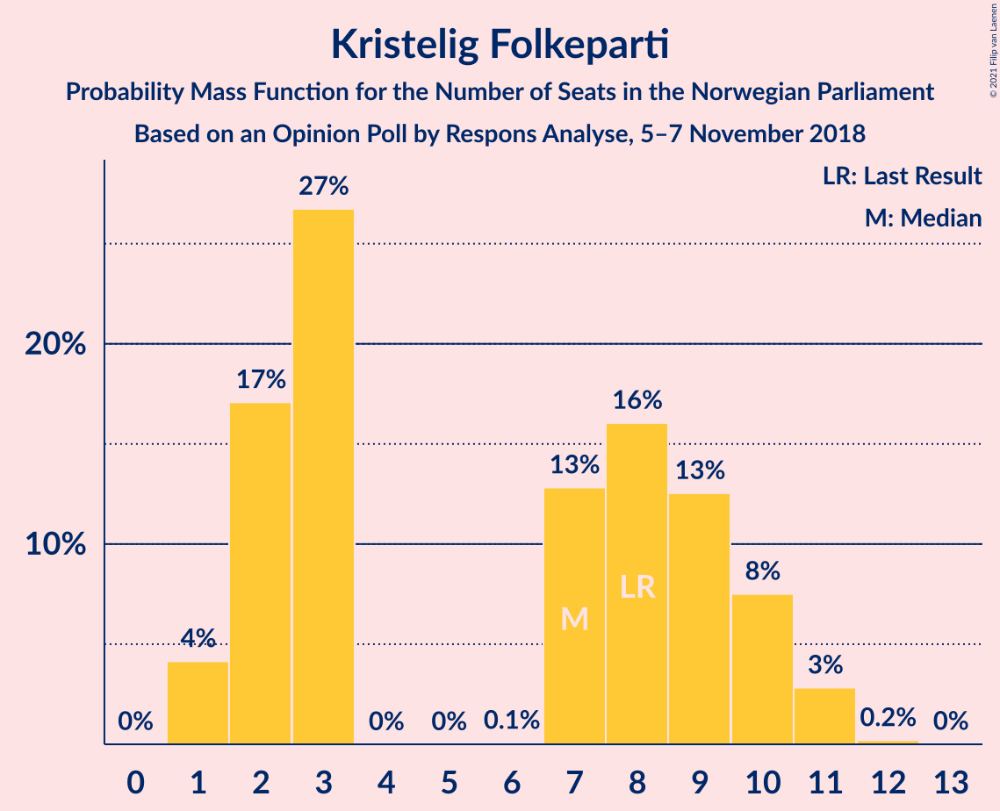

| Number of Seats | Probability | Accumulated | Special Marks |
|:---------------:|:-----------:|:-----------:|:-------------:|
| 1 | 4% | 100% |  |
| 2 | 17% | 96% |  |
| 3 | 27% | 79% |  |
| 4 | 0% | 52% |  |
| 5 | 0% | 52% |  |
| 6 | 0.1% | 52% |  |
| 7 | 13% | 52% | Median |
| 8 | 16% | 39% | Last Result |
| 9 | 13% | 23% |  |
| 10 | 8% | 11% |  |
| 11 | 3% | 3% |  |
| 12 | 0.2% | 0.2% |  |
| 13 | 0% | 0% |  |

### Venstre

*For a full overview of the results for this party, see the [Venstre](party-venstre.html) page.*

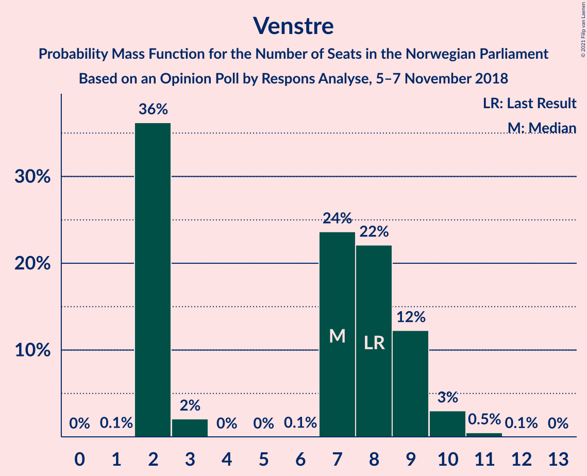

| Number of Seats | Probability | Accumulated | Special Marks |
|:---------------:|:-----------:|:-----------:|:-------------:|
| 1 | 0.1% | 100% |  |
| 2 | 36% | 99.9% |  |
| 3 | 2% | 64% |  |
| 4 | 0% | 62% |  |
| 5 | 0% | 62% |  |
| 6 | 0.1% | 62% |  |
| 7 | 24% | 62% | Median |
| 8 | 22% | 38% | Last Result |
| 9 | 12% | 16% |  |
| 10 | 3% | 4% |  |
| 11 | 0.5% | 0.5% |  |
| 12 | 0.1% | 0.1% |  |
| 13 | 0% | 0% |  |

### Rødt

*For a full overview of the results for this party, see the [Rødt](party-rødt.html) page.*

| Number of Seats | Probability | Accumulated | Special Marks |
|:---------------:|:-----------:|:-----------:|:-------------:|
| 1 | 8% | 100% | Last Result |
| 2 | 46% | 92% | Median |
| 3 | 0% | 45% |  |
| 4 | 0% | 45% |  |
| 5 | 0% | 45% |  |
| 6 | 0.1% | 45% |  |
| 7 | 16% | 45% |  |
| 8 | 20% | 29% |  |
| 9 | 7% | 9% |  |
| 10 | 2% | 2% |  |
| 11 | 0.2% | 0.3% |  |
| 12 | 0% | 0% |  |

### Miljøpartiet De Grønne

*For a full overview of the results for this party, see the [Miljøpartiet De Grønne](party-miljøpartietdegrønne.html) page.*

| Number of Seats | Probability | Accumulated | Special Marks |
|:---------------:|:-----------:|:-----------:|:-------------:|
| 0 | 2% | 100% |  |
| 1 | 59% | 98% | Last Result, Median |
| 2 | 31% | 39% |  |
| 3 | 2% | 8% |  |
| 4 | 0% | 7% |  |
| 5 | 0% | 7% |  |
| 6 | 0% | 7% |  |
| 7 | 5% | 7% |  |
| 8 | 1.4% | 2% |  |
| 9 | 0.2% | 0.2% |  |
| 10 | 0% | 0% |  |

## Coalitions

### Confidence Intervals

| Coalition | Last Result | Median | Majority? | 80% Confidence Interval | 90% Confidence Interval | 95% Confidence Interval | 99% Confidence Interval |
|:---------:|:-----------:|:------:|:---------:|:-----------------------:|:-----------------------:|:-----------------------:|:-----------------------:|
| Høyre – Fremskrittspartiet – Senterpartiet – Kristelig Folkeparti – Venstre | 107 | 100 | 100% | 95–106 | 94–107 | 93–108 | 90–110 |
| Arbeiderpartiet – Senterpartiet – Sosialistisk Venstreparti – Kristelig Folkeparti – Miljøpartiet De Grønne | 88 | 88 | 81% | 82–93 | 81–95 | 80–96 | 78–98 |
| Arbeiderpartiet – Senterpartiet – Sosialistisk Venstreparti – Rødt – Miljøpartiet De Grønne | 81 | 87 | 75% | 82–92 | 80–94 | 79–95 | 78–97 |
| Arbeiderpartiet – Senterpartiet – Sosialistisk Venstreparti – Rødt | 80 | 85 | 61% | 79–90 | 78–92 | 77–93 | 74–95 |
| Høyre – Fremskrittspartiet – Kristelig Folkeparti – Venstre – Miljøpartiet De Grønne | 89 | 84 | 39% | 79–90 | 77–91 | 76–92 | 74–95 |
| Arbeiderpartiet – Senterpartiet – Sosialistisk Venstreparti – Miljøpartiet De Grønne | 80 | 82 | 27% | 78–87 | 76–89 | 75–91 | 73–93 |
| Høyre – Fremskrittspartiet – Kristelig Folkeparti – Venstre | 88 | 82 | 25% | 77–87 | 75–89 | 74–90 | 72–91 |
| Arbeiderpartiet – Senterpartiet – Sosialistisk Venstreparti | 79 | 81 | 13% | 76–85 | 74–87 | 73–89 | 71–91 |
| Arbeiderpartiet – Senterpartiet – Kristelig Folkeparti – Miljøpartiet De Grønne | 77 | 77 | 5% | 71–83 | 70–85 | 70–86 | 67–88 |
| Høyre – Fremskrittspartiet – Venstre | 80 | 77 | 3% | 71–82 | 70–83 | 68–85 | 66–87 |
| Arbeiderpartiet – Senterpartiet – Kristelig Folkeparti | 76 | 75 | 2% | 70–81 | 69–83 | 68–84 | 66–86 |
| Høyre – Fremskrittspartiet | 72 | 71 | 0% | 65–76 | 64–77 | 62–78 | 61–80 |
| Arbeiderpartiet – Senterpartiet | 68 | 70 | 0% | 65–74 | 64–75 | 63–77 | 61–78 |
| Arbeiderpartiet – Sosialistisk Venstreparti | 60 | 63 | 0% | 58–67 | 57–68 | 56–70 | 54–73 |
| Høyre – Kristelig Folkeparti – Venstre | 61 | 59 | 0% | 53–64 | 52–66 | 51–67 | 49–69 |
| Senterpartiet – Kristelig Folkeparti – Venstre | 35 | 29 | 0% | 24–35 | 23–36 | 22–38 | 20–39 |

### Høyre – Fremskrittspartiet – Senterpartiet – Kristelig Folkeparti – Venstre

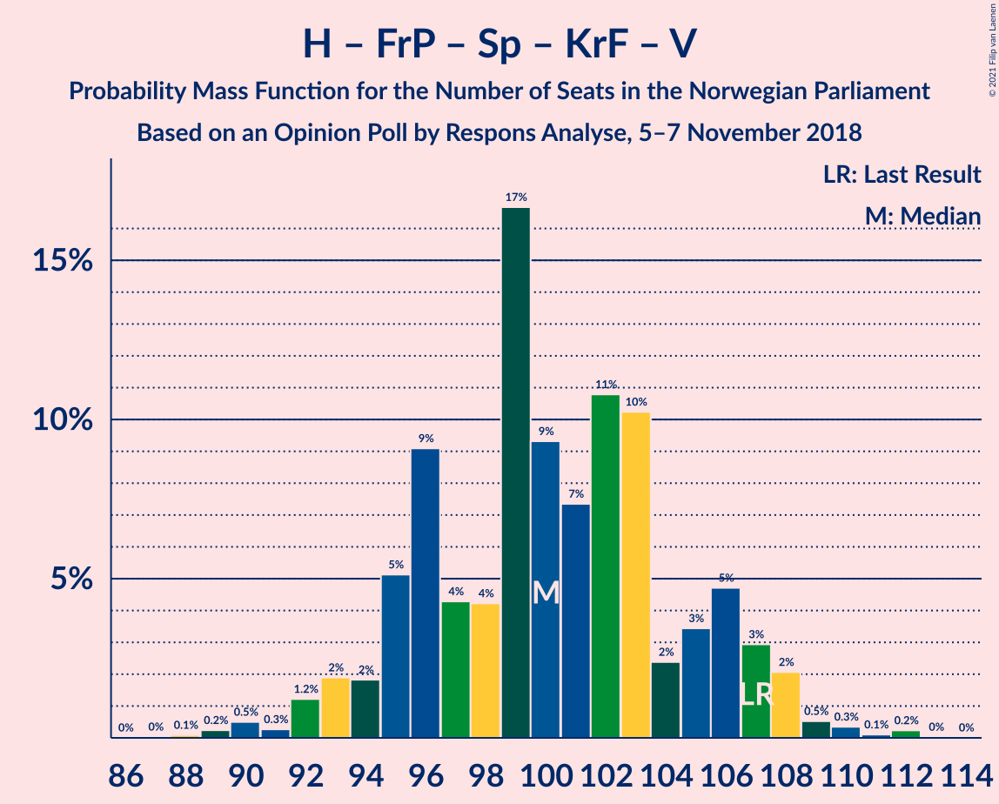

| Number of Seats | Probability | Accumulated | Special Marks |
|:---------------:|:-----------:|:-----------:|:-------------:|
| 88 | 0.1% | 100% |  |
| 89 | 0.2% | 99.9% |  |
| 90 | 0.5% | 99.6% |  |
| 91 | 0.3% | 99.1% |  |
| 92 | 1.2% | 98.9% |  |
| 93 | 2% | 98% |  |
| 94 | 2% | 96% |  |
| 95 | 5% | 94% |  |
| 96 | 9% | 89% |  |
| 97 | 4% | 80% |  |
| 98 | 4% | 75% |  |
| 99 | 17% | 71% |  |
| 100 | 9% | 55% |  |
| 101 | 7% | 45% |  |
| 102 | 11% | 38% |  |
| 103 | 10% | 27% | Median |
| 104 | 2% | 17% |  |
| 105 | 3% | 14% |  |
| 106 | 5% | 11% |  |
| 107 | 3% | 6% | Last Result |
| 108 | 2% | 3% |  |
| 109 | 0.5% | 1.3% |  |
| 110 | 0.3% | 0.7% |  |
| 111 | 0.1% | 0.4% |  |
| 112 | 0.2% | 0.3% |  |
| 113 | 0% | 0% |  |

### Arbeiderpartiet – Senterpartiet – Sosialistisk Venstreparti – Kristelig Folkeparti – Miljøpartiet De Grønne

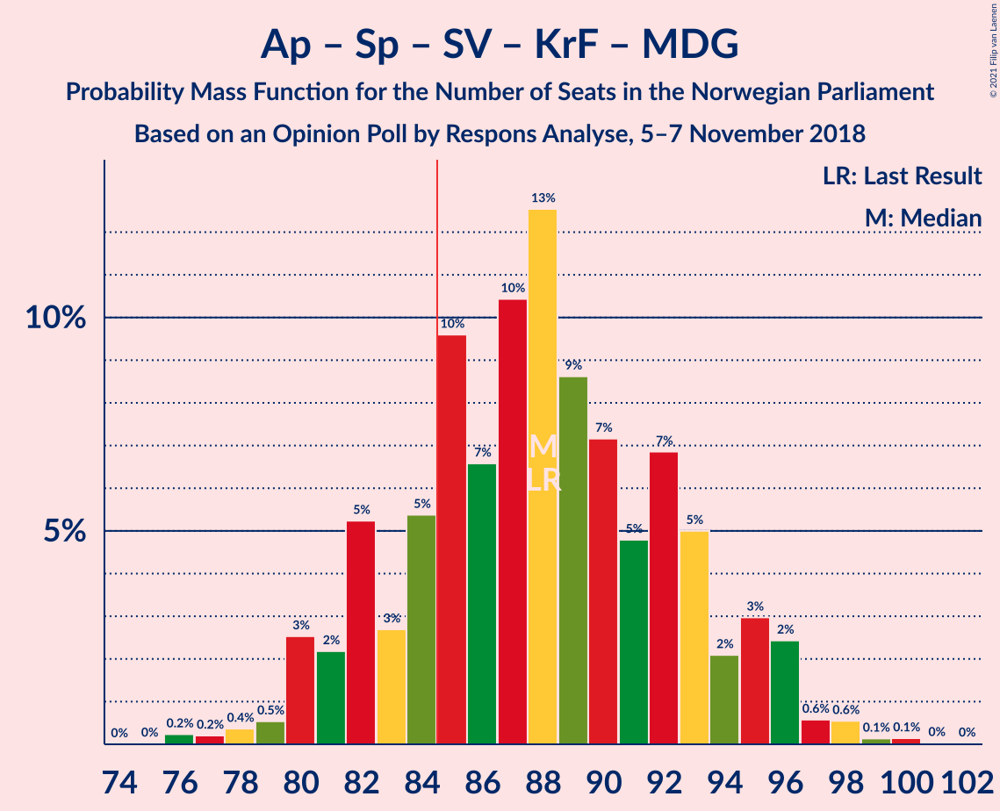

| Number of Seats | Probability | Accumulated | Special Marks |
|:---------------:|:-----------:|:-----------:|:-------------:|
| 76 | 0.2% | 100% |  |
| 77 | 0.2% | 99.7% |  |
| 78 | 0.4% | 99.5% |  |
| 79 | 0.5% | 99.2% |  |
| 80 | 3% | 98.6% |  |
| 81 | 2% | 96% |  |
| 82 | 5% | 94% |  |
| 83 | 3% | 89% |  |
| 84 | 5% | 86% |  |
| 85 | 10% | 81% | Majority |
| 86 | 7% | 71% |  |
| 87 | 10% | 64% |  |
| 88 | 13% | 54% | Last Result |
| 89 | 9% | 41% | Median |
| 90 | 7% | 33% |  |
| 91 | 5% | 26% |  |
| 92 | 7% | 21% |  |
| 93 | 5% | 14% |  |
| 94 | 2% | 9% |  |
| 95 | 3% | 7% |  |
| 96 | 2% | 4% |  |
| 97 | 0.6% | 1.5% |  |
| 98 | 0.6% | 0.9% |  |
| 99 | 0.1% | 0.4% |  |
| 100 | 0.1% | 0.2% |  |
| 101 | 0% | 0.1% |  |
| 102 | 0% | 0% |  |

### Arbeiderpartiet – Senterpartiet – Sosialistisk Venstreparti – Rødt – Miljøpartiet De Grønne

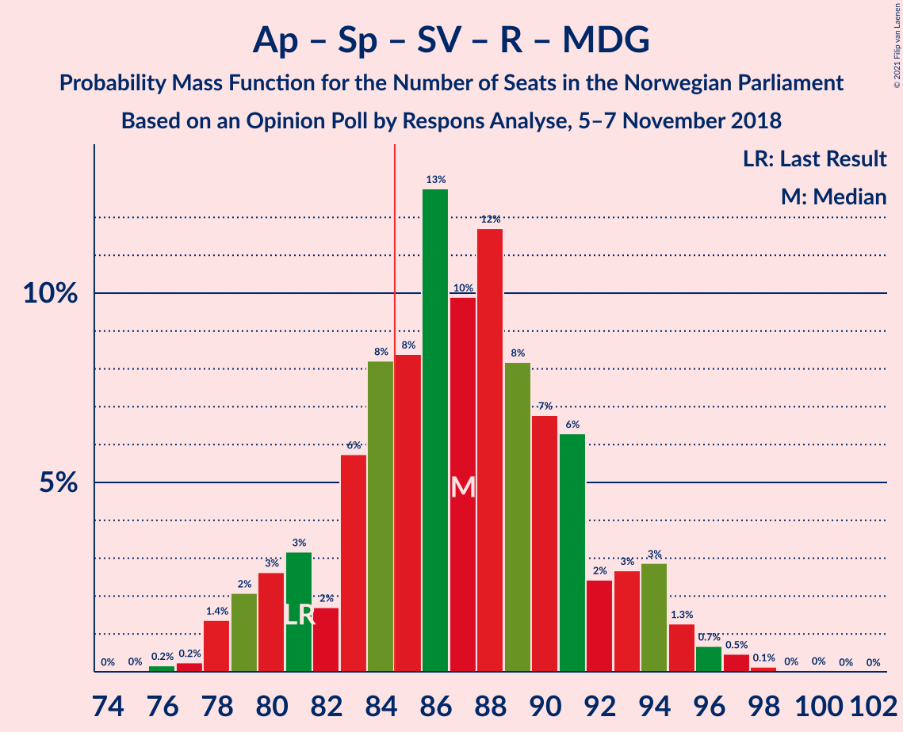

| Number of Seats | Probability | Accumulated | Special Marks |
|:---------------:|:-----------:|:-----------:|:-------------:|
| 75 | 0% | 100% |  |
| 76 | 0.2% | 99.9% |  |
| 77 | 0.2% | 99.8% |  |
| 78 | 1.4% | 99.5% |  |
| 79 | 2% | 98% |  |
| 80 | 3% | 96% |  |
| 81 | 3% | 93% | Last Result |
| 82 | 2% | 90% |  |
| 83 | 6% | 89% |  |
| 84 | 8% | 83% | Median |
| 85 | 8% | 75% | Majority |
| 86 | 13% | 66% |  |
| 87 | 10% | 53% |  |
| 88 | 12% | 44% |  |
| 89 | 8% | 32% |  |
| 90 | 7% | 24% |  |
| 91 | 6% | 17% |  |
| 92 | 2% | 11% |  |
| 93 | 3% | 8% |  |
| 94 | 3% | 6% |  |
| 95 | 1.3% | 3% |  |
| 96 | 0.7% | 1.4% |  |
| 97 | 0.5% | 0.7% |  |
| 98 | 0.1% | 0.2% |  |
| 99 | 0% | 0.1% |  |
| 100 | 0% | 0.1% |  |
| 101 | 0% | 0% |  |

### Arbeiderpartiet – Senterpartiet – Sosialistisk Venstreparti – Rødt

| Number of Seats | Probability | Accumulated | Special Marks |
|:---------------:|:-----------:|:-----------:|:-------------:|
| 73 | 0.1% | 100% |  |
| 74 | 0.5% | 99.9% |  |
| 75 | 0.2% | 99.3% |  |
| 76 | 1.2% | 99.1% |  |
| 77 | 3% | 98% |  |
| 78 | 4% | 95% |  |
| 79 | 3% | 92% |  |
| 80 | 2% | 89% | Last Result |
| 81 | 5% | 86% |  |
| 82 | 5% | 81% |  |
| 83 | 7% | 76% | Median |
| 84 | 9% | 70% |  |
| 85 | 13% | 61% | Majority |
| 86 | 12% | 49% |  |
| 87 | 11% | 37% |  |
| 88 | 6% | 27% |  |
| 89 | 8% | 21% |  |
| 90 | 5% | 13% |  |
| 91 | 3% | 8% |  |
| 92 | 3% | 6% |  |
| 93 | 2% | 3% |  |
| 94 | 0.4% | 1.1% |  |
| 95 | 0.3% | 0.7% |  |
| 96 | 0.3% | 0.4% |  |
| 97 | 0.1% | 0.2% |  |
| 98 | 0% | 0.1% |  |
| 99 | 0% | 0% |  |

### Høyre – Fremskrittspartiet – Kristelig Folkeparti – Venstre – Miljøpartiet De Grønne

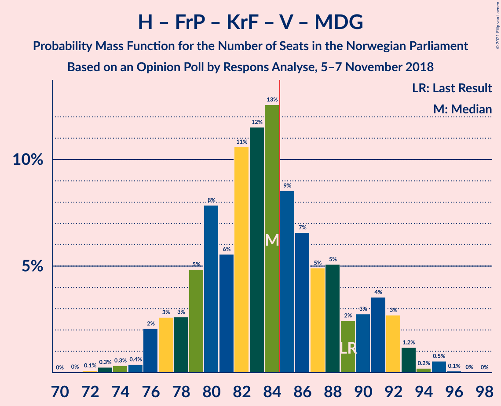

| Number of Seats | Probability | Accumulated | Special Marks |
|:---------------:|:-----------:|:-----------:|:-------------:|
| 71 | 0% | 100% |  |
| 72 | 0.1% | 99.9% |  |
| 73 | 0.3% | 99.8% |  |
| 74 | 0.3% | 99.6% |  |
| 75 | 0.4% | 99.3% |  |
| 76 | 2% | 98.9% |  |
| 77 | 3% | 97% |  |
| 78 | 3% | 94% |  |
| 79 | 5% | 92% |  |
| 80 | 8% | 87% |  |
| 81 | 6% | 79% |  |
| 82 | 11% | 73% |  |
| 83 | 12% | 63% |  |
| 84 | 13% | 51% |  |
| 85 | 9% | 39% | Majority |
| 86 | 7% | 30% | Median |
| 87 | 5% | 24% |  |
| 88 | 5% | 19% |  |
| 89 | 2% | 14% | Last Result |
| 90 | 3% | 11% |  |
| 91 | 4% | 8% |  |
| 92 | 3% | 5% |  |
| 93 | 1.2% | 2% |  |
| 94 | 0.2% | 0.9% |  |
| 95 | 0.5% | 0.7% |  |
| 96 | 0.1% | 0.1% |  |
| 97 | 0% | 0% |  |

### Arbeiderpartiet – Senterpartiet – Sosialistisk Venstreparti – Miljøpartiet De Grønne

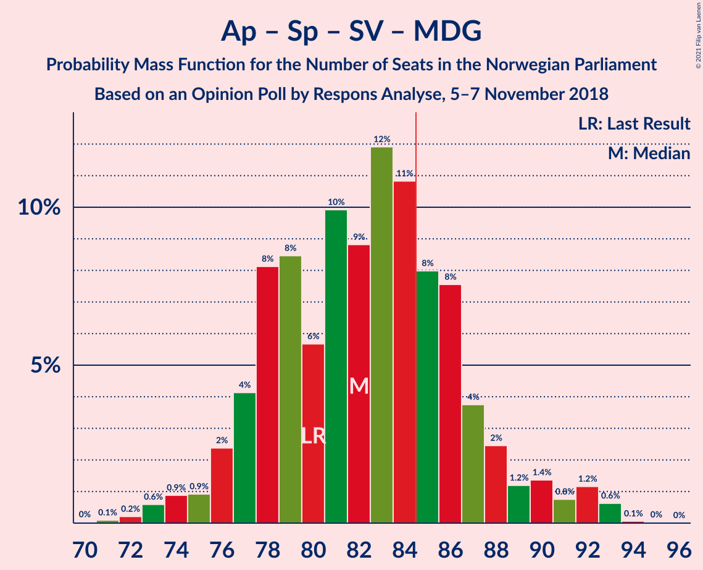

| Number of Seats | Probability | Accumulated | Special Marks |
|:---------------:|:-----------:|:-----------:|:-------------:|
| 70 | 0% | 100% |  |
| 71 | 0.1% | 99.9% |  |
| 72 | 0.2% | 99.8% |  |
| 73 | 0.6% | 99.6% |  |
| 74 | 0.9% | 99.0% |  |
| 75 | 0.9% | 98% |  |
| 76 | 2% | 97% |  |
| 77 | 4% | 95% |  |
| 78 | 8% | 91% |  |
| 79 | 8% | 83% |  |
| 80 | 6% | 74% | Last Result |
| 81 | 10% | 68% |  |
| 82 | 9% | 59% | Median |
| 83 | 12% | 50% |  |
| 84 | 11% | 38% |  |
| 85 | 8% | 27% | Majority |
| 86 | 8% | 19% |  |
| 87 | 4% | 11% |  |
| 88 | 2% | 8% |  |
| 89 | 1.2% | 5% |  |
| 90 | 1.4% | 4% |  |
| 91 | 0.8% | 3% |  |
| 92 | 1.2% | 2% |  |
| 93 | 0.6% | 0.7% |  |
| 94 | 0.1% | 0.1% |  |
| 95 | 0% | 0% |  |

### Høyre – Fremskrittspartiet – Kristelig Folkeparti – Venstre

| Number of Seats | Probability | Accumulated | Special Marks |
|:---------------:|:-----------:|:-----------:|:-------------:|
| 69 | 0% | 100% |  |
| 70 | 0% | 99.9% |  |
| 71 | 0.1% | 99.9% |  |
| 72 | 0.5% | 99.8% |  |
| 73 | 0.7% | 99.3% |  |
| 74 | 1.3% | 98.6% |  |
| 75 | 3% | 97% |  |
| 76 | 3% | 94% |  |
| 77 | 2% | 92% |  |
| 78 | 6% | 89% |  |
| 79 | 7% | 83% |  |
| 80 | 8% | 76% |  |
| 81 | 12% | 68% |  |
| 82 | 10% | 56% |  |
| 83 | 13% | 47% |  |
| 84 | 8% | 34% |  |
| 85 | 8% | 25% | Median, Majority |
| 86 | 6% | 17% |  |
| 87 | 2% | 11% |  |
| 88 | 3% | 10% | Last Result |
| 89 | 3% | 7% |  |
| 90 | 2% | 4% |  |
| 91 | 1.4% | 2% |  |
| 92 | 0.2% | 0.5% |  |
| 93 | 0.2% | 0.2% |  |
| 94 | 0% | 0.1% |  |
| 95 | 0% | 0% |  |

### Arbeiderpartiet – Senterpartiet – Sosialistisk Venstreparti

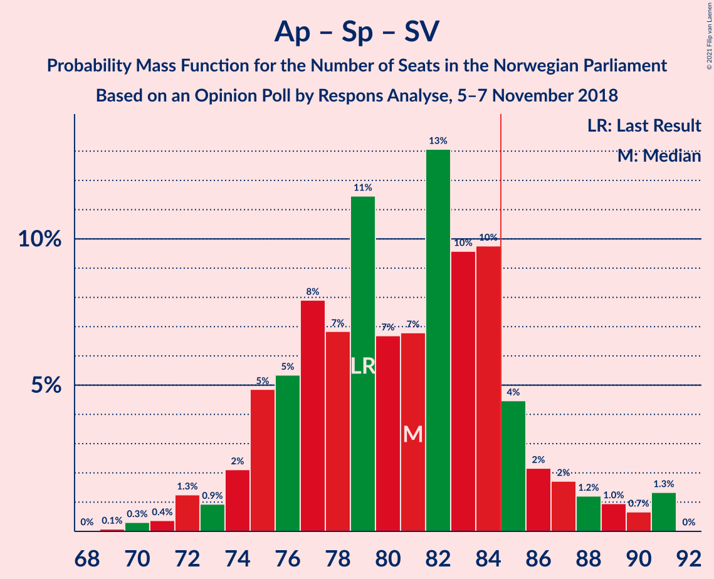

| Number of Seats | Probability | Accumulated | Special Marks |
|:---------------:|:-----------:|:-----------:|:-------------:|
| 69 | 0.1% | 100% |  |
| 70 | 0.3% | 99.9% |  |
| 71 | 0.4% | 99.6% |  |
| 72 | 1.3% | 99.2% |  |
| 73 | 0.9% | 98% |  |
| 74 | 2% | 97% |  |
| 75 | 5% | 95% |  |
| 76 | 5% | 90% |  |
| 77 | 8% | 85% |  |
| 78 | 7% | 77% |  |
| 79 | 11% | 70% | Last Result |
| 80 | 7% | 58% |  |
| 81 | 7% | 52% | Median |
| 82 | 13% | 45% |  |
| 83 | 10% | 32% |  |
| 84 | 10% | 22% |  |
| 85 | 4% | 13% | Majority |
| 86 | 2% | 8% |  |
| 87 | 2% | 6% |  |
| 88 | 1.2% | 4% |  |
| 89 | 1.0% | 3% |  |
| 90 | 0.7% | 2% |  |
| 91 | 1.3% | 1.4% |  |
| 92 | 0% | 0% |  |

### Arbeiderpartiet – Senterpartiet – Kristelig Folkeparti – Miljøpartiet De Grønne

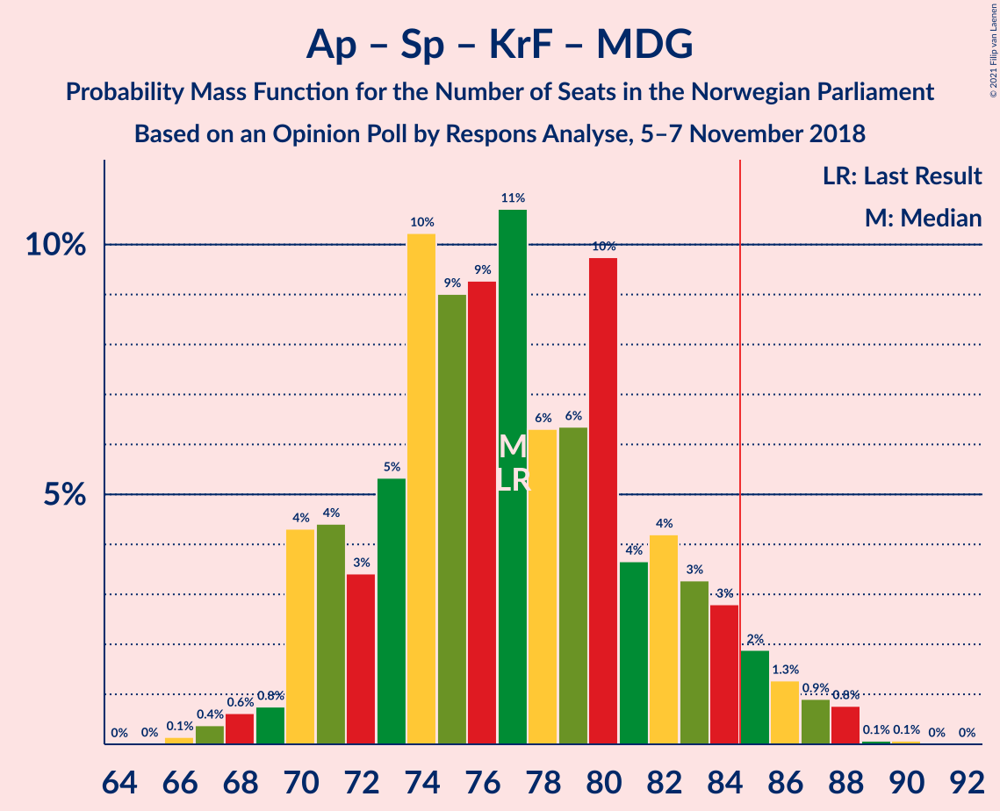

| Number of Seats | Probability | Accumulated | Special Marks |
|:---------------:|:-----------:|:-----------:|:-------------:|
| 66 | 0.1% | 100% |  |
| 67 | 0.4% | 99.8% |  |
| 68 | 0.6% | 99.4% |  |
| 69 | 0.8% | 98.8% |  |
| 70 | 4% | 98% |  |
| 71 | 4% | 94% |  |
| 72 | 3% | 89% |  |
| 73 | 5% | 86% |  |
| 74 | 10% | 81% |  |
| 75 | 9% | 70% |  |
| 76 | 9% | 61% |  |
| 77 | 11% | 52% | Last Result |
| 78 | 6% | 41% | Median |
| 79 | 6% | 35% |  |
| 80 | 10% | 29% |  |
| 81 | 4% | 19% |  |
| 82 | 4% | 15% |  |
| 83 | 3% | 11% |  |
| 84 | 3% | 8% |  |
| 85 | 2% | 5% | Majority |
| 86 | 1.3% | 3% |  |
| 87 | 0.9% | 2% |  |
| 88 | 0.8% | 0.9% |  |
| 89 | 0.1% | 0.2% |  |
| 90 | 0.1% | 0.1% |  |
| 91 | 0% | 0% |  |

### Høyre – Fremskrittspartiet – Venstre

| Number of Seats | Probability | Accumulated | Special Marks |
|:---------------:|:-----------:|:-----------:|:-------------:|
| 64 | 0.2% | 100% |  |
| 65 | 0.1% | 99.8% |  |
| 66 | 0.7% | 99.7% |  |
| 67 | 0.5% | 99.0% |  |
| 68 | 1.3% | 98.5% |  |
| 69 | 2% | 97% |  |
| 70 | 2% | 95% |  |
| 71 | 4% | 93% |  |
| 72 | 6% | 89% |  |
| 73 | 6% | 82% |  |
| 74 | 8% | 77% |  |
| 75 | 8% | 69% |  |
| 76 | 8% | 61% |  |
| 77 | 9% | 52% |  |
| 78 | 9% | 43% | Median |
| 79 | 12% | 34% |  |
| 80 | 5% | 22% | Last Result |
| 81 | 5% | 16% |  |
| 82 | 5% | 11% |  |
| 83 | 3% | 6% |  |
| 84 | 0.7% | 4% |  |
| 85 | 0.9% | 3% | Majority |
| 86 | 0.7% | 2% |  |
| 87 | 1.0% | 1.1% |  |
| 88 | 0.1% | 0.1% |  |
| 89 | 0% | 0% |  |

### Arbeiderpartiet – Senterpartiet – Kristelig Folkeparti

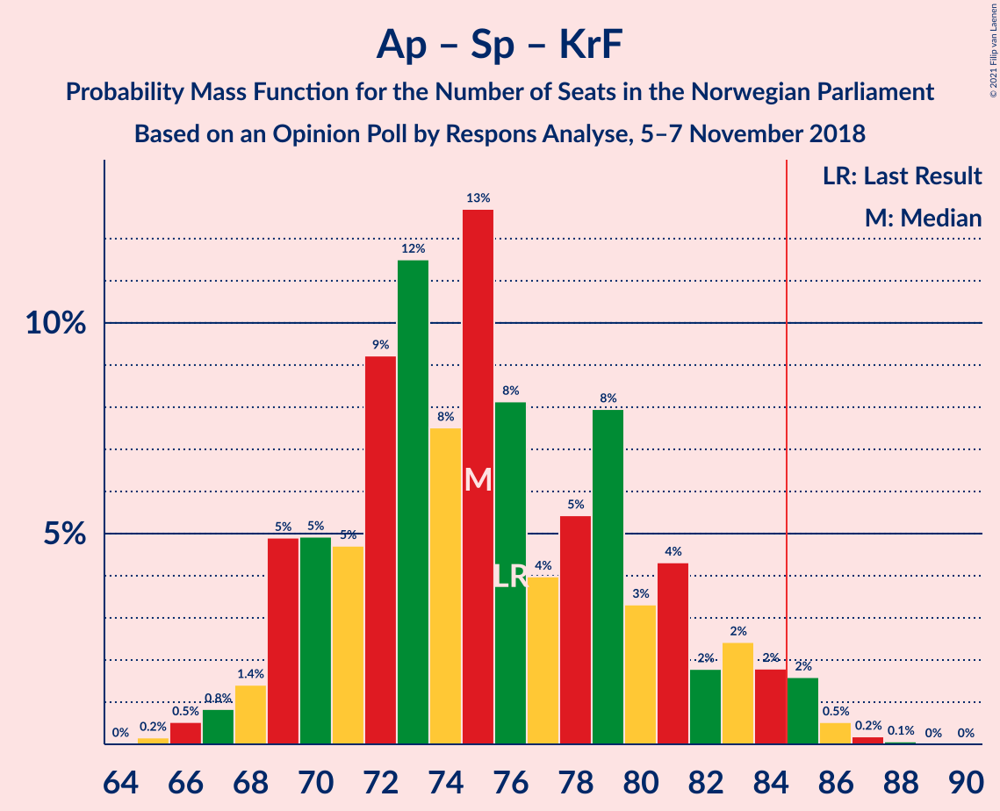

| Number of Seats | Probability | Accumulated | Special Marks |
|:---------------:|:-----------:|:-----------:|:-------------:|
| 65 | 0.2% | 100% |  |
| 66 | 0.5% | 99.8% |  |
| 67 | 0.8% | 99.3% |  |
| 68 | 1.4% | 98% |  |
| 69 | 5% | 97% |  |
| 70 | 5% | 92% |  |
| 71 | 5% | 87% |  |
| 72 | 9% | 82% |  |
| 73 | 12% | 73% |  |
| 74 | 8% | 62% |  |
| 75 | 13% | 54% |  |
| 76 | 8% | 42% | Last Result |
| 77 | 4% | 33% | Median |
| 78 | 5% | 29% |  |
| 79 | 8% | 24% |  |
| 80 | 3% | 16% |  |
| 81 | 4% | 13% |  |
| 82 | 2% | 8% |  |
| 83 | 2% | 7% |  |
| 84 | 2% | 4% |  |
| 85 | 2% | 2% | Majority |
| 86 | 0.5% | 0.8% |  |
| 87 | 0.2% | 0.3% |  |
| 88 | 0.1% | 0.1% |  |
| 89 | 0% | 0% |  |

### Høyre – Fremskrittspartiet

| Number of Seats | Probability | Accumulated | Special Marks |
|:---------------:|:-----------:|:-----------:|:-------------:|
| 59 | 0.1% | 100% |  |
| 60 | 0.2% | 99.9% |  |
| 61 | 0.5% | 99.7% |  |
| 62 | 2% | 99.1% |  |
| 63 | 1.1% | 97% |  |
| 64 | 4% | 96% |  |
| 65 | 3% | 92% |  |
| 66 | 3% | 89% |  |
| 67 | 5% | 86% |  |
| 68 | 6% | 80% |  |
| 69 | 7% | 74% |  |
| 70 | 13% | 67% |  |
| 71 | 10% | 54% | Median |
| 72 | 10% | 44% | Last Result |
| 73 | 9% | 34% |  |
| 74 | 6% | 26% |  |
| 75 | 7% | 19% |  |
| 76 | 5% | 13% |  |
| 77 | 4% | 8% |  |
| 78 | 3% | 4% |  |
| 79 | 0.4% | 1.4% |  |
| 80 | 0.7% | 1.1% |  |
| 81 | 0.1% | 0.4% |  |
| 82 | 0.2% | 0.3% |  |
| 83 | 0% | 0% |  |

### Arbeiderpartiet – Senterpartiet

| Number of Seats | Probability | Accumulated | Special Marks |
|:---------------:|:-----------:|:-----------:|:-------------:|
| 59 | 0.1% | 100% |  |
| 60 | 0.2% | 99.9% |  |
| 61 | 0.7% | 99.7% |  |
| 62 | 1.1% | 99.0% |  |
| 63 | 2% | 98% |  |
| 64 | 3% | 96% |  |
| 65 | 4% | 92% |  |
| 66 | 10% | 89% |  |
| 67 | 7% | 79% |  |
| 68 | 9% | 72% | Last Result |
| 69 | 10% | 63% |  |
| 70 | 8% | 53% | Median |
| 71 | 14% | 45% |  |
| 72 | 8% | 30% |  |
| 73 | 11% | 22% |  |
| 74 | 3% | 11% |  |
| 75 | 4% | 8% |  |
| 76 | 2% | 5% |  |
| 77 | 1.1% | 3% |  |
| 78 | 2% | 2% |  |
| 79 | 0.1% | 0.3% |  |
| 80 | 0.1% | 0.1% |  |
| 81 | 0.1% | 0.1% |  |
| 82 | 0% | 0% |  |

### Arbeiderpartiet – Sosialistisk Venstreparti

| Number of Seats | Probability | Accumulated | Special Marks |
|:---------------:|:-----------:|:-----------:|:-------------:|
| 52 | 0.1% | 100% |  |
| 53 | 0.2% | 99.9% |  |
| 54 | 1.1% | 99.6% |  |
| 55 | 1.0% | 98.5% |  |
| 56 | 2% | 98% |  |
| 57 | 3% | 95% |  |
| 58 | 7% | 92% |  |
| 59 | 8% | 85% |  |
| 60 | 9% | 77% | Last Result |
| 61 | 10% | 68% |  |
| 62 | 5% | 59% |  |
| 63 | 12% | 53% | Median |
| 64 | 11% | 42% |  |
| 65 | 9% | 31% |  |
| 66 | 7% | 21% |  |
| 67 | 8% | 14% |  |
| 68 | 2% | 6% |  |
| 69 | 1.0% | 4% |  |
| 70 | 0.6% | 3% |  |
| 71 | 1.4% | 2% |  |
| 72 | 0.1% | 0.6% |  |
| 73 | 0.5% | 0.5% |  |
| 74 | 0% | 0% |  |

### Høyre – Kristelig Folkeparti – Venstre

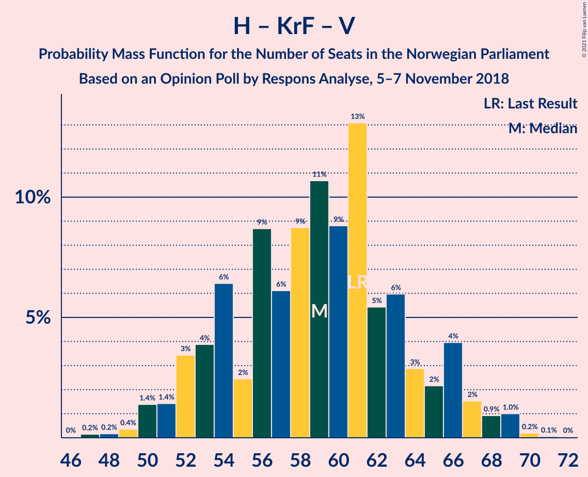

| Number of Seats | Probability | Accumulated | Special Marks |
|:---------------:|:-----------:|:-----------:|:-------------:|
| 46 | 0% | 100% |  |
| 47 | 0.2% | 99.9% |  |
| 48 | 0.2% | 99.8% |  |
| 49 | 0.4% | 99.6% |  |
| 50 | 1.4% | 99.3% |  |
| 51 | 1.4% | 98% |  |
| 52 | 3% | 96% |  |
| 53 | 4% | 93% |  |
| 54 | 6% | 89% |  |
| 55 | 2% | 83% |  |
| 56 | 9% | 80% |  |
| 57 | 6% | 72% |  |
| 58 | 9% | 65% |  |
| 59 | 11% | 57% |  |
| 60 | 9% | 46% |  |
| 61 | 13% | 37% | Last Result |
| 62 | 5% | 24% | Median |
| 63 | 6% | 19% |  |
| 64 | 3% | 13% |  |
| 65 | 2% | 10% |  |
| 66 | 4% | 8% |  |
| 67 | 2% | 4% |  |
| 68 | 0.9% | 2% |  |
| 69 | 1.0% | 1.3% |  |
| 70 | 0.2% | 0.3% |  |
| 71 | 0.1% | 0.1% |  |
| 72 | 0% | 0% |  |

### Senterpartiet – Kristelig Folkeparti – Venstre

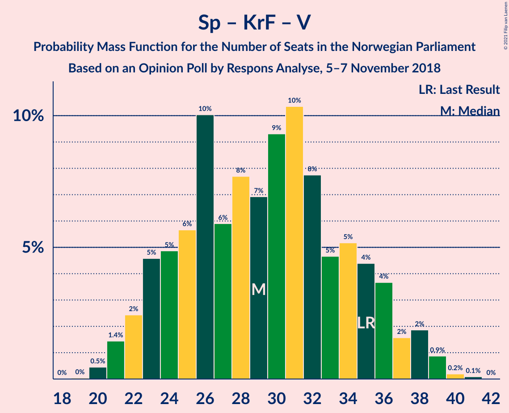

| Number of Seats | Probability | Accumulated | Special Marks |
|:---------------:|:-----------:|:-----------:|:-------------:|
| 19 | 0% | 100% |  |
| 20 | 0.5% | 99.9% |  |
| 21 | 1.4% | 99.5% |  |
| 22 | 2% | 98% |  |
| 23 | 5% | 96% |  |
| 24 | 5% | 91% |  |
| 25 | 6% | 86% |  |
| 26 | 10% | 80% |  |
| 27 | 6% | 70% |  |
| 28 | 8% | 65% |  |
| 29 | 7% | 57% |  |
| 30 | 9% | 50% |  |
| 31 | 10% | 41% |  |
| 32 | 8% | 30% | Median |
| 33 | 5% | 23% |  |
| 34 | 5% | 18% |  |
| 35 | 4% | 13% | Last Result |
| 36 | 4% | 8% |  |
| 37 | 2% | 5% |  |
| 38 | 2% | 3% |  |
| 39 | 0.9% | 1.2% |  |
| 40 | 0.2% | 0.3% |  |
| 41 | 0.1% | 0.1% |  |
| 42 | 0% | 0% |  |

## Technical Information

### Opinion Poll

+ **Polling firm:** Respons Analyse
+ **Commissioner(s):** —
+ **Fieldwork period:** 5–7 November 2018

### Calculations

+ **Sample size:** 1000
+ **Simulations done:** 1,048,576
+ **Error estimate:** 2.23%

