# Opinion Poll by Kantar TNS, 3 December 2018

<a href="#voting-intentions">Voting Intentions</a> | <a href="#seats">Seats</a> | <a href="#coalitions">Coalitions</a> | <a href="#technical-information">Technical Information</a>

## Voting Intentions

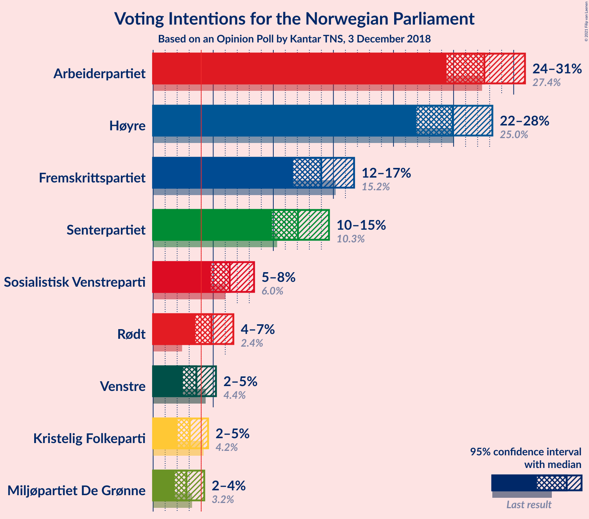

### Confidence Intervals

| Party | Last Result | Poll Result | 80% Confidence Interval | 90% Confidence Interval | 95% Confidence Interval | 99% Confidence Interval |
|:-----:|:-----------:|:-----------:|:-----------------------:|:-----------------------:|:-----------------------:|:-----------------------:|
| Arbeiderpartiet | 27.4% | 27.6% | 25.5–29.8% |24.9–30.4% |24.4–30.9% |23.5–32.0% |
| Høyre | 25.0% | 24.9% | 22.9–27.1% |22.4–27.7% |21.9–28.2% |21.0–29.3% |
| Fremskrittspartiet | 15.2% | 14.0% | 12.5–15.8% |12.0–16.3% |11.6–16.7% |10.9–17.6% |
| Senterpartiet | 10.3% | 12.0% | 10.6–13.7% |10.2–14.2% |9.9–14.6% |9.2–15.5% |
| Sosialistisk Venstreparti | 6.0% | 6.4% | 5.3–7.7% |5.0–8.1% |4.8–8.4% |4.4–9.1% |
| Rødt | 2.4% | 4.8% | 4.0–6.0% |3.7–6.4% |3.5–6.7% |3.1–7.3% |
| Venstre | 4.4% | 3.6% | 2.9–4.7% |2.6–5.0% |2.5–5.2% |2.1–5.8% |
| Kristelig Folkeparti | 4.2% | 3.0% | 2.4–4.0% |2.2–4.3% |2.0–4.6% |1.7–5.1% |
| Miljøpartiet De Grønne | 3.2% | 2.8% | 2.1–3.7% |2.0–4.0% |1.8–4.3% |1.5–4.8% |

*Note:* The poll result column reflects the actual value used in the calculations. Published results may vary slightly, and in addition be rounded to fewer digits.

## Seats

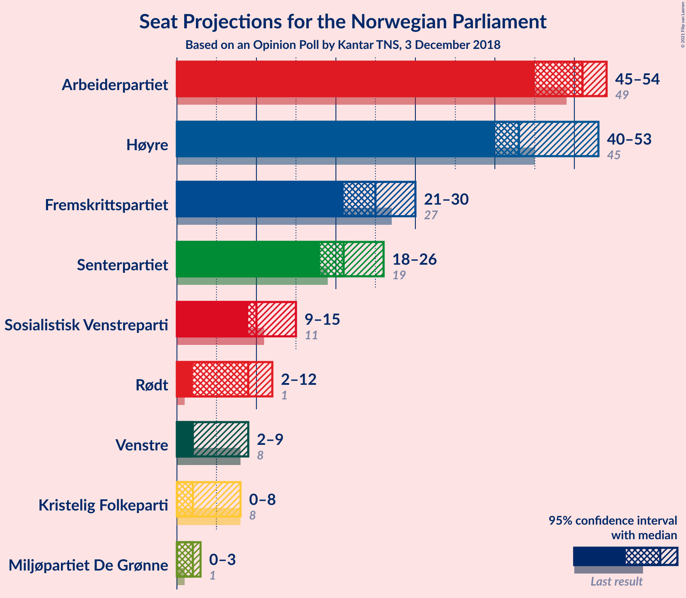

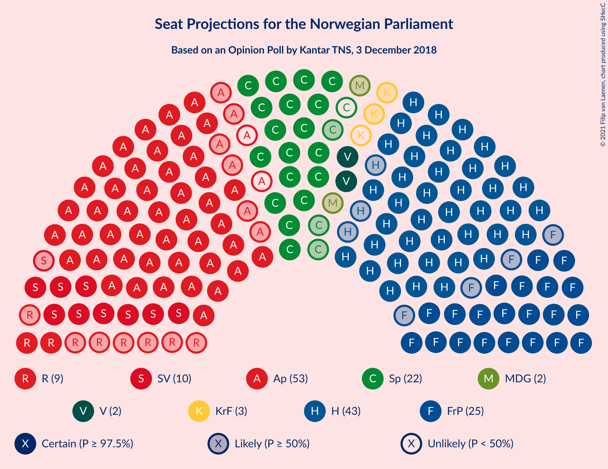

### Confidence Intervals

| Party | Last Result | Median | 80% Confidence Interval | 90% Confidence Interval | 95% Confidence Interval | 99% Confidence Interval |
|:-----:|:-----------:|:------:|:-----------------------:|:-----------------------:|:-----------------------:|:-----------------------:|
| <a href="#arbeiderpartiet">Arbeiderpartiet</a> | 49 | 51 | 47–53 |46–53 |45–54 |42–57 |
| <a href="#høyre">Høyre</a> | 45 | 43 | 40–49 |40–49 |40–53 |38–53 |
| <a href="#fremskrittspartiet">Fremskrittspartiet</a> | 27 | 25 | 23–27 |22–27 |21–30 |19–31 |
| <a href="#senterpartiet">Senterpartiet</a> | 19 | 21 | 19–23 |19–24 |18–26 |17–27 |
| <a href="#sosialistisk-venstreparti">Sosialistisk Venstreparti</a> | 11 | 10 | 10–14 |9–15 |9–15 |8–16 |
| <a href="#rødt">Rødt</a> | 1 | 9 | 8–11 |2–11 |2–12 |1–13 |
| <a href="#venstre">Venstre</a> | 8 | 2 | 2–8 |2–8 |2–9 |1–10 |
| <a href="#kristelig-folkeparti">Kristelig Folkeparti</a> | 8 | 2 | 1–7 |1–7 |0–8 |0–9 |
| <a href="#miljøpartiet-de-grønne">Miljøpartiet De Grønne</a> | 1 | 2 | 1–2 |0–3 |0–3 |0–8 |

### Arbeiderpartiet

*For a full overview of the results for this party, see the [Arbeiderpartiet](party-arbeiderpartiet.html) page.*

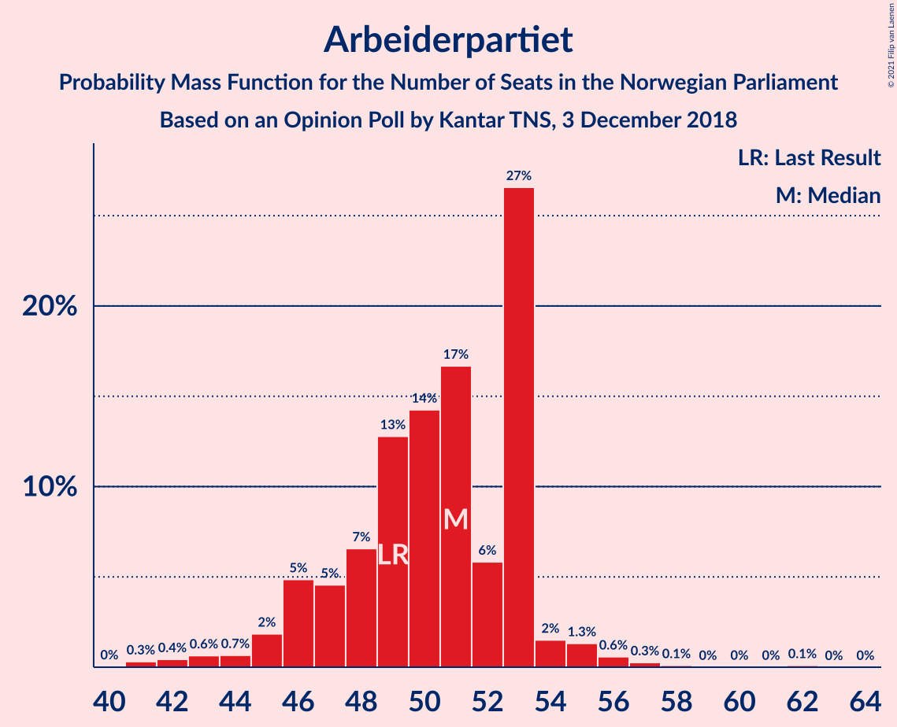

| Number of Seats | Probability | Accumulated | Special Marks |
|:---------------:|:-----------:|:-----------:|:-------------:|
| 40 | 0% | 100% |  |
| 41 | 0.3% | 99.9% |  |
| 42 | 0.4% | 99.6% |  |
| 43 | 0.6% | 99.2% |  |
| 44 | 0.7% | 98.6% |  |
| 45 | 2% | 98% |  |
| 46 | 5% | 96% |  |
| 47 | 5% | 91% |  |
| 48 | 7% | 87% |  |
| 49 | 13% | 80% | Last Result |
| 50 | 14% | 67% |  |
| 51 | 17% | 53% | Median |
| 52 | 6% | 36% |  |
| 53 | 27% | 30% |  |
| 54 | 2% | 4% |  |
| 55 | 1.3% | 2% |  |
| 56 | 0.6% | 1.1% |  |
| 57 | 0.3% | 0.5% |  |
| 58 | 0.1% | 0.3% |  |
| 59 | 0% | 0.1% |  |
| 60 | 0% | 0.1% |  |
| 61 | 0% | 0.1% |  |
| 62 | 0.1% | 0.1% |  |
| 63 | 0% | 0% |  |

### Høyre

*For a full overview of the results for this party, see the [Høyre](party-høyre.html) page.*

| Number of Seats | Probability | Accumulated | Special Marks |
|:---------------:|:-----------:|:-----------:|:-------------:|
| 36 | 0.1% | 100% |  |
| 37 | 0.2% | 99.8% |  |
| 38 | 1.2% | 99.6% |  |
| 39 | 0.8% | 98% |  |
| 40 | 15% | 98% |  |
| 41 | 2% | 83% |  |
| 42 | 3% | 81% |  |
| 43 | 29% | 77% | Median |
| 44 | 5% | 48% |  |
| 45 | 12% | 43% | Last Result |
| 46 | 10% | 31% |  |
| 47 | 9% | 20% |  |
| 48 | 1.0% | 11% |  |
| 49 | 6% | 10% |  |
| 50 | 0.4% | 5% |  |
| 51 | 0.1% | 4% |  |
| 52 | 0.6% | 4% |  |
| 53 | 4% | 4% |  |
| 54 | 0% | 0.1% |  |
| 55 | 0% | 0% |  |

### Fremskrittspartiet

*For a full overview of the results for this party, see the [Fremskrittspartiet](party-fremskrittspartiet.html) page.*

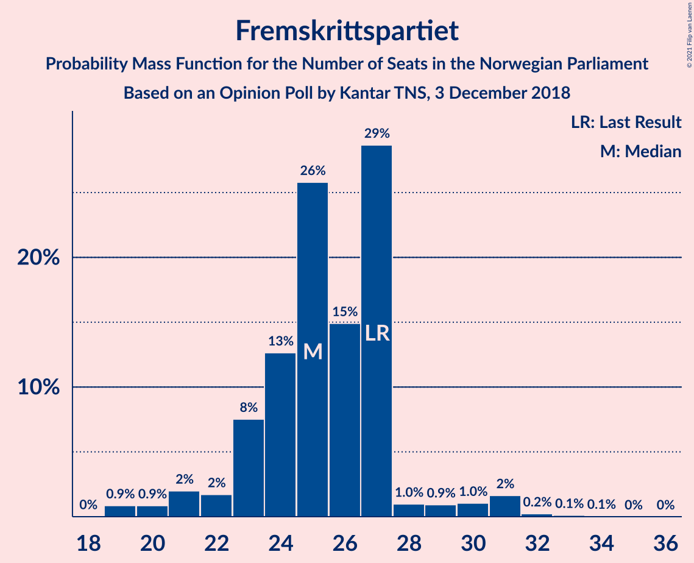

| Number of Seats | Probability | Accumulated | Special Marks |
|:---------------:|:-----------:|:-----------:|:-------------:|
| 19 | 0.9% | 100% |  |
| 20 | 0.9% | 99.1% |  |
| 21 | 2% | 98% |  |
| 22 | 2% | 96% |  |
| 23 | 8% | 95% |  |
| 24 | 13% | 87% |  |
| 25 | 26% | 74% | Median |
| 26 | 15% | 49% |  |
| 27 | 29% | 34% | Last Result |
| 28 | 1.0% | 5% |  |
| 29 | 0.9% | 4% |  |
| 30 | 1.0% | 3% |  |
| 31 | 2% | 2% |  |
| 32 | 0.2% | 0.4% |  |
| 33 | 0.1% | 0.2% |  |
| 34 | 0.1% | 0.1% |  |
| 35 | 0% | 0% |  |

### Senterpartiet

*For a full overview of the results for this party, see the [Senterpartiet](party-senterpartiet.html) page.*

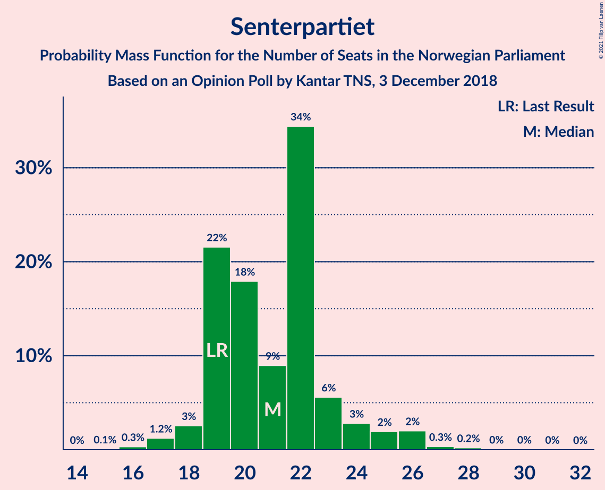

| Number of Seats | Probability | Accumulated | Special Marks |
|:---------------:|:-----------:|:-----------:|:-------------:|
| 15 | 0.1% | 100% |  |
| 16 | 0.3% | 99.9% |  |
| 17 | 1.2% | 99.6% |  |
| 18 | 3% | 98% |  |
| 19 | 22% | 96% | Last Result |
| 20 | 18% | 74% |  |
| 21 | 9% | 56% | Median |
| 22 | 34% | 47% |  |
| 23 | 6% | 13% |  |
| 24 | 3% | 7% |  |
| 25 | 2% | 5% |  |
| 26 | 2% | 3% |  |
| 27 | 0.3% | 0.6% |  |
| 28 | 0.2% | 0.3% |  |
| 29 | 0% | 0.1% |  |
| 30 | 0% | 0.1% |  |
| 31 | 0% | 0% |  |

### Sosialistisk Venstreparti

*For a full overview of the results for this party, see the [Sosialistisk Venstreparti](party-sosialistiskvenstreparti.html) page.*

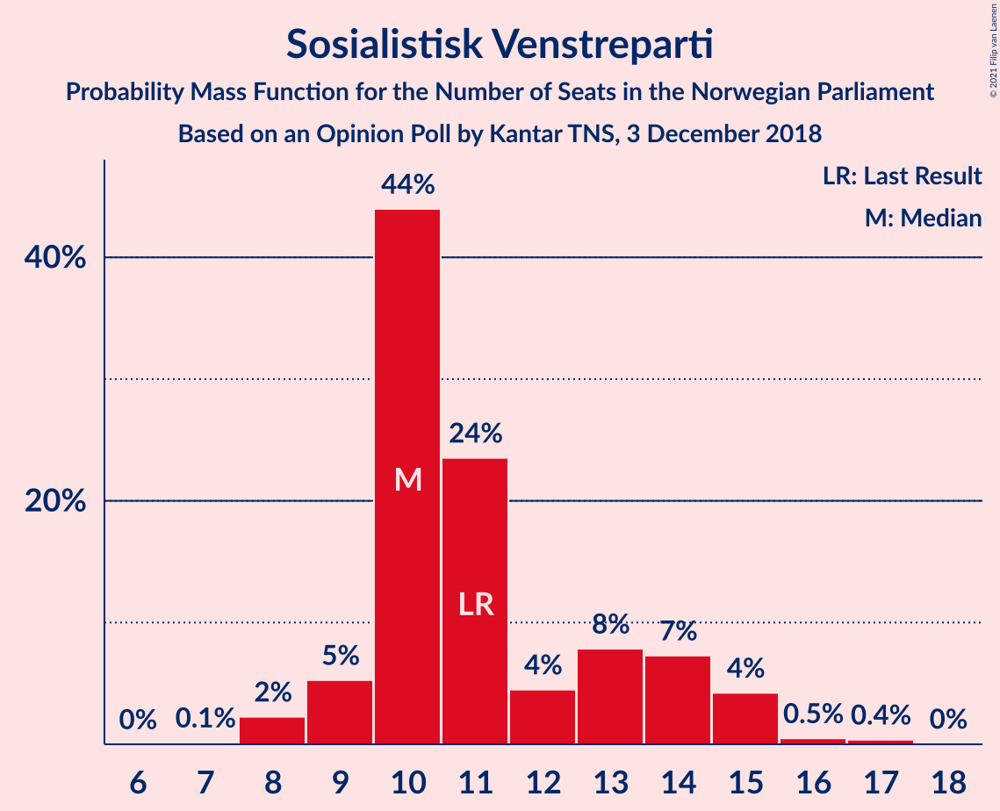

| Number of Seats | Probability | Accumulated | Special Marks |
|:---------------:|:-----------:|:-----------:|:-------------:|
| 7 | 0.1% | 100% |  |
| 8 | 2% | 99.8% |  |
| 9 | 5% | 98% |  |
| 10 | 44% | 92% | Median |
| 11 | 24% | 48% | Last Result |
| 12 | 4% | 25% |  |
| 13 | 8% | 20% |  |
| 14 | 7% | 12% |  |
| 15 | 4% | 5% |  |
| 16 | 0.5% | 0.9% |  |
| 17 | 0.4% | 0.4% |  |
| 18 | 0% | 0% |  |

### Rødt

*For a full overview of the results for this party, see the [Rødt](party-rødt.html) page.*

| Number of Seats | Probability | Accumulated | Special Marks |
|:---------------:|:-----------:|:-----------:|:-------------:|
| 1 | 1.1% | 100% | Last Result |
| 2 | 6% | 98.9% |  |
| 3 | 0% | 93% |  |
| 4 | 0% | 93% |  |
| 5 | 0% | 93% |  |
| 6 | 0% | 93% |  |
| 7 | 2% | 93% |  |
| 8 | 30% | 91% |  |
| 9 | 37% | 61% | Median |
| 10 | 5% | 25% |  |
| 11 | 17% | 19% |  |
| 12 | 2% | 3% |  |
| 13 | 0.4% | 0.7% |  |
| 14 | 0.3% | 0.3% |  |
| 15 | 0% | 0.1% |  |
| 16 | 0% | 0% |  |

### Venstre

*For a full overview of the results for this party, see the [Venstre](party-venstre.html) page.*

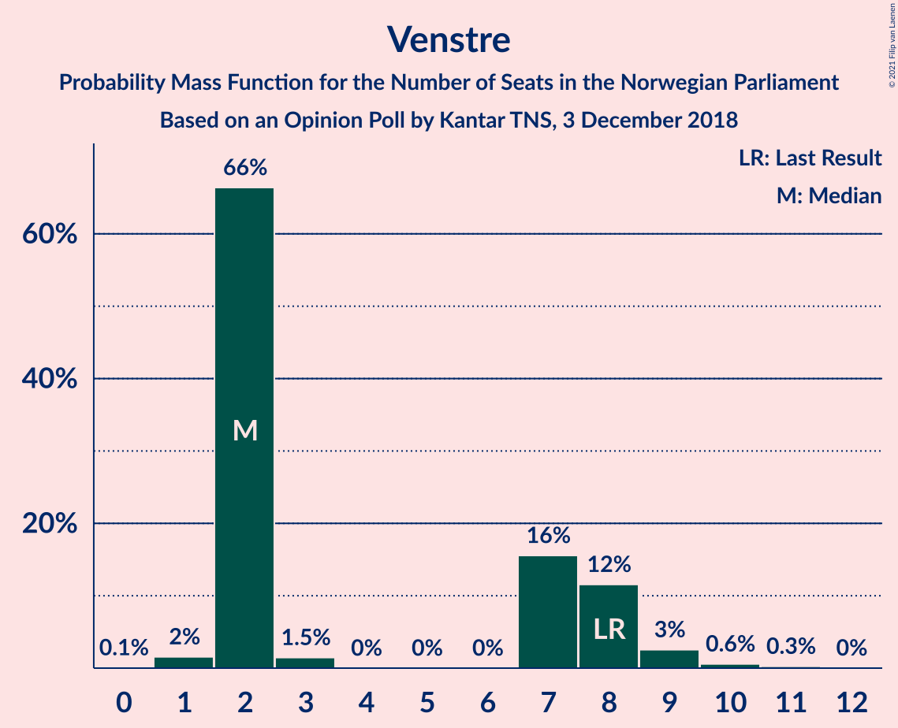

| Number of Seats | Probability | Accumulated | Special Marks |
|:---------------:|:-----------:|:-----------:|:-------------:|
| 0 | 0.1% | 100% |  |
| 1 | 2% | 99.9% |  |
| 2 | 66% | 98% | Median |
| 3 | 1.5% | 32% |  |
| 4 | 0% | 31% |  |
| 5 | 0% | 31% |  |
| 6 | 0% | 31% |  |
| 7 | 16% | 31% |  |
| 8 | 12% | 15% | Last Result |
| 9 | 3% | 3% |  |
| 10 | 0.6% | 0.8% |  |
| 11 | 0.3% | 0.3% |  |
| 12 | 0% | 0% |  |

### Kristelig Folkeparti

*For a full overview of the results for this party, see the [Kristelig Folkeparti](party-kristeligfolkeparti.html) page.*

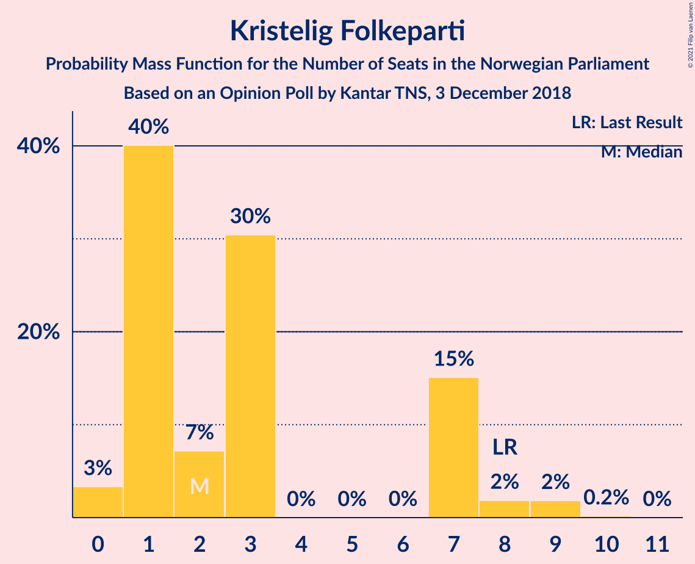

| Number of Seats | Probability | Accumulated | Special Marks |
|:---------------:|:-----------:|:-----------:|:-------------:|
| 0 | 3% | 100% |  |
| 1 | 40% | 97% |  |
| 2 | 7% | 57% | Median |
| 3 | 30% | 49% |  |
| 4 | 0% | 19% |  |
| 5 | 0% | 19% |  |
| 6 | 0% | 19% |  |
| 7 | 15% | 19% |  |
| 8 | 2% | 4% | Last Result |
| 9 | 2% | 2% |  |
| 10 | 0.2% | 0.2% |  |
| 11 | 0% | 0% |  |

### Miljøpartiet De Grønne

*For a full overview of the results for this party, see the [Miljøpartiet De Grønne](party-miljøpartietdegrønne.html) page.*

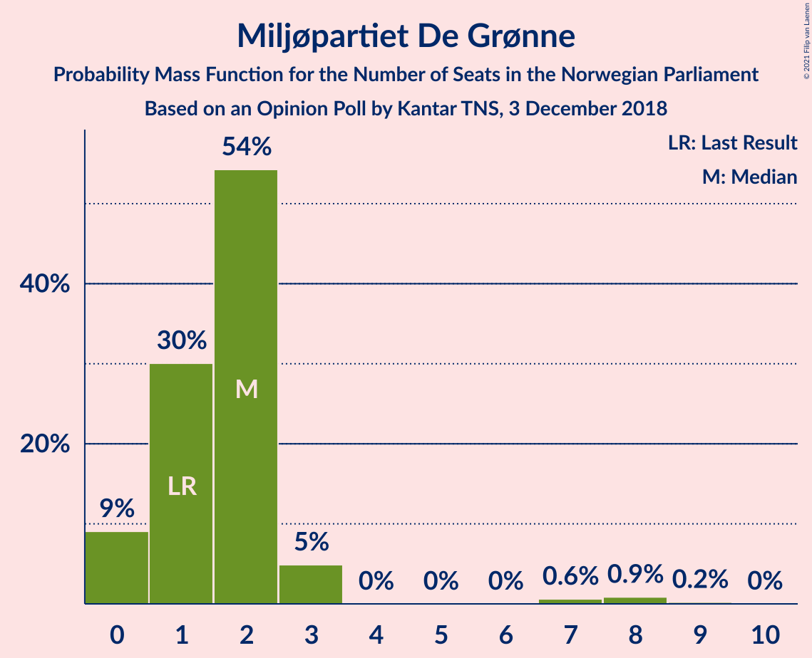

| Number of Seats | Probability | Accumulated | Special Marks |
|:---------------:|:-----------:|:-----------:|:-------------:|
| 0 | 9% | 100% |  |
| 1 | 30% | 91% | Last Result |
| 2 | 54% | 61% | Median |
| 3 | 5% | 7% |  |
| 4 | 0% | 2% |  |
| 5 | 0% | 2% |  |
| 6 | 0% | 2% |  |
| 7 | 0.6% | 2% |  |
| 8 | 0.9% | 1.1% |  |
| 9 | 0.2% | 0.2% |  |
| 10 | 0% | 0% |  |

## Coalitions

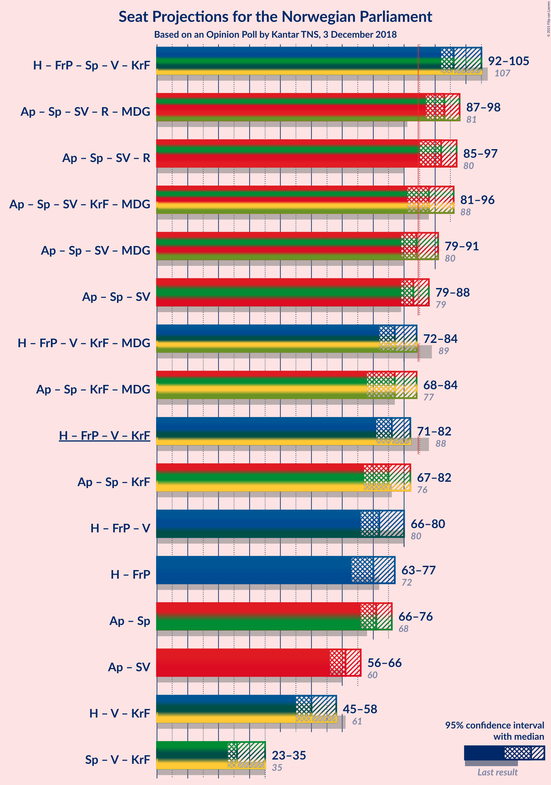

### Confidence Intervals

| Coalition | Last Result | Median | Majority? | 80% Confidence Interval | 90% Confidence Interval | 95% Confidence Interval | 99% Confidence Interval |
|:---------:|:-----------:|:------:|:---------:|:-----------------------:|:-----------------------:|:-----------------------:|:-----------------------:|
| Høyre – Fremskrittspartiet – Senterpartiet – Venstre – Kristelig Folkeparti | 107 | 96 | 100% | 95–101 | 93–102 | 92–105 | 89–108 |
| Arbeiderpartiet – Senterpartiet – Sosialistisk Venstreparti – Rødt – Miljøpartiet De Grønne | 81 | 93 | 99.2% | 87–96 | 87–97 | 87–98 | 83–101 |
| Arbeiderpartiet – Senterpartiet – Sosialistisk Venstreparti – Rødt | 80 | 92 | 98% | 87–94 | 87–95 | 85–97 | 82–100 |
| Arbeiderpartiet – Senterpartiet – Sosialistisk Venstreparti – Kristelig Folkeparti – Miljøpartiet De Grønne | 88 | 88 | 79% | 82–89 | 82–92 | 81–96 | 79–96 |
| Arbeiderpartiet – Senterpartiet – Sosialistisk Venstreparti – Miljøpartiet De Grønne | 80 | 84 | 49% | 80–87 | 79–88 | 79–91 | 76–95 |
| Arbeiderpartiet – Senterpartiet – Sosialistisk Venstreparti | 79 | 83 | 39% | 79–85 | 79–86 | 79–88 | 73–92 |
| Høyre – Fremskrittspartiet – Venstre – Kristelig Folkeparti – Miljøpartiet De Grønne | 89 | 77 | 2% | 75–82 | 74–82 | 72–84 | 69–87 |
| Arbeiderpartiet – Senterpartiet – Kristelig Folkeparti – Miljøpartiet De Grønne | 77 | 77 | 0.5% | 71–78 | 71–81 | 68–84 | 67–85 |
| Høyre – Fremskrittspartiet – Venstre – Kristelig Folkeparti | 88 | 76 | 0.8% | 73–82 | 72–82 | 71–82 | 68–86 |
| Arbeiderpartiet – Senterpartiet – Kristelig Folkeparti | 76 | 75 | 0.1% | 71–76 | 70–78 | 67–82 | 65–83 |
| Høyre – Fremskrittspartiet – Venstre | 80 | 72 | 0.2% | 71–79 | 69–79 | 66–80 | 65–82 |
| Høyre – Fremskrittspartiet | 72 | 70 | 0% | 65–73 | 65–75 | 63–77 | 60–78 |
| Arbeiderpartiet – Senterpartiet | 68 | 71 | 0% | 68–75 | 67–75 | 66–76 | 62–80 |
| Arbeiderpartiet – Sosialistisk Venstreparti | 60 | 61 | 0% | 58–64 | 57–66 | 56–66 | 53–70 |
| Høyre – Venstre – Kristelig Folkeparti | 61 | 50 | 0% | 46–57 | 46–57 | 45–58 | 43–61 |
| Senterpartiet – Venstre – Kristelig Folkeparti | 35 | 26 | 0% | 25–33 | 24–33 | 23–35 | 20–40 |

### Høyre – Fremskrittspartiet – Senterpartiet – Venstre – Kristelig Folkeparti

| Number of Seats | Probability | Accumulated | Special Marks |
|:---------------:|:-----------:|:-----------:|:-------------:|
| 86 | 0.3% | 100% |  |
| 87 | 0% | 99.7% |  |
| 88 | 0.1% | 99.6% |  |
| 89 | 0.1% | 99.6% |  |
| 90 | 0.4% | 99.5% |  |
| 91 | 0.6% | 99.1% |  |
| 92 | 3% | 98% |  |
| 93 | 2% | 96% | Median |
| 94 | 3% | 94% |  |
| 95 | 27% | 91% |  |
| 96 | 18% | 64% |  |
| 97 | 4% | 46% |  |
| 98 | 14% | 42% |  |
| 99 | 6% | 28% |  |
| 100 | 4% | 23% |  |
| 101 | 10% | 19% |  |
| 102 | 4% | 9% |  |
| 103 | 1.0% | 4% |  |
| 104 | 0.2% | 3% |  |
| 105 | 0.9% | 3% |  |
| 106 | 1.0% | 2% |  |
| 107 | 0.3% | 1.0% | Last Result |
| 108 | 0.5% | 0.8% |  |
| 109 | 0.1% | 0.2% |  |
| 110 | 0.1% | 0.1% |  |
| 111 | 0% | 0% |  |

### Arbeiderpartiet – Senterpartiet – Sosialistisk Venstreparti – Rødt – Miljøpartiet De Grønne

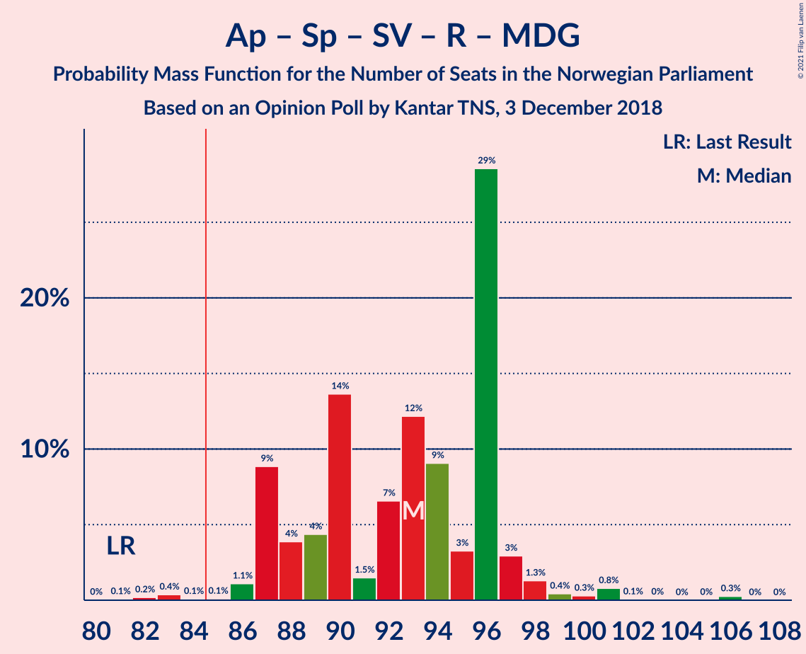

| Number of Seats | Probability | Accumulated | Special Marks |
|:---------------:|:-----------:|:-----------:|:-------------:|
| 81 | 0.1% | 100% | Last Result |
| 82 | 0.2% | 99.9% |  |
| 83 | 0.4% | 99.7% |  |
| 84 | 0.1% | 99.3% |  |
| 85 | 0.1% | 99.2% | Majority |
| 86 | 1.1% | 99.1% |  |
| 87 | 9% | 98% |  |
| 88 | 4% | 89% |  |
| 89 | 4% | 85% |  |
| 90 | 14% | 81% |  |
| 91 | 1.5% | 67% |  |
| 92 | 7% | 66% |  |
| 93 | 12% | 59% | Median |
| 94 | 9% | 47% |  |
| 95 | 3% | 38% |  |
| 96 | 29% | 35% |  |
| 97 | 3% | 6% |  |
| 98 | 1.3% | 3% |  |
| 99 | 0.4% | 2% |  |
| 100 | 0.3% | 1.5% |  |
| 101 | 0.8% | 1.2% |  |
| 102 | 0.1% | 0.4% |  |
| 103 | 0% | 0.3% |  |
| 104 | 0% | 0.3% |  |
| 105 | 0% | 0.3% |  |
| 106 | 0.3% | 0.3% |  |
| 107 | 0% | 0% |  |

### Arbeiderpartiet – Senterpartiet – Sosialistisk Venstreparti – Rødt

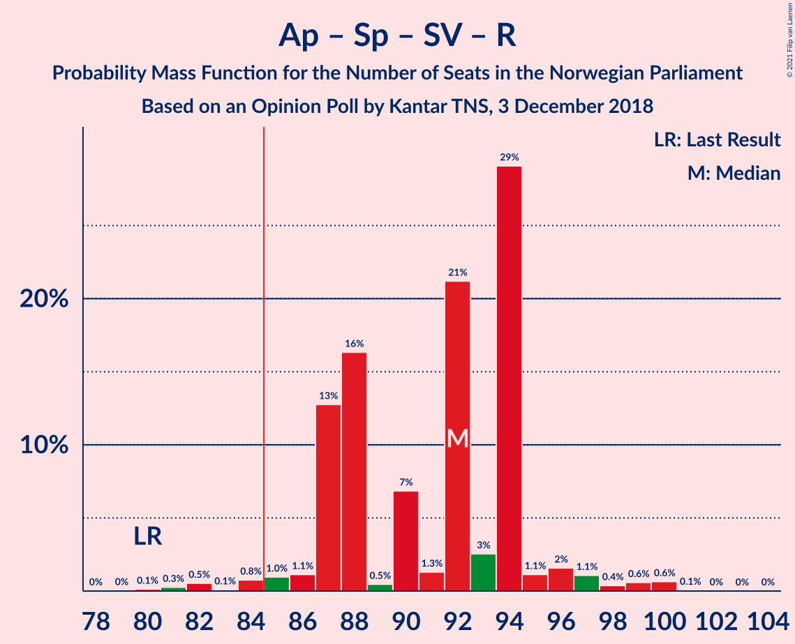

| Number of Seats | Probability | Accumulated | Special Marks |
|:---------------:|:-----------:|:-----------:|:-------------:|
| 79 | 0% | 100% |  |
| 80 | 0.1% | 99.9% | Last Result |
| 81 | 0.3% | 99.8% |  |
| 82 | 0.5% | 99.5% |  |
| 83 | 0.1% | 99.0% |  |
| 84 | 0.8% | 98.9% |  |
| 85 | 1.0% | 98% | Majority |
| 86 | 1.1% | 97% |  |
| 87 | 13% | 96% |  |
| 88 | 16% | 83% |  |
| 89 | 0.5% | 67% |  |
| 90 | 7% | 67% |  |
| 91 | 1.3% | 60% | Median |
| 92 | 21% | 58% |  |
| 93 | 3% | 37% |  |
| 94 | 29% | 35% |  |
| 95 | 1.1% | 6% |  |
| 96 | 2% | 4% |  |
| 97 | 1.1% | 3% |  |
| 98 | 0.4% | 2% |  |
| 99 | 0.6% | 1.4% |  |
| 100 | 0.6% | 0.8% |  |
| 101 | 0.1% | 0.1% |  |
| 102 | 0% | 0.1% |  |
| 103 | 0% | 0% |  |

### Arbeiderpartiet – Senterpartiet – Sosialistisk Venstreparti – Kristelig Folkeparti – Miljøpartiet De Grønne

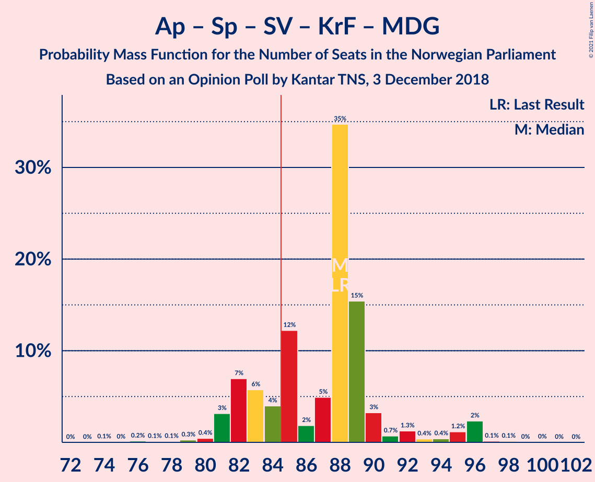

| Number of Seats | Probability | Accumulated | Special Marks |
|:---------------:|:-----------:|:-----------:|:-------------:|
| 74 | 0.1% | 100% |  |
| 75 | 0% | 99.9% |  |
| 76 | 0.2% | 99.9% |  |
| 77 | 0.1% | 99.8% |  |
| 78 | 0.1% | 99.6% |  |
| 79 | 0.3% | 99.5% |  |
| 80 | 0.4% | 99.3% |  |
| 81 | 3% | 98.8% |  |
| 82 | 7% | 96% |  |
| 83 | 6% | 89% |  |
| 84 | 4% | 83% |  |
| 85 | 12% | 79% | Majority |
| 86 | 2% | 67% | Median |
| 87 | 5% | 65% |  |
| 88 | 35% | 60% | Last Result |
| 89 | 15% | 25% |  |
| 90 | 3% | 10% |  |
| 91 | 0.7% | 7% |  |
| 92 | 1.3% | 6% |  |
| 93 | 0.4% | 5% |  |
| 94 | 0.4% | 4% |  |
| 95 | 1.2% | 4% |  |
| 96 | 2% | 3% |  |
| 97 | 0.1% | 0.4% |  |
| 98 | 0.1% | 0.2% |  |
| 99 | 0% | 0.1% |  |
| 100 | 0% | 0.1% |  |
| 101 | 0% | 0% |  |

### Arbeiderpartiet – Senterpartiet – Sosialistisk Venstreparti – Miljøpartiet De Grønne

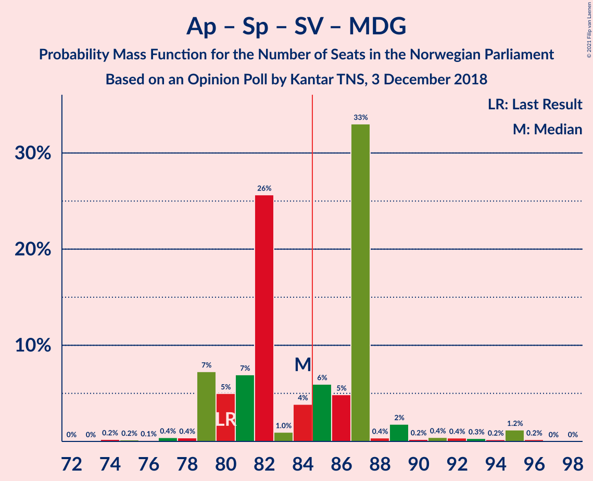

| Number of Seats | Probability | Accumulated | Special Marks |
|:---------------:|:-----------:|:-----------:|:-------------:|
| 73 | 0% | 100% |  |
| 74 | 0.2% | 99.9% |  |
| 75 | 0.2% | 99.7% |  |
| 76 | 0.1% | 99.6% |  |
| 77 | 0.4% | 99.4% |  |
| 78 | 0.4% | 99.0% |  |
| 79 | 7% | 98.7% |  |
| 80 | 5% | 91% | Last Result |
| 81 | 7% | 86% |  |
| 82 | 26% | 79% |  |
| 83 | 1.0% | 54% |  |
| 84 | 4% | 53% | Median |
| 85 | 6% | 49% | Majority |
| 86 | 5% | 43% |  |
| 87 | 33% | 38% |  |
| 88 | 0.4% | 5% |  |
| 89 | 2% | 5% |  |
| 90 | 0.2% | 3% |  |
| 91 | 0.4% | 3% |  |
| 92 | 0.4% | 2% |  |
| 93 | 0.3% | 2% |  |
| 94 | 0.2% | 2% |  |
| 95 | 1.2% | 1.5% |  |
| 96 | 0.2% | 0.3% |  |
| 97 | 0% | 0.1% |  |
| 98 | 0% | 0% |  |

### Arbeiderpartiet – Senterpartiet – Sosialistisk Venstreparti

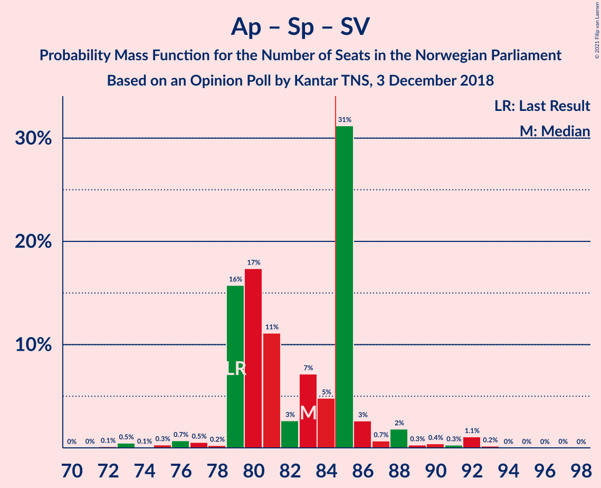

| Number of Seats | Probability | Accumulated | Special Marks |
|:---------------:|:-----------:|:-----------:|:-------------:|
| 71 | 0% | 100% |  |
| 72 | 0.1% | 99.9% |  |
| 73 | 0.5% | 99.8% |  |
| 74 | 0.1% | 99.3% |  |
| 75 | 0.3% | 99.3% |  |
| 76 | 0.7% | 99.0% |  |
| 77 | 0.5% | 98% |  |
| 78 | 0.2% | 98% |  |
| 79 | 16% | 98% | Last Result |
| 80 | 17% | 82% |  |
| 81 | 11% | 64% |  |
| 82 | 3% | 53% | Median |
| 83 | 7% | 51% |  |
| 84 | 5% | 43% |  |
| 85 | 31% | 39% | Majority |
| 86 | 3% | 7% |  |
| 87 | 0.7% | 5% |  |
| 88 | 2% | 4% |  |
| 89 | 0.3% | 2% |  |
| 90 | 0.4% | 2% |  |
| 91 | 0.3% | 2% |  |
| 92 | 1.1% | 1.4% |  |
| 93 | 0.2% | 0.3% |  |
| 94 | 0% | 0.1% |  |
| 95 | 0% | 0.1% |  |
| 96 | 0% | 0.1% |  |
| 97 | 0% | 0% |  |

### Høyre – Fremskrittspartiet – Venstre – Kristelig Folkeparti – Miljøpartiet De Grønne

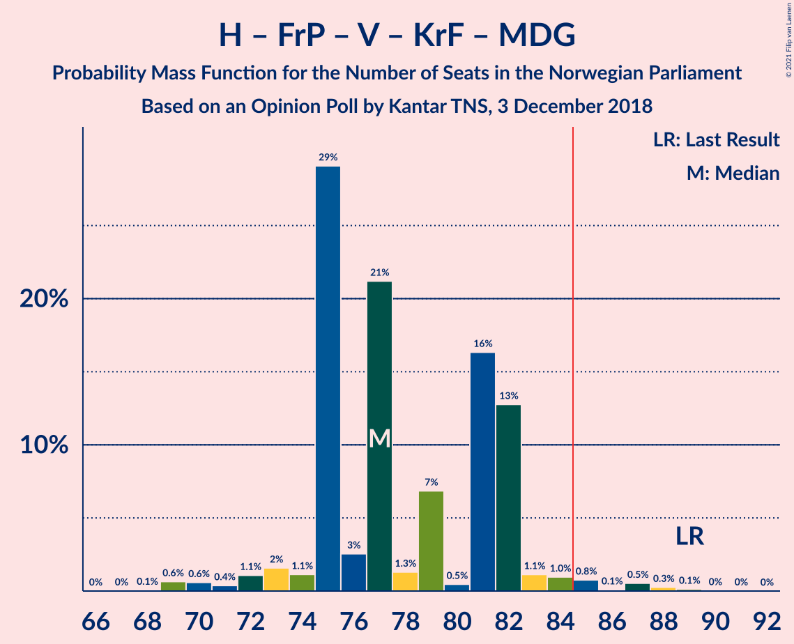

| Number of Seats | Probability | Accumulated | Special Marks |
|:---------------:|:-----------:|:-----------:|:-------------:|
| 67 | 0% | 100% |  |
| 68 | 0.1% | 99.9% |  |
| 69 | 0.6% | 99.9% |  |
| 70 | 0.6% | 99.2% |  |
| 71 | 0.4% | 98.6% |  |
| 72 | 1.1% | 98% |  |
| 73 | 2% | 97% |  |
| 74 | 1.1% | 96% | Median |
| 75 | 29% | 94% |  |
| 76 | 3% | 65% |  |
| 77 | 21% | 63% |  |
| 78 | 1.3% | 42% |  |
| 79 | 7% | 40% |  |
| 80 | 0.5% | 33% |  |
| 81 | 16% | 33% |  |
| 82 | 13% | 17% |  |
| 83 | 1.1% | 4% |  |
| 84 | 1.0% | 3% |  |
| 85 | 0.8% | 2% | Majority |
| 86 | 0.1% | 1.1% |  |
| 87 | 0.5% | 1.0% |  |
| 88 | 0.3% | 0.5% |  |
| 89 | 0.1% | 0.2% | Last Result |
| 90 | 0% | 0.1% |  |
| 91 | 0% | 0% |  |

### Arbeiderpartiet – Senterpartiet – Kristelig Folkeparti – Miljøpartiet De Grønne

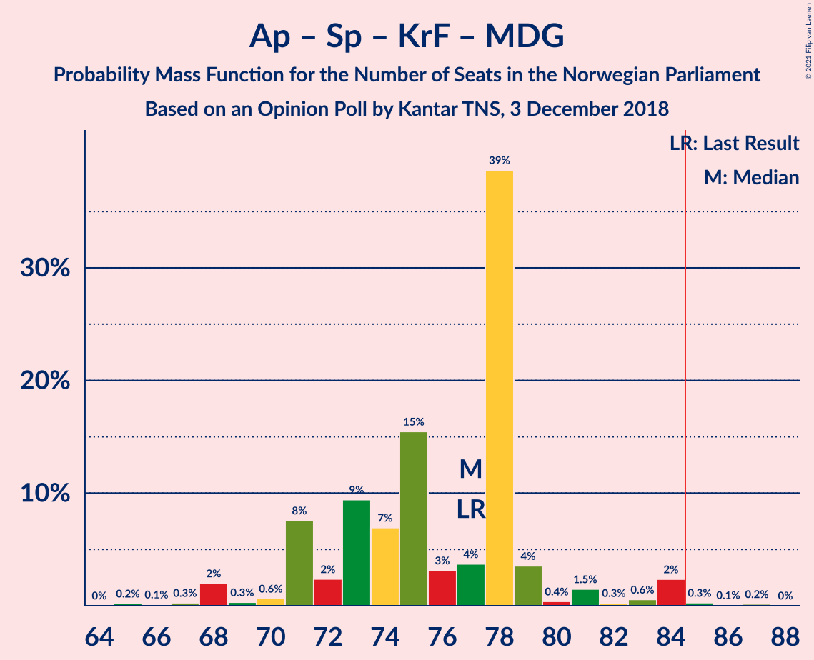

| Number of Seats | Probability | Accumulated | Special Marks |
|:---------------:|:-----------:|:-----------:|:-------------:|
| 64 | 0% | 100% |  |
| 65 | 0.2% | 99.9% |  |
| 66 | 0.1% | 99.7% |  |
| 67 | 0.3% | 99.6% |  |
| 68 | 2% | 99.4% |  |
| 69 | 0.3% | 97% |  |
| 70 | 0.6% | 97% |  |
| 71 | 8% | 96% |  |
| 72 | 2% | 89% |  |
| 73 | 9% | 86% |  |
| 74 | 7% | 77% |  |
| 75 | 15% | 70% |  |
| 76 | 3% | 55% | Median |
| 77 | 4% | 52% | Last Result |
| 78 | 39% | 48% |  |
| 79 | 4% | 9% |  |
| 80 | 0.4% | 6% |  |
| 81 | 1.5% | 5% |  |
| 82 | 0.3% | 4% |  |
| 83 | 0.6% | 3% |  |
| 84 | 2% | 3% |  |
| 85 | 0.3% | 0.5% | Majority |
| 86 | 0.1% | 0.3% |  |
| 87 | 0.2% | 0.2% |  |
| 88 | 0% | 0% |  |

### Høyre – Fremskrittspartiet – Venstre – Kristelig Folkeparti

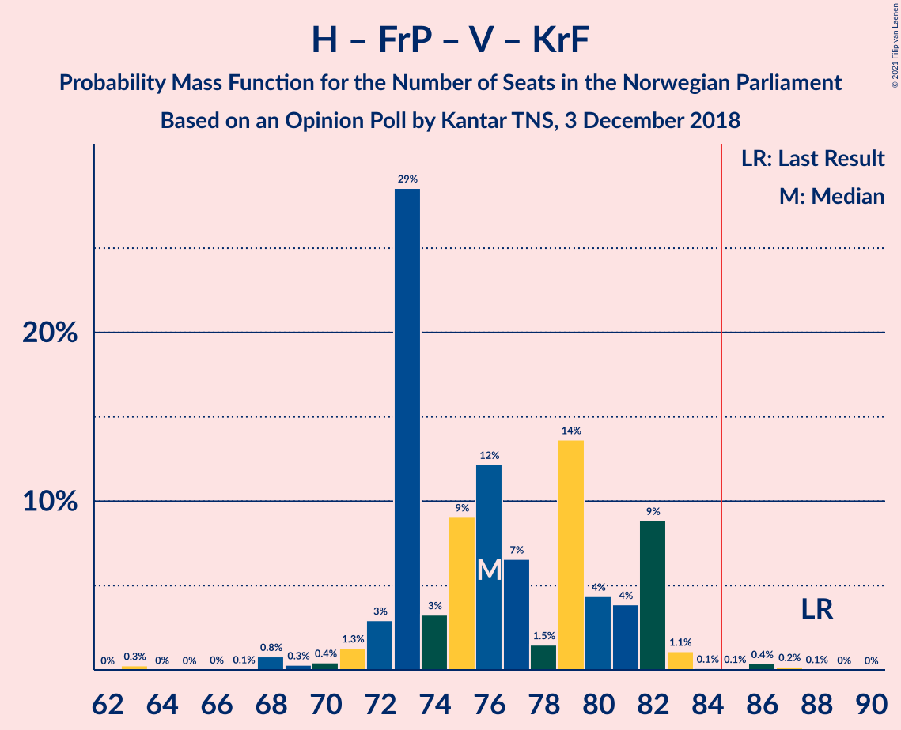

| Number of Seats | Probability | Accumulated | Special Marks |
|:---------------:|:-----------:|:-----------:|:-------------:|
| 63 | 0.3% | 100% |  |
| 64 | 0% | 99.7% |  |
| 65 | 0% | 99.7% |  |
| 66 | 0% | 99.7% |  |
| 67 | 0.1% | 99.7% |  |
| 68 | 0.8% | 99.6% |  |
| 69 | 0.3% | 98.8% |  |
| 70 | 0.4% | 98.5% |  |
| 71 | 1.3% | 98% |  |
| 72 | 3% | 97% | Median |
| 73 | 29% | 94% |  |
| 74 | 3% | 65% |  |
| 75 | 9% | 62% |  |
| 76 | 12% | 53% |  |
| 77 | 7% | 41% |  |
| 78 | 1.5% | 34% |  |
| 79 | 14% | 33% |  |
| 80 | 4% | 19% |  |
| 81 | 4% | 15% |  |
| 82 | 9% | 11% |  |
| 83 | 1.1% | 2% |  |
| 84 | 0.1% | 0.9% |  |
| 85 | 0.1% | 0.8% | Majority |
| 86 | 0.4% | 0.7% |  |
| 87 | 0.2% | 0.3% |  |
| 88 | 0.1% | 0.1% | Last Result |
| 89 | 0% | 0% |  |

### Arbeiderpartiet – Senterpartiet – Kristelig Folkeparti

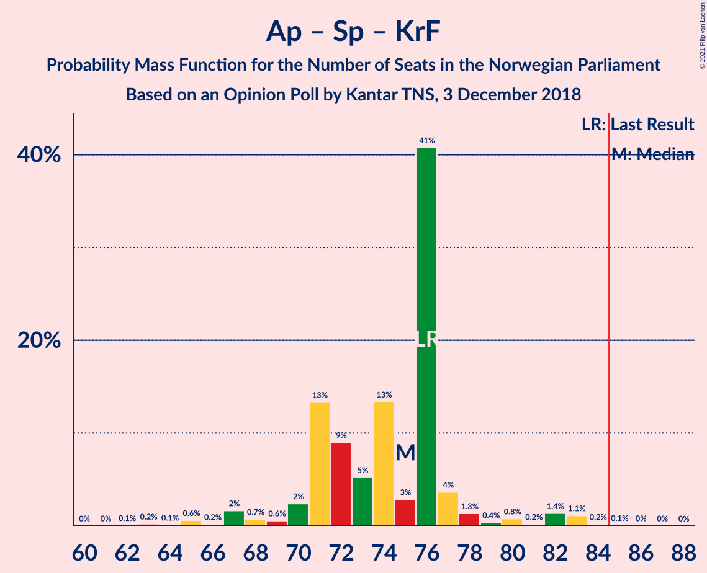

| Number of Seats | Probability | Accumulated | Special Marks |
|:---------------:|:-----------:|:-----------:|:-------------:|
| 62 | 0.1% | 100% |  |
| 63 | 0.2% | 99.9% |  |
| 64 | 0.1% | 99.7% |  |
| 65 | 0.6% | 99.6% |  |
| 66 | 0.2% | 99.0% |  |
| 67 | 2% | 98.9% |  |
| 68 | 0.7% | 97% |  |
| 69 | 0.6% | 97% |  |
| 70 | 2% | 96% |  |
| 71 | 13% | 94% |  |
| 72 | 9% | 80% |  |
| 73 | 5% | 71% |  |
| 74 | 13% | 66% | Median |
| 75 | 3% | 53% |  |
| 76 | 41% | 50% | Last Result |
| 77 | 4% | 9% |  |
| 78 | 1.3% | 5% |  |
| 79 | 0.4% | 4% |  |
| 80 | 0.8% | 4% |  |
| 81 | 0.2% | 3% |  |
| 82 | 1.4% | 3% |  |
| 83 | 1.1% | 1.4% |  |
| 84 | 0.2% | 0.3% |  |
| 85 | 0.1% | 0.1% | Majority |
| 86 | 0% | 0.1% |  |
| 87 | 0% | 0% |  |

### Høyre – Fremskrittspartiet – Venstre

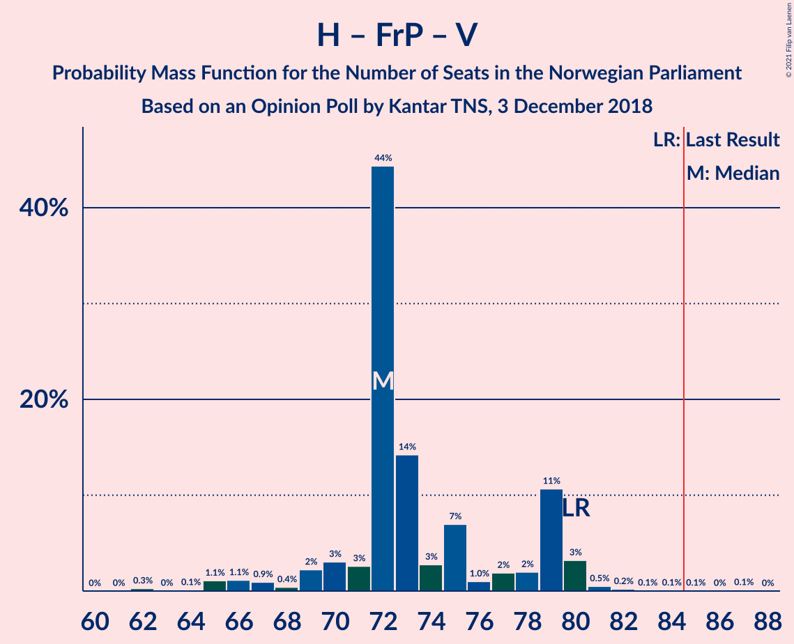

| Number of Seats | Probability | Accumulated | Special Marks |
|:---------------:|:-----------:|:-----------:|:-------------:|
| 62 | 0.3% | 100% |  |
| 63 | 0% | 99.7% |  |
| 64 | 0.1% | 99.7% |  |
| 65 | 1.1% | 99.6% |  |
| 66 | 1.1% | 98% |  |
| 67 | 0.9% | 97% |  |
| 68 | 0.4% | 96% |  |
| 69 | 2% | 96% |  |
| 70 | 3% | 94% | Median |
| 71 | 3% | 91% |  |
| 72 | 44% | 88% |  |
| 73 | 14% | 44% |  |
| 74 | 3% | 30% |  |
| 75 | 7% | 27% |  |
| 76 | 1.0% | 20% |  |
| 77 | 2% | 19% |  |
| 78 | 2% | 17% |  |
| 79 | 11% | 15% |  |
| 80 | 3% | 4% | Last Result |
| 81 | 0.5% | 1.0% |  |
| 82 | 0.2% | 0.5% |  |
| 83 | 0.1% | 0.3% |  |
| 84 | 0.1% | 0.2% |  |
| 85 | 0.1% | 0.2% | Majority |
| 86 | 0% | 0.1% |  |
| 87 | 0.1% | 0.1% |  |
| 88 | 0% | 0% |  |

### Høyre – Fremskrittspartiet

| Number of Seats | Probability | Accumulated | Special Marks |
|:---------------:|:-----------:|:-----------:|:-------------:|
| 59 | 0.1% | 100% |  |
| 60 | 0.4% | 99.9% |  |
| 61 | 0.5% | 99.5% |  |
| 62 | 0.2% | 99.0% |  |
| 63 | 2% | 98.8% |  |
| 64 | 2% | 97% |  |
| 65 | 14% | 95% |  |
| 66 | 0.7% | 82% |  |
| 67 | 4% | 81% |  |
| 68 | 4% | 77% | Median |
| 69 | 2% | 73% |  |
| 70 | 32% | 70% |  |
| 71 | 22% | 39% |  |
| 72 | 3% | 16% | Last Result |
| 73 | 6% | 13% |  |
| 74 | 0.8% | 8% |  |
| 75 | 3% | 7% |  |
| 76 | 0.5% | 4% |  |
| 77 | 2% | 4% |  |
| 78 | 0.9% | 1.1% |  |
| 79 | 0.1% | 0.2% |  |
| 80 | 0.1% | 0.1% |  |
| 81 | 0% | 0% |  |

### Arbeiderpartiet – Senterpartiet

| Number of Seats | Probability | Accumulated | Special Marks |
|:---------------:|:-----------:|:-----------:|:-------------:|
| 60 | 0% | 100% |  |
| 61 | 0.1% | 99.9% |  |
| 62 | 0.4% | 99.9% |  |
| 63 | 0.1% | 99.5% |  |
| 64 | 0.7% | 99.4% |  |
| 65 | 0.2% | 98.7% |  |
| 66 | 2% | 98% |  |
| 67 | 2% | 96% |  |
| 68 | 8% | 94% | Last Result |
| 69 | 23% | 86% |  |
| 70 | 7% | 63% |  |
| 71 | 14% | 56% |  |
| 72 | 6% | 42% | Median |
| 73 | 3% | 36% |  |
| 74 | 0.8% | 33% |  |
| 75 | 29% | 33% |  |
| 76 | 1.5% | 4% |  |
| 77 | 1.3% | 2% |  |
| 78 | 0.1% | 1.0% |  |
| 79 | 0.4% | 0.9% |  |
| 80 | 0.1% | 0.5% |  |
| 81 | 0.2% | 0.4% |  |
| 82 | 0.1% | 0.2% |  |
| 83 | 0% | 0.1% |  |
| 84 | 0.1% | 0.1% |  |
| 85 | 0% | 0% | Majority |

### Arbeiderpartiet – Sosialistisk Venstreparti

| Number of Seats | Probability | Accumulated | Special Marks |
|:---------------:|:-----------:|:-----------:|:-------------:|
| 51 | 0.1% | 100% |  |
| 52 | 0.3% | 99.9% |  |
| 53 | 0.5% | 99.6% |  |
| 54 | 0.5% | 99.1% |  |
| 55 | 1.0% | 98.6% |  |
| 56 | 3% | 98% |  |
| 57 | 5% | 95% |  |
| 58 | 4% | 90% |  |
| 59 | 3% | 87% |  |
| 60 | 9% | 83% | Last Result |
| 61 | 26% | 74% | Median |
| 62 | 9% | 48% |  |
| 63 | 25% | 38% |  |
| 64 | 4% | 13% |  |
| 65 | 4% | 10% |  |
| 66 | 3% | 6% |  |
| 67 | 0.6% | 2% |  |
| 68 | 0.4% | 2% |  |
| 69 | 0.4% | 1.5% |  |
| 70 | 0.9% | 1.1% |  |
| 71 | 0.1% | 0.2% |  |
| 72 | 0% | 0.1% |  |
| 73 | 0.1% | 0.1% |  |
| 74 | 0% | 0% |  |

### Høyre – Venstre – Kristelig Folkeparti

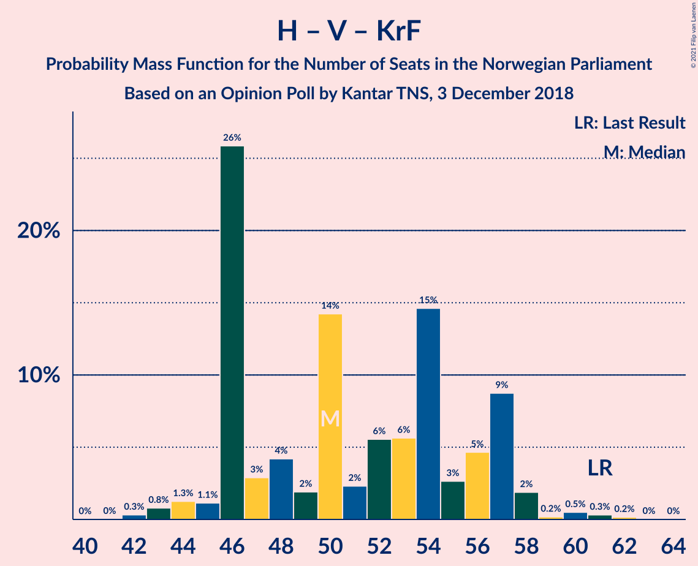

| Number of Seats | Probability | Accumulated | Special Marks |
|:---------------:|:-----------:|:-----------:|:-------------:|
| 41 | 0% | 100% |  |
| 42 | 0.3% | 99.9% |  |
| 43 | 0.8% | 99.6% |  |
| 44 | 1.3% | 98.8% |  |
| 45 | 1.1% | 98% |  |
| 46 | 26% | 96% |  |
| 47 | 3% | 71% | Median |
| 48 | 4% | 68% |  |
| 49 | 2% | 63% |  |
| 50 | 14% | 62% |  |
| 51 | 2% | 47% |  |
| 52 | 6% | 45% |  |
| 53 | 6% | 39% |  |
| 54 | 15% | 34% |  |
| 55 | 3% | 19% |  |
| 56 | 5% | 17% |  |
| 57 | 9% | 12% |  |
| 58 | 2% | 3% |  |
| 59 | 0.2% | 1.2% |  |
| 60 | 0.5% | 1.1% |  |
| 61 | 0.3% | 0.6% | Last Result |
| 62 | 0.2% | 0.2% |  |
| 63 | 0% | 0.1% |  |
| 64 | 0% | 0% |  |

### Senterpartiet – Venstre – Kristelig Folkeparti

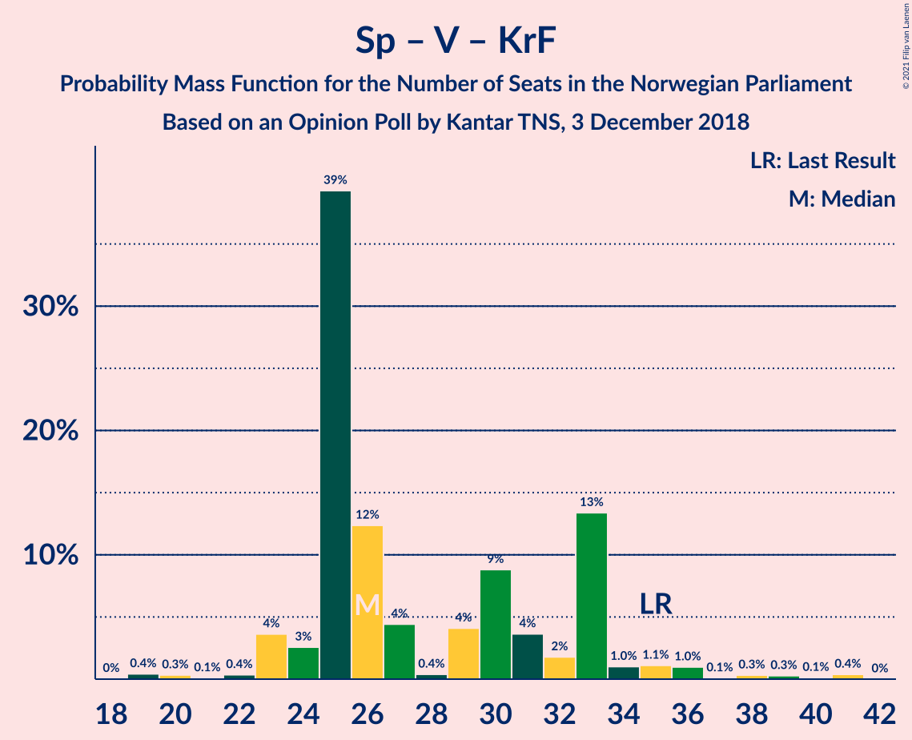

| Number of Seats | Probability | Accumulated | Special Marks |
|:---------------:|:-----------:|:-----------:|:-------------:|
| 19 | 0.4% | 100% |  |
| 20 | 0.3% | 99.5% |  |
| 21 | 0.1% | 99.2% |  |
| 22 | 0.4% | 99.1% |  |
| 23 | 4% | 98.7% |  |
| 24 | 3% | 95% |  |
| 25 | 39% | 93% | Median |
| 26 | 12% | 53% |  |
| 27 | 4% | 41% |  |
| 28 | 0.4% | 36% |  |
| 29 | 4% | 36% |  |
| 30 | 9% | 32% |  |
| 31 | 4% | 23% |  |
| 32 | 2% | 20% |  |
| 33 | 13% | 18% |  |
| 34 | 1.0% | 4% |  |
| 35 | 1.1% | 3% | Last Result |
| 36 | 1.0% | 2% |  |
| 37 | 0.1% | 1.2% |  |
| 38 | 0.3% | 1.1% |  |
| 39 | 0.3% | 0.8% |  |
| 40 | 0.1% | 0.5% |  |
| 41 | 0.4% | 0.4% |  |
| 42 | 0% | 0% |  |

## Technical Information

### Opinion Poll

+ **Polling firm:** Kantar TNS
+ **Commissioner(s):** —
+ **Fieldwork period:** 3 December 2018

### Calculations

+ **Sample size:** 722
+ **Simulations done:** 131,072
+ **Error estimate:** 1.19%

