# Opinion Poll by Opinion Perduco, 4–10 December 2018

<a href="#voting-intentions">Voting Intentions</a> | <a href="#seats">Seats</a> | <a href="#coalitions">Coalitions</a> | <a href="#technical-information">Technical Information</a>

## Voting Intentions

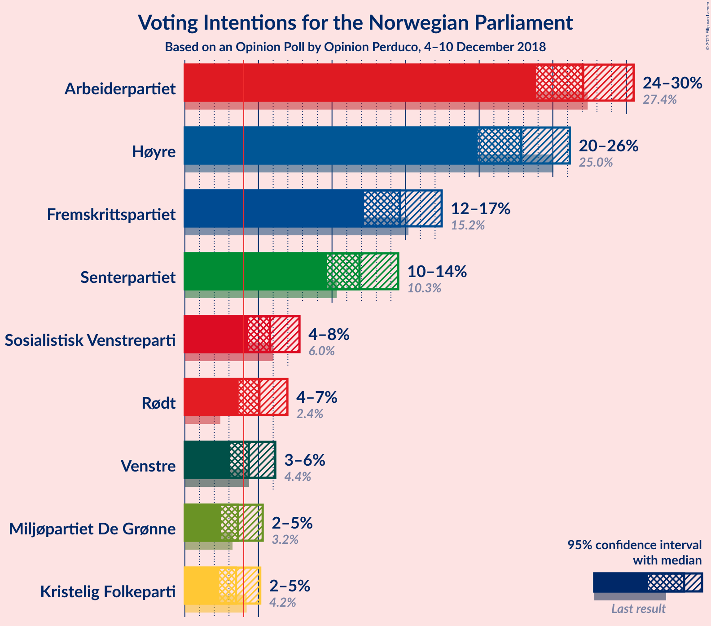

### Confidence Intervals

| Party | Last Result | Poll Result | 80% Confidence Interval | 90% Confidence Interval | 95% Confidence Interval | 99% Confidence Interval |
|:-----:|:-----------:|:-----------:|:-----------------------:|:-----------------------:|:-----------------------:|:-----------------------:|
| Arbeiderpartiet | 27.4% | 27.1% | 25.0–29.3% |24.4–29.9% |23.9–30.5% |22.9–31.6% |
| Høyre | 25.0% | 22.9% | 20.9–25.0% |20.4–25.6% |19.9–26.2% |19.0–27.2% |
| Fremskrittspartiet | 15.2% | 14.6% | 13.0–16.5% |12.6–17.0% |12.2–17.5% |11.4–18.4% |
| Senterpartiet | 10.3% | 11.9% | 10.4–13.6% |10.0–14.1% |9.7–14.5% |9.0–15.4% |
| Sosialistisk Venstreparti | 6.0% | 5.8% | 4.8–7.1% |4.5–7.5% |4.3–7.8% |3.8–8.5% |
| Rødt | 2.4% | 5.1% | 4.1–6.3% |3.9–6.7% |3.7–7.0% |3.3–7.6% |
| Venstre | 4.4% | 4.3% | 3.5–5.5% |3.2–5.8% |3.1–6.1% |2.7–6.8% |
| Miljøpartiet De Grønne | 3.2% | 3.6% | 2.9–4.7% |2.6–5.0% |2.5–5.3% |2.1–5.9% |
| Kristelig Folkeparti | 4.2% | 3.5% | 2.7–4.5% |2.5–4.8% |2.3–5.1% |2.0–5.7% |

*Note:* The poll result column reflects the actual value used in the calculations. Published results may vary slightly, and in addition be rounded to fewer digits.

## Seats

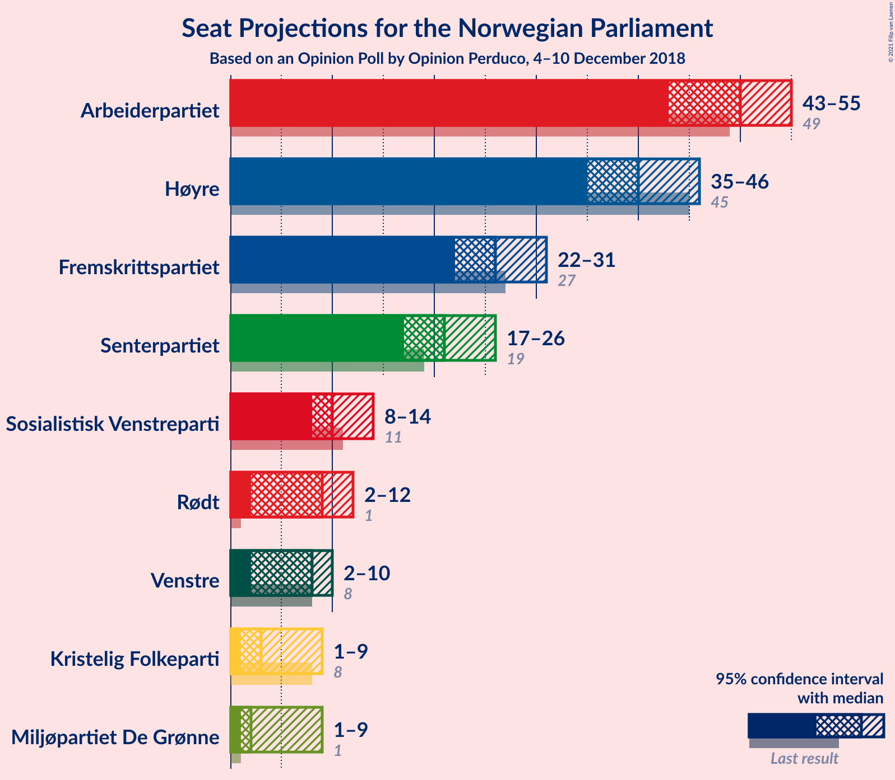

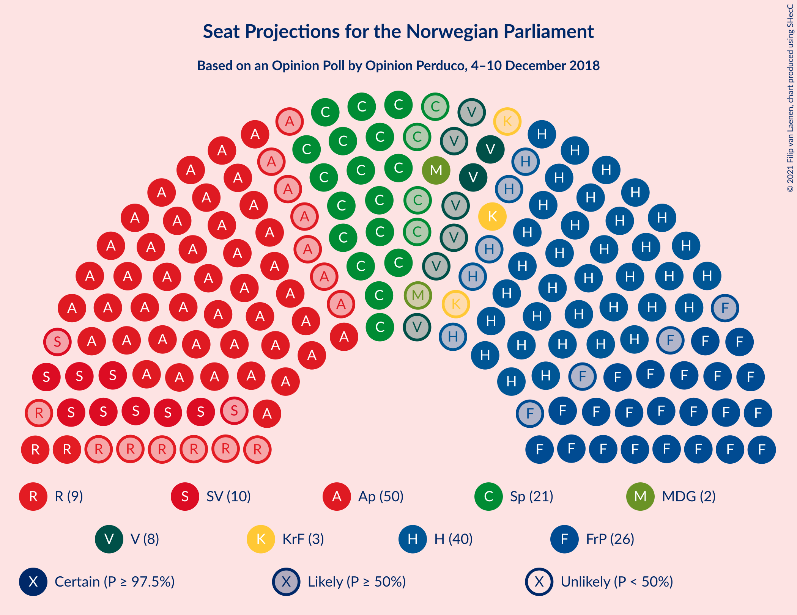

### Confidence Intervals

| Party | Last Result | Median | 80% Confidence Interval | 90% Confidence Interval | 95% Confidence Interval | 99% Confidence Interval |
|:-----:|:-----------:|:------:|:-----------------------:|:-----------------------:|:-----------------------:|:-----------------------:|
| <a href="#arbeiderpartiet">Arbeiderpartiet</a> | 49 | 50 | 44–53 |43–55 |43–55 |41–57 |
| <a href="#høyre">Høyre</a> | 45 | 40 | 37–44 |36–46 |35–46 |33–49 |
| <a href="#fremskrittspartiet">Fremskrittspartiet</a> | 27 | 26 | 24–29 |23–30 |22–31 |20–33 |
| <a href="#senterpartiet">Senterpartiet</a> | 19 | 21 | 18–24 |17–25 |17–26 |15–28 |
| <a href="#sosialistisk-venstreparti">Sosialistisk Venstreparti</a> | 11 | 10 | 8–12 |8–13 |8–14 |2–15 |
| <a href="#rødt">Rødt</a> | 1 | 9 | 7–11 |2–11 |2–12 |2–13 |
| <a href="#venstre">Venstre</a> | 8 | 8 | 2–10 |2–10 |2–10 |2–12 |
| <a href="#miljøpartiet-de-grønne">Miljøpartiet De Grønne</a> | 1 | 2 | 1–8 |1–8 |1–9 |1–10 |
| <a href="#kristelig-folkeparti">Kristelig Folkeparti</a> | 8 | 3 | 1–8 |1–8 |1–9 |0–10 |

### Arbeiderpartiet

*For a full overview of the results for this party, see the [Arbeiderpartiet](party-arbeiderpartiet.html) page.*

| Number of Seats | Probability | Accumulated | Special Marks |
|:---------------:|:-----------:|:-----------:|:-------------:|
| 40 | 0.2% | 100% |  |
| 41 | 0.6% | 99.8% |  |
| 42 | 0.7% | 99.1% |  |
| 43 | 4% | 98% |  |
| 44 | 11% | 95% |  |
| 45 | 7% | 84% |  |
| 46 | 6% | 77% |  |
| 47 | 6% | 72% |  |
| 48 | 6% | 65% |  |
| 49 | 9% | 60% | Last Result |
| 50 | 18% | 50% | Median |
| 51 | 18% | 32% |  |
| 52 | 4% | 14% |  |
| 53 | 2% | 10% |  |
| 54 | 3% | 8% |  |
| 55 | 3% | 5% |  |
| 56 | 0.6% | 2% |  |
| 57 | 1.1% | 1.3% |  |
| 58 | 0.1% | 0.3% |  |
| 59 | 0.1% | 0.1% |  |
| 60 | 0% | 0% |  |

### Høyre

*For a full overview of the results for this party, see the [Høyre](party-høyre.html) page.*

| Number of Seats | Probability | Accumulated | Special Marks |
|:---------------:|:-----------:|:-----------:|:-------------:|
| 31 | 0% | 100% |  |
| 32 | 0.1% | 99.9% |  |
| 33 | 0.4% | 99.8% |  |
| 34 | 0.8% | 99.5% |  |
| 35 | 2% | 98.6% |  |
| 36 | 6% | 97% |  |
| 37 | 6% | 91% |  |
| 38 | 9% | 85% |  |
| 39 | 11% | 77% |  |
| 40 | 17% | 66% | Median |
| 41 | 17% | 49% |  |
| 42 | 8% | 32% |  |
| 43 | 7% | 24% |  |
| 44 | 10% | 17% |  |
| 45 | 1.1% | 7% | Last Result |
| 46 | 4% | 6% |  |
| 47 | 0.2% | 2% |  |
| 48 | 1.3% | 2% |  |
| 49 | 0.4% | 0.6% |  |
| 50 | 0.2% | 0.2% |  |
| 51 | 0% | 0.1% |  |
| 52 | 0% | 0% |  |

### Fremskrittspartiet

*For a full overview of the results for this party, see the [Fremskrittspartiet](party-fremskrittspartiet.html) page.*

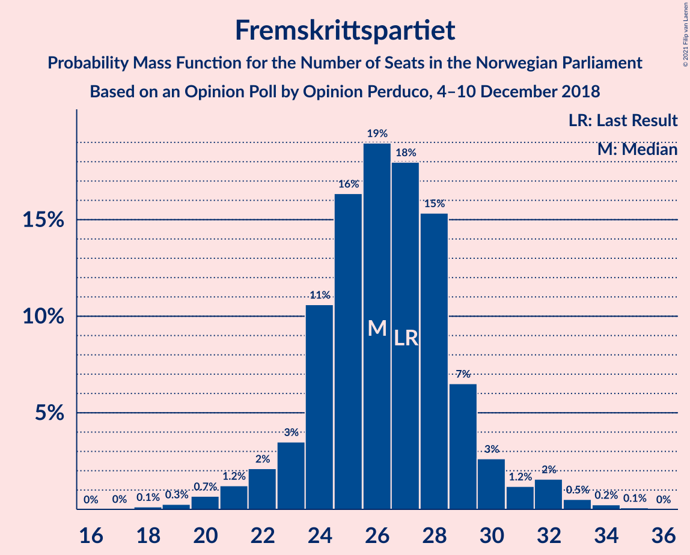

| Number of Seats | Probability | Accumulated | Special Marks |
|:---------------:|:-----------:|:-----------:|:-------------:|
| 18 | 0.1% | 100% |  |
| 19 | 0.3% | 99.8% |  |
| 20 | 0.7% | 99.6% |  |
| 21 | 1.2% | 98.9% |  |
| 22 | 2% | 98% |  |
| 23 | 3% | 96% |  |
| 24 | 11% | 92% |  |
| 25 | 16% | 81% |  |
| 26 | 19% | 65% | Median |
| 27 | 18% | 46% | Last Result |
| 28 | 15% | 28% |  |
| 29 | 7% | 13% |  |
| 30 | 3% | 6% |  |
| 31 | 1.2% | 4% |  |
| 32 | 2% | 2% |  |
| 33 | 0.5% | 0.9% |  |
| 34 | 0.2% | 0.4% |  |
| 35 | 0.1% | 0.1% |  |
| 36 | 0% | 0% |  |

### Senterpartiet

*For a full overview of the results for this party, see the [Senterpartiet](party-senterpartiet.html) page.*

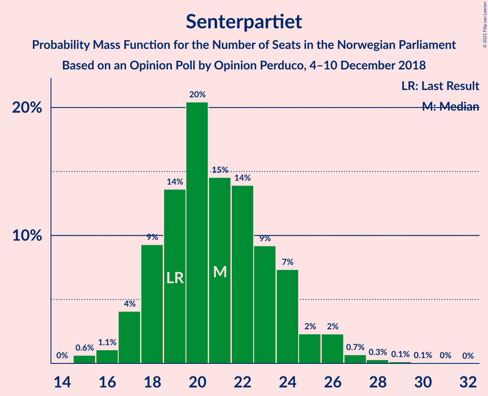

| Number of Seats | Probability | Accumulated | Special Marks |
|:---------------:|:-----------:|:-----------:|:-------------:|
| 14 | 0% | 100% |  |
| 15 | 0.6% | 99.9% |  |
| 16 | 1.1% | 99.3% |  |
| 17 | 4% | 98% |  |
| 18 | 9% | 94% |  |
| 19 | 14% | 85% | Last Result |
| 20 | 20% | 71% |  |
| 21 | 15% | 51% | Median |
| 22 | 14% | 36% |  |
| 23 | 9% | 22% |  |
| 24 | 7% | 13% |  |
| 25 | 2% | 6% |  |
| 26 | 2% | 4% |  |
| 27 | 0.7% | 1.2% |  |
| 28 | 0.3% | 0.5% |  |
| 29 | 0.1% | 0.2% |  |
| 30 | 0.1% | 0.1% |  |
| 31 | 0% | 0.1% |  |
| 32 | 0% | 0% |  |

### Sosialistisk Venstreparti

*For a full overview of the results for this party, see the [Sosialistisk Venstreparti](party-sosialistiskvenstreparti.html) page.*

| Number of Seats | Probability | Accumulated | Special Marks |
|:---------------:|:-----------:|:-----------:|:-------------:|
| 1 | 0.5% | 100% |  |
| 2 | 0.5% | 99.5% |  |
| 3 | 0.2% | 99.1% |  |
| 4 | 0% | 98.9% |  |
| 5 | 0% | 98.9% |  |
| 6 | 0% | 98.9% |  |
| 7 | 1.3% | 98.8% |  |
| 8 | 11% | 98% |  |
| 9 | 19% | 86% |  |
| 10 | 25% | 68% | Median |
| 11 | 24% | 43% | Last Result |
| 12 | 9% | 19% |  |
| 13 | 7% | 10% |  |
| 14 | 2% | 3% |  |
| 15 | 0.6% | 0.8% |  |
| 16 | 0.1% | 0.2% |  |
| 17 | 0% | 0% |  |

### Rødt

*For a full overview of the results for this party, see the [Rødt](party-rødt.html) page.*

| Number of Seats | Probability | Accumulated | Special Marks |
|:---------------:|:-----------:|:-----------:|:-------------:|
| 1 | 0.1% | 100% | Last Result |
| 2 | 7% | 99.9% |  |
| 3 | 0% | 93% |  |
| 4 | 0% | 93% |  |
| 5 | 0% | 93% |  |
| 6 | 0.1% | 93% |  |
| 7 | 7% | 93% |  |
| 8 | 21% | 87% |  |
| 9 | 31% | 66% | Median |
| 10 | 18% | 35% |  |
| 11 | 13% | 17% |  |
| 12 | 2% | 3% |  |
| 13 | 0.9% | 1.2% |  |
| 14 | 0.3% | 0.4% |  |
| 15 | 0% | 0.1% |  |
| 16 | 0% | 0% |  |

### Venstre

*For a full overview of the results for this party, see the [Venstre](party-venstre.html) page.*

| Number of Seats | Probability | Accumulated | Special Marks |
|:---------------:|:-----------:|:-----------:|:-------------:|
| 1 | 0.1% | 100% |  |
| 2 | 35% | 99.9% |  |
| 3 | 2% | 65% |  |
| 4 | 0% | 63% |  |
| 5 | 0% | 63% |  |
| 6 | 0.7% | 63% |  |
| 7 | 6% | 62% |  |
| 8 | 14% | 56% | Last Result, Median |
| 9 | 29% | 42% |  |
| 10 | 12% | 13% |  |
| 11 | 1.2% | 2% |  |
| 12 | 0.4% | 0.5% |  |
| 13 | 0.1% | 0.1% |  |
| 14 | 0% | 0% |  |

### Miljøpartiet De Grønne

*For a full overview of the results for this party, see the [Miljøpartiet De Grønne](party-miljøpartietdegrønne.html) page.*

| Number of Seats | Probability | Accumulated | Special Marks |
|:---------------:|:-----------:|:-----------:|:-------------:|
| 0 | 0.3% | 100% |  |
| 1 | 16% | 99.7% | Last Result |
| 2 | 41% | 83% | Median |
| 3 | 8% | 42% |  |
| 4 | 0% | 34% |  |
| 5 | 0% | 34% |  |
| 6 | 1.4% | 34% |  |
| 7 | 14% | 33% |  |
| 8 | 14% | 19% |  |
| 9 | 4% | 5% |  |
| 10 | 0.5% | 0.7% |  |
| 11 | 0.1% | 0.2% |  |
| 12 | 0% | 0% |  |

### Kristelig Folkeparti

*For a full overview of the results for this party, see the [Kristelig Folkeparti](party-kristeligfolkeparti.html) page.*

| Number of Seats | Probability | Accumulated | Special Marks |
|:---------------:|:-----------:|:-----------:|:-------------:|
| 0 | 1.0% | 100% |  |
| 1 | 28% | 99.0% |  |
| 2 | 6% | 71% |  |
| 3 | 40% | 64% | Median |
| 4 | 0% | 25% |  |
| 5 | 0% | 25% |  |
| 6 | 0.4% | 25% |  |
| 7 | 9% | 24% |  |
| 8 | 11% | 15% | Last Result |
| 9 | 3% | 4% |  |
| 10 | 0.5% | 0.6% |  |
| 11 | 0.1% | 0.1% |  |
| 12 | 0% | 0% |  |

## Coalitions

### Confidence Intervals

| Coalition | Last Result | Median | Majority? | 80% Confidence Interval | 90% Confidence Interval | 95% Confidence Interval | 99% Confidence Interval |
|:---------:|:-----------:|:------:|:---------:|:-----------------------:|:-----------------------:|:-----------------------:|:-----------------------:|
| Høyre – Fremskrittspartiet – Senterpartiet – Venstre – Kristelig Folkeparti | 107 | 97 | 99.7% | 92–103 | 92–103 | 91–104 | 86–108 |
| Arbeiderpartiet – Senterpartiet – Sosialistisk Venstreparti – Rødt – Miljøpartiet De Grønne | 81 | 92 | 97% | 87–97 | 86–99 | 84–99 | 82–104 |
| Arbeiderpartiet – Senterpartiet – Sosialistisk Venstreparti – Rødt | 80 | 89 | 81% | 83–93 | 81–95 | 80–96 | 78–98 |
| Arbeiderpartiet – Senterpartiet – Sosialistisk Venstreparti – Miljøpartiet De Grønne – Kristelig Folkeparti | 88 | 87 | 81% | 84–91 | 82–93 | 80–95 | 77–98 |
| Arbeiderpartiet – Senterpartiet – Sosialistisk Venstreparti – Miljøpartiet De Grønne | 80 | 83 | 37% | 78–89 | 77–90 | 76–91 | 74–94 |
| Høyre – Fremskrittspartiet – Venstre – Miljøpartiet De Grønne – Kristelig Folkeparti | 89 | 80 | 19% | 76–86 | 74–88 | 73–89 | 71–91 |
| Arbeiderpartiet – Senterpartiet – Sosialistisk Venstreparti | 79 | 80 | 11% | 75–85 | 73–87 | 71–87 | 70–89 |
| Arbeiderpartiet – Senterpartiet – Miljøpartiet De Grønne – Kristelig Folkeparti | 77 | 77 | 3% | 73–82 | 71–83 | 70–85 | 67–88 |
| Høyre – Fremskrittspartiet – Venstre – Kristelig Folkeparti | 88 | 77 | 3% | 72–82 | 70–83 | 70–85 | 65–87 |
| Arbeiderpartiet – Senterpartiet – Kristelig Folkeparti | 76 | 73 | 0.3% | 68–78 | 66–79 | 66–80 | 63–83 |
| Høyre – Fremskrittspartiet – Venstre | 80 | 73 | 0.3% | 69–76 | 69–77 | 66–79 | 62–84 |
| Arbeiderpartiet – Senterpartiet | 68 | 70 | 0% | 64–75 | 63–76 | 62–77 | 60–79 |
| Høyre – Fremskrittspartiet | 72 | 67 | 0% | 63–71 | 61–72 | 60–74 | 56–76 |
| Arbeiderpartiet – Sosialistisk Venstreparti | 60 | 59 | 0% | 54–63 | 53–65 | 52–66 | 50–68 |
| Høyre – Venstre – Kristelig Folkeparti | 61 | 51 | 0% | 45–56 | 44–57 | 43–58 | 41–60 |
| Senterpartiet – Venstre – Kristelig Folkeparti | 35 | 31 | 0% | 25–36 | 24–37 | 23–39 | 21–41 |

### Høyre – Fremskrittspartiet – Senterpartiet – Venstre – Kristelig Folkeparti

| Number of Seats | Probability | Accumulated | Special Marks |
|:---------------:|:-----------:|:-----------:|:-------------:|
| 84 | 0.3% | 100% |  |
| 85 | 0.1% | 99.7% | Majority |
| 86 | 0.4% | 99.6% |  |
| 87 | 0.2% | 99.2% |  |
| 88 | 0.3% | 99.0% |  |
| 89 | 0.5% | 98.7% |  |
| 90 | 0.5% | 98% |  |
| 91 | 2% | 98% |  |
| 92 | 7% | 96% |  |
| 93 | 2% | 89% |  |
| 94 | 4% | 87% |  |
| 95 | 7% | 83% |  |
| 96 | 18% | 76% |  |
| 97 | 14% | 59% |  |
| 98 | 9% | 45% | Median |
| 99 | 8% | 36% |  |
| 100 | 7% | 28% |  |
| 101 | 7% | 21% |  |
| 102 | 4% | 15% |  |
| 103 | 7% | 11% |  |
| 104 | 2% | 4% |  |
| 105 | 0.8% | 2% |  |
| 106 | 0.4% | 2% |  |
| 107 | 0.5% | 1.1% | Last Result |
| 108 | 0.3% | 0.6% |  |
| 109 | 0.2% | 0.3% |  |
| 110 | 0% | 0.1% |  |
| 111 | 0% | 0.1% |  |
| 112 | 0% | 0% |  |

### Arbeiderpartiet – Senterpartiet – Sosialistisk Venstreparti – Rødt – Miljøpartiet De Grønne

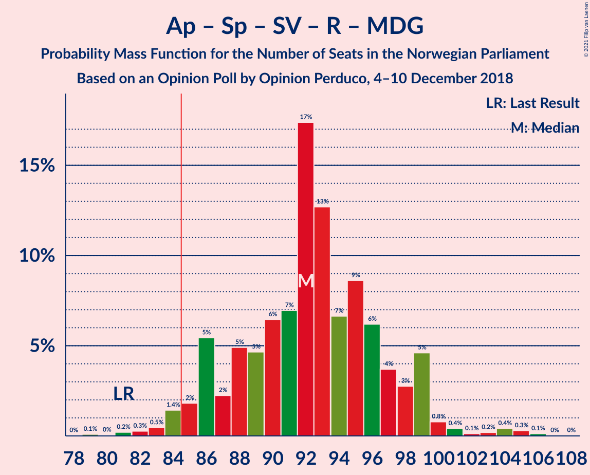

| Number of Seats | Probability | Accumulated | Special Marks |
|:---------------:|:-----------:|:-----------:|:-------------:|
| 79 | 0.1% | 100% |  |
| 80 | 0% | 99.9% |  |
| 81 | 0.2% | 99.8% | Last Result |
| 82 | 0.3% | 99.6% |  |
| 83 | 0.5% | 99.3% |  |
| 84 | 1.4% | 98.9% |  |
| 85 | 2% | 97% | Majority |
| 86 | 5% | 96% |  |
| 87 | 2% | 90% |  |
| 88 | 5% | 88% |  |
| 89 | 5% | 83% |  |
| 90 | 6% | 78% |  |
| 91 | 7% | 72% |  |
| 92 | 17% | 65% | Median |
| 93 | 13% | 48% |  |
| 94 | 7% | 35% |  |
| 95 | 9% | 28% |  |
| 96 | 6% | 20% |  |
| 97 | 4% | 13% |  |
| 98 | 3% | 10% |  |
| 99 | 5% | 7% |  |
| 100 | 0.8% | 2% |  |
| 101 | 0.4% | 2% |  |
| 102 | 0.1% | 1.2% |  |
| 103 | 0.2% | 1.1% |  |
| 104 | 0.4% | 0.9% |  |
| 105 | 0.3% | 0.5% |  |
| 106 | 0.1% | 0.2% |  |
| 107 | 0% | 0% |  |

### Arbeiderpartiet – Senterpartiet – Sosialistisk Venstreparti – Rødt

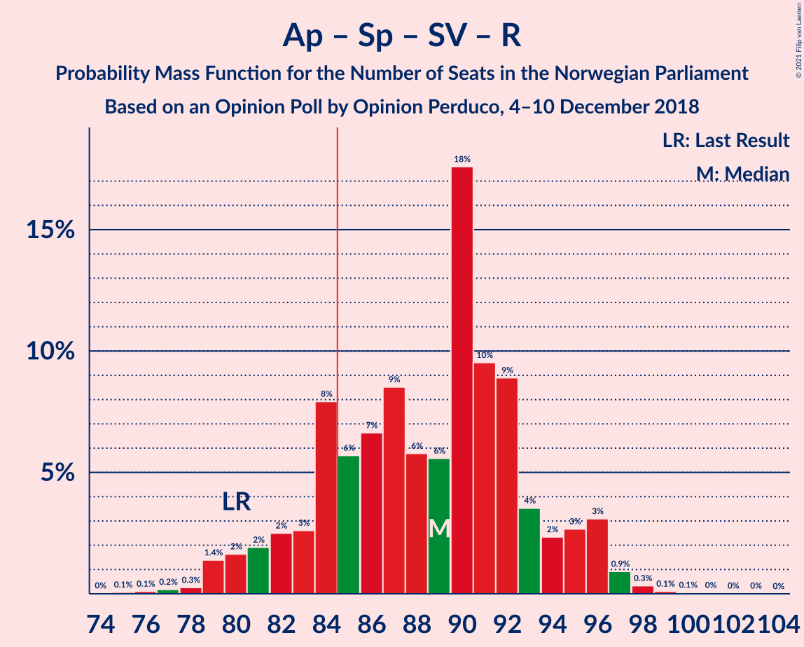

| Number of Seats | Probability | Accumulated | Special Marks |
|:---------------:|:-----------:|:-----------:|:-------------:|
| 75 | 0.1% | 100% |  |
| 76 | 0.1% | 99.9% |  |
| 77 | 0.2% | 99.8% |  |
| 78 | 0.3% | 99.6% |  |
| 79 | 1.4% | 99.3% |  |
| 80 | 2% | 98% | Last Result |
| 81 | 2% | 96% |  |
| 82 | 2% | 94% |  |
| 83 | 3% | 92% |  |
| 84 | 8% | 89% |  |
| 85 | 6% | 81% | Majority |
| 86 | 7% | 76% |  |
| 87 | 9% | 69% |  |
| 88 | 6% | 61% |  |
| 89 | 6% | 55% |  |
| 90 | 18% | 49% | Median |
| 91 | 10% | 32% |  |
| 92 | 9% | 22% |  |
| 93 | 4% | 13% |  |
| 94 | 2% | 10% |  |
| 95 | 3% | 7% |  |
| 96 | 3% | 5% |  |
| 97 | 0.9% | 2% |  |
| 98 | 0.3% | 0.6% |  |
| 99 | 0.1% | 0.3% |  |
| 100 | 0.1% | 0.2% |  |
| 101 | 0% | 0.1% |  |
| 102 | 0% | 0.1% |  |
| 103 | 0% | 0% |  |

### Arbeiderpartiet – Senterpartiet – Sosialistisk Venstreparti – Miljøpartiet De Grønne – Kristelig Folkeparti

| Number of Seats | Probability | Accumulated | Special Marks |
|:---------------:|:-----------:|:-----------:|:-------------:|
| 74 | 0% | 100% |  |
| 75 | 0% | 99.9% |  |
| 76 | 0.1% | 99.9% |  |
| 77 | 0.4% | 99.8% |  |
| 78 | 0.6% | 99.4% |  |
| 79 | 0.8% | 98.7% |  |
| 80 | 0.5% | 98% |  |
| 81 | 1.1% | 97% |  |
| 82 | 2% | 96% |  |
| 83 | 4% | 95% |  |
| 84 | 9% | 91% |  |
| 85 | 12% | 81% | Majority |
| 86 | 19% | 70% | Median |
| 87 | 12% | 51% |  |
| 88 | 8% | 39% | Last Result |
| 89 | 9% | 31% |  |
| 90 | 7% | 22% |  |
| 91 | 6% | 16% |  |
| 92 | 3% | 10% |  |
| 93 | 2% | 7% |  |
| 94 | 2% | 4% |  |
| 95 | 0.9% | 3% |  |
| 96 | 0.7% | 2% |  |
| 97 | 0.4% | 1.1% |  |
| 98 | 0.2% | 0.7% |  |
| 99 | 0.3% | 0.5% |  |
| 100 | 0.1% | 0.1% |  |
| 101 | 0% | 0.1% |  |
| 102 | 0% | 0% |  |

### Arbeiderpartiet – Senterpartiet – Sosialistisk Venstreparti – Miljøpartiet De Grønne

| Number of Seats | Probability | Accumulated | Special Marks |
|:---------------:|:-----------:|:-----------:|:-------------:|
| 71 | 0% | 100% |  |
| 72 | 0.2% | 99.9% |  |
| 73 | 0.2% | 99.8% |  |
| 74 | 0.4% | 99.6% |  |
| 75 | 0.7% | 99.2% |  |
| 76 | 1.3% | 98.5% |  |
| 77 | 5% | 97% |  |
| 78 | 4% | 92% |  |
| 79 | 4% | 88% |  |
| 80 | 5% | 84% | Last Result |
| 81 | 6% | 80% |  |
| 82 | 8% | 73% |  |
| 83 | 17% | 65% | Median |
| 84 | 10% | 47% |  |
| 85 | 8% | 37% | Majority |
| 86 | 8% | 30% |  |
| 87 | 5% | 21% |  |
| 88 | 4% | 16% |  |
| 89 | 4% | 13% |  |
| 90 | 4% | 9% |  |
| 91 | 3% | 5% |  |
| 92 | 0.8% | 2% |  |
| 93 | 0.6% | 1.4% |  |
| 94 | 0.4% | 0.8% |  |
| 95 | 0.1% | 0.4% |  |
| 96 | 0.1% | 0.2% |  |
| 97 | 0% | 0.1% |  |
| 98 | 0.1% | 0.1% |  |
| 99 | 0% | 0% |  |

### Høyre – Fremskrittspartiet – Venstre – Miljøpartiet De Grønne – Kristelig Folkeparti

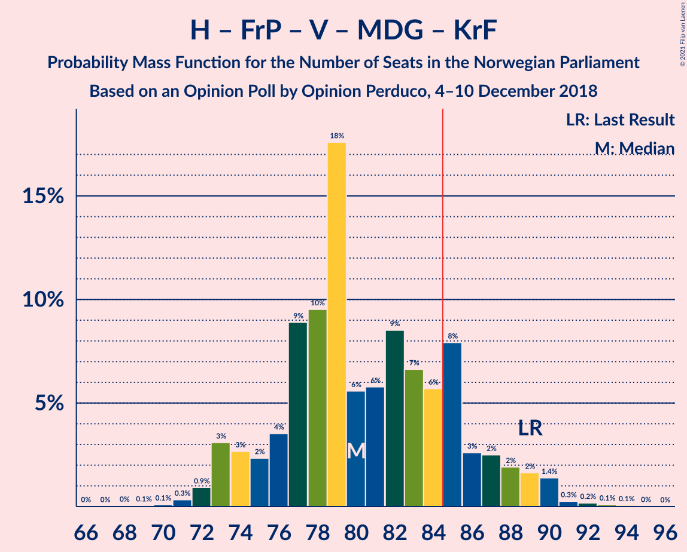

| Number of Seats | Probability | Accumulated | Special Marks |
|:---------------:|:-----------:|:-----------:|:-------------:|
| 67 | 0% | 100% |  |
| 68 | 0% | 99.9% |  |
| 69 | 0.1% | 99.9% |  |
| 70 | 0.1% | 99.8% |  |
| 71 | 0.3% | 99.7% |  |
| 72 | 0.9% | 99.4% |  |
| 73 | 3% | 98% |  |
| 74 | 3% | 95% |  |
| 75 | 2% | 93% |  |
| 76 | 4% | 90% |  |
| 77 | 9% | 87% |  |
| 78 | 10% | 78% |  |
| 79 | 18% | 68% | Median |
| 80 | 6% | 51% |  |
| 81 | 6% | 45% |  |
| 82 | 9% | 39% |  |
| 83 | 7% | 31% |  |
| 84 | 6% | 24% |  |
| 85 | 8% | 19% | Majority |
| 86 | 3% | 11% |  |
| 87 | 2% | 8% |  |
| 88 | 2% | 6% |  |
| 89 | 2% | 4% | Last Result |
| 90 | 1.4% | 2% |  |
| 91 | 0.3% | 0.7% |  |
| 92 | 0.2% | 0.4% |  |
| 93 | 0.1% | 0.2% |  |
| 94 | 0.1% | 0.1% |  |
| 95 | 0% | 0% |  |

### Arbeiderpartiet – Senterpartiet – Sosialistisk Venstreparti

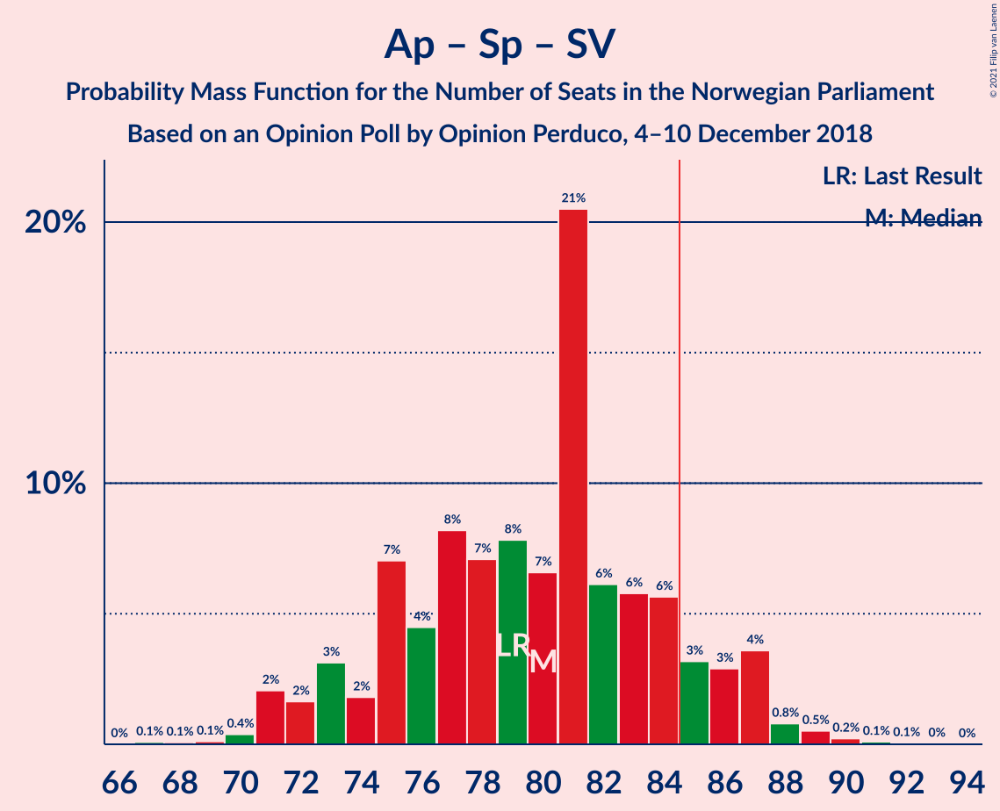

| Number of Seats | Probability | Accumulated | Special Marks |
|:---------------:|:-----------:|:-----------:|:-------------:|
| 67 | 0.1% | 100% |  |
| 68 | 0.1% | 99.9% |  |
| 69 | 0.1% | 99.8% |  |
| 70 | 0.4% | 99.7% |  |
| 71 | 2% | 99.3% |  |
| 72 | 2% | 97% |  |
| 73 | 3% | 96% |  |
| 74 | 2% | 92% |  |
| 75 | 7% | 91% |  |
| 76 | 4% | 84% |  |
| 77 | 8% | 79% |  |
| 78 | 7% | 71% |  |
| 79 | 8% | 64% | Last Result |
| 80 | 7% | 56% |  |
| 81 | 21% | 49% | Median |
| 82 | 6% | 29% |  |
| 83 | 6% | 23% |  |
| 84 | 6% | 17% |  |
| 85 | 3% | 11% | Majority |
| 86 | 3% | 8% |  |
| 87 | 4% | 5% |  |
| 88 | 0.8% | 2% |  |
| 89 | 0.5% | 0.9% |  |
| 90 | 0.2% | 0.4% |  |
| 91 | 0.1% | 0.2% |  |
| 92 | 0.1% | 0.1% |  |
| 93 | 0% | 0% |  |

### Arbeiderpartiet – Senterpartiet – Miljøpartiet De Grønne – Kristelig Folkeparti

| Number of Seats | Probability | Accumulated | Special Marks |
|:---------------:|:-----------:|:-----------:|:-------------:|
| 64 | 0% | 100% |  |
| 65 | 0.1% | 99.9% |  |
| 66 | 0.1% | 99.9% |  |
| 67 | 0.5% | 99.8% |  |
| 68 | 0.7% | 99.2% |  |
| 69 | 0.6% | 98.5% |  |
| 70 | 2% | 98% |  |
| 71 | 2% | 96% |  |
| 72 | 2% | 94% |  |
| 73 | 12% | 93% |  |
| 74 | 6% | 81% |  |
| 75 | 11% | 74% |  |
| 76 | 11% | 63% | Median |
| 77 | 9% | 53% | Last Result |
| 78 | 14% | 43% |  |
| 79 | 8% | 30% |  |
| 80 | 6% | 22% |  |
| 81 | 6% | 16% |  |
| 82 | 4% | 11% |  |
| 83 | 2% | 7% |  |
| 84 | 1.2% | 5% |  |
| 85 | 1.4% | 3% | Majority |
| 86 | 1.0% | 2% |  |
| 87 | 0.4% | 1.0% |  |
| 88 | 0.2% | 0.6% |  |
| 89 | 0.2% | 0.4% |  |
| 90 | 0.1% | 0.2% |  |
| 91 | 0% | 0.1% |  |
| 92 | 0% | 0.1% |  |
| 93 | 0% | 0% |  |

### Høyre – Fremskrittspartiet – Venstre – Kristelig Folkeparti

| Number of Seats | Probability | Accumulated | Special Marks |
|:---------------:|:-----------:|:-----------:|:-------------:|
| 63 | 0.1% | 100% |  |
| 64 | 0.3% | 99.8% |  |
| 65 | 0.4% | 99.5% |  |
| 66 | 0.2% | 99.1% |  |
| 67 | 0.1% | 98.9% |  |
| 68 | 0.4% | 98.8% |  |
| 69 | 0.8% | 98% |  |
| 70 | 5% | 98% |  |
| 71 | 3% | 93% |  |
| 72 | 4% | 90% |  |
| 73 | 6% | 87% |  |
| 74 | 9% | 80% |  |
| 75 | 7% | 72% |  |
| 76 | 13% | 65% |  |
| 77 | 17% | 52% | Median |
| 78 | 7% | 35% |  |
| 79 | 6% | 28% |  |
| 80 | 5% | 22% |  |
| 81 | 5% | 17% |  |
| 82 | 2% | 12% |  |
| 83 | 5% | 10% |  |
| 84 | 2% | 4% |  |
| 85 | 1.4% | 3% | Majority |
| 86 | 0.5% | 1.1% |  |
| 87 | 0.3% | 0.7% |  |
| 88 | 0.2% | 0.4% | Last Result |
| 89 | 0% | 0.2% |  |
| 90 | 0.1% | 0.1% |  |
| 91 | 0% | 0% |  |

### Arbeiderpartiet – Senterpartiet – Kristelig Folkeparti

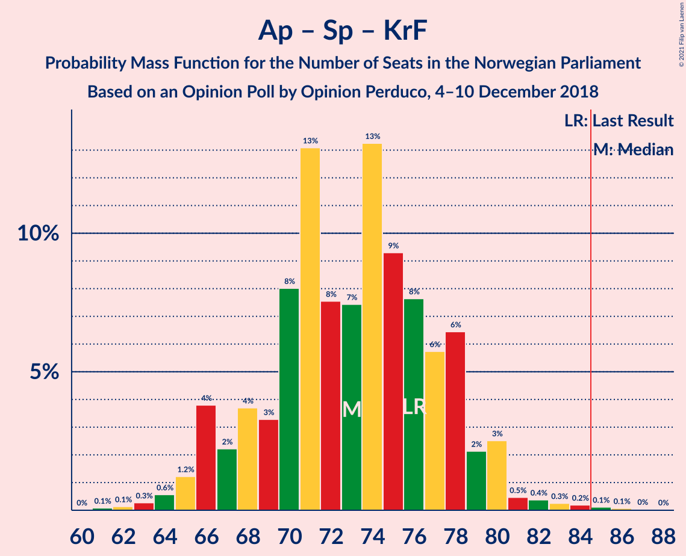

| Number of Seats | Probability | Accumulated | Special Marks |
|:---------------:|:-----------:|:-----------:|:-------------:|
| 61 | 0.1% | 100% |  |
| 62 | 0.1% | 99.9% |  |
| 63 | 0.3% | 99.8% |  |
| 64 | 0.6% | 99.5% |  |
| 65 | 1.2% | 98.9% |  |
| 66 | 4% | 98% |  |
| 67 | 2% | 94% |  |
| 68 | 4% | 92% |  |
| 69 | 3% | 88% |  |
| 70 | 8% | 85% |  |
| 71 | 13% | 77% |  |
| 72 | 8% | 64% |  |
| 73 | 7% | 56% |  |
| 74 | 13% | 49% | Median |
| 75 | 9% | 35% |  |
| 76 | 8% | 26% | Last Result |
| 77 | 6% | 18% |  |
| 78 | 6% | 13% |  |
| 79 | 2% | 6% |  |
| 80 | 3% | 4% |  |
| 81 | 0.5% | 2% |  |
| 82 | 0.4% | 1.1% |  |
| 83 | 0.3% | 0.7% |  |
| 84 | 0.2% | 0.5% |  |
| 85 | 0.1% | 0.3% | Majority |
| 86 | 0.1% | 0.2% |  |
| 87 | 0% | 0.1% |  |
| 88 | 0% | 0% |  |

### Høyre – Fremskrittspartiet – Venstre

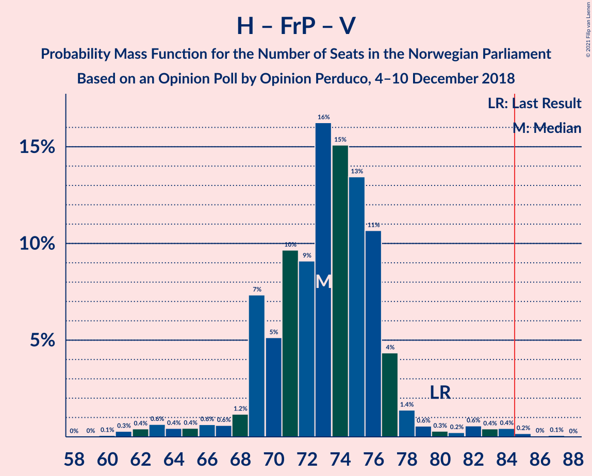

| Number of Seats | Probability | Accumulated | Special Marks |
|:---------------:|:-----------:|:-----------:|:-------------:|
| 59 | 0% | 100% |  |
| 60 | 0.1% | 99.9% |  |
| 61 | 0.3% | 99.9% |  |
| 62 | 0.4% | 99.6% |  |
| 63 | 0.6% | 99.2% |  |
| 64 | 0.4% | 98.5% |  |
| 65 | 0.4% | 98% |  |
| 66 | 0.6% | 98% |  |
| 67 | 0.6% | 97% |  |
| 68 | 1.2% | 96% |  |
| 69 | 7% | 95% |  |
| 70 | 5% | 88% |  |
| 71 | 10% | 83% |  |
| 72 | 9% | 73% |  |
| 73 | 16% | 64% |  |
| 74 | 15% | 48% | Median |
| 75 | 13% | 33% |  |
| 76 | 11% | 19% |  |
| 77 | 4% | 9% |  |
| 78 | 1.4% | 4% |  |
| 79 | 0.6% | 3% |  |
| 80 | 0.3% | 2% | Last Result |
| 81 | 0.2% | 2% |  |
| 82 | 0.6% | 2% |  |
| 83 | 0.4% | 1.2% |  |
| 84 | 0.4% | 0.8% |  |
| 85 | 0.2% | 0.3% | Majority |
| 86 | 0% | 0.1% |  |
| 87 | 0.1% | 0.1% |  |
| 88 | 0% | 0% |  |

### Arbeiderpartiet – Senterpartiet

| Number of Seats | Probability | Accumulated | Special Marks |
|:---------------:|:-----------:|:-----------:|:-------------:|
| 58 | 0.1% | 100% |  |
| 59 | 0.1% | 99.9% |  |
| 60 | 0.6% | 99.8% |  |
| 61 | 0.7% | 99.2% |  |
| 62 | 2% | 98.6% |  |
| 63 | 6% | 96% |  |
| 64 | 6% | 91% |  |
| 65 | 2% | 85% |  |
| 66 | 5% | 83% |  |
| 67 | 6% | 79% |  |
| 68 | 7% | 73% | Last Result |
| 69 | 9% | 65% |  |
| 70 | 16% | 57% |  |
| 71 | 12% | 41% | Median |
| 72 | 8% | 29% |  |
| 73 | 6% | 20% |  |
| 74 | 4% | 14% |  |
| 75 | 4% | 11% |  |
| 76 | 2% | 7% |  |
| 77 | 3% | 4% |  |
| 78 | 0.5% | 1.0% |  |
| 79 | 0.2% | 0.5% |  |
| 80 | 0.1% | 0.3% |  |
| 81 | 0.1% | 0.2% |  |
| 82 | 0% | 0.1% |  |
| 83 | 0% | 0% |  |

### Høyre – Fremskrittspartiet

| Number of Seats | Probability | Accumulated | Special Marks |
|:---------------:|:-----------:|:-----------:|:-------------:|
| 54 | 0.1% | 100% |  |
| 55 | 0.1% | 99.9% |  |
| 56 | 0.3% | 99.8% |  |
| 57 | 0.3% | 99.5% |  |
| 58 | 0.4% | 99.1% |  |
| 59 | 0.6% | 98.7% |  |
| 60 | 2% | 98% |  |
| 61 | 2% | 96% |  |
| 62 | 4% | 94% |  |
| 63 | 4% | 91% |  |
| 64 | 10% | 87% |  |
| 65 | 10% | 76% |  |
| 66 | 12% | 66% | Median |
| 67 | 17% | 55% |  |
| 68 | 7% | 38% |  |
| 69 | 9% | 31% |  |
| 70 | 5% | 22% |  |
| 71 | 9% | 17% |  |
| 72 | 3% | 7% | Last Result |
| 73 | 2% | 5% |  |
| 74 | 1.4% | 3% |  |
| 75 | 0.6% | 1.1% |  |
| 76 | 0.3% | 0.6% |  |
| 77 | 0.1% | 0.3% |  |
| 78 | 0.1% | 0.2% |  |
| 79 | 0% | 0.1% |  |
| 80 | 0% | 0% |  |

### Arbeiderpartiet – Sosialistisk Venstreparti

| Number of Seats | Probability | Accumulated | Special Marks |
|:---------------:|:-----------:|:-----------:|:-------------:|
| 48 | 0.1% | 100% |  |
| 49 | 0.1% | 99.9% |  |
| 50 | 0.3% | 99.8% |  |
| 51 | 0.8% | 99.5% |  |
| 52 | 2% | 98.6% |  |
| 53 | 3% | 97% |  |
| 54 | 6% | 94% |  |
| 55 | 7% | 88% |  |
| 56 | 7% | 80% |  |
| 57 | 5% | 73% |  |
| 58 | 10% | 68% |  |
| 59 | 13% | 58% |  |
| 60 | 7% | 44% | Last Result, Median |
| 61 | 14% | 38% |  |
| 62 | 11% | 23% |  |
| 63 | 4% | 12% |  |
| 64 | 2% | 8% |  |
| 65 | 4% | 6% |  |
| 66 | 0.8% | 3% |  |
| 67 | 0.6% | 2% |  |
| 68 | 0.8% | 1.2% |  |
| 69 | 0.2% | 0.3% |  |
| 70 | 0.1% | 0.2% |  |
| 71 | 0% | 0.1% |  |
| 72 | 0% | 0% |  |

### Høyre – Venstre – Kristelig Folkeparti

| Number of Seats | Probability | Accumulated | Special Marks |
|:---------------:|:-----------:|:-----------:|:-------------:|
| 38 | 0% | 100% |  |
| 39 | 0.1% | 99.9% |  |
| 40 | 0.2% | 99.8% |  |
| 41 | 0.3% | 99.7% |  |
| 42 | 2% | 99.4% |  |
| 43 | 0.7% | 98% |  |
| 44 | 6% | 97% |  |
| 45 | 3% | 91% |  |
| 46 | 5% | 88% |  |
| 47 | 7% | 83% |  |
| 48 | 8% | 76% |  |
| 49 | 10% | 68% |  |
| 50 | 4% | 58% |  |
| 51 | 14% | 54% | Median |
| 52 | 16% | 40% |  |
| 53 | 4% | 24% |  |
| 54 | 4% | 19% |  |
| 55 | 3% | 15% |  |
| 56 | 6% | 12% |  |
| 57 | 3% | 6% |  |
| 58 | 0.7% | 3% |  |
| 59 | 1.4% | 2% |  |
| 60 | 0.3% | 0.8% |  |
| 61 | 0.3% | 0.5% | Last Result |
| 62 | 0.1% | 0.2% |  |
| 63 | 0.1% | 0.1% |  |
| 64 | 0% | 0.1% |  |
| 65 | 0% | 0% |  |

### Senterpartiet – Venstre – Kristelig Folkeparti

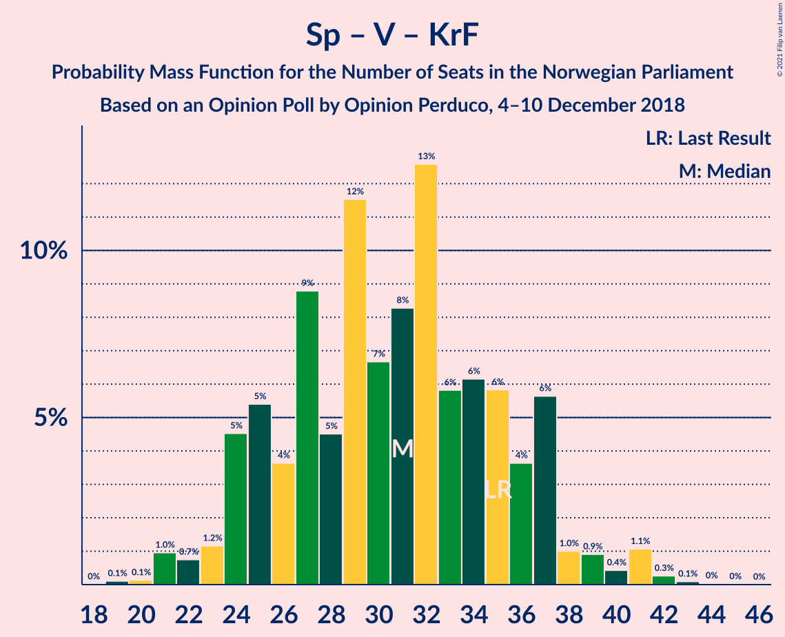

| Number of Seats | Probability | Accumulated | Special Marks |
|:---------------:|:-----------:|:-----------:|:-------------:|
| 19 | 0.1% | 100% |  |
| 20 | 0.1% | 99.9% |  |
| 21 | 1.0% | 99.7% |  |
| 22 | 0.7% | 98.8% |  |
| 23 | 1.2% | 98% |  |
| 24 | 5% | 97% |  |
| 25 | 5% | 92% |  |
| 26 | 4% | 87% |  |
| 27 | 9% | 83% |  |
| 28 | 5% | 75% |  |
| 29 | 12% | 70% |  |
| 30 | 7% | 58% |  |
| 31 | 8% | 52% |  |
| 32 | 13% | 44% | Median |
| 33 | 6% | 31% |  |
| 34 | 6% | 25% |  |
| 35 | 6% | 19% | Last Result |
| 36 | 4% | 13% |  |
| 37 | 6% | 9% |  |
| 38 | 1.0% | 4% |  |
| 39 | 0.9% | 3% |  |
| 40 | 0.4% | 2% |  |
| 41 | 1.1% | 1.5% |  |
| 42 | 0.3% | 0.4% |  |
| 43 | 0.1% | 0.2% |  |
| 44 | 0% | 0.1% |  |
| 45 | 0% | 0% |  |

## Technical Information

### Opinion Poll

+ **Polling firm:** Opinion Perduco
+ **Commissioner(s):** —
+ **Fieldwork period:** 4–10 December 2018

### Calculations

+ **Sample size:** 691
+ **Simulations done:** 1,048,576
+ **Error estimate:** 1.46%

