# Opinion Poll by Norstat, 11–17 December 2018

<a href="#voting-intentions">Voting Intentions</a> | <a href="#seats">Seats</a> | <a href="#coalitions">Coalitions</a> | <a href="#technical-information">Technical Information</a>

## Voting Intentions

### Confidence Intervals

| Party | Last Result | Poll Result | 80% Confidence Interval | 90% Confidence Interval | 95% Confidence Interval | 99% Confidence Interval |
|:-----:|:-----------:|:-----------:|:-----------------------:|:-----------------------:|:-----------------------:|:-----------------------:|
| Arbeiderpartiet | 27.4% | 26.8% | 25.0–28.7% |24.4–29.2% |24.0–29.7% |23.2–30.6% |
| Høyre | 25.0% | 26.5% | 24.7–28.5% |24.2–29.0% |23.8–29.5% |23.0–30.4% |
| Fremskrittspartiet | 15.2% | 12.4% | 11.1–13.9% |10.7–14.3% |10.4–14.7% |9.8–15.4% |
| Senterpartiet | 10.3% | 11.2% | 10.0–12.7% |9.6–13.1% |9.3–13.4% |8.8–14.1% |
| Sosialistisk Venstreparti | 6.0% | 6.9% | 5.9–8.1% |5.7–8.4% |5.4–8.7% |5.0–9.3% |
| Rødt | 2.4% | 4.1% | 3.4–5.1% |3.2–5.3% |3.0–5.6% |2.7–6.1% |
| Miljøpartiet De Grønne | 3.2% | 3.5% | 2.8–4.4% |2.6–4.6% |2.5–4.8% |2.2–5.3% |
| Venstre | 4.4% | 3.5% | 2.8–4.4% |2.6–4.6% |2.5–4.8% |2.2–5.3% |
| Kristelig Folkeparti | 4.2% | 3.5% | 2.8–4.4% |2.6–4.6% |2.5–4.8% |2.2–5.3% |

*Note:* The poll result column reflects the actual value used in the calculations. Published results may vary slightly, and in addition be rounded to fewer digits.

## Seats

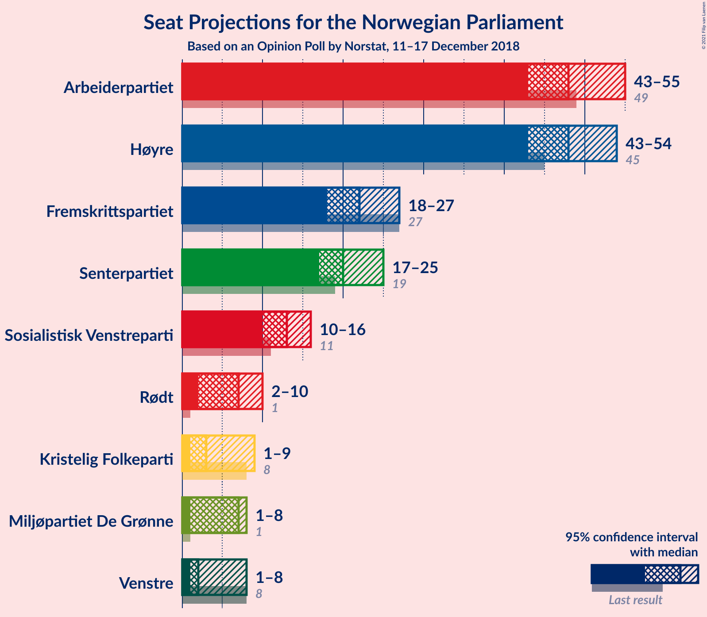

### Confidence Intervals

| Party | Last Result | Median | 80% Confidence Interval | 90% Confidence Interval | 95% Confidence Interval | 99% Confidence Interval |
|:-----:|:-----------:|:------:|:-----------------------:|:-----------------------:|:-----------------------:|:-----------------------:|
| <a href="#arbeiderpartiet">Arbeiderpartiet</a> | 49 | 48 | 45–53 |44–54 |43–55 |41–57 |
| <a href="#høyre">Høyre</a> | 45 | 48 | 44–52 |43–52 |43–54 |41–55 |
| <a href="#fremskrittspartiet">Fremskrittspartiet</a> | 27 | 22 | 20–25 |19–26 |18–27 |17–28 |
| <a href="#senterpartiet">Senterpartiet</a> | 19 | 20 | 18–23 |17–24 |17–25 |16–26 |
| <a href="#sosialistisk-venstreparti">Sosialistisk Venstreparti</a> | 11 | 13 | 11–14 |10–15 |10–16 |9–17 |
| <a href="#rødt">Rødt</a> | 1 | 7 | 2–9 |2–9 |2–10 |1–11 |
| <a href="#miljøpartiet-de-grønne">Miljøpartiet De Grønne</a> | 1 | 7 | 1–8 |1–8 |1–8 |1–9 |
| <a href="#venstre">Venstre</a> | 8 | 2 | 2–8 |2–8 |1–8 |1–10 |
| <a href="#kristelig-folkeparti">Kristelig Folkeparti</a> | 8 | 3 | 1–8 |1–8 |1–9 |0–10 |

### Arbeiderpartiet

*For a full overview of the results for this party, see the [Arbeiderpartiet](party-arbeiderpartiet.html) page.*

| Number of Seats | Probability | Accumulated | Special Marks |
|:---------------:|:-----------:|:-----------:|:-------------:|
| 40 | 0.1% | 100% |  |
| 41 | 0.4% | 99.9% |  |
| 42 | 1.0% | 99.5% |  |
| 43 | 2% | 98.5% |  |
| 44 | 6% | 96% |  |
| 45 | 7% | 90% |  |
| 46 | 10% | 83% |  |
| 47 | 17% | 73% |  |
| 48 | 8% | 56% | Median |
| 49 | 11% | 48% | Last Result |
| 50 | 11% | 36% |  |
| 51 | 10% | 26% |  |
| 52 | 5% | 16% |  |
| 53 | 5% | 11% |  |
| 54 | 3% | 6% |  |
| 55 | 2% | 3% |  |
| 56 | 0.5% | 1.4% |  |
| 57 | 0.6% | 0.9% |  |
| 58 | 0.1% | 0.3% |  |
| 59 | 0.1% | 0.2% |  |
| 60 | 0% | 0% |  |

### Høyre

*For a full overview of the results for this party, see the [Høyre](party-høyre.html) page.*

| Number of Seats | Probability | Accumulated | Special Marks |
|:---------------:|:-----------:|:-----------:|:-------------:|
| 39 | 0% | 100% |  |
| 40 | 0.3% | 99.9% |  |
| 41 | 0.5% | 99.6% |  |
| 42 | 1.4% | 99.1% |  |
| 43 | 4% | 98% |  |
| 44 | 8% | 94% |  |
| 45 | 6% | 86% | Last Result |
| 46 | 12% | 81% |  |
| 47 | 11% | 69% |  |
| 48 | 18% | 58% | Median |
| 49 | 10% | 40% |  |
| 50 | 7% | 29% |  |
| 51 | 12% | 23% |  |
| 52 | 7% | 11% |  |
| 53 | 1.3% | 5% |  |
| 54 | 2% | 3% |  |
| 55 | 1.2% | 2% |  |
| 56 | 0.3% | 0.5% |  |
| 57 | 0.1% | 0.2% |  |
| 58 | 0.1% | 0.1% |  |
| 59 | 0% | 0% |  |

### Fremskrittspartiet

*For a full overview of the results for this party, see the [Fremskrittspartiet](party-fremskrittspartiet.html) page.*

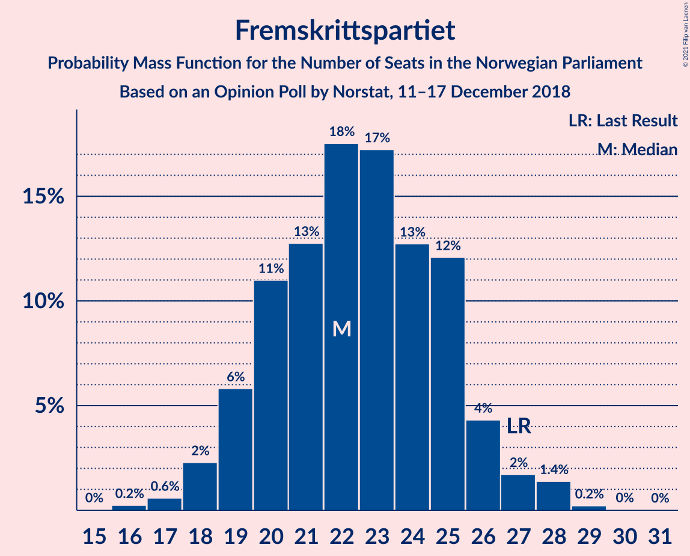

| Number of Seats | Probability | Accumulated | Special Marks |
|:---------------:|:-----------:|:-----------:|:-------------:|
| 16 | 0.2% | 100% |  |
| 17 | 0.6% | 99.7% |  |
| 18 | 2% | 99.1% |  |
| 19 | 6% | 97% |  |
| 20 | 11% | 91% |  |
| 21 | 13% | 80% |  |
| 22 | 18% | 67% | Median |
| 23 | 17% | 50% |  |
| 24 | 13% | 33% |  |
| 25 | 12% | 20% |  |
| 26 | 4% | 8% |  |
| 27 | 2% | 3% | Last Result |
| 28 | 1.4% | 2% |  |
| 29 | 0.2% | 0.3% |  |
| 30 | 0% | 0.1% |  |
| 31 | 0% | 0% |  |

### Senterpartiet

*For a full overview of the results for this party, see the [Senterpartiet](party-senterpartiet.html) page.*

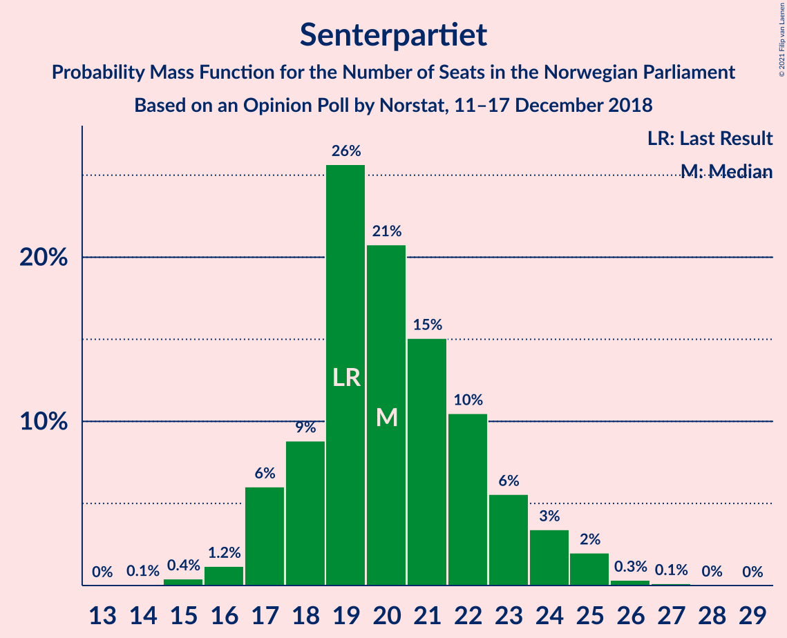

| Number of Seats | Probability | Accumulated | Special Marks |
|:---------------:|:-----------:|:-----------:|:-------------:|
| 14 | 0.1% | 100% |  |
| 15 | 0.4% | 99.9% |  |
| 16 | 1.2% | 99.5% |  |
| 17 | 6% | 98% |  |
| 18 | 9% | 92% |  |
| 19 | 26% | 83% | Last Result |
| 20 | 21% | 58% | Median |
| 21 | 15% | 37% |  |
| 22 | 10% | 22% |  |
| 23 | 6% | 11% |  |
| 24 | 3% | 6% |  |
| 25 | 2% | 3% |  |
| 26 | 0.3% | 0.5% |  |
| 27 | 0.1% | 0.2% |  |
| 28 | 0% | 0.1% |  |
| 29 | 0% | 0% |  |

### Sosialistisk Venstreparti

*For a full overview of the results for this party, see the [Sosialistisk Venstreparti](party-sosialistiskvenstreparti.html) page.*

| Number of Seats | Probability | Accumulated | Special Marks |
|:---------------:|:-----------:|:-----------:|:-------------:|
| 8 | 0.2% | 100% |  |
| 9 | 1.2% | 99.7% |  |
| 10 | 7% | 98.5% |  |
| 11 | 18% | 91% | Last Result |
| 12 | 20% | 73% |  |
| 13 | 28% | 53% | Median |
| 14 | 16% | 26% |  |
| 15 | 6% | 10% |  |
| 16 | 3% | 4% |  |
| 17 | 0.9% | 1.0% |  |
| 18 | 0.1% | 0.2% |  |
| 19 | 0% | 0% |  |

### Rødt

*For a full overview of the results for this party, see the [Rødt](party-rødt.html) page.*

| Number of Seats | Probability | Accumulated | Special Marks |
|:---------------:|:-----------:|:-----------:|:-------------:|
| 1 | 2% | 100% | Last Result |
| 2 | 39% | 98% |  |
| 3 | 0.1% | 59% |  |
| 4 | 0% | 58% |  |
| 5 | 0% | 58% |  |
| 6 | 0.1% | 58% |  |
| 7 | 10% | 58% | Median |
| 8 | 34% | 49% |  |
| 9 | 11% | 15% |  |
| 10 | 4% | 4% |  |
| 11 | 0.6% | 0.7% |  |
| 12 | 0.1% | 0.1% |  |
| 13 | 0% | 0% |  |

### Miljøpartiet De Grønne

*For a full overview of the results for this party, see the [Miljøpartiet De Grønne](party-miljøpartietdegrønne.html) page.*

| Number of Seats | Probability | Accumulated | Special Marks |
|:---------------:|:-----------:|:-----------:|:-------------:|
| 1 | 22% | 100% | Last Result |
| 2 | 20% | 78% |  |
| 3 | 0% | 57% |  |
| 4 | 0% | 57% |  |
| 5 | 0% | 57% |  |
| 6 | 0% | 57% |  |
| 7 | 11% | 57% | Median |
| 8 | 46% | 46% |  |
| 9 | 0.2% | 0.6% |  |
| 10 | 0.1% | 0.4% |  |
| 11 | 0.2% | 0.2% |  |
| 12 | 0% | 0% |  |

### Venstre

*For a full overview of the results for this party, see the [Venstre](party-venstre.html) page.*

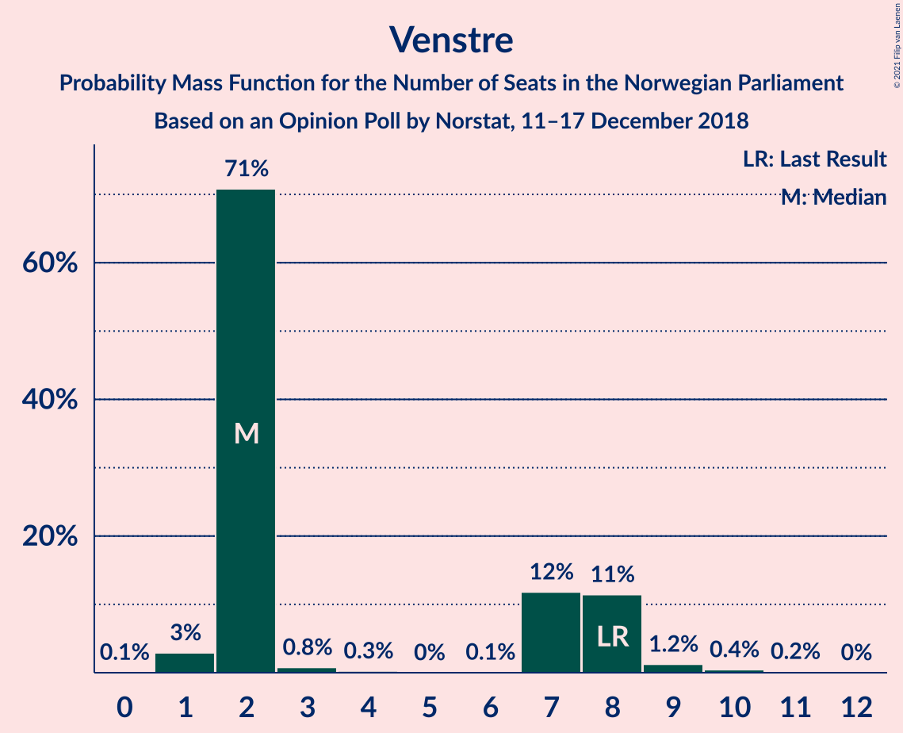

| Number of Seats | Probability | Accumulated | Special Marks |
|:---------------:|:-----------:|:-----------:|:-------------:|
| 0 | 0.1% | 100% |  |
| 1 | 3% | 99.9% |  |
| 2 | 71% | 97% | Median |
| 3 | 0.8% | 26% |  |
| 4 | 0.3% | 25% |  |
| 5 | 0% | 25% |  |
| 6 | 0.1% | 25% |  |
| 7 | 12% | 25% |  |
| 8 | 11% | 13% | Last Result |
| 9 | 1.2% | 2% |  |
| 10 | 0.4% | 0.6% |  |
| 11 | 0.2% | 0.2% |  |
| 12 | 0% | 0% |  |

### Kristelig Folkeparti

*For a full overview of the results for this party, see the [Kristelig Folkeparti](party-kristeligfolkeparti.html) page.*

| Number of Seats | Probability | Accumulated | Special Marks |
|:---------------:|:-----------:|:-----------:|:-------------:|
| 0 | 0.9% | 100% |  |
| 1 | 30% | 99.1% |  |
| 2 | 8% | 69% |  |
| 3 | 41% | 61% | Median |
| 4 | 0% | 20% |  |
| 5 | 0% | 20% |  |
| 6 | 0.3% | 20% |  |
| 7 | 5% | 20% |  |
| 8 | 10% | 15% | Last Result |
| 9 | 4% | 5% |  |
| 10 | 1.1% | 1.3% |  |
| 11 | 0.1% | 0.1% |  |
| 12 | 0% | 0% |  |

## Coalitions

### Confidence Intervals

| Coalition | Last Result | Median | Majority? | 80% Confidence Interval | 90% Confidence Interval | 95% Confidence Interval | 99% Confidence Interval |
|:---------:|:-----------:|:------:|:---------:|:-----------------------:|:-----------------------:|:-----------------------:|:-----------------------:|
| Høyre – Fremskrittspartiet – Senterpartiet – Kristelig Folkeparti – Venstre | 107 | 97 | 99.9% | 92–103 | 90–105 | 89–107 | 85–109 |
| Arbeiderpartiet – Senterpartiet – Sosialistisk Venstreparti – Rødt – Miljøpartiet De Grønne | 81 | 92 | 96% | 86–98 | 85–99 | 83–100 | 80–103 |
| Arbeiderpartiet – Senterpartiet – Sosialistisk Venstreparti – Kristelig Folkeparti – Miljøpartiet De Grønne | 88 | 90 | 90% | 85–94 | 83–96 | 81–97 | 79–100 |
| Arbeiderpartiet – Senterpartiet – Sosialistisk Venstreparti – Miljøpartiet De Grønne | 80 | 86 | 69% | 81–92 | 79–93 | 78–95 | 76–97 |
| Arbeiderpartiet – Senterpartiet – Sosialistisk Venstreparti – Rødt | 80 | 86 | 70% | 82–92 | 81–93 | 79–94 | 77–97 |
| Høyre – Fremskrittspartiet – Kristelig Folkeparti – Miljøpartiet De Grønne – Venstre | 89 | 83 | 30% | 77–87 | 76–88 | 75–90 | 72–92 |
| Arbeiderpartiet – Senterpartiet – Sosialistisk Venstreparti | 79 | 81 | 16% | 77–86 | 76–87 | 75–89 | 72–91 |
| Høyre – Fremskrittspartiet – Kristelig Folkeparti – Venstre | 88 | 77 | 4% | 71–83 | 70–84 | 69–86 | 66–89 |
| Arbeiderpartiet – Senterpartiet – Kristelig Folkeparti – Miljøpartiet De Grønne | 77 | 77 | 3% | 72–82 | 70–83 | 69–85 | 67–87 |
| Høyre – Fremskrittspartiet – Venstre | 80 | 74 | 0.3% | 68–79 | 67–81 | 67–82 | 65–84 |
| Arbeiderpartiet – Senterpartiet – Kristelig Folkeparti | 76 | 71 | 0.2% | 67–77 | 66–79 | 65–80 | 64–83 |
| Høyre – Fremskrittspartiet | 72 | 71 | 0% | 66–74 | 65–76 | 64–77 | 61–79 |
| Arbeiderpartiet – Senterpartiet | 68 | 68 | 0% | 65–73 | 64–75 | 62–76 | 61–78 |
| Arbeiderpartiet – Sosialistisk Venstreparti | 60 | 61 | 0% | 57–65 | 56–67 | 55–68 | 53–70 |
| Høyre – Kristelig Folkeparti – Venstre | 61 | 54 | 0% | 49–61 | 48–62 | 46–63 | 45–66 |
| Senterpartiet – Kristelig Folkeparti – Venstre | 35 | 26 | 0% | 22–32 | 21–33 | 20–35 | 20–37 |

### Høyre – Fremskrittspartiet – Senterpartiet – Kristelig Folkeparti – Venstre

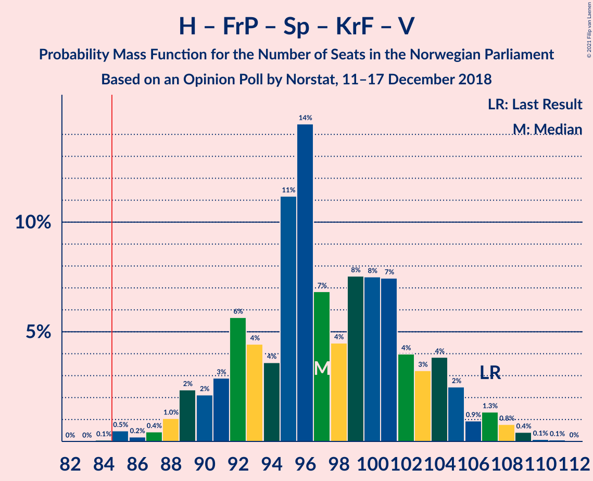

| Number of Seats | Probability | Accumulated | Special Marks |
|:---------------:|:-----------:|:-----------:|:-------------:|
| 84 | 0.1% | 100% |  |
| 85 | 0.5% | 99.9% | Majority |
| 86 | 0.2% | 99.4% |  |
| 87 | 0.4% | 99.2% |  |
| 88 | 1.0% | 98.8% |  |
| 89 | 2% | 98% |  |
| 90 | 2% | 95% |  |
| 91 | 3% | 93% |  |
| 92 | 6% | 90% |  |
| 93 | 4% | 85% |  |
| 94 | 4% | 80% |  |
| 95 | 11% | 77% | Median |
| 96 | 14% | 66% |  |
| 97 | 7% | 51% |  |
| 98 | 4% | 44% |  |
| 99 | 8% | 40% |  |
| 100 | 8% | 32% |  |
| 101 | 7% | 25% |  |
| 102 | 4% | 17% |  |
| 103 | 3% | 13% |  |
| 104 | 4% | 10% |  |
| 105 | 2% | 6% |  |
| 106 | 0.9% | 4% |  |
| 107 | 1.3% | 3% | Last Result |
| 108 | 0.8% | 1.4% |  |
| 109 | 0.4% | 0.6% |  |
| 110 | 0.1% | 0.2% |  |
| 111 | 0.1% | 0.1% |  |
| 112 | 0% | 0% |  |

### Arbeiderpartiet – Senterpartiet – Sosialistisk Venstreparti – Rødt – Miljøpartiet De Grønne

| Number of Seats | Probability | Accumulated | Special Marks |
|:---------------:|:-----------:|:-----------:|:-------------:|
| 78 | 0% | 100% |  |
| 79 | 0.1% | 99.9% |  |
| 80 | 0.4% | 99.8% |  |
| 81 | 0.2% | 99.4% | Last Result |
| 82 | 0.4% | 99.1% |  |
| 83 | 2% | 98.7% |  |
| 84 | 1.1% | 97% |  |
| 85 | 3% | 96% | Majority |
| 86 | 4% | 92% |  |
| 87 | 6% | 88% |  |
| 88 | 4% | 82% |  |
| 89 | 8% | 78% |  |
| 90 | 9% | 70% |  |
| 91 | 7% | 61% |  |
| 92 | 10% | 54% |  |
| 93 | 9% | 44% |  |
| 94 | 9% | 35% |  |
| 95 | 6% | 26% | Median |
| 96 | 3% | 20% |  |
| 97 | 5% | 17% |  |
| 98 | 4% | 12% |  |
| 99 | 4% | 8% |  |
| 100 | 2% | 3% |  |
| 101 | 0.8% | 2% |  |
| 102 | 0.6% | 1.1% |  |
| 103 | 0.4% | 0.5% |  |
| 104 | 0% | 0.1% |  |
| 105 | 0% | 0.1% |  |
| 106 | 0% | 0% |  |

### Arbeiderpartiet – Senterpartiet – Sosialistisk Venstreparti – Kristelig Folkeparti – Miljøpartiet De Grønne

| Number of Seats | Probability | Accumulated | Special Marks |
|:---------------:|:-----------:|:-----------:|:-------------:|
| 76 | 0% | 100% |  |
| 77 | 0% | 99.9% |  |
| 78 | 0.1% | 99.9% |  |
| 79 | 0.7% | 99.8% |  |
| 80 | 1.0% | 99.1% |  |
| 81 | 1.0% | 98% |  |
| 82 | 1.5% | 97% |  |
| 83 | 2% | 96% |  |
| 84 | 3% | 93% |  |
| 85 | 5% | 90% | Majority |
| 86 | 4% | 85% |  |
| 87 | 7% | 81% |  |
| 88 | 12% | 73% | Last Result |
| 89 | 8% | 61% |  |
| 90 | 12% | 53% |  |
| 91 | 12% | 41% | Median |
| 92 | 9% | 29% |  |
| 93 | 7% | 21% |  |
| 94 | 4% | 13% |  |
| 95 | 4% | 9% |  |
| 96 | 2% | 5% |  |
| 97 | 1.1% | 3% |  |
| 98 | 1.3% | 2% |  |
| 99 | 0.4% | 0.9% |  |
| 100 | 0.3% | 0.5% |  |
| 101 | 0.2% | 0.3% |  |
| 102 | 0% | 0.1% |  |
| 103 | 0% | 0% |  |

### Arbeiderpartiet – Senterpartiet – Sosialistisk Venstreparti – Miljøpartiet De Grønne

| Number of Seats | Probability | Accumulated | Special Marks |
|:---------------:|:-----------:|:-----------:|:-------------:|
| 73 | 0% | 100% |  |
| 74 | 0.1% | 99.9% |  |
| 75 | 0.3% | 99.8% |  |
| 76 | 0.5% | 99.5% |  |
| 77 | 2% | 99.1% |  |
| 78 | 1.3% | 98% |  |
| 79 | 2% | 96% |  |
| 80 | 3% | 94% | Last Result |
| 81 | 5% | 91% |  |
| 82 | 7% | 86% |  |
| 83 | 5% | 79% |  |
| 84 | 5% | 74% |  |
| 85 | 13% | 69% | Majority |
| 86 | 9% | 55% |  |
| 87 | 8% | 47% |  |
| 88 | 7% | 38% | Median |
| 89 | 7% | 32% |  |
| 90 | 10% | 25% |  |
| 91 | 4% | 14% |  |
| 92 | 3% | 10% |  |
| 93 | 2% | 7% |  |
| 94 | 1.3% | 4% |  |
| 95 | 2% | 3% |  |
| 96 | 0.4% | 1.3% |  |
| 97 | 0.5% | 0.9% |  |
| 98 | 0.1% | 0.4% |  |
| 99 | 0.1% | 0.2% |  |
| 100 | 0.1% | 0.1% |  |
| 101 | 0% | 0% |  |

### Arbeiderpartiet – Senterpartiet – Sosialistisk Venstreparti – Rødt

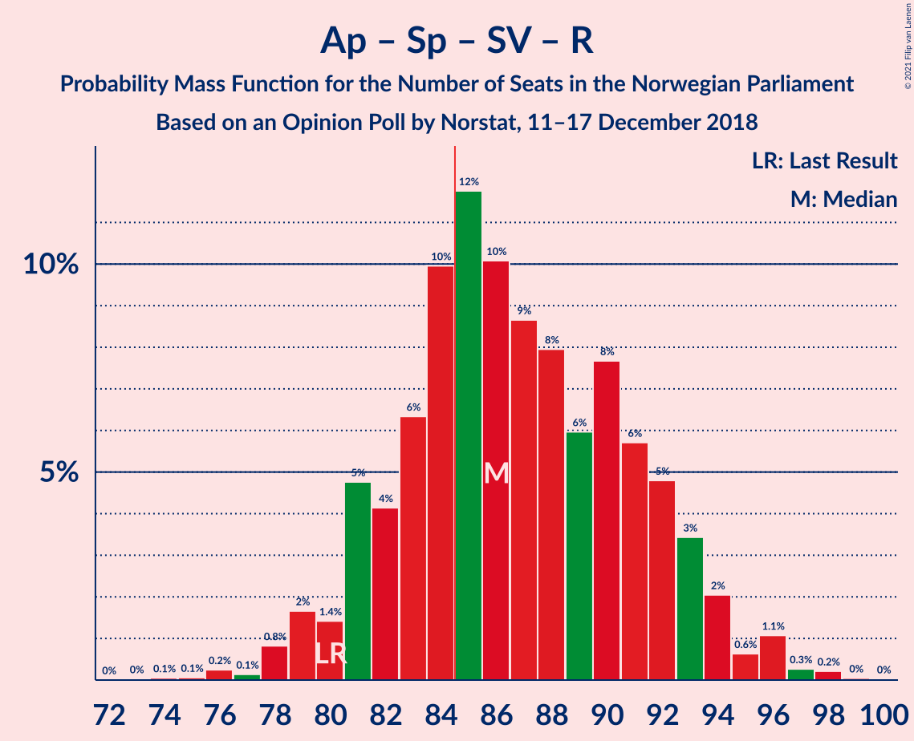

| Number of Seats | Probability | Accumulated | Special Marks |
|:---------------:|:-----------:|:-----------:|:-------------:|
| 74 | 0.1% | 100% |  |
| 75 | 0.1% | 99.9% |  |
| 76 | 0.2% | 99.9% |  |
| 77 | 0.1% | 99.6% |  |
| 78 | 0.8% | 99.5% |  |
| 79 | 2% | 98.6% |  |
| 80 | 1.4% | 97% | Last Result |
| 81 | 5% | 96% |  |
| 82 | 4% | 91% |  |
| 83 | 6% | 87% |  |
| 84 | 10% | 80% |  |
| 85 | 12% | 70% | Majority |
| 86 | 10% | 59% |  |
| 87 | 9% | 49% |  |
| 88 | 8% | 40% | Median |
| 89 | 6% | 32% |  |
| 90 | 8% | 26% |  |
| 91 | 6% | 18% |  |
| 92 | 5% | 13% |  |
| 93 | 3% | 8% |  |
| 94 | 2% | 4% |  |
| 95 | 0.6% | 2% |  |
| 96 | 1.1% | 2% |  |
| 97 | 0.3% | 0.6% |  |
| 98 | 0.2% | 0.3% |  |
| 99 | 0% | 0.1% |  |
| 100 | 0% | 0% |  |

### Høyre – Fremskrittspartiet – Kristelig Folkeparti – Miljøpartiet De Grønne – Venstre

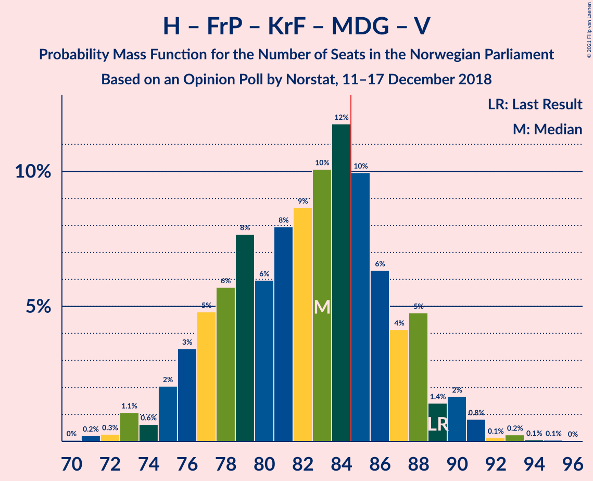

| Number of Seats | Probability | Accumulated | Special Marks |
|:---------------:|:-----------:|:-----------:|:-------------:|
| 70 | 0% | 100% |  |
| 71 | 0.2% | 99.9% |  |
| 72 | 0.3% | 99.7% |  |
| 73 | 1.1% | 99.4% |  |
| 74 | 0.6% | 98% |  |
| 75 | 2% | 98% |  |
| 76 | 3% | 96% |  |
| 77 | 5% | 92% |  |
| 78 | 6% | 87% |  |
| 79 | 8% | 82% |  |
| 80 | 6% | 74% |  |
| 81 | 8% | 68% |  |
| 82 | 9% | 60% | Median |
| 83 | 10% | 51% |  |
| 84 | 12% | 41% |  |
| 85 | 10% | 30% | Majority |
| 86 | 6% | 20% |  |
| 87 | 4% | 13% |  |
| 88 | 5% | 9% |  |
| 89 | 1.4% | 4% | Last Result |
| 90 | 2% | 3% |  |
| 91 | 0.8% | 1.4% |  |
| 92 | 0.1% | 0.5% |  |
| 93 | 0.2% | 0.4% |  |
| 94 | 0.1% | 0.1% |  |
| 95 | 0.1% | 0.1% |  |
| 96 | 0% | 0% |  |

### Arbeiderpartiet – Senterpartiet – Sosialistisk Venstreparti

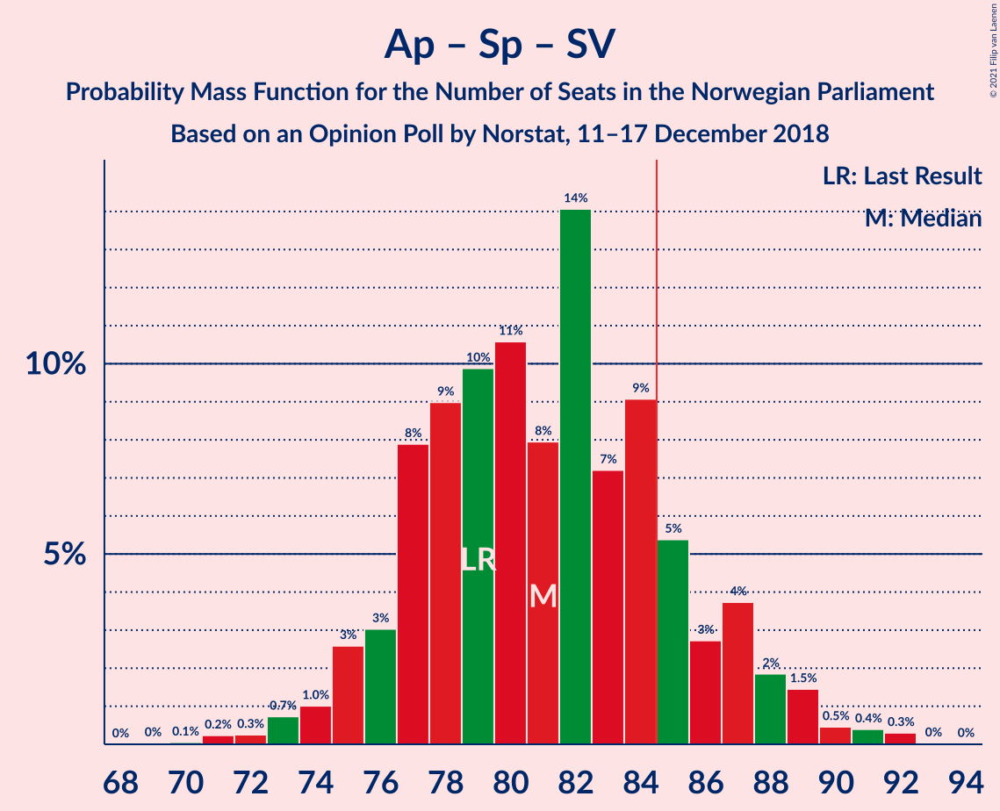

| Number of Seats | Probability | Accumulated | Special Marks |
|:---------------:|:-----------:|:-----------:|:-------------:|
| 70 | 0.1% | 100% |  |
| 71 | 0.2% | 99.9% |  |
| 72 | 0.3% | 99.7% |  |
| 73 | 0.7% | 99.4% |  |
| 74 | 1.0% | 98.7% |  |
| 75 | 3% | 98% |  |
| 76 | 3% | 95% |  |
| 77 | 8% | 92% |  |
| 78 | 9% | 84% |  |
| 79 | 10% | 75% | Last Result |
| 80 | 11% | 65% |  |
| 81 | 8% | 55% | Median |
| 82 | 14% | 47% |  |
| 83 | 7% | 33% |  |
| 84 | 9% | 25% |  |
| 85 | 5% | 16% | Majority |
| 86 | 3% | 11% |  |
| 87 | 4% | 8% |  |
| 88 | 2% | 5% |  |
| 89 | 1.5% | 3% |  |
| 90 | 0.5% | 1.2% |  |
| 91 | 0.4% | 0.8% |  |
| 92 | 0.3% | 0.4% |  |
| 93 | 0% | 0.1% |  |
| 94 | 0% | 0% |  |

### Høyre – Fremskrittspartiet – Kristelig Folkeparti – Venstre

| Number of Seats | Probability | Accumulated | Special Marks |
|:---------------:|:-----------:|:-----------:|:-------------:|
| 64 | 0% | 100% |  |
| 65 | 0% | 99.9% |  |
| 66 | 0.4% | 99.9% |  |
| 67 | 0.6% | 99.5% |  |
| 68 | 0.8% | 98.9% |  |
| 69 | 2% | 98% |  |
| 70 | 4% | 97% |  |
| 71 | 4% | 92% |  |
| 72 | 5% | 88% |  |
| 73 | 3% | 83% |  |
| 74 | 6% | 80% |  |
| 75 | 9% | 74% | Median |
| 76 | 9% | 65% |  |
| 77 | 10% | 56% |  |
| 78 | 7% | 46% |  |
| 79 | 9% | 39% |  |
| 80 | 8% | 30% |  |
| 81 | 4% | 22% |  |
| 82 | 6% | 18% |  |
| 83 | 4% | 12% |  |
| 84 | 3% | 8% |  |
| 85 | 1.1% | 4% | Majority |
| 86 | 2% | 3% |  |
| 87 | 0.4% | 1.3% |  |
| 88 | 0.2% | 0.9% | Last Result |
| 89 | 0.4% | 0.6% |  |
| 90 | 0.1% | 0.2% |  |
| 91 | 0% | 0.1% |  |
| 92 | 0% | 0% |  |

### Arbeiderpartiet – Senterpartiet – Kristelig Folkeparti – Miljøpartiet De Grønne

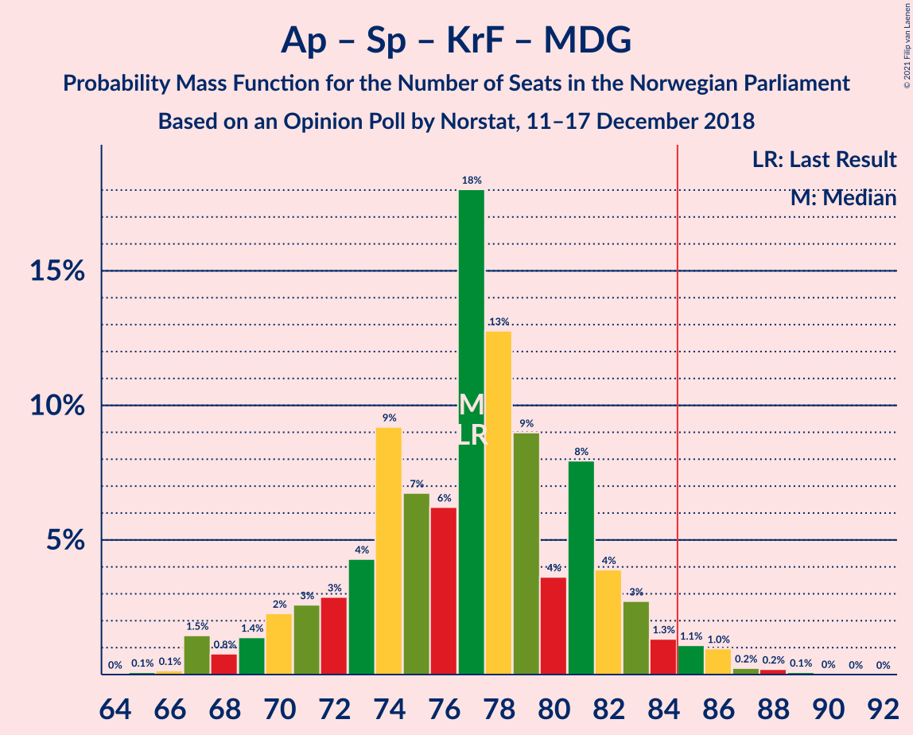

| Number of Seats | Probability | Accumulated | Special Marks |
|:---------------:|:-----------:|:-----------:|:-------------:|
| 65 | 0.1% | 100% |  |
| 66 | 0.1% | 99.9% |  |
| 67 | 1.5% | 99.7% |  |
| 68 | 0.8% | 98% |  |
| 69 | 1.4% | 98% |  |
| 70 | 2% | 96% |  |
| 71 | 3% | 94% |  |
| 72 | 3% | 91% |  |
| 73 | 4% | 88% |  |
| 74 | 9% | 84% |  |
| 75 | 7% | 75% |  |
| 76 | 6% | 68% |  |
| 77 | 18% | 62% | Last Result |
| 78 | 13% | 44% | Median |
| 79 | 9% | 31% |  |
| 80 | 4% | 22% |  |
| 81 | 8% | 19% |  |
| 82 | 4% | 11% |  |
| 83 | 3% | 7% |  |
| 84 | 1.3% | 4% |  |
| 85 | 1.1% | 3% | Majority |
| 86 | 1.0% | 2% |  |
| 87 | 0.2% | 0.6% |  |
| 88 | 0.2% | 0.3% |  |
| 89 | 0.1% | 0.1% |  |
| 90 | 0% | 0.1% |  |
| 91 | 0% | 0% |  |

### Høyre – Fremskrittspartiet – Venstre

| Number of Seats | Probability | Accumulated | Special Marks |
|:---------------:|:-----------:|:-----------:|:-------------:|
| 62 | 0% | 100% |  |
| 63 | 0.1% | 99.9% |  |
| 64 | 0.2% | 99.9% |  |
| 65 | 0.9% | 99.7% |  |
| 66 | 1.2% | 98.8% |  |
| 67 | 3% | 98% |  |
| 68 | 5% | 95% |  |
| 69 | 6% | 90% |  |
| 70 | 3% | 83% |  |
| 71 | 7% | 80% |  |
| 72 | 9% | 73% | Median |
| 73 | 13% | 64% |  |
| 74 | 8% | 51% |  |
| 75 | 7% | 43% |  |
| 76 | 12% | 36% |  |
| 77 | 7% | 24% |  |
| 78 | 5% | 17% |  |
| 79 | 3% | 12% |  |
| 80 | 4% | 10% | Last Result |
| 81 | 3% | 6% |  |
| 82 | 1.4% | 3% |  |
| 83 | 0.9% | 2% |  |
| 84 | 0.7% | 0.9% |  |
| 85 | 0.1% | 0.3% | Majority |
| 86 | 0.1% | 0.1% |  |
| 87 | 0.1% | 0.1% |  |
| 88 | 0% | 0% |  |

### Arbeiderpartiet – Senterpartiet – Kristelig Folkeparti

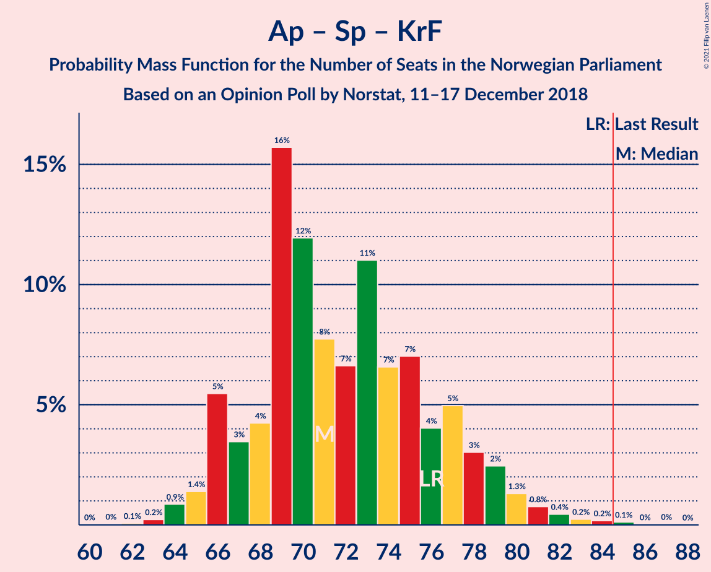

| Number of Seats | Probability | Accumulated | Special Marks |
|:---------------:|:-----------:|:-----------:|:-------------:|
| 61 | 0% | 100% |  |
| 62 | 0.1% | 99.9% |  |
| 63 | 0.2% | 99.9% |  |
| 64 | 0.9% | 99.6% |  |
| 65 | 1.4% | 98.8% |  |
| 66 | 5% | 97% |  |
| 67 | 3% | 92% |  |
| 68 | 4% | 88% |  |
| 69 | 16% | 84% |  |
| 70 | 12% | 69% |  |
| 71 | 8% | 57% | Median |
| 72 | 7% | 49% |  |
| 73 | 11% | 42% |  |
| 74 | 7% | 31% |  |
| 75 | 7% | 25% |  |
| 76 | 4% | 18% | Last Result |
| 77 | 5% | 14% |  |
| 78 | 3% | 9% |  |
| 79 | 2% | 6% |  |
| 80 | 1.3% | 3% |  |
| 81 | 0.8% | 2% |  |
| 82 | 0.4% | 1.0% |  |
| 83 | 0.2% | 0.6% |  |
| 84 | 0.2% | 0.3% |  |
| 85 | 0.1% | 0.2% | Majority |
| 86 | 0% | 0.1% |  |
| 87 | 0% | 0% |  |

### Høyre – Fremskrittspartiet

| Number of Seats | Probability | Accumulated | Special Marks |
|:---------------:|:-----------:|:-----------:|:-------------:|
| 59 | 0% | 100% |  |
| 60 | 0.2% | 99.9% |  |
| 61 | 0.2% | 99.7% |  |
| 62 | 0.3% | 99.5% |  |
| 63 | 1.2% | 99.2% |  |
| 64 | 2% | 98% |  |
| 65 | 3% | 96% |  |
| 66 | 7% | 93% |  |
| 67 | 8% | 86% |  |
| 68 | 5% | 79% |  |
| 69 | 9% | 74% |  |
| 70 | 13% | 64% | Median |
| 71 | 14% | 51% |  |
| 72 | 9% | 37% | Last Result |
| 73 | 8% | 28% |  |
| 74 | 11% | 20% |  |
| 75 | 4% | 9% |  |
| 76 | 2% | 6% |  |
| 77 | 1.1% | 3% |  |
| 78 | 1.1% | 2% |  |
| 79 | 0.5% | 0.9% |  |
| 80 | 0.2% | 0.4% |  |
| 81 | 0.1% | 0.2% |  |
| 82 | 0% | 0.1% |  |
| 83 | 0% | 0% |  |

### Arbeiderpartiet – Senterpartiet

| Number of Seats | Probability | Accumulated | Special Marks |
|:---------------:|:-----------:|:-----------:|:-------------:|
| 59 | 0.1% | 100% |  |
| 60 | 0.3% | 99.8% |  |
| 61 | 1.0% | 99.6% |  |
| 62 | 1.4% | 98.5% |  |
| 63 | 2% | 97% |  |
| 64 | 5% | 95% |  |
| 65 | 8% | 90% |  |
| 66 | 15% | 83% |  |
| 67 | 7% | 67% |  |
| 68 | 11% | 60% | Last Result, Median |
| 69 | 13% | 49% |  |
| 70 | 10% | 36% |  |
| 71 | 7% | 27% |  |
| 72 | 7% | 19% |  |
| 73 | 4% | 12% |  |
| 74 | 2% | 8% |  |
| 75 | 2% | 6% |  |
| 76 | 2% | 3% |  |
| 77 | 0.7% | 1.4% |  |
| 78 | 0.4% | 0.7% |  |
| 79 | 0.2% | 0.3% |  |
| 80 | 0.1% | 0.2% |  |
| 81 | 0% | 0.1% |  |
| 82 | 0% | 0% |  |

### Arbeiderpartiet – Sosialistisk Venstreparti

| Number of Seats | Probability | Accumulated | Special Marks |
|:---------------:|:-----------:|:-----------:|:-------------:|
| 51 | 0% | 100% |  |
| 52 | 0.2% | 99.9% |  |
| 53 | 0.6% | 99.7% |  |
| 54 | 2% | 99.1% |  |
| 55 | 2% | 98% |  |
| 56 | 3% | 96% |  |
| 57 | 4% | 93% |  |
| 58 | 15% | 89% |  |
| 59 | 12% | 74% |  |
| 60 | 8% | 62% | Last Result |
| 61 | 12% | 55% | Median |
| 62 | 8% | 43% |  |
| 63 | 14% | 36% |  |
| 64 | 7% | 22% |  |
| 65 | 5% | 14% |  |
| 66 | 4% | 9% |  |
| 67 | 3% | 6% |  |
| 68 | 1.2% | 3% |  |
| 69 | 0.9% | 1.5% |  |
| 70 | 0.3% | 0.6% |  |
| 71 | 0.1% | 0.3% |  |
| 72 | 0.1% | 0.1% |  |
| 73 | 0% | 0% |  |

### Høyre – Kristelig Folkeparti – Venstre

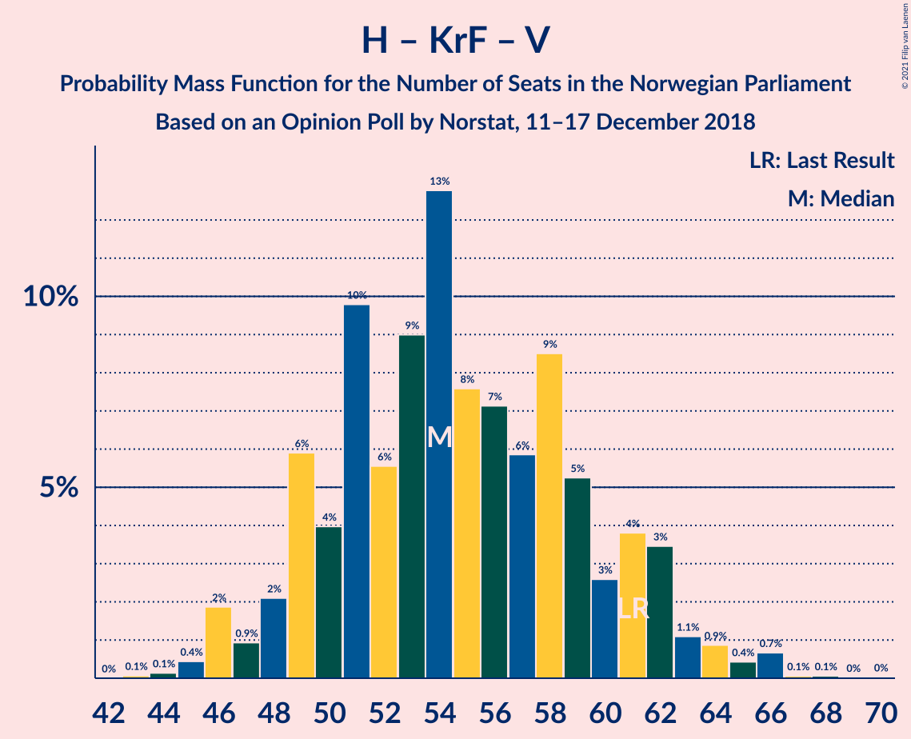

| Number of Seats | Probability | Accumulated | Special Marks |
|:---------------:|:-----------:|:-----------:|:-------------:|
| 43 | 0.1% | 100% |  |
| 44 | 0.1% | 99.9% |  |
| 45 | 0.4% | 99.8% |  |
| 46 | 2% | 99.3% |  |
| 47 | 0.9% | 97% |  |
| 48 | 2% | 97% |  |
| 49 | 6% | 94% |  |
| 50 | 4% | 89% |  |
| 51 | 10% | 85% |  |
| 52 | 6% | 75% |  |
| 53 | 9% | 69% | Median |
| 54 | 13% | 60% |  |
| 55 | 8% | 47% |  |
| 56 | 7% | 40% |  |
| 57 | 6% | 33% |  |
| 58 | 9% | 27% |  |
| 59 | 5% | 18% |  |
| 60 | 3% | 13% |  |
| 61 | 4% | 11% | Last Result |
| 62 | 3% | 7% |  |
| 63 | 1.1% | 3% |  |
| 64 | 0.9% | 2% |  |
| 65 | 0.4% | 1.3% |  |
| 66 | 0.7% | 0.8% |  |
| 67 | 0.1% | 0.2% |  |
| 68 | 0.1% | 0.1% |  |
| 69 | 0% | 0.1% |  |
| 70 | 0% | 0% |  |

### Senterpartiet – Kristelig Folkeparti – Venstre

| Number of Seats | Probability | Accumulated | Special Marks |
|:---------------:|:-----------:|:-----------:|:-------------:|
| 18 | 0% | 100% |  |
| 19 | 0.4% | 99.9% |  |
| 20 | 2% | 99.6% |  |
| 21 | 2% | 97% |  |
| 22 | 10% | 95% |  |
| 23 | 7% | 85% |  |
| 24 | 13% | 78% |  |
| 25 | 7% | 65% | Median |
| 26 | 10% | 58% |  |
| 27 | 5% | 47% |  |
| 28 | 7% | 42% |  |
| 29 | 5% | 35% |  |
| 30 | 14% | 30% |  |
| 31 | 4% | 17% |  |
| 32 | 4% | 12% |  |
| 33 | 3% | 8% |  |
| 34 | 2% | 5% |  |
| 35 | 2% | 3% | Last Result |
| 36 | 0.5% | 1.4% |  |
| 37 | 0.7% | 0.9% |  |
| 38 | 0.1% | 0.2% |  |
| 39 | 0.1% | 0.1% |  |
| 40 | 0% | 0% |  |

## Technical Information

### Opinion Poll

+ **Polling firm:** Norstat
+ **Commissioner(s):** —
+ **Fieldwork period:** 11–17 December 2018

### Calculations

+ **Sample size:** 927
+ **Simulations done:** 1,048,576
+ **Error estimate:** 0.93%

