# Opinion Poll by Norstat, 2–7 January 2019

<a href="#voting-intentions">Voting Intentions</a> | <a href="#seats">Seats</a> | <a href="#coalitions">Coalitions</a> | <a href="#technical-information">Technical Information</a>

## Voting Intentions

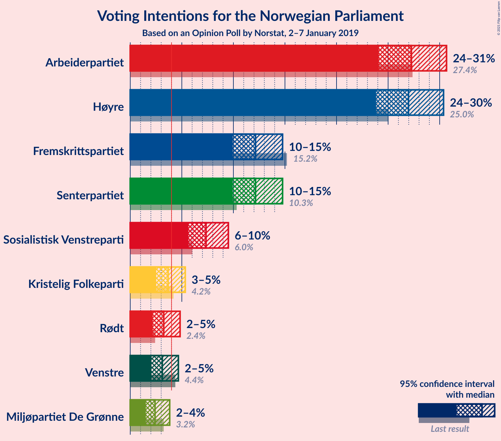

### Confidence Intervals

| Party | Last Result | Poll Result | 80% Confidence Interval | 90% Confidence Interval | 95% Confidence Interval | 99% Confidence Interval |
|:-----:|:-----------:|:-----------:|:-----------------------:|:-----------------------:|:-----------------------:|:-----------------------:|
| Arbeiderpartiet | 27.4% | 27.3% | 25.2–29.5% |24.6–30.1% |24.1–30.7% |23.1–31.7% |
| Høyre | 25.0% | 27.0% | 24.9–29.2% |24.3–29.8% |23.8–30.4% |22.9–31.5% |
| Senterpartiet | 10.3% | 12.1% | 10.7–13.9% |10.3–14.3% |9.9–14.8% |9.3–15.6% |
| Fremskrittspartiet | 15.2% | 12.1% | 10.7–13.9% |10.3–14.3% |9.9–14.8% |9.3–15.6% |
| Sosialistisk Venstreparti | 6.0% | 7.3% | 6.2–8.8% |5.9–9.2% |5.6–9.5% |5.2–10.2% |
| Kristelig Folkeparti | 4.2% | 3.7% | 2.9–4.8% |2.7–5.1% |2.5–5.3% |2.2–5.9% |
| Rødt | 2.4% | 3.2% | 2.5–4.3% |2.3–4.6% |2.2–4.8% |1.9–5.4% |
| Venstre | 4.4% | 3.1% | 2.4–4.1% |2.2–4.4% |2.1–4.7% |1.8–5.2% |
| Miljøpartiet De Grønne | 3.2% | 2.4% | 1.8–3.3% |1.6–3.6% |1.5–3.8% |1.3–4.3% |

*Note:* The poll result column reflects the actual value used in the calculations. Published results may vary slightly, and in addition be rounded to fewer digits.

## Seats

### Confidence Intervals

| Party | Last Result | Median | 80% Confidence Interval | 90% Confidence Interval | 95% Confidence Interval | 99% Confidence Interval |
|:-----:|:-----------:|:------:|:-----------------------:|:-----------------------:|:-----------------------:|:-----------------------:|
| <a href="#arbeiderpartiet">Arbeiderpartiet</a> | 49 | 50 | 46–54 |45–56 |43–56 |42–60 |
| <a href="#høyre">Høyre</a> | 45 | 49 | 45–54 |44–54 |43–56 |42–58 |
| <a href="#senterpartiet">Senterpartiet</a> | 19 | 23 | 19–26 |18–27 |18–27 |17–29 |
| <a href="#fremskrittspartiet">Fremskrittspartiet</a> | 27 | 22 | 19–25 |18–27 |18–27 |17–29 |
| <a href="#sosialistisk-venstreparti">Sosialistisk Venstreparti</a> | 11 | 14 | 11–16 |11–17 |10–18 |9–19 |
| <a href="#kristelig-folkeparti">Kristelig Folkeparti</a> | 8 | 3 | 1–9 |1–9 |1–10 |0–10 |
| <a href="#rødt">Rødt</a> | 1 | 2 | 1–8 |1–8 |1–9 |1–10 |
| <a href="#venstre">Venstre</a> | 8 | 2 | 2–7 |1–8 |1–8 |0–9 |
| <a href="#miljøpartiet-de-grønne">Miljøpartiet De Grønne</a> | 1 | 1 | 0–2 |0–2 |0–2 |0–8 |

### Arbeiderpartiet

*For a full overview of the results for this party, see the [Arbeiderpartiet](party-arbeiderpartiet.html) page.*

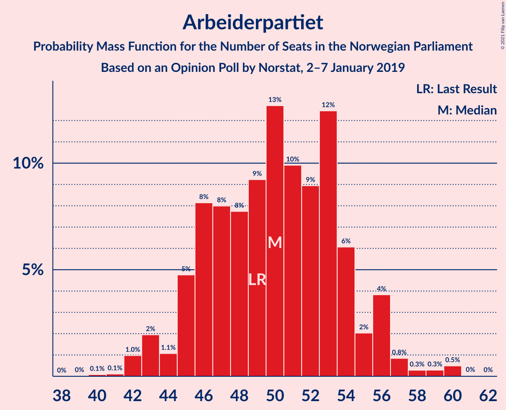

| Number of Seats | Probability | Accumulated | Special Marks |
|:---------------:|:-----------:|:-----------:|:-------------:|
| 40 | 0.1% | 100% |  |
| 41 | 0.1% | 99.9% |  |
| 42 | 1.0% | 99.8% |  |
| 43 | 2% | 98.8% |  |
| 44 | 1.1% | 97% |  |
| 45 | 5% | 96% |  |
| 46 | 8% | 91% |  |
| 47 | 8% | 83% |  |
| 48 | 8% | 75% |  |
| 49 | 9% | 67% | Last Result |
| 50 | 13% | 58% | Median |
| 51 | 10% | 45% |  |
| 52 | 9% | 35% |  |
| 53 | 12% | 26% |  |
| 54 | 6% | 14% |  |
| 55 | 2% | 8% |  |
| 56 | 4% | 6% |  |
| 57 | 0.8% | 2% |  |
| 58 | 0.3% | 1.1% |  |
| 59 | 0.3% | 0.9% |  |
| 60 | 0.5% | 0.6% |  |
| 61 | 0% | 0.1% |  |
| 62 | 0% | 0% |  |

### Høyre

*For a full overview of the results for this party, see the [Høyre](party-høyre.html) page.*

| Number of Seats | Probability | Accumulated | Special Marks |
|:---------------:|:-----------:|:-----------:|:-------------:|
| 39 | 0% | 100% |  |
| 40 | 0.1% | 99.9% |  |
| 41 | 0.3% | 99.8% |  |
| 42 | 1.1% | 99.5% |  |
| 43 | 3% | 98% |  |
| 44 | 4% | 96% |  |
| 45 | 4% | 91% | Last Result |
| 46 | 10% | 87% |  |
| 47 | 5% | 78% |  |
| 48 | 11% | 73% |  |
| 49 | 14% | 61% | Median |
| 50 | 5% | 47% |  |
| 51 | 16% | 42% |  |
| 52 | 8% | 27% |  |
| 53 | 5% | 19% |  |
| 54 | 9% | 13% |  |
| 55 | 1.0% | 4% |  |
| 56 | 2% | 3% |  |
| 57 | 0.7% | 1.2% |  |
| 58 | 0.1% | 0.6% |  |
| 59 | 0.2% | 0.4% |  |
| 60 | 0.2% | 0.2% |  |
| 61 | 0% | 0% |  |

### Senterpartiet

*For a full overview of the results for this party, see the [Senterpartiet](party-senterpartiet.html) page.*

| Number of Seats | Probability | Accumulated | Special Marks |
|:---------------:|:-----------:|:-----------:|:-------------:|
| 16 | 0.3% | 100% |  |
| 17 | 0.7% | 99.6% |  |
| 18 | 4% | 98.9% |  |
| 19 | 6% | 95% | Last Result |
| 20 | 7% | 89% |  |
| 21 | 11% | 82% |  |
| 22 | 17% | 70% |  |
| 23 | 10% | 53% | Median |
| 24 | 20% | 43% |  |
| 25 | 10% | 23% |  |
| 26 | 6% | 13% |  |
| 27 | 5% | 7% |  |
| 28 | 0.8% | 2% |  |
| 29 | 0.6% | 0.7% |  |
| 30 | 0.1% | 0.2% |  |
| 31 | 0.1% | 0.1% |  |
| 32 | 0% | 0% |  |

### Fremskrittspartiet

*For a full overview of the results for this party, see the [Fremskrittspartiet](party-fremskrittspartiet.html) page.*

| Number of Seats | Probability | Accumulated | Special Marks |
|:---------------:|:-----------:|:-----------:|:-------------:|
| 15 | 0.1% | 100% |  |
| 16 | 0.3% | 99.9% |  |
| 17 | 1.3% | 99.5% |  |
| 18 | 3% | 98% |  |
| 19 | 7% | 95% |  |
| 20 | 16% | 88% |  |
| 21 | 9% | 71% |  |
| 22 | 17% | 62% | Median |
| 23 | 13% | 45% |  |
| 24 | 13% | 31% |  |
| 25 | 9% | 18% |  |
| 26 | 4% | 9% |  |
| 27 | 3% | 5% | Last Result |
| 28 | 1.2% | 2% |  |
| 29 | 0.7% | 0.9% |  |
| 30 | 0.2% | 0.3% |  |
| 31 | 0.1% | 0.1% |  |
| 32 | 0% | 0% |  |

### Sosialistisk Venstreparti

*For a full overview of the results for this party, see the [Sosialistisk Venstreparti](party-sosialistiskvenstreparti.html) page.*

| Number of Seats | Probability | Accumulated | Special Marks |
|:---------------:|:-----------:|:-----------:|:-------------:|
| 8 | 0.1% | 100% |  |
| 9 | 0.7% | 99.9% |  |
| 10 | 3% | 99.2% |  |
| 11 | 10% | 96% | Last Result |
| 12 | 14% | 86% |  |
| 13 | 19% | 72% |  |
| 14 | 22% | 53% | Median |
| 15 | 15% | 31% |  |
| 16 | 10% | 16% |  |
| 17 | 4% | 6% |  |
| 18 | 2% | 3% |  |
| 19 | 0.6% | 0.7% |  |
| 20 | 0.1% | 0.1% |  |
| 21 | 0% | 0.1% |  |
| 22 | 0% | 0% |  |

### Kristelig Folkeparti

*For a full overview of the results for this party, see the [Kristelig Folkeparti](party-kristeligfolkeparti.html) page.*

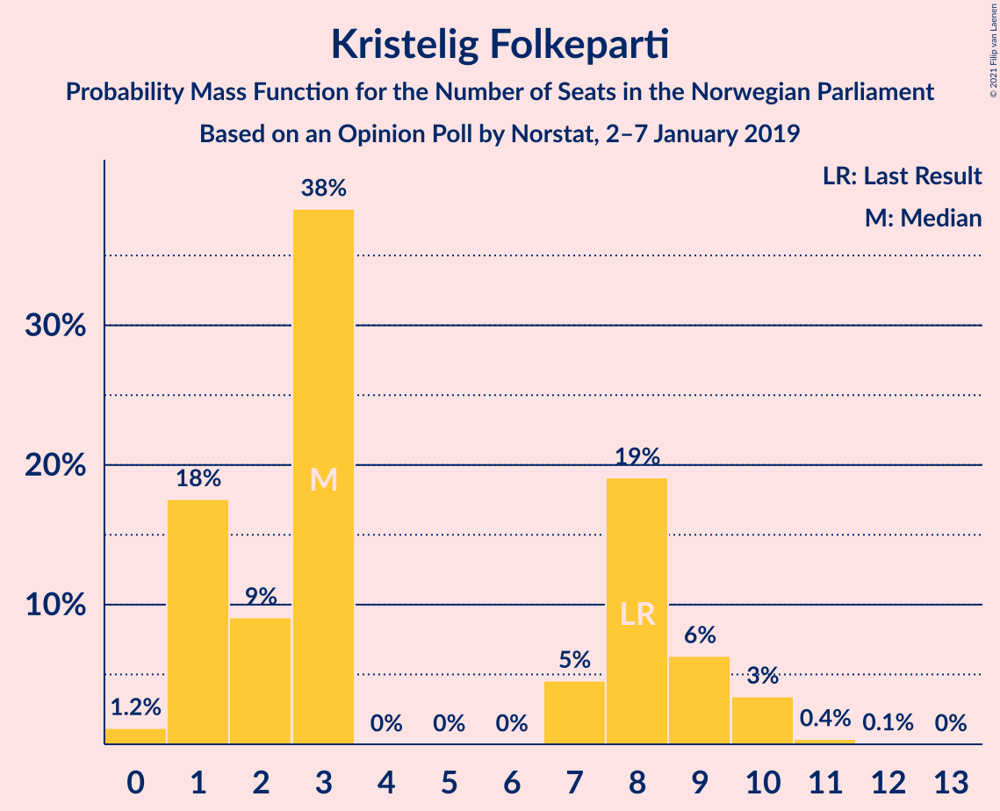

| Number of Seats | Probability | Accumulated | Special Marks |
|:---------------:|:-----------:|:-----------:|:-------------:|
| 0 | 1.2% | 100% |  |
| 1 | 18% | 98.8% |  |
| 2 | 9% | 81% |  |
| 3 | 38% | 72% | Median |
| 4 | 0% | 34% |  |
| 5 | 0% | 34% |  |
| 6 | 0% | 34% |  |
| 7 | 5% | 34% |  |
| 8 | 19% | 29% | Last Result |
| 9 | 6% | 10% |  |
| 10 | 3% | 4% |  |
| 11 | 0.4% | 0.5% |  |
| 12 | 0.1% | 0.1% |  |
| 13 | 0% | 0% |  |

### Rødt

*For a full overview of the results for this party, see the [Rødt](party-rødt.html) page.*

| Number of Seats | Probability | Accumulated | Special Marks |
|:---------------:|:-----------:|:-----------:|:-------------:|
| 1 | 19% | 100% | Last Result |
| 2 | 65% | 81% | Median |
| 3 | 0% | 17% |  |
| 4 | 0% | 17% |  |
| 5 | 0% | 17% |  |
| 6 | 0% | 17% |  |
| 7 | 5% | 17% |  |
| 8 | 7% | 11% |  |
| 9 | 4% | 4% |  |
| 10 | 0.5% | 0.6% |  |
| 11 | 0.1% | 0.1% |  |
| 12 | 0% | 0% |  |

### Venstre

*For a full overview of the results for this party, see the [Venstre](party-venstre.html) page.*

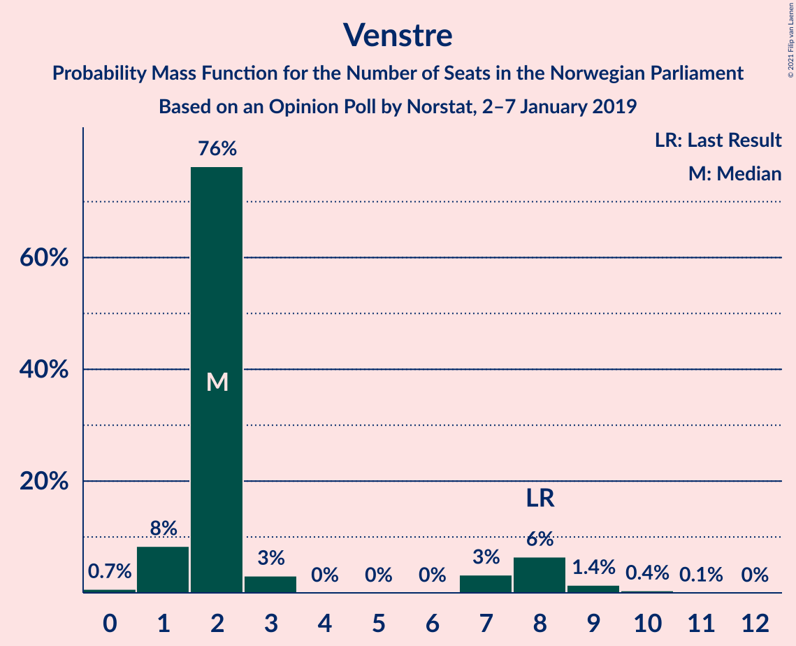

| Number of Seats | Probability | Accumulated | Special Marks |
|:---------------:|:-----------:|:-----------:|:-------------:|
| 0 | 0.7% | 100% |  |
| 1 | 8% | 99.3% |  |
| 2 | 76% | 91% | Median |
| 3 | 3% | 15% |  |
| 4 | 0% | 12% |  |
| 5 | 0% | 12% |  |
| 6 | 0% | 12% |  |
| 7 | 3% | 12% |  |
| 8 | 6% | 8% | Last Result |
| 9 | 1.4% | 2% |  |
| 10 | 0.4% | 0.5% |  |
| 11 | 0.1% | 0.1% |  |
| 12 | 0% | 0% |  |

### Miljøpartiet De Grønne

*For a full overview of the results for this party, see the [Miljøpartiet De Grønne](party-miljøpartietdegrønne.html) page.*

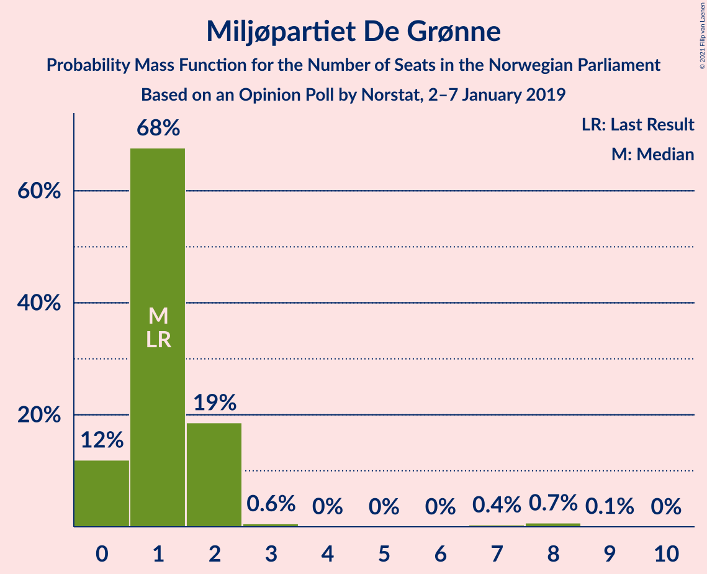

| Number of Seats | Probability | Accumulated | Special Marks |
|:---------------:|:-----------:|:-----------:|:-------------:|
| 0 | 12% | 100% |  |
| 1 | 68% | 88% | Last Result, Median |
| 2 | 19% | 20% |  |
| 3 | 0.6% | 2% |  |
| 4 | 0% | 1.2% |  |
| 5 | 0% | 1.2% |  |
| 6 | 0% | 1.2% |  |
| 7 | 0.4% | 1.2% |  |
| 8 | 0.7% | 0.8% |  |
| 9 | 0.1% | 0.1% |  |
| 10 | 0% | 0% |  |

## Coalitions

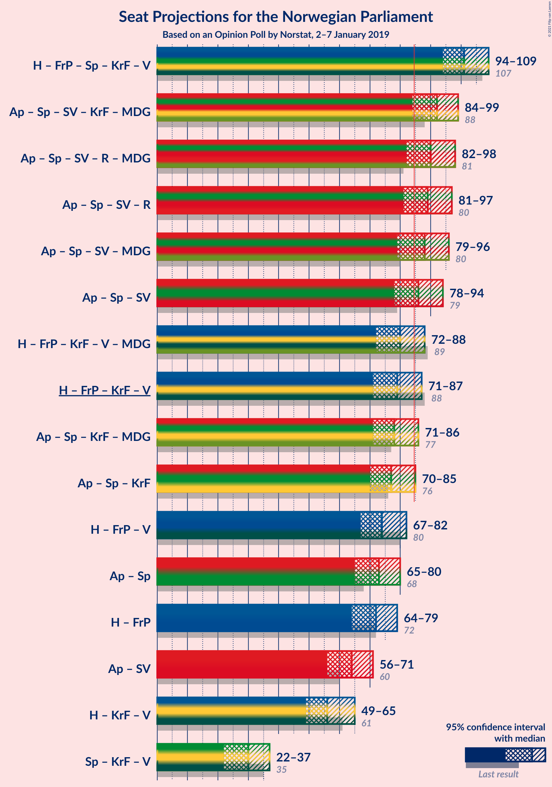

### Confidence Intervals

| Coalition | Last Result | Median | Majority? | 80% Confidence Interval | 90% Confidence Interval | 95% Confidence Interval | 99% Confidence Interval |
|:---------:|:-----------:|:------:|:---------:|:-----------------------:|:-----------------------:|:-----------------------:|:-----------------------:|
| Høyre – Fremskrittspartiet – Senterpartiet – Kristelig Folkeparti – Venstre | 107 | 101 | 100% | 96–106 | 95–108 | 94–109 | 91–111 |
| Arbeiderpartiet – Senterpartiet – Sosialistisk Venstreparti – Kristelig Folkeparti – Miljøpartiet De Grønne | 88 | 92 | 96% | 87–98 | 85–99 | 84–99 | 81–102 |
| Arbeiderpartiet – Senterpartiet – Sosialistisk Venstreparti – Rødt – Miljøpartiet De Grønne | 81 | 90 | 94% | 85–95 | 84–97 | 82–98 | 80–100 |
| Arbeiderpartiet – Senterpartiet – Sosialistisk Venstreparti – Rødt | 80 | 89 | 87% | 84–94 | 83–95 | 81–97 | 79–99 |
| Arbeiderpartiet – Senterpartiet – Sosialistisk Venstreparti – Miljøpartiet De Grønne | 80 | 88 | 79% | 82–93 | 80–94 | 79–96 | 77–97 |
| Arbeiderpartiet – Senterpartiet – Sosialistisk Venstreparti | 79 | 86 | 70% | 81–91 | 79–93 | 78–94 | 76–96 |
| Høyre – Fremskrittspartiet – Kristelig Folkeparti – Venstre – Miljøpartiet De Grønne | 89 | 80 | 13% | 75–85 | 73–86 | 72–88 | 70–90 |
| Høyre – Fremskrittspartiet – Kristelig Folkeparti – Venstre | 88 | 79 | 6% | 74–84 | 72–85 | 71–87 | 69–89 |
| Arbeiderpartiet – Senterpartiet – Kristelig Folkeparti – Miljøpartiet De Grønne | 77 | 78 | 8% | 74–84 | 72–86 | 71–86 | 68–88 |
| Arbeiderpartiet – Senterpartiet – Kristelig Folkeparti | 76 | 77 | 6% | 72–82 | 71–85 | 70–85 | 66–87 |
| Høyre – Fremskrittspartiet – Venstre | 80 | 74 | 0.7% | 69–79 | 68–81 | 67–82 | 64–85 |
| Arbeiderpartiet – Senterpartiet | 68 | 73 | 0.1% | 68–78 | 66–79 | 65–80 | 63–82 |
| Høyre – Fremskrittspartiet | 72 | 72 | 0.1% | 66–77 | 66–78 | 64–79 | 61–81 |
| Arbeiderpartiet – Sosialistisk Venstreparti | 60 | 64 | 0% | 59–68 | 58–70 | 56–71 | 55–73 |
| Høyre – Kristelig Folkeparti – Venstre | 61 | 56 | 0% | 52–61 | 51–63 | 49–65 | 47–67 |
| Senterpartiet – Kristelig Folkeparti – Venstre | 35 | 30 | 0% | 25–35 | 24–36 | 22–37 | 21–40 |

### Høyre – Fremskrittspartiet – Senterpartiet – Kristelig Folkeparti – Venstre

| Number of Seats | Probability | Accumulated | Special Marks |
|:---------------:|:-----------:|:-----------:|:-------------:|
| 88 | 0.1% | 100% |  |
| 89 | 0.1% | 99.9% |  |
| 90 | 0.3% | 99.8% |  |
| 91 | 0.4% | 99.5% |  |
| 92 | 0.4% | 99.1% |  |
| 93 | 0.9% | 98.7% |  |
| 94 | 2% | 98% |  |
| 95 | 4% | 96% |  |
| 96 | 5% | 92% |  |
| 97 | 3% | 87% |  |
| 98 | 6% | 83% |  |
| 99 | 6% | 77% | Median |
| 100 | 12% | 71% |  |
| 101 | 11% | 59% |  |
| 102 | 7% | 48% |  |
| 103 | 9% | 42% |  |
| 104 | 12% | 32% |  |
| 105 | 5% | 20% |  |
| 106 | 7% | 15% |  |
| 107 | 2% | 8% | Last Result |
| 108 | 3% | 6% |  |
| 109 | 1.1% | 3% |  |
| 110 | 1.0% | 2% |  |
| 111 | 0.3% | 0.5% |  |
| 112 | 0.2% | 0.2% |  |
| 113 | 0% | 0.1% |  |
| 114 | 0% | 0% |  |

### Arbeiderpartiet – Senterpartiet – Sosialistisk Venstreparti – Kristelig Folkeparti – Miljøpartiet De Grønne

| Number of Seats | Probability | Accumulated | Special Marks |
|:---------------:|:-----------:|:-----------:|:-------------:|
| 78 | 0% | 100% |  |
| 79 | 0.1% | 99.9% |  |
| 80 | 0.2% | 99.9% |  |
| 81 | 0.4% | 99.7% |  |
| 82 | 0.6% | 99.2% |  |
| 83 | 0.9% | 98.7% |  |
| 84 | 1.4% | 98% |  |
| 85 | 2% | 96% | Majority |
| 86 | 3% | 94% |  |
| 87 | 5% | 91% |  |
| 88 | 7% | 86% | Last Result |
| 89 | 5% | 79% |  |
| 90 | 10% | 74% |  |
| 91 | 11% | 63% | Median |
| 92 | 9% | 52% |  |
| 93 | 10% | 43% |  |
| 94 | 7% | 33% |  |
| 95 | 7% | 26% |  |
| 96 | 5% | 19% |  |
| 97 | 3% | 14% |  |
| 98 | 3% | 11% |  |
| 99 | 6% | 8% |  |
| 100 | 0.6% | 2% |  |
| 101 | 0.5% | 1.0% |  |
| 102 | 0.3% | 0.6% |  |
| 103 | 0.1% | 0.3% |  |
| 104 | 0.1% | 0.1% |  |
| 105 | 0% | 0% |  |

### Arbeiderpartiet – Senterpartiet – Sosialistisk Venstreparti – Rødt – Miljøpartiet De Grønne

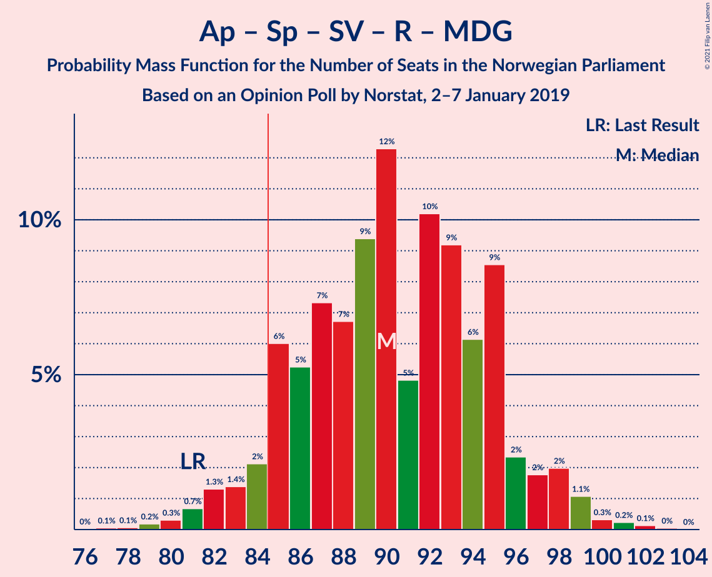

| Number of Seats | Probability | Accumulated | Special Marks |
|:---------------:|:-----------:|:-----------:|:-------------:|
| 77 | 0.1% | 100% |  |
| 78 | 0.1% | 99.9% |  |
| 79 | 0.2% | 99.9% |  |
| 80 | 0.3% | 99.7% |  |
| 81 | 0.7% | 99.4% | Last Result |
| 82 | 1.3% | 98.7% |  |
| 83 | 1.4% | 97% |  |
| 84 | 2% | 96% |  |
| 85 | 6% | 94% | Majority |
| 86 | 5% | 88% |  |
| 87 | 7% | 83% |  |
| 88 | 7% | 75% |  |
| 89 | 9% | 69% |  |
| 90 | 12% | 59% | Median |
| 91 | 5% | 47% |  |
| 92 | 10% | 42% |  |
| 93 | 9% | 32% |  |
| 94 | 6% | 23% |  |
| 95 | 9% | 16% |  |
| 96 | 2% | 8% |  |
| 97 | 2% | 6% |  |
| 98 | 2% | 4% |  |
| 99 | 1.1% | 2% |  |
| 100 | 0.3% | 0.8% |  |
| 101 | 0.2% | 0.4% |  |
| 102 | 0.1% | 0.2% |  |
| 103 | 0% | 0.1% |  |
| 104 | 0% | 0% |  |

### Arbeiderpartiet – Senterpartiet – Sosialistisk Venstreparti – Rødt

| Number of Seats | Probability | Accumulated | Special Marks |
|:---------------:|:-----------:|:-----------:|:-------------:|
| 76 | 0.1% | 100% |  |
| 77 | 0.1% | 99.9% |  |
| 78 | 0.2% | 99.8% |  |
| 79 | 0.3% | 99.6% |  |
| 80 | 0.9% | 99.3% | Last Result |
| 81 | 1.2% | 98% |  |
| 82 | 0.8% | 97% |  |
| 83 | 3% | 96% |  |
| 84 | 6% | 93% |  |
| 85 | 6% | 87% | Majority |
| 86 | 8% | 82% |  |
| 87 | 7% | 74% |  |
| 88 | 10% | 67% |  |
| 89 | 10% | 56% | Median |
| 90 | 4% | 46% |  |
| 91 | 13% | 42% |  |
| 92 | 7% | 29% |  |
| 93 | 8% | 22% |  |
| 94 | 7% | 14% |  |
| 95 | 3% | 8% |  |
| 96 | 1.5% | 5% |  |
| 97 | 2% | 4% |  |
| 98 | 0.8% | 1.5% |  |
| 99 | 0.3% | 0.7% |  |
| 100 | 0.2% | 0.4% |  |
| 101 | 0.1% | 0.2% |  |
| 102 | 0.1% | 0.1% |  |
| 103 | 0% | 0% |  |

### Arbeiderpartiet – Senterpartiet – Sosialistisk Venstreparti – Miljøpartiet De Grønne

| Number of Seats | Probability | Accumulated | Special Marks |
|:---------------:|:-----------:|:-----------:|:-------------:|
| 74 | 0% | 100% |  |
| 75 | 0.1% | 99.9% |  |
| 76 | 0.2% | 99.8% |  |
| 77 | 0.7% | 99.7% |  |
| 78 | 0.8% | 99.0% |  |
| 79 | 2% | 98% |  |
| 80 | 2% | 97% | Last Result |
| 81 | 3% | 95% |  |
| 82 | 3% | 92% |  |
| 83 | 5% | 89% |  |
| 84 | 5% | 84% |  |
| 85 | 9% | 79% | Majority |
| 86 | 7% | 70% |  |
| 87 | 11% | 63% |  |
| 88 | 12% | 51% | Median |
| 89 | 6% | 39% |  |
| 90 | 8% | 34% |  |
| 91 | 8% | 26% |  |
| 92 | 5% | 17% |  |
| 93 | 6% | 12% |  |
| 94 | 2% | 6% |  |
| 95 | 2% | 4% |  |
| 96 | 1.4% | 3% |  |
| 97 | 0.8% | 1.1% |  |
| 98 | 0.1% | 0.3% |  |
| 99 | 0.1% | 0.2% |  |
| 100 | 0.1% | 0.1% |  |
| 101 | 0% | 0% |  |

### Arbeiderpartiet – Senterpartiet – Sosialistisk Venstreparti

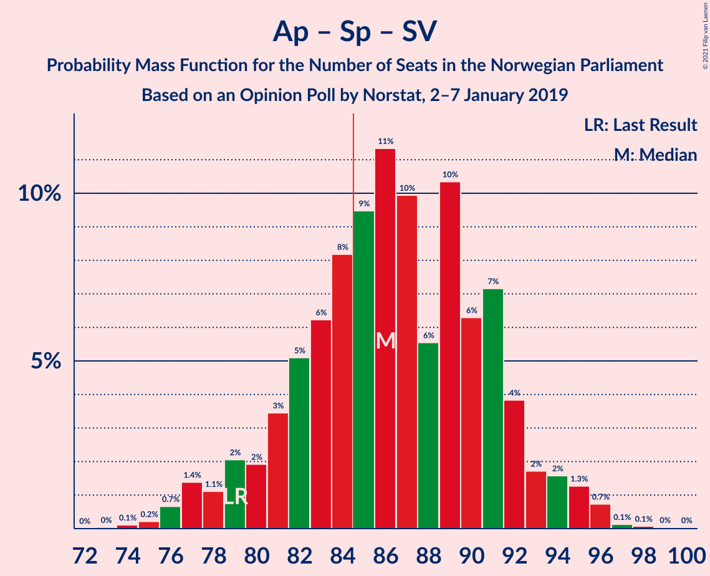

| Number of Seats | Probability | Accumulated | Special Marks |
|:---------------:|:-----------:|:-----------:|:-------------:|
| 73 | 0% | 100% |  |
| 74 | 0.1% | 99.9% |  |
| 75 | 0.2% | 99.8% |  |
| 76 | 0.7% | 99.6% |  |
| 77 | 1.4% | 99.0% |  |
| 78 | 1.1% | 98% |  |
| 79 | 2% | 96% | Last Result |
| 80 | 2% | 94% |  |
| 81 | 3% | 92% |  |
| 82 | 5% | 89% |  |
| 83 | 6% | 84% |  |
| 84 | 8% | 78% |  |
| 85 | 9% | 70% | Majority |
| 86 | 11% | 60% |  |
| 87 | 10% | 49% | Median |
| 88 | 6% | 39% |  |
| 89 | 10% | 33% |  |
| 90 | 6% | 23% |  |
| 91 | 7% | 17% |  |
| 92 | 4% | 9% |  |
| 93 | 2% | 6% |  |
| 94 | 2% | 4% |  |
| 95 | 1.3% | 2% |  |
| 96 | 0.7% | 1.0% |  |
| 97 | 0.1% | 0.3% |  |
| 98 | 0.1% | 0.1% |  |
| 99 | 0% | 0.1% |  |
| 100 | 0% | 0% |  |

### Høyre – Fremskrittspartiet – Kristelig Folkeparti – Venstre – Miljøpartiet De Grønne

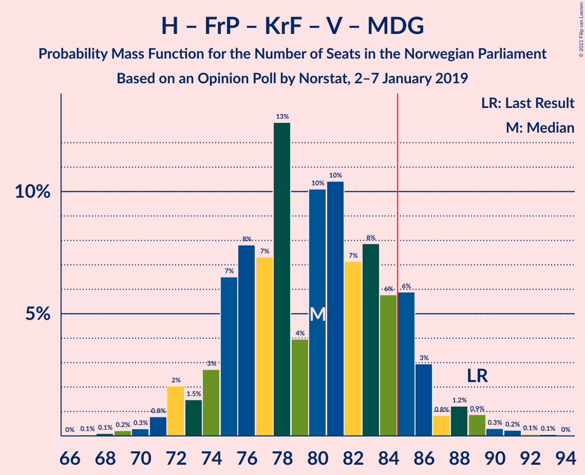

| Number of Seats | Probability | Accumulated | Special Marks |
|:---------------:|:-----------:|:-----------:|:-------------:|
| 67 | 0.1% | 100% |  |
| 68 | 0.1% | 99.9% |  |
| 69 | 0.2% | 99.8% |  |
| 70 | 0.3% | 99.6% |  |
| 71 | 0.8% | 99.3% |  |
| 72 | 2% | 98.5% |  |
| 73 | 1.5% | 96% |  |
| 74 | 3% | 95% |  |
| 75 | 7% | 92% |  |
| 76 | 8% | 86% |  |
| 77 | 7% | 78% | Median |
| 78 | 13% | 71% |  |
| 79 | 4% | 58% |  |
| 80 | 10% | 54% |  |
| 81 | 10% | 44% |  |
| 82 | 7% | 33% |  |
| 83 | 8% | 26% |  |
| 84 | 6% | 18% |  |
| 85 | 6% | 13% | Majority |
| 86 | 3% | 7% |  |
| 87 | 0.8% | 4% |  |
| 88 | 1.2% | 3% |  |
| 89 | 0.9% | 2% | Last Result |
| 90 | 0.3% | 0.7% |  |
| 91 | 0.2% | 0.4% |  |
| 92 | 0.1% | 0.2% |  |
| 93 | 0.1% | 0.1% |  |
| 94 | 0% | 0% |  |

### Høyre – Fremskrittspartiet – Kristelig Folkeparti – Venstre

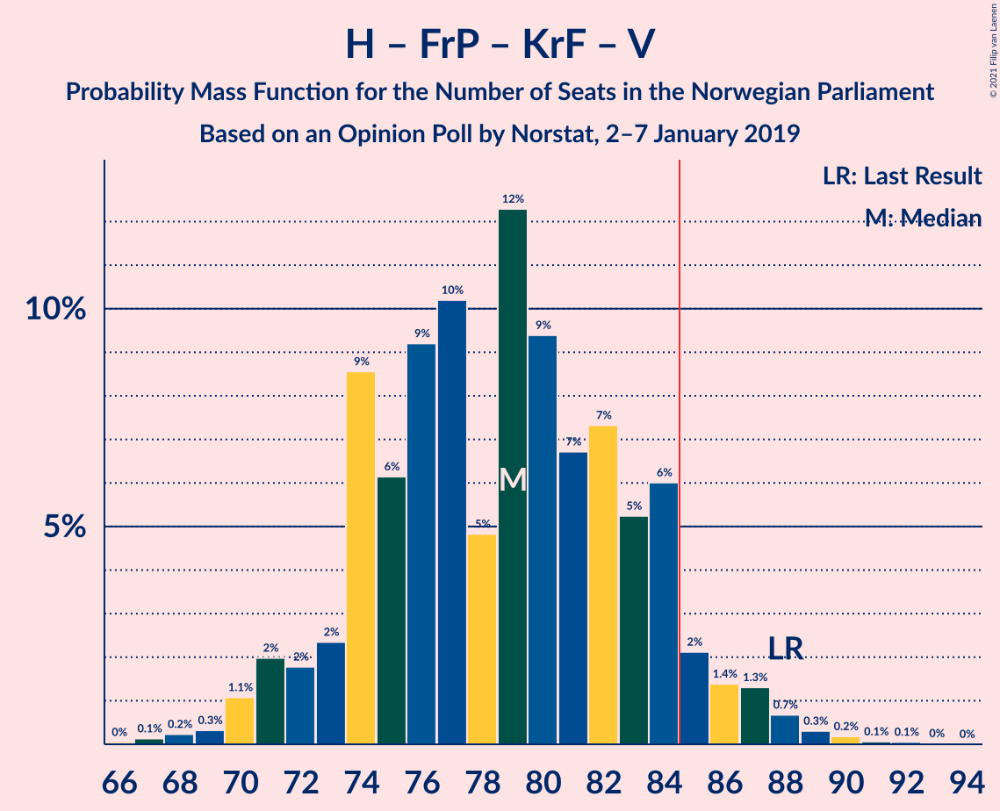

| Number of Seats | Probability | Accumulated | Special Marks |
|:---------------:|:-----------:|:-----------:|:-------------:|
| 66 | 0% | 100% |  |
| 67 | 0.1% | 99.9% |  |
| 68 | 0.2% | 99.8% |  |
| 69 | 0.3% | 99.6% |  |
| 70 | 1.1% | 99.2% |  |
| 71 | 2% | 98% |  |
| 72 | 2% | 96% |  |
| 73 | 2% | 94% |  |
| 74 | 9% | 92% |  |
| 75 | 6% | 83% |  |
| 76 | 9% | 77% | Median |
| 77 | 10% | 68% |  |
| 78 | 5% | 58% |  |
| 79 | 12% | 53% |  |
| 80 | 9% | 41% |  |
| 81 | 7% | 31% |  |
| 82 | 7% | 25% |  |
| 83 | 5% | 17% |  |
| 84 | 6% | 12% |  |
| 85 | 2% | 6% | Majority |
| 86 | 1.4% | 4% |  |
| 87 | 1.3% | 3% |  |
| 88 | 0.7% | 1.3% | Last Result |
| 89 | 0.3% | 0.6% |  |
| 90 | 0.2% | 0.3% |  |
| 91 | 0.1% | 0.1% |  |
| 92 | 0.1% | 0.1% |  |
| 93 | 0% | 0% |  |

### Arbeiderpartiet – Senterpartiet – Kristelig Folkeparti – Miljøpartiet De Grønne

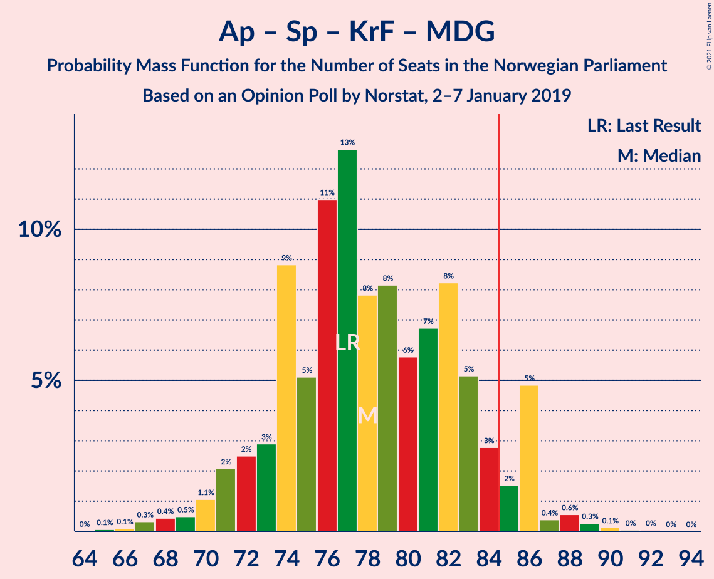

| Number of Seats | Probability | Accumulated | Special Marks |
|:---------------:|:-----------:|:-----------:|:-------------:|
| 65 | 0.1% | 100% |  |
| 66 | 0.1% | 99.9% |  |
| 67 | 0.3% | 99.8% |  |
| 68 | 0.4% | 99.5% |  |
| 69 | 0.5% | 99.1% |  |
| 70 | 1.1% | 98.6% |  |
| 71 | 2% | 98% |  |
| 72 | 2% | 95% |  |
| 73 | 3% | 93% |  |
| 74 | 9% | 90% |  |
| 75 | 5% | 81% |  |
| 76 | 11% | 76% |  |
| 77 | 13% | 65% | Last Result, Median |
| 78 | 8% | 52% |  |
| 79 | 8% | 45% |  |
| 80 | 6% | 36% |  |
| 81 | 7% | 31% |  |
| 82 | 8% | 24% |  |
| 83 | 5% | 16% |  |
| 84 | 3% | 11% |  |
| 85 | 2% | 8% | Majority |
| 86 | 5% | 6% |  |
| 87 | 0.4% | 1.4% |  |
| 88 | 0.6% | 1.1% |  |
| 89 | 0.3% | 0.5% |  |
| 90 | 0.1% | 0.2% |  |
| 91 | 0% | 0.1% |  |
| 92 | 0% | 0.1% |  |
| 93 | 0% | 0% |  |

### Arbeiderpartiet – Senterpartiet – Kristelig Folkeparti

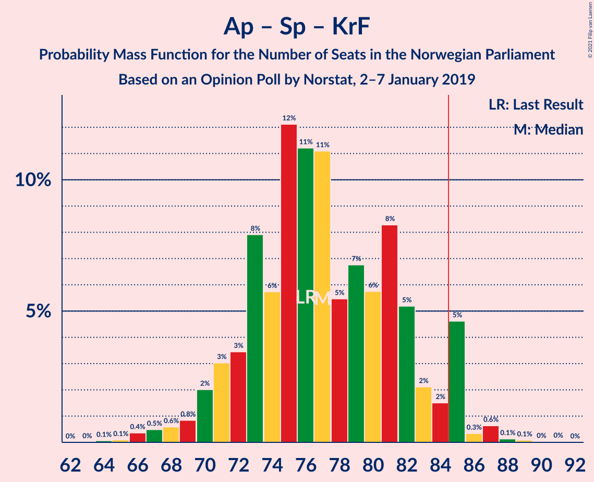

| Number of Seats | Probability | Accumulated | Special Marks |
|:---------------:|:-----------:|:-----------:|:-------------:|
| 64 | 0.1% | 100% |  |
| 65 | 0.1% | 99.9% |  |
| 66 | 0.4% | 99.8% |  |
| 67 | 0.5% | 99.5% |  |
| 68 | 0.6% | 99.0% |  |
| 69 | 0.8% | 98% |  |
| 70 | 2% | 98% |  |
| 71 | 3% | 96% |  |
| 72 | 3% | 92% |  |
| 73 | 8% | 89% |  |
| 74 | 6% | 81% |  |
| 75 | 12% | 75% |  |
| 76 | 11% | 63% | Last Result, Median |
| 77 | 11% | 52% |  |
| 78 | 5% | 41% |  |
| 79 | 7% | 35% |  |
| 80 | 6% | 29% |  |
| 81 | 8% | 23% |  |
| 82 | 5% | 15% |  |
| 83 | 2% | 9% |  |
| 84 | 2% | 7% |  |
| 85 | 5% | 6% | Majority |
| 86 | 0.3% | 1.3% |  |
| 87 | 0.6% | 0.9% |  |
| 88 | 0.1% | 0.3% |  |
| 89 | 0.1% | 0.1% |  |
| 90 | 0% | 0.1% |  |
| 91 | 0% | 0% |  |

### Høyre – Fremskrittspartiet – Venstre

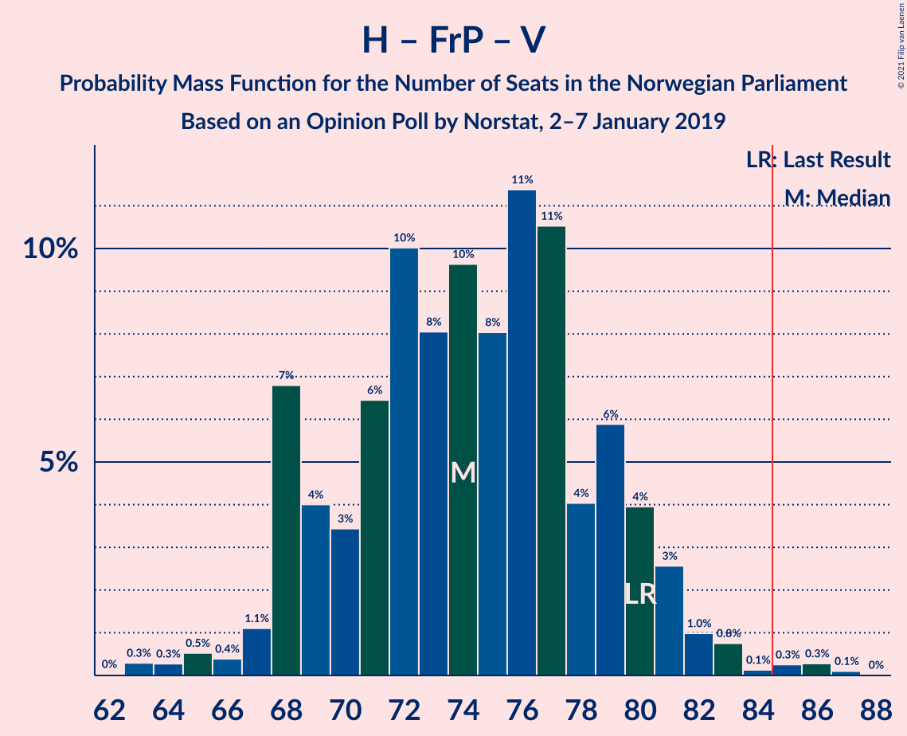

| Number of Seats | Probability | Accumulated | Special Marks |
|:---------------:|:-----------:|:-----------:|:-------------:|
| 62 | 0% | 100% |  |
| 63 | 0.3% | 99.9% |  |
| 64 | 0.3% | 99.7% |  |
| 65 | 0.5% | 99.4% |  |
| 66 | 0.4% | 98.8% |  |
| 67 | 1.1% | 98% |  |
| 68 | 7% | 97% |  |
| 69 | 4% | 91% |  |
| 70 | 3% | 87% |  |
| 71 | 6% | 83% |  |
| 72 | 10% | 77% |  |
| 73 | 8% | 67% | Median |
| 74 | 10% | 59% |  |
| 75 | 8% | 49% |  |
| 76 | 11% | 41% |  |
| 77 | 11% | 30% |  |
| 78 | 4% | 19% |  |
| 79 | 6% | 15% |  |
| 80 | 4% | 9% | Last Result |
| 81 | 3% | 5% |  |
| 82 | 1.0% | 3% |  |
| 83 | 0.8% | 2% |  |
| 84 | 0.1% | 0.8% |  |
| 85 | 0.3% | 0.7% | Majority |
| 86 | 0.3% | 0.4% |  |
| 87 | 0.1% | 0.1% |  |
| 88 | 0% | 0% |  |

### Arbeiderpartiet – Senterpartiet

| Number of Seats | Probability | Accumulated | Special Marks |
|:---------------:|:-----------:|:-----------:|:-------------:|
| 61 | 0.1% | 100% |  |
| 62 | 0.1% | 99.9% |  |
| 63 | 0.8% | 99.7% |  |
| 64 | 0.8% | 98.9% |  |
| 65 | 2% | 98% |  |
| 66 | 2% | 96% |  |
| 67 | 4% | 94% |  |
| 68 | 3% | 90% | Last Result |
| 69 | 4% | 87% |  |
| 70 | 8% | 82% |  |
| 71 | 10% | 75% |  |
| 72 | 14% | 65% |  |
| 73 | 11% | 51% | Median |
| 74 | 7% | 40% |  |
| 75 | 7% | 33% |  |
| 76 | 7% | 25% |  |
| 77 | 6% | 19% |  |
| 78 | 6% | 13% |  |
| 79 | 3% | 6% |  |
| 80 | 2% | 4% |  |
| 81 | 0.7% | 2% |  |
| 82 | 0.6% | 1.0% |  |
| 83 | 0.3% | 0.5% |  |
| 84 | 0.1% | 0.1% |  |
| 85 | 0.1% | 0.1% | Majority |
| 86 | 0% | 0% |  |

### Høyre – Fremskrittspartiet

| Number of Seats | Probability | Accumulated | Special Marks |
|:---------------:|:-----------:|:-----------:|:-------------:|
| 59 | 0% | 100% |  |
| 60 | 0.1% | 99.9% |  |
| 61 | 0.5% | 99.8% |  |
| 62 | 0.3% | 99.3% |  |
| 63 | 1.5% | 99.0% |  |
| 64 | 1.0% | 98% |  |
| 65 | 1.5% | 97% |  |
| 66 | 7% | 95% |  |
| 67 | 5% | 88% |  |
| 68 | 3% | 83% |  |
| 69 | 8% | 80% |  |
| 70 | 12% | 72% |  |
| 71 | 8% | 60% | Median |
| 72 | 10% | 52% | Last Result |
| 73 | 7% | 43% |  |
| 74 | 9% | 35% |  |
| 75 | 11% | 26% |  |
| 76 | 4% | 15% |  |
| 77 | 5% | 11% |  |
| 78 | 3% | 7% |  |
| 79 | 2% | 4% |  |
| 80 | 0.8% | 2% |  |
| 81 | 0.6% | 1.0% |  |
| 82 | 0.1% | 0.4% |  |
| 83 | 0.1% | 0.3% |  |
| 84 | 0.1% | 0.2% |  |
| 85 | 0% | 0.1% | Majority |
| 86 | 0% | 0% |  |

### Arbeiderpartiet – Sosialistisk Venstreparti

| Number of Seats | Probability | Accumulated | Special Marks |
|:---------------:|:-----------:|:-----------:|:-------------:|
| 52 | 0% | 100% |  |
| 53 | 0.2% | 99.9% |  |
| 54 | 0.1% | 99.7% |  |
| 55 | 0.9% | 99.6% |  |
| 56 | 1.4% | 98.7% |  |
| 57 | 2% | 97% |  |
| 58 | 4% | 95% |  |
| 59 | 3% | 91% |  |
| 60 | 8% | 88% | Last Result |
| 61 | 6% | 80% |  |
| 62 | 13% | 74% |  |
| 63 | 7% | 61% |  |
| 64 | 11% | 54% | Median |
| 65 | 12% | 43% |  |
| 66 | 11% | 30% |  |
| 67 | 4% | 19% |  |
| 68 | 6% | 15% |  |
| 69 | 3% | 10% |  |
| 70 | 3% | 6% |  |
| 71 | 1.2% | 3% |  |
| 72 | 1.0% | 2% |  |
| 73 | 0.3% | 0.7% |  |
| 74 | 0.2% | 0.3% |  |
| 75 | 0.1% | 0.1% |  |
| 76 | 0.1% | 0.1% |  |
| 77 | 0% | 0% |  |

### Høyre – Kristelig Folkeparti – Venstre

| Number of Seats | Probability | Accumulated | Special Marks |
|:---------------:|:-----------:|:-----------:|:-------------:|
| 45 | 0% | 100% |  |
| 46 | 0.2% | 99.9% |  |
| 47 | 0.3% | 99.7% |  |
| 48 | 0.7% | 99.4% |  |
| 49 | 2% | 98.7% |  |
| 50 | 1.3% | 96% |  |
| 51 | 4% | 95% |  |
| 52 | 8% | 91% |  |
| 53 | 5% | 83% |  |
| 54 | 12% | 78% | Median |
| 55 | 9% | 66% |  |
| 56 | 10% | 57% |  |
| 57 | 9% | 47% |  |
| 58 | 8% | 37% |  |
| 59 | 9% | 29% |  |
| 60 | 5% | 20% |  |
| 61 | 6% | 15% | Last Result |
| 62 | 3% | 9% |  |
| 63 | 3% | 6% |  |
| 64 | 0.8% | 4% |  |
| 65 | 2% | 3% |  |
| 66 | 0.5% | 1.0% |  |
| 67 | 0.3% | 0.5% |  |
| 68 | 0.1% | 0.2% |  |
| 69 | 0.1% | 0.1% |  |
| 70 | 0.1% | 0.1% |  |
| 71 | 0% | 0% |  |

### Senterpartiet – Kristelig Folkeparti – Venstre

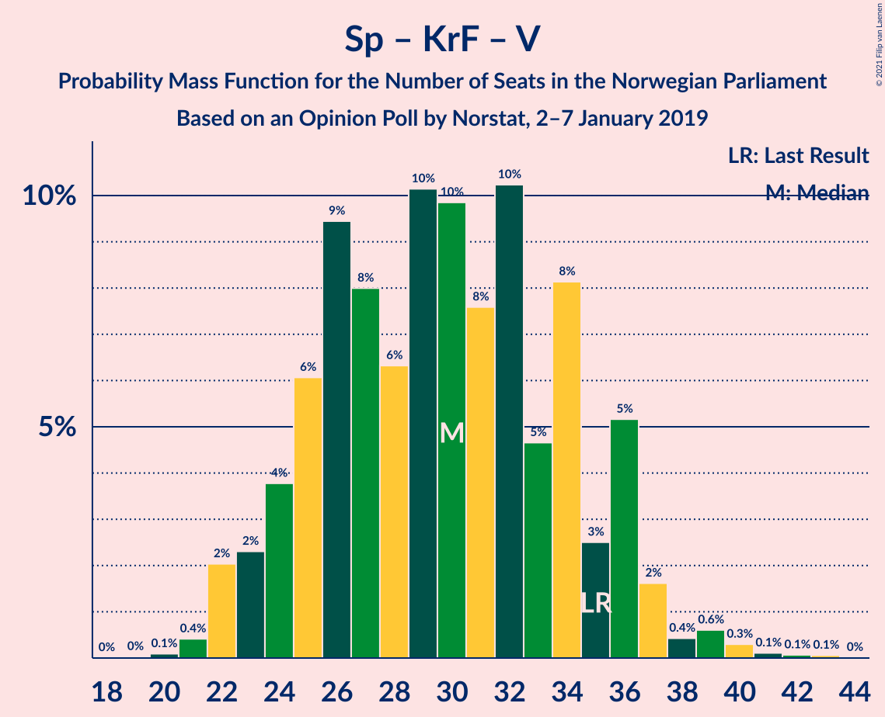

| Number of Seats | Probability | Accumulated | Special Marks |
|:---------------:|:-----------:|:-----------:|:-------------:|
| 20 | 0.1% | 100% |  |
| 21 | 0.4% | 99.9% |  |
| 22 | 2% | 99.5% |  |
| 23 | 2% | 97% |  |
| 24 | 4% | 95% |  |
| 25 | 6% | 91% |  |
| 26 | 9% | 85% |  |
| 27 | 8% | 76% |  |
| 28 | 6% | 68% | Median |
| 29 | 10% | 61% |  |
| 30 | 10% | 51% |  |
| 31 | 8% | 41% |  |
| 32 | 10% | 34% |  |
| 33 | 5% | 24% |  |
| 34 | 8% | 19% |  |
| 35 | 3% | 11% | Last Result |
| 36 | 5% | 8% |  |
| 37 | 2% | 3% |  |
| 38 | 0.4% | 2% |  |
| 39 | 0.6% | 1.2% |  |
| 40 | 0.3% | 0.6% |  |
| 41 | 0.1% | 0.3% |  |
| 42 | 0.1% | 0.1% |  |
| 43 | 0.1% | 0.1% |  |
| 44 | 0% | 0% |  |

## Technical Information

### Opinion Poll

+ **Polling firm:** Norstat
+ **Commissioner(s):** —
+ **Fieldwork period:** 2–7 January 2019

### Calculations

+ **Sample size:** 708
+ **Simulations done:** 1,048,576
+ **Error estimate:** 1.19%

