# Opinion Poll by Norstat, 29 January–4 February 2019

<a href="#voting-intentions">Voting Intentions</a> | <a href="#seats">Seats</a> | <a href="#coalitions">Coalitions</a> | <a href="#technical-information">Technical Information</a>

## Voting Intentions

### Confidence Intervals

| Party | Last Result | Poll Result | 80% Confidence Interval | 90% Confidence Interval | 95% Confidence Interval | 99% Confidence Interval |
|:-----:|:-----------:|:-----------:|:-----------------------:|:-----------------------:|:-----------------------:|:-----------------------:|
| Arbeiderpartiet | 27.4% | 29.3% | 27.1–31.6% |26.4–32.3% |25.9–32.9% |24.9–34.0% |
| Høyre | 25.0% | 22.9% | 20.9–25.1% |20.3–25.7% |19.8–26.2% |18.9–27.3% |
| Fremskrittspartiet | 15.2% | 12.0% | 10.5–13.8% |10.1–14.3% |9.8–14.8% |9.1–15.7% |
| Senterpartiet | 10.3% | 11.7% | 10.3–13.5% |9.8–14.0% |9.5–14.4% |8.8–15.3% |
| Sosialistisk Venstreparti | 6.0% | 7.8% | 6.6–9.3% |6.2–9.7% |6.0–10.1% |5.4–10.9% |
| Rødt | 2.4% | 4.9% | 3.9–6.1% |3.7–6.5% |3.5–6.8% |3.1–7.5% |
| Kristelig Folkeparti | 4.2% | 3.4% | 2.6–4.5% |2.4–4.8% |2.2–5.0% |1.9–5.6% |
| Miljøpartiet De Grønne | 3.2% | 3.2% | 2.5–4.3% |2.3–4.6% |2.1–4.8% |1.8–5.4% |
| Venstre | 4.4% | 2.6% | 2.0–3.6% |1.8–3.9% |1.6–4.1% |1.4–4.6% |

*Note:* The poll result column reflects the actual value used in the calculations. Published results may vary slightly, and in addition be rounded to fewer digits.

## Seats

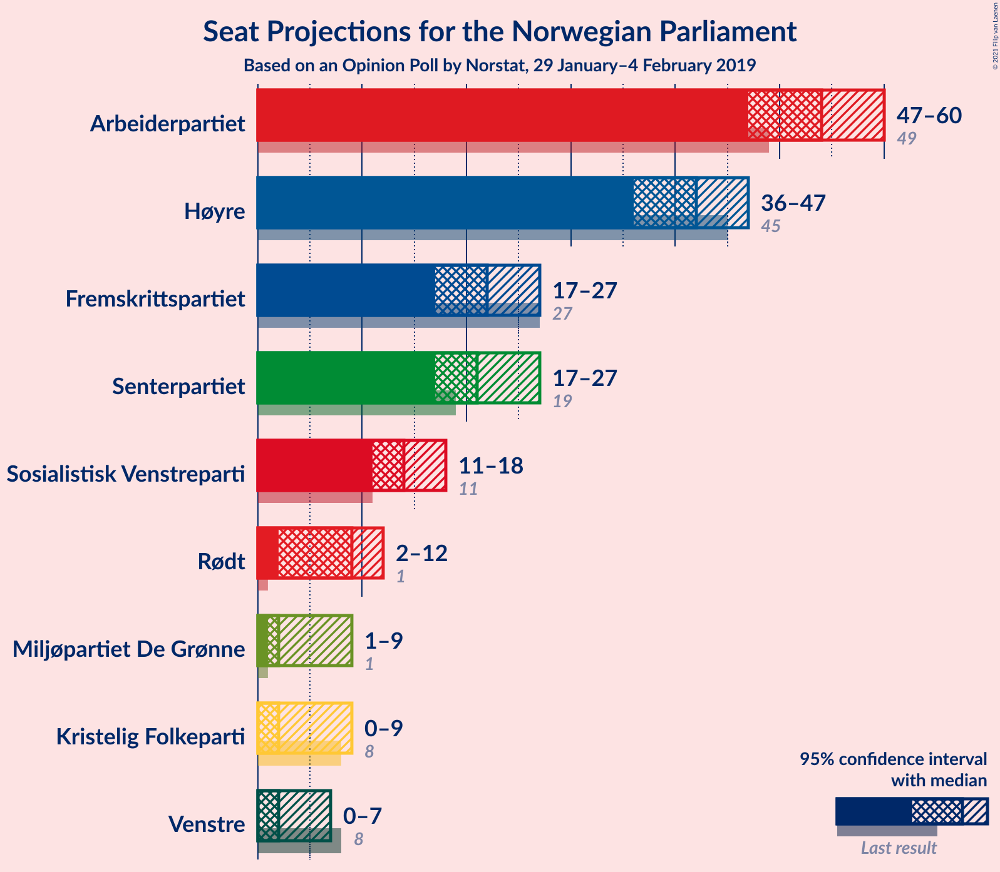

### Confidence Intervals

| Party | Last Result | Median | 80% Confidence Interval | 90% Confidence Interval | 95% Confidence Interval | 99% Confidence Interval |
|:-----:|:-----------:|:------:|:-----------------------:|:-----------------------:|:-----------------------:|:-----------------------:|
| <a href="#arbeiderpartiet">Arbeiderpartiet</a> | 49 | 54 | 49–58 |48–59 |47–60 |45–63 |
| <a href="#høyre">Høyre</a> | 45 | 42 | 38–46 |37–46 |36–47 |34–50 |
| <a href="#fremskrittspartiet">Fremskrittspartiet</a> | 27 | 22 | 19–25 |18–26 |17–27 |16–29 |
| <a href="#senterpartiet">Senterpartiet</a> | 19 | 21 | 19–24 |18–26 |17–27 |16–28 |
| <a href="#sosialistisk-venstreparti">Sosialistisk Venstreparti</a> | 11 | 14 | 12–16 |11–17 |11–18 |10–20 |
| <a href="#rødt">Rødt</a> | 1 | 9 | 7–11 |2–12 |2–12 |2–13 |
| <a href="#kristelig-folkeparti">Kristelig Folkeparti</a> | 8 | 2 | 1–8 |1–8 |0–9 |0–10 |
| <a href="#miljøpartiet-de-grønne">Miljøpartiet De Grønne</a> | 1 | 2 | 1–7 |1–8 |1–9 |0–10 |
| <a href="#venstre">Venstre</a> | 8 | 2 | 1–2 |0–2 |0–7 |0–8 |

### Arbeiderpartiet

*For a full overview of the results for this party, see the [Arbeiderpartiet](party-arbeiderpartiet.html) page.*

| Number of Seats | Probability | Accumulated | Special Marks |
|:---------------:|:-----------:|:-----------:|:-------------:|
| 43 | 0.1% | 100% |  |
| 44 | 0.2% | 99.8% |  |
| 45 | 0.6% | 99.6% |  |
| 46 | 0.9% | 99.1% |  |
| 47 | 2% | 98% |  |
| 48 | 3% | 97% |  |
| 49 | 4% | 93% | Last Result |
| 50 | 5% | 90% |  |
| 51 | 13% | 85% |  |
| 52 | 12% | 72% |  |
| 53 | 9% | 60% |  |
| 54 | 6% | 51% | Median |
| 55 | 9% | 45% |  |
| 56 | 14% | 36% |  |
| 57 | 7% | 22% |  |
| 58 | 6% | 15% |  |
| 59 | 4% | 9% |  |
| 60 | 3% | 5% |  |
| 61 | 0.5% | 2% |  |
| 62 | 0.3% | 1.0% |  |
| 63 | 0.4% | 0.7% |  |
| 64 | 0.1% | 0.2% |  |
| 65 | 0.1% | 0.1% |  |
| 66 | 0% | 0% |  |

### Høyre

*For a full overview of the results for this party, see the [Høyre](party-høyre.html) page.*

| Number of Seats | Probability | Accumulated | Special Marks |
|:---------------:|:-----------:|:-----------:|:-------------:|
| 32 | 0.1% | 100% |  |
| 33 | 0.2% | 99.9% |  |
| 34 | 0.5% | 99.6% |  |
| 35 | 1.0% | 99.2% |  |
| 36 | 3% | 98% |  |
| 37 | 5% | 95% |  |
| 38 | 5% | 90% |  |
| 39 | 8% | 85% |  |
| 40 | 12% | 77% |  |
| 41 | 9% | 65% |  |
| 42 | 13% | 56% | Median |
| 43 | 18% | 44% |  |
| 44 | 9% | 26% |  |
| 45 | 6% | 17% | Last Result |
| 46 | 7% | 11% |  |
| 47 | 2% | 4% |  |
| 48 | 0.9% | 2% |  |
| 49 | 0.9% | 2% |  |
| 50 | 0.3% | 0.6% |  |
| 51 | 0.3% | 0.4% |  |
| 52 | 0.1% | 0.1% |  |
| 53 | 0% | 0% |  |

### Fremskrittspartiet

*For a full overview of the results for this party, see the [Fremskrittspartiet](party-fremskrittspartiet.html) page.*

| Number of Seats | Probability | Accumulated | Special Marks |
|:---------------:|:-----------:|:-----------:|:-------------:|
| 15 | 0.3% | 100% |  |
| 16 | 0.7% | 99.7% |  |
| 17 | 2% | 99.0% |  |
| 18 | 3% | 97% |  |
| 19 | 7% | 94% |  |
| 20 | 18% | 87% |  |
| 21 | 11% | 69% |  |
| 22 | 18% | 58% | Median |
| 23 | 11% | 41% |  |
| 24 | 12% | 30% |  |
| 25 | 10% | 18% |  |
| 26 | 4% | 8% |  |
| 27 | 2% | 4% | Last Result |
| 28 | 1.3% | 2% |  |
| 29 | 0.3% | 0.5% |  |
| 30 | 0.1% | 0.2% |  |
| 31 | 0.1% | 0.1% |  |
| 32 | 0% | 0% |  |

### Senterpartiet

*For a full overview of the results for this party, see the [Senterpartiet](party-senterpartiet.html) page.*

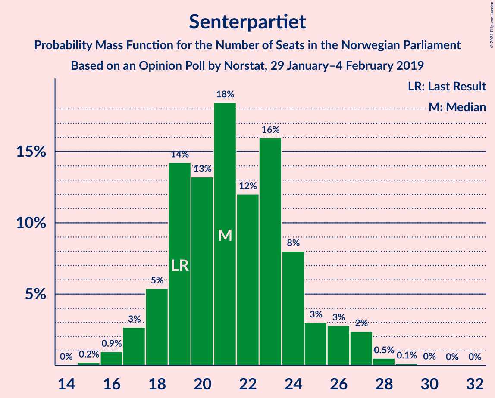

| Number of Seats | Probability | Accumulated | Special Marks |
|:---------------:|:-----------:|:-----------:|:-------------:|
| 15 | 0.2% | 100% |  |
| 16 | 0.9% | 99.8% |  |
| 17 | 3% | 98.8% |  |
| 18 | 5% | 96% |  |
| 19 | 14% | 91% | Last Result |
| 20 | 13% | 77% |  |
| 21 | 18% | 63% | Median |
| 22 | 12% | 45% |  |
| 23 | 16% | 33% |  |
| 24 | 8% | 17% |  |
| 25 | 3% | 9% |  |
| 26 | 3% | 6% |  |
| 27 | 2% | 3% |  |
| 28 | 0.5% | 0.7% |  |
| 29 | 0.1% | 0.2% |  |
| 30 | 0% | 0.1% |  |
| 31 | 0% | 0% |  |

### Sosialistisk Venstreparti

*For a full overview of the results for this party, see the [Sosialistisk Venstreparti](party-sosialistiskvenstreparti.html) page.*

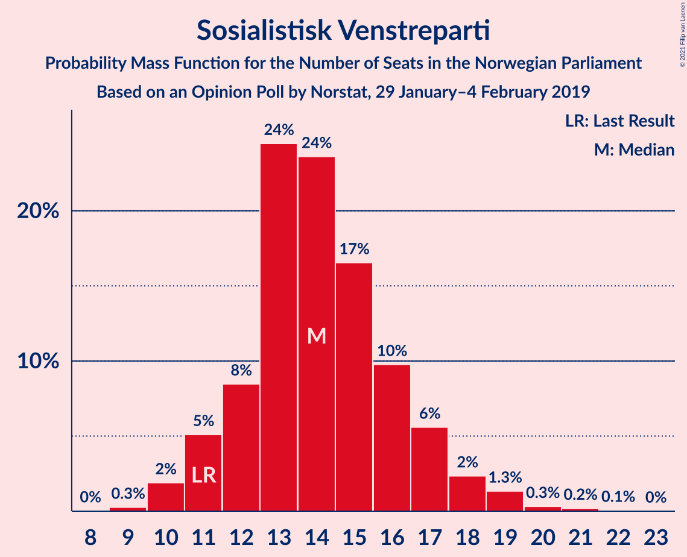

| Number of Seats | Probability | Accumulated | Special Marks |
|:---------------:|:-----------:|:-----------:|:-------------:|
| 9 | 0.3% | 100% |  |
| 10 | 2% | 99.7% |  |
| 11 | 5% | 98% | Last Result |
| 12 | 8% | 93% |  |
| 13 | 24% | 84% |  |
| 14 | 24% | 60% | Median |
| 15 | 17% | 36% |  |
| 16 | 10% | 20% |  |
| 17 | 6% | 10% |  |
| 18 | 2% | 4% |  |
| 19 | 1.3% | 2% |  |
| 20 | 0.3% | 0.6% |  |
| 21 | 0.2% | 0.3% |  |
| 22 | 0.1% | 0.1% |  |
| 23 | 0% | 0% |  |

### Rødt

*For a full overview of the results for this party, see the [Rødt](party-rødt.html) page.*

| Number of Seats | Probability | Accumulated | Special Marks |
|:---------------:|:-----------:|:-----------:|:-------------:|
| 1 | 0.2% | 100% | Last Result |
| 2 | 8% | 99.8% |  |
| 3 | 0% | 92% |  |
| 4 | 0% | 92% |  |
| 5 | 0% | 92% |  |
| 6 | 0% | 92% |  |
| 7 | 4% | 92% |  |
| 8 | 29% | 88% |  |
| 9 | 18% | 59% | Median |
| 10 | 27% | 41% |  |
| 11 | 9% | 14% |  |
| 12 | 4% | 6% |  |
| 13 | 2% | 2% |  |
| 14 | 0.3% | 0.4% |  |
| 15 | 0.1% | 0.1% |  |
| 16 | 0% | 0% |  |

### Kristelig Folkeparti

*For a full overview of the results for this party, see the [Kristelig Folkeparti](party-kristeligfolkeparti.html) page.*

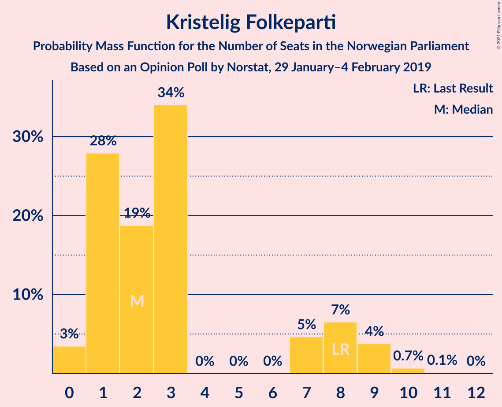

| Number of Seats | Probability | Accumulated | Special Marks |
|:---------------:|:-----------:|:-----------:|:-------------:|
| 0 | 3% | 100% |  |
| 1 | 28% | 97% |  |
| 2 | 19% | 69% | Median |
| 3 | 34% | 50% |  |
| 4 | 0% | 16% |  |
| 5 | 0% | 16% |  |
| 6 | 0% | 16% |  |
| 7 | 5% | 16% |  |
| 8 | 7% | 11% | Last Result |
| 9 | 4% | 5% |  |
| 10 | 0.7% | 0.9% |  |
| 11 | 0.1% | 0.2% |  |
| 12 | 0% | 0% |  |

### Miljøpartiet De Grønne

*For a full overview of the results for this party, see the [Miljøpartiet De Grønne](party-miljøpartietdegrønne.html) page.*

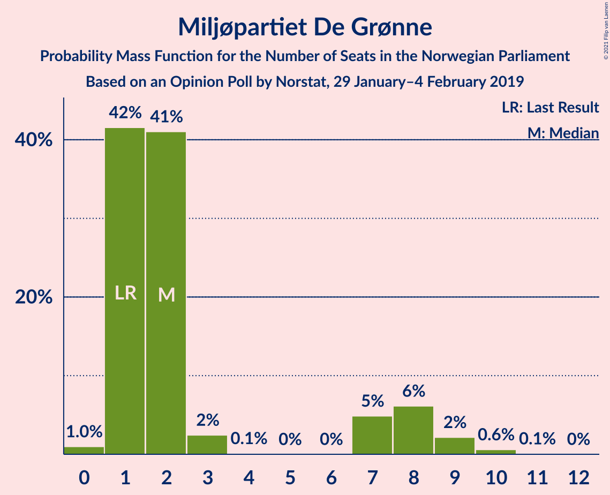

| Number of Seats | Probability | Accumulated | Special Marks |
|:---------------:|:-----------:|:-----------:|:-------------:|
| 0 | 1.0% | 100% |  |
| 1 | 42% | 99.0% | Last Result |
| 2 | 41% | 57% | Median |
| 3 | 2% | 16% |  |
| 4 | 0.1% | 14% |  |
| 5 | 0% | 14% |  |
| 6 | 0% | 14% |  |
| 7 | 5% | 14% |  |
| 8 | 6% | 9% |  |
| 9 | 2% | 3% |  |
| 10 | 0.6% | 0.7% |  |
| 11 | 0.1% | 0.1% |  |
| 12 | 0% | 0% |  |

### Venstre

*For a full overview of the results for this party, see the [Venstre](party-venstre.html) page.*

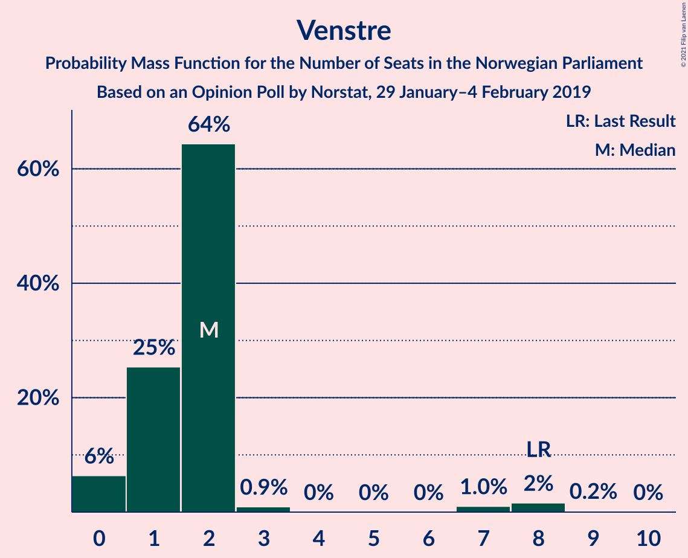

| Number of Seats | Probability | Accumulated | Special Marks |
|:---------------:|:-----------:|:-----------:|:-------------:|
| 0 | 6% | 100% |  |
| 1 | 25% | 94% |  |
| 2 | 64% | 68% | Median |
| 3 | 0.9% | 4% |  |
| 4 | 0% | 3% |  |
| 5 | 0% | 3% |  |
| 6 | 0% | 3% |  |
| 7 | 1.0% | 3% |  |
| 8 | 2% | 2% | Last Result |
| 9 | 0.2% | 0.2% |  |
| 10 | 0% | 0% |  |

## Coalitions

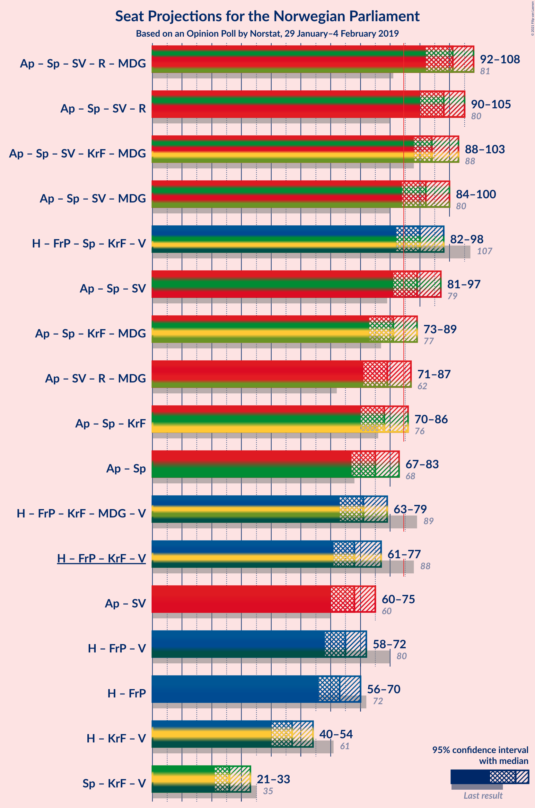

### Confidence Intervals

| Coalition | Last Result | Median | Majority? | 80% Confidence Interval | 90% Confidence Interval | 95% Confidence Interval | 99% Confidence Interval |
|:---------:|:-----------:|:------:|:---------:|:-----------------------:|:-----------------------:|:-----------------------:|:-----------------------:|
| Arbeiderpartiet – Senterpartiet – Sosialistisk Venstreparti – Rødt – Miljøpartiet De Grønne | 81 | 101 | 100% | 96–105 | 94–107 | 92–108 | 89–110 |
| Arbeiderpartiet – Senterpartiet – Sosialistisk Venstreparti – Rødt | 80 | 98 | 99.9% | 93–103 | 91–104 | 90–105 | 87–107 |
| Arbeiderpartiet – Senterpartiet – Sosialistisk Venstreparti – Kristelig Folkeparti – Miljøpartiet De Grønne | 88 | 94 | 99.6% | 89–100 | 89–102 | 88–103 | 85–106 |
| Arbeiderpartiet – Senterpartiet – Sosialistisk Venstreparti – Miljøpartiet De Grønne | 80 | 92 | 97% | 86–97 | 85–99 | 84–100 | 81–103 |
| Høyre – Fremskrittspartiet – Senterpartiet – Kristelig Folkeparti – Venstre | 107 | 90 | 92% | 85–95 | 83–97 | 82–98 | 80–101 |
| Arbeiderpartiet – Senterpartiet – Sosialistisk Venstreparti | 79 | 89 | 86% | 84–94 | 83–95 | 81–97 | 79–100 |
| Arbeiderpartiet – Senterpartiet – Kristelig Folkeparti – Miljøpartiet De Grønne | 77 | 81 | 14% | 75–86 | 75–88 | 73–89 | 71–92 |
| Arbeiderpartiet – Sosialistisk Venstreparti – Rødt – Miljøpartiet De Grønne | 62 | 79 | 8% | 74–84 | 72–86 | 71–87 | 68–89 |
| Arbeiderpartiet – Senterpartiet – Kristelig Folkeparti | 76 | 78 | 5% | 73–83 | 72–85 | 70–86 | 68–88 |
| Arbeiderpartiet – Senterpartiet | 68 | 75 | 1.2% | 70–80 | 69–81 | 67–83 | 65–85 |
| Høyre – Fremskrittspartiet – Kristelig Folkeparti – Miljøpartiet De Grønne – Venstre | 89 | 71 | 0.1% | 66–76 | 65–78 | 63–79 | 61–82 |
| Høyre – Fremskrittspartiet – Kristelig Folkeparti – Venstre | 88 | 68 | 0% | 64–73 | 62–75 | 61–77 | 59–79 |
| Arbeiderpartiet – Sosialistisk Venstreparti | 60 | 68 | 0% | 63–73 | 62–74 | 60–75 | 58–77 |
| Høyre – Fremskrittspartiet – Venstre | 80 | 65 | 0% | 61–70 | 59–71 | 58–72 | 55–76 |
| Høyre – Fremskrittspartiet | 72 | 63 | 0% | 59–68 | 58–69 | 56–70 | 54–73 |
| Høyre – Kristelig Folkeparti – Venstre | 61 | 47 | 0% | 42–51 | 40–53 | 40–54 | 38–58 |
| Senterpartiet – Kristelig Folkeparti – Venstre | 35 | 26 | 0% | 22–31 | 21–32 | 21–33 | 19–36 |

### Arbeiderpartiet – Senterpartiet – Sosialistisk Venstreparti – Rødt – Miljøpartiet De Grønne

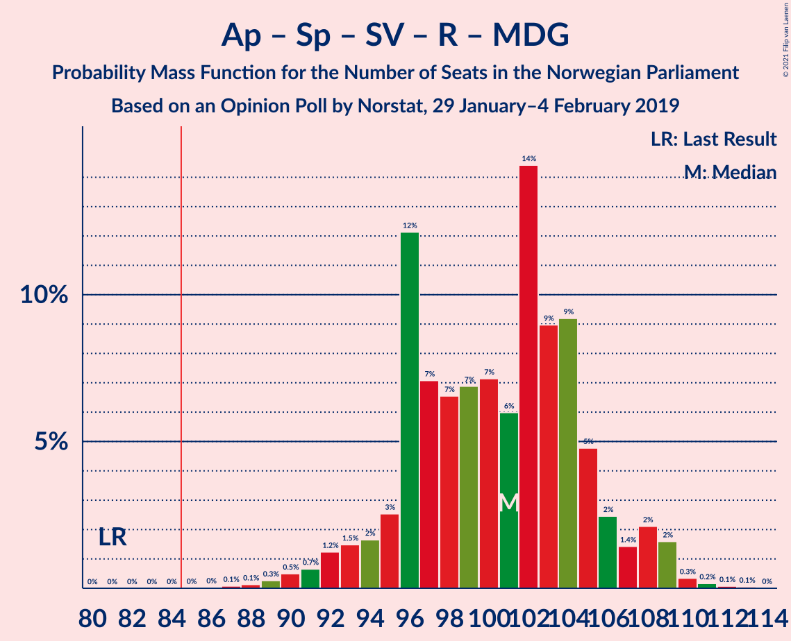

| Number of Seats | Probability | Accumulated | Special Marks |
|:---------------:|:-----------:|:-----------:|:-------------:|
| 81 | 0% | 100% | Last Result |
| 82 | 0% | 100% |  |
| 83 | 0% | 100% |  |
| 84 | 0% | 100% |  |
| 85 | 0% | 100% | Majority |
| 86 | 0% | 100% |  |
| 87 | 0.1% | 99.9% |  |
| 88 | 0.1% | 99.9% |  |
| 89 | 0.3% | 99.7% |  |
| 90 | 0.5% | 99.5% |  |
| 91 | 0.7% | 99.0% |  |
| 92 | 1.2% | 98% |  |
| 93 | 1.5% | 97% |  |
| 94 | 2% | 96% |  |
| 95 | 3% | 94% |  |
| 96 | 12% | 91% |  |
| 97 | 7% | 79% |  |
| 98 | 7% | 72% |  |
| 99 | 7% | 66% |  |
| 100 | 7% | 59% | Median |
| 101 | 6% | 52% |  |
| 102 | 14% | 46% |  |
| 103 | 9% | 31% |  |
| 104 | 9% | 22% |  |
| 105 | 5% | 13% |  |
| 106 | 2% | 8% |  |
| 107 | 1.4% | 6% |  |
| 108 | 2% | 4% |  |
| 109 | 2% | 2% |  |
| 110 | 0.3% | 0.7% |  |
| 111 | 0.2% | 0.3% |  |
| 112 | 0.1% | 0.1% |  |
| 113 | 0.1% | 0.1% |  |
| 114 | 0% | 0% |  |

### Arbeiderpartiet – Senterpartiet – Sosialistisk Venstreparti – Rødt

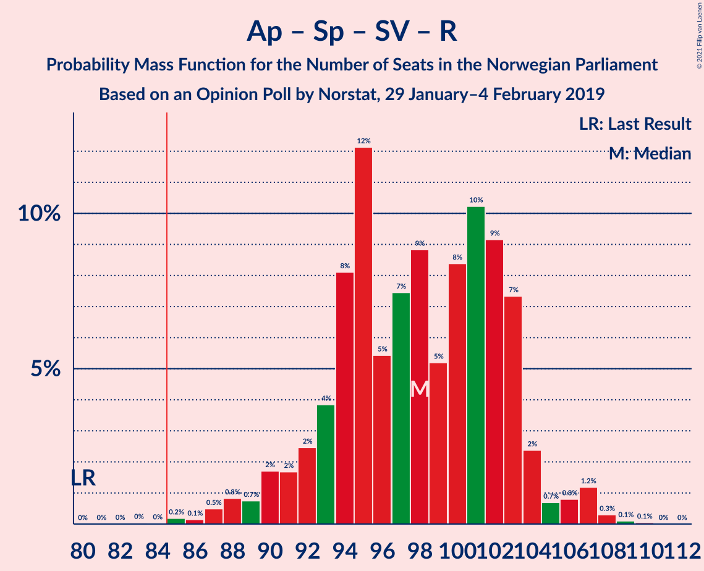

| Number of Seats | Probability | Accumulated | Special Marks |
|:---------------:|:-----------:|:-----------:|:-------------:|
| 80 | 0% | 100% | Last Result |
| 81 | 0% | 100% |  |
| 82 | 0% | 100% |  |
| 83 | 0% | 100% |  |
| 84 | 0% | 99.9% |  |
| 85 | 0.2% | 99.9% | Majority |
| 86 | 0.1% | 99.7% |  |
| 87 | 0.5% | 99.6% |  |
| 88 | 0.8% | 99.1% |  |
| 89 | 0.7% | 98% |  |
| 90 | 2% | 98% |  |
| 91 | 2% | 96% |  |
| 92 | 2% | 94% |  |
| 93 | 4% | 92% |  |
| 94 | 8% | 88% |  |
| 95 | 12% | 80% |  |
| 96 | 5% | 68% |  |
| 97 | 7% | 62% |  |
| 98 | 9% | 55% | Median |
| 99 | 5% | 46% |  |
| 100 | 8% | 41% |  |
| 101 | 10% | 32% |  |
| 102 | 9% | 22% |  |
| 103 | 7% | 13% |  |
| 104 | 2% | 6% |  |
| 105 | 0.7% | 3% |  |
| 106 | 0.8% | 2% |  |
| 107 | 1.2% | 2% |  |
| 108 | 0.3% | 0.5% |  |
| 109 | 0.1% | 0.2% |  |
| 110 | 0.1% | 0.1% |  |
| 111 | 0% | 0% |  |

### Arbeiderpartiet – Senterpartiet – Sosialistisk Venstreparti – Kristelig Folkeparti – Miljøpartiet De Grønne

| Number of Seats | Probability | Accumulated | Special Marks |
|:---------------:|:-----------:|:-----------:|:-------------:|
| 82 | 0% | 100% |  |
| 83 | 0.1% | 99.9% |  |
| 84 | 0.2% | 99.8% |  |
| 85 | 0.4% | 99.6% | Majority |
| 86 | 0.6% | 99.2% |  |
| 87 | 1.0% | 98.7% |  |
| 88 | 2% | 98% | Last Result |
| 89 | 6% | 96% |  |
| 90 | 3% | 90% |  |
| 91 | 11% | 87% |  |
| 92 | 10% | 75% |  |
| 93 | 6% | 65% | Median |
| 94 | 11% | 60% |  |
| 95 | 7% | 48% |  |
| 96 | 9% | 41% |  |
| 97 | 10% | 32% |  |
| 98 | 6% | 22% |  |
| 99 | 4% | 16% |  |
| 100 | 4% | 12% |  |
| 101 | 2% | 8% |  |
| 102 | 3% | 6% |  |
| 103 | 1.2% | 3% |  |
| 104 | 1.0% | 2% |  |
| 105 | 0.4% | 0.9% |  |
| 106 | 0.2% | 0.5% |  |
| 107 | 0.1% | 0.3% |  |
| 108 | 0.1% | 0.2% |  |
| 109 | 0% | 0.1% |  |
| 110 | 0% | 0% |  |

### Arbeiderpartiet – Senterpartiet – Sosialistisk Venstreparti – Miljøpartiet De Grønne

| Number of Seats | Probability | Accumulated | Special Marks |
|:---------------:|:-----------:|:-----------:|:-------------:|
| 79 | 0.1% | 100% |  |
| 80 | 0.2% | 99.9% | Last Result |
| 81 | 0.3% | 99.7% |  |
| 82 | 0.8% | 99.5% |  |
| 83 | 1.0% | 98.6% |  |
| 84 | 0.9% | 98% |  |
| 85 | 2% | 97% | Majority |
| 86 | 6% | 95% |  |
| 87 | 4% | 89% |  |
| 88 | 9% | 86% |  |
| 89 | 11% | 76% |  |
| 90 | 5% | 66% |  |
| 91 | 8% | 61% | Median |
| 92 | 10% | 53% |  |
| 93 | 8% | 43% |  |
| 94 | 10% | 35% |  |
| 95 | 10% | 25% |  |
| 96 | 5% | 15% |  |
| 97 | 2% | 10% |  |
| 98 | 3% | 8% |  |
| 99 | 2% | 6% |  |
| 100 | 2% | 4% |  |
| 101 | 1.0% | 2% |  |
| 102 | 0.4% | 1.0% |  |
| 103 | 0.4% | 0.6% |  |
| 104 | 0.1% | 0.3% |  |
| 105 | 0.1% | 0.2% |  |
| 106 | 0% | 0.1% |  |
| 107 | 0% | 0% |  |

### Høyre – Fremskrittspartiet – Senterpartiet – Kristelig Folkeparti – Venstre

| Number of Seats | Probability | Accumulated | Special Marks |
|:---------------:|:-----------:|:-----------:|:-------------:|
| 76 | 0.1% | 100% |  |
| 77 | 0.1% | 99.9% |  |
| 78 | 0.1% | 99.9% |  |
| 79 | 0.1% | 99.8% |  |
| 80 | 0.6% | 99.6% |  |
| 81 | 1.4% | 99.0% |  |
| 82 | 2% | 98% |  |
| 83 | 2% | 96% |  |
| 84 | 2% | 94% |  |
| 85 | 6% | 92% | Majority |
| 86 | 6% | 86% |  |
| 87 | 8% | 80% |  |
| 88 | 10% | 72% |  |
| 89 | 8% | 62% | Median |
| 90 | 10% | 54% |  |
| 91 | 6% | 44% |  |
| 92 | 7% | 38% |  |
| 93 | 9% | 30% |  |
| 94 | 10% | 21% |  |
| 95 | 5% | 12% |  |
| 96 | 2% | 7% |  |
| 97 | 2% | 5% |  |
| 98 | 1.2% | 3% |  |
| 99 | 0.7% | 2% |  |
| 100 | 0.3% | 1.1% |  |
| 101 | 0.3% | 0.7% |  |
| 102 | 0.1% | 0.4% |  |
| 103 | 0.2% | 0.3% |  |
| 104 | 0% | 0.1% |  |
| 105 | 0% | 0% |  |
| 106 | 0% | 0% |  |
| 107 | 0% | 0% | Last Result |

### Arbeiderpartiet – Senterpartiet – Sosialistisk Venstreparti

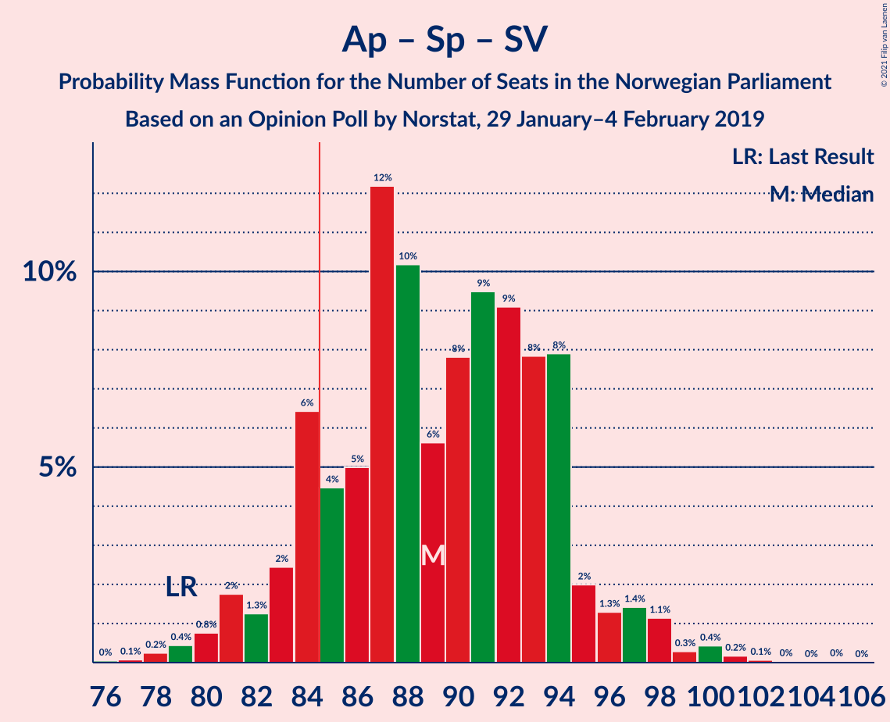

| Number of Seats | Probability | Accumulated | Special Marks |
|:---------------:|:-----------:|:-----------:|:-------------:|
| 76 | 0% | 100% |  |
| 77 | 0.1% | 99.9% |  |
| 78 | 0.2% | 99.8% |  |
| 79 | 0.4% | 99.6% | Last Result |
| 80 | 0.8% | 99.1% |  |
| 81 | 2% | 98% |  |
| 82 | 1.3% | 97% |  |
| 83 | 2% | 95% |  |
| 84 | 6% | 93% |  |
| 85 | 4% | 86% | Majority |
| 86 | 5% | 82% |  |
| 87 | 12% | 77% |  |
| 88 | 10% | 65% |  |
| 89 | 6% | 55% | Median |
| 90 | 8% | 49% |  |
| 91 | 9% | 41% |  |
| 92 | 9% | 32% |  |
| 93 | 8% | 23% |  |
| 94 | 8% | 15% |  |
| 95 | 2% | 7% |  |
| 96 | 1.3% | 5% |  |
| 97 | 1.4% | 4% |  |
| 98 | 1.1% | 2% |  |
| 99 | 0.3% | 1.0% |  |
| 100 | 0.4% | 0.8% |  |
| 101 | 0.2% | 0.3% |  |
| 102 | 0.1% | 0.2% |  |
| 103 | 0% | 0.1% |  |
| 104 | 0% | 0.1% |  |
| 105 | 0% | 0% |  |

### Arbeiderpartiet – Senterpartiet – Kristelig Folkeparti – Miljøpartiet De Grønne

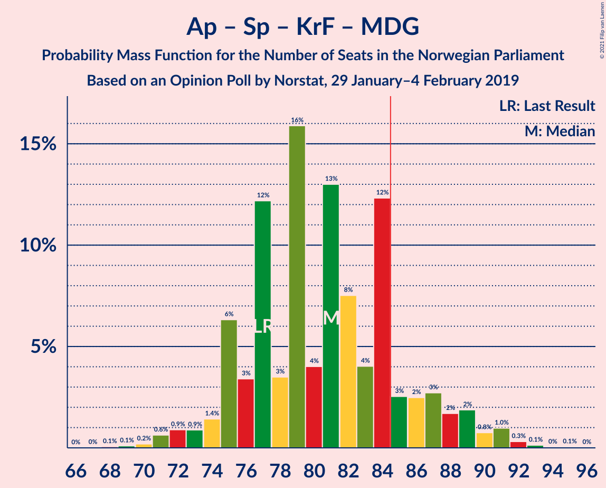

| Number of Seats | Probability | Accumulated | Special Marks |
|:---------------:|:-----------:|:-----------:|:-------------:|
| 68 | 0.1% | 100% |  |
| 69 | 0.1% | 99.9% |  |
| 70 | 0.2% | 99.8% |  |
| 71 | 0.6% | 99.6% |  |
| 72 | 0.9% | 99.0% |  |
| 73 | 0.9% | 98% |  |
| 74 | 1.4% | 97% |  |
| 75 | 6% | 96% |  |
| 76 | 3% | 89% |  |
| 77 | 12% | 86% | Last Result |
| 78 | 3% | 74% |  |
| 79 | 16% | 70% | Median |
| 80 | 4% | 54% |  |
| 81 | 13% | 50% |  |
| 82 | 8% | 37% |  |
| 83 | 4% | 30% |  |
| 84 | 12% | 26% |  |
| 85 | 3% | 14% | Majority |
| 86 | 2% | 11% |  |
| 87 | 3% | 9% |  |
| 88 | 2% | 6% |  |
| 89 | 2% | 4% |  |
| 90 | 0.8% | 2% |  |
| 91 | 1.0% | 2% |  |
| 92 | 0.3% | 0.6% |  |
| 93 | 0.1% | 0.2% |  |
| 94 | 0% | 0.1% |  |
| 95 | 0.1% | 0.1% |  |
| 96 | 0% | 0% |  |

### Arbeiderpartiet – Sosialistisk Venstreparti – Rødt – Miljøpartiet De Grønne

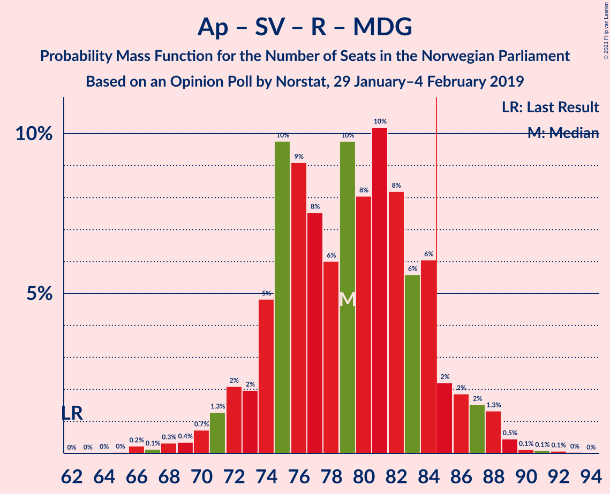

| Number of Seats | Probability | Accumulated | Special Marks |
|:---------------:|:-----------:|:-----------:|:-------------:|
| 62 | 0% | 100% | Last Result |
| 63 | 0% | 100% |  |
| 64 | 0% | 100% |  |
| 65 | 0% | 100% |  |
| 66 | 0.2% | 99.9% |  |
| 67 | 0.1% | 99.7% |  |
| 68 | 0.3% | 99.6% |  |
| 69 | 0.4% | 99.2% |  |
| 70 | 0.7% | 98.9% |  |
| 71 | 1.3% | 98% |  |
| 72 | 2% | 97% |  |
| 73 | 2% | 95% |  |
| 74 | 5% | 93% |  |
| 75 | 10% | 88% |  |
| 76 | 9% | 78% |  |
| 77 | 8% | 69% |  |
| 78 | 6% | 62% |  |
| 79 | 10% | 56% | Median |
| 80 | 8% | 46% |  |
| 81 | 10% | 38% |  |
| 82 | 8% | 28% |  |
| 83 | 6% | 19% |  |
| 84 | 6% | 14% |  |
| 85 | 2% | 8% | Majority |
| 86 | 2% | 6% |  |
| 87 | 2% | 4% |  |
| 88 | 1.3% | 2% |  |
| 89 | 0.5% | 0.8% |  |
| 90 | 0.1% | 0.3% |  |
| 91 | 0.1% | 0.2% |  |
| 92 | 0.1% | 0.1% |  |
| 93 | 0% | 0% |  |

### Arbeiderpartiet – Senterpartiet – Kristelig Folkeparti

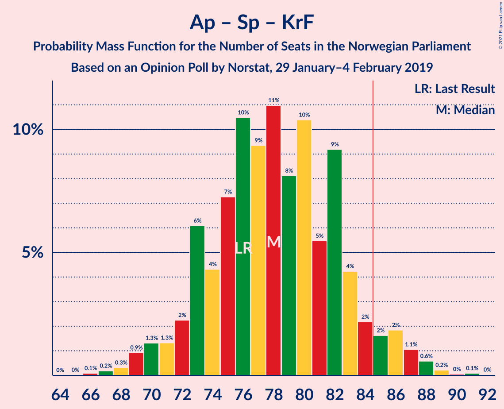

| Number of Seats | Probability | Accumulated | Special Marks |
|:---------------:|:-----------:|:-----------:|:-------------:|
| 66 | 0.1% | 100% |  |
| 67 | 0.2% | 99.9% |  |
| 68 | 0.3% | 99.7% |  |
| 69 | 0.9% | 99.4% |  |
| 70 | 1.3% | 98% |  |
| 71 | 1.3% | 97% |  |
| 72 | 2% | 96% |  |
| 73 | 6% | 94% |  |
| 74 | 4% | 87% |  |
| 75 | 7% | 83% |  |
| 76 | 10% | 76% | Last Result |
| 77 | 9% | 65% | Median |
| 78 | 11% | 56% |  |
| 79 | 8% | 45% |  |
| 80 | 10% | 37% |  |
| 81 | 5% | 27% |  |
| 82 | 9% | 21% |  |
| 83 | 4% | 12% |  |
| 84 | 2% | 8% |  |
| 85 | 2% | 5% | Majority |
| 86 | 2% | 4% |  |
| 87 | 1.1% | 2% |  |
| 88 | 0.6% | 1.0% |  |
| 89 | 0.2% | 0.4% |  |
| 90 | 0% | 0.2% |  |
| 91 | 0.1% | 0.1% |  |
| 92 | 0% | 0% |  |

### Arbeiderpartiet – Senterpartiet

| Number of Seats | Probability | Accumulated | Special Marks |
|:---------------:|:-----------:|:-----------:|:-------------:|
| 62 | 0% | 100% |  |
| 63 | 0.1% | 99.9% |  |
| 64 | 0.1% | 99.8% |  |
| 65 | 0.3% | 99.7% |  |
| 66 | 0.7% | 99.4% |  |
| 67 | 2% | 98.7% |  |
| 68 | 2% | 97% | Last Result |
| 69 | 2% | 95% |  |
| 70 | 7% | 93% |  |
| 71 | 4% | 87% |  |
| 72 | 6% | 83% |  |
| 73 | 12% | 77% |  |
| 74 | 10% | 65% |  |
| 75 | 7% | 55% | Median |
| 76 | 9% | 48% |  |
| 77 | 8% | 39% |  |
| 78 | 11% | 31% |  |
| 79 | 7% | 20% |  |
| 80 | 5% | 13% |  |
| 81 | 4% | 8% |  |
| 82 | 1.3% | 4% |  |
| 83 | 0.5% | 3% |  |
| 84 | 0.8% | 2% |  |
| 85 | 0.9% | 1.2% | Majority |
| 86 | 0.2% | 0.3% |  |
| 87 | 0.1% | 0.2% |  |
| 88 | 0% | 0.1% |  |
| 89 | 0% | 0% |  |

### Høyre – Fremskrittspartiet – Kristelig Folkeparti – Miljøpartiet De Grønne – Venstre

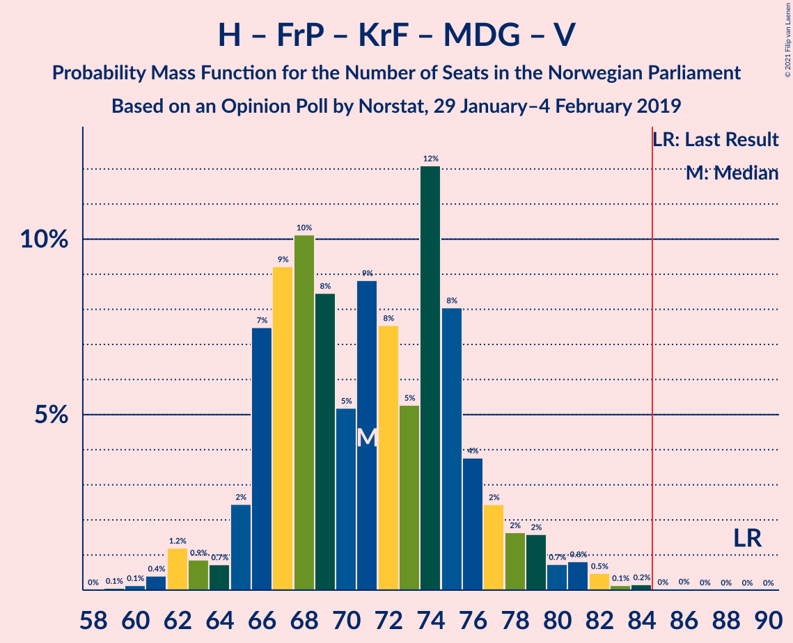

| Number of Seats | Probability | Accumulated | Special Marks |
|:---------------:|:-----------:|:-----------:|:-------------:|
| 59 | 0.1% | 100% |  |
| 60 | 0.1% | 99.9% |  |
| 61 | 0.4% | 99.8% |  |
| 62 | 1.2% | 99.4% |  |
| 63 | 0.9% | 98% |  |
| 64 | 0.7% | 97% |  |
| 65 | 2% | 97% |  |
| 66 | 7% | 94% |  |
| 67 | 9% | 87% |  |
| 68 | 10% | 77% |  |
| 69 | 8% | 67% |  |
| 70 | 5% | 59% | Median |
| 71 | 9% | 54% |  |
| 72 | 8% | 45% |  |
| 73 | 5% | 37% |  |
| 74 | 12% | 32% |  |
| 75 | 8% | 20% |  |
| 76 | 4% | 12% |  |
| 77 | 2% | 8% |  |
| 78 | 2% | 6% |  |
| 79 | 2% | 4% |  |
| 80 | 0.7% | 2% |  |
| 81 | 0.8% | 2% |  |
| 82 | 0.5% | 0.9% |  |
| 83 | 0.1% | 0.4% |  |
| 84 | 0.2% | 0.2% |  |
| 85 | 0% | 0.1% | Majority |
| 86 | 0% | 0.1% |  |
| 87 | 0% | 0% |  |
| 88 | 0% | 0% |  |
| 89 | 0% | 0% | Last Result |

### Høyre – Fremskrittspartiet – Kristelig Folkeparti – Venstre

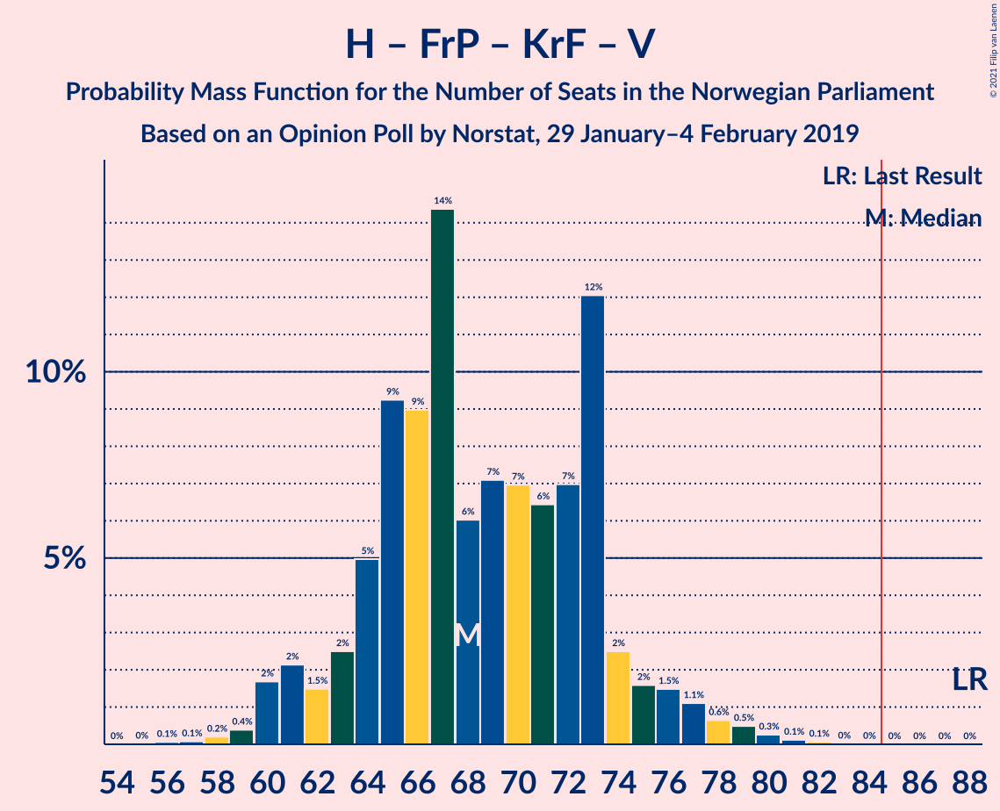

| Number of Seats | Probability | Accumulated | Special Marks |
|:---------------:|:-----------:|:-----------:|:-------------:|
| 56 | 0.1% | 100% |  |
| 57 | 0.1% | 99.9% |  |
| 58 | 0.2% | 99.8% |  |
| 59 | 0.4% | 99.6% |  |
| 60 | 2% | 99.2% |  |
| 61 | 2% | 98% |  |
| 62 | 1.5% | 95% |  |
| 63 | 2% | 94% |  |
| 64 | 5% | 91% |  |
| 65 | 9% | 86% |  |
| 66 | 9% | 77% |  |
| 67 | 14% | 68% |  |
| 68 | 6% | 54% | Median |
| 69 | 7% | 48% |  |
| 70 | 7% | 41% |  |
| 71 | 6% | 34% |  |
| 72 | 7% | 27% |  |
| 73 | 12% | 20% |  |
| 74 | 2% | 8% |  |
| 75 | 2% | 6% |  |
| 76 | 1.5% | 4% |  |
| 77 | 1.1% | 3% |  |
| 78 | 0.6% | 2% |  |
| 79 | 0.5% | 1.0% |  |
| 80 | 0.3% | 0.5% |  |
| 81 | 0.1% | 0.2% |  |
| 82 | 0.1% | 0.1% |  |
| 83 | 0% | 0% |  |
| 84 | 0% | 0% |  |
| 85 | 0% | 0% | Majority |
| 86 | 0% | 0% |  |
| 87 | 0% | 0% |  |
| 88 | 0% | 0% | Last Result |

### Arbeiderpartiet – Sosialistisk Venstreparti

| Number of Seats | Probability | Accumulated | Special Marks |
|:---------------:|:-----------:|:-----------:|:-------------:|
| 56 | 0.1% | 100% |  |
| 57 | 0.2% | 99.9% |  |
| 58 | 0.2% | 99.7% |  |
| 59 | 0.6% | 99.5% |  |
| 60 | 2% | 98.9% | Last Result |
| 61 | 1.4% | 97% |  |
| 62 | 3% | 96% |  |
| 63 | 3% | 93% |  |
| 64 | 7% | 90% |  |
| 65 | 10% | 83% |  |
| 66 | 14% | 72% |  |
| 67 | 6% | 59% |  |
| 68 | 6% | 53% | Median |
| 69 | 14% | 47% |  |
| 70 | 7% | 32% |  |
| 71 | 8% | 25% |  |
| 72 | 5% | 17% |  |
| 73 | 4% | 12% |  |
| 74 | 5% | 8% |  |
| 75 | 1.2% | 3% |  |
| 76 | 0.4% | 1.4% |  |
| 77 | 0.5% | 1.0% |  |
| 78 | 0.3% | 0.4% |  |
| 79 | 0.1% | 0.2% |  |
| 80 | 0% | 0.1% |  |
| 81 | 0.1% | 0.1% |  |
| 82 | 0% | 0% |  |

### Høyre – Fremskrittspartiet – Venstre

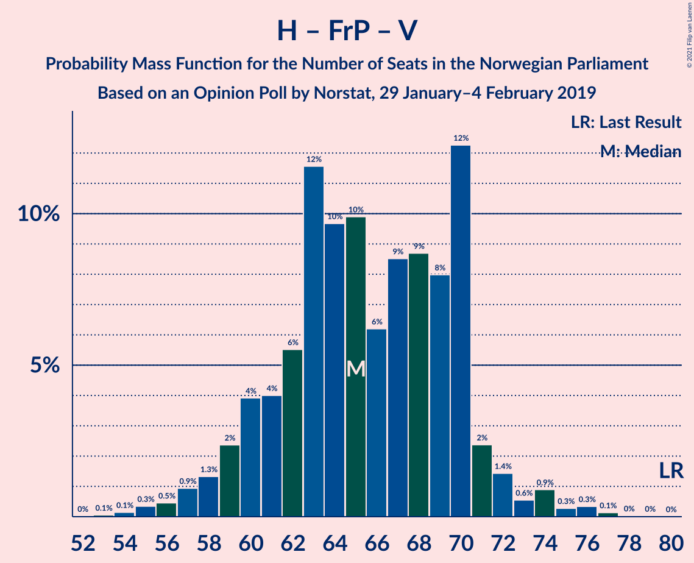

| Number of Seats | Probability | Accumulated | Special Marks |
|:---------------:|:-----------:|:-----------:|:-------------:|
| 53 | 0.1% | 100% |  |
| 54 | 0.1% | 99.9% |  |
| 55 | 0.3% | 99.8% |  |
| 56 | 0.5% | 99.4% |  |
| 57 | 0.9% | 99.0% |  |
| 58 | 1.3% | 98% |  |
| 59 | 2% | 97% |  |
| 60 | 4% | 94% |  |
| 61 | 4% | 90% |  |
| 62 | 6% | 86% |  |
| 63 | 12% | 81% |  |
| 64 | 10% | 69% |  |
| 65 | 10% | 60% |  |
| 66 | 6% | 50% | Median |
| 67 | 9% | 44% |  |
| 68 | 9% | 35% |  |
| 69 | 8% | 26% |  |
| 70 | 12% | 18% |  |
| 71 | 2% | 6% |  |
| 72 | 1.4% | 4% |  |
| 73 | 0.6% | 2% |  |
| 74 | 0.9% | 2% |  |
| 75 | 0.3% | 0.8% |  |
| 76 | 0.3% | 0.5% |  |
| 77 | 0.1% | 0.2% |  |
| 78 | 0% | 0.1% |  |
| 79 | 0% | 0% |  |
| 80 | 0% | 0% | Last Result |

### Høyre – Fremskrittspartiet

| Number of Seats | Probability | Accumulated | Special Marks |
|:---------------:|:-----------:|:-----------:|:-------------:|
| 52 | 0.1% | 100% |  |
| 53 | 0.3% | 99.8% |  |
| 54 | 0.4% | 99.5% |  |
| 55 | 0.8% | 99.1% |  |
| 56 | 1.3% | 98% |  |
| 57 | 2% | 97% |  |
| 58 | 3% | 95% |  |
| 59 | 4% | 92% |  |
| 60 | 6% | 88% |  |
| 61 | 8% | 82% |  |
| 62 | 11% | 74% |  |
| 63 | 12% | 62% |  |
| 64 | 4% | 50% | Median |
| 65 | 9% | 46% |  |
| 66 | 9% | 37% |  |
| 67 | 6% | 27% |  |
| 68 | 15% | 21% |  |
| 69 | 3% | 6% |  |
| 70 | 1.1% | 3% |  |
| 71 | 1.0% | 2% |  |
| 72 | 0.5% | 1.3% | Last Result |
| 73 | 0.4% | 0.8% |  |
| 74 | 0.2% | 0.4% |  |
| 75 | 0.1% | 0.2% |  |
| 76 | 0% | 0.1% |  |
| 77 | 0% | 0% |  |

### Høyre – Kristelig Folkeparti – Venstre

| Number of Seats | Probability | Accumulated | Special Marks |
|:---------------:|:-----------:|:-----------:|:-------------:|
| 36 | 0.1% | 100% |  |
| 37 | 0.3% | 99.9% |  |
| 38 | 0.4% | 99.6% |  |
| 39 | 1.4% | 99.3% |  |
| 40 | 3% | 98% |  |
| 41 | 5% | 95% |  |
| 42 | 4% | 90% |  |
| 43 | 10% | 86% |  |
| 44 | 7% | 76% |  |
| 45 | 7% | 69% |  |
| 46 | 8% | 62% | Median |
| 47 | 17% | 54% |  |
| 48 | 12% | 37% |  |
| 49 | 5% | 24% |  |
| 50 | 3% | 19% |  |
| 51 | 7% | 16% |  |
| 52 | 4% | 9% |  |
| 53 | 2% | 5% |  |
| 54 | 0.8% | 3% |  |
| 55 | 0.8% | 2% |  |
| 56 | 0.6% | 1.2% |  |
| 57 | 0.2% | 0.7% |  |
| 58 | 0.3% | 0.5% |  |
| 59 | 0.2% | 0.2% |  |
| 60 | 0% | 0% |  |
| 61 | 0% | 0% | Last Result |

### Senterpartiet – Kristelig Folkeparti – Venstre

| Number of Seats | Probability | Accumulated | Special Marks |
|:---------------:|:-----------:|:-----------:|:-------------:|
| 17 | 0.1% | 100% |  |
| 18 | 0.2% | 99.9% |  |
| 19 | 0.5% | 99.8% |  |
| 20 | 1.4% | 99.2% |  |
| 21 | 4% | 98% |  |
| 22 | 6% | 94% |  |
| 23 | 8% | 89% |  |
| 24 | 13% | 80% |  |
| 25 | 11% | 67% | Median |
| 26 | 15% | 55% |  |
| 27 | 9% | 40% |  |
| 28 | 12% | 31% |  |
| 29 | 7% | 20% |  |
| 30 | 3% | 13% |  |
| 31 | 3% | 10% |  |
| 32 | 3% | 7% |  |
| 33 | 1.5% | 4% |  |
| 34 | 1.0% | 2% |  |
| 35 | 0.6% | 1.2% | Last Result |
| 36 | 0.4% | 0.6% |  |
| 37 | 0.1% | 0.3% |  |
| 38 | 0.1% | 0.2% |  |
| 39 | 0.1% | 0.1% |  |
| 40 | 0% | 0% |  |

## Technical Information

### Opinion Poll

+ **Polling firm:** Norstat
+ **Commissioner(s):** —
+ **Fieldwork period:** 29 January–4 February 2019

### Calculations

+ **Sample size:** 656
+ **Simulations done:** 1,048,576
+ **Error estimate:** 1.62%

