# Opinion Poll by Norstat, 19–25 February 2019

<a href="#voting-intentions">Voting Intentions</a> | <a href="#seats">Seats</a> | <a href="#coalitions">Coalitions</a> | <a href="#technical-information">Technical Information</a>

## Voting Intentions

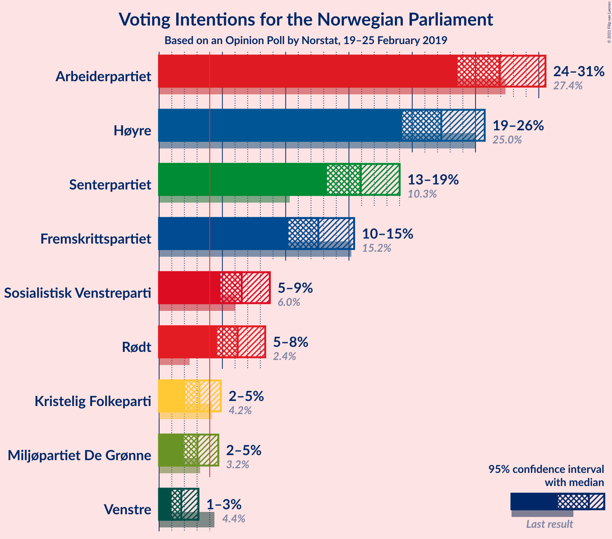

### Confidence Intervals

| Party | Last Result | Poll Result | 80% Confidence Interval | 90% Confidence Interval | 95% Confidence Interval | 99% Confidence Interval |
|:-----:|:-----------:|:-----------:|:-----------------------:|:-----------------------:|:-----------------------:|:-----------------------:|
| Arbeiderpartiet | 27.4% | 26.9% | 24.7–29.3% |24.1–29.9% |23.6–30.5% |22.6–31.7% |
| Høyre | 25.0% | 22.3% | 20.3–24.5% |19.7–25.2% |19.2–25.7% |18.3–26.8% |
| Senterpartiet | 10.3% | 15.9% | 14.2–17.9% |13.7–18.5% |13.3–19.0% |12.5–20.0% |
| Fremskrittspartiet | 15.2% | 12.6% | 11.0–14.4% |10.6–15.0% |10.2–15.4% |9.5–16.3% |
| Sosialistisk Venstreparti | 6.0% | 6.5% | 5.4–8.0% |5.1–8.4% |4.8–8.7% |4.4–9.5% |
| Rødt | 2.4% | 6.2% | 5.1–7.6% |4.8–8.0% |4.6–8.4% |4.1–9.1% |
| Kristelig Folkeparti | 4.2% | 3.2% | 2.5–4.3% |2.2–4.6% |2.1–4.9% |1.8–5.5% |
| Miljøpartiet De Grønne | 3.2% | 3.0% | 2.3–4.1% |2.1–4.4% |2.0–4.7% |1.6–5.3% |
| Venstre | 4.4% | 1.8% | 1.2–2.6% |1.1–2.9% |1.0–3.1% |0.8–3.6% |

*Note:* The poll result column reflects the actual value used in the calculations. Published results may vary slightly, and in addition be rounded to fewer digits.

## Seats

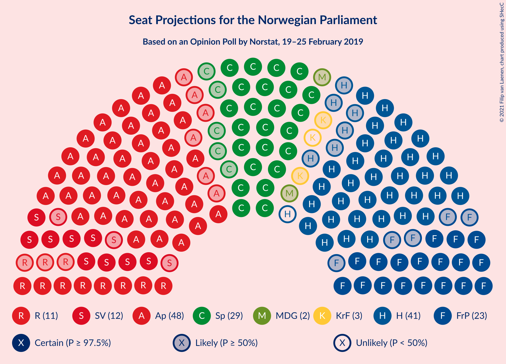

### Confidence Intervals

| Party | Last Result | Median | 80% Confidence Interval | 90% Confidence Interval | 95% Confidence Interval | 99% Confidence Interval |
|:-----:|:-----------:|:------:|:-----------------------:|:-----------------------:|:-----------------------:|:-----------------------:|
| <a href="#arbeiderpartiet">Arbeiderpartiet</a> | 49 | 48 | 44–53 |43–54 |42–55 |40–57 |
| <a href="#høyre">Høyre</a> | 45 | 40 | 36–43 |35–45 |34–46 |32–48 |
| <a href="#senterpartiet">Senterpartiet</a> | 19 | 29 | 25–33 |24–34 |24–34 |22–36 |
| <a href="#fremskrittspartiet">Fremskrittspartiet</a> | 27 | 23 | 19–26 |18–27 |18–29 |17–30 |
| <a href="#sosialistisk-venstreparti">Sosialistisk Venstreparti</a> | 11 | 12 | 10–14 |9–15 |9–16 |8–17 |
| <a href="#rødt">Rødt</a> | 1 | 11 | 9–14 |9–14 |8–15 |2–16 |
| <a href="#kristelig-folkeparti">Kristelig Folkeparti</a> | 8 | 2 | 1–7 |1–8 |0–8 |0–9 |
| <a href="#miljøpartiet-de-grønne">Miljøpartiet De Grønne</a> | 1 | 2 | 1–7 |1–8 |0–8 |0–9 |
| <a href="#venstre">Venstre</a> | 8 | 0 | 0–2 |0–2 |0–2 |0–2 |

### Arbeiderpartiet

*For a full overview of the results for this party, see the [Arbeiderpartiet](party-arbeiderpartiet.html) page.*

| Number of Seats | Probability | Accumulated | Special Marks |
|:---------------:|:-----------:|:-----------:|:-------------:|
| 39 | 0.1% | 100% |  |
| 40 | 0.4% | 99.8% |  |
| 41 | 1.3% | 99.5% |  |
| 42 | 2% | 98% |  |
| 43 | 2% | 97% |  |
| 44 | 6% | 95% |  |
| 45 | 8% | 88% |  |
| 46 | 16% | 81% |  |
| 47 | 11% | 64% |  |
| 48 | 8% | 54% | Median |
| 49 | 7% | 46% | Last Result |
| 50 | 11% | 38% |  |
| 51 | 9% | 28% |  |
| 52 | 7% | 18% |  |
| 53 | 4% | 12% |  |
| 54 | 3% | 7% |  |
| 55 | 1.5% | 4% |  |
| 56 | 1.3% | 2% |  |
| 57 | 0.6% | 1.0% |  |
| 58 | 0.3% | 0.5% |  |
| 59 | 0.1% | 0.1% |  |
| 60 | 0% | 0% |  |

### Høyre

*For a full overview of the results for this party, see the [Høyre](party-høyre.html) page.*

| Number of Seats | Probability | Accumulated | Special Marks |
|:---------------:|:-----------:|:-----------:|:-------------:|
| 30 | 0% | 100% |  |
| 31 | 0.2% | 99.9% |  |
| 32 | 0.4% | 99.8% |  |
| 33 | 1.2% | 99.4% |  |
| 34 | 1.4% | 98% |  |
| 35 | 4% | 97% |  |
| 36 | 6% | 93% |  |
| 37 | 8% | 87% |  |
| 38 | 9% | 79% |  |
| 39 | 15% | 70% |  |
| 40 | 13% | 56% | Median |
| 41 | 15% | 43% |  |
| 42 | 11% | 28% |  |
| 43 | 7% | 17% |  |
| 44 | 3% | 10% |  |
| 45 | 3% | 7% | Last Result |
| 46 | 1.5% | 4% |  |
| 47 | 1.1% | 2% |  |
| 48 | 0.6% | 1.0% |  |
| 49 | 0.1% | 0.4% |  |
| 50 | 0.2% | 0.2% |  |
| 51 | 0% | 0% |  |

### Senterpartiet

*For a full overview of the results for this party, see the [Senterpartiet](party-senterpartiet.html) page.*

| Number of Seats | Probability | Accumulated | Special Marks |
|:---------------:|:-----------:|:-----------:|:-------------:|
| 19 | 0% | 100% | Last Result |
| 20 | 0% | 100% |  |
| 21 | 0.2% | 99.9% |  |
| 22 | 0.6% | 99.7% |  |
| 23 | 2% | 99.1% |  |
| 24 | 3% | 98% |  |
| 25 | 5% | 94% |  |
| 26 | 10% | 90% |  |
| 27 | 15% | 79% |  |
| 28 | 13% | 64% |  |
| 29 | 10% | 51% | Median |
| 30 | 8% | 42% |  |
| 31 | 9% | 34% |  |
| 32 | 4% | 25% |  |
| 33 | 11% | 21% |  |
| 34 | 8% | 10% |  |
| 35 | 1.0% | 2% |  |
| 36 | 0.4% | 0.8% |  |
| 37 | 0.3% | 0.4% |  |
| 38 | 0.1% | 0.1% |  |
| 39 | 0% | 0% |  |

### Fremskrittspartiet

*For a full overview of the results for this party, see the [Fremskrittspartiet](party-fremskrittspartiet.html) page.*

| Number of Seats | Probability | Accumulated | Special Marks |
|:---------------:|:-----------:|:-----------:|:-------------:|
| 15 | 0.1% | 100% |  |
| 16 | 0.4% | 99.9% |  |
| 17 | 1.4% | 99.6% |  |
| 18 | 4% | 98% |  |
| 19 | 6% | 95% |  |
| 20 | 9% | 88% |  |
| 21 | 14% | 79% |  |
| 22 | 10% | 65% |  |
| 23 | 15% | 55% | Median |
| 24 | 16% | 39% |  |
| 25 | 10% | 23% |  |
| 26 | 5% | 13% |  |
| 27 | 3% | 8% | Last Result |
| 28 | 2% | 4% |  |
| 29 | 2% | 3% |  |
| 30 | 0.6% | 0.8% |  |
| 31 | 0.2% | 0.2% |  |
| 32 | 0% | 0% |  |

### Sosialistisk Venstreparti

*For a full overview of the results for this party, see the [Sosialistisk Venstreparti](party-sosialistiskvenstreparti.html) page.*

| Number of Seats | Probability | Accumulated | Special Marks |
|:---------------:|:-----------:|:-----------:|:-------------:|
| 2 | 0.1% | 100% |  |
| 3 | 0% | 99.9% |  |
| 4 | 0% | 99.9% |  |
| 5 | 0% | 99.9% |  |
| 6 | 0% | 99.9% |  |
| 7 | 0.1% | 99.9% |  |
| 8 | 2% | 99.8% |  |
| 9 | 6% | 98% |  |
| 10 | 17% | 92% |  |
| 11 | 16% | 75% | Last Result |
| 12 | 24% | 59% | Median |
| 13 | 16% | 35% |  |
| 14 | 12% | 20% |  |
| 15 | 3% | 8% |  |
| 16 | 4% | 5% |  |
| 17 | 0.6% | 0.8% |  |
| 18 | 0.2% | 0.2% |  |
| 19 | 0% | 0.1% |  |
| 20 | 0% | 0% |  |

### Rødt

*For a full overview of the results for this party, see the [Rødt](party-rødt.html) page.*

| Number of Seats | Probability | Accumulated | Special Marks |
|:---------------:|:-----------:|:-----------:|:-------------:|
| 1 | 0% | 100% | Last Result |
| 2 | 0.5% | 100% |  |
| 3 | 0% | 99.5% |  |
| 4 | 0% | 99.5% |  |
| 5 | 0% | 99.5% |  |
| 6 | 0% | 99.5% |  |
| 7 | 0.3% | 99.5% |  |
| 8 | 3% | 99.2% |  |
| 9 | 11% | 96% |  |
| 10 | 19% | 84% |  |
| 11 | 20% | 66% | Median |
| 12 | 16% | 45% |  |
| 13 | 16% | 30% |  |
| 14 | 9% | 13% |  |
| 15 | 3% | 5% |  |
| 16 | 0.9% | 1.2% |  |
| 17 | 0.3% | 0.4% |  |
| 18 | 0.1% | 0.1% |  |
| 19 | 0% | 0% |  |

### Kristelig Folkeparti

*For a full overview of the results for this party, see the [Kristelig Folkeparti](party-kristeligfolkeparti.html) page.*

| Number of Seats | Probability | Accumulated | Special Marks |
|:---------------:|:-----------:|:-----------:|:-------------:|
| 0 | 4% | 100% |  |
| 1 | 38% | 96% |  |
| 2 | 14% | 57% | Median |
| 3 | 29% | 43% |  |
| 4 | 0% | 15% |  |
| 5 | 0% | 15% |  |
| 6 | 0% | 15% |  |
| 7 | 6% | 15% |  |
| 8 | 6% | 9% | Last Result |
| 9 | 2% | 2% |  |
| 10 | 0.4% | 0.5% |  |
| 11 | 0.1% | 0.1% |  |
| 12 | 0% | 0% |  |

### Miljøpartiet De Grønne

*For a full overview of the results for this party, see the [Miljøpartiet De Grønne](party-miljøpartietdegrønne.html) page.*

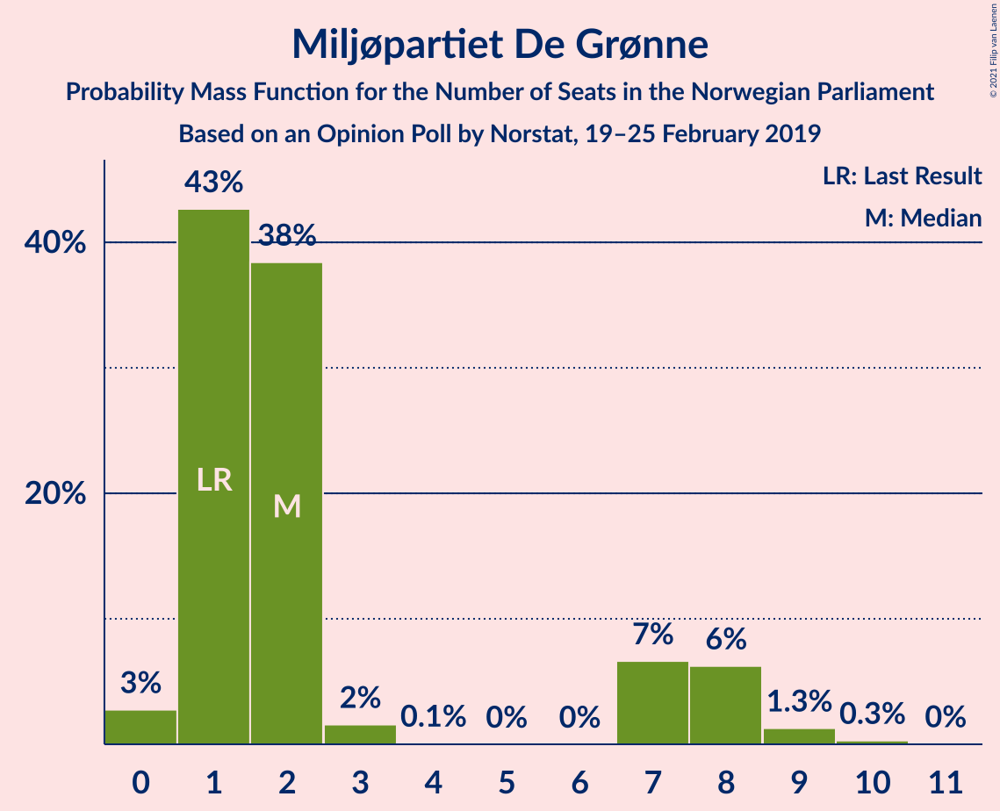

| Number of Seats | Probability | Accumulated | Special Marks |
|:---------------:|:-----------:|:-----------:|:-------------:|
| 0 | 3% | 100% |  |
| 1 | 43% | 97% | Last Result |
| 2 | 38% | 55% | Median |
| 3 | 2% | 16% |  |
| 4 | 0.1% | 15% |  |
| 5 | 0% | 15% |  |
| 6 | 0% | 15% |  |
| 7 | 7% | 15% |  |
| 8 | 6% | 8% |  |
| 9 | 1.3% | 2% |  |
| 10 | 0.3% | 0.3% |  |
| 11 | 0% | 0% |  |

### Venstre

*For a full overview of the results for this party, see the [Venstre](party-venstre.html) page.*

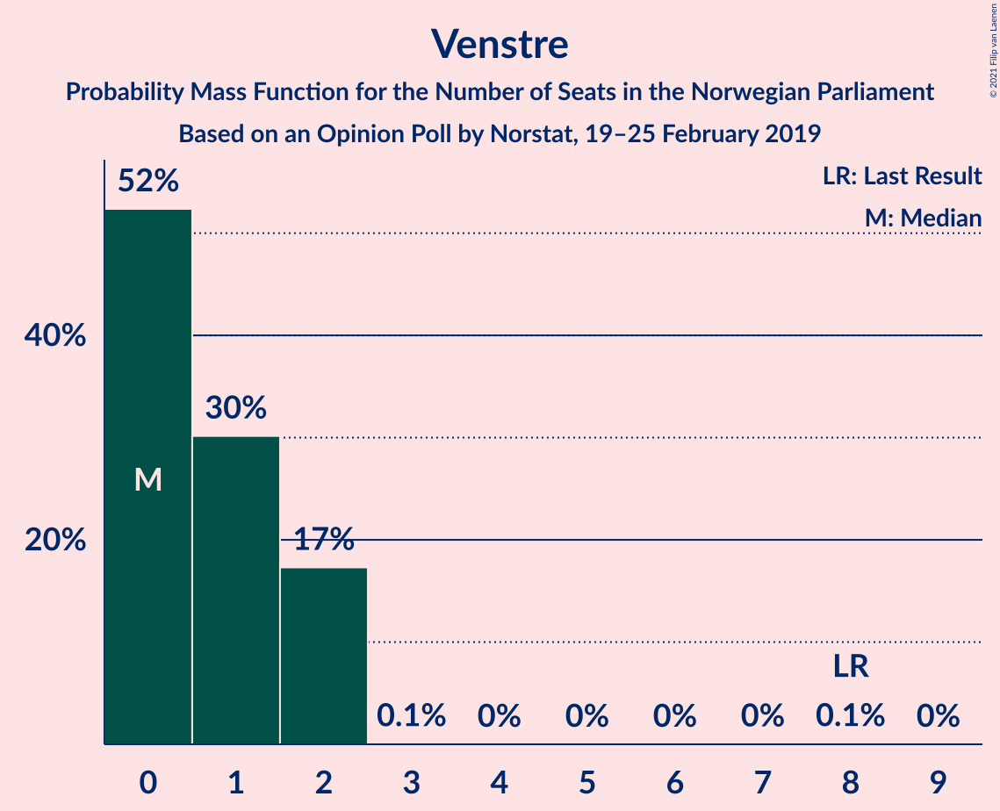

| Number of Seats | Probability | Accumulated | Special Marks |
|:---------------:|:-----------:|:-----------:|:-------------:|
| 0 | 52% | 100% | Median |
| 1 | 30% | 48% |  |
| 2 | 17% | 17% |  |
| 3 | 0.1% | 0.2% |  |
| 4 | 0% | 0.1% |  |
| 5 | 0% | 0.1% |  |
| 6 | 0% | 0.1% |  |
| 7 | 0% | 0.1% |  |
| 8 | 0.1% | 0.1% | Last Result |
| 9 | 0% | 0% |  |

## Coalitions

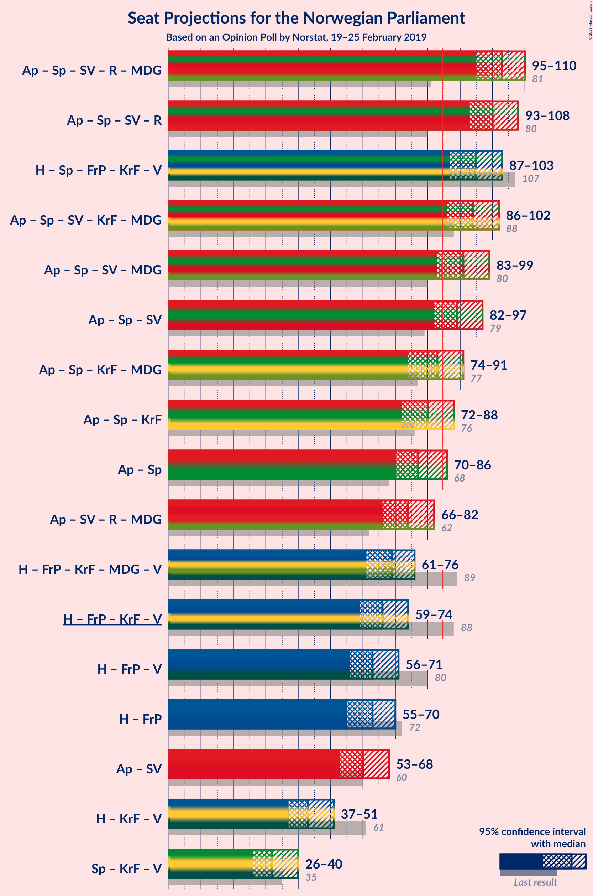

### Confidence Intervals

| Coalition | Last Result | Median | Majority? | 80% Confidence Interval | 90% Confidence Interval | 95% Confidence Interval | 99% Confidence Interval |
|:---------:|:-----------:|:------:|:---------:|:-----------------------:|:-----------------------:|:-----------------------:|:-----------------------:|
| Arbeiderpartiet – Senterpartiet – Sosialistisk Venstreparti – Rødt – Miljøpartiet De Grønne | 81 | 103 | 100% | 98–108 | 96–109 | 95–110 | 92–113 |
| Arbeiderpartiet – Senterpartiet – Sosialistisk Venstreparti – Rødt | 80 | 100 | 100% | 95–106 | 94–107 | 93–108 | 91–110 |
| Høyre – Senterpartiet – Fremskrittspartiet – Kristelig Folkeparti – Venstre | 107 | 95 | 99.4% | 90–100 | 88–101 | 87–103 | 84–105 |
| Arbeiderpartiet – Senterpartiet – Sosialistisk Venstreparti – Kristelig Folkeparti – Miljøpartiet De Grønne | 88 | 94 | 99.1% | 89–100 | 87–101 | 86–102 | 84–105 |
| Arbeiderpartiet – Senterpartiet – Sosialistisk Venstreparti – Miljøpartiet De Grønne | 80 | 91 | 95% | 86–97 | 85–98 | 83–99 | 81–101 |
| Arbeiderpartiet – Senterpartiet – Sosialistisk Venstreparti | 79 | 89 | 87% | 84–94 | 82–96 | 82–97 | 79–99 |
| Arbeiderpartiet – Senterpartiet – Kristelig Folkeparti – Miljøpartiet De Grønne | 77 | 83 | 34% | 77–89 | 75–89 | 74–91 | 72–93 |
| Arbeiderpartiet – Senterpartiet – Kristelig Folkeparti | 76 | 80 | 17% | 75–86 | 74–87 | 72–88 | 70–91 |
| Arbeiderpartiet – Senterpartiet | 68 | 77 | 4% | 72–84 | 71–84 | 70–86 | 68–87 |
| Arbeiderpartiet – Sosialistisk Venstreparti – Rødt – Miljøpartiet De Grønne | 62 | 74 | 0.6% | 69–79 | 68–81 | 66–82 | 64–85 |
| Høyre – Fremskrittspartiet – Kristelig Folkeparti – Miljøpartiet De Grønne – Venstre | 89 | 69 | 0% | 63–74 | 62–75 | 61–76 | 59–78 |
| Høyre – Fremskrittspartiet – Kristelig Folkeparti – Venstre | 88 | 66 | 0% | 61–71 | 60–73 | 59–74 | 56–77 |
| Høyre – Fremskrittspartiet – Venstre | 80 | 63 | 0% | 59–68 | 57–69 | 56–71 | 54–73 |
| Høyre – Fremskrittspartiet | 72 | 63 | 0% | 58–67 | 57–69 | 55–70 | 53–73 |
| Arbeiderpartiet – Sosialistisk Venstreparti | 60 | 60 | 0% | 56–65 | 54–67 | 53–68 | 52–70 |
| Høyre – Kristelig Folkeparti – Venstre | 61 | 43 | 0% | 39–48 | 38–49 | 37–51 | 34–53 |
| Senterpartiet – Kristelig Folkeparti – Venstre | 35 | 32 | 0% | 28–37 | 27–38 | 26–40 | 24–43 |

### Arbeiderpartiet – Senterpartiet – Sosialistisk Venstreparti – Rødt – Miljøpartiet De Grønne

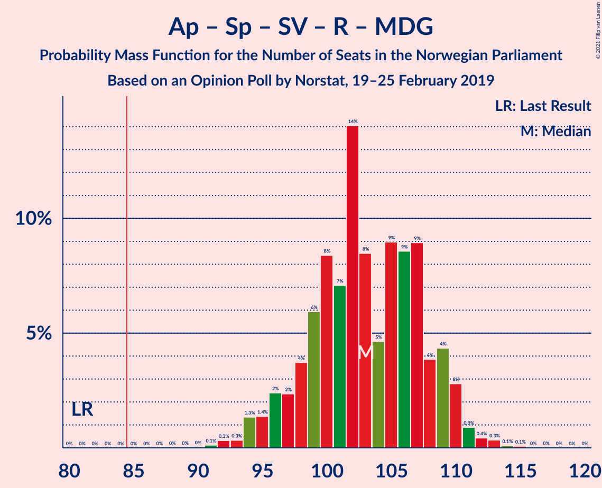

| Number of Seats | Probability | Accumulated | Special Marks |
|:---------------:|:-----------:|:-----------:|:-------------:|
| 81 | 0% | 100% | Last Result |
| 82 | 0% | 100% |  |
| 83 | 0% | 100% |  |
| 84 | 0% | 100% |  |
| 85 | 0% | 100% | Majority |
| 86 | 0% | 100% |  |
| 87 | 0% | 100% |  |
| 88 | 0% | 100% |  |
| 89 | 0% | 100% |  |
| 90 | 0% | 100% |  |
| 91 | 0.1% | 99.9% |  |
| 92 | 0.3% | 99.8% |  |
| 93 | 0.3% | 99.5% |  |
| 94 | 1.3% | 99.1% |  |
| 95 | 1.4% | 98% |  |
| 96 | 2% | 96% |  |
| 97 | 2% | 94% |  |
| 98 | 4% | 92% |  |
| 99 | 6% | 88% |  |
| 100 | 8% | 82% |  |
| 101 | 7% | 74% |  |
| 102 | 14% | 67% | Median |
| 103 | 8% | 52% |  |
| 104 | 5% | 44% |  |
| 105 | 9% | 39% |  |
| 106 | 9% | 30% |  |
| 107 | 9% | 22% |  |
| 108 | 4% | 13% |  |
| 109 | 4% | 9% |  |
| 110 | 3% | 5% |  |
| 111 | 0.9% | 2% |  |
| 112 | 0.4% | 1.0% |  |
| 113 | 0.3% | 0.5% |  |
| 114 | 0.1% | 0.2% |  |
| 115 | 0.1% | 0.1% |  |
| 116 | 0% | 0% |  |

### Arbeiderpartiet – Senterpartiet – Sosialistisk Venstreparti – Rødt

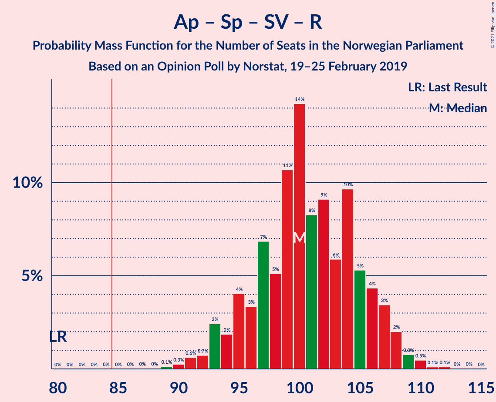

| Number of Seats | Probability | Accumulated | Special Marks |
|:---------------:|:-----------:|:-----------:|:-------------:|
| 80 | 0% | 100% | Last Result |
| 81 | 0% | 100% |  |
| 82 | 0% | 100% |  |
| 83 | 0% | 100% |  |
| 84 | 0% | 100% |  |
| 85 | 0% | 100% | Majority |
| 86 | 0% | 100% |  |
| 87 | 0% | 100% |  |
| 88 | 0% | 99.9% |  |
| 89 | 0.1% | 99.9% |  |
| 90 | 0.3% | 99.8% |  |
| 91 | 0.6% | 99.5% |  |
| 92 | 0.7% | 98.9% |  |
| 93 | 2% | 98% |  |
| 94 | 2% | 96% |  |
| 95 | 4% | 94% |  |
| 96 | 3% | 90% |  |
| 97 | 7% | 86% |  |
| 98 | 5% | 80% |  |
| 99 | 11% | 75% |  |
| 100 | 14% | 64% | Median |
| 101 | 8% | 50% |  |
| 102 | 9% | 41% |  |
| 103 | 6% | 32% |  |
| 104 | 10% | 26% |  |
| 105 | 5% | 17% |  |
| 106 | 4% | 11% |  |
| 107 | 3% | 7% |  |
| 108 | 2% | 4% |  |
| 109 | 0.8% | 2% |  |
| 110 | 0.5% | 0.8% |  |
| 111 | 0.1% | 0.3% |  |
| 112 | 0.1% | 0.2% |  |
| 113 | 0% | 0.1% |  |
| 114 | 0% | 0% |  |

### Høyre – Senterpartiet – Fremskrittspartiet – Kristelig Folkeparti – Venstre

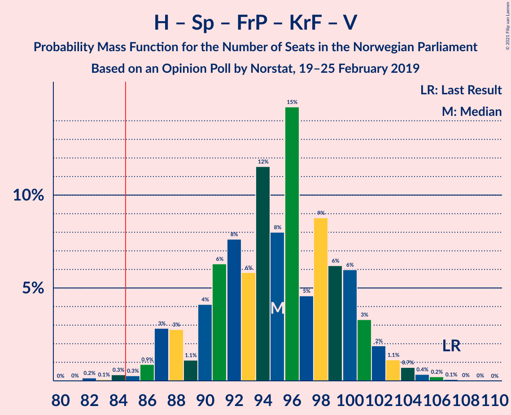

| Number of Seats | Probability | Accumulated | Special Marks |
|:---------------:|:-----------:|:-----------:|:-------------:|
| 82 | 0.2% | 100% |  |
| 83 | 0.1% | 99.8% |  |
| 84 | 0.3% | 99.7% |  |
| 85 | 0.3% | 99.4% | Majority |
| 86 | 0.9% | 99.1% |  |
| 87 | 3% | 98% |  |
| 88 | 3% | 95% |  |
| 89 | 1.1% | 93% |  |
| 90 | 4% | 92% |  |
| 91 | 6% | 87% |  |
| 92 | 8% | 81% |  |
| 93 | 6% | 73% |  |
| 94 | 12% | 68% | Median |
| 95 | 8% | 56% |  |
| 96 | 15% | 48% |  |
| 97 | 5% | 33% |  |
| 98 | 9% | 29% |  |
| 99 | 6% | 20% |  |
| 100 | 6% | 14% |  |
| 101 | 3% | 8% |  |
| 102 | 2% | 4% |  |
| 103 | 1.1% | 3% |  |
| 104 | 0.7% | 1.5% |  |
| 105 | 0.4% | 0.7% |  |
| 106 | 0.2% | 0.4% |  |
| 107 | 0.1% | 0.2% | Last Result |
| 108 | 0% | 0.1% |  |
| 109 | 0% | 0% |  |

### Arbeiderpartiet – Senterpartiet – Sosialistisk Venstreparti – Kristelig Folkeparti – Miljøpartiet De Grønne

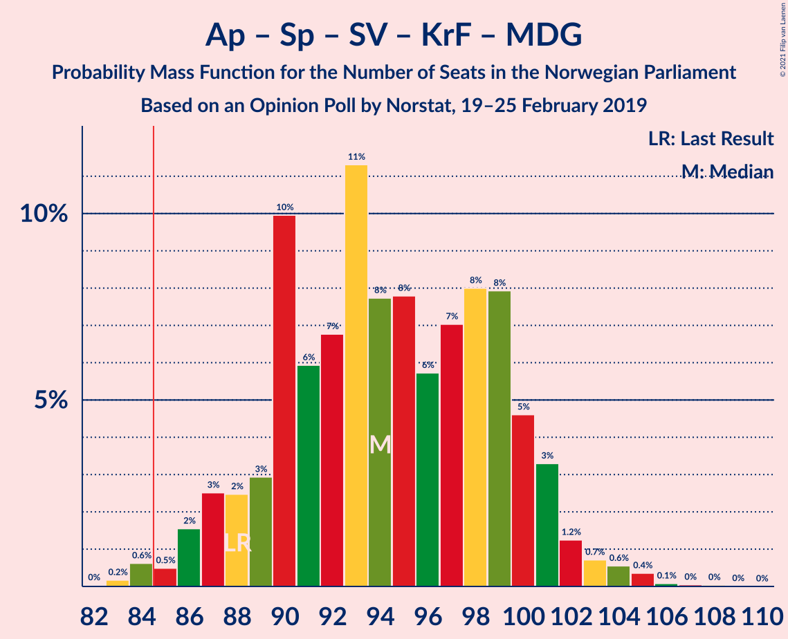

| Number of Seats | Probability | Accumulated | Special Marks |
|:---------------:|:-----------:|:-----------:|:-------------:|
| 82 | 0% | 100% |  |
| 83 | 0.2% | 99.9% |  |
| 84 | 0.6% | 99.8% |  |
| 85 | 0.5% | 99.1% | Majority |
| 86 | 2% | 98.6% |  |
| 87 | 3% | 97% |  |
| 88 | 2% | 95% | Last Result |
| 89 | 3% | 92% |  |
| 90 | 10% | 89% |  |
| 91 | 6% | 79% |  |
| 92 | 7% | 73% |  |
| 93 | 11% | 67% | Median |
| 94 | 8% | 55% |  |
| 95 | 8% | 47% |  |
| 96 | 6% | 40% |  |
| 97 | 7% | 34% |  |
| 98 | 8% | 27% |  |
| 99 | 8% | 19% |  |
| 100 | 5% | 11% |  |
| 101 | 3% | 6% |  |
| 102 | 1.2% | 3% |  |
| 103 | 0.7% | 2% |  |
| 104 | 0.6% | 1.1% |  |
| 105 | 0.4% | 0.5% |  |
| 106 | 0.1% | 0.2% |  |
| 107 | 0% | 0.1% |  |
| 108 | 0% | 0.1% |  |
| 109 | 0% | 0% |  |

### Arbeiderpartiet – Senterpartiet – Sosialistisk Venstreparti – Miljøpartiet De Grønne

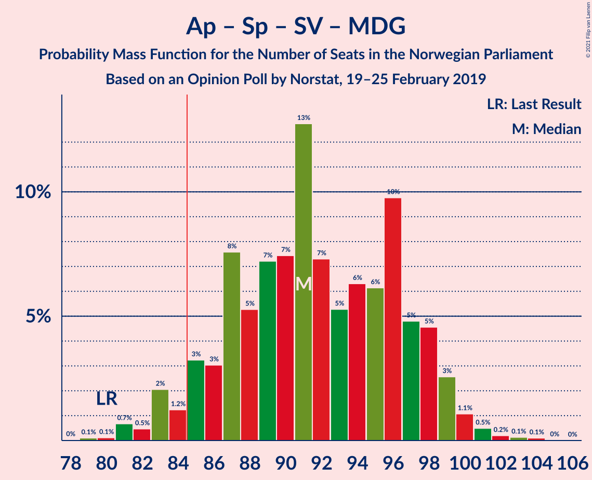

| Number of Seats | Probability | Accumulated | Special Marks |
|:---------------:|:-----------:|:-----------:|:-------------:|
| 79 | 0.1% | 100% |  |
| 80 | 0.1% | 99.9% | Last Result |
| 81 | 0.7% | 99.7% |  |
| 82 | 0.5% | 99.1% |  |
| 83 | 2% | 98.6% |  |
| 84 | 1.2% | 97% |  |
| 85 | 3% | 95% | Majority |
| 86 | 3% | 92% |  |
| 87 | 8% | 89% |  |
| 88 | 5% | 81% |  |
| 89 | 7% | 76% |  |
| 90 | 7% | 69% |  |
| 91 | 13% | 62% | Median |
| 92 | 7% | 49% |  |
| 93 | 5% | 41% |  |
| 94 | 6% | 36% |  |
| 95 | 6% | 30% |  |
| 96 | 10% | 24% |  |
| 97 | 5% | 14% |  |
| 98 | 5% | 9% |  |
| 99 | 3% | 5% |  |
| 100 | 1.1% | 2% |  |
| 101 | 0.5% | 1.0% |  |
| 102 | 0.2% | 0.5% |  |
| 103 | 0.1% | 0.3% |  |
| 104 | 0.1% | 0.1% |  |
| 105 | 0% | 0% |  |

### Arbeiderpartiet – Senterpartiet – Sosialistisk Venstreparti

| Number of Seats | Probability | Accumulated | Special Marks |
|:---------------:|:-----------:|:-----------:|:-------------:|
| 76 | 0% | 100% |  |
| 77 | 0.1% | 99.9% |  |
| 78 | 0.1% | 99.9% |  |
| 79 | 0.3% | 99.7% | Last Result |
| 80 | 0.9% | 99.4% |  |
| 81 | 0.8% | 98.5% |  |
| 82 | 3% | 98% |  |
| 83 | 2% | 95% |  |
| 84 | 5% | 92% |  |
| 85 | 3% | 87% | Majority |
| 86 | 8% | 84% |  |
| 87 | 6% | 76% |  |
| 88 | 12% | 69% |  |
| 89 | 11% | 58% | Median |
| 90 | 9% | 46% |  |
| 91 | 8% | 37% |  |
| 92 | 7% | 29% |  |
| 93 | 3% | 23% |  |
| 94 | 10% | 20% |  |
| 95 | 3% | 10% |  |
| 96 | 3% | 7% |  |
| 97 | 2% | 4% |  |
| 98 | 1.3% | 2% |  |
| 99 | 0.3% | 0.7% |  |
| 100 | 0.2% | 0.4% |  |
| 101 | 0.1% | 0.1% |  |
| 102 | 0% | 0.1% |  |
| 103 | 0% | 0% |  |

### Arbeiderpartiet – Senterpartiet – Kristelig Folkeparti – Miljøpartiet De Grønne

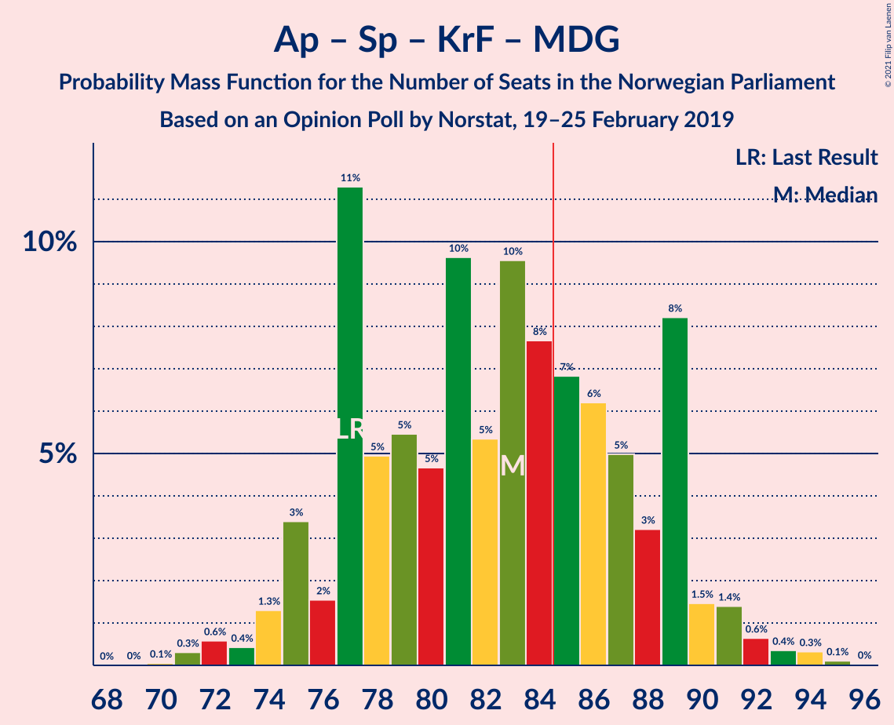

| Number of Seats | Probability | Accumulated | Special Marks |
|:---------------:|:-----------:|:-----------:|:-------------:|
| 70 | 0.1% | 100% |  |
| 71 | 0.3% | 99.9% |  |
| 72 | 0.6% | 99.6% |  |
| 73 | 0.4% | 99.0% |  |
| 74 | 1.3% | 98.6% |  |
| 75 | 3% | 97% |  |
| 76 | 2% | 94% |  |
| 77 | 11% | 92% | Last Result |
| 78 | 5% | 81% |  |
| 79 | 5% | 76% |  |
| 80 | 5% | 71% |  |
| 81 | 10% | 66% | Median |
| 82 | 5% | 56% |  |
| 83 | 10% | 51% |  |
| 84 | 8% | 41% |  |
| 85 | 7% | 34% | Majority |
| 86 | 6% | 27% |  |
| 87 | 5% | 21% |  |
| 88 | 3% | 16% |  |
| 89 | 8% | 13% |  |
| 90 | 1.5% | 4% |  |
| 91 | 1.4% | 3% |  |
| 92 | 0.6% | 1.5% |  |
| 93 | 0.4% | 0.8% |  |
| 94 | 0.3% | 0.5% |  |
| 95 | 0.1% | 0.2% |  |
| 96 | 0% | 0% |  |

### Arbeiderpartiet – Senterpartiet – Kristelig Folkeparti

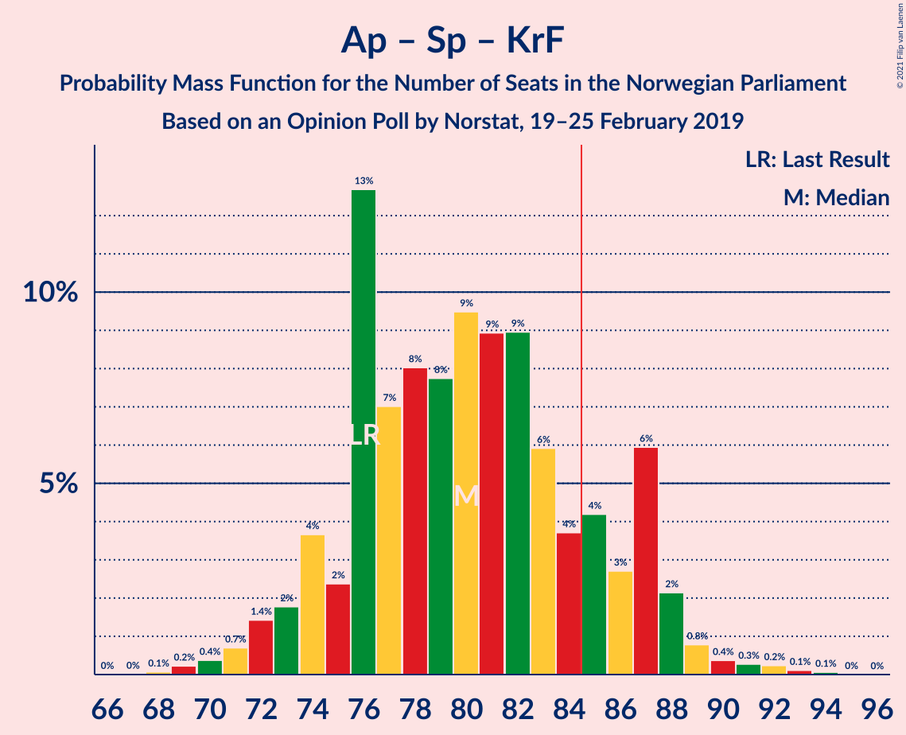

| Number of Seats | Probability | Accumulated | Special Marks |
|:---------------:|:-----------:|:-----------:|:-------------:|
| 68 | 0.1% | 100% |  |
| 69 | 0.2% | 99.9% |  |
| 70 | 0.4% | 99.7% |  |
| 71 | 0.7% | 99.3% |  |
| 72 | 1.4% | 98.6% |  |
| 73 | 2% | 97% |  |
| 74 | 4% | 95% |  |
| 75 | 2% | 92% |  |
| 76 | 13% | 89% | Last Result |
| 77 | 7% | 77% |  |
| 78 | 8% | 70% |  |
| 79 | 8% | 62% | Median |
| 80 | 9% | 54% |  |
| 81 | 9% | 44% |  |
| 82 | 9% | 35% |  |
| 83 | 6% | 26% |  |
| 84 | 4% | 21% |  |
| 85 | 4% | 17% | Majority |
| 86 | 3% | 13% |  |
| 87 | 6% | 10% |  |
| 88 | 2% | 4% |  |
| 89 | 0.8% | 2% |  |
| 90 | 0.4% | 1.1% |  |
| 91 | 0.3% | 0.7% |  |
| 92 | 0.2% | 0.4% |  |
| 93 | 0.1% | 0.2% |  |
| 94 | 0.1% | 0.1% |  |
| 95 | 0% | 0% |  |

### Arbeiderpartiet – Senterpartiet

| Number of Seats | Probability | Accumulated | Special Marks |
|:---------------:|:-----------:|:-----------:|:-------------:|
| 65 | 0.1% | 100% |  |
| 66 | 0.1% | 99.9% |  |
| 67 | 0.1% | 99.8% |  |
| 68 | 1.0% | 99.6% | Last Result |
| 69 | 0.9% | 98.6% |  |
| 70 | 2% | 98% |  |
| 71 | 4% | 96% |  |
| 72 | 3% | 92% |  |
| 73 | 10% | 89% |  |
| 74 | 5% | 79% |  |
| 75 | 8% | 74% |  |
| 76 | 9% | 66% |  |
| 77 | 9% | 57% | Median |
| 78 | 9% | 48% |  |
| 79 | 9% | 39% |  |
| 80 | 6% | 30% |  |
| 81 | 6% | 24% |  |
| 82 | 6% | 19% |  |
| 83 | 2% | 12% |  |
| 84 | 6% | 11% |  |
| 85 | 1.1% | 4% | Majority |
| 86 | 2% | 3% |  |
| 87 | 0.7% | 1.1% |  |
| 88 | 0.3% | 0.4% |  |
| 89 | 0.1% | 0.1% |  |
| 90 | 0% | 0% |  |

### Arbeiderpartiet – Sosialistisk Venstreparti – Rødt – Miljøpartiet De Grønne

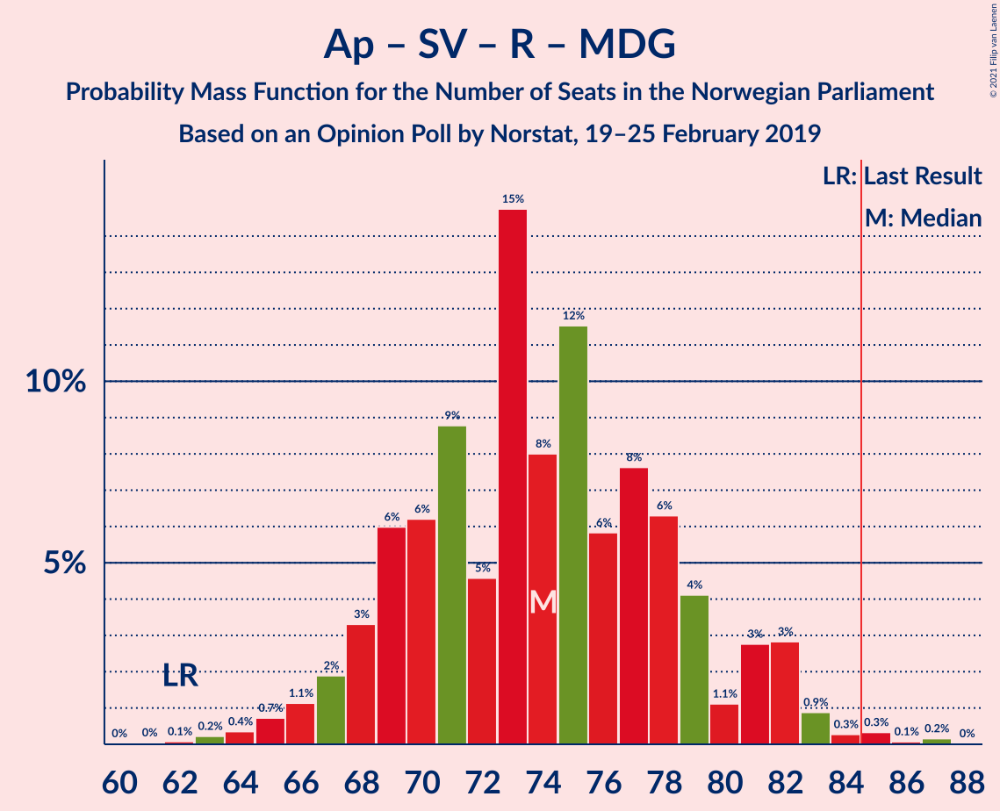

| Number of Seats | Probability | Accumulated | Special Marks |
|:---------------:|:-----------:|:-----------:|:-------------:|
| 61 | 0% | 100% |  |
| 62 | 0.1% | 99.9% | Last Result |
| 63 | 0.2% | 99.8% |  |
| 64 | 0.4% | 99.6% |  |
| 65 | 0.7% | 99.3% |  |
| 66 | 1.1% | 98.5% |  |
| 67 | 2% | 97% |  |
| 68 | 3% | 96% |  |
| 69 | 6% | 92% |  |
| 70 | 6% | 86% |  |
| 71 | 9% | 80% |  |
| 72 | 5% | 71% |  |
| 73 | 15% | 67% | Median |
| 74 | 8% | 52% |  |
| 75 | 12% | 44% |  |
| 76 | 6% | 32% |  |
| 77 | 8% | 27% |  |
| 78 | 6% | 19% |  |
| 79 | 4% | 13% |  |
| 80 | 1.1% | 8% |  |
| 81 | 3% | 7% |  |
| 82 | 3% | 5% |  |
| 83 | 0.9% | 2% |  |
| 84 | 0.3% | 0.9% |  |
| 85 | 0.3% | 0.6% | Majority |
| 86 | 0.1% | 0.3% |  |
| 87 | 0.2% | 0.2% |  |
| 88 | 0% | 0% |  |

### Høyre – Fremskrittspartiet – Kristelig Folkeparti – Miljøpartiet De Grønne – Venstre

| Number of Seats | Probability | Accumulated | Special Marks |
|:---------------:|:-----------:|:-----------:|:-------------:|
| 56 | 0% | 100% |  |
| 57 | 0.1% | 99.9% |  |
| 58 | 0.1% | 99.8% |  |
| 59 | 0.5% | 99.7% |  |
| 60 | 0.8% | 99.2% |  |
| 61 | 2% | 98% |  |
| 62 | 3% | 96% |  |
| 63 | 4% | 93% |  |
| 64 | 5% | 89% |  |
| 65 | 10% | 83% |  |
| 66 | 6% | 74% |  |
| 67 | 9% | 68% | Median |
| 68 | 8% | 59% |  |
| 69 | 14% | 50% |  |
| 70 | 11% | 36% |  |
| 71 | 5% | 25% |  |
| 72 | 7% | 20% |  |
| 73 | 3% | 14% |  |
| 74 | 4% | 10% |  |
| 75 | 2% | 6% |  |
| 76 | 2% | 4% |  |
| 77 | 0.7% | 2% |  |
| 78 | 0.6% | 1.1% |  |
| 79 | 0.3% | 0.5% |  |
| 80 | 0.1% | 0.2% |  |
| 81 | 0% | 0.1% |  |
| 82 | 0% | 0.1% |  |
| 83 | 0% | 0% |  |
| 84 | 0% | 0% |  |
| 85 | 0% | 0% | Majority |
| 86 | 0% | 0% |  |
| 87 | 0% | 0% |  |
| 88 | 0% | 0% |  |
| 89 | 0% | 0% | Last Result |

### Høyre – Fremskrittspartiet – Kristelig Folkeparti – Venstre

| Number of Seats | Probability | Accumulated | Special Marks |
|:---------------:|:-----------:|:-----------:|:-------------:|
| 54 | 0.1% | 100% |  |
| 55 | 0.1% | 99.9% |  |
| 56 | 0.3% | 99.8% |  |
| 57 | 0.4% | 99.5% |  |
| 58 | 0.9% | 99.0% |  |
| 59 | 3% | 98% |  |
| 60 | 4% | 95% |  |
| 61 | 4% | 91% |  |
| 62 | 9% | 87% |  |
| 63 | 9% | 78% |  |
| 64 | 9% | 70% |  |
| 65 | 5% | 61% | Median |
| 66 | 8% | 56% |  |
| 67 | 14% | 47% |  |
| 68 | 7% | 33% |  |
| 69 | 8% | 26% |  |
| 70 | 6% | 18% |  |
| 71 | 4% | 12% |  |
| 72 | 2% | 8% |  |
| 73 | 2% | 6% |  |
| 74 | 1.4% | 4% |  |
| 75 | 1.3% | 2% |  |
| 76 | 0.3% | 0.9% |  |
| 77 | 0.3% | 0.5% |  |
| 78 | 0.1% | 0.2% |  |
| 79 | 0% | 0.1% |  |
| 80 | 0% | 0% |  |
| 81 | 0% | 0% |  |
| 82 | 0% | 0% |  |
| 83 | 0% | 0% |  |
| 84 | 0% | 0% |  |
| 85 | 0% | 0% | Majority |
| 86 | 0% | 0% |  |
| 87 | 0% | 0% |  |
| 88 | 0% | 0% | Last Result |

### Høyre – Fremskrittspartiet – Venstre

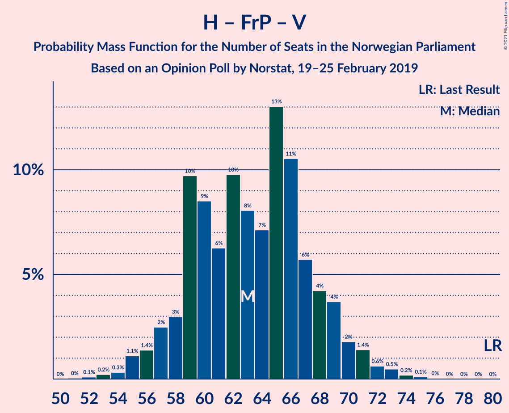

| Number of Seats | Probability | Accumulated | Special Marks |
|:---------------:|:-----------:|:-----------:|:-------------:|
| 51 | 0% | 100% |  |
| 52 | 0.1% | 99.9% |  |
| 53 | 0.2% | 99.8% |  |
| 54 | 0.3% | 99.6% |  |
| 55 | 1.1% | 99.3% |  |
| 56 | 1.4% | 98% |  |
| 57 | 2% | 97% |  |
| 58 | 3% | 94% |  |
| 59 | 10% | 91% |  |
| 60 | 9% | 82% |  |
| 61 | 6% | 73% |  |
| 62 | 10% | 67% |  |
| 63 | 8% | 57% | Median |
| 64 | 7% | 49% |  |
| 65 | 13% | 42% |  |
| 66 | 11% | 29% |  |
| 67 | 6% | 18% |  |
| 68 | 4% | 13% |  |
| 69 | 4% | 8% |  |
| 70 | 2% | 5% |  |
| 71 | 1.4% | 3% |  |
| 72 | 0.6% | 1.5% |  |
| 73 | 0.5% | 0.8% |  |
| 74 | 0.2% | 0.4% |  |
| 75 | 0.1% | 0.2% |  |
| 76 | 0% | 0.1% |  |
| 77 | 0% | 0% |  |
| 78 | 0% | 0% |  |
| 79 | 0% | 0% |  |
| 80 | 0% | 0% | Last Result |

### Høyre – Fremskrittspartiet

| Number of Seats | Probability | Accumulated | Special Marks |
|:---------------:|:-----------:|:-----------:|:-------------:|
| 51 | 0.1% | 100% |  |
| 52 | 0.1% | 99.9% |  |
| 53 | 0.4% | 99.8% |  |
| 54 | 0.8% | 99.3% |  |
| 55 | 2% | 98.6% |  |
| 56 | 2% | 97% |  |
| 57 | 4% | 95% |  |
| 58 | 5% | 92% |  |
| 59 | 8% | 87% |  |
| 60 | 12% | 79% |  |
| 61 | 7% | 67% |  |
| 62 | 10% | 60% |  |
| 63 | 9% | 50% | Median |
| 64 | 7% | 42% |  |
| 65 | 11% | 34% |  |
| 66 | 10% | 23% |  |
| 67 | 3% | 13% |  |
| 68 | 3% | 10% |  |
| 69 | 3% | 7% |  |
| 70 | 2% | 3% |  |
| 71 | 0.8% | 2% |  |
| 72 | 0.5% | 1.0% | Last Result |
| 73 | 0.3% | 0.5% |  |
| 74 | 0.1% | 0.2% |  |
| 75 | 0.1% | 0.1% |  |
| 76 | 0% | 0% |  |

### Arbeiderpartiet – Sosialistisk Venstreparti

| Number of Seats | Probability | Accumulated | Special Marks |
|:---------------:|:-----------:|:-----------:|:-------------:|
| 49 | 0% | 100% |  |
| 50 | 0.2% | 99.9% |  |
| 51 | 0.2% | 99.8% |  |
| 52 | 0.6% | 99.5% |  |
| 53 | 2% | 98.9% |  |
| 54 | 2% | 97% |  |
| 55 | 3% | 95% |  |
| 56 | 9% | 92% |  |
| 57 | 8% | 84% |  |
| 58 | 8% | 75% |  |
| 59 | 12% | 68% |  |
| 60 | 7% | 55% | Last Result, Median |
| 61 | 14% | 49% |  |
| 62 | 9% | 35% |  |
| 63 | 8% | 26% |  |
| 64 | 6% | 18% |  |
| 65 | 4% | 12% |  |
| 66 | 2% | 8% |  |
| 67 | 2% | 5% |  |
| 68 | 3% | 4% |  |
| 69 | 0.6% | 1.2% |  |
| 70 | 0.3% | 0.6% |  |
| 71 | 0.1% | 0.3% |  |
| 72 | 0.1% | 0.2% |  |
| 73 | 0% | 0% |  |

### Høyre – Kristelig Folkeparti – Venstre

| Number of Seats | Probability | Accumulated | Special Marks |
|:---------------:|:-----------:|:-----------:|:-------------:|
| 33 | 0.1% | 100% |  |
| 34 | 0.4% | 99.9% |  |
| 35 | 0.7% | 99.5% |  |
| 36 | 0.9% | 98.8% |  |
| 37 | 2% | 98% |  |
| 38 | 4% | 96% |  |
| 39 | 5% | 92% |  |
| 40 | 7% | 87% |  |
| 41 | 10% | 80% |  |
| 42 | 14% | 70% | Median |
| 43 | 10% | 56% |  |
| 44 | 17% | 46% |  |
| 45 | 5% | 29% |  |
| 46 | 7% | 24% |  |
| 47 | 6% | 17% |  |
| 48 | 4% | 11% |  |
| 49 | 2% | 7% |  |
| 50 | 1.0% | 4% |  |
| 51 | 1.4% | 3% |  |
| 52 | 1.4% | 2% |  |
| 53 | 0.3% | 0.6% |  |
| 54 | 0.3% | 0.4% |  |
| 55 | 0.1% | 0.1% |  |
| 56 | 0% | 0.1% |  |
| 57 | 0% | 0% |  |
| 58 | 0% | 0% |  |
| 59 | 0% | 0% |  |
| 60 | 0% | 0% |  |
| 61 | 0% | 0% | Last Result |

### Senterpartiet – Kristelig Folkeparti – Venstre

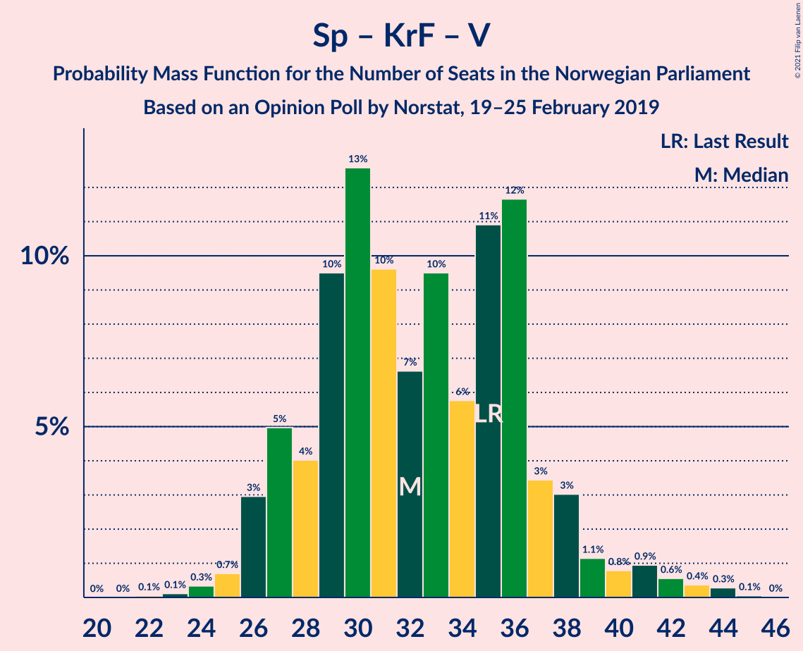

| Number of Seats | Probability | Accumulated | Special Marks |
|:---------------:|:-----------:|:-----------:|:-------------:|
| 22 | 0.1% | 100% |  |
| 23 | 0.1% | 99.9% |  |
| 24 | 0.3% | 99.8% |  |
| 25 | 0.7% | 99.5% |  |
| 26 | 3% | 98.8% |  |
| 27 | 5% | 96% |  |
| 28 | 4% | 91% |  |
| 29 | 10% | 87% |  |
| 30 | 13% | 77% |  |
| 31 | 10% | 65% | Median |
| 32 | 7% | 55% |  |
| 33 | 10% | 48% |  |
| 34 | 6% | 39% |  |
| 35 | 11% | 33% | Last Result |
| 36 | 12% | 22% |  |
| 37 | 3% | 11% |  |
| 38 | 3% | 7% |  |
| 39 | 1.1% | 4% |  |
| 40 | 0.8% | 3% |  |
| 41 | 0.9% | 2% |  |
| 42 | 0.6% | 1.3% |  |
| 43 | 0.4% | 0.7% |  |
| 44 | 0.3% | 0.4% |  |
| 45 | 0.1% | 0.1% |  |
| 46 | 0% | 0% |  |

## Technical Information

### Opinion Poll

+ **Polling firm:** Norstat
+ **Commissioner(s):** —
+ **Fieldwork period:** 19–25 February 2019

### Calculations

+ **Sample size:** 628
+ **Simulations done:** 1,048,576
+ **Error estimate:** 3.09%

