# Opinion Poll by Norstat, 26 February–4 March 2019

<a href="#voting-intentions">Voting Intentions</a> | <a href="#seats">Seats</a> | <a href="#coalitions">Coalitions</a> | <a href="#technical-information">Technical Information</a>

## Voting Intentions

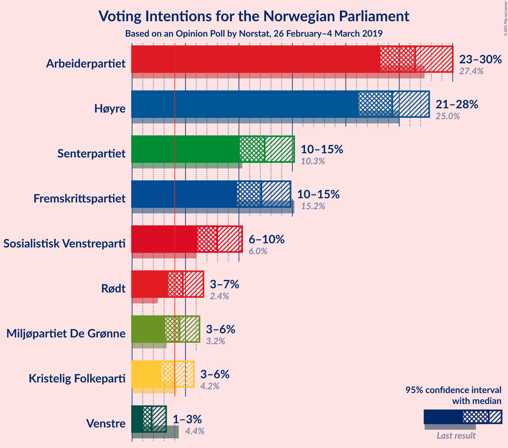

### Confidence Intervals

| Party | Last Result | Poll Result | 80% Confidence Interval | 90% Confidence Interval | 95% Confidence Interval | 99% Confidence Interval |
|:-----:|:-----------:|:-----------:|:-----------------------:|:-----------------------:|:-----------------------:|:-----------------------:|
| Arbeiderpartiet | 27.4% | 26.5% | 24.4–28.8% |23.8–29.4% |23.2–30.0% |22.3–31.1% |
| Høyre | 25.0% | 24.3% | 22.3–26.6% |21.7–27.2% |21.2–27.8% |20.3–28.9% |
| Senterpartiet | 10.3% | 12.4% | 10.9–14.2% |10.5–14.7% |10.1–15.2% |9.4–16.1% |
| Fremskrittspartiet | 15.2% | 12.1% | 10.6–13.9% |10.2–14.4% |9.8–14.8% |9.1–15.7% |
| Sosialistisk Venstreparti | 6.0% | 8.0% | 6.8–9.5% |6.4–9.9% |6.1–10.3% |5.6–11.1% |
| Rødt | 2.4% | 4.7% | 3.8–6.0% |3.6–6.4% |3.4–6.7% |3.0–7.3% |
| Miljøpartiet De Grønne | 3.2% | 4.4% | 3.6–5.7% |3.3–6.0% |3.1–6.3% |2.7–7.0% |
| Kristelig Folkeparti | 4.2% | 4.0% | 3.2–5.2% |2.9–5.5% |2.7–5.8% |2.4–6.4% |
| Venstre | 4.4% | 1.8% | 1.3–2.7% |1.2–3.0% |1.1–3.2% |0.9–3.7% |

*Note:* The poll result column reflects the actual value used in the calculations. Published results may vary slightly, and in addition be rounded to fewer digits.

## Seats

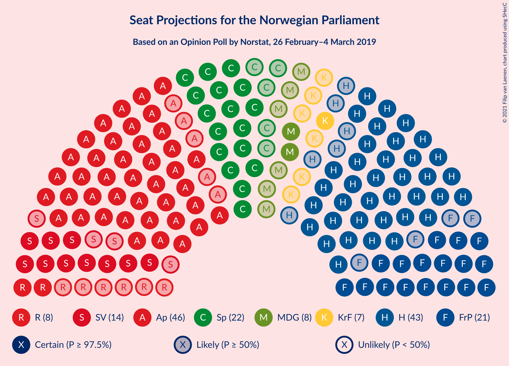

### Confidence Intervals

| Party | Last Result | Median | 80% Confidence Interval | 90% Confidence Interval | 95% Confidence Interval | 99% Confidence Interval |
|:-----:|:-----------:|:------:|:-----------------------:|:-----------------------:|:-----------------------:|:-----------------------:|
| <a href="#arbeiderpartiet">Arbeiderpartiet</a> | 49 | 46 | 43–53 |42–54 |41–55 |40–57 |
| <a href="#høyre">Høyre</a> | 45 | 43 | 38–48 |38–49 |37–50 |35–52 |
| <a href="#senterpartiet">Senterpartiet</a> | 19 | 22 | 19–26 |18–26 |17–27 |17–29 |
| <a href="#fremskrittspartiet">Fremskrittspartiet</a> | 27 | 21 | 18–25 |18–26 |17–26 |16–28 |
| <a href="#sosialistisk-venstreparti">Sosialistisk Venstreparti</a> | 11 | 14 | 12–17 |11–17 |10–18 |9–20 |
| <a href="#rødt">Rødt</a> | 1 | 8 | 2–10 |2–11 |2–12 |2–13 |
| <a href="#miljøpartiet-de-grønne">Miljøpartiet De Grønne</a> | 1 | 8 | 2–10 |2–10 |2–11 |1–12 |
| <a href="#kristelig-folkeparti">Kristelig Folkeparti</a> | 8 | 7 | 2–9 |1–10 |1–10 |1–11 |
| <a href="#venstre">Venstre</a> | 8 | 1 | 0–2 |0–2 |0–2 |0–2 |

### Arbeiderpartiet

*For a full overview of the results for this party, see the [Arbeiderpartiet](party-arbeiderpartiet.html) page.*

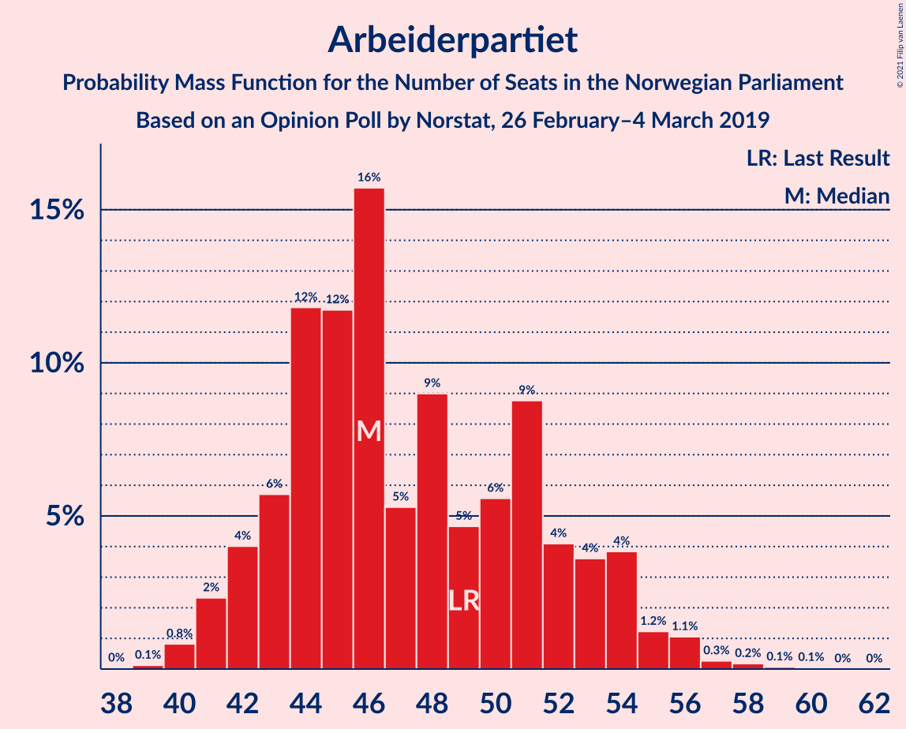

| Number of Seats | Probability | Accumulated | Special Marks |
|:---------------:|:-----------:|:-----------:|:-------------:|
| 39 | 0.1% | 100% |  |
| 40 | 0.8% | 99.8% |  |
| 41 | 2% | 99.0% |  |
| 42 | 4% | 97% |  |
| 43 | 6% | 93% |  |
| 44 | 12% | 87% |  |
| 45 | 12% | 75% |  |
| 46 | 16% | 63% | Median |
| 47 | 5% | 48% |  |
| 48 | 9% | 42% |  |
| 49 | 5% | 33% | Last Result |
| 50 | 6% | 29% |  |
| 51 | 9% | 23% |  |
| 52 | 4% | 14% |  |
| 53 | 4% | 10% |  |
| 54 | 4% | 7% |  |
| 55 | 1.2% | 3% |  |
| 56 | 1.1% | 2% |  |
| 57 | 0.3% | 0.6% |  |
| 58 | 0.2% | 0.3% |  |
| 59 | 0.1% | 0.1% |  |
| 60 | 0.1% | 0.1% |  |
| 61 | 0% | 0% |  |

### Høyre

*For a full overview of the results for this party, see the [Høyre](party-høyre.html) page.*

| Number of Seats | Probability | Accumulated | Special Marks |
|:---------------:|:-----------:|:-----------:|:-------------:|
| 33 | 0.1% | 100% |  |
| 34 | 0.2% | 99.9% |  |
| 35 | 0.2% | 99.7% |  |
| 36 | 1.4% | 99.5% |  |
| 37 | 2% | 98% |  |
| 38 | 7% | 96% |  |
| 39 | 5% | 89% |  |
| 40 | 6% | 84% |  |
| 41 | 11% | 78% |  |
| 42 | 11% | 67% |  |
| 43 | 11% | 56% | Median |
| 44 | 14% | 45% |  |
| 45 | 9% | 31% | Last Result |
| 46 | 5% | 22% |  |
| 47 | 5% | 16% |  |
| 48 | 5% | 11% |  |
| 49 | 3% | 5% |  |
| 50 | 1.3% | 3% |  |
| 51 | 0.7% | 1.4% |  |
| 52 | 0.3% | 0.7% |  |
| 53 | 0.3% | 0.4% |  |
| 54 | 0.1% | 0.1% |  |
| 55 | 0% | 0% |  |

### Senterpartiet

*For a full overview of the results for this party, see the [Senterpartiet](party-senterpartiet.html) page.*

| Number of Seats | Probability | Accumulated | Special Marks |
|:---------------:|:-----------:|:-----------:|:-------------:|
| 15 | 0.1% | 100% |  |
| 16 | 0.3% | 99.9% |  |
| 17 | 2% | 99.5% |  |
| 18 | 5% | 97% |  |
| 19 | 12% | 92% | Last Result |
| 20 | 15% | 80% |  |
| 21 | 12% | 65% |  |
| 22 | 12% | 53% | Median |
| 23 | 11% | 40% |  |
| 24 | 5% | 29% |  |
| 25 | 12% | 24% |  |
| 26 | 7% | 12% |  |
| 27 | 2% | 4% |  |
| 28 | 0.9% | 2% |  |
| 29 | 1.1% | 1.3% |  |
| 30 | 0.1% | 0.2% |  |
| 31 | 0% | 0.1% |  |
| 32 | 0% | 0.1% |  |
| 33 | 0% | 0% |  |

### Fremskrittspartiet

*For a full overview of the results for this party, see the [Fremskrittspartiet](party-fremskrittspartiet.html) page.*

| Number of Seats | Probability | Accumulated | Special Marks |
|:---------------:|:-----------:|:-----------:|:-------------:|
| 14 | 0.1% | 100% |  |
| 15 | 0.3% | 99.9% |  |
| 16 | 1.4% | 99.6% |  |
| 17 | 3% | 98% |  |
| 18 | 11% | 95% |  |
| 19 | 8% | 85% |  |
| 20 | 10% | 77% |  |
| 21 | 21% | 67% | Median |
| 22 | 13% | 46% |  |
| 23 | 14% | 33% |  |
| 24 | 7% | 19% |  |
| 25 | 6% | 13% |  |
| 26 | 4% | 6% |  |
| 27 | 1.0% | 2% | Last Result |
| 28 | 1.0% | 1.2% |  |
| 29 | 0.2% | 0.3% |  |
| 30 | 0% | 0.1% |  |
| 31 | 0% | 0% |  |

### Sosialistisk Venstreparti

*For a full overview of the results for this party, see the [Sosialistisk Venstreparti](party-sosialistiskvenstreparti.html) page.*

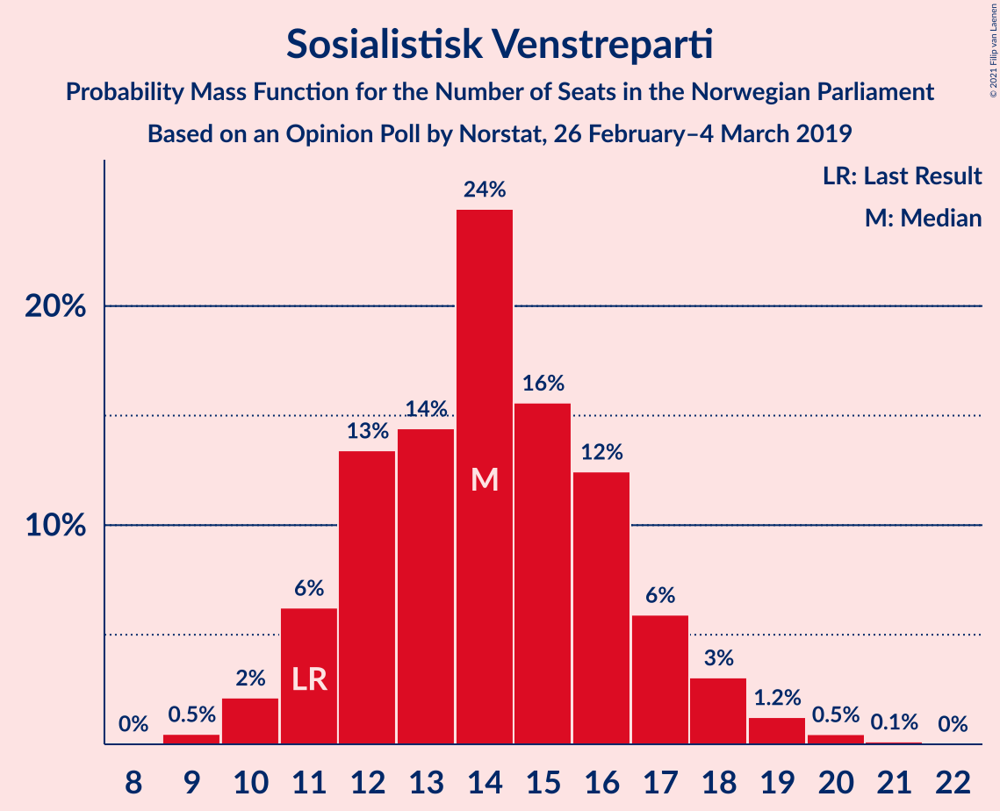

| Number of Seats | Probability | Accumulated | Special Marks |
|:---------------:|:-----------:|:-----------:|:-------------:|
| 9 | 0.5% | 100% |  |
| 10 | 2% | 99.5% |  |
| 11 | 6% | 97% | Last Result |
| 12 | 13% | 91% |  |
| 13 | 14% | 78% |  |
| 14 | 24% | 63% | Median |
| 15 | 16% | 39% |  |
| 16 | 12% | 23% |  |
| 17 | 6% | 11% |  |
| 18 | 3% | 5% |  |
| 19 | 1.2% | 2% |  |
| 20 | 0.5% | 0.6% |  |
| 21 | 0.1% | 0.2% |  |
| 22 | 0% | 0% |  |

### Rødt

*For a full overview of the results for this party, see the [Rødt](party-rødt.html) page.*

| Number of Seats | Probability | Accumulated | Special Marks |
|:---------------:|:-----------:|:-----------:|:-------------:|
| 1 | 0.4% | 100% | Last Result |
| 2 | 15% | 99.6% |  |
| 3 | 0% | 85% |  |
| 4 | 0% | 85% |  |
| 5 | 0% | 85% |  |
| 6 | 0% | 85% |  |
| 7 | 9% | 85% |  |
| 8 | 33% | 76% | Median |
| 9 | 20% | 43% |  |
| 10 | 15% | 23% |  |
| 11 | 5% | 8% |  |
| 12 | 2% | 3% |  |
| 13 | 0.8% | 0.9% |  |
| 14 | 0.1% | 0.2% |  |
| 15 | 0% | 0% |  |

### Miljøpartiet De Grønne

*For a full overview of the results for this party, see the [Miljøpartiet De Grønne](party-miljøpartietdegrønne.html) page.*

| Number of Seats | Probability | Accumulated | Special Marks |
|:---------------:|:-----------:|:-----------:|:-------------:|
| 1 | 2% | 100% | Last Result |
| 2 | 16% | 98% |  |
| 3 | 1.1% | 82% |  |
| 4 | 0.2% | 81% |  |
| 5 | 0% | 80% |  |
| 6 | 0% | 80% |  |
| 7 | 19% | 80% |  |
| 8 | 24% | 61% | Median |
| 9 | 23% | 37% |  |
| 10 | 9% | 14% |  |
| 11 | 3% | 4% |  |
| 12 | 1.1% | 1.3% |  |
| 13 | 0.1% | 0.2% |  |
| 14 | 0% | 0% |  |

### Kristelig Folkeparti

*For a full overview of the results for this party, see the [Kristelig Folkeparti](party-kristeligfolkeparti.html) page.*

| Number of Seats | Probability | Accumulated | Special Marks |
|:---------------:|:-----------:|:-----------:|:-------------:|
| 0 | 0.2% | 100% |  |
| 1 | 9% | 99.8% |  |
| 2 | 7% | 91% |  |
| 3 | 29% | 84% |  |
| 4 | 0% | 55% |  |
| 5 | 0% | 55% |  |
| 6 | 0% | 55% |  |
| 7 | 20% | 55% | Median |
| 8 | 18% | 35% | Last Result |
| 9 | 11% | 17% |  |
| 10 | 4% | 5% |  |
| 11 | 0.8% | 1.0% |  |
| 12 | 0.1% | 0.2% |  |
| 13 | 0% | 0% |  |

### Venstre

*For a full overview of the results for this party, see the [Venstre](party-venstre.html) page.*

| Number of Seats | Probability | Accumulated | Special Marks |
|:---------------:|:-----------:|:-----------:|:-------------:|
| 0 | 46% | 100% |  |
| 1 | 34% | 54% | Median |
| 2 | 20% | 20% |  |
| 3 | 0.1% | 0.2% |  |
| 4 | 0% | 0.1% |  |
| 5 | 0% | 0.1% |  |
| 6 | 0% | 0.1% |  |
| 7 | 0.1% | 0.1% |  |
| 8 | 0% | 0% | Last Result |

## Coalitions

### Confidence Intervals

| Coalition | Last Result | Median | Majority? | 80% Confidence Interval | 90% Confidence Interval | 95% Confidence Interval | 99% Confidence Interval |
|:---------:|:-----------:|:------:|:---------:|:-----------------------:|:-----------------------:|:-----------------------:|:-----------------------:|
| Arbeiderpartiet – Senterpartiet – Sosialistisk Venstreparti – Rødt – Miljøpartiet De Grønne | 81 | 99 | 100% | 93–104 | 92–105 | 90–107 | 88–109 |
| Arbeiderpartiet – Senterpartiet – Sosialistisk Venstreparti – Miljøpartiet De Grønne – Kristelig Folkeparti | 88 | 96 | 99.6% | 91–101 | 90–103 | 88–104 | 85–106 |
| Høyre – Senterpartiet – Fremskrittspartiet – Kristelig Folkeparti – Venstre | 107 | 93 | 98% | 87–98 | 86–100 | 85–101 | 82–105 |
| Arbeiderpartiet – Senterpartiet – Sosialistisk Venstreparti – Rødt | 80 | 91 | 94% | 86–97 | 84–99 | 83–100 | 81–102 |
| Arbeiderpartiet – Senterpartiet – Sosialistisk Venstreparti – Miljøpartiet De Grønne | 80 | 91 | 92% | 85–97 | 84–98 | 82–99 | 80–101 |
| Arbeiderpartiet – Senterpartiet – Sosialistisk Venstreparti | 79 | 83 | 41% | 78–89 | 77–90 | 75–91 | 73–95 |
| Arbeiderpartiet – Senterpartiet – Miljøpartiet De Grønne – Kristelig Folkeparti | 77 | 81 | 30% | 77–87 | 75–89 | 73–91 | 71–93 |
| Høyre – Fremskrittspartiet – Miljøpartiet De Grønne – Kristelig Folkeparti – Venstre | 89 | 78 | 6% | 72–83 | 70–85 | 69–86 | 67–88 |
| Arbeiderpartiet – Sosialistisk Venstreparti – Rødt – Miljøpartiet De Grønne | 62 | 76 | 2% | 71–82 | 69–83 | 68–84 | 64–87 |
| Arbeiderpartiet – Senterpartiet – Kristelig Folkeparti | 76 | 75 | 1.2% | 69–81 | 68–82 | 67–83 | 64–86 |
| Høyre – Fremskrittspartiet – Kristelig Folkeparti – Venstre | 88 | 70 | 0% | 65–76 | 64–77 | 62–79 | 60–81 |
| Arbeiderpartiet – Senterpartiet | 68 | 69 | 0% | 64–74 | 64–76 | 62–78 | 60–80 |
| Høyre – Fremskrittspartiet – Venstre | 80 | 65 | 0% | 60–70 | 59–72 | 58–73 | 56–76 |
| Høyre – Fremskrittspartiet | 72 | 65 | 0% | 59–69 | 58–71 | 57–72 | 55–75 |
| Arbeiderpartiet – Sosialistisk Venstreparti | 60 | 61 | 0% | 57–66 | 56–68 | 54–69 | 53–72 |
| Høyre – Kristelig Folkeparti – Venstre | 61 | 49 | 0% | 44–54 | 43–55 | 41–57 | 39–60 |
| Senterpartiet – Kristelig Folkeparti – Venstre | 35 | 28 | 0% | 24–34 | 22–34 | 21–35 | 20–38 |

### Arbeiderpartiet – Senterpartiet – Sosialistisk Venstreparti – Rødt – Miljøpartiet De Grønne

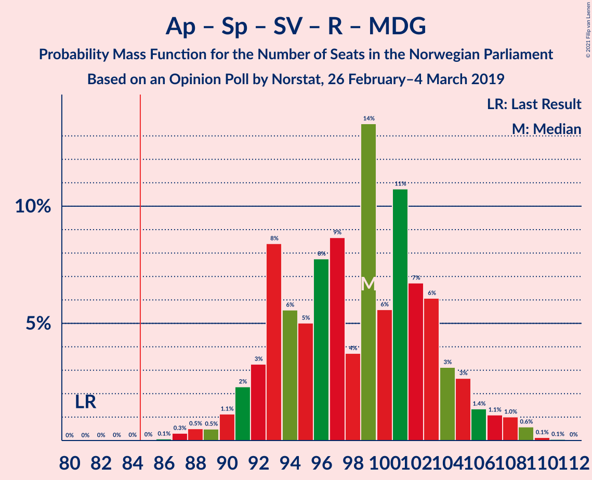

| Number of Seats | Probability | Accumulated | Special Marks |
|:---------------:|:-----------:|:-----------:|:-------------:|
| 81 | 0% | 100% | Last Result |
| 82 | 0% | 100% |  |
| 83 | 0% | 100% |  |
| 84 | 0% | 100% |  |
| 85 | 0% | 100% | Majority |
| 86 | 0.1% | 99.9% |  |
| 87 | 0.3% | 99.8% |  |
| 88 | 0.5% | 99.5% |  |
| 89 | 0.5% | 99.0% |  |
| 90 | 1.1% | 98.5% |  |
| 91 | 2% | 97% |  |
| 92 | 3% | 95% |  |
| 93 | 8% | 92% |  |
| 94 | 6% | 83% |  |
| 95 | 5% | 78% |  |
| 96 | 8% | 73% |  |
| 97 | 9% | 65% |  |
| 98 | 4% | 56% | Median |
| 99 | 14% | 53% |  |
| 100 | 6% | 39% |  |
| 101 | 11% | 34% |  |
| 102 | 7% | 23% |  |
| 103 | 6% | 16% |  |
| 104 | 3% | 10% |  |
| 105 | 3% | 7% |  |
| 106 | 1.4% | 4% |  |
| 107 | 1.1% | 3% |  |
| 108 | 1.0% | 2% |  |
| 109 | 0.6% | 0.8% |  |
| 110 | 0.1% | 0.2% |  |
| 111 | 0.1% | 0.1% |  |
| 112 | 0% | 0% |  |

### Arbeiderpartiet – Senterpartiet – Sosialistisk Venstreparti – Miljøpartiet De Grønne – Kristelig Folkeparti

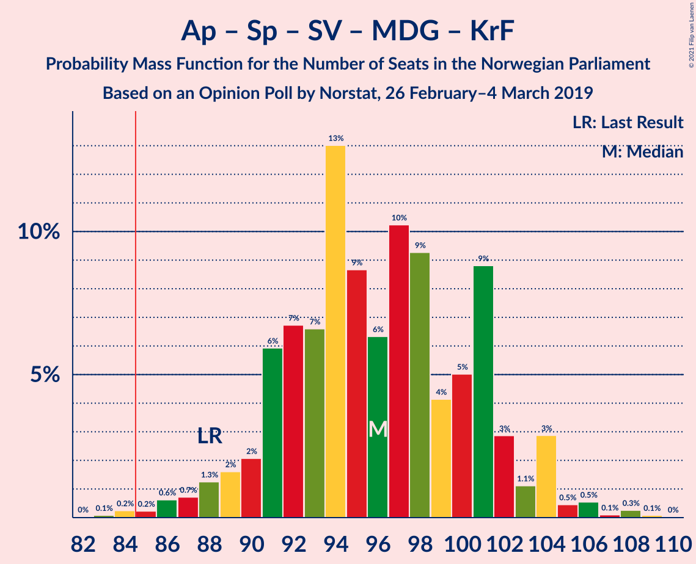

| Number of Seats | Probability | Accumulated | Special Marks |
|:---------------:|:-----------:|:-----------:|:-------------:|
| 83 | 0.1% | 100% |  |
| 84 | 0.2% | 99.9% |  |
| 85 | 0.2% | 99.6% | Majority |
| 86 | 0.6% | 99.4% |  |
| 87 | 0.7% | 98.8% |  |
| 88 | 1.3% | 98% | Last Result |
| 89 | 2% | 97% |  |
| 90 | 2% | 95% |  |
| 91 | 6% | 93% |  |
| 92 | 7% | 87% |  |
| 93 | 7% | 80% |  |
| 94 | 13% | 74% |  |
| 95 | 9% | 61% |  |
| 96 | 6% | 52% |  |
| 97 | 10% | 46% | Median |
| 98 | 9% | 36% |  |
| 99 | 4% | 26% |  |
| 100 | 5% | 22% |  |
| 101 | 9% | 17% |  |
| 102 | 3% | 8% |  |
| 103 | 1.1% | 5% |  |
| 104 | 3% | 4% |  |
| 105 | 0.5% | 1.5% |  |
| 106 | 0.5% | 1.0% |  |
| 107 | 0.1% | 0.5% |  |
| 108 | 0.3% | 0.4% |  |
| 109 | 0.1% | 0.1% |  |
| 110 | 0% | 0% |  |

### Høyre – Senterpartiet – Fremskrittspartiet – Kristelig Folkeparti – Venstre

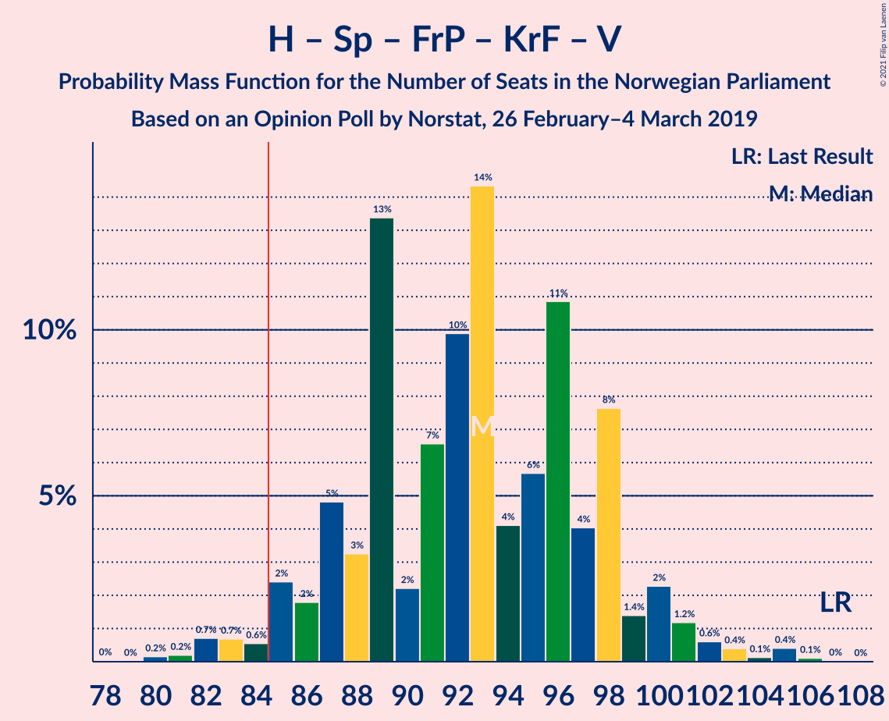

| Number of Seats | Probability | Accumulated | Special Marks |
|:---------------:|:-----------:|:-----------:|:-------------:|
| 79 | 0% | 100% |  |
| 80 | 0.2% | 99.9% |  |
| 81 | 0.2% | 99.8% |  |
| 82 | 0.7% | 99.6% |  |
| 83 | 0.7% | 98.9% |  |
| 84 | 0.6% | 98% |  |
| 85 | 2% | 98% | Majority |
| 86 | 2% | 95% |  |
| 87 | 5% | 93% |  |
| 88 | 3% | 89% |  |
| 89 | 13% | 85% |  |
| 90 | 2% | 72% |  |
| 91 | 7% | 70% |  |
| 92 | 10% | 63% |  |
| 93 | 14% | 53% |  |
| 94 | 4% | 39% | Median |
| 95 | 6% | 35% |  |
| 96 | 11% | 29% |  |
| 97 | 4% | 18% |  |
| 98 | 8% | 14% |  |
| 99 | 1.4% | 7% |  |
| 100 | 2% | 5% |  |
| 101 | 1.2% | 3% |  |
| 102 | 0.6% | 2% |  |
| 103 | 0.4% | 1.1% |  |
| 104 | 0.1% | 0.7% |  |
| 105 | 0.4% | 0.6% |  |
| 106 | 0.1% | 0.2% |  |
| 107 | 0% | 0.1% | Last Result |
| 108 | 0% | 0% |  |

### Arbeiderpartiet – Senterpartiet – Sosialistisk Venstreparti – Rødt

| Number of Seats | Probability | Accumulated | Special Marks |
|:---------------:|:-----------:|:-----------:|:-------------:|
| 78 | 0% | 100% |  |
| 79 | 0.1% | 99.9% |  |
| 80 | 0.2% | 99.9% | Last Result |
| 81 | 0.7% | 99.7% |  |
| 82 | 1.0% | 99.0% |  |
| 83 | 2% | 98% |  |
| 84 | 2% | 96% |  |
| 85 | 3% | 94% | Majority |
| 86 | 9% | 91% |  |
| 87 | 5% | 82% |  |
| 88 | 10% | 77% |  |
| 89 | 4% | 68% |  |
| 90 | 10% | 63% | Median |
| 91 | 8% | 54% |  |
| 92 | 8% | 45% |  |
| 93 | 6% | 38% |  |
| 94 | 10% | 32% |  |
| 95 | 5% | 21% |  |
| 96 | 5% | 17% |  |
| 97 | 3% | 12% |  |
| 98 | 3% | 9% |  |
| 99 | 2% | 6% |  |
| 100 | 2% | 4% |  |
| 101 | 1.5% | 2% |  |
| 102 | 0.4% | 0.7% |  |
| 103 | 0.2% | 0.4% |  |
| 104 | 0.1% | 0.2% |  |
| 105 | 0% | 0.1% |  |
| 106 | 0% | 0.1% |  |
| 107 | 0% | 0.1% |  |
| 108 | 0% | 0% |  |

### Arbeiderpartiet – Senterpartiet – Sosialistisk Venstreparti – Miljøpartiet De Grønne

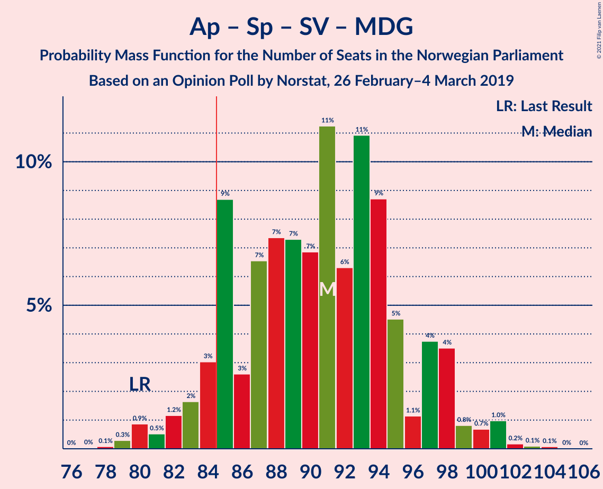

| Number of Seats | Probability | Accumulated | Special Marks |
|:---------------:|:-----------:|:-----------:|:-------------:|
| 77 | 0% | 100% |  |
| 78 | 0.1% | 99.9% |  |
| 79 | 0.3% | 99.9% |  |
| 80 | 0.9% | 99.6% | Last Result |
| 81 | 0.5% | 98.7% |  |
| 82 | 1.2% | 98% |  |
| 83 | 2% | 97% |  |
| 84 | 3% | 95% |  |
| 85 | 9% | 92% | Majority |
| 86 | 3% | 84% |  |
| 87 | 7% | 81% |  |
| 88 | 7% | 74% |  |
| 89 | 7% | 67% |  |
| 90 | 7% | 60% | Median |
| 91 | 11% | 53% |  |
| 92 | 6% | 42% |  |
| 93 | 11% | 35% |  |
| 94 | 9% | 24% |  |
| 95 | 5% | 16% |  |
| 96 | 1.1% | 11% |  |
| 97 | 4% | 10% |  |
| 98 | 4% | 6% |  |
| 99 | 0.8% | 3% |  |
| 100 | 0.7% | 2% |  |
| 101 | 1.0% | 1.4% |  |
| 102 | 0.2% | 0.4% |  |
| 103 | 0.1% | 0.2% |  |
| 104 | 0.1% | 0.1% |  |
| 105 | 0% | 0% |  |

### Arbeiderpartiet – Senterpartiet – Sosialistisk Venstreparti

| Number of Seats | Probability | Accumulated | Special Marks |
|:---------------:|:-----------:|:-----------:|:-------------:|
| 72 | 0.2% | 100% |  |
| 73 | 0.5% | 99.8% |  |
| 74 | 0.4% | 99.2% |  |
| 75 | 1.5% | 98.8% |  |
| 76 | 2% | 97% |  |
| 77 | 2% | 95% |  |
| 78 | 8% | 93% |  |
| 79 | 9% | 85% | Last Result |
| 80 | 4% | 76% |  |
| 81 | 5% | 72% |  |
| 82 | 12% | 67% | Median |
| 83 | 8% | 55% |  |
| 84 | 6% | 47% |  |
| 85 | 8% | 41% | Majority |
| 86 | 9% | 33% |  |
| 87 | 7% | 24% |  |
| 88 | 4% | 17% |  |
| 89 | 3% | 13% |  |
| 90 | 5% | 10% |  |
| 91 | 2% | 5% |  |
| 92 | 1.1% | 2% |  |
| 93 | 0.4% | 1.3% |  |
| 94 | 0.3% | 1.0% |  |
| 95 | 0.3% | 0.7% |  |
| 96 | 0.2% | 0.4% |  |
| 97 | 0.1% | 0.2% |  |
| 98 | 0% | 0.1% |  |
| 99 | 0.1% | 0.1% |  |
| 100 | 0% | 0% |  |

### Arbeiderpartiet – Senterpartiet – Miljøpartiet De Grønne – Kristelig Folkeparti

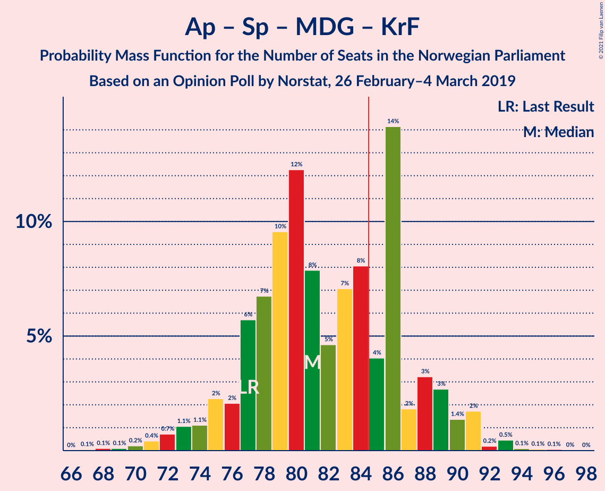

| Number of Seats | Probability | Accumulated | Special Marks |
|:---------------:|:-----------:|:-----------:|:-------------:|
| 67 | 0.1% | 100% |  |
| 68 | 0.1% | 99.9% |  |
| 69 | 0.1% | 99.8% |  |
| 70 | 0.2% | 99.7% |  |
| 71 | 0.4% | 99.5% |  |
| 72 | 0.7% | 99.1% |  |
| 73 | 1.1% | 98% |  |
| 74 | 1.1% | 97% |  |
| 75 | 2% | 96% |  |
| 76 | 2% | 94% |  |
| 77 | 6% | 92% | Last Result |
| 78 | 7% | 86% |  |
| 79 | 10% | 79% |  |
| 80 | 12% | 70% |  |
| 81 | 8% | 58% |  |
| 82 | 5% | 50% |  |
| 83 | 7% | 45% | Median |
| 84 | 8% | 38% |  |
| 85 | 4% | 30% | Majority |
| 86 | 14% | 26% |  |
| 87 | 2% | 12% |  |
| 88 | 3% | 10% |  |
| 89 | 3% | 7% |  |
| 90 | 1.4% | 4% |  |
| 91 | 2% | 3% |  |
| 92 | 0.2% | 0.9% |  |
| 93 | 0.5% | 0.7% |  |
| 94 | 0.1% | 0.3% |  |
| 95 | 0.1% | 0.2% |  |
| 96 | 0.1% | 0.1% |  |
| 97 | 0% | 0% |  |

### Høyre – Fremskrittspartiet – Miljøpartiet De Grønne – Kristelig Folkeparti – Venstre

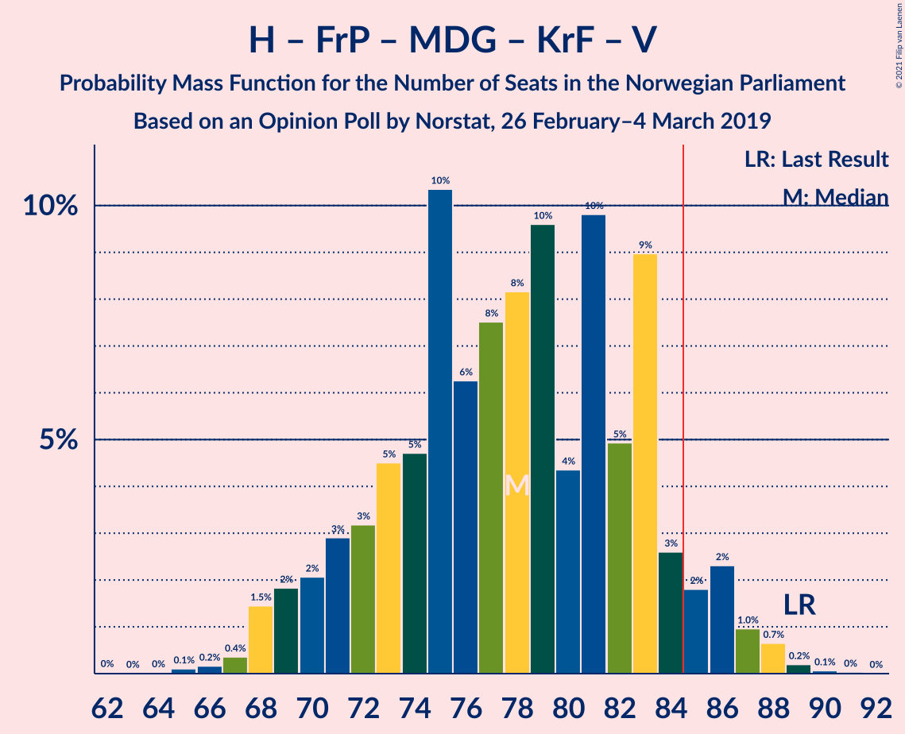

| Number of Seats | Probability | Accumulated | Special Marks |
|:---------------:|:-----------:|:-----------:|:-------------:|
| 62 | 0% | 100% |  |
| 63 | 0% | 99.9% |  |
| 64 | 0% | 99.9% |  |
| 65 | 0.1% | 99.9% |  |
| 66 | 0.2% | 99.8% |  |
| 67 | 0.4% | 99.6% |  |
| 68 | 1.5% | 99.3% |  |
| 69 | 2% | 98% |  |
| 70 | 2% | 96% |  |
| 71 | 3% | 94% |  |
| 72 | 3% | 91% |  |
| 73 | 5% | 88% |  |
| 74 | 5% | 83% |  |
| 75 | 10% | 79% |  |
| 76 | 6% | 68% |  |
| 77 | 8% | 62% |  |
| 78 | 8% | 54% |  |
| 79 | 10% | 46% |  |
| 80 | 4% | 37% | Median |
| 81 | 10% | 32% |  |
| 82 | 5% | 23% |  |
| 83 | 9% | 18% |  |
| 84 | 3% | 9% |  |
| 85 | 2% | 6% | Majority |
| 86 | 2% | 4% |  |
| 87 | 1.0% | 2% |  |
| 88 | 0.7% | 1.0% |  |
| 89 | 0.2% | 0.3% | Last Result |
| 90 | 0.1% | 0.1% |  |
| 91 | 0% | 0.1% |  |
| 92 | 0% | 0% |  |

### Arbeiderpartiet – Sosialistisk Venstreparti – Rødt – Miljøpartiet De Grønne

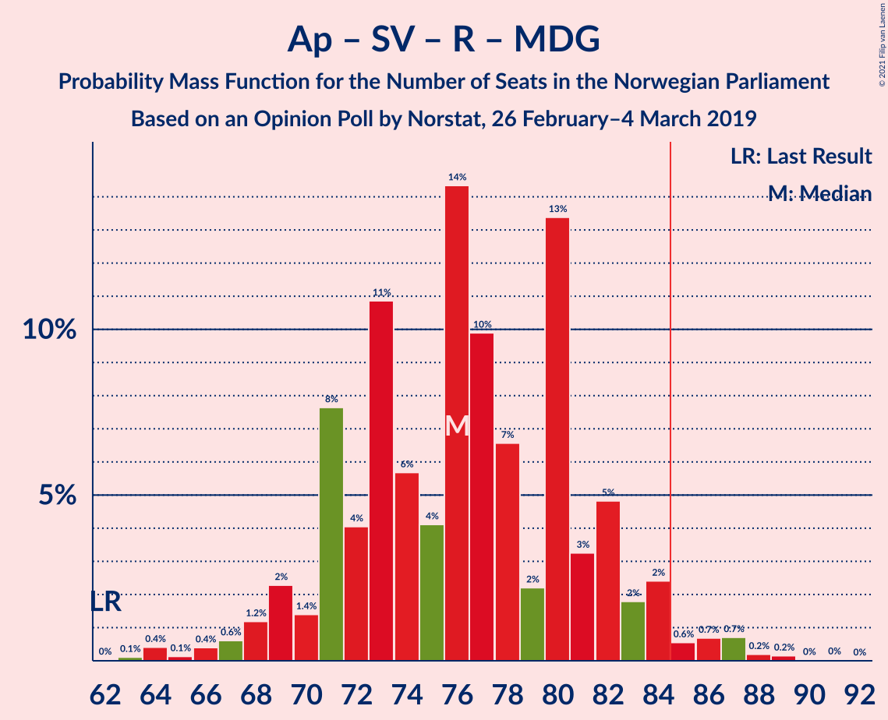

| Number of Seats | Probability | Accumulated | Special Marks |
|:---------------:|:-----------:|:-----------:|:-------------:|
| 62 | 0% | 100% | Last Result |
| 63 | 0.1% | 99.9% |  |
| 64 | 0.4% | 99.8% |  |
| 65 | 0.1% | 99.4% |  |
| 66 | 0.4% | 99.3% |  |
| 67 | 0.6% | 98.9% |  |
| 68 | 1.2% | 98% |  |
| 69 | 2% | 97% |  |
| 70 | 1.4% | 95% |  |
| 71 | 8% | 93% |  |
| 72 | 4% | 86% |  |
| 73 | 11% | 82% |  |
| 74 | 6% | 71% |  |
| 75 | 4% | 65% |  |
| 76 | 14% | 61% | Median |
| 77 | 10% | 47% |  |
| 78 | 7% | 37% |  |
| 79 | 2% | 30% |  |
| 80 | 13% | 28% |  |
| 81 | 3% | 15% |  |
| 82 | 5% | 11% |  |
| 83 | 2% | 7% |  |
| 84 | 2% | 5% |  |
| 85 | 0.6% | 2% | Majority |
| 86 | 0.7% | 2% |  |
| 87 | 0.7% | 1.1% |  |
| 88 | 0.2% | 0.4% |  |
| 89 | 0.2% | 0.2% |  |
| 90 | 0% | 0.1% |  |
| 91 | 0% | 0% |  |

### Arbeiderpartiet – Senterpartiet – Kristelig Folkeparti

| Number of Seats | Probability | Accumulated | Special Marks |
|:---------------:|:-----------:|:-----------:|:-------------:|
| 62 | 0% | 100% |  |
| 63 | 0.2% | 99.9% |  |
| 64 | 0.3% | 99.8% |  |
| 65 | 0.4% | 99.4% |  |
| 66 | 0.5% | 99.0% |  |
| 67 | 3% | 98% |  |
| 68 | 2% | 96% |  |
| 69 | 5% | 93% |  |
| 70 | 5% | 88% |  |
| 71 | 7% | 83% |  |
| 72 | 10% | 76% |  |
| 73 | 8% | 66% |  |
| 74 | 7% | 58% |  |
| 75 | 6% | 51% | Median |
| 76 | 7% | 45% | Last Result |
| 77 | 12% | 38% |  |
| 78 | 5% | 26% |  |
| 79 | 7% | 21% |  |
| 80 | 3% | 13% |  |
| 81 | 4% | 10% |  |
| 82 | 3% | 6% |  |
| 83 | 2% | 4% |  |
| 84 | 0.8% | 2% |  |
| 85 | 0.6% | 1.2% | Majority |
| 86 | 0.4% | 0.6% |  |
| 87 | 0.2% | 0.3% |  |
| 88 | 0% | 0.1% |  |
| 89 | 0% | 0% |  |

### Høyre – Fremskrittspartiet – Kristelig Folkeparti – Venstre

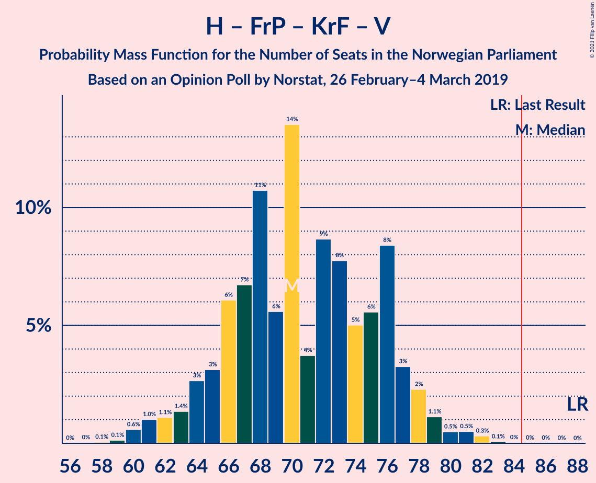

| Number of Seats | Probability | Accumulated | Special Marks |
|:---------------:|:-----------:|:-----------:|:-------------:|
| 58 | 0.1% | 100% |  |
| 59 | 0.1% | 99.9% |  |
| 60 | 0.6% | 99.8% |  |
| 61 | 1.0% | 99.2% |  |
| 62 | 1.1% | 98% |  |
| 63 | 1.4% | 97% |  |
| 64 | 3% | 96% |  |
| 65 | 3% | 93% |  |
| 66 | 6% | 90% |  |
| 67 | 7% | 84% |  |
| 68 | 11% | 77% |  |
| 69 | 6% | 66% |  |
| 70 | 14% | 61% |  |
| 71 | 4% | 47% |  |
| 72 | 9% | 44% | Median |
| 73 | 8% | 35% |  |
| 74 | 5% | 27% |  |
| 75 | 6% | 22% |  |
| 76 | 8% | 17% |  |
| 77 | 3% | 8% |  |
| 78 | 2% | 5% |  |
| 79 | 1.1% | 3% |  |
| 80 | 0.5% | 1.5% |  |
| 81 | 0.5% | 1.0% |  |
| 82 | 0.3% | 0.5% |  |
| 83 | 0.1% | 0.1% |  |
| 84 | 0% | 0.1% |  |
| 85 | 0% | 0% | Majority |
| 86 | 0% | 0% |  |
| 87 | 0% | 0% |  |
| 88 | 0% | 0% | Last Result |

### Arbeiderpartiet – Senterpartiet

| Number of Seats | Probability | Accumulated | Special Marks |
|:---------------:|:-----------:|:-----------:|:-------------:|
| 58 | 0.1% | 100% |  |
| 59 | 0.2% | 99.9% |  |
| 60 | 0.5% | 99.8% |  |
| 61 | 0.6% | 99.3% |  |
| 62 | 1.5% | 98.7% |  |
| 63 | 1.3% | 97% |  |
| 64 | 10% | 96% |  |
| 65 | 11% | 86% |  |
| 66 | 5% | 75% |  |
| 67 | 7% | 70% |  |
| 68 | 8% | 63% | Last Result, Median |
| 69 | 6% | 55% |  |
| 70 | 10% | 49% |  |
| 71 | 11% | 39% |  |
| 72 | 4% | 28% |  |
| 73 | 8% | 24% |  |
| 74 | 7% | 16% |  |
| 75 | 2% | 10% |  |
| 76 | 3% | 7% |  |
| 77 | 1.1% | 4% |  |
| 78 | 1.0% | 3% |  |
| 79 | 1.5% | 2% |  |
| 80 | 0.2% | 0.6% |  |
| 81 | 0.2% | 0.4% |  |
| 82 | 0% | 0.2% |  |
| 83 | 0.1% | 0.1% |  |
| 84 | 0% | 0% |  |

### Høyre – Fremskrittspartiet – Venstre

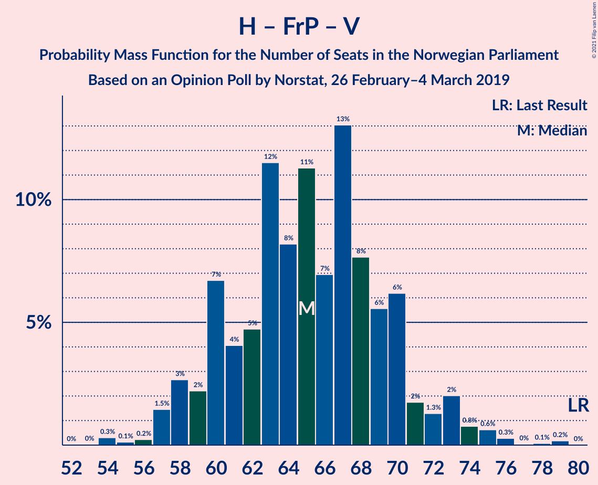

| Number of Seats | Probability | Accumulated | Special Marks |
|:---------------:|:-----------:|:-----------:|:-------------:|
| 53 | 0% | 100% |  |
| 54 | 0.3% | 99.9% |  |
| 55 | 0.1% | 99.6% |  |
| 56 | 0.2% | 99.5% |  |
| 57 | 1.5% | 99.3% |  |
| 58 | 3% | 98% |  |
| 59 | 2% | 95% |  |
| 60 | 7% | 93% |  |
| 61 | 4% | 86% |  |
| 62 | 5% | 82% |  |
| 63 | 12% | 77% |  |
| 64 | 8% | 66% |  |
| 65 | 11% | 58% | Median |
| 66 | 7% | 46% |  |
| 67 | 13% | 40% |  |
| 68 | 8% | 26% |  |
| 69 | 6% | 19% |  |
| 70 | 6% | 13% |  |
| 71 | 2% | 7% |  |
| 72 | 1.3% | 5% |  |
| 73 | 2% | 4% |  |
| 74 | 0.8% | 2% |  |
| 75 | 0.6% | 1.2% |  |
| 76 | 0.3% | 0.6% |  |
| 77 | 0% | 0.3% |  |
| 78 | 0.1% | 0.3% |  |
| 79 | 0.2% | 0.2% |  |
| 80 | 0% | 0% | Last Result |

### Høyre – Fremskrittspartiet

| Number of Seats | Probability | Accumulated | Special Marks |
|:---------------:|:-----------:|:-----------:|:-------------:|
| 52 | 0% | 100% |  |
| 53 | 0% | 99.9% |  |
| 54 | 0.4% | 99.9% |  |
| 55 | 0.6% | 99.6% |  |
| 56 | 0.5% | 99.0% |  |
| 57 | 2% | 98.5% |  |
| 58 | 2% | 96% |  |
| 59 | 7% | 94% |  |
| 60 | 4% | 87% |  |
| 61 | 4% | 83% |  |
| 62 | 7% | 79% |  |
| 63 | 16% | 72% |  |
| 64 | 5% | 56% | Median |
| 65 | 11% | 52% |  |
| 66 | 9% | 41% |  |
| 67 | 14% | 32% |  |
| 68 | 5% | 18% |  |
| 69 | 3% | 13% |  |
| 70 | 4% | 10% |  |
| 71 | 2% | 6% |  |
| 72 | 2% | 4% | Last Result |
| 73 | 1.1% | 2% |  |
| 74 | 0.4% | 1.1% |  |
| 75 | 0.3% | 0.7% |  |
| 76 | 0.1% | 0.4% |  |
| 77 | 0.2% | 0.2% |  |
| 78 | 0% | 0.1% |  |
| 79 | 0% | 0% |  |

### Arbeiderpartiet – Sosialistisk Venstreparti

| Number of Seats | Probability | Accumulated | Special Marks |
|:---------------:|:-----------:|:-----------:|:-------------:|
| 51 | 0.2% | 100% |  |
| 52 | 0.2% | 99.8% |  |
| 53 | 1.2% | 99.6% |  |
| 54 | 2% | 98% |  |
| 55 | 2% | 97% |  |
| 56 | 4% | 95% |  |
| 57 | 4% | 91% |  |
| 58 | 12% | 86% |  |
| 59 | 8% | 74% |  |
| 60 | 9% | 66% | Last Result, Median |
| 61 | 12% | 57% |  |
| 62 | 7% | 45% |  |
| 63 | 11% | 39% |  |
| 64 | 8% | 28% |  |
| 65 | 5% | 20% |  |
| 66 | 6% | 15% |  |
| 67 | 2% | 10% |  |
| 68 | 4% | 7% |  |
| 69 | 1.2% | 3% |  |
| 70 | 0.9% | 2% |  |
| 71 | 0.4% | 1.1% |  |
| 72 | 0.4% | 0.7% |  |
| 73 | 0.2% | 0.4% |  |
| 74 | 0.1% | 0.1% |  |
| 75 | 0% | 0% |  |

### Høyre – Kristelig Folkeparti – Venstre

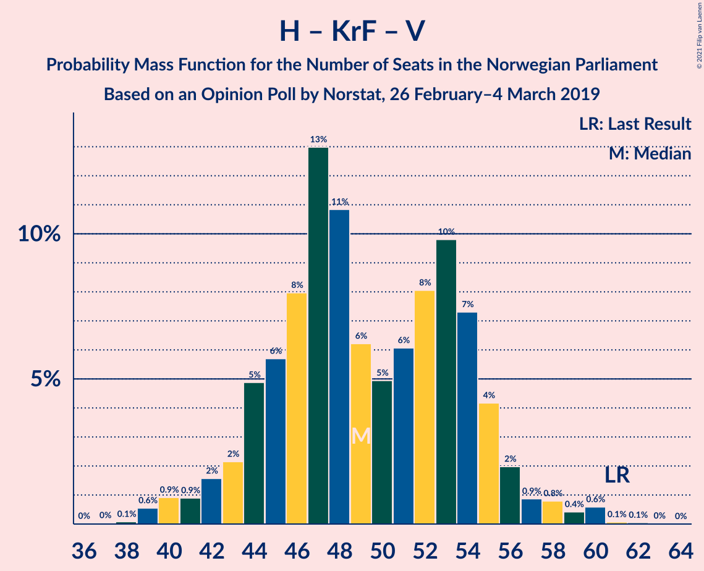

| Number of Seats | Probability | Accumulated | Special Marks |
|:---------------:|:-----------:|:-----------:|:-------------:|
| 37 | 0% | 100% |  |
| 38 | 0.1% | 99.9% |  |
| 39 | 0.6% | 99.9% |  |
| 40 | 0.9% | 99.3% |  |
| 41 | 0.9% | 98% |  |
| 42 | 2% | 97% |  |
| 43 | 2% | 96% |  |
| 44 | 5% | 94% |  |
| 45 | 6% | 89% |  |
| 46 | 8% | 83% |  |
| 47 | 13% | 75% |  |
| 48 | 11% | 62% |  |
| 49 | 6% | 51% |  |
| 50 | 5% | 45% |  |
| 51 | 6% | 40% | Median |
| 52 | 8% | 34% |  |
| 53 | 10% | 26% |  |
| 54 | 7% | 16% |  |
| 55 | 4% | 9% |  |
| 56 | 2% | 5% |  |
| 57 | 0.9% | 3% |  |
| 58 | 0.8% | 2% |  |
| 59 | 0.4% | 1.2% |  |
| 60 | 0.6% | 0.7% |  |
| 61 | 0.1% | 0.2% | Last Result |
| 62 | 0.1% | 0.1% |  |
| 63 | 0% | 0% |  |

### Senterpartiet – Kristelig Folkeparti – Venstre

| Number of Seats | Probability | Accumulated | Special Marks |
|:---------------:|:-----------:|:-----------:|:-------------:|
| 18 | 0.1% | 100% |  |
| 19 | 0.1% | 99.9% |  |
| 20 | 0.5% | 99.8% |  |
| 21 | 3% | 99.3% |  |
| 22 | 3% | 97% |  |
| 23 | 2% | 93% |  |
| 24 | 4% | 92% |  |
| 25 | 8% | 88% |  |
| 26 | 18% | 80% |  |
| 27 | 7% | 62% |  |
| 28 | 10% | 54% |  |
| 29 | 10% | 44% |  |
| 30 | 9% | 34% | Median |
| 31 | 5% | 25% |  |
| 32 | 3% | 20% |  |
| 33 | 5% | 17% |  |
| 34 | 8% | 12% |  |
| 35 | 2% | 4% | Last Result |
| 36 | 0.7% | 2% |  |
| 37 | 0.5% | 1.2% |  |
| 38 | 0.6% | 0.8% |  |
| 39 | 0.1% | 0.2% |  |
| 40 | 0.1% | 0.1% |  |
| 41 | 0% | 0% |  |

## Technical Information

### Opinion Poll

+ **Polling firm:** Norstat
+ **Commissioner(s):** —
+ **Fieldwork period:** 26 February–4 March 2019

### Calculations

+ **Sample size:** 653
+ **Simulations done:** 1,048,576
+ **Error estimate:** 1.40%

