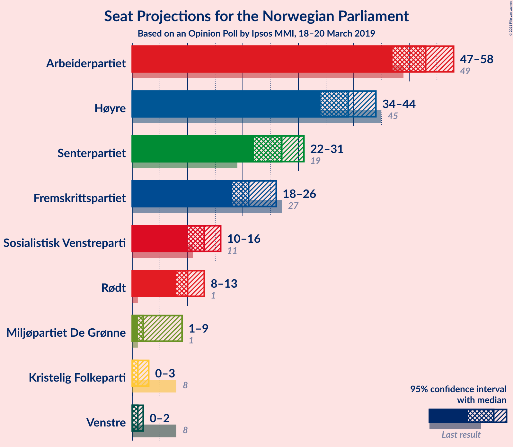
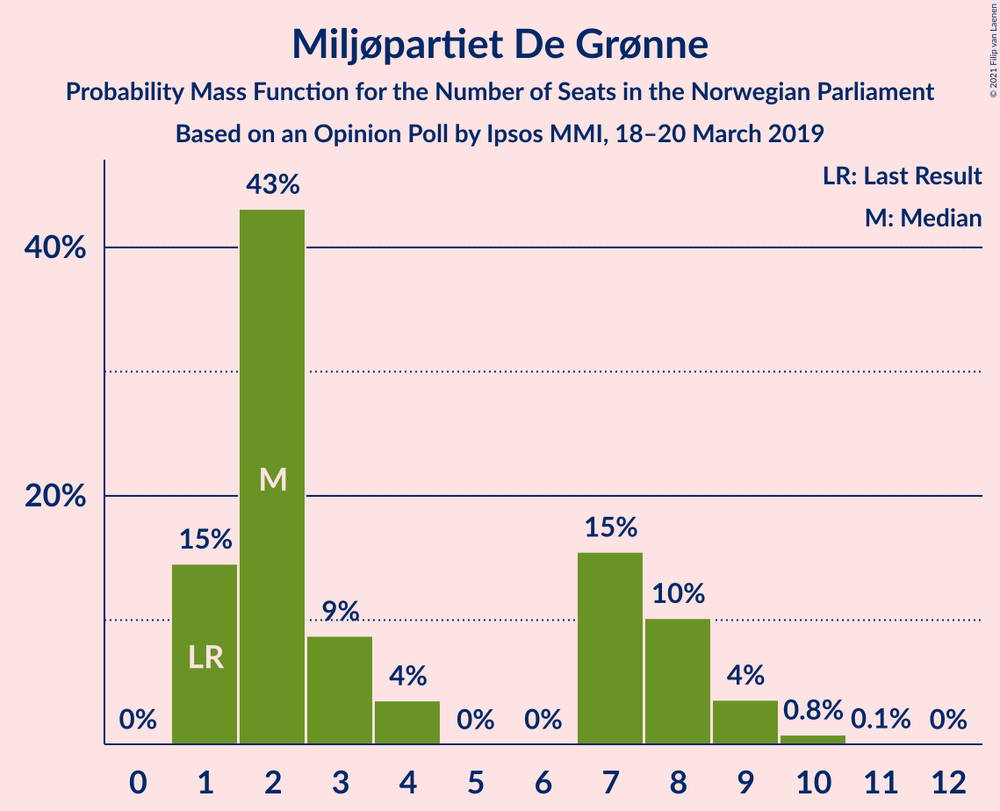
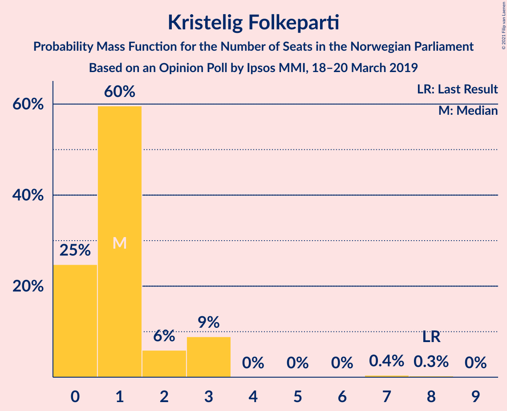
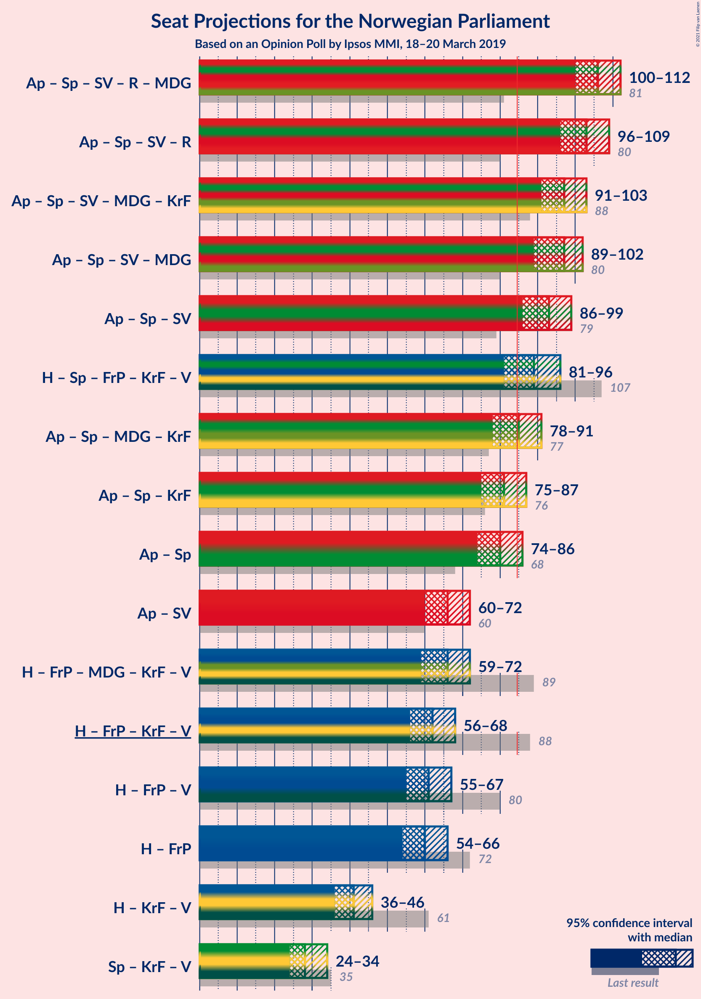
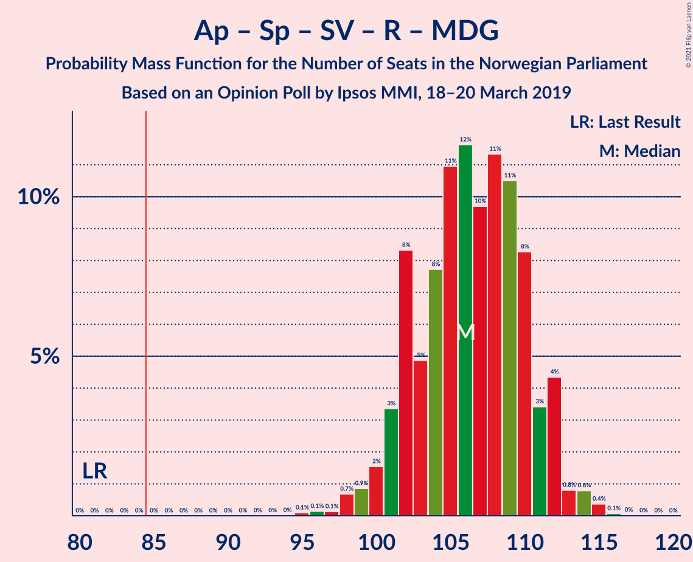
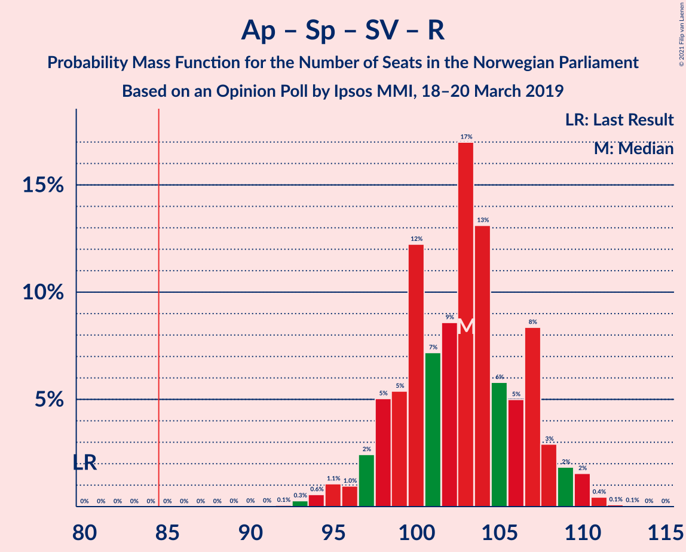
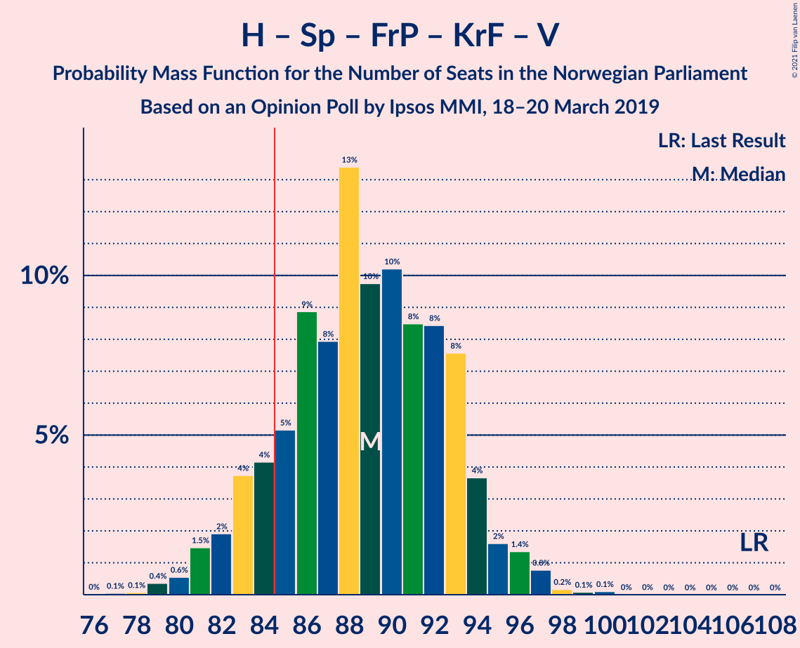
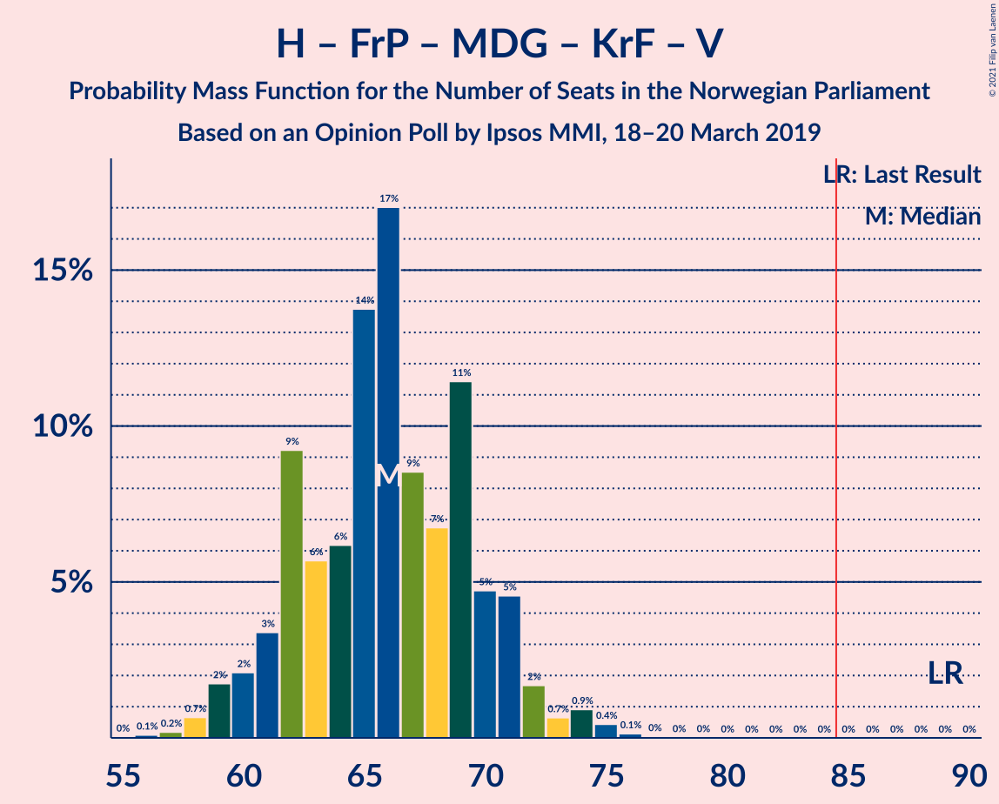
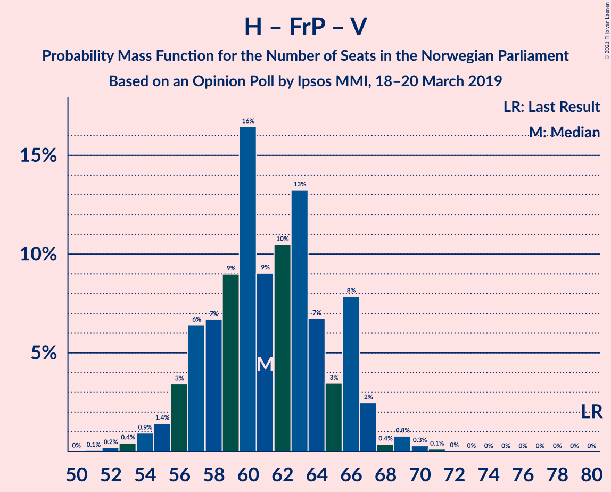

# Opinion Poll by Ipsos MMI, 18–20 March 2019

<a href="#voting-intentions">Voting Intentions</a> | <a href="#seats">Seats</a> | <a href="#coalitions">Coalitions</a> | <a href="#technical-information">Technical Information</a>

## Voting Intentions

### Confidence Intervals

| Party | Last Result | Poll Result | 80% Confidence Interval | 90% Confidence Interval | 95% Confidence Interval | 99% Confidence Interval |
|:-----:|:-----------:|:-----------:|:-----------------------:|:-----------------------:|:-----------------------:|:-----------------------:|
| Arbeiderpartiet | 27.4% | 28.8% | 26.9–30.7% |26.4–31.3% |26.0–31.7% |25.1–32.7% |
| Høyre | 25.0% | 21.3% | 19.7–23.1% |19.2–23.6% |18.8–24.1% |18.1–25.0% |
| Senterpartiet | 10.3% | 14.4% | 13.0–16.0% |12.7–16.4% |12.3–16.8% |11.7–17.6% |
| Fremskrittspartiet | 15.2% | 11.7% | 10.4–13.1% |10.1–13.5% |9.8–13.9% |9.2–14.6% |
| Sosialistisk Venstreparti | 6.0% | 7.0% | 6.0–8.2% |5.8–8.5% |5.5–8.8% |5.1–9.4% |
| Rødt | 2.4% | 5.6% | 4.8–6.7% |4.5–7.0% |4.3–7.3% |3.9–7.8% |
| Miljøpartiet De Grønne | 3.2% | 3.6% | 2.9–4.5% |2.7–4.8% |2.6–5.0% |2.3–5.5% |
| Kristelig Folkeparti | 4.2% | 2.5% | 2.0–3.3% |1.8–3.6% |1.7–3.8% |1.5–4.2% |
| Venstre | 4.4% | 2.0% | 1.5–2.7% |1.4–3.0% |1.3–3.1% |1.1–3.5% |

*Note:* The poll result column reflects the actual value used in the calculations. Published results may vary slightly, and in addition be rounded to fewer digits.

## Seats

### Confidence Intervals

| Party | Last Result | Median | 80% Confidence Interval | 90% Confidence Interval | 95% Confidence Interval | 99% Confidence Interval |
|:-----:|:-----------:|:------:|:-----------------------:|:-----------------------:|:-----------------------:|:-----------------------:|
| <a href="#arbeiderpartiet">Arbeiderpartiet</a> | 49 | 53 | 49–57 |48–58 |47–58 |45–60 |
| <a href="#høyre">Høyre</a> | 45 | 39 | 36–43 |35–43 |34–44 |33–46 |
| <a href="#senterpartiet">Senterpartiet</a> | 19 | 27 | 23–29 |23–30 |22–31 |21–34 |
| <a href="#fremskrittspartiet">Fremskrittspartiet</a> | 27 | 21 | 19–24 |18–25 |18–26 |16–27 |
| <a href="#sosialistisk-venstreparti">Sosialistisk Venstreparti</a> | 11 | 13 | 11–15 |10–16 |10–16 |9–17 |
| <a href="#rødt">Rødt</a> | 1 | 10 | 9–12 |8–13 |8–13 |2–14 |
| <a href="#miljøpartiet-de-grønne">Miljøpartiet De Grønne</a> | 1 | 2 | 1–8 |1–8 |1–9 |1–10 |
| <a href="#kristelig-folkeparti">Kristelig Folkeparti</a> | 8 | 1 | 0–2 |0–3 |0–3 |0–7 |
| <a href="#venstre">Venstre</a> | 8 | 1 | 0–2 |0–2 |0–2 |0–2 |

### Arbeiderpartiet

*For a full overview of the results for this party, see the [Arbeiderpartiet](party-arbeiderpartiet.html) page.*

| Number of Seats | Probability | Accumulated | Special Marks |
|:---------------:|:-----------:|:-----------:|:-------------:|
| 44 | 0.1% | 100% |  |
| 45 | 0.4% | 99.8% |  |
| 46 | 0.8% | 99.5% |  |
| 47 | 3% | 98.7% |  |
| 48 | 3% | 96% |  |
| 49 | 5% | 93% | Last Result |
| 50 | 8% | 89% |  |
| 51 | 10% | 81% |  |
| 52 | 12% | 71% |  |
| 53 | 14% | 59% | Median |
| 54 | 12% | 44% |  |
| 55 | 13% | 32% |  |
| 56 | 7% | 19% |  |
| 57 | 5% | 12% |  |
| 58 | 5% | 7% |  |
| 59 | 1.3% | 2% |  |
| 60 | 0.8% | 1.1% |  |
| 61 | 0.2% | 0.3% |  |
| 62 | 0% | 0.1% |  |
| 63 | 0% | 0.1% |  |
| 64 | 0% | 0% |  |

### Høyre

*For a full overview of the results for this party, see the [Høyre](party-høyre.html) page.*

| Number of Seats | Probability | Accumulated | Special Marks |
|:---------------:|:-----------:|:-----------:|:-------------:|
| 31 | 0.1% | 100% |  |
| 32 | 0.2% | 99.9% |  |
| 33 | 1.1% | 99.6% |  |
| 34 | 2% | 98.6% |  |
| 35 | 6% | 97% |  |
| 36 | 9% | 91% |  |
| 37 | 14% | 82% |  |
| 38 | 13% | 68% |  |
| 39 | 15% | 55% | Median |
| 40 | 13% | 40% |  |
| 41 | 8% | 26% |  |
| 42 | 6% | 18% |  |
| 43 | 9% | 12% |  |
| 44 | 2% | 3% |  |
| 45 | 0.5% | 1.2% | Last Result |
| 46 | 0.5% | 0.7% |  |
| 47 | 0.2% | 0.2% |  |
| 48 | 0% | 0.1% |  |
| 49 | 0% | 0% |  |

### Senterpartiet

*For a full overview of the results for this party, see the [Senterpartiet](party-senterpartiet.html) page.*

| Number of Seats | Probability | Accumulated | Special Marks |
|:---------------:|:-----------:|:-----------:|:-------------:|
| 19 | 0% | 100% | Last Result |
| 20 | 0.2% | 100% |  |
| 21 | 0.8% | 99.8% |  |
| 22 | 2% | 99.0% |  |
| 23 | 7% | 97% |  |
| 24 | 7% | 90% |  |
| 25 | 16% | 83% |  |
| 26 | 15% | 67% |  |
| 27 | 21% | 52% | Median |
| 28 | 17% | 31% |  |
| 29 | 5% | 14% |  |
| 30 | 5% | 9% |  |
| 31 | 2% | 4% |  |
| 32 | 0.6% | 2% |  |
| 33 | 1.3% | 2% |  |
| 34 | 0.5% | 0.6% |  |
| 35 | 0% | 0% |  |

### Fremskrittspartiet

*For a full overview of the results for this party, see the [Fremskrittspartiet](party-fremskrittspartiet.html) page.*

| Number of Seats | Probability | Accumulated | Special Marks |
|:---------------:|:-----------:|:-----------:|:-------------:|
| 15 | 0.1% | 100% |  |
| 16 | 0.5% | 99.9% |  |
| 17 | 2% | 99.4% |  |
| 18 | 6% | 98% |  |
| 19 | 12% | 92% |  |
| 20 | 15% | 80% |  |
| 21 | 19% | 64% | Median |
| 22 | 22% | 46% |  |
| 23 | 10% | 24% |  |
| 24 | 6% | 15% |  |
| 25 | 5% | 8% |  |
| 26 | 2% | 3% |  |
| 27 | 0.6% | 0.7% | Last Result |
| 28 | 0.1% | 0.2% |  |
| 29 | 0% | 0% |  |

### Sosialistisk Venstreparti

*For a full overview of the results for this party, see the [Sosialistisk Venstreparti](party-sosialistiskvenstreparti.html) page.*

| Number of Seats | Probability | Accumulated | Special Marks |
|:---------------:|:-----------:|:-----------:|:-------------:|
| 8 | 0.1% | 100% |  |
| 9 | 0.9% | 99.9% |  |
| 10 | 5% | 99.0% |  |
| 11 | 11% | 94% | Last Result |
| 12 | 26% | 83% |  |
| 13 | 20% | 57% | Median |
| 14 | 23% | 36% |  |
| 15 | 7% | 13% |  |
| 16 | 5% | 6% |  |
| 17 | 1.0% | 1.3% |  |
| 18 | 0.3% | 0.3% |  |
| 19 | 0.1% | 0.1% |  |
| 20 | 0% | 0% |  |

### Rødt

*For a full overview of the results for this party, see the [Rødt](party-rødt.html) page.*

| Number of Seats | Probability | Accumulated | Special Marks |
|:---------------:|:-----------:|:-----------:|:-------------:|
| 1 | 0% | 100% | Last Result |
| 2 | 0.8% | 100% |  |
| 3 | 0% | 99.2% |  |
| 4 | 0% | 99.2% |  |
| 5 | 0% | 99.2% |  |
| 6 | 0% | 99.2% |  |
| 7 | 0.8% | 99.2% |  |
| 8 | 6% | 98% |  |
| 9 | 22% | 93% |  |
| 10 | 32% | 70% | Median |
| 11 | 19% | 38% |  |
| 12 | 10% | 19% |  |
| 13 | 7% | 8% |  |
| 14 | 0.9% | 1.3% |  |
| 15 | 0.4% | 0.4% |  |
| 16 | 0% | 0% |  |

### Miljøpartiet De Grønne

*For a full overview of the results for this party, see the [Miljøpartiet De Grønne](party-miljøpartietdegrønne.html) page.*

| Number of Seats | Probability | Accumulated | Special Marks |
|:---------------:|:-----------:|:-----------:|:-------------:|
| 1 | 15% | 100% | Last Result |
| 2 | 43% | 85% | Median |
| 3 | 9% | 42% |  |
| 4 | 4% | 34% |  |
| 5 | 0% | 30% |  |
| 6 | 0% | 30% |  |
| 7 | 15% | 30% |  |
| 8 | 10% | 15% |  |
| 9 | 4% | 4% |  |
| 10 | 0.8% | 0.9% |  |
| 11 | 0.1% | 0.1% |  |
| 12 | 0% | 0% |  |

### Kristelig Folkeparti

*For a full overview of the results for this party, see the [Kristelig Folkeparti](party-kristeligfolkeparti.html) page.*

| Number of Seats | Probability | Accumulated | Special Marks |
|:---------------:|:-----------:|:-----------:|:-------------:|
| 0 | 25% | 100% |  |
| 1 | 60% | 75% | Median |
| 2 | 6% | 16% |  |
| 3 | 9% | 10% |  |
| 4 | 0% | 0.8% |  |
| 5 | 0% | 0.8% |  |
| 6 | 0% | 0.8% |  |
| 7 | 0.4% | 0.8% |  |
| 8 | 0.3% | 0.3% | Last Result |
| 9 | 0% | 0% |  |

### Venstre

*For a full overview of the results for this party, see the [Venstre](party-venstre.html) page.*

| Number of Seats | Probability | Accumulated | Special Marks |
|:---------------:|:-----------:|:-----------:|:-------------:|
| 0 | 26% | 100% |  |
| 1 | 50% | 74% | Median |
| 2 | 24% | 24% |  |
| 3 | 0% | 0.1% |  |
| 4 | 0% | 0.1% |  |
| 5 | 0% | 0% |  |
| 6 | 0% | 0% |  |
| 7 | 0% | 0% |  |
| 8 | 0% | 0% | Last Result |

## Coalitions

### Confidence Intervals

| Coalition | Last Result | Median | Majority? | 80% Confidence Interval | 90% Confidence Interval | 95% Confidence Interval | 99% Confidence Interval |
|:---------:|:-----------:|:------:|:---------:|:-----------------------:|:-----------------------:|:-----------------------:|:-----------------------:|
| Arbeiderpartiet – Senterpartiet – Sosialistisk Venstreparti – Rødt – Miljøpartiet De Grønne | 81 | 106 | 100% | 102–110 | 101–112 | 100–112 | 98–114 |
| Arbeiderpartiet – Senterpartiet – Sosialistisk Venstreparti – Rødt | 80 | 103 | 100% | 98–107 | 97–108 | 96–109 | 94–111 |
| Arbeiderpartiet – Senterpartiet – Sosialistisk Venstreparti – Miljøpartiet De Grønne – Kristelig Folkeparti | 88 | 97 | 100% | 93–102 | 92–103 | 91–103 | 88–106 |
| Arbeiderpartiet – Senterpartiet – Sosialistisk Venstreparti – Miljøpartiet De Grønne | 80 | 97 | 100% | 92–101 | 90–102 | 89–102 | 87–105 |
| Arbeiderpartiet – Senterpartiet – Sosialistisk Venstreparti | 79 | 93 | 99.2% | 89–97 | 87–98 | 86–99 | 84–100 |
| Høyre – Senterpartiet – Fremskrittspartiet – Kristelig Folkeparti – Venstre | 107 | 89 | 88% | 84–93 | 83–94 | 81–96 | 79–97 |
| Arbeiderpartiet – Senterpartiet – Miljøpartiet De Grønne – Kristelig Folkeparti | 77 | 85 | 51% | 79–89 | 79–90 | 78–91 | 75–93 |
| Arbeiderpartiet – Senterpartiet – Kristelig Folkeparti | 76 | 81 | 8% | 77–84 | 75–86 | 75–87 | 72–89 |
| Arbeiderpartiet – Senterpartiet | 68 | 80 | 6% | 76–83 | 74–85 | 74–86 | 71–88 |
| Arbeiderpartiet – Sosialistisk Venstreparti | 60 | 66 | 0% | 62–70 | 60–71 | 60–72 | 58–73 |
| Høyre – Fremskrittspartiet – Miljøpartiet De Grønne – Kristelig Folkeparti – Venstre | 89 | 66 | 0% | 62–70 | 61–71 | 59–72 | 58–75 |
| Høyre – Fremskrittspartiet – Kristelig Folkeparti – Venstre | 88 | 62 | 0% | 58–67 | 57–67 | 56–68 | 54–71 |
| Høyre – Fremskrittspartiet – Venstre | 80 | 61 | 0% | 57–66 | 56–66 | 55–67 | 53–69 |
| Høyre – Fremskrittspartiet | 72 | 60 | 0% | 56–65 | 55–65 | 54–66 | 52–68 |
| Høyre – Kristelig Folkeparti – Venstre | 61 | 41 | 0% | 37–45 | 37–45 | 36–46 | 34–49 |
| Senterpartiet – Kristelig Folkeparti – Venstre | 35 | 28 | 0% | 26–32 | 25–33 | 24–34 | 22–36 |

### Arbeiderpartiet – Senterpartiet – Sosialistisk Venstreparti – Rødt – Miljøpartiet De Grønne

| Number of Seats | Probability | Accumulated | Special Marks |
|:---------------:|:-----------:|:-----------:|:-------------:|
| 81 | 0% | 100% | Last Result |
| 82 | 0% | 100% |  |
| 83 | 0% | 100% |  |
| 84 | 0% | 100% |  |
| 85 | 0% | 100% | Majority |
| 86 | 0% | 100% |  |
| 87 | 0% | 100% |  |
| 88 | 0% | 100% |  |
| 89 | 0% | 100% |  |
| 90 | 0% | 100% |  |
| 91 | 0% | 100% |  |
| 92 | 0% | 100% |  |
| 93 | 0% | 100% |  |
| 94 | 0% | 100% |  |
| 95 | 0.1% | 100% |  |
| 96 | 0.1% | 99.9% |  |
| 97 | 0.1% | 99.7% |  |
| 98 | 0.7% | 99.6% |  |
| 99 | 0.9% | 98.9% |  |
| 100 | 2% | 98% |  |
| 101 | 3% | 97% |  |
| 102 | 8% | 93% |  |
| 103 | 5% | 85% |  |
| 104 | 8% | 80% |  |
| 105 | 11% | 72% | Median |
| 106 | 12% | 61% |  |
| 107 | 10% | 50% |  |
| 108 | 11% | 40% |  |
| 109 | 11% | 29% |  |
| 110 | 8% | 18% |  |
| 111 | 3% | 10% |  |
| 112 | 4% | 6% |  |
| 113 | 0.8% | 2% |  |
| 114 | 0.8% | 1.3% |  |
| 115 | 0.4% | 0.5% |  |
| 116 | 0.1% | 0.1% |  |
| 117 | 0% | 0% |  |

### Arbeiderpartiet – Senterpartiet – Sosialistisk Venstreparti – Rødt

| Number of Seats | Probability | Accumulated | Special Marks |
|:---------------:|:-----------:|:-----------:|:-------------:|
| 80 | 0% | 100% | Last Result |
| 81 | 0% | 100% |  |
| 82 | 0% | 100% |  |
| 83 | 0% | 100% |  |
| 84 | 0% | 100% |  |
| 85 | 0% | 100% | Majority |
| 86 | 0% | 100% |  |
| 87 | 0% | 100% |  |
| 88 | 0% | 100% |  |
| 89 | 0% | 100% |  |
| 90 | 0% | 100% |  |
| 91 | 0% | 100% |  |
| 92 | 0.1% | 99.9% |  |
| 93 | 0.3% | 99.9% |  |
| 94 | 0.6% | 99.6% |  |
| 95 | 1.1% | 99.0% |  |
| 96 | 1.0% | 98% |  |
| 97 | 2% | 97% |  |
| 98 | 5% | 95% |  |
| 99 | 5% | 90% |  |
| 100 | 12% | 84% |  |
| 101 | 7% | 72% |  |
| 102 | 9% | 65% |  |
| 103 | 17% | 56% | Median |
| 104 | 13% | 39% |  |
| 105 | 6% | 26% |  |
| 106 | 5% | 20% |  |
| 107 | 8% | 15% |  |
| 108 | 3% | 7% |  |
| 109 | 2% | 4% |  |
| 110 | 2% | 2% |  |
| 111 | 0.4% | 0.6% |  |
| 112 | 0.1% | 0.2% |  |
| 113 | 0.1% | 0.1% |  |
| 114 | 0% | 0% |  |

### Arbeiderpartiet – Senterpartiet – Sosialistisk Venstreparti – Miljøpartiet De Grønne – Kristelig Folkeparti

| Number of Seats | Probability | Accumulated | Special Marks |
|:---------------:|:-----------:|:-----------:|:-------------:|
| 86 | 0.1% | 100% |  |
| 87 | 0.1% | 99.9% |  |
| 88 | 0.4% | 99.8% | Last Result |
| 89 | 1.0% | 99.4% |  |
| 90 | 0.7% | 98% |  |
| 91 | 2% | 98% |  |
| 92 | 3% | 95% |  |
| 93 | 7% | 92% |  |
| 94 | 7% | 86% |  |
| 95 | 11% | 79% |  |
| 96 | 9% | 67% | Median |
| 97 | 11% | 58% |  |
| 98 | 5% | 47% |  |
| 99 | 19% | 41% |  |
| 100 | 6% | 22% |  |
| 101 | 5% | 16% |  |
| 102 | 5% | 12% |  |
| 103 | 4% | 6% |  |
| 104 | 0.7% | 2% |  |
| 105 | 0.6% | 1.3% |  |
| 106 | 0.4% | 0.7% |  |
| 107 | 0.3% | 0.3% |  |
| 108 | 0% | 0.1% |  |
| 109 | 0% | 0% |  |

### Arbeiderpartiet – Senterpartiet – Sosialistisk Venstreparti – Miljøpartiet De Grønne

| Number of Seats | Probability | Accumulated | Special Marks |
|:---------------:|:-----------:|:-----------:|:-------------:|
| 80 | 0% | 100% | Last Result |
| 81 | 0% | 100% |  |
| 82 | 0% | 100% |  |
| 83 | 0% | 100% |  |
| 84 | 0% | 100% |  |
| 85 | 0.1% | 100% | Majority |
| 86 | 0.1% | 99.9% |  |
| 87 | 0.3% | 99.7% |  |
| 88 | 1.2% | 99.4% |  |
| 89 | 1.1% | 98% |  |
| 90 | 2% | 97% |  |
| 91 | 3% | 95% |  |
| 92 | 9% | 91% |  |
| 93 | 7% | 83% |  |
| 94 | 8% | 76% |  |
| 95 | 9% | 67% | Median |
| 96 | 7% | 59% |  |
| 97 | 14% | 51% |  |
| 98 | 14% | 38% |  |
| 99 | 8% | 24% |  |
| 100 | 6% | 16% |  |
| 101 | 4% | 11% |  |
| 102 | 5% | 6% |  |
| 103 | 0.6% | 2% |  |
| 104 | 0.6% | 1.2% |  |
| 105 | 0.4% | 0.6% |  |
| 106 | 0.2% | 0.3% |  |
| 107 | 0% | 0% |  |

### Arbeiderpartiet – Senterpartiet – Sosialistisk Venstreparti

| Number of Seats | Probability | Accumulated | Special Marks |
|:---------------:|:-----------:|:-----------:|:-------------:|
| 79 | 0% | 100% | Last Result |
| 80 | 0% | 100% |  |
| 81 | 0.1% | 100% |  |
| 82 | 0.1% | 99.9% |  |
| 83 | 0.1% | 99.8% |  |
| 84 | 0.5% | 99.7% |  |
| 85 | 1.0% | 99.2% | Majority |
| 86 | 2% | 98% |  |
| 87 | 3% | 96% |  |
| 88 | 3% | 94% |  |
| 89 | 6% | 91% |  |
| 90 | 16% | 85% |  |
| 91 | 11% | 69% |  |
| 92 | 6% | 58% |  |
| 93 | 12% | 52% | Median |
| 94 | 16% | 39% |  |
| 95 | 8% | 24% |  |
| 96 | 3% | 16% |  |
| 97 | 7% | 13% |  |
| 98 | 3% | 6% |  |
| 99 | 1.1% | 3% |  |
| 100 | 1.5% | 2% |  |
| 101 | 0.1% | 0.3% |  |
| 102 | 0.1% | 0.2% |  |
| 103 | 0.1% | 0.1% |  |
| 104 | 0% | 0% |  |

### Høyre – Senterpartiet – Fremskrittspartiet – Kristelig Folkeparti – Venstre

| Number of Seats | Probability | Accumulated | Special Marks |
|:---------------:|:-----------:|:-----------:|:-------------:|
| 77 | 0.1% | 100% |  |
| 78 | 0.1% | 99.9% |  |
| 79 | 0.4% | 99.8% |  |
| 80 | 0.6% | 99.5% |  |
| 81 | 1.5% | 98.9% |  |
| 82 | 2% | 97% |  |
| 83 | 4% | 96% |  |
| 84 | 4% | 92% |  |
| 85 | 5% | 88% | Majority |
| 86 | 9% | 82% |  |
| 87 | 8% | 74% |  |
| 88 | 13% | 66% |  |
| 89 | 10% | 52% | Median |
| 90 | 10% | 43% |  |
| 91 | 8% | 32% |  |
| 92 | 8% | 24% |  |
| 93 | 8% | 15% |  |
| 94 | 4% | 8% |  |
| 95 | 2% | 4% |  |
| 96 | 1.4% | 3% |  |
| 97 | 0.8% | 1.2% |  |
| 98 | 0.2% | 0.4% |  |
| 99 | 0.1% | 0.2% |  |
| 100 | 0.1% | 0.1% |  |
| 101 | 0% | 0% |  |
| 102 | 0% | 0% |  |
| 103 | 0% | 0% |  |
| 104 | 0% | 0% |  |
| 105 | 0% | 0% |  |
| 106 | 0% | 0% |  |
| 107 | 0% | 0% | Last Result |

### Arbeiderpartiet – Senterpartiet – Miljøpartiet De Grønne – Kristelig Folkeparti

| Number of Seats | Probability | Accumulated | Special Marks |
|:---------------:|:-----------:|:-----------:|:-------------:|
| 73 | 0% | 100% |  |
| 74 | 0.2% | 99.9% |  |
| 75 | 0.3% | 99.8% |  |
| 76 | 0.3% | 99.4% |  |
| 77 | 2% | 99.1% | Last Result |
| 78 | 1.4% | 98% |  |
| 79 | 8% | 96% |  |
| 80 | 4% | 88% |  |
| 81 | 6% | 84% |  |
| 82 | 10% | 78% |  |
| 83 | 11% | 68% | Median |
| 84 | 6% | 57% |  |
| 85 | 17% | 51% | Majority |
| 86 | 3% | 34% |  |
| 87 | 13% | 31% |  |
| 88 | 6% | 19% |  |
| 89 | 5% | 13% |  |
| 90 | 4% | 8% |  |
| 91 | 2% | 4% |  |
| 92 | 1.0% | 2% |  |
| 93 | 0.6% | 0.9% |  |
| 94 | 0.2% | 0.4% |  |
| 95 | 0% | 0.1% |  |
| 96 | 0.1% | 0.1% |  |
| 97 | 0% | 0% |  |

### Arbeiderpartiet – Senterpartiet – Kristelig Folkeparti

| Number of Seats | Probability | Accumulated | Special Marks |
|:---------------:|:-----------:|:-----------:|:-------------:|
| 70 | 0.1% | 100% |  |
| 71 | 0.1% | 99.9% |  |
| 72 | 0.5% | 99.8% |  |
| 73 | 0.6% | 99.4% |  |
| 74 | 1.0% | 98.8% |  |
| 75 | 3% | 98% |  |
| 76 | 3% | 94% | Last Result |
| 77 | 10% | 91% |  |
| 78 | 7% | 81% |  |
| 79 | 8% | 75% |  |
| 80 | 12% | 67% |  |
| 81 | 17% | 54% | Median |
| 82 | 9% | 37% |  |
| 83 | 15% | 29% |  |
| 84 | 6% | 14% |  |
| 85 | 2% | 8% | Majority |
| 86 | 2% | 6% |  |
| 87 | 3% | 4% |  |
| 88 | 0.5% | 1.3% |  |
| 89 | 0.6% | 0.8% |  |
| 90 | 0.1% | 0.2% |  |
| 91 | 0.1% | 0.1% |  |
| 92 | 0% | 0% |  |

### Arbeiderpartiet – Senterpartiet

| Number of Seats | Probability | Accumulated | Special Marks |
|:---------------:|:-----------:|:-----------:|:-------------:|
| 68 | 0% | 100% | Last Result |
| 69 | 0.1% | 100% |  |
| 70 | 0.1% | 99.9% |  |
| 71 | 0.3% | 99.7% |  |
| 72 | 0.9% | 99.5% |  |
| 73 | 1.0% | 98.6% |  |
| 74 | 3% | 98% |  |
| 75 | 3% | 94% |  |
| 76 | 9% | 91% |  |
| 77 | 6% | 82% |  |
| 78 | 13% | 75% |  |
| 79 | 10% | 62% |  |
| 80 | 11% | 52% | Median |
| 81 | 14% | 41% |  |
| 82 | 11% | 27% |  |
| 83 | 8% | 16% |  |
| 84 | 3% | 9% |  |
| 85 | 3% | 6% | Majority |
| 86 | 2% | 3% |  |
| 87 | 0.2% | 0.9% |  |
| 88 | 0.5% | 0.7% |  |
| 89 | 0.1% | 0.2% |  |
| 90 | 0.1% | 0.1% |  |
| 91 | 0% | 0% |  |

### Arbeiderpartiet – Sosialistisk Venstreparti

| Number of Seats | Probability | Accumulated | Special Marks |
|:---------------:|:-----------:|:-----------:|:-------------:|
| 56 | 0.1% | 100% |  |
| 57 | 0.2% | 99.8% |  |
| 58 | 0.7% | 99.7% |  |
| 59 | 1.2% | 99.0% |  |
| 60 | 3% | 98% | Last Result |
| 61 | 2% | 95% |  |
| 62 | 7% | 93% |  |
| 63 | 6% | 85% |  |
| 64 | 10% | 79% |  |
| 65 | 16% | 69% |  |
| 66 | 10% | 54% | Median |
| 67 | 13% | 43% |  |
| 68 | 11% | 30% |  |
| 69 | 4% | 19% |  |
| 70 | 5% | 15% |  |
| 71 | 7% | 10% |  |
| 72 | 2% | 3% |  |
| 73 | 0.8% | 1.2% |  |
| 74 | 0.3% | 0.4% |  |
| 75 | 0.1% | 0.2% |  |
| 76 | 0.1% | 0.1% |  |
| 77 | 0% | 0% |  |

### Høyre – Fremskrittspartiet – Miljøpartiet De Grønne – Kristelig Folkeparti – Venstre

| Number of Seats | Probability | Accumulated | Special Marks |
|:---------------:|:-----------:|:-----------:|:-------------:|
| 55 | 0% | 100% |  |
| 56 | 0.1% | 99.9% |  |
| 57 | 0.2% | 99.8% |  |
| 58 | 0.7% | 99.7% |  |
| 59 | 2% | 99.0% |  |
| 60 | 2% | 97% |  |
| 61 | 3% | 95% |  |
| 62 | 9% | 92% |  |
| 63 | 6% | 83% |  |
| 64 | 6% | 77% | Median |
| 65 | 14% | 71% |  |
| 66 | 17% | 57% |  |
| 67 | 9% | 40% |  |
| 68 | 7% | 31% |  |
| 69 | 11% | 25% |  |
| 70 | 5% | 13% |  |
| 71 | 5% | 8% |  |
| 72 | 2% | 4% |  |
| 73 | 0.7% | 2% |  |
| 74 | 0.9% | 2% |  |
| 75 | 0.4% | 0.7% |  |
| 76 | 0.1% | 0.2% |  |
| 77 | 0% | 0.1% |  |
| 78 | 0% | 0% |  |
| 79 | 0% | 0% |  |
| 80 | 0% | 0% |  |
| 81 | 0% | 0% |  |
| 82 | 0% | 0% |  |
| 83 | 0% | 0% |  |
| 84 | 0% | 0% |  |
| 85 | 0% | 0% | Majority |
| 86 | 0% | 0% |  |
| 87 | 0% | 0% |  |
| 88 | 0% | 0% |  |
| 89 | 0% | 0% | Last Result |

### Høyre – Fremskrittspartiet – Kristelig Folkeparti – Venstre

| Number of Seats | Probability | Accumulated | Special Marks |
|:---------------:|:-----------:|:-----------:|:-------------:|
| 52 | 0% | 100% |  |
| 53 | 0.1% | 99.9% |  |
| 54 | 0.5% | 99.8% |  |
| 55 | 0.9% | 99.3% |  |
| 56 | 1.2% | 98% |  |
| 57 | 5% | 97% |  |
| 58 | 4% | 92% |  |
| 59 | 9% | 88% |  |
| 60 | 11% | 80% |  |
| 61 | 12% | 68% |  |
| 62 | 10% | 57% | Median |
| 63 | 11% | 46% |  |
| 64 | 11% | 35% |  |
| 65 | 7% | 24% |  |
| 66 | 4% | 17% |  |
| 67 | 8% | 13% |  |
| 68 | 2% | 5% |  |
| 69 | 1.1% | 2% |  |
| 70 | 0.7% | 1.2% |  |
| 71 | 0.4% | 0.6% |  |
| 72 | 0.1% | 0.2% |  |
| 73 | 0.1% | 0.1% |  |
| 74 | 0% | 0% |  |
| 75 | 0% | 0% |  |
| 76 | 0% | 0% |  |
| 77 | 0% | 0% |  |
| 78 | 0% | 0% |  |
| 79 | 0% | 0% |  |
| 80 | 0% | 0% |  |
| 81 | 0% | 0% |  |
| 82 | 0% | 0% |  |
| 83 | 0% | 0% |  |
| 84 | 0% | 0% |  |
| 85 | 0% | 0% | Majority |
| 86 | 0% | 0% |  |
| 87 | 0% | 0% |  |
| 88 | 0% | 0% | Last Result |

### Høyre – Fremskrittspartiet – Venstre

| Number of Seats | Probability | Accumulated | Special Marks |
|:---------------:|:-----------:|:-----------:|:-------------:|
| 51 | 0.1% | 100% |  |
| 52 | 0.2% | 99.9% |  |
| 53 | 0.4% | 99.7% |  |
| 54 | 0.9% | 99.3% |  |
| 55 | 1.4% | 98% |  |
| 56 | 3% | 97% |  |
| 57 | 6% | 93% |  |
| 58 | 7% | 87% |  |
| 59 | 9% | 80% |  |
| 60 | 16% | 71% |  |
| 61 | 9% | 55% | Median |
| 62 | 10% | 46% |  |
| 63 | 13% | 35% |  |
| 64 | 7% | 22% |  |
| 65 | 3% | 15% |  |
| 66 | 8% | 12% |  |
| 67 | 2% | 4% |  |
| 68 | 0.4% | 2% |  |
| 69 | 0.8% | 1.3% |  |
| 70 | 0.3% | 0.5% |  |
| 71 | 0.1% | 0.2% |  |
| 72 | 0% | 0.1% |  |
| 73 | 0% | 0% |  |
| 74 | 0% | 0% |  |
| 75 | 0% | 0% |  |
| 76 | 0% | 0% |  |
| 77 | 0% | 0% |  |
| 78 | 0% | 0% |  |
| 79 | 0% | 0% |  |
| 80 | 0% | 0% | Last Result |

### Høyre – Fremskrittspartiet

| Number of Seats | Probability | Accumulated | Special Marks |
|:---------------:|:-----------:|:-----------:|:-------------:|
| 50 | 0.1% | 100% |  |
| 51 | 0.2% | 99.9% |  |
| 52 | 0.3% | 99.7% |  |
| 53 | 0.9% | 99.4% |  |
| 54 | 2% | 98.5% |  |
| 55 | 3% | 97% |  |
| 56 | 8% | 94% |  |
| 57 | 6% | 86% |  |
| 58 | 7% | 80% |  |
| 59 | 14% | 73% |  |
| 60 | 16% | 59% | Median |
| 61 | 11% | 44% |  |
| 62 | 9% | 33% |  |
| 63 | 8% | 24% |  |
| 64 | 5% | 16% |  |
| 65 | 6% | 11% |  |
| 66 | 2% | 4% |  |
| 67 | 1.1% | 2% |  |
| 68 | 0.9% | 1.3% |  |
| 69 | 0.1% | 0.4% |  |
| 70 | 0.2% | 0.2% |  |
| 71 | 0% | 0% |  |
| 72 | 0% | 0% | Last Result |

### Høyre – Kristelig Folkeparti – Venstre

| Number of Seats | Probability | Accumulated | Special Marks |
|:---------------:|:-----------:|:-----------:|:-------------:|
| 32 | 0.1% | 100% |  |
| 33 | 0.1% | 99.9% |  |
| 34 | 0.5% | 99.8% |  |
| 35 | 0.9% | 99.3% |  |
| 36 | 2% | 98% |  |
| 37 | 8% | 97% |  |
| 38 | 9% | 88% |  |
| 39 | 12% | 79% |  |
| 40 | 12% | 67% |  |
| 41 | 17% | 55% | Median |
| 42 | 10% | 39% |  |
| 43 | 8% | 28% |  |
| 44 | 5% | 20% |  |
| 45 | 12% | 16% |  |
| 46 | 2% | 4% |  |
| 47 | 0.9% | 2% |  |
| 48 | 0.6% | 1.1% |  |
| 49 | 0.3% | 0.5% |  |
| 50 | 0.2% | 0.2% |  |
| 51 | 0% | 0% |  |
| 52 | 0% | 0% |  |
| 53 | 0% | 0% |  |
| 54 | 0% | 0% |  |
| 55 | 0% | 0% |  |
| 56 | 0% | 0% |  |
| 57 | 0% | 0% |  |
| 58 | 0% | 0% |  |
| 59 | 0% | 0% |  |
| 60 | 0% | 0% |  |
| 61 | 0% | 0% | Last Result |

### Senterpartiet – Kristelig Folkeparti – Venstre

| Number of Seats | Probability | Accumulated | Special Marks |
|:---------------:|:-----------:|:-----------:|:-------------:|
| 21 | 0.1% | 100% |  |
| 22 | 0.5% | 99.9% |  |
| 23 | 0.9% | 99.4% |  |
| 24 | 3% | 98% |  |
| 25 | 4% | 96% |  |
| 26 | 11% | 92% |  |
| 27 | 18% | 81% |  |
| 28 | 16% | 63% |  |
| 29 | 15% | 47% | Median |
| 30 | 13% | 32% |  |
| 31 | 6% | 18% |  |
| 32 | 5% | 12% |  |
| 33 | 4% | 7% |  |
| 34 | 1.4% | 3% |  |
| 35 | 0.7% | 2% | Last Result |
| 36 | 0.6% | 1.0% |  |
| 37 | 0.3% | 0.4% |  |
| 38 | 0% | 0.1% |  |
| 39 | 0% | 0% |  |

## Technical Information

### Opinion Poll

+ **Polling firm:** Ipsos MMI
+ **Commissioner(s):** —
+ **Fieldwork period:** 18–20 March 2019

### Calculations

+ **Sample size:** 942
+ **Simulations done:** 1,048,576
+ **Error estimate:** 3.31%

