# Opinion Poll by Kantar TNS, 25–29 March 2019

<a href="#voting-intentions">Voting Intentions</a> | <a href="#seats">Seats</a> | <a href="#coalitions">Coalitions</a> | <a href="#technical-information">Technical Information</a>

## Voting Intentions

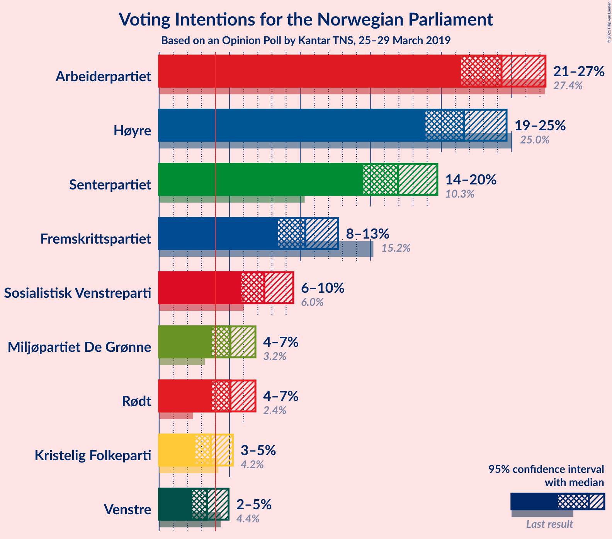

### Confidence Intervals

| Party | Last Result | Poll Result | 80% Confidence Interval | 90% Confidence Interval | 95% Confidence Interval | 99% Confidence Interval |
|:-----:|:-----------:|:-----------:|:-----------------------:|:-----------------------:|:-----------------------:|:-----------------------:|
| Arbeiderpartiet | 27.4% | 24.3% | 22.4–26.3% |21.9–26.9% |21.4–27.4% |20.5–28.4% |
| Høyre | 25.0% | 21.6% | 19.8–23.6% |19.3–24.1% |18.9–24.6% |18.0–25.6% |
| Senterpartiet | 10.3% | 16.9% | 15.3–18.8% |14.9–19.3% |14.5–19.7% |13.7–20.6% |
| Fremskrittspartiet | 15.2% | 10.4% | 9.1–11.9% |8.7–12.3% |8.4–12.7% |7.8–13.5% |
| Sosialistisk Venstreparti | 6.0% | 7.5% | 6.4–8.8% |6.1–9.2% |5.8–9.5% |5.3–10.2% |
| Rødt | 2.4% | 5.1% | 4.2–6.2% |3.9–6.5% |3.7–6.8% |3.4–7.4% |
| Miljøpartiet De Grønne | 3.2% | 5.1% | 4.2–6.2% |3.9–6.5% |3.7–6.8% |3.4–7.4% |
| Kristelig Folkeparti | 4.2% | 3.7% | 2.9–4.7% |2.7–5.0% |2.6–5.2% |2.3–5.7% |
| Venstre | 4.4% | 3.4% | 2.7–4.4% |2.5–4.7% |2.3–4.9% |2.1–5.4% |

*Note:* The poll result column reflects the actual value used in the calculations. Published results may vary slightly, and in addition be rounded to fewer digits.

## Seats

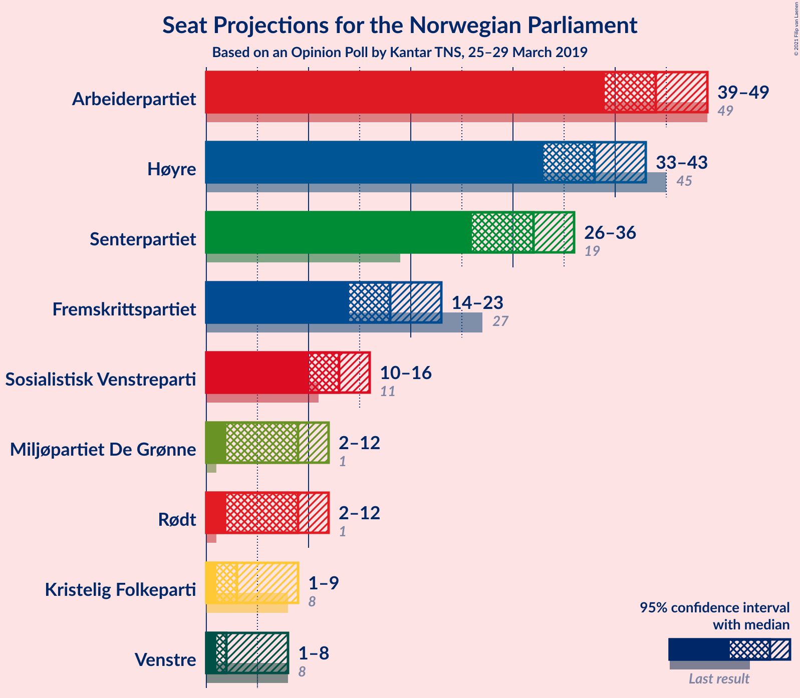

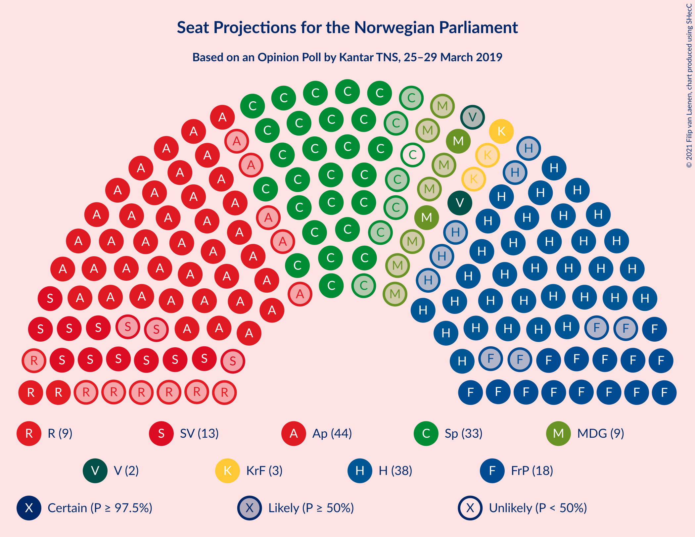

### Confidence Intervals

| Party | Last Result | Median | 80% Confidence Interval | 90% Confidence Interval | 95% Confidence Interval | 99% Confidence Interval |
|:-----:|:-----------:|:------:|:-----------------------:|:-----------------------:|:-----------------------:|:-----------------------:|
| <a href="#arbeiderpartiet">Arbeiderpartiet</a> | 49 | 44 | 41–46 |40–48 |39–49 |38–51 |
| <a href="#høyre">Høyre</a> | 45 | 38 | 34–42 |34–43 |33–43 |32–45 |
| <a href="#senterpartiet">Senterpartiet</a> | 19 | 32 | 28–35 |27–36 |26–36 |25–38 |
| <a href="#fremskrittspartiet">Fremskrittspartiet</a> | 27 | 18 | 15–21 |15–22 |14–23 |13–24 |
| <a href="#sosialistisk-venstreparti">Sosialistisk Venstreparti</a> | 11 | 13 | 11–16 |10–16 |10–16 |9–18 |
| <a href="#rødt">Rødt</a> | 1 | 9 | 7–11 |2–11 |2–12 |2–13 |
| <a href="#miljøpartiet-de-grønne">Miljøpartiet De Grønne</a> | 1 | 9 | 7–11 |2–12 |2–12 |2–13 |
| <a href="#kristelig-folkeparti">Kristelig Folkeparti</a> | 8 | 3 | 1–8 |1–8 |1–9 |0–10 |
| <a href="#venstre">Venstre</a> | 8 | 2 | 2–7 |2–8 |1–8 |1–9 |

### Arbeiderpartiet

*For a full overview of the results for this party, see the [Arbeiderpartiet](party-arbeiderpartiet.html) page.*

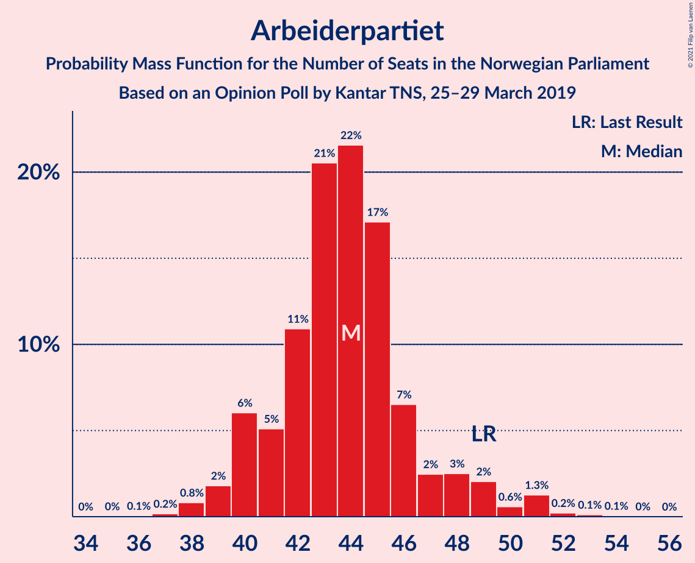

| Number of Seats | Probability | Accumulated | Special Marks |
|:---------------:|:-----------:|:-----------:|:-------------:|
| 36 | 0.1% | 100% |  |
| 37 | 0.2% | 99.9% |  |
| 38 | 0.8% | 99.7% |  |
| 39 | 2% | 98.9% |  |
| 40 | 6% | 97% |  |
| 41 | 5% | 91% |  |
| 42 | 11% | 86% |  |
| 43 | 21% | 75% |  |
| 44 | 22% | 55% | Median |
| 45 | 17% | 33% |  |
| 46 | 7% | 16% |  |
| 47 | 2% | 9% |  |
| 48 | 3% | 7% |  |
| 49 | 2% | 4% | Last Result |
| 50 | 0.6% | 2% |  |
| 51 | 1.3% | 2% |  |
| 52 | 0.2% | 0.4% |  |
| 53 | 0.1% | 0.2% |  |
| 54 | 0.1% | 0.1% |  |
| 55 | 0% | 0% |  |

### Høyre

*For a full overview of the results for this party, see the [Høyre](party-høyre.html) page.*

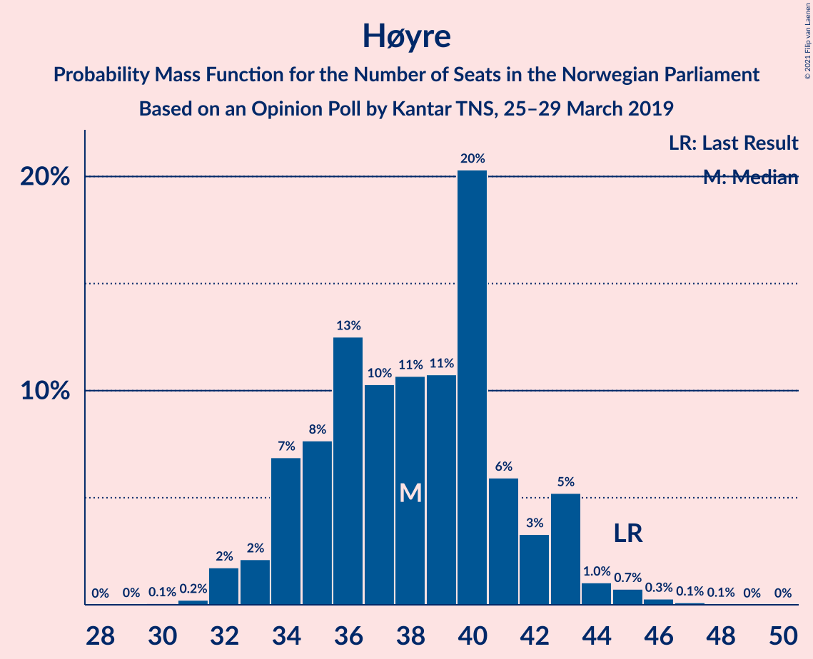

| Number of Seats | Probability | Accumulated | Special Marks |
|:---------------:|:-----------:|:-----------:|:-------------:|
| 30 | 0.1% | 100% |  |
| 31 | 0.2% | 99.9% |  |
| 32 | 2% | 99.7% |  |
| 33 | 2% | 98% |  |
| 34 | 7% | 96% |  |
| 35 | 8% | 89% |  |
| 36 | 13% | 81% |  |
| 37 | 10% | 69% |  |
| 38 | 11% | 58% | Median |
| 39 | 11% | 48% |  |
| 40 | 20% | 37% |  |
| 41 | 6% | 17% |  |
| 42 | 3% | 11% |  |
| 43 | 5% | 7% |  |
| 44 | 1.0% | 2% |  |
| 45 | 0.7% | 1.2% | Last Result |
| 46 | 0.3% | 0.5% |  |
| 47 | 0.1% | 0.2% |  |
| 48 | 0.1% | 0.1% |  |
| 49 | 0% | 0% |  |

### Senterpartiet

*For a full overview of the results for this party, see the [Senterpartiet](party-senterpartiet.html) page.*

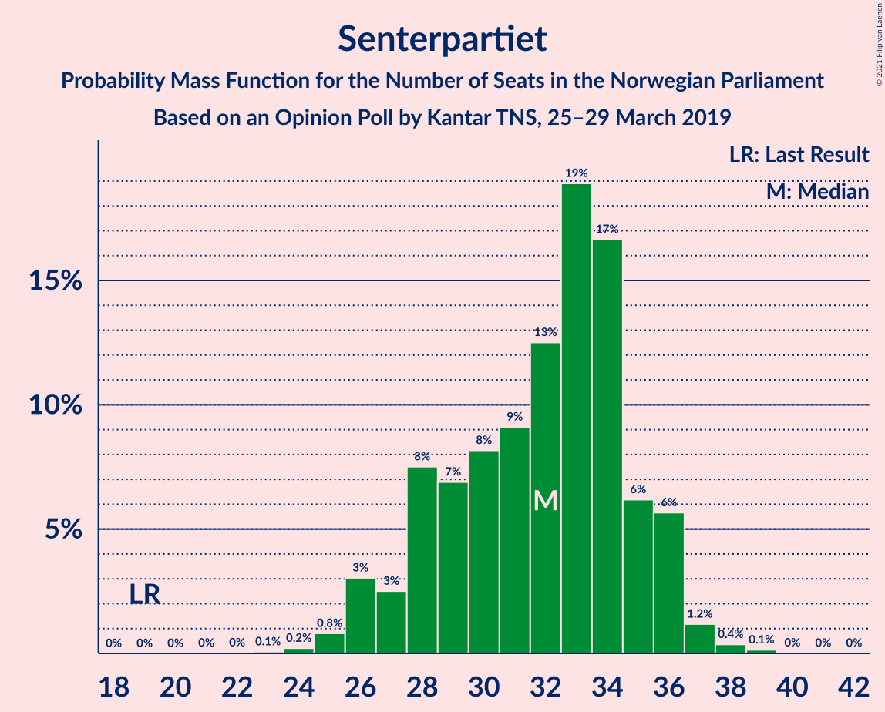

| Number of Seats | Probability | Accumulated | Special Marks |
|:---------------:|:-----------:|:-----------:|:-------------:|
| 19 | 0% | 100% | Last Result |
| 20 | 0% | 100% |  |
| 21 | 0% | 100% |  |
| 22 | 0% | 100% |  |
| 23 | 0.1% | 100% |  |
| 24 | 0.2% | 99.9% |  |
| 25 | 0.8% | 99.7% |  |
| 26 | 3% | 98.9% |  |
| 27 | 3% | 96% |  |
| 28 | 8% | 93% |  |
| 29 | 7% | 86% |  |
| 30 | 8% | 79% |  |
| 31 | 9% | 71% |  |
| 32 | 13% | 62% | Median |
| 33 | 19% | 49% |  |
| 34 | 17% | 30% |  |
| 35 | 6% | 14% |  |
| 36 | 6% | 7% |  |
| 37 | 1.2% | 2% |  |
| 38 | 0.4% | 0.6% |  |
| 39 | 0.1% | 0.2% |  |
| 40 | 0% | 0.1% |  |
| 41 | 0% | 0% |  |

### Fremskrittspartiet

*For a full overview of the results for this party, see the [Fremskrittspartiet](party-fremskrittspartiet.html) page.*

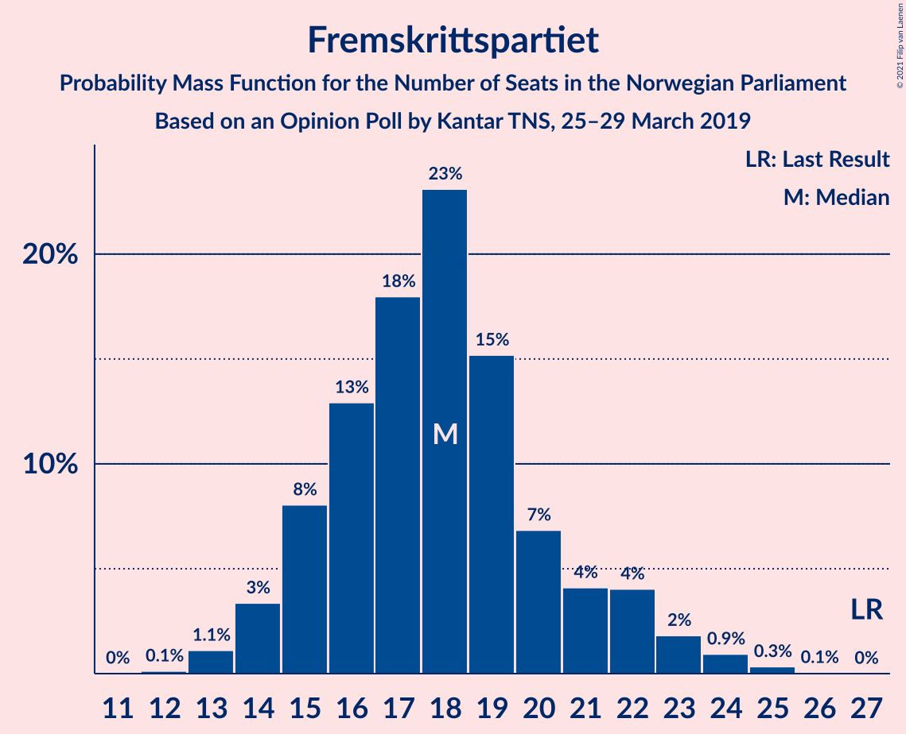

| Number of Seats | Probability | Accumulated | Special Marks |
|:---------------:|:-----------:|:-----------:|:-------------:|
| 12 | 0.1% | 100% |  |
| 13 | 1.1% | 99.8% |  |
| 14 | 3% | 98.7% |  |
| 15 | 8% | 95% |  |
| 16 | 13% | 87% |  |
| 17 | 18% | 74% |  |
| 18 | 23% | 56% | Median |
| 19 | 15% | 33% |  |
| 20 | 7% | 18% |  |
| 21 | 4% | 11% |  |
| 22 | 4% | 7% |  |
| 23 | 2% | 3% |  |
| 24 | 0.9% | 1.3% |  |
| 25 | 0.3% | 0.4% |  |
| 26 | 0.1% | 0.1% |  |
| 27 | 0% | 0% | Last Result |

### Sosialistisk Venstreparti

*For a full overview of the results for this party, see the [Sosialistisk Venstreparti](party-sosialistiskvenstreparti.html) page.*

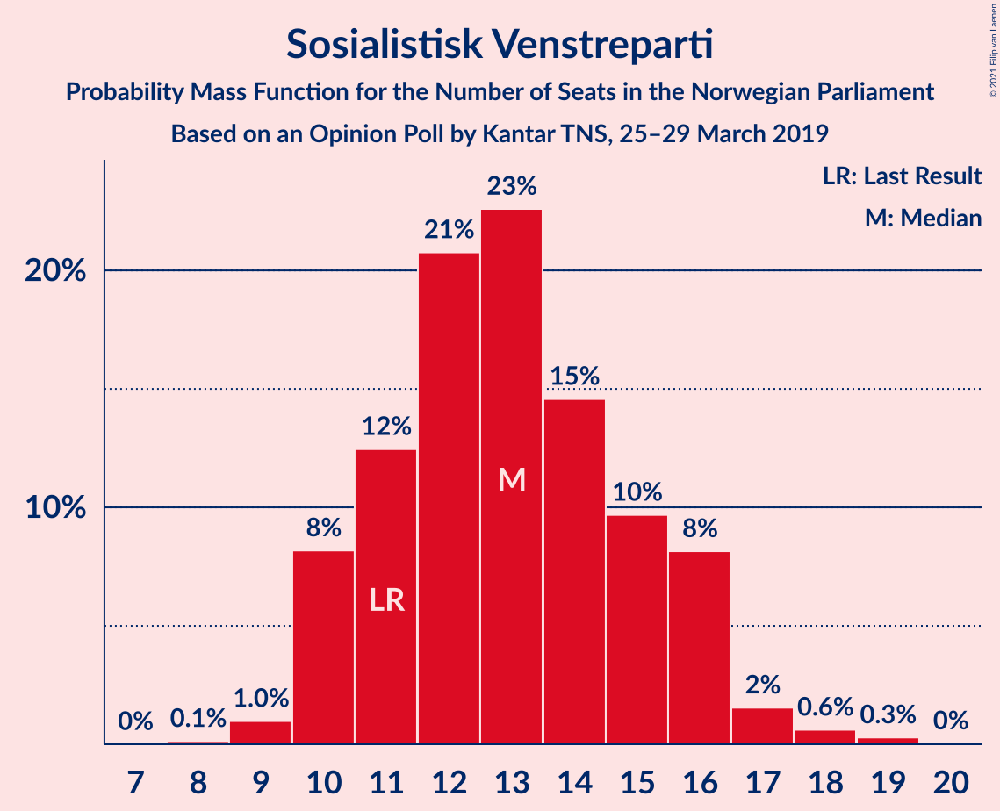

| Number of Seats | Probability | Accumulated | Special Marks |
|:---------------:|:-----------:|:-----------:|:-------------:|
| 8 | 0.1% | 100% |  |
| 9 | 1.0% | 99.9% |  |
| 10 | 8% | 98.9% |  |
| 11 | 12% | 91% | Last Result |
| 12 | 21% | 78% |  |
| 13 | 23% | 57% | Median |
| 14 | 15% | 35% |  |
| 15 | 10% | 20% |  |
| 16 | 8% | 11% |  |
| 17 | 2% | 2% |  |
| 18 | 0.6% | 0.9% |  |
| 19 | 0.3% | 0.3% |  |
| 20 | 0% | 0% |  |

### Rødt

*For a full overview of the results for this party, see the [Rødt](party-rødt.html) page.*

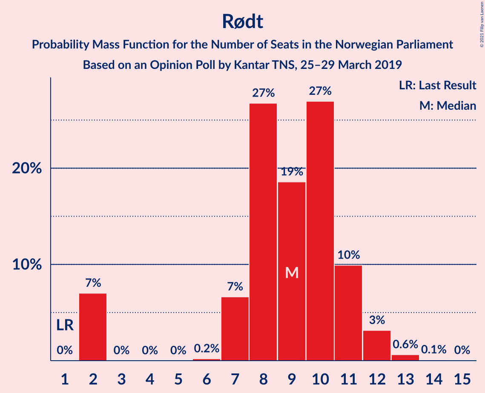

| Number of Seats | Probability | Accumulated | Special Marks |
|:---------------:|:-----------:|:-----------:|:-------------:|
| 1 | 0% | 100% | Last Result |
| 2 | 7% | 100% |  |
| 3 | 0% | 93% |  |
| 4 | 0% | 93% |  |
| 5 | 0% | 93% |  |
| 6 | 0.2% | 93% |  |
| 7 | 7% | 93% |  |
| 8 | 27% | 86% |  |
| 9 | 19% | 59% | Median |
| 10 | 27% | 41% |  |
| 11 | 10% | 14% |  |
| 12 | 3% | 4% |  |
| 13 | 0.6% | 0.8% |  |
| 14 | 0.1% | 0.1% |  |
| 15 | 0% | 0% |  |

### Miljøpartiet De Grønne

*For a full overview of the results for this party, see the [Miljøpartiet De Grønne](party-miljøpartietdegrønne.html) page.*

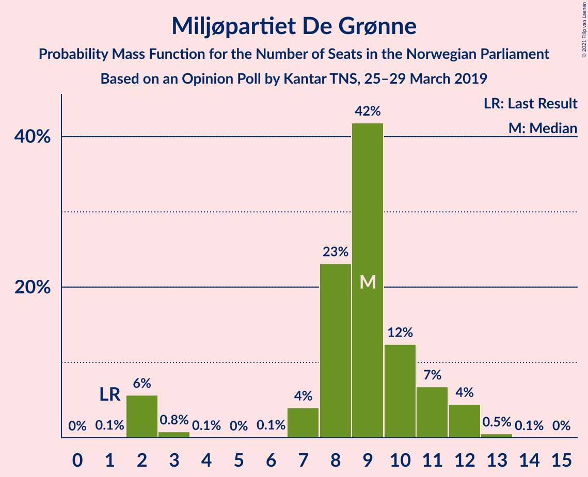

| Number of Seats | Probability | Accumulated | Special Marks |
|:---------------:|:-----------:|:-----------:|:-------------:|
| 1 | 0.1% | 100% | Last Result |
| 2 | 6% | 99.9% |  |
| 3 | 0.8% | 94% |  |
| 4 | 0.1% | 93% |  |
| 5 | 0% | 93% |  |
| 6 | 0.1% | 93% |  |
| 7 | 4% | 93% |  |
| 8 | 23% | 89% |  |
| 9 | 42% | 66% | Median |
| 10 | 12% | 24% |  |
| 11 | 7% | 12% |  |
| 12 | 4% | 5% |  |
| 13 | 0.5% | 0.6% |  |
| 14 | 0.1% | 0.1% |  |
| 15 | 0% | 0% |  |

### Kristelig Folkeparti

*For a full overview of the results for this party, see the [Kristelig Folkeparti](party-kristeligfolkeparti.html) page.*

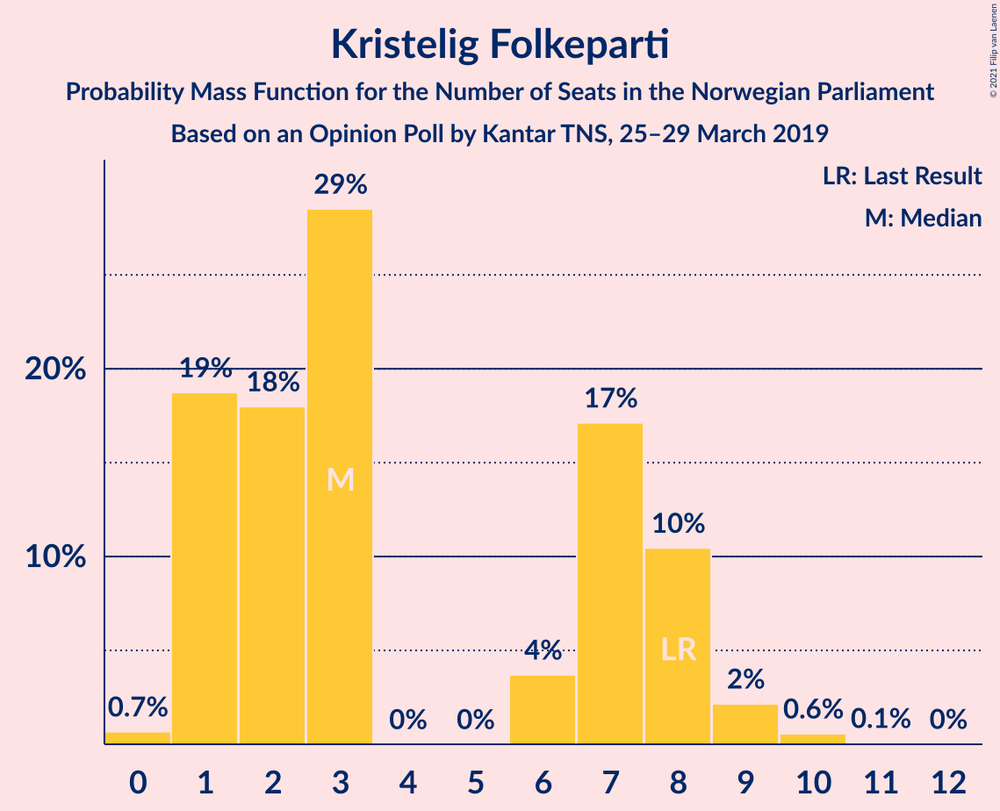

| Number of Seats | Probability | Accumulated | Special Marks |
|:---------------:|:-----------:|:-----------:|:-------------:|
| 0 | 0.7% | 100% |  |
| 1 | 19% | 99.3% |  |
| 2 | 18% | 81% |  |
| 3 | 29% | 63% | Median |
| 4 | 0% | 34% |  |
| 5 | 0% | 34% |  |
| 6 | 4% | 34% |  |
| 7 | 17% | 30% |  |
| 8 | 10% | 13% | Last Result |
| 9 | 2% | 3% |  |
| 10 | 0.6% | 0.6% |  |
| 11 | 0.1% | 0.1% |  |
| 12 | 0% | 0% |  |

### Venstre

*For a full overview of the results for this party, see the [Venstre](party-venstre.html) page.*

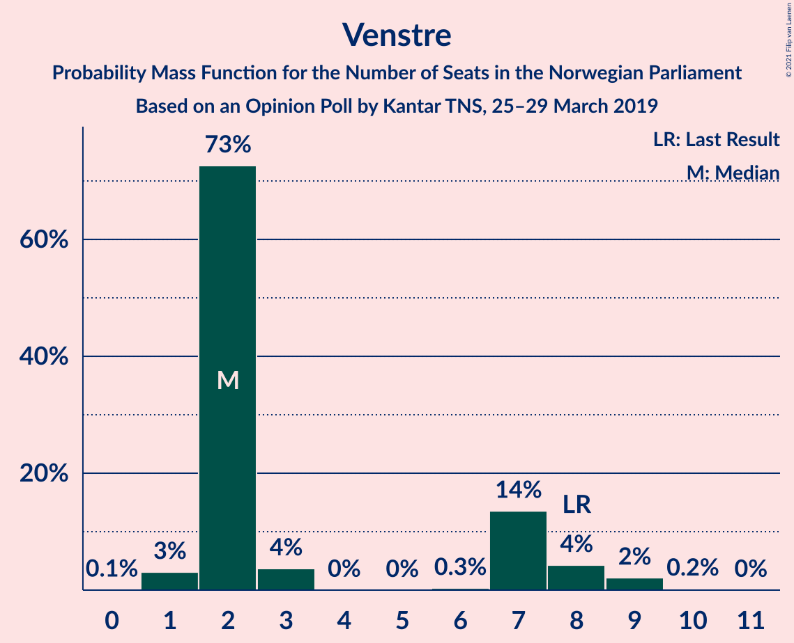

| Number of Seats | Probability | Accumulated | Special Marks |
|:---------------:|:-----------:|:-----------:|:-------------:|
| 0 | 0.1% | 100% |  |
| 1 | 3% | 99.9% |  |
| 2 | 73% | 97% | Median |
| 3 | 4% | 24% |  |
| 4 | 0% | 21% |  |
| 5 | 0% | 21% |  |
| 6 | 0.3% | 21% |  |
| 7 | 14% | 20% |  |
| 8 | 4% | 7% | Last Result |
| 9 | 2% | 2% |  |
| 10 | 0.2% | 0.3% |  |
| 11 | 0% | 0% |  |

## Coalitions

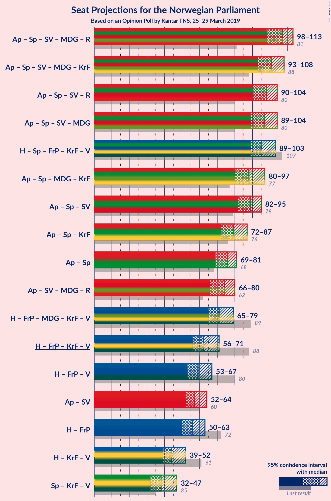

### Confidence Intervals

| Coalition | Last Result | Median | Majority? | 80% Confidence Interval | 90% Confidence Interval | 95% Confidence Interval | 99% Confidence Interval |
|:---------:|:-----------:|:------:|:---------:|:-----------------------:|:-----------------------:|:-----------------------:|:-----------------------:|
| Arbeiderpartiet – Senterpartiet – Sosialistisk Venstreparti – Miljøpartiet De Grønne – Rødt | 81 | 107 | 100% | 101–110 | 99–112 | 98–113 | 95–115 |
| Arbeiderpartiet – Senterpartiet – Sosialistisk Venstreparti – Miljøpartiet De Grønne – Kristelig Folkeparti | 88 | 101 | 100% | 97–107 | 95–108 | 93–108 | 91–111 |
| Arbeiderpartiet – Senterpartiet – Sosialistisk Venstreparti – Rødt | 80 | 98 | 99.9% | 93–102 | 92–103 | 90–104 | 87–106 |
| Arbeiderpartiet – Senterpartiet – Sosialistisk Venstreparti – Miljøpartiet De Grønne | 80 | 97 | 99.9% | 92–102 | 91–103 | 89–104 | 87–106 |
| Høyre – Senterpartiet – Fremskrittspartiet – Kristelig Folkeparti – Venstre | 107 | 95 | 99.8% | 90–100 | 89–101 | 89–103 | 86–104 |
| Arbeiderpartiet – Senterpartiet – Miljøpartiet De Grønne – Kristelig Folkeparti | 77 | 88 | 83% | 83–94 | 82–95 | 80–97 | 77–98 |
| Arbeiderpartiet – Senterpartiet – Sosialistisk Venstreparti | 79 | 89 | 88% | 84–93 | 83–94 | 82–95 | 79–97 |
| Arbeiderpartiet – Senterpartiet – Kristelig Folkeparti | 76 | 79 | 13% | 74–85 | 73–87 | 72–87 | 70–89 |
| Arbeiderpartiet – Senterpartiet | 68 | 76 | 0.2% | 71–80 | 70–80 | 69–81 | 67–84 |
| Arbeiderpartiet – Sosialistisk Venstreparti – Miljøpartiet De Grønne – Rødt | 62 | 74 | 0.2% | 69–79 | 68–80 | 66–80 | 65–83 |
| Høyre – Fremskrittspartiet – Miljøpartiet De Grønne – Kristelig Folkeparti – Venstre | 89 | 71 | 0.1% | 67–76 | 66–77 | 65–79 | 63–82 |
| Høyre – Fremskrittspartiet – Kristelig Folkeparti – Venstre | 88 | 62 | 0% | 58–68 | 57–70 | 56–71 | 54–74 |
| Høyre – Fremskrittspartiet – Venstre | 80 | 59 | 0% | 54–64 | 53–65 | 53–67 | 50–70 |
| Arbeiderpartiet – Sosialistisk Venstreparti | 60 | 57 | 0% | 54–61 | 52–62 | 52–64 | 50–65 |
| Høyre – Fremskrittspartiet | 72 | 56 | 0% | 51–60 | 51–62 | 50–63 | 48–65 |
| Høyre – Kristelig Folkeparti – Venstre | 61 | 44 | 0% | 41–50 | 40–51 | 39–52 | 37–55 |
| Senterpartiet – Kristelig Folkeparti – Venstre | 35 | 38 | 0% | 34–45 | 33–45 | 32–47 | 30–49 |

### Arbeiderpartiet – Senterpartiet – Sosialistisk Venstreparti – Miljøpartiet De Grønne – Rødt

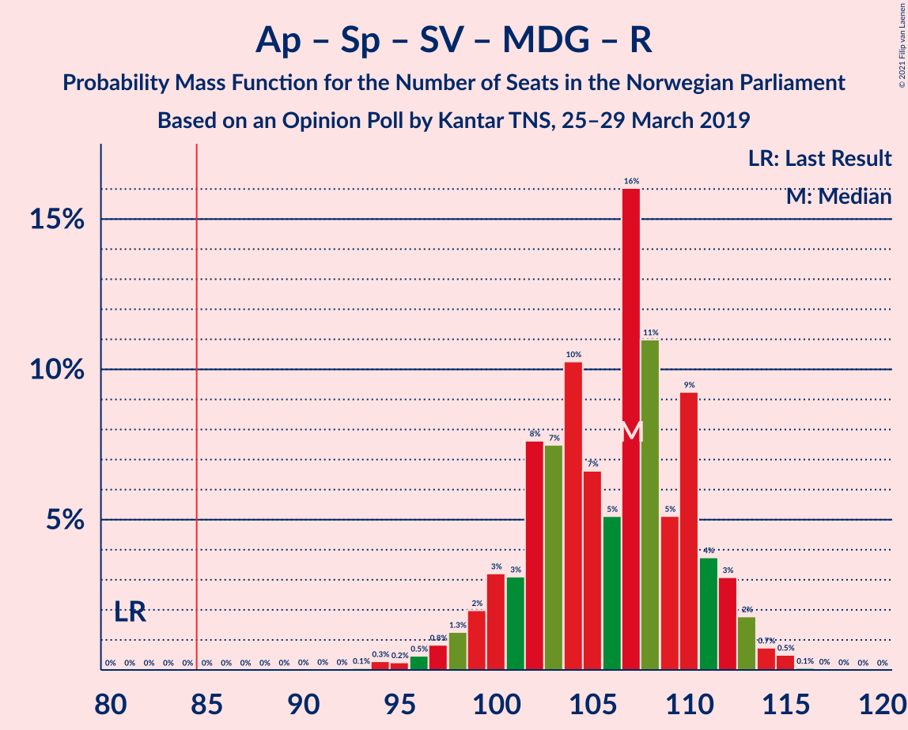

| Number of Seats | Probability | Accumulated | Special Marks |
|:---------------:|:-----------:|:-----------:|:-------------:|
| 81 | 0% | 100% | Last Result |
| 82 | 0% | 100% |  |
| 83 | 0% | 100% |  |
| 84 | 0% | 100% |  |
| 85 | 0% | 100% | Majority |
| 86 | 0% | 100% |  |
| 87 | 0% | 100% |  |
| 88 | 0% | 100% |  |
| 89 | 0% | 100% |  |
| 90 | 0% | 100% |  |
| 91 | 0% | 100% |  |
| 92 | 0% | 100% |  |
| 93 | 0.1% | 99.9% |  |
| 94 | 0.3% | 99.9% |  |
| 95 | 0.2% | 99.6% |  |
| 96 | 0.5% | 99.3% |  |
| 97 | 0.8% | 98.9% |  |
| 98 | 1.3% | 98% |  |
| 99 | 2% | 97% |  |
| 100 | 3% | 95% |  |
| 101 | 3% | 92% |  |
| 102 | 8% | 88% |  |
| 103 | 7% | 81% |  |
| 104 | 10% | 73% |  |
| 105 | 7% | 63% |  |
| 106 | 5% | 56% |  |
| 107 | 16% | 51% | Median |
| 108 | 11% | 35% |  |
| 109 | 5% | 24% |  |
| 110 | 9% | 19% |  |
| 111 | 4% | 10% |  |
| 112 | 3% | 6% |  |
| 113 | 2% | 3% |  |
| 114 | 0.7% | 1.4% |  |
| 115 | 0.5% | 0.6% |  |
| 116 | 0.1% | 0.1% |  |
| 117 | 0% | 0.1% |  |
| 118 | 0% | 0% |  |

### Arbeiderpartiet – Senterpartiet – Sosialistisk Venstreparti – Miljøpartiet De Grønne – Kristelig Folkeparti

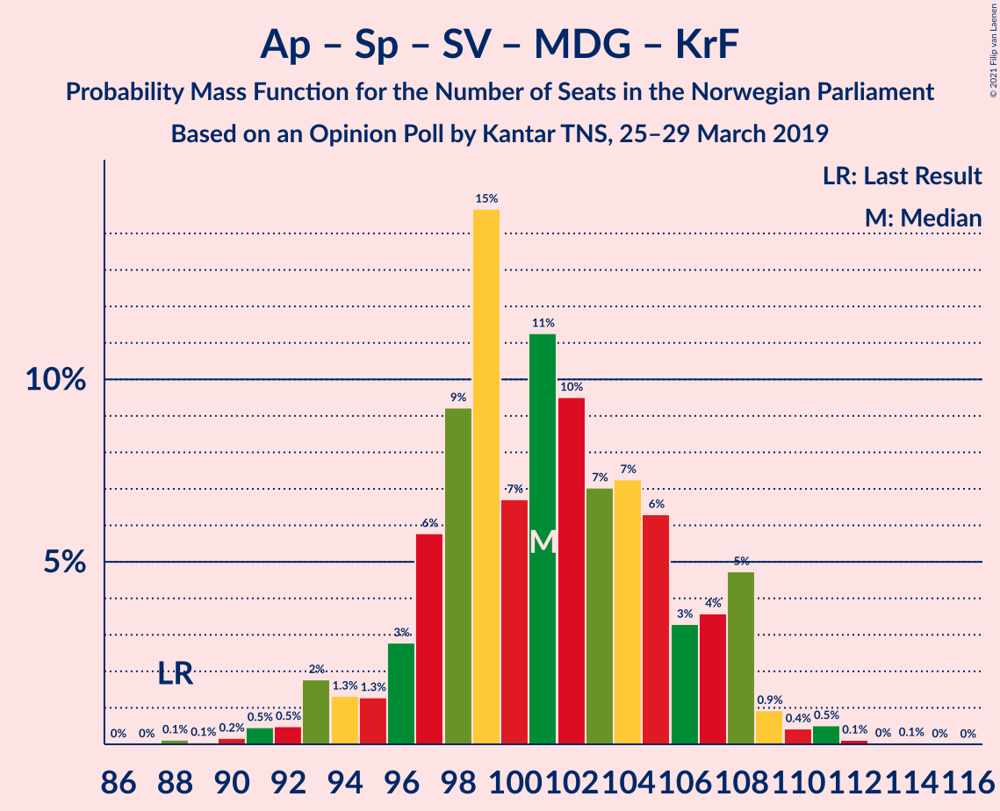

| Number of Seats | Probability | Accumulated | Special Marks |
|:---------------:|:-----------:|:-----------:|:-------------:|
| 88 | 0.1% | 100% | Last Result |
| 89 | 0.1% | 99.8% |  |
| 90 | 0.2% | 99.8% |  |
| 91 | 0.5% | 99.6% |  |
| 92 | 0.5% | 99.1% |  |
| 93 | 2% | 98.7% |  |
| 94 | 1.3% | 97% |  |
| 95 | 1.3% | 96% |  |
| 96 | 3% | 94% |  |
| 97 | 6% | 91% |  |
| 98 | 9% | 86% |  |
| 99 | 15% | 76% |  |
| 100 | 7% | 62% |  |
| 101 | 11% | 55% | Median |
| 102 | 10% | 44% |  |
| 103 | 7% | 34% |  |
| 104 | 7% | 27% |  |
| 105 | 6% | 20% |  |
| 106 | 3% | 14% |  |
| 107 | 4% | 10% |  |
| 108 | 5% | 7% |  |
| 109 | 0.9% | 2% |  |
| 110 | 0.4% | 1.2% |  |
| 111 | 0.5% | 0.7% |  |
| 112 | 0.1% | 0.2% |  |
| 113 | 0% | 0.1% |  |
| 114 | 0.1% | 0.1% |  |
| 115 | 0% | 0% |  |

### Arbeiderpartiet – Senterpartiet – Sosialistisk Venstreparti – Rødt

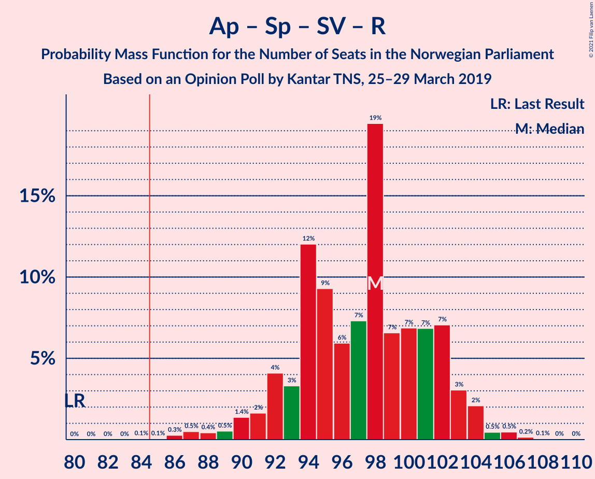

| Number of Seats | Probability | Accumulated | Special Marks |
|:---------------:|:-----------:|:-----------:|:-------------:|
| 80 | 0% | 100% | Last Result |
| 81 | 0% | 100% |  |
| 82 | 0% | 100% |  |
| 83 | 0% | 100% |  |
| 84 | 0.1% | 100% |  |
| 85 | 0.1% | 99.9% | Majority |
| 86 | 0.3% | 99.9% |  |
| 87 | 0.5% | 99.6% |  |
| 88 | 0.4% | 99.1% |  |
| 89 | 0.5% | 98.7% |  |
| 90 | 1.4% | 98% |  |
| 91 | 2% | 97% |  |
| 92 | 4% | 95% |  |
| 93 | 3% | 91% |  |
| 94 | 12% | 88% |  |
| 95 | 9% | 76% |  |
| 96 | 6% | 66% |  |
| 97 | 7% | 60% |  |
| 98 | 19% | 53% | Median |
| 99 | 7% | 34% |  |
| 100 | 7% | 27% |  |
| 101 | 7% | 20% |  |
| 102 | 7% | 13% |  |
| 103 | 3% | 6% |  |
| 104 | 2% | 3% |  |
| 105 | 0.5% | 1.2% |  |
| 106 | 0.5% | 0.7% |  |
| 107 | 0.2% | 0.3% |  |
| 108 | 0.1% | 0.1% |  |
| 109 | 0% | 0.1% |  |
| 110 | 0% | 0% |  |

### Arbeiderpartiet – Senterpartiet – Sosialistisk Venstreparti – Miljøpartiet De Grønne

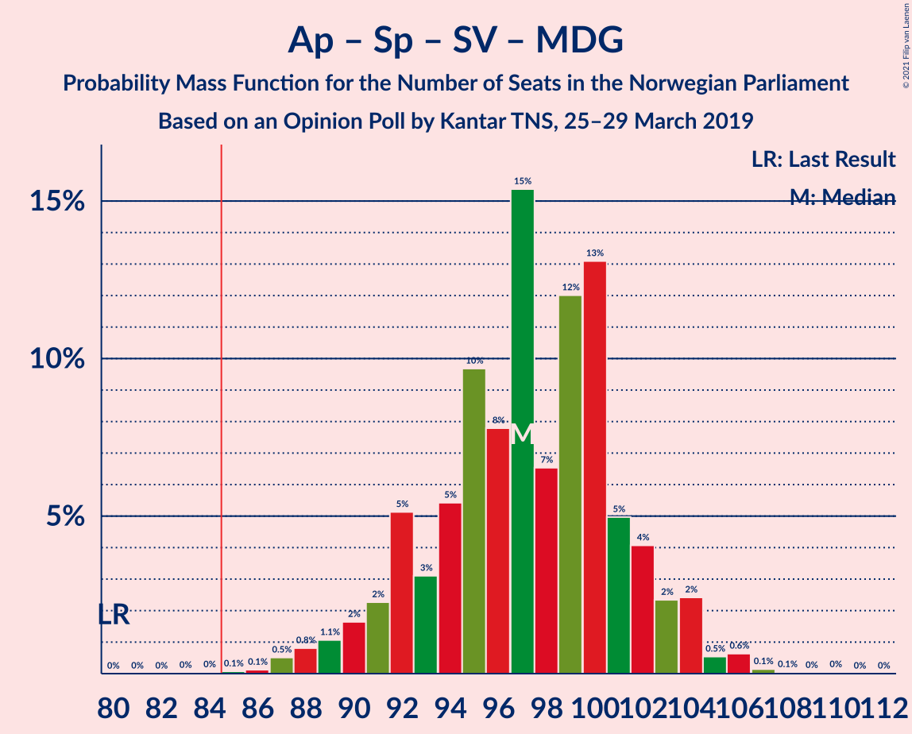

| Number of Seats | Probability | Accumulated | Special Marks |
|:---------------:|:-----------:|:-----------:|:-------------:|
| 80 | 0% | 100% | Last Result |
| 81 | 0% | 100% |  |
| 82 | 0% | 100% |  |
| 83 | 0% | 100% |  |
| 84 | 0% | 100% |  |
| 85 | 0.1% | 99.9% | Majority |
| 86 | 0.1% | 99.8% |  |
| 87 | 0.5% | 99.7% |  |
| 88 | 0.8% | 99.2% |  |
| 89 | 1.1% | 98% |  |
| 90 | 2% | 97% |  |
| 91 | 2% | 96% |  |
| 92 | 5% | 93% |  |
| 93 | 3% | 88% |  |
| 94 | 5% | 85% |  |
| 95 | 10% | 80% |  |
| 96 | 8% | 70% |  |
| 97 | 15% | 62% |  |
| 98 | 7% | 47% | Median |
| 99 | 12% | 40% |  |
| 100 | 13% | 28% |  |
| 101 | 5% | 15% |  |
| 102 | 4% | 10% |  |
| 103 | 2% | 6% |  |
| 104 | 2% | 4% |  |
| 105 | 0.5% | 1.4% |  |
| 106 | 0.6% | 0.9% |  |
| 107 | 0.1% | 0.3% |  |
| 108 | 0.1% | 0.1% |  |
| 109 | 0% | 0.1% |  |
| 110 | 0% | 0.1% |  |
| 111 | 0% | 0% |  |

### Høyre – Senterpartiet – Fremskrittspartiet – Kristelig Folkeparti – Venstre

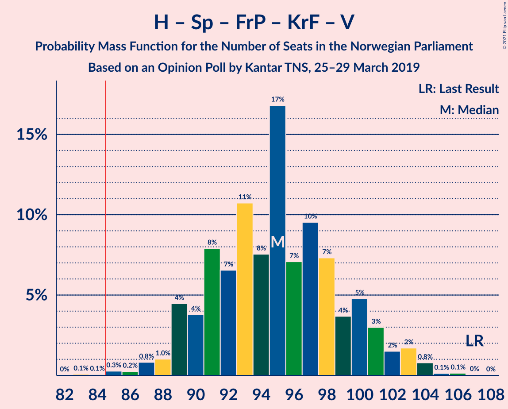

| Number of Seats | Probability | Accumulated | Special Marks |
|:---------------:|:-----------:|:-----------:|:-------------:|
| 83 | 0.1% | 100% |  |
| 84 | 0.1% | 99.9% |  |
| 85 | 0.3% | 99.8% | Majority |
| 86 | 0.2% | 99.6% |  |
| 87 | 0.8% | 99.3% |  |
| 88 | 1.0% | 98.5% |  |
| 89 | 4% | 98% |  |
| 90 | 4% | 93% |  |
| 91 | 8% | 89% |  |
| 92 | 7% | 81% |  |
| 93 | 11% | 75% | Median |
| 94 | 8% | 64% |  |
| 95 | 17% | 57% |  |
| 96 | 7% | 40% |  |
| 97 | 10% | 33% |  |
| 98 | 7% | 23% |  |
| 99 | 4% | 16% |  |
| 100 | 5% | 12% |  |
| 101 | 3% | 7% |  |
| 102 | 2% | 4% |  |
| 103 | 2% | 3% |  |
| 104 | 0.8% | 1.1% |  |
| 105 | 0.1% | 0.3% |  |
| 106 | 0.1% | 0.2% |  |
| 107 | 0% | 0.1% | Last Result |
| 108 | 0% | 0% |  |

### Arbeiderpartiet – Senterpartiet – Miljøpartiet De Grønne – Kristelig Folkeparti

| Number of Seats | Probability | Accumulated | Special Marks |
|:---------------:|:-----------:|:-----------:|:-------------:|
| 74 | 0% | 100% |  |
| 75 | 0.2% | 99.9% |  |
| 76 | 0.2% | 99.8% |  |
| 77 | 0.4% | 99.6% | Last Result |
| 78 | 0.2% | 99.2% |  |
| 79 | 1.0% | 98.9% |  |
| 80 | 1.1% | 98% |  |
| 81 | 2% | 97% |  |
| 82 | 3% | 95% |  |
| 83 | 6% | 92% |  |
| 84 | 3% | 86% |  |
| 85 | 8% | 83% | Majority |
| 86 | 9% | 75% |  |
| 87 | 12% | 66% |  |
| 88 | 11% | 54% | Median |
| 89 | 5% | 43% |  |
| 90 | 9% | 39% |  |
| 91 | 8% | 29% |  |
| 92 | 5% | 21% |  |
| 93 | 4% | 16% |  |
| 94 | 6% | 12% |  |
| 95 | 2% | 6% |  |
| 96 | 0.7% | 5% |  |
| 97 | 3% | 4% |  |
| 98 | 0.3% | 0.6% |  |
| 99 | 0.2% | 0.3% |  |
| 100 | 0.1% | 0.1% |  |
| 101 | 0% | 0.1% |  |
| 102 | 0% | 0% |  |

### Arbeiderpartiet – Senterpartiet – Sosialistisk Venstreparti

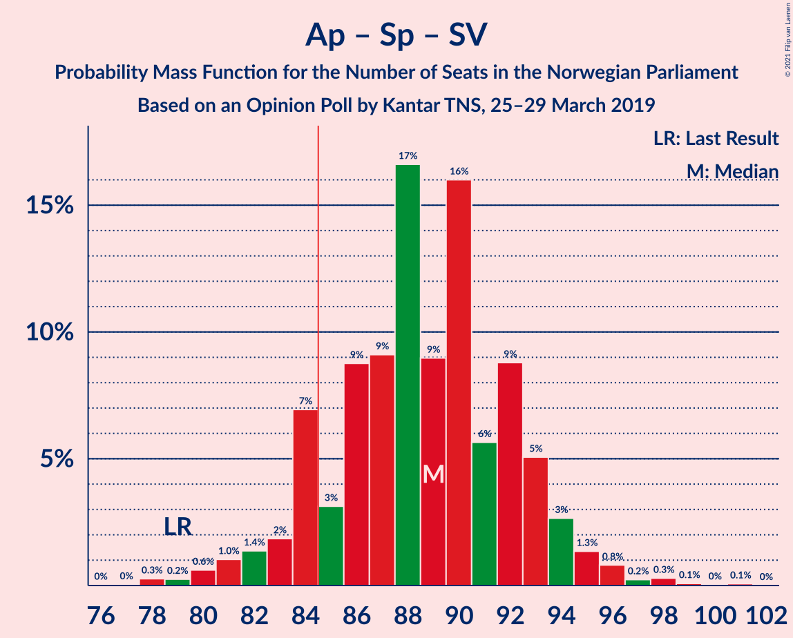

| Number of Seats | Probability | Accumulated | Special Marks |
|:---------------:|:-----------:|:-----------:|:-------------:|
| 77 | 0% | 100% |  |
| 78 | 0.3% | 99.9% |  |
| 79 | 0.2% | 99.7% | Last Result |
| 80 | 0.6% | 99.4% |  |
| 81 | 1.0% | 98.8% |  |
| 82 | 1.4% | 98% |  |
| 83 | 2% | 96% |  |
| 84 | 7% | 95% |  |
| 85 | 3% | 88% | Majority |
| 86 | 9% | 84% |  |
| 87 | 9% | 76% |  |
| 88 | 17% | 67% |  |
| 89 | 9% | 50% | Median |
| 90 | 16% | 41% |  |
| 91 | 6% | 25% |  |
| 92 | 9% | 19% |  |
| 93 | 5% | 11% |  |
| 94 | 3% | 6% |  |
| 95 | 1.3% | 3% |  |
| 96 | 0.8% | 2% |  |
| 97 | 0.2% | 0.7% |  |
| 98 | 0.3% | 0.5% |  |
| 99 | 0.1% | 0.2% |  |
| 100 | 0% | 0.1% |  |
| 101 | 0.1% | 0.1% |  |
| 102 | 0% | 0% |  |

### Arbeiderpartiet – Senterpartiet – Kristelig Folkeparti

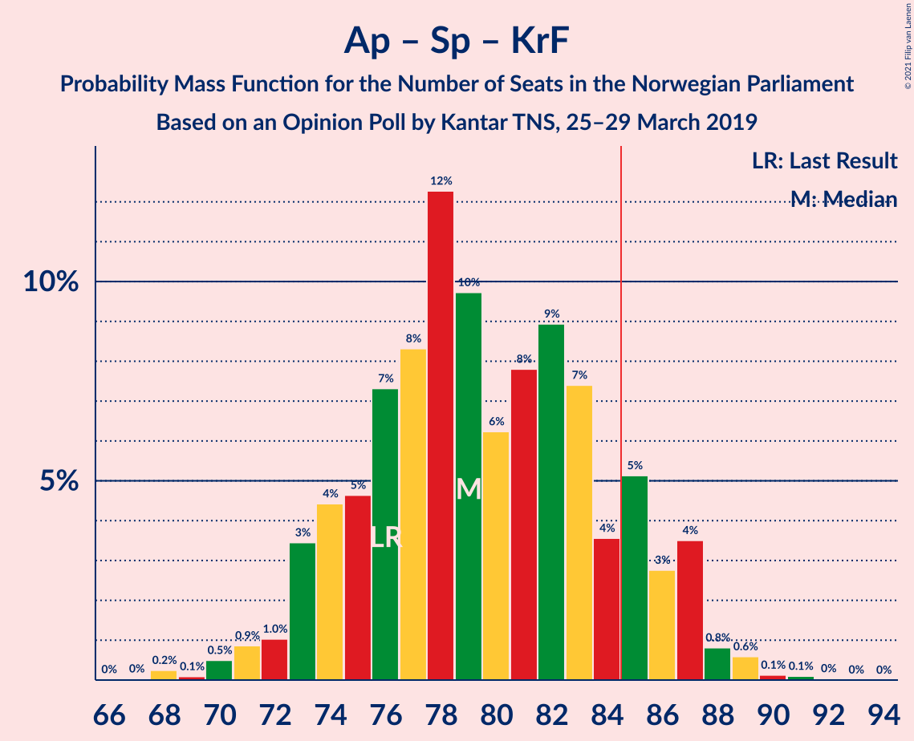

| Number of Seats | Probability | Accumulated | Special Marks |
|:---------------:|:-----------:|:-----------:|:-------------:|
| 67 | 0% | 100% |  |
| 68 | 0.2% | 99.9% |  |
| 69 | 0.1% | 99.7% |  |
| 70 | 0.5% | 99.6% |  |
| 71 | 0.9% | 99.1% |  |
| 72 | 1.0% | 98% |  |
| 73 | 3% | 97% |  |
| 74 | 4% | 94% |  |
| 75 | 5% | 89% |  |
| 76 | 7% | 85% | Last Result |
| 77 | 8% | 77% |  |
| 78 | 12% | 69% |  |
| 79 | 10% | 57% | Median |
| 80 | 6% | 47% |  |
| 81 | 8% | 41% |  |
| 82 | 9% | 33% |  |
| 83 | 7% | 24% |  |
| 84 | 4% | 17% |  |
| 85 | 5% | 13% | Majority |
| 86 | 3% | 8% |  |
| 87 | 4% | 5% |  |
| 88 | 0.8% | 2% |  |
| 89 | 0.6% | 0.9% |  |
| 90 | 0.1% | 0.3% |  |
| 91 | 0.1% | 0.2% |  |
| 92 | 0% | 0.1% |  |
| 93 | 0% | 0% |  |

### Arbeiderpartiet – Senterpartiet

| Number of Seats | Probability | Accumulated | Special Marks |
|:---------------:|:-----------:|:-----------:|:-------------:|
| 64 | 0% | 100% |  |
| 65 | 0.1% | 99.9% |  |
| 66 | 0.2% | 99.8% |  |
| 67 | 0.5% | 99.6% |  |
| 68 | 1.0% | 99.1% | Last Result |
| 69 | 2% | 98% |  |
| 70 | 3% | 96% |  |
| 71 | 5% | 93% |  |
| 72 | 6% | 88% |  |
| 73 | 7% | 82% |  |
| 74 | 10% | 75% |  |
| 75 | 8% | 65% |  |
| 76 | 13% | 57% | Median |
| 77 | 14% | 43% |  |
| 78 | 10% | 29% |  |
| 79 | 9% | 20% |  |
| 80 | 6% | 10% |  |
| 81 | 2% | 4% |  |
| 82 | 0.6% | 2% |  |
| 83 | 0.7% | 1.3% |  |
| 84 | 0.4% | 0.6% |  |
| 85 | 0.1% | 0.2% | Majority |
| 86 | 0% | 0.1% |  |
| 87 | 0.1% | 0.1% |  |
| 88 | 0% | 0% |  |

### Arbeiderpartiet – Sosialistisk Venstreparti – Miljøpartiet De Grønne – Rødt

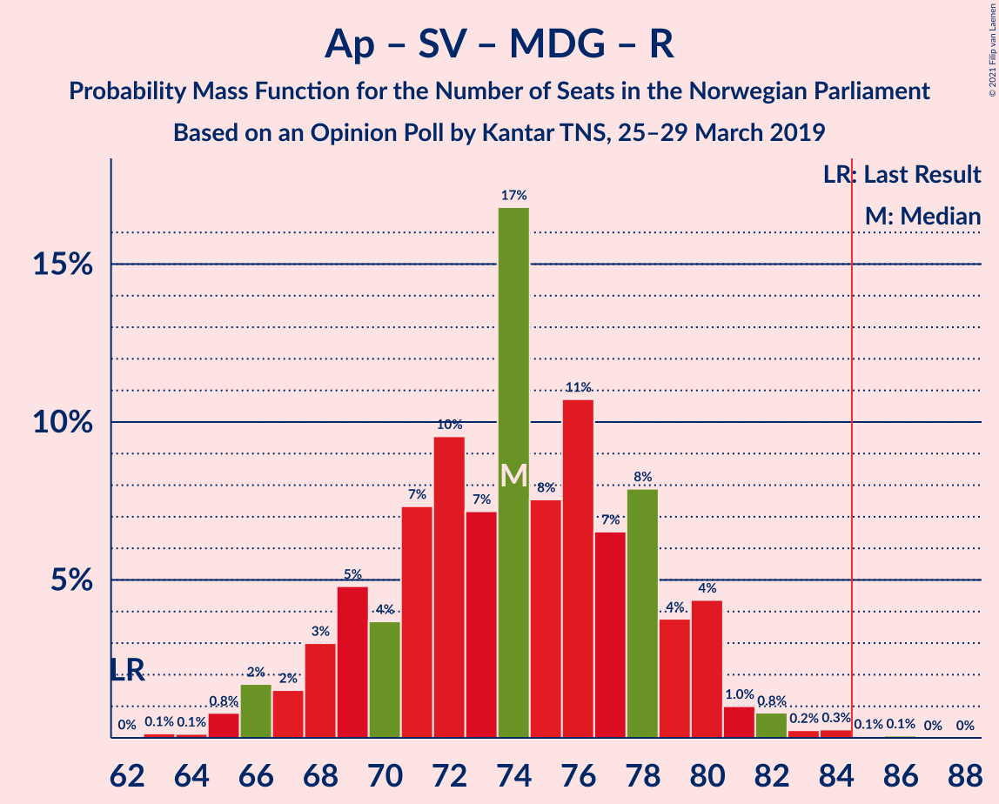

| Number of Seats | Probability | Accumulated | Special Marks |
|:---------------:|:-----------:|:-----------:|:-------------:|
| 62 | 0% | 100% | Last Result |
| 63 | 0.1% | 99.9% |  |
| 64 | 0.1% | 99.8% |  |
| 65 | 0.8% | 99.7% |  |
| 66 | 2% | 98.9% |  |
| 67 | 2% | 97% |  |
| 68 | 3% | 96% |  |
| 69 | 5% | 93% |  |
| 70 | 4% | 88% |  |
| 71 | 7% | 84% |  |
| 72 | 10% | 77% |  |
| 73 | 7% | 67% |  |
| 74 | 17% | 60% |  |
| 75 | 8% | 43% | Median |
| 76 | 11% | 36% |  |
| 77 | 7% | 25% |  |
| 78 | 8% | 18% |  |
| 79 | 4% | 11% |  |
| 80 | 4% | 7% |  |
| 81 | 1.0% | 2% |  |
| 82 | 0.8% | 1.5% |  |
| 83 | 0.2% | 0.7% |  |
| 84 | 0.3% | 0.4% |  |
| 85 | 0.1% | 0.2% | Majority |
| 86 | 0.1% | 0.1% |  |
| 87 | 0% | 0% |  |

### Høyre – Fremskrittspartiet – Miljøpartiet De Grønne – Kristelig Folkeparti – Venstre

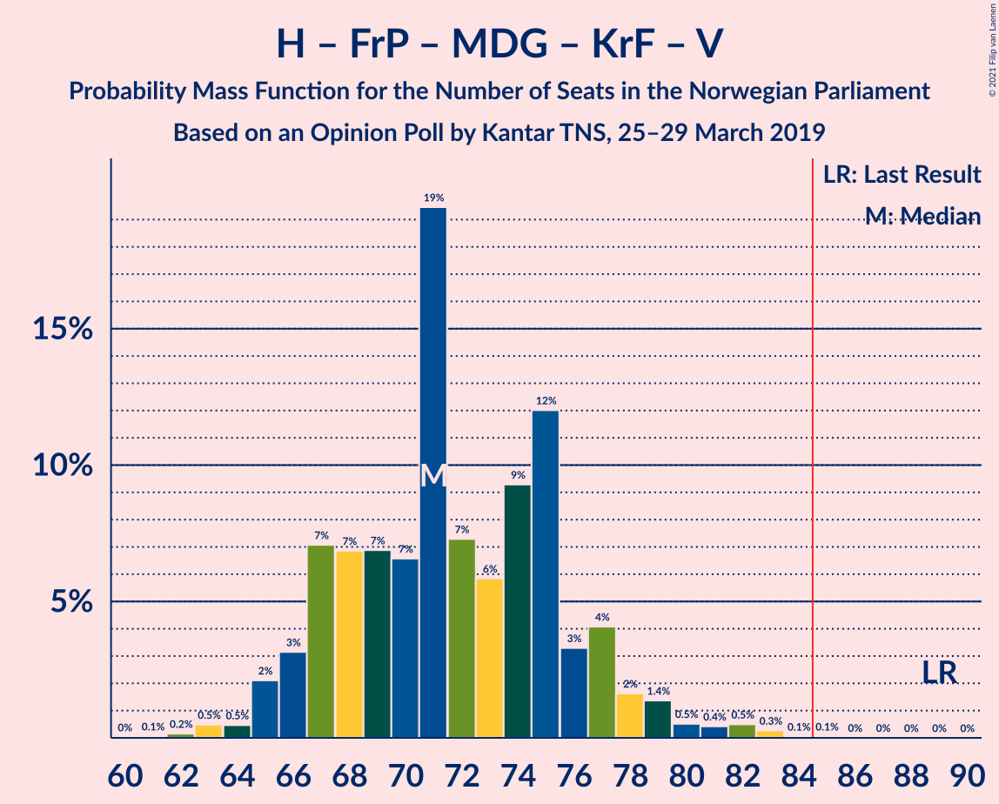

| Number of Seats | Probability | Accumulated | Special Marks |
|:---------------:|:-----------:|:-----------:|:-------------:|
| 60 | 0% | 100% |  |
| 61 | 0.1% | 99.9% |  |
| 62 | 0.2% | 99.9% |  |
| 63 | 0.5% | 99.7% |  |
| 64 | 0.5% | 99.2% |  |
| 65 | 2% | 98.8% |  |
| 66 | 3% | 97% |  |
| 67 | 7% | 94% |  |
| 68 | 7% | 86% |  |
| 69 | 7% | 80% |  |
| 70 | 7% | 73% | Median |
| 71 | 19% | 66% |  |
| 72 | 7% | 47% |  |
| 73 | 6% | 39% |  |
| 74 | 9% | 34% |  |
| 75 | 12% | 24% |  |
| 76 | 3% | 12% |  |
| 77 | 4% | 9% |  |
| 78 | 2% | 5% |  |
| 79 | 1.4% | 3% |  |
| 80 | 0.5% | 2% |  |
| 81 | 0.4% | 1.3% |  |
| 82 | 0.5% | 0.9% |  |
| 83 | 0.3% | 0.4% |  |
| 84 | 0.1% | 0.1% |  |
| 85 | 0.1% | 0.1% | Majority |
| 86 | 0% | 0% |  |
| 87 | 0% | 0% |  |
| 88 | 0% | 0% |  |
| 89 | 0% | 0% | Last Result |

### Høyre – Fremskrittspartiet – Kristelig Folkeparti – Venstre

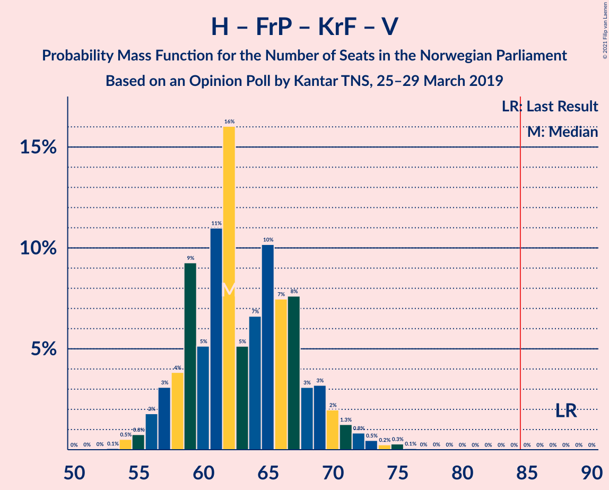

| Number of Seats | Probability | Accumulated | Special Marks |
|:---------------:|:-----------:|:-----------:|:-------------:|
| 52 | 0% | 100% |  |
| 53 | 0.1% | 99.9% |  |
| 54 | 0.5% | 99.9% |  |
| 55 | 0.8% | 99.4% |  |
| 56 | 2% | 98.6% |  |
| 57 | 3% | 97% |  |
| 58 | 4% | 94% |  |
| 59 | 9% | 90% |  |
| 60 | 5% | 81% |  |
| 61 | 11% | 75% | Median |
| 62 | 16% | 65% |  |
| 63 | 5% | 48% |  |
| 64 | 7% | 43% |  |
| 65 | 10% | 37% |  |
| 66 | 7% | 27% |  |
| 67 | 8% | 19% |  |
| 68 | 3% | 11% |  |
| 69 | 3% | 8% |  |
| 70 | 2% | 5% |  |
| 71 | 1.3% | 3% |  |
| 72 | 0.8% | 2% |  |
| 73 | 0.5% | 1.1% |  |
| 74 | 0.2% | 0.7% |  |
| 75 | 0.3% | 0.4% |  |
| 76 | 0.1% | 0.1% |  |
| 77 | 0% | 0.1% |  |
| 78 | 0% | 0% |  |
| 79 | 0% | 0% |  |
| 80 | 0% | 0% |  |
| 81 | 0% | 0% |  |
| 82 | 0% | 0% |  |
| 83 | 0% | 0% |  |
| 84 | 0% | 0% |  |
| 85 | 0% | 0% | Majority |
| 86 | 0% | 0% |  |
| 87 | 0% | 0% |  |
| 88 | 0% | 0% | Last Result |

### Høyre – Fremskrittspartiet – Venstre

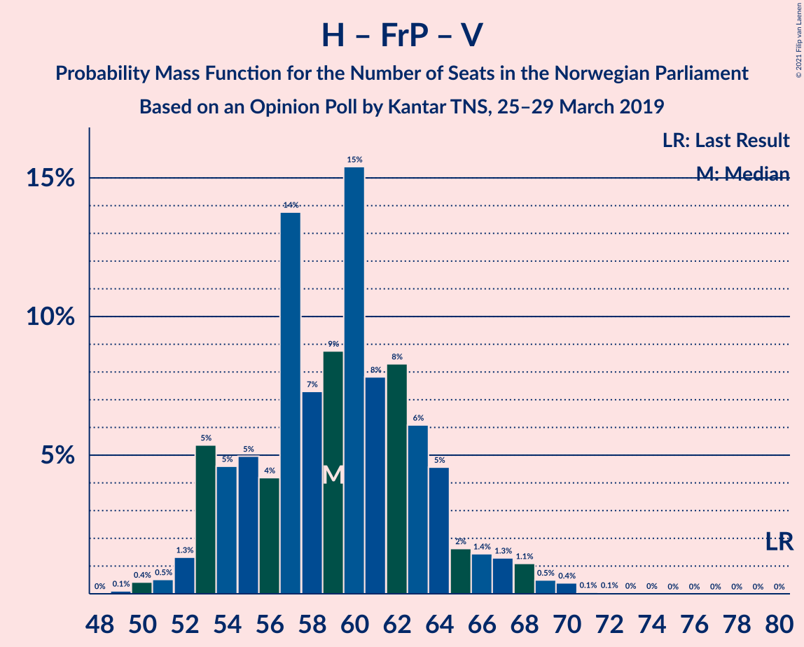

| Number of Seats | Probability | Accumulated | Special Marks |
|:---------------:|:-----------:|:-----------:|:-------------:|
| 49 | 0.1% | 100% |  |
| 50 | 0.4% | 99.9% |  |
| 51 | 0.5% | 99.5% |  |
| 52 | 1.3% | 98.9% |  |
| 53 | 5% | 98% |  |
| 54 | 5% | 92% |  |
| 55 | 5% | 88% |  |
| 56 | 4% | 83% |  |
| 57 | 14% | 79% |  |
| 58 | 7% | 65% | Median |
| 59 | 9% | 57% |  |
| 60 | 15% | 49% |  |
| 61 | 8% | 33% |  |
| 62 | 8% | 25% |  |
| 63 | 6% | 17% |  |
| 64 | 5% | 11% |  |
| 65 | 2% | 7% |  |
| 66 | 1.4% | 5% |  |
| 67 | 1.3% | 3% |  |
| 68 | 1.1% | 2% |  |
| 69 | 0.5% | 1.0% |  |
| 70 | 0.4% | 0.5% |  |
| 71 | 0.1% | 0.2% |  |
| 72 | 0.1% | 0.1% |  |
| 73 | 0% | 0% |  |
| 74 | 0% | 0% |  |
| 75 | 0% | 0% |  |
| 76 | 0% | 0% |  |
| 77 | 0% | 0% |  |
| 78 | 0% | 0% |  |
| 79 | 0% | 0% |  |
| 80 | 0% | 0% | Last Result |

### Arbeiderpartiet – Sosialistisk Venstreparti

| Number of Seats | Probability | Accumulated | Special Marks |
|:---------------:|:-----------:|:-----------:|:-------------:|
| 48 | 0.1% | 100% |  |
| 49 | 0.3% | 99.8% |  |
| 50 | 0.9% | 99.5% |  |
| 51 | 1.0% | 98.7% |  |
| 52 | 3% | 98% |  |
| 53 | 4% | 95% |  |
| 54 | 10% | 90% |  |
| 55 | 17% | 81% |  |
| 56 | 13% | 63% |  |
| 57 | 15% | 51% | Median |
| 58 | 15% | 35% |  |
| 59 | 6% | 21% |  |
| 60 | 4% | 15% | Last Result |
| 61 | 5% | 11% |  |
| 62 | 2% | 5% |  |
| 63 | 1.1% | 4% |  |
| 64 | 2% | 3% |  |
| 65 | 0.5% | 1.0% |  |
| 66 | 0.3% | 0.5% |  |
| 67 | 0.1% | 0.2% |  |
| 68 | 0% | 0.1% |  |
| 69 | 0% | 0% |  |

### Høyre – Fremskrittspartiet

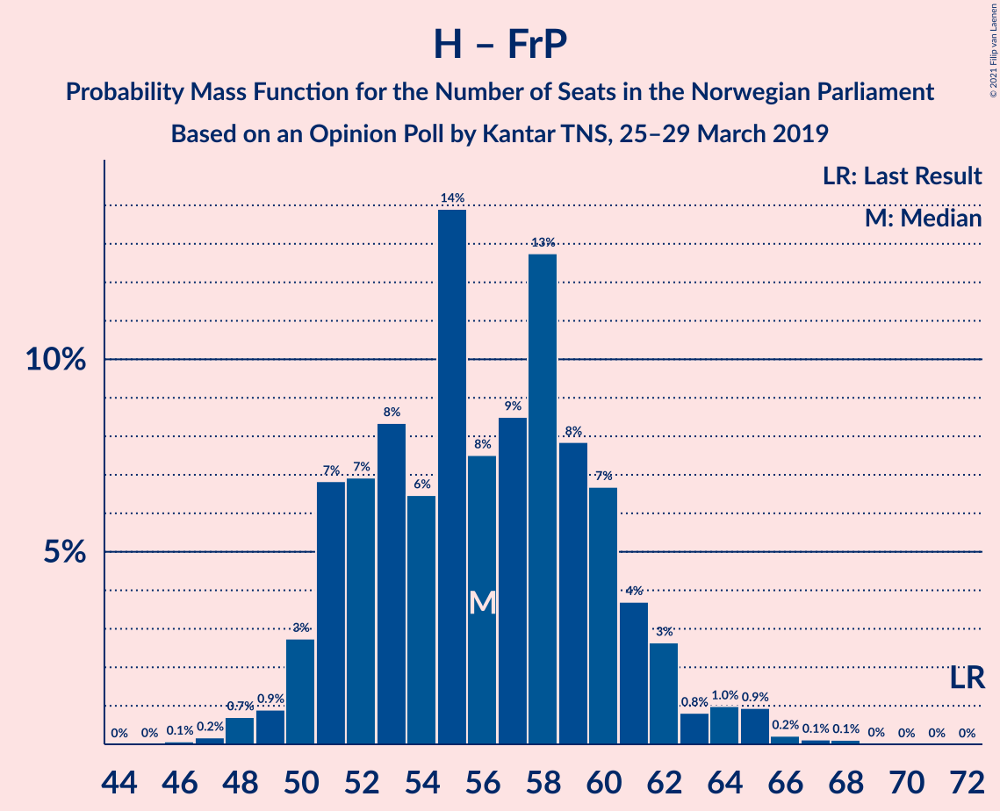

| Number of Seats | Probability | Accumulated | Special Marks |
|:---------------:|:-----------:|:-----------:|:-------------:|
| 46 | 0.1% | 100% |  |
| 47 | 0.2% | 99.9% |  |
| 48 | 0.7% | 99.7% |  |
| 49 | 0.9% | 99.0% |  |
| 50 | 3% | 98% |  |
| 51 | 7% | 95% |  |
| 52 | 7% | 89% |  |
| 53 | 8% | 82% |  |
| 54 | 6% | 73% |  |
| 55 | 14% | 67% |  |
| 56 | 8% | 53% | Median |
| 57 | 9% | 45% |  |
| 58 | 13% | 37% |  |
| 59 | 8% | 24% |  |
| 60 | 7% | 16% |  |
| 61 | 4% | 10% |  |
| 62 | 3% | 6% |  |
| 63 | 0.8% | 3% |  |
| 64 | 1.0% | 2% |  |
| 65 | 0.9% | 1.4% |  |
| 66 | 0.2% | 0.5% |  |
| 67 | 0.1% | 0.3% |  |
| 68 | 0.1% | 0.2% |  |
| 69 | 0% | 0% |  |
| 70 | 0% | 0% |  |
| 71 | 0% | 0% |  |
| 72 | 0% | 0% | Last Result |

### Høyre – Kristelig Folkeparti – Venstre

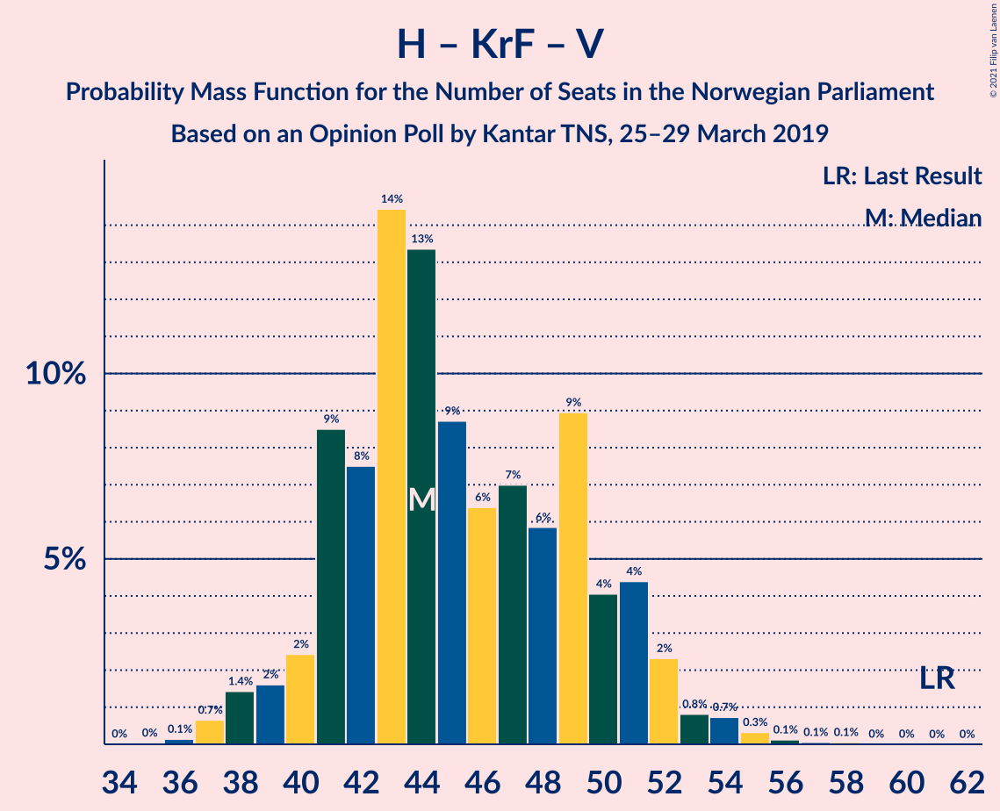

| Number of Seats | Probability | Accumulated | Special Marks |
|:---------------:|:-----------:|:-----------:|:-------------:|
| 35 | 0% | 100% |  |
| 36 | 0.1% | 99.9% |  |
| 37 | 0.7% | 99.8% |  |
| 38 | 1.4% | 99.1% |  |
| 39 | 2% | 98% |  |
| 40 | 2% | 96% |  |
| 41 | 9% | 94% |  |
| 42 | 8% | 85% |  |
| 43 | 14% | 78% | Median |
| 44 | 13% | 63% |  |
| 45 | 9% | 50% |  |
| 46 | 6% | 41% |  |
| 47 | 7% | 35% |  |
| 48 | 6% | 28% |  |
| 49 | 9% | 22% |  |
| 50 | 4% | 13% |  |
| 51 | 4% | 9% |  |
| 52 | 2% | 4% |  |
| 53 | 0.8% | 2% |  |
| 54 | 0.7% | 1.3% |  |
| 55 | 0.3% | 0.6% |  |
| 56 | 0.1% | 0.3% |  |
| 57 | 0.1% | 0.1% |  |
| 58 | 0.1% | 0.1% |  |
| 59 | 0% | 0% |  |
| 60 | 0% | 0% |  |
| 61 | 0% | 0% | Last Result |

### Senterpartiet – Kristelig Folkeparti – Venstre

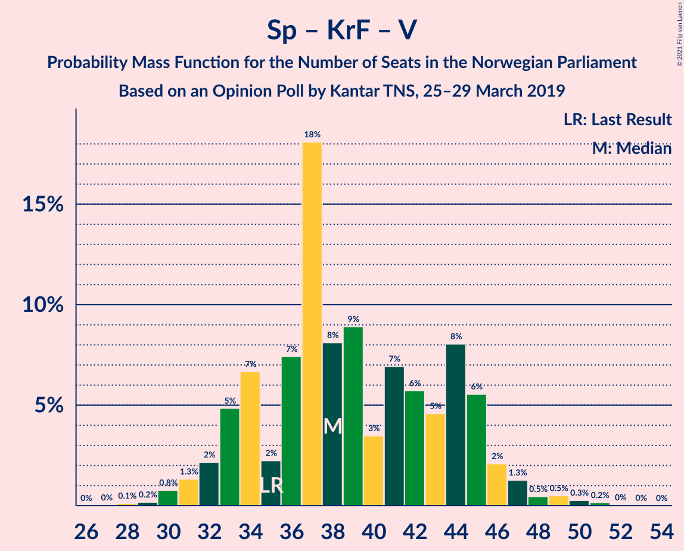

| Number of Seats | Probability | Accumulated | Special Marks |
|:---------------:|:-----------:|:-----------:|:-------------:|
| 28 | 0.1% | 100% |  |
| 29 | 0.2% | 99.8% |  |
| 30 | 0.8% | 99.7% |  |
| 31 | 1.3% | 98.9% |  |
| 32 | 2% | 98% |  |
| 33 | 5% | 95% |  |
| 34 | 7% | 91% |  |
| 35 | 2% | 84% | Last Result |
| 36 | 7% | 82% |  |
| 37 | 18% | 74% | Median |
| 38 | 8% | 56% |  |
| 39 | 9% | 48% |  |
| 40 | 3% | 39% |  |
| 41 | 7% | 36% |  |
| 42 | 6% | 29% |  |
| 43 | 5% | 23% |  |
| 44 | 8% | 18% |  |
| 45 | 6% | 10% |  |
| 46 | 2% | 5% |  |
| 47 | 1.3% | 3% |  |
| 48 | 0.5% | 1.4% |  |
| 49 | 0.5% | 1.0% |  |
| 50 | 0.3% | 0.5% |  |
| 51 | 0.2% | 0.2% |  |
| 52 | 0% | 0.1% |  |
| 53 | 0% | 0% |  |

## Technical Information

### Opinion Poll

+ **Polling firm:** Kantar TNS
+ **Commissioner(s):** —
+ **Fieldwork period:** 25–29 March 2019

### Calculations

+ **Sample size:** 791
+ **Simulations done:** 1,048,576
+ **Error estimate:** 2.16%

