# Opinion Poll by Norfakta, 2–3 April 2019

<a href="#voting-intentions">Voting Intentions</a> | <a href="#seats">Seats</a> | <a href="#coalitions">Coalitions</a> | <a href="#technical-information">Technical Information</a>

## Voting Intentions

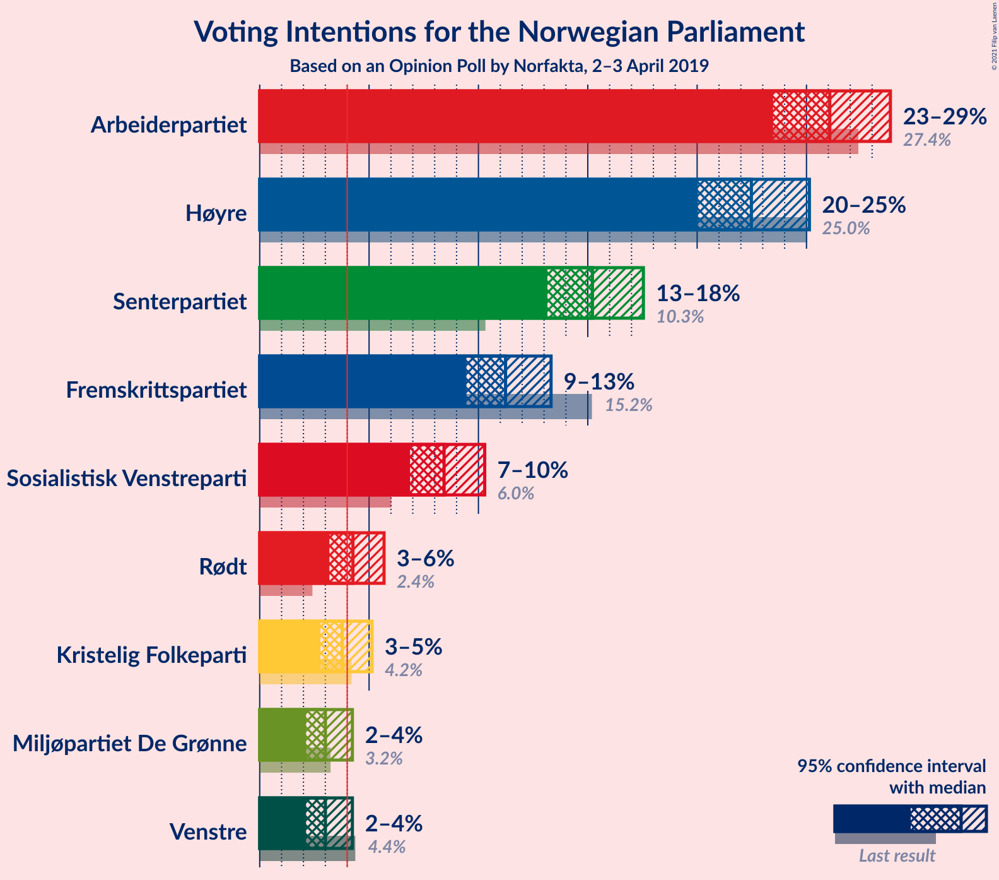

### Confidence Intervals

| Party | Last Result | Poll Result | 80% Confidence Interval | 90% Confidence Interval | 95% Confidence Interval | 99% Confidence Interval |
|:-----:|:-----------:|:-----------:|:-----------------------:|:-----------------------:|:-----------------------:|:-----------------------:|
| Arbeiderpartiet | 27.4% | 26.1% | 24.4–27.9% |23.9–28.4% |23.5–28.8% |22.7–29.7% |
| Høyre | 25.0% | 22.5% | 20.9–24.2% |20.4–24.7% |20.0–25.1% |19.3–26.0% |
| Senterpartiet | 10.3% | 15.2% | 13.9–16.7% |13.5–17.2% |13.2–17.5% |12.5–18.3% |
| Fremskrittspartiet | 15.2% | 11.2% | 10.1–12.6% |9.7–13.0% |9.4–13.3% |8.9–14.0% |
| Sosialistisk Venstreparti | 6.0% | 8.4% | 7.4–9.6% |7.1–10.0% |6.9–10.3% |6.4–10.9% |
| Rødt | 2.4% | 4.3% | 3.6–5.2% |3.4–5.5% |3.2–5.7% |2.9–6.2% |
| Kristelig Folkeparti | 4.2% | 3.8% | 3.1–4.7% |2.9–4.9% |2.8–5.1% |2.5–5.6% |
| Miljøpartiet De Grønne | 3.2% | 3.0% | 2.4–3.8% |2.3–4.0% |2.1–4.2% |1.9–4.7% |
| Venstre | 4.4% | 3.0% | 2.4–3.8% |2.3–4.0% |2.1–4.2% |1.9–4.7% |

*Note:* The poll result column reflects the actual value used in the calculations. Published results may vary slightly, and in addition be rounded to fewer digits.

## Seats

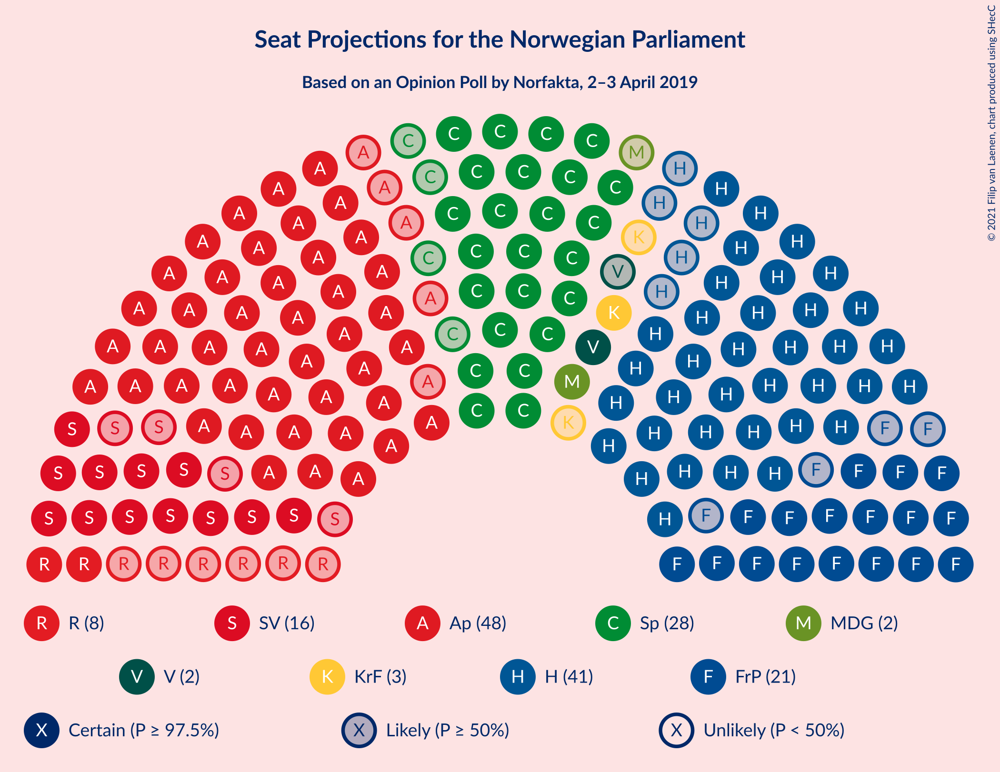

### Confidence Intervals

| Party | Last Result | Median | 80% Confidence Interval | 90% Confidence Interval | 95% Confidence Interval | 99% Confidence Interval |
|:-----:|:-----------:|:------:|:-----------------------:|:-----------------------:|:-----------------------:|:-----------------------:|
| <a href="#arbeiderpartiet">Arbeiderpartiet</a> | 49 | 48 | 44–51 |44–53 |43–54 |41–55 |
| <a href="#høyre">Høyre</a> | 45 | 41 | 38–45 |37–46 |36–46 |35–48 |
| <a href="#senterpartiet">Senterpartiet</a> | 19 | 28 | 26–32 |25–32 |24–33 |23–35 |
| <a href="#fremskrittspartiet">Fremskrittspartiet</a> | 27 | 21 | 18–23 |18–24 |17–24 |16–26 |
| <a href="#sosialistisk-venstreparti">Sosialistisk Venstreparti</a> | 11 | 16 | 13–18 |13–18 |12–19 |11–20 |
| <a href="#rødt">Rødt</a> | 1 | 8 | 2–9 |2–10 |2–10 |2–11 |
| <a href="#kristelig-folkeparti">Kristelig Folkeparti</a> | 8 | 3 | 1–8 |1–9 |1–9 |1–10 |
| <a href="#miljøpartiet-de-grønne">Miljøpartiet De Grønne</a> | 1 | 2 | 1–2 |1–3 |1–8 |0–8 |
| <a href="#venstre">Venstre</a> | 8 | 2 | 2 |1–3 |1–8 |1–8 |

### Arbeiderpartiet

*For a full overview of the results for this party, see the [Arbeiderpartiet](party-arbeiderpartiet.html) page.*

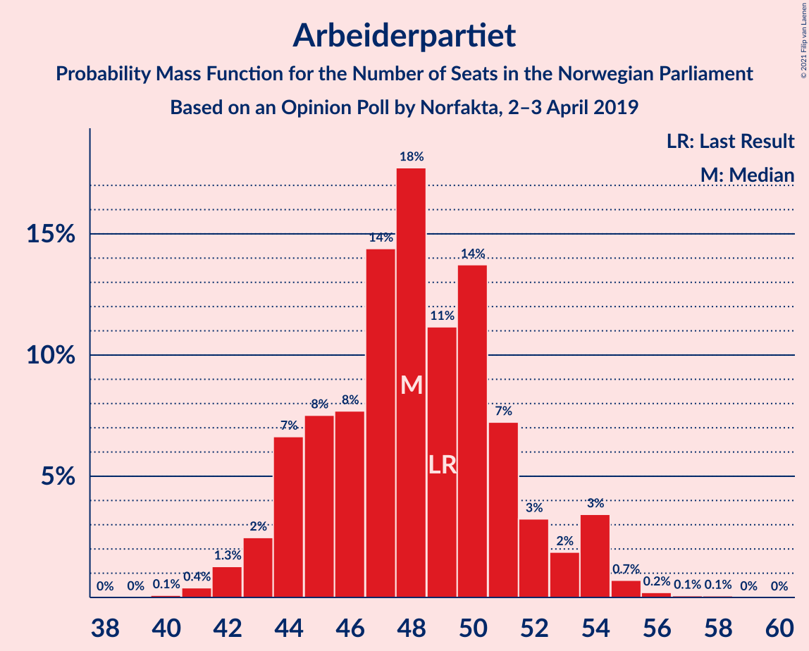

| Number of Seats | Probability | Accumulated | Special Marks |
|:---------------:|:-----------:|:-----------:|:-------------:|
| 40 | 0.1% | 100% |  |
| 41 | 0.4% | 99.9% |  |
| 42 | 1.3% | 99.5% |  |
| 43 | 2% | 98% |  |
| 44 | 7% | 96% |  |
| 45 | 8% | 89% |  |
| 46 | 8% | 82% |  |
| 47 | 14% | 74% |  |
| 48 | 18% | 59% | Median |
| 49 | 11% | 42% | Last Result |
| 50 | 14% | 31% |  |
| 51 | 7% | 17% |  |
| 52 | 3% | 10% |  |
| 53 | 2% | 6% |  |
| 54 | 3% | 5% |  |
| 55 | 0.7% | 1.1% |  |
| 56 | 0.2% | 0.4% |  |
| 57 | 0.1% | 0.2% |  |
| 58 | 0.1% | 0.1% |  |
| 59 | 0% | 0% |  |

### Høyre

*For a full overview of the results for this party, see the [Høyre](party-høyre.html) page.*

| Number of Seats | Probability | Accumulated | Special Marks |
|:---------------:|:-----------:|:-----------:|:-------------:|
| 33 | 0.1% | 100% |  |
| 34 | 0.2% | 99.9% |  |
| 35 | 1.0% | 99.7% |  |
| 36 | 2% | 98.8% |  |
| 37 | 3% | 97% |  |
| 38 | 10% | 93% |  |
| 39 | 8% | 83% |  |
| 40 | 14% | 75% |  |
| 41 | 15% | 61% | Median |
| 42 | 15% | 47% |  |
| 43 | 11% | 32% |  |
| 44 | 9% | 21% |  |
| 45 | 7% | 12% | Last Result |
| 46 | 3% | 5% |  |
| 47 | 2% | 2% |  |
| 48 | 0.6% | 0.9% |  |
| 49 | 0.2% | 0.3% |  |
| 50 | 0.1% | 0.1% |  |
| 51 | 0% | 0% |  |

### Senterpartiet

*For a full overview of the results for this party, see the [Senterpartiet](party-senterpartiet.html) page.*

| Number of Seats | Probability | Accumulated | Special Marks |
|:---------------:|:-----------:|:-----------:|:-------------:|
| 19 | 0% | 100% | Last Result |
| 20 | 0% | 100% |  |
| 21 | 0.1% | 100% |  |
| 22 | 0.3% | 99.9% |  |
| 23 | 1.0% | 99.6% |  |
| 24 | 2% | 98.6% |  |
| 25 | 5% | 96% |  |
| 26 | 15% | 92% |  |
| 27 | 12% | 77% |  |
| 28 | 20% | 64% | Median |
| 29 | 18% | 45% |  |
| 30 | 11% | 27% |  |
| 31 | 5% | 15% |  |
| 32 | 7% | 11% |  |
| 33 | 1.3% | 4% |  |
| 34 | 2% | 2% |  |
| 35 | 0.5% | 0.6% |  |
| 36 | 0.1% | 0.1% |  |
| 37 | 0% | 0% |  |

### Fremskrittspartiet

*For a full overview of the results for this party, see the [Fremskrittspartiet](party-fremskrittspartiet.html) page.*

| Number of Seats | Probability | Accumulated | Special Marks |
|:---------------:|:-----------:|:-----------:|:-------------:|
| 15 | 0.1% | 100% |  |
| 16 | 0.7% | 99.8% |  |
| 17 | 2% | 99.1% |  |
| 18 | 11% | 97% |  |
| 19 | 16% | 86% |  |
| 20 | 20% | 71% |  |
| 21 | 12% | 50% | Median |
| 22 | 15% | 38% |  |
| 23 | 15% | 23% |  |
| 24 | 6% | 8% |  |
| 25 | 2% | 2% |  |
| 26 | 0.4% | 0.6% |  |
| 27 | 0.1% | 0.2% | Last Result |
| 28 | 0.1% | 0.1% |  |
| 29 | 0% | 0% |  |

### Sosialistisk Venstreparti

*For a full overview of the results for this party, see the [Sosialistisk Venstreparti](party-sosialistiskvenstreparti.html) page.*

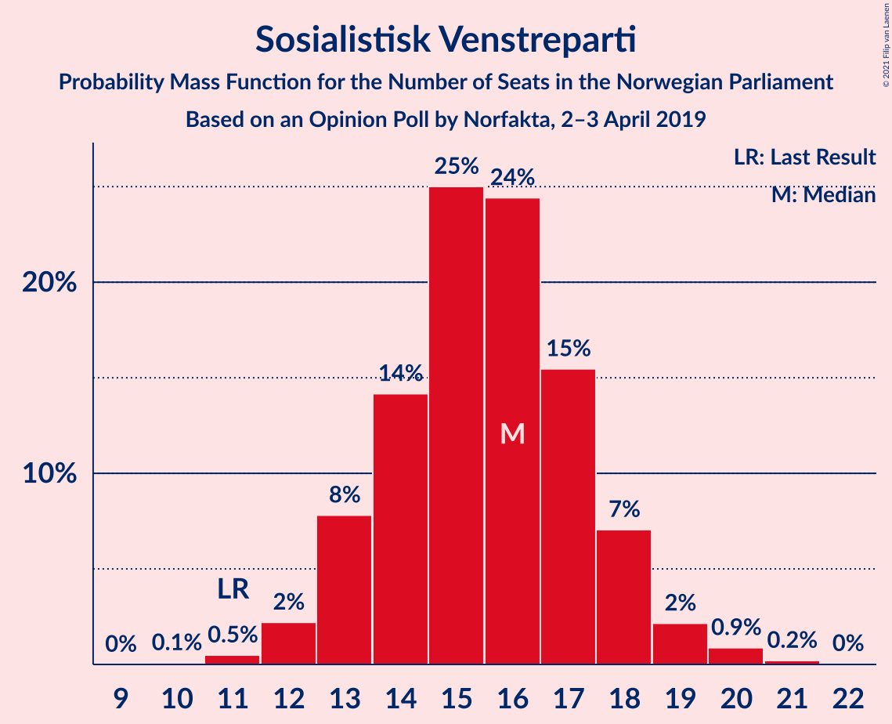

| Number of Seats | Probability | Accumulated | Special Marks |
|:---------------:|:-----------:|:-----------:|:-------------:|
| 10 | 0.1% | 100% |  |
| 11 | 0.5% | 99.9% | Last Result |
| 12 | 2% | 99.4% |  |
| 13 | 8% | 97% |  |
| 14 | 14% | 89% |  |
| 15 | 25% | 75% |  |
| 16 | 24% | 50% | Median |
| 17 | 15% | 26% |  |
| 18 | 7% | 10% |  |
| 19 | 2% | 3% |  |
| 20 | 0.9% | 1.1% |  |
| 21 | 0.2% | 0.3% |  |
| 22 | 0% | 0% |  |

### Rødt

*For a full overview of the results for this party, see the [Rødt](party-rødt.html) page.*

| Number of Seats | Probability | Accumulated | Special Marks |
|:---------------:|:-----------:|:-----------:|:-------------:|
| 1 | 0.3% | 100% | Last Result |
| 2 | 31% | 99.7% |  |
| 3 | 0% | 69% |  |
| 4 | 0% | 69% |  |
| 5 | 0% | 69% |  |
| 6 | 0% | 69% |  |
| 7 | 12% | 69% |  |
| 8 | 24% | 57% | Median |
| 9 | 24% | 33% |  |
| 10 | 7% | 9% |  |
| 11 | 2% | 2% |  |
| 12 | 0.2% | 0.3% |  |
| 13 | 0% | 0% |  |

### Kristelig Folkeparti

*For a full overview of the results for this party, see the [Kristelig Folkeparti](party-kristeligfolkeparti.html) page.*

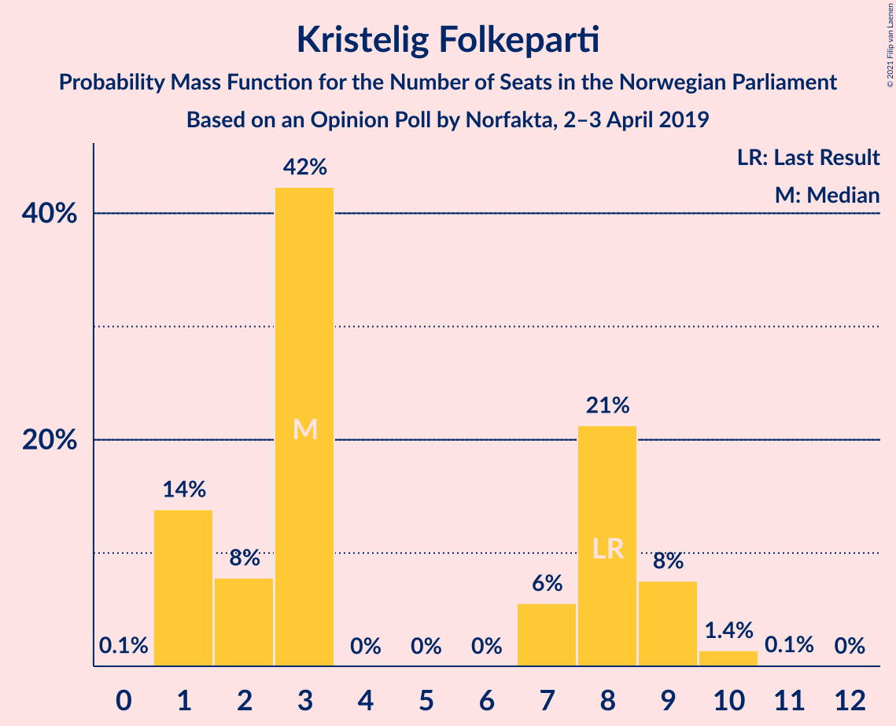

| Number of Seats | Probability | Accumulated | Special Marks |
|:---------------:|:-----------:|:-----------:|:-------------:|
| 0 | 0.1% | 100% |  |
| 1 | 14% | 99.9% |  |
| 2 | 8% | 86% |  |
| 3 | 42% | 78% | Median |
| 4 | 0% | 36% |  |
| 5 | 0% | 36% |  |
| 6 | 0% | 36% |  |
| 7 | 6% | 36% |  |
| 8 | 21% | 30% | Last Result |
| 9 | 8% | 9% |  |
| 10 | 1.4% | 2% |  |
| 11 | 0.1% | 0.2% |  |
| 12 | 0% | 0% |  |

### Miljøpartiet De Grønne

*For a full overview of the results for this party, see the [Miljøpartiet De Grønne](party-miljøpartietdegrønne.html) page.*

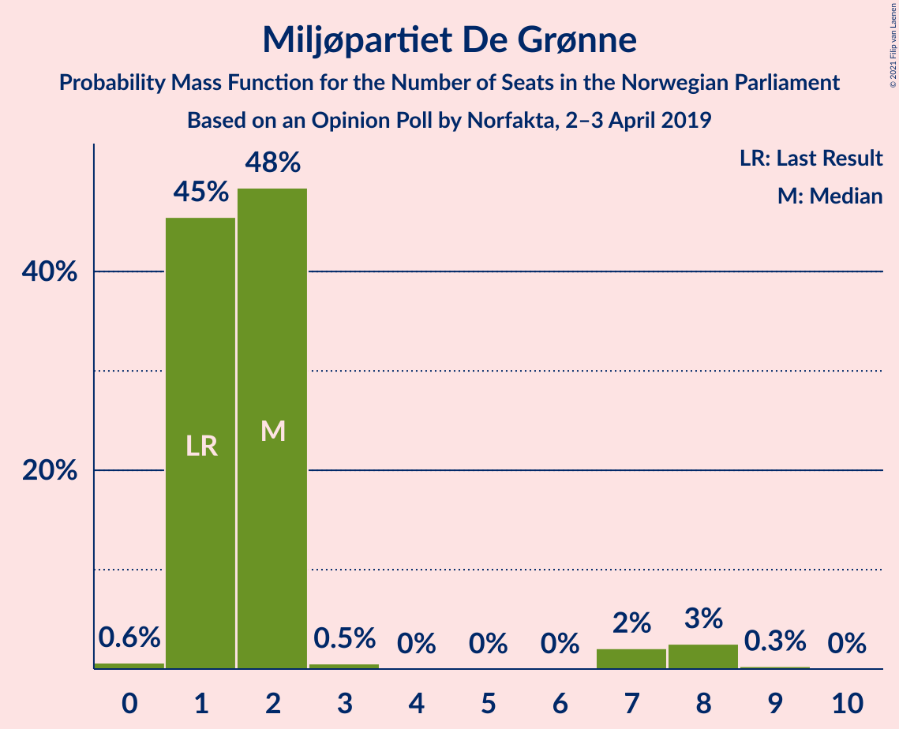

| Number of Seats | Probability | Accumulated | Special Marks |
|:---------------:|:-----------:|:-----------:|:-------------:|
| 0 | 0.6% | 100% |  |
| 1 | 45% | 99.4% | Last Result |
| 2 | 48% | 54% | Median |
| 3 | 0.5% | 5% |  |
| 4 | 0% | 5% |  |
| 5 | 0% | 5% |  |
| 6 | 0% | 5% |  |
| 7 | 2% | 5% |  |
| 8 | 3% | 3% |  |
| 9 | 0.3% | 0.3% |  |
| 10 | 0% | 0% |  |

### Venstre

*For a full overview of the results for this party, see the [Venstre](party-venstre.html) page.*

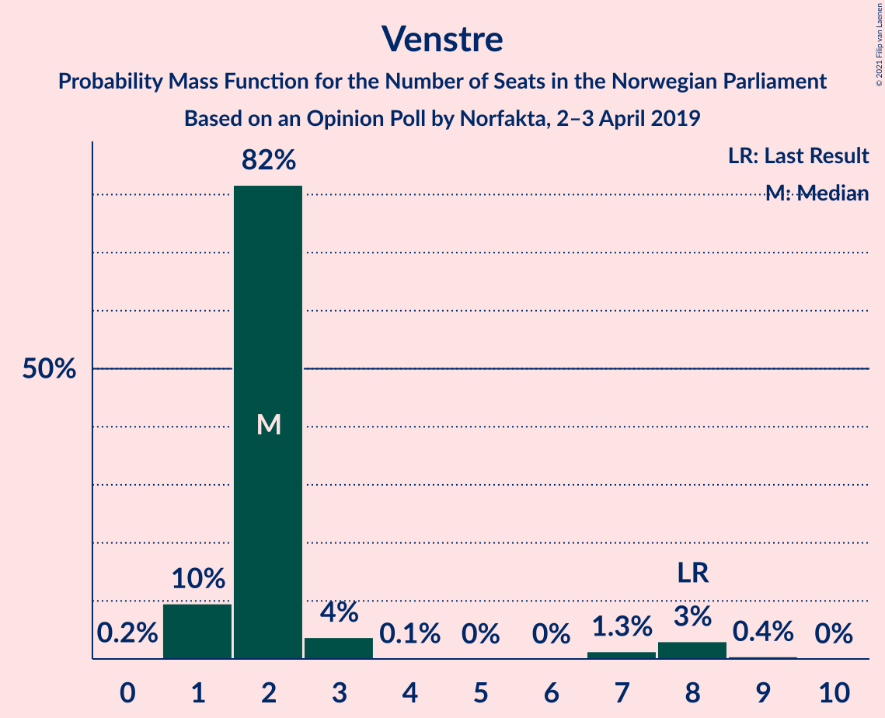

| Number of Seats | Probability | Accumulated | Special Marks |
|:---------------:|:-----------:|:-----------:|:-------------:|
| 0 | 0.2% | 100% |  |
| 1 | 10% | 99.8% |  |
| 2 | 82% | 90% | Median |
| 3 | 4% | 9% |  |
| 4 | 0.1% | 5% |  |
| 5 | 0% | 5% |  |
| 6 | 0% | 5% |  |
| 7 | 1.3% | 5% |  |
| 8 | 3% | 3% | Last Result |
| 9 | 0.4% | 0.5% |  |
| 10 | 0% | 0% |  |

## Coalitions

### Confidence Intervals

| Coalition | Last Result | Median | Majority? | 80% Confidence Interval | 90% Confidence Interval | 95% Confidence Interval | 99% Confidence Interval |
|:---------:|:-----------:|:------:|:---------:|:-----------------------:|:-----------------------:|:-----------------------:|:-----------------------:|
| Arbeiderpartiet – Senterpartiet – Sosialistisk Venstreparti – Rødt – Miljøpartiet De Grønne | 81 | 100 | 100% | 95–105 | 93–107 | 92–107 | 91–109 |
| Arbeiderpartiet – Senterpartiet – Sosialistisk Venstreparti – Kristelig Folkeparti – Miljøpartiet De Grønne | 88 | 98 | 100% | 94–103 | 92–104 | 92–106 | 89–107 |
| Arbeiderpartiet – Senterpartiet – Sosialistisk Venstreparti – Rødt | 80 | 98 | 100% | 93–103 | 92–105 | 90–105 | 89–107 |
| Høyre – Senterpartiet – Fremskrittspartiet – Kristelig Folkeparti – Venstre | 107 | 97 | 100% | 93–102 | 92–103 | 91–104 | 88–106 |
| Arbeiderpartiet – Senterpartiet – Sosialistisk Venstreparti – Miljøpartiet De Grønne | 80 | 93 | 99.3% | 89–98 | 88–99 | 87–100 | 84–103 |
| Arbeiderpartiet – Senterpartiet – Sosialistisk Venstreparti | 79 | 92 | 98% | 87–97 | 86–98 | 85–99 | 83–101 |
| Arbeiderpartiet – Senterpartiet – Kristelig Folkeparti – Miljøpartiet De Grønne | 77 | 82 | 30% | 78–87 | 77–89 | 76–90 | 74–92 |
| Arbeiderpartiet – Senterpartiet – Kristelig Folkeparti | 76 | 81 | 15% | 77–86 | 75–87 | 74–87 | 72–90 |
| Arbeiderpartiet – Senterpartiet | 68 | 76 | 0.7% | 72–81 | 71–83 | 70–83 | 68–85 |
| Høyre – Fremskrittspartiet – Kristelig Folkeparti – Miljøpartiet De Grønne – Venstre | 89 | 71 | 0% | 66–76 | 64–77 | 64–79 | 62–80 |
| Arbeiderpartiet – Sosialistisk Venstreparti – Rødt – Miljøpartiet De Grønne | 62 | 72 | 0% | 67–76 | 66–77 | 65–78 | 63–81 |
| Høyre – Fremskrittspartiet – Kristelig Folkeparti – Venstre | 88 | 68 | 0% | 64–74 | 62–76 | 62–77 | 60–78 |
| Høyre – Fremskrittspartiet – Venstre | 80 | 64 | 0% | 60–69 | 59–70 | 58–71 | 56–74 |
| Arbeiderpartiet – Sosialistisk Venstreparti | 60 | 63 | 0% | 60–68 | 59–69 | 57–70 | 56–71 |
| Høyre – Fremskrittspartiet | 72 | 62 | 0% | 58–66 | 57–68 | 56–69 | 54–70 |
| Høyre – Kristelig Folkeparti – Venstre | 61 | 47 | 0% | 43–53 | 42–54 | 42–55 | 40–57 |
| Senterpartiet – Kristelig Folkeparti – Venstre | 35 | 34 | 0% | 32–39 | 30–42 | 29–42 | 27–44 |

### Arbeiderpartiet – Senterpartiet – Sosialistisk Venstreparti – Rødt – Miljøpartiet De Grønne

| Number of Seats | Probability | Accumulated | Special Marks |
|:---------------:|:-----------:|:-----------:|:-------------:|
| 81 | 0% | 100% | Last Result |
| 82 | 0% | 100% |  |
| 83 | 0% | 100% |  |
| 84 | 0% | 100% |  |
| 85 | 0% | 100% | Majority |
| 86 | 0% | 100% |  |
| 87 | 0% | 100% |  |
| 88 | 0% | 100% |  |
| 89 | 0.2% | 99.9% |  |
| 90 | 0.2% | 99.7% |  |
| 91 | 0.6% | 99.5% |  |
| 92 | 3% | 98.9% |  |
| 93 | 1.2% | 96% |  |
| 94 | 2% | 95% |  |
| 95 | 4% | 93% |  |
| 96 | 5% | 89% |  |
| 97 | 8% | 84% |  |
| 98 | 6% | 76% |  |
| 99 | 12% | 70% |  |
| 100 | 9% | 58% |  |
| 101 | 17% | 49% |  |
| 102 | 7% | 32% | Median |
| 103 | 4% | 25% |  |
| 104 | 6% | 21% |  |
| 105 | 7% | 15% |  |
| 106 | 3% | 8% |  |
| 107 | 4% | 5% |  |
| 108 | 0.6% | 1.2% |  |
| 109 | 0.3% | 0.6% |  |
| 110 | 0.2% | 0.3% |  |
| 111 | 0% | 0.1% |  |
| 112 | 0% | 0% |  |

### Arbeiderpartiet – Senterpartiet – Sosialistisk Venstreparti – Kristelig Folkeparti – Miljøpartiet De Grønne

| Number of Seats | Probability | Accumulated | Special Marks |
|:---------------:|:-----------:|:-----------:|:-------------:|
| 87 | 0.1% | 100% |  |
| 88 | 0.1% | 99.9% | Last Result |
| 89 | 0.4% | 99.8% |  |
| 90 | 0.4% | 99.4% |  |
| 91 | 1.4% | 98.9% |  |
| 92 | 3% | 98% |  |
| 93 | 3% | 95% |  |
| 94 | 4% | 92% |  |
| 95 | 10% | 88% |  |
| 96 | 15% | 79% |  |
| 97 | 8% | 63% | Median |
| 98 | 7% | 56% |  |
| 99 | 13% | 49% |  |
| 100 | 10% | 36% |  |
| 101 | 8% | 26% |  |
| 102 | 6% | 17% |  |
| 103 | 4% | 11% |  |
| 104 | 3% | 8% |  |
| 105 | 2% | 4% |  |
| 106 | 2% | 3% |  |
| 107 | 0.4% | 0.7% |  |
| 108 | 0.1% | 0.3% |  |
| 109 | 0.1% | 0.2% |  |
| 110 | 0% | 0.1% |  |
| 111 | 0% | 0.1% |  |
| 112 | 0% | 0% |  |

### Arbeiderpartiet – Senterpartiet – Sosialistisk Venstreparti – Rødt

| Number of Seats | Probability | Accumulated | Special Marks |
|:---------------:|:-----------:|:-----------:|:-------------:|
| 80 | 0% | 100% | Last Result |
| 81 | 0% | 100% |  |
| 82 | 0% | 100% |  |
| 83 | 0% | 100% |  |
| 84 | 0% | 100% |  |
| 85 | 0% | 100% | Majority |
| 86 | 0.1% | 100% |  |
| 87 | 0.2% | 99.9% |  |
| 88 | 0.2% | 99.7% |  |
| 89 | 0.4% | 99.5% |  |
| 90 | 3% | 99.1% |  |
| 91 | 0.9% | 96% |  |
| 92 | 2% | 95% |  |
| 93 | 3% | 93% |  |
| 94 | 5% | 90% |  |
| 95 | 5% | 84% |  |
| 96 | 10% | 79% |  |
| 97 | 6% | 69% |  |
| 98 | 14% | 63% |  |
| 99 | 9% | 49% |  |
| 100 | 14% | 39% | Median |
| 101 | 5% | 25% |  |
| 102 | 3% | 20% |  |
| 103 | 8% | 17% |  |
| 104 | 3% | 9% |  |
| 105 | 5% | 6% |  |
| 106 | 0.5% | 1.1% |  |
| 107 | 0.5% | 0.6% |  |
| 108 | 0.1% | 0.2% |  |
| 109 | 0% | 0.1% |  |
| 110 | 0% | 0% |  |

### Høyre – Senterpartiet – Fremskrittspartiet – Kristelig Folkeparti – Venstre

| Number of Seats | Probability | Accumulated | Special Marks |
|:---------------:|:-----------:|:-----------:|:-------------:|
| 85 | 0.1% | 100% | Majority |
| 86 | 0.1% | 99.9% |  |
| 87 | 0.2% | 99.9% |  |
| 88 | 0.3% | 99.7% |  |
| 89 | 0.9% | 99.4% |  |
| 90 | 1.0% | 98% |  |
| 91 | 2% | 98% |  |
| 92 | 3% | 96% |  |
| 93 | 6% | 92% |  |
| 94 | 14% | 86% |  |
| 95 | 9% | 72% | Median |
| 96 | 6% | 63% |  |
| 97 | 10% | 56% |  |
| 98 | 14% | 46% |  |
| 99 | 10% | 32% |  |
| 100 | 6% | 23% |  |
| 101 | 4% | 17% |  |
| 102 | 3% | 13% |  |
| 103 | 7% | 10% |  |
| 104 | 0.9% | 3% |  |
| 105 | 1.4% | 2% |  |
| 106 | 0.4% | 0.8% |  |
| 107 | 0.3% | 0.4% | Last Result |
| 108 | 0.1% | 0.1% |  |
| 109 | 0% | 0% |  |

### Arbeiderpartiet – Senterpartiet – Sosialistisk Venstreparti – Miljøpartiet De Grønne

| Number of Seats | Probability | Accumulated | Special Marks |
|:---------------:|:-----------:|:-----------:|:-------------:|
| 80 | 0% | 100% | Last Result |
| 81 | 0% | 100% |  |
| 82 | 0% | 100% |  |
| 83 | 0.1% | 100% |  |
| 84 | 0.6% | 99.9% |  |
| 85 | 0.6% | 99.3% | Majority |
| 86 | 0.7% | 98.7% |  |
| 87 | 2% | 98% |  |
| 88 | 5% | 96% |  |
| 89 | 4% | 91% |  |
| 90 | 6% | 87% |  |
| 91 | 5% | 80% |  |
| 92 | 13% | 76% |  |
| 93 | 14% | 62% |  |
| 94 | 7% | 48% | Median |
| 95 | 8% | 41% |  |
| 96 | 8% | 33% |  |
| 97 | 6% | 25% |  |
| 98 | 11% | 19% |  |
| 99 | 5% | 9% |  |
| 100 | 2% | 4% |  |
| 101 | 0.9% | 2% |  |
| 102 | 0.9% | 2% |  |
| 103 | 0.4% | 0.7% |  |
| 104 | 0.2% | 0.2% |  |
| 105 | 0% | 0.1% |  |
| 106 | 0% | 0% |  |

### Arbeiderpartiet – Senterpartiet – Sosialistisk Venstreparti

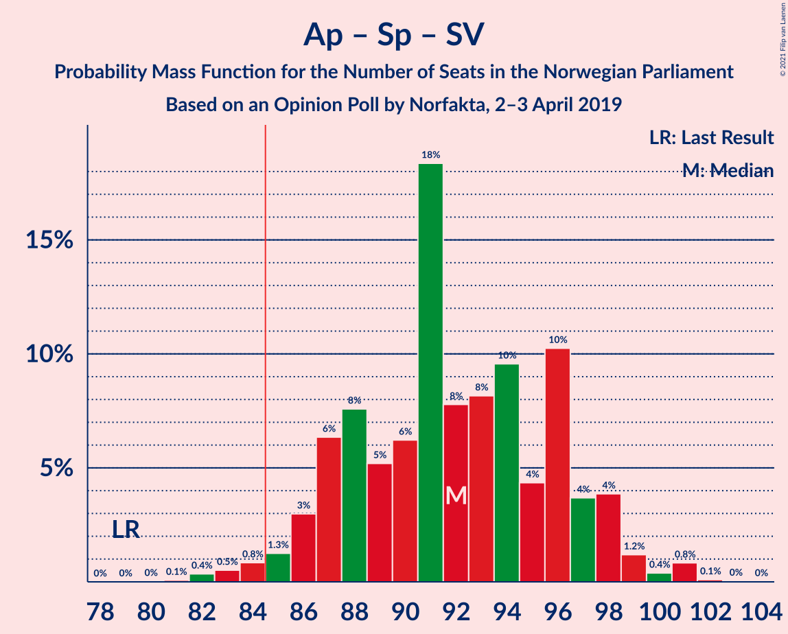

| Number of Seats | Probability | Accumulated | Special Marks |
|:---------------:|:-----------:|:-----------:|:-------------:|
| 79 | 0% | 100% | Last Result |
| 80 | 0% | 100% |  |
| 81 | 0.1% | 100% |  |
| 82 | 0.4% | 99.9% |  |
| 83 | 0.5% | 99.5% |  |
| 84 | 0.8% | 99.0% |  |
| 85 | 1.3% | 98% | Majority |
| 86 | 3% | 97% |  |
| 87 | 6% | 94% |  |
| 88 | 8% | 88% |  |
| 89 | 5% | 80% |  |
| 90 | 6% | 75% |  |
| 91 | 18% | 69% |  |
| 92 | 8% | 50% | Median |
| 93 | 8% | 42% |  |
| 94 | 10% | 34% |  |
| 95 | 4% | 25% |  |
| 96 | 10% | 20% |  |
| 97 | 4% | 10% |  |
| 98 | 4% | 6% |  |
| 99 | 1.2% | 3% |  |
| 100 | 0.4% | 1.4% |  |
| 101 | 0.8% | 1.0% |  |
| 102 | 0.1% | 0.2% |  |
| 103 | 0% | 0.1% |  |
| 104 | 0% | 0% |  |

### Arbeiderpartiet – Senterpartiet – Kristelig Folkeparti – Miljøpartiet De Grønne

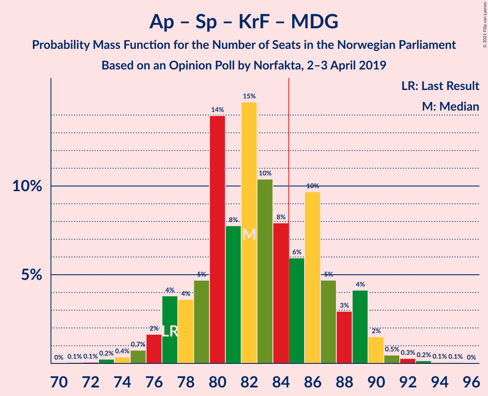

| Number of Seats | Probability | Accumulated | Special Marks |
|:---------------:|:-----------:|:-----------:|:-------------:|
| 71 | 0.1% | 100% |  |
| 72 | 0.1% | 99.9% |  |
| 73 | 0.2% | 99.9% |  |
| 74 | 0.4% | 99.6% |  |
| 75 | 0.7% | 99.2% |  |
| 76 | 2% | 98.5% |  |
| 77 | 4% | 97% | Last Result |
| 78 | 4% | 93% |  |
| 79 | 5% | 89% |  |
| 80 | 14% | 85% |  |
| 81 | 8% | 71% | Median |
| 82 | 15% | 63% |  |
| 83 | 10% | 48% |  |
| 84 | 8% | 38% |  |
| 85 | 6% | 30% | Majority |
| 86 | 10% | 24% |  |
| 87 | 5% | 14% |  |
| 88 | 3% | 10% |  |
| 89 | 4% | 7% |  |
| 90 | 2% | 3% |  |
| 91 | 0.5% | 1.1% |  |
| 92 | 0.3% | 0.6% |  |
| 93 | 0.2% | 0.3% |  |
| 94 | 0.1% | 0.2% |  |
| 95 | 0.1% | 0.1% |  |
| 96 | 0% | 0% |  |

### Arbeiderpartiet – Senterpartiet – Kristelig Folkeparti

| Number of Seats | Probability | Accumulated | Special Marks |
|:---------------:|:-----------:|:-----------:|:-------------:|
| 69 | 0% | 100% |  |
| 70 | 0.1% | 99.9% |  |
| 71 | 0.2% | 99.8% |  |
| 72 | 0.6% | 99.7% |  |
| 73 | 0.7% | 99.1% |  |
| 74 | 1.2% | 98% |  |
| 75 | 3% | 97% |  |
| 76 | 4% | 95% | Last Result |
| 77 | 5% | 90% |  |
| 78 | 8% | 85% |  |
| 79 | 11% | 77% | Median |
| 80 | 12% | 66% |  |
| 81 | 17% | 54% |  |
| 82 | 8% | 37% |  |
| 83 | 4% | 29% |  |
| 84 | 10% | 25% |  |
| 85 | 4% | 15% | Majority |
| 86 | 5% | 11% |  |
| 87 | 4% | 7% |  |
| 88 | 1.0% | 2% |  |
| 89 | 0.8% | 1.4% |  |
| 90 | 0.4% | 0.6% |  |
| 91 | 0.1% | 0.2% |  |
| 92 | 0.1% | 0.1% |  |
| 93 | 0% | 0% |  |

### Arbeiderpartiet – Senterpartiet

| Number of Seats | Probability | Accumulated | Special Marks |
|:---------------:|:-----------:|:-----------:|:-------------:|
| 66 | 0% | 100% |  |
| 67 | 0.3% | 99.9% |  |
| 68 | 0.4% | 99.6% | Last Result |
| 69 | 1.5% | 99.3% |  |
| 70 | 2% | 98% |  |
| 71 | 5% | 96% |  |
| 72 | 4% | 91% |  |
| 73 | 9% | 87% |  |
| 74 | 7% | 78% |  |
| 75 | 8% | 71% |  |
| 76 | 16% | 63% | Median |
| 77 | 10% | 47% |  |
| 78 | 10% | 37% |  |
| 79 | 7% | 28% |  |
| 80 | 11% | 21% |  |
| 81 | 3% | 10% |  |
| 82 | 1.4% | 7% |  |
| 83 | 4% | 5% |  |
| 84 | 0.6% | 1.3% |  |
| 85 | 0.5% | 0.7% | Majority |
| 86 | 0.1% | 0.2% |  |
| 87 | 0.1% | 0.1% |  |
| 88 | 0% | 0% |  |

### Høyre – Fremskrittspartiet – Kristelig Folkeparti – Miljøpartiet De Grønne – Venstre

| Number of Seats | Probability | Accumulated | Special Marks |
|:---------------:|:-----------:|:-----------:|:-------------:|
| 60 | 0% | 100% |  |
| 61 | 0.1% | 99.9% |  |
| 62 | 0.5% | 99.8% |  |
| 63 | 0.5% | 99.3% |  |
| 64 | 5% | 98.8% |  |
| 65 | 3% | 94% |  |
| 66 | 8% | 91% |  |
| 67 | 3% | 82% |  |
| 68 | 5% | 79% |  |
| 69 | 14% | 74% | Median |
| 70 | 9% | 60% |  |
| 71 | 14% | 50% |  |
| 72 | 6% | 36% |  |
| 73 | 10% | 30% |  |
| 74 | 5% | 20% |  |
| 75 | 5% | 15% |  |
| 76 | 3% | 10% |  |
| 77 | 2% | 7% |  |
| 78 | 0.9% | 5% |  |
| 79 | 3% | 4% |  |
| 80 | 0.4% | 0.9% |  |
| 81 | 0.2% | 0.5% |  |
| 82 | 0.2% | 0.2% |  |
| 83 | 0.1% | 0.1% |  |
| 84 | 0% | 0% |  |
| 85 | 0% | 0% | Majority |
| 86 | 0% | 0% |  |
| 87 | 0% | 0% |  |
| 88 | 0% | 0% |  |
| 89 | 0% | 0% | Last Result |

### Arbeiderpartiet – Sosialistisk Venstreparti – Rødt – Miljøpartiet De Grønne

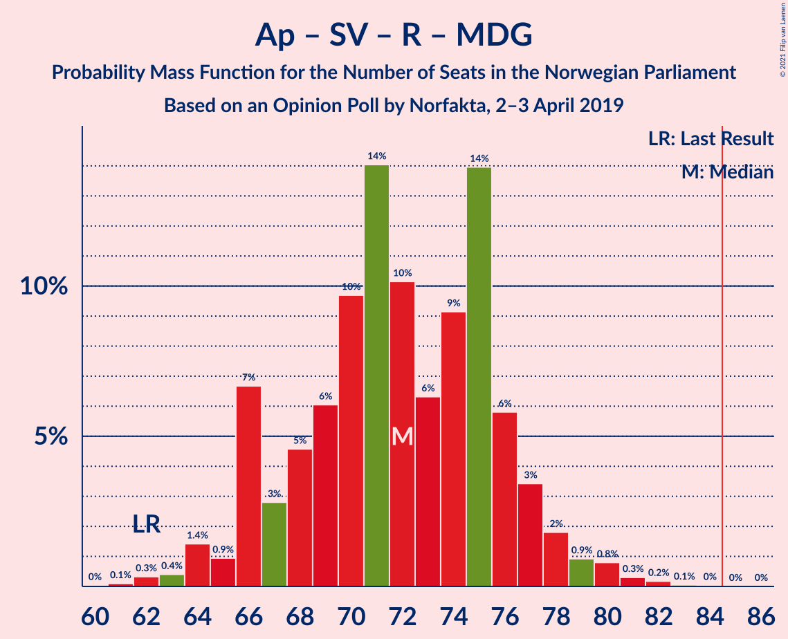

| Number of Seats | Probability | Accumulated | Special Marks |
|:---------------:|:-----------:|:-----------:|:-------------:|
| 60 | 0% | 100% |  |
| 61 | 0.1% | 99.9% |  |
| 62 | 0.3% | 99.9% | Last Result |
| 63 | 0.4% | 99.5% |  |
| 64 | 1.4% | 99.1% |  |
| 65 | 0.9% | 98% |  |
| 66 | 7% | 97% |  |
| 67 | 3% | 90% |  |
| 68 | 5% | 87% |  |
| 69 | 6% | 83% |  |
| 70 | 10% | 77% |  |
| 71 | 14% | 67% |  |
| 72 | 10% | 53% |  |
| 73 | 6% | 43% |  |
| 74 | 9% | 36% | Median |
| 75 | 14% | 27% |  |
| 76 | 6% | 13% |  |
| 77 | 3% | 8% |  |
| 78 | 2% | 4% |  |
| 79 | 0.9% | 2% |  |
| 80 | 0.8% | 1.4% |  |
| 81 | 0.3% | 0.6% |  |
| 82 | 0.2% | 0.3% |  |
| 83 | 0.1% | 0.1% |  |
| 84 | 0% | 0.1% |  |
| 85 | 0% | 0% | Majority |

### Høyre – Fremskrittspartiet – Kristelig Folkeparti – Venstre

| Number of Seats | Probability | Accumulated | Special Marks |
|:---------------:|:-----------:|:-----------:|:-------------:|
| 58 | 0% | 100% |  |
| 59 | 0.2% | 99.9% |  |
| 60 | 0.4% | 99.7% |  |
| 61 | 0.6% | 99.4% |  |
| 62 | 4% | 98.7% |  |
| 63 | 3% | 95% |  |
| 64 | 7% | 92% |  |
| 65 | 6% | 85% |  |
| 66 | 4% | 78% |  |
| 67 | 7% | 74% | Median |
| 68 | 17% | 67% |  |
| 69 | 9% | 50% |  |
| 70 | 12% | 41% |  |
| 71 | 6% | 29% |  |
| 72 | 8% | 23% |  |
| 73 | 4% | 15% |  |
| 74 | 4% | 11% |  |
| 75 | 2% | 7% |  |
| 76 | 1.2% | 5% |  |
| 77 | 3% | 4% |  |
| 78 | 0.6% | 1.0% |  |
| 79 | 0.2% | 0.5% |  |
| 80 | 0.2% | 0.3% |  |
| 81 | 0% | 0.1% |  |
| 82 | 0% | 0% |  |
| 83 | 0% | 0% |  |
| 84 | 0% | 0% |  |
| 85 | 0% | 0% | Majority |
| 86 | 0% | 0% |  |
| 87 | 0% | 0% |  |
| 88 | 0% | 0% | Last Result |

### Høyre – Fremskrittspartiet – Venstre

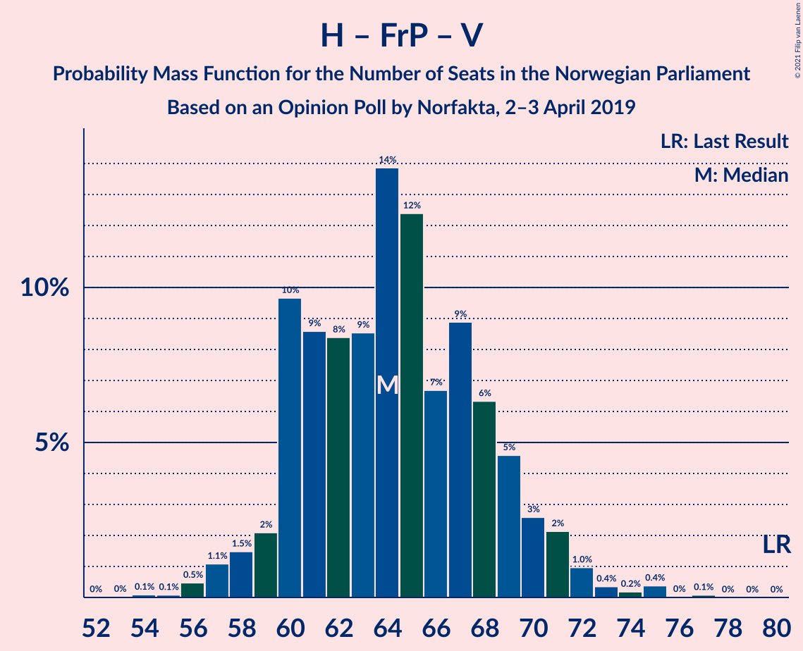

| Number of Seats | Probability | Accumulated | Special Marks |
|:---------------:|:-----------:|:-----------:|:-------------:|
| 54 | 0.1% | 100% |  |
| 55 | 0.1% | 99.9% |  |
| 56 | 0.5% | 99.8% |  |
| 57 | 1.1% | 99.3% |  |
| 58 | 1.5% | 98% |  |
| 59 | 2% | 97% |  |
| 60 | 10% | 95% |  |
| 61 | 9% | 85% |  |
| 62 | 8% | 76% |  |
| 63 | 9% | 68% |  |
| 64 | 14% | 59% | Median |
| 65 | 12% | 46% |  |
| 66 | 7% | 33% |  |
| 67 | 9% | 27% |  |
| 68 | 6% | 18% |  |
| 69 | 5% | 11% |  |
| 70 | 3% | 7% |  |
| 71 | 2% | 4% |  |
| 72 | 1.0% | 2% |  |
| 73 | 0.4% | 1.0% |  |
| 74 | 0.2% | 0.7% |  |
| 75 | 0.4% | 0.5% |  |
| 76 | 0% | 0.1% |  |
| 77 | 0.1% | 0.1% |  |
| 78 | 0% | 0% |  |
| 79 | 0% | 0% |  |
| 80 | 0% | 0% | Last Result |

### Arbeiderpartiet – Sosialistisk Venstreparti

| Number of Seats | Probability | Accumulated | Special Marks |
|:---------------:|:-----------:|:-----------:|:-------------:|
| 54 | 0.1% | 100% |  |
| 55 | 0.2% | 99.9% |  |
| 56 | 0.4% | 99.7% |  |
| 57 | 2% | 99.3% |  |
| 58 | 2% | 97% |  |
| 59 | 3% | 95% |  |
| 60 | 8% | 92% | Last Result |
| 61 | 7% | 85% |  |
| 62 | 11% | 78% |  |
| 63 | 18% | 66% |  |
| 64 | 10% | 49% | Median |
| 65 | 14% | 39% |  |
| 66 | 9% | 25% |  |
| 67 | 5% | 16% |  |
| 68 | 4% | 10% |  |
| 69 | 4% | 7% |  |
| 70 | 0.9% | 3% |  |
| 71 | 1.3% | 2% |  |
| 72 | 0.2% | 0.4% |  |
| 73 | 0.1% | 0.2% |  |
| 74 | 0.1% | 0.1% |  |
| 75 | 0% | 0% |  |

### Høyre – Fremskrittspartiet

| Number of Seats | Probability | Accumulated | Special Marks |
|:---------------:|:-----------:|:-----------:|:-------------:|
| 51 | 0.1% | 100% |  |
| 52 | 0.1% | 99.9% |  |
| 53 | 0.1% | 99.8% |  |
| 54 | 0.6% | 99.7% |  |
| 55 | 1.2% | 99.1% |  |
| 56 | 2% | 98% |  |
| 57 | 2% | 96% |  |
| 58 | 10% | 94% |  |
| 59 | 7% | 84% |  |
| 60 | 12% | 77% |  |
| 61 | 8% | 65% |  |
| 62 | 14% | 57% | Median |
| 63 | 12% | 43% |  |
| 64 | 7% | 31% |  |
| 65 | 7% | 24% |  |
| 66 | 8% | 17% |  |
| 67 | 4% | 9% |  |
| 68 | 2% | 6% |  |
| 69 | 2% | 3% |  |
| 70 | 0.8% | 1.2% |  |
| 71 | 0.3% | 0.4% |  |
| 72 | 0.1% | 0.1% | Last Result |
| 73 | 0% | 0% |  |

### Høyre – Kristelig Folkeparti – Venstre

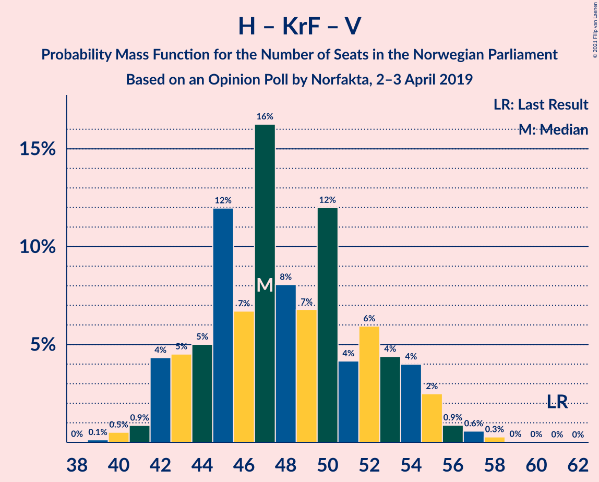

| Number of Seats | Probability | Accumulated | Special Marks |
|:---------------:|:-----------:|:-----------:|:-------------:|
| 38 | 0% | 100% |  |
| 39 | 0.1% | 99.9% |  |
| 40 | 0.5% | 99.8% |  |
| 41 | 0.9% | 99.3% |  |
| 42 | 4% | 98% |  |
| 43 | 5% | 94% |  |
| 44 | 5% | 90% |  |
| 45 | 12% | 85% |  |
| 46 | 7% | 73% | Median |
| 47 | 16% | 66% |  |
| 48 | 8% | 50% |  |
| 49 | 7% | 42% |  |
| 50 | 12% | 35% |  |
| 51 | 4% | 23% |  |
| 52 | 6% | 19% |  |
| 53 | 4% | 13% |  |
| 54 | 4% | 8% |  |
| 55 | 2% | 4% |  |
| 56 | 0.9% | 2% |  |
| 57 | 0.6% | 0.9% |  |
| 58 | 0.3% | 0.4% |  |
| 59 | 0% | 0.1% |  |
| 60 | 0% | 0% |  |
| 61 | 0% | 0% | Last Result |

### Senterpartiet – Kristelig Folkeparti – Venstre

| Number of Seats | Probability | Accumulated | Special Marks |
|:---------------:|:-----------:|:-----------:|:-------------:|
| 26 | 0% | 100% |  |
| 27 | 0.5% | 99.9% |  |
| 28 | 2% | 99.4% |  |
| 29 | 3% | 98% |  |
| 30 | 2% | 95% |  |
| 31 | 3% | 93% |  |
| 32 | 6% | 91% |  |
| 33 | 21% | 85% | Median |
| 34 | 15% | 64% |  |
| 35 | 6% | 49% | Last Result |
| 36 | 15% | 43% |  |
| 37 | 8% | 28% |  |
| 38 | 7% | 19% |  |
| 39 | 4% | 13% |  |
| 40 | 2% | 9% |  |
| 41 | 2% | 7% |  |
| 42 | 3% | 5% |  |
| 43 | 1.2% | 2% |  |
| 44 | 0.5% | 0.9% |  |
| 45 | 0.1% | 0.4% |  |
| 46 | 0.1% | 0.3% |  |
| 47 | 0.1% | 0.2% |  |
| 48 | 0% | 0.1% |  |
| 49 | 0% | 0% |  |

## Technical Information

### Opinion Poll

+ **Polling firm:** Norfakta
+ **Commissioner(s):** —
+ **Fieldwork period:** 2–3 April 2019

### Calculations

+ **Sample size:** 1032
+ **Simulations done:** 1,048,576
+ **Error estimate:** 1.19%

