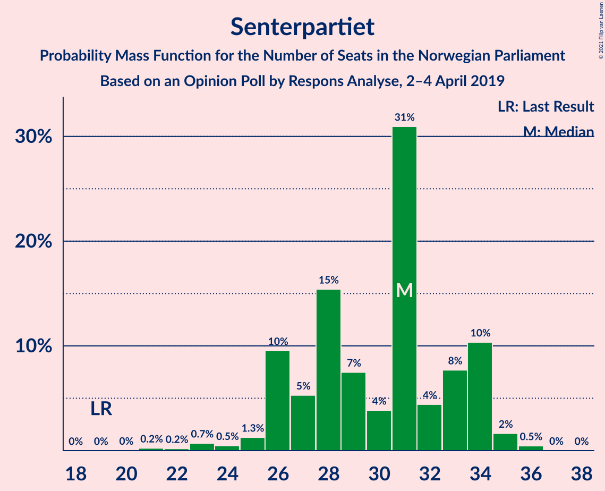
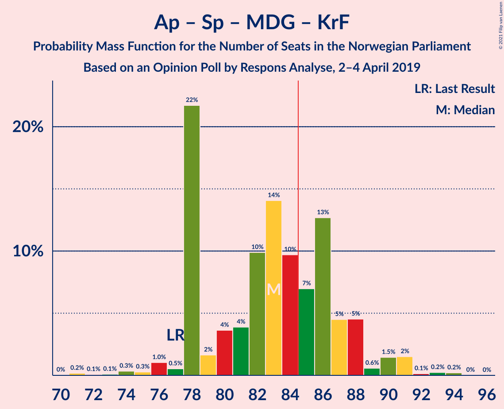

# Opinion Poll by Respons Analyse, 2–4 April 2019

<a href="#voting-intentions">Voting Intentions</a> | <a href="#seats">Seats</a> | <a href="#coalitions">Coalitions</a> | <a href="#technical-information">Technical Information</a>

## Voting Intentions

### Confidence Intervals

| Party | Last Result | Poll Result | 80% Confidence Interval | 90% Confidence Interval | 95% Confidence Interval | 99% Confidence Interval |
|:-----:|:-----------:|:-----------:|:-----------------------:|:-----------------------:|:-----------------------:|:-----------------------:|
| Arbeiderpartiet | 27.4% | 25.6% | 23.9–27.4% |23.4–27.9% |23.0–28.4% |22.2–29.3% |
| Høyre | 25.0% | 22.4% | 20.7–24.1% |20.3–24.6% |19.9–25.1% |19.1–25.9% |
| Senterpartiet | 10.3% | 15.6% | 14.2–17.1% |13.8–17.6% |13.5–18.0% |12.8–18.7% |
| Fremskrittspartiet | 15.2% | 10.1% | 9.0–11.4% |8.6–11.8% |8.4–12.1% |7.8–12.8% |
| Sosialistisk Venstreparti | 6.0% | 7.6% | 6.6–8.8% |6.3–9.1% |6.1–9.4% |5.7–10.0% |
| Rødt | 2.4% | 4.7% | 3.9–5.7% |3.7–5.9% |3.6–6.2% |3.2–6.7% |
| Venstre | 4.4% | 4.3% | 3.6–5.2% |3.4–5.5% |3.2–5.7% |2.9–6.2% |
| Miljøpartiet De Grønne | 3.2% | 3.9% | 3.2–4.8% |3.0–5.1% |2.9–5.3% |2.6–5.8% |
| Kristelig Folkeparti | 4.2% | 3.0% | 2.4–3.8% |2.2–4.0% |2.1–4.3% |1.9–4.7% |

*Note:* The poll result column reflects the actual value used in the calculations. Published results may vary slightly, and in addition be rounded to fewer digits.

## Seats

### Confidence Intervals

| Party | Last Result | Median | 80% Confidence Interval | 90% Confidence Interval | 95% Confidence Interval | 99% Confidence Interval |
|:-----:|:-----------:|:------:|:-----------------------:|:-----------------------:|:-----------------------:|:-----------------------:|
| <a href="#arbeiderpartiet">Arbeiderpartiet</a> | 49 | 45 | 44–51 |42–52 |41–53 |41–55 |
| <a href="#høyre">Høyre</a> | 45 | 40 | 37–44 |36–45 |35–45 |34–48 |
| <a href="#senterpartiet">Senterpartiet</a> | 19 | 31 | 26–34 |26–34 |25–34 |23–35 |
| <a href="#fremskrittspartiet">Fremskrittspartiet</a> | 27 | 18 | 15–20 |15–21 |14–22 |13–23 |
| <a href="#sosialistisk-venstreparti">Sosialistisk Venstreparti</a> | 11 | 14 | 11–15 |11–16 |11–17 |10–18 |
| <a href="#rødt">Rødt</a> | 1 | 9 | 2–9 |2–10 |2–11 |2–11 |
| <a href="#venstre">Venstre</a> | 8 | 8 | 2–9 |2–9 |2–10 |2–11 |
| <a href="#miljøpartiet-de-grønne">Miljøpartiet De Grønne</a> | 1 | 2 | 2–8 |2–8 |1–9 |1–10 |
| <a href="#kristelig-folkeparti">Kristelig Folkeparti</a> | 8 | 1 | 1–3 |1–3 |1–7 |0–8 |

### Arbeiderpartiet

*For a full overview of the results for this party, see the [Arbeiderpartiet](party-arbeiderpartiet.html) page.*

| Number of Seats | Probability | Accumulated | Special Marks |
|:---------------:|:-----------:|:-----------:|:-------------:|
| 40 | 0.2% | 100% |  |
| 41 | 3% | 99.8% |  |
| 42 | 2% | 97% |  |
| 43 | 4% | 95% |  |
| 44 | 36% | 91% |  |
| 45 | 7% | 54% | Median |
| 46 | 10% | 47% |  |
| 47 | 6% | 38% |  |
| 48 | 2% | 31% |  |
| 49 | 9% | 29% | Last Result |
| 50 | 4% | 20% |  |
| 51 | 6% | 16% |  |
| 52 | 5% | 10% |  |
| 53 | 3% | 5% |  |
| 54 | 1.1% | 2% |  |
| 55 | 0.4% | 0.7% |  |
| 56 | 0.1% | 0.2% |  |
| 57 | 0.1% | 0.1% |  |
| 58 | 0% | 0% |  |

### Høyre

*For a full overview of the results for this party, see the [Høyre](party-høyre.html) page.*

| Number of Seats | Probability | Accumulated | Special Marks |
|:---------------:|:-----------:|:-----------:|:-------------:|
| 33 | 0.2% | 100% |  |
| 34 | 1.1% | 99.7% |  |
| 35 | 3% | 98.6% |  |
| 36 | 3% | 96% |  |
| 37 | 17% | 93% |  |
| 38 | 10% | 75% |  |
| 39 | 9% | 65% |  |
| 40 | 9% | 57% | Median |
| 41 | 8% | 48% |  |
| 42 | 27% | 40% |  |
| 43 | 3% | 13% |  |
| 44 | 3% | 10% |  |
| 45 | 5% | 7% | Last Result |
| 46 | 1.1% | 2% |  |
| 47 | 0.4% | 1.0% |  |
| 48 | 0.2% | 0.6% |  |
| 49 | 0.3% | 0.4% |  |
| 50 | 0% | 0% |  |

### Senterpartiet

*For a full overview of the results for this party, see the [Senterpartiet](party-senterpartiet.html) page.*

| Number of Seats | Probability | Accumulated | Special Marks |
|:---------------:|:-----------:|:-----------:|:-------------:|
| 19 | 0% | 100% | Last Result |
| 20 | 0% | 100% |  |
| 21 | 0.2% | 100% |  |
| 22 | 0.2% | 99.7% |  |
| 23 | 0.7% | 99.6% |  |
| 24 | 0.5% | 98.8% |  |
| 25 | 1.3% | 98% |  |
| 26 | 10% | 97% |  |
| 27 | 5% | 88% |  |
| 28 | 15% | 82% |  |
| 29 | 7% | 67% |  |
| 30 | 4% | 59% |  |
| 31 | 31% | 56% | Median |
| 32 | 4% | 25% |  |
| 33 | 8% | 20% |  |
| 34 | 10% | 12% |  |
| 35 | 2% | 2% |  |
| 36 | 0.5% | 0.5% |  |
| 37 | 0% | 0% |  |

### Fremskrittspartiet

*For a full overview of the results for this party, see the [Fremskrittspartiet](party-fremskrittspartiet.html) page.*

| Number of Seats | Probability | Accumulated | Special Marks |
|:---------------:|:-----------:|:-----------:|:-------------:|
| 12 | 0% | 100% |  |
| 13 | 1.4% | 99.9% |  |
| 14 | 1.2% | 98.5% |  |
| 15 | 11% | 97% |  |
| 16 | 11% | 86% |  |
| 17 | 11% | 75% |  |
| 18 | 32% | 64% | Median |
| 19 | 18% | 32% |  |
| 20 | 8% | 14% |  |
| 21 | 3% | 6% |  |
| 22 | 2% | 3% |  |
| 23 | 0.7% | 1.0% |  |
| 24 | 0.2% | 0.3% |  |
| 25 | 0.1% | 0.1% |  |
| 26 | 0% | 0% |  |
| 27 | 0% | 0% | Last Result |

### Sosialistisk Venstreparti

*For a full overview of the results for this party, see the [Sosialistisk Venstreparti](party-sosialistiskvenstreparti.html) page.*

| Number of Seats | Probability | Accumulated | Special Marks |
|:---------------:|:-----------:|:-----------:|:-------------:|
| 9 | 0.4% | 100% |  |
| 10 | 2% | 99.6% |  |
| 11 | 11% | 98% | Last Result |
| 12 | 8% | 87% |  |
| 13 | 22% | 79% |  |
| 14 | 39% | 57% | Median |
| 15 | 11% | 18% |  |
| 16 | 4% | 7% |  |
| 17 | 1.0% | 3% |  |
| 18 | 2% | 2% |  |
| 19 | 0.1% | 0.2% |  |
| 20 | 0% | 0% |  |

### Rødt

*For a full overview of the results for this party, see the [Rødt](party-rødt.html) page.*

| Number of Seats | Probability | Accumulated | Special Marks |
|:---------------:|:-----------:|:-----------:|:-------------:|
| 1 | 0% | 100% | Last Result |
| 2 | 11% | 100% |  |
| 3 | 0% | 89% |  |
| 4 | 0% | 89% |  |
| 5 | 0% | 89% |  |
| 6 | 0.1% | 89% |  |
| 7 | 20% | 89% |  |
| 8 | 15% | 69% |  |
| 9 | 46% | 54% | Median |
| 10 | 5% | 8% |  |
| 11 | 3% | 3% |  |
| 12 | 0.3% | 0.4% |  |
| 13 | 0.1% | 0.1% |  |
| 14 | 0% | 0% |  |

### Venstre

*For a full overview of the results for this party, see the [Venstre](party-venstre.html) page.*

| Number of Seats | Probability | Accumulated | Special Marks |
|:---------------:|:-----------:|:-----------:|:-------------:|
| 2 | 18% | 100% |  |
| 3 | 4% | 82% |  |
| 4 | 0% | 79% |  |
| 5 | 0% | 78% |  |
| 6 | 0.1% | 78% |  |
| 7 | 10% | 78% |  |
| 8 | 44% | 68% | Last Result, Median |
| 9 | 20% | 24% |  |
| 10 | 3% | 4% |  |
| 11 | 1.2% | 1.4% |  |
| 12 | 0.1% | 0.2% |  |
| 13 | 0% | 0% |  |

### Miljøpartiet De Grønne

*For a full overview of the results for this party, see the [Miljøpartiet De Grønne](party-miljøpartietdegrønne.html) page.*

| Number of Seats | Probability | Accumulated | Special Marks |
|:---------------:|:-----------:|:-----------:|:-------------:|
| 1 | 3% | 100% | Last Result |
| 2 | 47% | 97% | Median |
| 3 | 2% | 50% |  |
| 4 | 0.1% | 48% |  |
| 5 | 0% | 48% |  |
| 6 | 0.2% | 48% |  |
| 7 | 25% | 48% |  |
| 8 | 18% | 23% |  |
| 9 | 3% | 5% |  |
| 10 | 1.3% | 1.5% |  |
| 11 | 0.2% | 0.2% |  |
| 12 | 0% | 0% |  |

### Kristelig Folkeparti

*For a full overview of the results for this party, see the [Kristelig Folkeparti](party-kristeligfolkeparti.html) page.*

| Number of Seats | Probability | Accumulated | Special Marks |
|:---------------:|:-----------:|:-----------:|:-------------:|
| 0 | 2% | 100% |  |
| 1 | 71% | 98% | Median |
| 2 | 9% | 27% |  |
| 3 | 13% | 18% |  |
| 4 | 0% | 5% |  |
| 5 | 0% | 5% |  |
| 6 | 0.1% | 5% |  |
| 7 | 4% | 5% |  |
| 8 | 1.0% | 1.1% | Last Result |
| 9 | 0.1% | 0.1% |  |
| 10 | 0% | 0% |  |

## Coalitions

### Confidence Intervals

| Coalition | Last Result | Median | Majority? | 80% Confidence Interval | 90% Confidence Interval | 95% Confidence Interval | 99% Confidence Interval |
|:---------:|:-----------:|:------:|:---------:|:-----------------------:|:-----------------------:|:-----------------------:|:-----------------------:|
| Arbeiderpartiet – Senterpartiet – Sosialistisk Venstreparti – Rødt – Miljøpartiet De Grønne | 81 | 102 | 100% | 98–106 | 97–108 | 96–110 | 94–111 |
| Arbeiderpartiet – Senterpartiet – Sosialistisk Venstreparti – Rødt | 80 | 98 | 99.9% | 94–102 | 92–104 | 90–104 | 87–106 |
| Arbeiderpartiet – Senterpartiet – Sosialistisk Venstreparti – Miljøpartiet De Grønne – Kristelig Folkeparti | 88 | 97 | 100% | 92–101 | 92–102 | 90–103 | 88–105 |
| Høyre – Senterpartiet – Fremskrittspartiet – Venstre – Kristelig Folkeparti | 107 | 97 | 99.8% | 91–100 | 90–101 | 89–102 | 87–104 |
| Arbeiderpartiet – Senterpartiet – Sosialistisk Venstreparti – Miljøpartiet De Grønne | 80 | 94 | 99.9% | 91–99 | 91–100 | 88–101 | 86–102 |
| Arbeiderpartiet – Senterpartiet – Sosialistisk Venstreparti | 79 | 89 | 97% | 86–94 | 85–96 | 84–97 | 81–98 |
| Arbeiderpartiet – Senterpartiet – Miljøpartiet De Grønne – Kristelig Folkeparti | 77 | 83 | 33% | 78–87 | 78–88 | 77–90 | 74–93 |
| Arbeiderpartiet – Senterpartiet – Kristelig Folkeparti | 76 | 77 | 2% | 74–82 | 73–84 | 72–84 | 70–87 |
| Arbeiderpartiet – Senterpartiet | 68 | 76 | 0.2% | 73–80 | 72–82 | 71–82 | 68–84 |
| Høyre – Fremskrittspartiet – Venstre – Miljøpartiet De Grønne – Kristelig Folkeparti | 89 | 71 | 0.1% | 67–75 | 65–77 | 64–79 | 62–82 |
| Høyre – Fremskrittspartiet – Venstre – Kristelig Folkeparti | 88 | 67 | 0% | 62–70 | 59–71 | 59–73 | 56–75 |
| Høyre – Fremskrittspartiet – Venstre | 80 | 65 | 0% | 60–69 | 58–70 | 58–71 | 54–74 |
| Arbeiderpartiet – Sosialistisk Venstreparti | 60 | 58 | 0% | 57–65 | 55–67 | 54–68 | 53–69 |
| Høyre – Fremskrittspartiet | 72 | 58 | 0% | 53–62 | 52–63 | 51–64 | 50–68 |
| Høyre – Venstre – Kristelig Folkeparti | 61 | 48 | 0% | 44–51 | 43–54 | 40–54 | 40–57 |
| Senterpartiet – Venstre – Kristelig Folkeparti | 35 | 40 | 0% | 33–43 | 31–44 | 31–45 | 29–46 |

### Arbeiderpartiet – Senterpartiet – Sosialistisk Venstreparti – Rødt – Miljøpartiet De Grønne

| Number of Seats | Probability | Accumulated | Special Marks |
|:---------------:|:-----------:|:-----------:|:-------------:|
| 81 | 0% | 100% | Last Result |
| 82 | 0% | 100% |  |
| 83 | 0% | 100% |  |
| 84 | 0% | 100% |  |
| 85 | 0% | 100% | Majority |
| 86 | 0% | 100% |  |
| 87 | 0% | 100% |  |
| 88 | 0% | 100% |  |
| 89 | 0% | 100% |  |
| 90 | 0% | 100% |  |
| 91 | 0.1% | 100% |  |
| 92 | 0.1% | 99.8% |  |
| 93 | 0.1% | 99.7% |  |
| 94 | 0.9% | 99.6% |  |
| 95 | 0.6% | 98.7% |  |
| 96 | 1.4% | 98% |  |
| 97 | 2% | 97% |  |
| 98 | 5% | 95% |  |
| 99 | 6% | 90% |  |
| 100 | 24% | 84% |  |
| 101 | 6% | 61% | Median |
| 102 | 9% | 55% |  |
| 103 | 13% | 46% |  |
| 104 | 3% | 33% |  |
| 105 | 3% | 30% |  |
| 106 | 18% | 27% |  |
| 107 | 3% | 9% |  |
| 108 | 2% | 6% |  |
| 109 | 0.6% | 5% |  |
| 110 | 4% | 4% |  |
| 111 | 0.2% | 0.5% |  |
| 112 | 0.2% | 0.3% |  |
| 113 | 0% | 0.1% |  |
| 114 | 0.1% | 0.1% |  |
| 115 | 0% | 0% |  |

### Arbeiderpartiet – Senterpartiet – Sosialistisk Venstreparti – Rødt

| Number of Seats | Probability | Accumulated | Special Marks |
|:---------------:|:-----------:|:-----------:|:-------------:|
| 80 | 0% | 100% | Last Result |
| 81 | 0% | 100% |  |
| 82 | 0% | 100% |  |
| 83 | 0.1% | 100% |  |
| 84 | 0% | 99.9% |  |
| 85 | 0% | 99.9% | Majority |
| 86 | 0.3% | 99.9% |  |
| 87 | 0.3% | 99.5% |  |
| 88 | 0.2% | 99.2% |  |
| 89 | 0.5% | 99.0% |  |
| 90 | 2% | 98.5% |  |
| 91 | 0.3% | 96% |  |
| 92 | 3% | 96% |  |
| 93 | 3% | 93% |  |
| 94 | 4% | 90% |  |
| 95 | 9% | 86% |  |
| 96 | 8% | 77% |  |
| 97 | 5% | 69% |  |
| 98 | 28% | 64% |  |
| 99 | 15% | 36% | Median |
| 100 | 6% | 21% |  |
| 101 | 5% | 16% |  |
| 102 | 3% | 11% |  |
| 103 | 3% | 8% |  |
| 104 | 3% | 5% |  |
| 105 | 0.8% | 2% |  |
| 106 | 1.1% | 2% |  |
| 107 | 0.3% | 0.5% |  |
| 108 | 0.1% | 0.1% |  |
| 109 | 0% | 0% |  |

### Arbeiderpartiet – Senterpartiet – Sosialistisk Venstreparti – Miljøpartiet De Grønne – Kristelig Folkeparti

| Number of Seats | Probability | Accumulated | Special Marks |
|:---------------:|:-----------:|:-----------:|:-------------:|
| 85 | 0% | 100% | Majority |
| 86 | 0.1% | 99.9% |  |
| 87 | 0.1% | 99.8% |  |
| 88 | 0.5% | 99.7% | Last Result |
| 89 | 0.8% | 99.3% |  |
| 90 | 1.1% | 98% |  |
| 91 | 0.8% | 97% |  |
| 92 | 22% | 96% |  |
| 93 | 4% | 74% | Median |
| 94 | 8% | 70% |  |
| 95 | 8% | 62% |  |
| 96 | 3% | 54% |  |
| 97 | 13% | 50% |  |
| 98 | 7% | 37% |  |
| 99 | 4% | 30% |  |
| 100 | 13% | 26% |  |
| 101 | 5% | 13% |  |
| 102 | 5% | 8% |  |
| 103 | 2% | 3% |  |
| 104 | 0.4% | 1.1% |  |
| 105 | 0.2% | 0.7% |  |
| 106 | 0.1% | 0.5% |  |
| 107 | 0.1% | 0.4% |  |
| 108 | 0.3% | 0.3% |  |
| 109 | 0% | 0% |  |

### Høyre – Senterpartiet – Fremskrittspartiet – Venstre – Kristelig Folkeparti

| Number of Seats | Probability | Accumulated | Special Marks |
|:---------------:|:-----------:|:-----------:|:-------------:|
| 84 | 0.1% | 100% |  |
| 85 | 0.1% | 99.8% | Majority |
| 86 | 0.1% | 99.7% |  |
| 87 | 0.3% | 99.6% |  |
| 88 | 1.0% | 99.3% |  |
| 89 | 3% | 98% |  |
| 90 | 5% | 95% |  |
| 91 | 1.1% | 90% |  |
| 92 | 8% | 89% |  |
| 93 | 4% | 82% |  |
| 94 | 10% | 78% |  |
| 95 | 8% | 68% |  |
| 96 | 5% | 60% |  |
| 97 | 11% | 55% |  |
| 98 | 6% | 44% | Median |
| 99 | 6% | 38% |  |
| 100 | 24% | 33% |  |
| 101 | 5% | 8% |  |
| 102 | 1.4% | 4% |  |
| 103 | 1.4% | 2% |  |
| 104 | 0.4% | 0.8% |  |
| 105 | 0.2% | 0.4% |  |
| 106 | 0.1% | 0.2% |  |
| 107 | 0% | 0.1% | Last Result |
| 108 | 0% | 0.1% |  |
| 109 | 0% | 0% |  |

### Arbeiderpartiet – Senterpartiet – Sosialistisk Venstreparti – Miljøpartiet De Grønne

| Number of Seats | Probability | Accumulated | Special Marks |
|:---------------:|:-----------:|:-----------:|:-------------:|
| 80 | 0% | 100% | Last Result |
| 81 | 0% | 100% |  |
| 82 | 0% | 100% |  |
| 83 | 0% | 99.9% |  |
| 84 | 0.1% | 99.9% |  |
| 85 | 0.3% | 99.9% | Majority |
| 86 | 0.3% | 99.6% |  |
| 87 | 1.1% | 99.2% |  |
| 88 | 0.8% | 98% |  |
| 89 | 1.0% | 97% |  |
| 90 | 0.9% | 96% |  |
| 91 | 24% | 95% |  |
| 92 | 5% | 71% | Median |
| 93 | 8% | 67% |  |
| 94 | 11% | 59% |  |
| 95 | 4% | 48% |  |
| 96 | 13% | 44% |  |
| 97 | 8% | 31% |  |
| 98 | 7% | 23% |  |
| 99 | 11% | 17% |  |
| 100 | 1.3% | 6% |  |
| 101 | 4% | 5% |  |
| 102 | 0.3% | 0.8% |  |
| 103 | 0.2% | 0.4% |  |
| 104 | 0.1% | 0.2% |  |
| 105 | 0% | 0.1% |  |
| 106 | 0% | 0.1% |  |
| 107 | 0.1% | 0.1% |  |
| 108 | 0% | 0% |  |

### Arbeiderpartiet – Senterpartiet – Sosialistisk Venstreparti

| Number of Seats | Probability | Accumulated | Special Marks |
|:---------------:|:-----------:|:-----------:|:-------------:|
| 79 | 0.2% | 100% | Last Result |
| 80 | 0.1% | 99.8% |  |
| 81 | 0.2% | 99.7% |  |
| 82 | 0.5% | 99.5% |  |
| 83 | 0.5% | 98.9% |  |
| 84 | 1.3% | 98% |  |
| 85 | 4% | 97% | Majority |
| 86 | 4% | 93% |  |
| 87 | 6% | 88% |  |
| 88 | 8% | 82% |  |
| 89 | 32% | 74% |  |
| 90 | 4% | 43% | Median |
| 91 | 9% | 39% |  |
| 92 | 13% | 30% |  |
| 93 | 3% | 16% |  |
| 94 | 5% | 13% |  |
| 95 | 2% | 8% |  |
| 96 | 3% | 6% |  |
| 97 | 2% | 3% |  |
| 98 | 0.8% | 1.0% |  |
| 99 | 0.1% | 0.3% |  |
| 100 | 0.1% | 0.2% |  |
| 101 | 0% | 0.1% |  |
| 102 | 0% | 0% |  |

### Arbeiderpartiet – Senterpartiet – Miljøpartiet De Grønne – Kristelig Folkeparti

| Number of Seats | Probability | Accumulated | Special Marks |
|:---------------:|:-----------:|:-----------:|:-------------:|
| 71 | 0.2% | 100% |  |
| 72 | 0.1% | 99.8% |  |
| 73 | 0.1% | 99.7% |  |
| 74 | 0.3% | 99.6% |  |
| 75 | 0.3% | 99.3% |  |
| 76 | 1.0% | 99.0% |  |
| 77 | 0.5% | 98% | Last Result |
| 78 | 22% | 97% |  |
| 79 | 2% | 76% | Median |
| 80 | 4% | 74% |  |
| 81 | 4% | 70% |  |
| 82 | 10% | 67% |  |
| 83 | 14% | 57% |  |
| 84 | 10% | 43% |  |
| 85 | 7% | 33% | Majority |
| 86 | 13% | 26% |  |
| 87 | 5% | 13% |  |
| 88 | 5% | 9% |  |
| 89 | 0.6% | 4% |  |
| 90 | 1.5% | 4% |  |
| 91 | 2% | 2% |  |
| 92 | 0.1% | 0.6% |  |
| 93 | 0.2% | 0.5% |  |
| 94 | 0.2% | 0.3% |  |
| 95 | 0% | 0.1% |  |
| 96 | 0% | 0% |  |

### Arbeiderpartiet – Senterpartiet – Kristelig Folkeparti

| Number of Seats | Probability | Accumulated | Special Marks |
|:---------------:|:-----------:|:-----------:|:-------------:|
| 68 | 0.1% | 100% |  |
| 69 | 0.2% | 99.8% |  |
| 70 | 0.4% | 99.7% |  |
| 71 | 0.3% | 99.2% |  |
| 72 | 2% | 98.9% |  |
| 73 | 3% | 97% |  |
| 74 | 7% | 94% |  |
| 75 | 0.6% | 87% |  |
| 76 | 28% | 86% | Last Result |
| 77 | 10% | 58% | Median |
| 78 | 4% | 49% |  |
| 79 | 10% | 45% |  |
| 80 | 11% | 34% |  |
| 81 | 12% | 23% |  |
| 82 | 3% | 12% |  |
| 83 | 3% | 9% |  |
| 84 | 4% | 6% |  |
| 85 | 0.4% | 2% | Majority |
| 86 | 1.0% | 2% |  |
| 87 | 0.6% | 0.8% |  |
| 88 | 0.1% | 0.2% |  |
| 89 | 0% | 0.1% |  |
| 90 | 0% | 0% |  |

### Arbeiderpartiet – Senterpartiet

| Number of Seats | Probability | Accumulated | Special Marks |
|:---------------:|:-----------:|:-----------:|:-------------:|
| 66 | 0% | 100% |  |
| 67 | 0.2% | 99.9% |  |
| 68 | 0.5% | 99.7% | Last Result |
| 69 | 0.4% | 99.3% |  |
| 70 | 1.0% | 98.9% |  |
| 71 | 2% | 98% |  |
| 72 | 5% | 96% |  |
| 73 | 6% | 91% |  |
| 74 | 3% | 85% |  |
| 75 | 28% | 82% |  |
| 76 | 9% | 53% | Median |
| 77 | 7% | 45% |  |
| 78 | 13% | 38% |  |
| 79 | 9% | 25% |  |
| 80 | 9% | 16% |  |
| 81 | 2% | 7% |  |
| 82 | 3% | 5% |  |
| 83 | 0.8% | 2% |  |
| 84 | 1.0% | 1.2% |  |
| 85 | 0.1% | 0.2% | Majority |
| 86 | 0% | 0.1% |  |
| 87 | 0.1% | 0.1% |  |
| 88 | 0% | 0% |  |

### Høyre – Fremskrittspartiet – Venstre – Miljøpartiet De Grønne – Kristelig Folkeparti

| Number of Seats | Probability | Accumulated | Special Marks |
|:---------------:|:-----------:|:-----------:|:-------------:|
| 60 | 0% | 100% |  |
| 61 | 0.3% | 99.9% |  |
| 62 | 0.4% | 99.6% |  |
| 63 | 2% | 99.2% |  |
| 64 | 0.8% | 98% |  |
| 65 | 3% | 97% |  |
| 66 | 4% | 94% |  |
| 67 | 3% | 90% |  |
| 68 | 5% | 87% |  |
| 69 | 6% | 82% | Median |
| 70 | 15% | 76% |  |
| 71 | 28% | 62% |  |
| 72 | 5% | 34% |  |
| 73 | 7% | 29% |  |
| 74 | 8% | 21% |  |
| 75 | 4% | 13% |  |
| 76 | 2% | 9% |  |
| 77 | 3% | 7% |  |
| 78 | 0.3% | 4% |  |
| 79 | 2% | 3% |  |
| 80 | 0.5% | 1.3% |  |
| 81 | 0.2% | 0.9% |  |
| 82 | 0.2% | 0.6% |  |
| 83 | 0.3% | 0.4% |  |
| 84 | 0% | 0.1% |  |
| 85 | 0% | 0.1% | Majority |
| 86 | 0.1% | 0.1% |  |
| 87 | 0% | 0% |  |
| 88 | 0% | 0% |  |
| 89 | 0% | 0% | Last Result |

### Høyre – Fremskrittspartiet – Venstre – Kristelig Folkeparti

| Number of Seats | Probability | Accumulated | Special Marks |
|:---------------:|:-----------:|:-----------:|:-------------:|
| 55 | 0.1% | 100% |  |
| 56 | 0.4% | 99.9% |  |
| 57 | 0.2% | 99.5% |  |
| 58 | 0.2% | 99.3% |  |
| 59 | 5% | 99.1% |  |
| 60 | 0.9% | 94% |  |
| 61 | 2% | 93% |  |
| 62 | 3% | 92% |  |
| 63 | 18% | 89% |  |
| 64 | 3% | 71% |  |
| 65 | 3% | 68% |  |
| 66 | 12% | 65% |  |
| 67 | 8% | 53% | Median |
| 68 | 6% | 44% |  |
| 69 | 23% | 38% |  |
| 70 | 6% | 15% |  |
| 71 | 5% | 9% |  |
| 72 | 2% | 5% |  |
| 73 | 1.2% | 3% |  |
| 74 | 0.6% | 2% |  |
| 75 | 0.8% | 1.1% |  |
| 76 | 0.1% | 0.4% |  |
| 77 | 0.1% | 0.3% |  |
| 78 | 0.1% | 0.2% |  |
| 79 | 0% | 0% |  |
| 80 | 0% | 0% |  |
| 81 | 0% | 0% |  |
| 82 | 0% | 0% |  |
| 83 | 0% | 0% |  |
| 84 | 0% | 0% |  |
| 85 | 0% | 0% | Majority |
| 86 | 0% | 0% |  |
| 87 | 0% | 0% |  |
| 88 | 0% | 0% | Last Result |

### Høyre – Fremskrittspartiet – Venstre

| Number of Seats | Probability | Accumulated | Special Marks |
|:---------------:|:-----------:|:-----------:|:-------------:|
| 54 | 0.6% | 100% |  |
| 55 | 0.2% | 99.4% |  |
| 56 | 0.2% | 99.1% |  |
| 57 | 0.3% | 98.9% |  |
| 58 | 5% | 98.6% |  |
| 59 | 3% | 94% |  |
| 60 | 6% | 91% |  |
| 61 | 5% | 85% |  |
| 62 | 15% | 80% |  |
| 63 | 4% | 65% |  |
| 64 | 3% | 61% |  |
| 65 | 11% | 58% |  |
| 66 | 6% | 48% | Median |
| 67 | 8% | 41% |  |
| 68 | 22% | 33% |  |
| 69 | 3% | 11% |  |
| 70 | 5% | 8% |  |
| 71 | 2% | 3% |  |
| 72 | 0.5% | 1.4% |  |
| 73 | 0.2% | 0.9% |  |
| 74 | 0.5% | 0.7% |  |
| 75 | 0.1% | 0.2% |  |
| 76 | 0% | 0.1% |  |
| 77 | 0.1% | 0.1% |  |
| 78 | 0% | 0% |  |
| 79 | 0% | 0% |  |
| 80 | 0% | 0% | Last Result |

### Arbeiderpartiet – Sosialistisk Venstreparti

| Number of Seats | Probability | Accumulated | Special Marks |
|:---------------:|:-----------:|:-----------:|:-------------:|
| 52 | 0.1% | 100% |  |
| 53 | 1.2% | 99.8% |  |
| 54 | 3% | 98.6% |  |
| 55 | 2% | 95% |  |
| 56 | 3% | 94% |  |
| 57 | 5% | 91% |  |
| 58 | 40% | 86% |  |
| 59 | 5% | 46% | Median |
| 60 | 5% | 41% | Last Result |
| 61 | 4% | 36% |  |
| 62 | 10% | 32% |  |
| 63 | 7% | 22% |  |
| 64 | 5% | 15% |  |
| 65 | 3% | 10% |  |
| 66 | 0.6% | 7% |  |
| 67 | 3% | 6% |  |
| 68 | 2% | 3% |  |
| 69 | 0.2% | 0.6% |  |
| 70 | 0.3% | 0.4% |  |
| 71 | 0% | 0.1% |  |
| 72 | 0% | 0.1% |  |
| 73 | 0.1% | 0.1% |  |
| 74 | 0% | 0% |  |

### Høyre – Fremskrittspartiet

| Number of Seats | Probability | Accumulated | Special Marks |
|:---------------:|:-----------:|:-----------:|:-------------:|
| 49 | 0.3% | 100% |  |
| 50 | 2% | 99.6% |  |
| 51 | 1.3% | 98% |  |
| 52 | 3% | 96% |  |
| 53 | 7% | 94% |  |
| 54 | 9% | 86% |  |
| 55 | 3% | 77% |  |
| 56 | 9% | 74% |  |
| 57 | 7% | 65% |  |
| 58 | 8% | 57% | Median |
| 59 | 4% | 49% |  |
| 60 | 28% | 45% |  |
| 61 | 6% | 17% |  |
| 62 | 2% | 10% |  |
| 63 | 5% | 8% |  |
| 64 | 1.1% | 3% |  |
| 65 | 0.4% | 2% |  |
| 66 | 0.8% | 2% |  |
| 67 | 0.3% | 0.9% |  |
| 68 | 0.5% | 0.6% |  |
| 69 | 0% | 0.1% |  |
| 70 | 0% | 0.1% |  |
| 71 | 0% | 0% |  |
| 72 | 0% | 0% | Last Result |

### Høyre – Venstre – Kristelig Folkeparti

| Number of Seats | Probability | Accumulated | Special Marks |
|:---------------:|:-----------:|:-----------:|:-------------:|
| 38 | 0.1% | 100% |  |
| 39 | 0.2% | 99.9% |  |
| 40 | 2% | 99.7% |  |
| 41 | 0.3% | 97% |  |
| 42 | 0.8% | 97% |  |
| 43 | 2% | 96% |  |
| 44 | 5% | 94% |  |
| 45 | 3% | 89% |  |
| 46 | 6% | 86% |  |
| 47 | 16% | 80% |  |
| 48 | 15% | 63% |  |
| 49 | 4% | 48% | Median |
| 50 | 4% | 44% |  |
| 51 | 31% | 40% |  |
| 52 | 2% | 10% |  |
| 53 | 2% | 7% |  |
| 54 | 3% | 5% |  |
| 55 | 0.7% | 2% |  |
| 56 | 1.2% | 2% |  |
| 57 | 0.3% | 0.6% |  |
| 58 | 0.2% | 0.3% |  |
| 59 | 0.1% | 0.1% |  |
| 60 | 0% | 0.1% |  |
| 61 | 0% | 0% | Last Result |

### Senterpartiet – Venstre – Kristelig Folkeparti

| Number of Seats | Probability | Accumulated | Special Marks |
|:---------------:|:-----------:|:-----------:|:-------------:|
| 26 | 0.1% | 100% |  |
| 27 | 0.1% | 99.9% |  |
| 28 | 0.3% | 99.8% |  |
| 29 | 0.2% | 99.5% |  |
| 30 | 1.4% | 99.4% |  |
| 31 | 5% | 98% |  |
| 32 | 2% | 93% |  |
| 33 | 2% | 91% |  |
| 34 | 4% | 89% |  |
| 35 | 4% | 85% | Last Result |
| 36 | 6% | 82% |  |
| 37 | 11% | 75% |  |
| 38 | 5% | 64% |  |
| 39 | 7% | 59% |  |
| 40 | 22% | 51% | Median |
| 41 | 10% | 29% |  |
| 42 | 4% | 19% |  |
| 43 | 9% | 15% |  |
| 44 | 4% | 7% |  |
| 45 | 1.2% | 3% |  |
| 46 | 1.3% | 2% |  |
| 47 | 0.2% | 0.4% |  |
| 48 | 0.1% | 0.1% |  |
| 49 | 0% | 0.1% |  |
| 50 | 0% | 0.1% |  |
| 51 | 0% | 0% |  |

## Technical Information

### Opinion Poll

+ **Polling firm:** Respons Analyse
+ **Commissioner(s):** —
+ **Fieldwork period:** 2–4 April 2019

### Calculations

+ **Sample size:** 1001
+ **Simulations done:** 262,144
+ **Error estimate:** 1.27%

