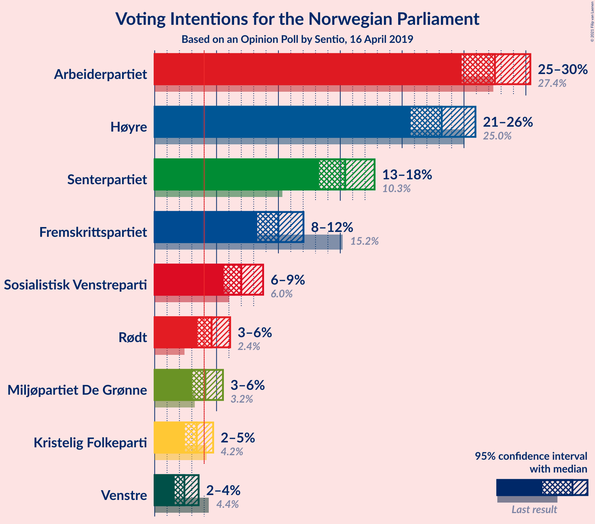
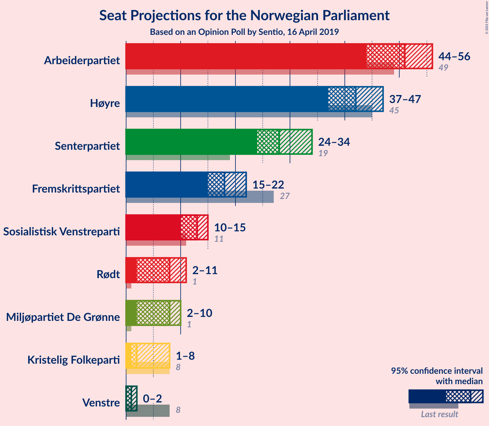
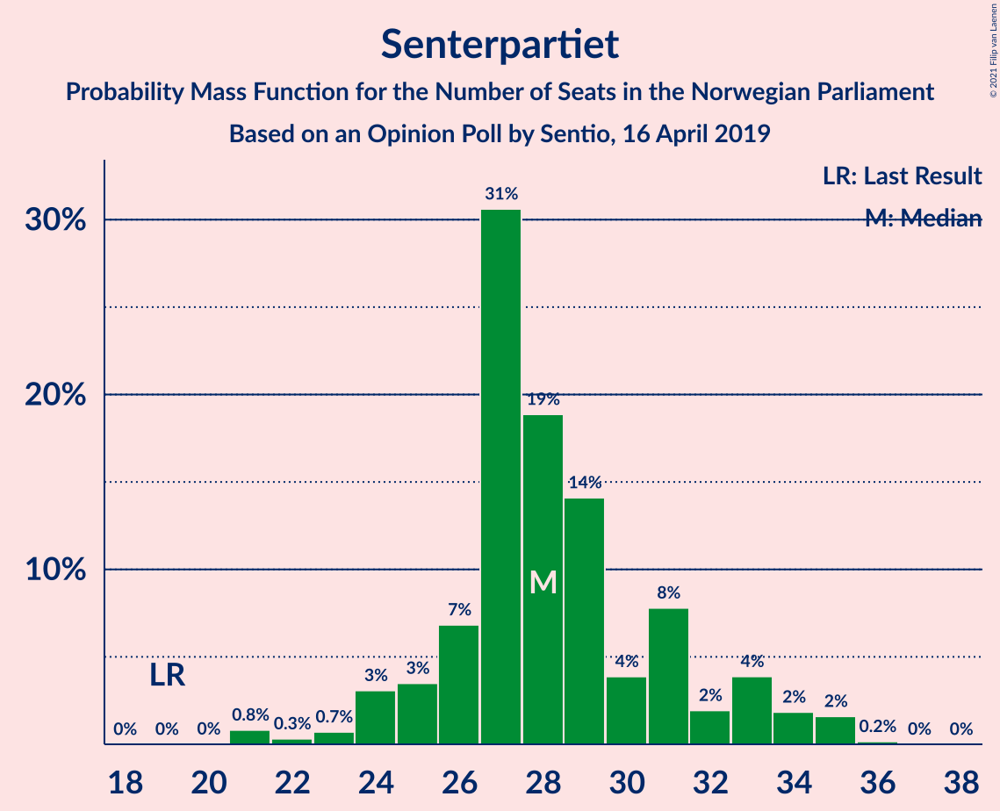
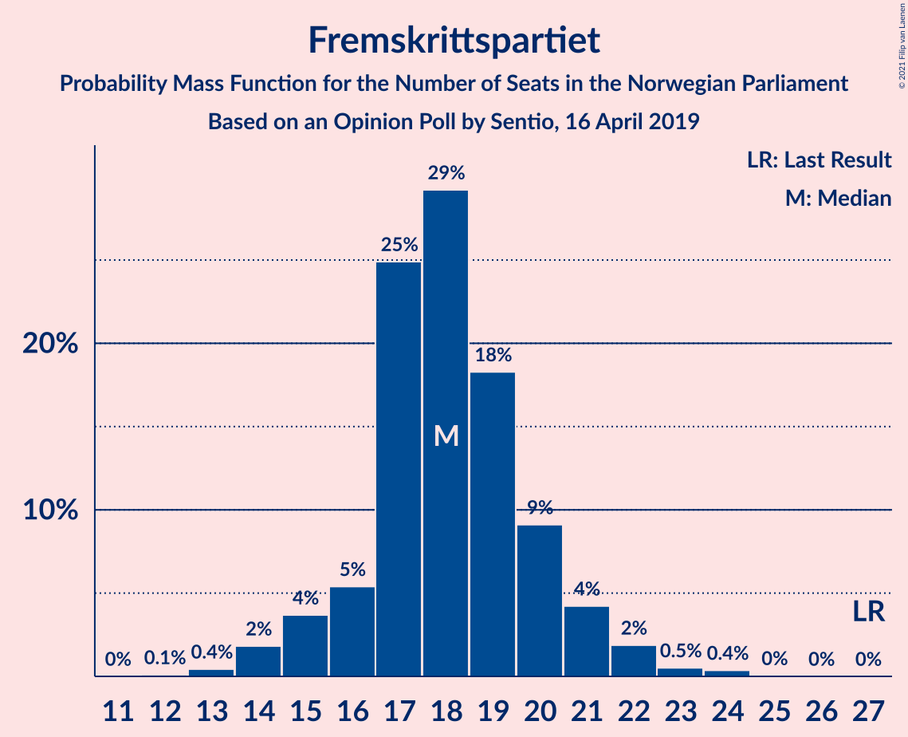
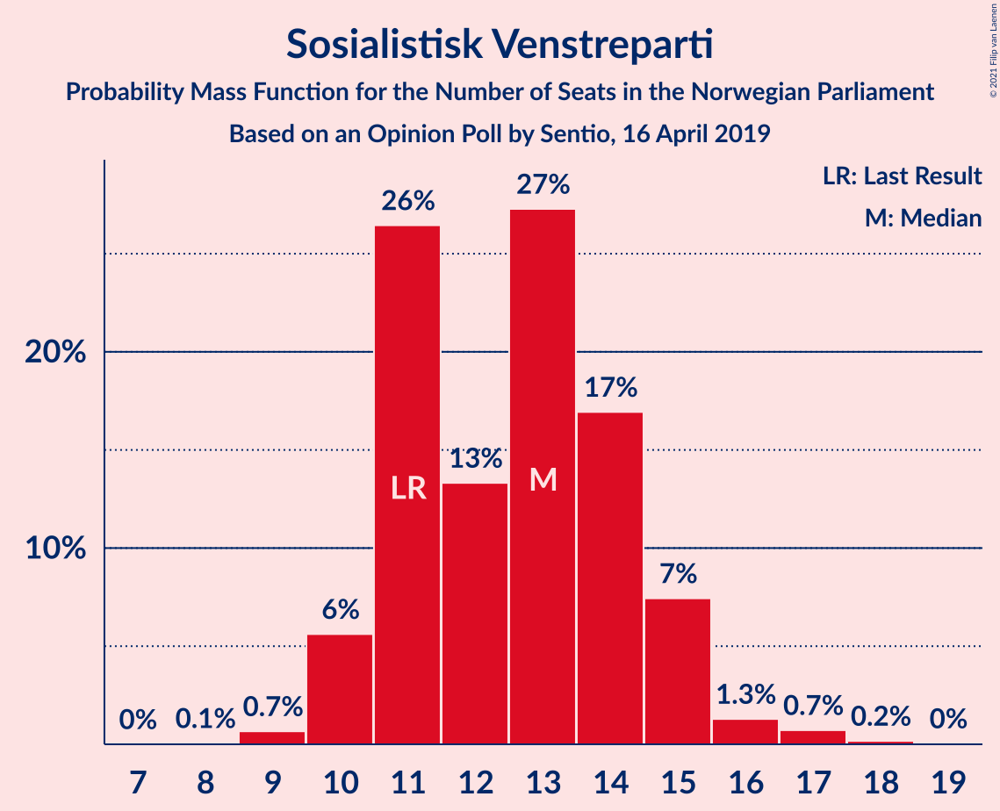
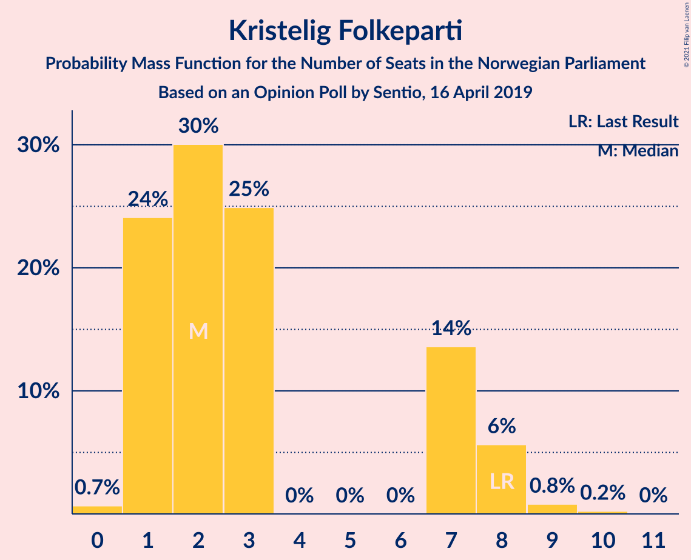
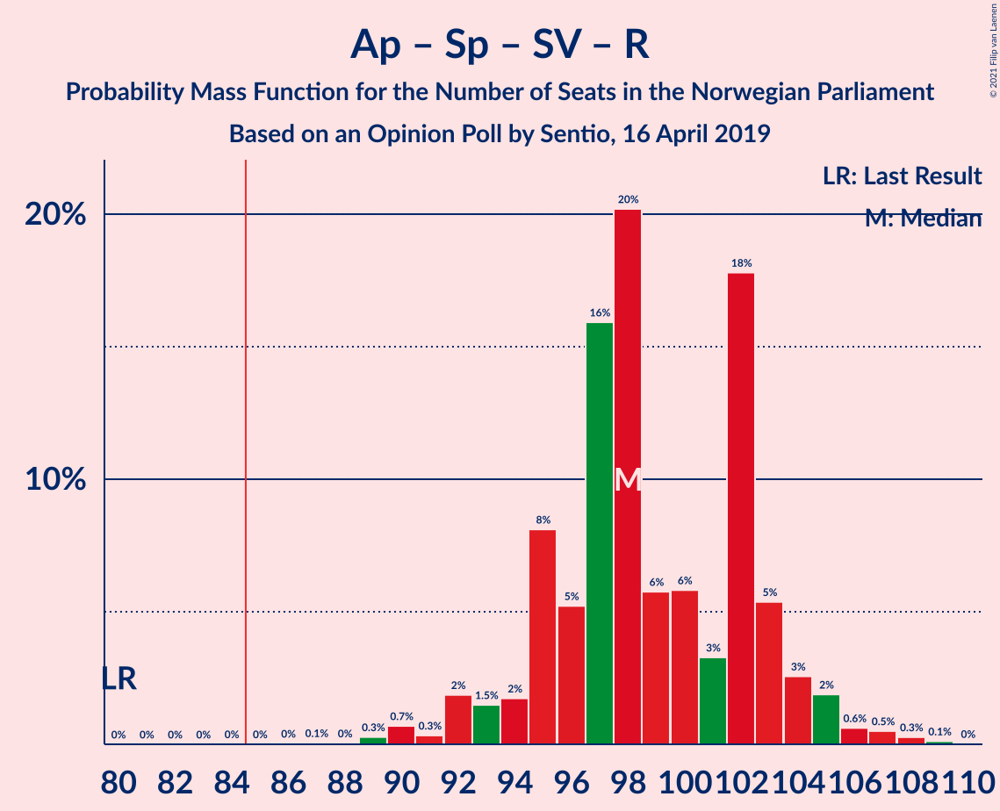
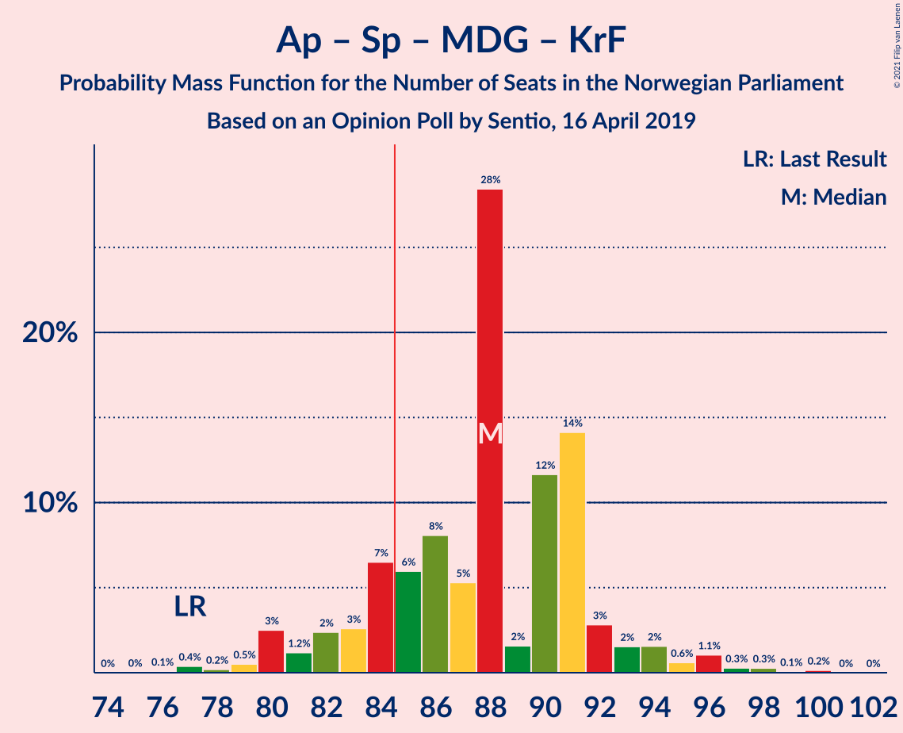
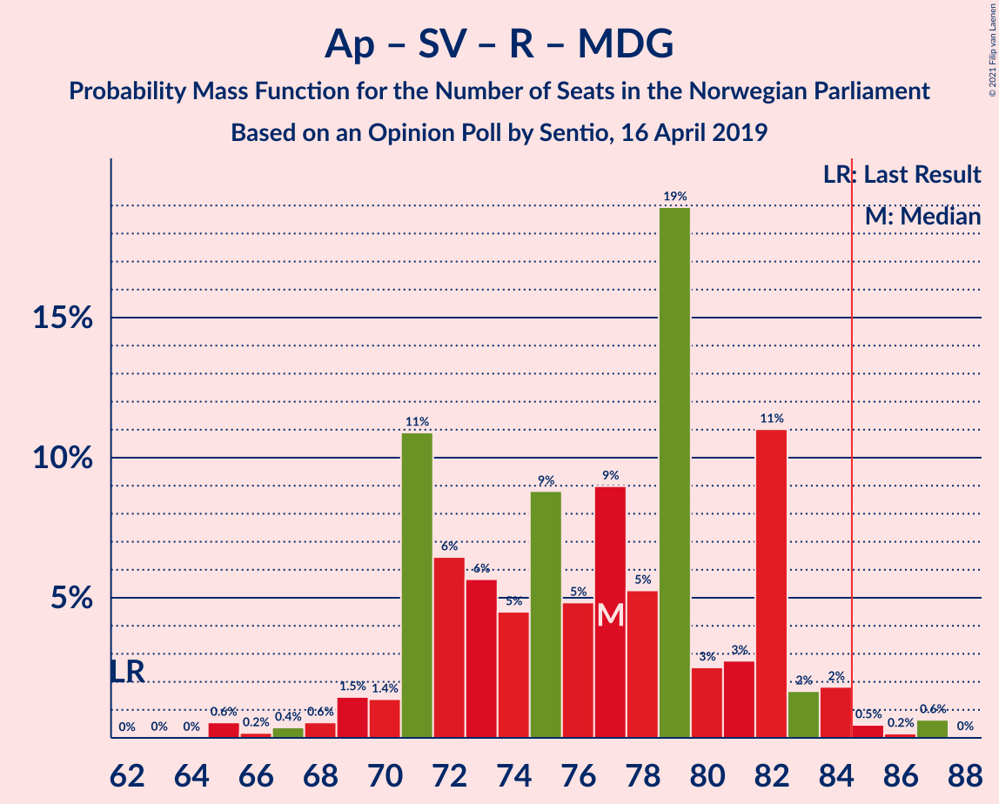
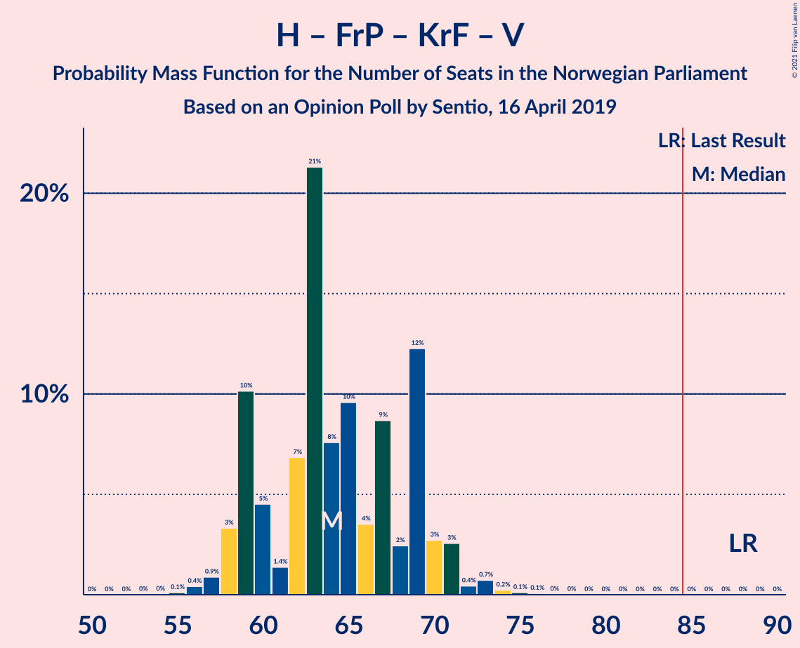

# Opinion Poll by Sentio, 16 April 2019

<a href="#voting-intentions">Voting Intentions</a> | <a href="#seats">Seats</a> | <a href="#coalitions">Coalitions</a> | <a href="#technical-information">Technical Information</a>

## Voting Intentions

### Confidence Intervals

| Party | Last Result | Poll Result | 80% Confidence Interval | 90% Confidence Interval | 95% Confidence Interval | 99% Confidence Interval |
|:-----:|:-----------:|:-----------:|:-----------------------:|:-----------------------:|:-----------------------:|:-----------------------:|
| Arbeiderpartiet | 27.4% | 27.5% | 25.7–29.4% |25.2–29.9% |24.8–30.4% |24.0–31.3% |
| Høyre | 25.0% | 23.2% | 21.6–25.0% |21.1–25.5% |20.7–25.9% |19.9–26.8% |
| Senterpartiet | 10.3% | 15.4% | 14.0–16.9% |13.6–17.4% |13.3–17.8% |12.7–18.5% |
| Fremskrittspartiet | 15.2% | 10.0% | 8.9–11.3% |8.6–11.7% |8.3–12.0% |7.8–12.7% |
| Sosialistisk Venstreparti | 6.0% | 7.0% | 6.1–8.2% |5.8–8.5% |5.6–8.8% |5.2–9.3% |
| Rødt | 2.4% | 4.6% | 3.9–5.6% |3.6–5.9% |3.5–6.1% |3.1–6.6% |
| Miljøpartiet De Grønne | 3.2% | 4.1% | 3.4–5.0% |3.2–5.3% |3.0–5.5% |2.7–6.0% |
| Kristelig Folkeparti | 4.2% | 3.4% | 2.8–4.3% |2.6–4.5% |2.4–4.7% |2.2–5.2% |
| Venstre | 4.4% | 2.4% | 1.9–3.2% |1.7–3.4% |1.6–3.6% |1.4–3.9% |

*Note:* The poll result column reflects the actual value used in the calculations. Published results may vary slightly, and in addition be rounded to fewer digits.

## Seats

### Confidence Intervals

| Party | Last Result | Median | 80% Confidence Interval | 90% Confidence Interval | 95% Confidence Interval | 99% Confidence Interval |
|:-----:|:-----------:|:------:|:-----------------------:|:-----------------------:|:-----------------------:|:-----------------------:|
| <a href="#arbeiderpartiet">Arbeiderpartiet</a> | 49 | 51 | 46–53 |45–54 |44–56 |43–58 |
| <a href="#høyre">Høyre</a> | 45 | 42 | 38–45 |38–46 |37–47 |35–49 |
| <a href="#senterpartiet">Senterpartiet</a> | 19 | 28 | 26–31 |25–33 |24–34 |21–35 |
| <a href="#fremskrittspartiet">Fremskrittspartiet</a> | 27 | 18 | 16–20 |15–21 |15–22 |13–23 |
| <a href="#sosialistisk-venstreparti">Sosialistisk Venstreparti</a> | 11 | 13 | 11–14 |10–15 |10–15 |9–17 |
| <a href="#rødt">Rødt</a> | 1 | 8 | 2–10 |2–10 |2–11 |2–12 |
| <a href="#miljøpartiet-de-grønne">Miljøpartiet De Grønne</a> | 1 | 8 | 2–9 |2–9 |2–10 |1–11 |
| <a href="#kristelig-folkeparti">Kristelig Folkeparti</a> | 8 | 2 | 1–7 |1–8 |1–8 |0–9 |
| <a href="#venstre">Venstre</a> | 8 | 1 | 1–2 |0–2 |0–2 |0–3 |

### Arbeiderpartiet

*For a full overview of the results for this party, see the [Arbeiderpartiet](party-arbeiderpartiet.html) page.*

| Number of Seats | Probability | Accumulated | Special Marks |
|:---------------:|:-----------:|:-----------:|:-------------:|
| 42 | 0.4% | 100% |  |
| 43 | 0.7% | 99.5% |  |
| 44 | 2% | 98.9% |  |
| 45 | 3% | 97% |  |
| 46 | 5% | 95% |  |
| 47 | 5% | 90% |  |
| 48 | 4% | 84% |  |
| 49 | 8% | 80% | Last Result |
| 50 | 8% | 72% |  |
| 51 | 25% | 64% | Median |
| 52 | 15% | 39% |  |
| 53 | 16% | 25% |  |
| 54 | 4% | 8% |  |
| 55 | 2% | 5% |  |
| 56 | 1.4% | 3% |  |
| 57 | 1.1% | 2% |  |
| 58 | 0.4% | 0.6% |  |
| 59 | 0.1% | 0.2% |  |
| 60 | 0% | 0.1% |  |
| 61 | 0% | 0% |  |

### Høyre

*For a full overview of the results for this party, see the [Høyre](party-høyre.html) page.*

| Number of Seats | Probability | Accumulated | Special Marks |
|:---------------:|:-----------:|:-----------:|:-------------:|
| 33 | 0.2% | 100% |  |
| 34 | 0.1% | 99.8% |  |
| 35 | 0.7% | 99.7% |  |
| 36 | 0.9% | 99.1% |  |
| 37 | 2% | 98% |  |
| 38 | 8% | 97% |  |
| 39 | 13% | 88% |  |
| 40 | 16% | 75% |  |
| 41 | 6% | 60% |  |
| 42 | 19% | 53% | Median |
| 43 | 7% | 34% |  |
| 44 | 8% | 27% |  |
| 45 | 12% | 19% | Last Result |
| 46 | 3% | 7% |  |
| 47 | 2% | 4% |  |
| 48 | 1.3% | 2% |  |
| 49 | 0.5% | 0.7% |  |
| 50 | 0.1% | 0.2% |  |
| 51 | 0.1% | 0.1% |  |
| 52 | 0% | 0% |  |

### Senterpartiet

*For a full overview of the results for this party, see the [Senterpartiet](party-senterpartiet.html) page.*

| Number of Seats | Probability | Accumulated | Special Marks |
|:---------------:|:-----------:|:-----------:|:-------------:|
| 19 | 0% | 100% | Last Result |
| 20 | 0% | 100% |  |
| 21 | 0.8% | 100% |  |
| 22 | 0.3% | 99.2% |  |
| 23 | 0.7% | 98.8% |  |
| 24 | 3% | 98% |  |
| 25 | 3% | 95% |  |
| 26 | 7% | 92% |  |
| 27 | 31% | 85% |  |
| 28 | 19% | 54% | Median |
| 29 | 14% | 35% |  |
| 30 | 4% | 21% |  |
| 31 | 8% | 17% |  |
| 32 | 2% | 9% |  |
| 33 | 4% | 8% |  |
| 34 | 2% | 4% |  |
| 35 | 2% | 2% |  |
| 36 | 0.2% | 0.2% |  |
| 37 | 0% | 0% |  |

### Fremskrittspartiet

*For a full overview of the results for this party, see the [Fremskrittspartiet](party-fremskrittspartiet.html) page.*

| Number of Seats | Probability | Accumulated | Special Marks |
|:---------------:|:-----------:|:-----------:|:-------------:|
| 12 | 0.1% | 100% |  |
| 13 | 0.4% | 99.9% |  |
| 14 | 2% | 99.5% |  |
| 15 | 4% | 98% |  |
| 16 | 5% | 94% |  |
| 17 | 25% | 89% |  |
| 18 | 29% | 64% | Median |
| 19 | 18% | 34% |  |
| 20 | 9% | 16% |  |
| 21 | 4% | 7% |  |
| 22 | 2% | 3% |  |
| 23 | 0.5% | 0.9% |  |
| 24 | 0.4% | 0.4% |  |
| 25 | 0% | 0.1% |  |
| 26 | 0% | 0% |  |
| 27 | 0% | 0% | Last Result |

### Sosialistisk Venstreparti

*For a full overview of the results for this party, see the [Sosialistisk Venstreparti](party-sosialistiskvenstreparti.html) page.*

| Number of Seats | Probability | Accumulated | Special Marks |
|:---------------:|:-----------:|:-----------:|:-------------:|
| 8 | 0.1% | 100% |  |
| 9 | 0.7% | 99.9% |  |
| 10 | 6% | 99.3% |  |
| 11 | 26% | 94% | Last Result |
| 12 | 13% | 67% |  |
| 13 | 27% | 54% | Median |
| 14 | 17% | 27% |  |
| 15 | 7% | 10% |  |
| 16 | 1.3% | 2% |  |
| 17 | 0.7% | 0.9% |  |
| 18 | 0.2% | 0.2% |  |
| 19 | 0% | 0% |  |

### Rødt

*For a full overview of the results for this party, see the [Rødt](party-rødt.html) page.*

| Number of Seats | Probability | Accumulated | Special Marks |
|:---------------:|:-----------:|:-----------:|:-------------:|
| 1 | 0.1% | 100% | Last Result |
| 2 | 18% | 99.9% |  |
| 3 | 0% | 82% |  |
| 4 | 0% | 82% |  |
| 5 | 0% | 82% |  |
| 6 | 0% | 82% |  |
| 7 | 11% | 82% |  |
| 8 | 24% | 71% | Median |
| 9 | 36% | 47% |  |
| 10 | 8% | 11% |  |
| 11 | 3% | 4% |  |
| 12 | 0.6% | 0.7% |  |
| 13 | 0.1% | 0.1% |  |
| 14 | 0% | 0% |  |

### Miljøpartiet De Grønne

*For a full overview of the results for this party, see the [Miljøpartiet De Grønne](party-miljøpartietdegrønne.html) page.*

| Number of Seats | Probability | Accumulated | Special Marks |
|:---------------:|:-----------:|:-----------:|:-------------:|
| 1 | 2% | 100% | Last Result |
| 2 | 21% | 98% |  |
| 3 | 13% | 77% |  |
| 4 | 2% | 64% |  |
| 5 | 0% | 63% |  |
| 6 | 0% | 63% |  |
| 7 | 10% | 63% |  |
| 8 | 41% | 52% | Median |
| 9 | 9% | 12% |  |
| 10 | 2% | 3% |  |
| 11 | 0.6% | 0.7% |  |
| 12 | 0% | 0.1% |  |
| 13 | 0% | 0% |  |

### Kristelig Folkeparti

*For a full overview of the results for this party, see the [Kristelig Folkeparti](party-kristeligfolkeparti.html) page.*

| Number of Seats | Probability | Accumulated | Special Marks |
|:---------------:|:-----------:|:-----------:|:-------------:|
| 0 | 0.7% | 100% |  |
| 1 | 24% | 99.3% |  |
| 2 | 30% | 75% | Median |
| 3 | 25% | 45% |  |
| 4 | 0% | 20% |  |
| 5 | 0% | 20% |  |
| 6 | 0% | 20% |  |
| 7 | 14% | 20% |  |
| 8 | 6% | 7% | Last Result |
| 9 | 0.8% | 1.0% |  |
| 10 | 0.2% | 0.2% |  |
| 11 | 0% | 0% |  |

### Venstre

*For a full overview of the results for this party, see the [Venstre](party-venstre.html) page.*

| Number of Seats | Probability | Accumulated | Special Marks |
|:---------------:|:-----------:|:-----------:|:-------------:|
| 0 | 5% | 100% |  |
| 1 | 46% | 95% | Median |
| 2 | 48% | 49% |  |
| 3 | 0.2% | 0.5% |  |
| 4 | 0% | 0.3% |  |
| 5 | 0% | 0.3% |  |
| 6 | 0% | 0.3% |  |
| 7 | 0.1% | 0.3% |  |
| 8 | 0.2% | 0.2% | Last Result |
| 9 | 0% | 0% |  |

## Coalitions

### Confidence Intervals

| Coalition | Last Result | Median | Majority? | 80% Confidence Interval | 90% Confidence Interval | 95% Confidence Interval | 99% Confidence Interval |
|:---------:|:-----------:|:------:|:---------:|:-----------------------:|:-----------------------:|:-----------------------:|:-----------------------:|
| Arbeiderpartiet – Senterpartiet – Sosialistisk Venstreparti – Rødt – Miljøpartiet De Grønne | 81 | 105 | 100% | 100–110 | 99–110 | 98–111 | 96–113 |
| Arbeiderpartiet – Senterpartiet – Sosialistisk Venstreparti – Miljøpartiet De Grønne – Kristelig Folkeparti | 88 | 101 | 100% | 97–104 | 95–105 | 94–107 | 91–110 |
| Arbeiderpartiet – Senterpartiet – Sosialistisk Venstreparti – Rødt | 80 | 98 | 100% | 95–103 | 94–104 | 92–105 | 90–107 |
| Arbeiderpartiet – Senterpartiet – Sosialistisk Venstreparti – Miljøpartiet De Grønne | 80 | 97 | 99.9% | 93–102 | 91–102 | 89–103 | 88–105 |
| Høyre – Senterpartiet – Fremskrittspartiet – Kristelig Folkeparti – Venstre | 107 | 92 | 98.6% | 87–98 | 87–98 | 85–100 | 82–104 |
| Arbeiderpartiet – Senterpartiet – Sosialistisk Venstreparti | 79 | 91 | 97% | 88–95 | 86–96 | 84–97 | 82–100 |
| Arbeiderpartiet – Senterpartiet – Miljøpartiet De Grønne – Kristelig Folkeparti | 77 | 88 | 84% | 84–91 | 82–93 | 80–94 | 77–98 |
| Arbeiderpartiet – Senterpartiet – Kristelig Folkeparti | 76 | 82 | 19% | 78–85 | 76–87 | 75–88 | 73–92 |
| Arbeiderpartiet – Senterpartiet | 68 | 79 | 2% | 75–82 | 73–83 | 72–84 | 70–87 |
| Arbeiderpartiet – Sosialistisk Venstreparti – Rødt – Miljøpartiet De Grønne | 62 | 77 | 1.3% | 71–82 | 71–82 | 69–84 | 65–87 |
| Høyre – Fremskrittspartiet – Miljøpartiet De Grønne – Kristelig Folkeparti – Venstre | 89 | 71 | 0% | 66–74 | 65–75 | 64–77 | 62–79 |
| Høyre – Fremskrittspartiet – Kristelig Folkeparti – Venstre | 88 | 64 | 0% | 59–69 | 59–70 | 58–71 | 56–73 |
| Arbeiderpartiet – Sosialistisk Venstreparti | 60 | 62 | 0% | 59–66 | 58–68 | 57–69 | 54–71 |
| Høyre – Fremskrittspartiet – Venstre | 80 | 61 | 0% | 57–66 | 56–66 | 56–68 | 53–70 |
| Høyre – Fremskrittspartiet | 72 | 60 | 0% | 56–64 | 55–65 | 54–67 | 51–68 |
| Høyre – Kristelig Folkeparti – Venstre | 61 | 46 | 0% | 42–50 | 41–51 | 41–52 | 39–55 |
| Senterpartiet – Kristelig Folkeparti – Venstre | 35 | 33 | 0% | 29–37 | 28–38 | 27–40 | 26–43 |

### Arbeiderpartiet – Senterpartiet – Sosialistisk Venstreparti – Rødt – Miljøpartiet De Grønne

| Number of Seats | Probability | Accumulated | Special Marks |
|:---------------:|:-----------:|:-----------:|:-------------:|
| 81 | 0% | 100% | Last Result |
| 82 | 0% | 100% |  |
| 83 | 0% | 100% |  |
| 84 | 0% | 100% |  |
| 85 | 0% | 100% | Majority |
| 86 | 0% | 100% |  |
| 87 | 0% | 100% |  |
| 88 | 0% | 100% |  |
| 89 | 0% | 100% |  |
| 90 | 0% | 100% |  |
| 91 | 0% | 100% |  |
| 92 | 0% | 100% |  |
| 93 | 0.1% | 100% |  |
| 94 | 0.1% | 99.9% |  |
| 95 | 0.2% | 99.8% |  |
| 96 | 0.7% | 99.5% |  |
| 97 | 0.4% | 98.8% |  |
| 98 | 3% | 98% |  |
| 99 | 3% | 96% |  |
| 100 | 12% | 93% |  |
| 101 | 2% | 81% |  |
| 102 | 9% | 78% |  |
| 103 | 4% | 70% |  |
| 104 | 10% | 66% |  |
| 105 | 8% | 56% |  |
| 106 | 21% | 49% |  |
| 107 | 7% | 27% |  |
| 108 | 1.4% | 21% | Median |
| 109 | 4% | 19% |  |
| 110 | 10% | 15% |  |
| 111 | 3% | 5% |  |
| 112 | 0.9% | 1.4% |  |
| 113 | 0.4% | 0.5% |  |
| 114 | 0.1% | 0.1% |  |
| 115 | 0% | 0% |  |

### Arbeiderpartiet – Senterpartiet – Sosialistisk Venstreparti – Miljøpartiet De Grønne – Kristelig Folkeparti

| Number of Seats | Probability | Accumulated | Special Marks |
|:---------------:|:-----------:|:-----------:|:-------------:|
| 88 | 0% | 100% | Last Result |
| 89 | 0.1% | 100% |  |
| 90 | 0.1% | 99.9% |  |
| 91 | 0.5% | 99.8% |  |
| 92 | 0.9% | 99.3% |  |
| 93 | 0.5% | 98% |  |
| 94 | 3% | 98% |  |
| 95 | 2% | 95% |  |
| 96 | 2% | 94% |  |
| 97 | 12% | 91% |  |
| 98 | 4% | 79% |  |
| 99 | 19% | 75% |  |
| 100 | 5% | 56% |  |
| 101 | 16% | 51% |  |
| 102 | 8% | 35% | Median |
| 103 | 5% | 26% |  |
| 104 | 14% | 21% |  |
| 105 | 2% | 6% |  |
| 106 | 2% | 5% |  |
| 107 | 1.1% | 3% |  |
| 108 | 0.9% | 2% |  |
| 109 | 0.2% | 1.1% |  |
| 110 | 0.7% | 0.9% |  |
| 111 | 0% | 0.2% |  |
| 112 | 0.2% | 0.2% |  |
| 113 | 0% | 0% |  |

### Arbeiderpartiet – Senterpartiet – Sosialistisk Venstreparti – Rødt

| Number of Seats | Probability | Accumulated | Special Marks |
|:---------------:|:-----------:|:-----------:|:-------------:|
| 80 | 0% | 100% | Last Result |
| 81 | 0% | 100% |  |
| 82 | 0% | 100% |  |
| 83 | 0% | 100% |  |
| 84 | 0% | 100% |  |
| 85 | 0% | 100% | Majority |
| 86 | 0% | 100% |  |
| 87 | 0.1% | 99.9% |  |
| 88 | 0% | 99.9% |  |
| 89 | 0.3% | 99.9% |  |
| 90 | 0.7% | 99.6% |  |
| 91 | 0.3% | 98.9% |  |
| 92 | 2% | 98.6% |  |
| 93 | 1.5% | 97% |  |
| 94 | 2% | 95% |  |
| 95 | 8% | 93% |  |
| 96 | 5% | 85% |  |
| 97 | 16% | 80% |  |
| 98 | 20% | 64% |  |
| 99 | 6% | 44% |  |
| 100 | 6% | 38% | Median |
| 101 | 3% | 32% |  |
| 102 | 18% | 29% |  |
| 103 | 5% | 11% |  |
| 104 | 3% | 6% |  |
| 105 | 2% | 3% |  |
| 106 | 0.6% | 2% |  |
| 107 | 0.5% | 0.9% |  |
| 108 | 0.3% | 0.4% |  |
| 109 | 0.1% | 0.2% |  |
| 110 | 0% | 0% |  |

### Arbeiderpartiet – Senterpartiet – Sosialistisk Venstreparti – Miljøpartiet De Grønne

| Number of Seats | Probability | Accumulated | Special Marks |
|:---------------:|:-----------:|:-----------:|:-------------:|
| 80 | 0% | 100% | Last Result |
| 81 | 0% | 100% |  |
| 82 | 0% | 100% |  |
| 83 | 0% | 100% |  |
| 84 | 0% | 100% |  |
| 85 | 0% | 99.9% | Majority |
| 86 | 0.1% | 99.9% |  |
| 87 | 0.1% | 99.8% |  |
| 88 | 0.9% | 99.7% |  |
| 89 | 2% | 98.9% |  |
| 90 | 0.9% | 97% |  |
| 91 | 1.5% | 96% |  |
| 92 | 3% | 94% |  |
| 93 | 4% | 92% |  |
| 94 | 3% | 88% |  |
| 95 | 11% | 85% |  |
| 96 | 9% | 74% |  |
| 97 | 21% | 65% |  |
| 98 | 16% | 44% |  |
| 99 | 5% | 28% |  |
| 100 | 5% | 24% | Median |
| 101 | 4% | 19% |  |
| 102 | 12% | 16% |  |
| 103 | 2% | 4% |  |
| 104 | 1.0% | 2% |  |
| 105 | 0.6% | 1.1% |  |
| 106 | 0.2% | 0.5% |  |
| 107 | 0.1% | 0.2% |  |
| 108 | 0.1% | 0.1% |  |
| 109 | 0% | 0% |  |

### Høyre – Senterpartiet – Fremskrittspartiet – Kristelig Folkeparti – Venstre

| Number of Seats | Probability | Accumulated | Special Marks |
|:---------------:|:-----------:|:-----------:|:-------------:|
| 81 | 0% | 100% |  |
| 82 | 0.6% | 99.9% |  |
| 83 | 0.2% | 99.3% |  |
| 84 | 0.5% | 99.1% |  |
| 85 | 2% | 98.6% | Majority |
| 86 | 2% | 97% |  |
| 87 | 11% | 95% |  |
| 88 | 3% | 84% |  |
| 89 | 3% | 81% |  |
| 90 | 19% | 79% |  |
| 91 | 5% | 60% | Median |
| 92 | 9% | 55% |  |
| 93 | 5% | 46% |  |
| 94 | 9% | 41% |  |
| 95 | 5% | 32% |  |
| 96 | 6% | 27% |  |
| 97 | 6% | 22% |  |
| 98 | 11% | 15% |  |
| 99 | 1.4% | 4% |  |
| 100 | 1.5% | 3% |  |
| 101 | 0.5% | 2% |  |
| 102 | 0.3% | 1.1% |  |
| 103 | 0.2% | 0.8% |  |
| 104 | 0.5% | 0.6% |  |
| 105 | 0% | 0% |  |
| 106 | 0% | 0% |  |
| 107 | 0% | 0% | Last Result |

### Arbeiderpartiet – Senterpartiet – Sosialistisk Venstreparti

| Number of Seats | Probability | Accumulated | Special Marks |
|:---------------:|:-----------:|:-----------:|:-------------:|
| 79 | 0% | 100% | Last Result |
| 80 | 0.1% | 100% |  |
| 81 | 0.1% | 99.9% |  |
| 82 | 0.5% | 99.8% |  |
| 83 | 0.4% | 99.3% |  |
| 84 | 1.4% | 98.8% |  |
| 85 | 0.8% | 97% | Majority |
| 86 | 2% | 97% |  |
| 87 | 4% | 95% |  |
| 88 | 9% | 91% |  |
| 89 | 21% | 82% |  |
| 90 | 6% | 61% |  |
| 91 | 5% | 55% |  |
| 92 | 7% | 49% | Median |
| 93 | 8% | 42% |  |
| 94 | 16% | 34% |  |
| 95 | 13% | 19% |  |
| 96 | 2% | 5% |  |
| 97 | 2% | 4% |  |
| 98 | 0.9% | 2% |  |
| 99 | 0.4% | 1.2% |  |
| 100 | 0.6% | 0.8% |  |
| 101 | 0% | 0.2% |  |
| 102 | 0% | 0.1% |  |
| 103 | 0.1% | 0.1% |  |
| 104 | 0% | 0% |  |

### Arbeiderpartiet – Senterpartiet – Miljøpartiet De Grønne – Kristelig Folkeparti

| Number of Seats | Probability | Accumulated | Special Marks |
|:---------------:|:-----------:|:-----------:|:-------------:|
| 76 | 0.1% | 100% |  |
| 77 | 0.4% | 99.9% | Last Result |
| 78 | 0.2% | 99.5% |  |
| 79 | 0.5% | 99.3% |  |
| 80 | 3% | 98.8% |  |
| 81 | 1.2% | 96% |  |
| 82 | 2% | 95% |  |
| 83 | 3% | 93% |  |
| 84 | 7% | 90% |  |
| 85 | 6% | 84% | Majority |
| 86 | 8% | 78% |  |
| 87 | 5% | 70% |  |
| 88 | 28% | 64% |  |
| 89 | 2% | 36% | Median |
| 90 | 12% | 34% |  |
| 91 | 14% | 23% |  |
| 92 | 3% | 8% |  |
| 93 | 2% | 6% |  |
| 94 | 2% | 4% |  |
| 95 | 0.6% | 2% |  |
| 96 | 1.1% | 2% |  |
| 97 | 0.3% | 0.8% |  |
| 98 | 0.3% | 0.5% |  |
| 99 | 0.1% | 0.2% |  |
| 100 | 0.2% | 0.2% |  |
| 101 | 0% | 0% |  |

### Arbeiderpartiet – Senterpartiet – Kristelig Folkeparti

| Number of Seats | Probability | Accumulated | Special Marks |
|:---------------:|:-----------:|:-----------:|:-------------:|
| 71 | 0.1% | 100% |  |
| 72 | 0.2% | 99.8% |  |
| 73 | 0.3% | 99.6% |  |
| 74 | 1.3% | 99.3% |  |
| 75 | 1.1% | 98% |  |
| 76 | 3% | 97% | Last Result |
| 77 | 2% | 94% |  |
| 78 | 5% | 92% |  |
| 79 | 4% | 87% |  |
| 80 | 19% | 83% |  |
| 81 | 4% | 64% | Median |
| 82 | 18% | 60% |  |
| 83 | 11% | 42% |  |
| 84 | 12% | 31% |  |
| 85 | 12% | 19% | Majority |
| 86 | 2% | 7% |  |
| 87 | 2% | 6% |  |
| 88 | 2% | 4% |  |
| 89 | 0.7% | 2% |  |
| 90 | 0.8% | 2% |  |
| 91 | 0.3% | 0.8% |  |
| 92 | 0.2% | 0.5% |  |
| 93 | 0.3% | 0.3% |  |
| 94 | 0% | 0% |  |

### Arbeiderpartiet – Senterpartiet

| Number of Seats | Probability | Accumulated | Special Marks |
|:---------------:|:-----------:|:-----------:|:-------------:|
| 68 | 0% | 100% | Last Result |
| 69 | 0.2% | 99.9% |  |
| 70 | 0.6% | 99.8% |  |
| 71 | 0.8% | 99.1% |  |
| 72 | 1.0% | 98% |  |
| 73 | 3% | 97% |  |
| 74 | 2% | 94% |  |
| 75 | 6% | 92% |  |
| 76 | 6% | 86% |  |
| 77 | 10% | 80% |  |
| 78 | 19% | 70% |  |
| 79 | 5% | 51% | Median |
| 80 | 17% | 46% |  |
| 81 | 7% | 29% |  |
| 82 | 16% | 22% |  |
| 83 | 2% | 6% |  |
| 84 | 2% | 4% |  |
| 85 | 0.9% | 2% | Majority |
| 86 | 0.6% | 1.1% |  |
| 87 | 0.4% | 0.5% |  |
| 88 | 0.1% | 0.2% |  |
| 89 | 0% | 0.1% |  |
| 90 | 0% | 0% |  |

### Arbeiderpartiet – Sosialistisk Venstreparti – Rødt – Miljøpartiet De Grønne

| Number of Seats | Probability | Accumulated | Special Marks |
|:---------------:|:-----------:|:-----------:|:-------------:|
| 62 | 0% | 100% | Last Result |
| 63 | 0% | 100% |  |
| 64 | 0% | 100% |  |
| 65 | 0.6% | 100% |  |
| 66 | 0.2% | 99.4% |  |
| 67 | 0.4% | 99.2% |  |
| 68 | 0.6% | 98.8% |  |
| 69 | 1.5% | 98% |  |
| 70 | 1.4% | 97% |  |
| 71 | 11% | 95% |  |
| 72 | 6% | 85% |  |
| 73 | 6% | 78% |  |
| 74 | 5% | 72% |  |
| 75 | 9% | 68% |  |
| 76 | 5% | 59% |  |
| 77 | 9% | 54% |  |
| 78 | 5% | 45% |  |
| 79 | 19% | 40% |  |
| 80 | 3% | 21% | Median |
| 81 | 3% | 19% |  |
| 82 | 11% | 16% |  |
| 83 | 2% | 5% |  |
| 84 | 2% | 3% |  |
| 85 | 0.5% | 1.3% | Majority |
| 86 | 0.2% | 0.9% |  |
| 87 | 0.6% | 0.7% |  |
| 88 | 0% | 0% |  |

### Høyre – Fremskrittspartiet – Miljøpartiet De Grønne – Kristelig Folkeparti – Venstre

| Number of Seats | Probability | Accumulated | Special Marks |
|:---------------:|:-----------:|:-----------:|:-------------:|
| 60 | 0.1% | 100% |  |
| 61 | 0.3% | 99.8% |  |
| 62 | 0.5% | 99.6% |  |
| 63 | 0.7% | 99.0% |  |
| 64 | 2% | 98% |  |
| 65 | 3% | 96% |  |
| 66 | 5% | 94% |  |
| 67 | 18% | 88% |  |
| 68 | 3% | 71% |  |
| 69 | 6% | 67% |  |
| 70 | 6% | 62% |  |
| 71 | 20% | 56% | Median |
| 72 | 16% | 36% |  |
| 73 | 5% | 20% |  |
| 74 | 8% | 15% |  |
| 75 | 2% | 6% |  |
| 76 | 1.5% | 5% |  |
| 77 | 2% | 3% |  |
| 78 | 0.3% | 1.4% |  |
| 79 | 0.7% | 1.1% |  |
| 80 | 0.3% | 0.4% |  |
| 81 | 0% | 0.1% |  |
| 82 | 0.1% | 0.1% |  |
| 83 | 0% | 0.1% |  |
| 84 | 0% | 0% |  |
| 85 | 0% | 0% | Majority |
| 86 | 0% | 0% |  |
| 87 | 0% | 0% |  |
| 88 | 0% | 0% |  |
| 89 | 0% | 0% | Last Result |

### Høyre – Fremskrittspartiet – Kristelig Folkeparti – Venstre

| Number of Seats | Probability | Accumulated | Special Marks |
|:---------------:|:-----------:|:-----------:|:-------------:|
| 54 | 0% | 100% |  |
| 55 | 0.1% | 99.9% |  |
| 56 | 0.4% | 99.8% |  |
| 57 | 0.9% | 99.4% |  |
| 58 | 3% | 98.5% |  |
| 59 | 10% | 95% |  |
| 60 | 5% | 85% |  |
| 61 | 1.4% | 81% |  |
| 62 | 7% | 79% |  |
| 63 | 21% | 72% | Median |
| 64 | 8% | 51% |  |
| 65 | 10% | 43% |  |
| 66 | 4% | 34% |  |
| 67 | 9% | 30% |  |
| 68 | 2% | 22% |  |
| 69 | 12% | 19% |  |
| 70 | 3% | 7% |  |
| 71 | 3% | 4% |  |
| 72 | 0.4% | 2% |  |
| 73 | 0.7% | 1.2% |  |
| 74 | 0.2% | 0.5% |  |
| 75 | 0.1% | 0.2% |  |
| 76 | 0.1% | 0.1% |  |
| 77 | 0% | 0% |  |
| 78 | 0% | 0% |  |
| 79 | 0% | 0% |  |
| 80 | 0% | 0% |  |
| 81 | 0% | 0% |  |
| 82 | 0% | 0% |  |
| 83 | 0% | 0% |  |
| 84 | 0% | 0% |  |
| 85 | 0% | 0% | Majority |
| 86 | 0% | 0% |  |
| 87 | 0% | 0% |  |
| 88 | 0% | 0% | Last Result |

### Arbeiderpartiet – Sosialistisk Venstreparti

| Number of Seats | Probability | Accumulated | Special Marks |
|:---------------:|:-----------:|:-----------:|:-------------:|
| 53 | 0% | 100% |  |
| 54 | 0.5% | 99.9% |  |
| 55 | 0.6% | 99.5% |  |
| 56 | 0.9% | 98.9% |  |
| 57 | 1.5% | 98% |  |
| 58 | 2% | 96% |  |
| 59 | 7% | 95% |  |
| 60 | 4% | 88% | Last Result |
| 61 | 12% | 84% |  |
| 62 | 24% | 72% |  |
| 63 | 4% | 48% |  |
| 64 | 5% | 44% | Median |
| 65 | 4% | 39% |  |
| 66 | 26% | 35% |  |
| 67 | 4% | 9% |  |
| 68 | 2% | 5% |  |
| 69 | 1.4% | 3% |  |
| 70 | 0.5% | 1.5% |  |
| 71 | 0.7% | 1.0% |  |
| 72 | 0.2% | 0.3% |  |
| 73 | 0.1% | 0.1% |  |
| 74 | 0.1% | 0.1% |  |
| 75 | 0% | 0% |  |

### Høyre – Fremskrittspartiet – Venstre

| Number of Seats | Probability | Accumulated | Special Marks |
|:---------------:|:-----------:|:-----------:|:-------------:|
| 49 | 0.1% | 100% |  |
| 50 | 0% | 99.9% |  |
| 51 | 0.1% | 99.9% |  |
| 52 | 0.2% | 99.7% |  |
| 53 | 0.2% | 99.5% |  |
| 54 | 0.4% | 99.3% |  |
| 55 | 0.9% | 98.8% |  |
| 56 | 5% | 98% |  |
| 57 | 14% | 93% |  |
| 58 | 5% | 79% |  |
| 59 | 6% | 74% |  |
| 60 | 7% | 68% |  |
| 61 | 19% | 61% | Median |
| 62 | 8% | 42% |  |
| 63 | 11% | 34% |  |
| 64 | 4% | 23% |  |
| 65 | 2% | 19% |  |
| 66 | 12% | 17% |  |
| 67 | 0.7% | 5% |  |
| 68 | 1.4% | 4% |  |
| 69 | 0.7% | 2% |  |
| 70 | 1.4% | 2% |  |
| 71 | 0.2% | 0.3% |  |
| 72 | 0.1% | 0.1% |  |
| 73 | 0% | 0% |  |
| 74 | 0% | 0% |  |
| 75 | 0% | 0% |  |
| 76 | 0% | 0% |  |
| 77 | 0% | 0% |  |
| 78 | 0% | 0% |  |
| 79 | 0% | 0% |  |
| 80 | 0% | 0% | Last Result |

### Høyre – Fremskrittspartiet

| Number of Seats | Probability | Accumulated | Special Marks |
|:---------------:|:-----------:|:-----------:|:-------------:|
| 48 | 0.1% | 100% |  |
| 49 | 0.1% | 99.9% |  |
| 50 | 0.1% | 99.7% |  |
| 51 | 0.3% | 99.7% |  |
| 52 | 0.4% | 99.4% |  |
| 53 | 0.3% | 99.0% |  |
| 54 | 2% | 98.7% |  |
| 55 | 7% | 97% |  |
| 56 | 15% | 90% |  |
| 57 | 4% | 76% |  |
| 58 | 9% | 71% |  |
| 59 | 4% | 62% |  |
| 60 | 20% | 58% | Median |
| 61 | 9% | 38% |  |
| 62 | 8% | 28% |  |
| 63 | 3% | 20% |  |
| 64 | 12% | 18% |  |
| 65 | 1.2% | 5% |  |
| 66 | 0.7% | 4% |  |
| 67 | 2% | 4% |  |
| 68 | 2% | 2% |  |
| 69 | 0.1% | 0.3% |  |
| 70 | 0.2% | 0.2% |  |
| 71 | 0% | 0.1% |  |
| 72 | 0% | 0% | Last Result |

### Høyre – Kristelig Folkeparti – Venstre

| Number of Seats | Probability | Accumulated | Special Marks |
|:---------------:|:-----------:|:-----------:|:-------------:|
| 38 | 0.3% | 100% |  |
| 39 | 0.7% | 99.6% |  |
| 40 | 1.0% | 99.0% |  |
| 41 | 4% | 98% |  |
| 42 | 12% | 94% |  |
| 43 | 5% | 82% |  |
| 44 | 3% | 76% |  |
| 45 | 19% | 73% | Median |
| 46 | 11% | 54% |  |
| 47 | 8% | 43% |  |
| 48 | 5% | 35% |  |
| 49 | 11% | 31% |  |
| 50 | 14% | 20% |  |
| 51 | 3% | 6% |  |
| 52 | 2% | 4% |  |
| 53 | 0.7% | 2% |  |
| 54 | 0.7% | 1.4% |  |
| 55 | 0.4% | 0.7% |  |
| 56 | 0.2% | 0.3% |  |
| 57 | 0.1% | 0.2% |  |
| 58 | 0.1% | 0.1% |  |
| 59 | 0% | 0% |  |
| 60 | 0% | 0% |  |
| 61 | 0% | 0% | Last Result |

### Senterpartiet – Kristelig Folkeparti – Venstre

| Number of Seats | Probability | Accumulated | Special Marks |
|:---------------:|:-----------:|:-----------:|:-------------:|
| 24 | 0.1% | 100% |  |
| 25 | 0.4% | 99.9% |  |
| 26 | 0.5% | 99.5% |  |
| 27 | 2% | 99.1% |  |
| 28 | 3% | 97% |  |
| 29 | 6% | 94% |  |
| 30 | 19% | 88% |  |
| 31 | 15% | 69% | Median |
| 32 | 4% | 54% |  |
| 33 | 5% | 51% |  |
| 34 | 19% | 45% |  |
| 35 | 7% | 27% | Last Result |
| 36 | 7% | 19% |  |
| 37 | 6% | 12% |  |
| 38 | 2% | 6% |  |
| 39 | 0.9% | 4% |  |
| 40 | 2% | 3% |  |
| 41 | 0.6% | 2% |  |
| 42 | 0.4% | 1.1% |  |
| 43 | 0.6% | 0.7% |  |
| 44 | 0.1% | 0.1% |  |
| 45 | 0% | 0.1% |  |
| 46 | 0% | 0% |  |

## Technical Information

### Opinion Poll

+ **Polling firm:** Sentio
+ **Commissioner(s):** —
+ **Fieldwork period:** 16 April 2019

### Calculations

+ **Sample size:** 1000
+ **Simulations done:** 524,288
+ **Error estimate:** 1.55%

