# Opinion Poll by Ipsos MMI, 23–25 April 2019

<a href="#voting-intentions">Voting Intentions</a> | <a href="#seats">Seats</a> | <a href="#coalitions">Coalitions</a> | <a href="#technical-information">Technical Information</a>

## Voting Intentions

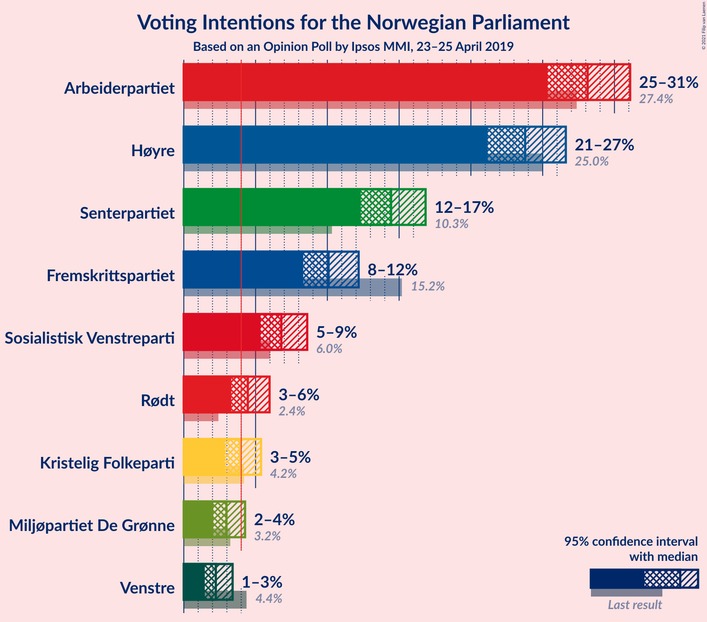

### Confidence Intervals

| Party | Last Result | Poll Result | 80% Confidence Interval | 90% Confidence Interval | 95% Confidence Interval | 99% Confidence Interval |
|:-----:|:-----------:|:-----------:|:-----------------------:|:-----------------------:|:-----------------------:|:-----------------------:|
| Arbeiderpartiet | 27.4% | 28.1% | 26.3–30.1% |25.8–30.6% |25.3–31.1% |24.5–32.0% |
| Høyre | 25.0% | 23.8% | 22.1–25.6% |21.6–26.2% |21.2–26.6% |20.4–27.5% |
| Senterpartiet | 10.3% | 14.4% | 13.0–16.0% |12.7–16.4% |12.3–16.8% |11.7–17.6% |
| Fremskrittspartiet | 15.2% | 10.1% | 8.9–11.5% |8.6–11.8% |8.3–12.2% |7.8–12.9% |
| Sosialistisk Venstreparti | 6.0% | 6.8% | 5.8–8.0% |5.6–8.3% |5.3–8.6% |4.9–9.2% |
| Rødt | 2.4% | 4.5% | 3.7–5.5% |3.5–5.7% |3.3–6.0% |3.0–6.5% |
| Kristelig Folkeparti | 4.2% | 3.9% | 3.2–4.9% |3.0–5.1% |2.9–5.4% |2.6–5.9% |
| Miljøpartiet De Grønne | 3.2% | 3.0% | 2.4–3.8% |2.2–4.1% |2.1–4.3% |1.8–4.7% |
| Venstre | 4.4% | 2.2% | 1.7–3.0% |1.6–3.2% |1.5–3.4% |1.2–3.8% |

*Note:* The poll result column reflects the actual value used in the calculations. Published results may vary slightly, and in addition be rounded to fewer digits.

## Seats

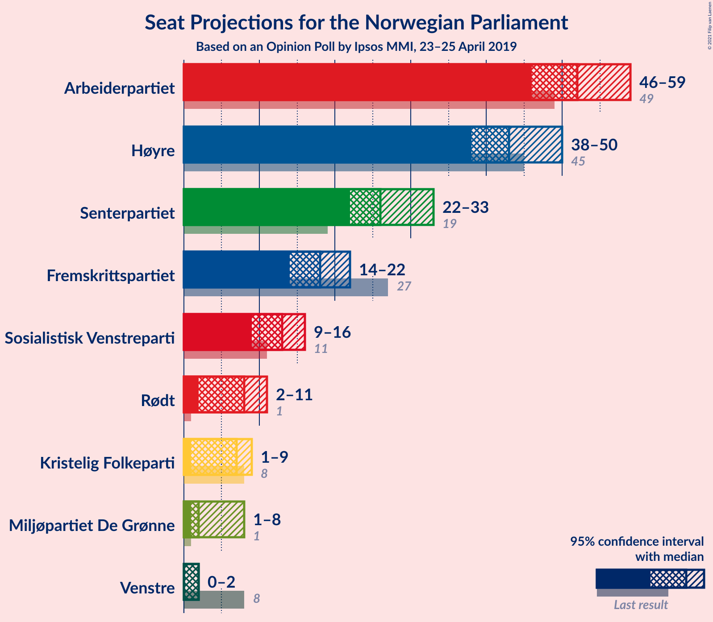

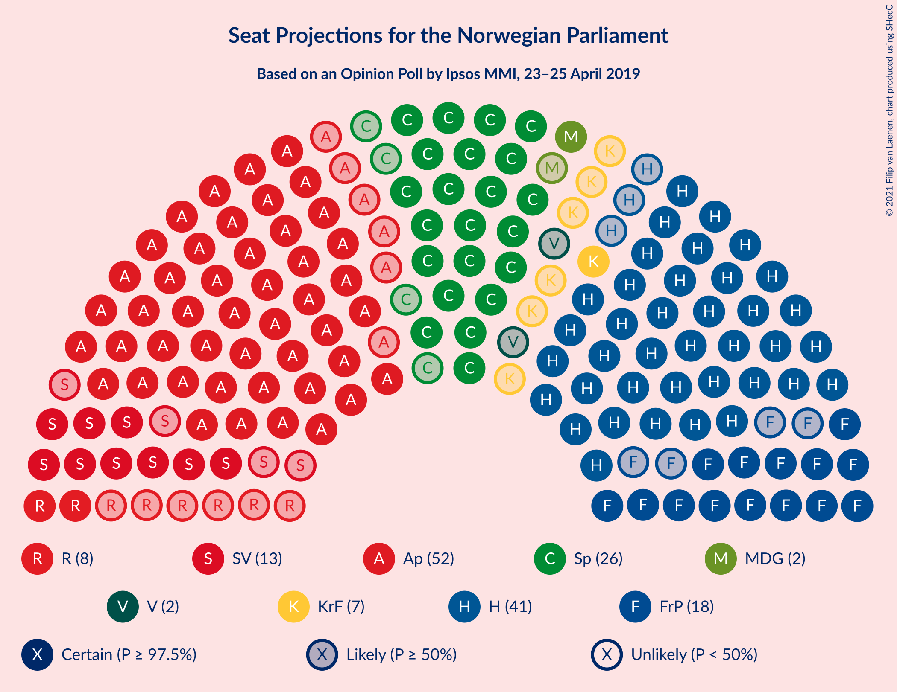

### Confidence Intervals

| Party | Last Result | Median | 80% Confidence Interval | 90% Confidence Interval | 95% Confidence Interval | 99% Confidence Interval |
|:-----:|:-----------:|:------:|:-----------------------:|:-----------------------:|:-----------------------:|:-----------------------:|
| <a href="#arbeiderpartiet">Arbeiderpartiet</a> | 49 | 52 | 48–57 |47–57 |46–59 |44–61 |
| <a href="#høyre">Høyre</a> | 45 | 43 | 39–47 |39–49 |38–50 |37–52 |
| <a href="#senterpartiet">Senterpartiet</a> | 19 | 26 | 22–30 |22–32 |22–33 |21–34 |
| <a href="#fremskrittspartiet">Fremskrittspartiet</a> | 27 | 18 | 15–21 |15–21 |14–22 |14–24 |
| <a href="#sosialistisk-venstreparti">Sosialistisk Venstreparti</a> | 11 | 13 | 10–14 |10–15 |9–16 |9–17 |
| <a href="#rødt">Rødt</a> | 1 | 8 | 2–10 |2–10 |2–11 |2–12 |
| <a href="#kristelig-folkeparti">Kristelig Folkeparti</a> | 8 | 7 | 2–9 |1–9 |1–9 |1–10 |
| <a href="#miljøpartiet-de-grønne">Miljøpartiet De Grønne</a> | 1 | 2 | 1–2 |1–4 |1–8 |0–8 |
| <a href="#venstre">Venstre</a> | 8 | 2 | 1–2 |0–2 |0–2 |0–3 |

### Arbeiderpartiet

*For a full overview of the results for this party, see the [Arbeiderpartiet](party-arbeiderpartiet.html) page.*

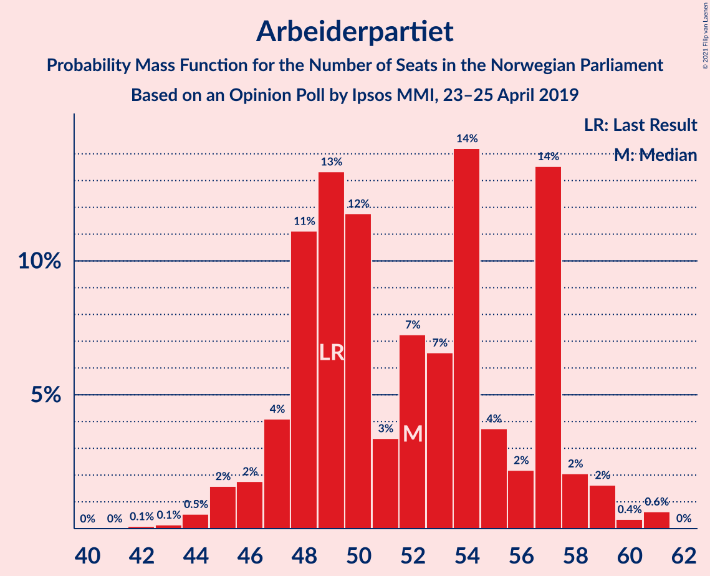

| Number of Seats | Probability | Accumulated | Special Marks |
|:---------------:|:-----------:|:-----------:|:-------------:|
| 42 | 0.1% | 100% |  |
| 43 | 0.1% | 99.9% |  |
| 44 | 0.5% | 99.8% |  |
| 45 | 2% | 99.2% |  |
| 46 | 2% | 98% |  |
| 47 | 4% | 96% |  |
| 48 | 11% | 92% |  |
| 49 | 13% | 81% | Last Result |
| 50 | 12% | 67% |  |
| 51 | 3% | 56% |  |
| 52 | 7% | 52% | Median |
| 53 | 7% | 45% |  |
| 54 | 14% | 38% |  |
| 55 | 4% | 24% |  |
| 56 | 2% | 20% |  |
| 57 | 14% | 18% |  |
| 58 | 2% | 5% |  |
| 59 | 2% | 3% |  |
| 60 | 0.4% | 1.0% |  |
| 61 | 0.6% | 0.7% |  |
| 62 | 0% | 0% |  |

### Høyre

*For a full overview of the results for this party, see the [Høyre](party-høyre.html) page.*

| Number of Seats | Probability | Accumulated | Special Marks |
|:---------------:|:-----------:|:-----------:|:-------------:|
| 35 | 0.2% | 100% |  |
| 36 | 0.1% | 99.8% |  |
| 37 | 2% | 99.6% |  |
| 38 | 2% | 98% |  |
| 39 | 6% | 96% |  |
| 40 | 11% | 90% |  |
| 41 | 15% | 78% |  |
| 42 | 11% | 63% |  |
| 43 | 8% | 53% | Median |
| 44 | 12% | 45% |  |
| 45 | 7% | 33% | Last Result |
| 46 | 13% | 27% |  |
| 47 | 5% | 14% |  |
| 48 | 3% | 9% |  |
| 49 | 2% | 6% |  |
| 50 | 2% | 4% |  |
| 51 | 0.3% | 1.2% |  |
| 52 | 0.8% | 0.9% |  |
| 53 | 0.1% | 0.1% |  |
| 54 | 0% | 0% |  |

### Senterpartiet

*For a full overview of the results for this party, see the [Senterpartiet](party-senterpartiet.html) page.*

| Number of Seats | Probability | Accumulated | Special Marks |
|:---------------:|:-----------:|:-----------:|:-------------:|
| 18 | 0.1% | 100% |  |
| 19 | 0% | 99.9% | Last Result |
| 20 | 0.4% | 99.9% |  |
| 21 | 1.0% | 99.5% |  |
| 22 | 11% | 98% |  |
| 23 | 4% | 88% |  |
| 24 | 9% | 84% |  |
| 25 | 14% | 75% |  |
| 26 | 11% | 60% | Median |
| 27 | 14% | 49% |  |
| 28 | 13% | 35% |  |
| 29 | 8% | 23% |  |
| 30 | 5% | 15% |  |
| 31 | 3% | 9% |  |
| 32 | 2% | 6% |  |
| 33 | 2% | 3% |  |
| 34 | 1.4% | 2% |  |
| 35 | 0.3% | 0.3% |  |
| 36 | 0% | 0% |  |

### Fremskrittspartiet

*For a full overview of the results for this party, see the [Fremskrittspartiet](party-fremskrittspartiet.html) page.*

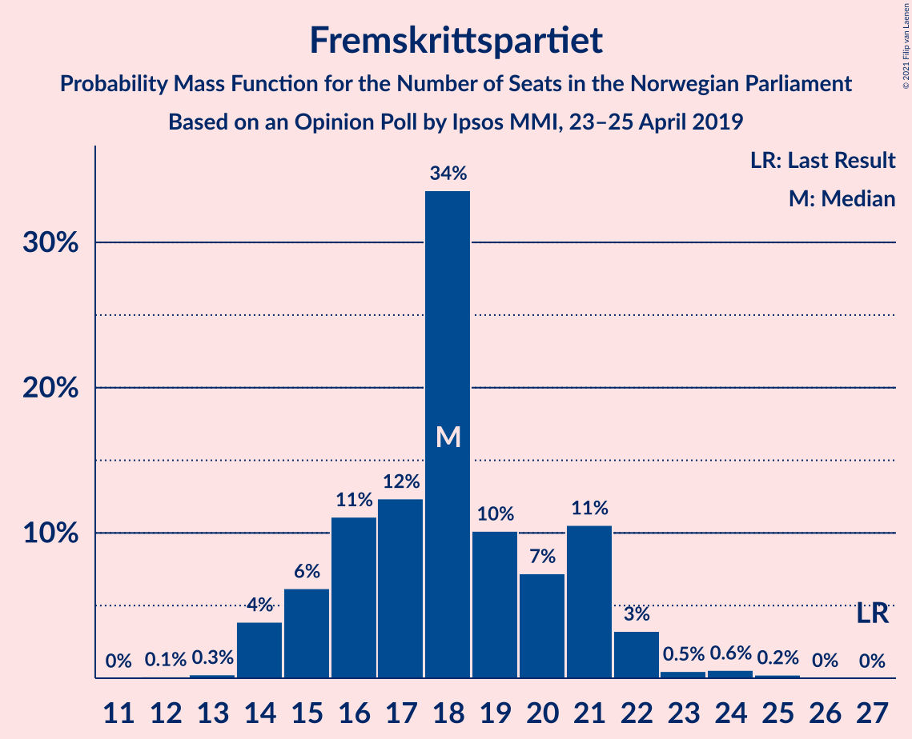

| Number of Seats | Probability | Accumulated | Special Marks |
|:---------------:|:-----------:|:-----------:|:-------------:|
| 12 | 0.1% | 100% |  |
| 13 | 0.3% | 99.9% |  |
| 14 | 4% | 99.6% |  |
| 15 | 6% | 96% |  |
| 16 | 11% | 90% |  |
| 17 | 12% | 78% |  |
| 18 | 34% | 66% | Median |
| 19 | 10% | 32% |  |
| 20 | 7% | 22% |  |
| 21 | 11% | 15% |  |
| 22 | 3% | 5% |  |
| 23 | 0.5% | 1.3% |  |
| 24 | 0.6% | 0.9% |  |
| 25 | 0.2% | 0.3% |  |
| 26 | 0% | 0% |  |
| 27 | 0% | 0% | Last Result |

### Sosialistisk Venstreparti

*For a full overview of the results for this party, see the [Sosialistisk Venstreparti](party-sosialistiskvenstreparti.html) page.*

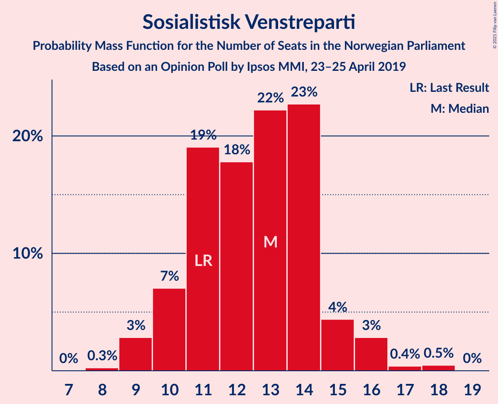

| Number of Seats | Probability | Accumulated | Special Marks |
|:---------------:|:-----------:|:-----------:|:-------------:|
| 8 | 0.3% | 100% |  |
| 9 | 3% | 99.7% |  |
| 10 | 7% | 97% |  |
| 11 | 19% | 90% | Last Result |
| 12 | 18% | 71% |  |
| 13 | 22% | 53% | Median |
| 14 | 23% | 31% |  |
| 15 | 4% | 8% |  |
| 16 | 3% | 4% |  |
| 17 | 0.4% | 0.9% |  |
| 18 | 0.5% | 0.5% |  |
| 19 | 0% | 0% |  |

### Rødt

*For a full overview of the results for this party, see the [Rødt](party-rødt.html) page.*

| Number of Seats | Probability | Accumulated | Special Marks |
|:---------------:|:-----------:|:-----------:|:-------------:|
| 1 | 0.1% | 100% | Last Result |
| 2 | 24% | 99.9% |  |
| 3 | 0% | 76% |  |
| 4 | 0% | 76% |  |
| 5 | 0% | 76% |  |
| 6 | 0.2% | 76% |  |
| 7 | 8% | 76% |  |
| 8 | 38% | 68% | Median |
| 9 | 16% | 30% |  |
| 10 | 10% | 14% |  |
| 11 | 3% | 4% |  |
| 12 | 0.6% | 0.7% |  |
| 13 | 0.1% | 0.1% |  |
| 14 | 0% | 0% |  |

### Kristelig Folkeparti

*For a full overview of the results for this party, see the [Kristelig Folkeparti](party-kristeligfolkeparti.html) page.*

| Number of Seats | Probability | Accumulated | Special Marks |
|:---------------:|:-----------:|:-----------:|:-------------:|
| 0 | 0.1% | 100% |  |
| 1 | 9% | 99.9% |  |
| 2 | 10% | 90% |  |
| 3 | 27% | 80% |  |
| 4 | 0% | 53% |  |
| 5 | 0% | 53% |  |
| 6 | 1.0% | 53% |  |
| 7 | 9% | 52% | Median |
| 8 | 33% | 44% | Last Result |
| 9 | 9% | 11% |  |
| 10 | 2% | 2% |  |
| 11 | 0.3% | 0.3% |  |
| 12 | 0% | 0% |  |

### Miljøpartiet De Grønne

*For a full overview of the results for this party, see the [Miljøpartiet De Grønne](party-miljøpartietdegrønne.html) page.*

| Number of Seats | Probability | Accumulated | Special Marks |
|:---------------:|:-----------:|:-----------:|:-------------:|
| 0 | 0.9% | 100% |  |
| 1 | 41% | 99.1% | Last Result |
| 2 | 52% | 58% | Median |
| 3 | 0.6% | 6% |  |
| 4 | 2% | 5% |  |
| 5 | 0% | 4% |  |
| 6 | 0% | 4% |  |
| 7 | 0.8% | 3% |  |
| 8 | 2% | 3% |  |
| 9 | 0.4% | 0.4% |  |
| 10 | 0% | 0% |  |

### Venstre

*For a full overview of the results for this party, see the [Venstre](party-venstre.html) page.*

| Number of Seats | Probability | Accumulated | Special Marks |
|:---------------:|:-----------:|:-----------:|:-------------:|
| 0 | 8% | 100% |  |
| 1 | 41% | 92% |  |
| 2 | 50% | 50% | Median |
| 3 | 0.5% | 0.7% |  |
| 4 | 0% | 0.1% |  |
| 5 | 0% | 0.1% |  |
| 6 | 0% | 0.1% |  |
| 7 | 0.1% | 0.1% |  |
| 8 | 0.1% | 0.1% | Last Result |
| 9 | 0% | 0% |  |

## Coalitions

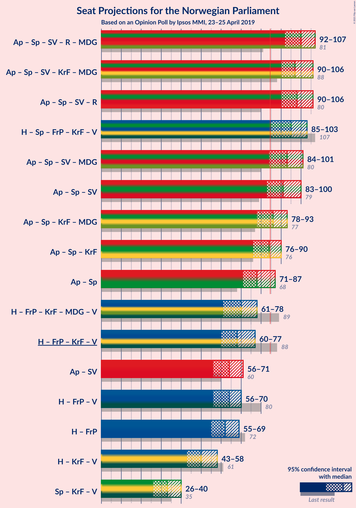

### Confidence Intervals

| Coalition | Last Result | Median | Majority? | 80% Confidence Interval | 90% Confidence Interval | 95% Confidence Interval | 99% Confidence Interval |
|:---------:|:-----------:|:------:|:---------:|:-----------------------:|:-----------------------:|:-----------------------:|:-----------------------:|
| Arbeiderpartiet – Senterpartiet – Sosialistisk Venstreparti – Rødt – Miljøpartiet De Grønne | 81 | 100 | 100% | 94–104 | 93–106 | 92–107 | 89–110 |
| Arbeiderpartiet – Senterpartiet – Sosialistisk Venstreparti – Kristelig Folkeparti – Miljøpartiet De Grønne | 88 | 97 | 100% | 93–104 | 92–104 | 90–106 | 88–108 |
| Arbeiderpartiet – Senterpartiet – Sosialistisk Venstreparti – Rødt | 80 | 98 | 99.9% | 92–103 | 91–105 | 90–106 | 88–108 |
| Høyre – Senterpartiet – Fremskrittspartiet – Kristelig Folkeparti – Venstre | 107 | 95 | 99.5% | 90–101 | 87–103 | 85–103 | 84–105 |
| Arbeiderpartiet – Senterpartiet – Sosialistisk Venstreparti – Miljøpartiet De Grønne | 80 | 93 | 97% | 89–98 | 86–100 | 84–101 | 82–102 |
| Arbeiderpartiet – Senterpartiet – Sosialistisk Venstreparti | 79 | 91 | 95% | 86–97 | 85–98 | 83–100 | 81–100 |
| Arbeiderpartiet – Senterpartiet – Kristelig Folkeparti – Miljøpartiet De Grønne | 77 | 86 | 60% | 81–91 | 79–91 | 78–93 | 76–96 |
| Arbeiderpartiet – Senterpartiet – Kristelig Folkeparti | 76 | 84 | 43% | 79–89 | 77–90 | 76–90 | 74–94 |
| Arbeiderpartiet – Senterpartiet | 68 | 78 | 8% | 74–83 | 72–86 | 71–87 | 70–88 |
| Høyre – Fremskrittspartiet – Kristelig Folkeparti – Miljøpartiet De Grønne – Venstre | 89 | 70 | 0% | 65–75 | 63–77 | 61–78 | 61–80 |
| Høyre – Fremskrittspartiet – Kristelig Folkeparti – Venstre | 88 | 68 | 0% | 63–73 | 61–75 | 60–77 | 59–78 |
| Arbeiderpartiet – Sosialistisk Venstreparti | 60 | 64 | 0% | 60–70 | 58–71 | 56–71 | 56–73 |
| Høyre – Fremskrittspartiet – Venstre | 80 | 64 | 0% | 57–68 | 56–70 | 56–70 | 54–73 |
| Høyre – Fremskrittspartiet | 72 | 62 | 0% | 56–66 | 55–68 | 55–69 | 53–71 |
| Høyre – Kristelig Folkeparti – Venstre | 61 | 50 | 0% | 45–55 | 43–56 | 43–58 | 41–61 |
| Senterpartiet – Kristelig Folkeparti – Venstre | 35 | 33 | 0% | 28–38 | 27–39 | 26–40 | 25–43 |

### Arbeiderpartiet – Senterpartiet – Sosialistisk Venstreparti – Rødt – Miljøpartiet De Grønne

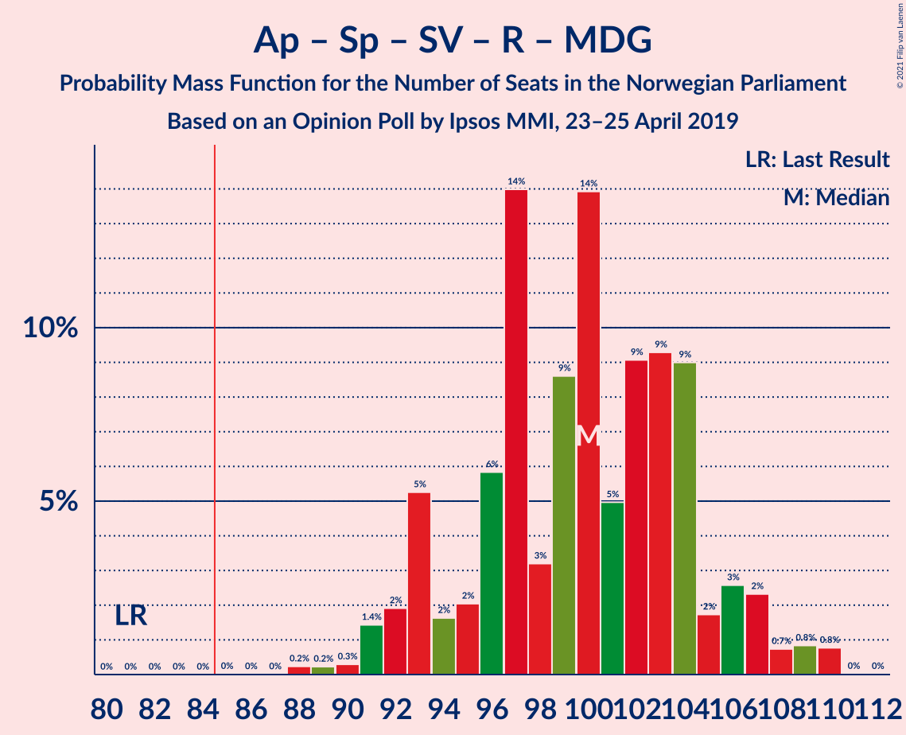

| Number of Seats | Probability | Accumulated | Special Marks |
|:---------------:|:-----------:|:-----------:|:-------------:|
| 81 | 0% | 100% | Last Result |
| 82 | 0% | 100% |  |
| 83 | 0% | 100% |  |
| 84 | 0% | 100% |  |
| 85 | 0% | 100% | Majority |
| 86 | 0% | 100% |  |
| 87 | 0% | 100% |  |
| 88 | 0.2% | 100% |  |
| 89 | 0.2% | 99.7% |  |
| 90 | 0.3% | 99.5% |  |
| 91 | 1.4% | 99.2% |  |
| 92 | 2% | 98% |  |
| 93 | 5% | 96% |  |
| 94 | 2% | 91% |  |
| 95 | 2% | 89% |  |
| 96 | 6% | 87% |  |
| 97 | 14% | 81% |  |
| 98 | 3% | 67% |  |
| 99 | 9% | 64% |  |
| 100 | 14% | 55% |  |
| 101 | 5% | 41% | Median |
| 102 | 9% | 36% |  |
| 103 | 9% | 27% |  |
| 104 | 9% | 18% |  |
| 105 | 2% | 9% |  |
| 106 | 3% | 7% |  |
| 107 | 2% | 5% |  |
| 108 | 0.7% | 2% |  |
| 109 | 0.8% | 2% |  |
| 110 | 0.8% | 0.8% |  |
| 111 | 0% | 0.1% |  |
| 112 | 0% | 0% |  |

### Arbeiderpartiet – Senterpartiet – Sosialistisk Venstreparti – Kristelig Folkeparti – Miljøpartiet De Grønne

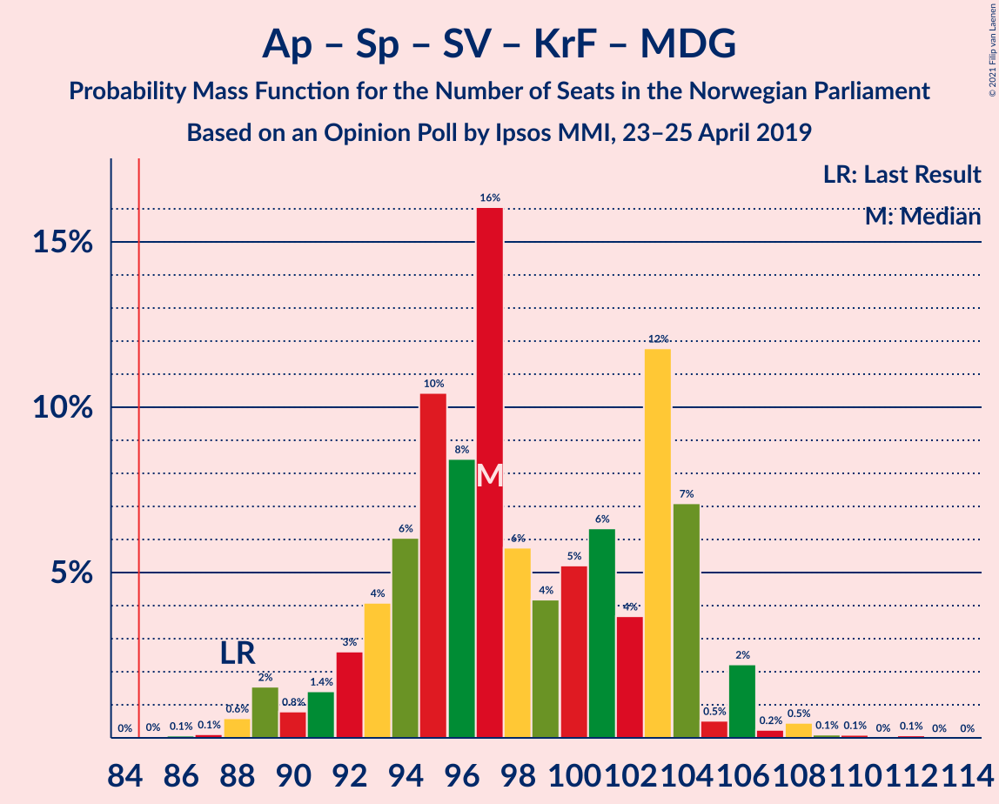

| Number of Seats | Probability | Accumulated | Special Marks |
|:---------------:|:-----------:|:-----------:|:-------------:|
| 86 | 0.1% | 100% |  |
| 87 | 0.1% | 99.9% |  |
| 88 | 0.6% | 99.8% | Last Result |
| 89 | 2% | 99.2% |  |
| 90 | 0.8% | 98% |  |
| 91 | 1.4% | 97% |  |
| 92 | 3% | 95% |  |
| 93 | 4% | 93% |  |
| 94 | 6% | 89% |  |
| 95 | 10% | 83% |  |
| 96 | 8% | 72% |  |
| 97 | 16% | 64% |  |
| 98 | 6% | 48% |  |
| 99 | 4% | 42% |  |
| 100 | 5% | 38% | Median |
| 101 | 6% | 33% |  |
| 102 | 4% | 26% |  |
| 103 | 12% | 23% |  |
| 104 | 7% | 11% |  |
| 105 | 0.5% | 4% |  |
| 106 | 2% | 3% |  |
| 107 | 0.2% | 1.0% |  |
| 108 | 0.5% | 0.7% |  |
| 109 | 0.1% | 0.3% |  |
| 110 | 0.1% | 0.2% |  |
| 111 | 0% | 0.1% |  |
| 112 | 0.1% | 0.1% |  |
| 113 | 0% | 0% |  |

### Arbeiderpartiet – Senterpartiet – Sosialistisk Venstreparti – Rødt

| Number of Seats | Probability | Accumulated | Special Marks |
|:---------------:|:-----------:|:-----------:|:-------------:|
| 80 | 0% | 100% | Last Result |
| 81 | 0% | 100% |  |
| 82 | 0% | 100% |  |
| 83 | 0% | 100% |  |
| 84 | 0% | 100% |  |
| 85 | 0% | 99.9% | Majority |
| 86 | 0% | 99.9% |  |
| 87 | 0.3% | 99.9% |  |
| 88 | 0.1% | 99.6% |  |
| 89 | 0.9% | 99.4% |  |
| 90 | 2% | 98% |  |
| 91 | 5% | 97% |  |
| 92 | 3% | 92% |  |
| 93 | 4% | 89% |  |
| 94 | 3% | 85% |  |
| 95 | 16% | 82% |  |
| 96 | 4% | 66% |  |
| 97 | 5% | 62% |  |
| 98 | 13% | 57% |  |
| 99 | 6% | 44% | Median |
| 100 | 10% | 38% |  |
| 101 | 5% | 28% |  |
| 102 | 9% | 23% |  |
| 103 | 6% | 14% |  |
| 104 | 2% | 8% |  |
| 105 | 3% | 6% |  |
| 106 | 0.6% | 3% |  |
| 107 | 1.3% | 2% |  |
| 108 | 0.7% | 0.8% |  |
| 109 | 0% | 0% |  |

### Høyre – Senterpartiet – Fremskrittspartiet – Kristelig Folkeparti – Venstre

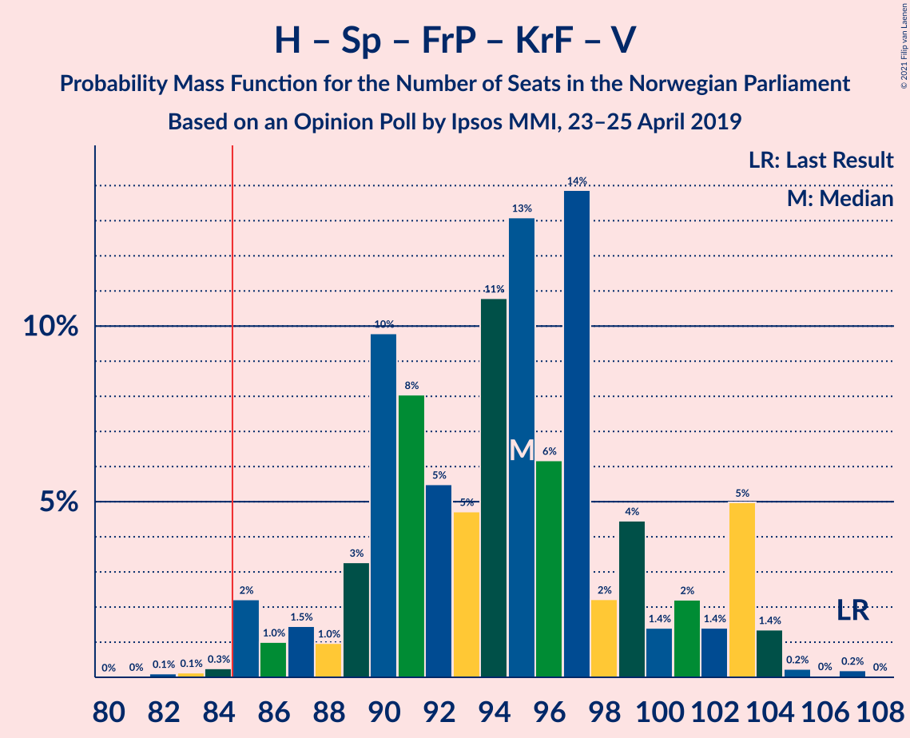

| Number of Seats | Probability | Accumulated | Special Marks |
|:---------------:|:-----------:|:-----------:|:-------------:|
| 82 | 0.1% | 100% |  |
| 83 | 0.1% | 99.9% |  |
| 84 | 0.3% | 99.7% |  |
| 85 | 2% | 99.5% | Majority |
| 86 | 1.0% | 97% |  |
| 87 | 1.5% | 96% |  |
| 88 | 1.0% | 95% |  |
| 89 | 3% | 94% |  |
| 90 | 10% | 91% |  |
| 91 | 8% | 81% |  |
| 92 | 5% | 73% |  |
| 93 | 5% | 67% |  |
| 94 | 11% | 62% |  |
| 95 | 13% | 52% |  |
| 96 | 6% | 39% | Median |
| 97 | 14% | 32% |  |
| 98 | 2% | 19% |  |
| 99 | 4% | 16% |  |
| 100 | 1.4% | 12% |  |
| 101 | 2% | 10% |  |
| 102 | 1.4% | 8% |  |
| 103 | 5% | 7% |  |
| 104 | 1.4% | 2% |  |
| 105 | 0.2% | 0.5% |  |
| 106 | 0% | 0.3% |  |
| 107 | 0.2% | 0.2% | Last Result |
| 108 | 0% | 0% |  |

### Arbeiderpartiet – Senterpartiet – Sosialistisk Venstreparti – Miljøpartiet De Grønne

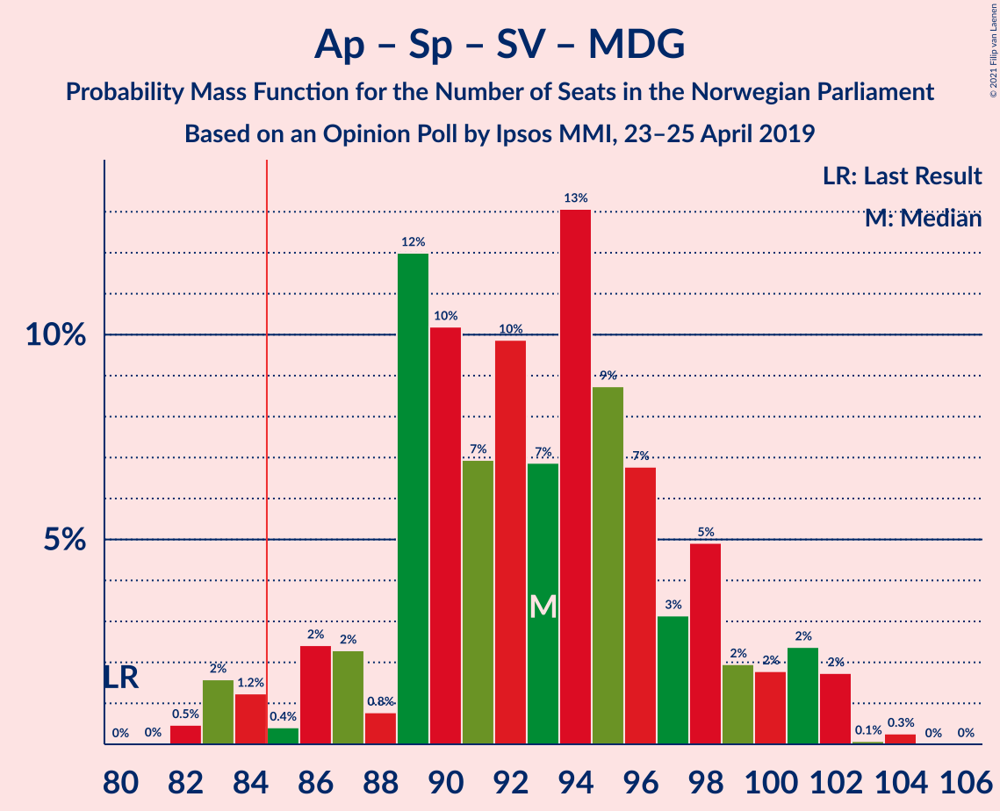

| Number of Seats | Probability | Accumulated | Special Marks |
|:---------------:|:-----------:|:-----------:|:-------------:|
| 80 | 0% | 100% | Last Result |
| 81 | 0% | 100% |  |
| 82 | 0.5% | 100% |  |
| 83 | 2% | 99.5% |  |
| 84 | 1.2% | 98% |  |
| 85 | 0.4% | 97% | Majority |
| 86 | 2% | 96% |  |
| 87 | 2% | 94% |  |
| 88 | 0.8% | 92% |  |
| 89 | 12% | 91% |  |
| 90 | 10% | 79% |  |
| 91 | 7% | 69% |  |
| 92 | 10% | 62% |  |
| 93 | 7% | 52% | Median |
| 94 | 13% | 45% |  |
| 95 | 9% | 32% |  |
| 96 | 7% | 23% |  |
| 97 | 3% | 16% |  |
| 98 | 5% | 13% |  |
| 99 | 2% | 8% |  |
| 100 | 2% | 6% |  |
| 101 | 2% | 4% |  |
| 102 | 2% | 2% |  |
| 103 | 0.1% | 0.4% |  |
| 104 | 0.3% | 0.3% |  |
| 105 | 0% | 0% |  |

### Arbeiderpartiet – Senterpartiet – Sosialistisk Venstreparti

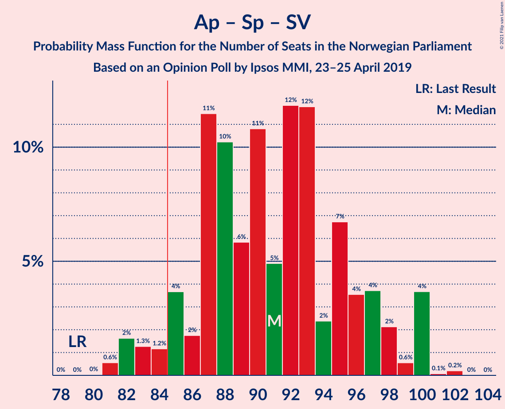

| Number of Seats | Probability | Accumulated | Special Marks |
|:---------------:|:-----------:|:-----------:|:-------------:|
| 79 | 0% | 100% | Last Result |
| 80 | 0% | 100% |  |
| 81 | 0.6% | 99.9% |  |
| 82 | 2% | 99.4% |  |
| 83 | 1.3% | 98% |  |
| 84 | 1.2% | 96% |  |
| 85 | 4% | 95% | Majority |
| 86 | 2% | 92% |  |
| 87 | 11% | 90% |  |
| 88 | 10% | 78% |  |
| 89 | 6% | 68% |  |
| 90 | 11% | 62% |  |
| 91 | 5% | 52% | Median |
| 92 | 12% | 47% |  |
| 93 | 12% | 35% |  |
| 94 | 2% | 23% |  |
| 95 | 7% | 21% |  |
| 96 | 4% | 14% |  |
| 97 | 4% | 10% |  |
| 98 | 2% | 7% |  |
| 99 | 0.6% | 5% |  |
| 100 | 4% | 4% |  |
| 101 | 0.1% | 0.3% |  |
| 102 | 0.2% | 0.2% |  |
| 103 | 0% | 0% |  |

### Arbeiderpartiet – Senterpartiet – Kristelig Folkeparti – Miljøpartiet De Grønne

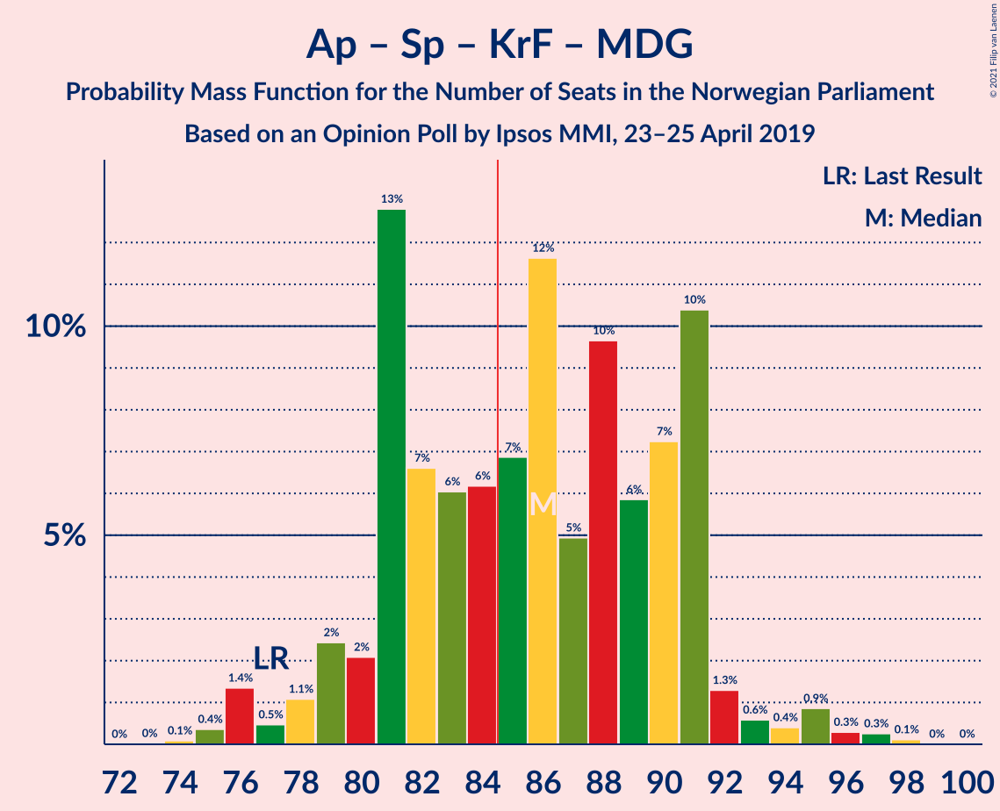

| Number of Seats | Probability | Accumulated | Special Marks |
|:---------------:|:-----------:|:-----------:|:-------------:|
| 74 | 0.1% | 100% |  |
| 75 | 0.4% | 99.9% |  |
| 76 | 1.4% | 99.5% |  |
| 77 | 0.5% | 98% | Last Result |
| 78 | 1.1% | 98% |  |
| 79 | 2% | 97% |  |
| 80 | 2% | 94% |  |
| 81 | 13% | 92% |  |
| 82 | 7% | 79% |  |
| 83 | 6% | 73% |  |
| 84 | 6% | 67% |  |
| 85 | 7% | 60% | Majority |
| 86 | 12% | 54% |  |
| 87 | 5% | 42% | Median |
| 88 | 10% | 37% |  |
| 89 | 6% | 27% |  |
| 90 | 7% | 21% |  |
| 91 | 10% | 14% |  |
| 92 | 1.3% | 4% |  |
| 93 | 0.6% | 3% |  |
| 94 | 0.4% | 2% |  |
| 95 | 0.9% | 2% |  |
| 96 | 0.3% | 0.7% |  |
| 97 | 0.3% | 0.4% |  |
| 98 | 0.1% | 0.1% |  |
| 99 | 0% | 0% |  |

### Arbeiderpartiet – Senterpartiet – Kristelig Folkeparti

| Number of Seats | Probability | Accumulated | Special Marks |
|:---------------:|:-----------:|:-----------:|:-------------:|
| 72 | 0% | 100% |  |
| 73 | 0.3% | 99.9% |  |
| 74 | 0.3% | 99.6% |  |
| 75 | 2% | 99.3% |  |
| 76 | 0.9% | 98% | Last Result |
| 77 | 2% | 97% |  |
| 78 | 2% | 95% |  |
| 79 | 12% | 93% |  |
| 80 | 6% | 80% |  |
| 81 | 8% | 75% |  |
| 82 | 3% | 67% |  |
| 83 | 10% | 63% |  |
| 84 | 11% | 53% |  |
| 85 | 6% | 43% | Median, Majority |
| 86 | 4% | 37% |  |
| 87 | 10% | 32% |  |
| 88 | 7% | 22% |  |
| 89 | 8% | 15% |  |
| 90 | 5% | 8% |  |
| 91 | 0.9% | 2% |  |
| 92 | 0.3% | 1.4% |  |
| 93 | 0.5% | 1.1% |  |
| 94 | 0.4% | 0.6% |  |
| 95 | 0.1% | 0.2% |  |
| 96 | 0.1% | 0.1% |  |
| 97 | 0% | 0% |  |

### Arbeiderpartiet – Senterpartiet

| Number of Seats | Probability | Accumulated | Special Marks |
|:---------------:|:-----------:|:-----------:|:-------------:|
| 67 | 0% | 100% |  |
| 68 | 0% | 99.9% | Last Result |
| 69 | 0.3% | 99.9% |  |
| 70 | 1.0% | 99.6% |  |
| 71 | 2% | 98.6% |  |
| 72 | 2% | 97% |  |
| 73 | 4% | 95% |  |
| 74 | 2% | 91% |  |
| 75 | 2% | 88% |  |
| 76 | 26% | 86% |  |
| 77 | 6% | 60% |  |
| 78 | 6% | 54% | Median |
| 79 | 13% | 48% |  |
| 80 | 8% | 35% |  |
| 81 | 7% | 28% |  |
| 82 | 9% | 21% |  |
| 83 | 3% | 12% |  |
| 84 | 1.4% | 10% |  |
| 85 | 3% | 8% | Majority |
| 86 | 2% | 5% |  |
| 87 | 2% | 3% |  |
| 88 | 0.4% | 0.5% |  |
| 89 | 0.1% | 0.1% |  |
| 90 | 0% | 0% |  |

### Høyre – Fremskrittspartiet – Kristelig Folkeparti – Miljøpartiet De Grønne – Venstre

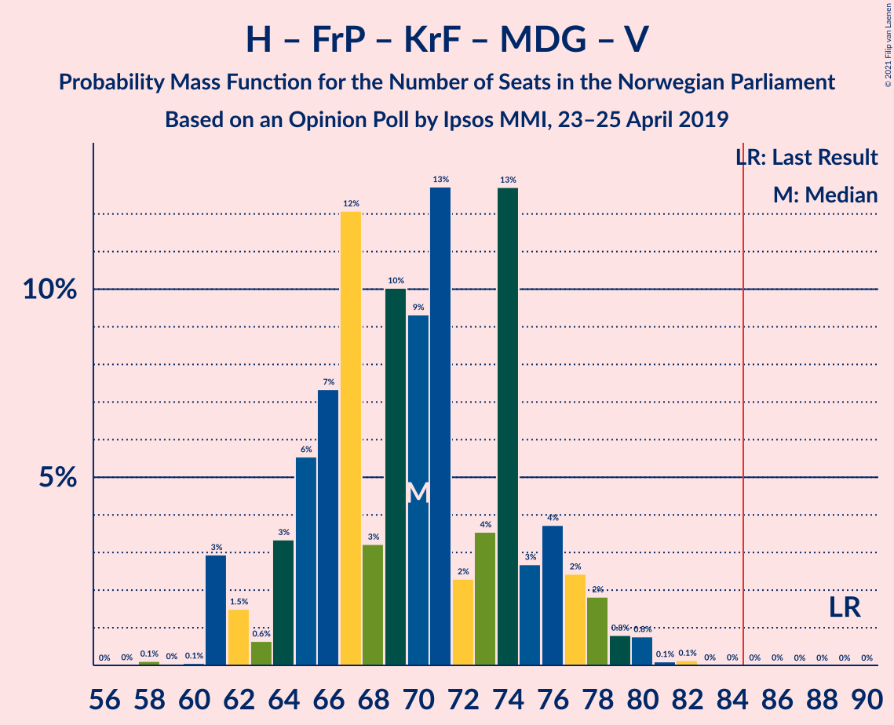

| Number of Seats | Probability | Accumulated | Special Marks |
|:---------------:|:-----------:|:-----------:|:-------------:|
| 58 | 0.1% | 100% |  |
| 59 | 0% | 99.9% |  |
| 60 | 0.1% | 99.8% |  |
| 61 | 3% | 99.8% |  |
| 62 | 1.5% | 97% |  |
| 63 | 0.6% | 95% |  |
| 64 | 3% | 95% |  |
| 65 | 6% | 91% |  |
| 66 | 7% | 86% |  |
| 67 | 12% | 78% |  |
| 68 | 3% | 66% |  |
| 69 | 10% | 63% |  |
| 70 | 9% | 53% |  |
| 71 | 13% | 44% |  |
| 72 | 2% | 31% | Median |
| 73 | 4% | 29% |  |
| 74 | 13% | 25% |  |
| 75 | 3% | 13% |  |
| 76 | 4% | 10% |  |
| 77 | 2% | 6% |  |
| 78 | 2% | 4% |  |
| 79 | 0.8% | 2% |  |
| 80 | 0.8% | 1.0% |  |
| 81 | 0.1% | 0.3% |  |
| 82 | 0.1% | 0.2% |  |
| 83 | 0% | 0% |  |
| 84 | 0% | 0% |  |
| 85 | 0% | 0% | Majority |
| 86 | 0% | 0% |  |
| 87 | 0% | 0% |  |
| 88 | 0% | 0% |  |
| 89 | 0% | 0% | Last Result |

### Høyre – Fremskrittspartiet – Kristelig Folkeparti – Venstre

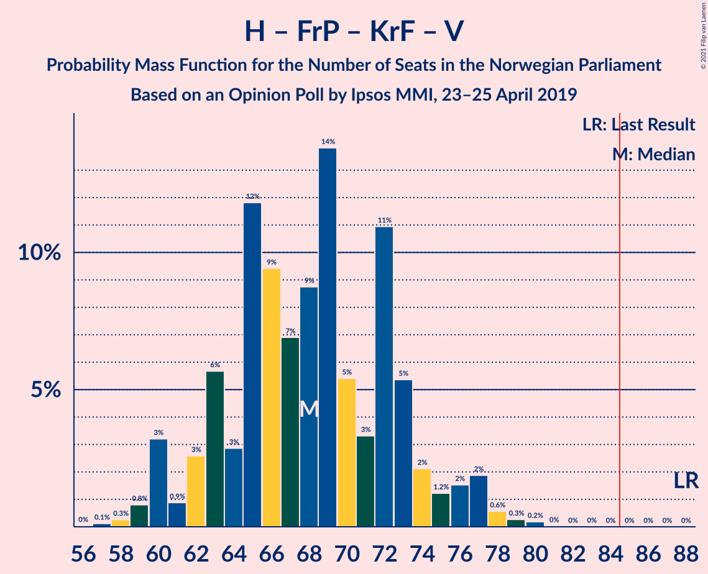

| Number of Seats | Probability | Accumulated | Special Marks |
|:---------------:|:-----------:|:-----------:|:-------------:|
| 56 | 0% | 100% |  |
| 57 | 0.1% | 99.9% |  |
| 58 | 0.3% | 99.8% |  |
| 59 | 0.8% | 99.6% |  |
| 60 | 3% | 98.8% |  |
| 61 | 0.9% | 96% |  |
| 62 | 3% | 95% |  |
| 63 | 6% | 92% |  |
| 64 | 3% | 86% |  |
| 65 | 12% | 84% |  |
| 66 | 9% | 72% |  |
| 67 | 7% | 62% |  |
| 68 | 9% | 55% |  |
| 69 | 14% | 47% |  |
| 70 | 5% | 33% | Median |
| 71 | 3% | 27% |  |
| 72 | 11% | 24% |  |
| 73 | 5% | 13% |  |
| 74 | 2% | 8% |  |
| 75 | 1.2% | 6% |  |
| 76 | 2% | 4% |  |
| 77 | 2% | 3% |  |
| 78 | 0.6% | 1.1% |  |
| 79 | 0.3% | 0.5% |  |
| 80 | 0.2% | 0.2% |  |
| 81 | 0% | 0% |  |
| 82 | 0% | 0% |  |
| 83 | 0% | 0% |  |
| 84 | 0% | 0% |  |
| 85 | 0% | 0% | Majority |
| 86 | 0% | 0% |  |
| 87 | 0% | 0% |  |
| 88 | 0% | 0% | Last Result |

### Arbeiderpartiet – Sosialistisk Venstreparti

| Number of Seats | Probability | Accumulated | Special Marks |
|:---------------:|:-----------:|:-----------:|:-------------:|
| 54 | 0.1% | 100% |  |
| 55 | 0.3% | 99.9% |  |
| 56 | 3% | 99.6% |  |
| 57 | 2% | 97% |  |
| 58 | 0.9% | 95% |  |
| 59 | 1.4% | 94% |  |
| 60 | 6% | 93% | Last Result |
| 61 | 6% | 87% |  |
| 62 | 15% | 81% |  |
| 63 | 11% | 66% |  |
| 64 | 8% | 55% |  |
| 65 | 13% | 47% | Median |
| 66 | 4% | 34% |  |
| 67 | 3% | 30% |  |
| 68 | 5% | 26% |  |
| 69 | 6% | 21% |  |
| 70 | 9% | 15% |  |
| 71 | 5% | 6% |  |
| 72 | 0.5% | 1.0% |  |
| 73 | 0.2% | 0.5% |  |
| 74 | 0.2% | 0.3% |  |
| 75 | 0.1% | 0.1% |  |
| 76 | 0% | 0% |  |

### Høyre – Fremskrittspartiet – Venstre

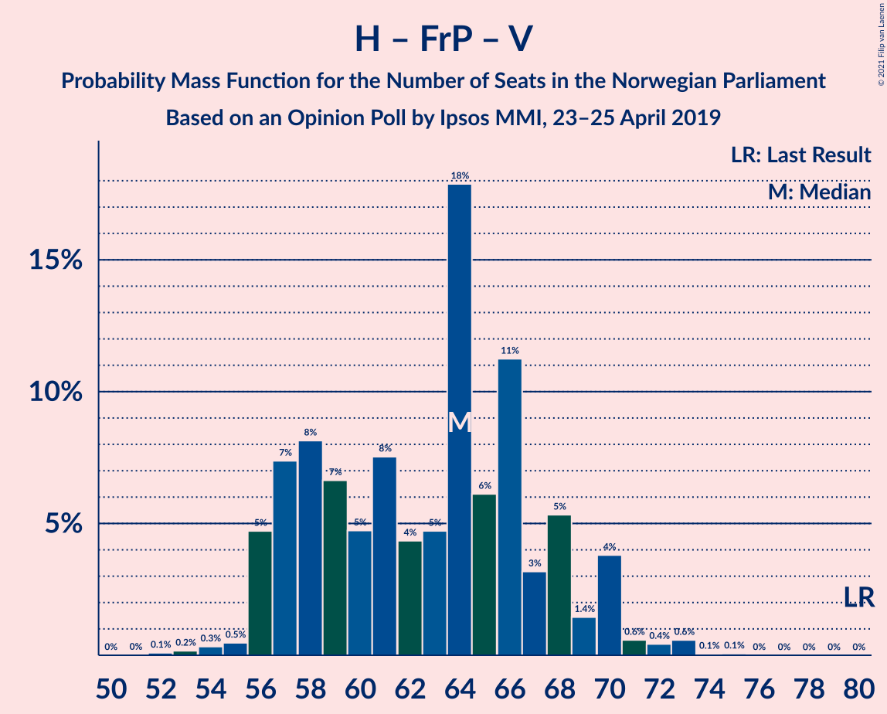

| Number of Seats | Probability | Accumulated | Special Marks |
|:---------------:|:-----------:|:-----------:|:-------------:|
| 52 | 0.1% | 100% |  |
| 53 | 0.2% | 99.9% |  |
| 54 | 0.3% | 99.7% |  |
| 55 | 0.5% | 99.4% |  |
| 56 | 5% | 98.9% |  |
| 57 | 7% | 94% |  |
| 58 | 8% | 87% |  |
| 59 | 7% | 79% |  |
| 60 | 5% | 72% |  |
| 61 | 8% | 67% |  |
| 62 | 4% | 60% |  |
| 63 | 5% | 55% | Median |
| 64 | 18% | 51% |  |
| 65 | 6% | 33% |  |
| 66 | 11% | 27% |  |
| 67 | 3% | 15% |  |
| 68 | 5% | 12% |  |
| 69 | 1.4% | 7% |  |
| 70 | 4% | 6% |  |
| 71 | 0.6% | 2% |  |
| 72 | 0.4% | 1.1% |  |
| 73 | 0.6% | 0.7% |  |
| 74 | 0.1% | 0.1% |  |
| 75 | 0.1% | 0.1% |  |
| 76 | 0% | 0% |  |
| 77 | 0% | 0% |  |
| 78 | 0% | 0% |  |
| 79 | 0% | 0% |  |
| 80 | 0% | 0% | Last Result |

### Høyre – Fremskrittspartiet

| Number of Seats | Probability | Accumulated | Special Marks |
|:---------------:|:-----------:|:-----------:|:-------------:|
| 51 | 0.1% | 100% |  |
| 52 | 0.3% | 99.9% |  |
| 53 | 0.3% | 99.6% |  |
| 54 | 0.9% | 99.4% |  |
| 55 | 5% | 98% |  |
| 56 | 9% | 93% |  |
| 57 | 6% | 84% |  |
| 58 | 6% | 78% |  |
| 59 | 9% | 72% |  |
| 60 | 4% | 62% |  |
| 61 | 6% | 59% | Median |
| 62 | 15% | 53% |  |
| 63 | 4% | 38% |  |
| 64 | 17% | 34% |  |
| 65 | 3% | 16% |  |
| 66 | 4% | 14% |  |
| 67 | 3% | 10% |  |
| 68 | 3% | 7% |  |
| 69 | 2% | 4% |  |
| 70 | 0.2% | 1.3% |  |
| 71 | 0.9% | 1.1% |  |
| 72 | 0% | 0.2% | Last Result |
| 73 | 0.1% | 0.1% |  |
| 74 | 0% | 0% |  |

### Høyre – Kristelig Folkeparti – Venstre

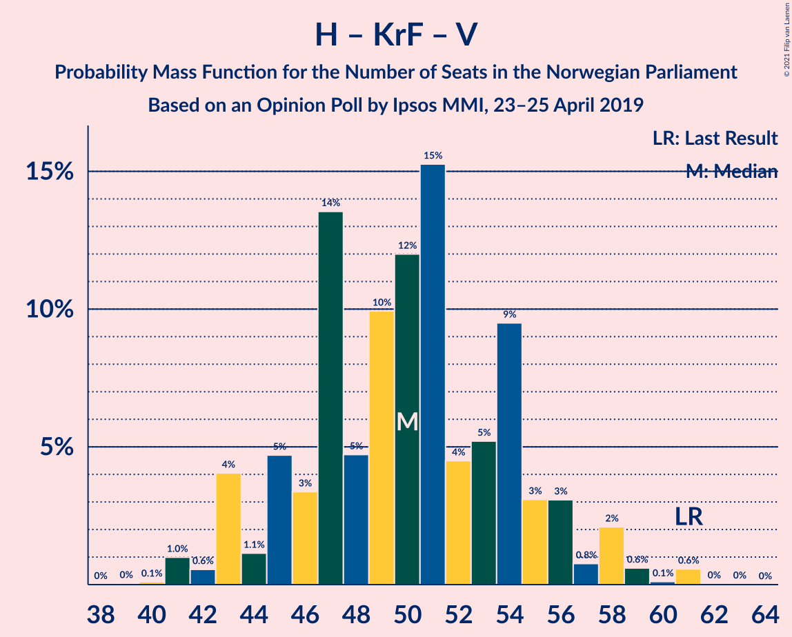

| Number of Seats | Probability | Accumulated | Special Marks |
|:---------------:|:-----------:|:-----------:|:-------------:|
| 39 | 0% | 100% |  |
| 40 | 0.1% | 99.9% |  |
| 41 | 1.0% | 99.8% |  |
| 42 | 0.6% | 98.9% |  |
| 43 | 4% | 98% |  |
| 44 | 1.1% | 94% |  |
| 45 | 5% | 93% |  |
| 46 | 3% | 88% |  |
| 47 | 14% | 85% |  |
| 48 | 5% | 71% |  |
| 49 | 10% | 67% |  |
| 50 | 12% | 57% |  |
| 51 | 15% | 45% |  |
| 52 | 4% | 30% | Median |
| 53 | 5% | 25% |  |
| 54 | 9% | 20% |  |
| 55 | 3% | 10% |  |
| 56 | 3% | 7% |  |
| 57 | 0.8% | 4% |  |
| 58 | 2% | 3% |  |
| 59 | 0.6% | 1.3% |  |
| 60 | 0.1% | 0.7% |  |
| 61 | 0.6% | 0.6% | Last Result |
| 62 | 0% | 0.1% |  |
| 63 | 0% | 0% |  |

### Senterpartiet – Kristelig Folkeparti – Venstre

| Number of Seats | Probability | Accumulated | Special Marks |
|:---------------:|:-----------:|:-----------:|:-------------:|
| 24 | 0.2% | 100% |  |
| 25 | 0.9% | 99.8% |  |
| 26 | 2% | 98.9% |  |
| 27 | 3% | 97% |  |
| 28 | 5% | 94% |  |
| 29 | 5% | 90% |  |
| 30 | 4% | 85% |  |
| 31 | 8% | 81% |  |
| 32 | 13% | 72% |  |
| 33 | 15% | 59% |  |
| 34 | 8% | 44% |  |
| 35 | 13% | 36% | Last Result, Median |
| 36 | 4% | 23% |  |
| 37 | 4% | 19% |  |
| 38 | 8% | 14% |  |
| 39 | 3% | 7% |  |
| 40 | 1.5% | 4% |  |
| 41 | 0.7% | 2% |  |
| 42 | 1.2% | 2% |  |
| 43 | 0.1% | 0.5% |  |
| 44 | 0.2% | 0.4% |  |
| 45 | 0.2% | 0.2% |  |
| 46 | 0% | 0% |  |

## Technical Information

### Opinion Poll

+ **Polling firm:** Ipsos MMI
+ **Commissioner(s):** —
+ **Fieldwork period:** 23–25 April 2019

### Calculations

+ **Sample size:** 942
+ **Simulations done:** 262,144
+ **Error estimate:** 2.24%

