# Opinion Poll by Kantar TNS, 29 April–3 May 2019

<a href="#voting-intentions">Voting Intentions</a> | <a href="#seats">Seats</a> | <a href="#coalitions">Coalitions</a> | <a href="#technical-information">Technical Information</a>

## Voting Intentions

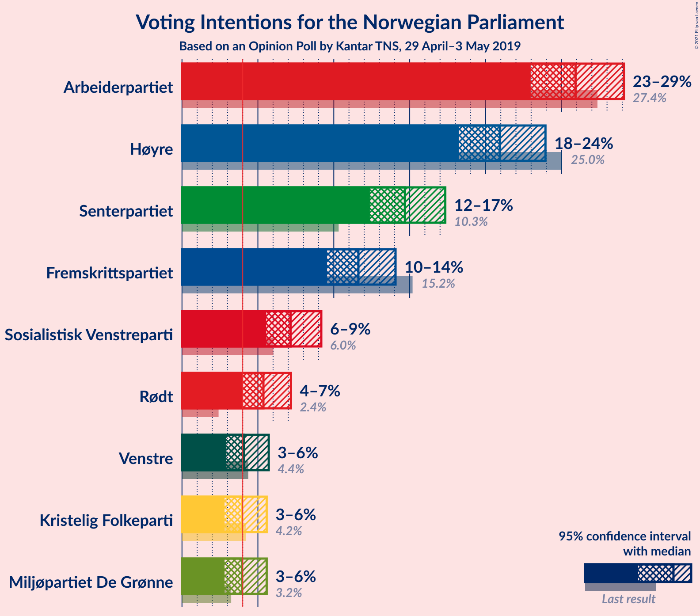

### Confidence Intervals

| Party | Last Result | Poll Result | 80% Confidence Interval | 90% Confidence Interval | 95% Confidence Interval | 99% Confidence Interval |
|:-----:|:-----------:|:-----------:|:-----------------------:|:-----------------------:|:-----------------------:|:-----------------------:|
| Arbeiderpartiet | 27.4% | 25.9% | 24.0–28.0% |23.4–28.6% |23.0–29.1% |22.1–30.1% |
| Høyre | 25.0% | 20.9% | 19.2–22.9% |18.7–23.5% |18.2–23.9% |17.4–24.9% |
| Senterpartiet | 10.3% | 14.7% | 13.2–16.4% |12.7–16.9% |12.4–17.3% |11.7–18.2% |
| Fremskrittspartiet | 15.2% | 11.6% | 10.3–13.2% |9.9–13.7% |9.6–14.1% |8.9–14.9% |
| Sosialistisk Venstreparti | 6.0% | 7.2% | 6.1–8.5% |5.8–8.9% |5.5–9.2% |5.1–9.8% |
| Rødt | 2.4% | 5.4% | 4.5–6.6% |4.2–6.9% |4.0–7.2% |3.6–7.8% |
| Venstre | 4.4% | 4.1% | 3.3–5.2% |3.1–5.5% |2.9–5.7% |2.6–6.3% |
| Miljøpartiet De Grønne | 3.2% | 4.0% | 3.2–5.0% |3.0–5.3% |2.8–5.6% |2.5–6.1% |
| Kristelig Folkeparti | 4.2% | 4.0% | 3.2–5.0% |3.0–5.3% |2.8–5.6% |2.5–6.1% |

*Note:* The poll result column reflects the actual value used in the calculations. Published results may vary slightly, and in addition be rounded to fewer digits.

## Seats

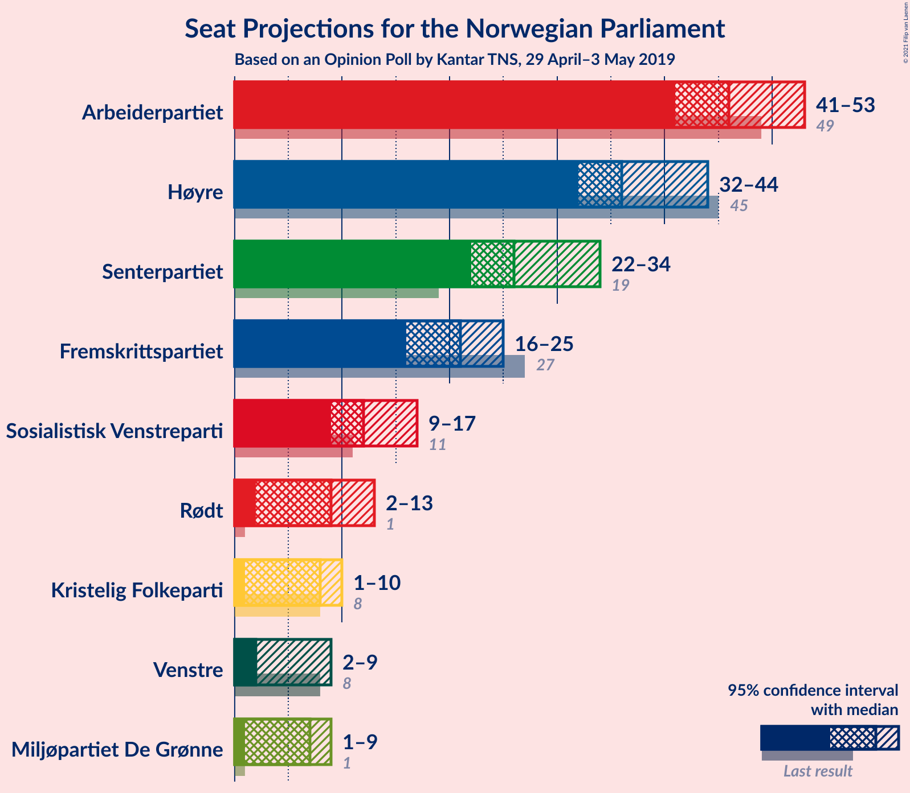

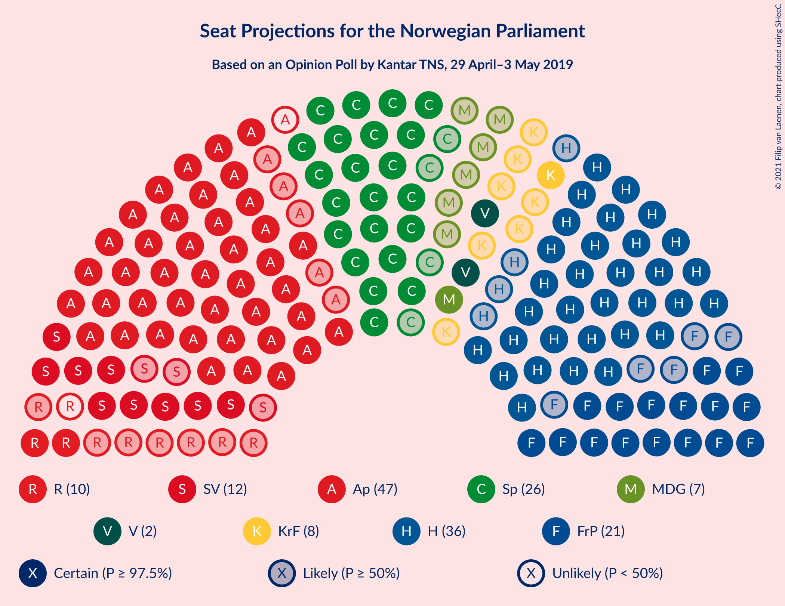

### Confidence Intervals

| Party | Last Result | Median | 80% Confidence Interval | 90% Confidence Interval | 95% Confidence Interval | 99% Confidence Interval |
|:-----:|:-----------:|:------:|:-----------------------:|:-----------------------:|:-----------------------:|:-----------------------:|
| <a href="#arbeiderpartiet">Arbeiderpartiet</a> | 49 | 46 | 43–51 |42–53 |41–53 |40–54 |
| <a href="#høyre">Høyre</a> | 45 | 36 | 34–40 |33–42 |32–44 |30–46 |
| <a href="#senterpartiet">Senterpartiet</a> | 19 | 26 | 24–32 |22–32 |22–34 |20–35 |
| <a href="#fremskrittspartiet">Fremskrittspartiet</a> | 27 | 21 | 17–24 |17–25 |16–25 |14–27 |
| <a href="#sosialistisk-venstreparti">Sosialistisk Venstreparti</a> | 11 | 12 | 10–15 |10–16 |9–17 |9–18 |
| <a href="#rødt">Rødt</a> | 1 | 9 | 7–11 |7–12 |2–13 |2–15 |
| <a href="#venstre">Venstre</a> | 8 | 2 | 2–9 |2–9 |2–9 |2–11 |
| <a href="#miljøpartiet-de-grønne">Miljøpartiet De Grønne</a> | 1 | 7 | 2–8 |1–9 |1–9 |1–10 |
| <a href="#kristelig-folkeparti">Kristelig Folkeparti</a> | 8 | 8 | 3–10 |2–10 |1–10 |1–11 |

### Arbeiderpartiet

*For a full overview of the results for this party, see the [Arbeiderpartiet](party-arbeiderpartiet.html) page.*

| Number of Seats | Probability | Accumulated | Special Marks |
|:---------------:|:-----------:|:-----------:|:-------------:|
| 38 | 0% | 100% |  |
| 39 | 0.1% | 99.9% |  |
| 40 | 0.7% | 99.8% |  |
| 41 | 3% | 99.1% |  |
| 42 | 2% | 96% |  |
| 43 | 6% | 95% |  |
| 44 | 27% | 89% |  |
| 45 | 7% | 62% |  |
| 46 | 6% | 55% | Median |
| 47 | 5% | 50% |  |
| 48 | 1.2% | 45% |  |
| 49 | 23% | 44% | Last Result |
| 50 | 3% | 21% |  |
| 51 | 10% | 19% |  |
| 52 | 3% | 8% |  |
| 53 | 3% | 5% |  |
| 54 | 1.2% | 2% |  |
| 55 | 0.4% | 0.5% |  |
| 56 | 0% | 0.1% |  |
| 57 | 0% | 0.1% |  |
| 58 | 0% | 0% |  |

### Høyre

*For a full overview of the results for this party, see the [Høyre](party-høyre.html) page.*

| Number of Seats | Probability | Accumulated | Special Marks |
|:---------------:|:-----------:|:-----------:|:-------------:|
| 28 | 0.1% | 100% |  |
| 29 | 0.2% | 99.9% |  |
| 30 | 0.3% | 99.8% |  |
| 31 | 0.8% | 99.4% |  |
| 32 | 3% | 98.7% |  |
| 33 | 3% | 95% |  |
| 34 | 6% | 92% |  |
| 35 | 7% | 87% |  |
| 36 | 34% | 79% | Median |
| 37 | 11% | 45% |  |
| 38 | 17% | 34% |  |
| 39 | 6% | 18% |  |
| 40 | 2% | 12% |  |
| 41 | 2% | 10% |  |
| 42 | 4% | 8% |  |
| 43 | 0.8% | 4% |  |
| 44 | 0.4% | 3% |  |
| 45 | 1.1% | 2% | Last Result |
| 46 | 1.2% | 1.3% |  |
| 47 | 0.1% | 0.1% |  |
| 48 | 0% | 0% |  |

### Senterpartiet

*For a full overview of the results for this party, see the [Senterpartiet](party-senterpartiet.html) page.*

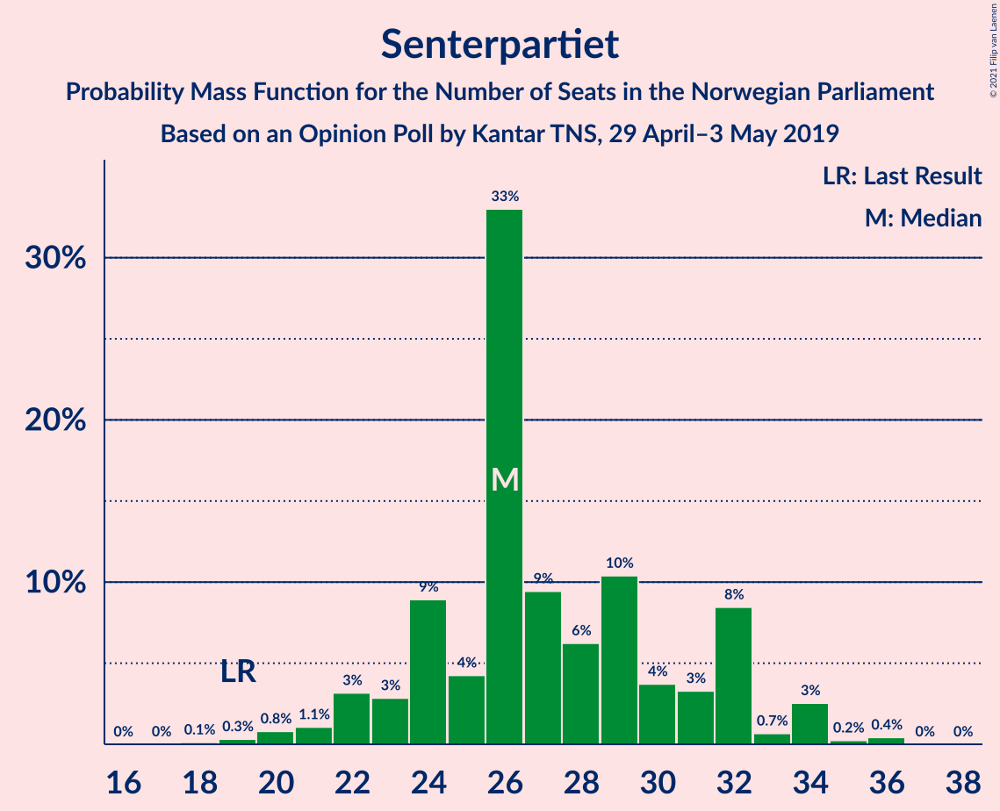

| Number of Seats | Probability | Accumulated | Special Marks |
|:---------------:|:-----------:|:-----------:|:-------------:|
| 18 | 0.1% | 100% |  |
| 19 | 0.3% | 99.9% | Last Result |
| 20 | 0.8% | 99.5% |  |
| 21 | 1.1% | 98.7% |  |
| 22 | 3% | 98% |  |
| 23 | 3% | 95% |  |
| 24 | 9% | 92% |  |
| 25 | 4% | 83% |  |
| 26 | 33% | 78% | Median |
| 27 | 9% | 45% |  |
| 28 | 6% | 36% |  |
| 29 | 10% | 30% |  |
| 30 | 4% | 19% |  |
| 31 | 3% | 16% |  |
| 32 | 8% | 12% |  |
| 33 | 0.7% | 4% |  |
| 34 | 3% | 3% |  |
| 35 | 0.2% | 0.7% |  |
| 36 | 0.4% | 0.4% |  |
| 37 | 0% | 0% |  |

### Fremskrittspartiet

*For a full overview of the results for this party, see the [Fremskrittspartiet](party-fremskrittspartiet.html) page.*

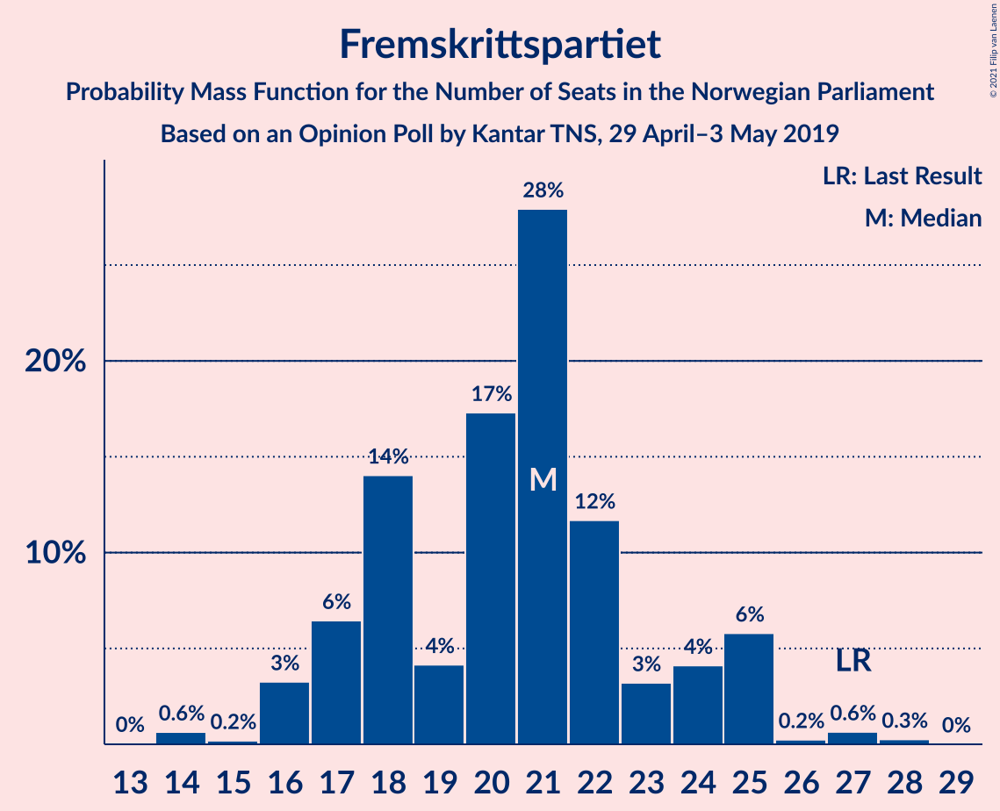

| Number of Seats | Probability | Accumulated | Special Marks |
|:---------------:|:-----------:|:-----------:|:-------------:|
| 13 | 0% | 100% |  |
| 14 | 0.6% | 99.9% |  |
| 15 | 0.2% | 99.3% |  |
| 16 | 3% | 99.1% |  |
| 17 | 6% | 96% |  |
| 18 | 14% | 89% |  |
| 19 | 4% | 75% |  |
| 20 | 17% | 71% |  |
| 21 | 28% | 54% | Median |
| 22 | 12% | 26% |  |
| 23 | 3% | 14% |  |
| 24 | 4% | 11% |  |
| 25 | 6% | 7% |  |
| 26 | 0.2% | 1.2% |  |
| 27 | 0.6% | 0.9% | Last Result |
| 28 | 0.3% | 0.3% |  |
| 29 | 0% | 0% |  |

### Sosialistisk Venstreparti

*For a full overview of the results for this party, see the [Sosialistisk Venstreparti](party-sosialistiskvenstreparti.html) page.*

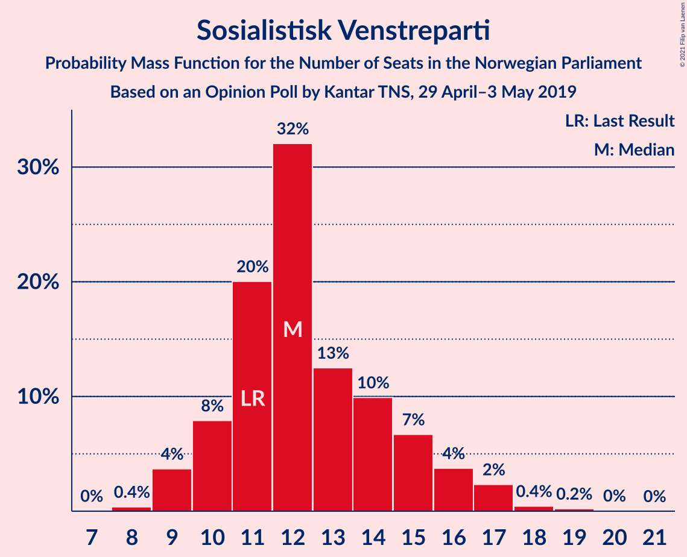

| Number of Seats | Probability | Accumulated | Special Marks |
|:---------------:|:-----------:|:-----------:|:-------------:|
| 8 | 0.4% | 100% |  |
| 9 | 4% | 99.6% |  |
| 10 | 8% | 96% |  |
| 11 | 20% | 88% | Last Result |
| 12 | 32% | 68% | Median |
| 13 | 13% | 36% |  |
| 14 | 10% | 23% |  |
| 15 | 7% | 13% |  |
| 16 | 4% | 7% |  |
| 17 | 2% | 3% |  |
| 18 | 0.4% | 0.7% |  |
| 19 | 0.2% | 0.3% |  |
| 20 | 0% | 0.1% |  |
| 21 | 0% | 0% |  |

### Rødt

*For a full overview of the results for this party, see the [Rødt](party-rødt.html) page.*

| Number of Seats | Probability | Accumulated | Special Marks |
|:---------------:|:-----------:|:-----------:|:-------------:|
| 1 | 0% | 100% | Last Result |
| 2 | 3% | 100% |  |
| 3 | 0% | 97% |  |
| 4 | 0% | 97% |  |
| 5 | 0% | 97% |  |
| 6 | 0.9% | 97% |  |
| 7 | 6% | 96% |  |
| 8 | 30% | 90% |  |
| 9 | 28% | 60% | Median |
| 10 | 17% | 32% |  |
| 11 | 6% | 15% |  |
| 12 | 4% | 9% |  |
| 13 | 3% | 5% |  |
| 14 | 2% | 2% |  |
| 15 | 0.6% | 0.7% |  |
| 16 | 0% | 0.1% |  |
| 17 | 0% | 0% |  |

### Venstre

*For a full overview of the results for this party, see the [Venstre](party-venstre.html) page.*

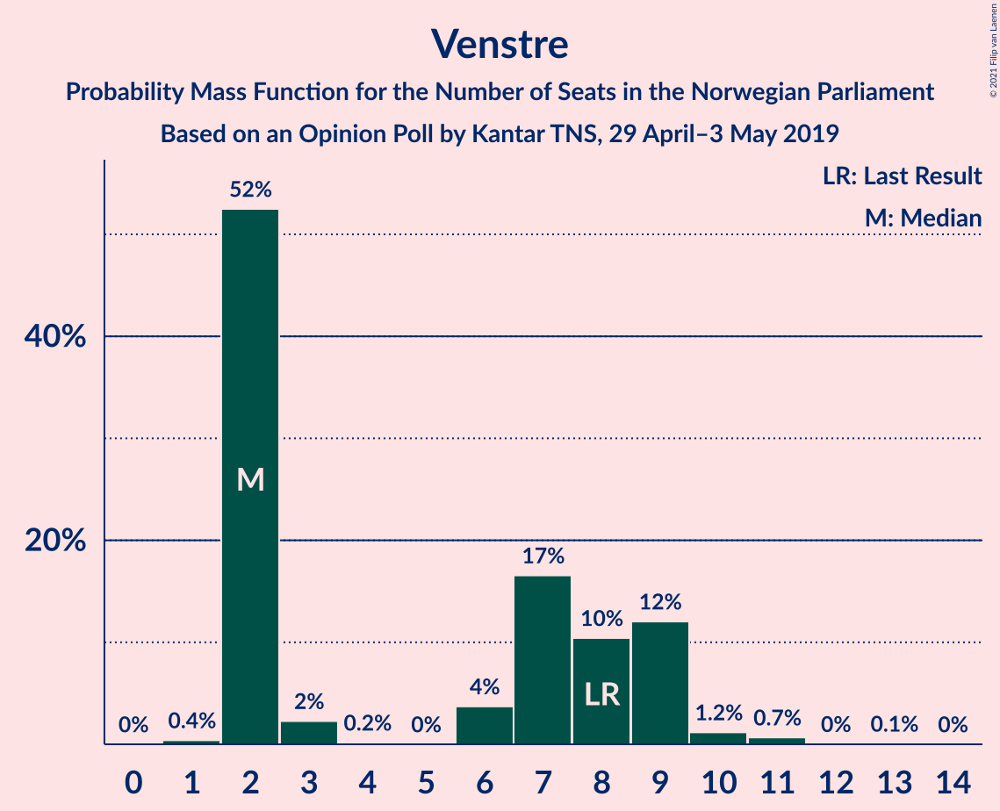

| Number of Seats | Probability | Accumulated | Special Marks |
|:---------------:|:-----------:|:-----------:|:-------------:|
| 1 | 0.4% | 100% |  |
| 2 | 52% | 99.6% | Median |
| 3 | 2% | 47% |  |
| 4 | 0.2% | 45% |  |
| 5 | 0% | 45% |  |
| 6 | 4% | 45% |  |
| 7 | 17% | 41% |  |
| 8 | 10% | 24% | Last Result |
| 9 | 12% | 14% |  |
| 10 | 1.2% | 2% |  |
| 11 | 0.7% | 0.8% |  |
| 12 | 0% | 0.1% |  |
| 13 | 0.1% | 0.1% |  |
| 14 | 0% | 0% |  |

### Miljøpartiet De Grønne

*For a full overview of the results for this party, see the [Miljøpartiet De Grønne](party-miljøpartietdegrønne.html) page.*

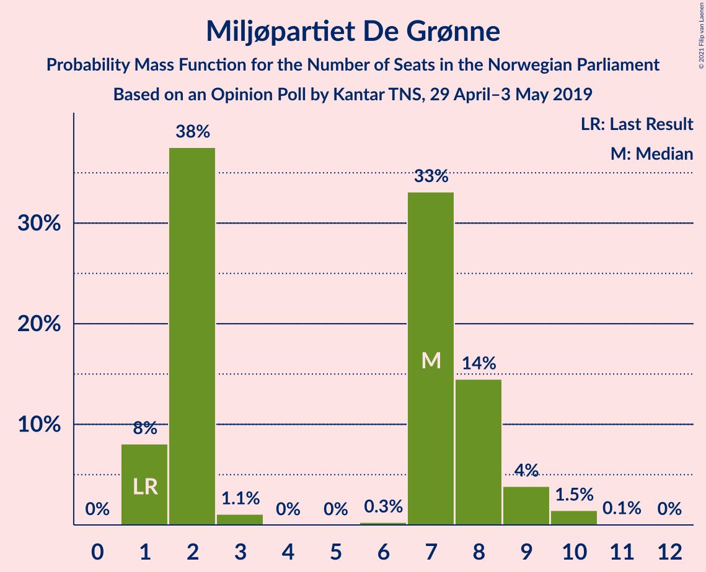

| Number of Seats | Probability | Accumulated | Special Marks |
|:---------------:|:-----------:|:-----------:|:-------------:|
| 1 | 8% | 100% | Last Result |
| 2 | 38% | 92% |  |
| 3 | 1.1% | 54% |  |
| 4 | 0% | 53% |  |
| 5 | 0% | 53% |  |
| 6 | 0.3% | 53% |  |
| 7 | 33% | 53% | Median |
| 8 | 14% | 20% |  |
| 9 | 4% | 5% |  |
| 10 | 1.5% | 2% |  |
| 11 | 0.1% | 0.1% |  |
| 12 | 0% | 0% |  |

### Kristelig Folkeparti

*For a full overview of the results for this party, see the [Kristelig Folkeparti](party-kristeligfolkeparti.html) page.*

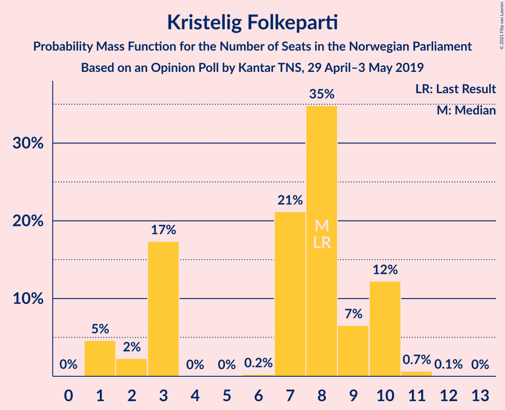

| Number of Seats | Probability | Accumulated | Special Marks |
|:---------------:|:-----------:|:-----------:|:-------------:|
| 1 | 5% | 100% |  |
| 2 | 2% | 95% |  |
| 3 | 17% | 93% |  |
| 4 | 0% | 76% |  |
| 5 | 0% | 76% |  |
| 6 | 0.2% | 76% |  |
| 7 | 21% | 75% |  |
| 8 | 35% | 54% | Last Result, Median |
| 9 | 7% | 19% |  |
| 10 | 12% | 13% |  |
| 11 | 0.7% | 0.7% |  |
| 12 | 0.1% | 0.1% |  |
| 13 | 0% | 0% |  |

## Coalitions

### Confidence Intervals

| Coalition | Last Result | Median | Majority? | 80% Confidence Interval | 90% Confidence Interval | 95% Confidence Interval | 99% Confidence Interval |
|:---------:|:-----------:|:------:|:---------:|:-----------------------:|:-----------------------:|:-----------------------:|:-----------------------:|
| Arbeiderpartiet – Senterpartiet – Sosialistisk Venstreparti – Rødt – Miljøpartiet De Grønne | 81 | 100 | 100% | 96–104 | 94–106 | 91–108 | 90–113 |
| Arbeiderpartiet – Senterpartiet – Sosialistisk Venstreparti – Kristelig Folkeparti – Miljøpartiet De Grønne | 88 | 99 | 99.5% | 91–102 | 90–104 | 89–105 | 85–107 |
| Høyre – Senterpartiet – Fremskrittspartiet – Venstre – Kristelig Folkeparti | 107 | 95 | 99.6% | 92–102 | 90–103 | 87–104 | 85–104 |
| Arbeiderpartiet – Senterpartiet – Sosialistisk Venstreparti – Rødt | 80 | 95 | 99.4% | 91–99 | 89–102 | 86–104 | 84–106 |
| Arbeiderpartiet – Senterpartiet – Sosialistisk Venstreparti – Miljøpartiet De Grønne | 80 | 91 | 96% | 86–95 | 85–97 | 83–99 | 81–103 |
| Arbeiderpartiet – Senterpartiet – Sosialistisk Venstreparti | 79 | 87 | 73% | 82–90 | 80–92 | 79–95 | 76–96 |
| Arbeiderpartiet – Senterpartiet – Kristelig Folkeparti – Miljøpartiet De Grønne | 77 | 86 | 70% | 78–90 | 76–91 | 74–93 | 73–94 |
| Arbeiderpartiet – Senterpartiet – Kristelig Folkeparti | 76 | 83 | 16% | 73–87 | 72–87 | 71–87 | 68–90 |
| Arbeiderpartiet – Senterpartiet | 68 | 75 | 0% | 69–78 | 68–79 | 67–82 | 64–83 |
| Høyre – Fremskrittspartiet – Venstre – Kristelig Folkeparti – Miljøpartiet De Grønne | 89 | 74 | 0.5% | 70–78 | 67–80 | 65–82 | 63–85 |
| Høyre – Fremskrittspartiet – Venstre – Kristelig Folkeparti | 88 | 69 | 0% | 65–73 | 63–75 | 61–78 | 56–79 |
| Høyre – Fremskrittspartiet – Venstre | 80 | 61 | 0% | 58–68 | 57–69 | 56–71 | 54–75 |
| Arbeiderpartiet – Sosialistisk Venstreparti | 60 | 60 | 0% | 55–63 | 54–66 | 53–66 | 51–68 |
| Høyre – Fremskrittspartiet | 72 | 57 | 0% | 53–62 | 52–64 | 51–66 | 48–68 |
| Høyre – Venstre – Kristelig Folkeparti | 61 | 48 | 0% | 45–52 | 43–53 | 41–57 | 38–58 |
| Senterpartiet – Venstre – Kristelig Folkeparti | 35 | 38 | 0% | 33–46 | 31–46 | 29–48 | 27–51 |

### Arbeiderpartiet – Senterpartiet – Sosialistisk Venstreparti – Rødt – Miljøpartiet De Grønne

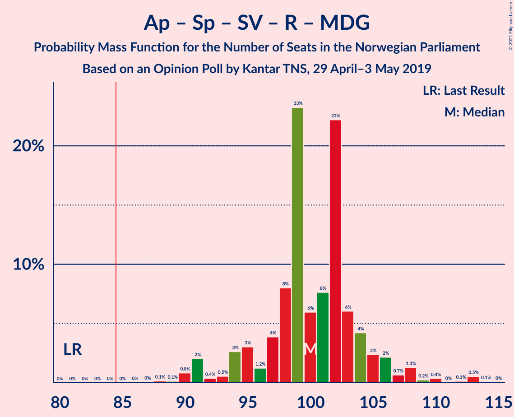

| Number of Seats | Probability | Accumulated | Special Marks |
|:---------------:|:-----------:|:-----------:|:-------------:|
| 81 | 0% | 100% | Last Result |
| 82 | 0% | 100% |  |
| 83 | 0% | 100% |  |
| 84 | 0% | 100% |  |
| 85 | 0% | 100% | Majority |
| 86 | 0% | 100% |  |
| 87 | 0% | 100% |  |
| 88 | 0.1% | 99.9% |  |
| 89 | 0.1% | 99.8% |  |
| 90 | 0.8% | 99.7% |  |
| 91 | 2% | 98.8% |  |
| 92 | 0.4% | 97% |  |
| 93 | 0.5% | 96% |  |
| 94 | 3% | 96% |  |
| 95 | 3% | 93% |  |
| 96 | 1.2% | 90% |  |
| 97 | 4% | 89% |  |
| 98 | 8% | 85% |  |
| 99 | 23% | 77% |  |
| 100 | 6% | 54% | Median |
| 101 | 8% | 48% |  |
| 102 | 22% | 40% |  |
| 103 | 6% | 18% |  |
| 104 | 4% | 12% |  |
| 105 | 2% | 8% |  |
| 106 | 2% | 5% |  |
| 107 | 0.7% | 3% |  |
| 108 | 1.3% | 3% |  |
| 109 | 0.2% | 1.4% |  |
| 110 | 0.4% | 1.2% |  |
| 111 | 0% | 0.8% |  |
| 112 | 0.1% | 0.8% |  |
| 113 | 0.5% | 0.7% |  |
| 114 | 0.1% | 0.1% |  |
| 115 | 0% | 0% |  |

### Arbeiderpartiet – Senterpartiet – Sosialistisk Venstreparti – Kristelig Folkeparti – Miljøpartiet De Grønne

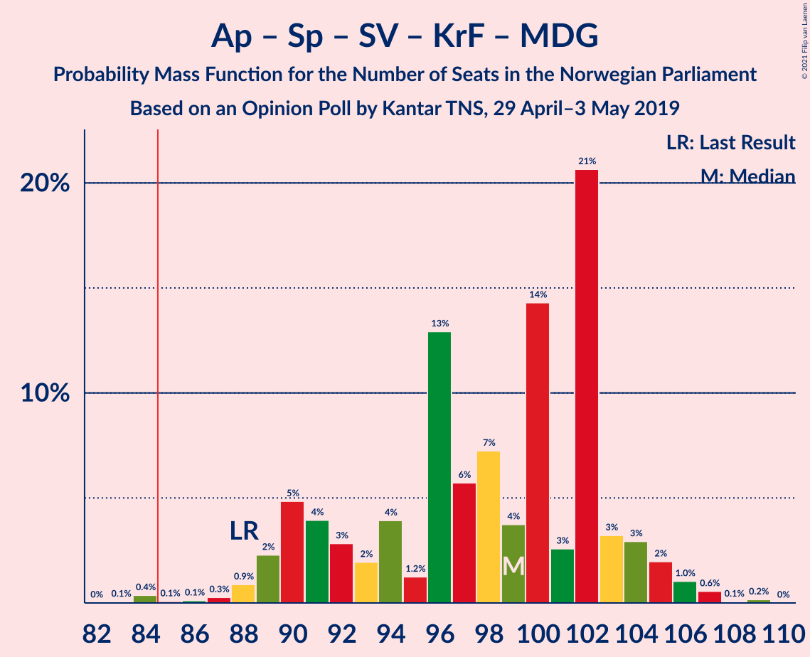

| Number of Seats | Probability | Accumulated | Special Marks |
|:---------------:|:-----------:|:-----------:|:-------------:|
| 83 | 0.1% | 100% |  |
| 84 | 0.4% | 99.9% |  |
| 85 | 0.1% | 99.5% | Majority |
| 86 | 0.1% | 99.5% |  |
| 87 | 0.3% | 99.4% |  |
| 88 | 0.9% | 99.1% | Last Result |
| 89 | 2% | 98% |  |
| 90 | 5% | 96% |  |
| 91 | 4% | 91% |  |
| 92 | 3% | 87% |  |
| 93 | 2% | 84% |  |
| 94 | 4% | 82% |  |
| 95 | 1.2% | 78% |  |
| 96 | 13% | 77% |  |
| 97 | 6% | 64% |  |
| 98 | 7% | 59% |  |
| 99 | 4% | 51% | Median |
| 100 | 14% | 48% |  |
| 101 | 3% | 33% |  |
| 102 | 21% | 31% |  |
| 103 | 3% | 10% |  |
| 104 | 3% | 7% |  |
| 105 | 2% | 4% |  |
| 106 | 1.0% | 2% |  |
| 107 | 0.6% | 0.8% |  |
| 108 | 0.1% | 0.3% |  |
| 109 | 0.2% | 0.2% |  |
| 110 | 0% | 0% |  |

### Høyre – Senterpartiet – Fremskrittspartiet – Venstre – Kristelig Folkeparti

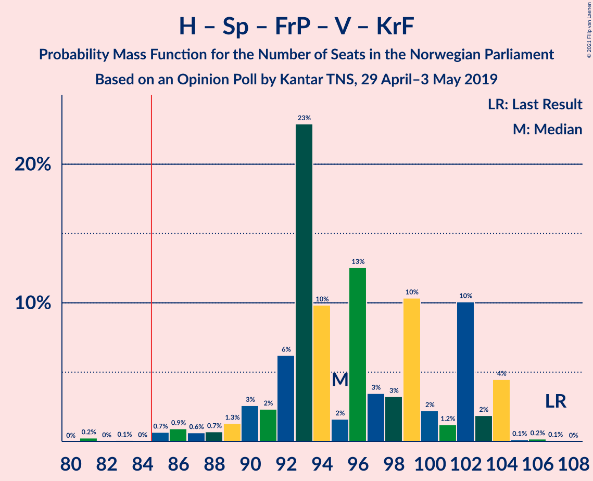

| Number of Seats | Probability | Accumulated | Special Marks |
|:---------------:|:-----------:|:-----------:|:-------------:|
| 81 | 0.2% | 100% |  |
| 82 | 0% | 99.7% |  |
| 83 | 0.1% | 99.7% |  |
| 84 | 0% | 99.6% |  |
| 85 | 0.7% | 99.6% | Majority |
| 86 | 0.9% | 98.9% |  |
| 87 | 0.6% | 98% |  |
| 88 | 0.7% | 97% |  |
| 89 | 1.3% | 97% |  |
| 90 | 3% | 95% |  |
| 91 | 2% | 93% |  |
| 92 | 6% | 90% |  |
| 93 | 23% | 84% | Median |
| 94 | 10% | 61% |  |
| 95 | 2% | 51% |  |
| 96 | 13% | 50% |  |
| 97 | 3% | 37% |  |
| 98 | 3% | 34% |  |
| 99 | 10% | 31% |  |
| 100 | 2% | 20% |  |
| 101 | 1.2% | 18% |  |
| 102 | 10% | 17% |  |
| 103 | 2% | 7% |  |
| 104 | 4% | 5% |  |
| 105 | 0.1% | 0.4% |  |
| 106 | 0.2% | 0.3% |  |
| 107 | 0.1% | 0.1% | Last Result |
| 108 | 0% | 0% |  |

### Arbeiderpartiet – Senterpartiet – Sosialistisk Venstreparti – Rødt

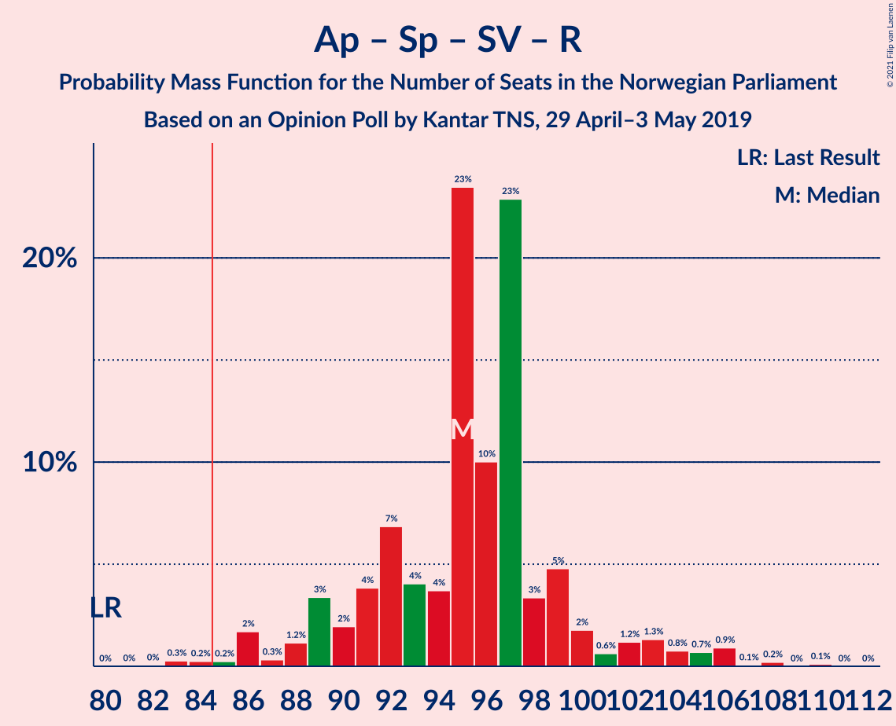

| Number of Seats | Probability | Accumulated | Special Marks |
|:---------------:|:-----------:|:-----------:|:-------------:|
| 80 | 0% | 100% | Last Result |
| 81 | 0% | 100% |  |
| 82 | 0% | 100% |  |
| 83 | 0.3% | 99.9% |  |
| 84 | 0.2% | 99.7% |  |
| 85 | 0.2% | 99.4% | Majority |
| 86 | 2% | 99.2% |  |
| 87 | 0.3% | 97% |  |
| 88 | 1.2% | 97% |  |
| 89 | 3% | 96% |  |
| 90 | 2% | 93% |  |
| 91 | 4% | 91% |  |
| 92 | 7% | 87% |  |
| 93 | 4% | 80% | Median |
| 94 | 4% | 76% |  |
| 95 | 23% | 72% |  |
| 96 | 10% | 49% |  |
| 97 | 23% | 39% |  |
| 98 | 3% | 16% |  |
| 99 | 5% | 12% |  |
| 100 | 2% | 8% |  |
| 101 | 0.6% | 6% |  |
| 102 | 1.2% | 5% |  |
| 103 | 1.3% | 4% |  |
| 104 | 0.8% | 3% |  |
| 105 | 0.7% | 2% |  |
| 106 | 0.9% | 1.3% |  |
| 107 | 0.1% | 0.4% |  |
| 108 | 0.2% | 0.3% |  |
| 109 | 0% | 0.1% |  |
| 110 | 0.1% | 0.1% |  |
| 111 | 0% | 0% |  |

### Arbeiderpartiet – Senterpartiet – Sosialistisk Venstreparti – Miljøpartiet De Grønne

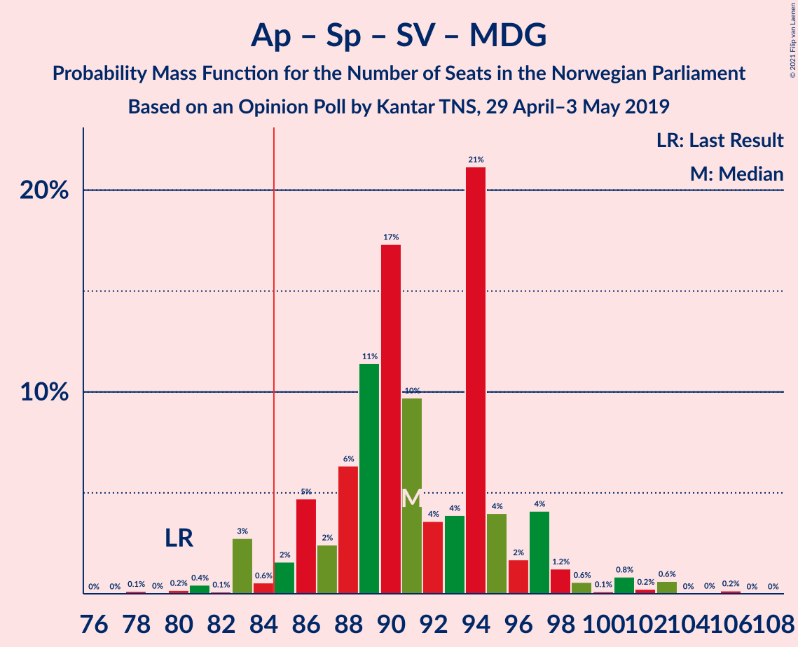

| Number of Seats | Probability | Accumulated | Special Marks |
|:---------------:|:-----------:|:-----------:|:-------------:|
| 78 | 0.1% | 100% |  |
| 79 | 0% | 99.9% |  |
| 80 | 0.2% | 99.8% | Last Result |
| 81 | 0.4% | 99.6% |  |
| 82 | 0.1% | 99.2% |  |
| 83 | 3% | 99.1% |  |
| 84 | 0.6% | 96% |  |
| 85 | 2% | 96% | Majority |
| 86 | 5% | 94% |  |
| 87 | 2% | 90% |  |
| 88 | 6% | 87% |  |
| 89 | 11% | 81% |  |
| 90 | 17% | 69% |  |
| 91 | 10% | 52% | Median |
| 92 | 4% | 42% |  |
| 93 | 4% | 39% |  |
| 94 | 21% | 35% |  |
| 95 | 4% | 14% |  |
| 96 | 2% | 10% |  |
| 97 | 4% | 8% |  |
| 98 | 1.2% | 4% |  |
| 99 | 0.6% | 3% |  |
| 100 | 0.1% | 2% |  |
| 101 | 0.8% | 2% |  |
| 102 | 0.2% | 1.1% |  |
| 103 | 0.6% | 0.8% |  |
| 104 | 0% | 0.2% |  |
| 105 | 0% | 0.2% |  |
| 106 | 0.2% | 0.2% |  |
| 107 | 0% | 0% |  |

### Arbeiderpartiet – Senterpartiet – Sosialistisk Venstreparti

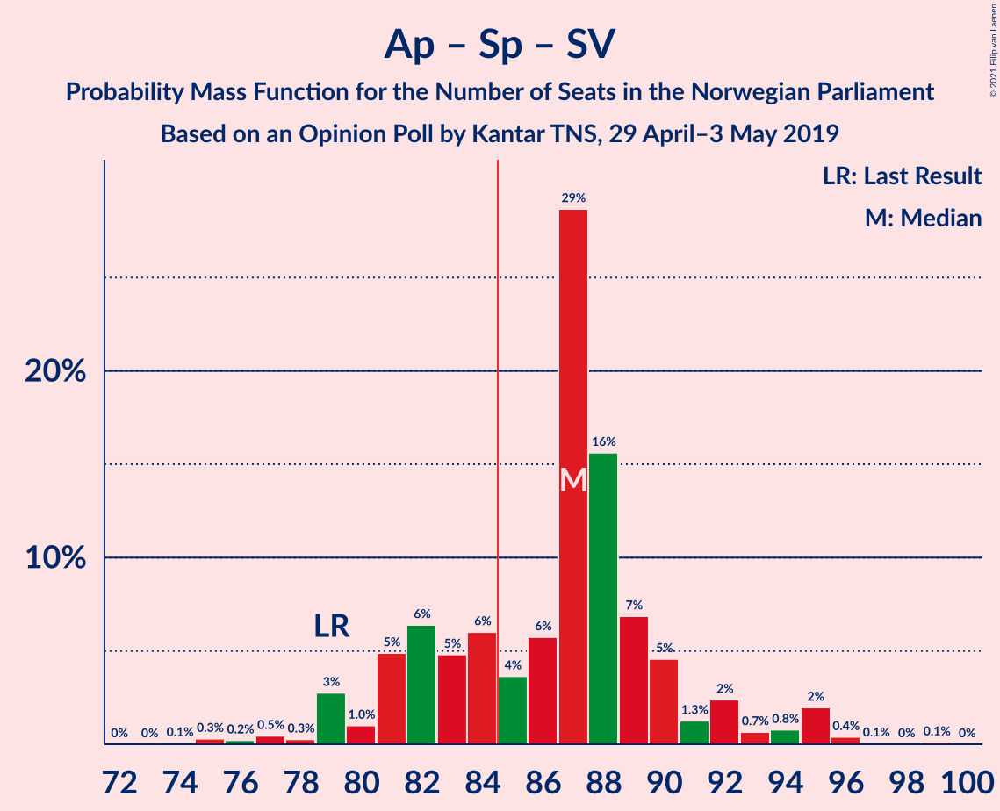

| Number of Seats | Probability | Accumulated | Special Marks |
|:---------------:|:-----------:|:-----------:|:-------------:|
| 74 | 0.1% | 100% |  |
| 75 | 0.3% | 99.9% |  |
| 76 | 0.2% | 99.6% |  |
| 77 | 0.5% | 99.4% |  |
| 78 | 0.3% | 98.9% |  |
| 79 | 3% | 98.7% | Last Result |
| 80 | 1.0% | 96% |  |
| 81 | 5% | 95% |  |
| 82 | 6% | 90% |  |
| 83 | 5% | 84% |  |
| 84 | 6% | 79% | Median |
| 85 | 4% | 73% | Majority |
| 86 | 6% | 69% |  |
| 87 | 29% | 63% |  |
| 88 | 16% | 35% |  |
| 89 | 7% | 19% |  |
| 90 | 5% | 12% |  |
| 91 | 1.3% | 8% |  |
| 92 | 2% | 6% |  |
| 93 | 0.7% | 4% |  |
| 94 | 0.8% | 3% |  |
| 95 | 2% | 3% |  |
| 96 | 0.4% | 0.6% |  |
| 97 | 0.1% | 0.2% |  |
| 98 | 0% | 0.1% |  |
| 99 | 0.1% | 0.1% |  |
| 100 | 0% | 0% |  |

### Arbeiderpartiet – Senterpartiet – Kristelig Folkeparti – Miljøpartiet De Grønne

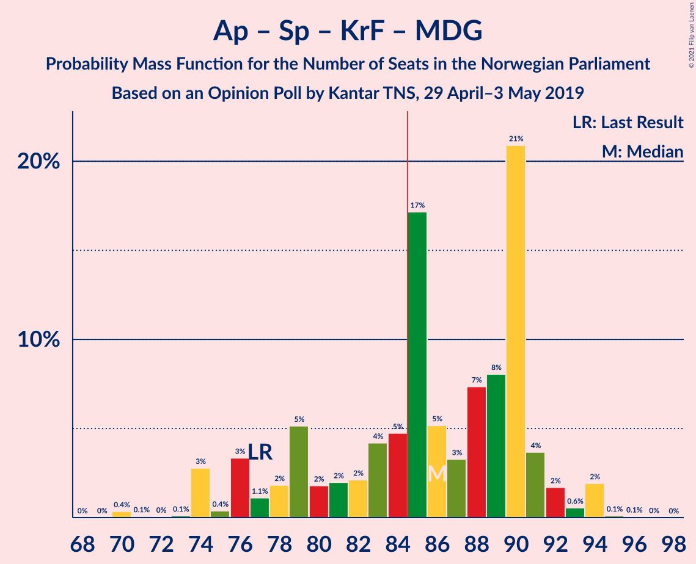

| Number of Seats | Probability | Accumulated | Special Marks |
|:---------------:|:-----------:|:-----------:|:-------------:|
| 70 | 0.4% | 100% |  |
| 71 | 0.1% | 99.6% |  |
| 72 | 0% | 99.6% |  |
| 73 | 0.1% | 99.5% |  |
| 74 | 3% | 99.4% |  |
| 75 | 0.4% | 97% |  |
| 76 | 3% | 96% |  |
| 77 | 1.1% | 93% | Last Result |
| 78 | 2% | 92% |  |
| 79 | 5% | 90% |  |
| 80 | 2% | 85% |  |
| 81 | 2% | 83% |  |
| 82 | 2% | 81% |  |
| 83 | 4% | 79% |  |
| 84 | 5% | 75% |  |
| 85 | 17% | 70% | Majority |
| 86 | 5% | 53% |  |
| 87 | 3% | 48% | Median |
| 88 | 7% | 44% |  |
| 89 | 8% | 37% |  |
| 90 | 21% | 29% |  |
| 91 | 4% | 8% |  |
| 92 | 2% | 4% |  |
| 93 | 0.6% | 3% |  |
| 94 | 2% | 2% |  |
| 95 | 0.1% | 0.2% |  |
| 96 | 0.1% | 0.1% |  |
| 97 | 0% | 0% |  |

### Arbeiderpartiet – Senterpartiet – Kristelig Folkeparti

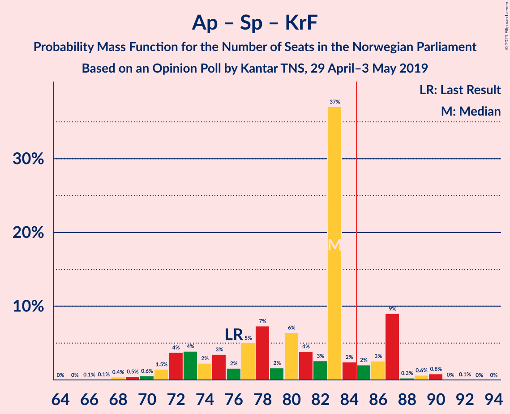

| Number of Seats | Probability | Accumulated | Special Marks |
|:---------------:|:-----------:|:-----------:|:-------------:|
| 66 | 0.1% | 100% |  |
| 67 | 0.1% | 99.9% |  |
| 68 | 0.4% | 99.8% |  |
| 69 | 0.5% | 99.4% |  |
| 70 | 0.6% | 99.0% |  |
| 71 | 1.5% | 98% |  |
| 72 | 4% | 97% |  |
| 73 | 4% | 93% |  |
| 74 | 2% | 89% |  |
| 75 | 3% | 87% |  |
| 76 | 2% | 84% | Last Result |
| 77 | 5% | 82% |  |
| 78 | 7% | 77% |  |
| 79 | 2% | 70% |  |
| 80 | 6% | 68% | Median |
| 81 | 4% | 62% |  |
| 82 | 3% | 58% |  |
| 83 | 37% | 55% |  |
| 84 | 2% | 18% |  |
| 85 | 2% | 16% | Majority |
| 86 | 3% | 13% |  |
| 87 | 9% | 11% |  |
| 88 | 0.3% | 2% |  |
| 89 | 0.6% | 2% |  |
| 90 | 0.8% | 1.0% |  |
| 91 | 0% | 0.1% |  |
| 92 | 0.1% | 0.1% |  |
| 93 | 0% | 0% |  |

### Arbeiderpartiet – Senterpartiet

| Number of Seats | Probability | Accumulated | Special Marks |
|:---------------:|:-----------:|:-----------:|:-------------:|
| 62 | 0% | 100% |  |
| 63 | 0.3% | 99.9% |  |
| 64 | 0.3% | 99.6% |  |
| 65 | 0.7% | 99.4% |  |
| 66 | 0.9% | 98.7% |  |
| 67 | 2% | 98% |  |
| 68 | 2% | 95% | Last Result |
| 69 | 4% | 94% |  |
| 70 | 5% | 90% |  |
| 71 | 7% | 85% |  |
| 72 | 7% | 78% | Median |
| 73 | 13% | 72% |  |
| 74 | 4% | 59% |  |
| 75 | 27% | 55% |  |
| 76 | 10% | 28% |  |
| 77 | 7% | 19% |  |
| 78 | 4% | 11% |  |
| 79 | 3% | 8% |  |
| 80 | 1.3% | 5% |  |
| 81 | 0.5% | 3% |  |
| 82 | 2% | 3% |  |
| 83 | 0.9% | 0.9% |  |
| 84 | 0% | 0% |  |

### Høyre – Fremskrittspartiet – Venstre – Kristelig Folkeparti – Miljøpartiet De Grønne

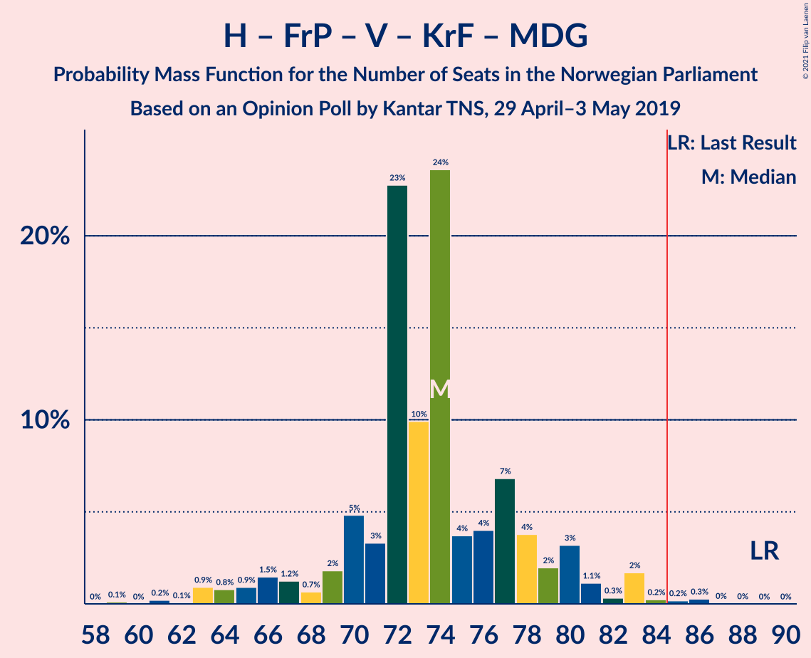

| Number of Seats | Probability | Accumulated | Special Marks |
|:---------------:|:-----------:|:-----------:|:-------------:|
| 59 | 0.1% | 100% |  |
| 60 | 0% | 99.9% |  |
| 61 | 0.2% | 99.9% |  |
| 62 | 0.1% | 99.7% |  |
| 63 | 0.9% | 99.6% |  |
| 64 | 0.8% | 98.7% |  |
| 65 | 0.9% | 98% |  |
| 66 | 1.5% | 97% |  |
| 67 | 1.2% | 96% |  |
| 68 | 0.7% | 94% |  |
| 69 | 2% | 94% |  |
| 70 | 5% | 92% |  |
| 71 | 3% | 87% |  |
| 72 | 23% | 84% |  |
| 73 | 10% | 61% |  |
| 74 | 24% | 51% | Median |
| 75 | 4% | 27% |  |
| 76 | 4% | 24% |  |
| 77 | 7% | 20% |  |
| 78 | 4% | 13% |  |
| 79 | 2% | 9% |  |
| 80 | 3% | 7% |  |
| 81 | 1.1% | 4% |  |
| 82 | 0.3% | 3% |  |
| 83 | 2% | 2% |  |
| 84 | 0.2% | 0.7% |  |
| 85 | 0.2% | 0.5% | Majority |
| 86 | 0.3% | 0.3% |  |
| 87 | 0% | 0.1% |  |
| 88 | 0% | 0% |  |
| 89 | 0% | 0% | Last Result |

### Høyre – Fremskrittspartiet – Venstre – Kristelig Folkeparti

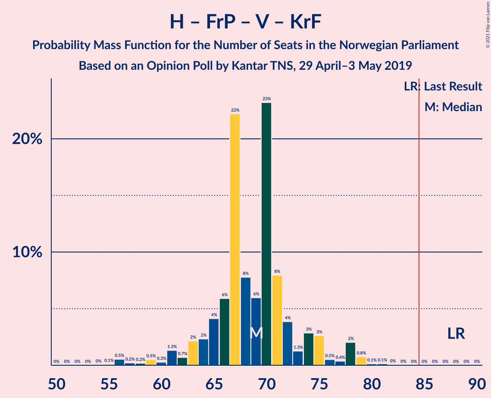

| Number of Seats | Probability | Accumulated | Special Marks |
|:---------------:|:-----------:|:-----------:|:-------------:|
| 55 | 0.1% | 100% |  |
| 56 | 0.5% | 99.9% |  |
| 57 | 0.2% | 99.3% |  |
| 58 | 0.2% | 99.1% |  |
| 59 | 0.5% | 98.9% |  |
| 60 | 0.3% | 98% |  |
| 61 | 1.3% | 98% |  |
| 62 | 0.7% | 97% |  |
| 63 | 2% | 96% |  |
| 64 | 2% | 94% |  |
| 65 | 4% | 92% |  |
| 66 | 6% | 88% |  |
| 67 | 22% | 82% | Median |
| 68 | 8% | 59% |  |
| 69 | 6% | 52% |  |
| 70 | 23% | 46% |  |
| 71 | 8% | 23% |  |
| 72 | 4% | 15% |  |
| 73 | 1.3% | 11% |  |
| 74 | 3% | 9% |  |
| 75 | 3% | 7% |  |
| 76 | 0.5% | 4% |  |
| 77 | 0.4% | 3% |  |
| 78 | 2% | 3% |  |
| 79 | 0.8% | 1.1% |  |
| 80 | 0.1% | 0.3% |  |
| 81 | 0.1% | 0.2% |  |
| 82 | 0% | 0.1% |  |
| 83 | 0% | 0% |  |
| 84 | 0% | 0% |  |
| 85 | 0% | 0% | Majority |
| 86 | 0% | 0% |  |
| 87 | 0% | 0% |  |
| 88 | 0% | 0% | Last Result |

### Høyre – Fremskrittspartiet – Venstre

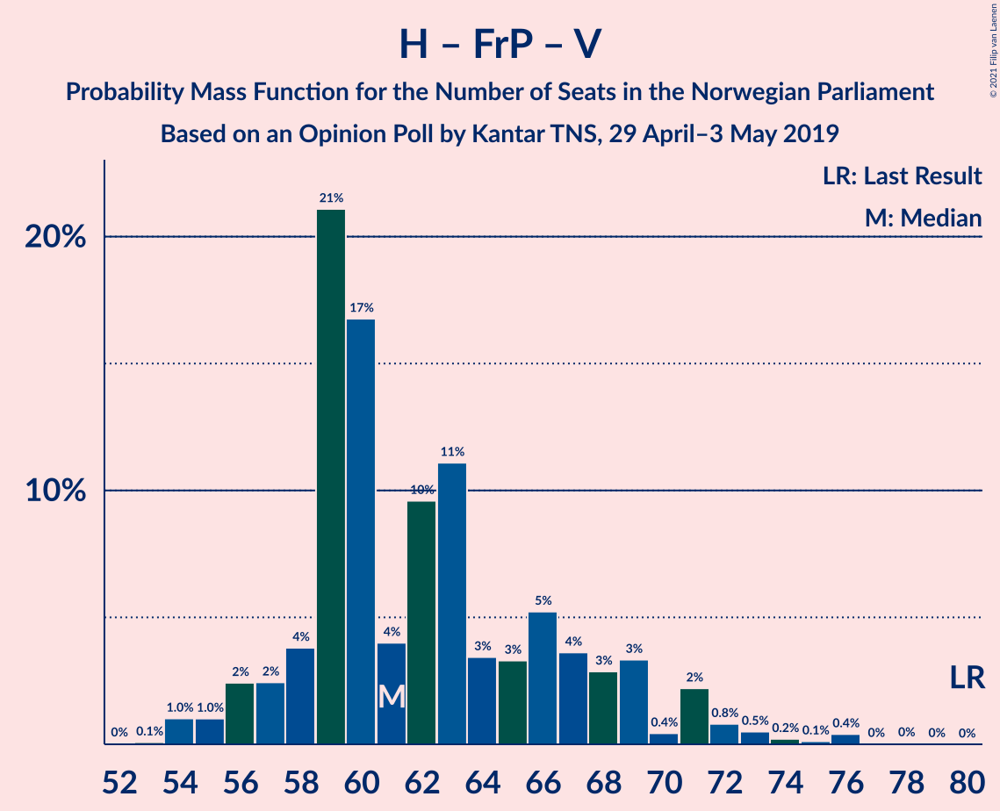

| Number of Seats | Probability | Accumulated | Special Marks |
|:---------------:|:-----------:|:-----------:|:-------------:|
| 52 | 0% | 100% |  |
| 53 | 0.1% | 99.9% |  |
| 54 | 1.0% | 99.8% |  |
| 55 | 1.0% | 98.8% |  |
| 56 | 2% | 98% |  |
| 57 | 2% | 95% |  |
| 58 | 4% | 93% |  |
| 59 | 21% | 89% | Median |
| 60 | 17% | 68% |  |
| 61 | 4% | 51% |  |
| 62 | 10% | 47% |  |
| 63 | 11% | 38% |  |
| 64 | 3% | 27% |  |
| 65 | 3% | 23% |  |
| 66 | 5% | 20% |  |
| 67 | 4% | 15% |  |
| 68 | 3% | 11% |  |
| 69 | 3% | 8% |  |
| 70 | 0.4% | 5% |  |
| 71 | 2% | 4% |  |
| 72 | 0.8% | 2% |  |
| 73 | 0.5% | 1.3% |  |
| 74 | 0.2% | 0.8% |  |
| 75 | 0.1% | 0.6% |  |
| 76 | 0.4% | 0.5% |  |
| 77 | 0% | 0.1% |  |
| 78 | 0% | 0.1% |  |
| 79 | 0% | 0% |  |
| 80 | 0% | 0% | Last Result |

### Arbeiderpartiet – Sosialistisk Venstreparti

| Number of Seats | Probability | Accumulated | Special Marks |
|:---------------:|:-----------:|:-----------:|:-------------:|
| 48 | 0.1% | 100% |  |
| 49 | 0% | 99.9% |  |
| 50 | 0.1% | 99.9% |  |
| 51 | 0.4% | 99.8% |  |
| 52 | 1.3% | 99.4% |  |
| 53 | 0.7% | 98% |  |
| 54 | 3% | 97% |  |
| 55 | 13% | 95% |  |
| 56 | 9% | 82% |  |
| 57 | 4% | 73% |  |
| 58 | 12% | 69% | Median |
| 59 | 7% | 57% |  |
| 60 | 5% | 50% | Last Result |
| 61 | 22% | 45% |  |
| 62 | 11% | 23% |  |
| 63 | 2% | 12% |  |
| 64 | 3% | 10% |  |
| 65 | 2% | 7% |  |
| 66 | 3% | 5% |  |
| 67 | 1.2% | 2% |  |
| 68 | 0.9% | 1.3% |  |
| 69 | 0.1% | 0.4% |  |
| 70 | 0.3% | 0.3% |  |
| 71 | 0% | 0.1% |  |
| 72 | 0% | 0% |  |

### Høyre – Fremskrittspartiet

| Number of Seats | Probability | Accumulated | Special Marks |
|:---------------:|:-----------:|:-----------:|:-------------:|
| 48 | 0.5% | 100% |  |
| 49 | 0.3% | 99.5% |  |
| 50 | 1.1% | 99.2% |  |
| 51 | 2% | 98% |  |
| 52 | 2% | 96% |  |
| 53 | 8% | 94% |  |
| 54 | 5% | 85% |  |
| 55 | 3% | 81% |  |
| 56 | 16% | 77% |  |
| 57 | 22% | 61% | Median |
| 58 | 15% | 39% |  |
| 59 | 5% | 24% |  |
| 60 | 2% | 19% |  |
| 61 | 2% | 17% |  |
| 62 | 5% | 15% |  |
| 63 | 2% | 10% |  |
| 64 | 3% | 7% |  |
| 65 | 1.3% | 5% |  |
| 66 | 1.4% | 3% |  |
| 67 | 1.4% | 2% |  |
| 68 | 0.1% | 0.5% |  |
| 69 | 0.4% | 0.4% |  |
| 70 | 0% | 0% |  |
| 71 | 0% | 0% |  |
| 72 | 0% | 0% | Last Result |

### Høyre – Venstre – Kristelig Folkeparti

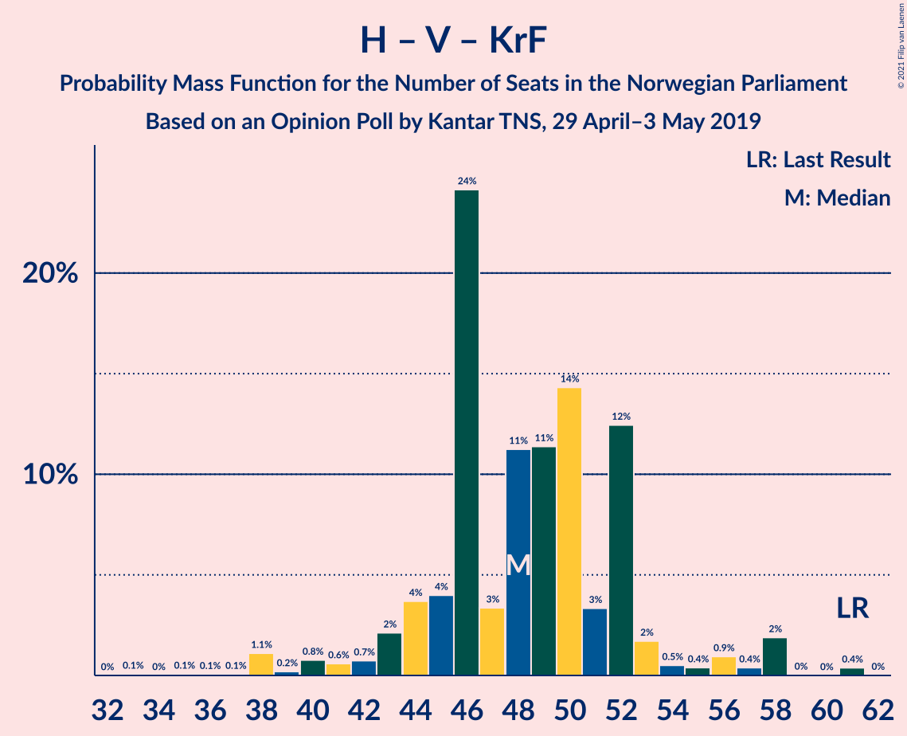

| Number of Seats | Probability | Accumulated | Special Marks |
|:---------------:|:-----------:|:-----------:|:-------------:|
| 33 | 0.1% | 100% |  |
| 34 | 0% | 99.9% |  |
| 35 | 0.1% | 99.9% |  |
| 36 | 0.1% | 99.8% |  |
| 37 | 0.1% | 99.8% |  |
| 38 | 1.1% | 99.7% |  |
| 39 | 0.2% | 98.6% |  |
| 40 | 0.8% | 98% |  |
| 41 | 0.6% | 98% |  |
| 42 | 0.7% | 97% |  |
| 43 | 2% | 96% |  |
| 44 | 4% | 94% |  |
| 45 | 4% | 91% |  |
| 46 | 24% | 87% | Median |
| 47 | 3% | 62% |  |
| 48 | 11% | 59% |  |
| 49 | 11% | 48% |  |
| 50 | 14% | 36% |  |
| 51 | 3% | 22% |  |
| 52 | 12% | 19% |  |
| 53 | 2% | 6% |  |
| 54 | 0.5% | 5% |  |
| 55 | 0.4% | 4% |  |
| 56 | 0.9% | 4% |  |
| 57 | 0.4% | 3% |  |
| 58 | 2% | 2% |  |
| 59 | 0% | 0.4% |  |
| 60 | 0% | 0.4% |  |
| 61 | 0.4% | 0.4% | Last Result |
| 62 | 0% | 0% |  |

### Senterpartiet – Venstre – Kristelig Folkeparti

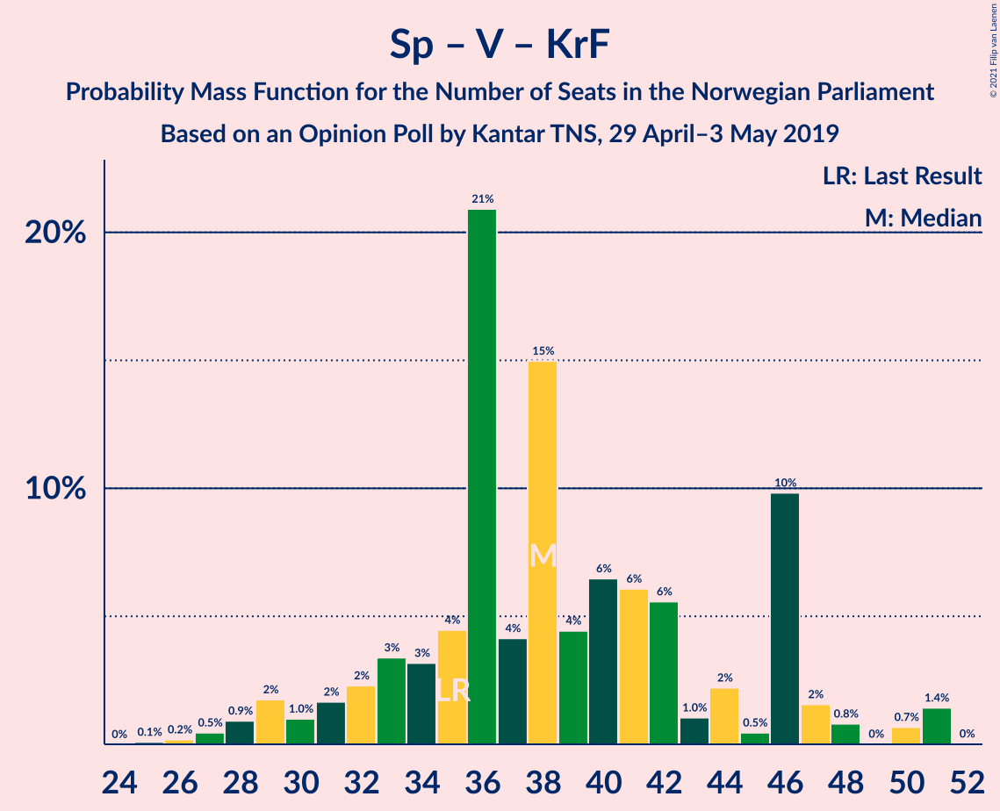

| Number of Seats | Probability | Accumulated | Special Marks |
|:---------------:|:-----------:|:-----------:|:-------------:|
| 25 | 0.1% | 100% |  |
| 26 | 0.2% | 99.9% |  |
| 27 | 0.5% | 99.7% |  |
| 28 | 0.9% | 99.3% |  |
| 29 | 2% | 98% |  |
| 30 | 1.0% | 97% |  |
| 31 | 2% | 96% |  |
| 32 | 2% | 94% |  |
| 33 | 3% | 92% |  |
| 34 | 3% | 88% |  |
| 35 | 4% | 85% | Last Result |
| 36 | 21% | 81% | Median |
| 37 | 4% | 60% |  |
| 38 | 15% | 56% |  |
| 39 | 4% | 41% |  |
| 40 | 6% | 36% |  |
| 41 | 6% | 30% |  |
| 42 | 6% | 24% |  |
| 43 | 1.0% | 18% |  |
| 44 | 2% | 17% |  |
| 45 | 0.5% | 15% |  |
| 46 | 10% | 14% |  |
| 47 | 2% | 5% |  |
| 48 | 0.8% | 3% |  |
| 49 | 0% | 2% |  |
| 50 | 0.7% | 2% |  |
| 51 | 1.4% | 1.5% |  |
| 52 | 0% | 0% |  |

## Technical Information

### Opinion Poll

+ **Polling firm:** Kantar TNS
+ **Commissioner(s):** —
+ **Fieldwork period:** 29 April–3 May 2019

### Calculations

+ **Sample size:** 783
+ **Simulations done:** 131,072
+ **Error estimate:** 0.87%

