# Opinion Poll by Norstat, 30 April–6 May 2019

<a href="#voting-intentions">Voting Intentions</a> | <a href="#seats">Seats</a> | <a href="#coalitions">Coalitions</a> | <a href="#technical-information">Technical Information</a>

## Voting Intentions

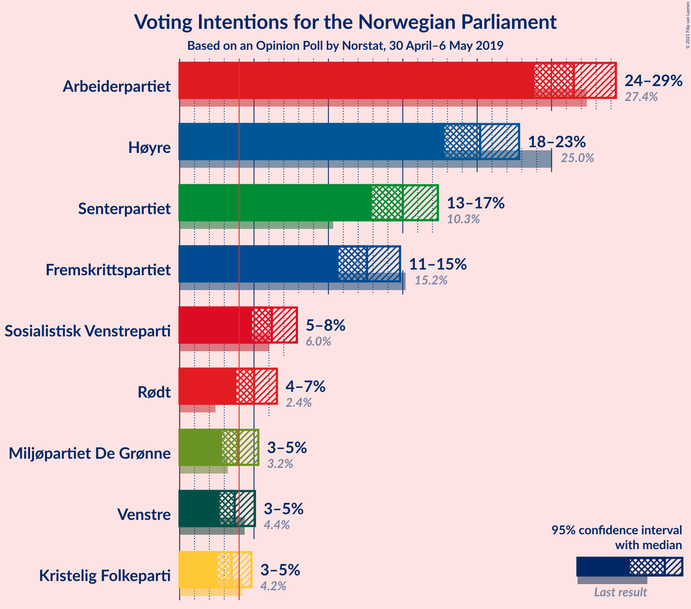

### Confidence Intervals

| Party | Last Result | Poll Result | 80% Confidence Interval | 90% Confidence Interval | 95% Confidence Interval | 99% Confidence Interval |
|:-----:|:-----------:|:-----------:|:-----------------------:|:-----------------------:|:-----------------------:|:-----------------------:|
| Arbeiderpartiet | 27.4% | 26.5% | 24.8–28.3% |24.3–28.9% |23.9–29.3% |23.0–30.2% |
| Høyre | 25.0% | 20.2% | 18.6–21.9% |18.2–22.4% |17.8–22.8% |17.1–23.6% |
| Senterpartiet | 10.3% | 15.0% | 13.6–16.5% |13.2–17.0% |12.9–17.4% |12.3–18.1% |
| Fremskrittspartiet | 15.2% | 12.6% | 11.3–14.0% |11.0–14.4% |10.7–14.8% |10.1–15.5% |
| Sosialistisk Venstreparti | 6.0% | 6.2% | 5.3–7.3% |5.1–7.6% |4.9–7.9% |4.5–8.4% |
| Rødt | 2.4% | 5.0% | 4.2–6.0% |4.0–6.3% |3.8–6.5% |3.5–7.1% |
| Miljøpartiet De Grønne | 3.2% | 3.9% | 3.2–4.8% |3.0–5.1% |2.9–5.3% |2.6–5.8% |
| Venstre | 4.4% | 3.7% | 3.0–4.6% |2.9–4.8% |2.7–5.1% |2.4–5.5% |
| Kristelig Folkeparti | 4.2% | 3.5% | 2.9–4.4% |2.7–4.6% |2.5–4.8% |2.2–5.3% |

*Note:* The poll result column reflects the actual value used in the calculations. Published results may vary slightly, and in addition be rounded to fewer digits.

## Seats

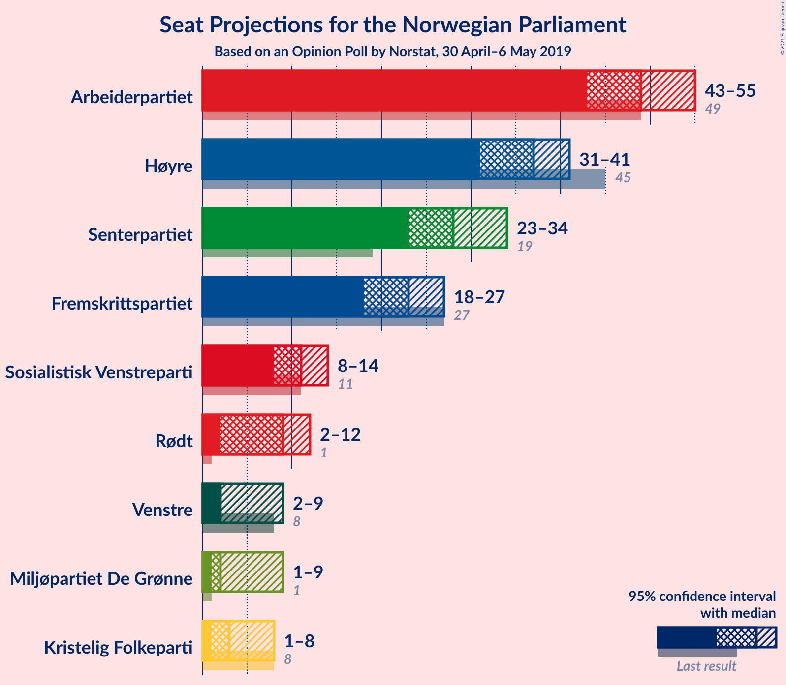

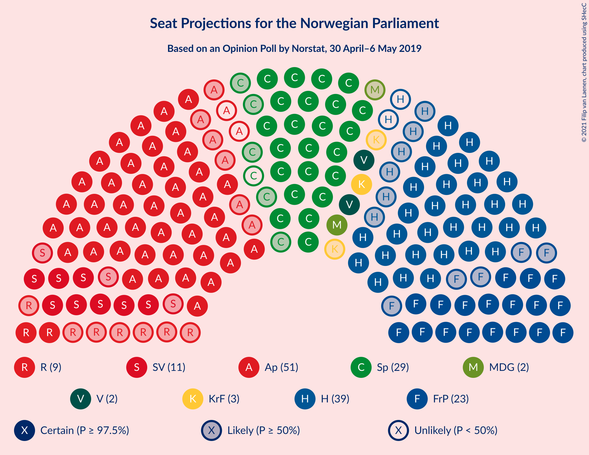

### Confidence Intervals

| Party | Last Result | Median | 80% Confidence Interval | 90% Confidence Interval | 95% Confidence Interval | 99% Confidence Interval |
|:-----:|:-----------:|:------:|:-----------------------:|:-----------------------:|:-----------------------:|:-----------------------:|
| <a href="#arbeiderpartiet">Arbeiderpartiet</a> | 49 | 49 | 45–52 |44–53 |43–55 |42–56 |
| <a href="#høyre">Høyre</a> | 45 | 37 | 33–40 |33–41 |31–41 |30–43 |
| <a href="#senterpartiet">Senterpartiet</a> | 19 | 28 | 25–30 |24–32 |23–34 |21–34 |
| <a href="#fremskrittspartiet">Fremskrittspartiet</a> | 27 | 23 | 20–26 |19–26 |18–27 |17–29 |
| <a href="#sosialistisk-venstreparti">Sosialistisk Venstreparti</a> | 11 | 11 | 9–13 |9–13 |8–14 |7–16 |
| <a href="#rødt">Rødt</a> | 1 | 9 | 7–11 |2–11 |2–12 |2–13 |
| <a href="#miljøpartiet-de-grønne">Miljøpartiet De Grønne</a> | 1 | 2 | 2–8 |1–9 |1–9 |1–10 |
| <a href="#venstre">Venstre</a> | 8 | 2 | 2–8 |2–8 |2–9 |2–10 |
| <a href="#kristelig-folkeparti">Kristelig Folkeparti</a> | 8 | 3 | 1–8 |1–8 |1–8 |1–9 |

### Arbeiderpartiet

*For a full overview of the results for this party, see the [Arbeiderpartiet](party-arbeiderpartiet.html) page.*

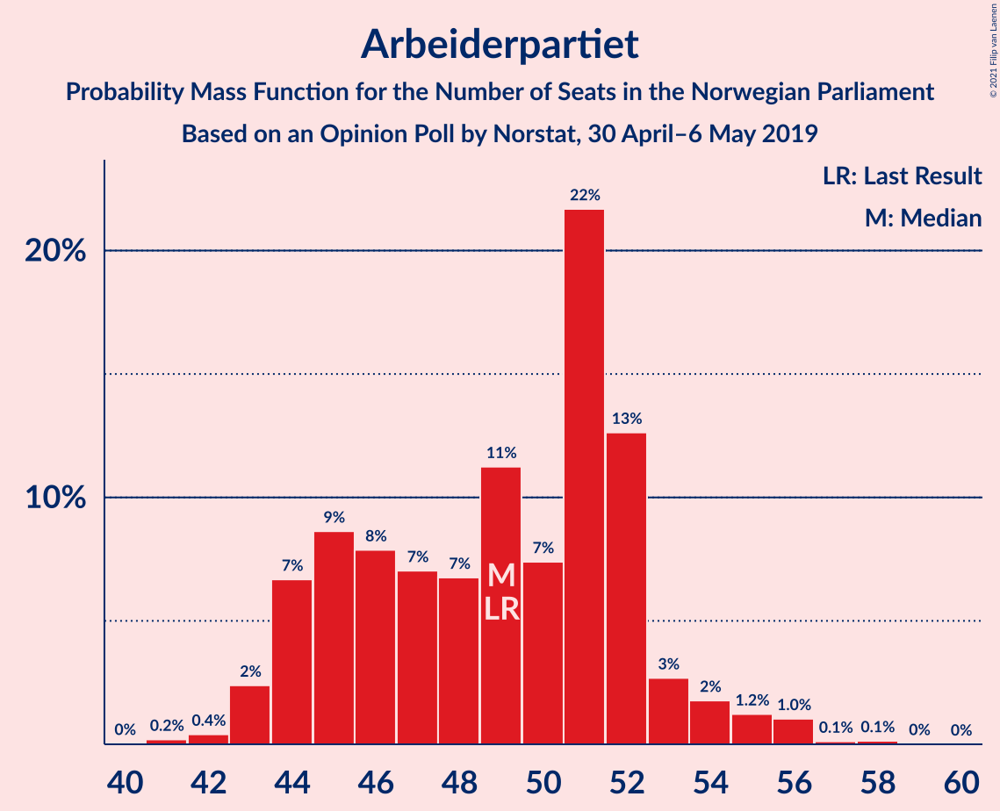

| Number of Seats | Probability | Accumulated | Special Marks |
|:---------------:|:-----------:|:-----------:|:-------------:|
| 41 | 0.2% | 100% |  |
| 42 | 0.4% | 99.8% |  |
| 43 | 2% | 99.4% |  |
| 44 | 7% | 97% |  |
| 45 | 9% | 90% |  |
| 46 | 8% | 82% |  |
| 47 | 7% | 74% |  |
| 48 | 7% | 67% |  |
| 49 | 11% | 60% | Last Result, Median |
| 50 | 7% | 49% |  |
| 51 | 22% | 41% |  |
| 52 | 13% | 20% |  |
| 53 | 3% | 7% |  |
| 54 | 2% | 4% |  |
| 55 | 1.2% | 3% |  |
| 56 | 1.0% | 1.3% |  |
| 57 | 0.1% | 0.3% |  |
| 58 | 0.1% | 0.2% |  |
| 59 | 0% | 0% |  |

### Høyre

*For a full overview of the results for this party, see the [Høyre](party-høyre.html) page.*

| Number of Seats | Probability | Accumulated | Special Marks |
|:---------------:|:-----------:|:-----------:|:-------------:|
| 28 | 0% | 100% |  |
| 29 | 0.1% | 99.9% |  |
| 30 | 0.8% | 99.8% |  |
| 31 | 2% | 99.0% |  |
| 32 | 2% | 97% |  |
| 33 | 10% | 95% |  |
| 34 | 6% | 85% |  |
| 35 | 11% | 79% |  |
| 36 | 13% | 68% |  |
| 37 | 11% | 54% | Median |
| 38 | 10% | 44% |  |
| 39 | 24% | 34% |  |
| 40 | 3% | 10% |  |
| 41 | 5% | 7% |  |
| 42 | 2% | 2% |  |
| 43 | 0.4% | 0.8% |  |
| 44 | 0.3% | 0.4% |  |
| 45 | 0% | 0.1% | Last Result |
| 46 | 0% | 0.1% |  |
| 47 | 0% | 0% |  |

### Senterpartiet

*For a full overview of the results for this party, see the [Senterpartiet](party-senterpartiet.html) page.*

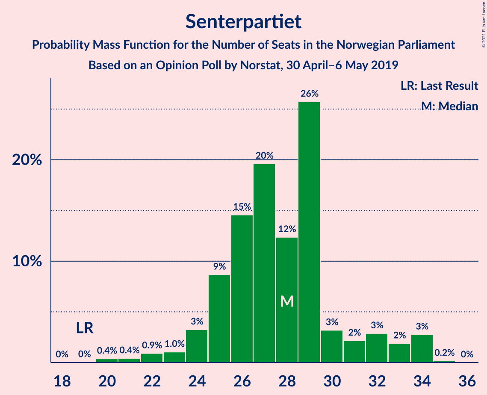

| Number of Seats | Probability | Accumulated | Special Marks |
|:---------------:|:-----------:|:-----------:|:-------------:|
| 19 | 0% | 100% | Last Result |
| 20 | 0.4% | 100% |  |
| 21 | 0.4% | 99.6% |  |
| 22 | 0.9% | 99.2% |  |
| 23 | 1.0% | 98% |  |
| 24 | 3% | 97% |  |
| 25 | 9% | 94% |  |
| 26 | 15% | 85% |  |
| 27 | 20% | 71% |  |
| 28 | 12% | 51% | Median |
| 29 | 26% | 39% |  |
| 30 | 3% | 13% |  |
| 31 | 2% | 10% |  |
| 32 | 3% | 8% |  |
| 33 | 2% | 5% |  |
| 34 | 3% | 3% |  |
| 35 | 0.2% | 0.2% |  |
| 36 | 0% | 0% |  |

### Fremskrittspartiet

*For a full overview of the results for this party, see the [Fremskrittspartiet](party-fremskrittspartiet.html) page.*

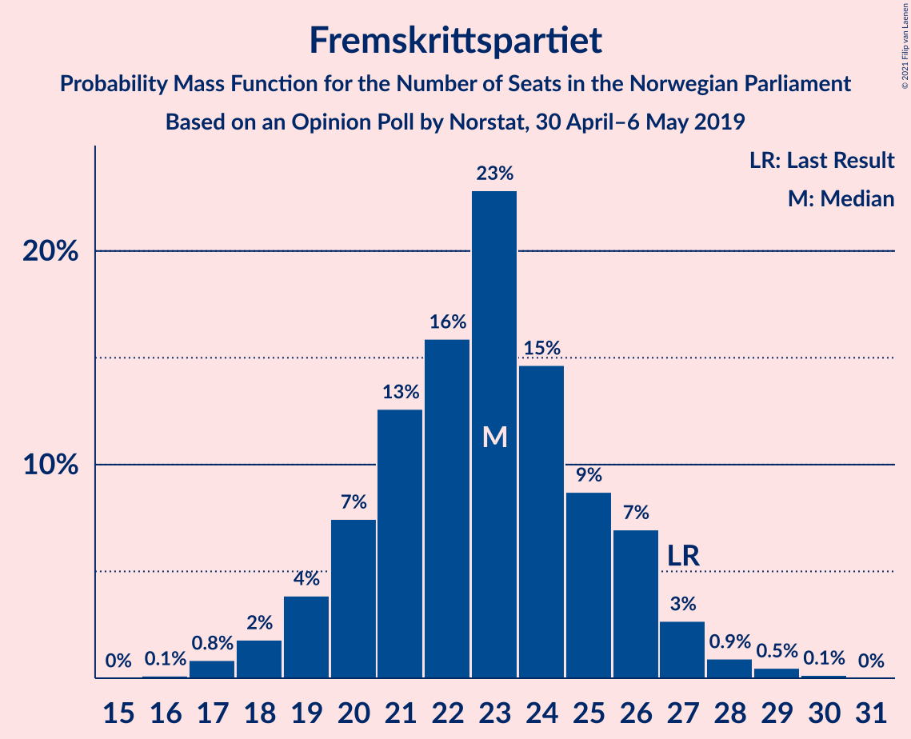

| Number of Seats | Probability | Accumulated | Special Marks |
|:---------------:|:-----------:|:-----------:|:-------------:|
| 16 | 0.1% | 100% |  |
| 17 | 0.8% | 99.9% |  |
| 18 | 2% | 99.0% |  |
| 19 | 4% | 97% |  |
| 20 | 7% | 93% |  |
| 21 | 13% | 86% |  |
| 22 | 16% | 73% |  |
| 23 | 23% | 57% | Median |
| 24 | 15% | 35% |  |
| 25 | 9% | 20% |  |
| 26 | 7% | 11% |  |
| 27 | 3% | 4% | Last Result |
| 28 | 0.9% | 2% |  |
| 29 | 0.5% | 0.6% |  |
| 30 | 0.1% | 0.2% |  |
| 31 | 0% | 0% |  |

### Sosialistisk Venstreparti

*For a full overview of the results for this party, see the [Sosialistisk Venstreparti](party-sosialistiskvenstreparti.html) page.*

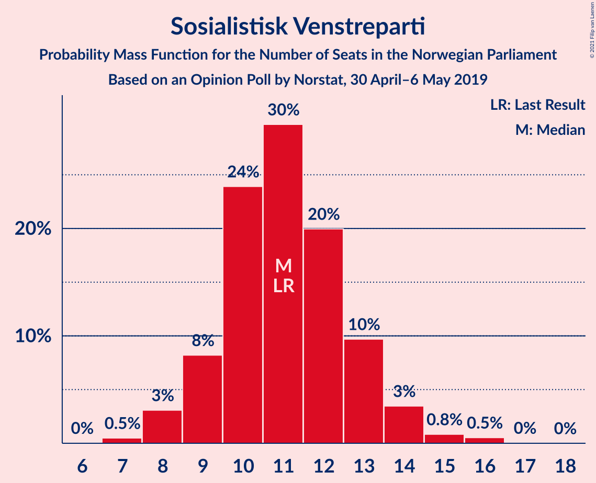

| Number of Seats | Probability | Accumulated | Special Marks |
|:---------------:|:-----------:|:-----------:|:-------------:|
| 6 | 0% | 100% |  |
| 7 | 0.5% | 99.9% |  |
| 8 | 3% | 99.4% |  |
| 9 | 8% | 96% |  |
| 10 | 24% | 88% |  |
| 11 | 30% | 64% | Last Result, Median |
| 12 | 20% | 35% |  |
| 13 | 10% | 15% |  |
| 14 | 3% | 5% |  |
| 15 | 0.8% | 1.4% |  |
| 16 | 0.5% | 0.6% |  |
| 17 | 0% | 0.1% |  |
| 18 | 0% | 0% |  |

### Rødt

*For a full overview of the results for this party, see the [Rødt](party-rødt.html) page.*

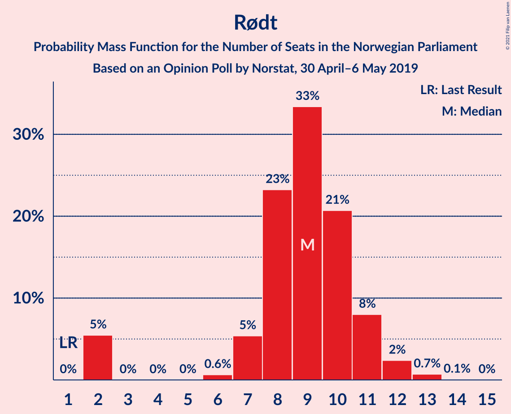

| Number of Seats | Probability | Accumulated | Special Marks |
|:---------------:|:-----------:|:-----------:|:-------------:|
| 1 | 0% | 100% | Last Result |
| 2 | 5% | 100% |  |
| 3 | 0% | 95% |  |
| 4 | 0% | 95% |  |
| 5 | 0% | 95% |  |
| 6 | 0.6% | 95% |  |
| 7 | 5% | 94% |  |
| 8 | 23% | 88% |  |
| 9 | 33% | 65% | Median |
| 10 | 21% | 32% |  |
| 11 | 8% | 11% |  |
| 12 | 2% | 3% |  |
| 13 | 0.7% | 0.8% |  |
| 14 | 0.1% | 0.1% |  |
| 15 | 0% | 0% |  |

### Miljøpartiet De Grønne

*For a full overview of the results for this party, see the [Miljøpartiet De Grønne](party-miljøpartietdegrønne.html) page.*

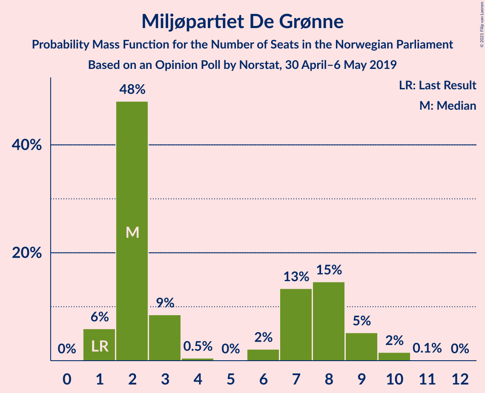

| Number of Seats | Probability | Accumulated | Special Marks |
|:---------------:|:-----------:|:-----------:|:-------------:|
| 1 | 6% | 100% | Last Result |
| 2 | 48% | 94% | Median |
| 3 | 9% | 46% |  |
| 4 | 0.5% | 37% |  |
| 5 | 0% | 37% |  |
| 6 | 2% | 37% |  |
| 7 | 13% | 35% |  |
| 8 | 15% | 22% |  |
| 9 | 5% | 7% |  |
| 10 | 2% | 2% |  |
| 11 | 0.1% | 0.2% |  |
| 12 | 0% | 0% |  |

### Venstre

*For a full overview of the results for this party, see the [Venstre](party-venstre.html) page.*

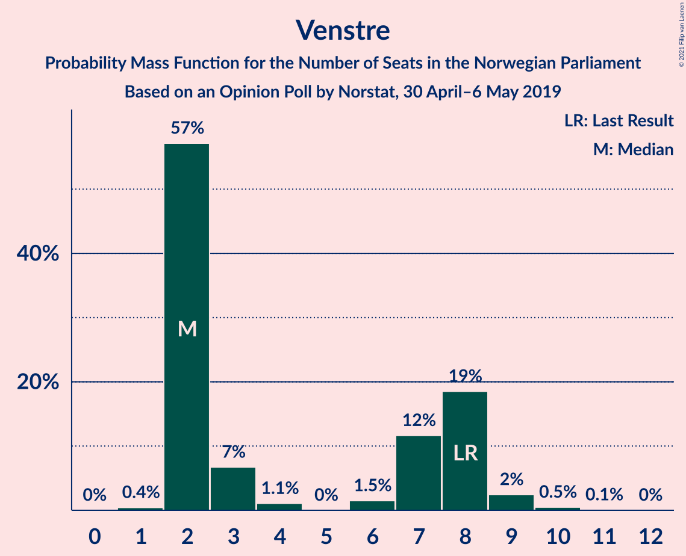

| Number of Seats | Probability | Accumulated | Special Marks |
|:---------------:|:-----------:|:-----------:|:-------------:|
| 1 | 0.4% | 100% |  |
| 2 | 57% | 99.6% | Median |
| 3 | 7% | 42% |  |
| 4 | 1.1% | 36% |  |
| 5 | 0% | 35% |  |
| 6 | 1.5% | 35% |  |
| 7 | 12% | 33% |  |
| 8 | 19% | 22% | Last Result |
| 9 | 2% | 3% |  |
| 10 | 0.5% | 0.6% |  |
| 11 | 0.1% | 0.1% |  |
| 12 | 0% | 0% |  |

### Kristelig Folkeparti

*For a full overview of the results for this party, see the [Kristelig Folkeparti](party-kristeligfolkeparti.html) page.*

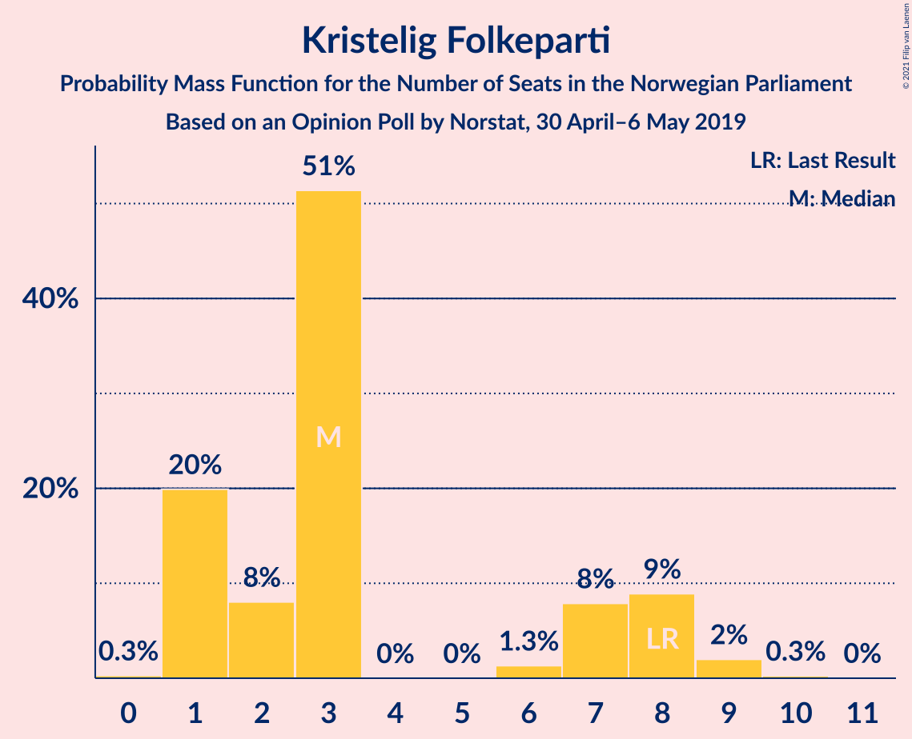

| Number of Seats | Probability | Accumulated | Special Marks |
|:---------------:|:-----------:|:-----------:|:-------------:|
| 0 | 0.3% | 100% |  |
| 1 | 20% | 99.7% |  |
| 2 | 8% | 80% |  |
| 3 | 51% | 72% | Median |
| 4 | 0% | 20% |  |
| 5 | 0% | 20% |  |
| 6 | 1.3% | 20% |  |
| 7 | 8% | 19% |  |
| 8 | 9% | 11% | Last Result |
| 9 | 2% | 2% |  |
| 10 | 0.3% | 0.3% |  |
| 11 | 0% | 0% |  |

## Coalitions

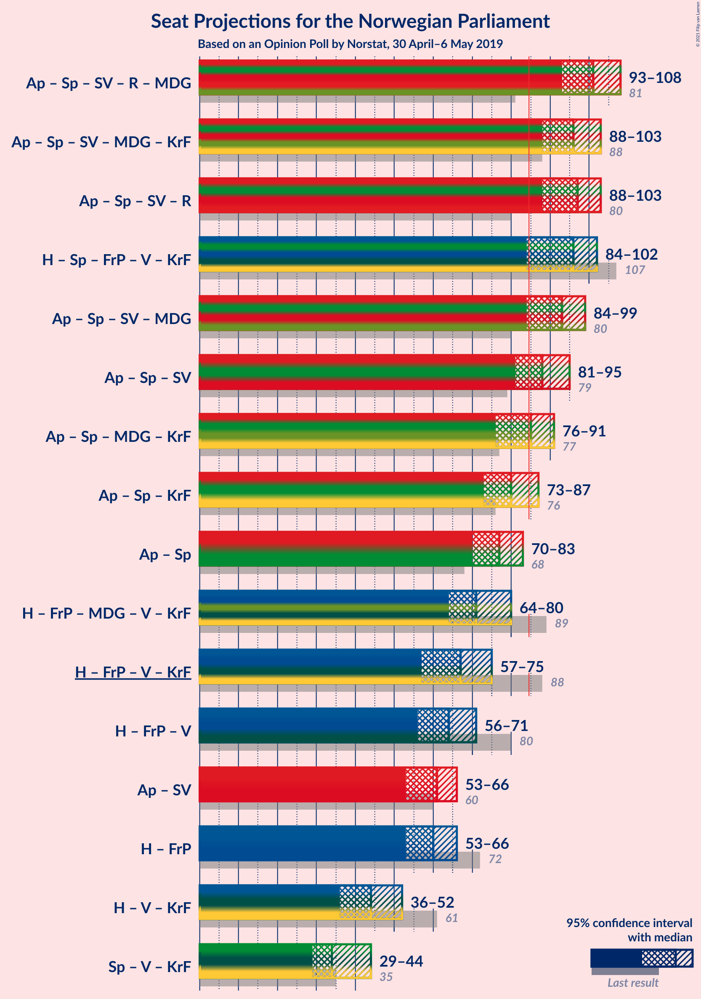

### Confidence Intervals

| Coalition | Last Result | Median | Majority? | 80% Confidence Interval | 90% Confidence Interval | 95% Confidence Interval | 99% Confidence Interval |
|:---------:|:-----------:|:------:|:---------:|:-----------------------:|:-----------------------:|:-----------------------:|:-----------------------:|
| Arbeiderpartiet – Senterpartiet – Sosialistisk Venstreparti – Rødt – Miljøpartiet De Grønne | 81 | 101 | 100% | 95–106 | 94–106 | 93–108 | 90–110 |
| Arbeiderpartiet – Senterpartiet – Sosialistisk Venstreparti – Miljøpartiet De Grønne – Kristelig Folkeparti | 88 | 96 | 99.9% | 90–100 | 88–102 | 88–103 | 86–105 |
| Arbeiderpartiet – Senterpartiet – Sosialistisk Venstreparti – Rødt | 80 | 97 | 99.9% | 91–101 | 89–101 | 88–103 | 86–105 |
| Høyre – Senterpartiet – Fremskrittspartiet – Venstre – Kristelig Folkeparti | 107 | 96 | 97% | 89–100 | 85–102 | 84–102 | 83–104 |
| Arbeiderpartiet – Senterpartiet – Sosialistisk Venstreparti – Miljøpartiet De Grønne | 80 | 93 | 95% | 86–96 | 84–98 | 84–99 | 83–102 |
| Arbeiderpartiet – Senterpartiet – Sosialistisk Venstreparti | 79 | 88 | 78% | 82–91 | 81–93 | 81–95 | 79–96 |
| Arbeiderpartiet – Senterpartiet – Miljøpartiet De Grønne – Kristelig Folkeparti | 77 | 85 | 55% | 79–89 | 77–90 | 76–91 | 74–95 |
| Arbeiderpartiet – Senterpartiet – Kristelig Folkeparti | 76 | 80 | 9% | 75–84 | 74–86 | 73–87 | 71–89 |
| Arbeiderpartiet – Senterpartiet | 68 | 77 | 0.5% | 72–81 | 70–81 | 70–83 | 68–85 |
| Høyre – Fremskrittspartiet – Miljøpartiet De Grønne – Venstre – Kristelig Folkeparti | 89 | 71 | 0.1% | 66–76 | 64–78 | 64–80 | 62–82 |
| Høyre – Fremskrittspartiet – Venstre – Kristelig Folkeparti | 88 | 67 | 0% | 61–72 | 59–74 | 57–75 | 56–77 |
| Høyre – Fremskrittspartiet – Venstre | 80 | 64 | 0% | 59–68 | 57–70 | 56–71 | 53–73 |
| Arbeiderpartiet – Sosialistisk Venstreparti | 60 | 61 | 0% | 55–63 | 54–65 | 53–66 | 52–69 |
| Høyre – Fremskrittspartiet | 72 | 60 | 0% | 55–64 | 54–65 | 53–66 | 50–68 |
| Høyre – Venstre – Kristelig Folkeparti | 61 | 44 | 0% | 39–49 | 37–51 | 36–52 | 35–54 |
| Senterpartiet – Venstre – Kristelig Folkeparti | 35 | 34 | 0% | 31–40 | 30–42 | 29–44 | 25–47 |

### Arbeiderpartiet – Senterpartiet – Sosialistisk Venstreparti – Rødt – Miljøpartiet De Grønne

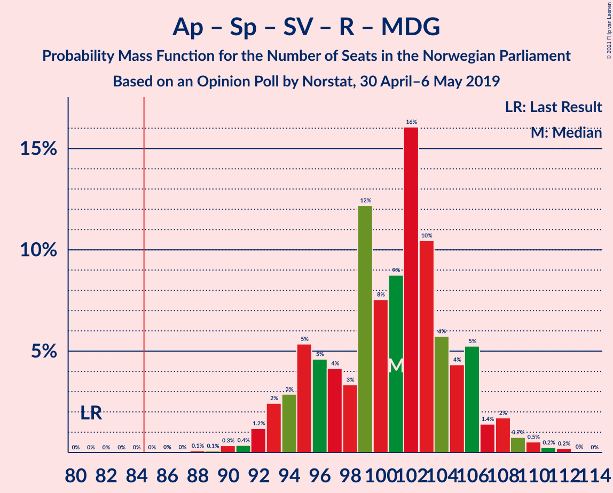

| Number of Seats | Probability | Accumulated | Special Marks |
|:---------------:|:-----------:|:-----------:|:-------------:|
| 81 | 0% | 100% | Last Result |
| 82 | 0% | 100% |  |
| 83 | 0% | 100% |  |
| 84 | 0% | 100% |  |
| 85 | 0% | 100% | Majority |
| 86 | 0% | 100% |  |
| 87 | 0% | 100% |  |
| 88 | 0.1% | 100% |  |
| 89 | 0.1% | 99.9% |  |
| 90 | 0.3% | 99.8% |  |
| 91 | 0.4% | 99.5% |  |
| 92 | 1.2% | 99.1% |  |
| 93 | 2% | 98% |  |
| 94 | 3% | 95% |  |
| 95 | 5% | 93% |  |
| 96 | 5% | 87% |  |
| 97 | 4% | 83% |  |
| 98 | 3% | 79% |  |
| 99 | 12% | 75% | Median |
| 100 | 8% | 63% |  |
| 101 | 9% | 55% |  |
| 102 | 16% | 47% |  |
| 103 | 10% | 31% |  |
| 104 | 6% | 20% |  |
| 105 | 4% | 14% |  |
| 106 | 5% | 10% |  |
| 107 | 1.4% | 5% |  |
| 108 | 2% | 3% |  |
| 109 | 0.7% | 2% |  |
| 110 | 0.5% | 1.0% |  |
| 111 | 0.2% | 0.5% |  |
| 112 | 0.2% | 0.2% |  |
| 113 | 0% | 0% |  |

### Arbeiderpartiet – Senterpartiet – Sosialistisk Venstreparti – Miljøpartiet De Grønne – Kristelig Folkeparti

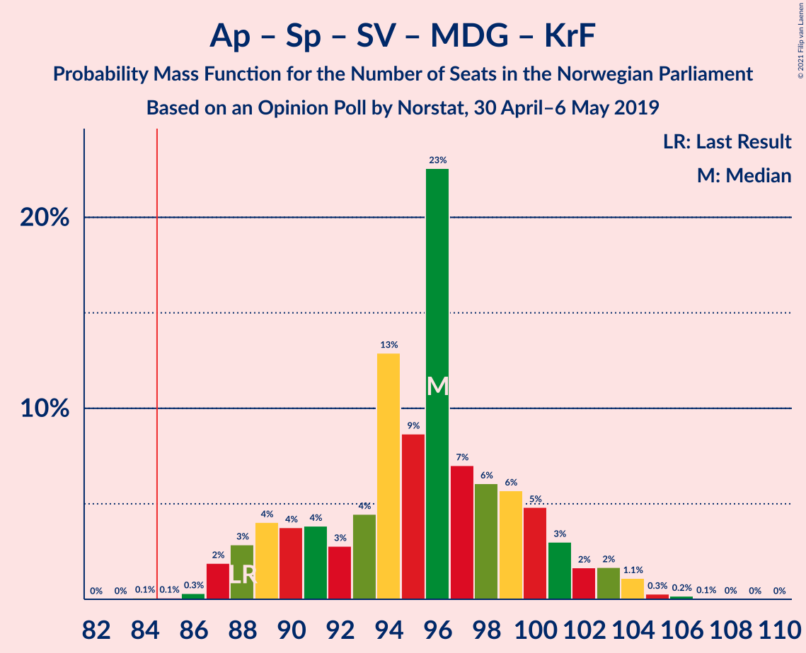

| Number of Seats | Probability | Accumulated | Special Marks |
|:---------------:|:-----------:|:-----------:|:-------------:|
| 84 | 0.1% | 100% |  |
| 85 | 0.1% | 99.9% | Majority |
| 86 | 0.3% | 99.8% |  |
| 87 | 2% | 99.5% |  |
| 88 | 3% | 98% | Last Result |
| 89 | 4% | 95% |  |
| 90 | 4% | 91% |  |
| 91 | 4% | 87% |  |
| 92 | 3% | 83% |  |
| 93 | 4% | 80% | Median |
| 94 | 13% | 76% |  |
| 95 | 9% | 63% |  |
| 96 | 23% | 54% |  |
| 97 | 7% | 32% |  |
| 98 | 6% | 25% |  |
| 99 | 6% | 19% |  |
| 100 | 5% | 13% |  |
| 101 | 3% | 8% |  |
| 102 | 2% | 5% |  |
| 103 | 2% | 3% |  |
| 104 | 1.1% | 2% |  |
| 105 | 0.3% | 0.6% |  |
| 106 | 0.2% | 0.3% |  |
| 107 | 0.1% | 0.1% |  |
| 108 | 0% | 0.1% |  |
| 109 | 0% | 0% |  |

### Arbeiderpartiet – Senterpartiet – Sosialistisk Venstreparti – Rødt

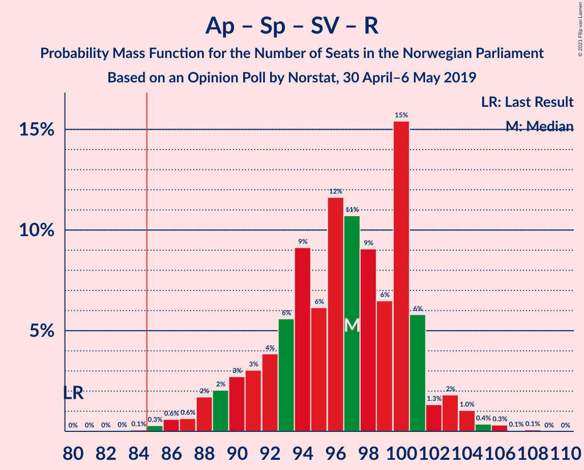

| Number of Seats | Probability | Accumulated | Special Marks |
|:---------------:|:-----------:|:-----------:|:-------------:|
| 80 | 0% | 100% | Last Result |
| 81 | 0% | 100% |  |
| 82 | 0% | 100% |  |
| 83 | 0% | 100% |  |
| 84 | 0.1% | 99.9% |  |
| 85 | 0.3% | 99.9% | Majority |
| 86 | 0.6% | 99.6% |  |
| 87 | 0.6% | 99.0% |  |
| 88 | 2% | 98% |  |
| 89 | 2% | 97% |  |
| 90 | 3% | 95% |  |
| 91 | 3% | 92% |  |
| 92 | 4% | 89% |  |
| 93 | 6% | 85% |  |
| 94 | 9% | 79% |  |
| 95 | 6% | 70% |  |
| 96 | 12% | 64% |  |
| 97 | 11% | 52% | Median |
| 98 | 9% | 42% |  |
| 99 | 6% | 33% |  |
| 100 | 15% | 26% |  |
| 101 | 6% | 11% |  |
| 102 | 1.3% | 5% |  |
| 103 | 2% | 4% |  |
| 104 | 1.0% | 2% |  |
| 105 | 0.4% | 0.8% |  |
| 106 | 0.3% | 0.5% |  |
| 107 | 0.1% | 0.1% |  |
| 108 | 0.1% | 0.1% |  |
| 109 | 0% | 0% |  |

### Høyre – Senterpartiet – Fremskrittspartiet – Venstre – Kristelig Folkeparti

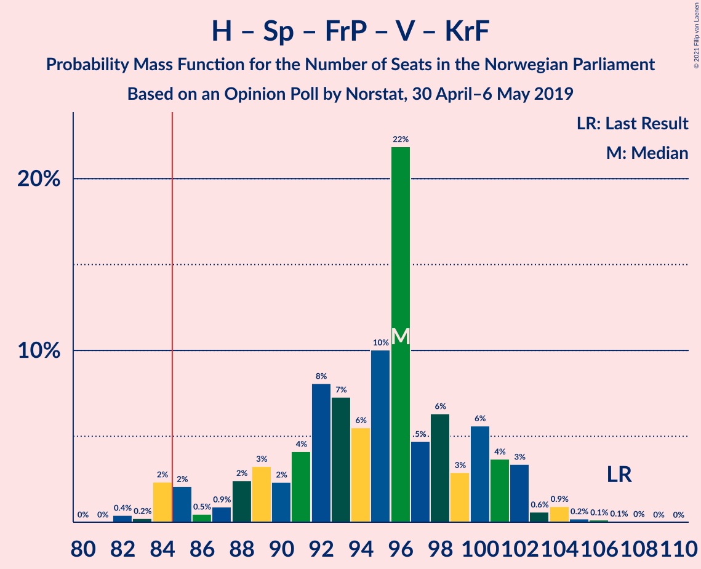

| Number of Seats | Probability | Accumulated | Special Marks |
|:---------------:|:-----------:|:-----------:|:-------------:|
| 82 | 0.4% | 100% |  |
| 83 | 0.2% | 99.6% |  |
| 84 | 2% | 99.3% |  |
| 85 | 2% | 97% | Majority |
| 86 | 0.5% | 95% |  |
| 87 | 0.9% | 94% |  |
| 88 | 2% | 94% |  |
| 89 | 3% | 91% |  |
| 90 | 2% | 88% |  |
| 91 | 4% | 86% |  |
| 92 | 8% | 81% |  |
| 93 | 7% | 73% | Median |
| 94 | 6% | 66% |  |
| 95 | 10% | 61% |  |
| 96 | 22% | 50% |  |
| 97 | 5% | 29% |  |
| 98 | 6% | 24% |  |
| 99 | 3% | 18% |  |
| 100 | 6% | 15% |  |
| 101 | 4% | 9% |  |
| 102 | 3% | 5% |  |
| 103 | 0.6% | 2% |  |
| 104 | 0.9% | 1.4% |  |
| 105 | 0.2% | 0.5% |  |
| 106 | 0.1% | 0.3% |  |
| 107 | 0.1% | 0.1% | Last Result |
| 108 | 0% | 0.1% |  |
| 109 | 0% | 0% |  |

### Arbeiderpartiet – Senterpartiet – Sosialistisk Venstreparti – Miljøpartiet De Grønne

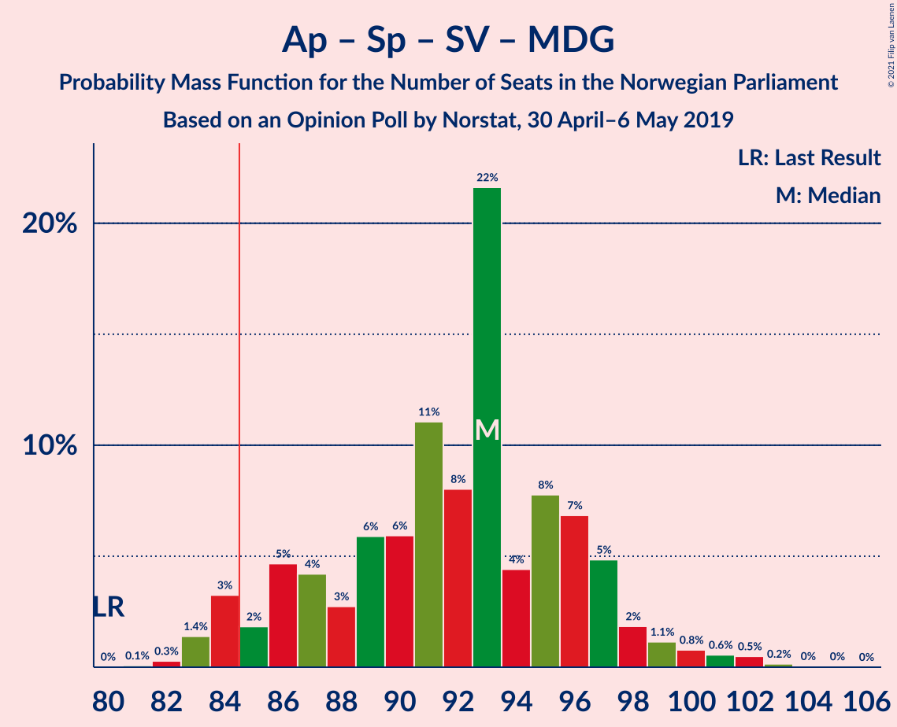

| Number of Seats | Probability | Accumulated | Special Marks |
|:---------------:|:-----------:|:-----------:|:-------------:|
| 80 | 0% | 100% | Last Result |
| 81 | 0.1% | 99.9% |  |
| 82 | 0.3% | 99.9% |  |
| 83 | 1.4% | 99.6% |  |
| 84 | 3% | 98% |  |
| 85 | 2% | 95% | Majority |
| 86 | 5% | 93% |  |
| 87 | 4% | 88% |  |
| 88 | 3% | 84% |  |
| 89 | 6% | 81% |  |
| 90 | 6% | 76% | Median |
| 91 | 11% | 70% |  |
| 92 | 8% | 59% |  |
| 93 | 22% | 51% |  |
| 94 | 4% | 29% |  |
| 95 | 8% | 25% |  |
| 96 | 7% | 17% |  |
| 97 | 5% | 10% |  |
| 98 | 2% | 5% |  |
| 99 | 1.1% | 3% |  |
| 100 | 0.8% | 2% |  |
| 101 | 0.6% | 1.3% |  |
| 102 | 0.5% | 0.7% |  |
| 103 | 0.2% | 0.3% |  |
| 104 | 0% | 0.1% |  |
| 105 | 0% | 0.1% |  |
| 106 | 0% | 0% |  |

### Arbeiderpartiet – Senterpartiet – Sosialistisk Venstreparti

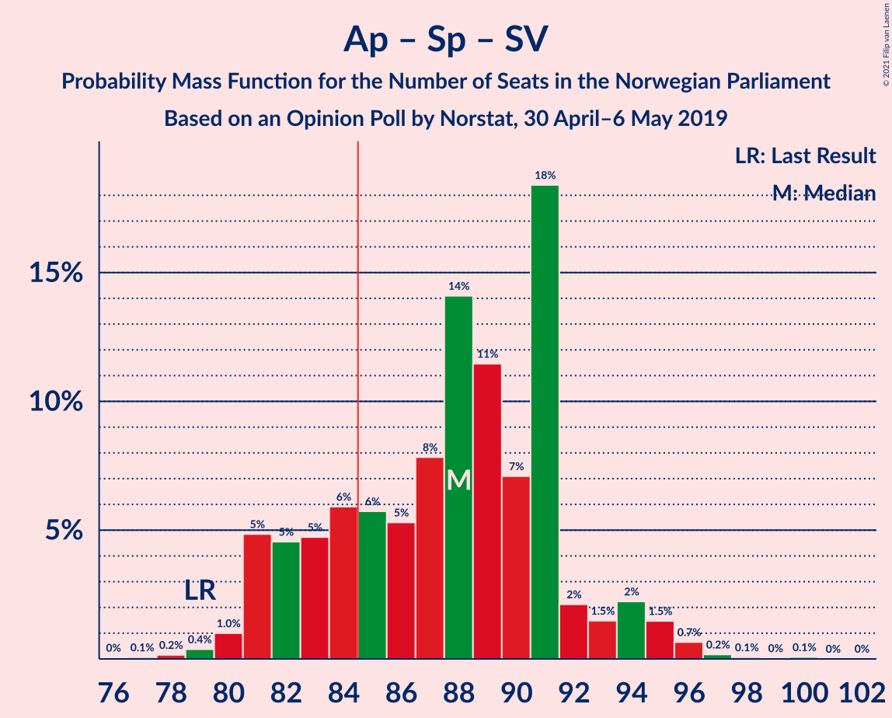

| Number of Seats | Probability | Accumulated | Special Marks |
|:---------------:|:-----------:|:-----------:|:-------------:|
| 76 | 0% | 100% |  |
| 77 | 0.1% | 99.9% |  |
| 78 | 0.2% | 99.9% |  |
| 79 | 0.4% | 99.7% | Last Result |
| 80 | 1.0% | 99.3% |  |
| 81 | 5% | 98% |  |
| 82 | 5% | 93% |  |
| 83 | 5% | 89% |  |
| 84 | 6% | 84% |  |
| 85 | 6% | 78% | Majority |
| 86 | 5% | 73% |  |
| 87 | 8% | 67% |  |
| 88 | 14% | 59% | Median |
| 89 | 11% | 45% |  |
| 90 | 7% | 34% |  |
| 91 | 18% | 27% |  |
| 92 | 2% | 8% |  |
| 93 | 1.5% | 6% |  |
| 94 | 2% | 5% |  |
| 95 | 1.5% | 3% |  |
| 96 | 0.7% | 1.0% |  |
| 97 | 0.2% | 0.4% |  |
| 98 | 0.1% | 0.2% |  |
| 99 | 0% | 0.1% |  |
| 100 | 0.1% | 0.1% |  |
| 101 | 0% | 0% |  |

### Arbeiderpartiet – Senterpartiet – Miljøpartiet De Grønne – Kristelig Folkeparti

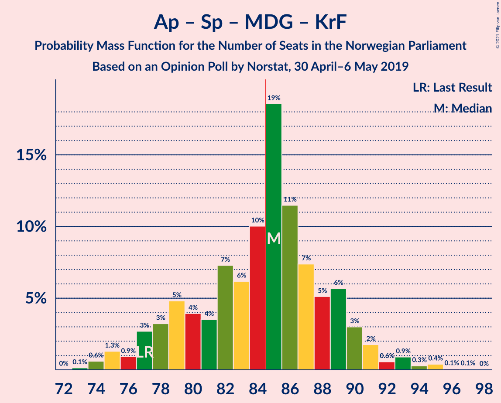

| Number of Seats | Probability | Accumulated | Special Marks |
|:---------------:|:-----------:|:-----------:|:-------------:|
| 73 | 0.1% | 100% |  |
| 74 | 0.6% | 99.8% |  |
| 75 | 1.3% | 99.2% |  |
| 76 | 0.9% | 98% |  |
| 77 | 3% | 97% | Last Result |
| 78 | 3% | 94% |  |
| 79 | 5% | 91% |  |
| 80 | 4% | 86% |  |
| 81 | 4% | 82% |  |
| 82 | 7% | 79% | Median |
| 83 | 6% | 72% |  |
| 84 | 10% | 65% |  |
| 85 | 19% | 55% | Majority |
| 86 | 11% | 37% |  |
| 87 | 7% | 25% |  |
| 88 | 5% | 18% |  |
| 89 | 6% | 13% |  |
| 90 | 3% | 7% |  |
| 91 | 2% | 4% |  |
| 92 | 0.6% | 2% |  |
| 93 | 0.9% | 2% |  |
| 94 | 0.3% | 0.9% |  |
| 95 | 0.4% | 0.6% |  |
| 96 | 0.1% | 0.2% |  |
| 97 | 0.1% | 0.1% |  |
| 98 | 0% | 0% |  |

### Arbeiderpartiet – Senterpartiet – Kristelig Folkeparti

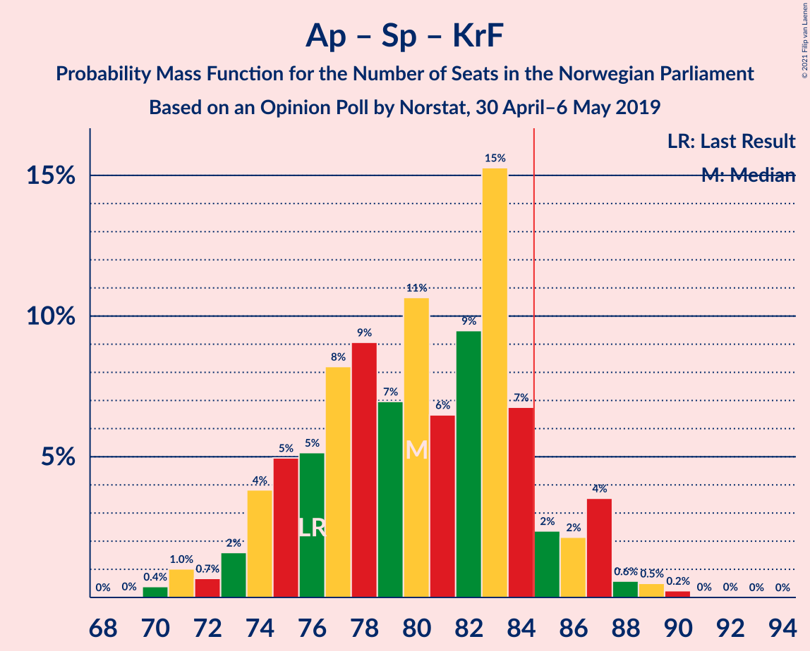

| Number of Seats | Probability | Accumulated | Special Marks |
|:---------------:|:-----------:|:-----------:|:-------------:|
| 69 | 0% | 100% |  |
| 70 | 0.4% | 99.9% |  |
| 71 | 1.0% | 99.5% |  |
| 72 | 0.7% | 98.5% |  |
| 73 | 2% | 98% |  |
| 74 | 4% | 96% |  |
| 75 | 5% | 92% |  |
| 76 | 5% | 87% | Last Result |
| 77 | 8% | 82% |  |
| 78 | 9% | 74% |  |
| 79 | 7% | 65% |  |
| 80 | 11% | 58% | Median |
| 81 | 6% | 47% |  |
| 82 | 9% | 41% |  |
| 83 | 15% | 31% |  |
| 84 | 7% | 16% |  |
| 85 | 2% | 9% | Majority |
| 86 | 2% | 7% |  |
| 87 | 4% | 5% |  |
| 88 | 0.6% | 1.4% |  |
| 89 | 0.5% | 0.8% |  |
| 90 | 0.2% | 0.3% |  |
| 91 | 0% | 0.1% |  |
| 92 | 0% | 0.1% |  |
| 93 | 0% | 0% |  |

### Arbeiderpartiet – Senterpartiet

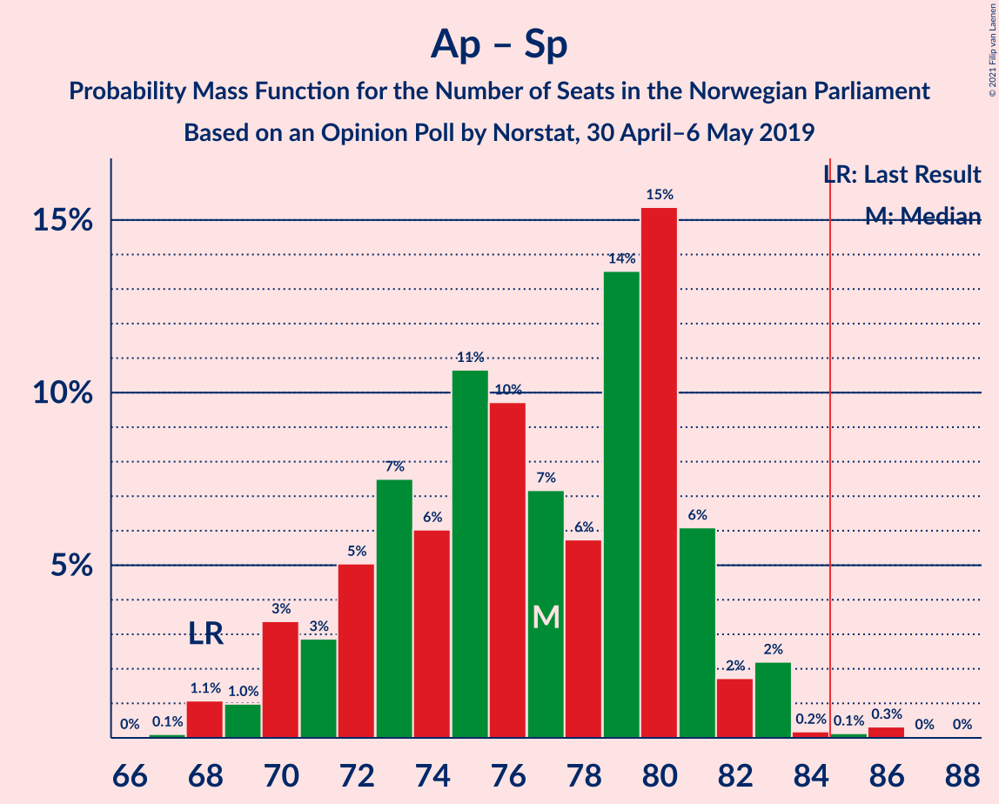

| Number of Seats | Probability | Accumulated | Special Marks |
|:---------------:|:-----------:|:-----------:|:-------------:|
| 66 | 0% | 100% |  |
| 67 | 0.1% | 99.9% |  |
| 68 | 1.1% | 99.8% | Last Result |
| 69 | 1.0% | 98.8% |  |
| 70 | 3% | 98% |  |
| 71 | 3% | 94% |  |
| 72 | 5% | 92% |  |
| 73 | 7% | 86% |  |
| 74 | 6% | 79% |  |
| 75 | 11% | 73% |  |
| 76 | 10% | 62% |  |
| 77 | 7% | 53% | Median |
| 78 | 6% | 45% |  |
| 79 | 14% | 40% |  |
| 80 | 15% | 26% |  |
| 81 | 6% | 11% |  |
| 82 | 2% | 5% |  |
| 83 | 2% | 3% |  |
| 84 | 0.2% | 0.7% |  |
| 85 | 0.1% | 0.5% | Majority |
| 86 | 0.3% | 0.4% |  |
| 87 | 0% | 0.1% |  |
| 88 | 0% | 0% |  |

### Høyre – Fremskrittspartiet – Miljøpartiet De Grønne – Venstre – Kristelig Folkeparti

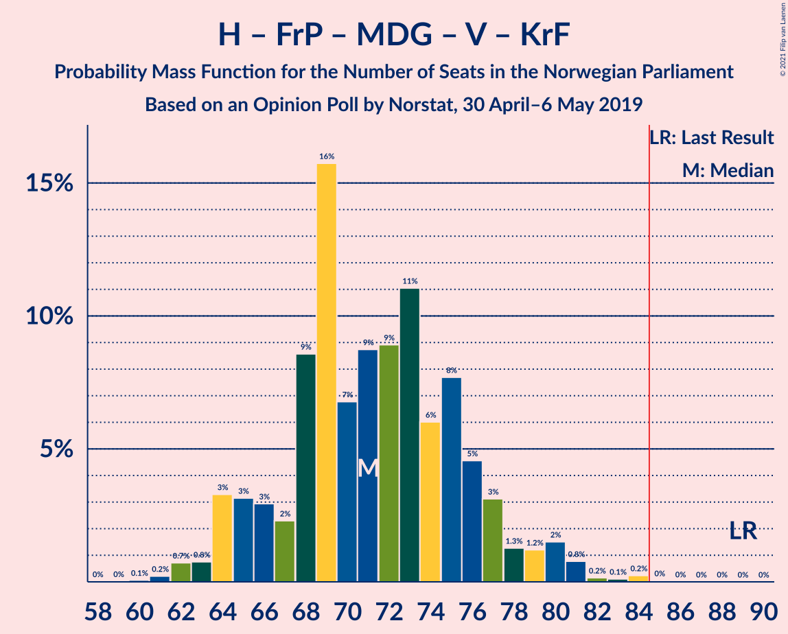

| Number of Seats | Probability | Accumulated | Special Marks |
|:---------------:|:-----------:|:-----------:|:-------------:|
| 59 | 0% | 100% |  |
| 60 | 0.1% | 99.9% |  |
| 61 | 0.2% | 99.9% |  |
| 62 | 0.7% | 99.7% |  |
| 63 | 0.8% | 98.9% |  |
| 64 | 3% | 98% |  |
| 65 | 3% | 95% |  |
| 66 | 3% | 92% |  |
| 67 | 2% | 89% | Median |
| 68 | 9% | 87% |  |
| 69 | 16% | 78% |  |
| 70 | 7% | 62% |  |
| 71 | 9% | 55% |  |
| 72 | 9% | 47% |  |
| 73 | 11% | 38% |  |
| 74 | 6% | 27% |  |
| 75 | 8% | 21% |  |
| 76 | 5% | 13% |  |
| 77 | 3% | 8% |  |
| 78 | 1.3% | 5% |  |
| 79 | 1.2% | 4% |  |
| 80 | 2% | 3% |  |
| 81 | 0.8% | 1.3% |  |
| 82 | 0.2% | 0.6% |  |
| 83 | 0.1% | 0.4% |  |
| 84 | 0.2% | 0.3% |  |
| 85 | 0% | 0.1% | Majority |
| 86 | 0% | 0% |  |
| 87 | 0% | 0% |  |
| 88 | 0% | 0% |  |
| 89 | 0% | 0% | Last Result |

### Høyre – Fremskrittspartiet – Venstre – Kristelig Folkeparti

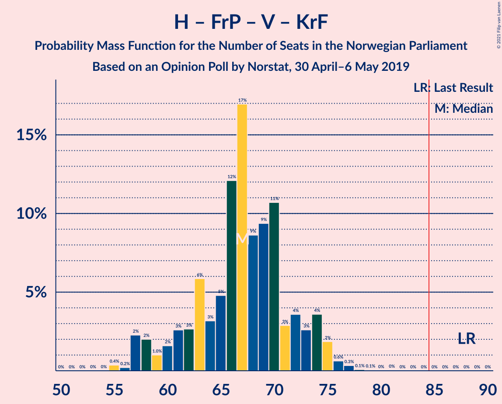

| Number of Seats | Probability | Accumulated | Special Marks |
|:---------------:|:-----------:|:-----------:|:-------------:|
| 55 | 0.4% | 100% |  |
| 56 | 0.2% | 99.6% |  |
| 57 | 2% | 99.4% |  |
| 58 | 2% | 97% |  |
| 59 | 1.0% | 95% |  |
| 60 | 2% | 94% |  |
| 61 | 3% | 93% |  |
| 62 | 3% | 90% |  |
| 63 | 6% | 87% |  |
| 64 | 3% | 81% |  |
| 65 | 5% | 78% | Median |
| 66 | 12% | 73% |  |
| 67 | 17% | 61% |  |
| 68 | 9% | 44% |  |
| 69 | 9% | 36% |  |
| 70 | 11% | 26% |  |
| 71 | 3% | 16% |  |
| 72 | 4% | 13% |  |
| 73 | 3% | 9% |  |
| 74 | 4% | 7% |  |
| 75 | 2% | 3% |  |
| 76 | 0.6% | 1.2% |  |
| 77 | 0.3% | 0.5% |  |
| 78 | 0.1% | 0.2% |  |
| 79 | 0.1% | 0.1% |  |
| 80 | 0% | 0.1% |  |
| 81 | 0% | 0.1% |  |
| 82 | 0% | 0% |  |
| 83 | 0% | 0% |  |
| 84 | 0% | 0% |  |
| 85 | 0% | 0% | Majority |
| 86 | 0% | 0% |  |
| 87 | 0% | 0% |  |
| 88 | 0% | 0% | Last Result |

### Høyre – Fremskrittspartiet – Venstre

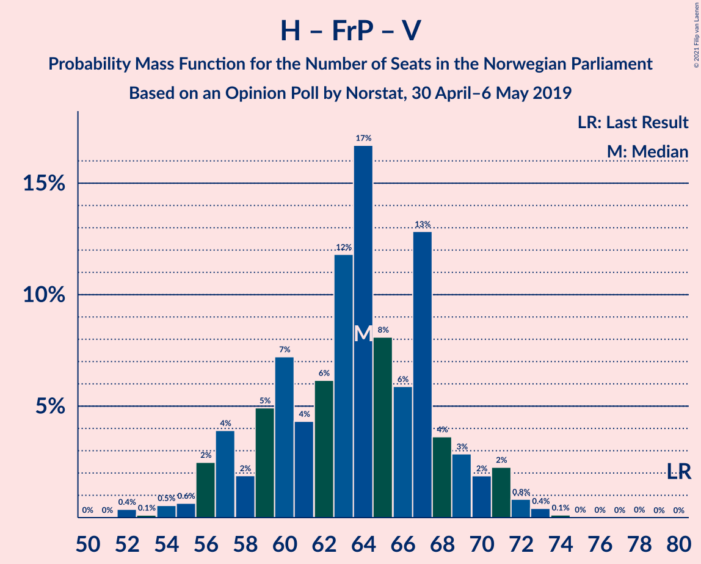

| Number of Seats | Probability | Accumulated | Special Marks |
|:---------------:|:-----------:|:-----------:|:-------------:|
| 52 | 0.4% | 100% |  |
| 53 | 0.1% | 99.6% |  |
| 54 | 0.5% | 99.5% |  |
| 55 | 0.6% | 98.9% |  |
| 56 | 2% | 98% |  |
| 57 | 4% | 96% |  |
| 58 | 2% | 92% |  |
| 59 | 5% | 90% |  |
| 60 | 7% | 85% |  |
| 61 | 4% | 78% |  |
| 62 | 6% | 74% | Median |
| 63 | 12% | 67% |  |
| 64 | 17% | 56% |  |
| 65 | 8% | 39% |  |
| 66 | 6% | 31% |  |
| 67 | 13% | 25% |  |
| 68 | 4% | 12% |  |
| 69 | 3% | 8% |  |
| 70 | 2% | 6% |  |
| 71 | 2% | 4% |  |
| 72 | 0.8% | 1.4% |  |
| 73 | 0.4% | 0.6% |  |
| 74 | 0.1% | 0.2% |  |
| 75 | 0% | 0.1% |  |
| 76 | 0% | 0.1% |  |
| 77 | 0% | 0% |  |
| 78 | 0% | 0% |  |
| 79 | 0% | 0% |  |
| 80 | 0% | 0% | Last Result |

### Arbeiderpartiet – Sosialistisk Venstreparti

| Number of Seats | Probability | Accumulated | Special Marks |
|:---------------:|:-----------:|:-----------:|:-------------:|
| 50 | 0% | 100% |  |
| 51 | 0.4% | 99.9% |  |
| 52 | 0.9% | 99.6% |  |
| 53 | 2% | 98.6% |  |
| 54 | 2% | 96% |  |
| 55 | 6% | 94% |  |
| 56 | 7% | 89% |  |
| 57 | 6% | 81% |  |
| 58 | 8% | 75% |  |
| 59 | 5% | 67% |  |
| 60 | 6% | 61% | Last Result, Median |
| 61 | 10% | 55% |  |
| 62 | 32% | 46% |  |
| 63 | 5% | 14% |  |
| 64 | 3% | 9% |  |
| 65 | 2% | 6% |  |
| 66 | 2% | 4% |  |
| 67 | 0.7% | 2% |  |
| 68 | 0.6% | 1.1% |  |
| 69 | 0.4% | 0.5% |  |
| 70 | 0.1% | 0.1% |  |
| 71 | 0% | 0.1% |  |
| 72 | 0% | 0% |  |

### Høyre – Fremskrittspartiet

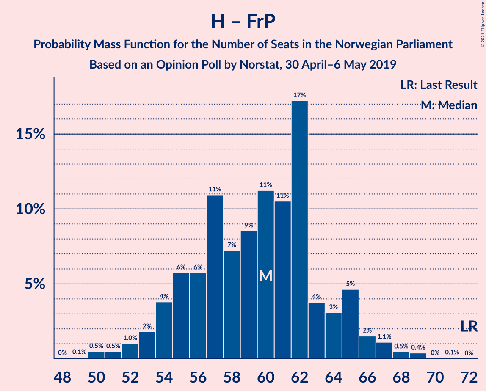

| Number of Seats | Probability | Accumulated | Special Marks |
|:---------------:|:-----------:|:-----------:|:-------------:|
| 49 | 0.1% | 100% |  |
| 50 | 0.5% | 99.9% |  |
| 51 | 0.5% | 99.4% |  |
| 52 | 1.0% | 98.9% |  |
| 53 | 2% | 98% |  |
| 54 | 4% | 96% |  |
| 55 | 6% | 92% |  |
| 56 | 6% | 87% |  |
| 57 | 11% | 81% |  |
| 58 | 7% | 70% |  |
| 59 | 9% | 63% |  |
| 60 | 11% | 54% | Median |
| 61 | 11% | 43% |  |
| 62 | 17% | 32% |  |
| 63 | 4% | 15% |  |
| 64 | 3% | 11% |  |
| 65 | 5% | 8% |  |
| 66 | 2% | 4% |  |
| 67 | 1.1% | 2% |  |
| 68 | 0.5% | 0.9% |  |
| 69 | 0.4% | 0.5% |  |
| 70 | 0% | 0.1% |  |
| 71 | 0.1% | 0.1% |  |
| 72 | 0% | 0% | Last Result |

### Høyre – Venstre – Kristelig Folkeparti

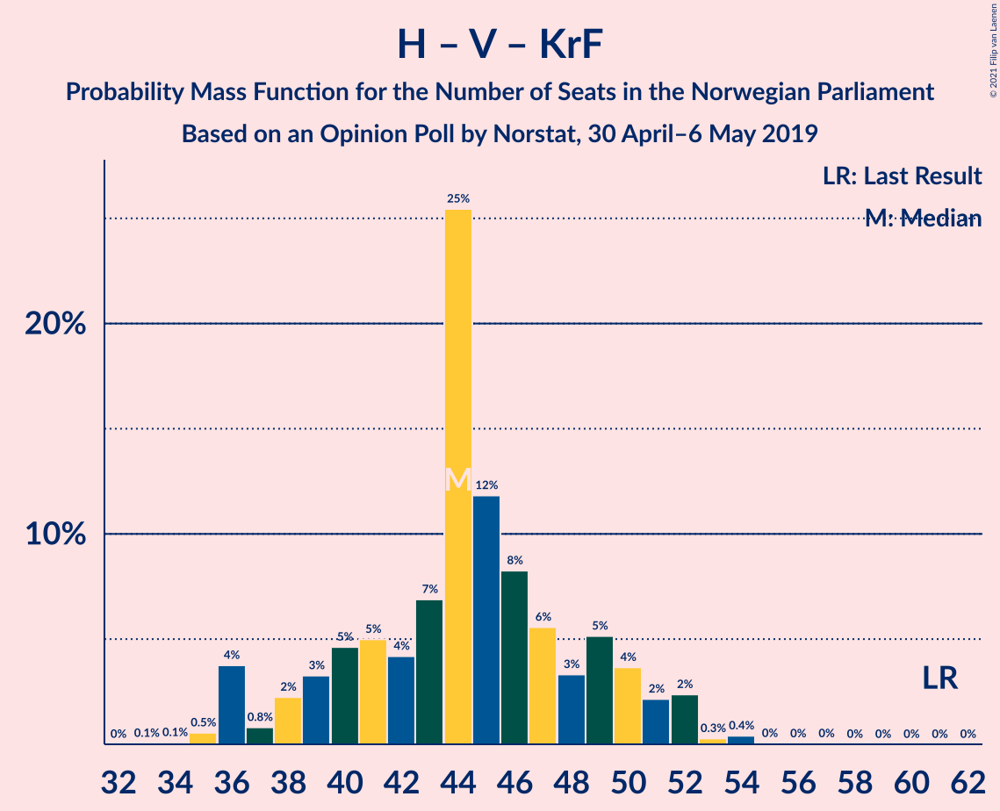

| Number of Seats | Probability | Accumulated | Special Marks |
|:---------------:|:-----------:|:-----------:|:-------------:|
| 33 | 0.1% | 100% |  |
| 34 | 0.1% | 99.9% |  |
| 35 | 0.5% | 99.9% |  |
| 36 | 4% | 99.3% |  |
| 37 | 0.8% | 96% |  |
| 38 | 2% | 95% |  |
| 39 | 3% | 93% |  |
| 40 | 5% | 89% |  |
| 41 | 5% | 85% |  |
| 42 | 4% | 80% | Median |
| 43 | 7% | 75% |  |
| 44 | 25% | 69% |  |
| 45 | 12% | 43% |  |
| 46 | 8% | 31% |  |
| 47 | 6% | 23% |  |
| 48 | 3% | 17% |  |
| 49 | 5% | 14% |  |
| 50 | 4% | 9% |  |
| 51 | 2% | 5% |  |
| 52 | 2% | 3% |  |
| 53 | 0.3% | 0.8% |  |
| 54 | 0.4% | 0.5% |  |
| 55 | 0% | 0.1% |  |
| 56 | 0% | 0.1% |  |
| 57 | 0% | 0% |  |
| 58 | 0% | 0% |  |
| 59 | 0% | 0% |  |
| 60 | 0% | 0% |  |
| 61 | 0% | 0% | Last Result |

### Senterpartiet – Venstre – Kristelig Folkeparti

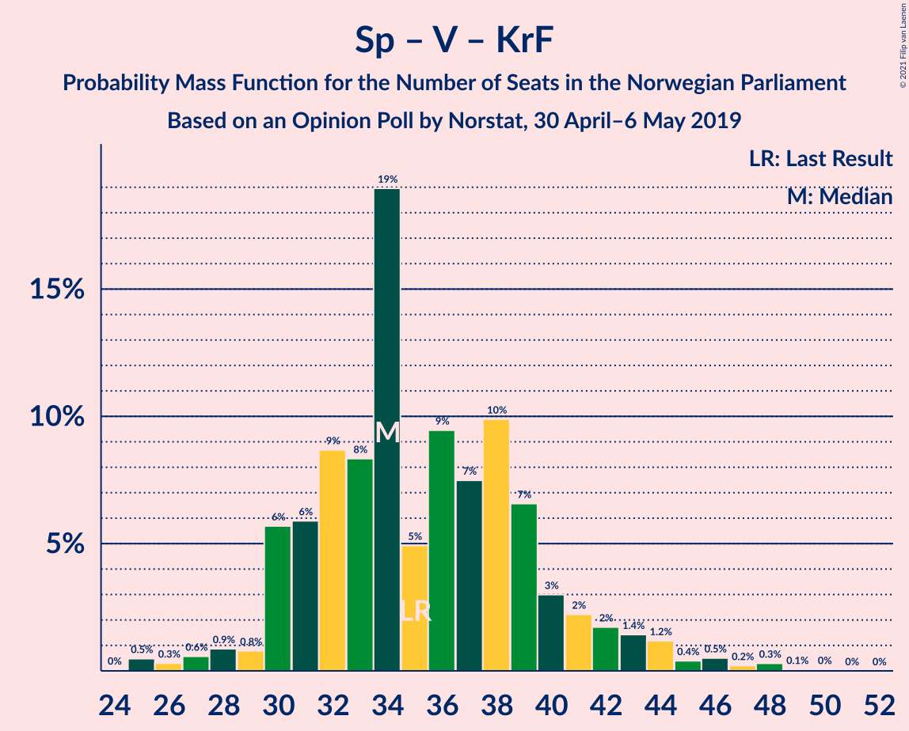

| Number of Seats | Probability | Accumulated | Special Marks |
|:---------------:|:-----------:|:-----------:|:-------------:|
| 25 | 0.5% | 100% |  |
| 26 | 0.3% | 99.5% |  |
| 27 | 0.6% | 99.2% |  |
| 28 | 0.9% | 98.6% |  |
| 29 | 0.8% | 98% |  |
| 30 | 6% | 97% |  |
| 31 | 6% | 91% |  |
| 32 | 9% | 85% |  |
| 33 | 8% | 77% | Median |
| 34 | 19% | 68% |  |
| 35 | 5% | 49% | Last Result |
| 36 | 9% | 44% |  |
| 37 | 7% | 35% |  |
| 38 | 10% | 28% |  |
| 39 | 7% | 18% |  |
| 40 | 3% | 11% |  |
| 41 | 2% | 8% |  |
| 42 | 2% | 6% |  |
| 43 | 1.4% | 4% |  |
| 44 | 1.2% | 3% |  |
| 45 | 0.4% | 2% |  |
| 46 | 0.5% | 1.1% |  |
| 47 | 0.2% | 0.6% |  |
| 48 | 0.3% | 0.4% |  |
| 49 | 0.1% | 0.1% |  |
| 50 | 0% | 0.1% |  |
| 51 | 0% | 0% |  |

## Technical Information

### Opinion Poll

+ **Polling firm:** Norstat
+ **Commissioner(s):** —
+ **Fieldwork period:** 30 April–6 May 2019

### Calculations

+ **Sample size:** 1000
+ **Simulations done:** 1,048,576
+ **Error estimate:** 1.59%

