# Opinion Poll by Norfakta, 7–8 May 2019

<a href="#voting-intentions">Voting Intentions</a> | <a href="#seats">Seats</a> | <a href="#coalitions">Coalitions</a> | <a href="#technical-information">Technical Information</a>

## Voting Intentions

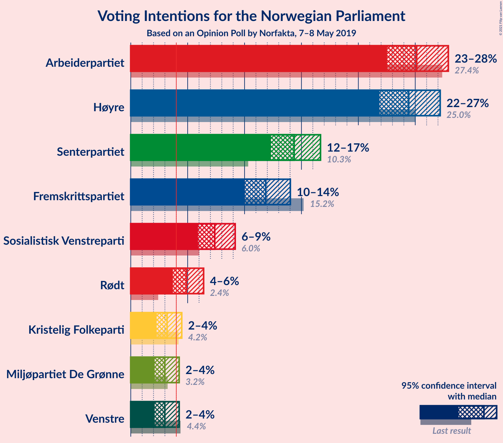

### Confidence Intervals

| Party | Last Result | Poll Result | 80% Confidence Interval | 90% Confidence Interval | 95% Confidence Interval | 99% Confidence Interval |
|:-----:|:-----------:|:-----------:|:-----------------------:|:-----------------------:|:-----------------------:|:-----------------------:|
| Arbeiderpartiet | 27.4% | 25.1% | 23.4–26.9% |22.9–27.5% |22.5–27.9% |21.7–28.8% |
| Høyre | 25.0% | 24.4% | 22.7–26.2% |22.3–26.7% |21.9–27.2% |21.1–28.1% |
| Senterpartiet | 10.3% | 14.4% | 13.0–15.9% |12.6–16.3% |12.3–16.7% |11.7–17.4% |
| Fremskrittspartiet | 15.2% | 11.9% | 10.6–13.3% |10.3–13.7% |10.0–14.0% |9.4–14.7% |
| Sosialistisk Venstreparti | 6.0% | 7.4% | 6.4–8.6% |6.1–8.9% |5.9–9.2% |5.5–9.8% |
| Rødt | 2.4% | 4.9% | 4.1–5.9% |3.9–6.2% |3.7–6.4% |3.4–6.9% |
| Kristelig Folkeparti | 4.2% | 3.2% | 2.6–4.0% |2.4–4.3% |2.3–4.5% |2.0–4.9% |
| Miljøpartiet De Grønne | 3.2% | 3.0% | 2.4–3.8% |2.2–4.0% |2.1–4.3% |1.8–4.7% |
| Venstre | 4.4% | 3.0% | 2.4–3.8% |2.2–4.0% |2.1–4.3% |1.8–4.7% |

*Note:* The poll result column reflects the actual value used in the calculations. Published results may vary slightly, and in addition be rounded to fewer digits.

## Seats

### Confidence Intervals

| Party | Last Result | Median | 80% Confidence Interval | 90% Confidence Interval | 95% Confidence Interval | 99% Confidence Interval |
|:-----:|:-----------:|:------:|:-----------------------:|:-----------------------:|:-----------------------:|:-----------------------:|
| <a href="#arbeiderpartiet">Arbeiderpartiet</a> | 49 | 46 | 43–50 |42–51 |41–52 |40–54 |
| <a href="#høyre">Høyre</a> | 45 | 45 | 42–49 |41–50 |40–50 |38–52 |
| <a href="#senterpartiet">Senterpartiet</a> | 19 | 27 | 24–30 |23–31 |22–32 |21–33 |
| <a href="#fremskrittspartiet">Fremskrittspartiet</a> | 27 | 22 | 19–24 |19–25 |19–26 |17–28 |
| <a href="#sosialistisk-venstreparti">Sosialistisk Venstreparti</a> | 11 | 14 | 12–16 |11–16 |11–17 |10–18 |
| <a href="#rødt">Rødt</a> | 1 | 9 | 7–11 |2–11 |2–12 |2–13 |
| <a href="#kristelig-folkeparti">Kristelig Folkeparti</a> | 8 | 3 | 1–7 |1–8 |1–8 |0–9 |
| <a href="#miljøpartiet-de-grønne">Miljøpartiet De Grønne</a> | 1 | 2 | 1–2 |1–3 |1–8 |0–8 |
| <a href="#venstre">Venstre</a> | 8 | 2 | 2–3 |1–7 |1–8 |1–8 |

### Arbeiderpartiet

*For a full overview of the results for this party, see the [Arbeiderpartiet](party-arbeiderpartiet.html) page.*

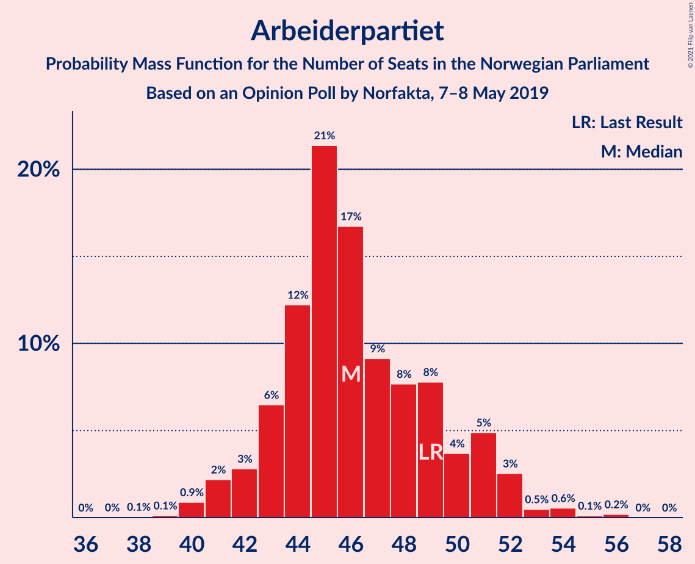

| Number of Seats | Probability | Accumulated | Special Marks |
|:---------------:|:-----------:|:-----------:|:-------------:|
| 38 | 0.1% | 100% |  |
| 39 | 0.1% | 99.9% |  |
| 40 | 0.9% | 99.8% |  |
| 41 | 2% | 98.9% |  |
| 42 | 3% | 97% |  |
| 43 | 6% | 94% |  |
| 44 | 12% | 87% |  |
| 45 | 21% | 75% |  |
| 46 | 17% | 54% | Median |
| 47 | 9% | 37% |  |
| 48 | 8% | 28% |  |
| 49 | 8% | 20% | Last Result |
| 50 | 4% | 12% |  |
| 51 | 5% | 9% |  |
| 52 | 3% | 4% |  |
| 53 | 0.5% | 1.4% |  |
| 54 | 0.6% | 0.9% |  |
| 55 | 0.1% | 0.3% |  |
| 56 | 0.2% | 0.2% |  |
| 57 | 0% | 0% |  |

### Høyre

*For a full overview of the results for this party, see the [Høyre](party-høyre.html) page.*

| Number of Seats | Probability | Accumulated | Special Marks |
|:---------------:|:-----------:|:-----------:|:-------------:|
| 36 | 0% | 100% |  |
| 37 | 0.2% | 99.9% |  |
| 38 | 0.4% | 99.8% |  |
| 39 | 0.8% | 99.3% |  |
| 40 | 2% | 98.5% |  |
| 41 | 5% | 96% |  |
| 42 | 9% | 91% |  |
| 43 | 17% | 81% |  |
| 44 | 10% | 64% |  |
| 45 | 11% | 54% | Last Result, Median |
| 46 | 8% | 43% |  |
| 47 | 10% | 35% |  |
| 48 | 12% | 24% |  |
| 49 | 5% | 12% |  |
| 50 | 6% | 7% |  |
| 51 | 0.8% | 1.4% |  |
| 52 | 0.3% | 0.6% |  |
| 53 | 0.1% | 0.3% |  |
| 54 | 0.1% | 0.1% |  |
| 55 | 0% | 0% |  |

### Senterpartiet

*For a full overview of the results for this party, see the [Senterpartiet](party-senterpartiet.html) page.*

| Number of Seats | Probability | Accumulated | Special Marks |
|:---------------:|:-----------:|:-----------:|:-------------:|
| 19 | 0% | 100% | Last Result |
| 20 | 0.1% | 100% |  |
| 21 | 0.6% | 99.8% |  |
| 22 | 2% | 99.3% |  |
| 23 | 5% | 97% |  |
| 24 | 8% | 92% |  |
| 25 | 11% | 85% |  |
| 26 | 23% | 73% |  |
| 27 | 19% | 51% | Median |
| 28 | 13% | 31% |  |
| 29 | 7% | 18% |  |
| 30 | 5% | 11% |  |
| 31 | 3% | 6% |  |
| 32 | 2% | 3% |  |
| 33 | 0.6% | 0.9% |  |
| 34 | 0.3% | 0.4% |  |
| 35 | 0% | 0% |  |

### Fremskrittspartiet

*For a full overview of the results for this party, see the [Fremskrittspartiet](party-fremskrittspartiet.html) page.*

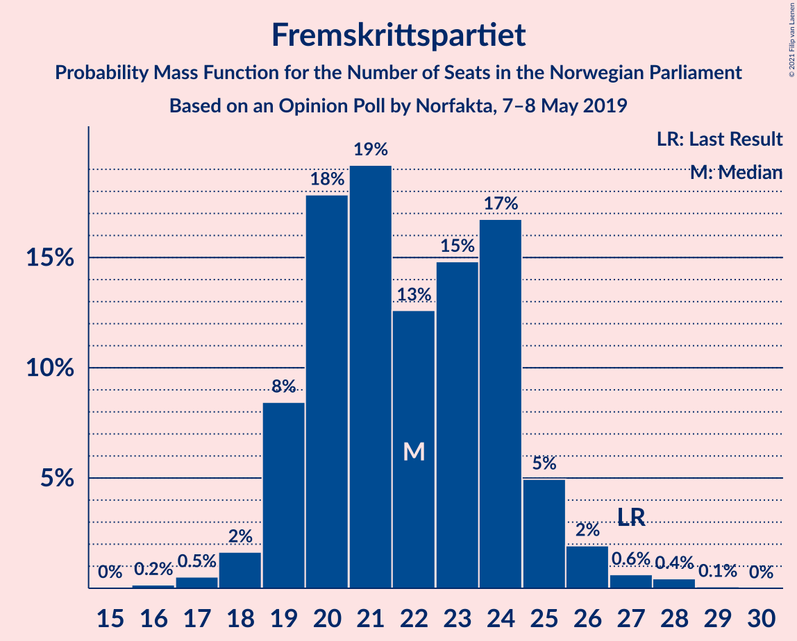

| Number of Seats | Probability | Accumulated | Special Marks |
|:---------------:|:-----------:|:-----------:|:-------------:|
| 16 | 0.2% | 100% |  |
| 17 | 0.5% | 99.8% |  |
| 18 | 2% | 99.3% |  |
| 19 | 8% | 98% |  |
| 20 | 18% | 89% |  |
| 21 | 19% | 71% |  |
| 22 | 13% | 52% | Median |
| 23 | 15% | 40% |  |
| 24 | 17% | 25% |  |
| 25 | 5% | 8% |  |
| 26 | 2% | 3% |  |
| 27 | 0.6% | 1.1% | Last Result |
| 28 | 0.4% | 0.5% |  |
| 29 | 0.1% | 0.1% |  |
| 30 | 0% | 0% |  |

### Sosialistisk Venstreparti

*For a full overview of the results for this party, see the [Sosialistisk Venstreparti](party-sosialistiskvenstreparti.html) page.*

| Number of Seats | Probability | Accumulated | Special Marks |
|:---------------:|:-----------:|:-----------:|:-------------:|
| 9 | 0.2% | 100% |  |
| 10 | 1.4% | 99.8% |  |
| 11 | 6% | 98% | Last Result |
| 12 | 9% | 92% |  |
| 13 | 32% | 83% |  |
| 14 | 27% | 52% | Median |
| 15 | 13% | 25% |  |
| 16 | 7% | 12% |  |
| 17 | 3% | 4% |  |
| 18 | 1.0% | 1.2% |  |
| 19 | 0.1% | 0.1% |  |
| 20 | 0% | 0% |  |

### Rødt

*For a full overview of the results for this party, see the [Rødt](party-rødt.html) page.*

| Number of Seats | Probability | Accumulated | Special Marks |
|:---------------:|:-----------:|:-----------:|:-------------:|
| 1 | 0% | 100% | Last Result |
| 2 | 10% | 100% |  |
| 3 | 0% | 90% |  |
| 4 | 0% | 90% |  |
| 5 | 0% | 90% |  |
| 6 | 0% | 90% |  |
| 7 | 1.0% | 90% |  |
| 8 | 19% | 89% |  |
| 9 | 36% | 70% | Median |
| 10 | 20% | 33% |  |
| 11 | 10% | 13% |  |
| 12 | 2% | 3% |  |
| 13 | 0.6% | 0.7% |  |
| 14 | 0.1% | 0.1% |  |
| 15 | 0% | 0% |  |

### Kristelig Folkeparti

*For a full overview of the results for this party, see the [Kristelig Folkeparti](party-kristeligfolkeparti.html) page.*

| Number of Seats | Probability | Accumulated | Special Marks |
|:---------------:|:-----------:|:-----------:|:-------------:|
| 0 | 2% | 100% |  |
| 1 | 33% | 98% |  |
| 2 | 12% | 64% |  |
| 3 | 40% | 52% | Median |
| 4 | 0% | 12% |  |
| 5 | 0% | 12% |  |
| 6 | 0% | 12% |  |
| 7 | 3% | 12% |  |
| 8 | 8% | 9% | Last Result |
| 9 | 0.7% | 0.8% |  |
| 10 | 0.1% | 0.1% |  |
| 11 | 0% | 0% |  |

### Miljøpartiet De Grønne

*For a full overview of the results for this party, see the [Miljøpartiet De Grønne](party-miljøpartietdegrønne.html) page.*

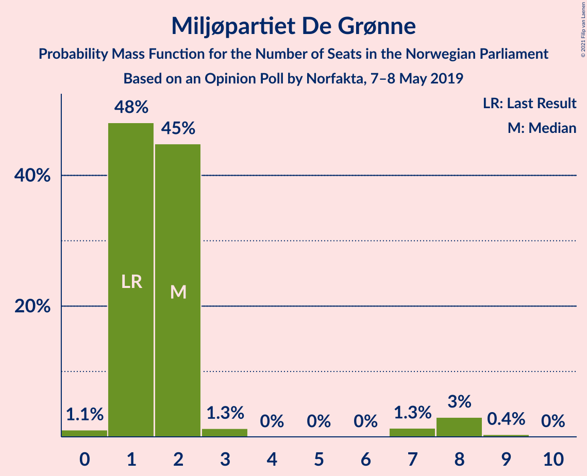

| Number of Seats | Probability | Accumulated | Special Marks |
|:---------------:|:-----------:|:-----------:|:-------------:|
| 0 | 1.1% | 100% |  |
| 1 | 48% | 98.9% | Last Result |
| 2 | 45% | 51% | Median |
| 3 | 1.3% | 6% |  |
| 4 | 0% | 5% |  |
| 5 | 0% | 5% |  |
| 6 | 0% | 5% |  |
| 7 | 1.3% | 5% |  |
| 8 | 3% | 3% |  |
| 9 | 0.4% | 0.4% |  |
| 10 | 0% | 0% |  |

### Venstre

*For a full overview of the results for this party, see the [Venstre](party-venstre.html) page.*

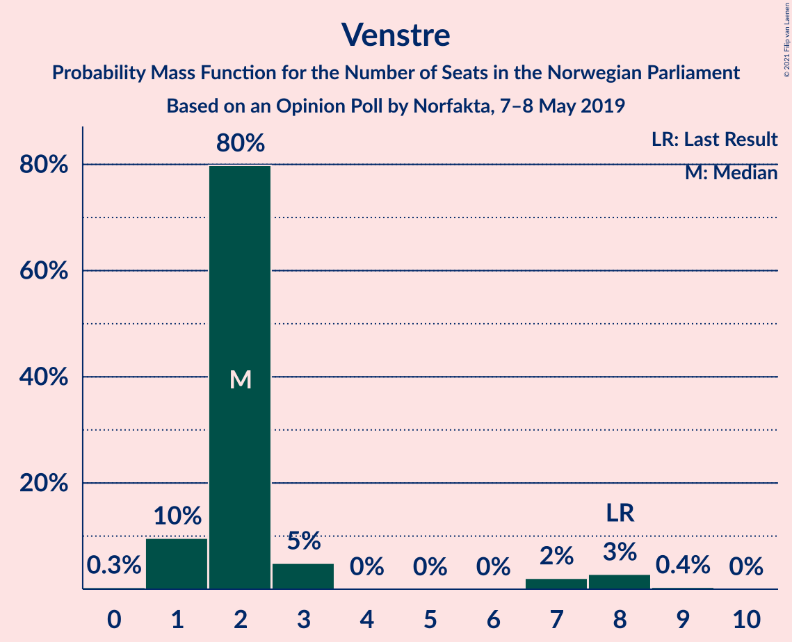

| Number of Seats | Probability | Accumulated | Special Marks |
|:---------------:|:-----------:|:-----------:|:-------------:|
| 0 | 0.3% | 100% |  |
| 1 | 10% | 99.7% |  |
| 2 | 80% | 90% | Median |
| 3 | 5% | 10% |  |
| 4 | 0% | 5% |  |
| 5 | 0% | 5% |  |
| 6 | 0% | 5% |  |
| 7 | 2% | 5% |  |
| 8 | 3% | 3% | Last Result |
| 9 | 0.4% | 0.4% |  |
| 10 | 0% | 0% |  |

## Coalitions

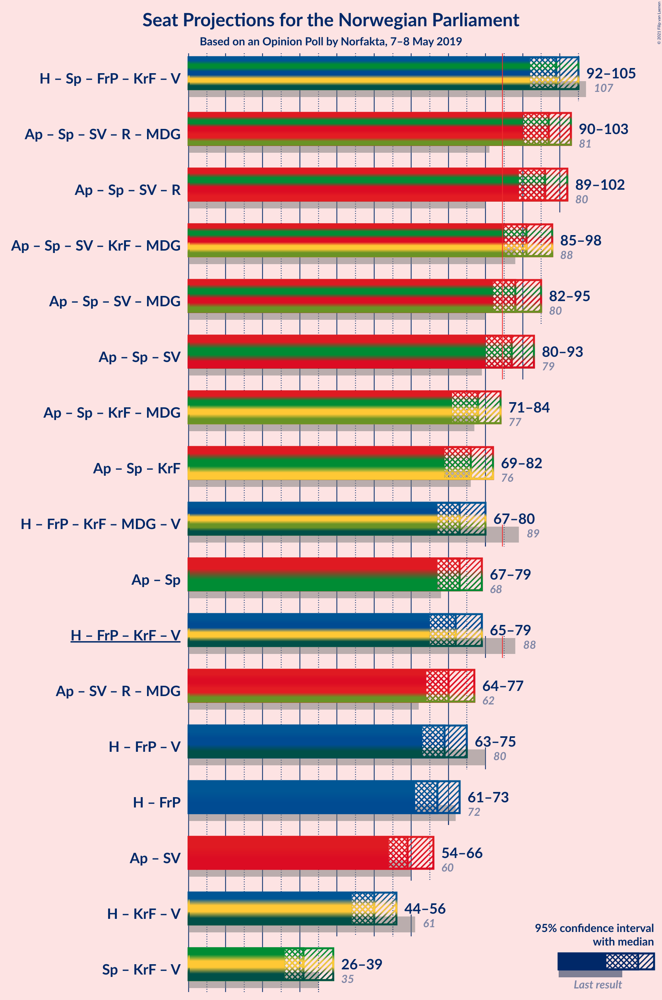

### Confidence Intervals

| Coalition | Last Result | Median | Majority? | 80% Confidence Interval | 90% Confidence Interval | 95% Confidence Interval | 99% Confidence Interval |
|:---------:|:-----------:|:------:|:---------:|:-----------------------:|:-----------------------:|:-----------------------:|:-----------------------:|
| Høyre – Senterpartiet – Fremskrittspartiet – Kristelig Folkeparti – Venstre | 107 | 99 | 100% | 94–103 | 93–105 | 92–105 | 89–108 |
| Arbeiderpartiet – Senterpartiet – Sosialistisk Venstreparti – Rødt – Miljøpartiet De Grønne | 81 | 97 | 99.9% | 93–101 | 91–103 | 90–103 | 88–105 |
| Arbeiderpartiet – Senterpartiet – Sosialistisk Venstreparti – Rødt | 80 | 96 | 99.7% | 90–99 | 89–100 | 89–102 | 86–103 |
| Arbeiderpartiet – Senterpartiet – Sosialistisk Venstreparti – Kristelig Folkeparti – Miljøpartiet De Grønne | 88 | 91 | 98% | 87–95 | 86–97 | 85–98 | 82–100 |
| Arbeiderpartiet – Senterpartiet – Sosialistisk Venstreparti – Miljøpartiet De Grønne | 80 | 88 | 88% | 84–93 | 83–94 | 82–95 | 80–98 |
| Arbeiderpartiet – Senterpartiet – Sosialistisk Venstreparti | 79 | 87 | 75% | 82–91 | 81–92 | 80–93 | 78–96 |
| Arbeiderpartiet – Senterpartiet – Kristelig Folkeparti – Miljøpartiet De Grønne | 77 | 78 | 2% | 73–82 | 72–84 | 71–84 | 69–87 |
| Arbeiderpartiet – Senterpartiet – Kristelig Folkeparti | 76 | 76 | 0.6% | 71–80 | 70–81 | 69–82 | 68–85 |
| Høyre – Fremskrittspartiet – Kristelig Folkeparti – Miljøpartiet De Grønne – Venstre | 89 | 73 | 0.2% | 70–78 | 68–80 | 67–80 | 65–83 |
| Arbeiderpartiet – Senterpartiet | 68 | 73 | 0% | 69–77 | 68–79 | 67–79 | 65–81 |
| Høyre – Fremskrittspartiet – Kristelig Folkeparti – Venstre | 88 | 72 | 0% | 68–76 | 66–78 | 65–79 | 63–81 |
| Arbeiderpartiet – Sosialistisk Venstreparti – Rødt – Miljøpartiet De Grønne | 62 | 70 | 0% | 66–75 | 64–76 | 64–77 | 61–79 |
| Høyre – Fremskrittspartiet – Venstre | 80 | 69 | 0% | 65–73 | 64–75 | 63–75 | 61–77 |
| Høyre – Fremskrittspartiet | 72 | 67 | 0% | 63–71 | 62–73 | 61–73 | 59–75 |
| Arbeiderpartiet – Sosialistisk Venstreparti | 60 | 59 | 0% | 56–64 | 55–65 | 54–66 | 52–68 |
| Høyre – Kristelig Folkeparti – Venstre | 61 | 50 | 0% | 46–54 | 45–55 | 44–56 | 42–59 |
| Senterpartiet – Kristelig Folkeparti – Venstre | 35 | 31 | 0% | 28–36 | 27–37 | 26–39 | 25–41 |

### Høyre – Senterpartiet – Fremskrittspartiet – Kristelig Folkeparti – Venstre

| Number of Seats | Probability | Accumulated | Special Marks |
|:---------------:|:-----------:|:-----------:|:-------------:|
| 87 | 0% | 100% |  |
| 88 | 0.2% | 99.9% |  |
| 89 | 0.4% | 99.8% |  |
| 90 | 0.7% | 99.4% |  |
| 91 | 1.1% | 98.7% |  |
| 92 | 2% | 98% |  |
| 93 | 3% | 96% |  |
| 94 | 7% | 93% |  |
| 95 | 7% | 86% |  |
| 96 | 6% | 80% |  |
| 97 | 8% | 74% |  |
| 98 | 16% | 66% |  |
| 99 | 8% | 50% | Median |
| 100 | 12% | 43% |  |
| 101 | 13% | 31% |  |
| 102 | 6% | 18% |  |
| 103 | 4% | 11% |  |
| 104 | 2% | 7% |  |
| 105 | 3% | 5% |  |
| 106 | 1.1% | 2% |  |
| 107 | 0.5% | 1.1% | Last Result |
| 108 | 0.3% | 0.6% |  |
| 109 | 0.1% | 0.3% |  |
| 110 | 0.1% | 0.1% |  |
| 111 | 0% | 0% |  |

### Arbeiderpartiet – Senterpartiet – Sosialistisk Venstreparti – Rødt – Miljøpartiet De Grønne

| Number of Seats | Probability | Accumulated | Special Marks |
|:---------------:|:-----------:|:-----------:|:-------------:|
| 81 | 0% | 100% | Last Result |
| 82 | 0% | 100% |  |
| 83 | 0% | 100% |  |
| 84 | 0.1% | 100% |  |
| 85 | 0% | 99.9% | Majority |
| 86 | 0.1% | 99.9% |  |
| 87 | 0.1% | 99.8% |  |
| 88 | 0.5% | 99.6% |  |
| 89 | 0.5% | 99.2% |  |
| 90 | 2% | 98.7% |  |
| 91 | 4% | 97% |  |
| 92 | 3% | 93% |  |
| 93 | 6% | 90% |  |
| 94 | 9% | 84% |  |
| 95 | 6% | 75% |  |
| 96 | 11% | 68% |  |
| 97 | 13% | 58% |  |
| 98 | 14% | 44% | Median |
| 99 | 7% | 31% |  |
| 100 | 6% | 23% |  |
| 101 | 10% | 17% |  |
| 102 | 2% | 7% |  |
| 103 | 3% | 5% |  |
| 104 | 1.2% | 2% |  |
| 105 | 0.9% | 1.2% |  |
| 106 | 0.2% | 0.3% |  |
| 107 | 0.1% | 0.2% |  |
| 108 | 0% | 0.1% |  |
| 109 | 0% | 0% |  |

### Arbeiderpartiet – Senterpartiet – Sosialistisk Venstreparti – Rødt

| Number of Seats | Probability | Accumulated | Special Marks |
|:---------------:|:-----------:|:-----------:|:-------------:|
| 80 | 0% | 100% | Last Result |
| 81 | 0% | 100% |  |
| 82 | 0% | 100% |  |
| 83 | 0.1% | 100% |  |
| 84 | 0.1% | 99.9% |  |
| 85 | 0.2% | 99.7% | Majority |
| 86 | 0.2% | 99.6% |  |
| 87 | 1.0% | 99.3% |  |
| 88 | 0.8% | 98% |  |
| 89 | 5% | 98% |  |
| 90 | 3% | 93% |  |
| 91 | 6% | 90% |  |
| 92 | 4% | 84% |  |
| 93 | 10% | 80% |  |
| 94 | 9% | 70% |  |
| 95 | 8% | 60% |  |
| 96 | 18% | 52% | Median |
| 97 | 8% | 34% |  |
| 98 | 10% | 26% |  |
| 99 | 9% | 16% |  |
| 100 | 3% | 8% |  |
| 101 | 2% | 5% |  |
| 102 | 1.4% | 3% |  |
| 103 | 0.9% | 1.3% |  |
| 104 | 0.3% | 0.4% |  |
| 105 | 0.1% | 0.1% |  |
| 106 | 0% | 0.1% |  |
| 107 | 0% | 0% |  |

### Arbeiderpartiet – Senterpartiet – Sosialistisk Venstreparti – Kristelig Folkeparti – Miljøpartiet De Grønne

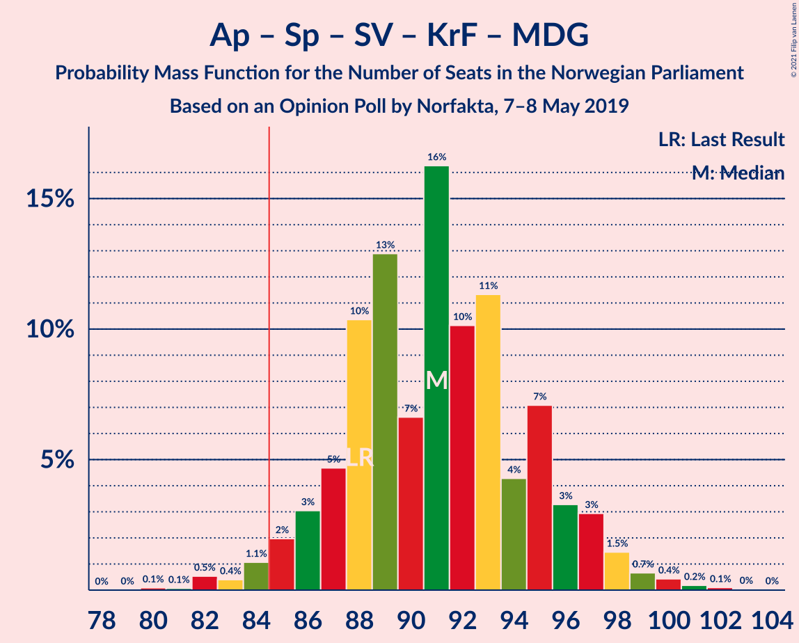

| Number of Seats | Probability | Accumulated | Special Marks |
|:---------------:|:-----------:|:-----------:|:-------------:|
| 80 | 0.1% | 100% |  |
| 81 | 0.1% | 99.9% |  |
| 82 | 0.5% | 99.8% |  |
| 83 | 0.4% | 99.3% |  |
| 84 | 1.1% | 98.9% |  |
| 85 | 2% | 98% | Majority |
| 86 | 3% | 96% |  |
| 87 | 5% | 93% |  |
| 88 | 10% | 88% | Last Result |
| 89 | 13% | 78% |  |
| 90 | 7% | 65% |  |
| 91 | 16% | 58% |  |
| 92 | 10% | 42% | Median |
| 93 | 11% | 32% |  |
| 94 | 4% | 20% |  |
| 95 | 7% | 16% |  |
| 96 | 3% | 9% |  |
| 97 | 3% | 6% |  |
| 98 | 1.5% | 3% |  |
| 99 | 0.7% | 1.4% |  |
| 100 | 0.4% | 0.8% |  |
| 101 | 0.2% | 0.3% |  |
| 102 | 0.1% | 0.2% |  |
| 103 | 0% | 0.1% |  |
| 104 | 0% | 0% |  |

### Arbeiderpartiet – Senterpartiet – Sosialistisk Venstreparti – Miljøpartiet De Grønne

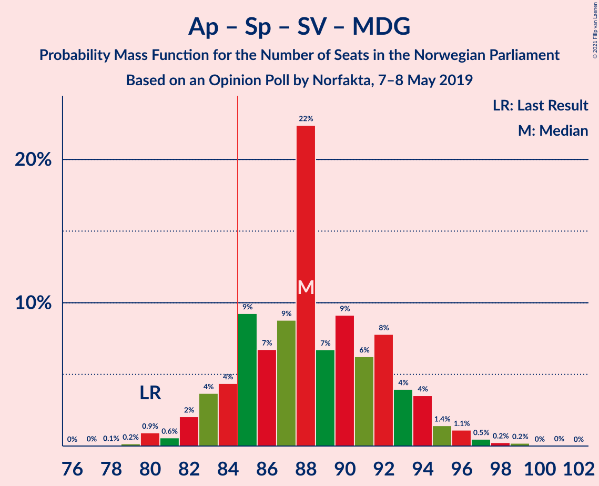

| Number of Seats | Probability | Accumulated | Special Marks |
|:---------------:|:-----------:|:-----------:|:-------------:|
| 77 | 0% | 100% |  |
| 78 | 0.1% | 99.9% |  |
| 79 | 0.2% | 99.9% |  |
| 80 | 0.9% | 99.7% | Last Result |
| 81 | 0.6% | 98.8% |  |
| 82 | 2% | 98% |  |
| 83 | 4% | 96% |  |
| 84 | 4% | 92% |  |
| 85 | 9% | 88% | Majority |
| 86 | 7% | 79% |  |
| 87 | 9% | 72% |  |
| 88 | 22% | 63% |  |
| 89 | 7% | 41% | Median |
| 90 | 9% | 34% |  |
| 91 | 6% | 25% |  |
| 92 | 8% | 19% |  |
| 93 | 4% | 11% |  |
| 94 | 4% | 7% |  |
| 95 | 1.4% | 4% |  |
| 96 | 1.1% | 2% |  |
| 97 | 0.5% | 1.0% |  |
| 98 | 0.2% | 0.5% |  |
| 99 | 0.2% | 0.3% |  |
| 100 | 0% | 0.1% |  |
| 101 | 0% | 0.1% |  |
| 102 | 0% | 0% |  |

### Arbeiderpartiet – Senterpartiet – Sosialistisk Venstreparti

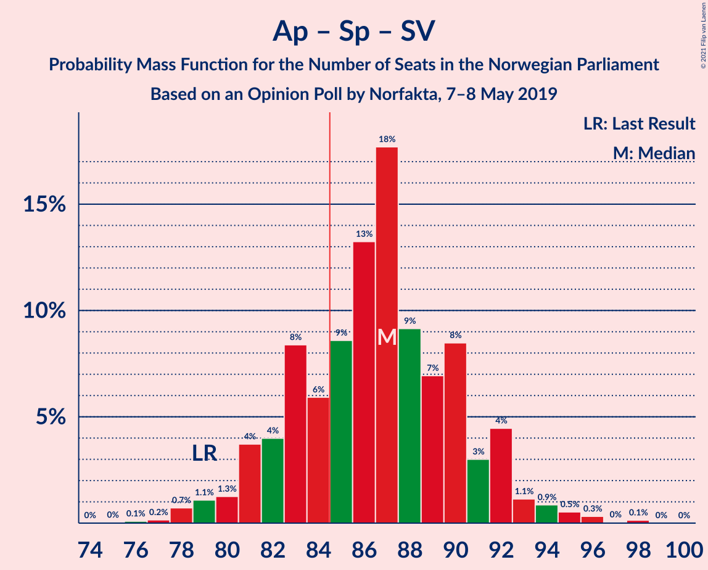

| Number of Seats | Probability | Accumulated | Special Marks |
|:---------------:|:-----------:|:-----------:|:-------------:|
| 76 | 0.1% | 100% |  |
| 77 | 0.2% | 99.9% |  |
| 78 | 0.7% | 99.7% |  |
| 79 | 1.1% | 99.0% | Last Result |
| 80 | 1.3% | 98% |  |
| 81 | 4% | 97% |  |
| 82 | 4% | 93% |  |
| 83 | 8% | 89% |  |
| 84 | 6% | 81% |  |
| 85 | 9% | 75% | Majority |
| 86 | 13% | 66% |  |
| 87 | 18% | 53% | Median |
| 88 | 9% | 35% |  |
| 89 | 7% | 26% |  |
| 90 | 8% | 19% |  |
| 91 | 3% | 11% |  |
| 92 | 4% | 8% |  |
| 93 | 1.1% | 3% |  |
| 94 | 0.9% | 2% |  |
| 95 | 0.5% | 1.1% |  |
| 96 | 0.3% | 0.5% |  |
| 97 | 0% | 0.2% |  |
| 98 | 0.1% | 0.2% |  |
| 99 | 0% | 0% |  |

### Arbeiderpartiet – Senterpartiet – Kristelig Folkeparti – Miljøpartiet De Grønne

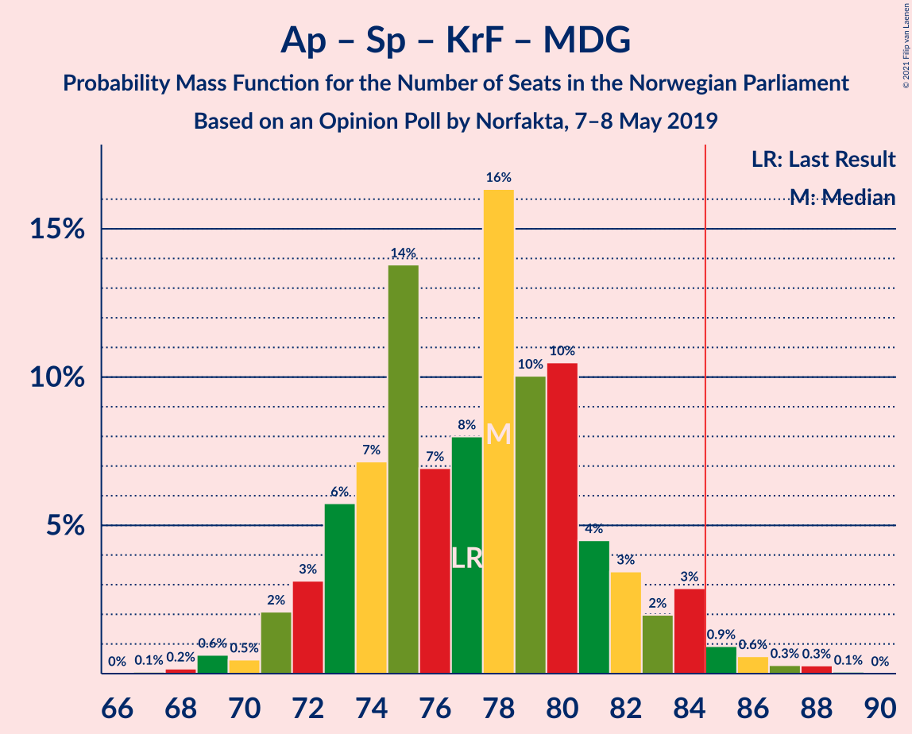

| Number of Seats | Probability | Accumulated | Special Marks |
|:---------------:|:-----------:|:-----------:|:-------------:|
| 67 | 0.1% | 100% |  |
| 68 | 0.2% | 99.9% |  |
| 69 | 0.6% | 99.8% |  |
| 70 | 0.5% | 99.1% |  |
| 71 | 2% | 98.7% |  |
| 72 | 3% | 97% |  |
| 73 | 6% | 93% |  |
| 74 | 7% | 88% |  |
| 75 | 14% | 81% |  |
| 76 | 7% | 67% |  |
| 77 | 8% | 60% | Last Result |
| 78 | 16% | 52% | Median |
| 79 | 10% | 35% |  |
| 80 | 10% | 25% |  |
| 81 | 4% | 15% |  |
| 82 | 3% | 10% |  |
| 83 | 2% | 7% |  |
| 84 | 3% | 5% |  |
| 85 | 0.9% | 2% | Majority |
| 86 | 0.6% | 1.2% |  |
| 87 | 0.3% | 0.6% |  |
| 88 | 0.3% | 0.4% |  |
| 89 | 0.1% | 0.1% |  |
| 90 | 0% | 0% |  |

### Arbeiderpartiet – Senterpartiet – Kristelig Folkeparti

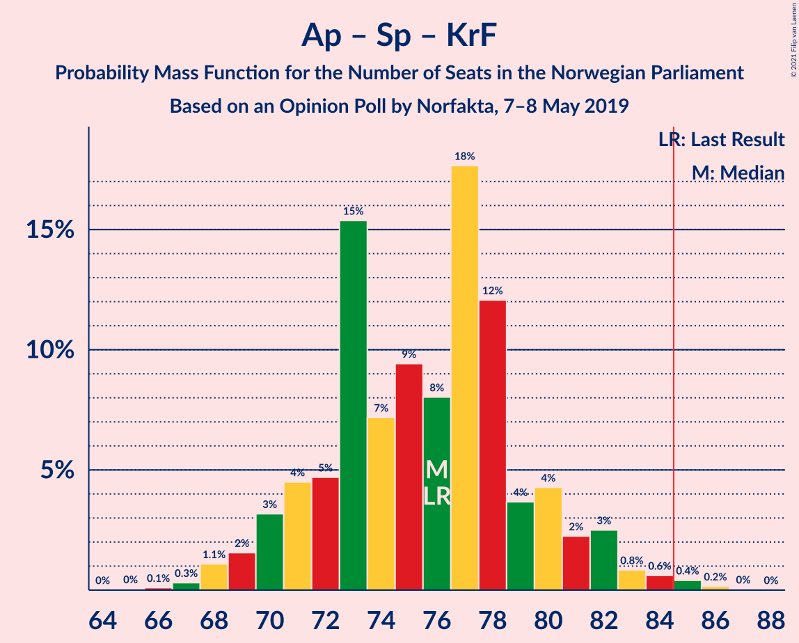

| Number of Seats | Probability | Accumulated | Special Marks |
|:---------------:|:-----------:|:-----------:|:-------------:|
| 65 | 0% | 100% |  |
| 66 | 0.1% | 99.9% |  |
| 67 | 0.3% | 99.8% |  |
| 68 | 1.1% | 99.5% |  |
| 69 | 2% | 98% |  |
| 70 | 3% | 97% |  |
| 71 | 4% | 94% |  |
| 72 | 5% | 89% |  |
| 73 | 15% | 85% |  |
| 74 | 7% | 69% |  |
| 75 | 9% | 62% |  |
| 76 | 8% | 53% | Last Result, Median |
| 77 | 18% | 44% |  |
| 78 | 12% | 27% |  |
| 79 | 4% | 15% |  |
| 80 | 4% | 11% |  |
| 81 | 2% | 7% |  |
| 82 | 3% | 5% |  |
| 83 | 0.8% | 2% |  |
| 84 | 0.6% | 1.2% |  |
| 85 | 0.4% | 0.6% | Majority |
| 86 | 0.2% | 0.2% |  |
| 87 | 0% | 0.1% |  |
| 88 | 0% | 0% |  |

### Høyre – Fremskrittspartiet – Kristelig Folkeparti – Miljøpartiet De Grønne – Venstre

| Number of Seats | Probability | Accumulated | Special Marks |
|:---------------:|:-----------:|:-----------:|:-------------:|
| 63 | 0.1% | 100% |  |
| 64 | 0.2% | 99.9% |  |
| 65 | 0.6% | 99.7% |  |
| 66 | 1.0% | 99.1% |  |
| 67 | 1.5% | 98% |  |
| 68 | 2% | 97% |  |
| 69 | 3% | 94% |  |
| 70 | 9% | 91% |  |
| 71 | 10% | 82% |  |
| 72 | 7% | 73% |  |
| 73 | 18% | 65% |  |
| 74 | 9% | 47% | Median |
| 75 | 9% | 38% |  |
| 76 | 10% | 29% |  |
| 77 | 4% | 19% |  |
| 78 | 6% | 15% |  |
| 79 | 3% | 10% |  |
| 80 | 5% | 7% |  |
| 81 | 0.6% | 2% |  |
| 82 | 0.9% | 1.4% |  |
| 83 | 0.2% | 0.5% |  |
| 84 | 0.1% | 0.3% |  |
| 85 | 0.1% | 0.2% | Majority |
| 86 | 0.1% | 0.1% |  |
| 87 | 0% | 0% |  |
| 88 | 0% | 0% |  |
| 89 | 0% | 0% | Last Result |

### Arbeiderpartiet – Senterpartiet

| Number of Seats | Probability | Accumulated | Special Marks |
|:---------------:|:-----------:|:-----------:|:-------------:|
| 63 | 0.1% | 100% |  |
| 64 | 0.2% | 99.9% |  |
| 65 | 0.4% | 99.7% |  |
| 66 | 2% | 99.3% |  |
| 67 | 2% | 98% |  |
| 68 | 4% | 95% | Last Result |
| 69 | 5% | 91% |  |
| 70 | 9% | 86% |  |
| 71 | 9% | 77% |  |
| 72 | 15% | 68% |  |
| 73 | 10% | 53% | Median |
| 74 | 15% | 43% |  |
| 75 | 8% | 28% |  |
| 76 | 7% | 20% |  |
| 77 | 4% | 12% |  |
| 78 | 2% | 8% |  |
| 79 | 4% | 6% |  |
| 80 | 0.8% | 2% |  |
| 81 | 0.8% | 1.2% |  |
| 82 | 0.2% | 0.4% |  |
| 83 | 0.2% | 0.2% |  |
| 84 | 0% | 0% |  |

### Høyre – Fremskrittspartiet – Kristelig Folkeparti – Venstre

| Number of Seats | Probability | Accumulated | Special Marks |
|:---------------:|:-----------:|:-----------:|:-------------:|
| 61 | 0.1% | 100% |  |
| 62 | 0.2% | 99.9% |  |
| 63 | 0.4% | 99.7% |  |
| 64 | 1.2% | 99.4% |  |
| 65 | 1.3% | 98% |  |
| 66 | 3% | 97% |  |
| 67 | 2% | 94% |  |
| 68 | 11% | 92% |  |
| 69 | 6% | 81% |  |
| 70 | 7% | 76% |  |
| 71 | 14% | 68% |  |
| 72 | 13% | 55% | Median |
| 73 | 11% | 41% |  |
| 74 | 6% | 30% |  |
| 75 | 9% | 24% |  |
| 76 | 6% | 15% |  |
| 77 | 3% | 9% |  |
| 78 | 4% | 6% |  |
| 79 | 1.4% | 3% |  |
| 80 | 0.4% | 1.1% |  |
| 81 | 0.4% | 0.6% |  |
| 82 | 0.1% | 0.3% |  |
| 83 | 0.1% | 0.2% |  |
| 84 | 0% | 0.1% |  |
| 85 | 0% | 0% | Majority |
| 86 | 0% | 0% |  |
| 87 | 0% | 0% |  |
| 88 | 0% | 0% | Last Result |

### Arbeiderpartiet – Sosialistisk Venstreparti – Rødt – Miljøpartiet De Grønne

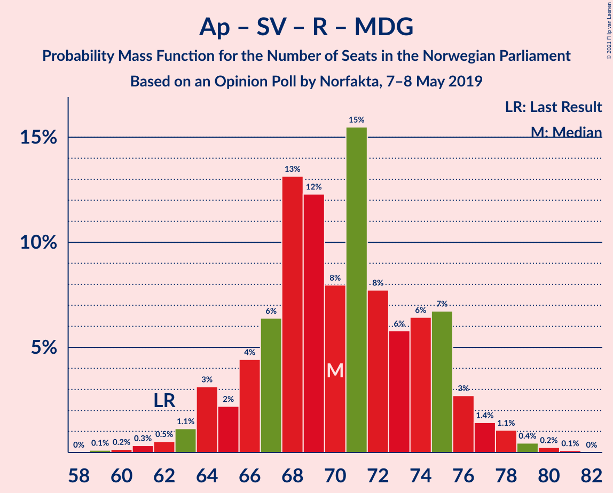

| Number of Seats | Probability | Accumulated | Special Marks |
|:---------------:|:-----------:|:-----------:|:-------------:|
| 59 | 0.1% | 100% |  |
| 60 | 0.2% | 99.8% |  |
| 61 | 0.3% | 99.7% |  |
| 62 | 0.5% | 99.4% | Last Result |
| 63 | 1.1% | 98.8% |  |
| 64 | 3% | 98% |  |
| 65 | 2% | 95% |  |
| 66 | 4% | 92% |  |
| 67 | 6% | 88% |  |
| 68 | 13% | 82% |  |
| 69 | 12% | 68% |  |
| 70 | 8% | 56% |  |
| 71 | 15% | 48% | Median |
| 72 | 8% | 33% |  |
| 73 | 6% | 25% |  |
| 74 | 6% | 19% |  |
| 75 | 7% | 13% |  |
| 76 | 3% | 6% |  |
| 77 | 1.4% | 3% |  |
| 78 | 1.1% | 2% |  |
| 79 | 0.4% | 0.8% |  |
| 80 | 0.2% | 0.4% |  |
| 81 | 0.1% | 0.1% |  |
| 82 | 0% | 0% |  |

### Høyre – Fremskrittspartiet – Venstre

| Number of Seats | Probability | Accumulated | Special Marks |
|:---------------:|:-----------:|:-----------:|:-------------:|
| 58 | 0% | 100% |  |
| 59 | 0.1% | 99.9% |  |
| 60 | 0.1% | 99.8% |  |
| 61 | 0.4% | 99.7% |  |
| 62 | 1.2% | 99.2% |  |
| 63 | 2% | 98% |  |
| 64 | 3% | 96% |  |
| 65 | 8% | 93% |  |
| 66 | 4% | 85% |  |
| 67 | 9% | 81% |  |
| 68 | 14% | 72% |  |
| 69 | 12% | 58% | Median |
| 70 | 14% | 46% |  |
| 71 | 8% | 33% |  |
| 72 | 10% | 25% |  |
| 73 | 6% | 15% |  |
| 74 | 3% | 9% |  |
| 75 | 4% | 6% |  |
| 76 | 0.8% | 2% |  |
| 77 | 0.8% | 1.2% |  |
| 78 | 0.2% | 0.5% |  |
| 79 | 0.1% | 0.2% |  |
| 80 | 0% | 0.1% | Last Result |
| 81 | 0% | 0.1% |  |
| 82 | 0% | 0% |  |

### Høyre – Fremskrittspartiet

| Number of Seats | Probability | Accumulated | Special Marks |
|:---------------:|:-----------:|:-----------:|:-------------:|
| 56 | 0.1% | 100% |  |
| 57 | 0.1% | 99.9% |  |
| 58 | 0.2% | 99.8% |  |
| 59 | 0.5% | 99.6% |  |
| 60 | 1.2% | 99.0% |  |
| 61 | 3% | 98% |  |
| 62 | 3% | 95% |  |
| 63 | 9% | 92% |  |
| 64 | 4% | 83% |  |
| 65 | 10% | 79% |  |
| 66 | 14% | 69% |  |
| 67 | 12% | 55% | Median |
| 68 | 14% | 44% |  |
| 69 | 7% | 30% |  |
| 70 | 9% | 23% |  |
| 71 | 6% | 14% |  |
| 72 | 3% | 8% | Last Result |
| 73 | 4% | 5% |  |
| 74 | 0.6% | 1.2% |  |
| 75 | 0.2% | 0.6% |  |
| 76 | 0.2% | 0.4% |  |
| 77 | 0.1% | 0.1% |  |
| 78 | 0% | 0% |  |

### Arbeiderpartiet – Sosialistisk Venstreparti

| Number of Seats | Probability | Accumulated | Special Marks |
|:---------------:|:-----------:|:-----------:|:-------------:|
| 50 | 0.1% | 100% |  |
| 51 | 0.1% | 99.9% |  |
| 52 | 0.4% | 99.9% |  |
| 53 | 1.0% | 99.4% |  |
| 54 | 1.0% | 98% |  |
| 55 | 3% | 97% |  |
| 56 | 5% | 94% |  |
| 57 | 9% | 89% |  |
| 58 | 9% | 80% |  |
| 59 | 24% | 71% |  |
| 60 | 8% | 47% | Last Result, Median |
| 61 | 14% | 39% |  |
| 62 | 7% | 25% |  |
| 63 | 4% | 18% |  |
| 64 | 7% | 14% |  |
| 65 | 2% | 7% |  |
| 66 | 3% | 5% |  |
| 67 | 0.8% | 2% |  |
| 68 | 0.6% | 0.9% |  |
| 69 | 0.2% | 0.3% |  |
| 70 | 0% | 0.1% |  |
| 71 | 0% | 0% |  |

### Høyre – Kristelig Folkeparti – Venstre

| Number of Seats | Probability | Accumulated | Special Marks |
|:---------------:|:-----------:|:-----------:|:-------------:|
| 41 | 0.2% | 100% |  |
| 42 | 0.4% | 99.8% |  |
| 43 | 1.1% | 99.4% |  |
| 44 | 2% | 98% |  |
| 45 | 4% | 96% |  |
| 46 | 4% | 92% |  |
| 47 | 12% | 89% |  |
| 48 | 16% | 77% |  |
| 49 | 8% | 61% |  |
| 50 | 7% | 53% | Median |
| 51 | 12% | 45% |  |
| 52 | 8% | 33% |  |
| 53 | 7% | 25% |  |
| 54 | 10% | 18% |  |
| 55 | 5% | 8% |  |
| 56 | 0.9% | 3% |  |
| 57 | 1.1% | 2% |  |
| 58 | 0.9% | 1.4% |  |
| 59 | 0.3% | 0.5% |  |
| 60 | 0.1% | 0.2% |  |
| 61 | 0.1% | 0.1% | Last Result |
| 62 | 0% | 0% |  |

### Senterpartiet – Kristelig Folkeparti – Venstre

| Number of Seats | Probability | Accumulated | Special Marks |
|:---------------:|:-----------:|:-----------:|:-------------:|
| 24 | 0.3% | 100% |  |
| 25 | 0.6% | 99.7% |  |
| 26 | 2% | 99.1% |  |
| 27 | 5% | 97% |  |
| 28 | 7% | 92% |  |
| 29 | 7% | 85% |  |
| 30 | 18% | 78% |  |
| 31 | 12% | 59% |  |
| 32 | 11% | 48% | Median |
| 33 | 15% | 36% |  |
| 34 | 3% | 22% |  |
| 35 | 5% | 18% | Last Result |
| 36 | 7% | 14% |  |
| 37 | 3% | 7% |  |
| 38 | 1.1% | 4% |  |
| 39 | 1.2% | 3% |  |
| 40 | 1.0% | 2% |  |
| 41 | 0.4% | 0.6% |  |
| 42 | 0.1% | 0.2% |  |
| 43 | 0.1% | 0.1% |  |
| 44 | 0% | 0% |  |

## Technical Information

### Opinion Poll

+ **Polling firm:** Norfakta
+ **Commissioner(s):** —
+ **Fieldwork period:** 7–8 May 2019

### Calculations

+ **Sample size:** 1003
+ **Simulations done:** 1,048,576
+ **Error estimate:** 2.15%

