# Opinion Poll by Norstat, 21–27 May 2019

<a href="#voting-intentions">Voting Intentions</a> | <a href="#seats">Seats</a> | <a href="#coalitions">Coalitions</a> | <a href="#technical-information">Technical Information</a>

## Voting Intentions

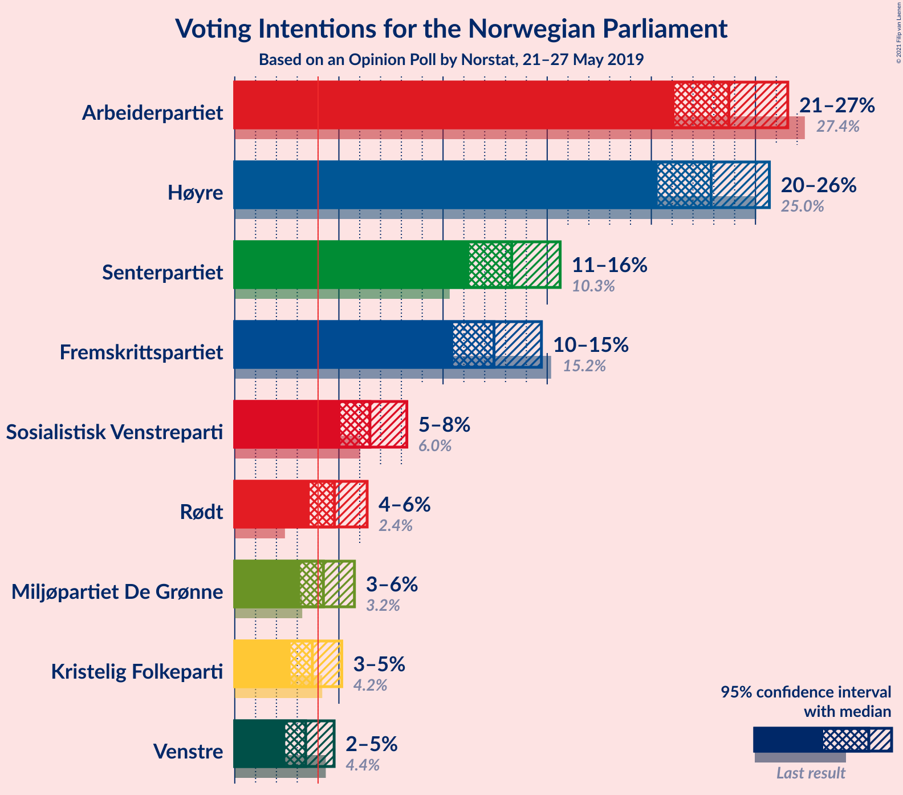

### Confidence Intervals

| Party | Last Result | Poll Result | 80% Confidence Interval | 90% Confidence Interval | 95% Confidence Interval | 99% Confidence Interval |
|:-----:|:-----------:|:-----------:|:-----------------------:|:-----------------------:|:-----------------------:|:-----------------------:|
| Arbeiderpartiet | 27.4% | 23.7% | 22.0–25.6% |21.5–26.1% |21.1–26.6% |20.3–27.5% |
| Høyre | 25.0% | 22.9% | 21.2–24.7% |20.7–25.2% |20.3–25.7% |19.5–26.6% |
| Senterpartiet | 10.3% | 13.3% | 12.0–14.8% |11.6–15.3% |11.3–15.6% |10.7–16.4% |
| Fremskrittspartiet | 15.2% | 12.4% | 11.2–13.9% |10.8–14.4% |10.5–14.7% |9.9–15.5% |
| Sosialistisk Venstreparti | 6.0% | 6.5% | 5.6–7.6% |5.3–8.0% |5.1–8.3% |4.7–8.8% |
| Rødt | 2.4% | 4.8% | 4.0–5.8% |3.8–6.1% |3.6–6.4% |3.2–6.9% |
| Miljøpartiet De Grønne | 3.2% | 4.3% | 3.5–5.2% |3.3–5.5% |3.1–5.7% |2.8–6.2% |
| Kristelig Folkeparti | 4.2% | 3.7% | 3.0–4.6% |2.9–4.9% |2.7–5.1% |2.4–5.6% |
| Venstre | 4.4% | 3.4% | 2.8–4.3% |2.6–4.5% |2.4–4.8% |2.1–5.2% |

*Note:* The poll result column reflects the actual value used in the calculations. Published results may vary slightly, and in addition be rounded to fewer digits.

## Seats

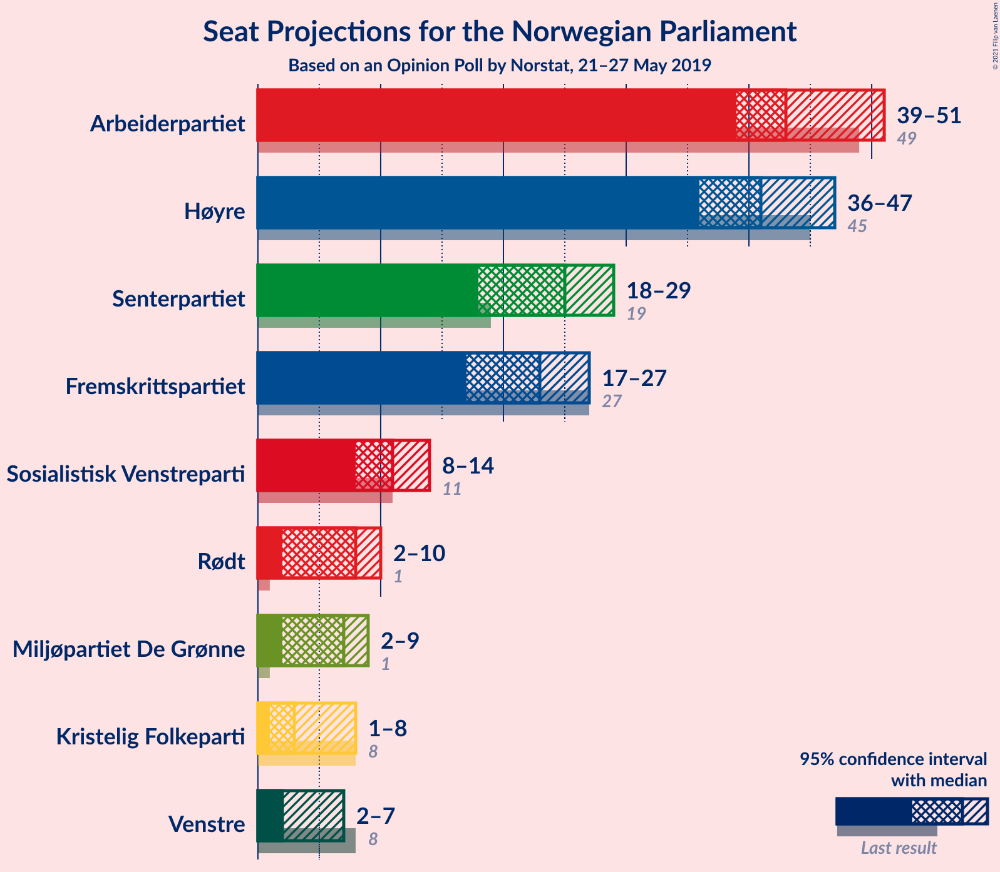

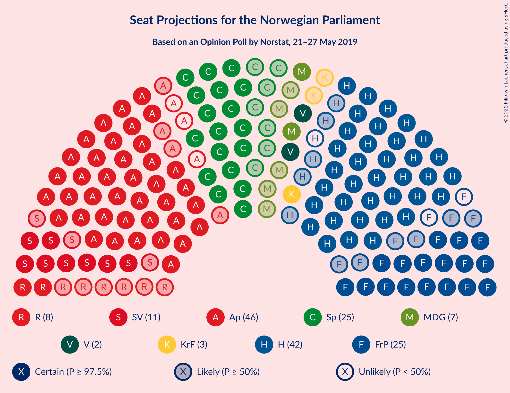

### Confidence Intervals

| Party | Last Result | Median | 80% Confidence Interval | 90% Confidence Interval | 95% Confidence Interval | 99% Confidence Interval |
|:-----:|:-----------:|:------:|:-----------------------:|:-----------------------:|:-----------------------:|:-----------------------:|
| <a href="#arbeiderpartiet">Arbeiderpartiet</a> | 49 | 43 | 40–47 |40–49 |39–51 |38–53 |
| <a href="#høyre">Høyre</a> | 45 | 41 | 37–45 |36–46 |36–47 |35–49 |
| <a href="#senterpartiet">Senterpartiet</a> | 19 | 25 | 19–28 |18–29 |18–29 |17–31 |
| <a href="#fremskrittspartiet">Fremskrittspartiet</a> | 27 | 23 | 19–25 |18–26 |17–27 |16–28 |
| <a href="#sosialistisk-venstreparti">Sosialistisk Venstreparti</a> | 11 | 11 | 9–12 |8–13 |8–14 |7–15 |
| <a href="#rødt">Rødt</a> | 1 | 8 | 2–10 |2–10 |2–10 |2–11 |
| <a href="#miljøpartiet-de-grønne">Miljøpartiet De Grønne</a> | 1 | 7 | 2–8 |2–9 |2–9 |1–10 |
| <a href="#kristelig-folkeparti">Kristelig Folkeparti</a> | 8 | 3 | 2–7 |1–8 |1–8 |1–9 |
| <a href="#venstre">Venstre</a> | 8 | 2 | 2–6 |2–7 |2–7 |1–8 |

### Arbeiderpartiet

*For a full overview of the results for this party, see the [Arbeiderpartiet](party-arbeiderpartiet.html) page.*

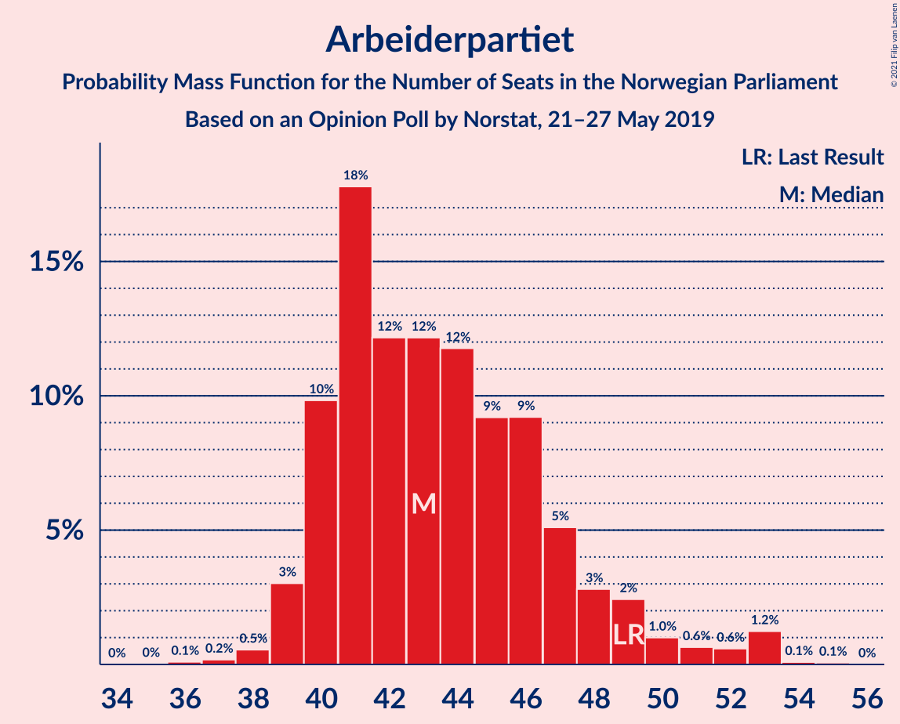

| Number of Seats | Probability | Accumulated | Special Marks |
|:---------------:|:-----------:|:-----------:|:-------------:|
| 36 | 0.1% | 100% |  |
| 37 | 0.2% | 99.9% |  |
| 38 | 0.5% | 99.7% |  |
| 39 | 3% | 99.1% |  |
| 40 | 10% | 96% |  |
| 41 | 18% | 86% |  |
| 42 | 12% | 68% |  |
| 43 | 12% | 56% | Median |
| 44 | 12% | 44% |  |
| 45 | 9% | 32% |  |
| 46 | 9% | 23% |  |
| 47 | 5% | 14% |  |
| 48 | 3% | 9% |  |
| 49 | 2% | 6% | Last Result |
| 50 | 1.0% | 4% |  |
| 51 | 0.6% | 3% |  |
| 52 | 0.6% | 2% |  |
| 53 | 1.2% | 1.4% |  |
| 54 | 0.1% | 0.2% |  |
| 55 | 0.1% | 0.1% |  |
| 56 | 0% | 0% |  |

### Høyre

*For a full overview of the results for this party, see the [Høyre](party-høyre.html) page.*

| Number of Seats | Probability | Accumulated | Special Marks |
|:---------------:|:-----------:|:-----------:|:-------------:|
| 33 | 0.1% | 100% |  |
| 34 | 0.2% | 99.9% |  |
| 35 | 1.1% | 99.7% |  |
| 36 | 8% | 98.6% |  |
| 37 | 8% | 91% |  |
| 38 | 13% | 83% |  |
| 39 | 7% | 70% |  |
| 40 | 10% | 64% |  |
| 41 | 11% | 54% | Median |
| 42 | 18% | 44% |  |
| 43 | 8% | 25% |  |
| 44 | 5% | 18% |  |
| 45 | 6% | 12% | Last Result |
| 46 | 4% | 7% |  |
| 47 | 1.4% | 3% |  |
| 48 | 0.8% | 1.4% |  |
| 49 | 0.4% | 0.7% |  |
| 50 | 0.2% | 0.3% |  |
| 51 | 0.1% | 0.1% |  |
| 52 | 0% | 0% |  |

### Senterpartiet

*For a full overview of the results for this party, see the [Senterpartiet](party-senterpartiet.html) page.*

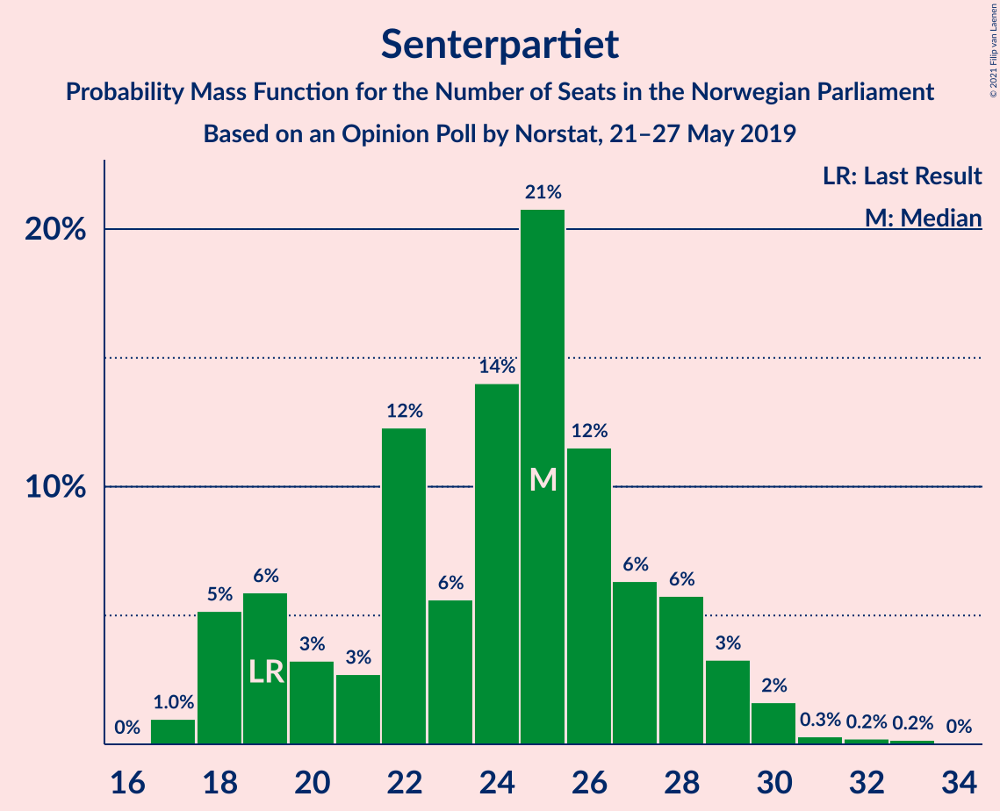

| Number of Seats | Probability | Accumulated | Special Marks |
|:---------------:|:-----------:|:-----------:|:-------------:|
| 17 | 1.0% | 100% |  |
| 18 | 5% | 99.0% |  |
| 19 | 6% | 94% | Last Result |
| 20 | 3% | 88% |  |
| 21 | 3% | 85% |  |
| 22 | 12% | 82% |  |
| 23 | 6% | 70% |  |
| 24 | 14% | 64% |  |
| 25 | 21% | 50% | Median |
| 26 | 12% | 29% |  |
| 27 | 6% | 18% |  |
| 28 | 6% | 11% |  |
| 29 | 3% | 6% |  |
| 30 | 2% | 2% |  |
| 31 | 0.3% | 0.7% |  |
| 32 | 0.2% | 0.4% |  |
| 33 | 0.2% | 0.2% |  |
| 34 | 0% | 0% |  |

### Fremskrittspartiet

*For a full overview of the results for this party, see the [Fremskrittspartiet](party-fremskrittspartiet.html) page.*

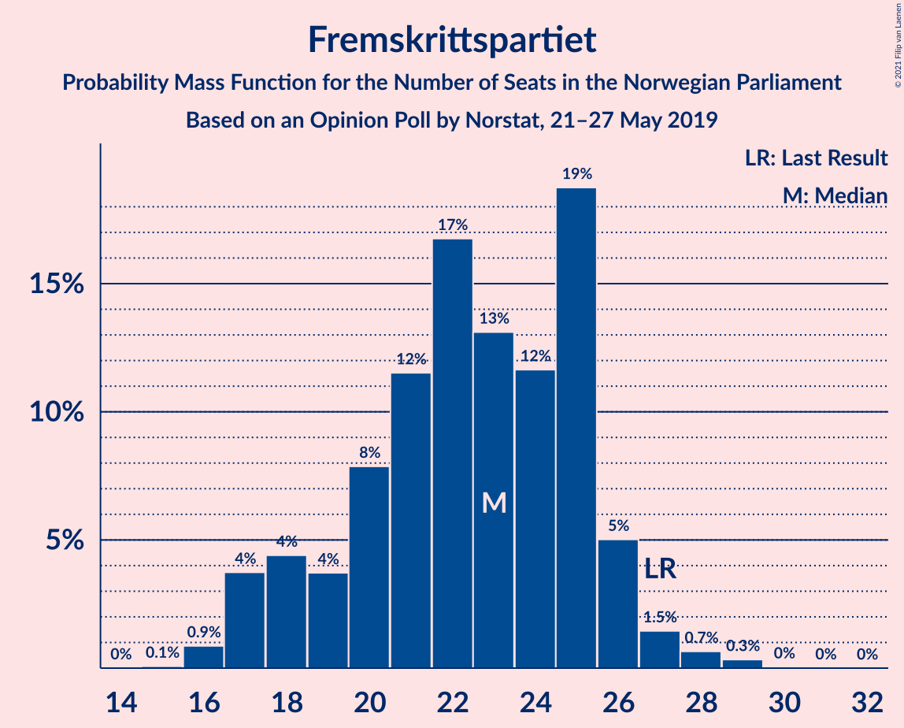

| Number of Seats | Probability | Accumulated | Special Marks |
|:---------------:|:-----------:|:-----------:|:-------------:|
| 15 | 0.1% | 100% |  |
| 16 | 0.9% | 99.9% |  |
| 17 | 4% | 99.0% |  |
| 18 | 4% | 95% |  |
| 19 | 4% | 91% |  |
| 20 | 8% | 87% |  |
| 21 | 12% | 79% |  |
| 22 | 17% | 68% |  |
| 23 | 13% | 51% | Median |
| 24 | 12% | 38% |  |
| 25 | 19% | 26% |  |
| 26 | 5% | 8% |  |
| 27 | 1.5% | 3% | Last Result |
| 28 | 0.7% | 1.0% |  |
| 29 | 0.3% | 0.4% |  |
| 30 | 0% | 0.1% |  |
| 31 | 0% | 0% |  |

### Sosialistisk Venstreparti

*For a full overview of the results for this party, see the [Sosialistisk Venstreparti](party-sosialistiskvenstreparti.html) page.*

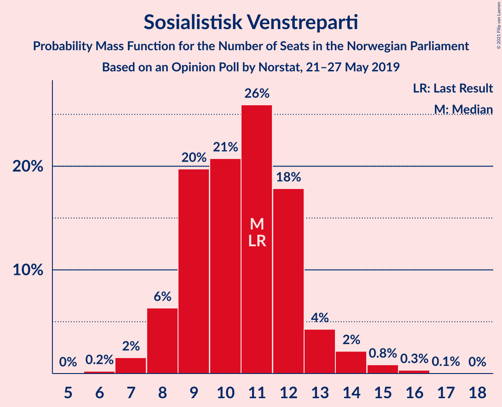

| Number of Seats | Probability | Accumulated | Special Marks |
|:---------------:|:-----------:|:-----------:|:-------------:|
| 6 | 0.2% | 100% |  |
| 7 | 2% | 99.8% |  |
| 8 | 6% | 98% |  |
| 9 | 20% | 92% |  |
| 10 | 21% | 72% |  |
| 11 | 26% | 51% | Last Result, Median |
| 12 | 18% | 26% |  |
| 13 | 4% | 8% |  |
| 14 | 2% | 3% |  |
| 15 | 0.8% | 1.2% |  |
| 16 | 0.3% | 0.4% |  |
| 17 | 0.1% | 0.1% |  |
| 18 | 0% | 0% |  |

### Rødt

*For a full overview of the results for this party, see the [Rødt](party-rødt.html) page.*

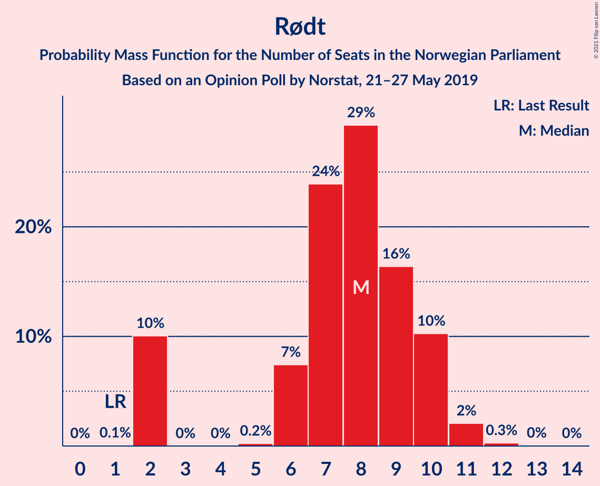

| Number of Seats | Probability | Accumulated | Special Marks |
|:---------------:|:-----------:|:-----------:|:-------------:|
| 1 | 0.1% | 100% | Last Result |
| 2 | 10% | 99.9% |  |
| 3 | 0% | 90% |  |
| 4 | 0% | 90% |  |
| 5 | 0.2% | 90% |  |
| 6 | 7% | 90% |  |
| 7 | 24% | 82% |  |
| 8 | 29% | 58% | Median |
| 9 | 16% | 29% |  |
| 10 | 10% | 13% |  |
| 11 | 2% | 2% |  |
| 12 | 0.3% | 0.3% |  |
| 13 | 0% | 0.1% |  |
| 14 | 0% | 0% |  |

### Miljøpartiet De Grønne

*For a full overview of the results for this party, see the [Miljøpartiet De Grønne](party-miljøpartietdegrønne.html) page.*

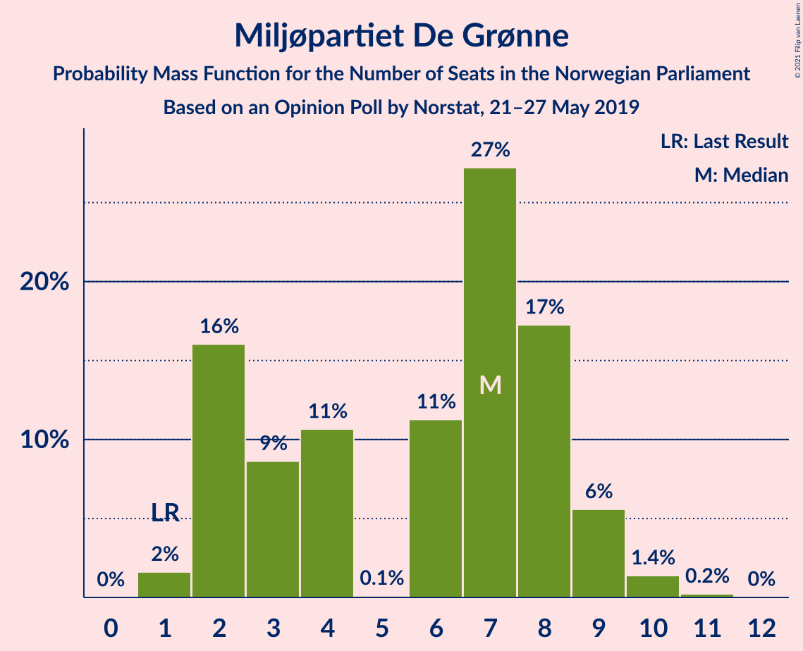

| Number of Seats | Probability | Accumulated | Special Marks |
|:---------------:|:-----------:|:-----------:|:-------------:|
| 1 | 2% | 100% | Last Result |
| 2 | 16% | 98% |  |
| 3 | 9% | 82% |  |
| 4 | 11% | 74% |  |
| 5 | 0.1% | 63% |  |
| 6 | 11% | 63% |  |
| 7 | 27% | 52% | Median |
| 8 | 17% | 24% |  |
| 9 | 6% | 7% |  |
| 10 | 1.4% | 2% |  |
| 11 | 0.2% | 0.3% |  |
| 12 | 0% | 0% |  |

### Kristelig Folkeparti

*For a full overview of the results for this party, see the [Kristelig Folkeparti](party-kristeligfolkeparti.html) page.*

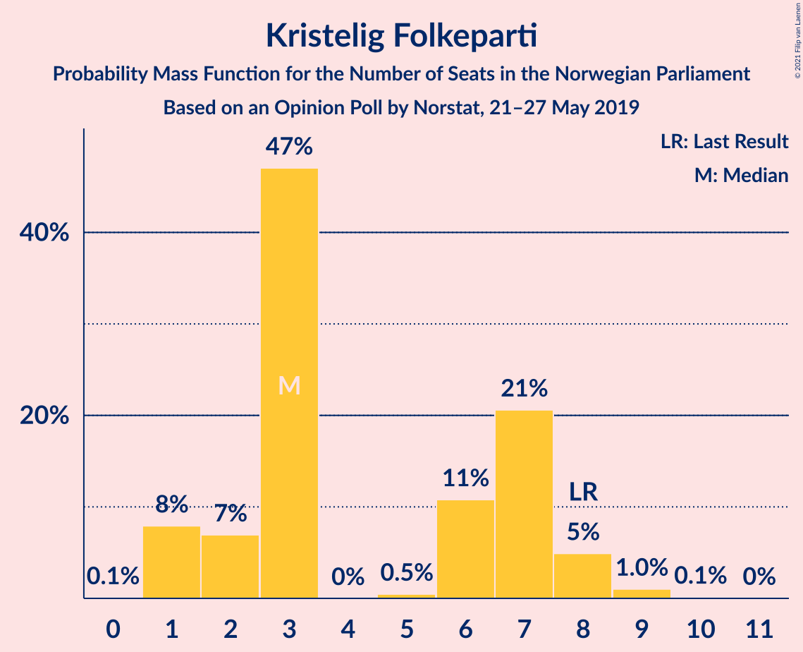

| Number of Seats | Probability | Accumulated | Special Marks |
|:---------------:|:-----------:|:-----------:|:-------------:|
| 0 | 0.1% | 100% |  |
| 1 | 8% | 99.9% |  |
| 2 | 7% | 92% |  |
| 3 | 47% | 85% | Median |
| 4 | 0% | 38% |  |
| 5 | 0.5% | 38% |  |
| 6 | 11% | 38% |  |
| 7 | 21% | 27% |  |
| 8 | 5% | 6% | Last Result |
| 9 | 1.0% | 1.2% |  |
| 10 | 0.1% | 0.2% |  |
| 11 | 0% | 0% |  |

### Venstre

*For a full overview of the results for this party, see the [Venstre](party-venstre.html) page.*

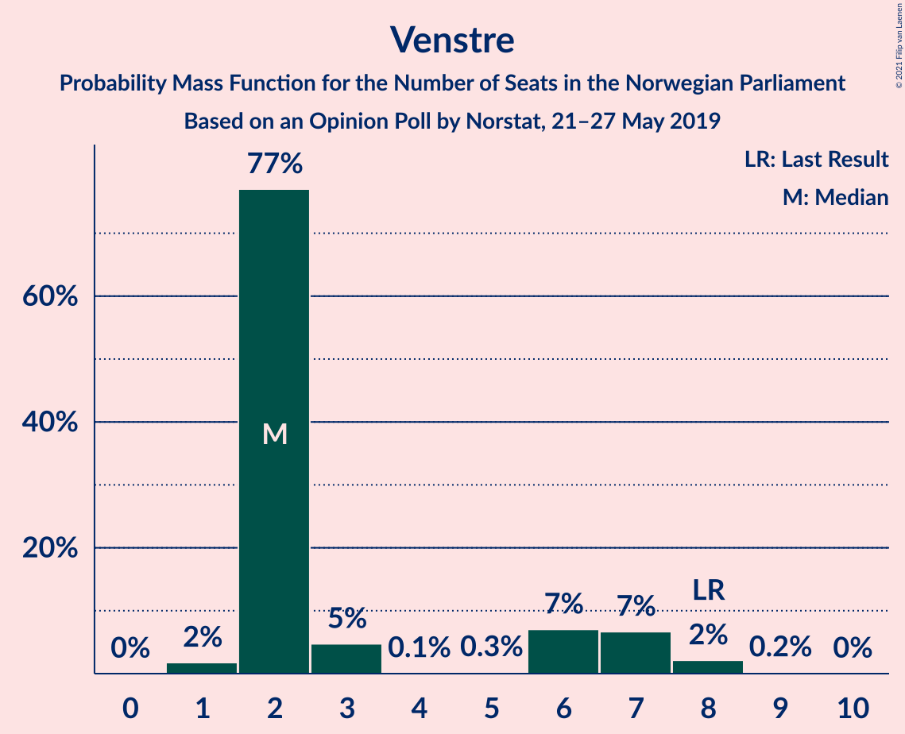

| Number of Seats | Probability | Accumulated | Special Marks |
|:---------------:|:-----------:|:-----------:|:-------------:|
| 1 | 2% | 100% |  |
| 2 | 77% | 98% | Median |
| 3 | 5% | 21% |  |
| 4 | 0.1% | 16% |  |
| 5 | 0.3% | 16% |  |
| 6 | 7% | 16% |  |
| 7 | 7% | 9% |  |
| 8 | 2% | 2% | Last Result |
| 9 | 0.2% | 0.3% |  |
| 10 | 0% | 0% |  |

## Coalitions

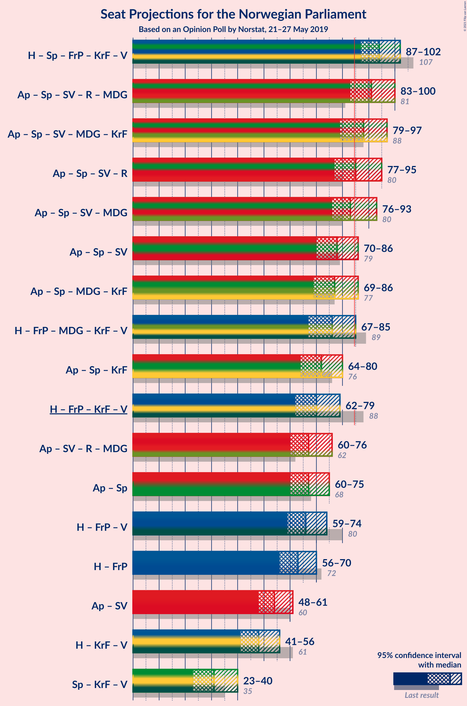

### Confidence Intervals

| Coalition | Last Result | Median | Majority? | 80% Confidence Interval | 90% Confidence Interval | 95% Confidence Interval | 99% Confidence Interval |
|:---------:|:-----------:|:------:|:---------:|:-----------------------:|:-----------------------:|:-----------------------:|:-----------------------:|
| Høyre – Senterpartiet – Fremskrittspartiet – Kristelig Folkeparti – Venstre | 107 | 94 | 99.3% | 89–99 | 88–100 | 87–102 | 84–106 |
| Arbeiderpartiet – Senterpartiet – Sosialistisk Venstreparti – Rødt – Miljøpartiet De Grønne | 81 | 91 | 95% | 86–96 | 84–98 | 83–100 | 80–103 |
| Arbeiderpartiet – Senterpartiet – Sosialistisk Venstreparti – Miljøpartiet De Grønne – Kristelig Folkeparti | 88 | 88 | 79% | 83–93 | 81–95 | 79–97 | 78–99 |
| Arbeiderpartiet – Senterpartiet – Sosialistisk Venstreparti – Rødt | 80 | 85 | 61% | 80–90 | 79–93 | 77–95 | 74–98 |
| Arbeiderpartiet – Senterpartiet – Sosialistisk Venstreparti – Miljøpartiet De Grønne | 80 | 83 | 38% | 79–89 | 76–91 | 76–93 | 73–96 |
| Arbeiderpartiet – Senterpartiet – Sosialistisk Venstreparti | 79 | 78 | 6% | 73–83 | 72–85 | 70–86 | 68–88 |
| Arbeiderpartiet – Senterpartiet – Miljøpartiet De Grønne – Kristelig Folkeparti | 77 | 77 | 5% | 72–83 | 70–85 | 69–86 | 67–88 |
| Høyre – Fremskrittspartiet – Miljøpartiet De Grønne – Kristelig Folkeparti – Venstre | 89 | 76 | 3% | 71–82 | 69–83 | 67–85 | 64–88 |
| Arbeiderpartiet – Senterpartiet – Kristelig Folkeparti | 76 | 72 | 0.1% | 66–76 | 65–78 | 64–80 | 62–82 |
| Høyre – Fremskrittspartiet – Kristelig Folkeparti – Venstre | 88 | 70 | 0% | 65–75 | 63–77 | 62–79 | 60–83 |
| Arbeiderpartiet – Sosialistisk Venstreparti – Rødt – Miljøpartiet De Grønne | 62 | 67 | 0% | 62–72 | 61–74 | 60–76 | 57–78 |
| Arbeiderpartiet – Senterpartiet | 68 | 67 | 0% | 63–72 | 61–73 | 60–75 | 59–77 |
| Høyre – Fremskrittspartiet – Venstre | 80 | 66 | 0% | 62–71 | 60–72 | 59–74 | 57–76 |
| Høyre – Fremskrittspartiet | 72 | 63 | 0% | 59–68 | 57–69 | 56–70 | 54–72 |
| Arbeiderpartiet – Sosialistisk Venstreparti | 60 | 54 | 0% | 50–58 | 49–60 | 48–61 | 47–63 |
| Høyre – Kristelig Folkeparti – Venstre | 61 | 48 | 0% | 43–53 | 42–55 | 41–56 | 39–59 |
| Senterpartiet – Kristelig Folkeparti – Venstre | 35 | 31 | 0% | 26–36 | 24–38 | 23–40 | 22–42 |

### Høyre – Senterpartiet – Fremskrittspartiet – Kristelig Folkeparti – Venstre

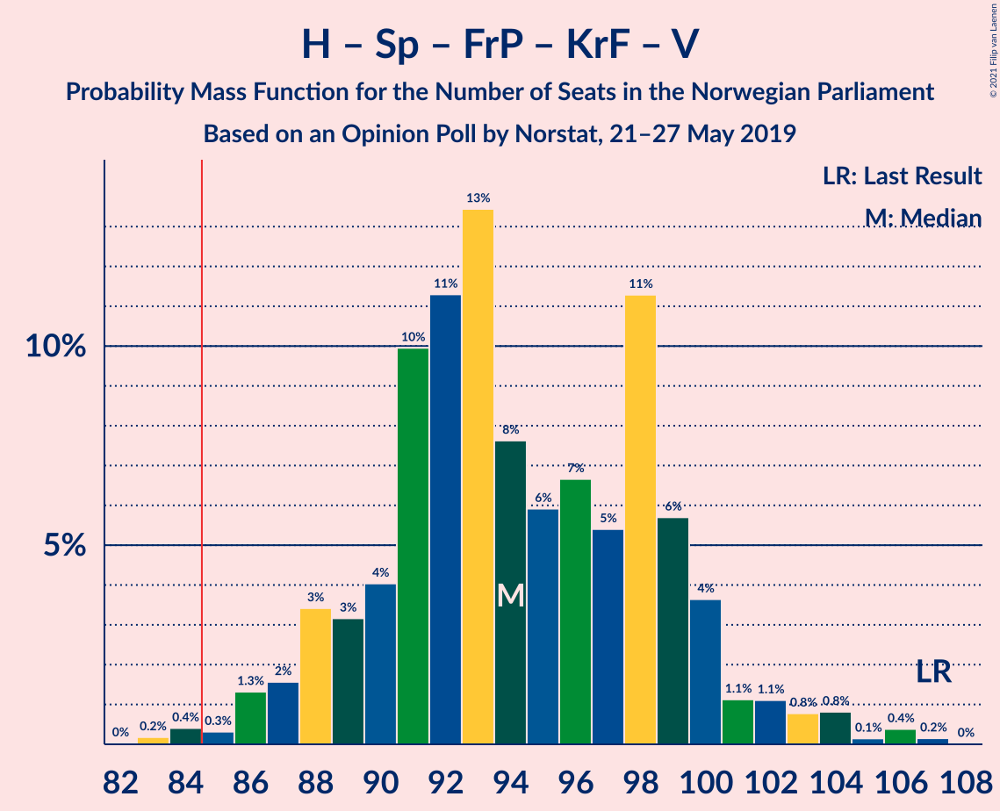

| Number of Seats | Probability | Accumulated | Special Marks |
|:---------------:|:-----------:|:-----------:|:-------------:|
| 82 | 0% | 100% |  |
| 83 | 0.2% | 99.9% |  |
| 84 | 0.4% | 99.7% |  |
| 85 | 0.3% | 99.3% | Majority |
| 86 | 1.3% | 99.0% |  |
| 87 | 2% | 98% |  |
| 88 | 3% | 96% |  |
| 89 | 3% | 93% |  |
| 90 | 4% | 90% |  |
| 91 | 10% | 86% |  |
| 92 | 11% | 76% |  |
| 93 | 13% | 64% |  |
| 94 | 8% | 51% | Median |
| 95 | 6% | 43% |  |
| 96 | 7% | 37% |  |
| 97 | 5% | 31% |  |
| 98 | 11% | 25% |  |
| 99 | 6% | 14% |  |
| 100 | 4% | 8% |  |
| 101 | 1.1% | 5% |  |
| 102 | 1.1% | 3% |  |
| 103 | 0.8% | 2% |  |
| 104 | 0.8% | 2% |  |
| 105 | 0.1% | 0.7% |  |
| 106 | 0.4% | 0.6% |  |
| 107 | 0.2% | 0.2% | Last Result |
| 108 | 0% | 0% |  |

### Arbeiderpartiet – Senterpartiet – Sosialistisk Venstreparti – Rødt – Miljøpartiet De Grønne

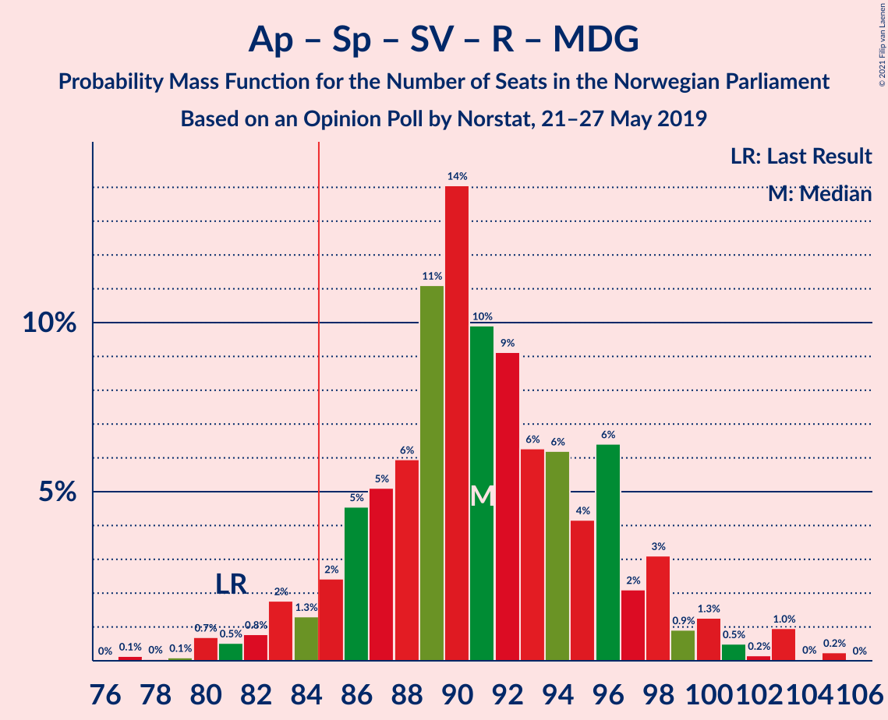

| Number of Seats | Probability | Accumulated | Special Marks |
|:---------------:|:-----------:|:-----------:|:-------------:|
| 77 | 0.1% | 100% |  |
| 78 | 0% | 99.8% |  |
| 79 | 0.1% | 99.8% |  |
| 80 | 0.7% | 99.7% |  |
| 81 | 0.5% | 99.0% | Last Result |
| 82 | 0.8% | 98% |  |
| 83 | 2% | 98% |  |
| 84 | 1.3% | 96% |  |
| 85 | 2% | 95% | Majority |
| 86 | 5% | 92% |  |
| 87 | 5% | 88% |  |
| 88 | 6% | 83% |  |
| 89 | 11% | 77% |  |
| 90 | 14% | 65% |  |
| 91 | 10% | 51% |  |
| 92 | 9% | 42% |  |
| 93 | 6% | 32% |  |
| 94 | 6% | 26% | Median |
| 95 | 4% | 20% |  |
| 96 | 6% | 16% |  |
| 97 | 2% | 9% |  |
| 98 | 3% | 7% |  |
| 99 | 0.9% | 4% |  |
| 100 | 1.3% | 3% |  |
| 101 | 0.5% | 2% |  |
| 102 | 0.2% | 1.4% |  |
| 103 | 1.0% | 1.3% |  |
| 104 | 0% | 0.3% |  |
| 105 | 0.2% | 0.3% |  |
| 106 | 0% | 0% |  |

### Arbeiderpartiet – Senterpartiet – Sosialistisk Venstreparti – Miljøpartiet De Grønne – Kristelig Folkeparti

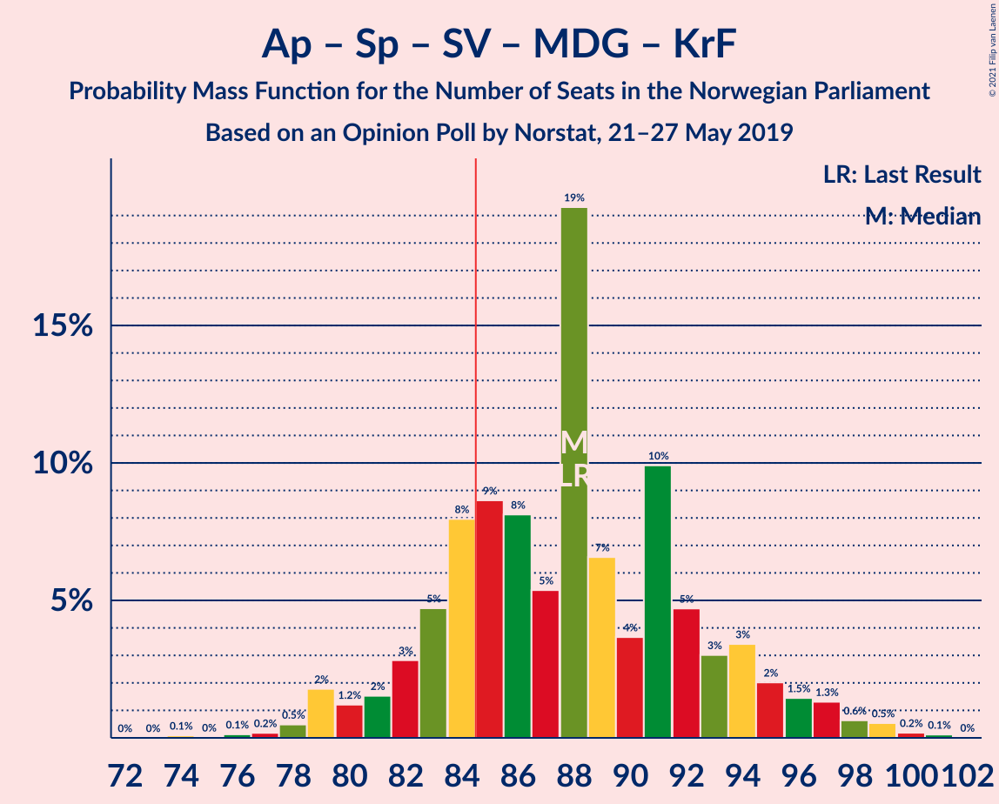

| Number of Seats | Probability | Accumulated | Special Marks |
|:---------------:|:-----------:|:-----------:|:-------------:|
| 74 | 0.1% | 100% |  |
| 75 | 0% | 99.9% |  |
| 76 | 0.1% | 99.9% |  |
| 77 | 0.2% | 99.8% |  |
| 78 | 0.5% | 99.6% |  |
| 79 | 2% | 99.1% |  |
| 80 | 1.2% | 97% |  |
| 81 | 2% | 96% |  |
| 82 | 3% | 95% |  |
| 83 | 5% | 92% |  |
| 84 | 8% | 87% |  |
| 85 | 9% | 79% | Majority |
| 86 | 8% | 70% |  |
| 87 | 5% | 62% |  |
| 88 | 19% | 57% | Last Result |
| 89 | 7% | 38% | Median |
| 90 | 4% | 31% |  |
| 91 | 10% | 27% |  |
| 92 | 5% | 17% |  |
| 93 | 3% | 13% |  |
| 94 | 3% | 10% |  |
| 95 | 2% | 6% |  |
| 96 | 1.5% | 4% |  |
| 97 | 1.3% | 3% |  |
| 98 | 0.6% | 2% |  |
| 99 | 0.5% | 0.9% |  |
| 100 | 0.2% | 0.3% |  |
| 101 | 0.1% | 0.2% |  |
| 102 | 0% | 0% |  |

### Arbeiderpartiet – Senterpartiet – Sosialistisk Venstreparti – Rødt

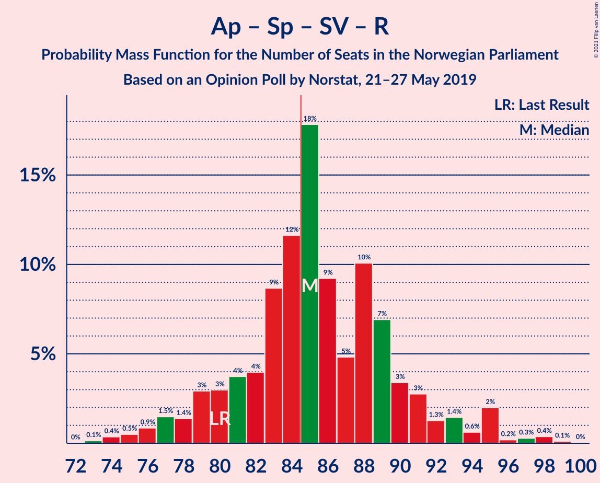

| Number of Seats | Probability | Accumulated | Special Marks |
|:---------------:|:-----------:|:-----------:|:-------------:|
| 73 | 0.1% | 100% |  |
| 74 | 0.4% | 99.8% |  |
| 75 | 0.5% | 99.4% |  |
| 76 | 0.9% | 99.0% |  |
| 77 | 1.5% | 98% |  |
| 78 | 1.4% | 97% |  |
| 79 | 3% | 95% |  |
| 80 | 3% | 92% | Last Result |
| 81 | 4% | 89% |  |
| 82 | 4% | 86% |  |
| 83 | 9% | 82% |  |
| 84 | 12% | 73% |  |
| 85 | 18% | 61% | Majority |
| 86 | 9% | 43% |  |
| 87 | 5% | 34% | Median |
| 88 | 10% | 29% |  |
| 89 | 7% | 19% |  |
| 90 | 3% | 12% |  |
| 91 | 3% | 9% |  |
| 92 | 1.3% | 6% |  |
| 93 | 1.4% | 5% |  |
| 94 | 0.6% | 4% |  |
| 95 | 2% | 3% |  |
| 96 | 0.2% | 1.0% |  |
| 97 | 0.3% | 0.8% |  |
| 98 | 0.4% | 0.5% |  |
| 99 | 0.1% | 0.1% |  |
| 100 | 0% | 0% |  |

### Arbeiderpartiet – Senterpartiet – Sosialistisk Venstreparti – Miljøpartiet De Grønne

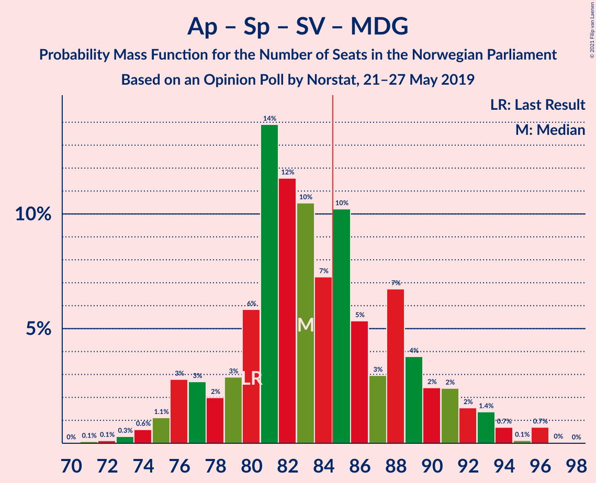

| Number of Seats | Probability | Accumulated | Special Marks |
|:---------------:|:-----------:|:-----------:|:-------------:|
| 71 | 0.1% | 100% |  |
| 72 | 0.1% | 99.9% |  |
| 73 | 0.3% | 99.8% |  |
| 74 | 0.6% | 99.5% |  |
| 75 | 1.1% | 98.9% |  |
| 76 | 3% | 98% |  |
| 77 | 3% | 95% |  |
| 78 | 2% | 92% |  |
| 79 | 3% | 90% |  |
| 80 | 6% | 87% | Last Result |
| 81 | 14% | 82% |  |
| 82 | 12% | 68% |  |
| 83 | 10% | 56% |  |
| 84 | 7% | 46% |  |
| 85 | 10% | 38% | Majority |
| 86 | 5% | 28% | Median |
| 87 | 3% | 23% |  |
| 88 | 7% | 20% |  |
| 89 | 4% | 13% |  |
| 90 | 2% | 9% |  |
| 91 | 2% | 7% |  |
| 92 | 2% | 5% |  |
| 93 | 1.4% | 3% |  |
| 94 | 0.7% | 2% |  |
| 95 | 0.1% | 0.9% |  |
| 96 | 0.7% | 0.8% |  |
| 97 | 0% | 0.1% |  |
| 98 | 0% | 0% |  |

### Arbeiderpartiet – Senterpartiet – Sosialistisk Venstreparti

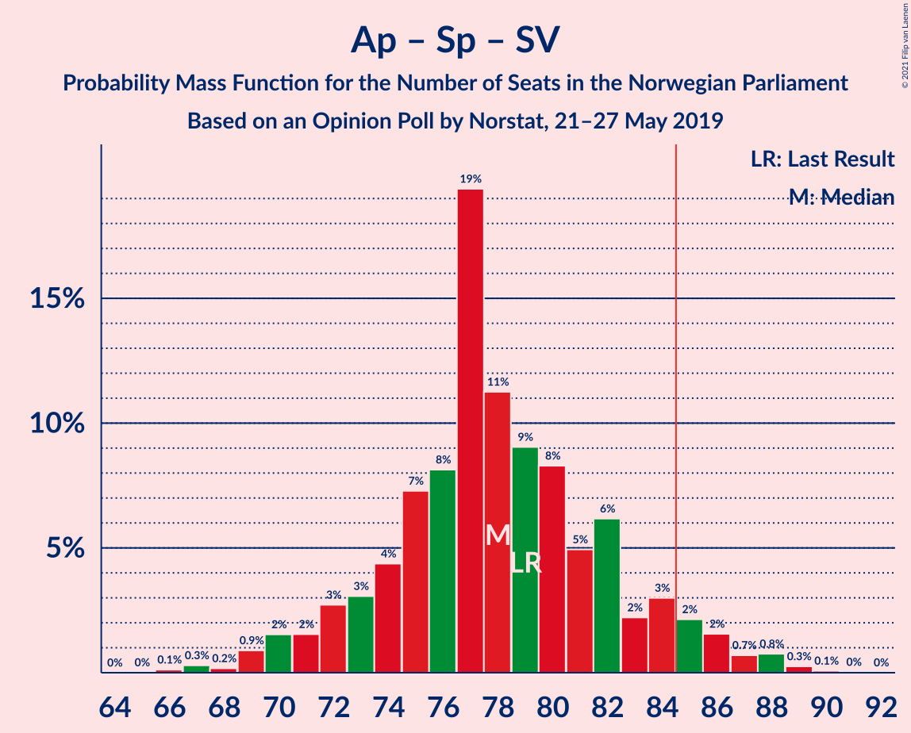

| Number of Seats | Probability | Accumulated | Special Marks |
|:---------------:|:-----------:|:-----------:|:-------------:|
| 66 | 0.1% | 100% |  |
| 67 | 0.3% | 99.9% |  |
| 68 | 0.2% | 99.6% |  |
| 69 | 0.9% | 99.4% |  |
| 70 | 2% | 98% |  |
| 71 | 2% | 97% |  |
| 72 | 3% | 95% |  |
| 73 | 3% | 93% |  |
| 74 | 4% | 90% |  |
| 75 | 7% | 85% |  |
| 76 | 8% | 78% |  |
| 77 | 19% | 70% |  |
| 78 | 11% | 50% |  |
| 79 | 9% | 39% | Last Result, Median |
| 80 | 8% | 30% |  |
| 81 | 5% | 22% |  |
| 82 | 6% | 17% |  |
| 83 | 2% | 11% |  |
| 84 | 3% | 9% |  |
| 85 | 2% | 6% | Majority |
| 86 | 2% | 3% |  |
| 87 | 0.7% | 2% |  |
| 88 | 0.8% | 1.1% |  |
| 89 | 0.3% | 0.4% |  |
| 90 | 0.1% | 0.1% |  |
| 91 | 0% | 0% |  |

### Arbeiderpartiet – Senterpartiet – Miljøpartiet De Grønne – Kristelig Folkeparti

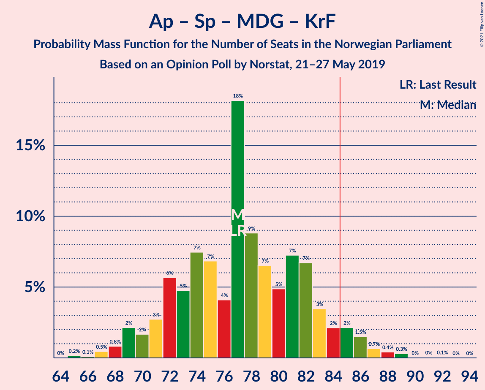

| Number of Seats | Probability | Accumulated | Special Marks |
|:---------------:|:-----------:|:-----------:|:-------------:|
| 65 | 0.2% | 100% |  |
| 66 | 0.1% | 99.8% |  |
| 67 | 0.5% | 99.7% |  |
| 68 | 0.8% | 99.3% |  |
| 69 | 2% | 98% |  |
| 70 | 2% | 96% |  |
| 71 | 3% | 95% |  |
| 72 | 6% | 92% |  |
| 73 | 5% | 86% |  |
| 74 | 7% | 81% |  |
| 75 | 7% | 74% |  |
| 76 | 4% | 67% |  |
| 77 | 18% | 63% | Last Result |
| 78 | 9% | 45% | Median |
| 79 | 7% | 36% |  |
| 80 | 5% | 30% |  |
| 81 | 7% | 25% |  |
| 82 | 7% | 17% |  |
| 83 | 3% | 11% |  |
| 84 | 2% | 7% |  |
| 85 | 2% | 5% | Majority |
| 86 | 1.5% | 3% |  |
| 87 | 0.7% | 2% |  |
| 88 | 0.4% | 0.9% |  |
| 89 | 0.3% | 0.4% |  |
| 90 | 0% | 0.1% |  |
| 91 | 0% | 0.1% |  |
| 92 | 0.1% | 0.1% |  |
| 93 | 0% | 0% |  |

### Høyre – Fremskrittspartiet – Miljøpartiet De Grønne – Kristelig Folkeparti – Venstre

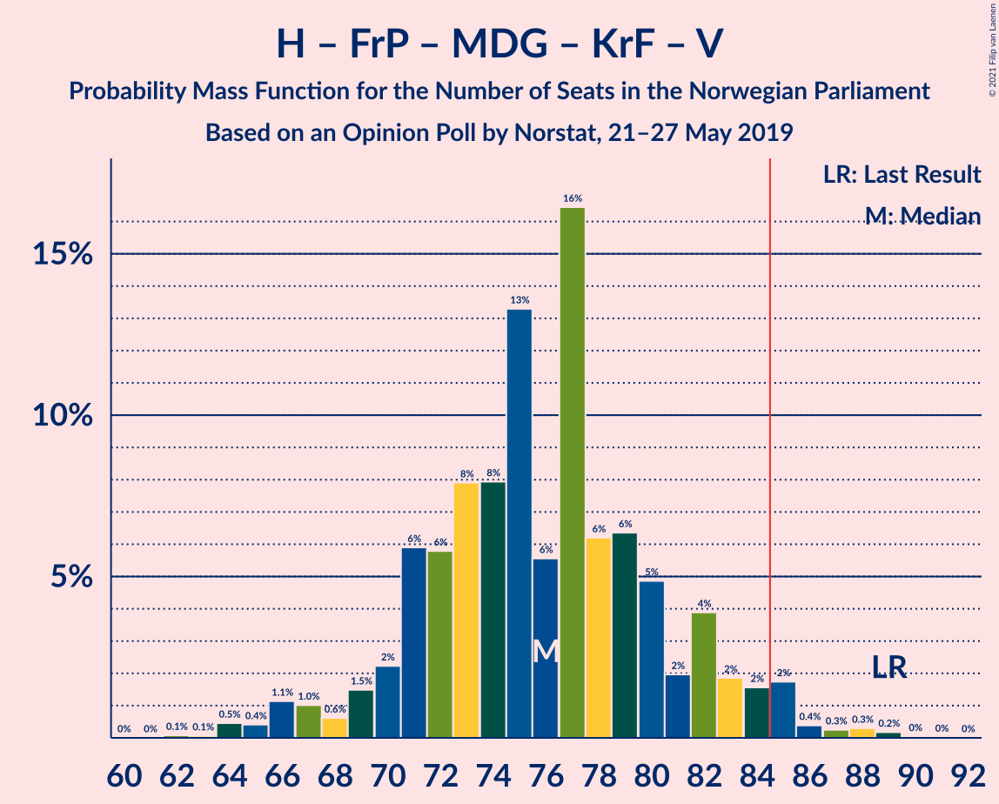

| Number of Seats | Probability | Accumulated | Special Marks |
|:---------------:|:-----------:|:-----------:|:-------------:|
| 62 | 0.1% | 100% |  |
| 63 | 0.1% | 99.9% |  |
| 64 | 0.5% | 99.8% |  |
| 65 | 0.4% | 99.4% |  |
| 66 | 1.1% | 99.0% |  |
| 67 | 1.0% | 98% |  |
| 68 | 0.6% | 97% |  |
| 69 | 1.5% | 96% |  |
| 70 | 2% | 95% |  |
| 71 | 6% | 92% |  |
| 72 | 6% | 87% |  |
| 73 | 8% | 81% |  |
| 74 | 8% | 73% |  |
| 75 | 13% | 65% |  |
| 76 | 6% | 52% | Median |
| 77 | 16% | 46% |  |
| 78 | 6% | 30% |  |
| 79 | 6% | 23% |  |
| 80 | 5% | 17% |  |
| 81 | 2% | 12% |  |
| 82 | 4% | 10% |  |
| 83 | 2% | 6% |  |
| 84 | 2% | 4% |  |
| 85 | 2% | 3% | Majority |
| 86 | 0.4% | 1.2% |  |
| 87 | 0.3% | 0.8% |  |
| 88 | 0.3% | 0.6% |  |
| 89 | 0.2% | 0.3% | Last Result |
| 90 | 0% | 0.1% |  |
| 91 | 0% | 0% |  |

### Arbeiderpartiet – Senterpartiet – Kristelig Folkeparti

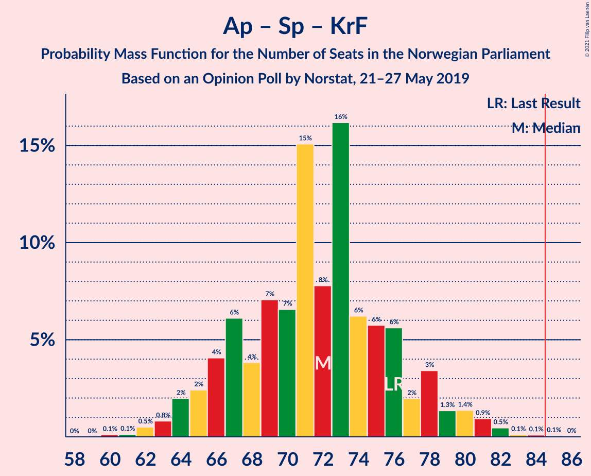

| Number of Seats | Probability | Accumulated | Special Marks |
|:---------------:|:-----------:|:-----------:|:-------------:|
| 60 | 0.1% | 100% |  |
| 61 | 0.1% | 99.9% |  |
| 62 | 0.5% | 99.8% |  |
| 63 | 0.8% | 99.3% |  |
| 64 | 2% | 98% |  |
| 65 | 2% | 96% |  |
| 66 | 4% | 94% |  |
| 67 | 6% | 90% |  |
| 68 | 4% | 84% |  |
| 69 | 7% | 80% |  |
| 70 | 7% | 73% |  |
| 71 | 15% | 66% | Median |
| 72 | 8% | 51% |  |
| 73 | 16% | 44% |  |
| 74 | 6% | 27% |  |
| 75 | 6% | 21% |  |
| 76 | 6% | 15% | Last Result |
| 77 | 2% | 10% |  |
| 78 | 3% | 8% |  |
| 79 | 1.3% | 4% |  |
| 80 | 1.4% | 3% |  |
| 81 | 0.9% | 2% |  |
| 82 | 0.5% | 0.8% |  |
| 83 | 0.1% | 0.3% |  |
| 84 | 0.1% | 0.2% |  |
| 85 | 0.1% | 0.1% | Majority |
| 86 | 0% | 0% |  |

### Høyre – Fremskrittspartiet – Kristelig Folkeparti – Venstre

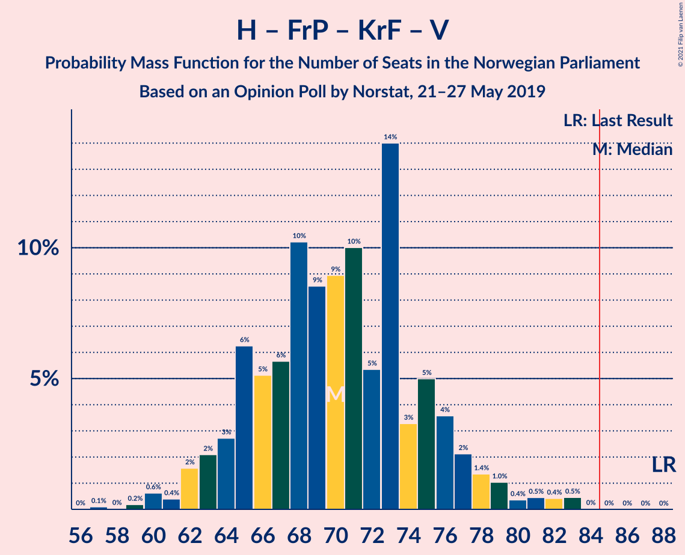

| Number of Seats | Probability | Accumulated | Special Marks |
|:---------------:|:-----------:|:-----------:|:-------------:|
| 57 | 0.1% | 100% |  |
| 58 | 0% | 99.9% |  |
| 59 | 0.2% | 99.9% |  |
| 60 | 0.6% | 99.7% |  |
| 61 | 0.4% | 99.0% |  |
| 62 | 2% | 98.6% |  |
| 63 | 2% | 97% |  |
| 64 | 3% | 95% |  |
| 65 | 6% | 92% |  |
| 66 | 5% | 86% |  |
| 67 | 6% | 81% |  |
| 68 | 10% | 75% |  |
| 69 | 9% | 65% | Median |
| 70 | 9% | 56% |  |
| 71 | 10% | 47% |  |
| 72 | 5% | 37% |  |
| 73 | 14% | 32% |  |
| 74 | 3% | 18% |  |
| 75 | 5% | 15% |  |
| 76 | 4% | 10% |  |
| 77 | 2% | 6% |  |
| 78 | 1.4% | 4% |  |
| 79 | 1.0% | 3% |  |
| 80 | 0.4% | 2% |  |
| 81 | 0.5% | 1.4% |  |
| 82 | 0.4% | 0.9% |  |
| 83 | 0.5% | 0.5% |  |
| 84 | 0% | 0% |  |
| 85 | 0% | 0% | Majority |
| 86 | 0% | 0% |  |
| 87 | 0% | 0% |  |
| 88 | 0% | 0% | Last Result |

### Arbeiderpartiet – Sosialistisk Venstreparti – Rødt – Miljøpartiet De Grønne

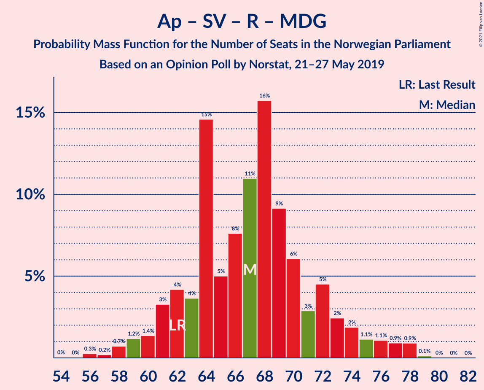

| Number of Seats | Probability | Accumulated | Special Marks |
|:---------------:|:-----------:|:-----------:|:-------------:|
| 54 | 0% | 100% |  |
| 55 | 0% | 99.9% |  |
| 56 | 0.3% | 99.9% |  |
| 57 | 0.2% | 99.7% |  |
| 58 | 0.7% | 99.5% |  |
| 59 | 1.2% | 98.7% |  |
| 60 | 1.4% | 98% |  |
| 61 | 3% | 96% |  |
| 62 | 4% | 93% | Last Result |
| 63 | 4% | 89% |  |
| 64 | 15% | 85% |  |
| 65 | 5% | 70% |  |
| 66 | 8% | 65% |  |
| 67 | 11% | 58% |  |
| 68 | 16% | 47% |  |
| 69 | 9% | 31% | Median |
| 70 | 6% | 22% |  |
| 71 | 3% | 16% |  |
| 72 | 5% | 13% |  |
| 73 | 2% | 9% |  |
| 74 | 2% | 6% |  |
| 75 | 1.1% | 4% |  |
| 76 | 1.1% | 3% |  |
| 77 | 0.9% | 2% |  |
| 78 | 0.9% | 1.1% |  |
| 79 | 0.1% | 0.2% |  |
| 80 | 0% | 0.1% |  |
| 81 | 0% | 0% |  |

### Arbeiderpartiet – Senterpartiet

| Number of Seats | Probability | Accumulated | Special Marks |
|:---------------:|:-----------:|:-----------:|:-------------:|
| 58 | 0.3% | 100% |  |
| 59 | 1.0% | 99.7% |  |
| 60 | 1.4% | 98.7% |  |
| 61 | 3% | 97% |  |
| 62 | 4% | 94% |  |
| 63 | 5% | 91% |  |
| 64 | 6% | 86% |  |
| 65 | 4% | 80% |  |
| 66 | 16% | 76% |  |
| 67 | 9% | 59% |  |
| 68 | 16% | 50% | Last Result, Median |
| 69 | 7% | 34% |  |
| 70 | 8% | 26% |  |
| 71 | 5% | 18% |  |
| 72 | 4% | 14% |  |
| 73 | 5% | 9% |  |
| 74 | 2% | 5% |  |
| 75 | 1.4% | 3% |  |
| 76 | 0.3% | 1.3% |  |
| 77 | 0.6% | 1.0% |  |
| 78 | 0.2% | 0.4% |  |
| 79 | 0.2% | 0.2% |  |
| 80 | 0% | 0% |  |

### Høyre – Fremskrittspartiet – Venstre

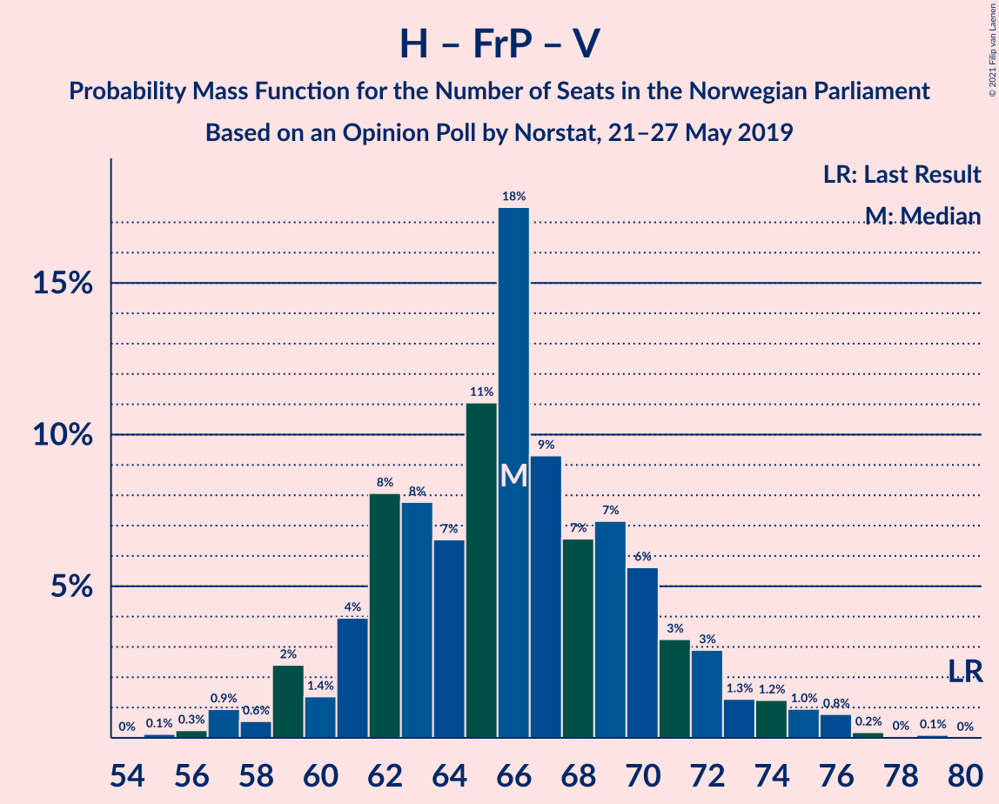

| Number of Seats | Probability | Accumulated | Special Marks |
|:---------------:|:-----------:|:-----------:|:-------------:|
| 55 | 0.1% | 100% |  |
| 56 | 0.3% | 99.9% |  |
| 57 | 0.9% | 99.6% |  |
| 58 | 0.6% | 98.7% |  |
| 59 | 2% | 98% |  |
| 60 | 1.4% | 96% |  |
| 61 | 4% | 94% |  |
| 62 | 8% | 90% |  |
| 63 | 8% | 82% |  |
| 64 | 7% | 75% |  |
| 65 | 11% | 68% |  |
| 66 | 18% | 57% | Median |
| 67 | 9% | 39% |  |
| 68 | 7% | 30% |  |
| 69 | 7% | 24% |  |
| 70 | 6% | 16% |  |
| 71 | 3% | 11% |  |
| 72 | 3% | 8% |  |
| 73 | 1.3% | 5% |  |
| 74 | 1.2% | 3% |  |
| 75 | 1.0% | 2% |  |
| 76 | 0.8% | 1.1% |  |
| 77 | 0.2% | 0.3% |  |
| 78 | 0% | 0.2% |  |
| 79 | 0.1% | 0.1% |  |
| 80 | 0% | 0% | Last Result |

### Høyre – Fremskrittspartiet

| Number of Seats | Probability | Accumulated | Special Marks |
|:---------------:|:-----------:|:-----------:|:-------------:|
| 53 | 0.2% | 100% |  |
| 54 | 0.5% | 99.8% |  |
| 55 | 1.2% | 99.2% |  |
| 56 | 1.4% | 98% |  |
| 57 | 3% | 97% |  |
| 58 | 2% | 94% |  |
| 59 | 4% | 92% |  |
| 60 | 9% | 88% |  |
| 61 | 9% | 78% |  |
| 62 | 7% | 70% |  |
| 63 | 13% | 62% |  |
| 64 | 17% | 49% | Median |
| 65 | 10% | 32% |  |
| 66 | 7% | 22% |  |
| 67 | 4% | 16% |  |
| 68 | 6% | 11% |  |
| 69 | 2% | 5% |  |
| 70 | 0.9% | 3% |  |
| 71 | 1.0% | 2% |  |
| 72 | 0.4% | 0.6% | Last Result |
| 73 | 0.1% | 0.3% |  |
| 74 | 0.1% | 0.1% |  |
| 75 | 0% | 0.1% |  |
| 76 | 0% | 0% |  |

### Arbeiderpartiet – Sosialistisk Venstreparti

| Number of Seats | Probability | Accumulated | Special Marks |
|:---------------:|:-----------:|:-----------:|:-------------:|
| 45 | 0.1% | 100% |  |
| 46 | 0.1% | 99.9% |  |
| 47 | 0.9% | 99.8% |  |
| 48 | 2% | 98.9% |  |
| 49 | 3% | 97% |  |
| 50 | 7% | 94% |  |
| 51 | 5% | 87% |  |
| 52 | 19% | 83% |  |
| 53 | 10% | 63% |  |
| 54 | 16% | 53% | Median |
| 55 | 11% | 37% |  |
| 56 | 7% | 26% |  |
| 57 | 5% | 19% |  |
| 58 | 5% | 14% |  |
| 59 | 3% | 9% |  |
| 60 | 2% | 6% | Last Result |
| 61 | 2% | 4% |  |
| 62 | 1.1% | 2% |  |
| 63 | 1.1% | 1.4% |  |
| 64 | 0.1% | 0.3% |  |
| 65 | 0% | 0.1% |  |
| 66 | 0% | 0.1% |  |
| 67 | 0% | 0% |  |

### Høyre – Kristelig Folkeparti – Venstre

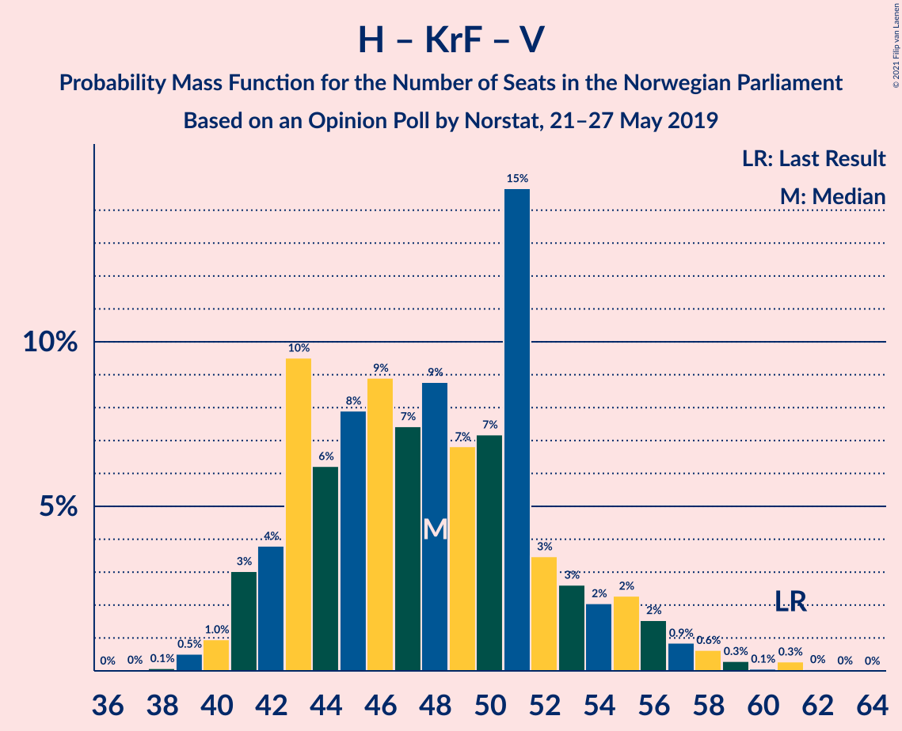

| Number of Seats | Probability | Accumulated | Special Marks |
|:---------------:|:-----------:|:-----------:|:-------------:|
| 38 | 0.1% | 100% |  |
| 39 | 0.5% | 99.9% |  |
| 40 | 1.0% | 99.4% |  |
| 41 | 3% | 98% |  |
| 42 | 4% | 95% |  |
| 43 | 10% | 92% |  |
| 44 | 6% | 82% |  |
| 45 | 8% | 76% |  |
| 46 | 9% | 68% | Median |
| 47 | 7% | 59% |  |
| 48 | 9% | 52% |  |
| 49 | 7% | 43% |  |
| 50 | 7% | 36% |  |
| 51 | 15% | 29% |  |
| 52 | 3% | 14% |  |
| 53 | 3% | 11% |  |
| 54 | 2% | 8% |  |
| 55 | 2% | 6% |  |
| 56 | 2% | 4% |  |
| 57 | 0.9% | 2% |  |
| 58 | 0.6% | 1.3% |  |
| 59 | 0.3% | 0.7% |  |
| 60 | 0.1% | 0.4% |  |
| 61 | 0.3% | 0.3% | Last Result |
| 62 | 0% | 0.1% |  |
| 63 | 0% | 0% |  |

### Senterpartiet – Kristelig Folkeparti – Venstre

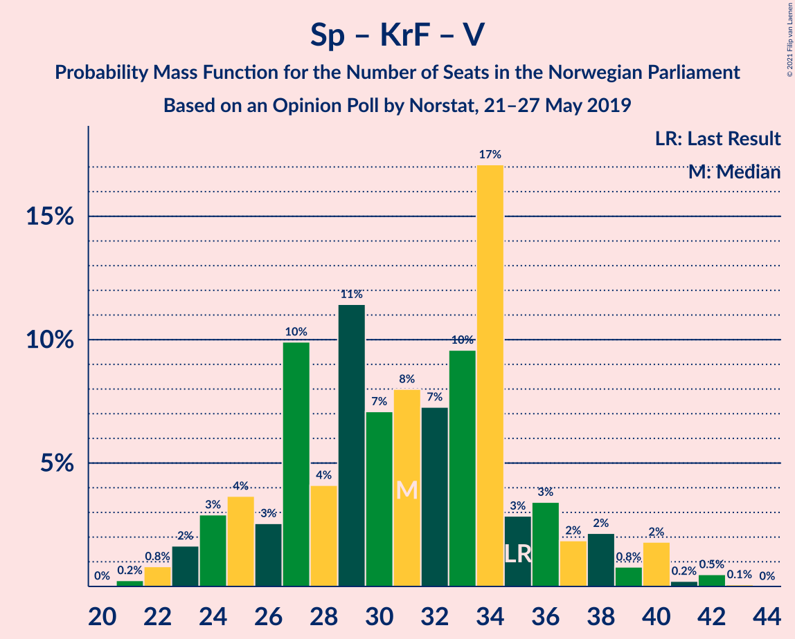

| Number of Seats | Probability | Accumulated | Special Marks |
|:---------------:|:-----------:|:-----------:|:-------------:|
| 21 | 0.2% | 100% |  |
| 22 | 0.8% | 99.7% |  |
| 23 | 2% | 98.9% |  |
| 24 | 3% | 97% |  |
| 25 | 4% | 94% |  |
| 26 | 3% | 91% |  |
| 27 | 10% | 88% |  |
| 28 | 4% | 78% |  |
| 29 | 11% | 74% |  |
| 30 | 7% | 63% | Median |
| 31 | 8% | 56% |  |
| 32 | 7% | 48% |  |
| 33 | 10% | 40% |  |
| 34 | 17% | 31% |  |
| 35 | 3% | 14% | Last Result |
| 36 | 3% | 11% |  |
| 37 | 2% | 7% |  |
| 38 | 2% | 6% |  |
| 39 | 0.8% | 3% |  |
| 40 | 2% | 3% |  |
| 41 | 0.2% | 0.8% |  |
| 42 | 0.5% | 0.6% |  |
| 43 | 0.1% | 0.1% |  |
| 44 | 0% | 0% |  |

## Technical Information

### Opinion Poll

+ **Polling firm:** Norstat
+ **Commissioner(s):** —
+ **Fieldwork period:** 21–27 May 2019

### Calculations

+ **Sample size:** 940
+ **Simulations done:** 1,048,576
+ **Error estimate:** 1.71%

