# Opinion Poll by Ipsos MMI, 27–29 May 2019

<a href="#voting-intentions">Voting Intentions</a> | <a href="#seats">Seats</a> | <a href="#coalitions">Coalitions</a> | <a href="#technical-information">Technical Information</a>

## Voting Intentions

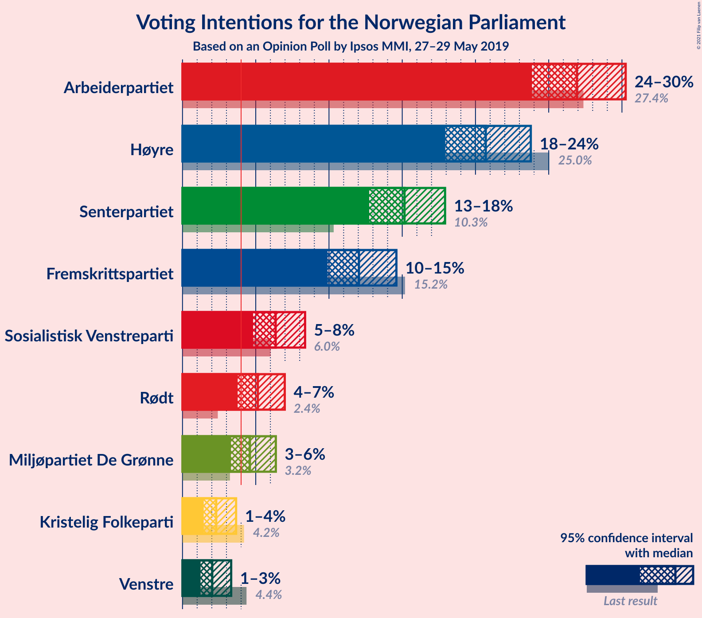

### Confidence Intervals

| Party | Last Result | Poll Result | 80% Confidence Interval | 90% Confidence Interval | 95% Confidence Interval | 99% Confidence Interval |
|:-----:|:-----------:|:-----------:|:-----------------------:|:-----------------------:|:-----------------------:|:-----------------------:|
| Arbeiderpartiet | 27.4% | 26.9% | 24.9–29.1% |24.3–29.7% |23.9–30.3% |22.9–31.3% |
| Høyre | 25.0% | 20.7% | 18.9–22.7% |18.4–23.3% |17.9–23.8% |17.1–24.8% |
| Senterpartiet | 10.3% | 15.2% | 13.6–17.0% |13.1–17.5% |12.7–17.9% |12.0–18.8% |
| Fremskrittspartiet | 15.2% | 12.0% | 10.6–13.7% |10.2–14.2% |9.9–14.6% |9.3–15.4% |
| Sosialistisk Venstreparti | 6.0% | 6.4% | 5.3–7.7% |5.1–8.0% |4.8–8.4% |4.4–9.0% |
| Rødt | 2.4% | 5.1% | 4.2–6.3% |4.0–6.7% |3.8–7.0% |3.4–7.6% |
| Miljøpartiet De Grønne | 3.2% | 4.6% | 3.7–5.7% |3.5–6.1% |3.3–6.4% |2.9–7.0% |
| Kristelig Folkeparti | 4.2% | 2.3% | 1.7–3.2% |1.6–3.4% |1.4–3.7% |1.2–4.1% |
| Venstre | 4.4% | 2.0% | 1.5–2.9% |1.4–3.1% |1.2–3.3% |1.0–3.8% |

*Note:* The poll result column reflects the actual value used in the calculations. Published results may vary slightly, and in addition be rounded to fewer digits.

## Seats

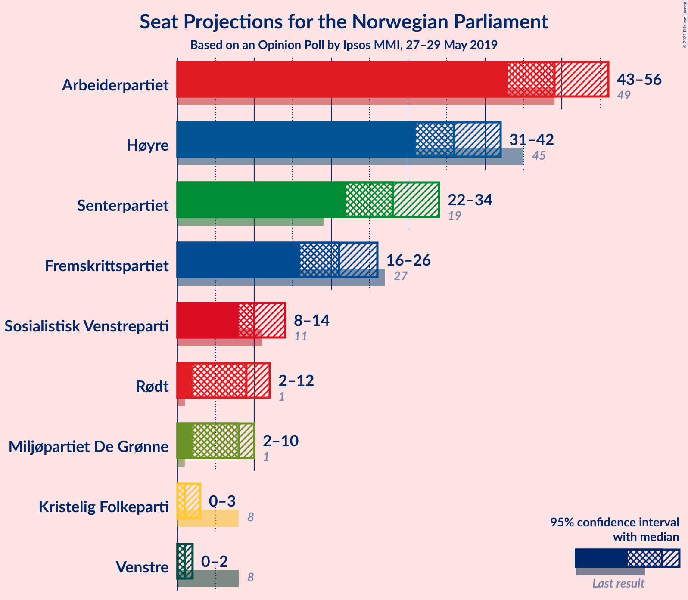

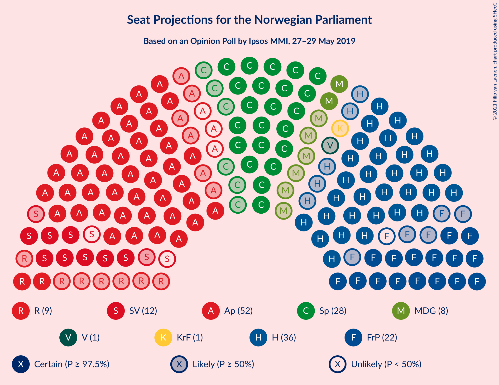

### Confidence Intervals

| Party | Last Result | Median | 80% Confidence Interval | 90% Confidence Interval | 95% Confidence Interval | 99% Confidence Interval |
|:-----:|:-----------:|:------:|:-----------------------:|:-----------------------:|:-----------------------:|:-----------------------:|
| <a href="#arbeiderpartiet">Arbeiderpartiet</a> | 49 | 49 | 45–54 |44–55 |43–56 |41–58 |
| <a href="#høyre">Høyre</a> | 45 | 36 | 34–40 |32–41 |31–42 |30–44 |
| <a href="#senterpartiet">Senterpartiet</a> | 19 | 28 | 24–33 |23–33 |22–34 |20–35 |
| <a href="#fremskrittspartiet">Fremskrittspartiet</a> | 27 | 21 | 17–24 |17–25 |16–26 |15–28 |
| <a href="#sosialistisk-venstreparti">Sosialistisk Venstreparti</a> | 11 | 10 | 9–13 |8–14 |8–14 |7–16 |
| <a href="#rødt">Rødt</a> | 1 | 9 | 7–10 |6–11 |2–12 |2–13 |
| <a href="#miljøpartiet-de-grønne">Miljøpartiet De Grønne</a> | 1 | 8 | 3–9 |2–10 |2–10 |1–12 |
| <a href="#kristelig-folkeparti">Kristelig Folkeparti</a> | 8 | 1 | 0–2 |0–3 |0–3 |0–6 |
| <a href="#venstre">Venstre</a> | 8 | 1 | 0–2 |0–2 |0–2 |0–2 |

### Arbeiderpartiet

*For a full overview of the results for this party, see the [Arbeiderpartiet](party-arbeiderpartiet.html) page.*

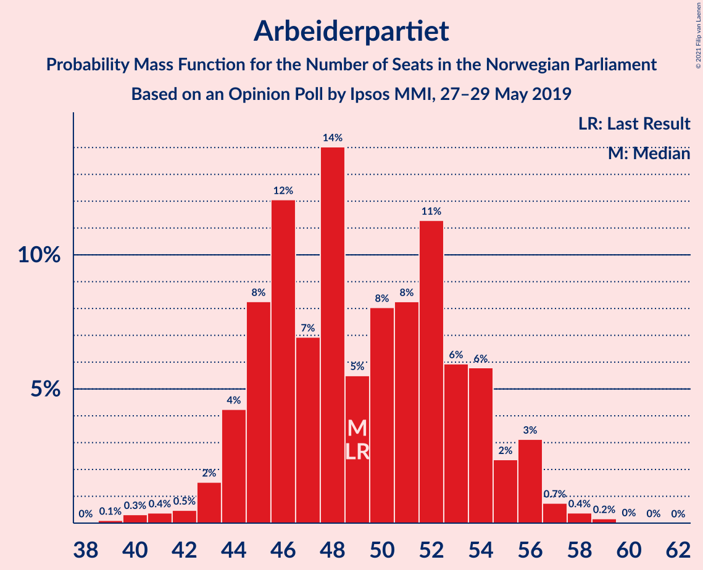

| Number of Seats | Probability | Accumulated | Special Marks |
|:---------------:|:-----------:|:-----------:|:-------------:|
| 39 | 0.1% | 100% |  |
| 40 | 0.3% | 99.9% |  |
| 41 | 0.4% | 99.6% |  |
| 42 | 0.5% | 99.2% |  |
| 43 | 2% | 98.7% |  |
| 44 | 4% | 97% |  |
| 45 | 8% | 93% |  |
| 46 | 12% | 85% |  |
| 47 | 7% | 73% |  |
| 48 | 14% | 66% |  |
| 49 | 5% | 52% | Last Result, Median |
| 50 | 8% | 46% |  |
| 51 | 8% | 38% |  |
| 52 | 11% | 30% |  |
| 53 | 6% | 19% |  |
| 54 | 6% | 13% |  |
| 55 | 2% | 7% |  |
| 56 | 3% | 4% |  |
| 57 | 0.7% | 1.4% |  |
| 58 | 0.4% | 0.6% |  |
| 59 | 0.2% | 0.2% |  |
| 60 | 0% | 0.1% |  |
| 61 | 0% | 0% |  |

### Høyre

*For a full overview of the results for this party, see the [Høyre](party-høyre.html) page.*

| Number of Seats | Probability | Accumulated | Special Marks |
|:---------------:|:-----------:|:-----------:|:-------------:|
| 28 | 0.2% | 100% |  |
| 29 | 0.2% | 99.8% |  |
| 30 | 0.9% | 99.6% |  |
| 31 | 2% | 98.7% |  |
| 32 | 2% | 97% |  |
| 33 | 4% | 94% |  |
| 34 | 8% | 91% |  |
| 35 | 17% | 83% |  |
| 36 | 23% | 66% | Median |
| 37 | 12% | 43% |  |
| 38 | 12% | 31% |  |
| 39 | 7% | 19% |  |
| 40 | 3% | 12% |  |
| 41 | 4% | 9% |  |
| 42 | 3% | 5% |  |
| 43 | 0.7% | 2% |  |
| 44 | 0.4% | 0.9% |  |
| 45 | 0.3% | 0.4% | Last Result |
| 46 | 0.1% | 0.2% |  |
| 47 | 0% | 0.1% |  |
| 48 | 0% | 0% |  |

### Senterpartiet

*For a full overview of the results for this party, see the [Senterpartiet](party-senterpartiet.html) page.*

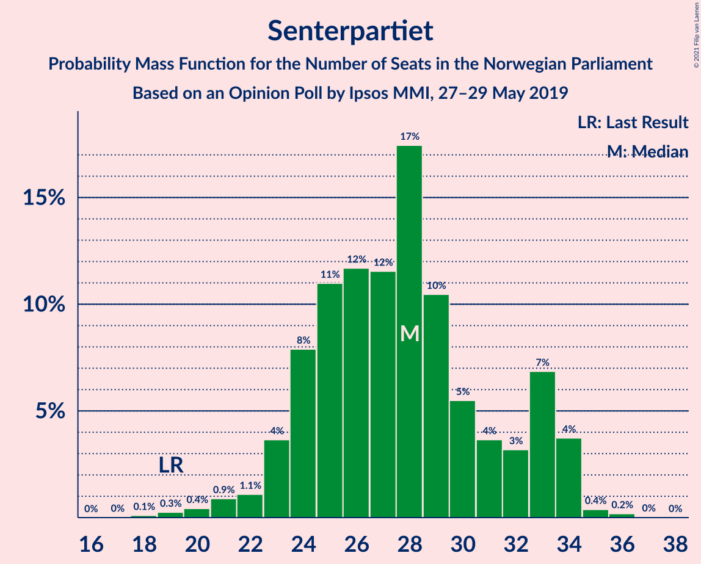

| Number of Seats | Probability | Accumulated | Special Marks |
|:---------------:|:-----------:|:-----------:|:-------------:|
| 18 | 0.1% | 100% |  |
| 19 | 0.3% | 99.9% | Last Result |
| 20 | 0.4% | 99.6% |  |
| 21 | 0.9% | 99.2% |  |
| 22 | 1.1% | 98% |  |
| 23 | 4% | 97% |  |
| 24 | 8% | 94% |  |
| 25 | 11% | 86% |  |
| 26 | 12% | 75% |  |
| 27 | 12% | 63% |  |
| 28 | 17% | 51% | Median |
| 29 | 10% | 34% |  |
| 30 | 5% | 24% |  |
| 31 | 4% | 18% |  |
| 32 | 3% | 14% |  |
| 33 | 7% | 11% |  |
| 34 | 4% | 4% |  |
| 35 | 0.4% | 0.6% |  |
| 36 | 0.2% | 0.2% |  |
| 37 | 0% | 0% |  |

### Fremskrittspartiet

*For a full overview of the results for this party, see the [Fremskrittspartiet](party-fremskrittspartiet.html) page.*

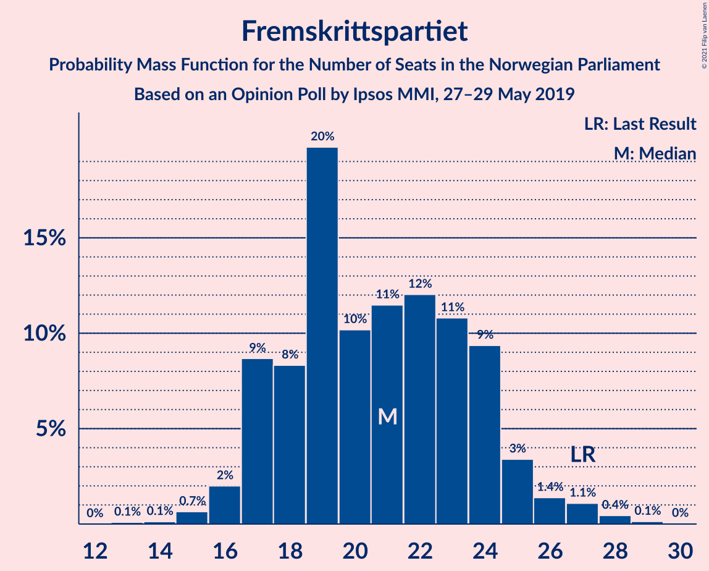

| Number of Seats | Probability | Accumulated | Special Marks |
|:---------------:|:-----------:|:-----------:|:-------------:|
| 13 | 0.1% | 100% |  |
| 14 | 0.1% | 99.9% |  |
| 15 | 0.7% | 99.8% |  |
| 16 | 2% | 99.1% |  |
| 17 | 9% | 97% |  |
| 18 | 8% | 88% |  |
| 19 | 20% | 80% |  |
| 20 | 10% | 60% |  |
| 21 | 11% | 50% | Median |
| 22 | 12% | 39% |  |
| 23 | 11% | 27% |  |
| 24 | 9% | 16% |  |
| 25 | 3% | 6% |  |
| 26 | 1.4% | 3% |  |
| 27 | 1.1% | 2% | Last Result |
| 28 | 0.4% | 0.6% |  |
| 29 | 0.1% | 0.2% |  |
| 30 | 0% | 0% |  |

### Sosialistisk Venstreparti

*For a full overview of the results for this party, see the [Sosialistisk Venstreparti](party-sosialistiskvenstreparti.html) page.*

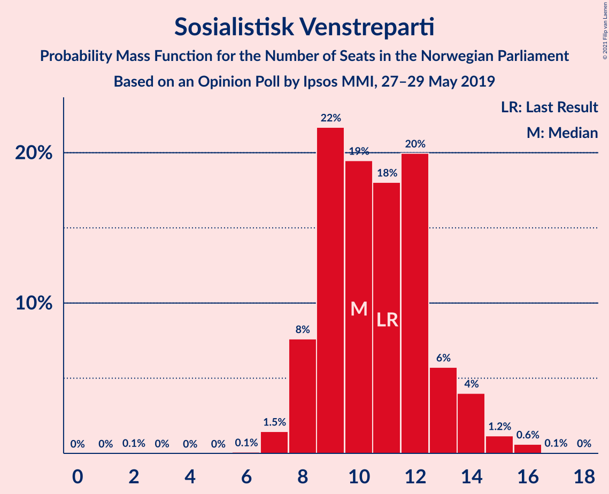

| Number of Seats | Probability | Accumulated | Special Marks |
|:---------------:|:-----------:|:-----------:|:-------------:|
| 2 | 0.1% | 100% |  |
| 3 | 0% | 99.9% |  |
| 4 | 0% | 99.9% |  |
| 5 | 0% | 99.9% |  |
| 6 | 0.1% | 99.9% |  |
| 7 | 1.5% | 99.8% |  |
| 8 | 8% | 98% |  |
| 9 | 22% | 91% |  |
| 10 | 19% | 69% | Median |
| 11 | 18% | 50% | Last Result |
| 12 | 20% | 32% |  |
| 13 | 6% | 12% |  |
| 14 | 4% | 6% |  |
| 15 | 1.2% | 2% |  |
| 16 | 0.6% | 0.7% |  |
| 17 | 0.1% | 0.1% |  |
| 18 | 0% | 0% |  |

### Rødt

*For a full overview of the results for this party, see the [Rødt](party-rødt.html) page.*

| Number of Seats | Probability | Accumulated | Special Marks |
|:---------------:|:-----------:|:-----------:|:-------------:|
| 1 | 0% | 100% | Last Result |
| 2 | 5% | 100% |  |
| 3 | 0% | 95% |  |
| 4 | 0% | 95% |  |
| 5 | 0% | 95% |  |
| 6 | 4% | 95% |  |
| 7 | 17% | 92% |  |
| 8 | 25% | 75% |  |
| 9 | 26% | 50% | Median |
| 10 | 15% | 25% |  |
| 11 | 5% | 9% |  |
| 12 | 3% | 4% |  |
| 13 | 0.7% | 0.9% |  |
| 14 | 0.2% | 0.2% |  |
| 15 | 0% | 0% |  |

### Miljøpartiet De Grønne

*For a full overview of the results for this party, see the [Miljøpartiet De Grønne](party-miljøpartietdegrønne.html) page.*

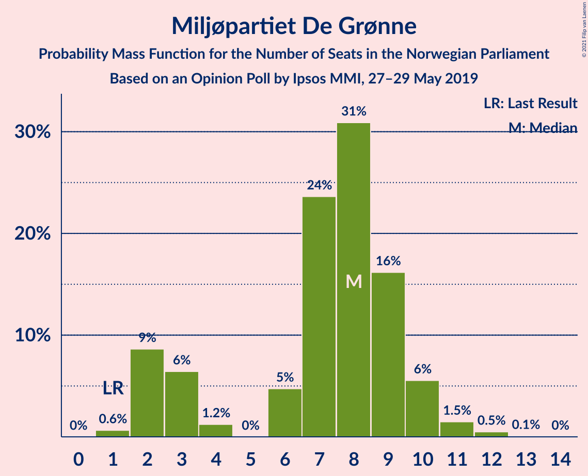

| Number of Seats | Probability | Accumulated | Special Marks |
|:---------------:|:-----------:|:-----------:|:-------------:|
| 1 | 0.6% | 100% | Last Result |
| 2 | 9% | 99.4% |  |
| 3 | 6% | 91% |  |
| 4 | 1.2% | 84% |  |
| 5 | 0% | 83% |  |
| 6 | 5% | 83% |  |
| 7 | 24% | 78% |  |
| 8 | 31% | 55% | Median |
| 9 | 16% | 24% |  |
| 10 | 6% | 8% |  |
| 11 | 1.5% | 2% |  |
| 12 | 0.5% | 0.6% |  |
| 13 | 0.1% | 0.1% |  |
| 14 | 0% | 0% |  |

### Kristelig Folkeparti

*For a full overview of the results for this party, see the [Kristelig Folkeparti](party-kristeligfolkeparti.html) page.*

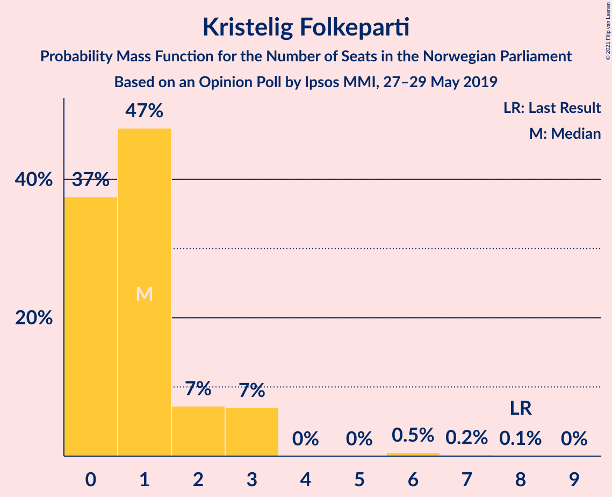

| Number of Seats | Probability | Accumulated | Special Marks |
|:---------------:|:-----------:|:-----------:|:-------------:|
| 0 | 37% | 100% |  |
| 1 | 47% | 63% | Median |
| 2 | 7% | 15% |  |
| 3 | 7% | 8% |  |
| 4 | 0% | 0.8% |  |
| 5 | 0% | 0.8% |  |
| 6 | 0.5% | 0.8% |  |
| 7 | 0.2% | 0.3% |  |
| 8 | 0.1% | 0.1% | Last Result |
| 9 | 0% | 0% |  |

### Venstre

*For a full overview of the results for this party, see the [Venstre](party-venstre.html) page.*

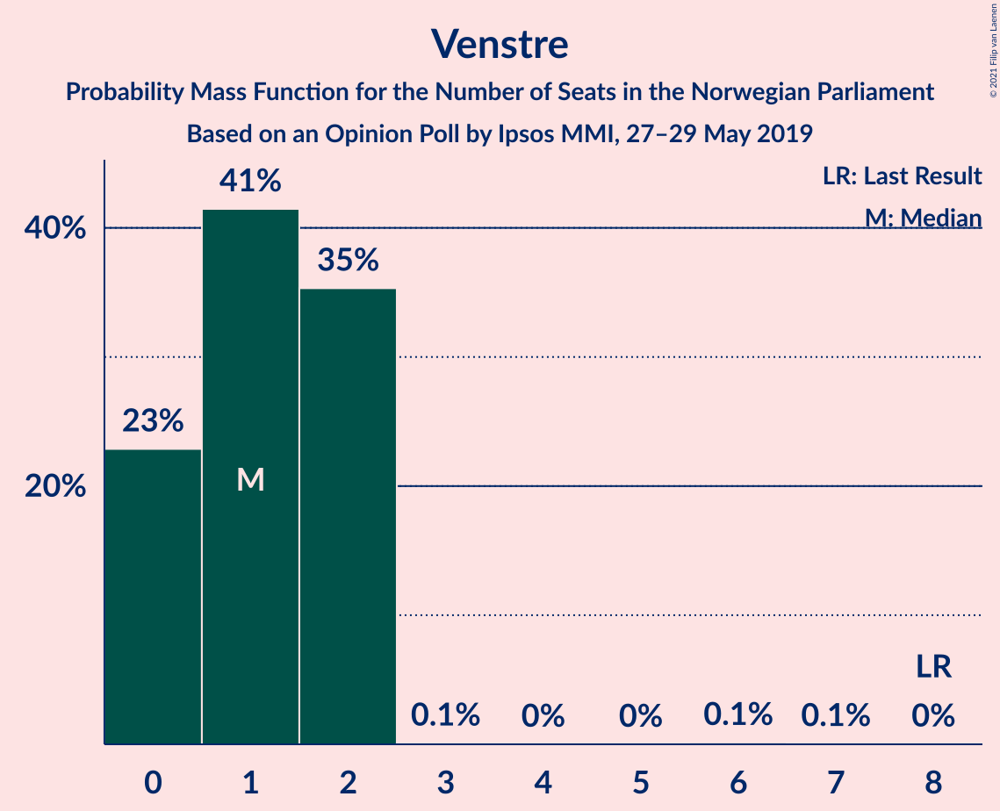

| Number of Seats | Probability | Accumulated | Special Marks |
|:---------------:|:-----------:|:-----------:|:-------------:|
| 0 | 23% | 100% |  |
| 1 | 41% | 77% | Median |
| 2 | 35% | 36% |  |
| 3 | 0.1% | 0.3% |  |
| 4 | 0% | 0.2% |  |
| 5 | 0% | 0.2% |  |
| 6 | 0.1% | 0.2% |  |
| 7 | 0.1% | 0.1% |  |
| 8 | 0% | 0% | Last Result |

## Coalitions

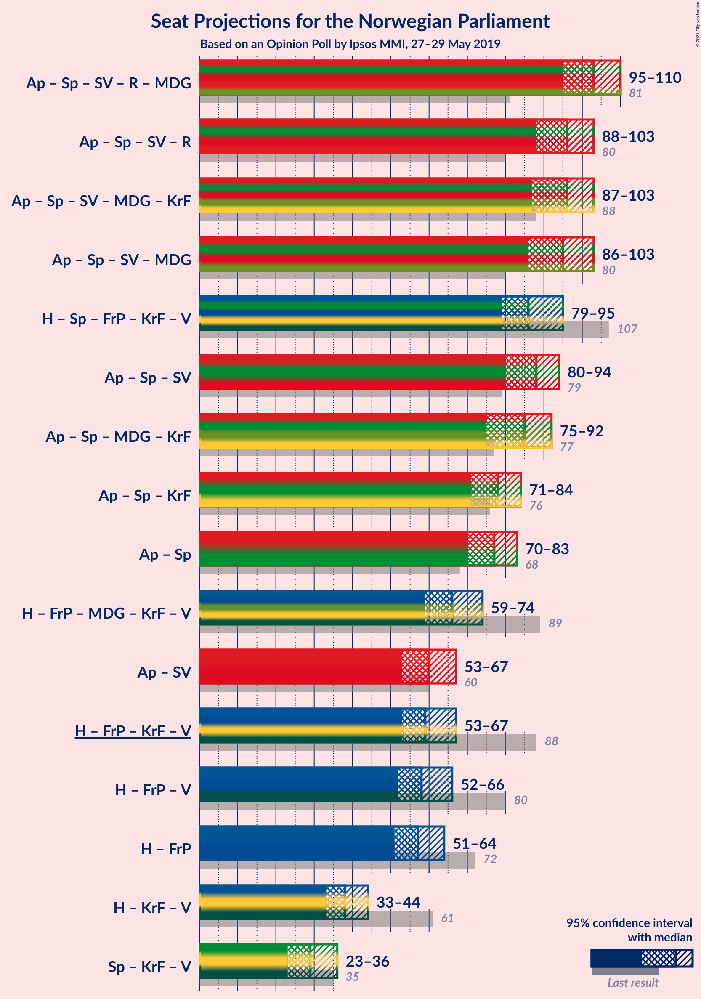

### Confidence Intervals

| Coalition | Last Result | Median | Majority? | 80% Confidence Interval | 90% Confidence Interval | 95% Confidence Interval | 99% Confidence Interval |
|:---------:|:-----------:|:------:|:---------:|:-----------------------:|:-----------------------:|:-----------------------:|:-----------------------:|
| Arbeiderpartiet – Senterpartiet – Sosialistisk Venstreparti – Rødt – Miljøpartiet De Grønne | 81 | 103 | 100% | 97–107 | 96–109 | 95–110 | 93–113 |
| Arbeiderpartiet – Senterpartiet – Sosialistisk Venstreparti – Rødt | 80 | 96 | 99.7% | 92–100 | 90–102 | 88–103 | 86–106 |
| Arbeiderpartiet – Senterpartiet – Sosialistisk Venstreparti – Miljøpartiet De Grønne – Kristelig Folkeparti | 88 | 96 | 99.7% | 91–100 | 88–101 | 87–103 | 85–105 |
| Arbeiderpartiet – Senterpartiet – Sosialistisk Venstreparti – Miljøpartiet De Grønne | 80 | 95 | 99.4% | 89–99 | 87–101 | 86–103 | 84–104 |
| Høyre – Senterpartiet – Fremskrittspartiet – Kristelig Folkeparti – Venstre | 107 | 86 | 75% | 82–92 | 80–93 | 79–95 | 77–97 |
| Arbeiderpartiet – Senterpartiet – Sosialistisk Venstreparti | 79 | 88 | 81% | 83–92 | 82–93 | 80–94 | 78–97 |
| Arbeiderpartiet – Senterpartiet – Miljøpartiet De Grønne – Kristelig Folkeparti | 77 | 85 | 60% | 80–89 | 77–91 | 75–92 | 74–94 |
| Arbeiderpartiet – Senterpartiet – Kristelig Folkeparti | 76 | 78 | 2% | 73–81 | 72–83 | 71–84 | 68–87 |
| Arbeiderpartiet – Senterpartiet | 68 | 77 | 1.1% | 72–81 | 71–82 | 70–83 | 67–86 |
| Høyre – Fremskrittspartiet – Miljøpartiet De Grønne – Kristelig Folkeparti – Venstre | 89 | 66 | 0% | 62–71 | 61–73 | 59–74 | 57–77 |
| Arbeiderpartiet – Sosialistisk Venstreparti | 60 | 60 | 0% | 55–65 | 54–66 | 53–67 | 50–69 |
| Høyre – Fremskrittspartiet – Kristelig Folkeparti – Venstre | 88 | 59 | 0% | 55–64 | 54–65 | 53–67 | 51–70 |
| Høyre – Fremskrittspartiet – Venstre | 80 | 58 | 0% | 54–63 | 53–64 | 52–66 | 50–68 |
| Høyre – Fremskrittspartiet | 72 | 57 | 0% | 53–62 | 52–63 | 51–64 | 49–67 |
| Høyre – Kristelig Folkeparti – Venstre | 61 | 38 | 0% | 35–42 | 34–43 | 33–44 | 30–47 |
| Senterpartiet – Kristelig Folkeparti – Venstre | 35 | 29 | 0% | 26–34 | 25–35 | 23–36 | 22–38 |

### Arbeiderpartiet – Senterpartiet – Sosialistisk Venstreparti – Rødt – Miljøpartiet De Grønne

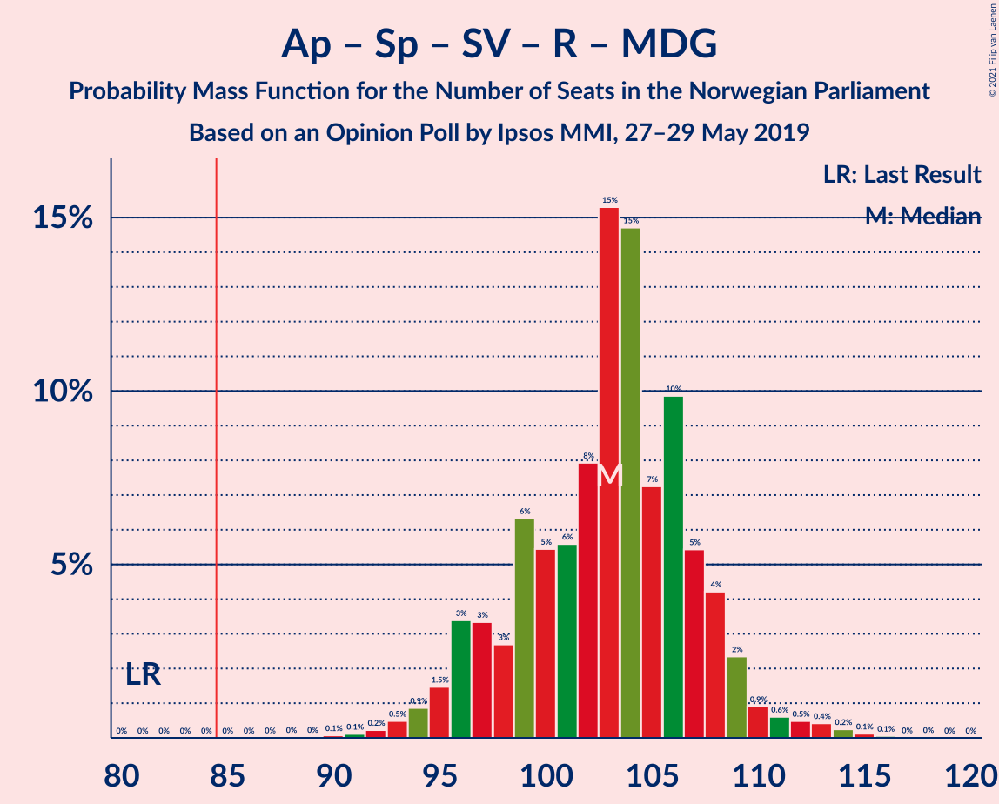

| Number of Seats | Probability | Accumulated | Special Marks |
|:---------------:|:-----------:|:-----------:|:-------------:|
| 81 | 0% | 100% | Last Result |
| 82 | 0% | 100% |  |
| 83 | 0% | 100% |  |
| 84 | 0% | 100% |  |
| 85 | 0% | 100% | Majority |
| 86 | 0% | 100% |  |
| 87 | 0% | 100% |  |
| 88 | 0% | 100% |  |
| 89 | 0% | 100% |  |
| 90 | 0.1% | 99.9% |  |
| 91 | 0.1% | 99.9% |  |
| 92 | 0.2% | 99.8% |  |
| 93 | 0.5% | 99.5% |  |
| 94 | 0.9% | 99.0% |  |
| 95 | 1.5% | 98% |  |
| 96 | 3% | 97% |  |
| 97 | 3% | 93% |  |
| 98 | 3% | 90% |  |
| 99 | 6% | 87% |  |
| 100 | 5% | 81% |  |
| 101 | 6% | 76% |  |
| 102 | 8% | 70% |  |
| 103 | 15% | 62% |  |
| 104 | 15% | 47% | Median |
| 105 | 7% | 32% |  |
| 106 | 10% | 25% |  |
| 107 | 5% | 15% |  |
| 108 | 4% | 9% |  |
| 109 | 2% | 5% |  |
| 110 | 0.9% | 3% |  |
| 111 | 0.6% | 2% |  |
| 112 | 0.5% | 1.4% |  |
| 113 | 0.4% | 0.9% |  |
| 114 | 0.2% | 0.5% |  |
| 115 | 0.1% | 0.2% |  |
| 116 | 0.1% | 0.1% |  |
| 117 | 0% | 0% |  |

### Arbeiderpartiet – Senterpartiet – Sosialistisk Venstreparti – Rødt

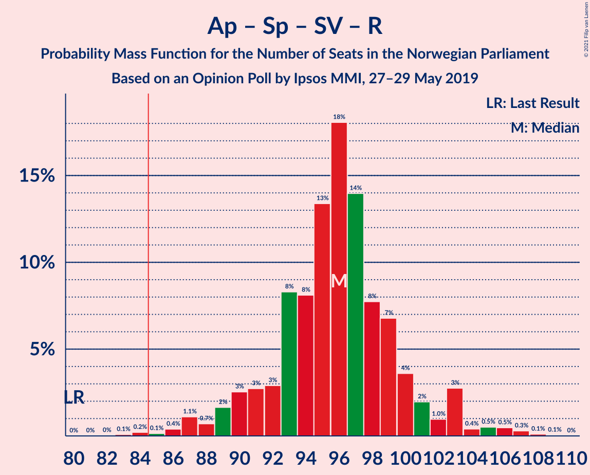

| Number of Seats | Probability | Accumulated | Special Marks |
|:---------------:|:-----------:|:-----------:|:-------------:|
| 80 | 0% | 100% | Last Result |
| 81 | 0% | 100% |  |
| 82 | 0% | 100% |  |
| 83 | 0.1% | 100% |  |
| 84 | 0.2% | 99.9% |  |
| 85 | 0.1% | 99.7% | Majority |
| 86 | 0.4% | 99.5% |  |
| 87 | 1.1% | 99.1% |  |
| 88 | 0.7% | 98% |  |
| 89 | 2% | 97% |  |
| 90 | 3% | 96% |  |
| 91 | 3% | 93% |  |
| 92 | 3% | 90% |  |
| 93 | 8% | 87% |  |
| 94 | 8% | 79% |  |
| 95 | 13% | 71% |  |
| 96 | 18% | 58% | Median |
| 97 | 14% | 40% |  |
| 98 | 8% | 26% |  |
| 99 | 7% | 18% |  |
| 100 | 4% | 11% |  |
| 101 | 2% | 8% |  |
| 102 | 1.0% | 6% |  |
| 103 | 3% | 5% |  |
| 104 | 0.4% | 2% |  |
| 105 | 0.5% | 1.5% |  |
| 106 | 0.5% | 0.9% |  |
| 107 | 0.3% | 0.5% |  |
| 108 | 0.1% | 0.2% |  |
| 109 | 0.1% | 0.1% |  |
| 110 | 0% | 0% |  |

### Arbeiderpartiet – Senterpartiet – Sosialistisk Venstreparti – Miljøpartiet De Grønne – Kristelig Folkeparti

| Number of Seats | Probability | Accumulated | Special Marks |
|:---------------:|:-----------:|:-----------:|:-------------:|
| 82 | 0.1% | 100% |  |
| 83 | 0% | 99.9% |  |
| 84 | 0.2% | 99.9% |  |
| 85 | 0.3% | 99.7% | Majority |
| 86 | 0.8% | 99.4% |  |
| 87 | 3% | 98.5% |  |
| 88 | 1.3% | 96% | Last Result |
| 89 | 2% | 95% |  |
| 90 | 2% | 93% |  |
| 91 | 4% | 90% |  |
| 92 | 8% | 86% |  |
| 93 | 8% | 78% |  |
| 94 | 8% | 70% |  |
| 95 | 8% | 62% |  |
| 96 | 12% | 54% | Median |
| 97 | 13% | 42% |  |
| 98 | 13% | 30% |  |
| 99 | 4% | 17% |  |
| 100 | 6% | 13% |  |
| 101 | 3% | 7% |  |
| 102 | 1.2% | 5% |  |
| 103 | 1.4% | 4% |  |
| 104 | 0.6% | 2% |  |
| 105 | 1.4% | 2% |  |
| 106 | 0.2% | 0.3% |  |
| 107 | 0.1% | 0.2% |  |
| 108 | 0.1% | 0.1% |  |
| 109 | 0% | 0% |  |

### Arbeiderpartiet – Senterpartiet – Sosialistisk Venstreparti – Miljøpartiet De Grønne

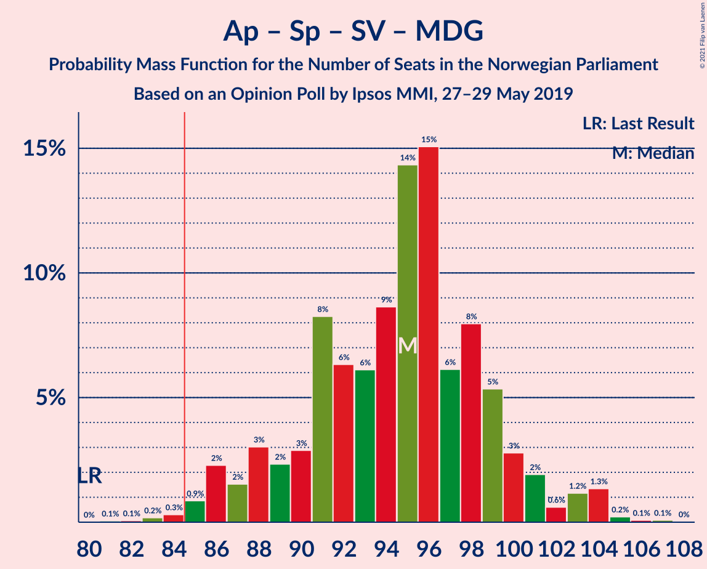

| Number of Seats | Probability | Accumulated | Special Marks |
|:---------------:|:-----------:|:-----------:|:-------------:|
| 80 | 0% | 100% | Last Result |
| 81 | 0.1% | 100% |  |
| 82 | 0.1% | 99.9% |  |
| 83 | 0.2% | 99.9% |  |
| 84 | 0.3% | 99.7% |  |
| 85 | 0.9% | 99.4% | Majority |
| 86 | 2% | 98.5% |  |
| 87 | 2% | 96% |  |
| 88 | 3% | 95% |  |
| 89 | 2% | 92% |  |
| 90 | 3% | 89% |  |
| 91 | 8% | 86% |  |
| 92 | 6% | 78% |  |
| 93 | 6% | 72% |  |
| 94 | 9% | 66% |  |
| 95 | 14% | 57% | Median |
| 96 | 15% | 43% |  |
| 97 | 6% | 28% |  |
| 98 | 8% | 22% |  |
| 99 | 5% | 14% |  |
| 100 | 3% | 8% |  |
| 101 | 2% | 5% |  |
| 102 | 0.6% | 4% |  |
| 103 | 1.2% | 3% |  |
| 104 | 1.3% | 2% |  |
| 105 | 0.2% | 0.4% |  |
| 106 | 0.1% | 0.2% |  |
| 107 | 0.1% | 0.1% |  |
| 108 | 0% | 0% |  |

### Høyre – Senterpartiet – Fremskrittspartiet – Kristelig Folkeparti – Venstre

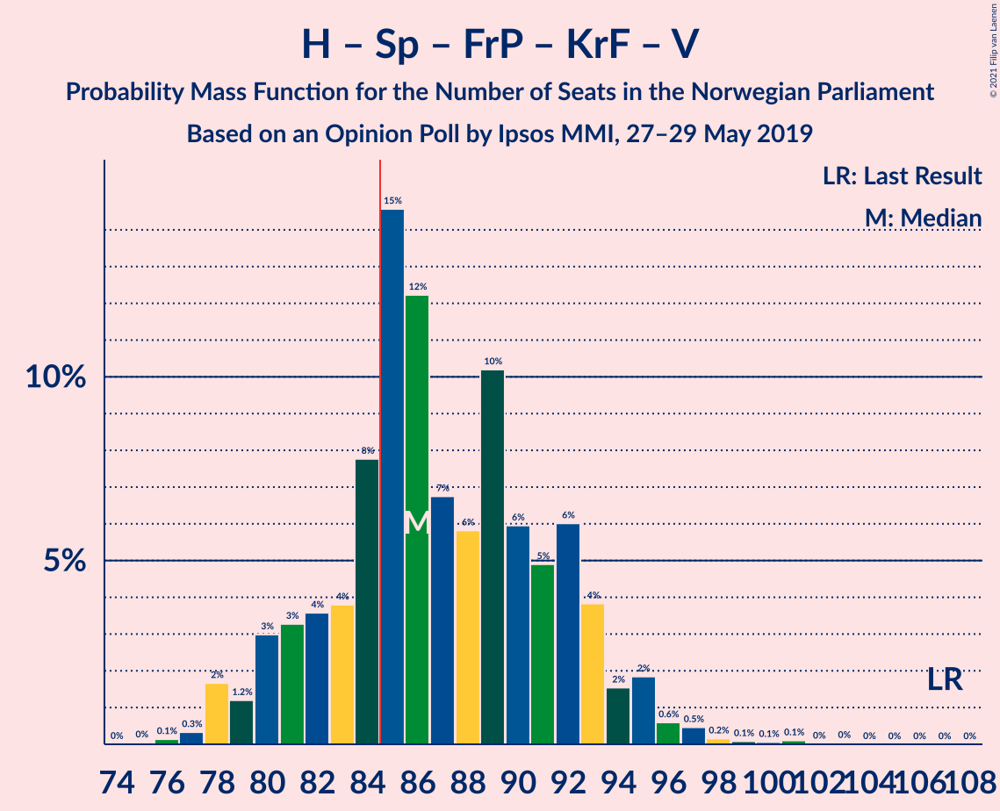

| Number of Seats | Probability | Accumulated | Special Marks |
|:---------------:|:-----------:|:-----------:|:-------------:|
| 75 | 0% | 100% |  |
| 76 | 0.1% | 99.9% |  |
| 77 | 0.3% | 99.8% |  |
| 78 | 2% | 99.5% |  |
| 79 | 1.2% | 98% |  |
| 80 | 3% | 97% |  |
| 81 | 3% | 94% |  |
| 82 | 4% | 90% |  |
| 83 | 4% | 87% |  |
| 84 | 8% | 83% |  |
| 85 | 15% | 75% | Majority |
| 86 | 12% | 61% |  |
| 87 | 7% | 48% | Median |
| 88 | 6% | 42% |  |
| 89 | 10% | 36% |  |
| 90 | 6% | 26% |  |
| 91 | 5% | 20% |  |
| 92 | 6% | 15% |  |
| 93 | 4% | 9% |  |
| 94 | 2% | 5% |  |
| 95 | 2% | 3% |  |
| 96 | 0.6% | 2% |  |
| 97 | 0.5% | 0.9% |  |
| 98 | 0.2% | 0.5% |  |
| 99 | 0.1% | 0.3% |  |
| 100 | 0.1% | 0.2% |  |
| 101 | 0.1% | 0.2% |  |
| 102 | 0% | 0.1% |  |
| 103 | 0% | 0% |  |
| 104 | 0% | 0% |  |
| 105 | 0% | 0% |  |
| 106 | 0% | 0% |  |
| 107 | 0% | 0% | Last Result |

### Arbeiderpartiet – Senterpartiet – Sosialistisk Venstreparti

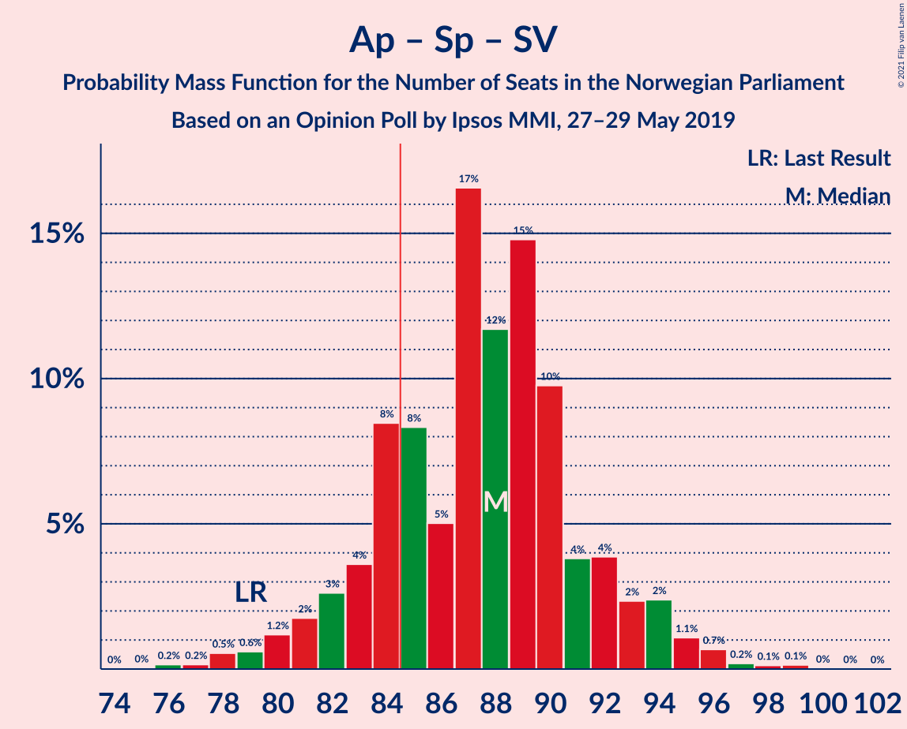

| Number of Seats | Probability | Accumulated | Special Marks |
|:---------------:|:-----------:|:-----------:|:-------------:|
| 75 | 0% | 100% |  |
| 76 | 0.2% | 99.9% |  |
| 77 | 0.2% | 99.8% |  |
| 78 | 0.5% | 99.6% |  |
| 79 | 0.6% | 99.1% | Last Result |
| 80 | 1.2% | 98% |  |
| 81 | 2% | 97% |  |
| 82 | 3% | 96% |  |
| 83 | 4% | 93% |  |
| 84 | 8% | 89% |  |
| 85 | 8% | 81% | Majority |
| 86 | 5% | 73% |  |
| 87 | 17% | 67% | Median |
| 88 | 12% | 51% |  |
| 89 | 15% | 39% |  |
| 90 | 10% | 24% |  |
| 91 | 4% | 15% |  |
| 92 | 4% | 11% |  |
| 93 | 2% | 7% |  |
| 94 | 2% | 5% |  |
| 95 | 1.1% | 2% |  |
| 96 | 0.7% | 1.2% |  |
| 97 | 0.2% | 0.5% |  |
| 98 | 0.1% | 0.3% |  |
| 99 | 0.1% | 0.2% |  |
| 100 | 0% | 0.1% |  |
| 101 | 0% | 0% |  |

### Arbeiderpartiet – Senterpartiet – Miljøpartiet De Grønne – Kristelig Folkeparti

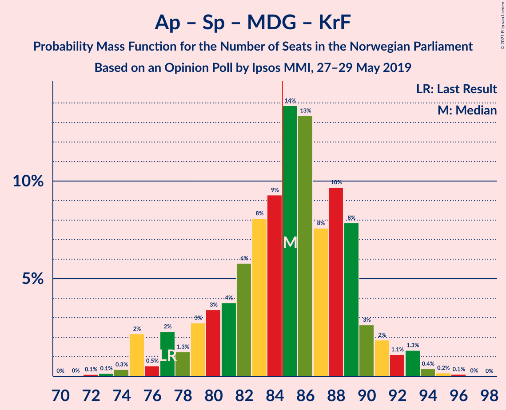

| Number of Seats | Probability | Accumulated | Special Marks |
|:---------------:|:-----------:|:-----------:|:-------------:|
| 71 | 0% | 100% |  |
| 72 | 0.1% | 99.9% |  |
| 73 | 0.1% | 99.8% |  |
| 74 | 0.3% | 99.7% |  |
| 75 | 2% | 99.3% |  |
| 76 | 0.5% | 97% |  |
| 77 | 2% | 97% | Last Result |
| 78 | 1.3% | 94% |  |
| 79 | 3% | 93% |  |
| 80 | 3% | 90% |  |
| 81 | 4% | 87% |  |
| 82 | 6% | 83% |  |
| 83 | 8% | 77% |  |
| 84 | 9% | 69% |  |
| 85 | 14% | 60% | Majority |
| 86 | 13% | 46% | Median |
| 87 | 8% | 33% |  |
| 88 | 10% | 25% |  |
| 89 | 8% | 16% |  |
| 90 | 3% | 8% |  |
| 91 | 2% | 5% |  |
| 92 | 1.1% | 3% |  |
| 93 | 1.3% | 2% |  |
| 94 | 0.4% | 0.7% |  |
| 95 | 0.2% | 0.3% |  |
| 96 | 0.1% | 0.2% |  |
| 97 | 0% | 0.1% |  |
| 98 | 0% | 0% |  |

### Arbeiderpartiet – Senterpartiet – Kristelig Folkeparti

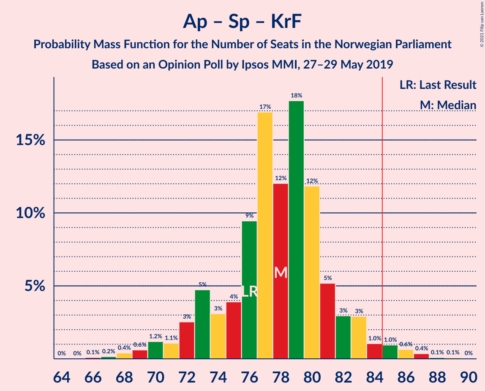

| Number of Seats | Probability | Accumulated | Special Marks |
|:---------------:|:-----------:|:-----------:|:-------------:|
| 66 | 0.1% | 100% |  |
| 67 | 0.2% | 99.9% |  |
| 68 | 0.4% | 99.7% |  |
| 69 | 0.6% | 99.3% |  |
| 70 | 1.2% | 98.7% |  |
| 71 | 1.1% | 98% |  |
| 72 | 3% | 96% |  |
| 73 | 5% | 94% |  |
| 74 | 3% | 89% |  |
| 75 | 4% | 86% |  |
| 76 | 9% | 82% | Last Result |
| 77 | 17% | 73% |  |
| 78 | 12% | 56% | Median |
| 79 | 18% | 44% |  |
| 80 | 12% | 26% |  |
| 81 | 5% | 14% |  |
| 82 | 3% | 9% |  |
| 83 | 3% | 6% |  |
| 84 | 1.0% | 3% |  |
| 85 | 1.0% | 2% | Majority |
| 86 | 0.6% | 1.2% |  |
| 87 | 0.4% | 0.6% |  |
| 88 | 0.1% | 0.2% |  |
| 89 | 0.1% | 0.1% |  |
| 90 | 0% | 0% |  |

### Arbeiderpartiet – Senterpartiet

| Number of Seats | Probability | Accumulated | Special Marks |
|:---------------:|:-----------:|:-----------:|:-------------:|
| 65 | 0% | 100% |  |
| 66 | 0.2% | 99.9% |  |
| 67 | 0.2% | 99.7% |  |
| 68 | 0.7% | 99.5% | Last Result |
| 69 | 1.1% | 98.8% |  |
| 70 | 1.2% | 98% |  |
| 71 | 2% | 96% |  |
| 72 | 5% | 94% |  |
| 73 | 4% | 89% |  |
| 74 | 6% | 86% |  |
| 75 | 9% | 80% |  |
| 76 | 14% | 71% |  |
| 77 | 9% | 57% | Median |
| 78 | 16% | 48% |  |
| 79 | 15% | 32% |  |
| 80 | 7% | 17% |  |
| 81 | 4% | 10% |  |
| 82 | 3% | 6% |  |
| 83 | 0.9% | 3% |  |
| 84 | 1.0% | 2% |  |
| 85 | 0.5% | 1.1% | Majority |
| 86 | 0.4% | 0.6% |  |
| 87 | 0.2% | 0.2% |  |
| 88 | 0% | 0.1% |  |
| 89 | 0% | 0% |  |

### Høyre – Fremskrittspartiet – Miljøpartiet De Grønne – Kristelig Folkeparti – Venstre

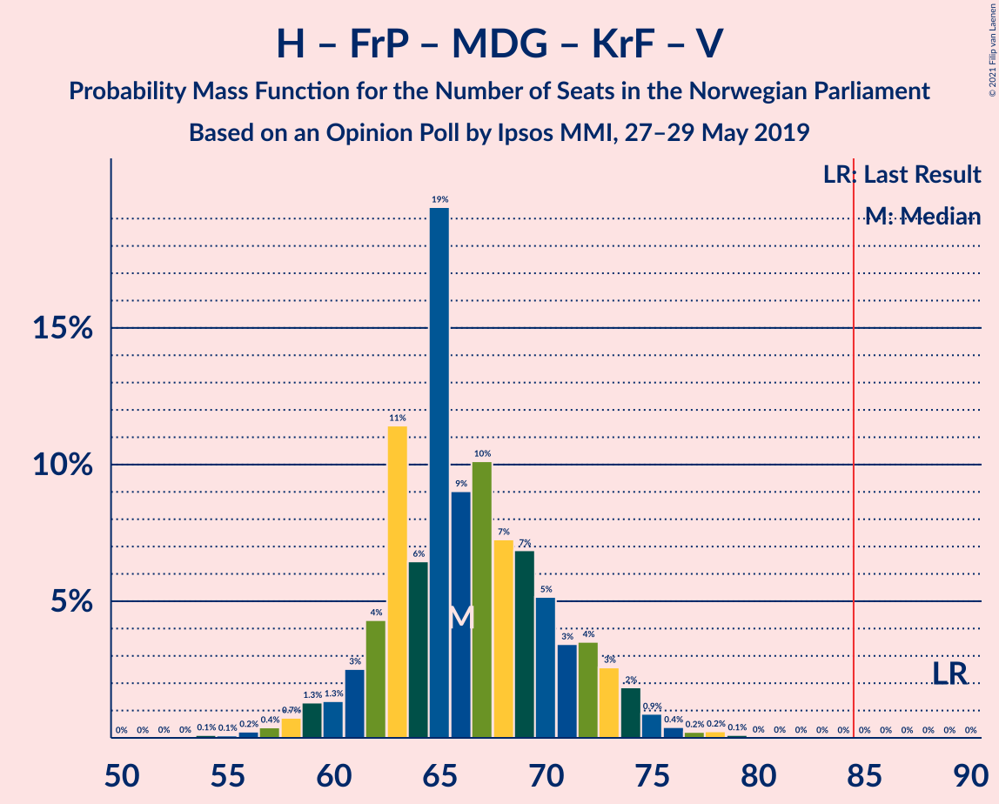

| Number of Seats | Probability | Accumulated | Special Marks |
|:---------------:|:-----------:|:-----------:|:-------------:|
| 54 | 0.1% | 100% |  |
| 55 | 0.1% | 99.9% |  |
| 56 | 0.2% | 99.8% |  |
| 57 | 0.4% | 99.6% |  |
| 58 | 0.7% | 99.2% |  |
| 59 | 1.3% | 98% |  |
| 60 | 1.3% | 97% |  |
| 61 | 3% | 96% |  |
| 62 | 4% | 93% |  |
| 63 | 11% | 89% |  |
| 64 | 6% | 78% |  |
| 65 | 19% | 71% |  |
| 66 | 9% | 52% |  |
| 67 | 10% | 43% | Median |
| 68 | 7% | 33% |  |
| 69 | 7% | 25% |  |
| 70 | 5% | 18% |  |
| 71 | 3% | 13% |  |
| 72 | 4% | 10% |  |
| 73 | 3% | 6% |  |
| 74 | 2% | 4% |  |
| 75 | 0.9% | 2% |  |
| 76 | 0.4% | 1.0% |  |
| 77 | 0.2% | 0.6% |  |
| 78 | 0.2% | 0.4% |  |
| 79 | 0.1% | 0.2% |  |
| 80 | 0% | 0.1% |  |
| 81 | 0% | 0% |  |
| 82 | 0% | 0% |  |
| 83 | 0% | 0% |  |
| 84 | 0% | 0% |  |
| 85 | 0% | 0% | Majority |
| 86 | 0% | 0% |  |
| 87 | 0% | 0% |  |
| 88 | 0% | 0% |  |
| 89 | 0% | 0% | Last Result |

### Arbeiderpartiet – Sosialistisk Venstreparti

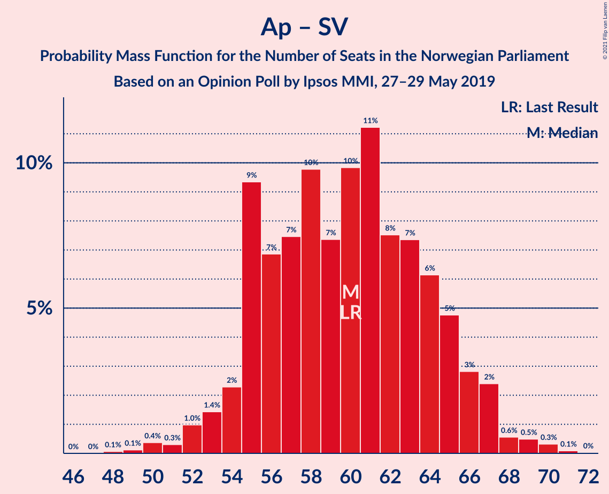

| Number of Seats | Probability | Accumulated | Special Marks |
|:---------------:|:-----------:|:-----------:|:-------------:|
| 48 | 0.1% | 100% |  |
| 49 | 0.1% | 99.9% |  |
| 50 | 0.4% | 99.8% |  |
| 51 | 0.3% | 99.4% |  |
| 52 | 1.0% | 99.1% |  |
| 53 | 1.4% | 98% |  |
| 54 | 2% | 97% |  |
| 55 | 9% | 94% |  |
| 56 | 7% | 85% |  |
| 57 | 7% | 78% |  |
| 58 | 10% | 71% |  |
| 59 | 7% | 61% | Median |
| 60 | 10% | 54% | Last Result |
| 61 | 11% | 44% |  |
| 62 | 8% | 33% |  |
| 63 | 7% | 25% |  |
| 64 | 6% | 18% |  |
| 65 | 5% | 12% |  |
| 66 | 3% | 7% |  |
| 67 | 2% | 4% |  |
| 68 | 0.6% | 2% |  |
| 69 | 0.5% | 1.0% |  |
| 70 | 0.3% | 0.5% |  |
| 71 | 0.1% | 0.1% |  |
| 72 | 0% | 0% |  |

### Høyre – Fremskrittspartiet – Kristelig Folkeparti – Venstre

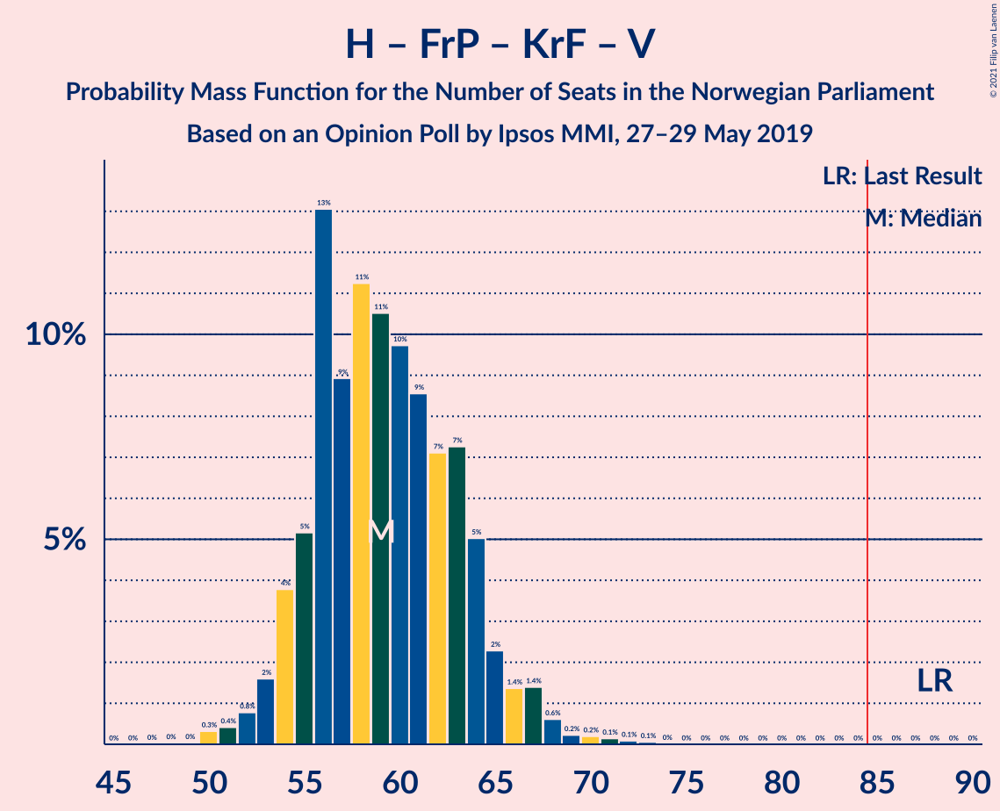

| Number of Seats | Probability | Accumulated | Special Marks |
|:---------------:|:-----------:|:-----------:|:-------------:|
| 48 | 0% | 100% |  |
| 49 | 0% | 99.9% |  |
| 50 | 0.3% | 99.9% |  |
| 51 | 0.4% | 99.6% |  |
| 52 | 0.8% | 99.2% |  |
| 53 | 2% | 98% |  |
| 54 | 4% | 97% |  |
| 55 | 5% | 93% |  |
| 56 | 13% | 88% |  |
| 57 | 9% | 75% |  |
| 58 | 11% | 66% |  |
| 59 | 11% | 55% | Median |
| 60 | 10% | 44% |  |
| 61 | 9% | 34% |  |
| 62 | 7% | 26% |  |
| 63 | 7% | 19% |  |
| 64 | 5% | 11% |  |
| 65 | 2% | 6% |  |
| 66 | 1.4% | 4% |  |
| 67 | 1.4% | 3% |  |
| 68 | 0.6% | 1.3% |  |
| 69 | 0.2% | 0.7% |  |
| 70 | 0.2% | 0.5% |  |
| 71 | 0.1% | 0.3% |  |
| 72 | 0.1% | 0.2% |  |
| 73 | 0.1% | 0.1% |  |
| 74 | 0% | 0% |  |
| 75 | 0% | 0% |  |
| 76 | 0% | 0% |  |
| 77 | 0% | 0% |  |
| 78 | 0% | 0% |  |
| 79 | 0% | 0% |  |
| 80 | 0% | 0% |  |
| 81 | 0% | 0% |  |
| 82 | 0% | 0% |  |
| 83 | 0% | 0% |  |
| 84 | 0% | 0% |  |
| 85 | 0% | 0% | Majority |
| 86 | 0% | 0% |  |
| 87 | 0% | 0% |  |
| 88 | 0% | 0% | Last Result |

### Høyre – Fremskrittspartiet – Venstre

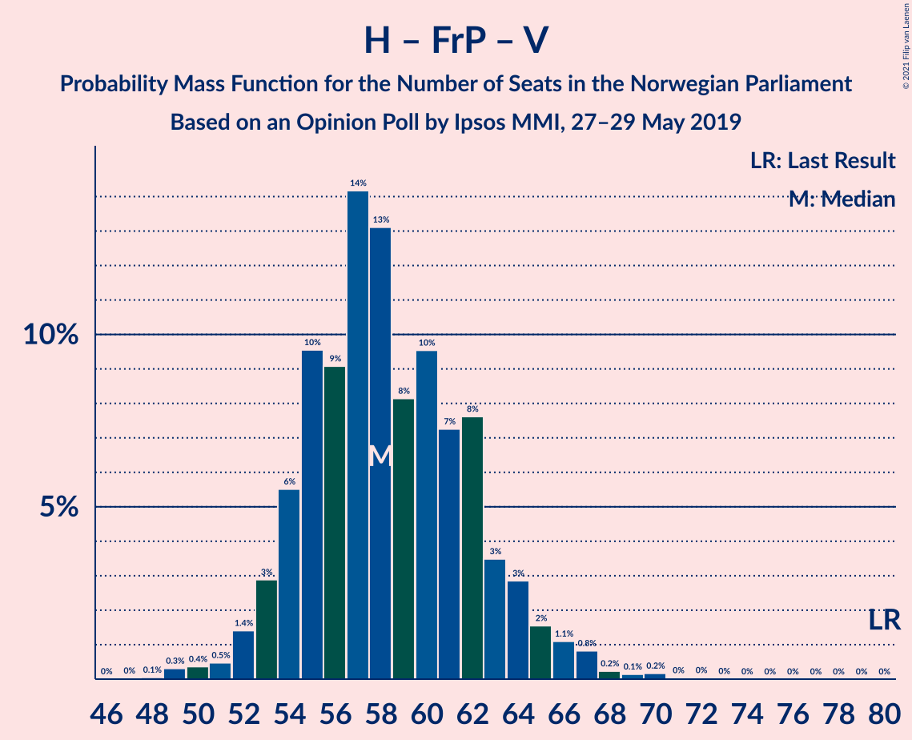

| Number of Seats | Probability | Accumulated | Special Marks |
|:---------------:|:-----------:|:-----------:|:-------------:|
| 48 | 0.1% | 100% |  |
| 49 | 0.3% | 99.9% |  |
| 50 | 0.4% | 99.6% |  |
| 51 | 0.5% | 99.2% |  |
| 52 | 1.4% | 98.8% |  |
| 53 | 3% | 97% |  |
| 54 | 6% | 94% |  |
| 55 | 10% | 89% |  |
| 56 | 9% | 79% |  |
| 57 | 14% | 70% |  |
| 58 | 13% | 56% | Median |
| 59 | 8% | 43% |  |
| 60 | 10% | 35% |  |
| 61 | 7% | 25% |  |
| 62 | 8% | 18% |  |
| 63 | 3% | 10% |  |
| 64 | 3% | 7% |  |
| 65 | 2% | 4% |  |
| 66 | 1.1% | 3% |  |
| 67 | 0.8% | 1.5% |  |
| 68 | 0.2% | 0.6% |  |
| 69 | 0.1% | 0.4% |  |
| 70 | 0.2% | 0.3% |  |
| 71 | 0% | 0.1% |  |
| 72 | 0% | 0.1% |  |
| 73 | 0% | 0% |  |
| 74 | 0% | 0% |  |
| 75 | 0% | 0% |  |
| 76 | 0% | 0% |  |
| 77 | 0% | 0% |  |
| 78 | 0% | 0% |  |
| 79 | 0% | 0% |  |
| 80 | 0% | 0% | Last Result |

### Høyre – Fremskrittspartiet

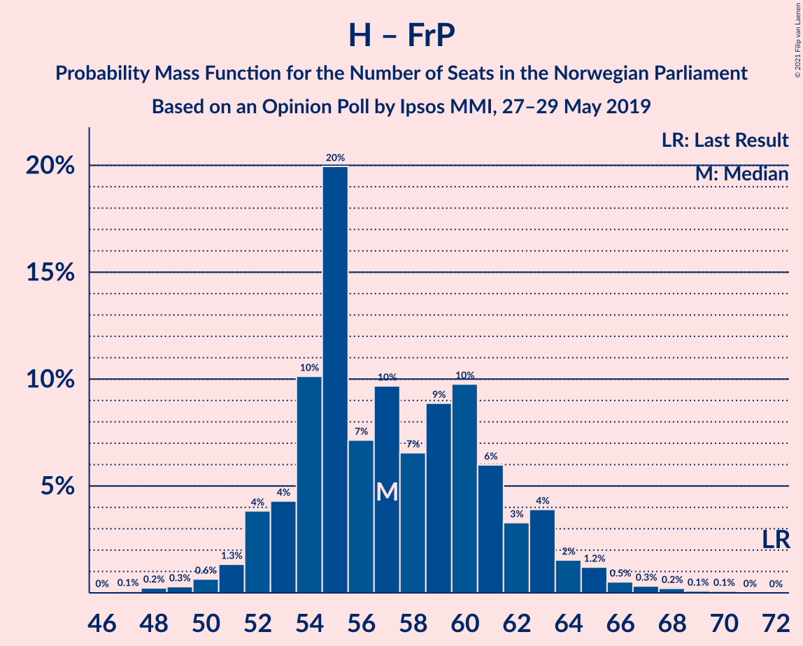

| Number of Seats | Probability | Accumulated | Special Marks |
|:---------------:|:-----------:|:-----------:|:-------------:|
| 47 | 0.1% | 100% |  |
| 48 | 0.2% | 99.9% |  |
| 49 | 0.3% | 99.7% |  |
| 50 | 0.6% | 99.4% |  |
| 51 | 1.3% | 98.7% |  |
| 52 | 4% | 97% |  |
| 53 | 4% | 94% |  |
| 54 | 10% | 89% |  |
| 55 | 20% | 79% |  |
| 56 | 7% | 59% |  |
| 57 | 10% | 52% | Median |
| 58 | 7% | 42% |  |
| 59 | 9% | 36% |  |
| 60 | 10% | 27% |  |
| 61 | 6% | 17% |  |
| 62 | 3% | 11% |  |
| 63 | 4% | 8% |  |
| 64 | 2% | 4% |  |
| 65 | 1.2% | 2% |  |
| 66 | 0.5% | 1.2% |  |
| 67 | 0.3% | 0.7% |  |
| 68 | 0.2% | 0.4% |  |
| 69 | 0.1% | 0.2% |  |
| 70 | 0.1% | 0.1% |  |
| 71 | 0% | 0% |  |
| 72 | 0% | 0% | Last Result |

### Høyre – Kristelig Folkeparti – Venstre

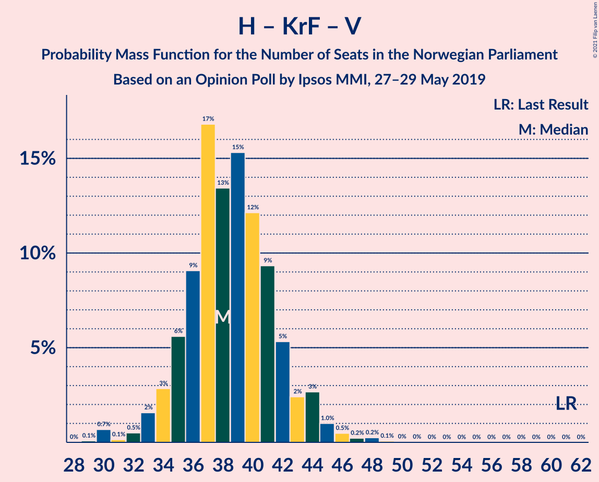

| Number of Seats | Probability | Accumulated | Special Marks |
|:---------------:|:-----------:|:-----------:|:-------------:|
| 29 | 0.1% | 100% |  |
| 30 | 0.7% | 99.9% |  |
| 31 | 0.1% | 99.2% |  |
| 32 | 0.5% | 99.1% |  |
| 33 | 2% | 98.6% |  |
| 34 | 3% | 97% |  |
| 35 | 6% | 94% |  |
| 36 | 9% | 89% |  |
| 37 | 17% | 79% |  |
| 38 | 13% | 63% | Median |
| 39 | 15% | 49% |  |
| 40 | 12% | 34% |  |
| 41 | 9% | 22% |  |
| 42 | 5% | 12% |  |
| 43 | 2% | 7% |  |
| 44 | 3% | 5% |  |
| 45 | 1.0% | 2% |  |
| 46 | 0.5% | 1.1% |  |
| 47 | 0.2% | 0.6% |  |
| 48 | 0.2% | 0.4% |  |
| 49 | 0.1% | 0.1% |  |
| 50 | 0% | 0.1% |  |
| 51 | 0% | 0% |  |
| 52 | 0% | 0% |  |
| 53 | 0% | 0% |  |
| 54 | 0% | 0% |  |
| 55 | 0% | 0% |  |
| 56 | 0% | 0% |  |
| 57 | 0% | 0% |  |
| 58 | 0% | 0% |  |
| 59 | 0% | 0% |  |
| 60 | 0% | 0% |  |
| 61 | 0% | 0% | Last Result |

### Senterpartiet – Kristelig Folkeparti – Venstre

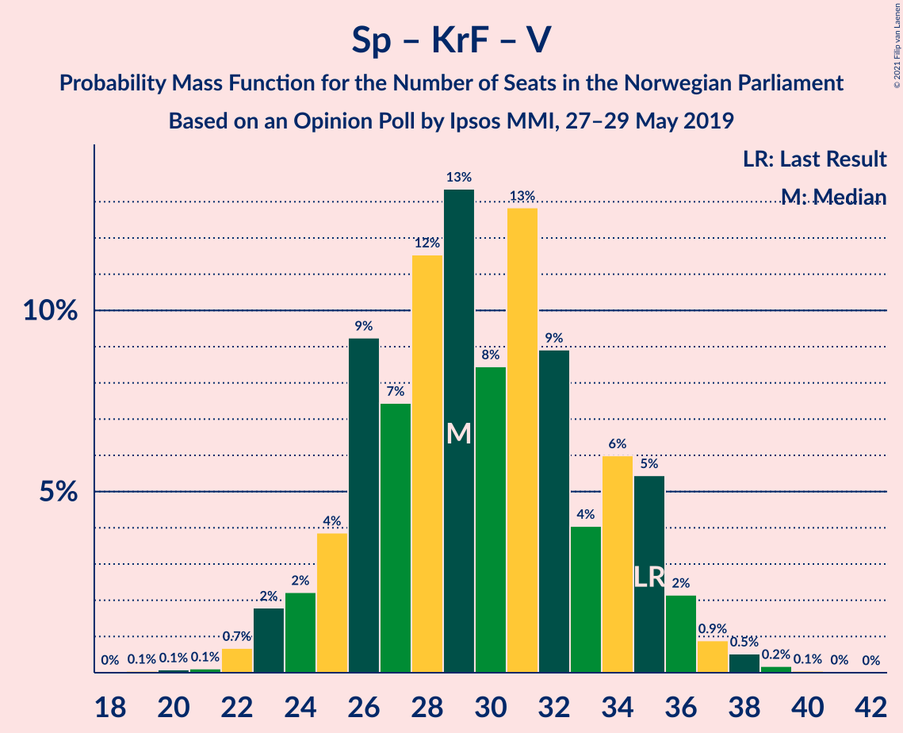

| Number of Seats | Probability | Accumulated | Special Marks |
|:---------------:|:-----------:|:-----------:|:-------------:|
| 19 | 0.1% | 100% |  |
| 20 | 0.1% | 99.9% |  |
| 21 | 0.1% | 99.8% |  |
| 22 | 0.7% | 99.7% |  |
| 23 | 2% | 99.0% |  |
| 24 | 2% | 97% |  |
| 25 | 4% | 95% |  |
| 26 | 9% | 91% |  |
| 27 | 7% | 82% |  |
| 28 | 12% | 74% |  |
| 29 | 13% | 63% |  |
| 30 | 8% | 50% | Median |
| 31 | 13% | 41% |  |
| 32 | 9% | 28% |  |
| 33 | 4% | 19% |  |
| 34 | 6% | 15% |  |
| 35 | 5% | 9% | Last Result |
| 36 | 2% | 4% |  |
| 37 | 0.9% | 2% |  |
| 38 | 0.5% | 0.8% |  |
| 39 | 0.2% | 0.3% |  |
| 40 | 0.1% | 0.1% |  |
| 41 | 0% | 0.1% |  |
| 42 | 0% | 0% |  |

## Technical Information

### Opinion Poll

+ **Polling firm:** Ipsos MMI
+ **Commissioner(s):** —
+ **Fieldwork period:** 27–29 May 2019

### Calculations

+ **Sample size:** 739
+ **Simulations done:** 1,048,576
+ **Error estimate:** 1.74%

