# Opinion Poll by Norstat, 28 May–3 June 2019

<a href="#voting-intentions">Voting Intentions</a> | <a href="#seats">Seats</a> | <a href="#coalitions">Coalitions</a> | <a href="#technical-information">Technical Information</a>

## Voting Intentions

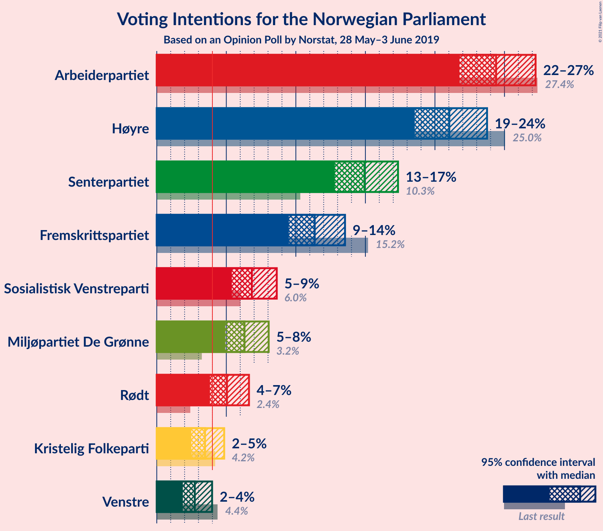

### Confidence Intervals

| Party | Last Result | Poll Result | 80% Confidence Interval | 90% Confidence Interval | 95% Confidence Interval | 99% Confidence Interval |
|:-----:|:-----------:|:-----------:|:-----------------------:|:-----------------------:|:-----------------------:|:-----------------------:|
| Arbeiderpartiet | 27.4% | 24.4% | 22.7–26.2% |22.2–26.8% |21.8–27.2% |21.0–28.1% |
| Høyre | 25.0% | 21.0% | 19.4–22.8% |18.9–23.3% |18.5–23.7% |17.8–24.6% |
| Senterpartiet | 10.3% | 14.9% | 13.5–16.5% |13.1–16.9% |12.8–17.3% |12.2–18.1% |
| Fremskrittspartiet | 15.2% | 11.4% | 10.1–12.8% |9.8–13.2% |9.5–13.5% |8.9–14.3% |
| Sosialistisk Venstreparti | 6.0% | 6.8% | 5.9–8.0% |5.6–8.3% |5.4–8.6% |5.0–9.2% |
| Miljøpartiet De Grønne | 3.2% | 6.3% | 5.4–7.4% |5.1–7.8% |4.9–8.0% |4.5–8.6% |
| Rødt | 2.4% | 5.0% | 4.2–6.1% |4.0–6.4% |3.8–6.6% |3.5–7.2% |
| Kristelig Folkeparti | 4.2% | 3.5% | 2.8–4.4% |2.6–4.6% |2.5–4.8% |2.2–5.3% |
| Venstre | 4.4% | 2.7% | 2.2–3.6% |2.0–3.8% |1.9–4.0% |1.6–4.4% |

*Note:* The poll result column reflects the actual value used in the calculations. Published results may vary slightly, and in addition be rounded to fewer digits.

## Seats

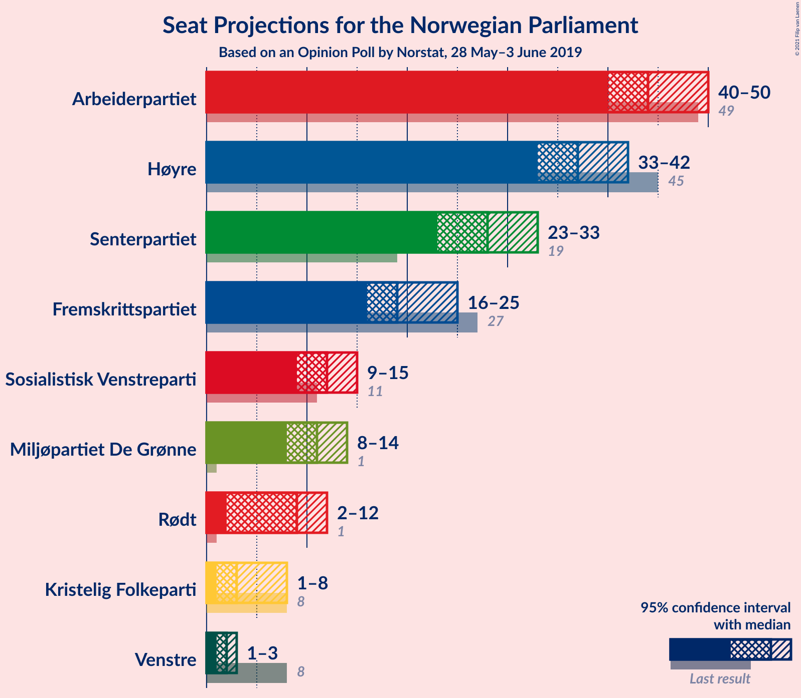

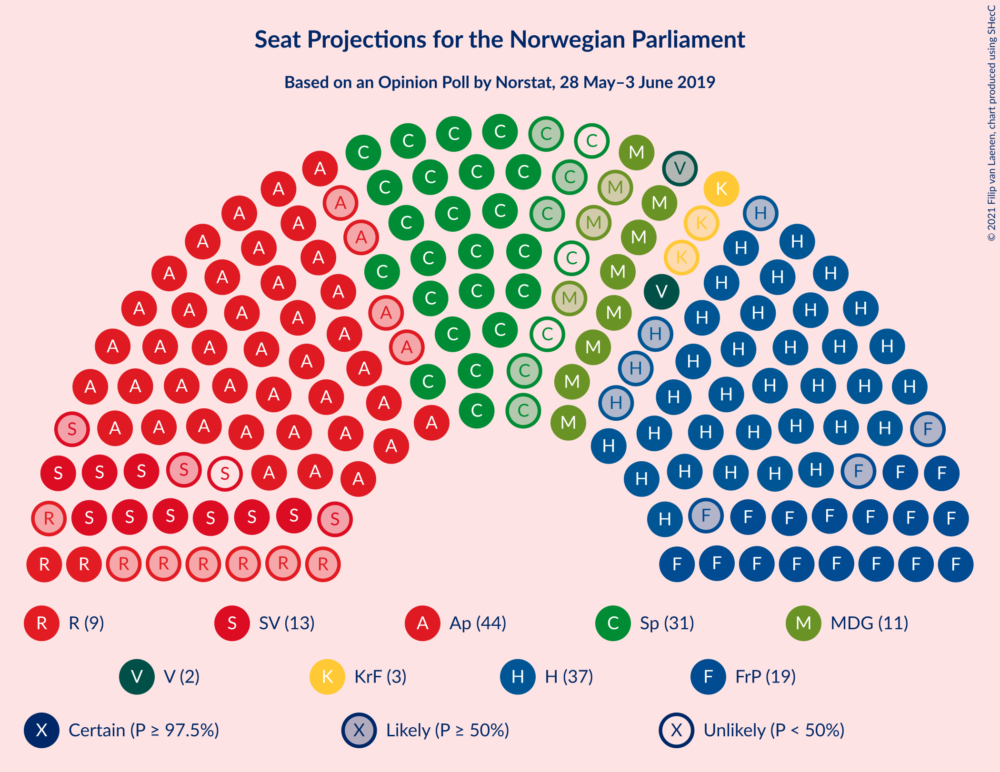

### Confidence Intervals

| Party | Last Result | Median | 80% Confidence Interval | 90% Confidence Interval | 95% Confidence Interval | 99% Confidence Interval |
|:-----:|:-----------:|:------:|:-----------------------:|:-----------------------:|:-----------------------:|:-----------------------:|
| <a href="#arbeiderpartiet">Arbeiderpartiet</a> | 49 | 44 | 42–48 |40–49 |40–50 |38–52 |
| <a href="#høyre">Høyre</a> | 45 | 37 | 35–40 |33–41 |33–42 |31–44 |
| <a href="#senterpartiet">Senterpartiet</a> | 19 | 28 | 24–32 |23–32 |23–33 |20–34 |
| <a href="#fremskrittspartiet">Fremskrittspartiet</a> | 27 | 19 | 17–23 |16–24 |16–25 |14–25 |
| <a href="#sosialistisk-venstreparti">Sosialistisk Venstreparti</a> | 11 | 12 | 10–15 |9–15 |9–15 |8–16 |
| <a href="#miljøpartiet-de-grønne">Miljøpartiet De Grønne</a> | 1 | 11 | 9–12 |8–13 |8–14 |7–15 |
| <a href="#rødt">Rødt</a> | 1 | 9 | 7–11 |2–11 |2–12 |2–13 |
| <a href="#kristelig-folkeparti">Kristelig Folkeparti</a> | 8 | 3 | 1–8 |1–8 |1–8 |0–9 |
| <a href="#venstre">Venstre</a> | 8 | 2 | 1–2 |1–2 |1–3 |0–7 |

### Arbeiderpartiet

*For a full overview of the results for this party, see the [Arbeiderpartiet](party-arbeiderpartiet.html) page.*

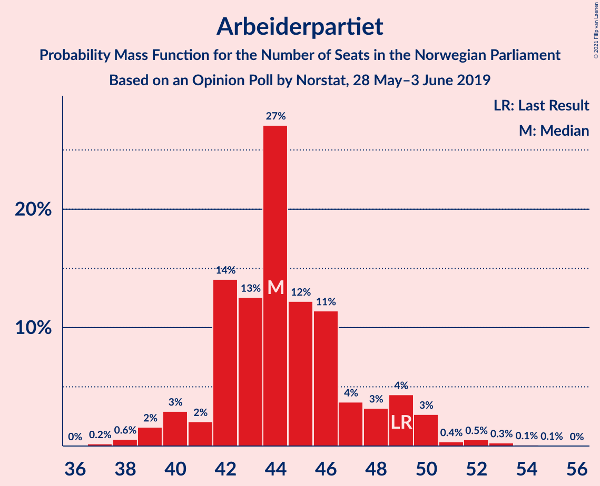

| Number of Seats | Probability | Accumulated | Special Marks |
|:---------------:|:-----------:|:-----------:|:-------------:|
| 37 | 0.2% | 100% |  |
| 38 | 0.6% | 99.8% |  |
| 39 | 2% | 99.2% |  |
| 40 | 3% | 98% |  |
| 41 | 2% | 95% |  |
| 42 | 14% | 93% |  |
| 43 | 13% | 79% |  |
| 44 | 27% | 66% | Median |
| 45 | 12% | 39% |  |
| 46 | 11% | 27% |  |
| 47 | 4% | 15% |  |
| 48 | 3% | 12% |  |
| 49 | 4% | 8% | Last Result |
| 50 | 3% | 4% |  |
| 51 | 0.4% | 1.3% |  |
| 52 | 0.5% | 1.0% |  |
| 53 | 0.3% | 0.4% |  |
| 54 | 0.1% | 0.2% |  |
| 55 | 0.1% | 0.1% |  |
| 56 | 0% | 0% |  |

### Høyre

*For a full overview of the results for this party, see the [Høyre](party-høyre.html) page.*

| Number of Seats | Probability | Accumulated | Special Marks |
|:---------------:|:-----------:|:-----------:|:-------------:|
| 29 | 0.1% | 100% |  |
| 30 | 0.1% | 99.9% |  |
| 31 | 0.5% | 99.8% |  |
| 32 | 2% | 99.4% |  |
| 33 | 3% | 98% |  |
| 34 | 5% | 95% |  |
| 35 | 20% | 90% |  |
| 36 | 18% | 71% |  |
| 37 | 27% | 53% | Median |
| 38 | 8% | 25% |  |
| 39 | 5% | 17% |  |
| 40 | 6% | 12% |  |
| 41 | 3% | 7% |  |
| 42 | 2% | 4% |  |
| 43 | 0.8% | 2% |  |
| 44 | 0.6% | 1.0% |  |
| 45 | 0.2% | 0.3% | Last Result |
| 46 | 0.1% | 0.1% |  |
| 47 | 0% | 0% |  |

### Senterpartiet

*For a full overview of the results for this party, see the [Senterpartiet](party-senterpartiet.html) page.*

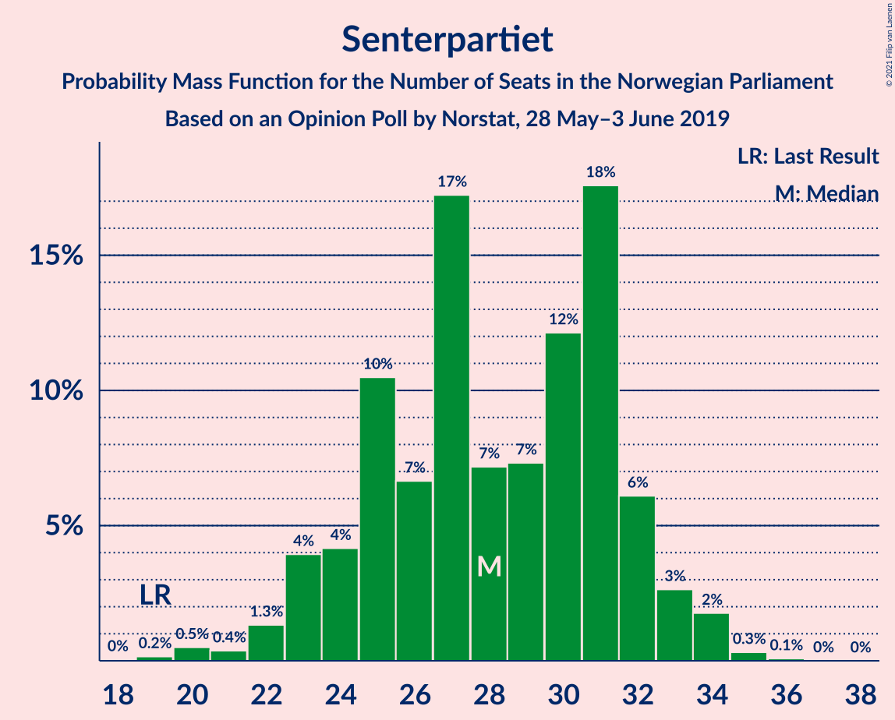

| Number of Seats | Probability | Accumulated | Special Marks |
|:---------------:|:-----------:|:-----------:|:-------------:|
| 19 | 0.2% | 100% | Last Result |
| 20 | 0.5% | 99.8% |  |
| 21 | 0.4% | 99.3% |  |
| 22 | 1.3% | 98.9% |  |
| 23 | 4% | 98% |  |
| 24 | 4% | 94% |  |
| 25 | 10% | 89% |  |
| 26 | 7% | 79% |  |
| 27 | 17% | 72% |  |
| 28 | 7% | 55% | Median |
| 29 | 7% | 48% |  |
| 30 | 12% | 41% |  |
| 31 | 18% | 28% |  |
| 32 | 6% | 11% |  |
| 33 | 3% | 5% |  |
| 34 | 2% | 2% |  |
| 35 | 0.3% | 0.4% |  |
| 36 | 0.1% | 0.1% |  |
| 37 | 0% | 0% |  |

### Fremskrittspartiet

*For a full overview of the results for this party, see the [Fremskrittspartiet](party-fremskrittspartiet.html) page.*

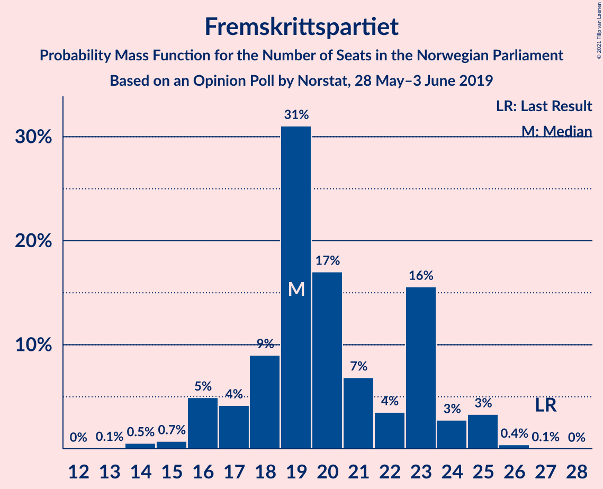

| Number of Seats | Probability | Accumulated | Special Marks |
|:---------------:|:-----------:|:-----------:|:-------------:|
| 13 | 0.1% | 100% |  |
| 14 | 0.5% | 99.9% |  |
| 15 | 0.7% | 99.4% |  |
| 16 | 5% | 98.6% |  |
| 17 | 4% | 94% |  |
| 18 | 9% | 90% |  |
| 19 | 31% | 81% | Median |
| 20 | 17% | 49% |  |
| 21 | 7% | 32% |  |
| 22 | 4% | 26% |  |
| 23 | 16% | 22% |  |
| 24 | 3% | 7% |  |
| 25 | 3% | 4% |  |
| 26 | 0.4% | 0.5% |  |
| 27 | 0.1% | 0.1% | Last Result |
| 28 | 0% | 0% |  |

### Sosialistisk Venstreparti

*For a full overview of the results for this party, see the [Sosialistisk Venstreparti](party-sosialistiskvenstreparti.html) page.*

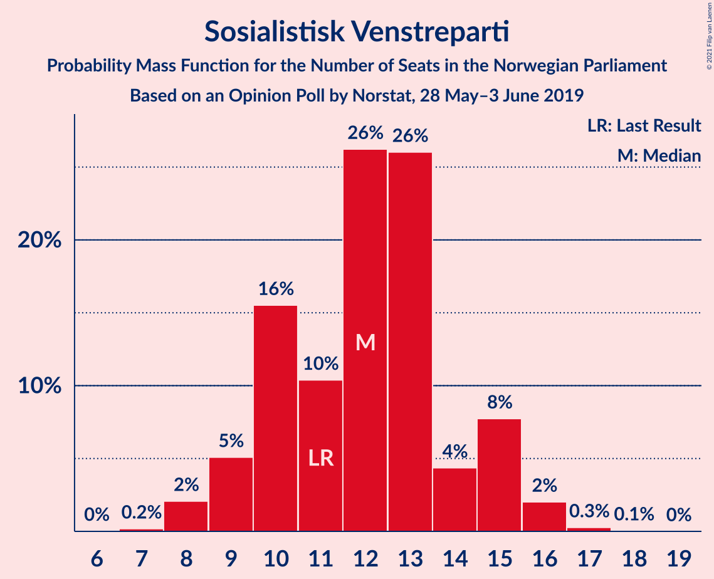

| Number of Seats | Probability | Accumulated | Special Marks |
|:---------------:|:-----------:|:-----------:|:-------------:|
| 7 | 0.2% | 100% |  |
| 8 | 2% | 99.8% |  |
| 9 | 5% | 98% |  |
| 10 | 16% | 93% |  |
| 11 | 10% | 77% | Last Result |
| 12 | 26% | 67% | Median |
| 13 | 26% | 40% |  |
| 14 | 4% | 14% |  |
| 15 | 8% | 10% |  |
| 16 | 2% | 2% |  |
| 17 | 0.3% | 0.3% |  |
| 18 | 0.1% | 0.1% |  |
| 19 | 0% | 0% |  |

### Miljøpartiet De Grønne

*For a full overview of the results for this party, see the [Miljøpartiet De Grønne](party-miljøpartietdegrønne.html) page.*

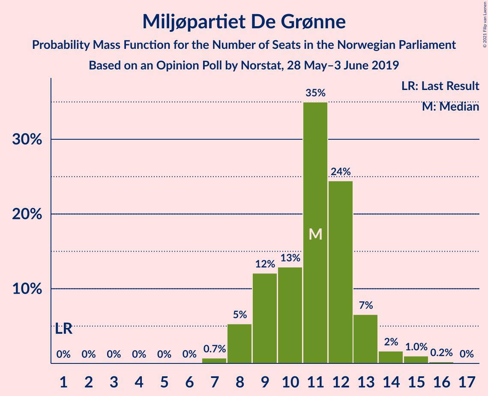

| Number of Seats | Probability | Accumulated | Special Marks |
|:---------------:|:-----------:|:-----------:|:-------------:|
| 1 | 0% | 100% | Last Result |
| 2 | 0% | 100% |  |
| 3 | 0% | 100% |  |
| 4 | 0% | 100% |  |
| 5 | 0% | 100% |  |
| 6 | 0% | 100% |  |
| 7 | 0.7% | 99.9% |  |
| 8 | 5% | 99.2% |  |
| 9 | 12% | 94% |  |
| 10 | 13% | 82% |  |
| 11 | 35% | 69% | Median |
| 12 | 24% | 34% |  |
| 13 | 7% | 9% |  |
| 14 | 2% | 3% |  |
| 15 | 1.0% | 1.3% |  |
| 16 | 0.2% | 0.3% |  |
| 17 | 0% | 0% |  |

### Rødt

*For a full overview of the results for this party, see the [Rødt](party-rødt.html) page.*

| Number of Seats | Probability | Accumulated | Special Marks |
|:---------------:|:-----------:|:-----------:|:-------------:|
| 1 | 0% | 100% | Last Result |
| 2 | 5% | 100% |  |
| 3 | 0% | 95% |  |
| 4 | 0% | 95% |  |
| 5 | 0% | 95% |  |
| 6 | 2% | 95% |  |
| 7 | 7% | 93% |  |
| 8 | 28% | 86% |  |
| 9 | 34% | 58% | Median |
| 10 | 11% | 24% |  |
| 11 | 9% | 13% |  |
| 12 | 4% | 4% |  |
| 13 | 0.6% | 0.7% |  |
| 14 | 0.1% | 0.1% |  |
| 15 | 0% | 0% |  |

### Kristelig Folkeparti

*For a full overview of the results for this party, see the [Kristelig Folkeparti](party-kristeligfolkeparti.html) page.*

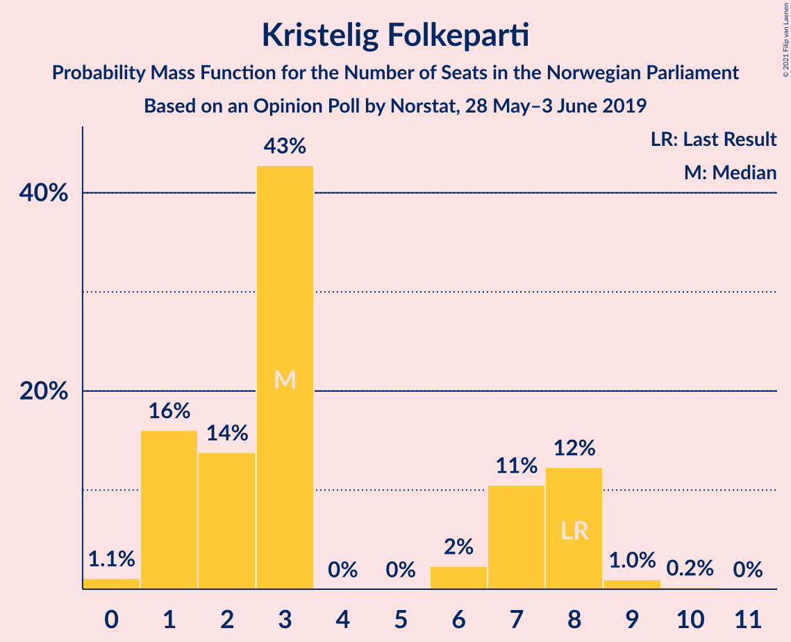

| Number of Seats | Probability | Accumulated | Special Marks |
|:---------------:|:-----------:|:-----------:|:-------------:|
| 0 | 1.1% | 100% |  |
| 1 | 16% | 98.9% |  |
| 2 | 14% | 83% |  |
| 3 | 43% | 69% | Median |
| 4 | 0% | 26% |  |
| 5 | 0% | 26% |  |
| 6 | 2% | 26% |  |
| 7 | 11% | 24% |  |
| 8 | 12% | 13% | Last Result |
| 9 | 1.0% | 1.2% |  |
| 10 | 0.2% | 0.2% |  |
| 11 | 0% | 0% |  |

### Venstre

*For a full overview of the results for this party, see the [Venstre](party-venstre.html) page.*

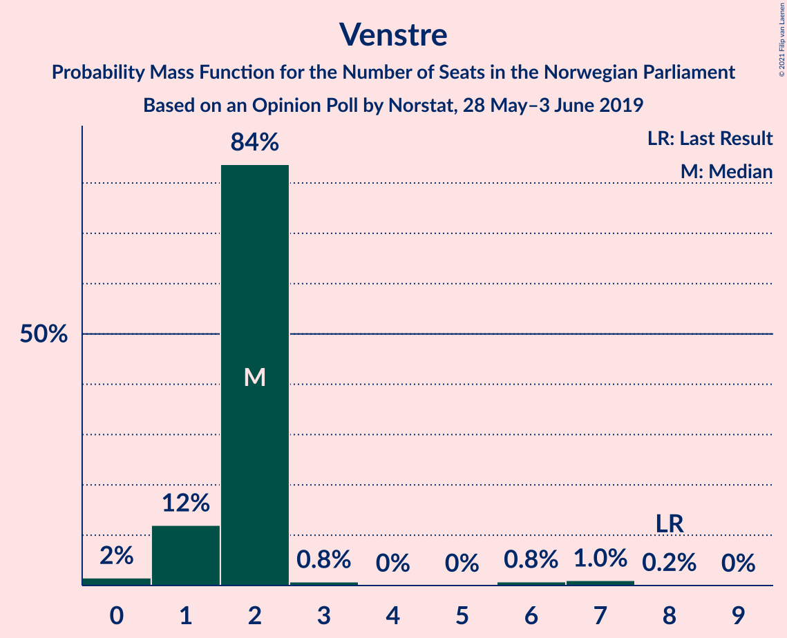

| Number of Seats | Probability | Accumulated | Special Marks |
|:---------------:|:-----------:|:-----------:|:-------------:|
| 0 | 2% | 100% |  |
| 1 | 12% | 98% |  |
| 2 | 84% | 86% | Median |
| 3 | 0.8% | 3% |  |
| 4 | 0% | 2% |  |
| 5 | 0% | 2% |  |
| 6 | 0.8% | 2% |  |
| 7 | 1.0% | 1.2% |  |
| 8 | 0.2% | 0.2% | Last Result |
| 9 | 0% | 0% |  |

## Coalitions

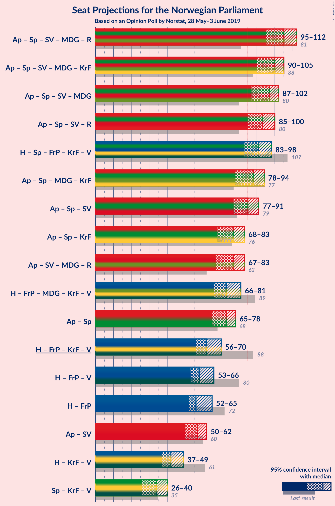

### Confidence Intervals

| Coalition | Last Result | Median | Majority? | 80% Confidence Interval | 90% Confidence Interval | 95% Confidence Interval | 99% Confidence Interval |
|:---------:|:-----------:|:------:|:---------:|:-----------------------:|:-----------------------:|:-----------------------:|:-----------------------:|
| Arbeiderpartiet – Senterpartiet – Sosialistisk Venstreparti – Miljøpartiet De Grønne – Rødt | 81 | 105 | 100% | 98–109 | 96–111 | 95–112 | 92–113 |
| Arbeiderpartiet – Senterpartiet – Sosialistisk Venstreparti – Miljøpartiet De Grønne – Kristelig Folkeparti | 88 | 100 | 100% | 92–105 | 91–105 | 90–105 | 87–108 |
| Arbeiderpartiet – Senterpartiet – Sosialistisk Venstreparti – Miljøpartiet De Grønne | 80 | 97 | 99.3% | 90–100 | 88–101 | 87–102 | 84–104 |
| Arbeiderpartiet – Senterpartiet – Sosialistisk Venstreparti – Rødt | 80 | 93 | 98% | 88–98 | 86–99 | 85–100 | 82–102 |
| Høyre – Senterpartiet – Fremskrittspartiet – Kristelig Folkeparti – Venstre | 107 | 91 | 93% | 86–94 | 84–96 | 83–98 | 82–100 |
| Arbeiderpartiet – Senterpartiet – Miljøpartiet De Grønne – Kristelig Folkeparti | 77 | 88 | 74% | 82–93 | 80–93 | 78–94 | 75–96 |
| Arbeiderpartiet – Senterpartiet – Sosialistisk Venstreparti | 79 | 85 | 58% | 79–89 | 78–90 | 77–91 | 75–93 |
| Arbeiderpartiet – Senterpartiet – Kristelig Folkeparti | 76 | 77 | 0.3% | 71–81 | 69–82 | 68–83 | 66–84 |
| Arbeiderpartiet – Sosialistisk Venstreparti – Miljøpartiet De Grønne – Rødt | 62 | 77 | 0.9% | 70–81 | 69–82 | 67–83 | 66–85 |
| Høyre – Fremskrittspartiet – Miljøpartiet De Grønne – Kristelig Folkeparti – Venstre | 89 | 73 | 0.1% | 69–77 | 67–79 | 66–81 | 64–83 |
| Arbeiderpartiet – Senterpartiet | 68 | 73 | 0% | 69–76 | 66–78 | 65–78 | 63–80 |
| Høyre – Fremskrittspartiet – Kristelig Folkeparti – Venstre | 88 | 62 | 0% | 58–67 | 57–68 | 56–70 | 54–72 |
| Høyre – Fremskrittspartiet – Venstre | 80 | 58 | 0% | 55–63 | 55–65 | 53–66 | 50–68 |
| Høyre – Fremskrittspartiet | 72 | 56 | 0% | 53–61 | 53–63 | 52–65 | 49–66 |
| Arbeiderpartiet – Sosialistisk Venstreparti | 60 | 57 | 0% | 52–60 | 51–61 | 50–62 | 48–65 |
| Høyre – Kristelig Folkeparti – Venstre | 61 | 42 | 0% | 39–46 | 38–47 | 37–49 | 36–51 |
| Senterpartiet – Kristelig Folkeparti – Venstre | 35 | 34 | 0% | 29–40 | 27–40 | 26–40 | 25–42 |

### Arbeiderpartiet – Senterpartiet – Sosialistisk Venstreparti – Miljøpartiet De Grønne – Rødt

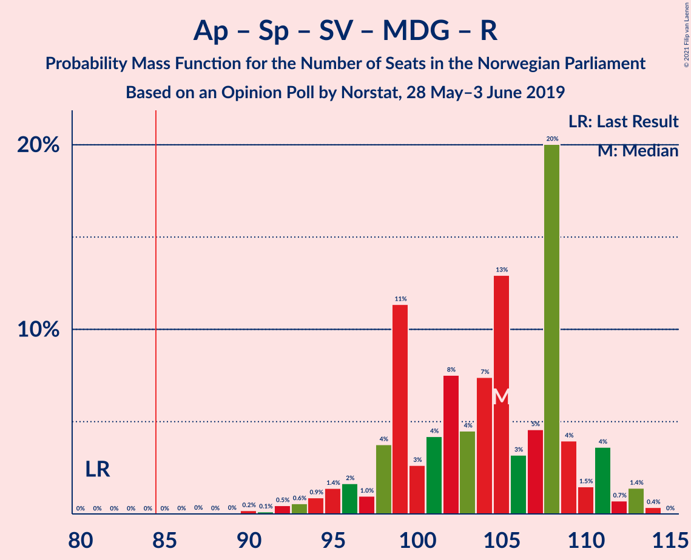

| Number of Seats | Probability | Accumulated | Special Marks |
|:---------------:|:-----------:|:-----------:|:-------------:|
| 81 | 0% | 100% | Last Result |
| 82 | 0% | 100% |  |
| 83 | 0% | 100% |  |
| 84 | 0% | 100% |  |
| 85 | 0% | 100% | Majority |
| 86 | 0% | 100% |  |
| 87 | 0% | 100% |  |
| 88 | 0% | 99.9% |  |
| 89 | 0% | 99.9% |  |
| 90 | 0.2% | 99.9% |  |
| 91 | 0.1% | 99.7% |  |
| 92 | 0.5% | 99.6% |  |
| 93 | 0.6% | 99.1% |  |
| 94 | 0.9% | 98.6% |  |
| 95 | 1.4% | 98% |  |
| 96 | 2% | 96% |  |
| 97 | 1.0% | 95% |  |
| 98 | 4% | 94% |  |
| 99 | 11% | 90% |  |
| 100 | 3% | 79% |  |
| 101 | 4% | 76% |  |
| 102 | 8% | 72% |  |
| 103 | 4% | 64% |  |
| 104 | 7% | 60% | Median |
| 105 | 13% | 52% |  |
| 106 | 3% | 39% |  |
| 107 | 5% | 36% |  |
| 108 | 20% | 32% |  |
| 109 | 4% | 12% |  |
| 110 | 1.5% | 8% |  |
| 111 | 4% | 6% |  |
| 112 | 0.7% | 3% |  |
| 113 | 1.4% | 2% |  |
| 114 | 0.4% | 0.4% |  |
| 115 | 0% | 0% |  |

### Arbeiderpartiet – Senterpartiet – Sosialistisk Venstreparti – Miljøpartiet De Grønne – Kristelig Folkeparti

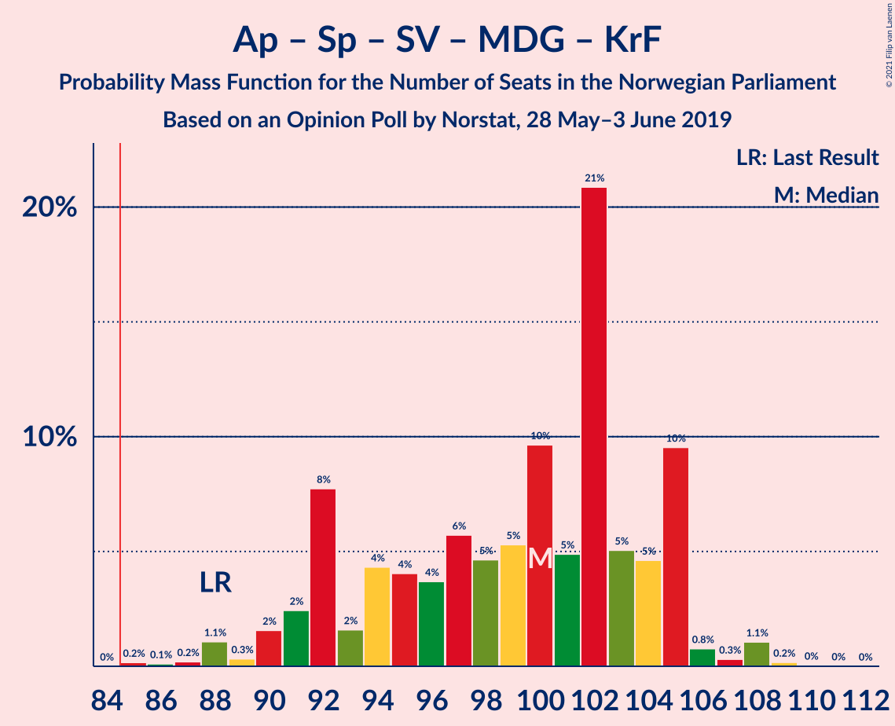

| Number of Seats | Probability | Accumulated | Special Marks |
|:---------------:|:-----------:|:-----------:|:-------------:|
| 85 | 0.2% | 100% | Majority |
| 86 | 0.1% | 99.8% |  |
| 87 | 0.2% | 99.7% |  |
| 88 | 1.1% | 99.5% | Last Result |
| 89 | 0.3% | 98% |  |
| 90 | 2% | 98% |  |
| 91 | 2% | 97% |  |
| 92 | 8% | 94% |  |
| 93 | 2% | 86% |  |
| 94 | 4% | 85% |  |
| 95 | 4% | 80% |  |
| 96 | 4% | 76% |  |
| 97 | 6% | 73% |  |
| 98 | 5% | 67% | Median |
| 99 | 5% | 62% |  |
| 100 | 10% | 57% |  |
| 101 | 5% | 47% |  |
| 102 | 21% | 42% |  |
| 103 | 5% | 22% |  |
| 104 | 5% | 17% |  |
| 105 | 10% | 12% |  |
| 106 | 0.8% | 2% |  |
| 107 | 0.3% | 2% |  |
| 108 | 1.1% | 1.3% |  |
| 109 | 0.2% | 0.3% |  |
| 110 | 0% | 0.1% |  |
| 111 | 0% | 0% |  |

### Arbeiderpartiet – Senterpartiet – Sosialistisk Venstreparti – Miljøpartiet De Grønne

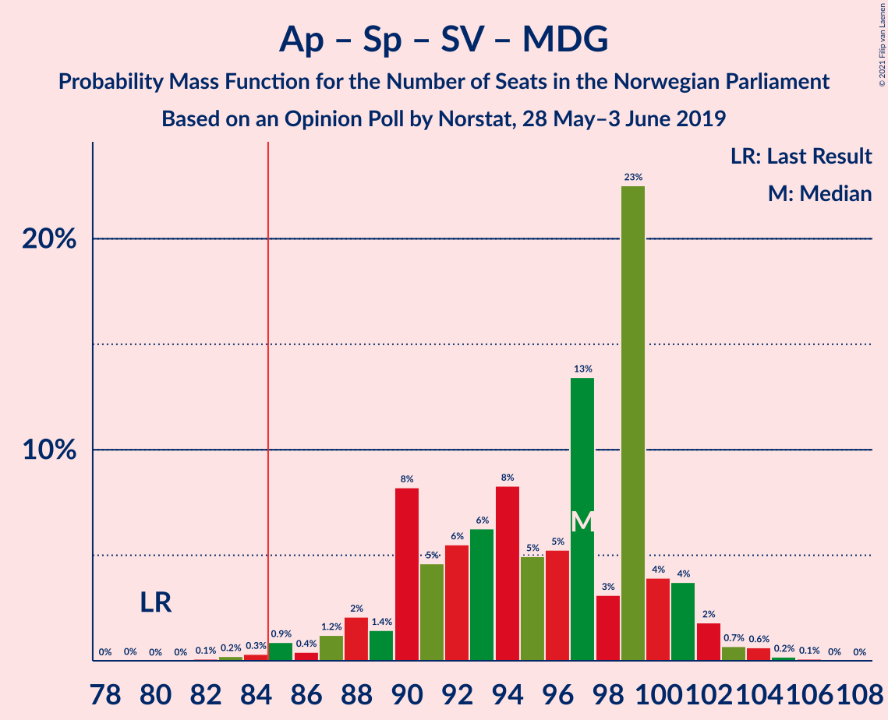

| Number of Seats | Probability | Accumulated | Special Marks |
|:---------------:|:-----------:|:-----------:|:-------------:|
| 79 | 0% | 100% |  |
| 80 | 0% | 99.9% | Last Result |
| 81 | 0% | 99.9% |  |
| 82 | 0.1% | 99.9% |  |
| 83 | 0.2% | 99.8% |  |
| 84 | 0.3% | 99.6% |  |
| 85 | 0.9% | 99.3% | Majority |
| 86 | 0.4% | 98% |  |
| 87 | 1.2% | 98% |  |
| 88 | 2% | 97% |  |
| 89 | 1.4% | 95% |  |
| 90 | 8% | 93% |  |
| 91 | 5% | 85% |  |
| 92 | 6% | 80% |  |
| 93 | 6% | 75% |  |
| 94 | 8% | 69% |  |
| 95 | 5% | 60% | Median |
| 96 | 5% | 55% |  |
| 97 | 13% | 50% |  |
| 98 | 3% | 37% |  |
| 99 | 23% | 34% |  |
| 100 | 4% | 11% |  |
| 101 | 4% | 7% |  |
| 102 | 2% | 3% |  |
| 103 | 0.7% | 2% |  |
| 104 | 0.6% | 1.0% |  |
| 105 | 0.2% | 0.3% |  |
| 106 | 0.1% | 0.1% |  |
| 107 | 0% | 0% |  |

### Arbeiderpartiet – Senterpartiet – Sosialistisk Venstreparti – Rødt

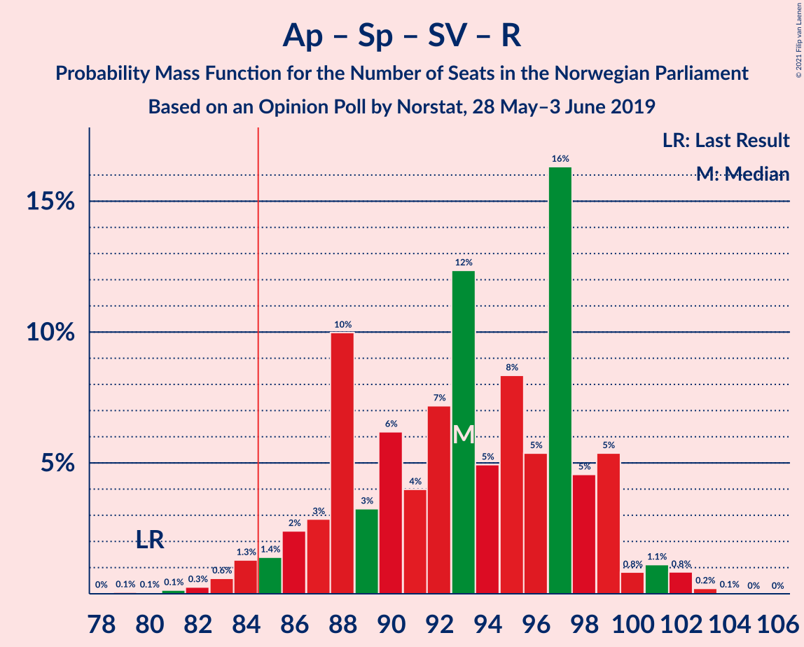

| Number of Seats | Probability | Accumulated | Special Marks |
|:---------------:|:-----------:|:-----------:|:-------------:|
| 78 | 0% | 100% |  |
| 79 | 0.1% | 99.9% |  |
| 80 | 0.1% | 99.9% | Last Result |
| 81 | 0.1% | 99.8% |  |
| 82 | 0.3% | 99.7% |  |
| 83 | 0.6% | 99.4% |  |
| 84 | 1.3% | 98.8% |  |
| 85 | 1.4% | 98% | Majority |
| 86 | 2% | 96% |  |
| 87 | 3% | 94% |  |
| 88 | 10% | 91% |  |
| 89 | 3% | 81% |  |
| 90 | 6% | 78% |  |
| 91 | 4% | 71% |  |
| 92 | 7% | 67% |  |
| 93 | 12% | 60% | Median |
| 94 | 5% | 48% |  |
| 95 | 8% | 43% |  |
| 96 | 5% | 35% |  |
| 97 | 16% | 29% |  |
| 98 | 5% | 13% |  |
| 99 | 5% | 8% |  |
| 100 | 0.8% | 3% |  |
| 101 | 1.1% | 2% |  |
| 102 | 0.8% | 1.1% |  |
| 103 | 0.2% | 0.3% |  |
| 104 | 0.1% | 0.1% |  |
| 105 | 0% | 0% |  |

### Høyre – Senterpartiet – Fremskrittspartiet – Kristelig Folkeparti – Venstre

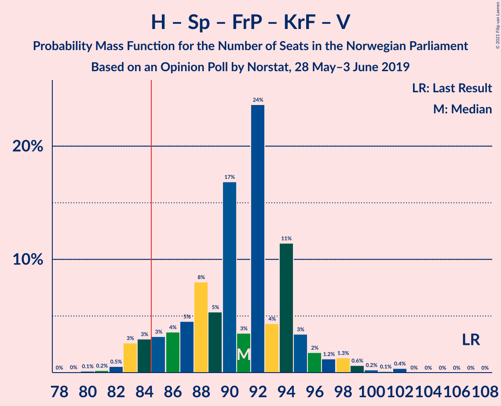

| Number of Seats | Probability | Accumulated | Special Marks |
|:---------------:|:-----------:|:-----------:|:-------------:|
| 79 | 0% | 100% |  |
| 80 | 0.1% | 99.9% |  |
| 81 | 0.2% | 99.8% |  |
| 82 | 0.5% | 99.6% |  |
| 83 | 3% | 99.1% |  |
| 84 | 3% | 96% |  |
| 85 | 3% | 93% | Majority |
| 86 | 4% | 90% |  |
| 87 | 5% | 87% |  |
| 88 | 8% | 82% |  |
| 89 | 5% | 74% | Median |
| 90 | 17% | 69% |  |
| 91 | 3% | 52% |  |
| 92 | 24% | 48% |  |
| 93 | 4% | 25% |  |
| 94 | 11% | 20% |  |
| 95 | 3% | 9% |  |
| 96 | 2% | 6% |  |
| 97 | 1.2% | 4% |  |
| 98 | 1.3% | 3% |  |
| 99 | 0.6% | 1.4% |  |
| 100 | 0.2% | 0.7% |  |
| 101 | 0.1% | 0.5% |  |
| 102 | 0.4% | 0.4% |  |
| 103 | 0% | 0% |  |
| 104 | 0% | 0% |  |
| 105 | 0% | 0% |  |
| 106 | 0% | 0% |  |
| 107 | 0% | 0% | Last Result |

### Arbeiderpartiet – Senterpartiet – Miljøpartiet De Grønne – Kristelig Folkeparti

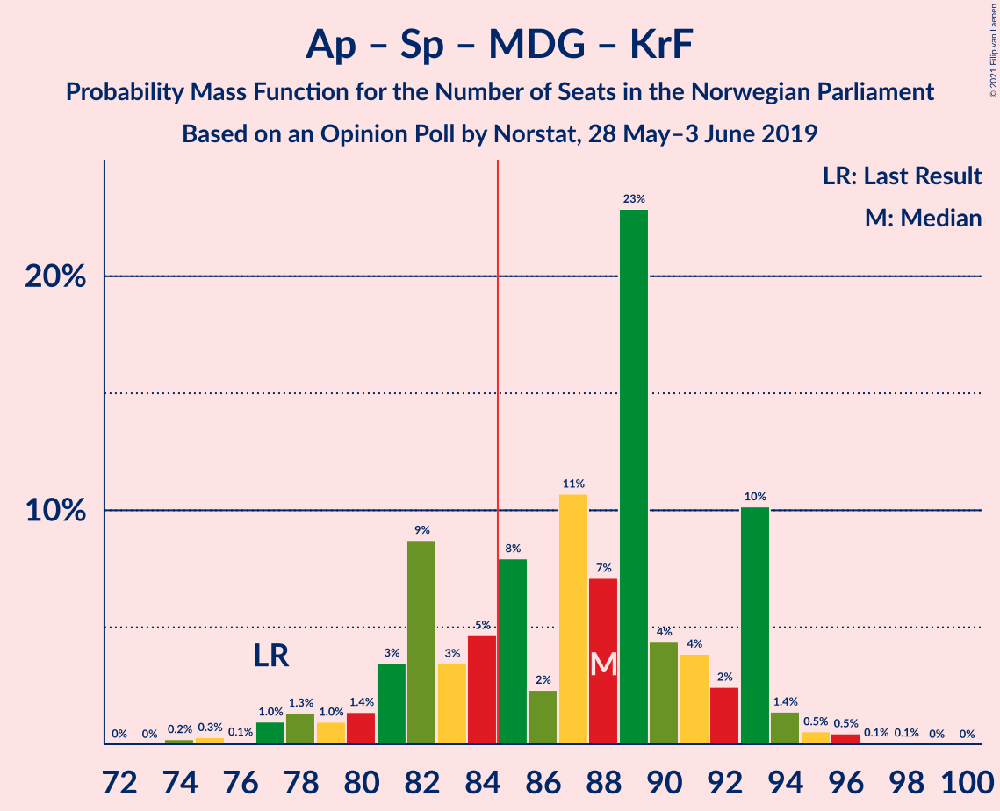

| Number of Seats | Probability | Accumulated | Special Marks |
|:---------------:|:-----------:|:-----------:|:-------------:|
| 74 | 0.2% | 100% |  |
| 75 | 0.3% | 99.7% |  |
| 76 | 0.1% | 99.5% |  |
| 77 | 1.0% | 99.3% | Last Result |
| 78 | 1.3% | 98% |  |
| 79 | 1.0% | 97% |  |
| 80 | 1.4% | 96% |  |
| 81 | 3% | 95% |  |
| 82 | 9% | 91% |  |
| 83 | 3% | 82% |  |
| 84 | 5% | 79% |  |
| 85 | 8% | 74% | Majority |
| 86 | 2% | 66% | Median |
| 87 | 11% | 64% |  |
| 88 | 7% | 53% |  |
| 89 | 23% | 46% |  |
| 90 | 4% | 23% |  |
| 91 | 4% | 19% |  |
| 92 | 2% | 15% |  |
| 93 | 10% | 13% |  |
| 94 | 1.4% | 3% |  |
| 95 | 0.5% | 1.2% |  |
| 96 | 0.5% | 0.6% |  |
| 97 | 0.1% | 0.2% |  |
| 98 | 0.1% | 0.1% |  |
| 99 | 0% | 0% |  |

### Arbeiderpartiet – Senterpartiet – Sosialistisk Venstreparti

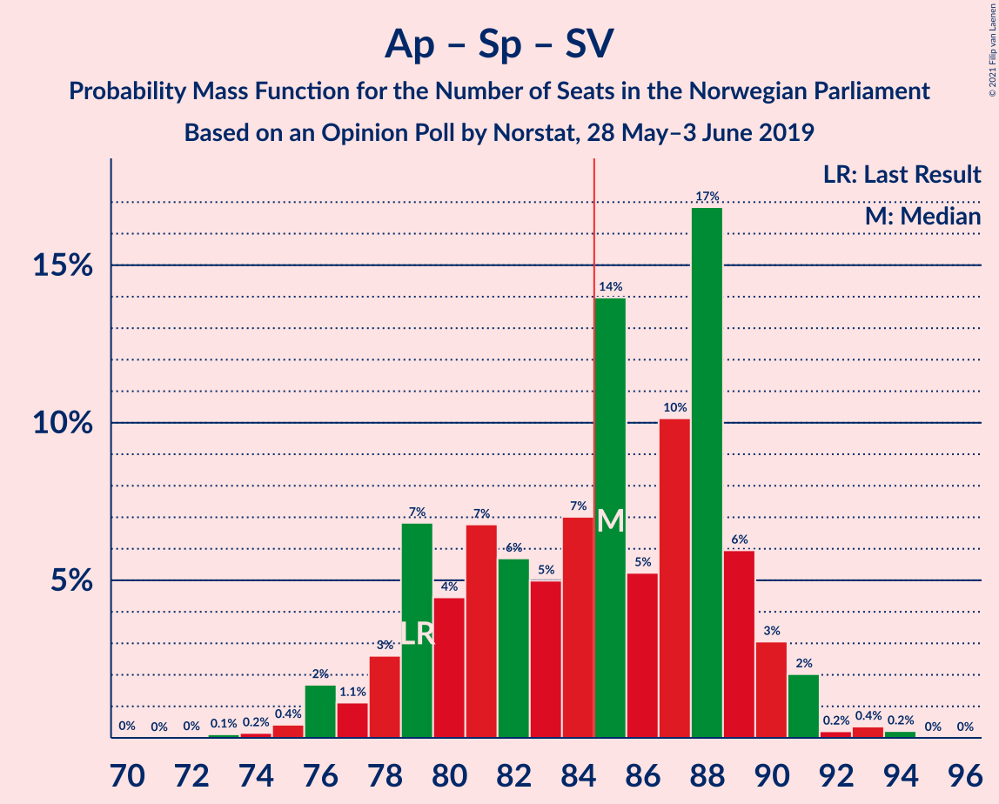

| Number of Seats | Probability | Accumulated | Special Marks |
|:---------------:|:-----------:|:-----------:|:-------------:|
| 70 | 0% | 100% |  |
| 71 | 0% | 99.9% |  |
| 72 | 0% | 99.9% |  |
| 73 | 0.1% | 99.9% |  |
| 74 | 0.2% | 99.8% |  |
| 75 | 0.4% | 99.6% |  |
| 76 | 2% | 99.2% |  |
| 77 | 1.1% | 98% |  |
| 78 | 3% | 96% |  |
| 79 | 7% | 94% | Last Result |
| 80 | 4% | 87% |  |
| 81 | 7% | 83% |  |
| 82 | 6% | 76% |  |
| 83 | 5% | 70% |  |
| 84 | 7% | 65% | Median |
| 85 | 14% | 58% | Majority |
| 86 | 5% | 44% |  |
| 87 | 10% | 39% |  |
| 88 | 17% | 29% |  |
| 89 | 6% | 12% |  |
| 90 | 3% | 6% |  |
| 91 | 2% | 3% |  |
| 92 | 0.2% | 0.8% |  |
| 93 | 0.4% | 0.6% |  |
| 94 | 0.2% | 0.2% |  |
| 95 | 0% | 0% |  |

### Arbeiderpartiet – Senterpartiet – Kristelig Folkeparti

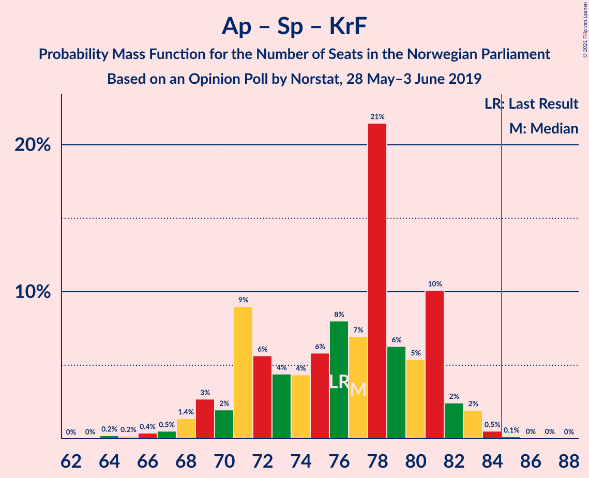

| Number of Seats | Probability | Accumulated | Special Marks |
|:---------------:|:-----------:|:-----------:|:-------------:|
| 64 | 0.2% | 100% |  |
| 65 | 0.2% | 99.8% |  |
| 66 | 0.4% | 99.6% |  |
| 67 | 0.5% | 99.2% |  |
| 68 | 1.4% | 98.7% |  |
| 69 | 3% | 97% |  |
| 70 | 2% | 95% |  |
| 71 | 9% | 93% |  |
| 72 | 6% | 84% |  |
| 73 | 4% | 78% |  |
| 74 | 4% | 74% |  |
| 75 | 6% | 69% | Median |
| 76 | 8% | 63% | Last Result |
| 77 | 7% | 55% |  |
| 78 | 21% | 48% |  |
| 79 | 6% | 27% |  |
| 80 | 5% | 21% |  |
| 81 | 10% | 15% |  |
| 82 | 2% | 5% |  |
| 83 | 2% | 3% |  |
| 84 | 0.5% | 0.8% |  |
| 85 | 0.1% | 0.3% | Majority |
| 86 | 0% | 0.1% |  |
| 87 | 0% | 0.1% |  |
| 88 | 0% | 0% |  |

### Arbeiderpartiet – Sosialistisk Venstreparti – Miljøpartiet De Grønne – Rødt

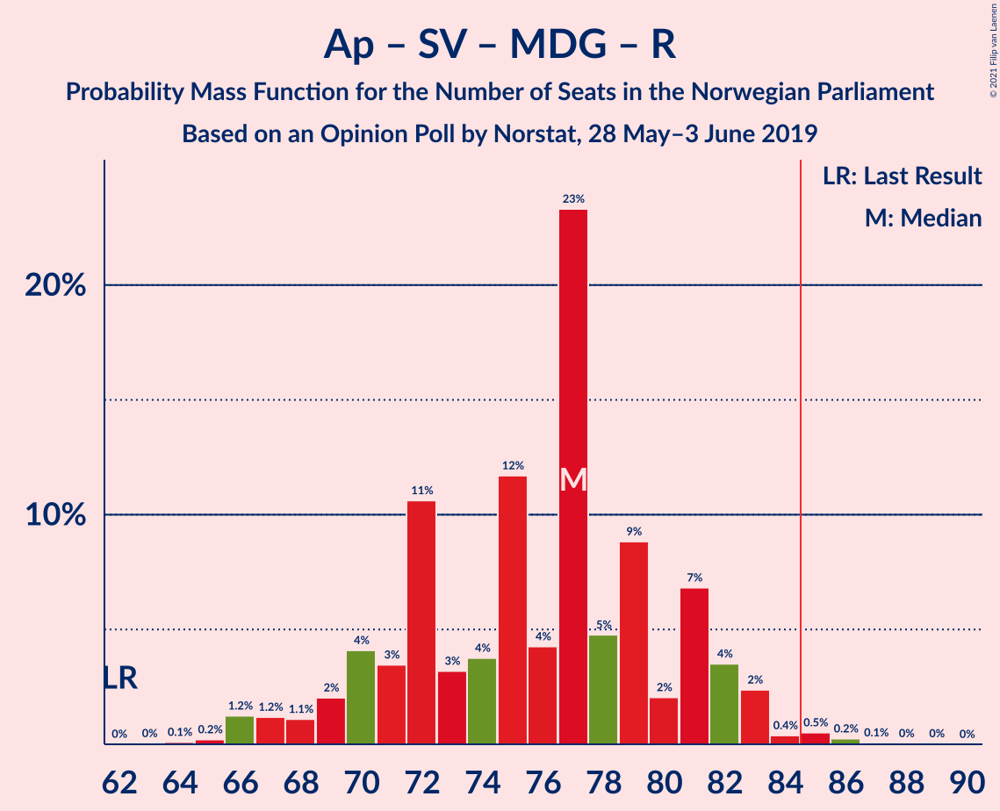

| Number of Seats | Probability | Accumulated | Special Marks |
|:---------------:|:-----------:|:-----------:|:-------------:|
| 62 | 0% | 100% | Last Result |
| 63 | 0% | 100% |  |
| 64 | 0.1% | 99.9% |  |
| 65 | 0.2% | 99.8% |  |
| 66 | 1.2% | 99.6% |  |
| 67 | 1.2% | 98% |  |
| 68 | 1.1% | 97% |  |
| 69 | 2% | 96% |  |
| 70 | 4% | 94% |  |
| 71 | 3% | 90% |  |
| 72 | 11% | 87% |  |
| 73 | 3% | 76% |  |
| 74 | 4% | 73% |  |
| 75 | 12% | 69% |  |
| 76 | 4% | 57% | Median |
| 77 | 23% | 53% |  |
| 78 | 5% | 30% |  |
| 79 | 9% | 25% |  |
| 80 | 2% | 16% |  |
| 81 | 7% | 14% |  |
| 82 | 4% | 7% |  |
| 83 | 2% | 4% |  |
| 84 | 0.4% | 1.3% |  |
| 85 | 0.5% | 0.9% | Majority |
| 86 | 0.2% | 0.4% |  |
| 87 | 0.1% | 0.2% |  |
| 88 | 0% | 0.1% |  |
| 89 | 0% | 0% |  |

### Høyre – Fremskrittspartiet – Miljøpartiet De Grønne – Kristelig Folkeparti – Venstre

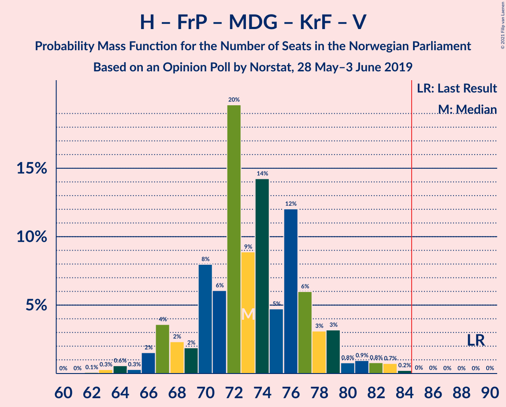

| Number of Seats | Probability | Accumulated | Special Marks |
|:---------------:|:-----------:|:-----------:|:-------------:|
| 62 | 0.1% | 100% |  |
| 63 | 0.3% | 99.9% |  |
| 64 | 0.6% | 99.6% |  |
| 65 | 0.3% | 99.0% |  |
| 66 | 2% | 98.8% |  |
| 67 | 4% | 97% |  |
| 68 | 2% | 94% |  |
| 69 | 2% | 91% |  |
| 70 | 8% | 89% |  |
| 71 | 6% | 81% |  |
| 72 | 20% | 75% | Median |
| 73 | 9% | 56% |  |
| 74 | 14% | 47% |  |
| 75 | 5% | 33% |  |
| 76 | 12% | 28% |  |
| 77 | 6% | 16% |  |
| 78 | 3% | 10% |  |
| 79 | 3% | 7% |  |
| 80 | 0.8% | 4% |  |
| 81 | 0.9% | 3% |  |
| 82 | 0.8% | 2% |  |
| 83 | 0.7% | 1.1% |  |
| 84 | 0.2% | 0.3% |  |
| 85 | 0% | 0.1% | Majority |
| 86 | 0% | 0.1% |  |
| 87 | 0% | 0% |  |
| 88 | 0% | 0% |  |
| 89 | 0% | 0% | Last Result |

### Arbeiderpartiet – Senterpartiet

| Number of Seats | Probability | Accumulated | Special Marks |
|:---------------:|:-----------:|:-----------:|:-------------:|
| 60 | 0% | 100% |  |
| 61 | 0.1% | 99.9% |  |
| 62 | 0.1% | 99.9% |  |
| 63 | 0.3% | 99.8% |  |
| 64 | 0.4% | 99.4% |  |
| 65 | 2% | 99.0% |  |
| 66 | 2% | 97% |  |
| 67 | 1.0% | 95% |  |
| 68 | 4% | 94% | Last Result |
| 69 | 13% | 90% |  |
| 70 | 7% | 78% |  |
| 71 | 8% | 71% |  |
| 72 | 5% | 63% | Median |
| 73 | 15% | 58% |  |
| 74 | 6% | 43% |  |
| 75 | 20% | 36% |  |
| 76 | 8% | 17% |  |
| 77 | 3% | 9% |  |
| 78 | 4% | 5% |  |
| 79 | 1.0% | 2% |  |
| 80 | 0.5% | 0.8% |  |
| 81 | 0.2% | 0.3% |  |
| 82 | 0% | 0% |  |

### Høyre – Fremskrittspartiet – Kristelig Folkeparti – Venstre

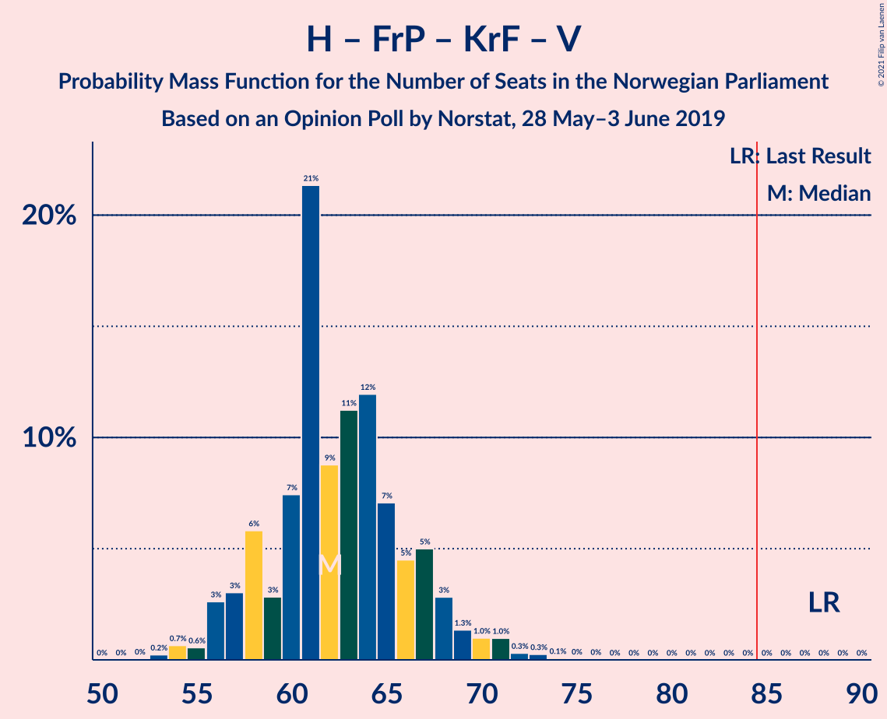

| Number of Seats | Probability | Accumulated | Special Marks |
|:---------------:|:-----------:|:-----------:|:-------------:|
| 52 | 0% | 100% |  |
| 53 | 0.2% | 99.9% |  |
| 54 | 0.7% | 99.7% |  |
| 55 | 0.6% | 99.0% |  |
| 56 | 3% | 98% |  |
| 57 | 3% | 96% |  |
| 58 | 6% | 93% |  |
| 59 | 3% | 87% |  |
| 60 | 7% | 84% |  |
| 61 | 21% | 77% | Median |
| 62 | 9% | 55% |  |
| 63 | 11% | 47% |  |
| 64 | 12% | 35% |  |
| 65 | 7% | 23% |  |
| 66 | 5% | 16% |  |
| 67 | 5% | 12% |  |
| 68 | 3% | 7% |  |
| 69 | 1.3% | 4% |  |
| 70 | 1.0% | 3% |  |
| 71 | 1.0% | 2% |  |
| 72 | 0.3% | 0.7% |  |
| 73 | 0.3% | 0.4% |  |
| 74 | 0.1% | 0.2% |  |
| 75 | 0% | 0.1% |  |
| 76 | 0% | 0% |  |
| 77 | 0% | 0% |  |
| 78 | 0% | 0% |  |
| 79 | 0% | 0% |  |
| 80 | 0% | 0% |  |
| 81 | 0% | 0% |  |
| 82 | 0% | 0% |  |
| 83 | 0% | 0% |  |
| 84 | 0% | 0% |  |
| 85 | 0% | 0% | Majority |
| 86 | 0% | 0% |  |
| 87 | 0% | 0% |  |
| 88 | 0% | 0% | Last Result |

### Høyre – Fremskrittspartiet – Venstre

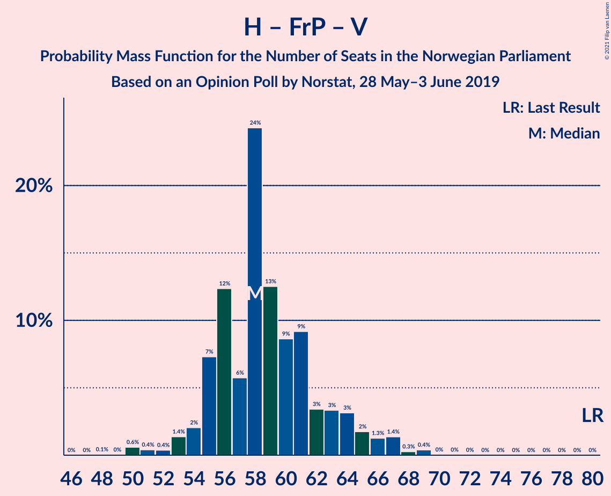

| Number of Seats | Probability | Accumulated | Special Marks |
|:---------------:|:-----------:|:-----------:|:-------------:|
| 48 | 0.1% | 100% |  |
| 49 | 0% | 99.9% |  |
| 50 | 0.6% | 99.9% |  |
| 51 | 0.4% | 99.3% |  |
| 52 | 0.4% | 98.9% |  |
| 53 | 1.4% | 98.5% |  |
| 54 | 2% | 97% |  |
| 55 | 7% | 95% |  |
| 56 | 12% | 88% |  |
| 57 | 6% | 75% |  |
| 58 | 24% | 70% | Median |
| 59 | 13% | 45% |  |
| 60 | 9% | 33% |  |
| 61 | 9% | 24% |  |
| 62 | 3% | 15% |  |
| 63 | 3% | 12% |  |
| 64 | 3% | 8% |  |
| 65 | 2% | 5% |  |
| 66 | 1.3% | 3% |  |
| 67 | 1.4% | 2% |  |
| 68 | 0.3% | 0.8% |  |
| 69 | 0.4% | 0.5% |  |
| 70 | 0% | 0.1% |  |
| 71 | 0% | 0.1% |  |
| 72 | 0% | 0% |  |
| 73 | 0% | 0% |  |
| 74 | 0% | 0% |  |
| 75 | 0% | 0% |  |
| 76 | 0% | 0% |  |
| 77 | 0% | 0% |  |
| 78 | 0% | 0% |  |
| 79 | 0% | 0% |  |
| 80 | 0% | 0% | Last Result |

### Høyre – Fremskrittspartiet

| Number of Seats | Probability | Accumulated | Special Marks |
|:---------------:|:-----------:|:-----------:|:-------------:|
| 48 | 0.4% | 100% |  |
| 49 | 0.5% | 99.5% |  |
| 50 | 0.4% | 99.1% |  |
| 51 | 1.1% | 98.6% |  |
| 52 | 2% | 98% |  |
| 53 | 8% | 96% |  |
| 54 | 12% | 88% |  |
| 55 | 7% | 76% |  |
| 56 | 24% | 69% | Median |
| 57 | 11% | 46% |  |
| 58 | 9% | 34% |  |
| 59 | 10% | 25% |  |
| 60 | 3% | 15% |  |
| 61 | 4% | 12% |  |
| 62 | 3% | 8% |  |
| 63 | 2% | 5% |  |
| 64 | 1.1% | 4% |  |
| 65 | 2% | 3% |  |
| 66 | 0.2% | 0.7% |  |
| 67 | 0.3% | 0.5% |  |
| 68 | 0.1% | 0.1% |  |
| 69 | 0% | 0% |  |
| 70 | 0% | 0% |  |
| 71 | 0% | 0% |  |
| 72 | 0% | 0% | Last Result |

### Arbeiderpartiet – Sosialistisk Venstreparti

| Number of Seats | Probability | Accumulated | Special Marks |
|:---------------:|:-----------:|:-----------:|:-------------:|
| 47 | 0.1% | 100% |  |
| 48 | 0.5% | 99.9% |  |
| 49 | 0.9% | 99.4% |  |
| 50 | 1.1% | 98% |  |
| 51 | 2% | 97% |  |
| 52 | 9% | 95% |  |
| 53 | 5% | 86% |  |
| 54 | 6% | 81% |  |
| 55 | 13% | 75% |  |
| 56 | 7% | 62% | Median |
| 57 | 23% | 55% |  |
| 58 | 8% | 32% |  |
| 59 | 10% | 24% |  |
| 60 | 5% | 15% | Last Result |
| 61 | 5% | 9% |  |
| 62 | 3% | 4% |  |
| 63 | 0.7% | 1.4% |  |
| 64 | 0.2% | 0.7% |  |
| 65 | 0.4% | 0.5% |  |
| 66 | 0.1% | 0.2% |  |
| 67 | 0% | 0.1% |  |
| 68 | 0% | 0.1% |  |
| 69 | 0% | 0% |  |

### Høyre – Kristelig Folkeparti – Venstre

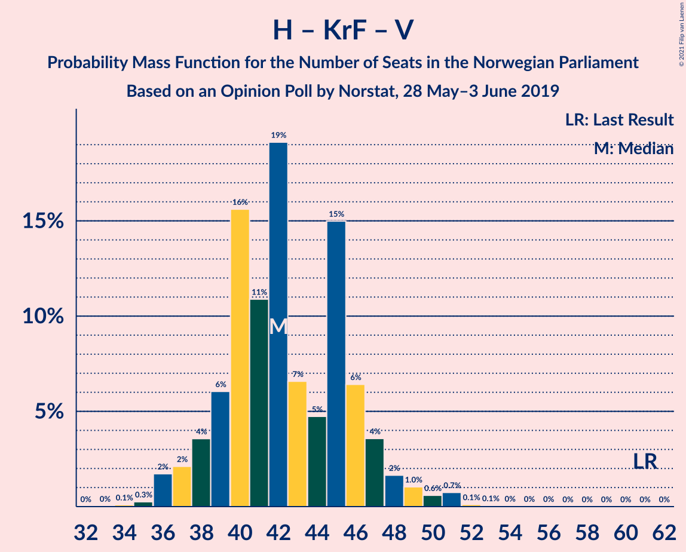

| Number of Seats | Probability | Accumulated | Special Marks |
|:---------------:|:-----------:|:-----------:|:-------------:|
| 34 | 0.1% | 100% |  |
| 35 | 0.3% | 99.9% |  |
| 36 | 2% | 99.6% |  |
| 37 | 2% | 98% |  |
| 38 | 4% | 96% |  |
| 39 | 6% | 92% |  |
| 40 | 16% | 86% |  |
| 41 | 11% | 71% |  |
| 42 | 19% | 60% | Median |
| 43 | 7% | 41% |  |
| 44 | 5% | 34% |  |
| 45 | 15% | 29% |  |
| 46 | 6% | 14% |  |
| 47 | 4% | 8% |  |
| 48 | 2% | 4% |  |
| 49 | 1.0% | 3% |  |
| 50 | 0.6% | 2% |  |
| 51 | 0.7% | 1.0% |  |
| 52 | 0.1% | 0.2% |  |
| 53 | 0.1% | 0.1% |  |
| 54 | 0% | 0.1% |  |
| 55 | 0% | 0% |  |
| 56 | 0% | 0% |  |
| 57 | 0% | 0% |  |
| 58 | 0% | 0% |  |
| 59 | 0% | 0% |  |
| 60 | 0% | 0% |  |
| 61 | 0% | 0% | Last Result |

### Senterpartiet – Kristelig Folkeparti – Venstre

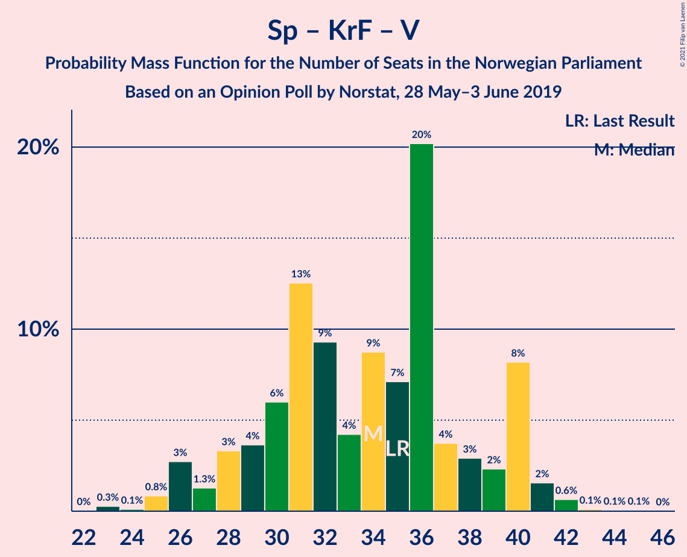

| Number of Seats | Probability | Accumulated | Special Marks |
|:---------------:|:-----------:|:-----------:|:-------------:|
| 23 | 0.3% | 100% |  |
| 24 | 0.1% | 99.7% |  |
| 25 | 0.8% | 99.6% |  |
| 26 | 3% | 98.7% |  |
| 27 | 1.3% | 96% |  |
| 28 | 3% | 95% |  |
| 29 | 4% | 91% |  |
| 30 | 6% | 88% |  |
| 31 | 13% | 82% |  |
| 32 | 9% | 69% |  |
| 33 | 4% | 60% | Median |
| 34 | 9% | 56% |  |
| 35 | 7% | 47% | Last Result |
| 36 | 20% | 40% |  |
| 37 | 4% | 20% |  |
| 38 | 3% | 16% |  |
| 39 | 2% | 13% |  |
| 40 | 8% | 11% |  |
| 41 | 2% | 2% |  |
| 42 | 0.6% | 0.9% |  |
| 43 | 0.1% | 0.2% |  |
| 44 | 0.1% | 0.1% |  |
| 45 | 0.1% | 0.1% |  |
| 46 | 0% | 0% |  |

## Technical Information

### Opinion Poll

+ **Polling firm:** Norstat
+ **Commissioner(s):** —
+ **Fieldwork period:** 28 May–3 June 2019

### Calculations

+ **Sample size:** 951
+ **Simulations done:** 524,288
+ **Error estimate:** 1.69%

