# Opinion Poll by Ipsos MMI, 24–26 June 2019

<a href="#voting-intentions">Voting Intentions</a> | <a href="#seats">Seats</a> | <a href="#coalitions">Coalitions</a> | <a href="#technical-information">Technical Information</a>

## Voting Intentions

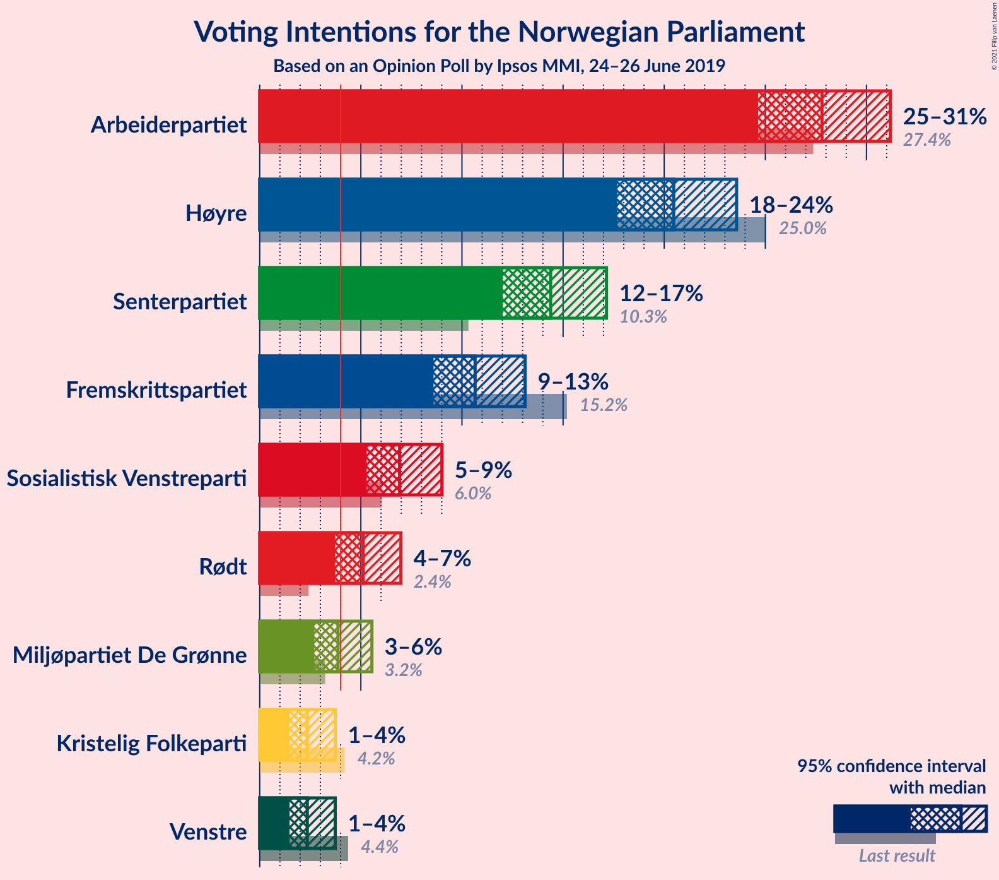

### Confidence Intervals

| Party | Last Result | Poll Result | 80% Confidence Interval | 90% Confidence Interval | 95% Confidence Interval | 99% Confidence Interval |
|:-----:|:-----------:|:-----------:|:-----------------------:|:-----------------------:|:-----------------------:|:-----------------------:|
| Arbeiderpartiet | 27.4% | 27.8% | 25.7–30.0% |25.1–30.6% |24.6–31.2% |23.7–32.3% |
| Høyre | 25.0% | 20.5% | 18.6–22.5% |18.1–23.1% |17.7–23.6% |16.8–24.6% |
| Senterpartiet | 10.3% | 14.4% | 12.8–16.2% |12.4–16.7% |12.0–17.1% |11.3–18.0% |
| Fremskrittspartiet | 15.2% | 10.7% | 9.3–12.3% |8.9–12.7% |8.6–13.1% |8.0–13.9% |
| Sosialistisk Venstreparti | 6.0% | 6.9% | 5.8–8.3% |5.5–8.7% |5.3–9.0% |4.8–9.7% |
| Rødt | 2.4% | 5.1% | 4.2–6.3% |3.9–6.7% |3.7–7.0% |3.3–7.6% |
| Miljøpartiet De Grønne | 3.2% | 3.9% | 3.1–5.0% |2.9–5.3% |2.7–5.5% |2.4–6.1% |
| Venstre | 4.4% | 2.4% | 1.8–3.2% |1.6–3.5% |1.5–3.7% |1.2–4.2% |
| Kristelig Folkeparti | 4.2% | 2.4% | 1.8–3.2% |1.6–3.5% |1.5–3.7% |1.2–4.2% |

*Note:* The poll result column reflects the actual value used in the calculations. Published results may vary slightly, and in addition be rounded to fewer digits.

## Seats

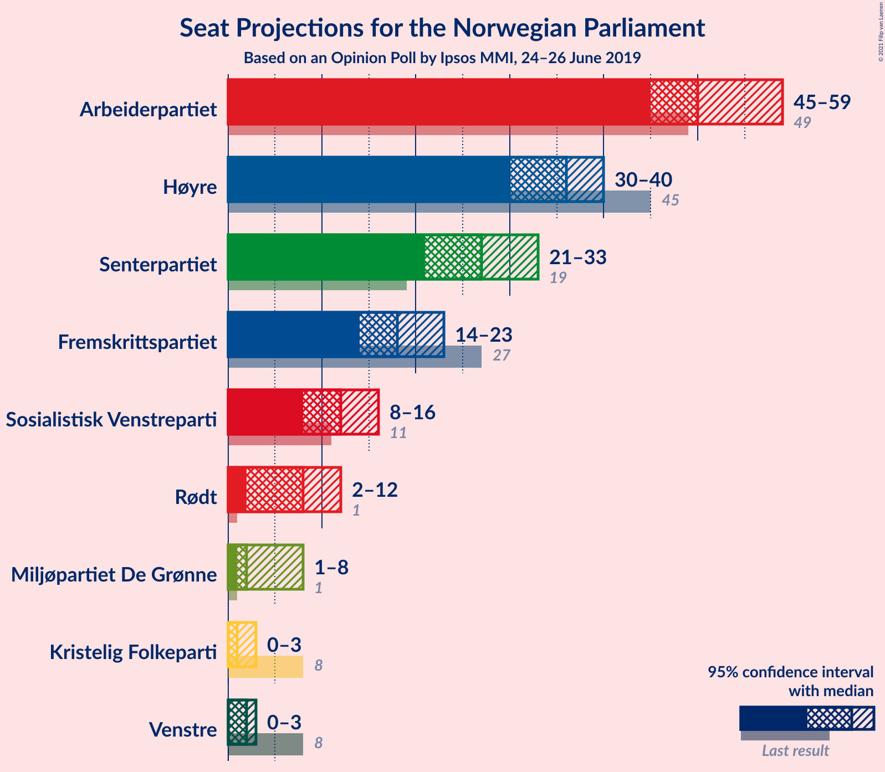

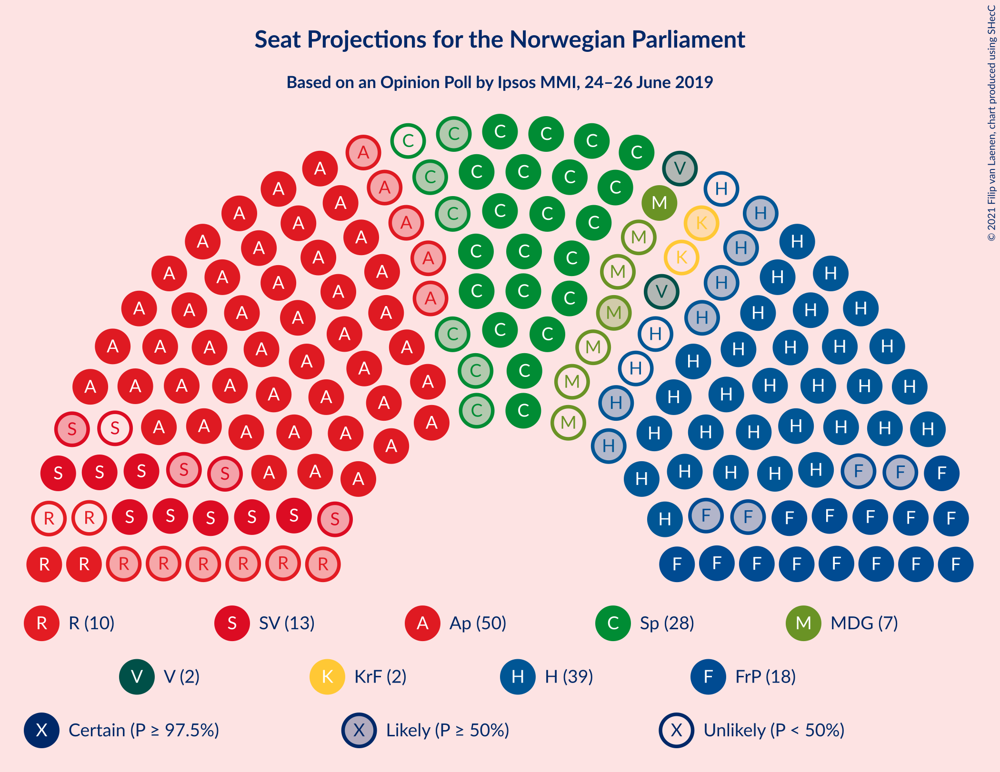

### Confidence Intervals

| Party | Last Result | Median | 80% Confidence Interval | 90% Confidence Interval | 95% Confidence Interval | 99% Confidence Interval |
|:-----:|:-----------:|:------:|:-----------------------:|:-----------------------:|:-----------------------:|:-----------------------:|
| <a href="#arbeiderpartiet">Arbeiderpartiet</a> | 49 | 50 | 48–57 |46–58 |45–59 |43–60 |
| <a href="#høyre">Høyre</a> | 45 | 36 | 33–39 |32–40 |30–40 |30–44 |
| <a href="#senterpartiet">Senterpartiet</a> | 19 | 27 | 23–30 |21–33 |21–33 |18–34 |
| <a href="#fremskrittspartiet">Fremskrittspartiet</a> | 27 | 18 | 16–20 |14–23 |14–23 |13–24 |
| <a href="#sosialistisk-venstreparti">Sosialistisk Venstreparti</a> | 11 | 12 | 9–14 |9–15 |8–16 |8–16 |
| <a href="#rødt">Rødt</a> | 1 | 8 | 6–10 |2–10 |2–12 |2–12 |
| <a href="#miljøpartiet-de-grønne">Miljøpartiet De Grønne</a> | 1 | 2 | 2–8 |1–8 |1–8 |1–10 |
| <a href="#venstre">Venstre</a> | 8 | 2 | 1–2 |0–2 |0–3 |0–6 |
| <a href="#kristelig-folkeparti">Kristelig Folkeparti</a> | 8 | 1 | 0–2 |0–3 |0–3 |0–5 |

### Arbeiderpartiet

*For a full overview of the results for this party, see the [Arbeiderpartiet](party-arbeiderpartiet.html) page.*

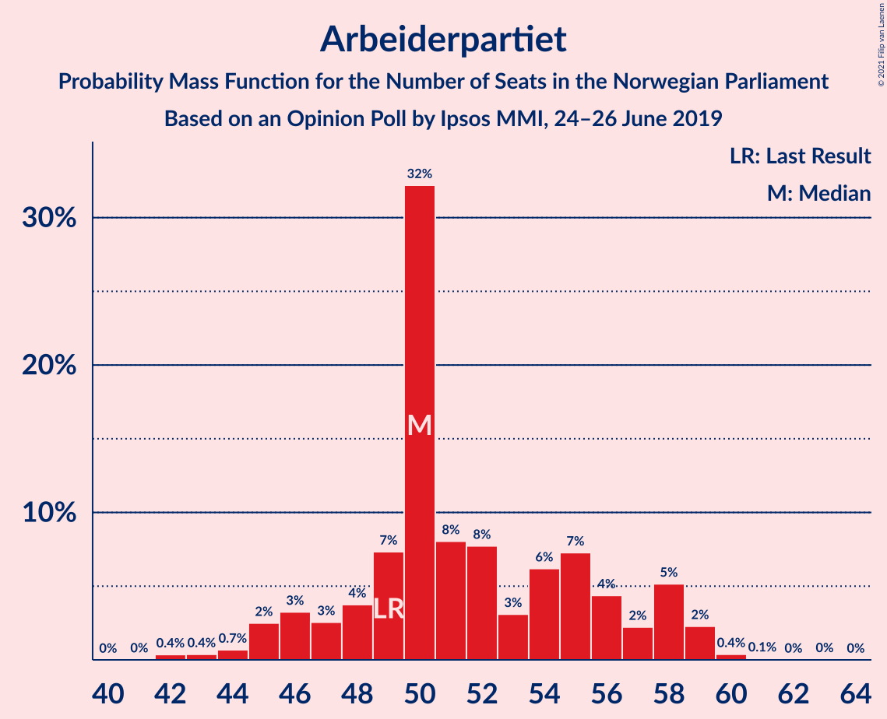

| Number of Seats | Probability | Accumulated | Special Marks |
|:---------------:|:-----------:|:-----------:|:-------------:|
| 42 | 0.4% | 100% |  |
| 43 | 0.4% | 99.6% |  |
| 44 | 0.7% | 99.2% |  |
| 45 | 2% | 98.5% |  |
| 46 | 3% | 96% |  |
| 47 | 3% | 93% |  |
| 48 | 4% | 90% |  |
| 49 | 7% | 86% | Last Result |
| 50 | 32% | 79% | Median |
| 51 | 8% | 47% |  |
| 52 | 8% | 39% |  |
| 53 | 3% | 31% |  |
| 54 | 6% | 28% |  |
| 55 | 7% | 22% |  |
| 56 | 4% | 15% |  |
| 57 | 2% | 10% |  |
| 58 | 5% | 8% |  |
| 59 | 2% | 3% |  |
| 60 | 0.4% | 0.5% |  |
| 61 | 0.1% | 0.2% |  |
| 62 | 0% | 0.1% |  |
| 63 | 0% | 0.1% |  |
| 64 | 0% | 0% |  |

### Høyre

*For a full overview of the results for this party, see the [Høyre](party-høyre.html) page.*

| Number of Seats | Probability | Accumulated | Special Marks |
|:---------------:|:-----------:|:-----------:|:-------------:|
| 27 | 0% | 100% |  |
| 28 | 0.2% | 99.9% |  |
| 29 | 0.1% | 99.8% |  |
| 30 | 2% | 99.7% |  |
| 31 | 1.2% | 97% |  |
| 32 | 2% | 96% |  |
| 33 | 8% | 94% |  |
| 34 | 5% | 86% |  |
| 35 | 5% | 80% |  |
| 36 | 39% | 76% | Median |
| 37 | 9% | 37% |  |
| 38 | 4% | 28% |  |
| 39 | 17% | 24% |  |
| 40 | 4% | 7% |  |
| 41 | 0.6% | 2% |  |
| 42 | 0.4% | 2% |  |
| 43 | 0.7% | 2% |  |
| 44 | 0.4% | 0.9% |  |
| 45 | 0.1% | 0.4% | Last Result |
| 46 | 0.3% | 0.4% |  |
| 47 | 0% | 0.1% |  |
| 48 | 0% | 0% |  |

### Senterpartiet

*For a full overview of the results for this party, see the [Senterpartiet](party-senterpartiet.html) page.*

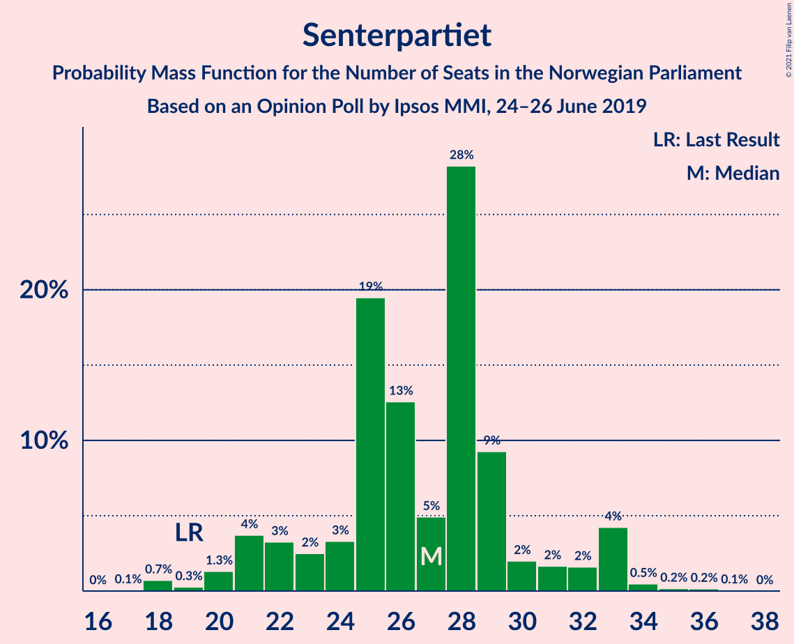

| Number of Seats | Probability | Accumulated | Special Marks |
|:---------------:|:-----------:|:-----------:|:-------------:|
| 17 | 0.1% | 100% |  |
| 18 | 0.7% | 99.9% |  |
| 19 | 0.3% | 99.2% | Last Result |
| 20 | 1.3% | 98.9% |  |
| 21 | 4% | 98% |  |
| 22 | 3% | 94% |  |
| 23 | 2% | 91% |  |
| 24 | 3% | 88% |  |
| 25 | 19% | 85% |  |
| 26 | 13% | 65% |  |
| 27 | 5% | 53% | Median |
| 28 | 28% | 48% |  |
| 29 | 9% | 20% |  |
| 30 | 2% | 10% |  |
| 31 | 2% | 8% |  |
| 32 | 2% | 7% |  |
| 33 | 4% | 5% |  |
| 34 | 0.5% | 0.9% |  |
| 35 | 0.2% | 0.4% |  |
| 36 | 0.2% | 0.2% |  |
| 37 | 0.1% | 0.1% |  |
| 38 | 0% | 0% |  |

### Fremskrittspartiet

*For a full overview of the results for this party, see the [Fremskrittspartiet](party-fremskrittspartiet.html) page.*

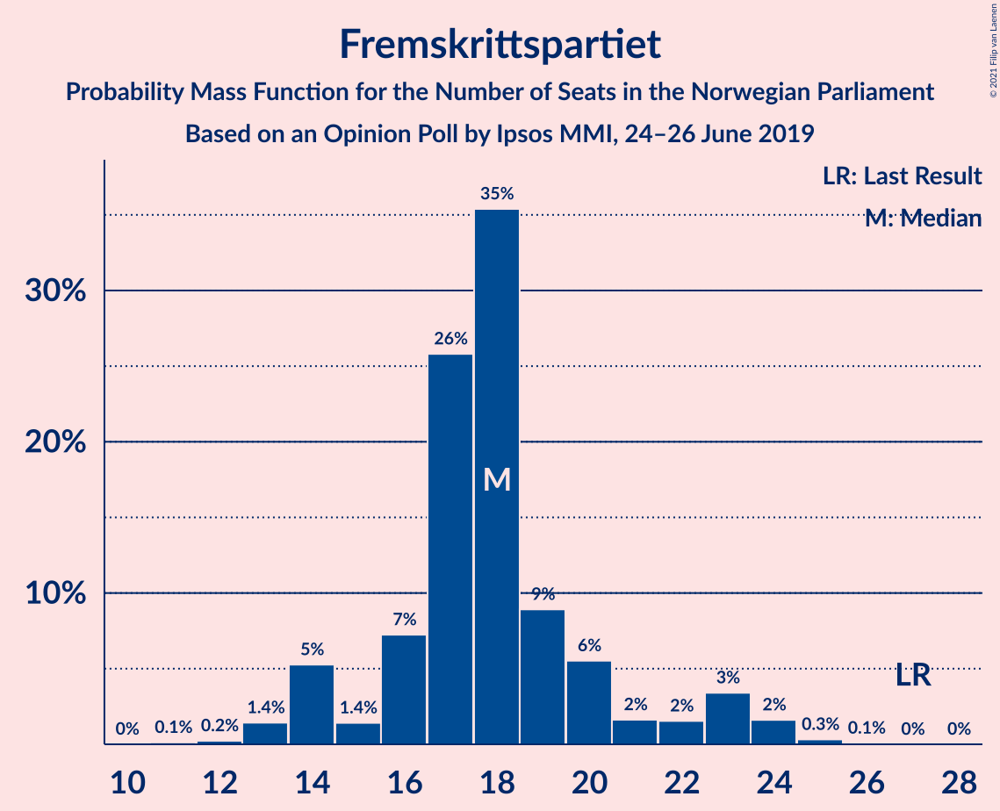

| Number of Seats | Probability | Accumulated | Special Marks |
|:---------------:|:-----------:|:-----------:|:-------------:|
| 11 | 0.1% | 100% |  |
| 12 | 0.2% | 99.9% |  |
| 13 | 1.4% | 99.6% |  |
| 14 | 5% | 98% |  |
| 15 | 1.4% | 93% |  |
| 16 | 7% | 92% |  |
| 17 | 26% | 84% |  |
| 18 | 35% | 58% | Median |
| 19 | 9% | 23% |  |
| 20 | 6% | 14% |  |
| 21 | 2% | 9% |  |
| 22 | 2% | 7% |  |
| 23 | 3% | 5% |  |
| 24 | 2% | 2% |  |
| 25 | 0.3% | 0.4% |  |
| 26 | 0.1% | 0.1% |  |
| 27 | 0% | 0% | Last Result |

### Sosialistisk Venstreparti

*For a full overview of the results for this party, see the [Sosialistisk Venstreparti](party-sosialistiskvenstreparti.html) page.*

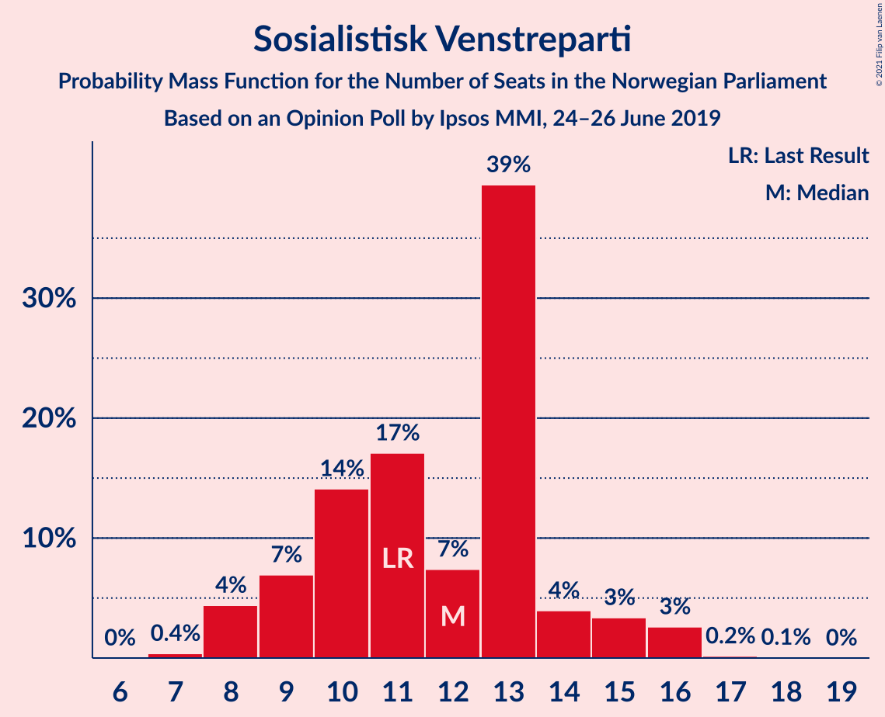

| Number of Seats | Probability | Accumulated | Special Marks |
|:---------------:|:-----------:|:-----------:|:-------------:|
| 7 | 0.4% | 100% |  |
| 8 | 4% | 99.6% |  |
| 9 | 7% | 95% |  |
| 10 | 14% | 88% |  |
| 11 | 17% | 74% | Last Result |
| 12 | 7% | 57% | Median |
| 13 | 39% | 50% |  |
| 14 | 4% | 10% |  |
| 15 | 3% | 6% |  |
| 16 | 3% | 3% |  |
| 17 | 0.2% | 0.2% |  |
| 18 | 0.1% | 0.1% |  |
| 19 | 0% | 0% |  |

### Rødt

*For a full overview of the results for this party, see the [Rødt](party-rødt.html) page.*

| Number of Seats | Probability | Accumulated | Special Marks |
|:---------------:|:-----------:|:-----------:|:-------------:|
| 1 | 0% | 100% | Last Result |
| 2 | 8% | 100% |  |
| 3 | 0% | 92% |  |
| 4 | 0% | 92% |  |
| 5 | 0% | 92% |  |
| 6 | 6% | 92% |  |
| 7 | 14% | 87% |  |
| 8 | 39% | 72% | Median |
| 9 | 14% | 33% |  |
| 10 | 14% | 19% |  |
| 11 | 2% | 5% |  |
| 12 | 2% | 3% |  |
| 13 | 0.2% | 0.2% |  |
| 14 | 0% | 0.1% |  |
| 15 | 0% | 0% |  |

### Miljøpartiet De Grønne

*For a full overview of the results for this party, see the [Miljøpartiet De Grønne](party-miljøpartietdegrønne.html) page.*

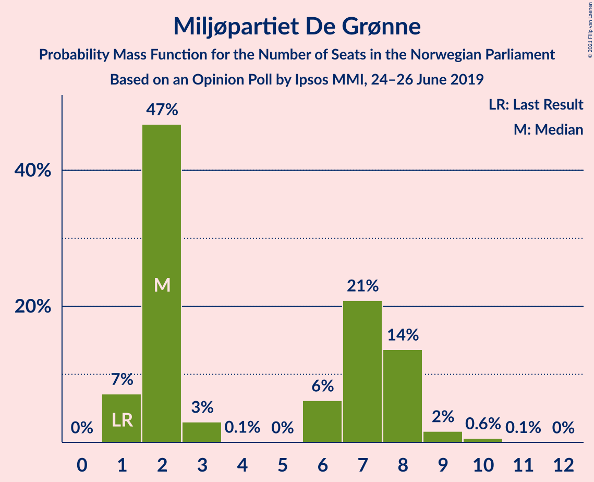

| Number of Seats | Probability | Accumulated | Special Marks |
|:---------------:|:-----------:|:-----------:|:-------------:|
| 1 | 7% | 100% | Last Result |
| 2 | 47% | 93% | Median |
| 3 | 3% | 46% |  |
| 4 | 0.1% | 43% |  |
| 5 | 0% | 43% |  |
| 6 | 6% | 43% |  |
| 7 | 21% | 37% |  |
| 8 | 14% | 16% |  |
| 9 | 2% | 2% |  |
| 10 | 0.6% | 0.7% |  |
| 11 | 0.1% | 0.1% |  |
| 12 | 0% | 0% |  |

### Venstre

*For a full overview of the results for this party, see the [Venstre](party-venstre.html) page.*

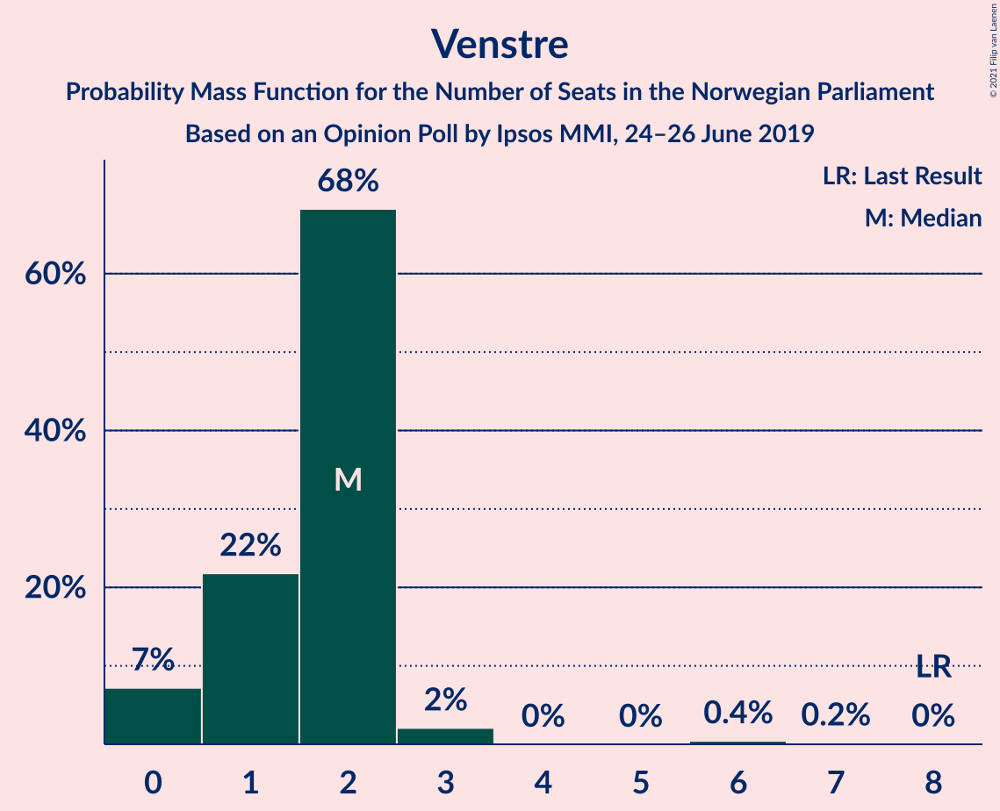

| Number of Seats | Probability | Accumulated | Special Marks |
|:---------------:|:-----------:|:-----------:|:-------------:|
| 0 | 7% | 100% |  |
| 1 | 22% | 93% |  |
| 2 | 68% | 71% | Median |
| 3 | 2% | 3% |  |
| 4 | 0% | 0.7% |  |
| 5 | 0% | 0.7% |  |
| 6 | 0.4% | 0.7% |  |
| 7 | 0.2% | 0.2% |  |
| 8 | 0% | 0% | Last Result |

### Kristelig Folkeparti

*For a full overview of the results for this party, see the [Kristelig Folkeparti](party-kristeligfolkeparti.html) page.*

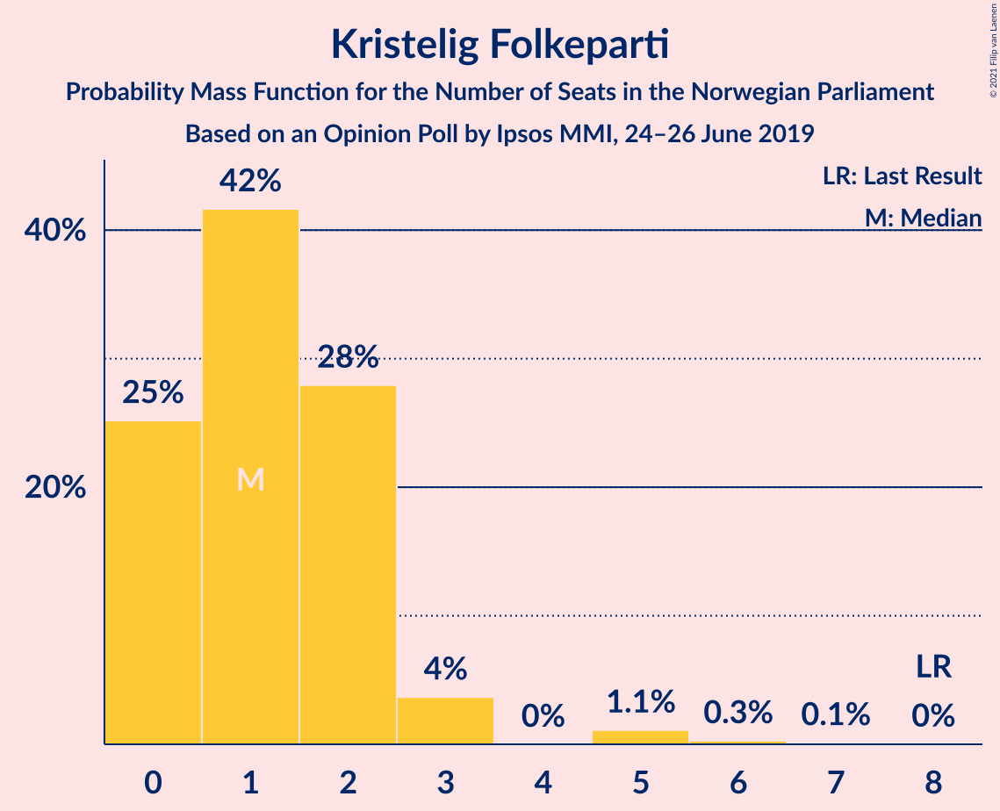

| Number of Seats | Probability | Accumulated | Special Marks |
|:---------------:|:-----------:|:-----------:|:-------------:|
| 0 | 25% | 100% |  |
| 1 | 42% | 75% | Median |
| 2 | 28% | 33% |  |
| 3 | 4% | 5% |  |
| 4 | 0% | 2% |  |
| 5 | 1.1% | 2% |  |
| 6 | 0.3% | 0.4% |  |
| 7 | 0.1% | 0.1% |  |
| 8 | 0% | 0% | Last Result |

## Coalitions

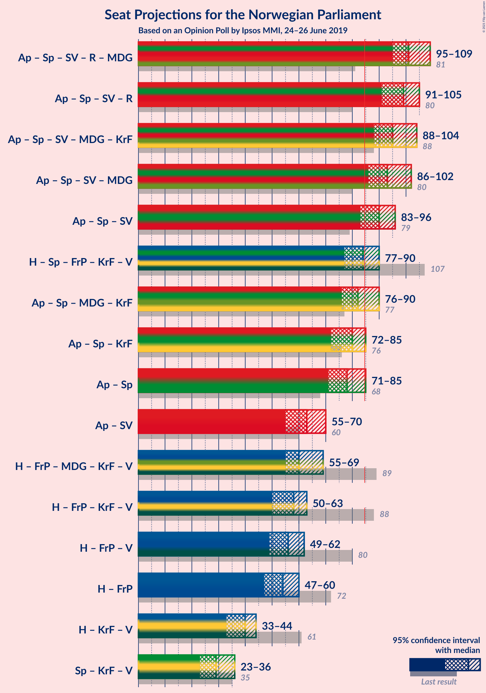

### Confidence Intervals

| Coalition | Last Result | Median | Majority? | 80% Confidence Interval | 90% Confidence Interval | 95% Confidence Interval | 99% Confidence Interval |
|:---------:|:-----------:|:------:|:---------:|:-----------------------:|:-----------------------:|:-----------------------:|:-----------------------:|
| Arbeiderpartiet – Senterpartiet – Sosialistisk Venstreparti – Rødt – Miljøpartiet De Grønne | 81 | 101 | 100% | 99–107 | 98–108 | 95–109 | 92–110 |
| Arbeiderpartiet – Senterpartiet – Sosialistisk Venstreparti – Rødt | 80 | 99 | 100% | 93–102 | 92–103 | 91–105 | 88–107 |
| Arbeiderpartiet – Senterpartiet – Sosialistisk Venstreparti – Miljøpartiet De Grønne – Kristelig Folkeparti | 88 | 95 | 99.7% | 92–100 | 90–102 | 88–104 | 85–104 |
| Arbeiderpartiet – Senterpartiet – Sosialistisk Venstreparti – Miljøpartiet De Grønne | 80 | 93 | 98% | 91–99 | 89–101 | 86–102 | 84–103 |
| Arbeiderpartiet – Senterpartiet – Sosialistisk Venstreparti | 79 | 90 | 95% | 86–94 | 84–95 | 83–96 | 81–98 |
| Høyre – Senterpartiet – Fremskrittspartiet – Kristelig Folkeparti – Venstre | 107 | 84 | 45% | 79–88 | 78–90 | 77–90 | 75–92 |
| Arbeiderpartiet – Senterpartiet – Miljøpartiet De Grønne – Kristelig Folkeparti | 77 | 82 | 32% | 80–89 | 78–90 | 76–90 | 72–94 |
| Arbeiderpartiet – Senterpartiet – Kristelig Folkeparti | 76 | 80 | 5% | 75–83 | 75–84 | 72–85 | 70–88 |
| Arbeiderpartiet – Senterpartiet | 68 | 78 | 3% | 74–82 | 74–83 | 71–85 | 69–86 |
| Arbeiderpartiet – Sosialistisk Venstreparti | 60 | 63 | 0% | 59–69 | 56–70 | 55–70 | 54–71 |
| Høyre – Fremskrittspartiet – Miljøpartiet De Grønne – Kristelig Folkeparti – Venstre | 89 | 60 | 0% | 57–66 | 56–67 | 55–69 | 51–71 |
| Høyre – Fremskrittspartiet – Kristelig Folkeparti – Venstre | 88 | 58 | 0% | 53–60 | 52–62 | 50–63 | 49–65 |
| Høyre – Fremskrittspartiet – Venstre | 80 | 56 | 0% | 52–59 | 51–61 | 49–62 | 49–65 |
| Høyre – Fremskrittspartiet | 72 | 54 | 0% | 51–57 | 49–60 | 47–60 | 47–64 |
| Høyre – Kristelig Folkeparti – Venstre | 61 | 40 | 0% | 36–42 | 34–43 | 33–44 | 32–47 |
| Senterpartiet – Kristelig Folkeparti – Venstre | 35 | 29 | 0% | 25–32 | 24–35 | 23–36 | 20–38 |

### Arbeiderpartiet – Senterpartiet – Sosialistisk Venstreparti – Rødt – Miljøpartiet De Grønne

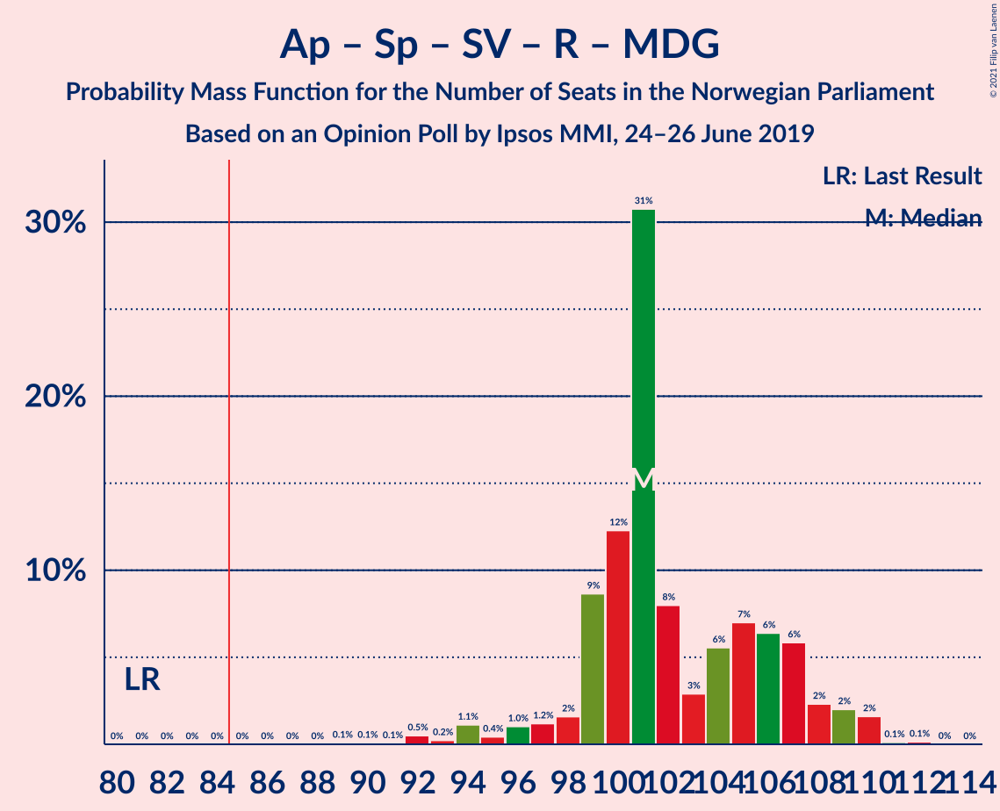

| Number of Seats | Probability | Accumulated | Special Marks |
|:---------------:|:-----------:|:-----------:|:-------------:|
| 81 | 0% | 100% | Last Result |
| 82 | 0% | 100% |  |
| 83 | 0% | 100% |  |
| 84 | 0% | 100% |  |
| 85 | 0% | 100% | Majority |
| 86 | 0% | 100% |  |
| 87 | 0% | 100% |  |
| 88 | 0% | 100% |  |
| 89 | 0.1% | 100% |  |
| 90 | 0.1% | 99.9% |  |
| 91 | 0.1% | 99.8% |  |
| 92 | 0.5% | 99.8% |  |
| 93 | 0.2% | 99.3% |  |
| 94 | 1.1% | 99.0% |  |
| 95 | 0.4% | 98% |  |
| 96 | 1.0% | 97% |  |
| 97 | 1.2% | 96% |  |
| 98 | 2% | 95% |  |
| 99 | 9% | 94% | Median |
| 100 | 12% | 85% |  |
| 101 | 31% | 73% |  |
| 102 | 8% | 42% |  |
| 103 | 3% | 34% |  |
| 104 | 6% | 31% |  |
| 105 | 7% | 25% |  |
| 106 | 6% | 18% |  |
| 107 | 6% | 12% |  |
| 108 | 2% | 6% |  |
| 109 | 2% | 4% |  |
| 110 | 2% | 2% |  |
| 111 | 0.1% | 0.3% |  |
| 112 | 0.1% | 0.2% |  |
| 113 | 0% | 0% |  |

### Arbeiderpartiet – Senterpartiet – Sosialistisk Venstreparti – Rødt

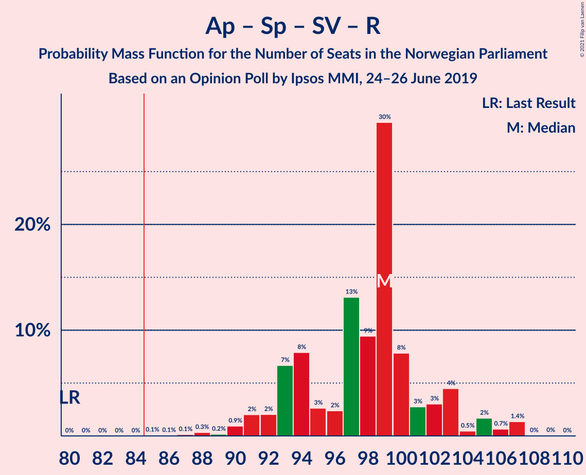

| Number of Seats | Probability | Accumulated | Special Marks |
|:---------------:|:-----------:|:-----------:|:-------------:|
| 80 | 0% | 100% | Last Result |
| 81 | 0% | 100% |  |
| 82 | 0% | 100% |  |
| 83 | 0% | 100% |  |
| 84 | 0% | 100% |  |
| 85 | 0.1% | 100% | Majority |
| 86 | 0.1% | 99.9% |  |
| 87 | 0.1% | 99.8% |  |
| 88 | 0.3% | 99.7% |  |
| 89 | 0.2% | 99.4% |  |
| 90 | 0.9% | 99.2% |  |
| 91 | 2% | 98% |  |
| 92 | 2% | 96% |  |
| 93 | 7% | 94% |  |
| 94 | 8% | 88% |  |
| 95 | 3% | 80% |  |
| 96 | 2% | 77% |  |
| 97 | 13% | 75% | Median |
| 98 | 9% | 61% |  |
| 99 | 30% | 52% |  |
| 100 | 8% | 22% |  |
| 101 | 3% | 15% |  |
| 102 | 3% | 12% |  |
| 103 | 4% | 9% |  |
| 104 | 0.5% | 4% |  |
| 105 | 2% | 4% |  |
| 106 | 0.7% | 2% |  |
| 107 | 1.4% | 1.5% |  |
| 108 | 0% | 0.1% |  |
| 109 | 0% | 0.1% |  |
| 110 | 0% | 0% |  |

### Arbeiderpartiet – Senterpartiet – Sosialistisk Venstreparti – Miljøpartiet De Grønne – Kristelig Folkeparti

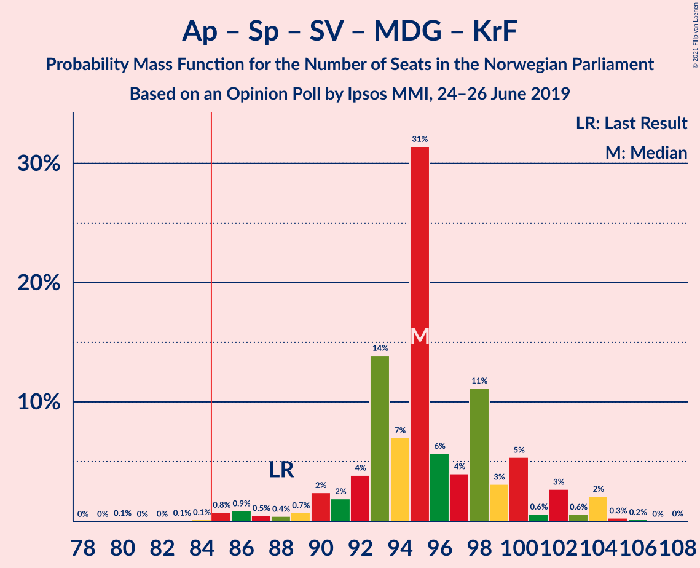

| Number of Seats | Probability | Accumulated | Special Marks |
|:---------------:|:-----------:|:-----------:|:-------------:|
| 80 | 0.1% | 100% |  |
| 81 | 0% | 99.9% |  |
| 82 | 0% | 99.9% |  |
| 83 | 0.1% | 99.9% |  |
| 84 | 0.1% | 99.8% |  |
| 85 | 0.8% | 99.7% | Majority |
| 86 | 0.9% | 98.9% |  |
| 87 | 0.5% | 98% |  |
| 88 | 0.4% | 98% | Last Result |
| 89 | 0.7% | 97% |  |
| 90 | 2% | 96% |  |
| 91 | 2% | 94% |  |
| 92 | 4% | 92% | Median |
| 93 | 14% | 88% |  |
| 94 | 7% | 74% |  |
| 95 | 31% | 67% |  |
| 96 | 6% | 36% |  |
| 97 | 4% | 30% |  |
| 98 | 11% | 26% |  |
| 99 | 3% | 15% |  |
| 100 | 5% | 12% |  |
| 101 | 0.6% | 6% |  |
| 102 | 3% | 6% |  |
| 103 | 0.6% | 3% |  |
| 104 | 2% | 3% |  |
| 105 | 0.3% | 0.5% |  |
| 106 | 0.2% | 0.2% |  |
| 107 | 0% | 0% |  |

### Arbeiderpartiet – Senterpartiet – Sosialistisk Venstreparti – Miljøpartiet De Grønne

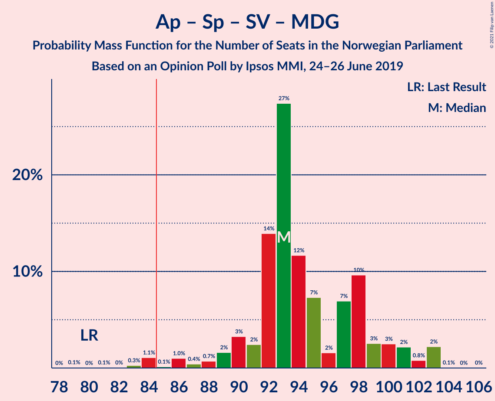

| Number of Seats | Probability | Accumulated | Special Marks |
|:---------------:|:-----------:|:-----------:|:-------------:|
| 79 | 0.1% | 100% |  |
| 80 | 0% | 99.9% | Last Result |
| 81 | 0.1% | 99.9% |  |
| 82 | 0% | 99.9% |  |
| 83 | 0.3% | 99.8% |  |
| 84 | 1.1% | 99.5% |  |
| 85 | 0.1% | 98% | Majority |
| 86 | 1.0% | 98% |  |
| 87 | 0.4% | 97% |  |
| 88 | 0.7% | 97% |  |
| 89 | 2% | 96% |  |
| 90 | 3% | 95% |  |
| 91 | 2% | 91% | Median |
| 92 | 14% | 89% |  |
| 93 | 27% | 75% |  |
| 94 | 12% | 47% |  |
| 95 | 7% | 36% |  |
| 96 | 2% | 29% |  |
| 97 | 7% | 27% |  |
| 98 | 10% | 20% |  |
| 99 | 3% | 10% |  |
| 100 | 3% | 8% |  |
| 101 | 2% | 5% |  |
| 102 | 0.8% | 3% |  |
| 103 | 2% | 2% |  |
| 104 | 0.1% | 0.1% |  |
| 105 | 0% | 0.1% |  |
| 106 | 0% | 0% |  |

### Arbeiderpartiet – Senterpartiet – Sosialistisk Venstreparti

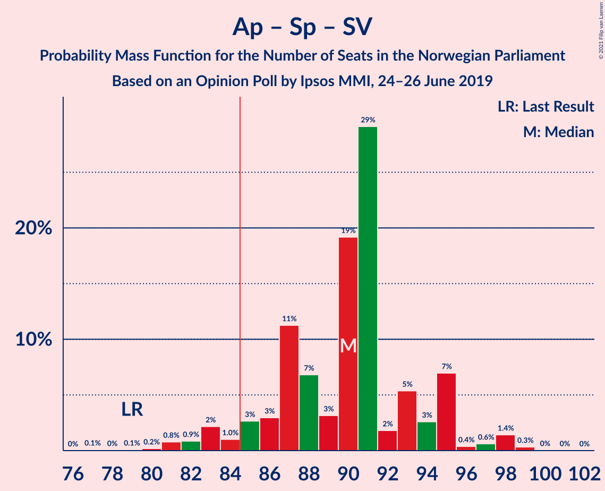

| Number of Seats | Probability | Accumulated | Special Marks |
|:---------------:|:-----------:|:-----------:|:-------------:|
| 77 | 0.1% | 100% |  |
| 78 | 0% | 99.9% |  |
| 79 | 0.1% | 99.8% | Last Result |
| 80 | 0.2% | 99.7% |  |
| 81 | 0.8% | 99.5% |  |
| 82 | 0.9% | 98.8% |  |
| 83 | 2% | 98% |  |
| 84 | 1.0% | 96% |  |
| 85 | 3% | 95% | Majority |
| 86 | 3% | 92% |  |
| 87 | 11% | 89% |  |
| 88 | 7% | 78% |  |
| 89 | 3% | 71% | Median |
| 90 | 19% | 68% |  |
| 91 | 29% | 49% |  |
| 92 | 2% | 20% |  |
| 93 | 5% | 18% |  |
| 94 | 3% | 12% |  |
| 95 | 7% | 10% |  |
| 96 | 0.4% | 3% |  |
| 97 | 0.6% | 2% |  |
| 98 | 1.4% | 2% |  |
| 99 | 0.3% | 0.4% |  |
| 100 | 0% | 0.1% |  |
| 101 | 0% | 0% |  |

### Høyre – Senterpartiet – Fremskrittspartiet – Kristelig Folkeparti – Venstre

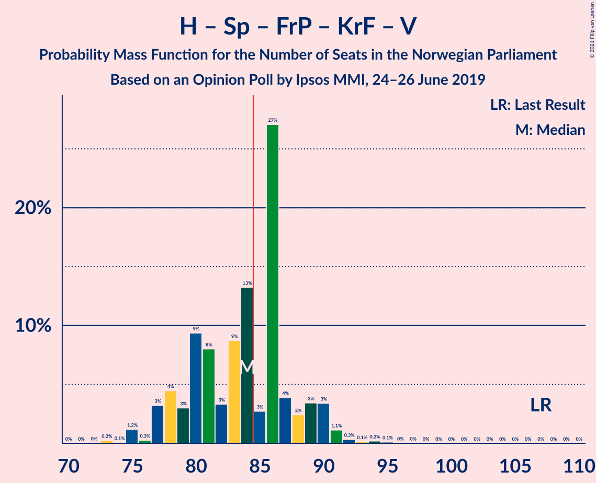

| Number of Seats | Probability | Accumulated | Special Marks |
|:---------------:|:-----------:|:-----------:|:-------------:|
| 73 | 0.2% | 100% |  |
| 74 | 0.1% | 99.7% |  |
| 75 | 1.2% | 99.7% |  |
| 76 | 0.3% | 98% |  |
| 77 | 3% | 98% |  |
| 78 | 4% | 95% |  |
| 79 | 3% | 91% |  |
| 80 | 9% | 88% |  |
| 81 | 8% | 78% |  |
| 82 | 3% | 70% |  |
| 83 | 9% | 67% |  |
| 84 | 13% | 58% | Median |
| 85 | 3% | 45% | Majority |
| 86 | 27% | 42% |  |
| 87 | 4% | 15% |  |
| 88 | 2% | 11% |  |
| 89 | 3% | 9% |  |
| 90 | 3% | 5% |  |
| 91 | 1.1% | 2% |  |
| 92 | 0.3% | 0.8% |  |
| 93 | 0.1% | 0.5% |  |
| 94 | 0.2% | 0.4% |  |
| 95 | 0.1% | 0.2% |  |
| 96 | 0% | 0% |  |
| 97 | 0% | 0% |  |
| 98 | 0% | 0% |  |
| 99 | 0% | 0% |  |
| 100 | 0% | 0% |  |
| 101 | 0% | 0% |  |
| 102 | 0% | 0% |  |
| 103 | 0% | 0% |  |
| 104 | 0% | 0% |  |
| 105 | 0% | 0% |  |
| 106 | 0% | 0% |  |
| 107 | 0% | 0% | Last Result |

### Arbeiderpartiet – Senterpartiet – Miljøpartiet De Grønne – Kristelig Folkeparti

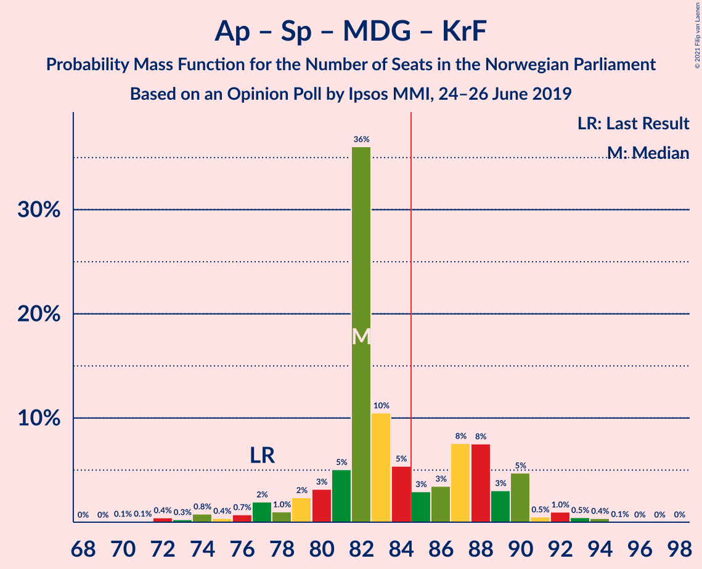

| Number of Seats | Probability | Accumulated | Special Marks |
|:---------------:|:-----------:|:-----------:|:-------------:|
| 70 | 0.1% | 100% |  |
| 71 | 0.1% | 99.9% |  |
| 72 | 0.4% | 99.8% |  |
| 73 | 0.3% | 99.4% |  |
| 74 | 0.8% | 99.1% |  |
| 75 | 0.4% | 98% |  |
| 76 | 0.7% | 98% |  |
| 77 | 2% | 97% | Last Result |
| 78 | 1.0% | 95% |  |
| 79 | 2% | 94% |  |
| 80 | 3% | 92% | Median |
| 81 | 5% | 89% |  |
| 82 | 36% | 84% |  |
| 83 | 10% | 48% |  |
| 84 | 5% | 37% |  |
| 85 | 3% | 32% | Majority |
| 86 | 3% | 29% |  |
| 87 | 8% | 25% |  |
| 88 | 8% | 18% |  |
| 89 | 3% | 10% |  |
| 90 | 5% | 7% |  |
| 91 | 0.5% | 2% |  |
| 92 | 1.0% | 2% |  |
| 93 | 0.5% | 1.0% |  |
| 94 | 0.4% | 0.5% |  |
| 95 | 0.1% | 0.1% |  |
| 96 | 0% | 0.1% |  |
| 97 | 0% | 0% |  |

### Arbeiderpartiet – Senterpartiet – Kristelig Folkeparti

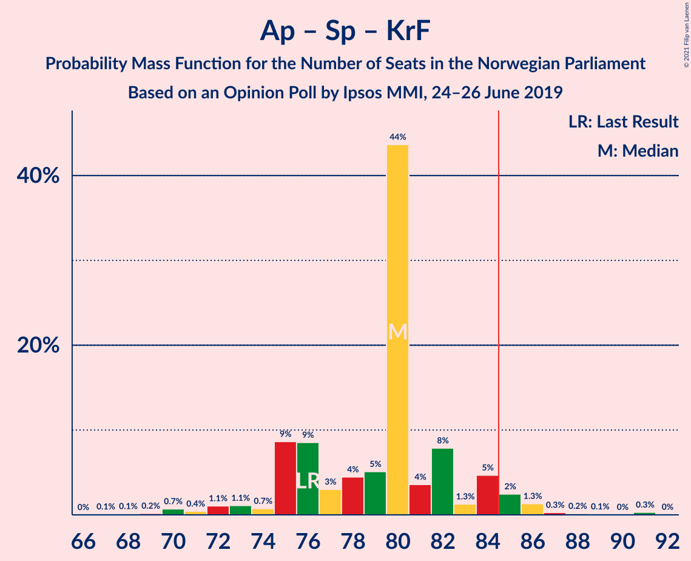

| Number of Seats | Probability | Accumulated | Special Marks |
|:---------------:|:-----------:|:-----------:|:-------------:|
| 67 | 0.1% | 100% |  |
| 68 | 0.1% | 99.9% |  |
| 69 | 0.2% | 99.8% |  |
| 70 | 0.7% | 99.6% |  |
| 71 | 0.4% | 98.9% |  |
| 72 | 1.1% | 98% |  |
| 73 | 1.1% | 97% |  |
| 74 | 0.7% | 96% |  |
| 75 | 9% | 96% |  |
| 76 | 9% | 87% | Last Result |
| 77 | 3% | 78% |  |
| 78 | 4% | 75% | Median |
| 79 | 5% | 71% |  |
| 80 | 44% | 66% |  |
| 81 | 4% | 22% |  |
| 82 | 8% | 19% |  |
| 83 | 1.3% | 11% |  |
| 84 | 5% | 9% |  |
| 85 | 2% | 5% | Majority |
| 86 | 1.3% | 2% |  |
| 87 | 0.3% | 0.9% |  |
| 88 | 0.2% | 0.6% |  |
| 89 | 0.1% | 0.5% |  |
| 90 | 0% | 0.4% |  |
| 91 | 0.3% | 0.4% |  |
| 92 | 0% | 0% |  |

### Arbeiderpartiet – Senterpartiet

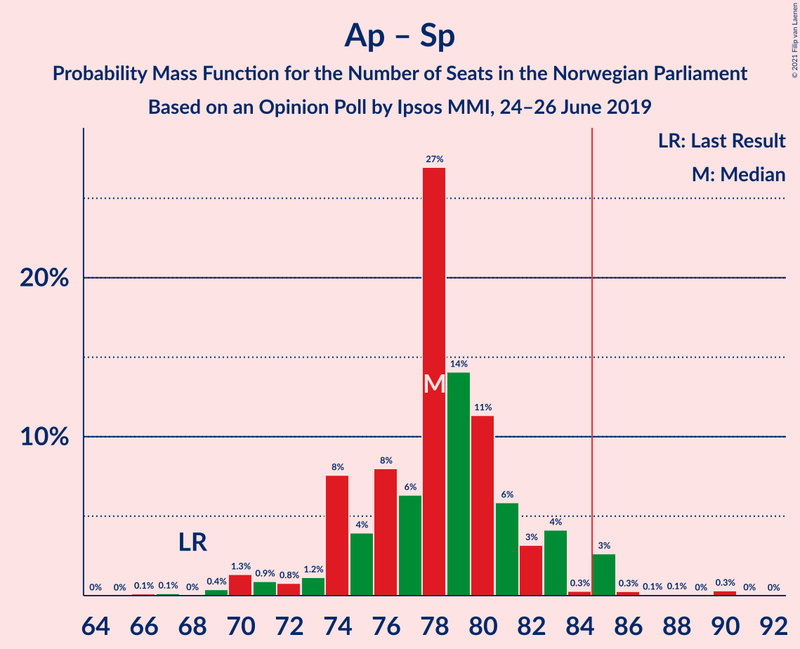

| Number of Seats | Probability | Accumulated | Special Marks |
|:---------------:|:-----------:|:-----------:|:-------------:|
| 66 | 0.1% | 100% |  |
| 67 | 0.1% | 99.8% |  |
| 68 | 0% | 99.7% | Last Result |
| 69 | 0.4% | 99.7% |  |
| 70 | 1.3% | 99.3% |  |
| 71 | 0.9% | 98% |  |
| 72 | 0.8% | 97% |  |
| 73 | 1.2% | 96% |  |
| 74 | 8% | 95% |  |
| 75 | 4% | 88% |  |
| 76 | 8% | 84% |  |
| 77 | 6% | 76% | Median |
| 78 | 27% | 69% |  |
| 79 | 14% | 42% |  |
| 80 | 11% | 28% |  |
| 81 | 6% | 17% |  |
| 82 | 3% | 11% |  |
| 83 | 4% | 8% |  |
| 84 | 0.3% | 4% |  |
| 85 | 3% | 3% | Majority |
| 86 | 0.3% | 0.8% |  |
| 87 | 0.1% | 0.5% |  |
| 88 | 0.1% | 0.4% |  |
| 89 | 0% | 0.3% |  |
| 90 | 0.3% | 0.3% |  |
| 91 | 0% | 0% |  |

### Arbeiderpartiet – Sosialistisk Venstreparti

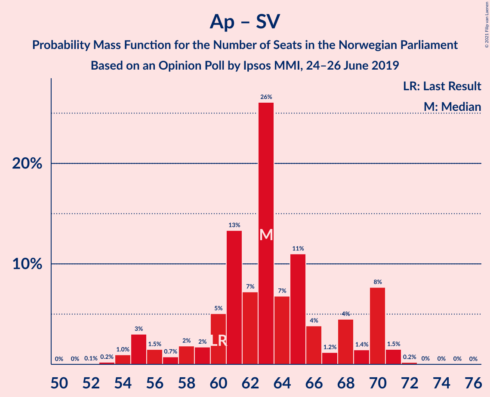

| Number of Seats | Probability | Accumulated | Special Marks |
|:---------------:|:-----------:|:-----------:|:-------------:|
| 52 | 0.1% | 100% |  |
| 53 | 0.2% | 99.9% |  |
| 54 | 1.0% | 99.7% |  |
| 55 | 3% | 98.7% |  |
| 56 | 1.5% | 96% |  |
| 57 | 0.7% | 94% |  |
| 58 | 2% | 93% |  |
| 59 | 2% | 92% |  |
| 60 | 5% | 90% | Last Result |
| 61 | 13% | 85% |  |
| 62 | 7% | 72% | Median |
| 63 | 26% | 64% |  |
| 64 | 7% | 38% |  |
| 65 | 11% | 31% |  |
| 66 | 4% | 20% |  |
| 67 | 1.2% | 17% |  |
| 68 | 4% | 15% |  |
| 69 | 1.4% | 11% |  |
| 70 | 8% | 9% |  |
| 71 | 1.5% | 2% |  |
| 72 | 0.2% | 0.3% |  |
| 73 | 0% | 0.1% |  |
| 74 | 0% | 0.1% |  |
| 75 | 0% | 0% |  |

### Høyre – Fremskrittspartiet – Miljøpartiet De Grønne – Kristelig Folkeparti – Venstre

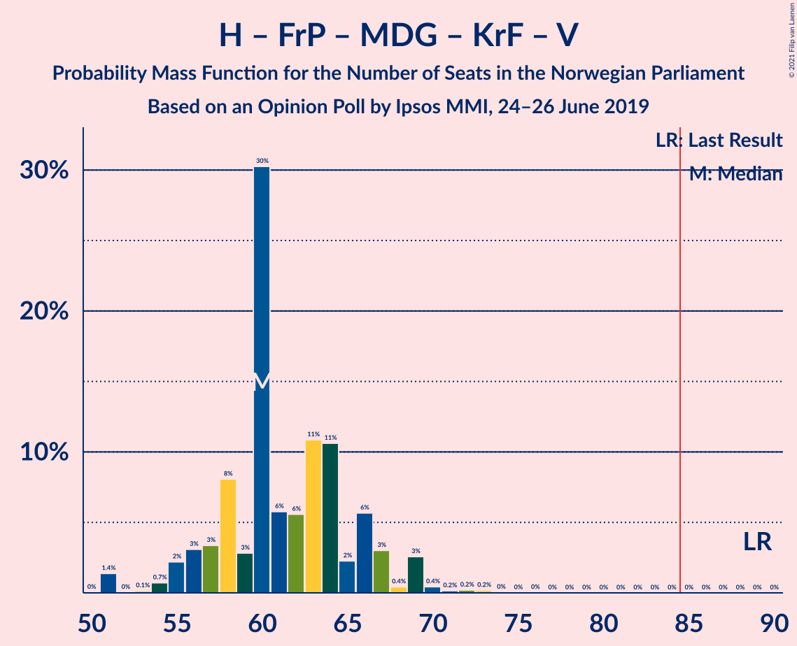

| Number of Seats | Probability | Accumulated | Special Marks |
|:---------------:|:-----------:|:-----------:|:-------------:|
| 51 | 1.4% | 100% |  |
| 52 | 0% | 98.6% |  |
| 53 | 0.1% | 98.5% |  |
| 54 | 0.7% | 98% |  |
| 55 | 2% | 98% |  |
| 56 | 3% | 95% |  |
| 57 | 3% | 92% |  |
| 58 | 8% | 89% |  |
| 59 | 3% | 81% | Median |
| 60 | 30% | 78% |  |
| 61 | 6% | 48% |  |
| 62 | 6% | 42% |  |
| 63 | 11% | 37% |  |
| 64 | 11% | 26% |  |
| 65 | 2% | 15% |  |
| 66 | 6% | 13% |  |
| 67 | 3% | 7% |  |
| 68 | 0.4% | 4% |  |
| 69 | 3% | 4% |  |
| 70 | 0.4% | 1.1% |  |
| 71 | 0.2% | 0.6% |  |
| 72 | 0.2% | 0.5% |  |
| 73 | 0.2% | 0.3% |  |
| 74 | 0% | 0.1% |  |
| 75 | 0% | 0.1% |  |
| 76 | 0% | 0% |  |
| 77 | 0% | 0% |  |
| 78 | 0% | 0% |  |
| 79 | 0% | 0% |  |
| 80 | 0% | 0% |  |
| 81 | 0% | 0% |  |
| 82 | 0% | 0% |  |
| 83 | 0% | 0% |  |
| 84 | 0% | 0% |  |
| 85 | 0% | 0% | Majority |
| 86 | 0% | 0% |  |
| 87 | 0% | 0% |  |
| 88 | 0% | 0% |  |
| 89 | 0% | 0% | Last Result |

### Høyre – Fremskrittspartiet – Kristelig Folkeparti – Venstre

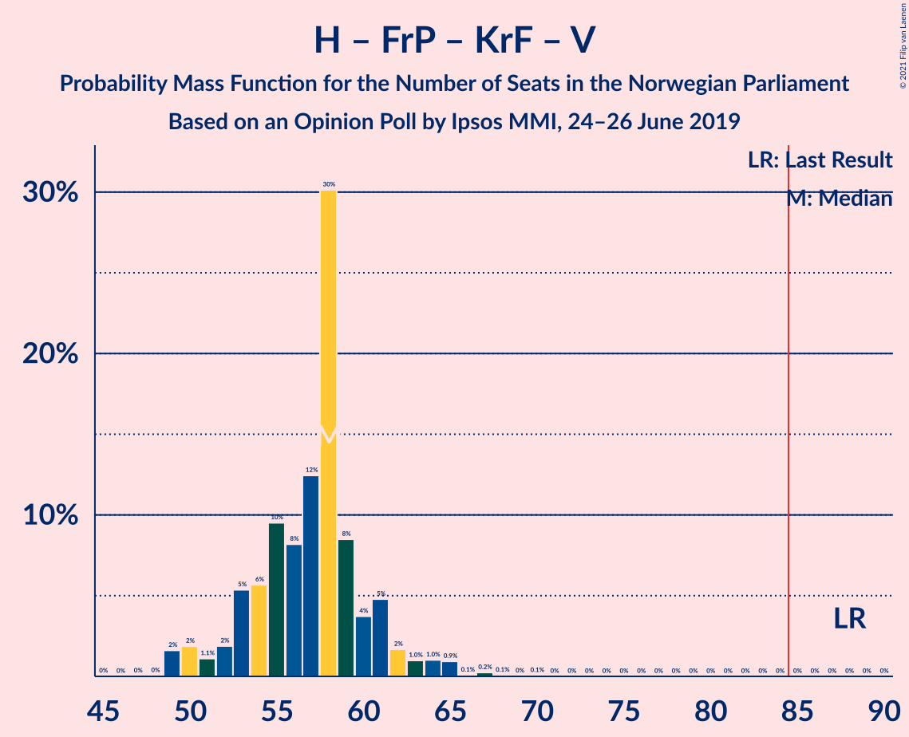

| Number of Seats | Probability | Accumulated | Special Marks |
|:---------------:|:-----------:|:-----------:|:-------------:|
| 47 | 0% | 100% |  |
| 48 | 0% | 99.9% |  |
| 49 | 2% | 99.9% |  |
| 50 | 2% | 98% |  |
| 51 | 1.1% | 96% |  |
| 52 | 2% | 95% |  |
| 53 | 5% | 93% |  |
| 54 | 6% | 88% |  |
| 55 | 10% | 82% |  |
| 56 | 8% | 73% |  |
| 57 | 12% | 65% | Median |
| 58 | 30% | 52% |  |
| 59 | 8% | 22% |  |
| 60 | 4% | 14% |  |
| 61 | 5% | 10% |  |
| 62 | 2% | 5% |  |
| 63 | 1.0% | 3% |  |
| 64 | 1.0% | 2% |  |
| 65 | 0.9% | 1.4% |  |
| 66 | 0.1% | 0.5% |  |
| 67 | 0.2% | 0.4% |  |
| 68 | 0.1% | 0.2% |  |
| 69 | 0% | 0.1% |  |
| 70 | 0.1% | 0.1% |  |
| 71 | 0% | 0% |  |
| 72 | 0% | 0% |  |
| 73 | 0% | 0% |  |
| 74 | 0% | 0% |  |
| 75 | 0% | 0% |  |
| 76 | 0% | 0% |  |
| 77 | 0% | 0% |  |
| 78 | 0% | 0% |  |
| 79 | 0% | 0% |  |
| 80 | 0% | 0% |  |
| 81 | 0% | 0% |  |
| 82 | 0% | 0% |  |
| 83 | 0% | 0% |  |
| 84 | 0% | 0% |  |
| 85 | 0% | 0% | Majority |
| 86 | 0% | 0% |  |
| 87 | 0% | 0% |  |
| 88 | 0% | 0% | Last Result |

### Høyre – Fremskrittspartiet – Venstre

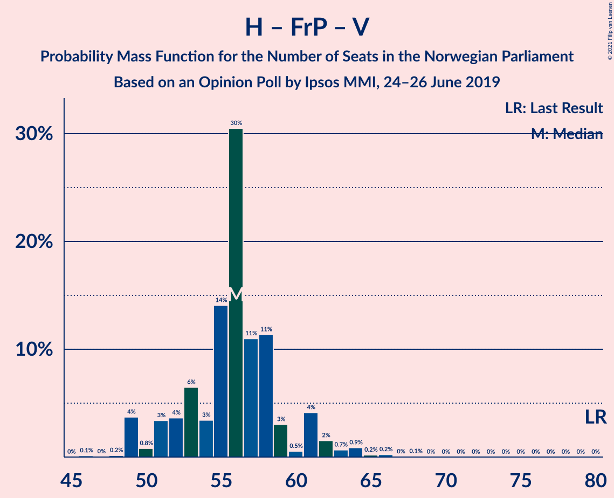

| Number of Seats | Probability | Accumulated | Special Marks |
|:---------------:|:-----------:|:-----------:|:-------------:|
| 46 | 0.1% | 100% |  |
| 47 | 0% | 99.8% |  |
| 48 | 0.2% | 99.8% |  |
| 49 | 4% | 99.6% |  |
| 50 | 0.8% | 96% |  |
| 51 | 3% | 95% |  |
| 52 | 4% | 92% |  |
| 53 | 6% | 88% |  |
| 54 | 3% | 82% |  |
| 55 | 14% | 78% |  |
| 56 | 30% | 64% | Median |
| 57 | 11% | 34% |  |
| 58 | 11% | 23% |  |
| 59 | 3% | 11% |  |
| 60 | 0.5% | 8% |  |
| 61 | 4% | 8% |  |
| 62 | 2% | 4% |  |
| 63 | 0.7% | 2% |  |
| 64 | 0.9% | 1.4% |  |
| 65 | 0.2% | 0.5% |  |
| 66 | 0.2% | 0.3% |  |
| 67 | 0% | 0.1% |  |
| 68 | 0.1% | 0.1% |  |
| 69 | 0% | 0% |  |
| 70 | 0% | 0% |  |
| 71 | 0% | 0% |  |
| 72 | 0% | 0% |  |
| 73 | 0% | 0% |  |
| 74 | 0% | 0% |  |
| 75 | 0% | 0% |  |
| 76 | 0% | 0% |  |
| 77 | 0% | 0% |  |
| 78 | 0% | 0% |  |
| 79 | 0% | 0% |  |
| 80 | 0% | 0% | Last Result |

### Høyre – Fremskrittspartiet

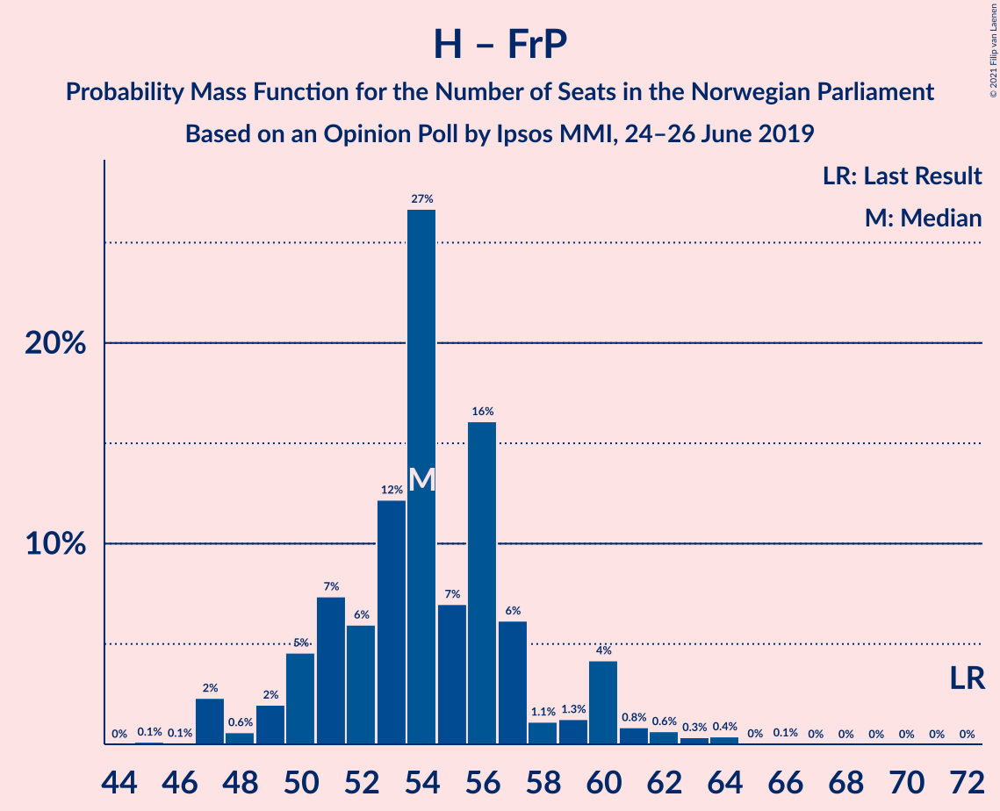

| Number of Seats | Probability | Accumulated | Special Marks |
|:---------------:|:-----------:|:-----------:|:-------------:|
| 45 | 0.1% | 100% |  |
| 46 | 0.1% | 99.8% |  |
| 47 | 2% | 99.8% |  |
| 48 | 0.6% | 97% |  |
| 49 | 2% | 97% |  |
| 50 | 5% | 95% |  |
| 51 | 7% | 90% |  |
| 52 | 6% | 83% |  |
| 53 | 12% | 77% |  |
| 54 | 27% | 65% | Median |
| 55 | 7% | 38% |  |
| 56 | 16% | 31% |  |
| 57 | 6% | 15% |  |
| 58 | 1.1% | 9% |  |
| 59 | 1.3% | 8% |  |
| 60 | 4% | 7% |  |
| 61 | 0.8% | 2% |  |
| 62 | 0.6% | 2% |  |
| 63 | 0.3% | 0.9% |  |
| 64 | 0.4% | 0.5% |  |
| 65 | 0% | 0.1% |  |
| 66 | 0.1% | 0.1% |  |
| 67 | 0% | 0% |  |
| 68 | 0% | 0% |  |
| 69 | 0% | 0% |  |
| 70 | 0% | 0% |  |
| 71 | 0% | 0% |  |
| 72 | 0% | 0% | Last Result |

### Høyre – Kristelig Folkeparti – Venstre

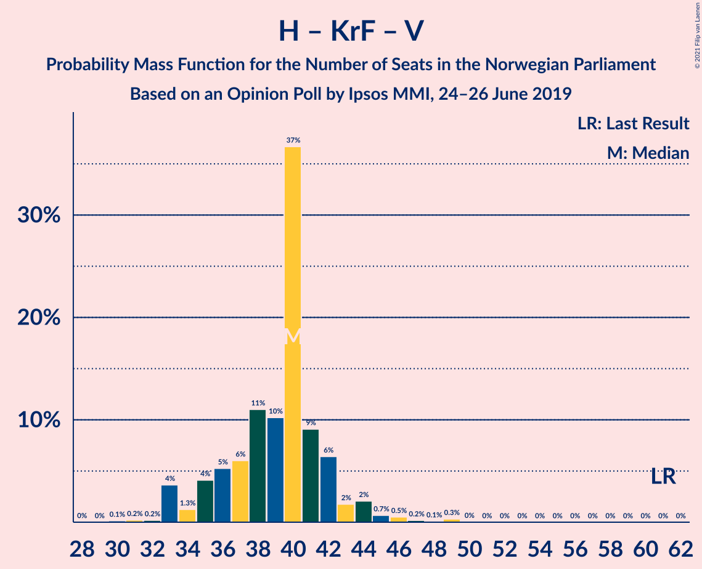

| Number of Seats | Probability | Accumulated | Special Marks |
|:---------------:|:-----------:|:-----------:|:-------------:|
| 30 | 0.1% | 100% |  |
| 31 | 0.2% | 99.8% |  |
| 32 | 0.2% | 99.6% |  |
| 33 | 4% | 99.4% |  |
| 34 | 1.3% | 96% |  |
| 35 | 4% | 95% |  |
| 36 | 5% | 90% |  |
| 37 | 6% | 85% |  |
| 38 | 11% | 79% |  |
| 39 | 10% | 68% | Median |
| 40 | 37% | 58% |  |
| 41 | 9% | 21% |  |
| 42 | 6% | 12% |  |
| 43 | 2% | 6% |  |
| 44 | 2% | 4% |  |
| 45 | 0.7% | 2% |  |
| 46 | 0.5% | 1.2% |  |
| 47 | 0.2% | 0.6% |  |
| 48 | 0.1% | 0.5% |  |
| 49 | 0.3% | 0.4% |  |
| 50 | 0% | 0% |  |
| 51 | 0% | 0% |  |
| 52 | 0% | 0% |  |
| 53 | 0% | 0% |  |
| 54 | 0% | 0% |  |
| 55 | 0% | 0% |  |
| 56 | 0% | 0% |  |
| 57 | 0% | 0% |  |
| 58 | 0% | 0% |  |
| 59 | 0% | 0% |  |
| 60 | 0% | 0% |  |
| 61 | 0% | 0% | Last Result |

### Senterpartiet – Kristelig Folkeparti – Venstre

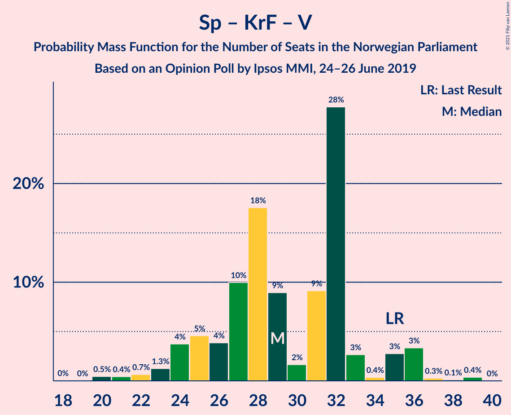

| Number of Seats | Probability | Accumulated | Special Marks |
|:---------------:|:-----------:|:-----------:|:-------------:|
| 19 | 0% | 100% |  |
| 20 | 0.5% | 99.9% |  |
| 21 | 0.4% | 99.5% |  |
| 22 | 0.7% | 99.0% |  |
| 23 | 1.3% | 98% |  |
| 24 | 4% | 97% |  |
| 25 | 5% | 93% |  |
| 26 | 4% | 89% |  |
| 27 | 10% | 85% |  |
| 28 | 18% | 75% |  |
| 29 | 9% | 57% |  |
| 30 | 2% | 48% | Median |
| 31 | 9% | 47% |  |
| 32 | 28% | 38% |  |
| 33 | 3% | 10% |  |
| 34 | 0.4% | 7% |  |
| 35 | 3% | 7% | Last Result |
| 36 | 3% | 4% |  |
| 37 | 0.3% | 0.8% |  |
| 38 | 0.1% | 0.5% |  |
| 39 | 0.4% | 0.4% |  |
| 40 | 0% | 0% |  |

## Technical Information

### Opinion Poll

+ **Polling firm:** Ipsos MMI
+ **Commissioner(s):** —
+ **Fieldwork period:** 24–26 June 2019

### Calculations

+ **Sample size:** 723
+ **Simulations done:** 131,072
+ **Error estimate:** 1.33%

