# Opinion Poll by Kantar TNS, 24–28 June 2019

<a href="#voting-intentions">Voting Intentions</a> | <a href="#seats">Seats</a> | <a href="#coalitions">Coalitions</a> | <a href="#technical-information">Technical Information</a>

## Voting Intentions

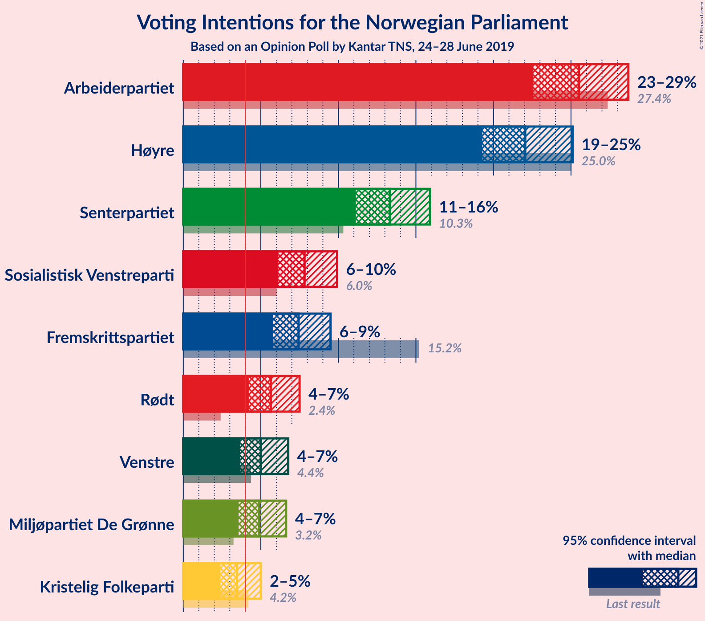

### Confidence Intervals

| Party | Last Result | Poll Result | 80% Confidence Interval | 90% Confidence Interval | 95% Confidence Interval | 99% Confidence Interval |
|:-----:|:-----------:|:-----------:|:-----------------------:|:-----------------------:|:-----------------------:|:-----------------------:|
| Arbeiderpartiet | 27.4% | 25.5% | 23.6–27.6% |23.0–28.2% |22.6–28.7% |21.7–29.7% |
| Høyre | 25.0% | 22.1% | 20.2–24.1% |19.7–24.6% |19.3–25.1% |18.4–26.1% |
| Senterpartiet | 10.3% | 13.3% | 11.9–15.0% |11.5–15.5% |11.1–15.9% |10.5–16.8% |
| Sosialistisk Venstreparti | 6.0% | 7.8% | 6.7–9.2% |6.4–9.6% |6.1–9.9% |5.6–10.6% |
| Fremskrittspartiet | 15.2% | 7.4% | 6.4–8.8% |6.1–9.2% |5.8–9.5% |5.3–10.2% |
| Rødt | 2.4% | 5.6% | 4.7–6.8% |4.5–7.2% |4.2–7.5% |3.8–8.1% |
| Venstre | 4.4% | 5.0% | 4.1–6.2% |3.9–6.5% |3.7–6.8% |3.3–7.4% |
| Miljøpartiet De Grønne | 3.2% | 4.9% | 4.0–6.0% |3.8–6.3% |3.6–6.6% |3.2–7.2% |
| Kristelig Folkeparti | 4.2% | 3.5% | 2.8–4.5% |2.5–4.7% |2.4–5.0% |2.1–5.5% |

*Note:* The poll result column reflects the actual value used in the calculations. Published results may vary slightly, and in addition be rounded to fewer digits.

## Seats

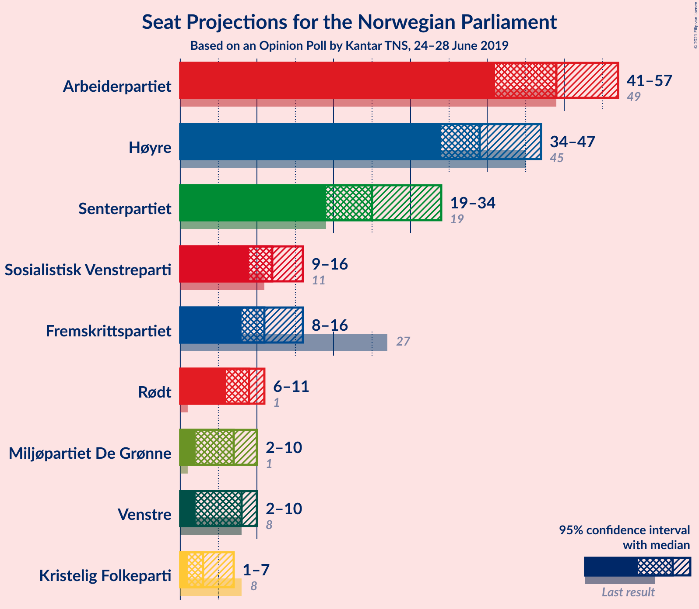

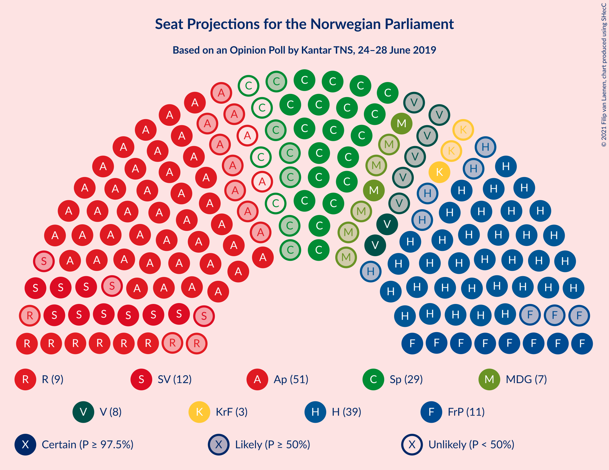

### Confidence Intervals

| Party | Last Result | Median | 80% Confidence Interval | 90% Confidence Interval | 95% Confidence Interval | 99% Confidence Interval |
|:-----:|:-----------:|:------:|:-----------------------:|:-----------------------:|:-----------------------:|:-----------------------:|
| <a href="#arbeiderpartiet">Arbeiderpartiet</a> | 49 | 49 | 43–54 |42–55 |41–57 |40–58 |
| <a href="#høyre">Høyre</a> | 45 | 39 | 36–45 |35–47 |34–47 |32–49 |
| <a href="#senterpartiet">Senterpartiet</a> | 19 | 25 | 19–31 |19–33 |19–34 |18–34 |
| <a href="#sosialistisk-venstreparti">Sosialistisk Venstreparti</a> | 11 | 12 | 10–15 |9–16 |9–16 |8–18 |
| <a href="#fremskrittspartiet">Fremskrittspartiet</a> | 27 | 11 | 9–15 |8–15 |8–16 |8–17 |
| <a href="#rødt">Rødt</a> | 1 | 9 | 7–10 |6–11 |6–11 |2–13 |
| <a href="#venstre">Venstre</a> | 8 | 8 | 3–9 |2–10 |2–10 |2–11 |
| <a href="#miljøpartiet-de-grønne">Miljøpartiet De Grønne</a> | 1 | 7 | 6–9 |2–10 |2–10 |2–11 |
| <a href="#kristelig-folkeparti">Kristelig Folkeparti</a> | 8 | 3 | 1–6 |1–7 |1–7 |0–8 |

### Arbeiderpartiet

*For a full overview of the results for this party, see the [Arbeiderpartiet](party-arbeiderpartiet.html) page.*

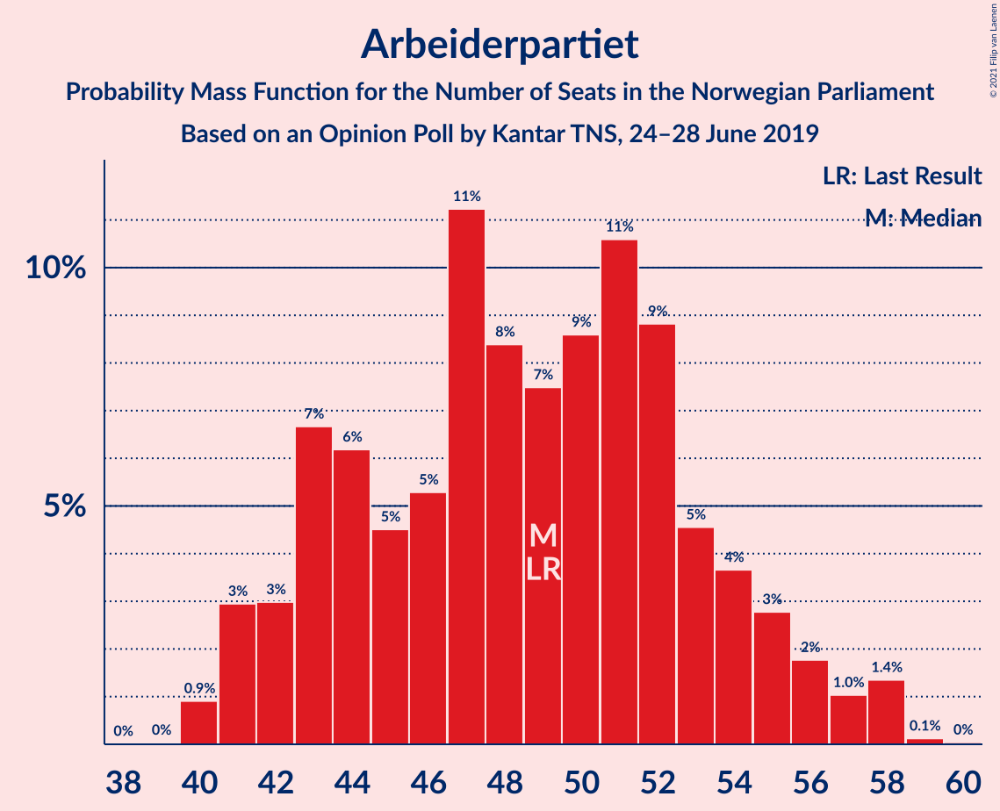

| Number of Seats | Probability | Accumulated | Special Marks |
|:---------------:|:-----------:|:-----------:|:-------------:|
| 39 | 0% | 100% |  |
| 40 | 0.9% | 99.9% |  |
| 41 | 3% | 99.0% |  |
| 42 | 3% | 96% |  |
| 43 | 7% | 93% |  |
| 44 | 6% | 86% |  |
| 45 | 5% | 80% |  |
| 46 | 5% | 76% |  |
| 47 | 11% | 70% |  |
| 48 | 8% | 59% |  |
| 49 | 7% | 51% | Last Result, Median |
| 50 | 9% | 43% |  |
| 51 | 11% | 35% |  |
| 52 | 9% | 24% |  |
| 53 | 5% | 15% |  |
| 54 | 4% | 11% |  |
| 55 | 3% | 7% |  |
| 56 | 2% | 4% |  |
| 57 | 1.0% | 3% |  |
| 58 | 1.4% | 2% |  |
| 59 | 0.1% | 0.2% |  |
| 60 | 0% | 0% |  |

### Høyre

*For a full overview of the results for this party, see the [Høyre](party-høyre.html) page.*

| Number of Seats | Probability | Accumulated | Special Marks |
|:---------------:|:-----------:|:-----------:|:-------------:|
| 31 | 0.1% | 100% |  |
| 32 | 0.5% | 99.8% |  |
| 33 | 1.2% | 99.3% |  |
| 34 | 2% | 98% |  |
| 35 | 4% | 96% |  |
| 36 | 16% | 93% |  |
| 37 | 18% | 77% |  |
| 38 | 9% | 59% |  |
| 39 | 11% | 50% | Median |
| 40 | 10% | 40% |  |
| 41 | 6% | 30% |  |
| 42 | 6% | 24% |  |
| 43 | 3% | 18% |  |
| 44 | 4% | 15% |  |
| 45 | 2% | 11% | Last Result |
| 46 | 4% | 9% |  |
| 47 | 4% | 5% |  |
| 48 | 0.9% | 2% |  |
| 49 | 0.3% | 0.7% |  |
| 50 | 0.2% | 0.3% |  |
| 51 | 0.1% | 0.1% |  |
| 52 | 0% | 0.1% |  |
| 53 | 0% | 0% |  |

### Senterpartiet

*For a full overview of the results for this party, see the [Senterpartiet](party-senterpartiet.html) page.*

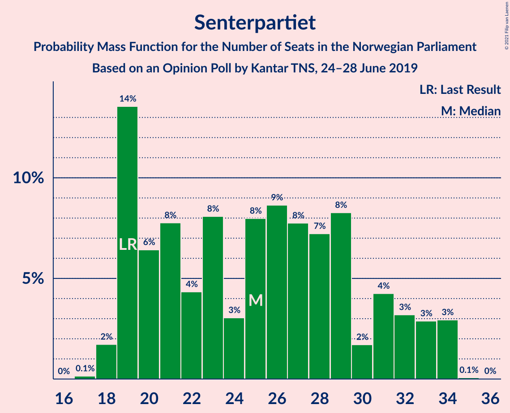

| Number of Seats | Probability | Accumulated | Special Marks |
|:---------------:|:-----------:|:-----------:|:-------------:|
| 17 | 0.1% | 100% |  |
| 18 | 2% | 99.8% |  |
| 19 | 14% | 98% | Last Result |
| 20 | 6% | 85% |  |
| 21 | 8% | 78% |  |
| 22 | 4% | 70% |  |
| 23 | 8% | 66% |  |
| 24 | 3% | 58% |  |
| 25 | 8% | 55% | Median |
| 26 | 9% | 47% |  |
| 27 | 8% | 38% |  |
| 28 | 7% | 31% |  |
| 29 | 8% | 23% |  |
| 30 | 2% | 15% |  |
| 31 | 4% | 13% |  |
| 32 | 3% | 9% |  |
| 33 | 3% | 6% |  |
| 34 | 3% | 3% |  |
| 35 | 0.1% | 0.1% |  |
| 36 | 0% | 0% |  |

### Sosialistisk Venstreparti

*For a full overview of the results for this party, see the [Sosialistisk Venstreparti](party-sosialistiskvenstreparti.html) page.*

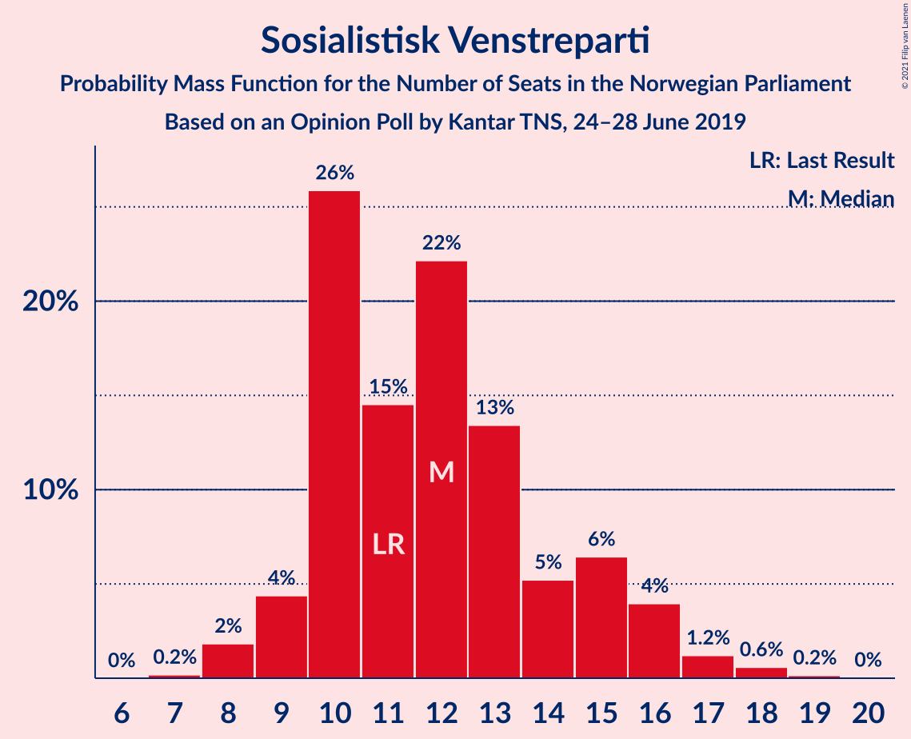

| Number of Seats | Probability | Accumulated | Special Marks |
|:---------------:|:-----------:|:-----------:|:-------------:|
| 7 | 0.2% | 100% |  |
| 8 | 2% | 99.8% |  |
| 9 | 4% | 98% |  |
| 10 | 26% | 94% |  |
| 11 | 15% | 68% | Last Result |
| 12 | 22% | 53% | Median |
| 13 | 13% | 31% |  |
| 14 | 5% | 18% |  |
| 15 | 6% | 12% |  |
| 16 | 4% | 6% |  |
| 17 | 1.2% | 2% |  |
| 18 | 0.6% | 0.8% |  |
| 19 | 0.2% | 0.2% |  |
| 20 | 0% | 0% |  |

### Fremskrittspartiet

*For a full overview of the results for this party, see the [Fremskrittspartiet](party-fremskrittspartiet.html) page.*

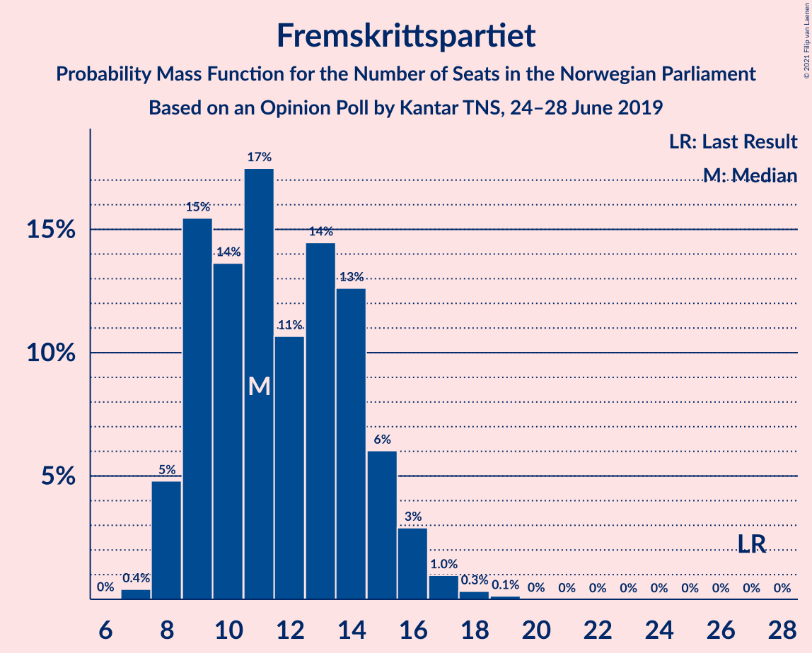

| Number of Seats | Probability | Accumulated | Special Marks |
|:---------------:|:-----------:|:-----------:|:-------------:|
| 7 | 0.4% | 100% |  |
| 8 | 5% | 99.5% |  |
| 9 | 15% | 95% |  |
| 10 | 14% | 79% |  |
| 11 | 17% | 66% | Median |
| 12 | 11% | 48% |  |
| 13 | 14% | 37% |  |
| 14 | 13% | 23% |  |
| 15 | 6% | 10% |  |
| 16 | 3% | 4% |  |
| 17 | 1.0% | 1.5% |  |
| 18 | 0.3% | 0.5% |  |
| 19 | 0.1% | 0.2% |  |
| 20 | 0% | 0% |  |
| 21 | 0% | 0% |  |
| 22 | 0% | 0% |  |
| 23 | 0% | 0% |  |
| 24 | 0% | 0% |  |
| 25 | 0% | 0% |  |
| 26 | 0% | 0% |  |
| 27 | 0% | 0% | Last Result |

### Rødt

*For a full overview of the results for this party, see the [Rødt](party-rødt.html) page.*

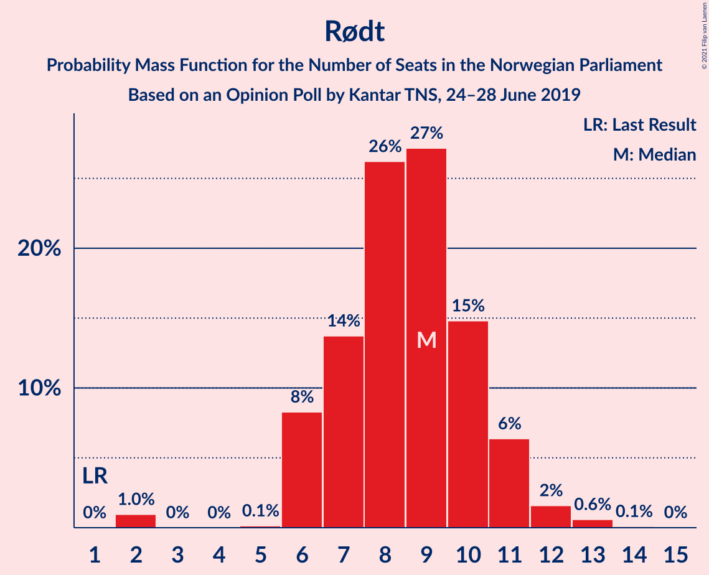

| Number of Seats | Probability | Accumulated | Special Marks |
|:---------------:|:-----------:|:-----------:|:-------------:|
| 1 | 0% | 100% | Last Result |
| 2 | 1.0% | 100% |  |
| 3 | 0% | 99.0% |  |
| 4 | 0% | 99.0% |  |
| 5 | 0.1% | 99.0% |  |
| 6 | 8% | 98.9% |  |
| 7 | 14% | 91% |  |
| 8 | 26% | 77% |  |
| 9 | 27% | 51% | Median |
| 10 | 15% | 23% |  |
| 11 | 6% | 9% |  |
| 12 | 2% | 2% |  |
| 13 | 0.6% | 0.7% |  |
| 14 | 0.1% | 0.1% |  |
| 15 | 0% | 0% |  |

### Venstre

*For a full overview of the results for this party, see the [Venstre](party-venstre.html) page.*

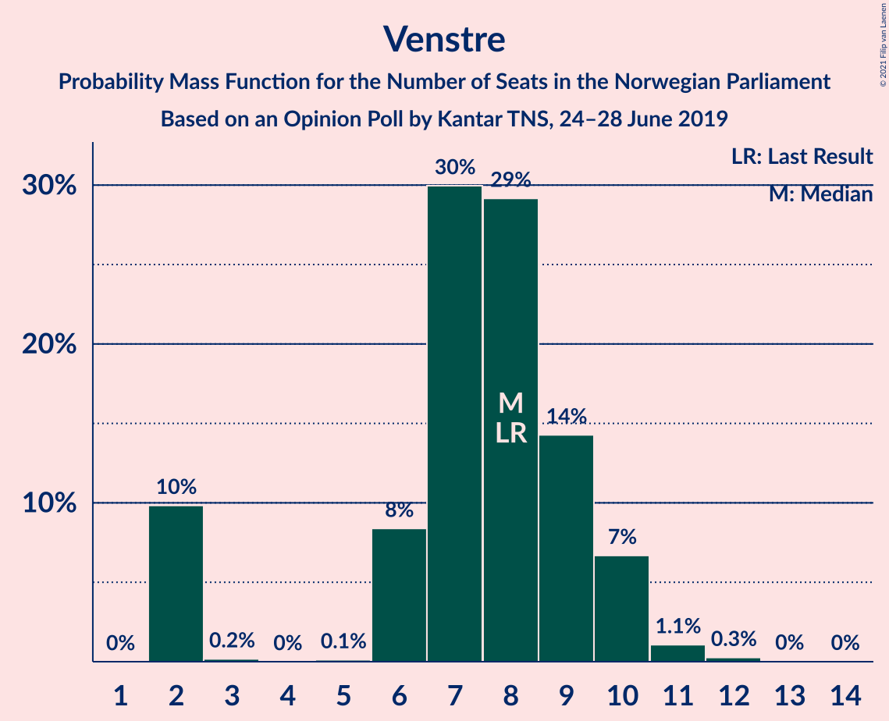

| Number of Seats | Probability | Accumulated | Special Marks |
|:---------------:|:-----------:|:-----------:|:-------------:|
| 2 | 10% | 100% |  |
| 3 | 0.2% | 90% |  |
| 4 | 0% | 90% |  |
| 5 | 0.1% | 90% |  |
| 6 | 8% | 90% |  |
| 7 | 30% | 81% |  |
| 8 | 29% | 52% | Last Result, Median |
| 9 | 14% | 22% |  |
| 10 | 7% | 8% |  |
| 11 | 1.1% | 1.4% |  |
| 12 | 0.3% | 0.3% |  |
| 13 | 0% | 0.1% |  |
| 14 | 0% | 0% |  |

### Miljøpartiet De Grønne

*For a full overview of the results for this party, see the [Miljøpartiet De Grønne](party-miljøpartietdegrønne.html) page.*

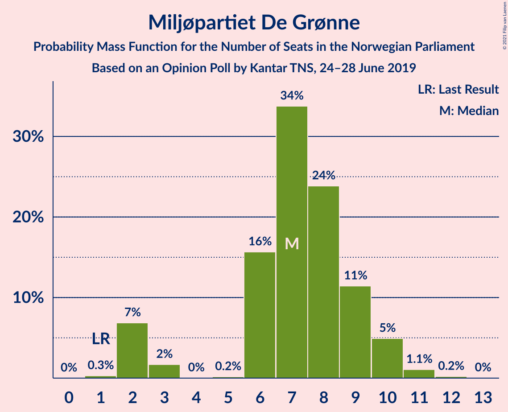

| Number of Seats | Probability | Accumulated | Special Marks |
|:---------------:|:-----------:|:-----------:|:-------------:|
| 1 | 0.3% | 100% | Last Result |
| 2 | 7% | 99.7% |  |
| 3 | 2% | 93% |  |
| 4 | 0% | 91% |  |
| 5 | 0.2% | 91% |  |
| 6 | 16% | 91% |  |
| 7 | 34% | 75% | Median |
| 8 | 24% | 42% |  |
| 9 | 11% | 18% |  |
| 10 | 5% | 6% |  |
| 11 | 1.1% | 1.3% |  |
| 12 | 0.2% | 0.2% |  |
| 13 | 0% | 0% |  |

### Kristelig Folkeparti

*For a full overview of the results for this party, see the [Kristelig Folkeparti](party-kristeligfolkeparti.html) page.*

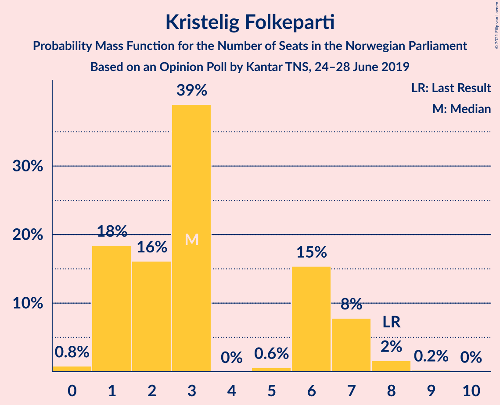

| Number of Seats | Probability | Accumulated | Special Marks |
|:---------------:|:-----------:|:-----------:|:-------------:|
| 0 | 0.8% | 100% |  |
| 1 | 18% | 99.2% |  |
| 2 | 16% | 81% |  |
| 3 | 39% | 65% | Median |
| 4 | 0% | 26% |  |
| 5 | 0.6% | 26% |  |
| 6 | 15% | 25% |  |
| 7 | 8% | 10% |  |
| 8 | 2% | 2% | Last Result |
| 9 | 0.2% | 0.3% |  |
| 10 | 0% | 0% |  |

## Coalitions

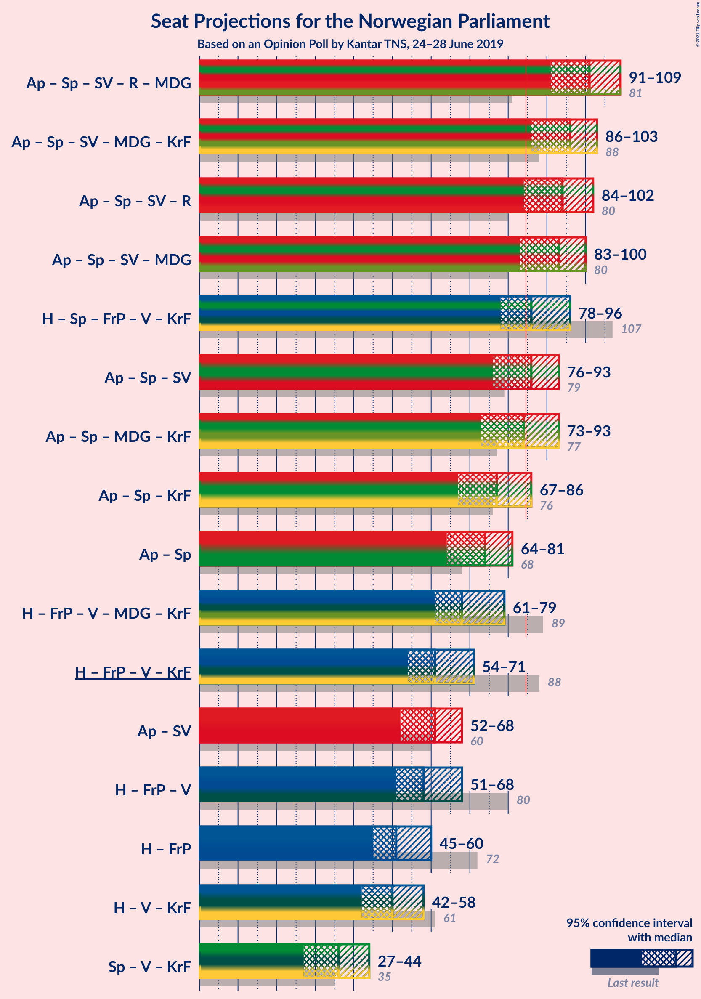

### Confidence Intervals

| Coalition | Last Result | Median | Majority? | 80% Confidence Interval | 90% Confidence Interval | 95% Confidence Interval | 99% Confidence Interval |
|:---------:|:-----------:|:------:|:---------:|:-----------------------:|:-----------------------:|:-----------------------:|:-----------------------:|
| Arbeiderpartiet – Senterpartiet – Sosialistisk Venstreparti – Rødt – Miljøpartiet De Grønne | 81 | 101 | 100% | 95–107 | 93–108 | 91–109 | 88–112 |
| Arbeiderpartiet – Senterpartiet – Sosialistisk Venstreparti – Miljøpartiet De Grønne – Kristelig Folkeparti | 88 | 96 | 98.7% | 90–101 | 87–103 | 86–103 | 83–106 |
| Arbeiderpartiet – Senterpartiet – Sosialistisk Venstreparti – Rødt | 80 | 94 | 97% | 88–99 | 86–101 | 84–102 | 82–104 |
| Arbeiderpartiet – Senterpartiet – Sosialistisk Venstreparti – Miljøpartiet De Grønne | 80 | 93 | 95% | 87–98 | 84–99 | 83–100 | 80–102 |
| Høyre – Senterpartiet – Fremskrittspartiet – Venstre – Kristelig Folkeparti | 107 | 86 | 64% | 79–94 | 79–95 | 78–96 | 75–97 |
| Arbeiderpartiet – Senterpartiet – Sosialistisk Venstreparti | 79 | 86 | 64% | 80–91 | 77–92 | 76–93 | 73–95 |
| Arbeiderpartiet – Senterpartiet – Miljøpartiet De Grønne – Kristelig Folkeparti | 77 | 84 | 46% | 78–89 | 76–91 | 73–93 | 70–95 |
| Arbeiderpartiet – Senterpartiet – Kristelig Folkeparti | 76 | 77 | 4% | 71–82 | 69–84 | 67–86 | 64–88 |
| Arbeiderpartiet – Senterpartiet | 68 | 74 | 0.2% | 68–79 | 66–80 | 64–81 | 62–84 |
| Høyre – Fremskrittspartiet – Venstre – Miljøpartiet De Grønne – Kristelig Folkeparti | 89 | 68 | 0.1% | 63–74 | 62–77 | 61–79 | 58–81 |
| Høyre – Fremskrittspartiet – Venstre – Kristelig Folkeparti | 88 | 61 | 0% | 56–67 | 55–70 | 54–71 | 52–74 |
| Arbeiderpartiet – Sosialistisk Venstreparti | 60 | 61 | 0% | 54–66 | 53–67 | 52–68 | 51–70 |
| Høyre – Fremskrittspartiet – Venstre | 80 | 58 | 0% | 53–65 | 52–67 | 51–68 | 48–70 |
| Høyre – Fremskrittspartiet | 72 | 51 | 0% | 46–57 | 45–59 | 45–60 | 43–62 |
| Høyre – Venstre – Kristelig Folkeparti | 61 | 50 | 0% | 44–56 | 43–57 | 42–58 | 40–61 |
| Senterpartiet – Venstre – Kristelig Folkeparti | 35 | 36 | 0% | 29–42 | 28–44 | 27–44 | 24–46 |

### Arbeiderpartiet – Senterpartiet – Sosialistisk Venstreparti – Rødt – Miljøpartiet De Grønne

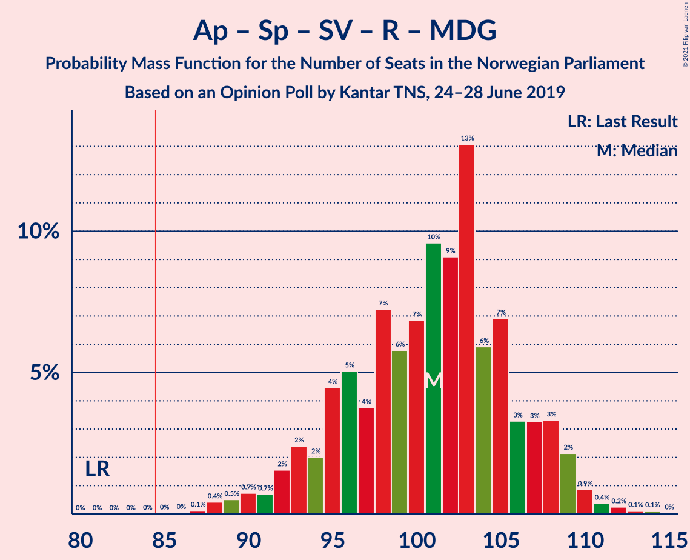

| Number of Seats | Probability | Accumulated | Special Marks |
|:---------------:|:-----------:|:-----------:|:-------------:|
| 81 | 0% | 100% | Last Result |
| 82 | 0% | 100% |  |
| 83 | 0% | 100% |  |
| 84 | 0% | 100% |  |
| 85 | 0% | 100% | Majority |
| 86 | 0% | 100% |  |
| 87 | 0.1% | 99.9% |  |
| 88 | 0.4% | 99.8% |  |
| 89 | 0.5% | 99.4% |  |
| 90 | 0.7% | 98.9% |  |
| 91 | 0.7% | 98% |  |
| 92 | 2% | 97% |  |
| 93 | 2% | 96% |  |
| 94 | 2% | 93% |  |
| 95 | 4% | 91% |  |
| 96 | 5% | 87% |  |
| 97 | 4% | 82% |  |
| 98 | 7% | 78% |  |
| 99 | 6% | 71% |  |
| 100 | 7% | 65% |  |
| 101 | 10% | 58% |  |
| 102 | 9% | 49% | Median |
| 103 | 13% | 40% |  |
| 104 | 6% | 27% |  |
| 105 | 7% | 21% |  |
| 106 | 3% | 14% |  |
| 107 | 3% | 10% |  |
| 108 | 3% | 7% |  |
| 109 | 2% | 4% |  |
| 110 | 0.9% | 2% |  |
| 111 | 0.4% | 0.9% |  |
| 112 | 0.2% | 0.5% |  |
| 113 | 0.1% | 0.3% |  |
| 114 | 0.1% | 0.1% |  |
| 115 | 0% | 0% |  |

### Arbeiderpartiet – Senterpartiet – Sosialistisk Venstreparti – Miljøpartiet De Grønne – Kristelig Folkeparti

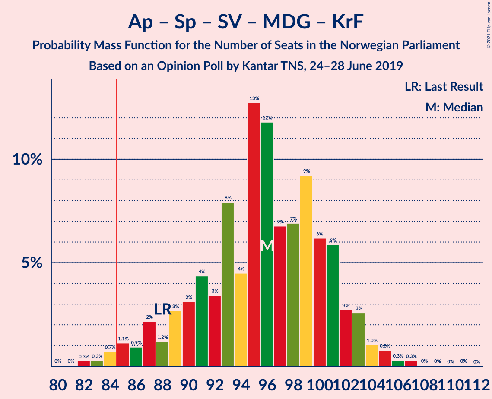

| Number of Seats | Probability | Accumulated | Special Marks |
|:---------------:|:-----------:|:-----------:|:-------------:|
| 81 | 0% | 100% |  |
| 82 | 0.3% | 99.9% |  |
| 83 | 0.3% | 99.7% |  |
| 84 | 0.7% | 99.4% |  |
| 85 | 1.1% | 98.7% | Majority |
| 86 | 0.9% | 98% |  |
| 87 | 2% | 97% |  |
| 88 | 1.2% | 94% | Last Result |
| 89 | 3% | 93% |  |
| 90 | 3% | 91% |  |
| 91 | 4% | 88% |  |
| 92 | 3% | 83% |  |
| 93 | 8% | 80% |  |
| 94 | 4% | 72% |  |
| 95 | 13% | 67% |  |
| 96 | 12% | 55% | Median |
| 97 | 7% | 43% |  |
| 98 | 7% | 36% |  |
| 99 | 9% | 29% |  |
| 100 | 6% | 20% |  |
| 101 | 6% | 14% |  |
| 102 | 3% | 8% |  |
| 103 | 3% | 5% |  |
| 104 | 1.0% | 2% |  |
| 105 | 0.8% | 1.5% |  |
| 106 | 0.3% | 0.7% |  |
| 107 | 0.3% | 0.4% |  |
| 108 | 0% | 0.1% |  |
| 109 | 0% | 0.1% |  |
| 110 | 0% | 0.1% |  |
| 111 | 0% | 0% |  |

### Arbeiderpartiet – Senterpartiet – Sosialistisk Venstreparti – Rødt

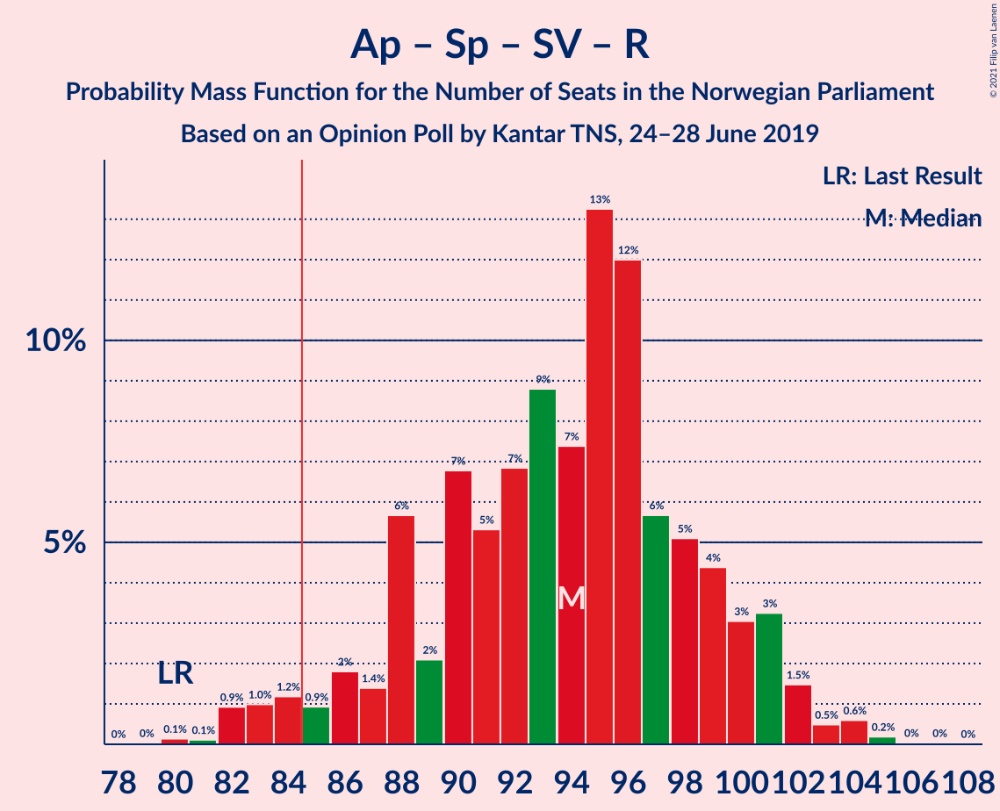

| Number of Seats | Probability | Accumulated | Special Marks |
|:---------------:|:-----------:|:-----------:|:-------------:|
| 79 | 0% | 100% |  |
| 80 | 0.1% | 99.9% | Last Result |
| 81 | 0.1% | 99.8% |  |
| 82 | 0.9% | 99.7% |  |
| 83 | 1.0% | 98.8% |  |
| 84 | 1.2% | 98% |  |
| 85 | 0.9% | 97% | Majority |
| 86 | 2% | 96% |  |
| 87 | 1.4% | 94% |  |
| 88 | 6% | 92% |  |
| 89 | 2% | 87% |  |
| 90 | 7% | 85% |  |
| 91 | 5% | 78% |  |
| 92 | 7% | 73% |  |
| 93 | 9% | 66% |  |
| 94 | 7% | 57% |  |
| 95 | 13% | 50% | Median |
| 96 | 12% | 36% |  |
| 97 | 6% | 24% |  |
| 98 | 5% | 19% |  |
| 99 | 4% | 14% |  |
| 100 | 3% | 9% |  |
| 101 | 3% | 6% |  |
| 102 | 1.5% | 3% |  |
| 103 | 0.5% | 1.4% |  |
| 104 | 0.6% | 0.9% |  |
| 105 | 0.2% | 0.3% |  |
| 106 | 0% | 0.1% |  |
| 107 | 0% | 0.1% |  |
| 108 | 0% | 0% |  |

### Arbeiderpartiet – Senterpartiet – Sosialistisk Venstreparti – Miljøpartiet De Grønne

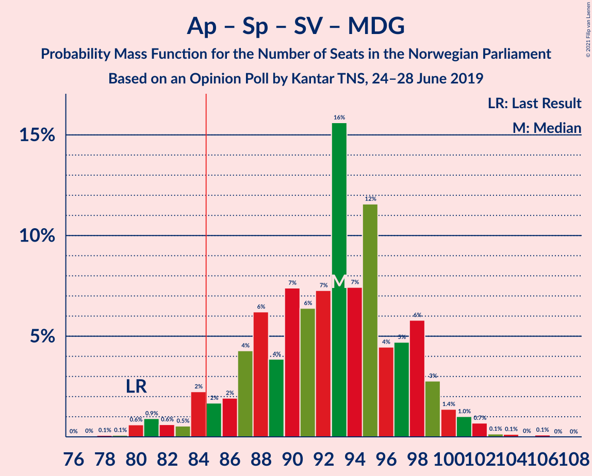

| Number of Seats | Probability | Accumulated | Special Marks |
|:---------------:|:-----------:|:-----------:|:-------------:|
| 77 | 0% | 100% |  |
| 78 | 0.1% | 99.9% |  |
| 79 | 0.1% | 99.9% |  |
| 80 | 0.6% | 99.8% | Last Result |
| 81 | 0.9% | 99.2% |  |
| 82 | 0.6% | 98% |  |
| 83 | 0.5% | 98% |  |
| 84 | 2% | 97% |  |
| 85 | 2% | 95% | Majority |
| 86 | 2% | 93% |  |
| 87 | 4% | 91% |  |
| 88 | 6% | 87% |  |
| 89 | 4% | 81% |  |
| 90 | 7% | 77% |  |
| 91 | 6% | 70% |  |
| 92 | 7% | 63% |  |
| 93 | 16% | 56% | Median |
| 94 | 7% | 40% |  |
| 95 | 12% | 33% |  |
| 96 | 4% | 21% |  |
| 97 | 5% | 17% |  |
| 98 | 6% | 12% |  |
| 99 | 3% | 6% |  |
| 100 | 1.4% | 3% |  |
| 101 | 1.0% | 2% |  |
| 102 | 0.7% | 1.1% |  |
| 103 | 0.1% | 0.4% |  |
| 104 | 0.1% | 0.3% |  |
| 105 | 0% | 0.1% |  |
| 106 | 0.1% | 0.1% |  |
| 107 | 0% | 0% |  |

### Høyre – Senterpartiet – Fremskrittspartiet – Venstre – Kristelig Folkeparti

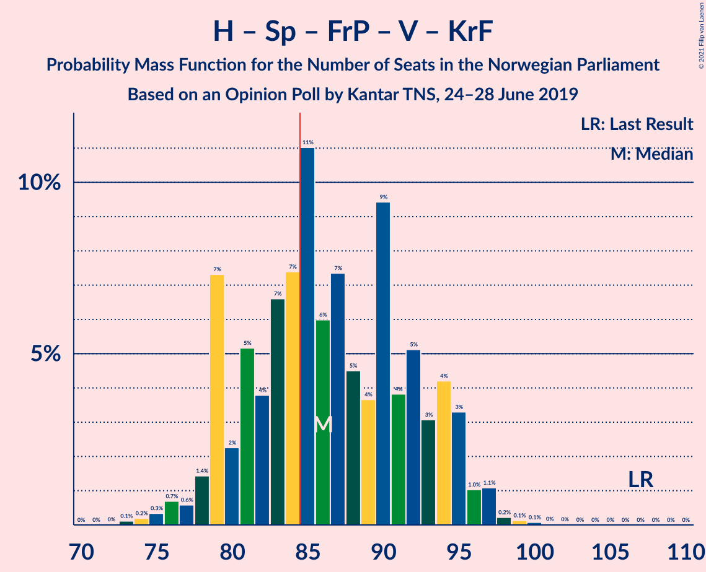

| Number of Seats | Probability | Accumulated | Special Marks |
|:---------------:|:-----------:|:-----------:|:-------------:|
| 73 | 0.1% | 100% |  |
| 74 | 0.2% | 99.9% |  |
| 75 | 0.3% | 99.7% |  |
| 76 | 0.7% | 99.3% |  |
| 77 | 0.6% | 98.6% |  |
| 78 | 1.4% | 98% |  |
| 79 | 7% | 97% |  |
| 80 | 2% | 89% |  |
| 81 | 5% | 87% |  |
| 82 | 4% | 82% |  |
| 83 | 7% | 78% |  |
| 84 | 7% | 71% |  |
| 85 | 11% | 64% | Majority |
| 86 | 6% | 53% | Median |
| 87 | 7% | 47% |  |
| 88 | 5% | 40% |  |
| 89 | 4% | 35% |  |
| 90 | 9% | 32% |  |
| 91 | 4% | 22% |  |
| 92 | 5% | 18% |  |
| 93 | 3% | 13% |  |
| 94 | 4% | 10% |  |
| 95 | 3% | 6% |  |
| 96 | 1.0% | 3% |  |
| 97 | 1.1% | 2% |  |
| 98 | 0.2% | 0.5% |  |
| 99 | 0.1% | 0.3% |  |
| 100 | 0.1% | 0.1% |  |
| 101 | 0% | 0.1% |  |
| 102 | 0% | 0% |  |
| 103 | 0% | 0% |  |
| 104 | 0% | 0% |  |
| 105 | 0% | 0% |  |
| 106 | 0% | 0% |  |
| 107 | 0% | 0% | Last Result |

### Arbeiderpartiet – Senterpartiet – Sosialistisk Venstreparti

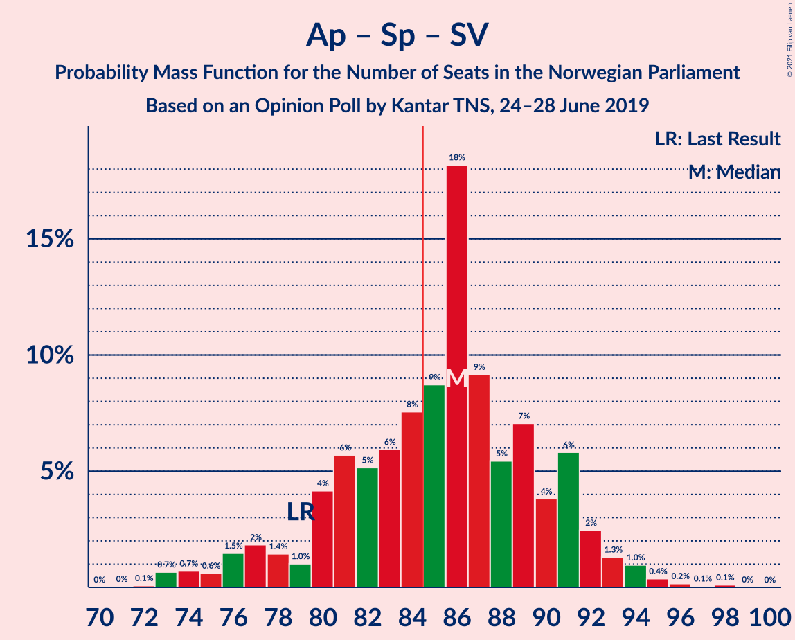

| Number of Seats | Probability | Accumulated | Special Marks |
|:---------------:|:-----------:|:-----------:|:-------------:|
| 71 | 0% | 100% |  |
| 72 | 0.1% | 99.9% |  |
| 73 | 0.7% | 99.9% |  |
| 74 | 0.7% | 99.2% |  |
| 75 | 0.6% | 98.5% |  |
| 76 | 1.5% | 98% |  |
| 77 | 2% | 96% |  |
| 78 | 1.4% | 95% |  |
| 79 | 1.0% | 93% | Last Result |
| 80 | 4% | 92% |  |
| 81 | 6% | 88% |  |
| 82 | 5% | 82% |  |
| 83 | 6% | 77% |  |
| 84 | 8% | 71% |  |
| 85 | 9% | 64% | Majority |
| 86 | 18% | 55% | Median |
| 87 | 9% | 37% |  |
| 88 | 5% | 28% |  |
| 89 | 7% | 22% |  |
| 90 | 4% | 15% |  |
| 91 | 6% | 11% |  |
| 92 | 2% | 5% |  |
| 93 | 1.3% | 3% |  |
| 94 | 1.0% | 2% |  |
| 95 | 0.4% | 0.7% |  |
| 96 | 0.2% | 0.3% |  |
| 97 | 0.1% | 0.2% |  |
| 98 | 0.1% | 0.1% |  |
| 99 | 0% | 0% |  |

### Arbeiderpartiet – Senterpartiet – Miljøpartiet De Grønne – Kristelig Folkeparti

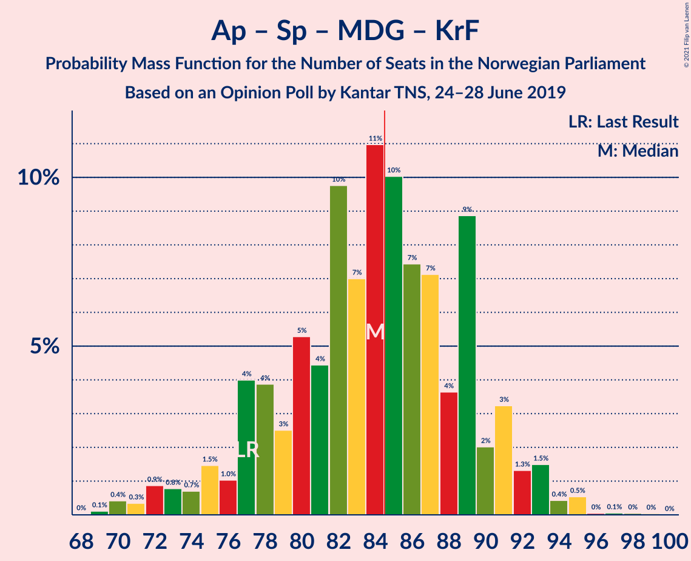

| Number of Seats | Probability | Accumulated | Special Marks |
|:---------------:|:-----------:|:-----------:|:-------------:|
| 68 | 0% | 100% |  |
| 69 | 0.1% | 99.9% |  |
| 70 | 0.4% | 99.8% |  |
| 71 | 0.3% | 99.4% |  |
| 72 | 0.9% | 99.1% |  |
| 73 | 0.8% | 98% |  |
| 74 | 0.7% | 97% |  |
| 75 | 1.5% | 97% |  |
| 76 | 1.0% | 95% |  |
| 77 | 4% | 94% | Last Result |
| 78 | 4% | 90% |  |
| 79 | 3% | 86% |  |
| 80 | 5% | 84% |  |
| 81 | 4% | 79% |  |
| 82 | 10% | 74% |  |
| 83 | 7% | 64% |  |
| 84 | 11% | 57% | Median |
| 85 | 10% | 46% | Majority |
| 86 | 7% | 36% |  |
| 87 | 7% | 29% |  |
| 88 | 4% | 22% |  |
| 89 | 9% | 18% |  |
| 90 | 2% | 9% |  |
| 91 | 3% | 7% |  |
| 92 | 1.3% | 4% |  |
| 93 | 1.5% | 3% |  |
| 94 | 0.4% | 1.2% |  |
| 95 | 0.5% | 0.7% |  |
| 96 | 0% | 0.2% |  |
| 97 | 0.1% | 0.2% |  |
| 98 | 0% | 0.1% |  |
| 99 | 0% | 0% |  |

### Arbeiderpartiet – Senterpartiet – Kristelig Folkeparti

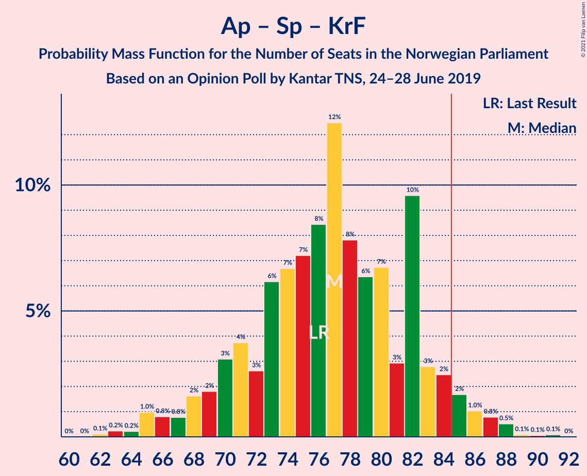

| Number of Seats | Probability | Accumulated | Special Marks |
|:---------------:|:-----------:|:-----------:|:-------------:|
| 62 | 0.1% | 100% |  |
| 63 | 0.2% | 99.9% |  |
| 64 | 0.2% | 99.6% |  |
| 65 | 1.0% | 99.4% |  |
| 66 | 0.8% | 98% |  |
| 67 | 0.8% | 98% |  |
| 68 | 2% | 97% |  |
| 69 | 2% | 95% |  |
| 70 | 3% | 93% |  |
| 71 | 4% | 90% |  |
| 72 | 3% | 87% |  |
| 73 | 6% | 84% |  |
| 74 | 7% | 78% |  |
| 75 | 7% | 71% |  |
| 76 | 8% | 64% | Last Result |
| 77 | 12% | 55% | Median |
| 78 | 8% | 43% |  |
| 79 | 6% | 35% |  |
| 80 | 7% | 29% |  |
| 81 | 3% | 22% |  |
| 82 | 10% | 19% |  |
| 83 | 3% | 10% |  |
| 84 | 2% | 7% |  |
| 85 | 2% | 4% | Majority |
| 86 | 1.0% | 3% |  |
| 87 | 0.8% | 2% |  |
| 88 | 0.5% | 0.8% |  |
| 89 | 0.1% | 0.2% |  |
| 90 | 0.1% | 0.2% |  |
| 91 | 0.1% | 0.1% |  |
| 92 | 0% | 0% |  |

### Arbeiderpartiet – Senterpartiet

| Number of Seats | Probability | Accumulated | Special Marks |
|:---------------:|:-----------:|:-----------:|:-------------:|
| 60 | 0.1% | 100% |  |
| 61 | 0.3% | 99.8% |  |
| 62 | 0.4% | 99.5% |  |
| 63 | 1.1% | 99.1% |  |
| 64 | 1.4% | 98% |  |
| 65 | 1.4% | 97% |  |
| 66 | 2% | 95% |  |
| 67 | 2% | 93% |  |
| 68 | 4% | 91% | Last Result |
| 69 | 4% | 88% |  |
| 70 | 6% | 84% |  |
| 71 | 7% | 78% |  |
| 72 | 6% | 71% |  |
| 73 | 11% | 64% |  |
| 74 | 12% | 54% | Median |
| 75 | 9% | 42% |  |
| 76 | 10% | 33% |  |
| 77 | 7% | 23% |  |
| 78 | 4% | 16% |  |
| 79 | 7% | 12% |  |
| 80 | 2% | 6% |  |
| 81 | 2% | 4% |  |
| 82 | 0.9% | 2% |  |
| 83 | 0.7% | 1.3% |  |
| 84 | 0.4% | 0.7% |  |
| 85 | 0.2% | 0.2% | Majority |
| 86 | 0% | 0.1% |  |
| 87 | 0% | 0% |  |

### Høyre – Fremskrittspartiet – Venstre – Miljøpartiet De Grønne – Kristelig Folkeparti

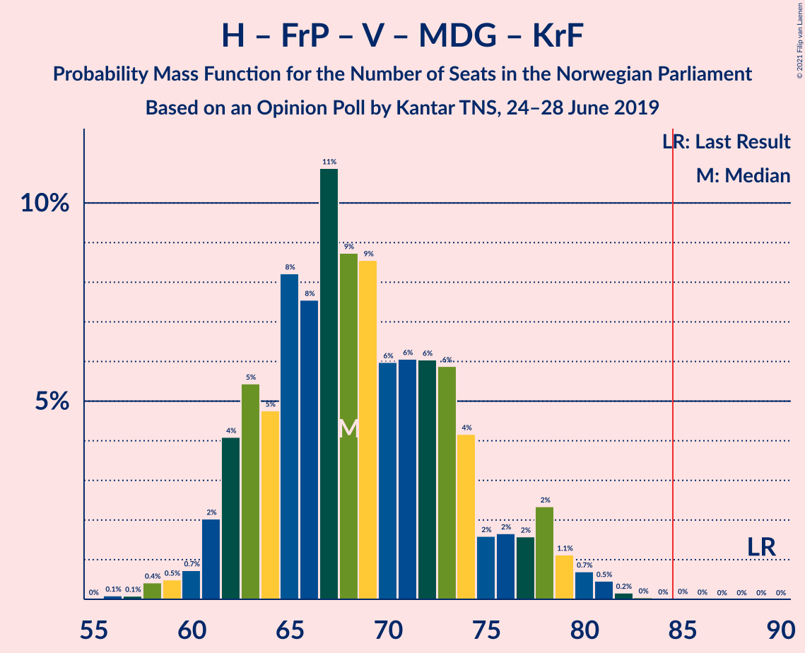

| Number of Seats | Probability | Accumulated | Special Marks |
|:---------------:|:-----------:|:-----------:|:-------------:|
| 56 | 0.1% | 100% |  |
| 57 | 0.1% | 99.9% |  |
| 58 | 0.4% | 99.8% |  |
| 59 | 0.5% | 99.4% |  |
| 60 | 0.7% | 98.9% |  |
| 61 | 2% | 98% |  |
| 62 | 4% | 96% |  |
| 63 | 5% | 92% |  |
| 64 | 5% | 87% |  |
| 65 | 8% | 82% |  |
| 66 | 8% | 74% |  |
| 67 | 11% | 66% |  |
| 68 | 9% | 55% | Median |
| 69 | 9% | 46% |  |
| 70 | 6% | 38% |  |
| 71 | 6% | 32% |  |
| 72 | 6% | 26% |  |
| 73 | 6% | 20% |  |
| 74 | 4% | 14% |  |
| 75 | 2% | 10% |  |
| 76 | 2% | 8% |  |
| 77 | 2% | 6% |  |
| 78 | 2% | 5% |  |
| 79 | 1.1% | 3% |  |
| 80 | 0.7% | 1.4% |  |
| 81 | 0.5% | 0.7% |  |
| 82 | 0.2% | 0.3% |  |
| 83 | 0% | 0.1% |  |
| 84 | 0% | 0.1% |  |
| 85 | 0% | 0.1% | Majority |
| 86 | 0% | 0% |  |
| 87 | 0% | 0% |  |
| 88 | 0% | 0% |  |
| 89 | 0% | 0% | Last Result |

### Høyre – Fremskrittspartiet – Venstre – Kristelig Folkeparti

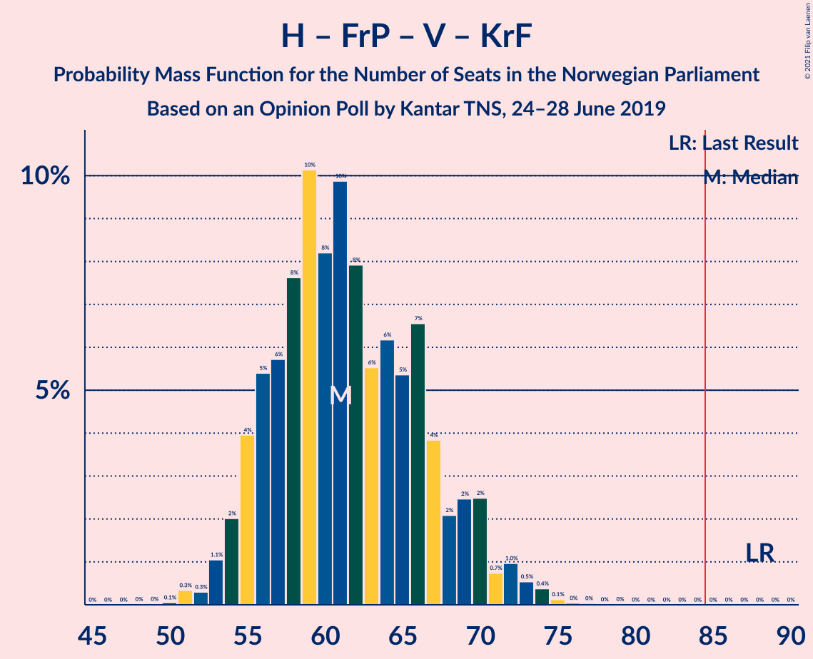

| Number of Seats | Probability | Accumulated | Special Marks |
|:---------------:|:-----------:|:-----------:|:-------------:|
| 50 | 0.1% | 100% |  |
| 51 | 0.3% | 99.9% |  |
| 52 | 0.3% | 99.6% |  |
| 53 | 1.1% | 99.3% |  |
| 54 | 2% | 98% |  |
| 55 | 4% | 96% |  |
| 56 | 5% | 92% |  |
| 57 | 6% | 87% |  |
| 58 | 8% | 81% |  |
| 59 | 10% | 74% |  |
| 60 | 8% | 63% |  |
| 61 | 10% | 55% | Median |
| 62 | 8% | 45% |  |
| 63 | 6% | 37% |  |
| 64 | 6% | 32% |  |
| 65 | 5% | 26% |  |
| 66 | 7% | 20% |  |
| 67 | 4% | 14% |  |
| 68 | 2% | 10% |  |
| 69 | 2% | 8% |  |
| 70 | 2% | 5% |  |
| 71 | 0.7% | 3% |  |
| 72 | 1.0% | 2% |  |
| 73 | 0.5% | 1.1% |  |
| 74 | 0.4% | 0.6% |  |
| 75 | 0.1% | 0.2% |  |
| 76 | 0% | 0.1% |  |
| 77 | 0% | 0.1% |  |
| 78 | 0% | 0% |  |
| 79 | 0% | 0% |  |
| 80 | 0% | 0% |  |
| 81 | 0% | 0% |  |
| 82 | 0% | 0% |  |
| 83 | 0% | 0% |  |
| 84 | 0% | 0% |  |
| 85 | 0% | 0% | Majority |
| 86 | 0% | 0% |  |
| 87 | 0% | 0% |  |
| 88 | 0% | 0% | Last Result |

### Arbeiderpartiet – Sosialistisk Venstreparti

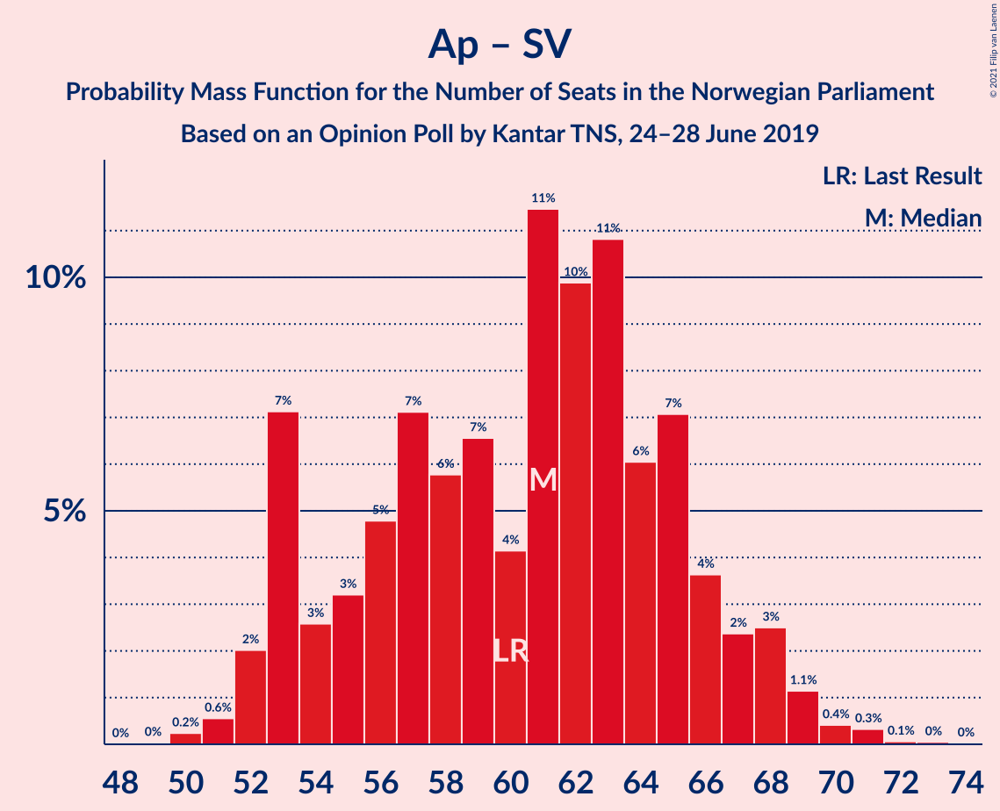

| Number of Seats | Probability | Accumulated | Special Marks |
|:---------------:|:-----------:|:-----------:|:-------------:|
| 50 | 0.2% | 100% |  |
| 51 | 0.6% | 99.7% |  |
| 52 | 2% | 99.2% |  |
| 53 | 7% | 97% |  |
| 54 | 3% | 90% |  |
| 55 | 3% | 87% |  |
| 56 | 5% | 84% |  |
| 57 | 7% | 79% |  |
| 58 | 6% | 72% |  |
| 59 | 7% | 67% |  |
| 60 | 4% | 60% | Last Result |
| 61 | 11% | 56% | Median |
| 62 | 10% | 44% |  |
| 63 | 11% | 34% |  |
| 64 | 6% | 24% |  |
| 65 | 7% | 18% |  |
| 66 | 4% | 11% |  |
| 67 | 2% | 7% |  |
| 68 | 3% | 5% |  |
| 69 | 1.1% | 2% |  |
| 70 | 0.4% | 0.9% |  |
| 71 | 0.3% | 0.5% |  |
| 72 | 0.1% | 0.1% |  |
| 73 | 0% | 0.1% |  |
| 74 | 0% | 0% |  |

### Høyre – Fremskrittspartiet – Venstre

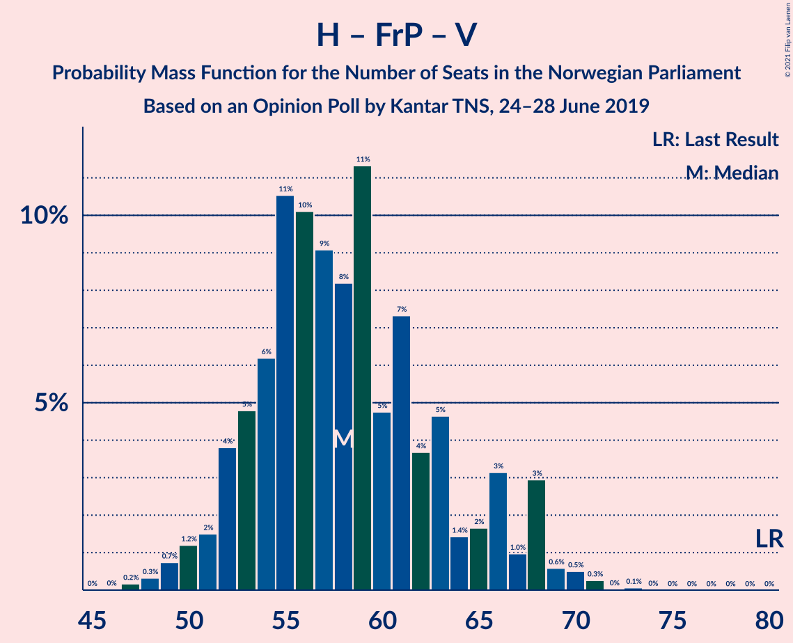

| Number of Seats | Probability | Accumulated | Special Marks |
|:---------------:|:-----------:|:-----------:|:-------------:|
| 47 | 0.2% | 100% |  |
| 48 | 0.3% | 99.8% |  |
| 49 | 0.7% | 99.5% |  |
| 50 | 1.2% | 98.7% |  |
| 51 | 2% | 98% |  |
| 52 | 4% | 96% |  |
| 53 | 5% | 92% |  |
| 54 | 6% | 87% |  |
| 55 | 11% | 81% |  |
| 56 | 10% | 71% |  |
| 57 | 9% | 61% |  |
| 58 | 8% | 52% | Median |
| 59 | 11% | 43% |  |
| 60 | 5% | 32% |  |
| 61 | 7% | 27% |  |
| 62 | 4% | 20% |  |
| 63 | 5% | 16% |  |
| 64 | 1.4% | 12% |  |
| 65 | 2% | 10% |  |
| 66 | 3% | 9% |  |
| 67 | 1.0% | 5% |  |
| 68 | 3% | 4% |  |
| 69 | 0.6% | 1.5% |  |
| 70 | 0.5% | 0.9% |  |
| 71 | 0.3% | 0.4% |  |
| 72 | 0% | 0.1% |  |
| 73 | 0.1% | 0.1% |  |
| 74 | 0% | 0% |  |
| 75 | 0% | 0% |  |
| 76 | 0% | 0% |  |
| 77 | 0% | 0% |  |
| 78 | 0% | 0% |  |
| 79 | 0% | 0% |  |
| 80 | 0% | 0% | Last Result |

### Høyre – Fremskrittspartiet

| Number of Seats | Probability | Accumulated | Special Marks |
|:---------------:|:-----------:|:-----------:|:-------------:|
| 41 | 0.2% | 100% |  |
| 42 | 0.1% | 99.8% |  |
| 43 | 0.4% | 99.7% |  |
| 44 | 1.3% | 99.3% |  |
| 45 | 4% | 98% |  |
| 46 | 5% | 94% |  |
| 47 | 9% | 90% |  |
| 48 | 10% | 81% |  |
| 49 | 13% | 71% |  |
| 50 | 8% | 58% | Median |
| 51 | 13% | 50% |  |
| 52 | 8% | 37% |  |
| 53 | 6% | 29% |  |
| 54 | 7% | 24% |  |
| 55 | 4% | 17% |  |
| 56 | 2% | 13% |  |
| 57 | 2% | 11% |  |
| 58 | 3% | 9% |  |
| 59 | 2% | 6% |  |
| 60 | 2% | 3% |  |
| 61 | 0.4% | 2% |  |
| 62 | 0.9% | 1.2% |  |
| 63 | 0.2% | 0.3% |  |
| 64 | 0.1% | 0.1% |  |
| 65 | 0% | 0% |  |
| 66 | 0% | 0% |  |
| 67 | 0% | 0% |  |
| 68 | 0% | 0% |  |
| 69 | 0% | 0% |  |
| 70 | 0% | 0% |  |
| 71 | 0% | 0% |  |
| 72 | 0% | 0% | Last Result |

### Høyre – Venstre – Kristelig Folkeparti

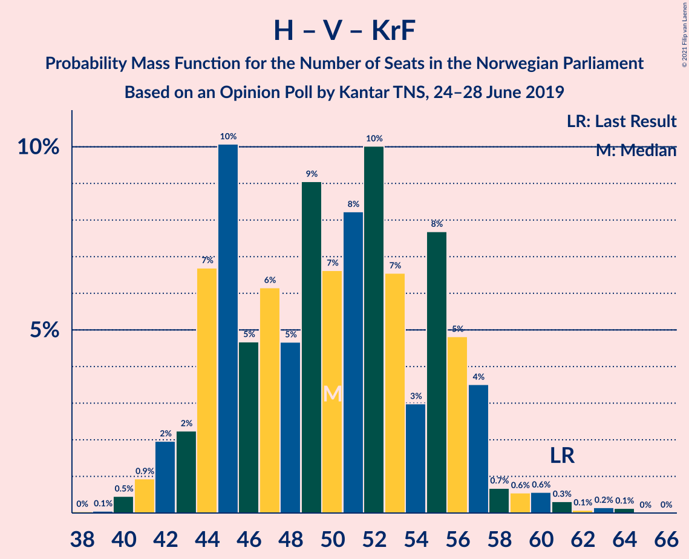

| Number of Seats | Probability | Accumulated | Special Marks |
|:---------------:|:-----------:|:-----------:|:-------------:|
| 38 | 0% | 100% |  |
| 39 | 0.1% | 99.9% |  |
| 40 | 0.5% | 99.9% |  |
| 41 | 0.9% | 99.4% |  |
| 42 | 2% | 98% |  |
| 43 | 2% | 97% |  |
| 44 | 7% | 94% |  |
| 45 | 10% | 88% |  |
| 46 | 5% | 78% |  |
| 47 | 6% | 73% |  |
| 48 | 5% | 67% |  |
| 49 | 9% | 62% |  |
| 50 | 7% | 53% | Median |
| 51 | 8% | 46% |  |
| 52 | 10% | 38% |  |
| 53 | 7% | 28% |  |
| 54 | 3% | 22% |  |
| 55 | 8% | 19% |  |
| 56 | 5% | 11% |  |
| 57 | 4% | 6% |  |
| 58 | 0.7% | 3% |  |
| 59 | 0.6% | 2% |  |
| 60 | 0.6% | 1.3% |  |
| 61 | 0.3% | 0.7% | Last Result |
| 62 | 0.1% | 0.4% |  |
| 63 | 0.2% | 0.3% |  |
| 64 | 0.1% | 0.2% |  |
| 65 | 0% | 0.1% |  |
| 66 | 0% | 0% |  |

### Senterpartiet – Venstre – Kristelig Folkeparti

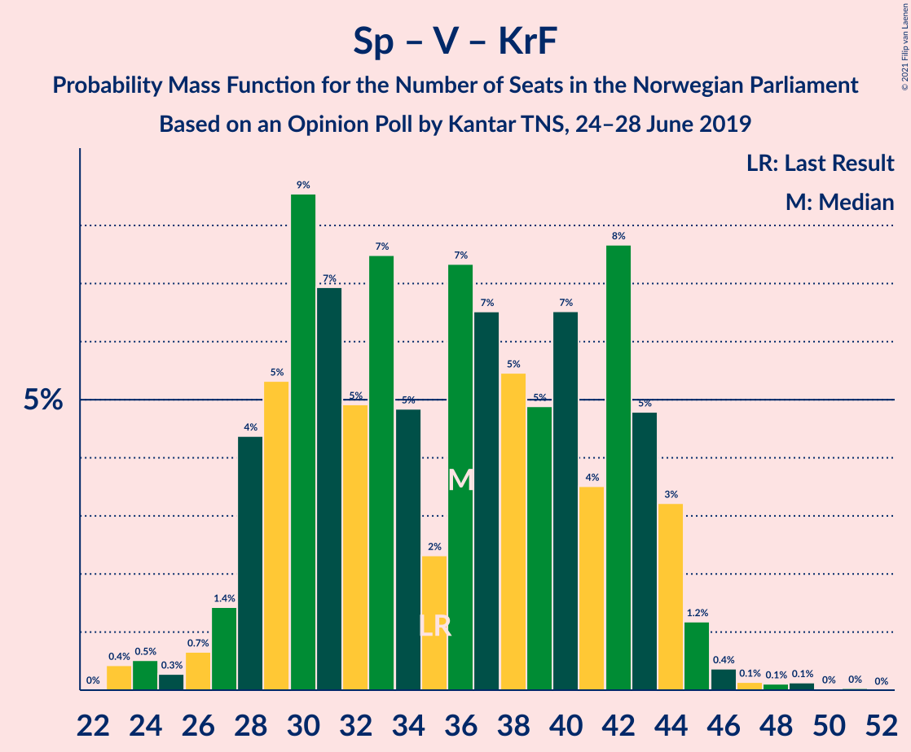

| Number of Seats | Probability | Accumulated | Special Marks |
|:---------------:|:-----------:|:-----------:|:-------------:|
| 23 | 0.4% | 100% |  |
| 24 | 0.5% | 99.5% |  |
| 25 | 0.3% | 99.0% |  |
| 26 | 0.7% | 98.7% |  |
| 27 | 1.4% | 98% |  |
| 28 | 4% | 97% |  |
| 29 | 5% | 92% |  |
| 30 | 9% | 87% |  |
| 31 | 7% | 78% |  |
| 32 | 5% | 71% |  |
| 33 | 7% | 67% |  |
| 34 | 5% | 59% |  |
| 35 | 2% | 54% | Last Result |
| 36 | 7% | 52% | Median |
| 37 | 7% | 45% |  |
| 38 | 5% | 38% |  |
| 39 | 5% | 33% |  |
| 40 | 7% | 28% |  |
| 41 | 4% | 21% |  |
| 42 | 8% | 18% |  |
| 43 | 5% | 10% |  |
| 44 | 3% | 5% |  |
| 45 | 1.2% | 2% |  |
| 46 | 0.4% | 0.8% |  |
| 47 | 0.1% | 0.4% |  |
| 48 | 0.1% | 0.3% |  |
| 49 | 0.1% | 0.2% |  |
| 50 | 0% | 0.1% |  |
| 51 | 0% | 0% |  |

## Technical Information

### Opinion Poll

+ **Polling firm:** Kantar TNS
+ **Commissioner(s):** —
+ **Fieldwork period:** 24–28 June 2019

### Calculations

+ **Sample size:** 780
+ **Simulations done:** 1,048,576
+ **Error estimate:** 1.69%

