# Opinion Poll by Kantar TNS, 5–9 August 2019

<a href="#voting-intentions">Voting Intentions</a> | <a href="#seats">Seats</a> | <a href="#coalitions">Coalitions</a> | <a href="#technical-information">Technical Information</a>

## Voting Intentions

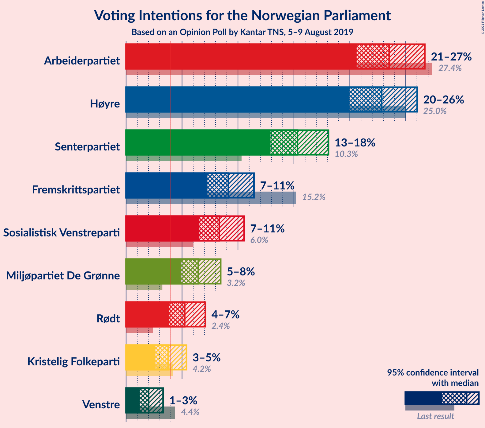

### Confidence Intervals

| Party | Last Result | Poll Result | 80% Confidence Interval | 90% Confidence Interval | 95% Confidence Interval | 99% Confidence Interval |
|:-----:|:-----------:|:-----------:|:-----------------------:|:-----------------------:|:-----------------------:|:-----------------------:|
| Arbeiderpartiet | 27.4% | 23.5% | 21.6–25.6% |21.1–26.2% |20.6–26.7% |19.7–27.7% |
| Høyre | 25.0% | 22.8% | 21.0–24.9% |20.4–25.5% |20.0–26.0% |19.1–27.0% |
| Senterpartiet | 10.3% | 15.3% | 13.7–17.1% |13.3–17.6% |12.9–18.1% |12.2–19.0% |
| Fremskrittspartiet | 15.2% | 9.1% | 7.9–10.6% |7.6–11.1% |7.3–11.4% |6.7–12.2% |
| Sosialistisk Venstreparti | 6.0% | 8.3% | 7.2–9.8% |6.8–10.2% |6.6–10.5% |6.0–11.3% |
| Miljøpartiet De Grønne | 3.2% | 6.5% | 5.4–7.8% |5.1–8.1% |4.9–8.5% |4.5–9.1% |
| Rødt | 2.4% | 5.2% | 4.3–6.4% |4.1–6.8% |3.9–7.1% |3.5–7.7% |
| Kristelig Folkeparti | 4.2% | 3.8% | 3.0–4.8% |2.8–5.1% |2.6–5.4% |2.3–5.9% |
| Venstre | 4.4% | 2.0% | 1.5–2.9% |1.3–3.1% |1.2–3.3% |1.0–3.7% |

*Note:* The poll result column reflects the actual value used in the calculations. Published results may vary slightly, and in addition be rounded to fewer digits.

## Seats

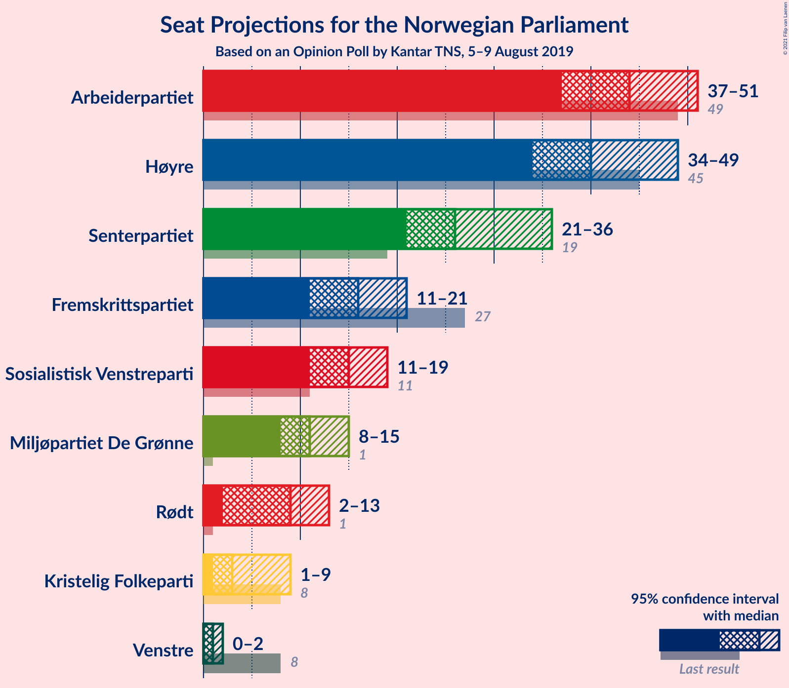

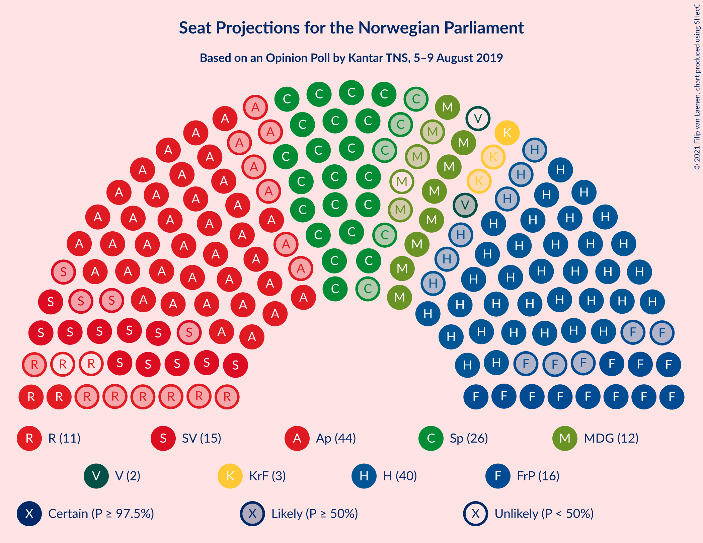

### Confidence Intervals

| Party | Last Result | Median | 80% Confidence Interval | 90% Confidence Interval | 95% Confidence Interval | 99% Confidence Interval |
|:-----:|:-----------:|:------:|:-----------------------:|:-----------------------:|:-----------------------:|:-----------------------:|
| <a href="#arbeiderpartiet">Arbeiderpartiet</a> | 49 | 44 | 40–49 |38–51 |37–51 |35–53 |
| <a href="#høyre">Høyre</a> | 45 | 40 | 36–46 |34–47 |34–49 |33–49 |
| <a href="#senterpartiet">Senterpartiet</a> | 19 | 26 | 23–32 |21–34 |21–36 |20–36 |
| <a href="#fremskrittspartiet">Fremskrittspartiet</a> | 27 | 16 | 13–19 |12–20 |11–21 |10–22 |
| <a href="#sosialistisk-venstreparti">Sosialistisk Venstreparti</a> | 11 | 15 | 12–17 |11–18 |11–19 |10–20 |
| <a href="#miljøpartiet-de-grønne">Miljøpartiet De Grønne</a> | 1 | 11 | 9–13 |9–14 |8–15 |8–16 |
| <a href="#rødt">Rødt</a> | 1 | 9 | 7–11 |2–12 |2–13 |2–14 |
| <a href="#kristelig-folkeparti">Kristelig Folkeparti</a> | 8 | 3 | 2–8 |1–9 |1–9 |0–10 |
| <a href="#venstre">Venstre</a> | 8 | 1 | 0–2 |0–2 |0–2 |0–2 |

### Arbeiderpartiet

*For a full overview of the results for this party, see the [Arbeiderpartiet](party-arbeiderpartiet.html) page.*

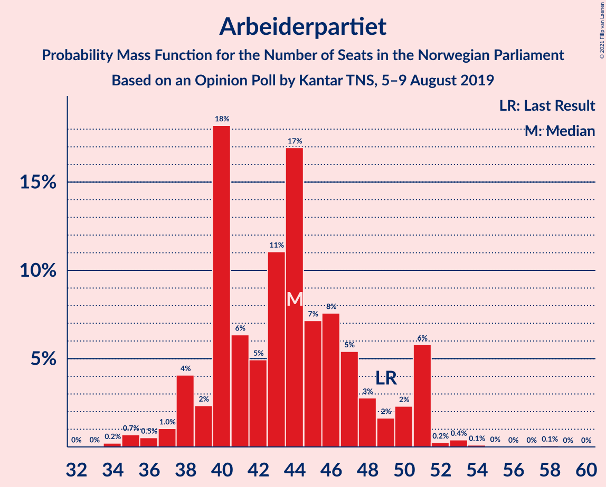

| Number of Seats | Probability | Accumulated | Special Marks |
|:---------------:|:-----------:|:-----------:|:-------------:|
| 33 | 0% | 100% |  |
| 34 | 0.2% | 99.9% |  |
| 35 | 0.7% | 99.7% |  |
| 36 | 0.5% | 99.0% |  |
| 37 | 1.0% | 98.5% |  |
| 38 | 4% | 97% |  |
| 39 | 2% | 93% |  |
| 40 | 18% | 91% |  |
| 41 | 6% | 73% |  |
| 42 | 5% | 67% |  |
| 43 | 11% | 62% |  |
| 44 | 17% | 51% | Median |
| 45 | 7% | 34% |  |
| 46 | 8% | 26% |  |
| 47 | 5% | 19% |  |
| 48 | 3% | 13% |  |
| 49 | 2% | 11% | Last Result |
| 50 | 2% | 9% |  |
| 51 | 6% | 7% |  |
| 52 | 0.2% | 0.9% |  |
| 53 | 0.4% | 0.7% |  |
| 54 | 0.1% | 0.2% |  |
| 55 | 0% | 0.1% |  |
| 56 | 0% | 0.1% |  |
| 57 | 0% | 0.1% |  |
| 58 | 0.1% | 0.1% |  |
| 59 | 0% | 0% |  |

### Høyre

*For a full overview of the results for this party, see the [Høyre](party-høyre.html) page.*

| Number of Seats | Probability | Accumulated | Special Marks |
|:---------------:|:-----------:|:-----------:|:-------------:|
| 31 | 0% | 100% |  |
| 32 | 0.2% | 99.9% |  |
| 33 | 1.4% | 99.7% |  |
| 34 | 3% | 98% |  |
| 35 | 5% | 95% |  |
| 36 | 11% | 90% |  |
| 37 | 12% | 79% |  |
| 38 | 4% | 67% |  |
| 39 | 6% | 63% |  |
| 40 | 24% | 58% | Median |
| 41 | 5% | 34% |  |
| 42 | 7% | 29% |  |
| 43 | 3% | 22% |  |
| 44 | 3% | 19% |  |
| 45 | 5% | 16% | Last Result |
| 46 | 2% | 11% |  |
| 47 | 5% | 9% |  |
| 48 | 0.3% | 4% |  |
| 49 | 4% | 4% |  |
| 50 | 0% | 0.1% |  |
| 51 | 0% | 0.1% |  |
| 52 | 0% | 0% |  |

### Senterpartiet

*For a full overview of the results for this party, see the [Senterpartiet](party-senterpartiet.html) page.*

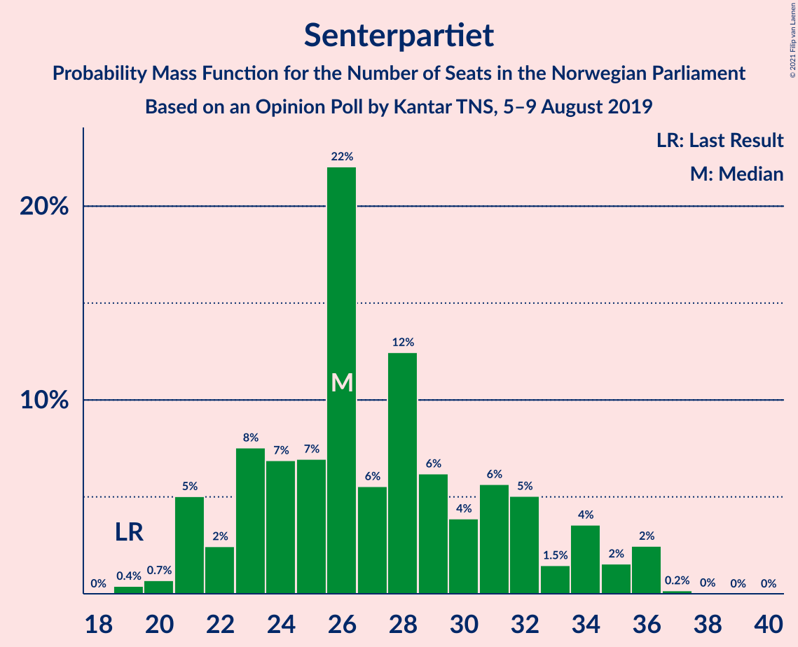

| Number of Seats | Probability | Accumulated | Special Marks |
|:---------------:|:-----------:|:-----------:|:-------------:|
| 19 | 0.4% | 100% | Last Result |
| 20 | 0.7% | 99.6% |  |
| 21 | 5% | 98.9% |  |
| 22 | 2% | 94% |  |
| 23 | 8% | 91% |  |
| 24 | 7% | 84% |  |
| 25 | 7% | 77% |  |
| 26 | 22% | 70% | Median |
| 27 | 6% | 48% |  |
| 28 | 12% | 42% |  |
| 29 | 6% | 30% |  |
| 30 | 4% | 24% |  |
| 31 | 6% | 20% |  |
| 32 | 5% | 14% |  |
| 33 | 1.5% | 9% |  |
| 34 | 4% | 8% |  |
| 35 | 2% | 4% |  |
| 36 | 2% | 3% |  |
| 37 | 0.2% | 0.2% |  |
| 38 | 0% | 0.1% |  |
| 39 | 0% | 0% |  |

### Fremskrittspartiet

*For a full overview of the results for this party, see the [Fremskrittspartiet](party-fremskrittspartiet.html) page.*

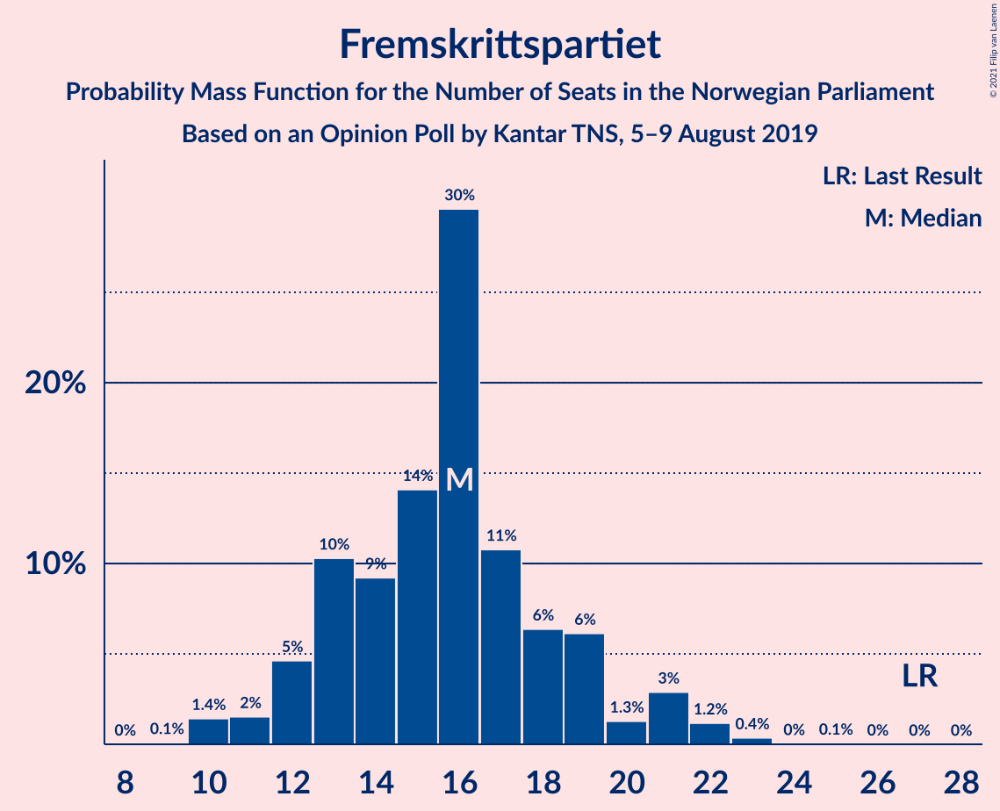

| Number of Seats | Probability | Accumulated | Special Marks |
|:---------------:|:-----------:|:-----------:|:-------------:|
| 9 | 0.1% | 100% |  |
| 10 | 1.4% | 99.9% |  |
| 11 | 2% | 98% |  |
| 12 | 5% | 97% |  |
| 13 | 10% | 92% |  |
| 14 | 9% | 82% |  |
| 15 | 14% | 73% |  |
| 16 | 30% | 59% | Median |
| 17 | 11% | 29% |  |
| 18 | 6% | 18% |  |
| 19 | 6% | 12% |  |
| 20 | 1.3% | 6% |  |
| 21 | 3% | 5% |  |
| 22 | 1.2% | 2% |  |
| 23 | 0.4% | 0.5% |  |
| 24 | 0% | 0.1% |  |
| 25 | 0.1% | 0.1% |  |
| 26 | 0% | 0% |  |
| 27 | 0% | 0% | Last Result |

### Sosialistisk Venstreparti

*For a full overview of the results for this party, see the [Sosialistisk Venstreparti](party-sosialistiskvenstreparti.html) page.*

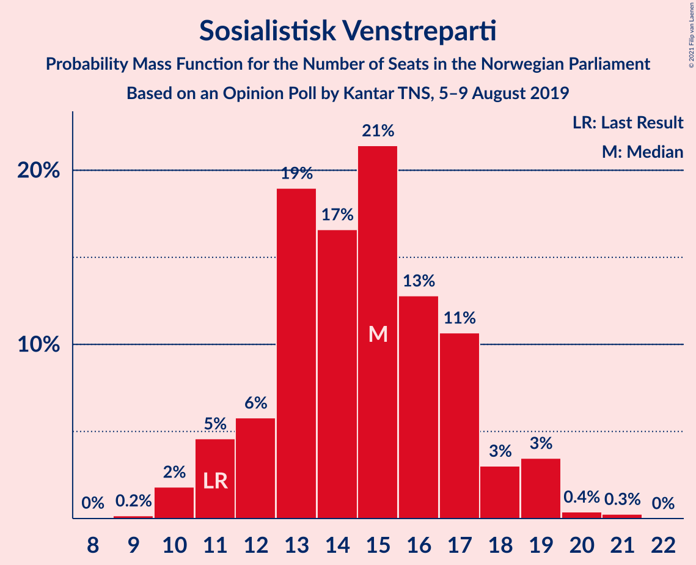

| Number of Seats | Probability | Accumulated | Special Marks |
|:---------------:|:-----------:|:-----------:|:-------------:|
| 9 | 0.2% | 100% |  |
| 10 | 2% | 99.8% |  |
| 11 | 5% | 98% | Last Result |
| 12 | 6% | 93% |  |
| 13 | 19% | 88% |  |
| 14 | 17% | 69% |  |
| 15 | 21% | 52% | Median |
| 16 | 13% | 31% |  |
| 17 | 11% | 18% |  |
| 18 | 3% | 7% |  |
| 19 | 3% | 4% |  |
| 20 | 0.4% | 0.7% |  |
| 21 | 0.3% | 0.3% |  |
| 22 | 0% | 0% |  |

### Miljøpartiet De Grønne

*For a full overview of the results for this party, see the [Miljøpartiet De Grønne](party-miljøpartietdegrønne.html) page.*

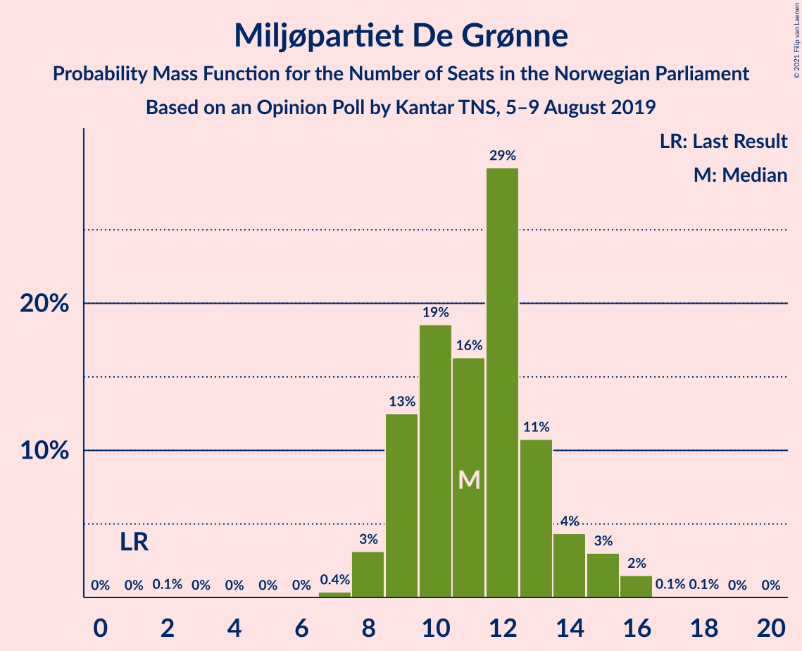

| Number of Seats | Probability | Accumulated | Special Marks |
|:---------------:|:-----------:|:-----------:|:-------------:|
| 1 | 0% | 100% | Last Result |
| 2 | 0.1% | 100% |  |
| 3 | 0% | 99.9% |  |
| 4 | 0% | 99.9% |  |
| 5 | 0% | 99.9% |  |
| 6 | 0% | 99.9% |  |
| 7 | 0.4% | 99.9% |  |
| 8 | 3% | 99.5% |  |
| 9 | 13% | 96% |  |
| 10 | 19% | 84% |  |
| 11 | 16% | 65% | Median |
| 12 | 29% | 49% |  |
| 13 | 11% | 20% |  |
| 14 | 4% | 9% |  |
| 15 | 3% | 5% |  |
| 16 | 2% | 2% |  |
| 17 | 0.1% | 0.1% |  |
| 18 | 0.1% | 0.1% |  |
| 19 | 0% | 0% |  |

### Rødt

*For a full overview of the results for this party, see the [Rødt](party-rødt.html) page.*

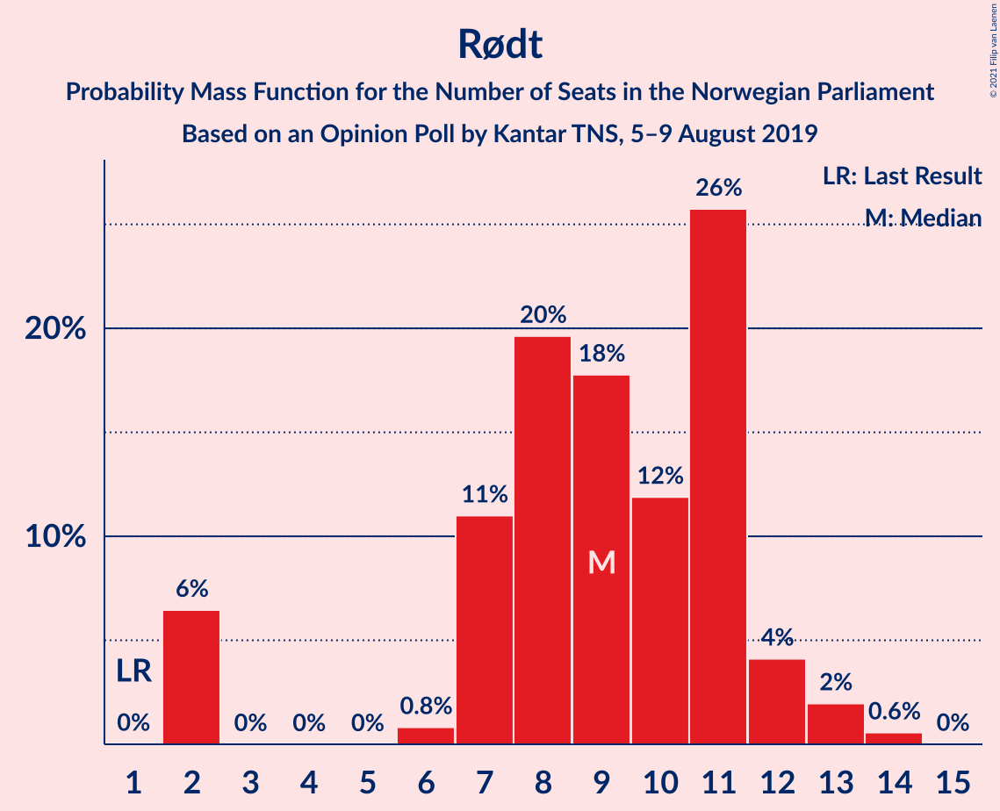

| Number of Seats | Probability | Accumulated | Special Marks |
|:---------------:|:-----------:|:-----------:|:-------------:|
| 1 | 0% | 100% | Last Result |
| 2 | 6% | 100% |  |
| 3 | 0% | 94% |  |
| 4 | 0% | 94% |  |
| 5 | 0% | 94% |  |
| 6 | 0.8% | 94% |  |
| 7 | 11% | 93% |  |
| 8 | 20% | 82% |  |
| 9 | 18% | 62% | Median |
| 10 | 12% | 44% |  |
| 11 | 26% | 32% |  |
| 12 | 4% | 7% |  |
| 13 | 2% | 3% |  |
| 14 | 0.6% | 0.6% |  |
| 15 | 0% | 0% |  |

### Kristelig Folkeparti

*For a full overview of the results for this party, see the [Kristelig Folkeparti](party-kristeligfolkeparti.html) page.*

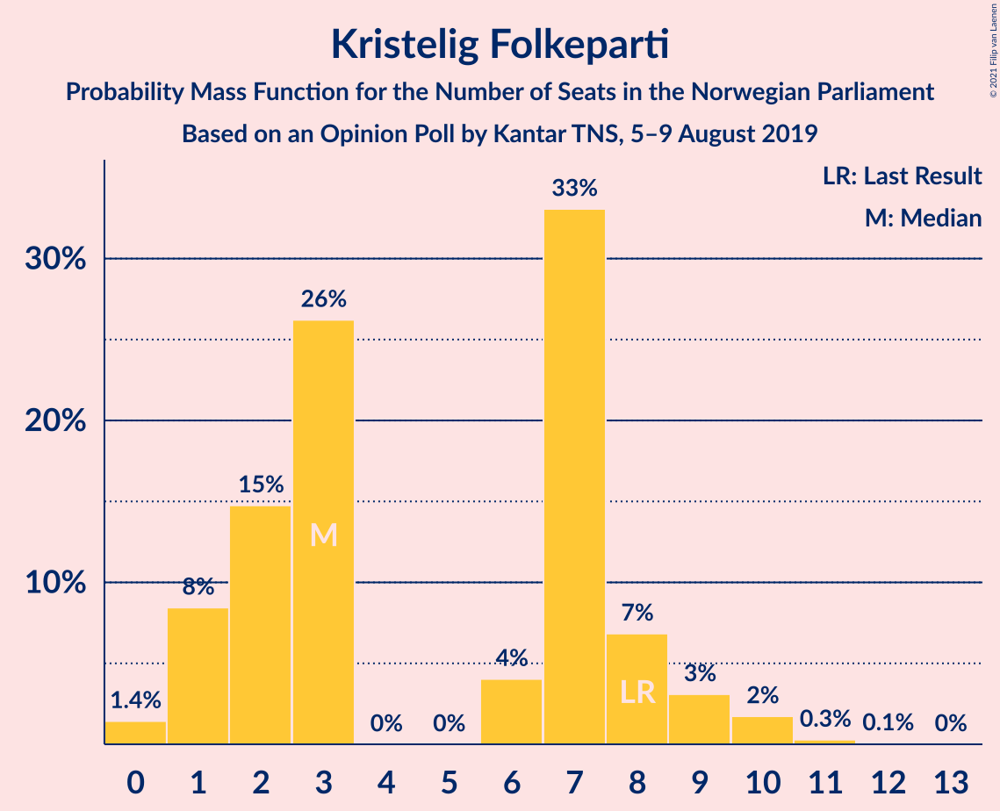

| Number of Seats | Probability | Accumulated | Special Marks |
|:---------------:|:-----------:|:-----------:|:-------------:|
| 0 | 1.4% | 100% |  |
| 1 | 8% | 98.6% |  |
| 2 | 15% | 90% |  |
| 3 | 26% | 75% | Median |
| 4 | 0% | 49% |  |
| 5 | 0% | 49% |  |
| 6 | 4% | 49% |  |
| 7 | 33% | 45% |  |
| 8 | 7% | 12% | Last Result |
| 9 | 3% | 5% |  |
| 10 | 2% | 2% |  |
| 11 | 0.3% | 0.4% |  |
| 12 | 0.1% | 0.1% |  |
| 13 | 0% | 0% |  |

### Venstre

*For a full overview of the results for this party, see the [Venstre](party-venstre.html) page.*

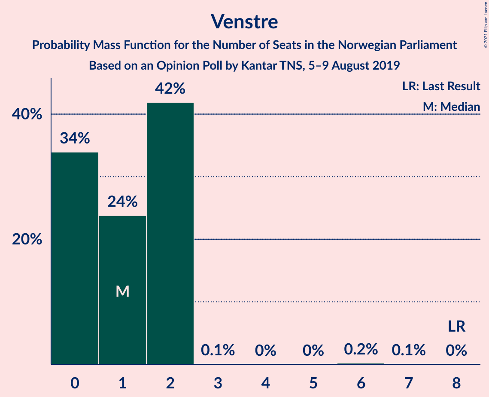

| Number of Seats | Probability | Accumulated | Special Marks |
|:---------------:|:-----------:|:-----------:|:-------------:|
| 0 | 34% | 100% |  |
| 1 | 24% | 66% | Median |
| 2 | 42% | 42% |  |
| 3 | 0.1% | 0.4% |  |
| 4 | 0% | 0.3% |  |
| 5 | 0% | 0.3% |  |
| 6 | 0.2% | 0.3% |  |
| 7 | 0.1% | 0.1% |  |
| 8 | 0% | 0% | Last Result |

## Coalitions

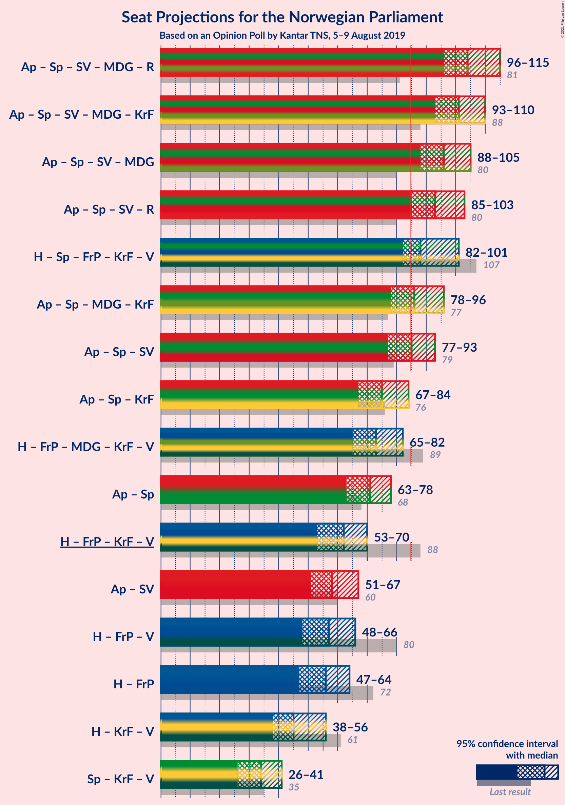

### Confidence Intervals

| Coalition | Last Result | Median | Majority? | 80% Confidence Interval | 90% Confidence Interval | 95% Confidence Interval | 99% Confidence Interval |
|:---------:|:-----------:|:------:|:---------:|:-----------------------:|:-----------------------:|:-----------------------:|:-----------------------:|
| Arbeiderpartiet – Senterpartiet – Sosialistisk Venstreparti – Miljøpartiet De Grønne – Rødt | 81 | 104 | 100% | 99–112 | 98–114 | 96–115 | 92–116 |
| Arbeiderpartiet – Senterpartiet – Sosialistisk Venstreparti – Miljøpartiet De Grønne – Kristelig Folkeparti | 88 | 101 | 100% | 95–108 | 94–110 | 93–110 | 90–113 |
| Arbeiderpartiet – Senterpartiet – Sosialistisk Venstreparti – Miljøpartiet De Grønne | 80 | 96 | 99.5% | 91–103 | 90–105 | 88–105 | 85–107 |
| Arbeiderpartiet – Senterpartiet – Sosialistisk Venstreparti – Rødt | 80 | 93 | 98% | 89–102 | 87–102 | 85–103 | 82–104 |
| Høyre – Senterpartiet – Fremskrittspartiet – Kristelig Folkeparti – Venstre | 107 | 88 | 82% | 83–94 | 83–98 | 82–101 | 81–102 |
| Arbeiderpartiet – Senterpartiet – Miljøpartiet De Grønne – Kristelig Folkeparti | 77 | 86 | 69% | 80–93 | 79–94 | 78–96 | 76–98 |
| Arbeiderpartiet – Senterpartiet – Sosialistisk Venstreparti | 79 | 85 | 57% | 80–92 | 79–93 | 77–93 | 74–94 |
| Arbeiderpartiet – Senterpartiet – Kristelig Folkeparti | 76 | 75 | 1.5% | 70–81 | 68–82 | 67–84 | 65–87 |
| Høyre – Fremskrittspartiet – Miljøpartiet De Grønne – Kristelig Folkeparti – Venstre | 89 | 73 | 0.4% | 67–79 | 66–81 | 65–82 | 63–84 |
| Arbeiderpartiet – Senterpartiet | 68 | 71 | 0% | 66–77 | 64–78 | 63–78 | 61–80 |
| Høyre – Fremskrittspartiet – Kristelig Folkeparti – Venstre | 88 | 62 | 0% | 55–68 | 54–70 | 53–70 | 51–72 |
| Arbeiderpartiet – Sosialistisk Venstreparti | 60 | 58 | 0% | 53–64 | 52–67 | 51–67 | 49–67 |
| Høyre – Fremskrittspartiet – Venstre | 80 | 57 | 0% | 50–63 | 50–65 | 48–66 | 48–68 |
| Høyre – Fremskrittspartiet | 72 | 56 | 0% | 50–62 | 49–63 | 47–64 | 47–68 |
| Høyre – Kristelig Folkeparti – Venstre | 61 | 45 | 0% | 41–51 | 40–53 | 38–56 | 37–57 |
| Senterpartiet – Kristelig Folkeparti – Venstre | 35 | 34 | 0% | 27–38 | 26–41 | 26–41 | 25–45 |

### Arbeiderpartiet – Senterpartiet – Sosialistisk Venstreparti – Miljøpartiet De Grønne – Rødt

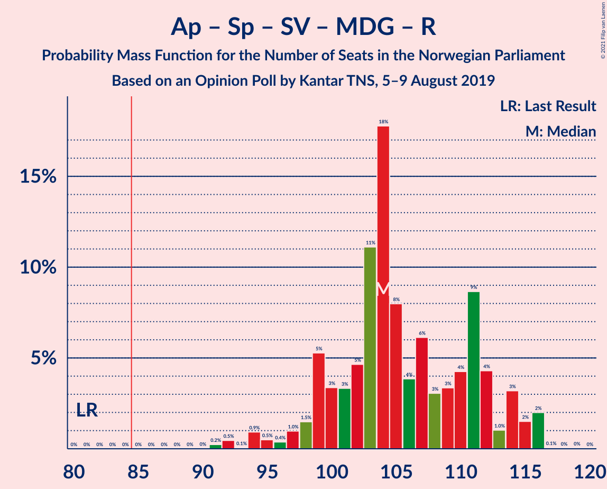

| Number of Seats | Probability | Accumulated | Special Marks |
|:---------------:|:-----------:|:-----------:|:-------------:|
| 81 | 0% | 100% | Last Result |
| 82 | 0% | 100% |  |
| 83 | 0% | 100% |  |
| 84 | 0% | 100% |  |
| 85 | 0% | 100% | Majority |
| 86 | 0% | 100% |  |
| 87 | 0% | 100% |  |
| 88 | 0% | 100% |  |
| 89 | 0% | 100% |  |
| 90 | 0% | 100% |  |
| 91 | 0.2% | 100% |  |
| 92 | 0.5% | 99.7% |  |
| 93 | 0.1% | 99.3% |  |
| 94 | 0.9% | 99.2% |  |
| 95 | 0.5% | 98% |  |
| 96 | 0.4% | 98% |  |
| 97 | 1.0% | 97% |  |
| 98 | 1.5% | 96% |  |
| 99 | 5% | 95% |  |
| 100 | 3% | 90% |  |
| 101 | 3% | 86% |  |
| 102 | 5% | 83% |  |
| 103 | 11% | 78% |  |
| 104 | 18% | 67% |  |
| 105 | 8% | 49% | Median |
| 106 | 4% | 41% |  |
| 107 | 6% | 38% |  |
| 108 | 3% | 31% |  |
| 109 | 3% | 28% |  |
| 110 | 4% | 25% |  |
| 111 | 9% | 21% |  |
| 112 | 4% | 12% |  |
| 113 | 1.0% | 8% |  |
| 114 | 3% | 7% |  |
| 115 | 2% | 4% |  |
| 116 | 2% | 2% |  |
| 117 | 0.1% | 0.1% |  |
| 118 | 0% | 0.1% |  |
| 119 | 0% | 0.1% |  |
| 120 | 0% | 0% |  |

### Arbeiderpartiet – Senterpartiet – Sosialistisk Venstreparti – Miljøpartiet De Grønne – Kristelig Folkeparti

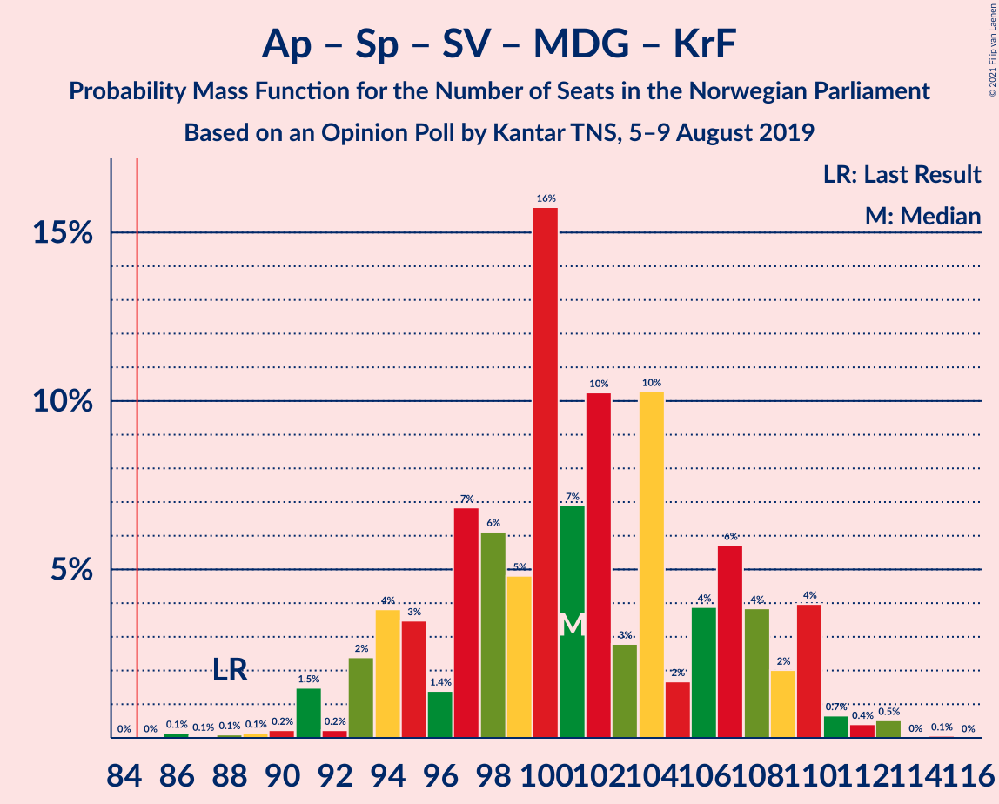

| Number of Seats | Probability | Accumulated | Special Marks |
|:---------------:|:-----------:|:-----------:|:-------------:|
| 86 | 0.1% | 100% |  |
| 87 | 0.1% | 99.9% |  |
| 88 | 0.1% | 99.8% | Last Result |
| 89 | 0.1% | 99.7% |  |
| 90 | 0.2% | 99.6% |  |
| 91 | 1.5% | 99.3% |  |
| 92 | 0.2% | 98% |  |
| 93 | 2% | 98% |  |
| 94 | 4% | 95% |  |
| 95 | 3% | 91% |  |
| 96 | 1.4% | 88% |  |
| 97 | 7% | 87% |  |
| 98 | 6% | 80% |  |
| 99 | 5% | 74% | Median |
| 100 | 16% | 69% |  |
| 101 | 7% | 53% |  |
| 102 | 10% | 46% |  |
| 103 | 3% | 36% |  |
| 104 | 10% | 33% |  |
| 105 | 2% | 23% |  |
| 106 | 4% | 21% |  |
| 107 | 6% | 17% |  |
| 108 | 4% | 12% |  |
| 109 | 2% | 8% |  |
| 110 | 4% | 6% |  |
| 111 | 0.7% | 2% |  |
| 112 | 0.4% | 1.0% |  |
| 113 | 0.5% | 0.6% |  |
| 114 | 0% | 0.1% |  |
| 115 | 0.1% | 0.1% |  |
| 116 | 0% | 0% |  |

### Arbeiderpartiet – Senterpartiet – Sosialistisk Venstreparti – Miljøpartiet De Grønne

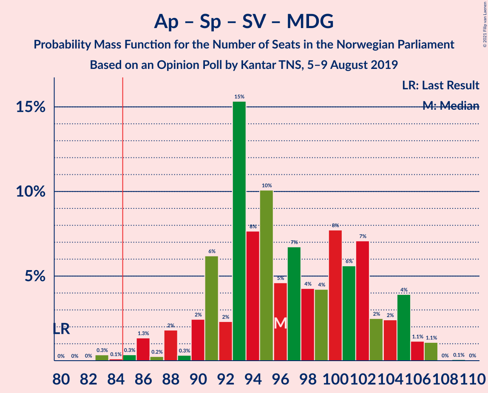

| Number of Seats | Probability | Accumulated | Special Marks |
|:---------------:|:-----------:|:-----------:|:-------------:|
| 80 | 0% | 100% | Last Result |
| 81 | 0% | 100% |  |
| 82 | 0% | 100% |  |
| 83 | 0.3% | 100% |  |
| 84 | 0.1% | 99.6% |  |
| 85 | 0.3% | 99.5% | Majority |
| 86 | 1.3% | 99.2% |  |
| 87 | 0.2% | 98% |  |
| 88 | 2% | 98% |  |
| 89 | 0.3% | 96% |  |
| 90 | 2% | 95% |  |
| 91 | 6% | 93% |  |
| 92 | 2% | 87% |  |
| 93 | 15% | 85% |  |
| 94 | 8% | 69% |  |
| 95 | 10% | 62% |  |
| 96 | 5% | 51% | Median |
| 97 | 7% | 47% |  |
| 98 | 4% | 40% |  |
| 99 | 4% | 36% |  |
| 100 | 8% | 32% |  |
| 101 | 6% | 24% |  |
| 102 | 7% | 18% |  |
| 103 | 2% | 11% |  |
| 104 | 2% | 9% |  |
| 105 | 4% | 6% |  |
| 106 | 1.1% | 2% |  |
| 107 | 1.1% | 1.2% |  |
| 108 | 0% | 0.1% |  |
| 109 | 0.1% | 0.1% |  |
| 110 | 0% | 0% |  |

### Arbeiderpartiet – Senterpartiet – Sosialistisk Venstreparti – Rødt

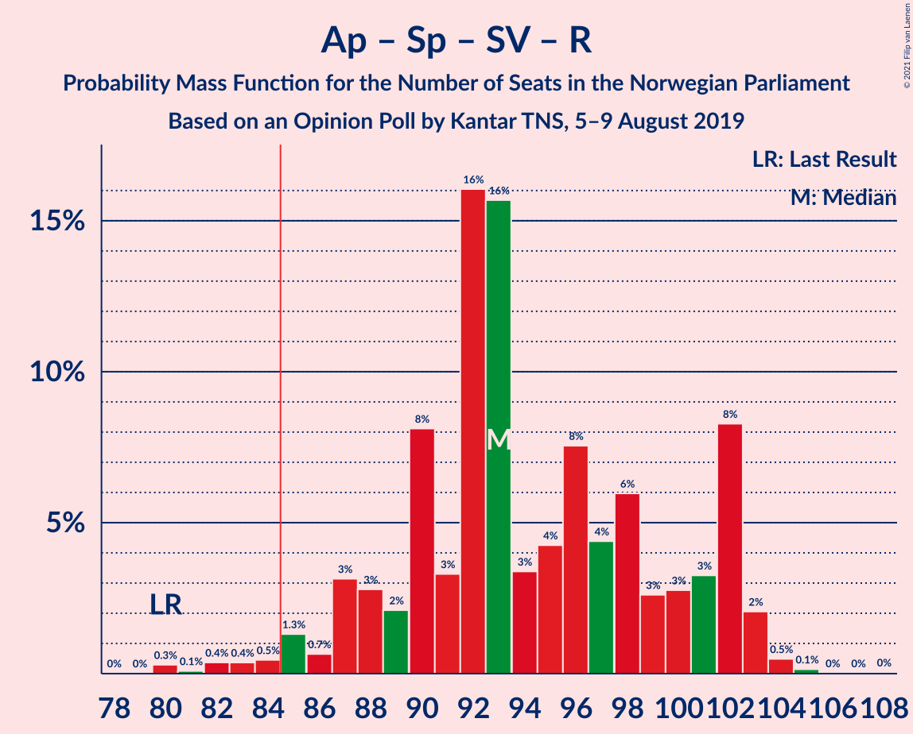

| Number of Seats | Probability | Accumulated | Special Marks |
|:---------------:|:-----------:|:-----------:|:-------------:|
| 80 | 0.3% | 100% | Last Result |
| 81 | 0.1% | 99.7% |  |
| 82 | 0.4% | 99.6% |  |
| 83 | 0.4% | 99.2% |  |
| 84 | 0.5% | 98.8% |  |
| 85 | 1.3% | 98% | Majority |
| 86 | 0.7% | 97% |  |
| 87 | 3% | 96% |  |
| 88 | 3% | 93% |  |
| 89 | 2% | 90% |  |
| 90 | 8% | 88% |  |
| 91 | 3% | 80% |  |
| 92 | 16% | 77% |  |
| 93 | 16% | 61% |  |
| 94 | 3% | 45% | Median |
| 95 | 4% | 42% |  |
| 96 | 8% | 38% |  |
| 97 | 4% | 30% |  |
| 98 | 6% | 26% |  |
| 99 | 3% | 20% |  |
| 100 | 3% | 17% |  |
| 101 | 3% | 14% |  |
| 102 | 8% | 11% |  |
| 103 | 2% | 3% |  |
| 104 | 0.5% | 0.7% |  |
| 105 | 0.1% | 0.2% |  |
| 106 | 0% | 0.1% |  |
| 107 | 0% | 0.1% |  |
| 108 | 0% | 0% |  |

### Høyre – Senterpartiet – Fremskrittspartiet – Kristelig Folkeparti – Venstre

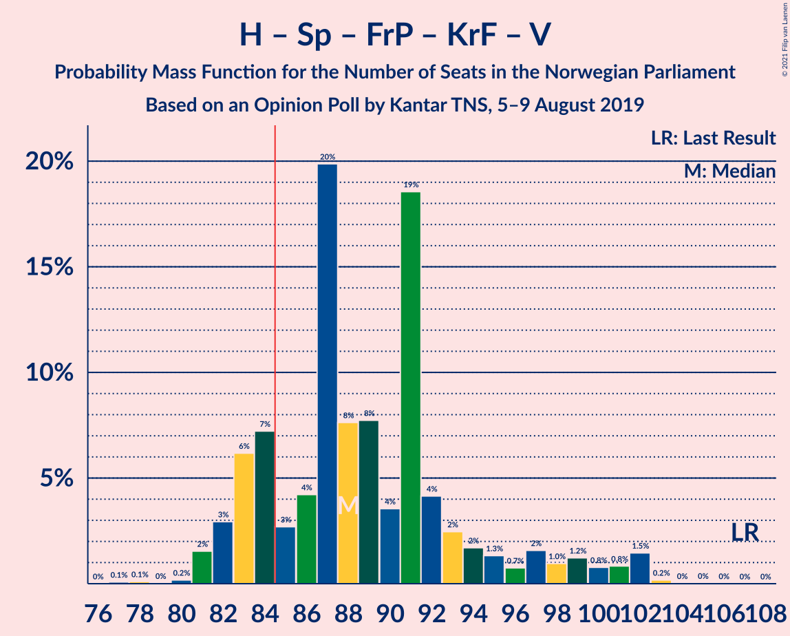

| Number of Seats | Probability | Accumulated | Special Marks |
|:---------------:|:-----------:|:-----------:|:-------------:|
| 77 | 0.1% | 100% |  |
| 78 | 0.1% | 99.9% |  |
| 79 | 0% | 99.8% |  |
| 80 | 0.2% | 99.8% |  |
| 81 | 2% | 99.6% |  |
| 82 | 3% | 98% |  |
| 83 | 6% | 95% |  |
| 84 | 7% | 89% |  |
| 85 | 3% | 82% | Majority |
| 86 | 4% | 79% | Median |
| 87 | 20% | 75% |  |
| 88 | 8% | 55% |  |
| 89 | 8% | 47% |  |
| 90 | 4% | 40% |  |
| 91 | 19% | 36% |  |
| 92 | 4% | 17% |  |
| 93 | 2% | 13% |  |
| 94 | 2% | 11% |  |
| 95 | 1.3% | 9% |  |
| 96 | 0.7% | 8% |  |
| 97 | 2% | 7% |  |
| 98 | 1.0% | 5% |  |
| 99 | 1.2% | 5% |  |
| 100 | 0.8% | 3% |  |
| 101 | 0.8% | 3% |  |
| 102 | 1.5% | 2% |  |
| 103 | 0.2% | 0.2% |  |
| 104 | 0% | 0.1% |  |
| 105 | 0% | 0% |  |
| 106 | 0% | 0% |  |
| 107 | 0% | 0% | Last Result |

### Arbeiderpartiet – Senterpartiet – Miljøpartiet De Grønne – Kristelig Folkeparti

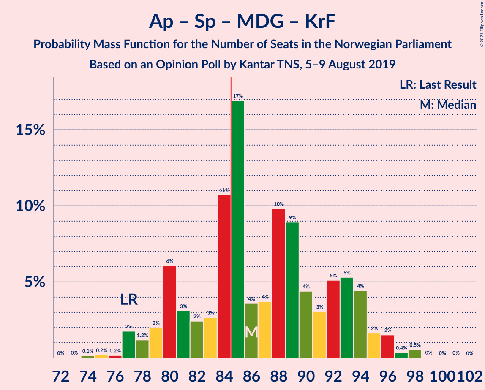

| Number of Seats | Probability | Accumulated | Special Marks |
|:---------------:|:-----------:|:-----------:|:-------------:|
| 73 | 0% | 100% |  |
| 74 | 0.1% | 99.9% |  |
| 75 | 0.2% | 99.8% |  |
| 76 | 0.2% | 99.6% |  |
| 77 | 2% | 99.4% | Last Result |
| 78 | 1.2% | 98% |  |
| 79 | 2% | 96% |  |
| 80 | 6% | 94% |  |
| 81 | 3% | 88% |  |
| 82 | 2% | 85% |  |
| 83 | 3% | 83% |  |
| 84 | 11% | 80% | Median |
| 85 | 17% | 69% | Majority |
| 86 | 4% | 53% |  |
| 87 | 4% | 49% |  |
| 88 | 10% | 45% |  |
| 89 | 9% | 35% |  |
| 90 | 4% | 26% |  |
| 91 | 3% | 22% |  |
| 92 | 5% | 19% |  |
| 93 | 5% | 14% |  |
| 94 | 4% | 9% |  |
| 95 | 2% | 4% |  |
| 96 | 2% | 3% |  |
| 97 | 0.4% | 1.0% |  |
| 98 | 0.5% | 0.7% |  |
| 99 | 0% | 0.1% |  |
| 100 | 0% | 0.1% |  |
| 101 | 0% | 0% |  |

### Arbeiderpartiet – Senterpartiet – Sosialistisk Venstreparti

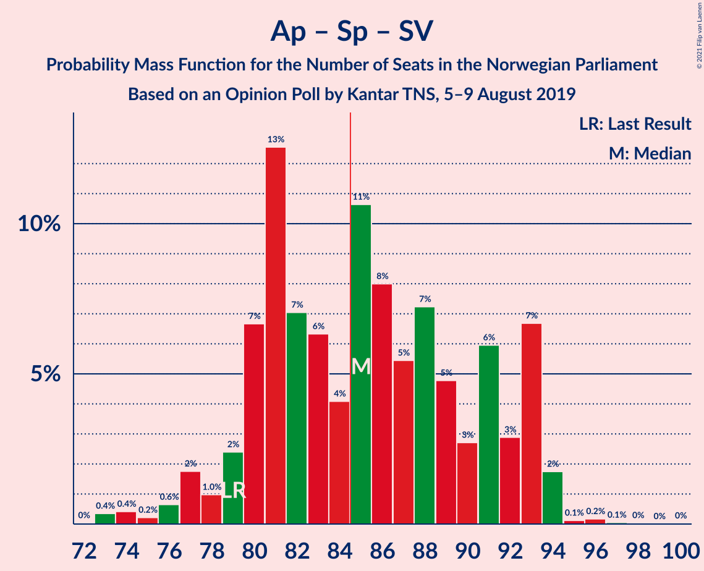

| Number of Seats | Probability | Accumulated | Special Marks |
|:---------------:|:-----------:|:-----------:|:-------------:|
| 72 | 0% | 100% |  |
| 73 | 0.4% | 99.9% |  |
| 74 | 0.4% | 99.6% |  |
| 75 | 0.2% | 99.2% |  |
| 76 | 0.6% | 99.0% |  |
| 77 | 2% | 98% |  |
| 78 | 1.0% | 97% |  |
| 79 | 2% | 96% | Last Result |
| 80 | 7% | 93% |  |
| 81 | 13% | 87% |  |
| 82 | 7% | 74% |  |
| 83 | 6% | 67% |  |
| 84 | 4% | 61% |  |
| 85 | 11% | 57% | Median, Majority |
| 86 | 8% | 46% |  |
| 87 | 5% | 38% |  |
| 88 | 7% | 32% |  |
| 89 | 5% | 25% |  |
| 90 | 3% | 20% |  |
| 91 | 6% | 18% |  |
| 92 | 3% | 12% |  |
| 93 | 7% | 9% |  |
| 94 | 2% | 2% |  |
| 95 | 0.1% | 0.4% |  |
| 96 | 0.2% | 0.3% |  |
| 97 | 0.1% | 0.1% |  |
| 98 | 0% | 0.1% |  |
| 99 | 0% | 0% |  |

### Arbeiderpartiet – Senterpartiet – Kristelig Folkeparti

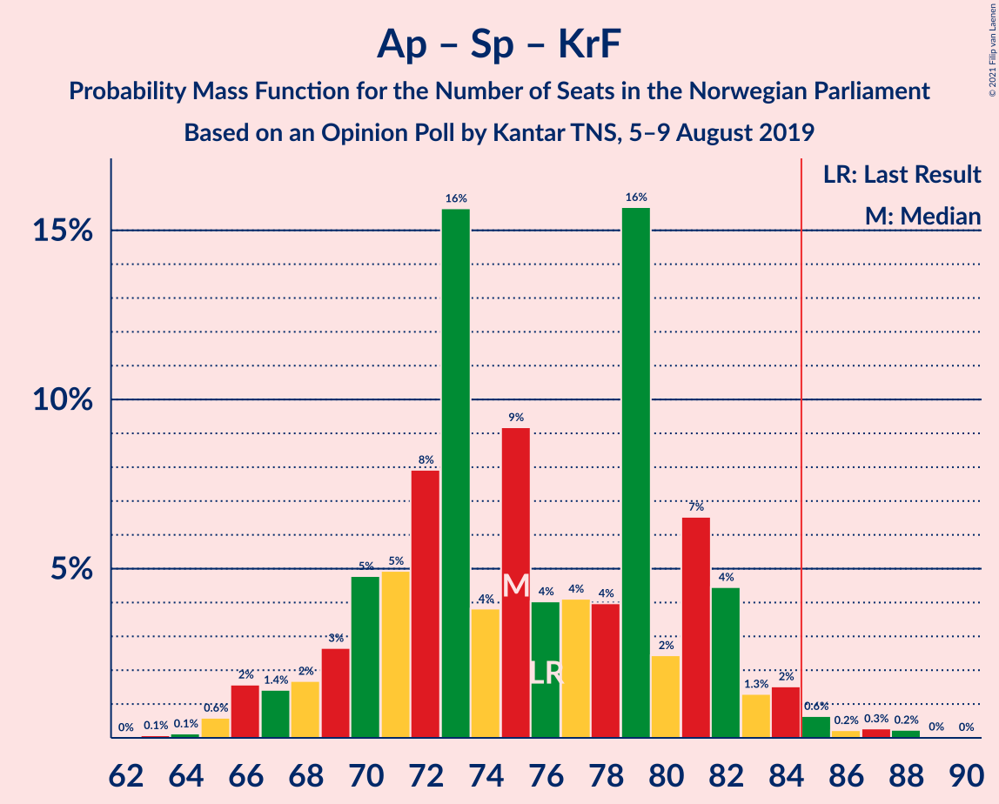

| Number of Seats | Probability | Accumulated | Special Marks |
|:---------------:|:-----------:|:-----------:|:-------------:|
| 62 | 0% | 100% |  |
| 63 | 0.1% | 99.9% |  |
| 64 | 0.1% | 99.9% |  |
| 65 | 0.6% | 99.7% |  |
| 66 | 2% | 99.1% |  |
| 67 | 1.4% | 98% |  |
| 68 | 2% | 96% |  |
| 69 | 3% | 94% |  |
| 70 | 5% | 92% |  |
| 71 | 5% | 87% |  |
| 72 | 8% | 82% |  |
| 73 | 16% | 74% | Median |
| 74 | 4% | 59% |  |
| 75 | 9% | 55% |  |
| 76 | 4% | 46% | Last Result |
| 77 | 4% | 41% |  |
| 78 | 4% | 37% |  |
| 79 | 16% | 33% |  |
| 80 | 2% | 18% |  |
| 81 | 7% | 15% |  |
| 82 | 4% | 9% |  |
| 83 | 1.3% | 4% |  |
| 84 | 2% | 3% |  |
| 85 | 0.6% | 1.5% | Majority |
| 86 | 0.2% | 0.8% |  |
| 87 | 0.3% | 0.6% |  |
| 88 | 0.2% | 0.3% |  |
| 89 | 0% | 0.1% |  |
| 90 | 0% | 0% |  |

### Høyre – Fremskrittspartiet – Miljøpartiet De Grønne – Kristelig Folkeparti – Venstre

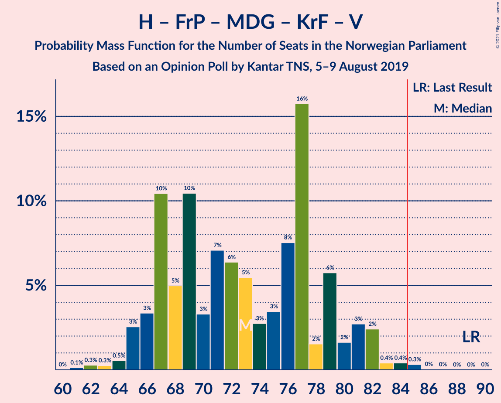

| Number of Seats | Probability | Accumulated | Special Marks |
|:---------------:|:-----------:|:-----------:|:-------------:|
| 61 | 0.1% | 100% |  |
| 62 | 0.3% | 99.8% |  |
| 63 | 0.3% | 99.5% |  |
| 64 | 0.5% | 99.3% |  |
| 65 | 3% | 98.7% |  |
| 66 | 3% | 96% |  |
| 67 | 10% | 93% |  |
| 68 | 5% | 82% |  |
| 69 | 10% | 77% |  |
| 70 | 3% | 67% |  |
| 71 | 7% | 64% | Median |
| 72 | 6% | 57% |  |
| 73 | 5% | 50% |  |
| 74 | 3% | 45% |  |
| 75 | 3% | 42% |  |
| 76 | 8% | 39% |  |
| 77 | 16% | 31% |  |
| 78 | 2% | 15% |  |
| 79 | 6% | 14% |  |
| 80 | 2% | 8% |  |
| 81 | 3% | 6% |  |
| 82 | 2% | 4% |  |
| 83 | 0.4% | 1.2% |  |
| 84 | 0.4% | 0.8% |  |
| 85 | 0.3% | 0.4% | Majority |
| 86 | 0% | 0.1% |  |
| 87 | 0% | 0% |  |
| 88 | 0% | 0% |  |
| 89 | 0% | 0% | Last Result |

### Arbeiderpartiet – Senterpartiet

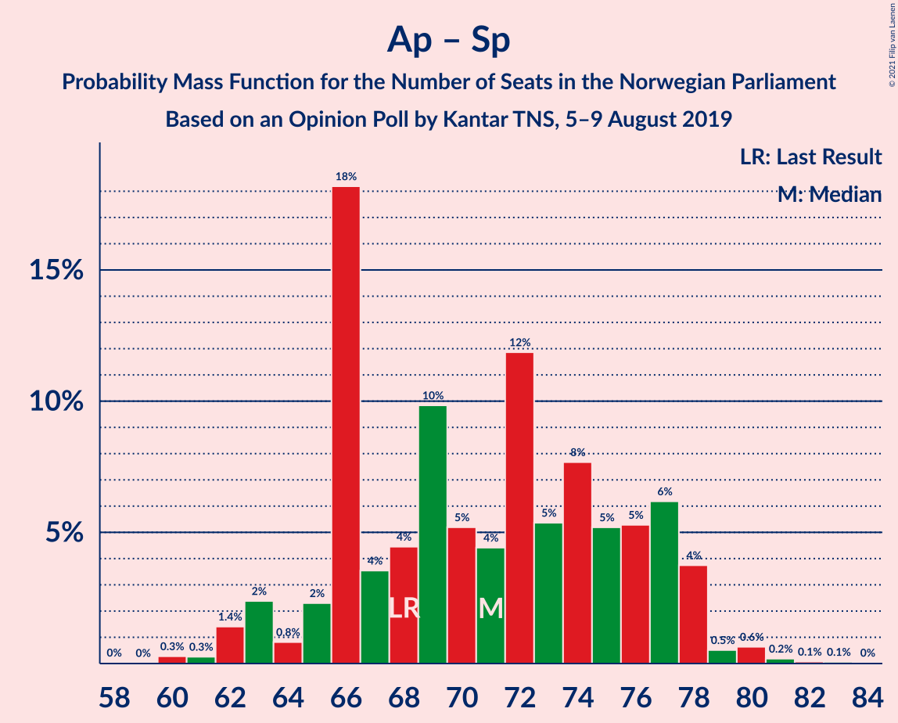

| Number of Seats | Probability | Accumulated | Special Marks |
|:---------------:|:-----------:|:-----------:|:-------------:|
| 59 | 0% | 100% |  |
| 60 | 0.3% | 99.9% |  |
| 61 | 0.3% | 99.7% |  |
| 62 | 1.4% | 99.4% |  |
| 63 | 2% | 98% |  |
| 64 | 0.8% | 96% |  |
| 65 | 2% | 95% |  |
| 66 | 18% | 92% |  |
| 67 | 4% | 74% |  |
| 68 | 4% | 71% | Last Result |
| 69 | 10% | 66% |  |
| 70 | 5% | 56% | Median |
| 71 | 4% | 51% |  |
| 72 | 12% | 47% |  |
| 73 | 5% | 35% |  |
| 74 | 8% | 30% |  |
| 75 | 5% | 22% |  |
| 76 | 5% | 17% |  |
| 77 | 6% | 11% |  |
| 78 | 4% | 5% |  |
| 79 | 0.5% | 2% |  |
| 80 | 0.6% | 1.0% |  |
| 81 | 0.2% | 0.4% |  |
| 82 | 0.1% | 0.2% |  |
| 83 | 0.1% | 0.1% |  |
| 84 | 0% | 0% |  |

### Høyre – Fremskrittspartiet – Kristelig Folkeparti – Venstre

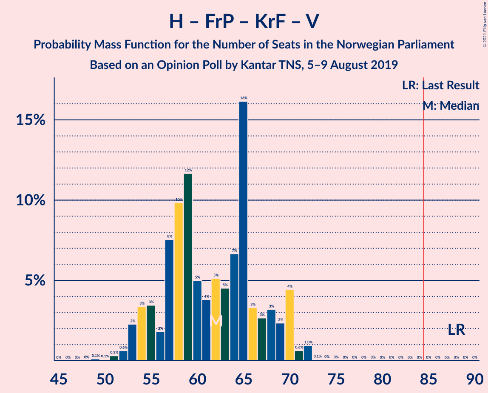

| Number of Seats | Probability | Accumulated | Special Marks |
|:---------------:|:-----------:|:-----------:|:-------------:|
| 49 | 0.1% | 100% |  |
| 50 | 0.1% | 99.9% |  |
| 51 | 0.3% | 99.8% |  |
| 52 | 0.6% | 99.5% |  |
| 53 | 2% | 98.9% |  |
| 54 | 3% | 97% |  |
| 55 | 3% | 93% |  |
| 56 | 2% | 90% |  |
| 57 | 8% | 88% |  |
| 58 | 10% | 80% |  |
| 59 | 12% | 71% |  |
| 60 | 5% | 59% | Median |
| 61 | 4% | 54% |  |
| 62 | 5% | 50% |  |
| 63 | 5% | 45% |  |
| 64 | 7% | 40% |  |
| 65 | 16% | 34% |  |
| 66 | 3% | 18% |  |
| 67 | 3% | 14% |  |
| 68 | 3% | 12% |  |
| 69 | 2% | 9% |  |
| 70 | 4% | 6% |  |
| 71 | 0.6% | 2% |  |
| 72 | 1.0% | 1.1% |  |
| 73 | 0.1% | 0.2% |  |
| 74 | 0% | 0.1% |  |
| 75 | 0% | 0% |  |
| 76 | 0% | 0% |  |
| 77 | 0% | 0% |  |
| 78 | 0% | 0% |  |
| 79 | 0% | 0% |  |
| 80 | 0% | 0% |  |
| 81 | 0% | 0% |  |
| 82 | 0% | 0% |  |
| 83 | 0% | 0% |  |
| 84 | 0% | 0% |  |
| 85 | 0% | 0% | Majority |
| 86 | 0% | 0% |  |
| 87 | 0% | 0% |  |
| 88 | 0% | 0% | Last Result |

### Arbeiderpartiet – Sosialistisk Venstreparti

| Number of Seats | Probability | Accumulated | Special Marks |
|:---------------:|:-----------:|:-----------:|:-------------:|
| 47 | 0.2% | 100% |  |
| 48 | 0.1% | 99.8% |  |
| 49 | 0.4% | 99.7% |  |
| 50 | 1.2% | 99.3% |  |
| 51 | 2% | 98% |  |
| 52 | 4% | 96% |  |
| 53 | 3% | 93% |  |
| 54 | 2% | 90% |  |
| 55 | 18% | 87% |  |
| 56 | 6% | 69% |  |
| 57 | 11% | 64% |  |
| 58 | 6% | 52% |  |
| 59 | 17% | 46% | Median |
| 60 | 7% | 29% | Last Result |
| 61 | 6% | 22% |  |
| 62 | 3% | 16% |  |
| 63 | 2% | 13% |  |
| 64 | 2% | 12% |  |
| 65 | 2% | 10% |  |
| 66 | 2% | 7% |  |
| 67 | 6% | 6% |  |
| 68 | 0.1% | 0.3% |  |
| 69 | 0% | 0.1% |  |
| 70 | 0.1% | 0.1% |  |
| 71 | 0% | 0% |  |

### Høyre – Fremskrittspartiet – Venstre

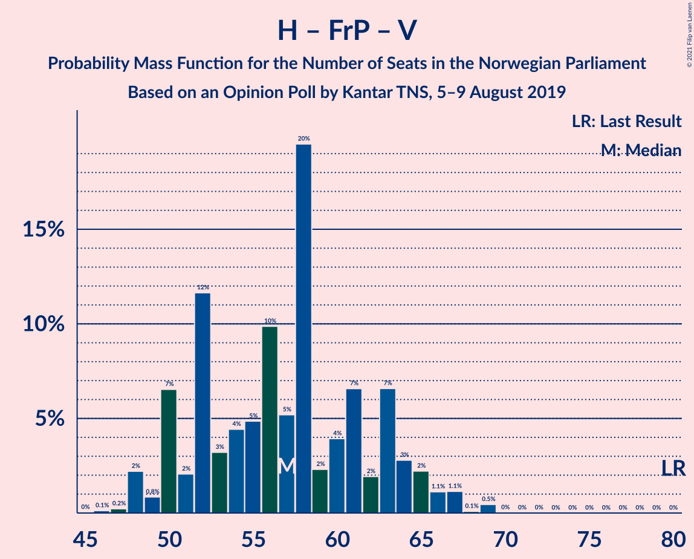

| Number of Seats | Probability | Accumulated | Special Marks |
|:---------------:|:-----------:|:-----------:|:-------------:|
| 45 | 0% | 100% |  |
| 46 | 0.1% | 99.9% |  |
| 47 | 0.2% | 99.8% |  |
| 48 | 2% | 99.6% |  |
| 49 | 0.8% | 97% |  |
| 50 | 7% | 97% |  |
| 51 | 2% | 90% |  |
| 52 | 12% | 88% |  |
| 53 | 3% | 76% |  |
| 54 | 4% | 73% |  |
| 55 | 5% | 69% |  |
| 56 | 10% | 64% |  |
| 57 | 5% | 54% | Median |
| 58 | 20% | 49% |  |
| 59 | 2% | 29% |  |
| 60 | 4% | 27% |  |
| 61 | 7% | 23% |  |
| 62 | 2% | 16% |  |
| 63 | 7% | 14% |  |
| 64 | 3% | 8% |  |
| 65 | 2% | 5% |  |
| 66 | 1.1% | 3% |  |
| 67 | 1.1% | 2% |  |
| 68 | 0.1% | 0.6% |  |
| 69 | 0.5% | 0.5% |  |
| 70 | 0% | 0% |  |
| 71 | 0% | 0% |  |
| 72 | 0% | 0% |  |
| 73 | 0% | 0% |  |
| 74 | 0% | 0% |  |
| 75 | 0% | 0% |  |
| 76 | 0% | 0% |  |
| 77 | 0% | 0% |  |
| 78 | 0% | 0% |  |
| 79 | 0% | 0% |  |
| 80 | 0% | 0% | Last Result |

### Høyre – Fremskrittspartiet

| Number of Seats | Probability | Accumulated | Special Marks |
|:---------------:|:-----------:|:-----------:|:-------------:|
| 45 | 0% | 100% |  |
| 46 | 0.2% | 99.9% |  |
| 47 | 2% | 99.7% |  |
| 48 | 1.0% | 97% |  |
| 49 | 2% | 96% |  |
| 50 | 8% | 95% |  |
| 51 | 0.9% | 86% |  |
| 52 | 11% | 85% |  |
| 53 | 5% | 74% |  |
| 54 | 8% | 70% |  |
| 55 | 9% | 61% |  |
| 56 | 21% | 52% | Median |
| 57 | 2% | 31% |  |
| 58 | 6% | 30% |  |
| 59 | 1.3% | 24% |  |
| 60 | 2% | 23% |  |
| 61 | 7% | 21% |  |
| 62 | 7% | 14% |  |
| 63 | 3% | 6% |  |
| 64 | 0.7% | 3% |  |
| 65 | 1.1% | 2% |  |
| 66 | 0.7% | 1.3% |  |
| 67 | 0.1% | 0.6% |  |
| 68 | 0.5% | 0.5% |  |
| 69 | 0% | 0% |  |
| 70 | 0% | 0% |  |
| 71 | 0% | 0% |  |
| 72 | 0% | 0% | Last Result |

### Høyre – Kristelig Folkeparti – Venstre

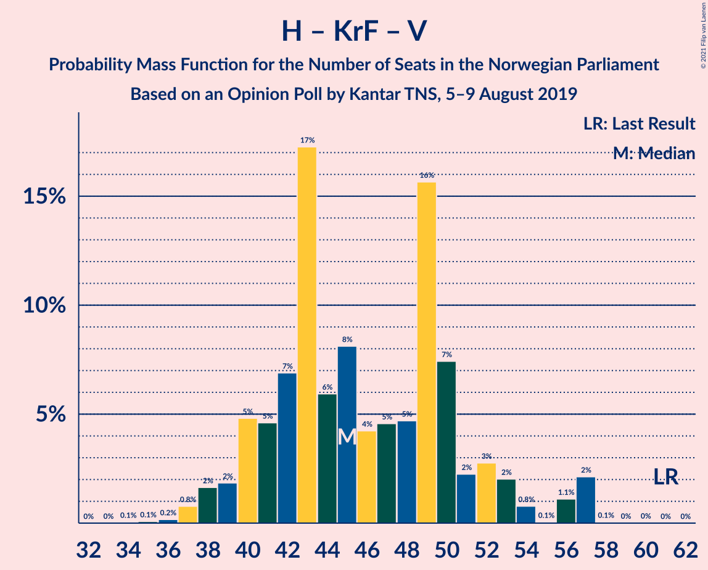

| Number of Seats | Probability | Accumulated | Special Marks |
|:---------------:|:-----------:|:-----------:|:-------------:|
| 34 | 0.1% | 100% |  |
| 35 | 0.1% | 99.9% |  |
| 36 | 0.2% | 99.9% |  |
| 37 | 0.8% | 99.7% |  |
| 38 | 2% | 98.9% |  |
| 39 | 2% | 97% |  |
| 40 | 5% | 95% |  |
| 41 | 5% | 91% |  |
| 42 | 7% | 86% |  |
| 43 | 17% | 79% |  |
| 44 | 6% | 62% | Median |
| 45 | 8% | 56% |  |
| 46 | 4% | 48% |  |
| 47 | 5% | 44% |  |
| 48 | 5% | 39% |  |
| 49 | 16% | 34% |  |
| 50 | 7% | 19% |  |
| 51 | 2% | 11% |  |
| 52 | 3% | 9% |  |
| 53 | 2% | 6% |  |
| 54 | 0.8% | 4% |  |
| 55 | 0.1% | 3% |  |
| 56 | 1.1% | 3% |  |
| 57 | 2% | 2% |  |
| 58 | 0.1% | 0.1% |  |
| 59 | 0% | 0% |  |
| 60 | 0% | 0% |  |
| 61 | 0% | 0% | Last Result |

### Senterpartiet – Kristelig Folkeparti – Venstre

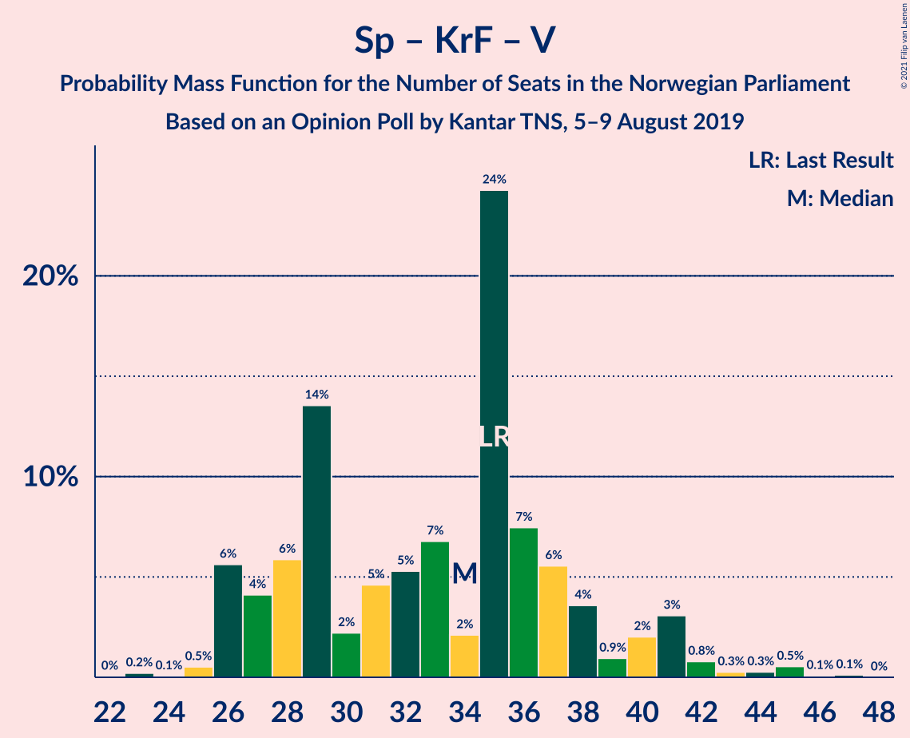

| Number of Seats | Probability | Accumulated | Special Marks |
|:---------------:|:-----------:|:-----------:|:-------------:|
| 22 | 0% | 100% |  |
| 23 | 0.2% | 99.9% |  |
| 24 | 0.1% | 99.7% |  |
| 25 | 0.5% | 99.7% |  |
| 26 | 6% | 99.2% |  |
| 27 | 4% | 94% |  |
| 28 | 6% | 89% |  |
| 29 | 14% | 84% |  |
| 30 | 2% | 70% | Median |
| 31 | 5% | 68% |  |
| 32 | 5% | 63% |  |
| 33 | 7% | 58% |  |
| 34 | 2% | 51% |  |
| 35 | 24% | 49% | Last Result |
| 36 | 7% | 25% |  |
| 37 | 6% | 17% |  |
| 38 | 4% | 12% |  |
| 39 | 0.9% | 8% |  |
| 40 | 2% | 7% |  |
| 41 | 3% | 5% |  |
| 42 | 0.8% | 2% |  |
| 43 | 0.3% | 1.3% |  |
| 44 | 0.3% | 1.0% |  |
| 45 | 0.5% | 0.8% |  |
| 46 | 0.1% | 0.2% |  |
| 47 | 0.1% | 0.1% |  |
| 48 | 0% | 0% |  |

## Technical Information

### Opinion Poll

+ **Polling firm:** Kantar TNS
+ **Commissioner(s):** —
+ **Fieldwork period:** 5–9 August 2019

### Calculations

+ **Sample size:** 744
+ **Simulations done:** 131,072
+ **Error estimate:** 1.33%

