# Opinion Poll by Norstat, 6–12 August 2019

<a href="#voting-intentions">Voting Intentions</a> | <a href="#seats">Seats</a> | <a href="#coalitions">Coalitions</a> | <a href="#technical-information">Technical Information</a>

## Voting Intentions

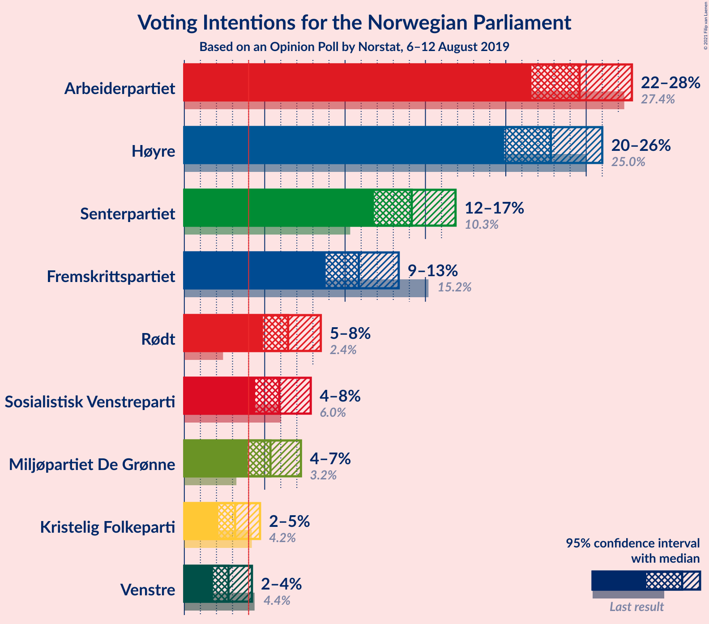

### Confidence Intervals

| Party | Last Result | Poll Result | 80% Confidence Interval | 90% Confidence Interval | 95% Confidence Interval | 99% Confidence Interval |
|:-----:|:-----------:|:-----------:|:-----------------------:|:-----------------------:|:-----------------------:|:-----------------------:|
| Arbeiderpartiet | 27.4% | 24.6% | 22.6–26.7% |22.1–27.3% |21.6–27.8% |20.7–28.9% |
| Høyre | 25.0% | 22.8% | 20.9–24.9% |20.4–25.5% |19.9–26.0% |19.0–27.0% |
| Senterpartiet | 10.3% | 14.1% | 12.6–15.9% |12.2–16.4% |11.8–16.9% |11.1–17.8% |
| Fremskrittspartiet | 15.2% | 10.9% | 9.5–12.5% |9.1–12.9% |8.8–13.3% |8.2–14.1% |
| Rødt | 2.4% | 6.5% | 5.4–7.8% |5.1–8.2% |4.9–8.5% |4.4–9.2% |
| Sosialistisk Venstreparti | 6.0% | 5.9% | 4.9–7.2% |4.6–7.5% |4.4–7.9% |4.0–8.5% |
| Miljøpartiet De Grønne | 3.2% | 5.4% | 4.4–6.6% |4.2–6.9% |3.9–7.3% |3.5–7.9% |
| Kristelig Folkeparti | 4.2% | 3.2% | 2.5–4.2% |2.3–4.5% |2.1–4.7% |1.8–5.2% |
| Venstre | 4.4% | 2.7% | 2.1–3.7% |1.9–4.0% |1.8–4.2% |1.5–4.7% |

*Note:* The poll result column reflects the actual value used in the calculations. Published results may vary slightly, and in addition be rounded to fewer digits.

## Seats

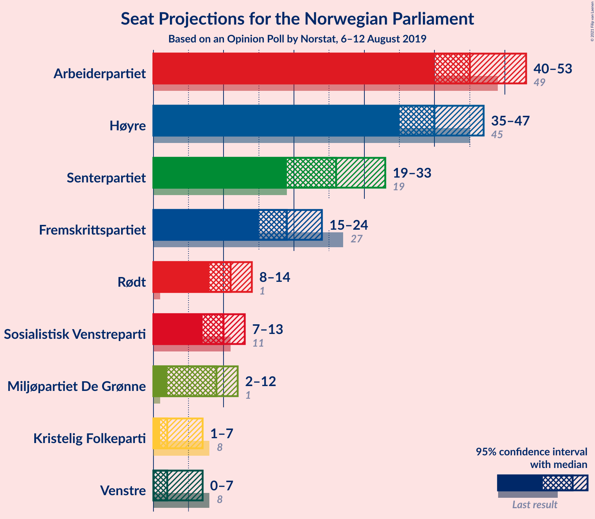

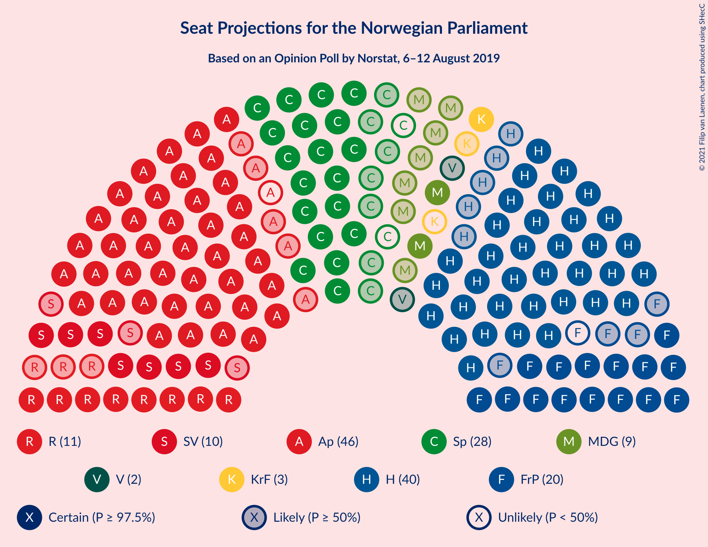

### Confidence Intervals

| Party | Last Result | Median | 80% Confidence Interval | 90% Confidence Interval | 95% Confidence Interval | 99% Confidence Interval |
|:-----:|:-----------:|:------:|:-----------------------:|:-----------------------:|:-----------------------:|:-----------------------:|
| <a href="#arbeiderpartiet">Arbeiderpartiet</a> | 49 | 45 | 41–50 |40–51 |40–53 |38–54 |
| <a href="#høyre">Høyre</a> | 45 | 40 | 37–45 |36–46 |35–47 |34–49 |
| <a href="#senterpartiet">Senterpartiet</a> | 19 | 26 | 22–31 |21–33 |19–33 |18–34 |
| <a href="#fremskrittspartiet">Fremskrittspartiet</a> | 27 | 19 | 16–21 |15–23 |15–24 |13–25 |
| <a href="#rødt">Rødt</a> | 1 | 11 | 9–13 |8–14 |8–14 |7–16 |
| <a href="#sosialistisk-venstreparti">Sosialistisk Venstreparti</a> | 11 | 10 | 8–12 |8–13 |7–13 |3–15 |
| <a href="#miljøpartiet-de-grønne">Miljøpartiet De Grønne</a> | 1 | 9 | 7–12 |7–12 |2–12 |2–14 |
| <a href="#kristelig-folkeparti">Kristelig Folkeparti</a> | 8 | 2 | 1–3 |1–7 |1–7 |0–8 |
| <a href="#venstre">Venstre</a> | 8 | 2 | 1–2 |1–3 |0–7 |0–8 |

### Arbeiderpartiet

*For a full overview of the results for this party, see the [Arbeiderpartiet](party-arbeiderpartiet.html) page.*

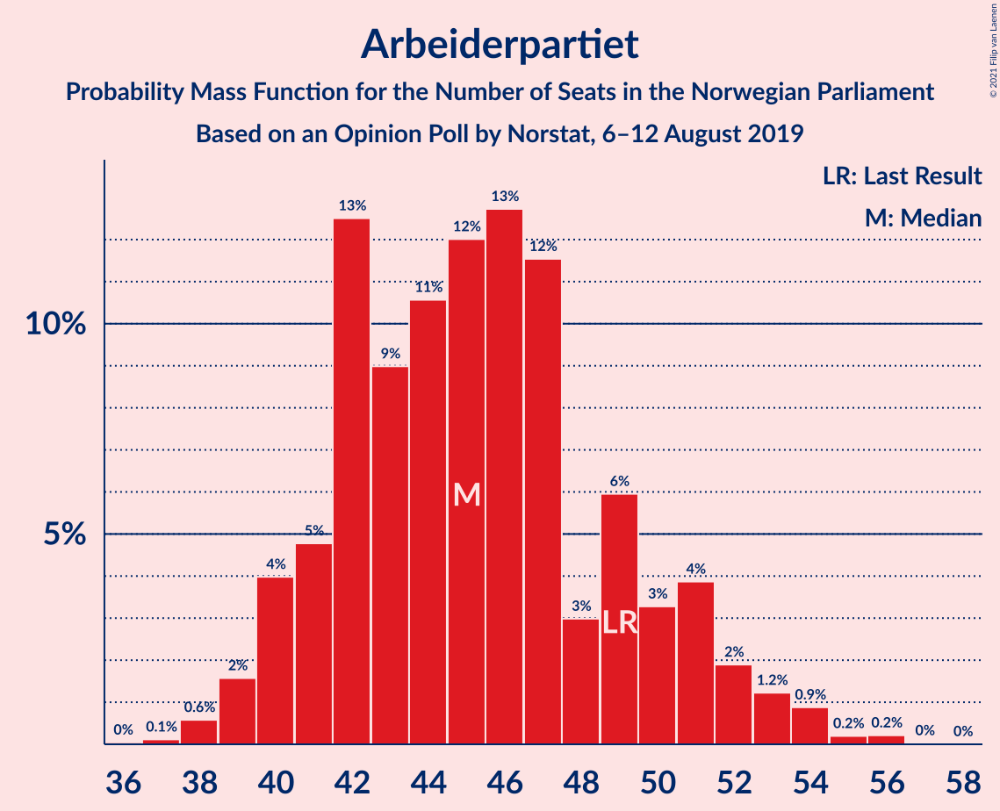

| Number of Seats | Probability | Accumulated | Special Marks |
|:---------------:|:-----------:|:-----------:|:-------------:|
| 36 | 0% | 100% |  |
| 37 | 0.1% | 99.9% |  |
| 38 | 0.6% | 99.8% |  |
| 39 | 2% | 99.2% |  |
| 40 | 4% | 98% |  |
| 41 | 5% | 94% |  |
| 42 | 13% | 89% |  |
| 43 | 9% | 76% |  |
| 44 | 11% | 67% |  |
| 45 | 12% | 57% | Median |
| 46 | 13% | 45% |  |
| 47 | 12% | 32% |  |
| 48 | 3% | 21% |  |
| 49 | 6% | 18% | Last Result |
| 50 | 3% | 12% |  |
| 51 | 4% | 8% |  |
| 52 | 2% | 4% |  |
| 53 | 1.2% | 3% |  |
| 54 | 0.9% | 1.3% |  |
| 55 | 0.2% | 0.5% |  |
| 56 | 0.2% | 0.3% |  |
| 57 | 0% | 0% |  |

### Høyre

*For a full overview of the results for this party, see the [Høyre](party-høyre.html) page.*

| Number of Seats | Probability | Accumulated | Special Marks |
|:---------------:|:-----------:|:-----------:|:-------------:|
| 31 | 0% | 100% |  |
| 32 | 0.1% | 99.9% |  |
| 33 | 0.2% | 99.9% |  |
| 34 | 0.5% | 99.7% |  |
| 35 | 2% | 99.2% |  |
| 36 | 7% | 97% |  |
| 37 | 7% | 90% |  |
| 38 | 13% | 84% |  |
| 39 | 8% | 71% |  |
| 40 | 15% | 63% | Median |
| 41 | 7% | 48% |  |
| 42 | 11% | 41% |  |
| 43 | 9% | 30% |  |
| 44 | 7% | 21% |  |
| 45 | 5% | 14% | Last Result |
| 46 | 5% | 10% |  |
| 47 | 3% | 5% |  |
| 48 | 1.0% | 2% |  |
| 49 | 0.4% | 0.7% |  |
| 50 | 0.2% | 0.3% |  |
| 51 | 0.1% | 0.1% |  |
| 52 | 0% | 0% |  |

### Senterpartiet

*For a full overview of the results for this party, see the [Senterpartiet](party-senterpartiet.html) page.*

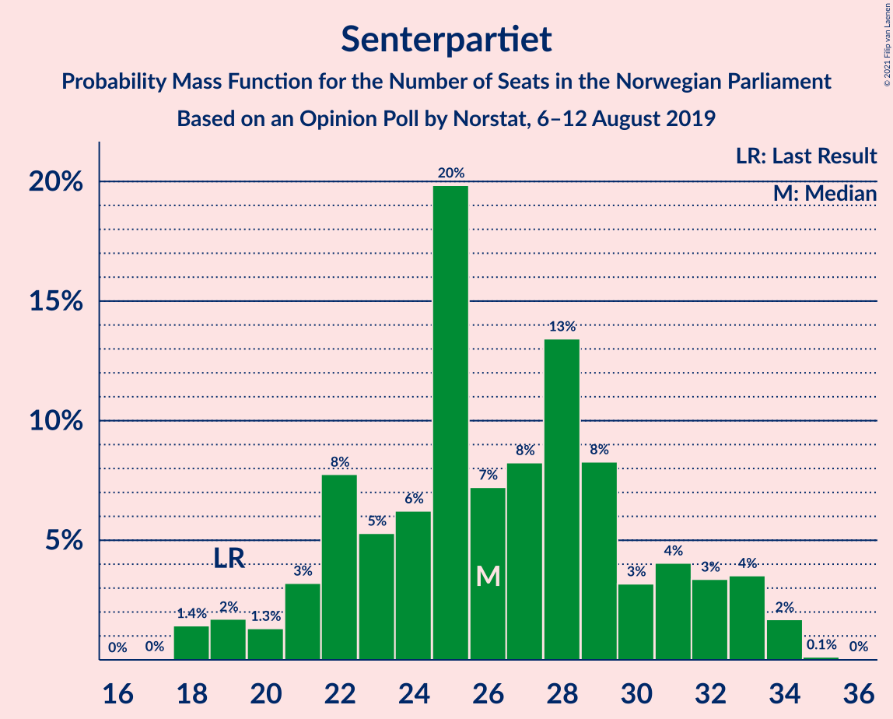

| Number of Seats | Probability | Accumulated | Special Marks |
|:---------------:|:-----------:|:-----------:|:-------------:|
| 17 | 0% | 100% |  |
| 18 | 1.4% | 99.9% |  |
| 19 | 2% | 98.5% | Last Result |
| 20 | 1.3% | 97% |  |
| 21 | 3% | 95% |  |
| 22 | 8% | 92% |  |
| 23 | 5% | 85% |  |
| 24 | 6% | 79% |  |
| 25 | 20% | 73% |  |
| 26 | 7% | 53% | Median |
| 27 | 8% | 46% |  |
| 28 | 13% | 38% |  |
| 29 | 8% | 24% |  |
| 30 | 3% | 16% |  |
| 31 | 4% | 13% |  |
| 32 | 3% | 9% |  |
| 33 | 4% | 5% |  |
| 34 | 2% | 2% |  |
| 35 | 0.1% | 0.2% |  |
| 36 | 0% | 0% |  |

### Fremskrittspartiet

*For a full overview of the results for this party, see the [Fremskrittspartiet](party-fremskrittspartiet.html) page.*

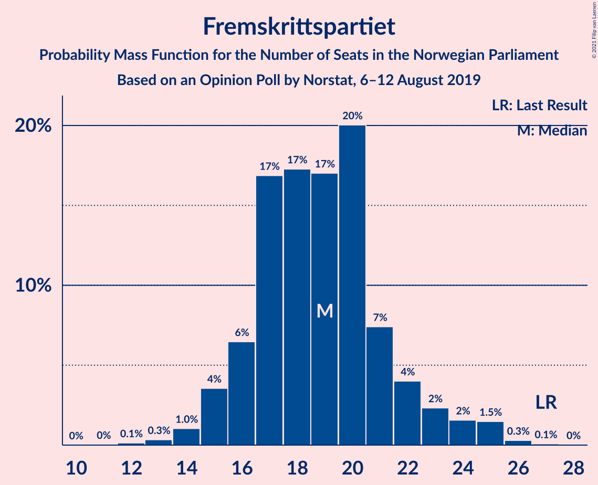

| Number of Seats | Probability | Accumulated | Special Marks |
|:---------------:|:-----------:|:-----------:|:-------------:|
| 12 | 0.1% | 100% |  |
| 13 | 0.3% | 99.8% |  |
| 14 | 1.0% | 99.5% |  |
| 15 | 4% | 98% |  |
| 16 | 6% | 95% |  |
| 17 | 17% | 88% |  |
| 18 | 17% | 72% |  |
| 19 | 17% | 54% | Median |
| 20 | 20% | 37% |  |
| 21 | 7% | 17% |  |
| 22 | 4% | 10% |  |
| 23 | 2% | 6% |  |
| 24 | 2% | 3% |  |
| 25 | 1.5% | 2% |  |
| 26 | 0.3% | 0.4% |  |
| 27 | 0.1% | 0.1% | Last Result |
| 28 | 0% | 0% |  |

### Rødt

*For a full overview of the results for this party, see the [Rødt](party-rødt.html) page.*

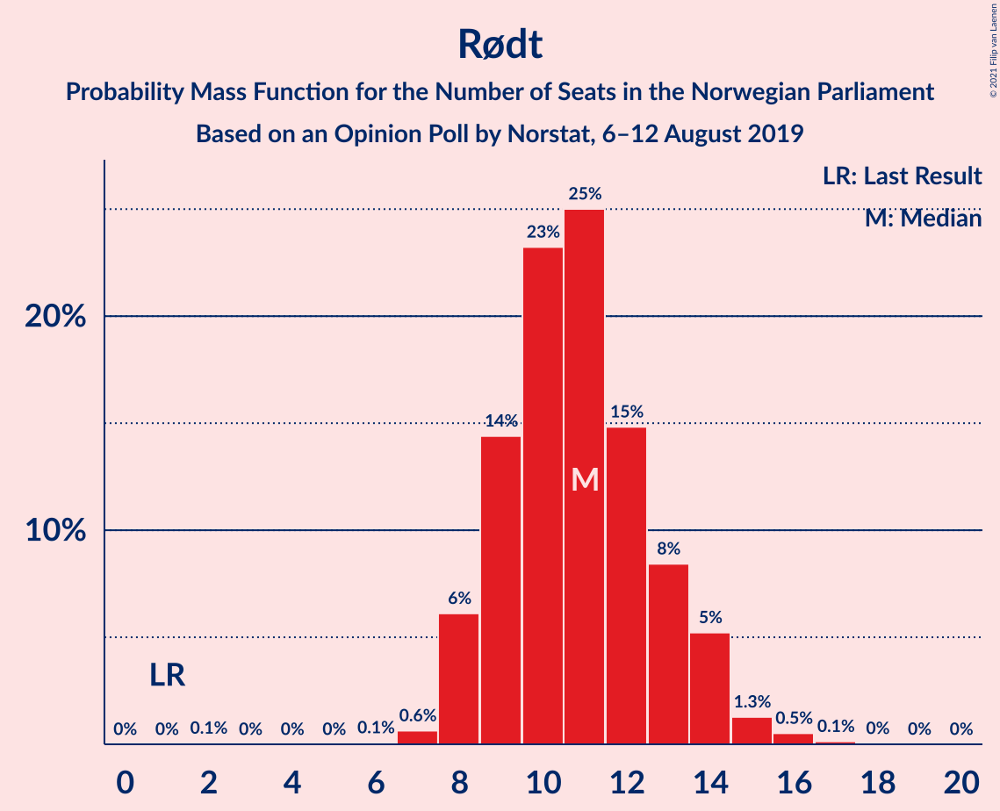

| Number of Seats | Probability | Accumulated | Special Marks |
|:---------------:|:-----------:|:-----------:|:-------------:|
| 1 | 0% | 100% | Last Result |
| 2 | 0.1% | 100% |  |
| 3 | 0% | 99.9% |  |
| 4 | 0% | 99.9% |  |
| 5 | 0% | 99.9% |  |
| 6 | 0.1% | 99.9% |  |
| 7 | 0.6% | 99.9% |  |
| 8 | 6% | 99.2% |  |
| 9 | 14% | 93% |  |
| 10 | 23% | 79% |  |
| 11 | 25% | 55% | Median |
| 12 | 15% | 30% |  |
| 13 | 8% | 16% |  |
| 14 | 5% | 7% |  |
| 15 | 1.3% | 2% |  |
| 16 | 0.5% | 0.7% |  |
| 17 | 0.1% | 0.2% |  |
| 18 | 0% | 0.1% |  |
| 19 | 0% | 0% |  |

### Sosialistisk Venstreparti

*For a full overview of the results for this party, see the [Sosialistisk Venstreparti](party-sosialistiskvenstreparti.html) page.*

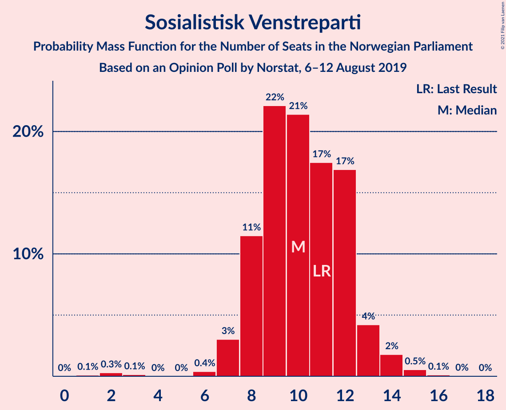

| Number of Seats | Probability | Accumulated | Special Marks |
|:---------------:|:-----------:|:-----------:|:-------------:|
| 1 | 0.1% | 100% |  |
| 2 | 0.3% | 99.9% |  |
| 3 | 0.1% | 99.6% |  |
| 4 | 0% | 99.5% |  |
| 5 | 0% | 99.5% |  |
| 6 | 0.4% | 99.5% |  |
| 7 | 3% | 99.1% |  |
| 8 | 11% | 96% |  |
| 9 | 22% | 85% |  |
| 10 | 21% | 62% | Median |
| 11 | 17% | 41% | Last Result |
| 12 | 17% | 24% |  |
| 13 | 4% | 7% |  |
| 14 | 2% | 2% |  |
| 15 | 0.5% | 0.7% |  |
| 16 | 0.1% | 0.1% |  |
| 17 | 0% | 0% |  |

### Miljøpartiet De Grønne

*For a full overview of the results for this party, see the [Miljøpartiet De Grønne](party-miljøpartietdegrønne.html) page.*

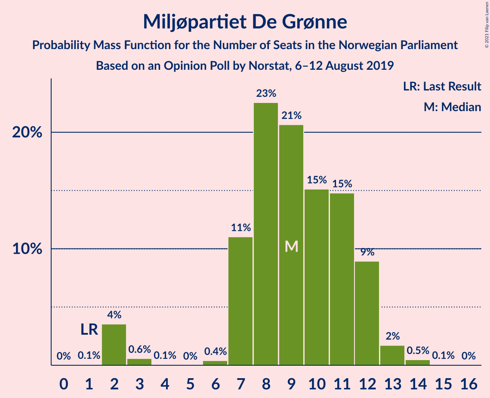

| Number of Seats | Probability | Accumulated | Special Marks |
|:---------------:|:-----------:|:-----------:|:-------------:|
| 1 | 0.1% | 100% | Last Result |
| 2 | 4% | 99.9% |  |
| 3 | 0.6% | 96% |  |
| 4 | 0.1% | 96% |  |
| 5 | 0% | 96% |  |
| 6 | 0.4% | 96% |  |
| 7 | 11% | 95% |  |
| 8 | 23% | 84% |  |
| 9 | 21% | 62% | Median |
| 10 | 15% | 41% |  |
| 11 | 15% | 26% |  |
| 12 | 9% | 11% |  |
| 13 | 2% | 2% |  |
| 14 | 0.5% | 0.6% |  |
| 15 | 0.1% | 0.1% |  |
| 16 | 0% | 0% |  |

### Kristelig Folkeparti

*For a full overview of the results for this party, see the [Kristelig Folkeparti](party-kristeligfolkeparti.html) page.*

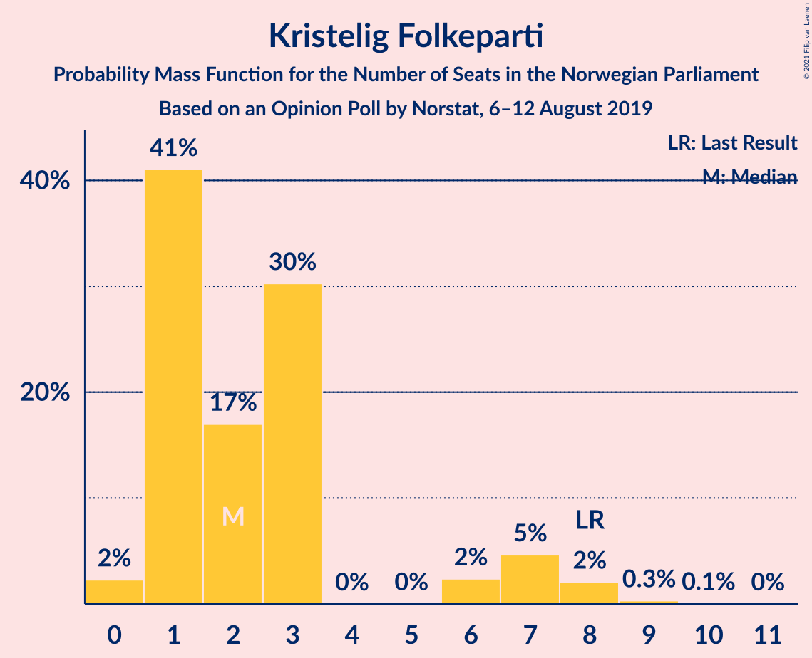

| Number of Seats | Probability | Accumulated | Special Marks |
|:---------------:|:-----------:|:-----------:|:-------------:|
| 0 | 2% | 100% |  |
| 1 | 41% | 98% |  |
| 2 | 17% | 57% | Median |
| 3 | 30% | 40% |  |
| 4 | 0% | 9% |  |
| 5 | 0% | 9% |  |
| 6 | 2% | 9% |  |
| 7 | 5% | 7% |  |
| 8 | 2% | 2% | Last Result |
| 9 | 0.3% | 0.4% |  |
| 10 | 0.1% | 0.1% |  |
| 11 | 0% | 0% |  |

### Venstre

*For a full overview of the results for this party, see the [Venstre](party-venstre.html) page.*

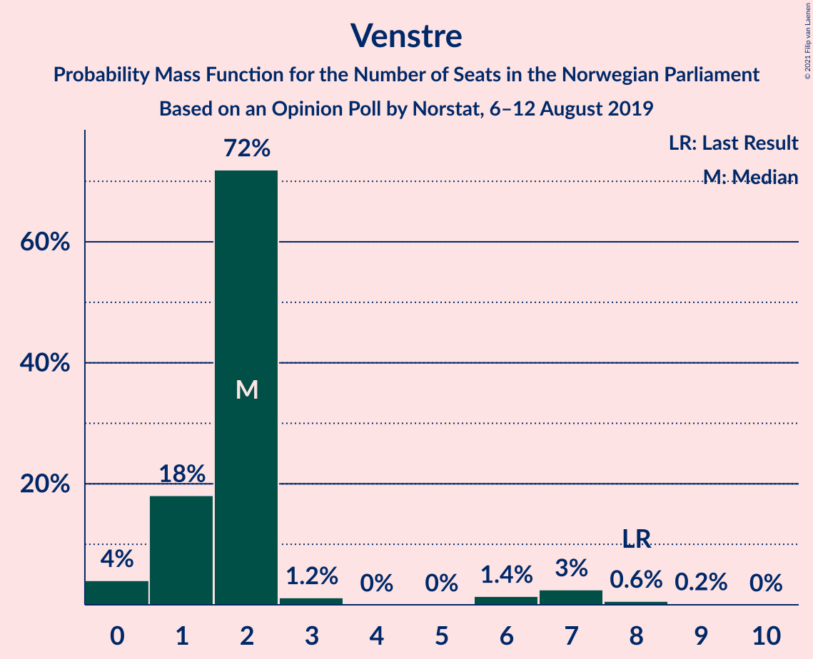

| Number of Seats | Probability | Accumulated | Special Marks |
|:---------------:|:-----------:|:-----------:|:-------------:|
| 0 | 4% | 100% |  |
| 1 | 18% | 96% |  |
| 2 | 72% | 78% | Median |
| 3 | 1.2% | 6% |  |
| 4 | 0% | 5% |  |
| 5 | 0% | 5% |  |
| 6 | 1.4% | 5% |  |
| 7 | 3% | 3% |  |
| 8 | 0.6% | 0.8% | Last Result |
| 9 | 0.2% | 0.2% |  |
| 10 | 0% | 0% |  |

## Coalitions

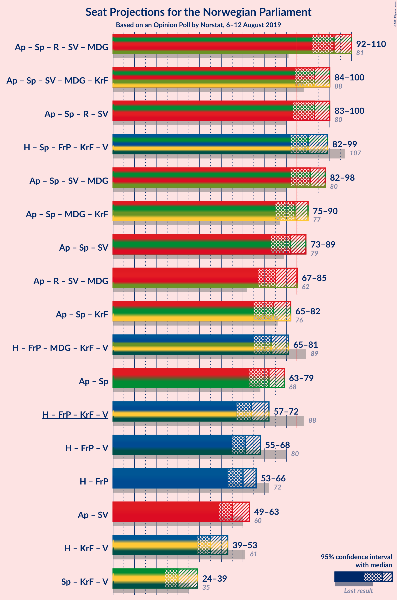

### Confidence Intervals

| Coalition | Last Result | Median | Majority? | 80% Confidence Interval | 90% Confidence Interval | 95% Confidence Interval | 99% Confidence Interval |
|:---------:|:-----------:|:------:|:---------:|:-----------------------:|:-----------------------:|:-----------------------:|:-----------------------:|
| Arbeiderpartiet – Senterpartiet – Rødt – Sosialistisk Venstreparti – Miljøpartiet De Grønne | 81 | 102 | 100% | 96–108 | 93–109 | 92–110 | 89–112 |
| Arbeiderpartiet – Senterpartiet – Sosialistisk Venstreparti – Miljøpartiet De Grønne – Kristelig Folkeparti | 88 | 93 | 97% | 87–98 | 85–99 | 84–100 | 81–102 |
| Arbeiderpartiet – Senterpartiet – Rødt – Sosialistisk Venstreparti | 80 | 93 | 96% | 87–98 | 85–100 | 83–100 | 80–103 |
| Høyre – Senterpartiet – Fremskrittspartiet – Kristelig Folkeparti – Venstre | 107 | 90 | 89% | 84–95 | 83–97 | 82–99 | 80–101 |
| Arbeiderpartiet – Senterpartiet – Sosialistisk Venstreparti – Miljøpartiet De Grønne | 80 | 91 | 91% | 85–96 | 83–97 | 82–98 | 78–100 |
| Arbeiderpartiet – Senterpartiet – Miljøpartiet De Grønne – Kristelig Folkeparti | 77 | 84 | 38% | 78–88 | 76–89 | 75–90 | 72–92 |
| Arbeiderpartiet – Senterpartiet – Sosialistisk Venstreparti | 79 | 82 | 26% | 76–86 | 75–88 | 73–89 | 70–90 |
| Arbeiderpartiet – Rødt – Sosialistisk Venstreparti – Miljøpartiet De Grønne | 62 | 75 | 4% | 69–81 | 68–84 | 67–85 | 65–87 |
| Arbeiderpartiet – Senterpartiet – Kristelig Folkeparti | 76 | 74 | 0.3% | 68–79 | 67–80 | 65–82 | 64–84 |
| Høyre – Fremskrittspartiet – Miljøpartiet De Grønne – Kristelig Folkeparti – Venstre | 89 | 73 | 0.3% | 68–79 | 66–80 | 65–81 | 62–84 |
| Arbeiderpartiet – Senterpartiet | 68 | 72 | 0% | 66–76 | 65–78 | 63–79 | 61–80 |
| Høyre – Fremskrittspartiet – Kristelig Folkeparti – Venstre | 88 | 64 | 0% | 59–69 | 58–70 | 57–72 | 55–75 |
| Høyre – Fremskrittspartiet – Venstre | 80 | 61 | 0% | 57–66 | 56–67 | 55–68 | 52–72 |
| Høyre – Fremskrittspartiet | 72 | 60 | 0% | 55–64 | 54–66 | 53–66 | 51–69 |
| Arbeiderpartiet – Sosialistisk Venstreparti | 60 | 55 | 0% | 51–60 | 50–61 | 49–63 | 47–65 |
| Høyre – Kristelig Folkeparti – Venstre | 61 | 45 | 0% | 40–50 | 39–52 | 39–53 | 37–56 |
| Senterpartiet – Kristelig Folkeparti – Venstre | 35 | 30 | 0% | 25–36 | 24–37 | 24–39 | 21–41 |

### Arbeiderpartiet – Senterpartiet – Rødt – Sosialistisk Venstreparti – Miljøpartiet De Grønne

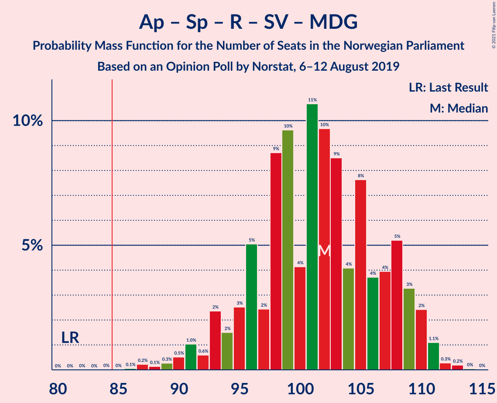

| Number of Seats | Probability | Accumulated | Special Marks |
|:---------------:|:-----------:|:-----------:|:-------------:|
| 81 | 0% | 100% | Last Result |
| 82 | 0% | 100% |  |
| 83 | 0% | 100% |  |
| 84 | 0% | 100% |  |
| 85 | 0% | 100% | Majority |
| 86 | 0.1% | 100% |  |
| 87 | 0.2% | 99.9% |  |
| 88 | 0.1% | 99.7% |  |
| 89 | 0.3% | 99.5% |  |
| 90 | 0.5% | 99.3% |  |
| 91 | 1.0% | 98.8% |  |
| 92 | 0.6% | 98% |  |
| 93 | 2% | 97% |  |
| 94 | 2% | 95% |  |
| 95 | 3% | 93% |  |
| 96 | 5% | 91% |  |
| 97 | 2% | 86% |  |
| 98 | 9% | 83% |  |
| 99 | 10% | 75% |  |
| 100 | 4% | 65% |  |
| 101 | 11% | 61% | Median |
| 102 | 10% | 50% |  |
| 103 | 9% | 40% |  |
| 104 | 4% | 32% |  |
| 105 | 8% | 28% |  |
| 106 | 4% | 20% |  |
| 107 | 4% | 16% |  |
| 108 | 5% | 13% |  |
| 109 | 3% | 7% |  |
| 110 | 2% | 4% |  |
| 111 | 1.1% | 2% |  |
| 112 | 0.3% | 0.5% |  |
| 113 | 0.2% | 0.3% |  |
| 114 | 0% | 0.1% |  |
| 115 | 0% | 0% |  |

### Arbeiderpartiet – Senterpartiet – Sosialistisk Venstreparti – Miljøpartiet De Grønne – Kristelig Folkeparti

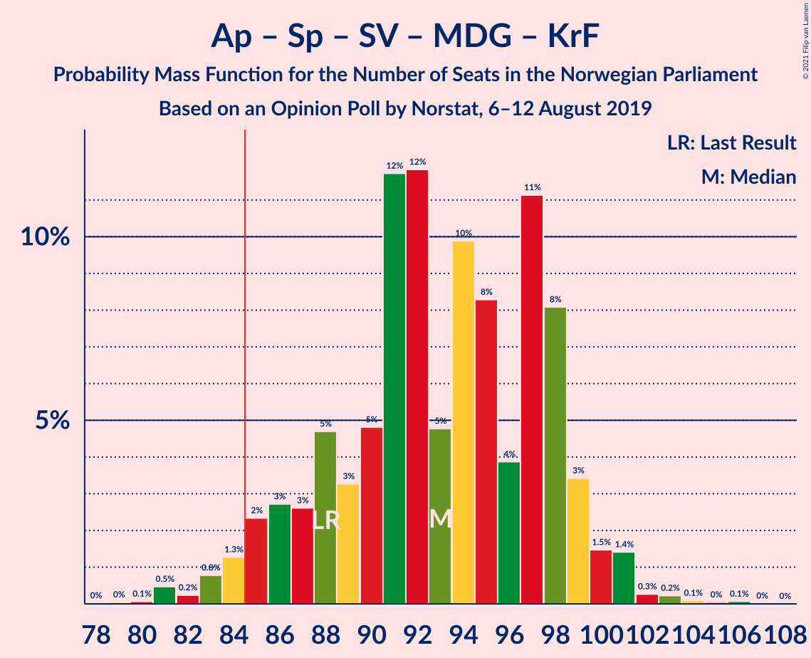

| Number of Seats | Probability | Accumulated | Special Marks |
|:---------------:|:-----------:|:-----------:|:-------------:|
| 79 | 0% | 100% |  |
| 80 | 0.1% | 99.9% |  |
| 81 | 0.5% | 99.9% |  |
| 82 | 0.2% | 99.4% |  |
| 83 | 0.8% | 99.1% |  |
| 84 | 1.3% | 98% |  |
| 85 | 2% | 97% | Majority |
| 86 | 3% | 95% |  |
| 87 | 3% | 92% |  |
| 88 | 5% | 89% | Last Result |
| 89 | 3% | 85% |  |
| 90 | 5% | 81% |  |
| 91 | 12% | 77% |  |
| 92 | 12% | 65% | Median |
| 93 | 5% | 53% |  |
| 94 | 10% | 48% |  |
| 95 | 8% | 38% |  |
| 96 | 4% | 30% |  |
| 97 | 11% | 26% |  |
| 98 | 8% | 15% |  |
| 99 | 3% | 7% |  |
| 100 | 1.5% | 4% |  |
| 101 | 1.4% | 2% |  |
| 102 | 0.3% | 0.7% |  |
| 103 | 0.2% | 0.4% |  |
| 104 | 0.1% | 0.2% |  |
| 105 | 0% | 0.1% |  |
| 106 | 0.1% | 0.1% |  |
| 107 | 0% | 0% |  |

### Arbeiderpartiet – Senterpartiet – Rødt – Sosialistisk Venstreparti

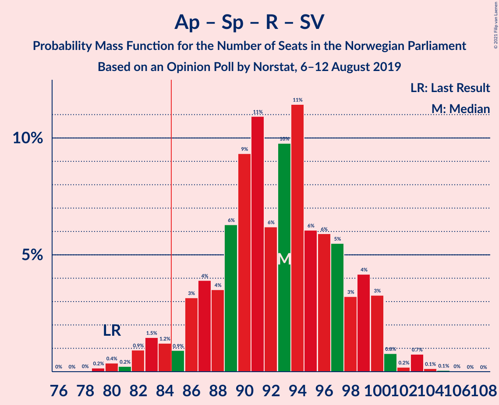

| Number of Seats | Probability | Accumulated | Special Marks |
|:---------------:|:-----------:|:-----------:|:-------------:|
| 77 | 0% | 100% |  |
| 78 | 0% | 99.9% |  |
| 79 | 0.2% | 99.9% |  |
| 80 | 0.4% | 99.8% | Last Result |
| 81 | 0.2% | 99.4% |  |
| 82 | 0.9% | 99.2% |  |
| 83 | 1.5% | 98% |  |
| 84 | 1.2% | 97% |  |
| 85 | 0.9% | 96% | Majority |
| 86 | 3% | 95% |  |
| 87 | 4% | 91% |  |
| 88 | 4% | 88% |  |
| 89 | 6% | 84% |  |
| 90 | 9% | 78% |  |
| 91 | 11% | 68% |  |
| 92 | 6% | 57% | Median |
| 93 | 10% | 51% |  |
| 94 | 11% | 42% |  |
| 95 | 6% | 30% |  |
| 96 | 6% | 24% |  |
| 97 | 5% | 18% |  |
| 98 | 3% | 13% |  |
| 99 | 4% | 9% |  |
| 100 | 3% | 5% |  |
| 101 | 0.8% | 2% |  |
| 102 | 0.2% | 1.2% |  |
| 103 | 0.7% | 1.0% |  |
| 104 | 0.1% | 0.2% |  |
| 105 | 0.1% | 0.1% |  |
| 106 | 0% | 0.1% |  |
| 107 | 0% | 0% |  |

### Høyre – Senterpartiet – Fremskrittspartiet – Kristelig Folkeparti – Venstre

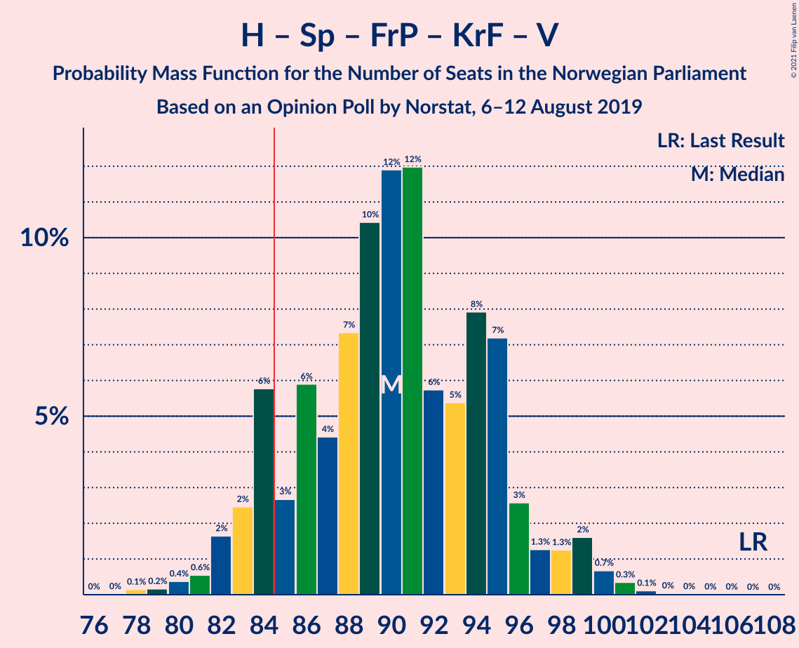

| Number of Seats | Probability | Accumulated | Special Marks |
|:---------------:|:-----------:|:-----------:|:-------------:|
| 78 | 0.1% | 100% |  |
| 79 | 0.2% | 99.8% |  |
| 80 | 0.4% | 99.6% |  |
| 81 | 0.6% | 99.3% |  |
| 82 | 2% | 98.7% |  |
| 83 | 2% | 97% |  |
| 84 | 6% | 95% |  |
| 85 | 3% | 89% | Majority |
| 86 | 6% | 86% |  |
| 87 | 4% | 80% |  |
| 88 | 7% | 76% |  |
| 89 | 10% | 68% | Median |
| 90 | 12% | 58% |  |
| 91 | 12% | 46% |  |
| 92 | 6% | 34% |  |
| 93 | 5% | 28% |  |
| 94 | 8% | 23% |  |
| 95 | 7% | 15% |  |
| 96 | 3% | 8% |  |
| 97 | 1.3% | 5% |  |
| 98 | 1.3% | 4% |  |
| 99 | 2% | 3% |  |
| 100 | 0.7% | 1.2% |  |
| 101 | 0.3% | 0.5% |  |
| 102 | 0.1% | 0.2% |  |
| 103 | 0% | 0.1% |  |
| 104 | 0% | 0% |  |
| 105 | 0% | 0% |  |
| 106 | 0% | 0% |  |
| 107 | 0% | 0% | Last Result |

### Arbeiderpartiet – Senterpartiet – Sosialistisk Venstreparti – Miljøpartiet De Grønne

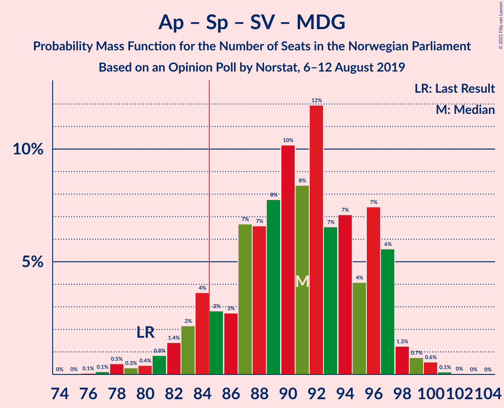

| Number of Seats | Probability | Accumulated | Special Marks |
|:---------------:|:-----------:|:-----------:|:-------------:|
| 76 | 0.1% | 100% |  |
| 77 | 0.1% | 99.9% |  |
| 78 | 0.5% | 99.8% |  |
| 79 | 0.3% | 99.3% |  |
| 80 | 0.4% | 99.0% | Last Result |
| 81 | 0.8% | 98.6% |  |
| 82 | 1.4% | 98% |  |
| 83 | 2% | 96% |  |
| 84 | 4% | 94% |  |
| 85 | 3% | 91% | Majority |
| 86 | 3% | 88% |  |
| 87 | 7% | 85% |  |
| 88 | 7% | 78% |  |
| 89 | 8% | 72% |  |
| 90 | 10% | 64% | Median |
| 91 | 8% | 54% |  |
| 92 | 12% | 45% |  |
| 93 | 7% | 33% |  |
| 94 | 7% | 27% |  |
| 95 | 4% | 20% |  |
| 96 | 7% | 16% |  |
| 97 | 6% | 8% |  |
| 98 | 1.3% | 3% |  |
| 99 | 0.7% | 1.5% |  |
| 100 | 0.6% | 0.7% |  |
| 101 | 0.1% | 0.2% |  |
| 102 | 0% | 0.1% |  |
| 103 | 0% | 0% |  |

### Arbeiderpartiet – Senterpartiet – Miljøpartiet De Grønne – Kristelig Folkeparti

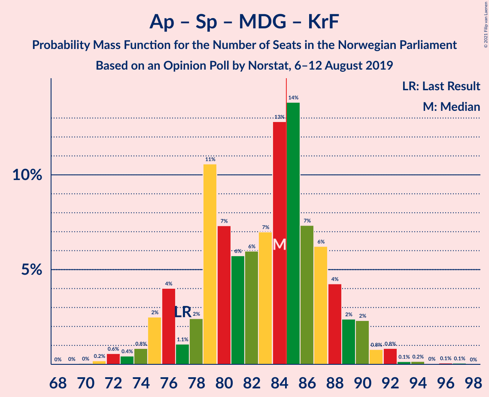

| Number of Seats | Probability | Accumulated | Special Marks |
|:---------------:|:-----------:|:-----------:|:-------------:|
| 69 | 0% | 100% |  |
| 70 | 0% | 99.9% |  |
| 71 | 0.2% | 99.9% |  |
| 72 | 0.6% | 99.7% |  |
| 73 | 0.4% | 99.1% |  |
| 74 | 0.8% | 98.7% |  |
| 75 | 2% | 98% |  |
| 76 | 4% | 95% |  |
| 77 | 1.1% | 91% | Last Result |
| 78 | 2% | 90% |  |
| 79 | 11% | 88% |  |
| 80 | 7% | 77% |  |
| 81 | 6% | 70% |  |
| 82 | 6% | 64% | Median |
| 83 | 7% | 58% |  |
| 84 | 13% | 51% |  |
| 85 | 14% | 38% | Majority |
| 86 | 7% | 25% |  |
| 87 | 6% | 17% |  |
| 88 | 4% | 11% |  |
| 89 | 2% | 7% |  |
| 90 | 2% | 4% |  |
| 91 | 0.8% | 2% |  |
| 92 | 0.8% | 1.3% |  |
| 93 | 0.1% | 0.5% |  |
| 94 | 0.2% | 0.3% |  |
| 95 | 0% | 0.2% |  |
| 96 | 0.1% | 0.1% |  |
| 97 | 0.1% | 0.1% |  |
| 98 | 0% | 0% |  |

### Arbeiderpartiet – Senterpartiet – Sosialistisk Venstreparti

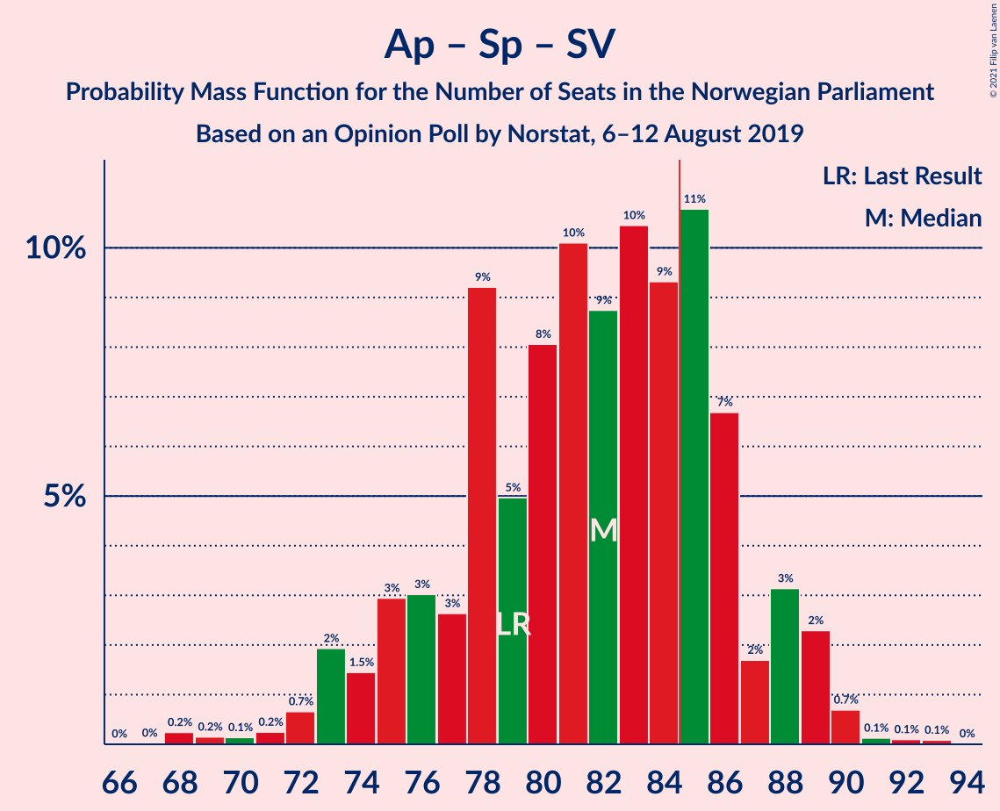

| Number of Seats | Probability | Accumulated | Special Marks |
|:---------------:|:-----------:|:-----------:|:-------------:|
| 68 | 0.2% | 100% |  |
| 69 | 0.2% | 99.7% |  |
| 70 | 0.1% | 99.6% |  |
| 71 | 0.2% | 99.4% |  |
| 72 | 0.7% | 99.2% |  |
| 73 | 2% | 98.5% |  |
| 74 | 1.5% | 97% |  |
| 75 | 3% | 95% |  |
| 76 | 3% | 92% |  |
| 77 | 3% | 89% |  |
| 78 | 9% | 87% |  |
| 79 | 5% | 77% | Last Result |
| 80 | 8% | 72% |  |
| 81 | 10% | 64% | Median |
| 82 | 9% | 54% |  |
| 83 | 10% | 45% |  |
| 84 | 9% | 35% |  |
| 85 | 11% | 26% | Majority |
| 86 | 7% | 15% |  |
| 87 | 2% | 8% |  |
| 88 | 3% | 6% |  |
| 89 | 2% | 3% |  |
| 90 | 0.7% | 1.0% |  |
| 91 | 0.1% | 0.3% |  |
| 92 | 0.1% | 0.2% |  |
| 93 | 0.1% | 0.1% |  |
| 94 | 0% | 0% |  |

### Arbeiderpartiet – Rødt – Sosialistisk Venstreparti – Miljøpartiet De Grønne

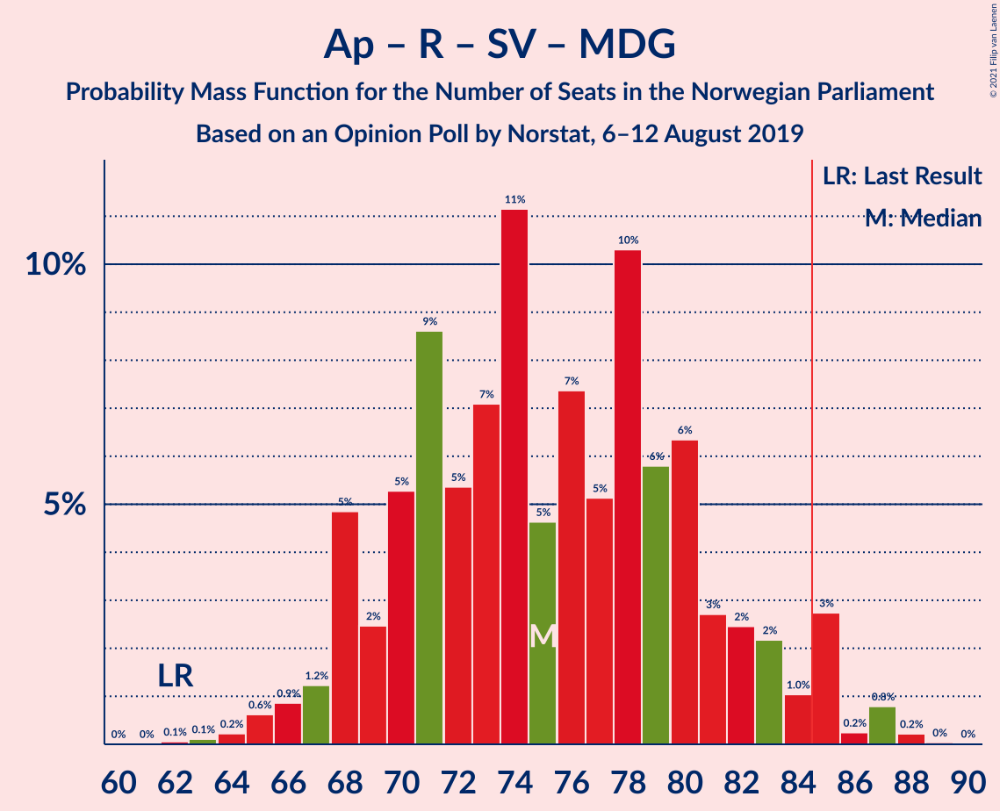

| Number of Seats | Probability | Accumulated | Special Marks |
|:---------------:|:-----------:|:-----------:|:-------------:|
| 62 | 0.1% | 100% | Last Result |
| 63 | 0.1% | 99.9% |  |
| 64 | 0.2% | 99.8% |  |
| 65 | 0.6% | 99.6% |  |
| 66 | 0.9% | 99.0% |  |
| 67 | 1.2% | 98% |  |
| 68 | 5% | 97% |  |
| 69 | 2% | 92% |  |
| 70 | 5% | 90% |  |
| 71 | 9% | 84% |  |
| 72 | 5% | 76% |  |
| 73 | 7% | 70% |  |
| 74 | 11% | 63% |  |
| 75 | 5% | 52% | Median |
| 76 | 7% | 47% |  |
| 77 | 5% | 40% |  |
| 78 | 10% | 35% |  |
| 79 | 6% | 25% |  |
| 80 | 6% | 19% |  |
| 81 | 3% | 12% |  |
| 82 | 2% | 10% |  |
| 83 | 2% | 7% |  |
| 84 | 1.0% | 5% |  |
| 85 | 3% | 4% | Majority |
| 86 | 0.2% | 1.3% |  |
| 87 | 0.8% | 1.1% |  |
| 88 | 0.2% | 0.3% |  |
| 89 | 0% | 0.1% |  |
| 90 | 0% | 0% |  |

### Arbeiderpartiet – Senterpartiet – Kristelig Folkeparti

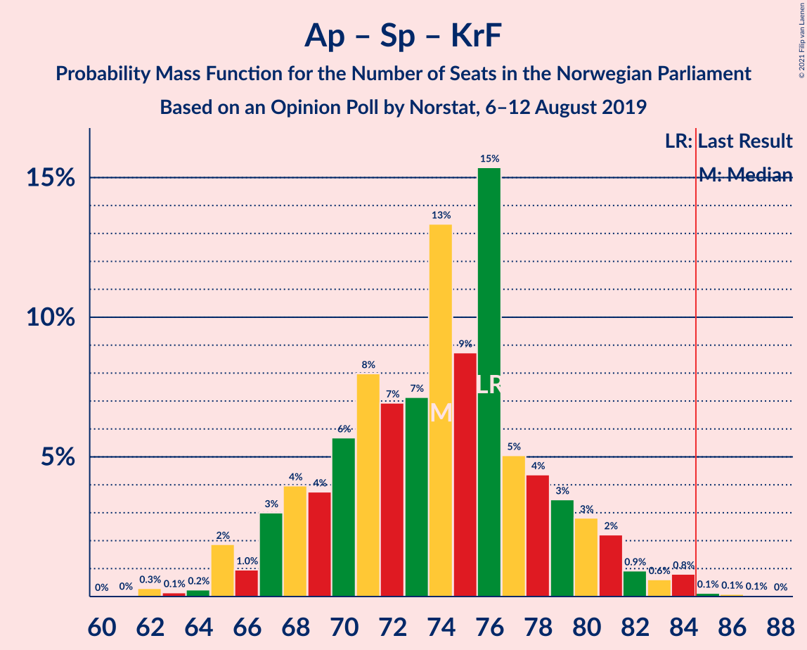

| Number of Seats | Probability | Accumulated | Special Marks |
|:---------------:|:-----------:|:-----------:|:-------------:|
| 61 | 0% | 100% |  |
| 62 | 0.3% | 99.9% |  |
| 63 | 0.1% | 99.6% |  |
| 64 | 0.2% | 99.5% |  |
| 65 | 2% | 99.3% |  |
| 66 | 1.0% | 97% |  |
| 67 | 3% | 96% |  |
| 68 | 4% | 93% |  |
| 69 | 4% | 89% |  |
| 70 | 6% | 86% |  |
| 71 | 8% | 80% |  |
| 72 | 7% | 72% |  |
| 73 | 7% | 65% | Median |
| 74 | 13% | 58% |  |
| 75 | 9% | 45% |  |
| 76 | 15% | 36% | Last Result |
| 77 | 5% | 21% |  |
| 78 | 4% | 15% |  |
| 79 | 3% | 11% |  |
| 80 | 3% | 8% |  |
| 81 | 2% | 5% |  |
| 82 | 0.9% | 3% |  |
| 83 | 0.6% | 2% |  |
| 84 | 0.8% | 1.1% |  |
| 85 | 0.1% | 0.3% | Majority |
| 86 | 0.1% | 0.2% |  |
| 87 | 0.1% | 0.1% |  |
| 88 | 0% | 0% |  |

### Høyre – Fremskrittspartiet – Miljøpartiet De Grønne – Kristelig Folkeparti – Venstre

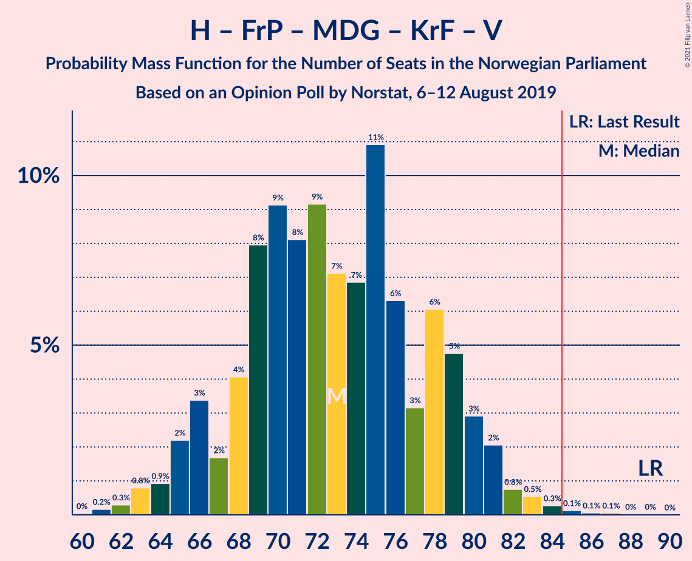

| Number of Seats | Probability | Accumulated | Special Marks |
|:---------------:|:-----------:|:-----------:|:-------------:|
| 60 | 0% | 100% |  |
| 61 | 0.2% | 99.9% |  |
| 62 | 0.3% | 99.8% |  |
| 63 | 0.8% | 99.5% |  |
| 64 | 0.9% | 98.7% |  |
| 65 | 2% | 98% |  |
| 66 | 3% | 96% |  |
| 67 | 2% | 92% |  |
| 68 | 4% | 90% |  |
| 69 | 8% | 86% |  |
| 70 | 9% | 78% |  |
| 71 | 8% | 69% |  |
| 72 | 9% | 61% | Median |
| 73 | 7% | 52% |  |
| 74 | 7% | 45% |  |
| 75 | 11% | 38% |  |
| 76 | 6% | 27% |  |
| 77 | 3% | 21% |  |
| 78 | 6% | 18% |  |
| 79 | 5% | 12% |  |
| 80 | 3% | 7% |  |
| 81 | 2% | 4% |  |
| 82 | 0.8% | 2% |  |
| 83 | 0.5% | 1.1% |  |
| 84 | 0.3% | 0.6% |  |
| 85 | 0.1% | 0.3% | Majority |
| 86 | 0.1% | 0.2% |  |
| 87 | 0.1% | 0.1% |  |
| 88 | 0% | 0% |  |
| 89 | 0% | 0% | Last Result |

### Arbeiderpartiet – Senterpartiet

| Number of Seats | Probability | Accumulated | Special Marks |
|:---------------:|:-----------:|:-----------:|:-------------:|
| 59 | 0.2% | 100% |  |
| 60 | 0.1% | 99.7% |  |
| 61 | 0.3% | 99.6% |  |
| 62 | 0.5% | 99.3% |  |
| 63 | 1.4% | 98.8% |  |
| 64 | 2% | 97% |  |
| 65 | 3% | 96% |  |
| 66 | 5% | 93% |  |
| 67 | 4% | 87% |  |
| 68 | 4% | 83% | Last Result |
| 69 | 9% | 80% |  |
| 70 | 11% | 71% |  |
| 71 | 9% | 60% | Median |
| 72 | 6% | 51% |  |
| 73 | 11% | 45% |  |
| 74 | 14% | 35% |  |
| 75 | 7% | 21% |  |
| 76 | 5% | 14% |  |
| 77 | 3% | 9% |  |
| 78 | 2% | 6% |  |
| 79 | 2% | 3% |  |
| 80 | 0.7% | 1.0% |  |
| 81 | 0.2% | 0.3% |  |
| 82 | 0.1% | 0.1% |  |
| 83 | 0% | 0% |  |

### Høyre – Fremskrittspartiet – Kristelig Folkeparti – Venstre

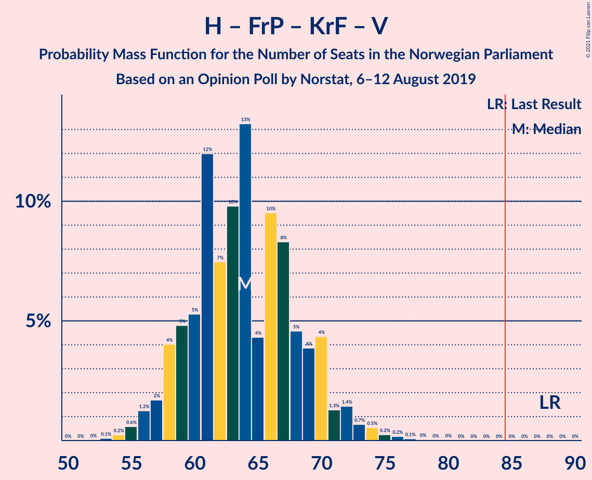

| Number of Seats | Probability | Accumulated | Special Marks |
|:---------------:|:-----------:|:-----------:|:-------------:|
| 53 | 0.1% | 100% |  |
| 54 | 0.2% | 99.9% |  |
| 55 | 0.6% | 99.6% |  |
| 56 | 1.2% | 99.0% |  |
| 57 | 2% | 98% |  |
| 58 | 4% | 96% |  |
| 59 | 5% | 92% |  |
| 60 | 5% | 87% |  |
| 61 | 12% | 82% |  |
| 62 | 7% | 70% |  |
| 63 | 10% | 63% | Median |
| 64 | 13% | 53% |  |
| 65 | 4% | 39% |  |
| 66 | 10% | 35% |  |
| 67 | 8% | 26% |  |
| 68 | 5% | 17% |  |
| 69 | 4% | 13% |  |
| 70 | 4% | 9% |  |
| 71 | 1.3% | 5% |  |
| 72 | 1.4% | 3% |  |
| 73 | 0.7% | 2% |  |
| 74 | 0.5% | 1.1% |  |
| 75 | 0.2% | 0.6% |  |
| 76 | 0.2% | 0.3% |  |
| 77 | 0.1% | 0.2% |  |
| 78 | 0% | 0.1% |  |
| 79 | 0% | 0% |  |
| 80 | 0% | 0% |  |
| 81 | 0% | 0% |  |
| 82 | 0% | 0% |  |
| 83 | 0% | 0% |  |
| 84 | 0% | 0% |  |
| 85 | 0% | 0% | Majority |
| 86 | 0% | 0% |  |
| 87 | 0% | 0% |  |
| 88 | 0% | 0% | Last Result |

### Høyre – Fremskrittspartiet – Venstre

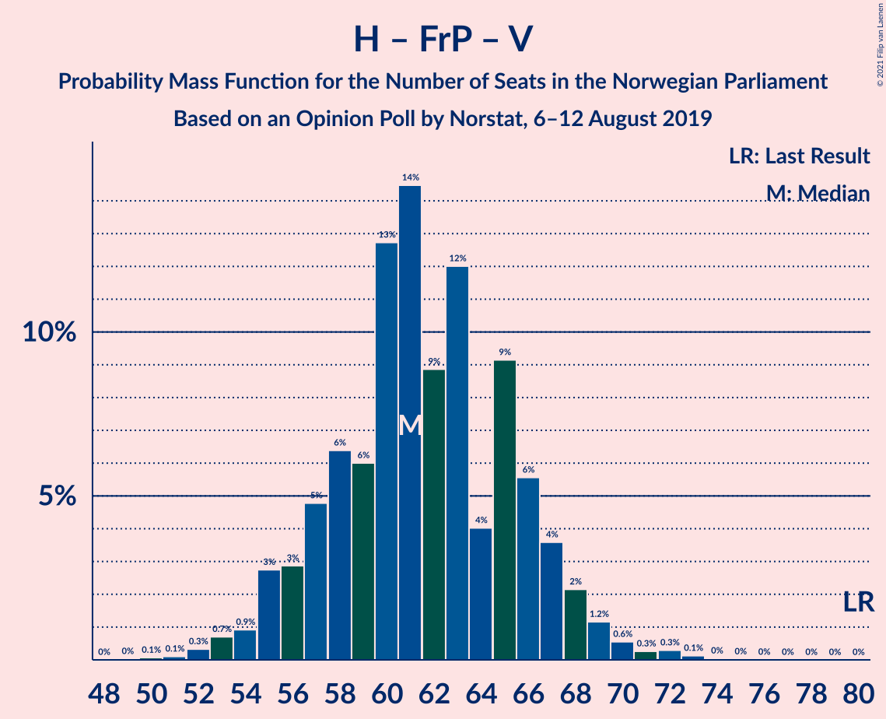

| Number of Seats | Probability | Accumulated | Special Marks |
|:---------------:|:-----------:|:-----------:|:-------------:|
| 50 | 0.1% | 100% |  |
| 51 | 0.1% | 99.9% |  |
| 52 | 0.3% | 99.8% |  |
| 53 | 0.7% | 99.5% |  |
| 54 | 0.9% | 98.8% |  |
| 55 | 3% | 98% |  |
| 56 | 3% | 95% |  |
| 57 | 5% | 92% |  |
| 58 | 6% | 87% |  |
| 59 | 6% | 81% |  |
| 60 | 13% | 75% |  |
| 61 | 14% | 62% | Median |
| 62 | 9% | 48% |  |
| 63 | 12% | 39% |  |
| 64 | 4% | 27% |  |
| 65 | 9% | 23% |  |
| 66 | 6% | 14% |  |
| 67 | 4% | 8% |  |
| 68 | 2% | 5% |  |
| 69 | 1.2% | 2% |  |
| 70 | 0.6% | 1.3% |  |
| 71 | 0.3% | 0.8% |  |
| 72 | 0.3% | 0.5% |  |
| 73 | 0.1% | 0.2% |  |
| 74 | 0% | 0.1% |  |
| 75 | 0% | 0% |  |
| 76 | 0% | 0% |  |
| 77 | 0% | 0% |  |
| 78 | 0% | 0% |  |
| 79 | 0% | 0% |  |
| 80 | 0% | 0% | Last Result |

### Høyre – Fremskrittspartiet

| Number of Seats | Probability | Accumulated | Special Marks |
|:---------------:|:-----------:|:-----------:|:-------------:|
| 48 | 0% | 100% |  |
| 49 | 0.1% | 99.9% |  |
| 50 | 0.2% | 99.8% |  |
| 51 | 0.8% | 99.6% |  |
| 52 | 1.0% | 98.8% |  |
| 53 | 3% | 98% |  |
| 54 | 3% | 95% |  |
| 55 | 6% | 92% |  |
| 56 | 6% | 86% |  |
| 57 | 8% | 81% |  |
| 58 | 10% | 73% |  |
| 59 | 9% | 63% | Median |
| 60 | 14% | 53% |  |
| 61 | 12% | 39% |  |
| 62 | 5% | 28% |  |
| 63 | 8% | 22% |  |
| 64 | 6% | 14% |  |
| 65 | 3% | 8% |  |
| 66 | 3% | 5% |  |
| 67 | 0.8% | 2% |  |
| 68 | 0.5% | 1.2% |  |
| 69 | 0.3% | 0.6% |  |
| 70 | 0.2% | 0.4% |  |
| 71 | 0.1% | 0.2% |  |
| 72 | 0% | 0.1% | Last Result |
| 73 | 0% | 0% |  |

### Arbeiderpartiet – Sosialistisk Venstreparti

| Number of Seats | Probability | Accumulated | Special Marks |
|:---------------:|:-----------:|:-----------:|:-------------:|
| 44 | 0% | 100% |  |
| 45 | 0% | 99.9% |  |
| 46 | 0.3% | 99.9% |  |
| 47 | 0.6% | 99.6% |  |
| 48 | 1.2% | 99.0% |  |
| 49 | 2% | 98% |  |
| 50 | 5% | 96% |  |
| 51 | 5% | 91% |  |
| 52 | 8% | 86% |  |
| 53 | 10% | 78% |  |
| 54 | 9% | 68% |  |
| 55 | 11% | 60% | Median |
| 56 | 17% | 49% |  |
| 57 | 5% | 32% |  |
| 58 | 8% | 27% |  |
| 59 | 3% | 19% |  |
| 60 | 7% | 16% | Last Result |
| 61 | 4% | 9% |  |
| 62 | 2% | 5% |  |
| 63 | 1.1% | 3% |  |
| 64 | 1.1% | 2% |  |
| 65 | 0.4% | 0.6% |  |
| 66 | 0.1% | 0.2% |  |
| 67 | 0.1% | 0.1% |  |
| 68 | 0% | 0% |  |

### Høyre – Kristelig Folkeparti – Venstre

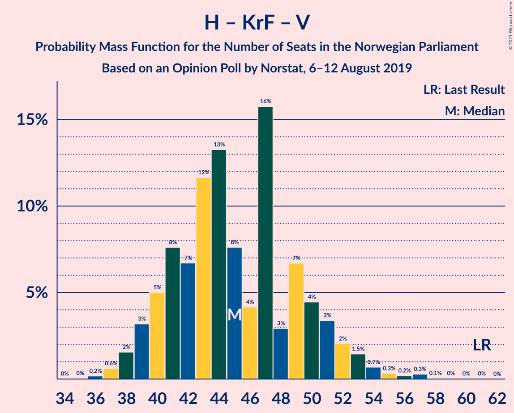

| Number of Seats | Probability | Accumulated | Special Marks |
|:---------------:|:-----------:|:-----------:|:-------------:|
| 35 | 0% | 100% |  |
| 36 | 0.2% | 99.9% |  |
| 37 | 0.6% | 99.8% |  |
| 38 | 2% | 99.1% |  |
| 39 | 3% | 98% |  |
| 40 | 5% | 94% |  |
| 41 | 8% | 89% |  |
| 42 | 7% | 82% |  |
| 43 | 12% | 75% |  |
| 44 | 13% | 63% | Median |
| 45 | 8% | 50% |  |
| 46 | 4% | 43% |  |
| 47 | 16% | 38% |  |
| 48 | 3% | 23% |  |
| 49 | 7% | 20% |  |
| 50 | 4% | 13% |  |
| 51 | 3% | 9% |  |
| 52 | 2% | 5% |  |
| 53 | 1.5% | 3% |  |
| 54 | 0.7% | 2% |  |
| 55 | 0.3% | 0.9% |  |
| 56 | 0.2% | 0.6% |  |
| 57 | 0.3% | 0.4% |  |
| 58 | 0.1% | 0.1% |  |
| 59 | 0% | 0.1% |  |
| 60 | 0% | 0% |  |
| 61 | 0% | 0% | Last Result |

### Senterpartiet – Kristelig Folkeparti – Venstre

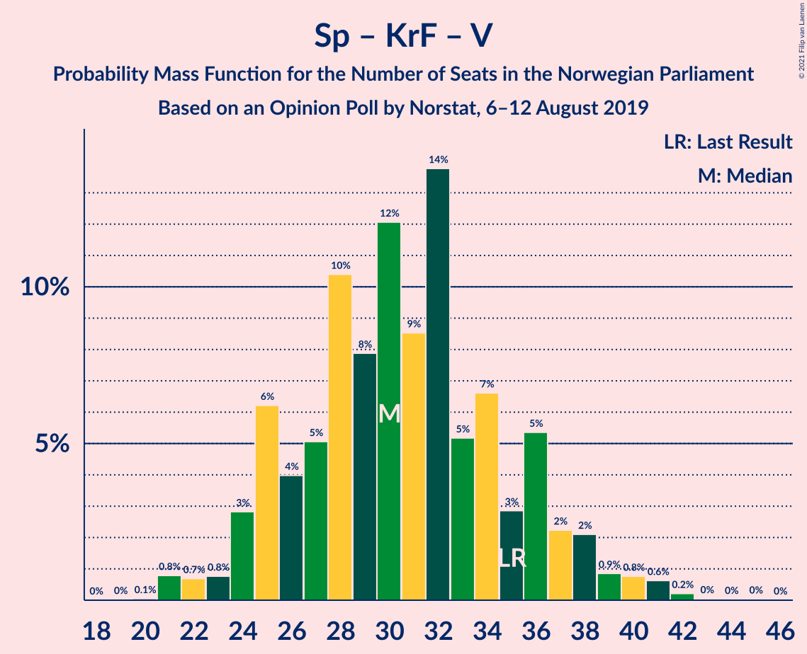

| Number of Seats | Probability | Accumulated | Special Marks |
|:---------------:|:-----------:|:-----------:|:-------------:|
| 20 | 0.1% | 100% |  |
| 21 | 0.8% | 99.9% |  |
| 22 | 0.7% | 99.1% |  |
| 23 | 0.8% | 98% |  |
| 24 | 3% | 98% |  |
| 25 | 6% | 95% |  |
| 26 | 4% | 89% |  |
| 27 | 5% | 85% |  |
| 28 | 10% | 80% |  |
| 29 | 8% | 69% |  |
| 30 | 12% | 61% | Median |
| 31 | 9% | 49% |  |
| 32 | 14% | 41% |  |
| 33 | 5% | 27% |  |
| 34 | 7% | 22% |  |
| 35 | 3% | 15% | Last Result |
| 36 | 5% | 12% |  |
| 37 | 2% | 7% |  |
| 38 | 2% | 5% |  |
| 39 | 0.9% | 3% |  |
| 40 | 0.8% | 2% |  |
| 41 | 0.6% | 1.0% |  |
| 42 | 0.2% | 0.3% |  |
| 43 | 0% | 0.1% |  |
| 44 | 0% | 0.1% |  |
| 45 | 0% | 0% |  |

## Technical Information

### Opinion Poll

+ **Polling firm:** Norstat
+ **Commissioner(s):** —
+ **Fieldwork period:** 6–12 August 2019

### Calculations

+ **Sample size:** 728
+ **Simulations done:** 1,048,576
+ **Error estimate:** 1.48%

