# Opinion Poll by Sentio, 13–18 August 2019

<a href="#voting-intentions">Voting Intentions</a> | <a href="#seats">Seats</a> | <a href="#coalitions">Coalitions</a> | <a href="#technical-information">Technical Information</a>

## Voting Intentions

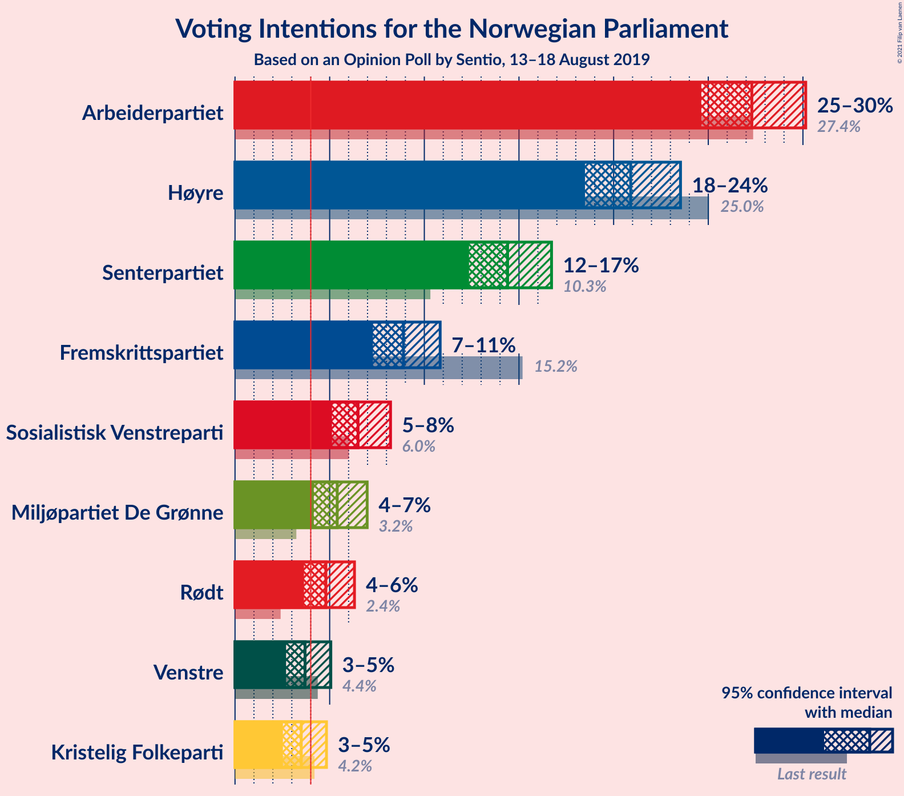

### Confidence Intervals

| Party | Last Result | Poll Result | 80% Confidence Interval | 90% Confidence Interval | 95% Confidence Interval | 99% Confidence Interval |
|:-----:|:-----------:|:-----------:|:-----------------------:|:-----------------------:|:-----------------------:|:-----------------------:|
| Arbeiderpartiet | 27.4% | 27.3% | 25.5–29.2% |25.0–29.7% |24.6–30.1% |23.8–31.1% |
| Høyre | 25.0% | 20.9% | 19.3–22.6% |18.9–23.1% |18.5–23.5% |17.8–24.4% |
| Senterpartiet | 10.3% | 14.4% | 13.1–15.9% |12.7–16.3% |12.4–16.7% |11.7–17.5% |
| Fremskrittspartiet | 15.2% | 8.9% | 7.8–10.2% |7.5–10.5% |7.3–10.8% |6.8–11.5% |
| Sosialistisk Venstreparti | 6.0% | 6.5% | 5.6–7.6% |5.3–7.9% |5.1–8.2% |4.7–8.8% |
| Miljøpartiet De Grønne | 3.2% | 5.4% | 4.6–6.4% |4.3–6.7% |4.2–7.0% |3.8–7.5% |
| Rødt | 2.4% | 4.8% | 4.0–5.8% |3.8–6.1% |3.6–6.3% |3.3–6.8% |
| Venstre | 4.4% | 3.7% | 3.0–4.6% |2.9–4.8% |2.7–5.1% |2.4–5.5% |
| Kristelig Folkeparti | 4.2% | 3.5% | 2.9–4.4% |2.7–4.6% |2.5–4.8% |2.2–5.3% |

*Note:* The poll result column reflects the actual value used in the calculations. Published results may vary slightly, and in addition be rounded to fewer digits.

## Seats

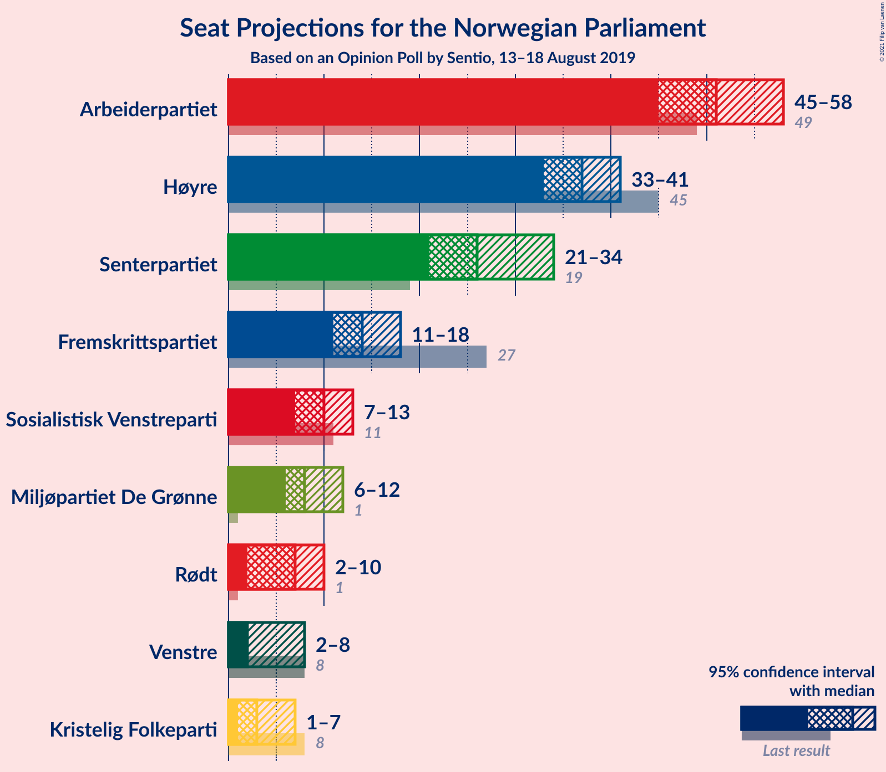

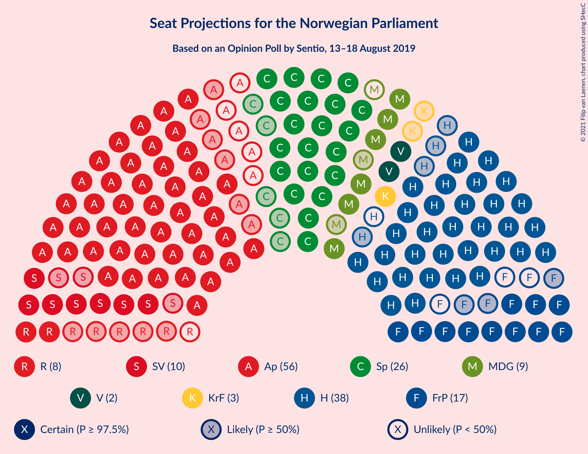

### Confidence Intervals

| Party | Last Result | Median | 80% Confidence Interval | 90% Confidence Interval | 95% Confidence Interval | 99% Confidence Interval |
|:-----:|:-----------:|:------:|:-----------------------:|:-----------------------:|:-----------------------:|:-----------------------:|
| <a href="#arbeiderpartiet">Arbeiderpartiet</a> | 49 | 51 | 46–56 |45–58 |45–58 |44–59 |
| <a href="#høyre">Høyre</a> | 45 | 37 | 34–39 |34–41 |33–41 |32–45 |
| <a href="#senterpartiet">Senterpartiet</a> | 19 | 26 | 23–31 |22–33 |21–34 |20–35 |
| <a href="#fremskrittspartiet">Fremskrittspartiet</a> | 27 | 14 | 12–17 |11–18 |11–18 |9–20 |
| <a href="#sosialistisk-venstreparti">Sosialistisk Venstreparti</a> | 11 | 10 | 8–12 |8–13 |7–13 |7–15 |
| <a href="#miljøpartiet-de-grønne">Miljøpartiet De Grønne</a> | 1 | 8 | 7–10 |6–11 |6–12 |2–12 |
| <a href="#rødt">Rødt</a> | 1 | 7 | 6–9 |2–10 |2–10 |2–11 |
| <a href="#venstre">Venstre</a> | 8 | 2 | 2–7 |2–7 |2–8 |2–9 |
| <a href="#kristelig-folkeparti">Kristelig Folkeparti</a> | 8 | 3 | 1–6 |1–7 |1–7 |1–8 |

### Arbeiderpartiet

*For a full overview of the results for this party, see the [Arbeiderpartiet](party-arbeiderpartiet.html) page.*

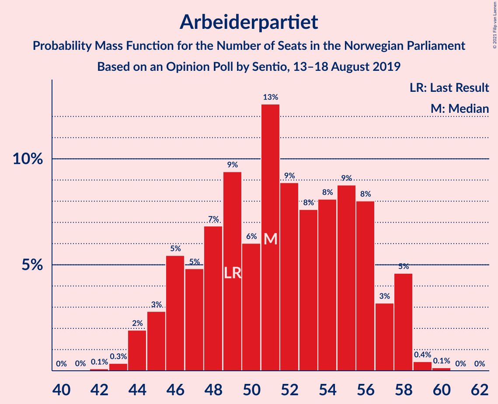

| Number of Seats | Probability | Accumulated | Special Marks |
|:---------------:|:-----------:|:-----------:|:-------------:|
| 42 | 0.1% | 100% |  |
| 43 | 0.3% | 99.9% |  |
| 44 | 2% | 99.5% |  |
| 45 | 3% | 98% |  |
| 46 | 5% | 95% |  |
| 47 | 5% | 89% |  |
| 48 | 7% | 85% |  |
| 49 | 9% | 78% | Last Result |
| 50 | 6% | 68% |  |
| 51 | 13% | 62% | Median |
| 52 | 9% | 50% |  |
| 53 | 8% | 41% |  |
| 54 | 8% | 33% |  |
| 55 | 9% | 25% |  |
| 56 | 8% | 16% |  |
| 57 | 3% | 8% |  |
| 58 | 5% | 5% |  |
| 59 | 0.4% | 0.6% |  |
| 60 | 0.1% | 0.2% |  |
| 61 | 0% | 0% |  |

### Høyre

*For a full overview of the results for this party, see the [Høyre](party-høyre.html) page.*

| Number of Seats | Probability | Accumulated | Special Marks |
|:---------------:|:-----------:|:-----------:|:-------------:|
| 29 | 0% | 100% |  |
| 30 | 0.1% | 99.9% |  |
| 31 | 0.3% | 99.8% |  |
| 32 | 0.8% | 99.5% |  |
| 33 | 3% | 98.7% |  |
| 34 | 6% | 96% |  |
| 35 | 5% | 90% |  |
| 36 | 17% | 85% |  |
| 37 | 24% | 68% | Median |
| 38 | 25% | 44% |  |
| 39 | 9% | 19% |  |
| 40 | 4% | 10% |  |
| 41 | 3% | 6% |  |
| 42 | 0.9% | 2% |  |
| 43 | 0.8% | 2% |  |
| 44 | 0.2% | 0.8% |  |
| 45 | 0.4% | 0.6% | Last Result |
| 46 | 0.1% | 0.2% |  |
| 47 | 0.1% | 0.1% |  |
| 48 | 0% | 0% |  |

### Senterpartiet

*For a full overview of the results for this party, see the [Senterpartiet](party-senterpartiet.html) page.*

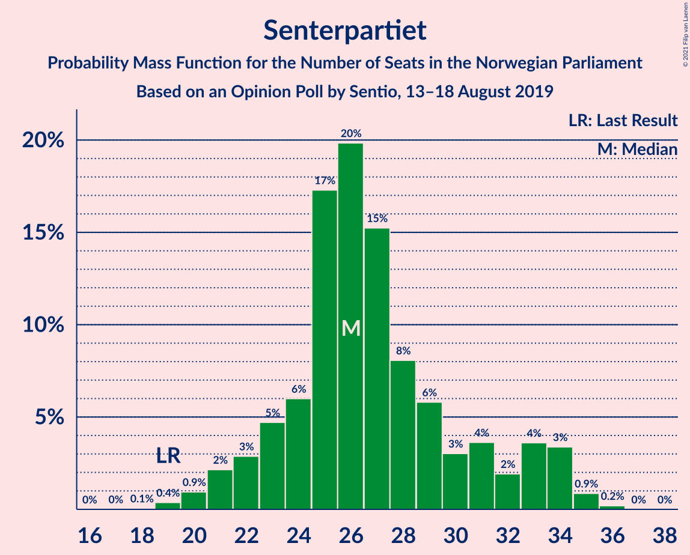

| Number of Seats | Probability | Accumulated | Special Marks |
|:---------------:|:-----------:|:-----------:|:-------------:|
| 18 | 0.1% | 100% |  |
| 19 | 0.4% | 99.9% | Last Result |
| 20 | 0.9% | 99.6% |  |
| 21 | 2% | 98.6% |  |
| 22 | 3% | 96% |  |
| 23 | 5% | 94% |  |
| 24 | 6% | 89% |  |
| 25 | 17% | 83% |  |
| 26 | 20% | 66% | Median |
| 27 | 15% | 46% |  |
| 28 | 8% | 31% |  |
| 29 | 6% | 22% |  |
| 30 | 3% | 17% |  |
| 31 | 4% | 14% |  |
| 32 | 2% | 10% |  |
| 33 | 4% | 8% |  |
| 34 | 3% | 4% |  |
| 35 | 0.9% | 1.1% |  |
| 36 | 0.2% | 0.2% |  |
| 37 | 0% | 0% |  |

### Fremskrittspartiet

*For a full overview of the results for this party, see the [Fremskrittspartiet](party-fremskrittspartiet.html) page.*

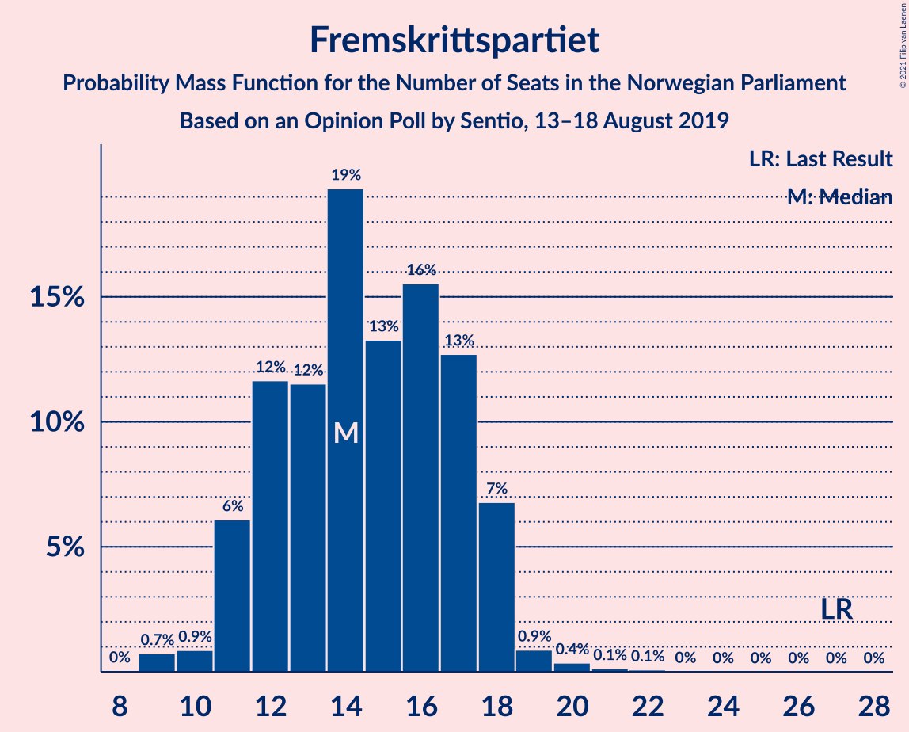

| Number of Seats | Probability | Accumulated | Special Marks |
|:---------------:|:-----------:|:-----------:|:-------------:|
| 9 | 0.7% | 100% |  |
| 10 | 0.9% | 99.2% |  |
| 11 | 6% | 98% |  |
| 12 | 12% | 92% |  |
| 13 | 12% | 81% |  |
| 14 | 19% | 69% | Median |
| 15 | 13% | 50% |  |
| 16 | 16% | 36% |  |
| 17 | 13% | 21% |  |
| 18 | 7% | 8% |  |
| 19 | 0.9% | 1.5% |  |
| 20 | 0.4% | 0.6% |  |
| 21 | 0.1% | 0.2% |  |
| 22 | 0.1% | 0.1% |  |
| 23 | 0% | 0% |  |
| 24 | 0% | 0% |  |
| 25 | 0% | 0% |  |
| 26 | 0% | 0% |  |
| 27 | 0% | 0% | Last Result |

### Sosialistisk Venstreparti

*For a full overview of the results for this party, see the [Sosialistisk Venstreparti](party-sosialistiskvenstreparti.html) page.*

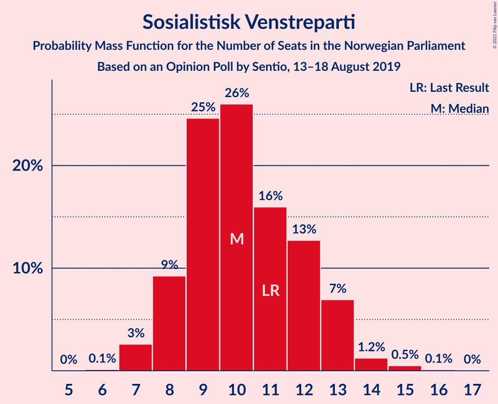

| Number of Seats | Probability | Accumulated | Special Marks |
|:---------------:|:-----------:|:-----------:|:-------------:|
| 6 | 0.1% | 100% |  |
| 7 | 3% | 99.9% |  |
| 8 | 9% | 97% |  |
| 9 | 25% | 88% |  |
| 10 | 26% | 63% | Median |
| 11 | 16% | 37% | Last Result |
| 12 | 13% | 21% |  |
| 13 | 7% | 9% |  |
| 14 | 1.2% | 2% |  |
| 15 | 0.5% | 0.6% |  |
| 16 | 0.1% | 0.1% |  |
| 17 | 0% | 0% |  |

### Miljøpartiet De Grønne

*For a full overview of the results for this party, see the [Miljøpartiet De Grønne](party-miljøpartietdegrønne.html) page.*

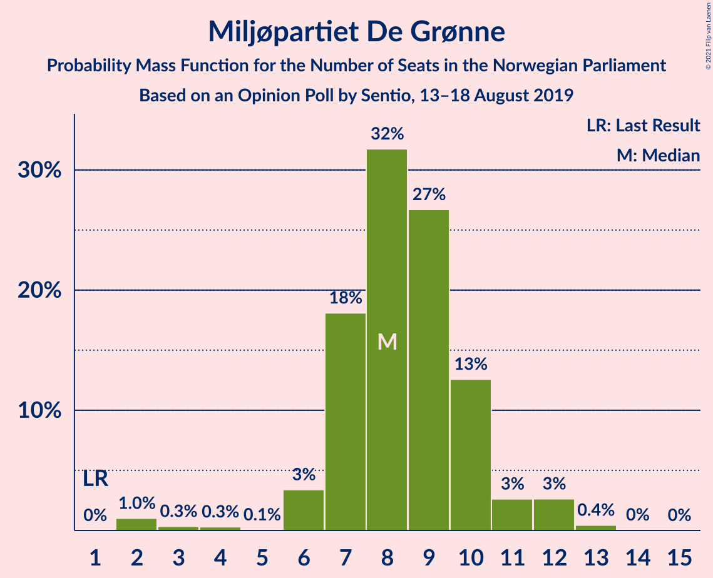

| Number of Seats | Probability | Accumulated | Special Marks |
|:---------------:|:-----------:|:-----------:|:-------------:|
| 1 | 0% | 100% | Last Result |
| 2 | 1.0% | 100% |  |
| 3 | 0.3% | 99.0% |  |
| 4 | 0.3% | 98.6% |  |
| 5 | 0.1% | 98% |  |
| 6 | 3% | 98% |  |
| 7 | 18% | 95% |  |
| 8 | 32% | 77% | Median |
| 9 | 27% | 45% |  |
| 10 | 13% | 18% |  |
| 11 | 3% | 6% |  |
| 12 | 3% | 3% |  |
| 13 | 0.4% | 0.5% |  |
| 14 | 0% | 0.1% |  |
| 15 | 0% | 0% |  |

### Rødt

*For a full overview of the results for this party, see the [Rødt](party-rødt.html) page.*

| Number of Seats | Probability | Accumulated | Special Marks |
|:---------------:|:-----------:|:-----------:|:-------------:|
| 1 | 0% | 100% | Last Result |
| 2 | 7% | 100% |  |
| 3 | 0% | 93% |  |
| 4 | 0% | 93% |  |
| 5 | 0.4% | 93% |  |
| 6 | 15% | 92% |  |
| 7 | 32% | 78% | Median |
| 8 | 25% | 46% |  |
| 9 | 13% | 21% |  |
| 10 | 6% | 7% |  |
| 11 | 0.8% | 1.0% |  |
| 12 | 0.2% | 0.2% |  |
| 13 | 0.1% | 0.1% |  |
| 14 | 0% | 0% |  |

### Venstre

*For a full overview of the results for this party, see the [Venstre](party-venstre.html) page.*

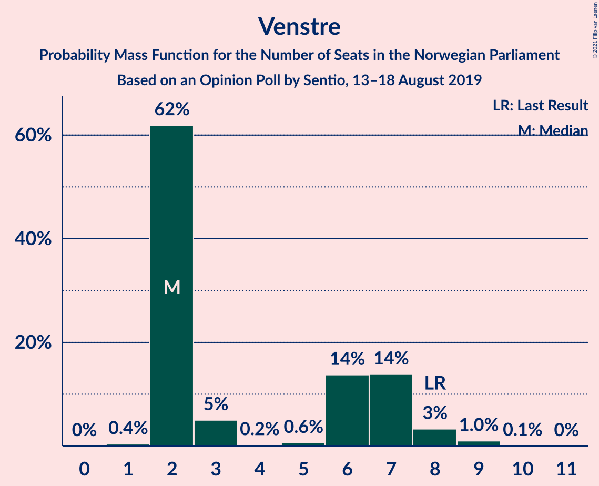

| Number of Seats | Probability | Accumulated | Special Marks |
|:---------------:|:-----------:|:-----------:|:-------------:|
| 1 | 0.4% | 100% |  |
| 2 | 62% | 99.6% | Median |
| 3 | 5% | 38% |  |
| 4 | 0.2% | 33% |  |
| 5 | 0.6% | 33% |  |
| 6 | 14% | 32% |  |
| 7 | 14% | 18% |  |
| 8 | 3% | 4% | Last Result |
| 9 | 1.0% | 1.0% |  |
| 10 | 0.1% | 0.1% |  |
| 11 | 0% | 0% |  |

### Kristelig Folkeparti

*For a full overview of the results for this party, see the [Kristelig Folkeparti](party-kristeligfolkeparti.html) page.*

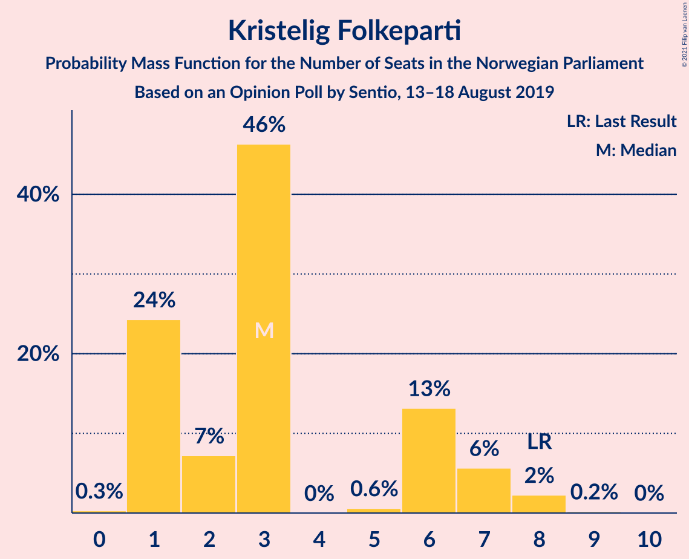

| Number of Seats | Probability | Accumulated | Special Marks |
|:---------------:|:-----------:|:-----------:|:-------------:|
| 0 | 0.3% | 100% |  |
| 1 | 24% | 99.7% |  |
| 2 | 7% | 75% |  |
| 3 | 46% | 68% | Median |
| 4 | 0% | 22% |  |
| 5 | 0.6% | 22% |  |
| 6 | 13% | 21% |  |
| 7 | 6% | 8% |  |
| 8 | 2% | 2% | Last Result |
| 9 | 0.2% | 0.2% |  |
| 10 | 0% | 0% |  |

## Coalitions

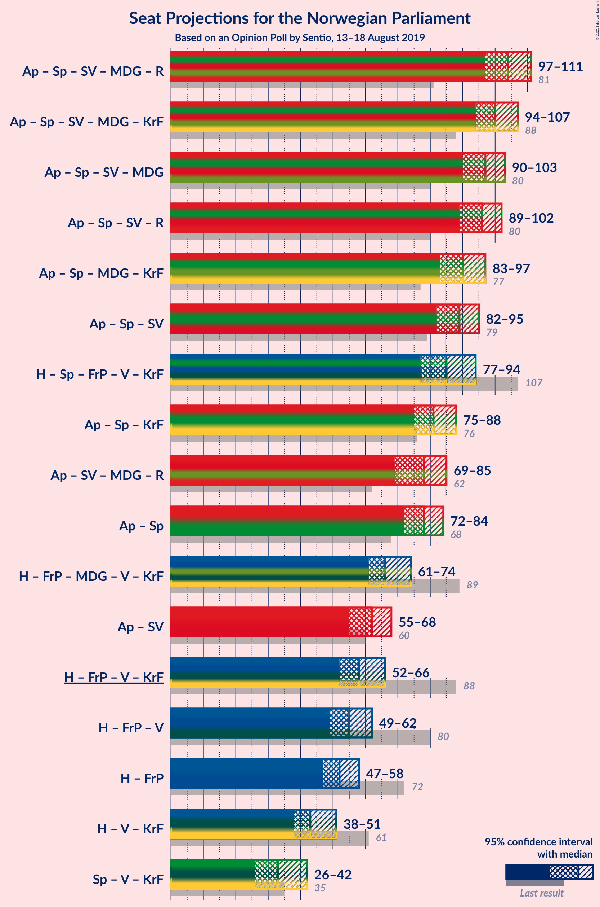

### Confidence Intervals

| Coalition | Last Result | Median | Majority? | 80% Confidence Interval | 90% Confidence Interval | 95% Confidence Interval | 99% Confidence Interval |
|:---------:|:-----------:|:------:|:---------:|:-----------------------:|:-----------------------:|:-----------------------:|:-----------------------:|
| Arbeiderpartiet – Senterpartiet – Sosialistisk Venstreparti – Miljøpartiet De Grønne – Rødt | 81 | 104 | 100% | 99–109 | 98–110 | 97–111 | 94–114 |
| Arbeiderpartiet – Senterpartiet – Sosialistisk Venstreparti – Miljøpartiet De Grønne – Kristelig Folkeparti | 88 | 100 | 100% | 96–104 | 94–106 | 94–107 | 91–110 |
| Arbeiderpartiet – Senterpartiet – Sosialistisk Venstreparti – Miljøpartiet De Grønne | 80 | 97 | 99.9% | 92–101 | 91–102 | 90–103 | 88–107 |
| Arbeiderpartiet – Senterpartiet – Sosialistisk Venstreparti – Rødt | 80 | 96 | 99.7% | 91–100 | 90–101 | 89–102 | 86–105 |
| Arbeiderpartiet – Senterpartiet – Miljøpartiet De Grønne – Kristelig Folkeparti | 77 | 90 | 93% | 86–94 | 84–96 | 83–97 | 80–99 |
| Arbeiderpartiet – Senterpartiet – Sosialistisk Venstreparti | 79 | 89 | 90% | 84–92 | 83–93 | 82–95 | 80–97 |
| Høyre – Senterpartiet – Fremskrittspartiet – Venstre – Kristelig Folkeparti | 107 | 85 | 51% | 80–91 | 79–93 | 77–94 | 76–97 |
| Arbeiderpartiet – Senterpartiet – Kristelig Folkeparti | 76 | 81 | 18% | 77–86 | 77–87 | 75–88 | 72–90 |
| Arbeiderpartiet – Sosialistisk Venstreparti – Miljøpartiet De Grønne – Rødt | 62 | 78 | 4% | 72–83 | 70–84 | 69–85 | 66–88 |
| Arbeiderpartiet – Senterpartiet | 68 | 78 | 2% | 74–82 | 74–83 | 72–84 | 69–86 |
| Høyre – Fremskrittspartiet – Miljøpartiet De Grønne – Venstre – Kristelig Folkeparti | 89 | 66 | 0% | 62–72 | 61–73 | 61–74 | 59–78 |
| Arbeiderpartiet – Sosialistisk Venstreparti | 60 | 62 | 0% | 57–66 | 56–68 | 55–68 | 52–70 |
| Høyre – Fremskrittspartiet – Venstre – Kristelig Folkeparti | 88 | 58 | 0% | 54–63 | 53–65 | 52–66 | 51–69 |
| Høyre – Fremskrittspartiet – Venstre | 80 | 55 | 0% | 51–60 | 50–61 | 49–62 | 48–65 |
| Høyre – Fremskrittspartiet | 72 | 52 | 0% | 48–55 | 47–56 | 47–58 | 45–60 |
| Høyre – Venstre – Kristelig Folkeparti | 61 | 43 | 0% | 40–48 | 39–49 | 38–51 | 37–54 |
| Senterpartiet – Venstre – Kristelig Folkeparti | 35 | 33 | 0% | 28–39 | 27–41 | 26–42 | 25–44 |

### Arbeiderpartiet – Senterpartiet – Sosialistisk Venstreparti – Miljøpartiet De Grønne – Rødt

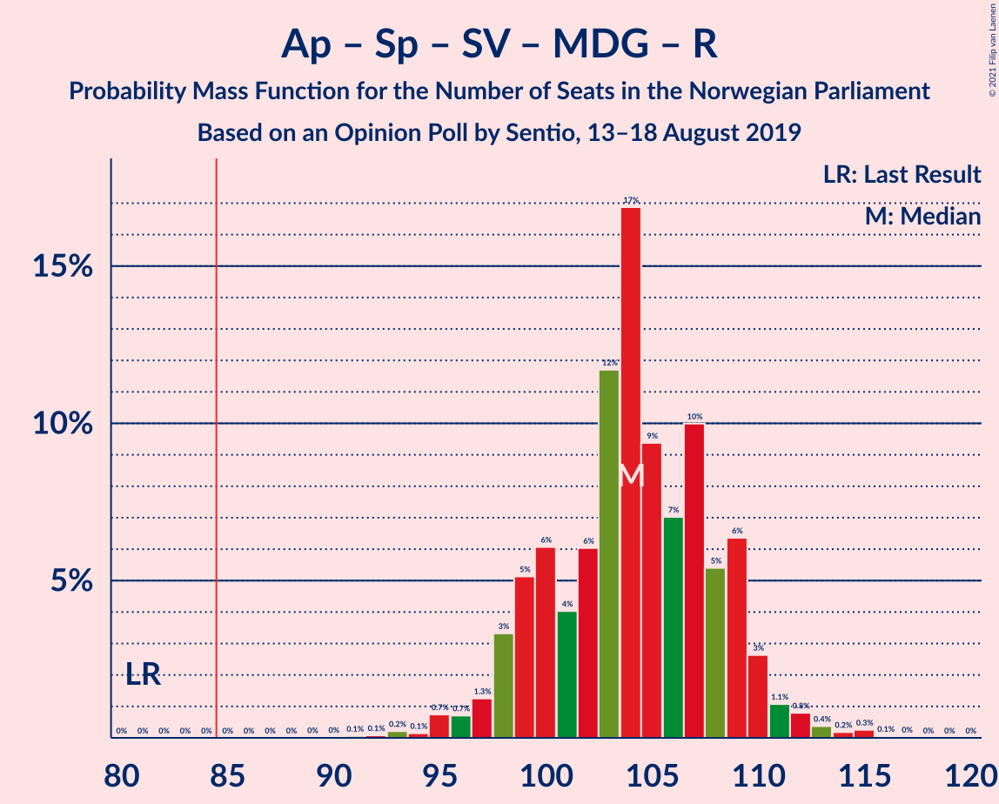

| Number of Seats | Probability | Accumulated | Special Marks |
|:---------------:|:-----------:|:-----------:|:-------------:|
| 81 | 0% | 100% | Last Result |
| 82 | 0% | 100% |  |
| 83 | 0% | 100% |  |
| 84 | 0% | 100% |  |
| 85 | 0% | 100% | Majority |
| 86 | 0% | 100% |  |
| 87 | 0% | 100% |  |
| 88 | 0% | 100% |  |
| 89 | 0% | 100% |  |
| 90 | 0% | 100% |  |
| 91 | 0.1% | 100% |  |
| 92 | 0.1% | 99.9% |  |
| 93 | 0.2% | 99.8% |  |
| 94 | 0.1% | 99.6% |  |
| 95 | 0.7% | 99.5% |  |
| 96 | 0.7% | 98.7% |  |
| 97 | 1.3% | 98% |  |
| 98 | 3% | 97% |  |
| 99 | 5% | 93% |  |
| 100 | 6% | 88% |  |
| 101 | 4% | 82% |  |
| 102 | 6% | 78% | Median |
| 103 | 12% | 72% |  |
| 104 | 17% | 60% |  |
| 105 | 9% | 44% |  |
| 106 | 7% | 34% |  |
| 107 | 10% | 27% |  |
| 108 | 5% | 17% |  |
| 109 | 6% | 12% |  |
| 110 | 3% | 5% |  |
| 111 | 1.1% | 3% |  |
| 112 | 0.8% | 2% |  |
| 113 | 0.4% | 0.9% |  |
| 114 | 0.2% | 0.5% |  |
| 115 | 0.3% | 0.3% |  |
| 116 | 0.1% | 0.1% |  |
| 117 | 0% | 0% |  |

### Arbeiderpartiet – Senterpartiet – Sosialistisk Venstreparti – Miljøpartiet De Grønne – Kristelig Folkeparti

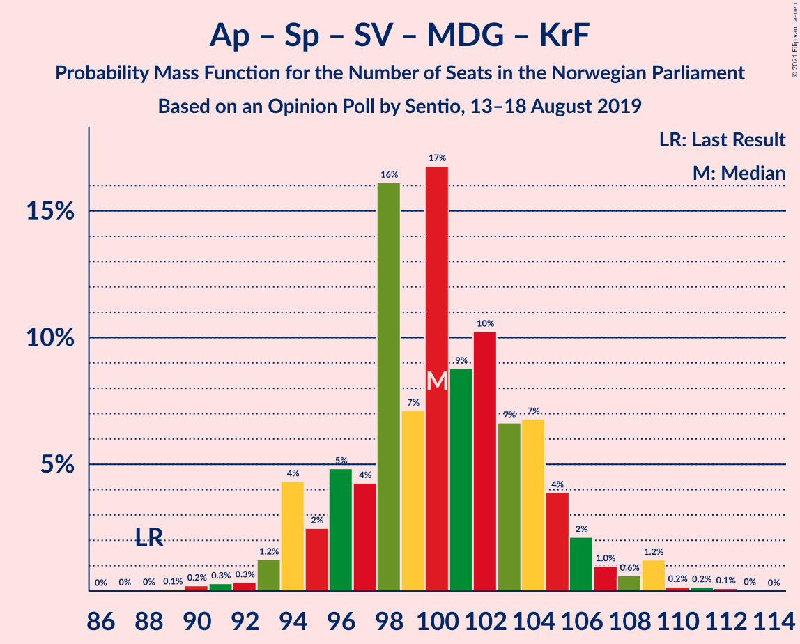

| Number of Seats | Probability | Accumulated | Special Marks |
|:---------------:|:-----------:|:-----------:|:-------------:|
| 87 | 0% | 100% |  |
| 88 | 0% | 99.9% | Last Result |
| 89 | 0.1% | 99.9% |  |
| 90 | 0.2% | 99.8% |  |
| 91 | 0.3% | 99.6% |  |
| 92 | 0.3% | 99.3% |  |
| 93 | 1.2% | 99.0% |  |
| 94 | 4% | 98% |  |
| 95 | 2% | 93% |  |
| 96 | 5% | 91% |  |
| 97 | 4% | 86% |  |
| 98 | 16% | 82% | Median |
| 99 | 7% | 66% |  |
| 100 | 17% | 59% |  |
| 101 | 9% | 42% |  |
| 102 | 10% | 33% |  |
| 103 | 7% | 23% |  |
| 104 | 7% | 16% |  |
| 105 | 4% | 9% |  |
| 106 | 2% | 5% |  |
| 107 | 1.0% | 3% |  |
| 108 | 0.6% | 2% |  |
| 109 | 1.2% | 2% |  |
| 110 | 0.2% | 0.5% |  |
| 111 | 0.2% | 0.3% |  |
| 112 | 0.1% | 0.2% |  |
| 113 | 0% | 0.1% |  |
| 114 | 0% | 0% |  |

### Arbeiderpartiet – Senterpartiet – Sosialistisk Venstreparti – Miljøpartiet De Grønne

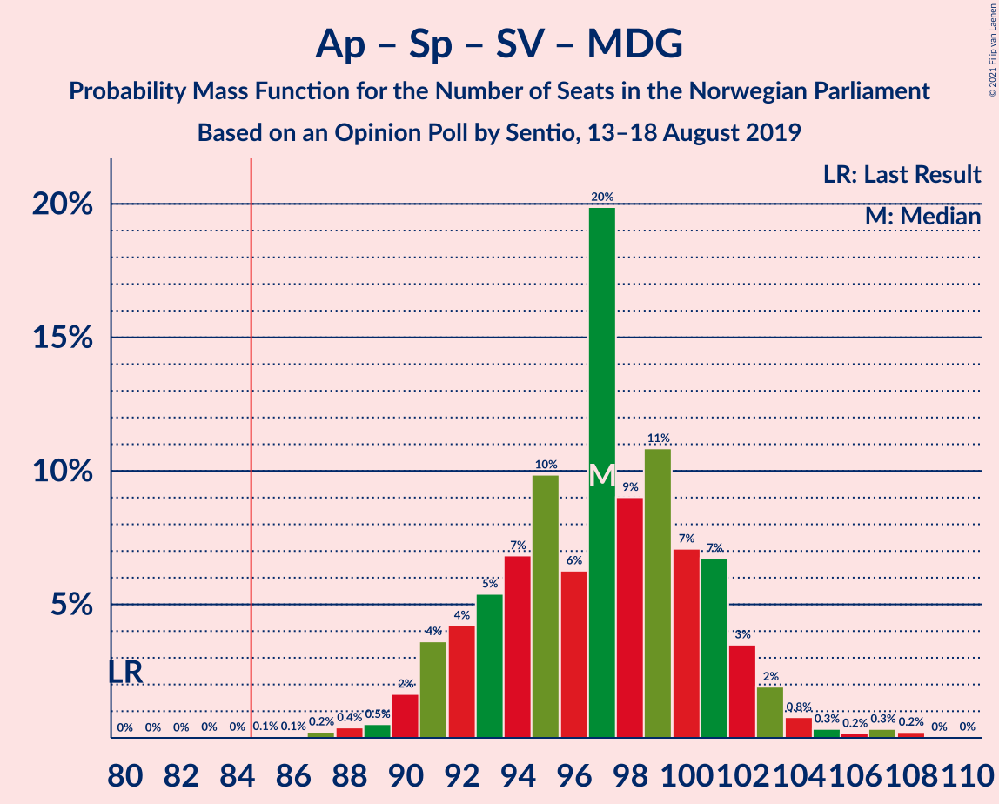

| Number of Seats | Probability | Accumulated | Special Marks |
|:---------------:|:-----------:|:-----------:|:-------------:|
| 80 | 0% | 100% | Last Result |
| 81 | 0% | 100% |  |
| 82 | 0% | 100% |  |
| 83 | 0% | 100% |  |
| 84 | 0% | 100% |  |
| 85 | 0.1% | 99.9% | Majority |
| 86 | 0.1% | 99.9% |  |
| 87 | 0.2% | 99.8% |  |
| 88 | 0.4% | 99.6% |  |
| 89 | 0.5% | 99.2% |  |
| 90 | 2% | 98.7% |  |
| 91 | 4% | 97% |  |
| 92 | 4% | 93% |  |
| 93 | 5% | 89% |  |
| 94 | 7% | 84% |  |
| 95 | 10% | 77% | Median |
| 96 | 6% | 67% |  |
| 97 | 20% | 61% |  |
| 98 | 9% | 41% |  |
| 99 | 11% | 32% |  |
| 100 | 7% | 21% |  |
| 101 | 7% | 14% |  |
| 102 | 3% | 7% |  |
| 103 | 2% | 4% |  |
| 104 | 0.8% | 2% |  |
| 105 | 0.3% | 1.1% |  |
| 106 | 0.2% | 0.8% |  |
| 107 | 0.3% | 0.6% |  |
| 108 | 0.2% | 0.3% |  |
| 109 | 0% | 0.1% |  |
| 110 | 0% | 0% |  |

### Arbeiderpartiet – Senterpartiet – Sosialistisk Venstreparti – Rødt

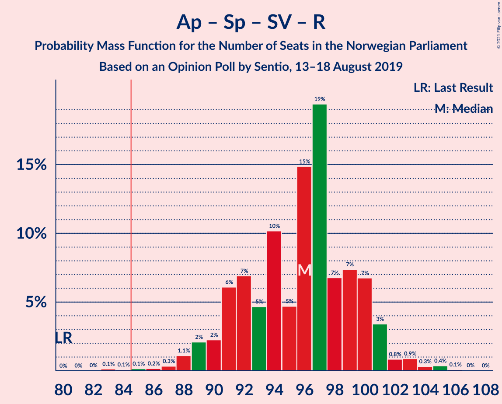

| Number of Seats | Probability | Accumulated | Special Marks |
|:---------------:|:-----------:|:-----------:|:-------------:|
| 80 | 0% | 100% | Last Result |
| 81 | 0% | 100% |  |
| 82 | 0% | 100% |  |
| 83 | 0.1% | 100% |  |
| 84 | 0.1% | 99.8% |  |
| 85 | 0.1% | 99.7% | Majority |
| 86 | 0.2% | 99.6% |  |
| 87 | 0.3% | 99.4% |  |
| 88 | 1.1% | 99.1% |  |
| 89 | 2% | 98% |  |
| 90 | 2% | 96% |  |
| 91 | 6% | 94% |  |
| 92 | 7% | 88% |  |
| 93 | 5% | 81% |  |
| 94 | 10% | 76% | Median |
| 95 | 5% | 66% |  |
| 96 | 15% | 61% |  |
| 97 | 19% | 46% |  |
| 98 | 7% | 27% |  |
| 99 | 7% | 20% |  |
| 100 | 7% | 13% |  |
| 101 | 3% | 6% |  |
| 102 | 0.8% | 3% |  |
| 103 | 0.9% | 2% |  |
| 104 | 0.3% | 0.8% |  |
| 105 | 0.4% | 0.5% |  |
| 106 | 0.1% | 0.1% |  |
| 107 | 0% | 0.1% |  |
| 108 | 0% | 0% |  |

### Arbeiderpartiet – Senterpartiet – Miljøpartiet De Grønne – Kristelig Folkeparti

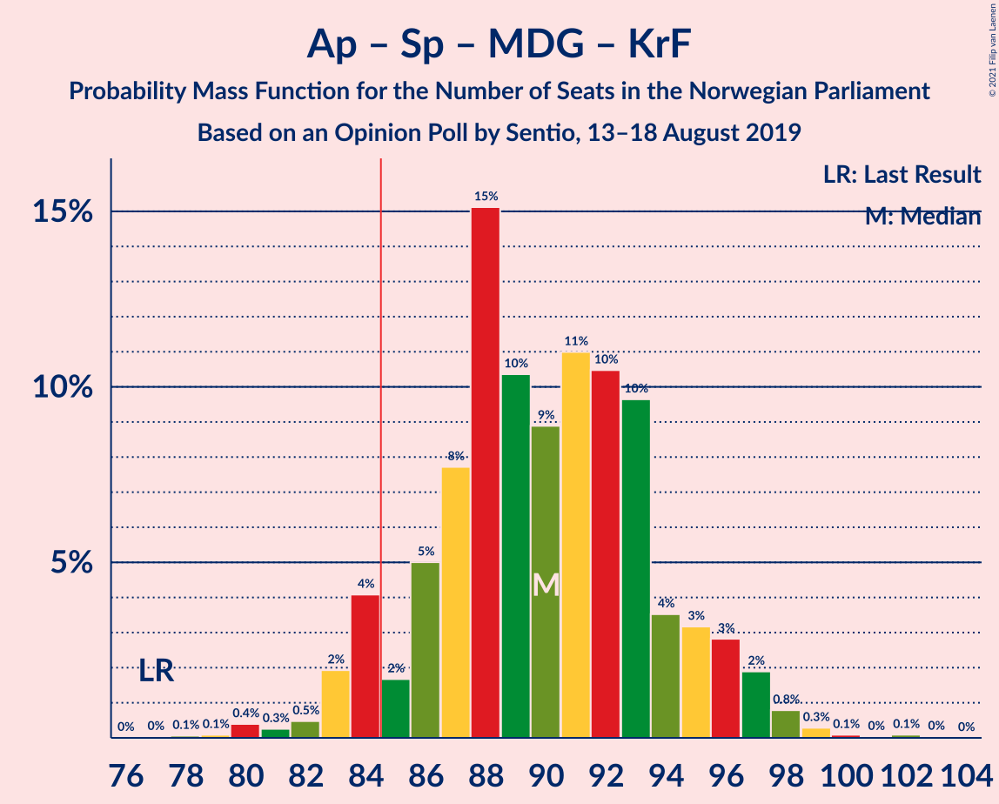

| Number of Seats | Probability | Accumulated | Special Marks |
|:---------------:|:-----------:|:-----------:|:-------------:|
| 77 | 0% | 100% | Last Result |
| 78 | 0.1% | 99.9% |  |
| 79 | 0.1% | 99.9% |  |
| 80 | 0.4% | 99.8% |  |
| 81 | 0.3% | 99.4% |  |
| 82 | 0.5% | 99.1% |  |
| 83 | 2% | 98.7% |  |
| 84 | 4% | 97% |  |
| 85 | 2% | 93% | Majority |
| 86 | 5% | 91% |  |
| 87 | 8% | 86% |  |
| 88 | 15% | 78% | Median |
| 89 | 10% | 63% |  |
| 90 | 9% | 53% |  |
| 91 | 11% | 44% |  |
| 92 | 10% | 33% |  |
| 93 | 10% | 22% |  |
| 94 | 4% | 13% |  |
| 95 | 3% | 9% |  |
| 96 | 3% | 6% |  |
| 97 | 2% | 3% |  |
| 98 | 0.8% | 1.3% |  |
| 99 | 0.3% | 0.5% |  |
| 100 | 0.1% | 0.3% |  |
| 101 | 0% | 0.2% |  |
| 102 | 0.1% | 0.1% |  |
| 103 | 0% | 0% |  |

### Arbeiderpartiet – Senterpartiet – Sosialistisk Venstreparti

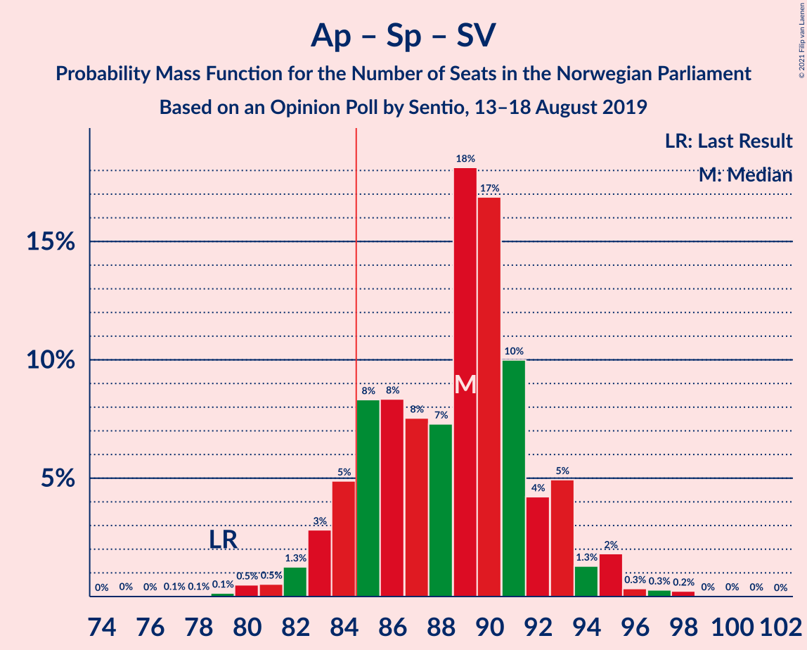

| Number of Seats | Probability | Accumulated | Special Marks |
|:---------------:|:-----------:|:-----------:|:-------------:|
| 75 | 0% | 100% |  |
| 76 | 0% | 99.9% |  |
| 77 | 0.1% | 99.9% |  |
| 78 | 0.1% | 99.9% |  |
| 79 | 0.1% | 99.8% | Last Result |
| 80 | 0.5% | 99.7% |  |
| 81 | 0.5% | 99.2% |  |
| 82 | 1.3% | 98.6% |  |
| 83 | 3% | 97% |  |
| 84 | 5% | 95% |  |
| 85 | 8% | 90% | Majority |
| 86 | 8% | 81% |  |
| 87 | 8% | 73% | Median |
| 88 | 7% | 65% |  |
| 89 | 18% | 58% |  |
| 90 | 17% | 40% |  |
| 91 | 10% | 23% |  |
| 92 | 4% | 13% |  |
| 93 | 5% | 9% |  |
| 94 | 1.3% | 4% |  |
| 95 | 2% | 3% |  |
| 96 | 0.3% | 0.9% |  |
| 97 | 0.3% | 0.6% |  |
| 98 | 0.2% | 0.3% |  |
| 99 | 0% | 0.1% |  |
| 100 | 0% | 0.1% |  |
| 101 | 0% | 0% |  |

### Høyre – Senterpartiet – Fremskrittspartiet – Venstre – Kristelig Folkeparti

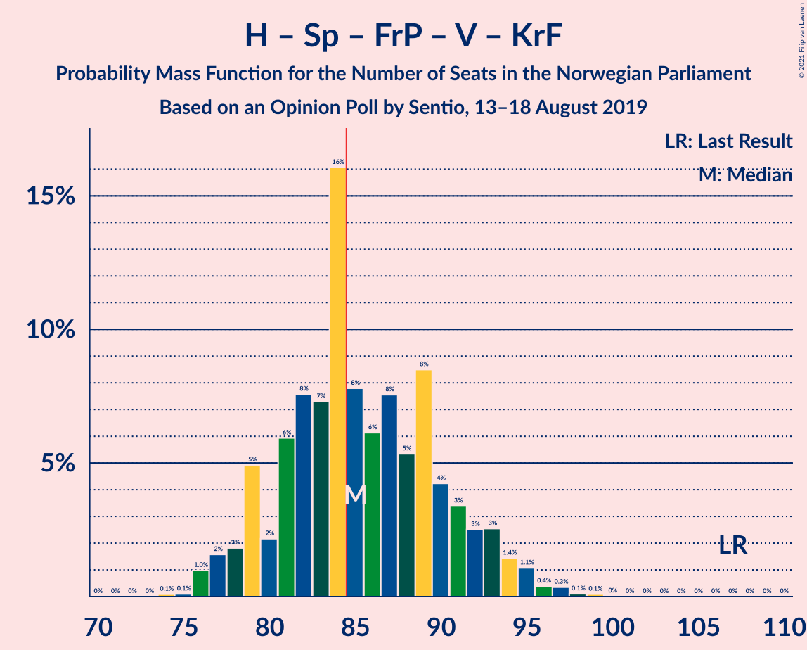

| Number of Seats | Probability | Accumulated | Special Marks |
|:---------------:|:-----------:|:-----------:|:-------------:|
| 74 | 0.1% | 100% |  |
| 75 | 0.1% | 99.9% |  |
| 76 | 1.0% | 99.8% |  |
| 77 | 2% | 98.8% |  |
| 78 | 2% | 97% |  |
| 79 | 5% | 95% |  |
| 80 | 2% | 90% |  |
| 81 | 6% | 88% |  |
| 82 | 8% | 82% | Median |
| 83 | 7% | 75% |  |
| 84 | 16% | 68% |  |
| 85 | 8% | 51% | Majority |
| 86 | 6% | 44% |  |
| 87 | 8% | 38% |  |
| 88 | 5% | 30% |  |
| 89 | 8% | 25% |  |
| 90 | 4% | 16% |  |
| 91 | 3% | 12% |  |
| 92 | 3% | 9% |  |
| 93 | 3% | 6% |  |
| 94 | 1.4% | 3% |  |
| 95 | 1.1% | 2% |  |
| 96 | 0.4% | 1.0% |  |
| 97 | 0.3% | 0.6% |  |
| 98 | 0.1% | 0.2% |  |
| 99 | 0.1% | 0.1% |  |
| 100 | 0% | 0% |  |
| 101 | 0% | 0% |  |
| 102 | 0% | 0% |  |
| 103 | 0% | 0% |  |
| 104 | 0% | 0% |  |
| 105 | 0% | 0% |  |
| 106 | 0% | 0% |  |
| 107 | 0% | 0% | Last Result |

### Arbeiderpartiet – Senterpartiet – Kristelig Folkeparti

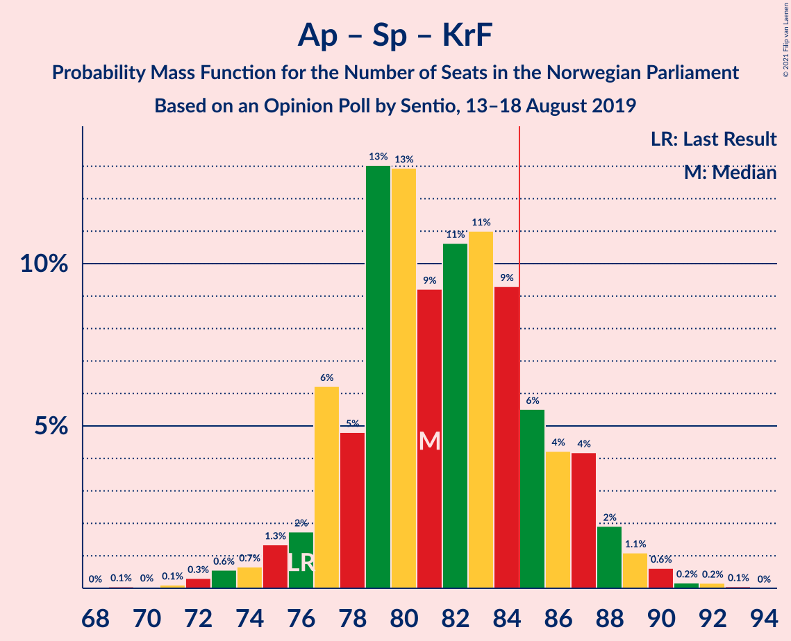

| Number of Seats | Probability | Accumulated | Special Marks |
|:---------------:|:-----------:|:-----------:|:-------------:|
| 69 | 0.1% | 100% |  |
| 70 | 0% | 99.9% |  |
| 71 | 0.1% | 99.9% |  |
| 72 | 0.3% | 99.8% |  |
| 73 | 0.6% | 99.5% |  |
| 74 | 0.7% | 98.9% |  |
| 75 | 1.3% | 98% |  |
| 76 | 2% | 97% | Last Result |
| 77 | 6% | 95% |  |
| 78 | 5% | 89% |  |
| 79 | 13% | 84% |  |
| 80 | 13% | 71% | Median |
| 81 | 9% | 58% |  |
| 82 | 11% | 49% |  |
| 83 | 11% | 38% |  |
| 84 | 9% | 27% |  |
| 85 | 6% | 18% | Majority |
| 86 | 4% | 12% |  |
| 87 | 4% | 8% |  |
| 88 | 2% | 4% |  |
| 89 | 1.1% | 2% |  |
| 90 | 0.6% | 1.0% |  |
| 91 | 0.2% | 0.4% |  |
| 92 | 0.2% | 0.2% |  |
| 93 | 0.1% | 0.1% |  |
| 94 | 0% | 0% |  |

### Arbeiderpartiet – Sosialistisk Venstreparti – Miljøpartiet De Grønne – Rødt

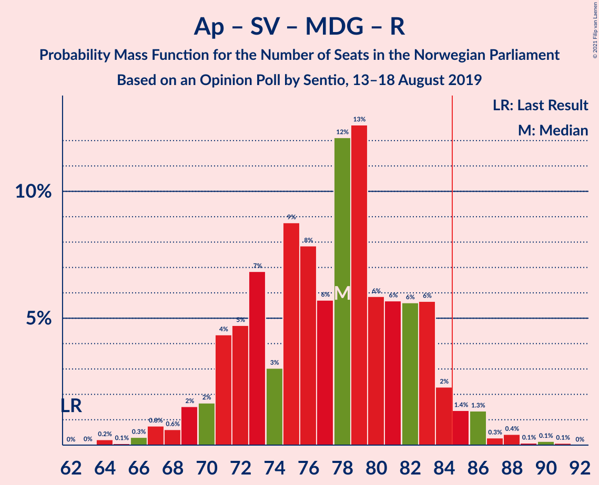

| Number of Seats | Probability | Accumulated | Special Marks |
|:---------------:|:-----------:|:-----------:|:-------------:|
| 62 | 0% | 100% | Last Result |
| 63 | 0% | 100% |  |
| 64 | 0.2% | 100% |  |
| 65 | 0.1% | 99.8% |  |
| 66 | 0.3% | 99.7% |  |
| 67 | 0.8% | 99.4% |  |
| 68 | 0.6% | 98.6% |  |
| 69 | 2% | 98% |  |
| 70 | 2% | 97% |  |
| 71 | 4% | 95% |  |
| 72 | 5% | 90% |  |
| 73 | 7% | 86% |  |
| 74 | 3% | 79% |  |
| 75 | 9% | 76% |  |
| 76 | 8% | 67% | Median |
| 77 | 6% | 59% |  |
| 78 | 12% | 54% |  |
| 79 | 13% | 41% |  |
| 80 | 6% | 29% |  |
| 81 | 6% | 23% |  |
| 82 | 6% | 17% |  |
| 83 | 6% | 12% |  |
| 84 | 2% | 6% |  |
| 85 | 1.4% | 4% | Majority |
| 86 | 1.3% | 2% |  |
| 87 | 0.3% | 1.0% |  |
| 88 | 0.4% | 0.7% |  |
| 89 | 0.1% | 0.3% |  |
| 90 | 0.1% | 0.2% |  |
| 91 | 0.1% | 0.1% |  |
| 92 | 0% | 0% |  |

### Arbeiderpartiet – Senterpartiet

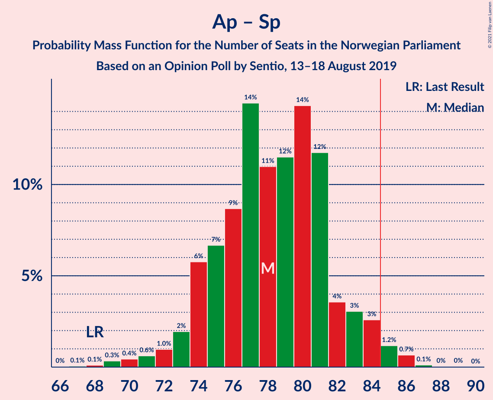

| Number of Seats | Probability | Accumulated | Special Marks |
|:---------------:|:-----------:|:-----------:|:-------------:|
| 66 | 0% | 100% |  |
| 67 | 0.1% | 99.9% |  |
| 68 | 0.1% | 99.9% | Last Result |
| 69 | 0.3% | 99.8% |  |
| 70 | 0.4% | 99.4% |  |
| 71 | 0.6% | 99.0% |  |
| 72 | 1.0% | 98% |  |
| 73 | 2% | 97% |  |
| 74 | 6% | 95% |  |
| 75 | 7% | 90% |  |
| 76 | 9% | 83% |  |
| 77 | 14% | 74% | Median |
| 78 | 11% | 60% |  |
| 79 | 12% | 49% |  |
| 80 | 14% | 37% |  |
| 81 | 12% | 23% |  |
| 82 | 4% | 11% |  |
| 83 | 3% | 8% |  |
| 84 | 3% | 5% |  |
| 85 | 1.2% | 2% | Majority |
| 86 | 0.7% | 0.9% |  |
| 87 | 0.1% | 0.2% |  |
| 88 | 0% | 0.1% |  |
| 89 | 0% | 0.1% |  |
| 90 | 0% | 0% |  |

### Høyre – Fremskrittspartiet – Miljøpartiet De Grønne – Venstre – Kristelig Folkeparti

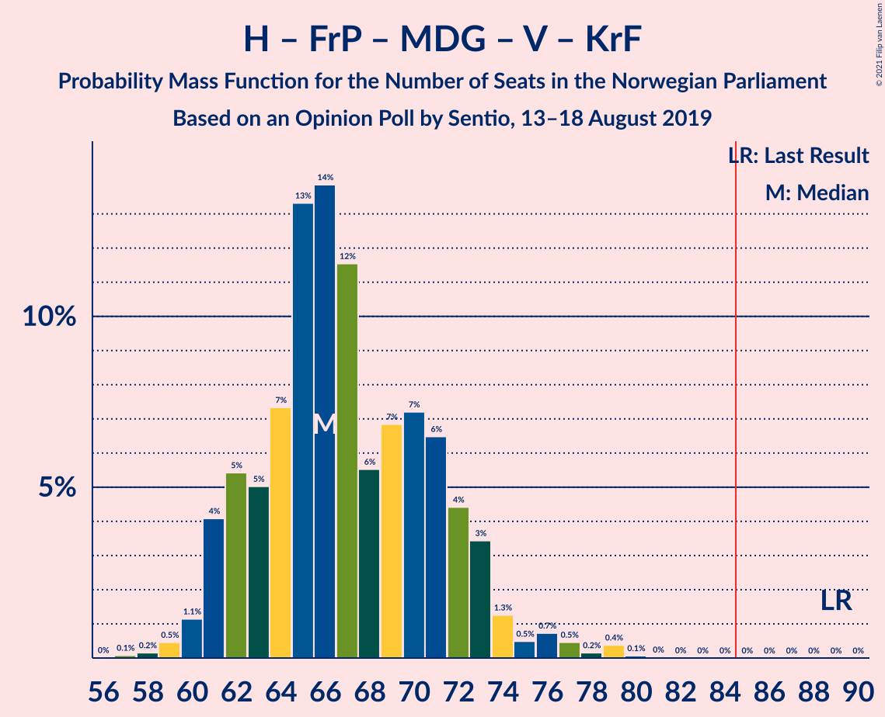

| Number of Seats | Probability | Accumulated | Special Marks |
|:---------------:|:-----------:|:-----------:|:-------------:|
| 57 | 0.1% | 100% |  |
| 58 | 0.2% | 99.9% |  |
| 59 | 0.5% | 99.7% |  |
| 60 | 1.1% | 99.3% |  |
| 61 | 4% | 98% |  |
| 62 | 5% | 94% |  |
| 63 | 5% | 89% |  |
| 64 | 7% | 84% | Median |
| 65 | 13% | 76% |  |
| 66 | 14% | 63% |  |
| 67 | 12% | 49% |  |
| 68 | 6% | 38% |  |
| 69 | 7% | 32% |  |
| 70 | 7% | 25% |  |
| 71 | 6% | 18% |  |
| 72 | 4% | 11% |  |
| 73 | 3% | 7% |  |
| 74 | 1.3% | 4% |  |
| 75 | 0.5% | 2% |  |
| 76 | 0.7% | 2% |  |
| 77 | 0.5% | 1.1% |  |
| 78 | 0.2% | 0.7% |  |
| 79 | 0.4% | 0.5% |  |
| 80 | 0.1% | 0.1% |  |
| 81 | 0% | 0% |  |
| 82 | 0% | 0% |  |
| 83 | 0% | 0% |  |
| 84 | 0% | 0% |  |
| 85 | 0% | 0% | Majority |
| 86 | 0% | 0% |  |
| 87 | 0% | 0% |  |
| 88 | 0% | 0% |  |
| 89 | 0% | 0% | Last Result |

### Arbeiderpartiet – Sosialistisk Venstreparti

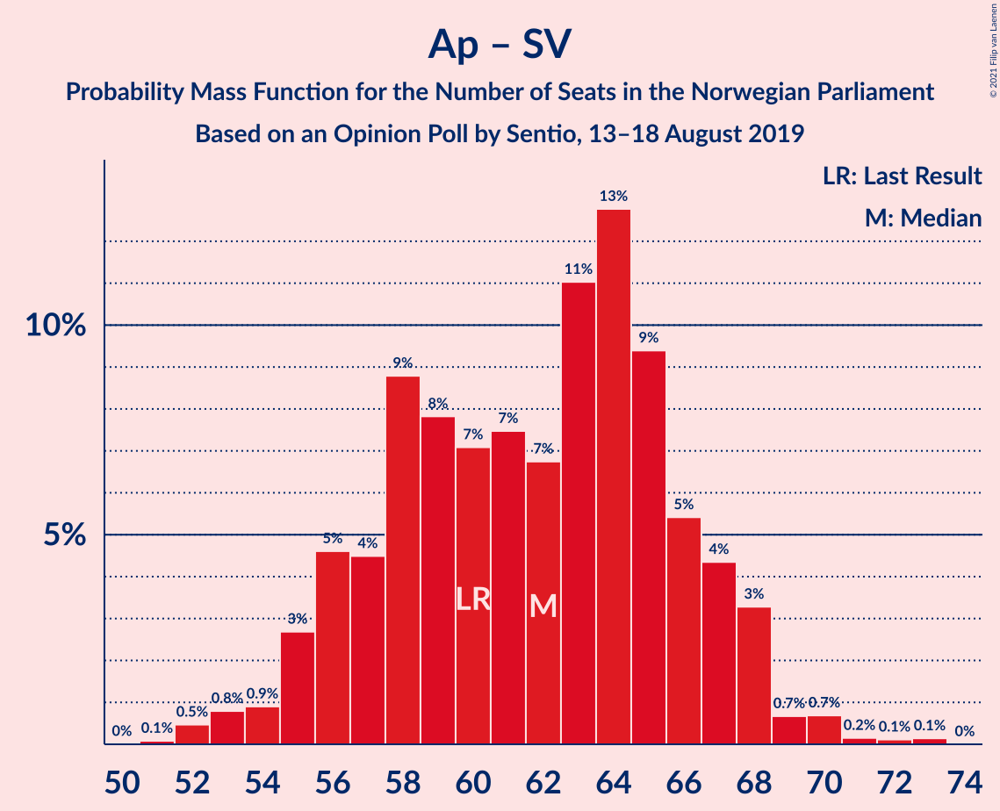

| Number of Seats | Probability | Accumulated | Special Marks |
|:---------------:|:-----------:|:-----------:|:-------------:|
| 51 | 0.1% | 100% |  |
| 52 | 0.5% | 99.9% |  |
| 53 | 0.8% | 99.4% |  |
| 54 | 0.9% | 98.6% |  |
| 55 | 3% | 98% |  |
| 56 | 5% | 95% |  |
| 57 | 4% | 90% |  |
| 58 | 9% | 86% |  |
| 59 | 8% | 77% |  |
| 60 | 7% | 69% | Last Result |
| 61 | 7% | 62% | Median |
| 62 | 7% | 55% |  |
| 63 | 11% | 48% |  |
| 64 | 13% | 37% |  |
| 65 | 9% | 24% |  |
| 66 | 5% | 15% |  |
| 67 | 4% | 9% |  |
| 68 | 3% | 5% |  |
| 69 | 0.7% | 2% |  |
| 70 | 0.7% | 1.1% |  |
| 71 | 0.2% | 0.4% |  |
| 72 | 0.1% | 0.3% |  |
| 73 | 0.1% | 0.2% |  |
| 74 | 0% | 0% |  |

### Høyre – Fremskrittspartiet – Venstre – Kristelig Folkeparti

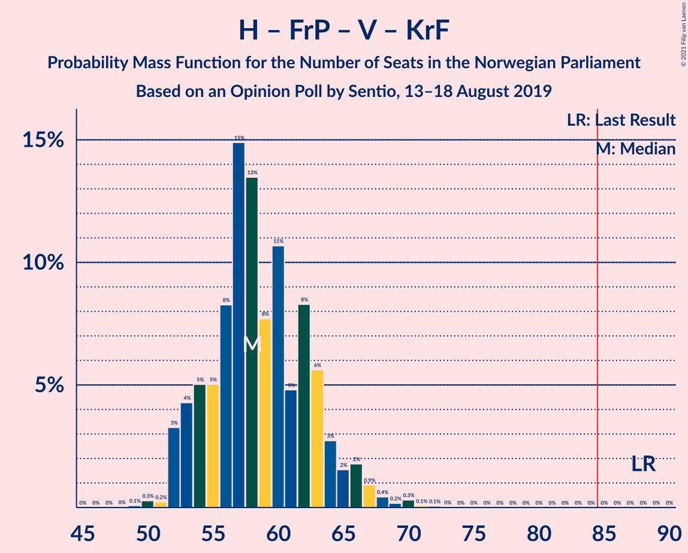

| Number of Seats | Probability | Accumulated | Special Marks |
|:---------------:|:-----------:|:-----------:|:-------------:|
| 49 | 0.1% | 100% |  |
| 50 | 0.3% | 99.9% |  |
| 51 | 0.2% | 99.6% |  |
| 52 | 3% | 99.4% |  |
| 53 | 4% | 96% |  |
| 54 | 5% | 92% |  |
| 55 | 5% | 87% |  |
| 56 | 8% | 82% | Median |
| 57 | 15% | 74% |  |
| 58 | 13% | 59% |  |
| 59 | 8% | 45% |  |
| 60 | 11% | 37% |  |
| 61 | 5% | 27% |  |
| 62 | 8% | 22% |  |
| 63 | 6% | 14% |  |
| 64 | 3% | 8% |  |
| 65 | 2% | 5% |  |
| 66 | 2% | 4% |  |
| 67 | 0.9% | 2% |  |
| 68 | 0.4% | 1.1% |  |
| 69 | 0.2% | 0.6% |  |
| 70 | 0.3% | 0.5% |  |
| 71 | 0.1% | 0.1% |  |
| 72 | 0.1% | 0.1% |  |
| 73 | 0% | 0% |  |
| 74 | 0% | 0% |  |
| 75 | 0% | 0% |  |
| 76 | 0% | 0% |  |
| 77 | 0% | 0% |  |
| 78 | 0% | 0% |  |
| 79 | 0% | 0% |  |
| 80 | 0% | 0% |  |
| 81 | 0% | 0% |  |
| 82 | 0% | 0% |  |
| 83 | 0% | 0% |  |
| 84 | 0% | 0% |  |
| 85 | 0% | 0% | Majority |
| 86 | 0% | 0% |  |
| 87 | 0% | 0% |  |
| 88 | 0% | 0% | Last Result |

### Høyre – Fremskrittspartiet – Venstre

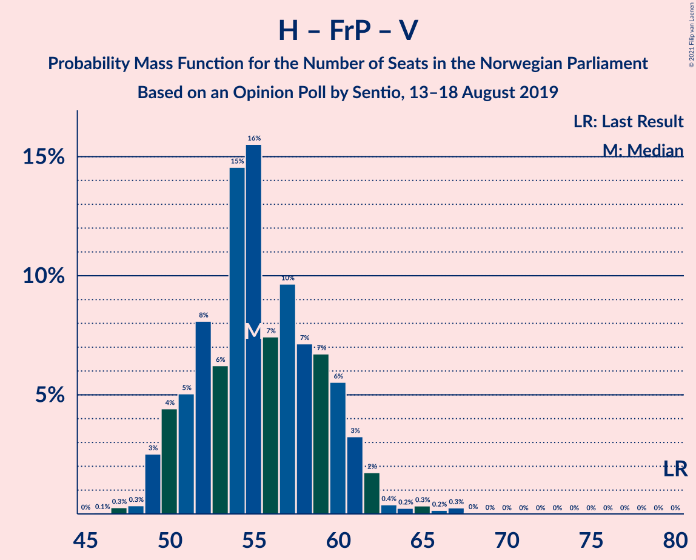

| Number of Seats | Probability | Accumulated | Special Marks |
|:---------------:|:-----------:|:-----------:|:-------------:|
| 46 | 0.1% | 100% |  |
| 47 | 0.3% | 99.9% |  |
| 48 | 0.3% | 99.6% |  |
| 49 | 3% | 99.3% |  |
| 50 | 4% | 97% |  |
| 51 | 5% | 92% |  |
| 52 | 8% | 87% |  |
| 53 | 6% | 79% | Median |
| 54 | 15% | 73% |  |
| 55 | 16% | 58% |  |
| 56 | 7% | 43% |  |
| 57 | 10% | 35% |  |
| 58 | 7% | 26% |  |
| 59 | 7% | 19% |  |
| 60 | 6% | 12% |  |
| 61 | 3% | 6% |  |
| 62 | 2% | 3% |  |
| 63 | 0.4% | 1.5% |  |
| 64 | 0.2% | 1.1% |  |
| 65 | 0.3% | 0.8% |  |
| 66 | 0.2% | 0.5% |  |
| 67 | 0.3% | 0.3% |  |
| 68 | 0% | 0.1% |  |
| 69 | 0% | 0% |  |
| 70 | 0% | 0% |  |
| 71 | 0% | 0% |  |
| 72 | 0% | 0% |  |
| 73 | 0% | 0% |  |
| 74 | 0% | 0% |  |
| 75 | 0% | 0% |  |
| 76 | 0% | 0% |  |
| 77 | 0% | 0% |  |
| 78 | 0% | 0% |  |
| 79 | 0% | 0% |  |
| 80 | 0% | 0% | Last Result |

### Høyre – Fremskrittspartiet

| Number of Seats | Probability | Accumulated | Special Marks |
|:---------------:|:-----------:|:-----------:|:-------------:|
| 43 | 0.1% | 100% |  |
| 44 | 0.1% | 99.9% |  |
| 45 | 0.7% | 99.8% |  |
| 46 | 1.2% | 99.1% |  |
| 47 | 4% | 98% |  |
| 48 | 11% | 94% |  |
| 49 | 5% | 84% |  |
| 50 | 11% | 78% |  |
| 51 | 11% | 67% | Median |
| 52 | 14% | 56% |  |
| 53 | 16% | 42% |  |
| 54 | 11% | 26% |  |
| 55 | 8% | 15% |  |
| 56 | 2% | 7% |  |
| 57 | 2% | 5% |  |
| 58 | 1.1% | 3% |  |
| 59 | 0.8% | 1.5% |  |
| 60 | 0.3% | 0.7% |  |
| 61 | 0.2% | 0.4% |  |
| 62 | 0.1% | 0.2% |  |
| 63 | 0.1% | 0.1% |  |
| 64 | 0% | 0% |  |
| 65 | 0% | 0% |  |
| 66 | 0% | 0% |  |
| 67 | 0% | 0% |  |
| 68 | 0% | 0% |  |
| 69 | 0% | 0% |  |
| 70 | 0% | 0% |  |
| 71 | 0% | 0% |  |
| 72 | 0% | 0% | Last Result |

### Høyre – Venstre – Kristelig Folkeparti

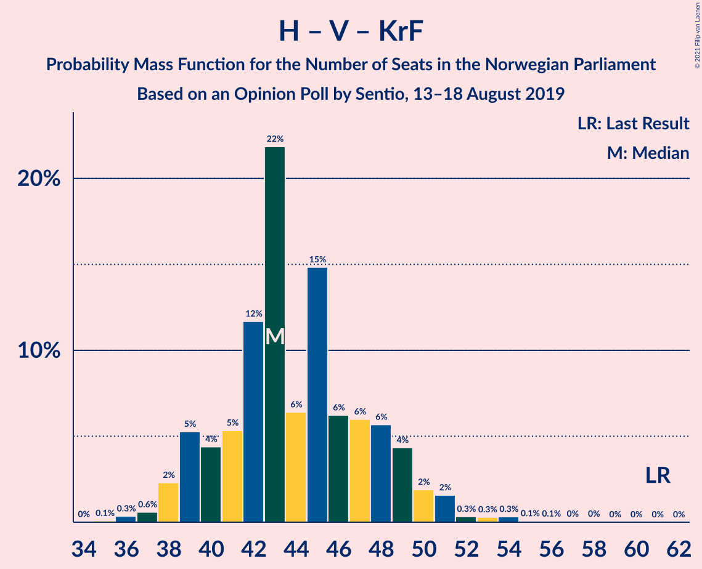

| Number of Seats | Probability | Accumulated | Special Marks |
|:---------------:|:-----------:|:-----------:|:-------------:|
| 35 | 0.1% | 100% |  |
| 36 | 0.3% | 99.9% |  |
| 37 | 0.6% | 99.5% |  |
| 38 | 2% | 99.0% |  |
| 39 | 5% | 97% |  |
| 40 | 4% | 91% |  |
| 41 | 5% | 87% |  |
| 42 | 12% | 82% | Median |
| 43 | 22% | 70% |  |
| 44 | 6% | 48% |  |
| 45 | 15% | 42% |  |
| 46 | 6% | 27% |  |
| 47 | 6% | 21% |  |
| 48 | 6% | 15% |  |
| 49 | 4% | 9% |  |
| 50 | 2% | 5% |  |
| 51 | 2% | 3% |  |
| 52 | 0.3% | 1.2% |  |
| 53 | 0.3% | 0.8% |  |
| 54 | 0.3% | 0.5% |  |
| 55 | 0.1% | 0.2% |  |
| 56 | 0.1% | 0.2% |  |
| 57 | 0% | 0.1% |  |
| 58 | 0% | 0.1% |  |
| 59 | 0% | 0% |  |
| 60 | 0% | 0% |  |
| 61 | 0% | 0% | Last Result |

### Senterpartiet – Venstre – Kristelig Folkeparti

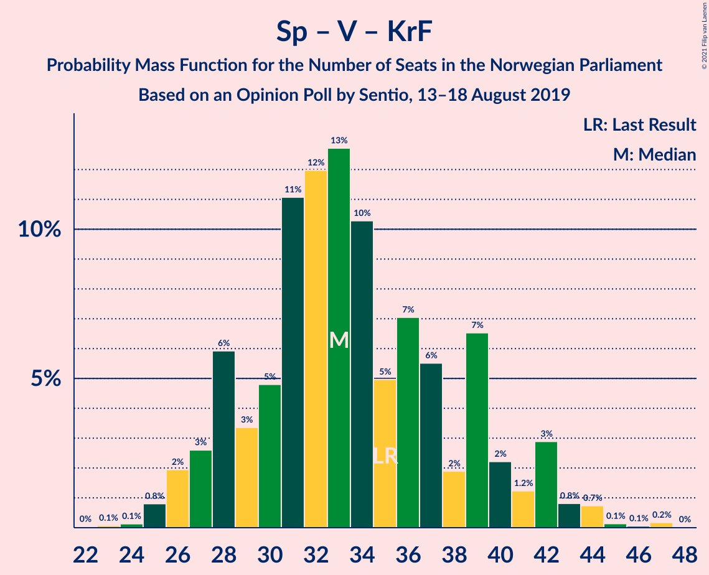

| Number of Seats | Probability | Accumulated | Special Marks |
|:---------------:|:-----------:|:-----------:|:-------------:|
| 23 | 0.1% | 100% |  |
| 24 | 0.1% | 99.9% |  |
| 25 | 0.8% | 99.8% |  |
| 26 | 2% | 98.9% |  |
| 27 | 3% | 97% |  |
| 28 | 6% | 94% |  |
| 29 | 3% | 88% |  |
| 30 | 5% | 85% |  |
| 31 | 11% | 80% | Median |
| 32 | 12% | 69% |  |
| 33 | 13% | 57% |  |
| 34 | 10% | 45% |  |
| 35 | 5% | 34% | Last Result |
| 36 | 7% | 29% |  |
| 37 | 6% | 22% |  |
| 38 | 2% | 17% |  |
| 39 | 7% | 15% |  |
| 40 | 2% | 8% |  |
| 41 | 1.2% | 6% |  |
| 42 | 3% | 5% |  |
| 43 | 0.8% | 2% |  |
| 44 | 0.7% | 1.1% |  |
| 45 | 0.1% | 0.4% |  |
| 46 | 0.1% | 0.3% |  |
| 47 | 0.2% | 0.2% |  |
| 48 | 0% | 0% |  |

## Technical Information

### Opinion Poll

+ **Polling firm:** Sentio
+ **Commissioner(s):** —
+ **Fieldwork period:** 13–18 August 2019

### Calculations

+ **Sample size:** 1000
+ **Simulations done:** 1,048,576
+ **Error estimate:** 1.30%

