# Opinion Poll by Norstat, 20–26 August 2019

<a href="#voting-intentions">Voting Intentions</a> | <a href="#seats">Seats</a> | <a href="#coalitions">Coalitions</a> | <a href="#technical-information">Technical Information</a>

## Voting Intentions

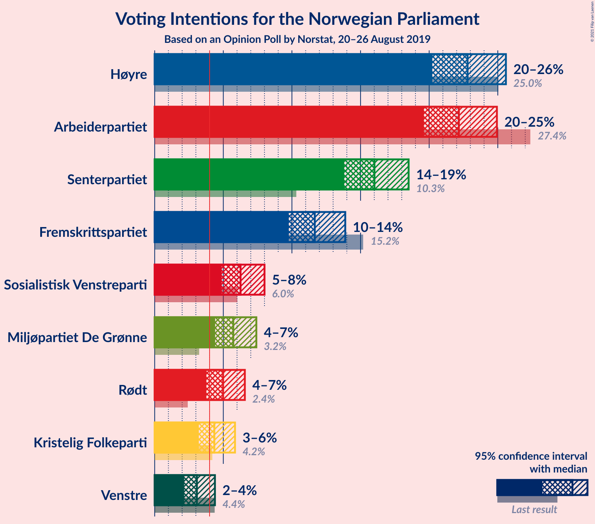

### Confidence Intervals

| Party | Last Result | Poll Result | 80% Confidence Interval | 90% Confidence Interval | 95% Confidence Interval | 99% Confidence Interval |
|:-----:|:-----------:|:-----------:|:-----------------------:|:-----------------------:|:-----------------------:|:-----------------------:|
| Høyre | 25.0% | 22.8% | 21.1–24.6% |20.6–25.1% |20.2–25.6% |19.4–26.5% |
| Arbeiderpartiet | 27.4% | 22.2% | 20.5–24.0% |20.0–24.5% |19.6–24.9% |18.9–25.8% |
| Senterpartiet | 10.3% | 16.0% | 14.6–17.6% |14.2–18.1% |13.8–18.5% |13.1–19.3% |
| Fremskrittspartiet | 15.2% | 11.7% | 10.4–13.1% |10.1–13.5% |9.8–13.9% |9.2–14.6% |
| Sosialistisk Venstreparti | 6.0% | 6.3% | 5.3–7.4% |5.1–7.7% |4.9–8.0% |4.5–8.6% |
| Miljøpartiet De Grønne | 3.2% | 5.7% | 4.9–6.8% |4.6–7.1% |4.4–7.4% |4.0–8.0% |
| Rødt | 2.4% | 5.0% | 4.2–6.0% |3.9–6.3% |3.8–6.6% |3.4–7.1% |
| Kristelig Folkeparti | 4.2% | 4.3% | 3.6–5.3% |3.4–5.6% |3.2–5.9% |2.9–6.4% |
| Venstre | 4.4% | 3.1% | 2.5–3.9% |2.3–4.2% |2.1–4.4% |1.9–4.8% |

*Note:* The poll result column reflects the actual value used in the calculations. Published results may vary slightly, and in addition be rounded to fewer digits.

## Seats

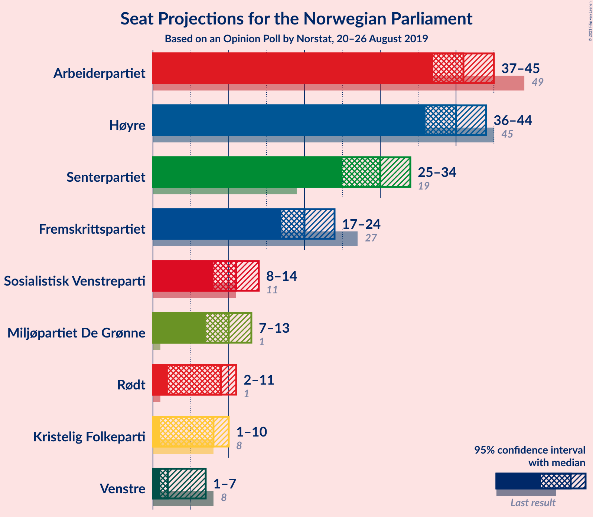

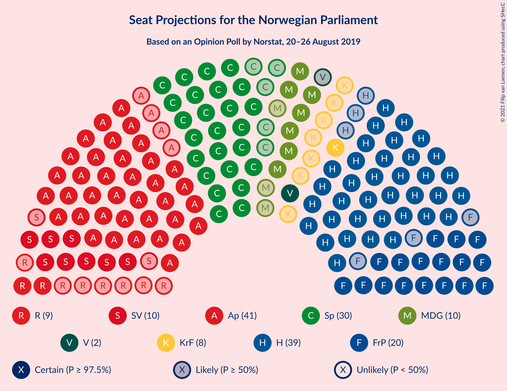

### Confidence Intervals

| Party | Last Result | Median | 80% Confidence Interval | 90% Confidence Interval | 95% Confidence Interval | 99% Confidence Interval |
|:-----:|:-----------:|:------:|:-----------------------:|:-----------------------:|:-----------------------:|:-----------------------:|
| <a href="#høyre">Høyre</a> | 45 | 40 | 37–43 |36–43 |36–44 |34–48 |
| <a href="#arbeiderpartiet">Arbeiderpartiet</a> | 49 | 41 | 37–44 |37–44 |37–45 |35–47 |
| <a href="#senterpartiet">Senterpartiet</a> | 19 | 30 | 26–33 |25–33 |25–34 |22–37 |
| <a href="#fremskrittspartiet">Fremskrittspartiet</a> | 27 | 20 | 17–24 |17–24 |17–24 |15–26 |
| <a href="#sosialistisk-venstreparti">Sosialistisk Venstreparti</a> | 11 | 11 | 9–12 |8–13 |8–14 |8–15 |
| <a href="#miljøpartiet-de-grønne">Miljøpartiet De Grønne</a> | 1 | 10 | 8–12 |8–13 |7–13 |7–13 |
| <a href="#rødt">Rødt</a> | 1 | 9 | 7–10 |2–10 |2–11 |2–12 |
| <a href="#kristelig-folkeparti">Kristelig Folkeparti</a> | 8 | 8 | 3–9 |2–10 |1–10 |1–11 |
| <a href="#venstre">Venstre</a> | 8 | 2 | 2 |2–6 |1–7 |1–8 |

### Høyre

*For a full overview of the results for this party, see the [Høyre](party-høyre.html) page.*

| Number of Seats | Probability | Accumulated | Special Marks |
|:---------------:|:-----------:|:-----------:|:-------------:|
| 32 | 0% | 100% |  |
| 33 | 0.3% | 99.9% |  |
| 34 | 0.4% | 99.7% |  |
| 35 | 1.5% | 99.3% |  |
| 36 | 4% | 98% |  |
| 37 | 17% | 94% |  |
| 38 | 5% | 77% |  |
| 39 | 14% | 72% |  |
| 40 | 9% | 58% | Median |
| 41 | 26% | 49% |  |
| 42 | 12% | 23% |  |
| 43 | 7% | 11% |  |
| 44 | 2% | 4% |  |
| 45 | 0.7% | 2% | Last Result |
| 46 | 0.3% | 1.3% |  |
| 47 | 0.3% | 1.0% |  |
| 48 | 0.5% | 0.7% |  |
| 49 | 0.1% | 0.1% |  |
| 50 | 0% | 0.1% |  |
| 51 | 0.1% | 0.1% |  |
| 52 | 0% | 0% |  |

### Arbeiderpartiet

*For a full overview of the results for this party, see the [Arbeiderpartiet](party-arbeiderpartiet.html) page.*

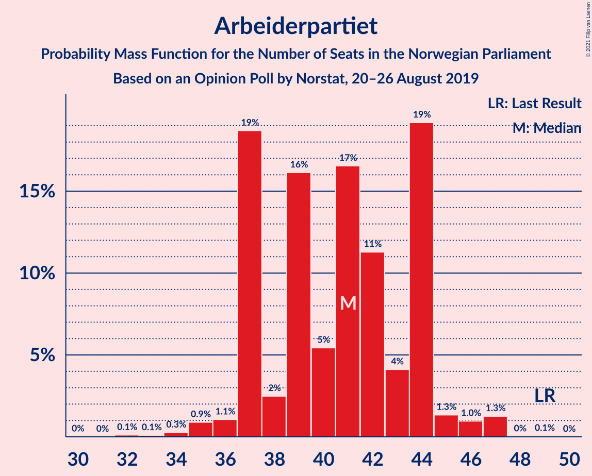

| Number of Seats | Probability | Accumulated | Special Marks |
|:---------------:|:-----------:|:-----------:|:-------------:|
| 32 | 0.1% | 100% |  |
| 33 | 0.1% | 99.9% |  |
| 34 | 0.3% | 99.8% |  |
| 35 | 0.9% | 99.5% |  |
| 36 | 1.1% | 98.6% |  |
| 37 | 19% | 98% |  |
| 38 | 2% | 79% |  |
| 39 | 16% | 76% |  |
| 40 | 5% | 60% |  |
| 41 | 17% | 55% | Median |
| 42 | 11% | 38% |  |
| 43 | 4% | 27% |  |
| 44 | 19% | 23% |  |
| 45 | 1.3% | 4% |  |
| 46 | 1.0% | 2% |  |
| 47 | 1.3% | 1.4% |  |
| 48 | 0% | 0.1% |  |
| 49 | 0.1% | 0.1% | Last Result |
| 50 | 0% | 0% |  |

### Senterpartiet

*For a full overview of the results for this party, see the [Senterpartiet](party-senterpartiet.html) page.*

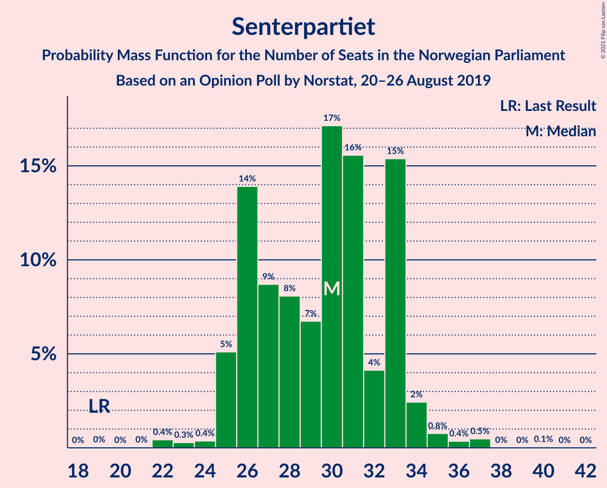

| Number of Seats | Probability | Accumulated | Special Marks |
|:---------------:|:-----------:|:-----------:|:-------------:|
| 19 | 0% | 100% | Last Result |
| 20 | 0% | 100% |  |
| 21 | 0% | 100% |  |
| 22 | 0.4% | 99.9% |  |
| 23 | 0.3% | 99.5% |  |
| 24 | 0.4% | 99.2% |  |
| 25 | 5% | 98.8% |  |
| 26 | 14% | 94% |  |
| 27 | 9% | 80% |  |
| 28 | 8% | 71% |  |
| 29 | 7% | 63% |  |
| 30 | 17% | 56% | Median |
| 31 | 16% | 39% |  |
| 32 | 4% | 24% |  |
| 33 | 15% | 19% |  |
| 34 | 2% | 4% |  |
| 35 | 0.8% | 2% |  |
| 36 | 0.4% | 0.9% |  |
| 37 | 0.5% | 0.5% |  |
| 38 | 0% | 0.1% |  |
| 39 | 0% | 0.1% |  |
| 40 | 0.1% | 0.1% |  |
| 41 | 0% | 0% |  |

### Fremskrittspartiet

*For a full overview of the results for this party, see the [Fremskrittspartiet](party-fremskrittspartiet.html) page.*

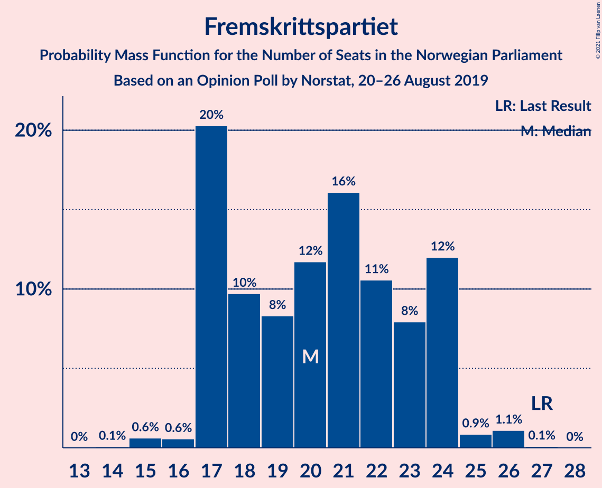

| Number of Seats | Probability | Accumulated | Special Marks |
|:---------------:|:-----------:|:-----------:|:-------------:|
| 14 | 0.1% | 100% |  |
| 15 | 0.6% | 99.9% |  |
| 16 | 0.6% | 99.3% |  |
| 17 | 20% | 98.7% |  |
| 18 | 10% | 78% |  |
| 19 | 8% | 69% |  |
| 20 | 12% | 60% | Median |
| 21 | 16% | 49% |  |
| 22 | 11% | 33% |  |
| 23 | 8% | 22% |  |
| 24 | 12% | 14% |  |
| 25 | 0.9% | 2% |  |
| 26 | 1.1% | 1.2% |  |
| 27 | 0.1% | 0.1% | Last Result |
| 28 | 0% | 0% |  |

### Sosialistisk Venstreparti

*For a full overview of the results for this party, see the [Sosialistisk Venstreparti](party-sosialistiskvenstreparti.html) page.*

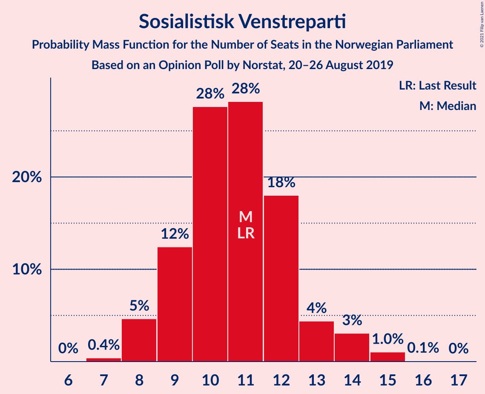

| Number of Seats | Probability | Accumulated | Special Marks |
|:---------------:|:-----------:|:-----------:|:-------------:|
| 6 | 0% | 100% |  |
| 7 | 0.4% | 99.9% |  |
| 8 | 5% | 99.5% |  |
| 9 | 12% | 95% |  |
| 10 | 28% | 82% |  |
| 11 | 28% | 55% | Last Result, Median |
| 12 | 18% | 27% |  |
| 13 | 4% | 9% |  |
| 14 | 3% | 4% |  |
| 15 | 1.0% | 1.2% |  |
| 16 | 0.1% | 0.1% |  |
| 17 | 0% | 0% |  |

### Miljøpartiet De Grønne

*For a full overview of the results for this party, see the [Miljøpartiet De Grønne](party-miljøpartietdegrønne.html) page.*

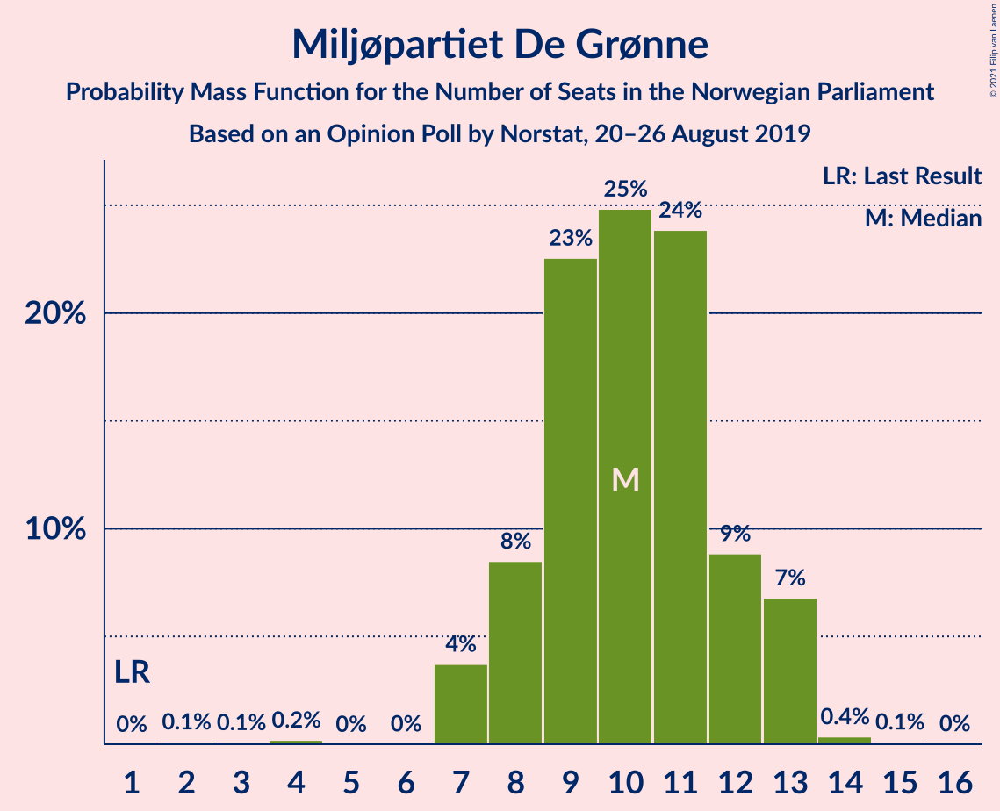

| Number of Seats | Probability | Accumulated | Special Marks |
|:---------------:|:-----------:|:-----------:|:-------------:|
| 1 | 0% | 100% | Last Result |
| 2 | 0.1% | 100% |  |
| 3 | 0.1% | 99.9% |  |
| 4 | 0.2% | 99.8% |  |
| 5 | 0% | 99.6% |  |
| 6 | 0% | 99.6% |  |
| 7 | 4% | 99.6% |  |
| 8 | 8% | 96% |  |
| 9 | 23% | 87% |  |
| 10 | 25% | 65% | Median |
| 11 | 24% | 40% |  |
| 12 | 9% | 16% |  |
| 13 | 7% | 7% |  |
| 14 | 0.4% | 0.5% |  |
| 15 | 0.1% | 0.1% |  |
| 16 | 0% | 0% |  |

### Rødt

*For a full overview of the results for this party, see the [Rødt](party-rødt.html) page.*

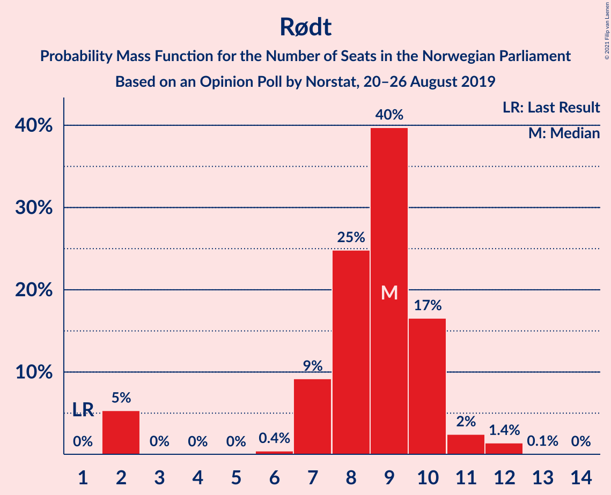

| Number of Seats | Probability | Accumulated | Special Marks |
|:---------------:|:-----------:|:-----------:|:-------------:|
| 1 | 0% | 100% | Last Result |
| 2 | 5% | 100% |  |
| 3 | 0% | 95% |  |
| 4 | 0% | 95% |  |
| 5 | 0% | 95% |  |
| 6 | 0.4% | 95% |  |
| 7 | 9% | 94% |  |
| 8 | 25% | 85% |  |
| 9 | 40% | 60% | Median |
| 10 | 17% | 20% |  |
| 11 | 2% | 4% |  |
| 12 | 1.4% | 1.5% |  |
| 13 | 0.1% | 0.1% |  |
| 14 | 0% | 0% |  |

### Kristelig Folkeparti

*For a full overview of the results for this party, see the [Kristelig Folkeparti](party-kristeligfolkeparti.html) page.*

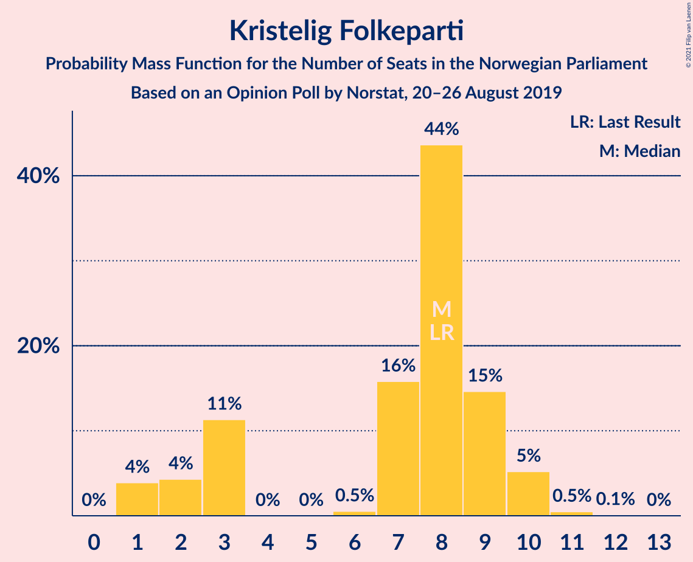

| Number of Seats | Probability | Accumulated | Special Marks |
|:---------------:|:-----------:|:-----------:|:-------------:|
| 1 | 4% | 100% |  |
| 2 | 4% | 96% |  |
| 3 | 11% | 92% |  |
| 4 | 0% | 80% |  |
| 5 | 0% | 80% |  |
| 6 | 0.5% | 80% |  |
| 7 | 16% | 80% |  |
| 8 | 44% | 64% | Last Result, Median |
| 9 | 15% | 20% |  |
| 10 | 5% | 6% |  |
| 11 | 0.5% | 0.6% |  |
| 12 | 0.1% | 0.1% |  |
| 13 | 0% | 0% |  |

### Venstre

*For a full overview of the results for this party, see the [Venstre](party-venstre.html) page.*

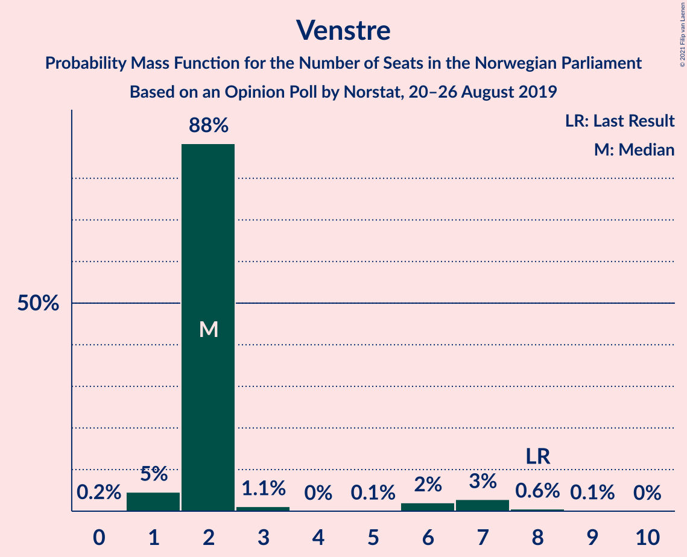

| Number of Seats | Probability | Accumulated | Special Marks |
|:---------------:|:-----------:|:-----------:|:-------------:|
| 0 | 0.2% | 100% |  |
| 1 | 5% | 99.8% |  |
| 2 | 88% | 95% | Median |
| 3 | 1.1% | 7% |  |
| 4 | 0% | 6% |  |
| 5 | 0.1% | 6% |  |
| 6 | 2% | 6% |  |
| 7 | 3% | 4% |  |
| 8 | 0.6% | 0.7% | Last Result |
| 9 | 0.1% | 0.2% |  |
| 10 | 0% | 0% |  |

## Coalitions

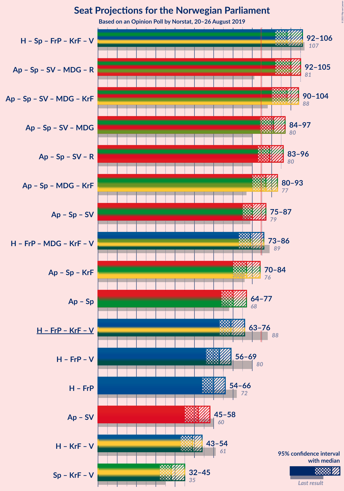

### Confidence Intervals

| Coalition | Last Result | Median | Majority? | 80% Confidence Interval | 90% Confidence Interval | 95% Confidence Interval | 99% Confidence Interval |
|:---------:|:-----------:|:------:|:---------:|:-----------------------:|:-----------------------:|:-----------------------:|:-----------------------:|
| Høyre – Senterpartiet – Fremskrittspartiet – Kristelig Folkeparti – Venstre | 107 | 98 | 100% | 95–103 | 93–105 | 92–106 | 90–107 |
| Arbeiderpartiet – Senterpartiet – Sosialistisk Venstreparti – Miljøpartiet De Grønne – Rødt | 81 | 100 | 100% | 95–105 | 94–105 | 92–105 | 89–108 |
| Arbeiderpartiet – Senterpartiet – Sosialistisk Venstreparti – Miljøpartiet De Grønne – Kristelig Folkeparti | 88 | 98 | 100% | 93–104 | 92–104 | 90–104 | 88–105 |
| Arbeiderpartiet – Senterpartiet – Sosialistisk Venstreparti – Miljøpartiet De Grønne | 80 | 91 | 96% | 86–96 | 85–96 | 84–97 | 82–102 |
| Arbeiderpartiet – Senterpartiet – Sosialistisk Venstreparti – Rødt | 80 | 89 | 95% | 85–95 | 84–95 | 83–96 | 80–98 |
| Arbeiderpartiet – Senterpartiet – Miljøpartiet De Grønne – Kristelig Folkeparti | 77 | 87 | 74% | 83–93 | 81–93 | 80–93 | 77–96 |
| Arbeiderpartiet – Senterpartiet – Sosialistisk Venstreparti | 79 | 80 | 21% | 76–86 | 75–87 | 75–87 | 73–92 |
| Høyre – Fremskrittspartiet – Miljøpartiet De Grønne – Kristelig Folkeparti – Venstre | 89 | 79 | 5% | 74–84 | 74–84 | 73–86 | 70–88 |
| Arbeiderpartiet – Senterpartiet – Kristelig Folkeparti | 76 | 77 | 0.5% | 72–83 | 71–83 | 70–84 | 66–85 |
| Arbeiderpartiet – Senterpartiet | 68 | 70 | 0% | 64–75 | 64–76 | 64–77 | 63–80 |
| Høyre – Fremskrittspartiet – Kristelig Folkeparti – Venstre | 88 | 69 | 0% | 64–74 | 64–74 | 63–76 | 60–78 |
| Høyre – Fremskrittspartiet – Venstre | 80 | 63 | 0% | 58–67 | 56–67 | 56–69 | 56–71 |
| Høyre – Fremskrittspartiet | 72 | 60 | 0% | 54–65 | 54–65 | 54–66 | 54–69 |
| Arbeiderpartiet – Sosialistisk Venstreparti | 60 | 52 | 0% | 47–55 | 47–56 | 45–58 | 44–59 |
| Høyre – Kristelig Folkeparti – Venstre | 61 | 49 | 0% | 45–53 | 44–53 | 43–54 | 40–57 |
| Senterpartiet – Kristelig Folkeparti – Venstre | 35 | 38 | 0% | 34–43 | 34–44 | 32–45 | 30–47 |

### Høyre – Senterpartiet – Fremskrittspartiet – Kristelig Folkeparti – Venstre

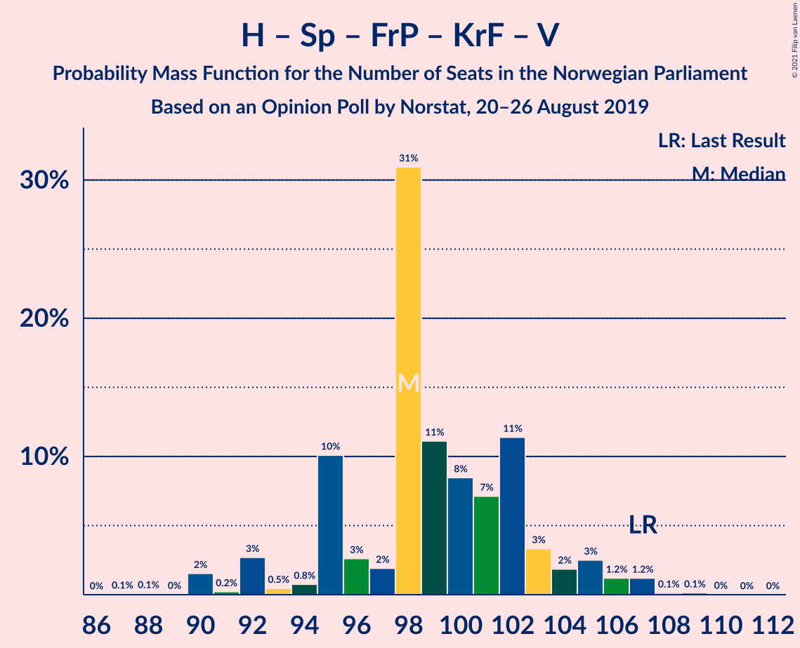

| Number of Seats | Probability | Accumulated | Special Marks |
|:---------------:|:-----------:|:-----------:|:-------------:|
| 87 | 0.1% | 100% |  |
| 88 | 0.1% | 99.9% |  |
| 89 | 0% | 99.9% |  |
| 90 | 2% | 99.8% |  |
| 91 | 0.2% | 98% |  |
| 92 | 3% | 98% |  |
| 93 | 0.5% | 95% |  |
| 94 | 0.8% | 95% |  |
| 95 | 10% | 94% |  |
| 96 | 3% | 84% |  |
| 97 | 2% | 81% |  |
| 98 | 31% | 80% |  |
| 99 | 11% | 49% |  |
| 100 | 8% | 37% | Median |
| 101 | 7% | 29% |  |
| 102 | 11% | 22% |  |
| 103 | 3% | 10% |  |
| 104 | 2% | 7% |  |
| 105 | 3% | 5% |  |
| 106 | 1.2% | 3% |  |
| 107 | 1.2% | 2% | Last Result |
| 108 | 0.1% | 0.3% |  |
| 109 | 0.1% | 0.2% |  |
| 110 | 0% | 0.1% |  |
| 111 | 0% | 0% |  |

### Arbeiderpartiet – Senterpartiet – Sosialistisk Venstreparti – Miljøpartiet De Grønne – Rødt

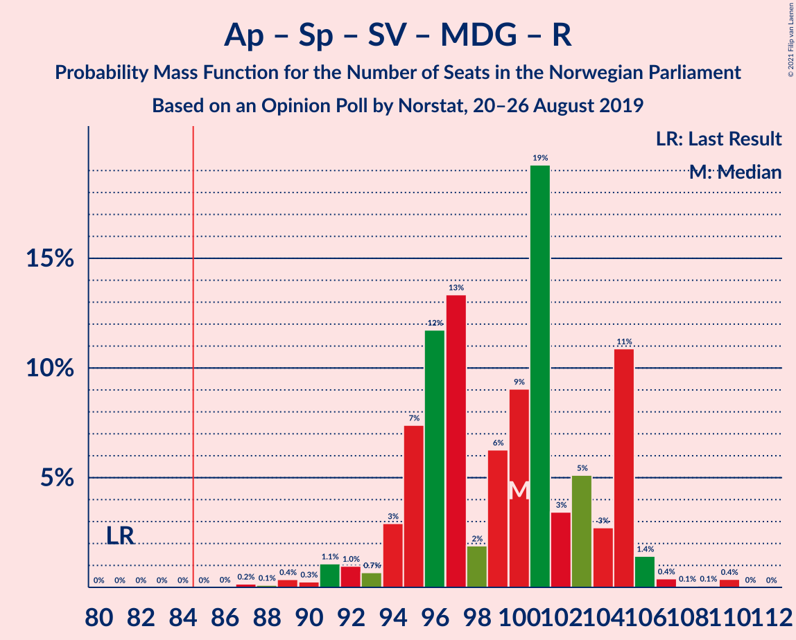

| Number of Seats | Probability | Accumulated | Special Marks |
|:---------------:|:-----------:|:-----------:|:-------------:|
| 81 | 0% | 100% | Last Result |
| 82 | 0% | 100% |  |
| 83 | 0% | 100% |  |
| 84 | 0% | 100% |  |
| 85 | 0% | 100% | Majority |
| 86 | 0% | 100% |  |
| 87 | 0.2% | 100% |  |
| 88 | 0.1% | 99.8% |  |
| 89 | 0.4% | 99.7% |  |
| 90 | 0.3% | 99.3% |  |
| 91 | 1.1% | 99.1% |  |
| 92 | 1.0% | 98% |  |
| 93 | 0.7% | 97% |  |
| 94 | 3% | 96% |  |
| 95 | 7% | 93% |  |
| 96 | 12% | 86% |  |
| 97 | 13% | 74% |  |
| 98 | 2% | 61% |  |
| 99 | 6% | 59% |  |
| 100 | 9% | 53% |  |
| 101 | 19% | 44% | Median |
| 102 | 3% | 24% |  |
| 103 | 5% | 21% |  |
| 104 | 3% | 16% |  |
| 105 | 11% | 13% |  |
| 106 | 1.4% | 2% |  |
| 107 | 0.4% | 0.9% |  |
| 108 | 0.1% | 0.5% |  |
| 109 | 0.1% | 0.5% |  |
| 110 | 0.4% | 0.4% |  |
| 111 | 0% | 0% |  |

### Arbeiderpartiet – Senterpartiet – Sosialistisk Venstreparti – Miljøpartiet De Grønne – Kristelig Folkeparti

| Number of Seats | Probability | Accumulated | Special Marks |
|:---------------:|:-----------:|:-----------:|:-------------:|
| 85 | 0.1% | 100% | Majority |
| 86 | 0.4% | 99.9% |  |
| 87 | 0% | 99.6% |  |
| 88 | 0.1% | 99.5% | Last Result |
| 89 | 0.6% | 99.4% |  |
| 90 | 2% | 98.8% |  |
| 91 | 2% | 97% |  |
| 92 | 5% | 96% |  |
| 93 | 4% | 91% |  |
| 94 | 5% | 87% |  |
| 95 | 14% | 83% |  |
| 96 | 2% | 69% |  |
| 97 | 14% | 66% |  |
| 98 | 10% | 53% |  |
| 99 | 11% | 43% |  |
| 100 | 2% | 32% | Median |
| 101 | 11% | 30% |  |
| 102 | 1.3% | 19% |  |
| 103 | 7% | 18% |  |
| 104 | 10% | 12% |  |
| 105 | 0.7% | 1.1% |  |
| 106 | 0.3% | 0.5% |  |
| 107 | 0.1% | 0.2% |  |
| 108 | 0% | 0.1% |  |
| 109 | 0.1% | 0.1% |  |
| 110 | 0% | 0% |  |

### Arbeiderpartiet – Senterpartiet – Sosialistisk Venstreparti – Miljøpartiet De Grønne

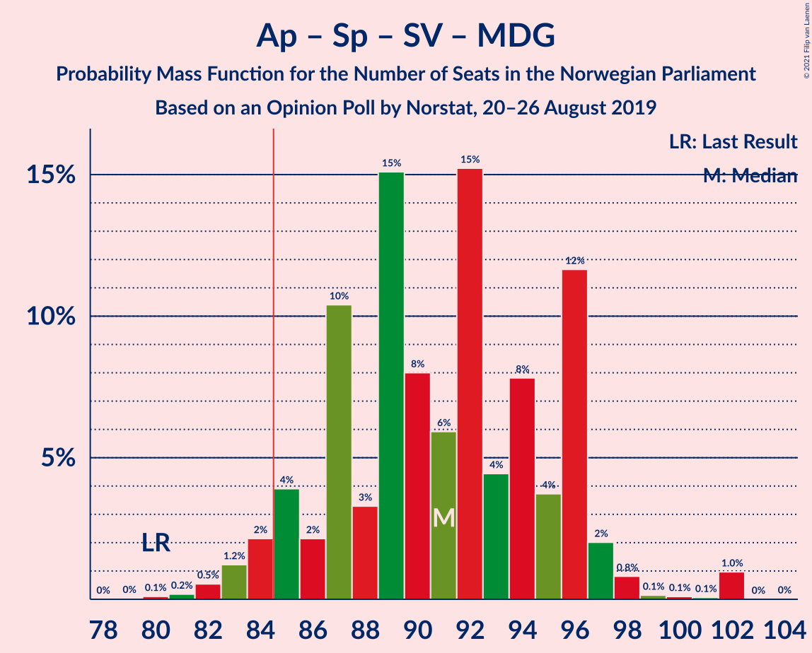

| Number of Seats | Probability | Accumulated | Special Marks |
|:---------------:|:-----------:|:-----------:|:-------------:|
| 80 | 0.1% | 100% | Last Result |
| 81 | 0.2% | 99.9% |  |
| 82 | 0.5% | 99.7% |  |
| 83 | 1.2% | 99.1% |  |
| 84 | 2% | 98% |  |
| 85 | 4% | 96% | Majority |
| 86 | 2% | 92% |  |
| 87 | 10% | 90% |  |
| 88 | 3% | 79% |  |
| 89 | 15% | 76% |  |
| 90 | 8% | 61% |  |
| 91 | 6% | 53% |  |
| 92 | 15% | 47% | Median |
| 93 | 4% | 32% |  |
| 94 | 8% | 27% |  |
| 95 | 4% | 20% |  |
| 96 | 12% | 16% |  |
| 97 | 2% | 4% |  |
| 98 | 0.8% | 2% |  |
| 99 | 0.1% | 1.3% |  |
| 100 | 0.1% | 1.2% |  |
| 101 | 0.1% | 1.1% |  |
| 102 | 1.0% | 1.0% |  |
| 103 | 0% | 0% |  |

### Arbeiderpartiet – Senterpartiet – Sosialistisk Venstreparti – Rødt

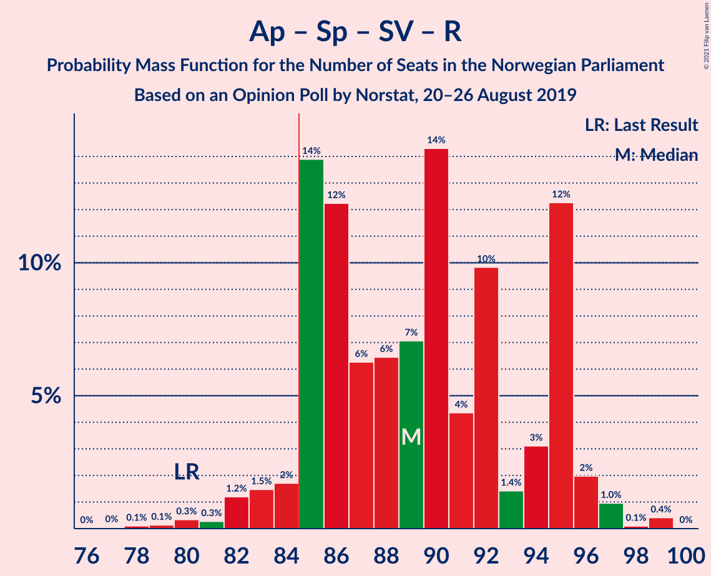

| Number of Seats | Probability | Accumulated | Special Marks |
|:---------------:|:-----------:|:-----------:|:-------------:|
| 77 | 0% | 100% |  |
| 78 | 0.1% | 99.9% |  |
| 79 | 0.1% | 99.8% |  |
| 80 | 0.3% | 99.7% | Last Result |
| 81 | 0.3% | 99.4% |  |
| 82 | 1.2% | 99.1% |  |
| 83 | 1.5% | 98% |  |
| 84 | 2% | 96% |  |
| 85 | 14% | 95% | Majority |
| 86 | 12% | 81% |  |
| 87 | 6% | 69% |  |
| 88 | 6% | 62% |  |
| 89 | 7% | 56% |  |
| 90 | 14% | 49% |  |
| 91 | 4% | 34% | Median |
| 92 | 10% | 30% |  |
| 93 | 1.4% | 20% |  |
| 94 | 3% | 19% |  |
| 95 | 12% | 16% |  |
| 96 | 2% | 3% |  |
| 97 | 1.0% | 2% |  |
| 98 | 0.1% | 0.5% |  |
| 99 | 0.4% | 0.4% |  |
| 100 | 0% | 0% |  |

### Arbeiderpartiet – Senterpartiet – Miljøpartiet De Grønne – Kristelig Folkeparti

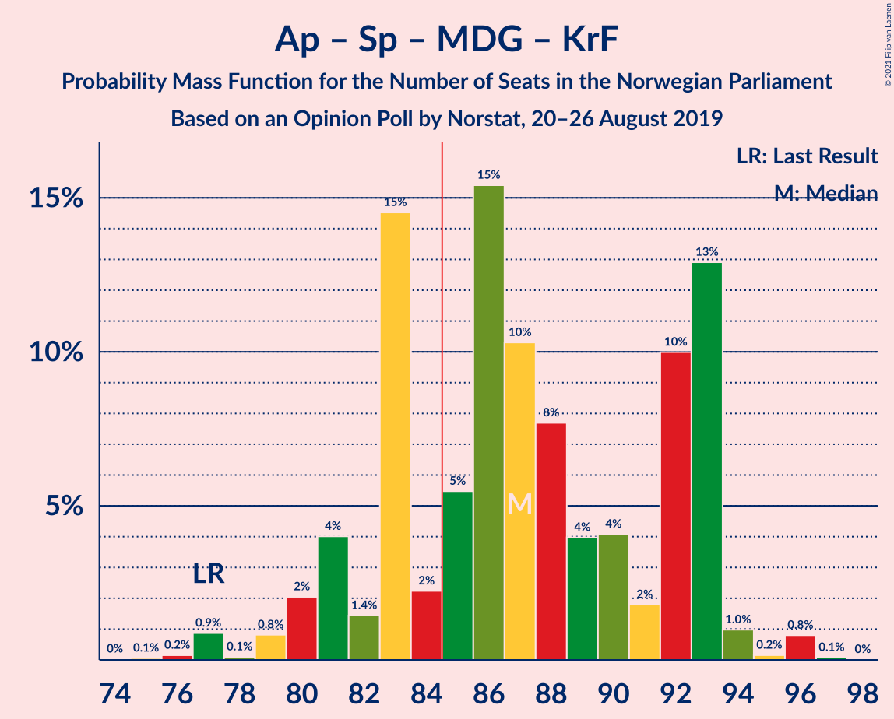

| Number of Seats | Probability | Accumulated | Special Marks |
|:---------------:|:-----------:|:-----------:|:-------------:|
| 75 | 0.1% | 100% |  |
| 76 | 0.2% | 99.9% |  |
| 77 | 0.9% | 99.7% | Last Result |
| 78 | 0.1% | 98.9% |  |
| 79 | 0.8% | 98.8% |  |
| 80 | 2% | 98% |  |
| 81 | 4% | 96% |  |
| 82 | 1.4% | 92% |  |
| 83 | 15% | 90% |  |
| 84 | 2% | 76% |  |
| 85 | 5% | 74% | Majority |
| 86 | 15% | 68% |  |
| 87 | 10% | 53% |  |
| 88 | 8% | 43% |  |
| 89 | 4% | 35% | Median |
| 90 | 4% | 31% |  |
| 91 | 2% | 27% |  |
| 92 | 10% | 25% |  |
| 93 | 13% | 15% |  |
| 94 | 1.0% | 2% |  |
| 95 | 0.2% | 1.1% |  |
| 96 | 0.8% | 0.9% |  |
| 97 | 0.1% | 0.1% |  |
| 98 | 0% | 0% |  |

### Arbeiderpartiet – Senterpartiet – Sosialistisk Venstreparti

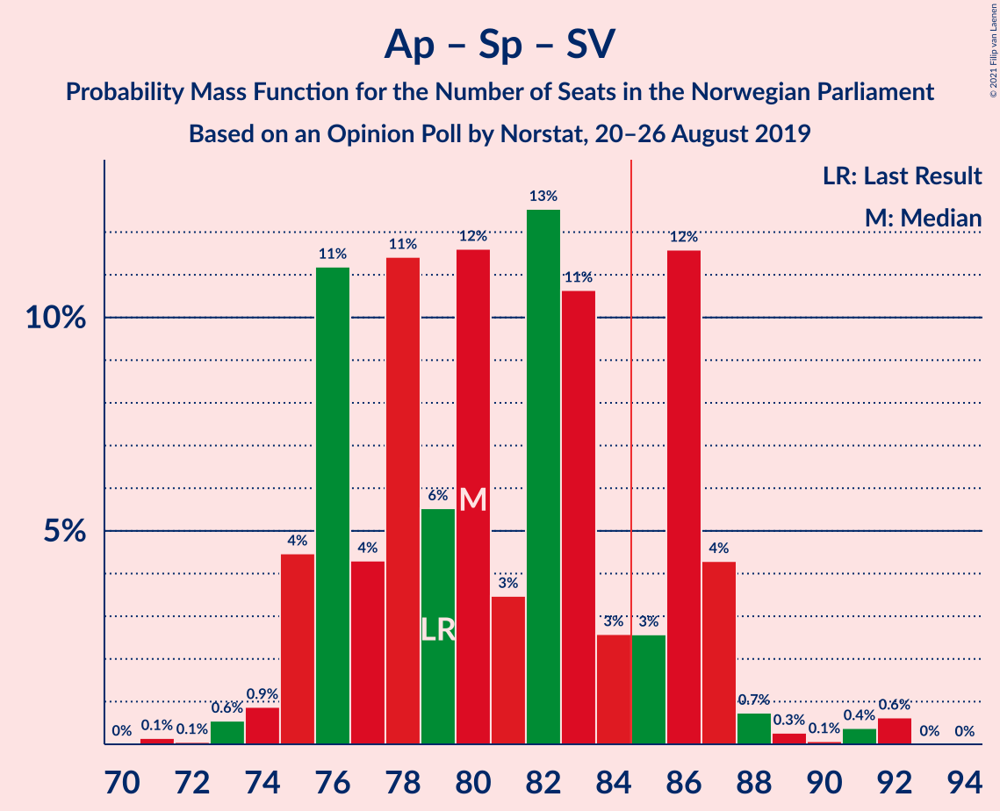

| Number of Seats | Probability | Accumulated | Special Marks |
|:---------------:|:-----------:|:-----------:|:-------------:|
| 71 | 0.1% | 100% |  |
| 72 | 0.1% | 99.8% |  |
| 73 | 0.6% | 99.8% |  |
| 74 | 0.9% | 99.2% |  |
| 75 | 4% | 98% |  |
| 76 | 11% | 94% |  |
| 77 | 4% | 83% |  |
| 78 | 11% | 78% |  |
| 79 | 6% | 67% | Last Result |
| 80 | 12% | 61% |  |
| 81 | 3% | 50% |  |
| 82 | 13% | 46% | Median |
| 83 | 11% | 34% |  |
| 84 | 3% | 23% |  |
| 85 | 3% | 21% | Majority |
| 86 | 12% | 18% |  |
| 87 | 4% | 6% |  |
| 88 | 0.7% | 2% |  |
| 89 | 0.3% | 1.4% |  |
| 90 | 0.1% | 1.1% |  |
| 91 | 0.4% | 1.0% |  |
| 92 | 0.6% | 0.6% |  |
| 93 | 0% | 0% |  |

### Høyre – Fremskrittspartiet – Miljøpartiet De Grønne – Kristelig Folkeparti – Venstre

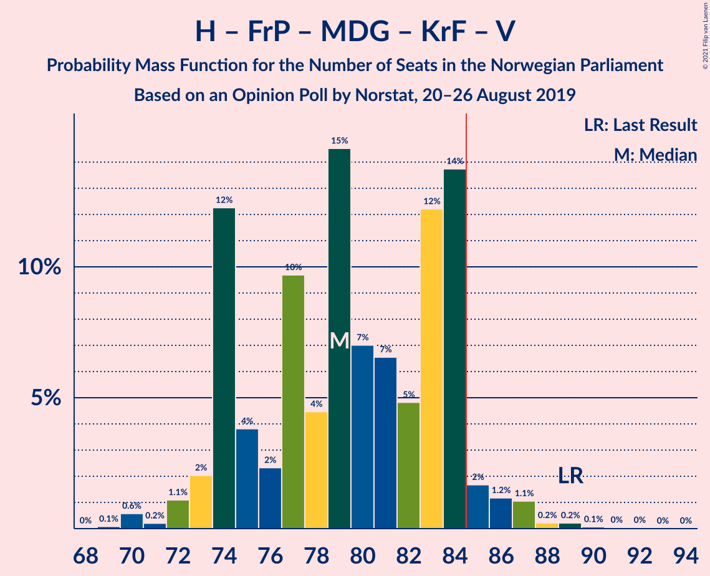

| Number of Seats | Probability | Accumulated | Special Marks |
|:---------------:|:-----------:|:-----------:|:-------------:|
| 68 | 0% | 100% |  |
| 69 | 0.1% | 99.9% |  |
| 70 | 0.6% | 99.9% |  |
| 71 | 0.2% | 99.3% |  |
| 72 | 1.1% | 99.1% |  |
| 73 | 2% | 98% |  |
| 74 | 12% | 96% |  |
| 75 | 4% | 84% |  |
| 76 | 2% | 80% |  |
| 77 | 10% | 78% |  |
| 78 | 4% | 68% |  |
| 79 | 15% | 63% |  |
| 80 | 7% | 49% | Median |
| 81 | 7% | 42% |  |
| 82 | 5% | 35% |  |
| 83 | 12% | 30% |  |
| 84 | 14% | 18% |  |
| 85 | 2% | 5% | Majority |
| 86 | 1.2% | 3% |  |
| 87 | 1.1% | 2% |  |
| 88 | 0.2% | 0.6% |  |
| 89 | 0.2% | 0.4% | Last Result |
| 90 | 0.1% | 0.2% |  |
| 91 | 0% | 0.1% |  |
| 92 | 0% | 0.1% |  |
| 93 | 0% | 0% |  |

### Arbeiderpartiet – Senterpartiet – Kristelig Folkeparti

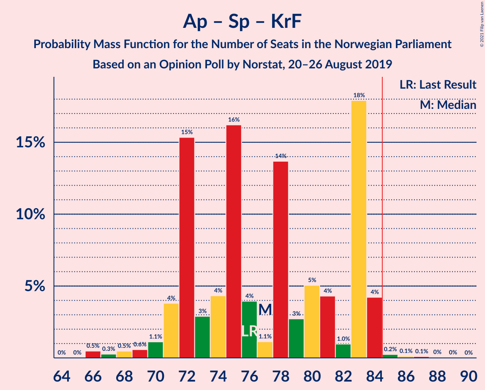

| Number of Seats | Probability | Accumulated | Special Marks |
|:---------------:|:-----------:|:-----------:|:-------------:|
| 66 | 0.5% | 100% |  |
| 67 | 0.3% | 99.5% |  |
| 68 | 0.5% | 99.2% |  |
| 69 | 0.6% | 98.7% |  |
| 70 | 1.1% | 98% |  |
| 71 | 4% | 97% |  |
| 72 | 15% | 93% |  |
| 73 | 3% | 78% |  |
| 74 | 4% | 75% |  |
| 75 | 16% | 71% |  |
| 76 | 4% | 54% | Last Result |
| 77 | 1.1% | 51% |  |
| 78 | 14% | 49% |  |
| 79 | 3% | 36% | Median |
| 80 | 5% | 33% |  |
| 81 | 4% | 28% |  |
| 82 | 1.0% | 24% |  |
| 83 | 18% | 23% |  |
| 84 | 4% | 5% |  |
| 85 | 0.2% | 0.5% | Majority |
| 86 | 0.1% | 0.3% |  |
| 87 | 0.1% | 0.2% |  |
| 88 | 0% | 0.1% |  |
| 89 | 0% | 0% |  |

### Arbeiderpartiet – Senterpartiet

| Number of Seats | Probability | Accumulated | Special Marks |
|:---------------:|:-----------:|:-----------:|:-------------:|
| 60 | 0% | 100% |  |
| 61 | 0.3% | 99.9% |  |
| 62 | 0.1% | 99.6% |  |
| 63 | 0.7% | 99.5% |  |
| 64 | 11% | 98.8% |  |
| 65 | 3% | 88% |  |
| 66 | 3% | 85% |  |
| 67 | 13% | 82% |  |
| 68 | 5% | 69% | Last Result |
| 69 | 7% | 64% |  |
| 70 | 14% | 57% |  |
| 71 | 7% | 43% | Median |
| 72 | 5% | 36% |  |
| 73 | 4% | 31% |  |
| 74 | 10% | 27% |  |
| 75 | 9% | 17% |  |
| 76 | 4% | 8% |  |
| 77 | 3% | 4% |  |
| 78 | 0.6% | 1.4% |  |
| 79 | 0.2% | 0.9% |  |
| 80 | 0.6% | 0.6% |  |
| 81 | 0% | 0% |  |

### Høyre – Fremskrittspartiet – Kristelig Folkeparti – Venstre

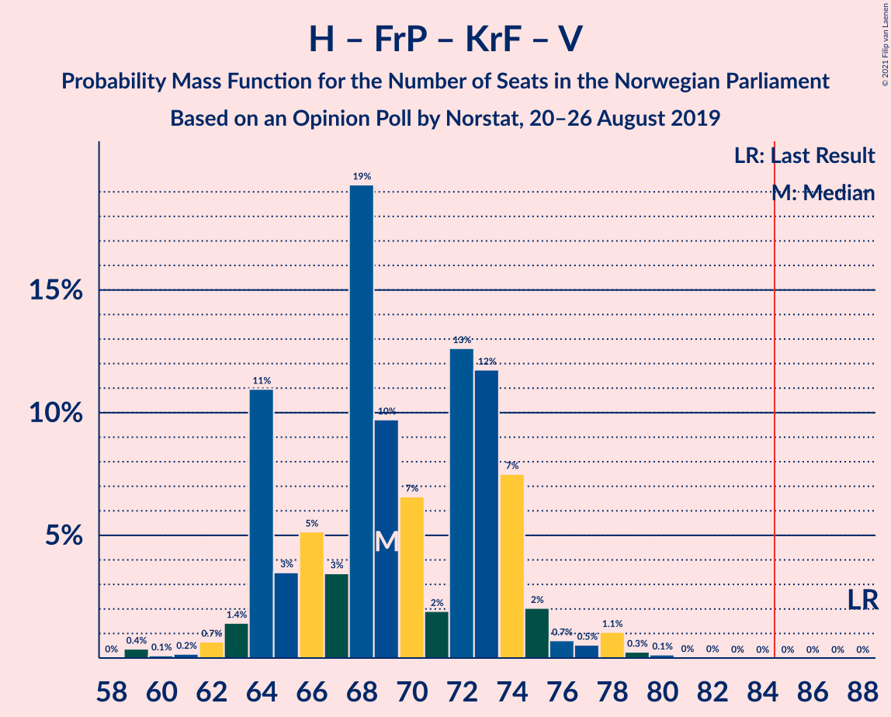

| Number of Seats | Probability | Accumulated | Special Marks |
|:---------------:|:-----------:|:-----------:|:-------------:|
| 59 | 0.4% | 100% |  |
| 60 | 0.1% | 99.6% |  |
| 61 | 0.2% | 99.5% |  |
| 62 | 0.7% | 99.3% |  |
| 63 | 1.4% | 98.7% |  |
| 64 | 11% | 97% |  |
| 65 | 3% | 86% |  |
| 66 | 5% | 83% |  |
| 67 | 3% | 78% |  |
| 68 | 19% | 74% |  |
| 69 | 10% | 55% |  |
| 70 | 7% | 45% | Median |
| 71 | 2% | 39% |  |
| 72 | 13% | 37% |  |
| 73 | 12% | 24% |  |
| 74 | 7% | 12% |  |
| 75 | 2% | 5% |  |
| 76 | 0.7% | 3% |  |
| 77 | 0.5% | 2% |  |
| 78 | 1.1% | 2% |  |
| 79 | 0.3% | 0.5% |  |
| 80 | 0.1% | 0.2% |  |
| 81 | 0% | 0.1% |  |
| 82 | 0% | 0% |  |
| 83 | 0% | 0% |  |
| 84 | 0% | 0% |  |
| 85 | 0% | 0% | Majority |
| 86 | 0% | 0% |  |
| 87 | 0% | 0% |  |
| 88 | 0% | 0% | Last Result |

### Høyre – Fremskrittspartiet – Venstre

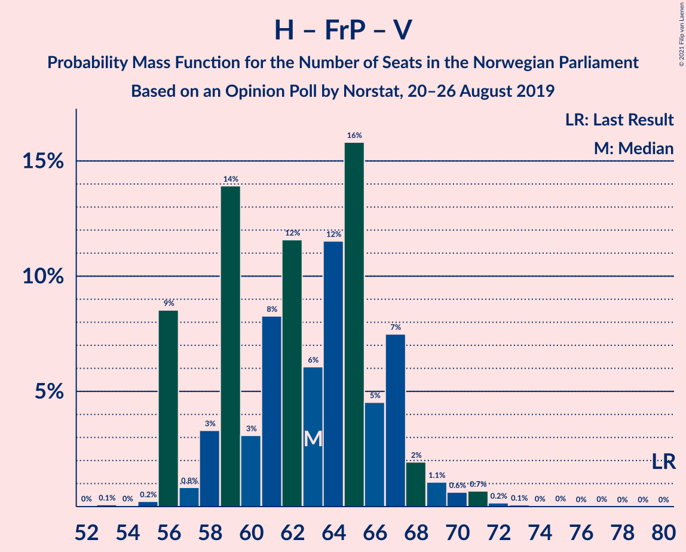

| Number of Seats | Probability | Accumulated | Special Marks |
|:---------------:|:-----------:|:-----------:|:-------------:|
| 53 | 0.1% | 100% |  |
| 54 | 0% | 99.9% |  |
| 55 | 0.2% | 99.8% |  |
| 56 | 9% | 99.6% |  |
| 57 | 0.8% | 91% |  |
| 58 | 3% | 90% |  |
| 59 | 14% | 87% |  |
| 60 | 3% | 73% |  |
| 61 | 8% | 70% |  |
| 62 | 12% | 62% | Median |
| 63 | 6% | 50% |  |
| 64 | 12% | 44% |  |
| 65 | 16% | 32% |  |
| 66 | 5% | 17% |  |
| 67 | 7% | 12% |  |
| 68 | 2% | 5% |  |
| 69 | 1.1% | 3% |  |
| 70 | 0.6% | 2% |  |
| 71 | 0.7% | 1.0% |  |
| 72 | 0.2% | 0.4% |  |
| 73 | 0.1% | 0.2% |  |
| 74 | 0% | 0.1% |  |
| 75 | 0% | 0.1% |  |
| 76 | 0% | 0% |  |
| 77 | 0% | 0% |  |
| 78 | 0% | 0% |  |
| 79 | 0% | 0% |  |
| 80 | 0% | 0% | Last Result |

### Høyre – Fremskrittspartiet

| Number of Seats | Probability | Accumulated | Special Marks |
|:---------------:|:-----------:|:-----------:|:-------------:|
| 50 | 0.1% | 100% |  |
| 51 | 0.1% | 99.9% |  |
| 52 | 0.1% | 99.8% |  |
| 53 | 0.2% | 99.7% |  |
| 54 | 11% | 99.5% |  |
| 55 | 0.9% | 89% |  |
| 56 | 4% | 88% |  |
| 57 | 14% | 84% |  |
| 58 | 2% | 71% |  |
| 59 | 8% | 69% |  |
| 60 | 11% | 60% | Median |
| 61 | 7% | 49% |  |
| 62 | 12% | 42% |  |
| 63 | 14% | 30% |  |
| 64 | 5% | 16% |  |
| 65 | 7% | 11% |  |
| 66 | 1.2% | 4% |  |
| 67 | 1.2% | 2% |  |
| 68 | 0.4% | 1.2% |  |
| 69 | 0.6% | 0.8% |  |
| 70 | 0.1% | 0.2% |  |
| 71 | 0.1% | 0.1% |  |
| 72 | 0% | 0% | Last Result |

### Arbeiderpartiet – Sosialistisk Venstreparti

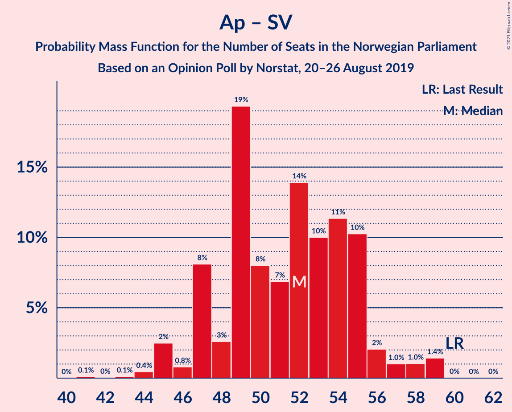

| Number of Seats | Probability | Accumulated | Special Marks |
|:---------------:|:-----------:|:-----------:|:-------------:|
| 41 | 0.1% | 100% |  |
| 42 | 0% | 99.9% |  |
| 43 | 0.1% | 99.9% |  |
| 44 | 0.4% | 99.7% |  |
| 45 | 2% | 99.3% |  |
| 46 | 0.8% | 97% |  |
| 47 | 8% | 96% |  |
| 48 | 3% | 88% |  |
| 49 | 19% | 85% |  |
| 50 | 8% | 66% |  |
| 51 | 7% | 58% |  |
| 52 | 14% | 51% | Median |
| 53 | 10% | 37% |  |
| 54 | 11% | 27% |  |
| 55 | 10% | 16% |  |
| 56 | 2% | 6% |  |
| 57 | 1.0% | 4% |  |
| 58 | 1.0% | 3% |  |
| 59 | 1.4% | 1.5% |  |
| 60 | 0% | 0.1% | Last Result |
| 61 | 0% | 0% |  |

### Høyre – Kristelig Folkeparti – Venstre

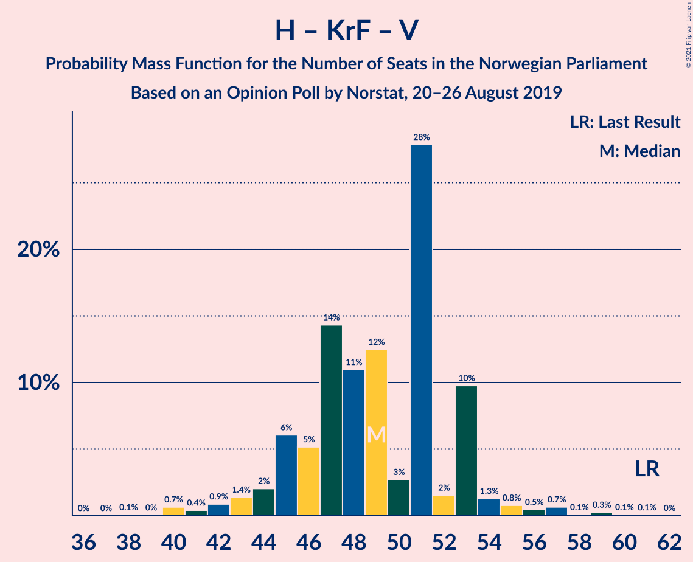

| Number of Seats | Probability | Accumulated | Special Marks |
|:---------------:|:-----------:|:-----------:|:-------------:|
| 38 | 0.1% | 100% |  |
| 39 | 0% | 99.9% |  |
| 40 | 0.7% | 99.9% |  |
| 41 | 0.4% | 99.2% |  |
| 42 | 0.9% | 98.8% |  |
| 43 | 1.4% | 98% |  |
| 44 | 2% | 97% |  |
| 45 | 6% | 95% |  |
| 46 | 5% | 88% |  |
| 47 | 14% | 83% |  |
| 48 | 11% | 69% |  |
| 49 | 12% | 58% |  |
| 50 | 3% | 46% | Median |
| 51 | 28% | 43% |  |
| 52 | 2% | 15% |  |
| 53 | 10% | 13% |  |
| 54 | 1.3% | 4% |  |
| 55 | 0.8% | 2% |  |
| 56 | 0.5% | 2% |  |
| 57 | 0.7% | 1.1% |  |
| 58 | 0.1% | 0.5% |  |
| 59 | 0.3% | 0.4% |  |
| 60 | 0.1% | 0.2% |  |
| 61 | 0.1% | 0.1% | Last Result |
| 62 | 0% | 0% |  |

### Senterpartiet – Kristelig Folkeparti – Venstre

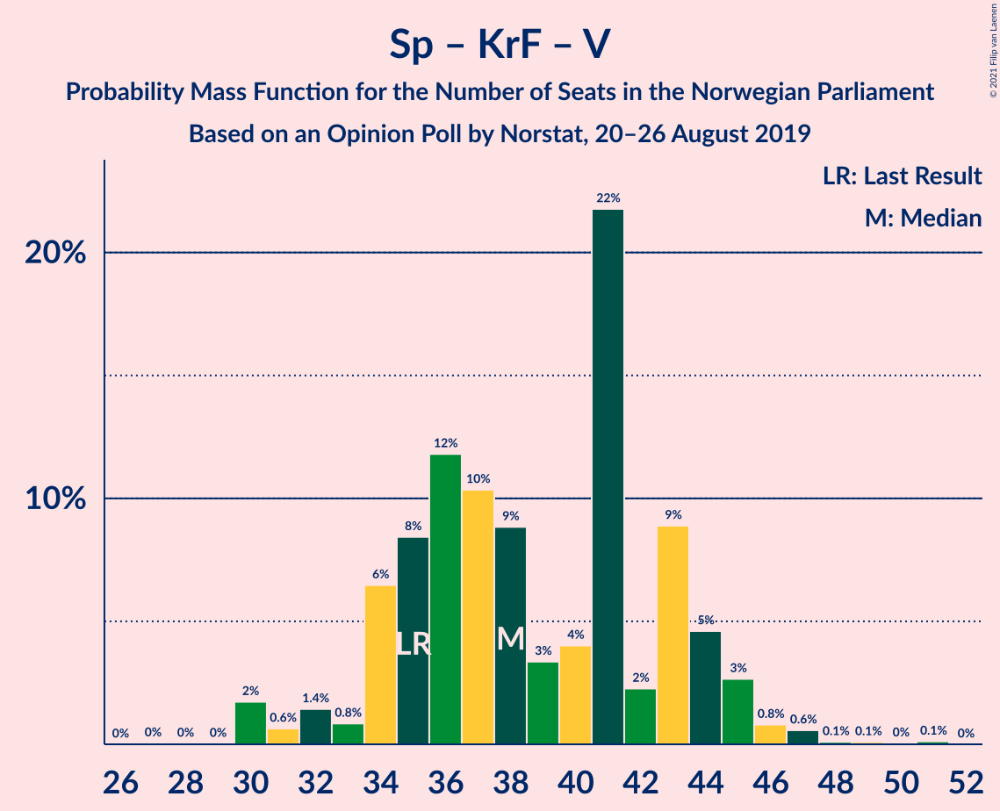

| Number of Seats | Probability | Accumulated | Special Marks |
|:---------------:|:-----------:|:-----------:|:-------------:|
| 27 | 0% | 100% |  |
| 28 | 0% | 99.9% |  |
| 29 | 0% | 99.9% |  |
| 30 | 2% | 99.9% |  |
| 31 | 0.6% | 98% |  |
| 32 | 1.4% | 98% |  |
| 33 | 0.8% | 96% |  |
| 34 | 6% | 95% |  |
| 35 | 8% | 89% | Last Result |
| 36 | 12% | 80% |  |
| 37 | 10% | 69% |  |
| 38 | 9% | 58% |  |
| 39 | 3% | 49% |  |
| 40 | 4% | 46% | Median |
| 41 | 22% | 42% |  |
| 42 | 2% | 20% |  |
| 43 | 9% | 18% |  |
| 44 | 5% | 9% |  |
| 45 | 3% | 4% |  |
| 46 | 0.8% | 2% |  |
| 47 | 0.6% | 0.9% |  |
| 48 | 0.1% | 0.4% |  |
| 49 | 0.1% | 0.3% |  |
| 50 | 0% | 0.2% |  |
| 51 | 0.1% | 0.1% |  |
| 52 | 0% | 0% |  |

## Technical Information

### Opinion Poll

+ **Polling firm:** Norstat
+ **Commissioner(s):** —
+ **Fieldwork period:** 20–26 August 2019

### Calculations

+ **Sample size:** 943
+ **Simulations done:** 131,072
+ **Error estimate:** 1.36%

