# Opinion Poll by Norstat, 27 August–2 September 2019

<a href="#voting-intentions">Voting Intentions</a> | <a href="#seats">Seats</a> | <a href="#coalitions">Coalitions</a> | <a href="#technical-information">Technical Information</a>

## Voting Intentions

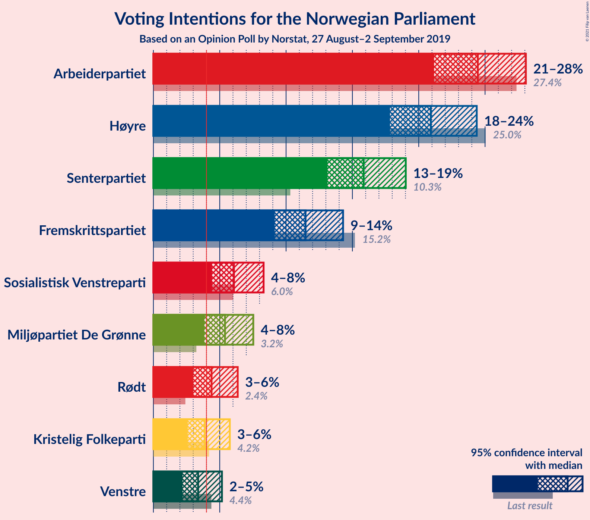

### Confidence Intervals

| Party | Last Result | Poll Result | 80% Confidence Interval | 90% Confidence Interval | 95% Confidence Interval | 99% Confidence Interval |
|:-----:|:-----------:|:-----------:|:-----------------------:|:-----------------------:|:-----------------------:|:-----------------------:|
| Arbeiderpartiet | 27.4% | 24.5% | 22.3–26.8% |21.7–27.5% |21.2–28.1% |20.2–29.2% |
| Høyre | 25.0% | 20.9% | 18.9–23.2% |18.3–23.8% |17.8–24.4% |16.9–25.5% |
| Senterpartiet | 10.3% | 15.9% | 14.1–17.9% |13.6–18.5% |13.1–19.0% |12.3–20.0% |
| Fremskrittspartiet | 15.2% | 11.5% | 9.9–13.3% |9.5–13.8% |9.1–14.3% |8.5–15.2% |
| Sosialistisk Venstreparti | 6.0% | 6.1% | 5.0–7.5% |4.7–7.9% |4.4–8.3% |3.9–9.0% |
| Miljøpartiet De Grønne | 3.2% | 5.4% | 4.4–6.8% |4.1–7.2% |3.8–7.5% |3.4–8.2% |
| Rødt | 2.4% | 4.4% | 3.5–5.7% |3.2–6.0% |3.0–6.4% |2.6–7.0% |
| Kristelig Folkeparti | 4.2% | 3.9% | 3.0–5.1% |2.8–5.4% |2.6–5.8% |2.2–6.4% |
| Venstre | 4.4% | 3.4% | 2.6–4.5% |2.4–4.9% |2.2–5.2% |1.9–5.8% |

*Note:* The poll result column reflects the actual value used in the calculations. Published results may vary slightly, and in addition be rounded to fewer digits.

## Seats

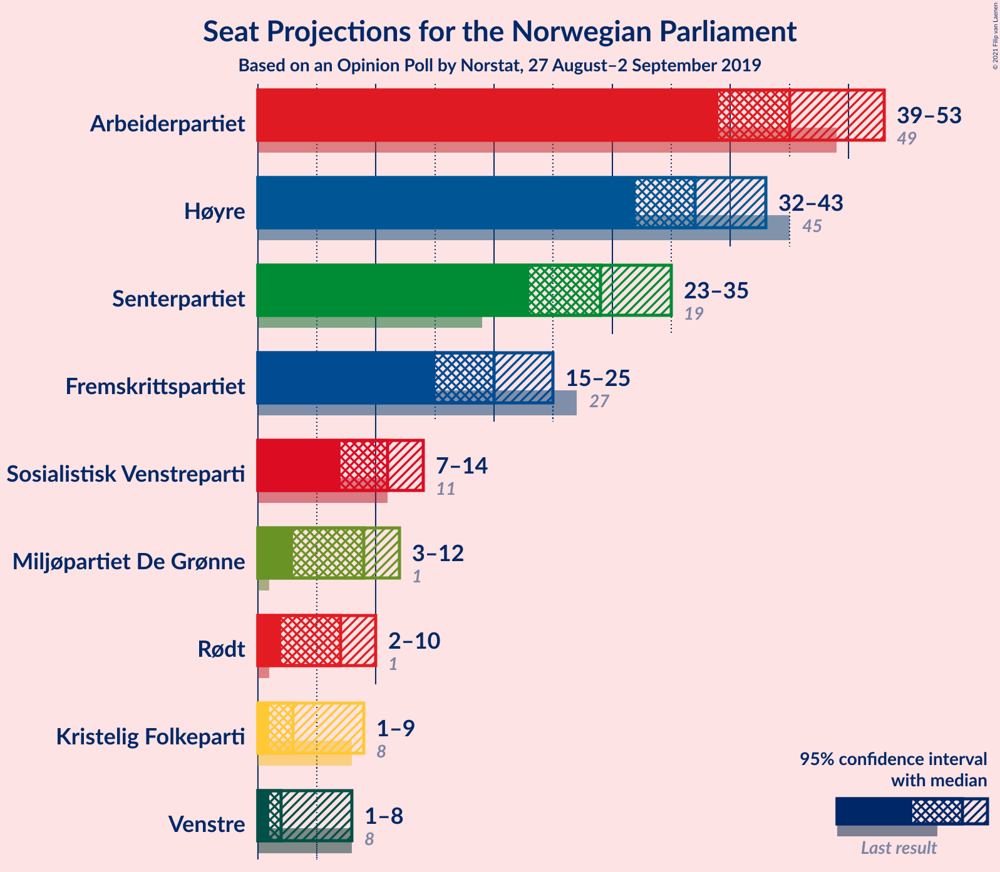

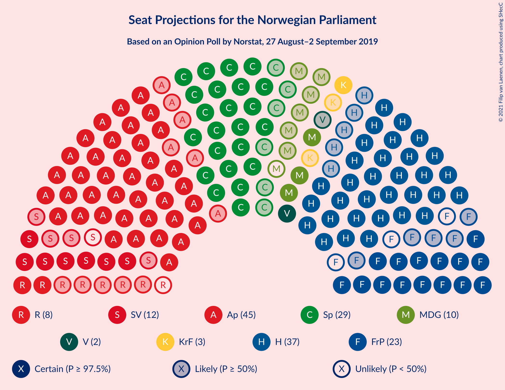

### Confidence Intervals

| Party | Last Result | Median | 80% Confidence Interval | 90% Confidence Interval | 95% Confidence Interval | 99% Confidence Interval |
|:-----:|:-----------:|:------:|:-----------------------:|:-----------------------:|:-----------------------:|:-----------------------:|
| <a href="#arbeiderpartiet">Arbeiderpartiet</a> | 49 | 45 | 42–48 |40–51 |39–53 |37–55 |
| <a href="#høyre">Høyre</a> | 45 | 37 | 34–41 |32–42 |32–43 |30–45 |
| <a href="#senterpartiet">Senterpartiet</a> | 19 | 29 | 26–34 |24–35 |23–35 |21–37 |
| <a href="#fremskrittspartiet">Fremskrittspartiet</a> | 27 | 20 | 17–24 |16–24 |15–25 |13–27 |
| <a href="#sosialistisk-venstreparti">Sosialistisk Venstreparti</a> | 11 | 11 | 8–12 |7–13 |7–14 |6–16 |
| <a href="#miljøpartiet-de-grønne">Miljøpartiet De Grønne</a> | 1 | 9 | 7–11 |6–12 |3–12 |2–14 |
| <a href="#rødt">Rødt</a> | 1 | 7 | 2–9 |2–10 |2–10 |1–11 |
| <a href="#kristelig-folkeparti">Kristelig Folkeparti</a> | 8 | 3 | 1–8 |1–9 |1–9 |1–10 |
| <a href="#venstre">Venstre</a> | 8 | 2 | 2–7 |2–8 |1–8 |1–9 |

### Arbeiderpartiet

*For a full overview of the results for this party, see the [Arbeiderpartiet](party-arbeiderpartiet.html) page.*

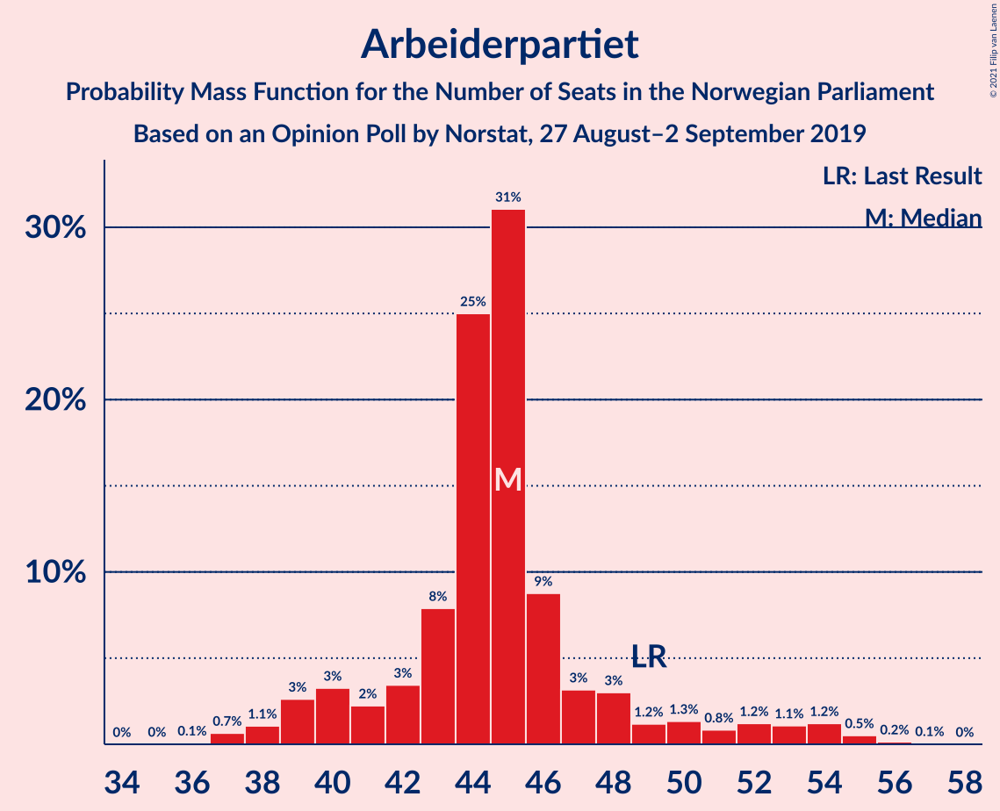

| Number of Seats | Probability | Accumulated | Special Marks |
|:---------------:|:-----------:|:-----------:|:-------------:|
| 36 | 0.1% | 100% |  |
| 37 | 0.7% | 99.9% |  |
| 38 | 1.1% | 99.2% |  |
| 39 | 3% | 98% |  |
| 40 | 3% | 96% |  |
| 41 | 2% | 92% |  |
| 42 | 3% | 90% |  |
| 43 | 8% | 87% |  |
| 44 | 25% | 79% |  |
| 45 | 31% | 54% | Median |
| 46 | 9% | 23% |  |
| 47 | 3% | 14% |  |
| 48 | 3% | 11% |  |
| 49 | 1.2% | 8% | Last Result |
| 50 | 1.3% | 6% |  |
| 51 | 0.8% | 5% |  |
| 52 | 1.2% | 4% |  |
| 53 | 1.1% | 3% |  |
| 54 | 1.2% | 2% |  |
| 55 | 0.5% | 0.7% |  |
| 56 | 0.2% | 0.2% |  |
| 57 | 0.1% | 0.1% |  |
| 58 | 0% | 0% |  |

### Høyre

*For a full overview of the results for this party, see the [Høyre](party-høyre.html) page.*

| Number of Seats | Probability | Accumulated | Special Marks |
|:---------------:|:-----------:|:-----------:|:-------------:|
| 27 | 0% | 100% |  |
| 28 | 0.1% | 99.9% |  |
| 29 | 0.2% | 99.8% |  |
| 30 | 0.5% | 99.6% |  |
| 31 | 1.4% | 99.1% |  |
| 32 | 4% | 98% |  |
| 33 | 4% | 94% |  |
| 34 | 9% | 90% |  |
| 35 | 15% | 82% |  |
| 36 | 14% | 66% |  |
| 37 | 18% | 52% | Median |
| 38 | 8% | 34% |  |
| 39 | 11% | 26% |  |
| 40 | 5% | 15% |  |
| 41 | 4% | 10% |  |
| 42 | 2% | 6% |  |
| 43 | 2% | 4% |  |
| 44 | 0.7% | 2% |  |
| 45 | 0.6% | 1.1% | Last Result |
| 46 | 0.2% | 0.5% |  |
| 47 | 0.1% | 0.3% |  |
| 48 | 0% | 0.2% |  |
| 49 | 0.1% | 0.1% |  |
| 50 | 0% | 0% |  |

### Senterpartiet

*For a full overview of the results for this party, see the [Senterpartiet](party-senterpartiet.html) page.*

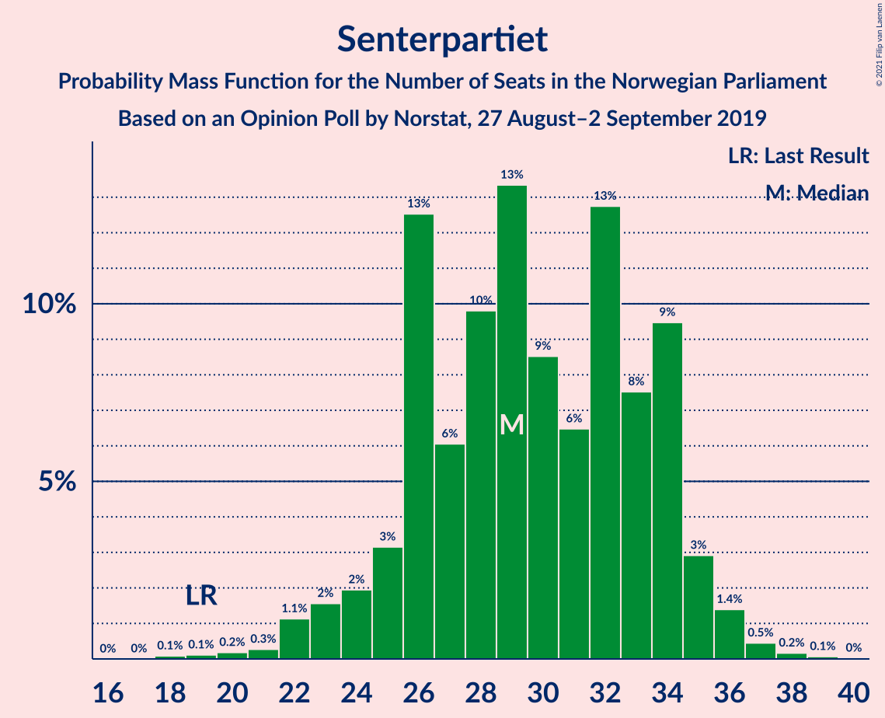

| Number of Seats | Probability | Accumulated | Special Marks |
|:---------------:|:-----------:|:-----------:|:-------------:|
| 18 | 0.1% | 100% |  |
| 19 | 0.1% | 99.9% | Last Result |
| 20 | 0.2% | 99.8% |  |
| 21 | 0.3% | 99.6% |  |
| 22 | 1.1% | 99.3% |  |
| 23 | 2% | 98% |  |
| 24 | 2% | 97% |  |
| 25 | 3% | 95% |  |
| 26 | 13% | 92% |  |
| 27 | 6% | 79% |  |
| 28 | 10% | 73% |  |
| 29 | 13% | 63% | Median |
| 30 | 9% | 50% |  |
| 31 | 6% | 41% |  |
| 32 | 13% | 35% |  |
| 33 | 8% | 22% |  |
| 34 | 9% | 15% |  |
| 35 | 3% | 5% |  |
| 36 | 1.4% | 2% |  |
| 37 | 0.5% | 0.7% |  |
| 38 | 0.2% | 0.3% |  |
| 39 | 0.1% | 0.1% |  |
| 40 | 0% | 0% |  |

### Fremskrittspartiet

*For a full overview of the results for this party, see the [Fremskrittspartiet](party-fremskrittspartiet.html) page.*

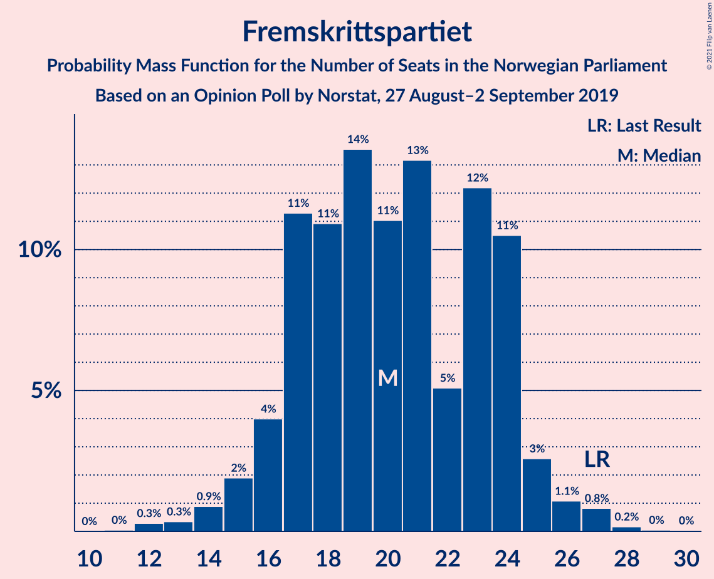

| Number of Seats | Probability | Accumulated | Special Marks |
|:---------------:|:-----------:|:-----------:|:-------------:|
| 11 | 0% | 100% |  |
| 12 | 0.3% | 99.9% |  |
| 13 | 0.3% | 99.7% |  |
| 14 | 0.9% | 99.3% |  |
| 15 | 2% | 98% |  |
| 16 | 4% | 97% |  |
| 17 | 11% | 93% |  |
| 18 | 11% | 81% |  |
| 19 | 14% | 70% |  |
| 20 | 11% | 57% | Median |
| 21 | 13% | 46% |  |
| 22 | 5% | 33% |  |
| 23 | 12% | 27% |  |
| 24 | 11% | 15% |  |
| 25 | 3% | 5% |  |
| 26 | 1.1% | 2% |  |
| 27 | 0.8% | 1.1% | Last Result |
| 28 | 0.2% | 0.3% |  |
| 29 | 0% | 0.1% |  |
| 30 | 0% | 0% |  |

### Sosialistisk Venstreparti

*For a full overview of the results for this party, see the [Sosialistisk Venstreparti](party-sosialistiskvenstreparti.html) page.*

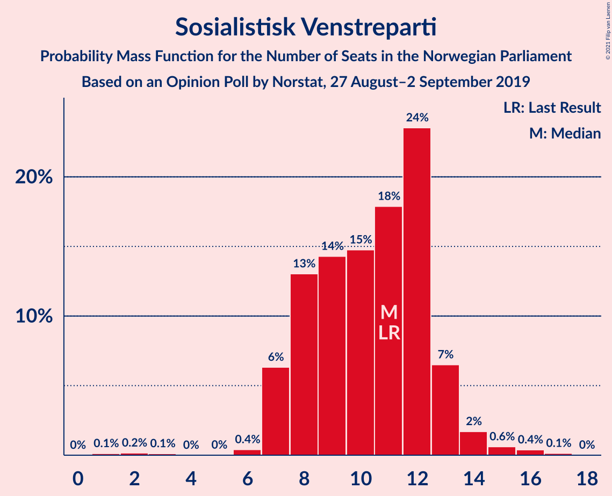

| Number of Seats | Probability | Accumulated | Special Marks |
|:---------------:|:-----------:|:-----------:|:-------------:|
| 1 | 0.1% | 100% |  |
| 2 | 0.2% | 99.9% |  |
| 3 | 0.1% | 99.7% |  |
| 4 | 0% | 99.6% |  |
| 5 | 0% | 99.6% |  |
| 6 | 0.4% | 99.6% |  |
| 7 | 6% | 99.2% |  |
| 8 | 13% | 93% |  |
| 9 | 14% | 80% |  |
| 10 | 15% | 66% |  |
| 11 | 18% | 51% | Last Result, Median |
| 12 | 24% | 33% |  |
| 13 | 7% | 9% |  |
| 14 | 2% | 3% |  |
| 15 | 0.6% | 1.2% |  |
| 16 | 0.4% | 0.5% |  |
| 17 | 0.1% | 0.2% |  |
| 18 | 0% | 0% |  |

### Miljøpartiet De Grønne

*For a full overview of the results for this party, see the [Miljøpartiet De Grønne](party-miljøpartietdegrønne.html) page.*

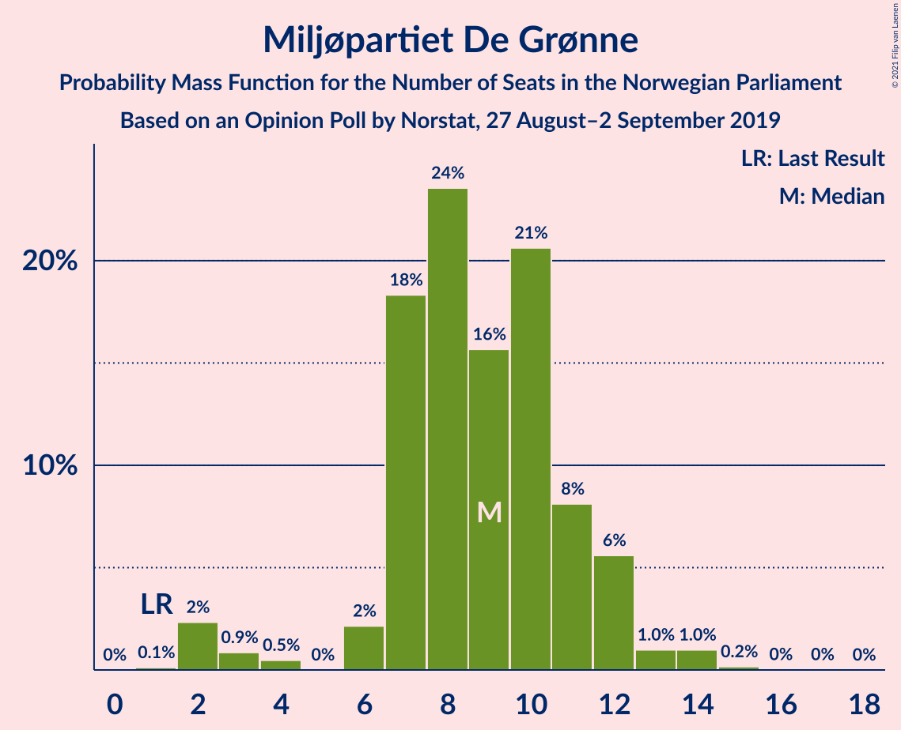

| Number of Seats | Probability | Accumulated | Special Marks |
|:---------------:|:-----------:|:-----------:|:-------------:|
| 1 | 0.1% | 100% | Last Result |
| 2 | 2% | 99.9% |  |
| 3 | 0.9% | 98% |  |
| 4 | 0.5% | 97% |  |
| 5 | 0% | 96% |  |
| 6 | 2% | 96% |  |
| 7 | 18% | 94% |  |
| 8 | 24% | 76% |  |
| 9 | 16% | 52% | Median |
| 10 | 21% | 37% |  |
| 11 | 8% | 16% |  |
| 12 | 6% | 8% |  |
| 13 | 1.0% | 2% |  |
| 14 | 1.0% | 1.2% |  |
| 15 | 0.2% | 0.2% |  |
| 16 | 0% | 0.1% |  |
| 17 | 0% | 0% |  |

### Rødt

*For a full overview of the results for this party, see the [Rødt](party-rødt.html) page.*

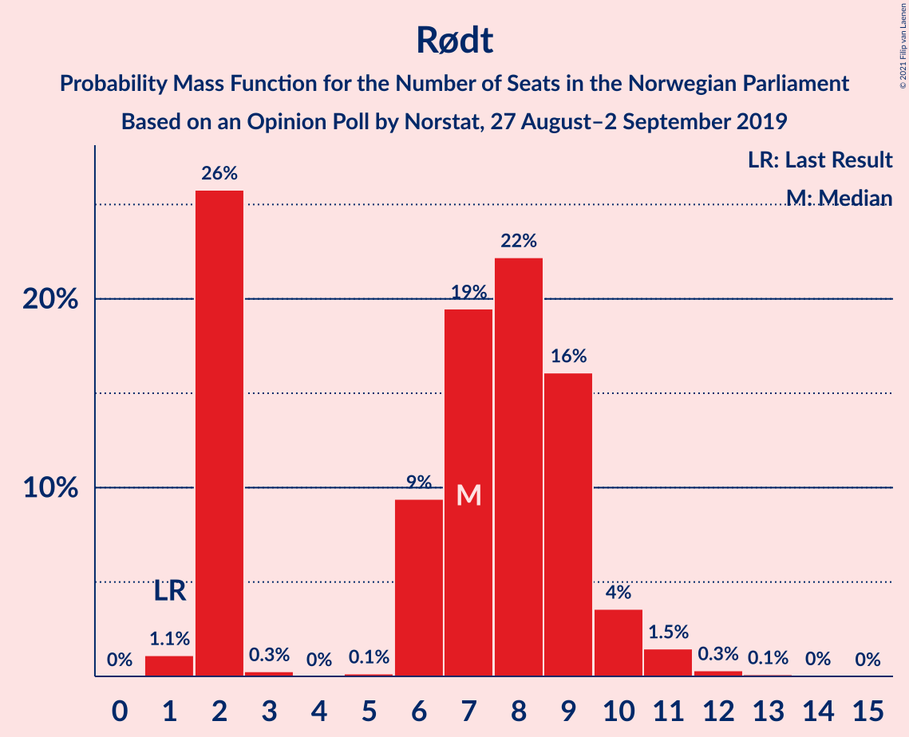

| Number of Seats | Probability | Accumulated | Special Marks |
|:---------------:|:-----------:|:-----------:|:-------------:|
| 1 | 1.1% | 100% | Last Result |
| 2 | 26% | 98.9% |  |
| 3 | 0.3% | 73% |  |
| 4 | 0% | 73% |  |
| 5 | 0.1% | 73% |  |
| 6 | 9% | 73% |  |
| 7 | 19% | 63% | Median |
| 8 | 22% | 44% |  |
| 9 | 16% | 22% |  |
| 10 | 4% | 6% |  |
| 11 | 1.5% | 2% |  |
| 12 | 0.3% | 0.5% |  |
| 13 | 0.1% | 0.2% |  |
| 14 | 0% | 0.1% |  |
| 15 | 0% | 0% |  |

### Kristelig Folkeparti

*For a full overview of the results for this party, see the [Kristelig Folkeparti](party-kristeligfolkeparti.html) page.*

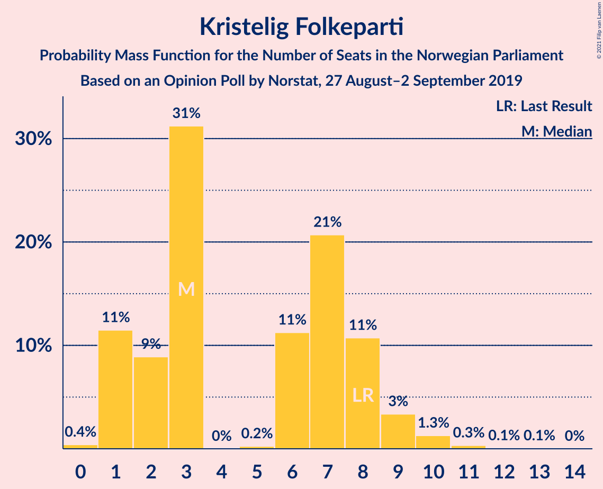

| Number of Seats | Probability | Accumulated | Special Marks |
|:---------------:|:-----------:|:-----------:|:-------------:|
| 0 | 0.4% | 100% |  |
| 1 | 11% | 99.6% |  |
| 2 | 9% | 88% |  |
| 3 | 31% | 79% | Median |
| 4 | 0% | 48% |  |
| 5 | 0.2% | 48% |  |
| 6 | 11% | 48% |  |
| 7 | 21% | 37% |  |
| 8 | 11% | 16% | Last Result |
| 9 | 3% | 5% |  |
| 10 | 1.3% | 2% |  |
| 11 | 0.3% | 0.4% |  |
| 12 | 0.1% | 0.1% |  |
| 13 | 0.1% | 0.1% |  |
| 14 | 0% | 0% |  |

### Venstre

*For a full overview of the results for this party, see the [Venstre](party-venstre.html) page.*

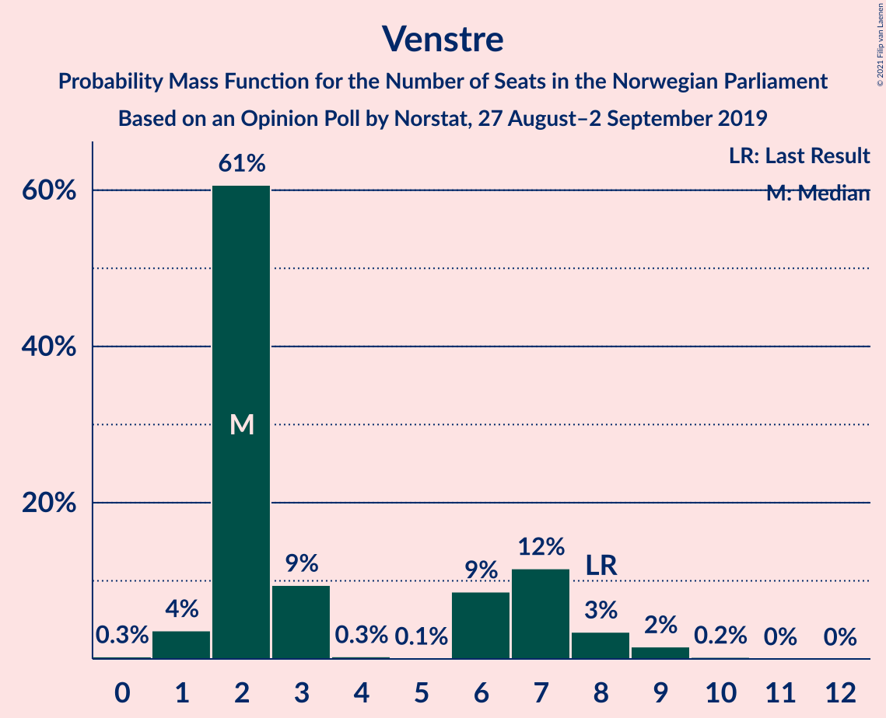

| Number of Seats | Probability | Accumulated | Special Marks |
|:---------------:|:-----------:|:-----------:|:-------------:|
| 0 | 0.3% | 100% |  |
| 1 | 4% | 99.7% |  |
| 2 | 61% | 96% | Median |
| 3 | 9% | 35% |  |
| 4 | 0.3% | 26% |  |
| 5 | 0.1% | 26% |  |
| 6 | 9% | 26% |  |
| 7 | 12% | 17% |  |
| 8 | 3% | 5% | Last Result |
| 9 | 2% | 2% |  |
| 10 | 0.2% | 0.3% |  |
| 11 | 0% | 0.1% |  |
| 12 | 0% | 0% |  |

## Coalitions

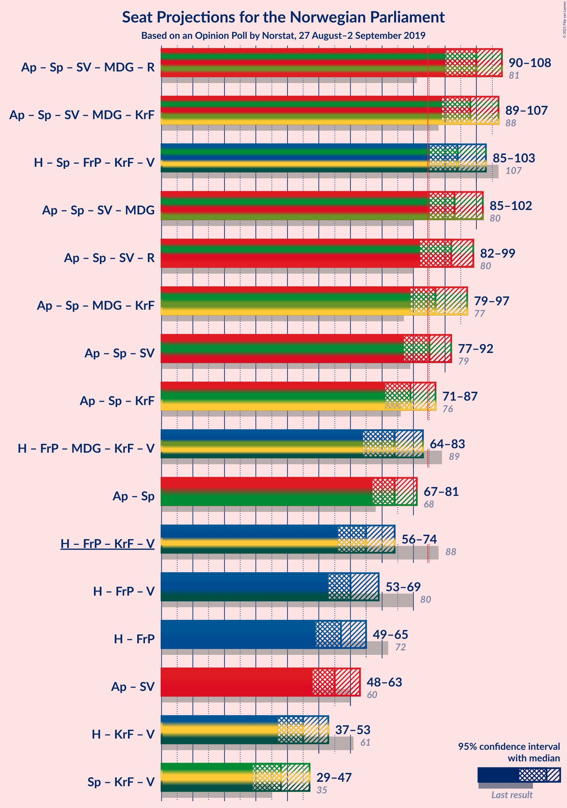

### Confidence Intervals

| Coalition | Last Result | Median | Majority? | 80% Confidence Interval | 90% Confidence Interval | 95% Confidence Interval | 99% Confidence Interval |
|:---------:|:-----------:|:------:|:---------:|:-----------------------:|:-----------------------:|:-----------------------:|:-----------------------:|
| Arbeiderpartiet – Senterpartiet – Sosialistisk Venstreparti – Miljøpartiet De Grønne – Rødt | 81 | 100 | 99.9% | 93–106 | 91–107 | 90–108 | 87–112 |
| Arbeiderpartiet – Senterpartiet – Sosialistisk Venstreparti – Miljøpartiet De Grønne – Kristelig Folkeparti | 88 | 98 | 99.7% | 93–105 | 91–107 | 89–107 | 86–110 |
| Høyre – Senterpartiet – Fremskrittspartiet – Kristelig Folkeparti – Venstre | 107 | 94 | 98% | 89–101 | 87–102 | 85–103 | 83–106 |
| Arbeiderpartiet – Senterpartiet – Sosialistisk Venstreparti – Miljøpartiet De Grønne | 80 | 93 | 98% | 88–99 | 86–101 | 85–102 | 82–106 |
| Arbeiderpartiet – Senterpartiet – Sosialistisk Venstreparti – Rødt | 80 | 92 | 90% | 85–96 | 82–98 | 82–99 | 78–102 |
| Arbeiderpartiet – Senterpartiet – Miljøpartiet De Grønne – Kristelig Folkeparti | 77 | 87 | 78% | 83–94 | 81–95 | 79–97 | 76–99 |
| Arbeiderpartiet – Senterpartiet – Sosialistisk Venstreparti | 79 | 85 | 52% | 80–90 | 78–91 | 77–92 | 74–95 |
| Arbeiderpartiet – Senterpartiet – Kristelig Folkeparti | 76 | 79 | 10% | 74–84 | 72–87 | 71–87 | 68–89 |
| Høyre – Fremskrittspartiet – Miljøpartiet De Grønne – Kristelig Folkeparti – Venstre | 89 | 74 | 1.2% | 68–80 | 66–81 | 64–83 | 62–87 |
| Arbeiderpartiet – Senterpartiet | 68 | 74 | 0.4% | 70–79 | 68–80 | 67–81 | 64–84 |
| Høyre – Fremskrittspartiet – Kristelig Folkeparti – Venstre | 88 | 65 | 0% | 60–71 | 58–72 | 56–74 | 53–77 |
| Høyre – Fremskrittspartiet – Venstre | 80 | 60 | 0% | 55–65 | 54–67 | 53–69 | 50–72 |
| Høyre – Fremskrittspartiet | 72 | 57 | 0% | 52–62 | 51–63 | 49–65 | 47–68 |
| Arbeiderpartiet – Sosialistisk Venstreparti | 60 | 55 | 0% | 51–59 | 49–61 | 48–63 | 46–66 |
| Høyre – Kristelig Folkeparti – Venstre | 61 | 45 | 0% | 40–50 | 38–52 | 37–53 | 36–57 |
| Senterpartiet – Kristelig Folkeparti – Venstre | 35 | 38 | 0% | 31–44 | 30–45 | 29–47 | 27–49 |

### Arbeiderpartiet – Senterpartiet – Sosialistisk Venstreparti – Miljøpartiet De Grønne – Rødt

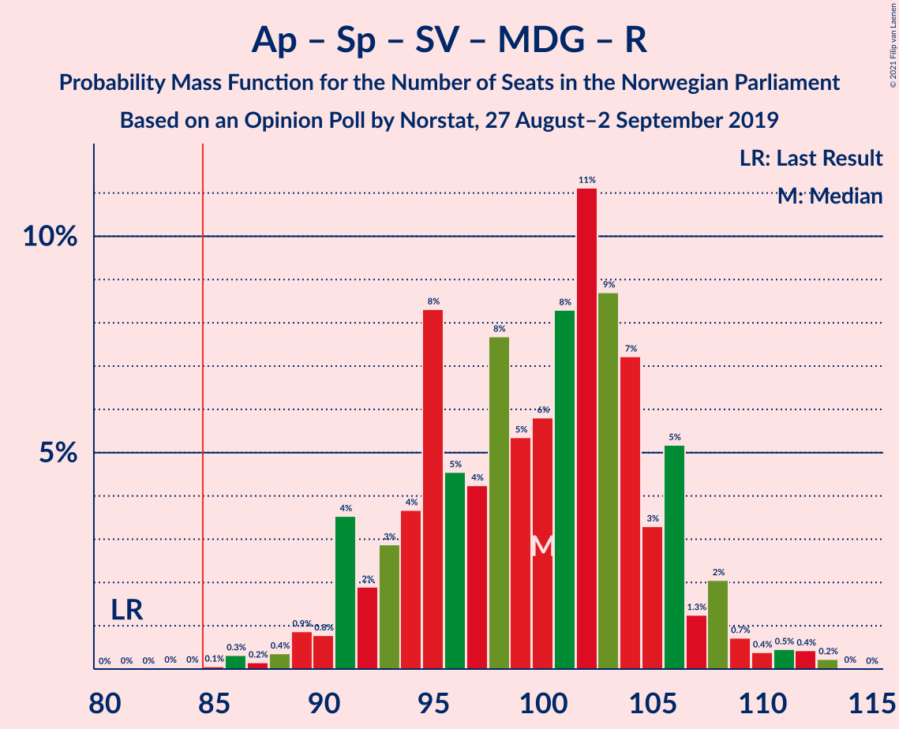

| Number of Seats | Probability | Accumulated | Special Marks |
|:---------------:|:-----------:|:-----------:|:-------------:|
| 81 | 0% | 100% | Last Result |
| 82 | 0% | 100% |  |
| 83 | 0% | 100% |  |
| 84 | 0% | 99.9% |  |
| 85 | 0.1% | 99.9% | Majority |
| 86 | 0.3% | 99.8% |  |
| 87 | 0.2% | 99.5% |  |
| 88 | 0.4% | 99.4% |  |
| 89 | 0.9% | 99.0% |  |
| 90 | 0.8% | 98% |  |
| 91 | 4% | 97% |  |
| 92 | 2% | 94% |  |
| 93 | 3% | 92% |  |
| 94 | 4% | 89% |  |
| 95 | 8% | 85% |  |
| 96 | 5% | 77% |  |
| 97 | 4% | 72% |  |
| 98 | 8% | 68% |  |
| 99 | 5% | 61% |  |
| 100 | 6% | 55% |  |
| 101 | 8% | 49% | Median |
| 102 | 11% | 41% |  |
| 103 | 9% | 30% |  |
| 104 | 7% | 21% |  |
| 105 | 3% | 14% |  |
| 106 | 5% | 11% |  |
| 107 | 1.3% | 6% |  |
| 108 | 2% | 4% |  |
| 109 | 0.7% | 2% |  |
| 110 | 0.4% | 2% |  |
| 111 | 0.5% | 1.2% |  |
| 112 | 0.4% | 0.7% |  |
| 113 | 0.2% | 0.3% |  |
| 114 | 0% | 0.1% |  |
| 115 | 0% | 0% |  |

### Arbeiderpartiet – Senterpartiet – Sosialistisk Venstreparti – Miljøpartiet De Grønne – Kristelig Folkeparti

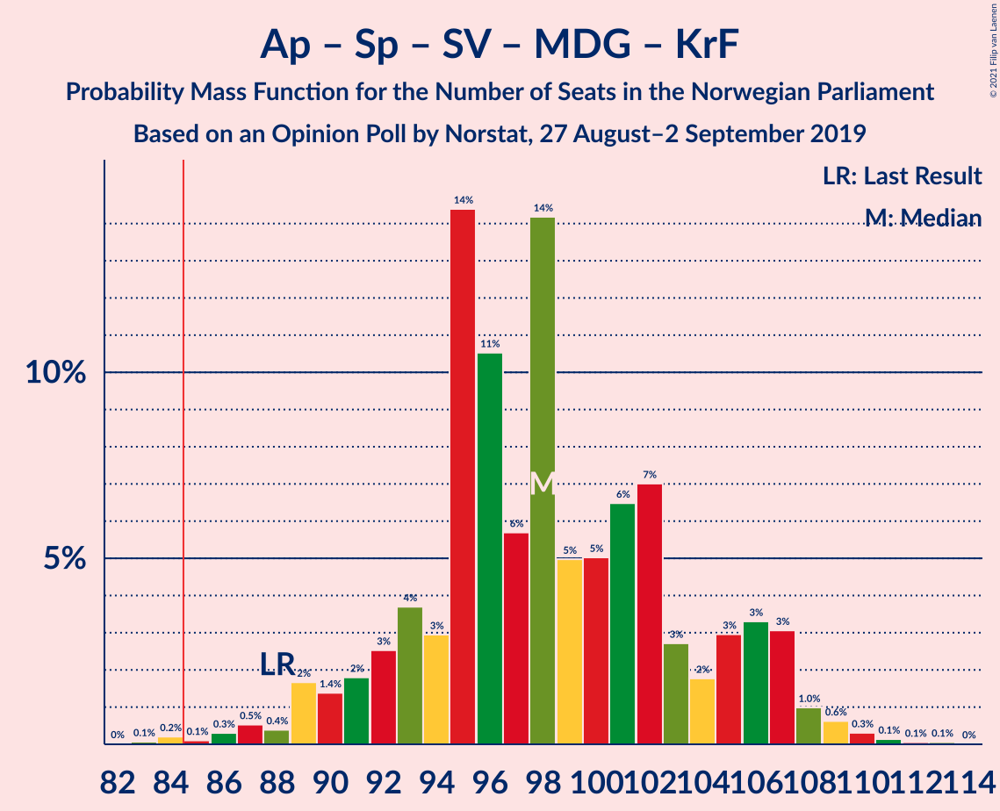

| Number of Seats | Probability | Accumulated | Special Marks |
|:---------------:|:-----------:|:-----------:|:-------------:|
| 83 | 0.1% | 100% |  |
| 84 | 0.2% | 99.9% |  |
| 85 | 0.1% | 99.7% | Majority |
| 86 | 0.3% | 99.6% |  |
| 87 | 0.5% | 99.3% |  |
| 88 | 0.4% | 98.7% | Last Result |
| 89 | 2% | 98% |  |
| 90 | 1.4% | 97% |  |
| 91 | 2% | 95% |  |
| 92 | 3% | 94% |  |
| 93 | 4% | 91% |  |
| 94 | 3% | 87% |  |
| 95 | 14% | 84% |  |
| 96 | 11% | 70% |  |
| 97 | 6% | 59% | Median |
| 98 | 14% | 54% |  |
| 99 | 5% | 40% |  |
| 100 | 5% | 35% |  |
| 101 | 6% | 30% |  |
| 102 | 7% | 23% |  |
| 103 | 3% | 16% |  |
| 104 | 2% | 13% |  |
| 105 | 3% | 12% |  |
| 106 | 3% | 9% |  |
| 107 | 3% | 5% |  |
| 108 | 1.0% | 2% |  |
| 109 | 0.6% | 1.2% |  |
| 110 | 0.3% | 0.6% |  |
| 111 | 0.1% | 0.3% |  |
| 112 | 0.1% | 0.1% |  |
| 113 | 0.1% | 0.1% |  |
| 114 | 0% | 0% |  |

### Høyre – Senterpartiet – Fremskrittspartiet – Kristelig Folkeparti – Venstre

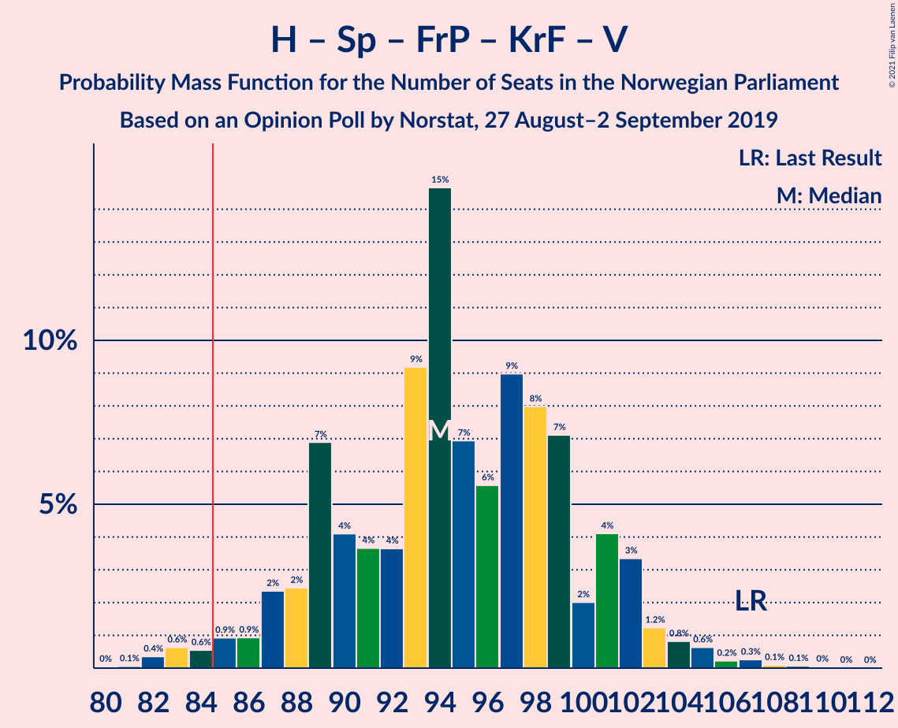

| Number of Seats | Probability | Accumulated | Special Marks |
|:---------------:|:-----------:|:-----------:|:-------------:|
| 80 | 0% | 100% |  |
| 81 | 0.1% | 99.9% |  |
| 82 | 0.4% | 99.9% |  |
| 83 | 0.6% | 99.5% |  |
| 84 | 0.6% | 98.9% |  |
| 85 | 0.9% | 98% | Majority |
| 86 | 0.9% | 97% |  |
| 87 | 2% | 96% |  |
| 88 | 2% | 94% |  |
| 89 | 7% | 92% |  |
| 90 | 4% | 85% |  |
| 91 | 4% | 81% | Median |
| 92 | 4% | 77% |  |
| 93 | 9% | 73% |  |
| 94 | 15% | 64% |  |
| 95 | 7% | 49% |  |
| 96 | 6% | 43% |  |
| 97 | 9% | 37% |  |
| 98 | 8% | 28% |  |
| 99 | 7% | 20% |  |
| 100 | 2% | 13% |  |
| 101 | 4% | 11% |  |
| 102 | 3% | 7% |  |
| 103 | 1.2% | 3% |  |
| 104 | 0.8% | 2% |  |
| 105 | 0.6% | 1.4% |  |
| 106 | 0.2% | 0.7% |  |
| 107 | 0.3% | 0.5% | Last Result |
| 108 | 0.1% | 0.2% |  |
| 109 | 0.1% | 0.1% |  |
| 110 | 0% | 0.1% |  |
| 111 | 0% | 0% |  |

### Arbeiderpartiet – Senterpartiet – Sosialistisk Venstreparti – Miljøpartiet De Grønne

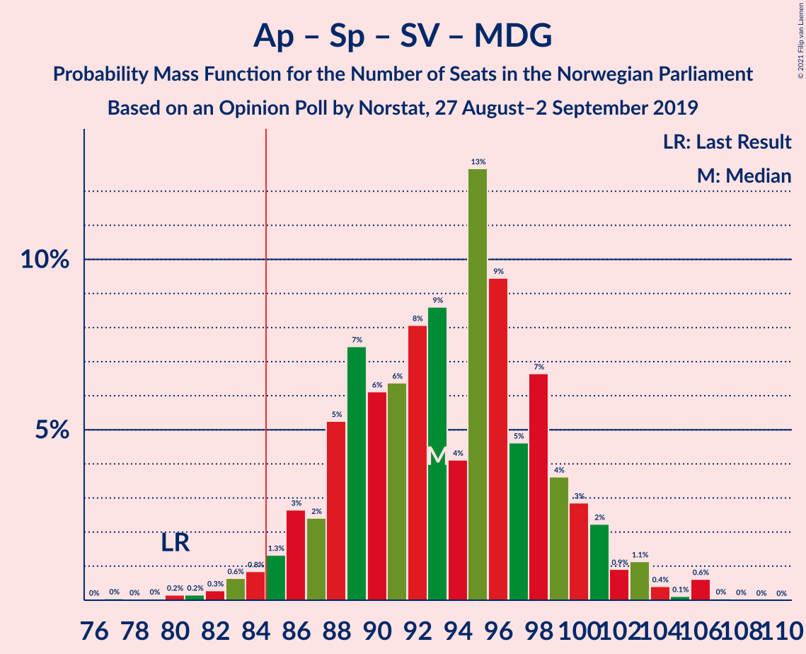

| Number of Seats | Probability | Accumulated | Special Marks |
|:---------------:|:-----------:|:-----------:|:-------------:|
| 77 | 0% | 100% |  |
| 78 | 0% | 99.9% |  |
| 79 | 0% | 99.9% |  |
| 80 | 0.2% | 99.9% | Last Result |
| 81 | 0.2% | 99.7% |  |
| 82 | 0.3% | 99.5% |  |
| 83 | 0.6% | 99.3% |  |
| 84 | 0.8% | 98.6% |  |
| 85 | 1.3% | 98% | Majority |
| 86 | 3% | 96% |  |
| 87 | 2% | 94% |  |
| 88 | 5% | 91% |  |
| 89 | 7% | 86% |  |
| 90 | 6% | 79% |  |
| 91 | 6% | 73% |  |
| 92 | 8% | 66% |  |
| 93 | 9% | 58% |  |
| 94 | 4% | 50% | Median |
| 95 | 13% | 45% |  |
| 96 | 9% | 33% |  |
| 97 | 5% | 23% |  |
| 98 | 7% | 19% |  |
| 99 | 4% | 12% |  |
| 100 | 3% | 8% |  |
| 101 | 2% | 6% |  |
| 102 | 0.9% | 3% |  |
| 103 | 1.1% | 2% |  |
| 104 | 0.4% | 1.2% |  |
| 105 | 0.1% | 0.8% |  |
| 106 | 0.6% | 0.7% |  |
| 107 | 0% | 0.1% |  |
| 108 | 0% | 0.1% |  |
| 109 | 0% | 0% |  |

### Arbeiderpartiet – Senterpartiet – Sosialistisk Venstreparti – Rødt

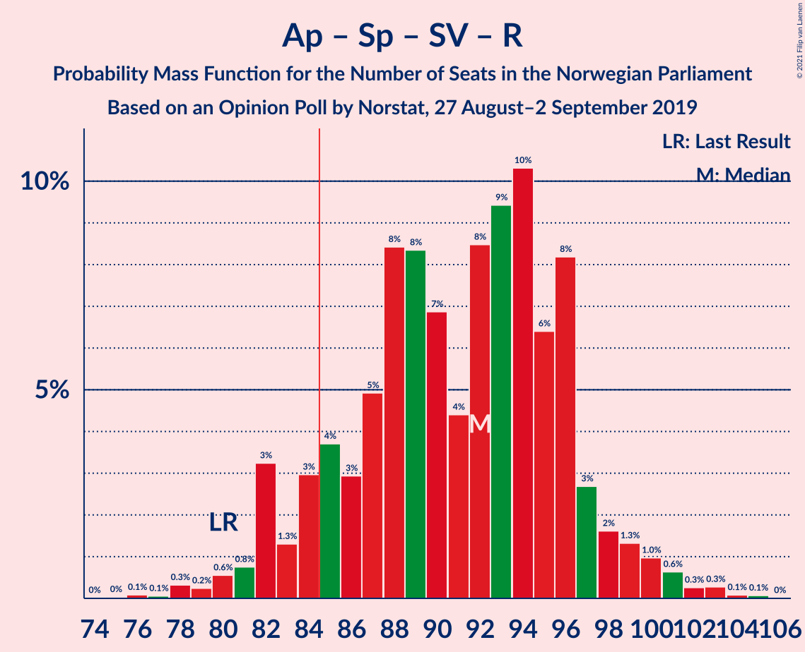

| Number of Seats | Probability | Accumulated | Special Marks |
|:---------------:|:-----------:|:-----------:|:-------------:|
| 75 | 0% | 100% |  |
| 76 | 0.1% | 99.9% |  |
| 77 | 0.1% | 99.9% |  |
| 78 | 0.3% | 99.8% |  |
| 79 | 0.2% | 99.5% |  |
| 80 | 0.6% | 99.2% | Last Result |
| 81 | 0.8% | 98.7% |  |
| 82 | 3% | 98% |  |
| 83 | 1.3% | 95% |  |
| 84 | 3% | 93% |  |
| 85 | 4% | 90% | Majority |
| 86 | 3% | 87% |  |
| 87 | 5% | 84% |  |
| 88 | 8% | 79% |  |
| 89 | 8% | 70% |  |
| 90 | 7% | 62% |  |
| 91 | 4% | 55% |  |
| 92 | 8% | 51% | Median |
| 93 | 9% | 42% |  |
| 94 | 10% | 33% |  |
| 95 | 6% | 23% |  |
| 96 | 8% | 16% |  |
| 97 | 3% | 8% |  |
| 98 | 2% | 5% |  |
| 99 | 1.3% | 4% |  |
| 100 | 1.0% | 2% |  |
| 101 | 0.6% | 1.4% |  |
| 102 | 0.3% | 0.7% |  |
| 103 | 0.3% | 0.5% |  |
| 104 | 0.1% | 0.2% |  |
| 105 | 0.1% | 0.1% |  |
| 106 | 0% | 0% |  |

### Arbeiderpartiet – Senterpartiet – Miljøpartiet De Grønne – Kristelig Folkeparti

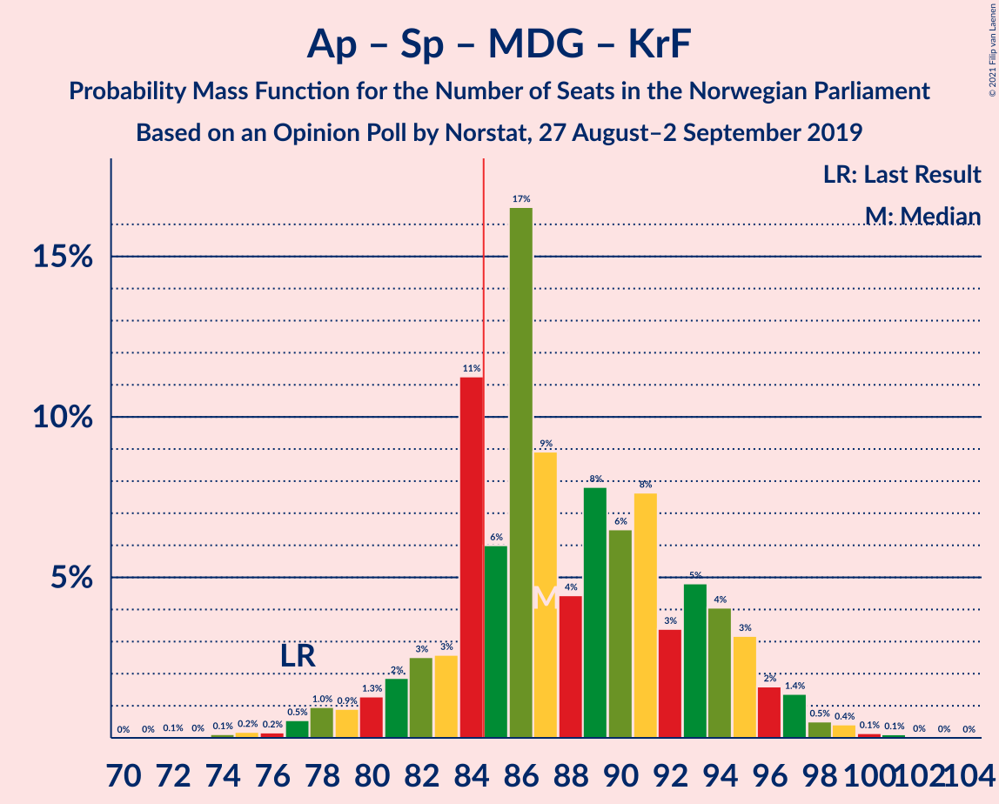

| Number of Seats | Probability | Accumulated | Special Marks |
|:---------------:|:-----------:|:-----------:|:-------------:|
| 72 | 0.1% | 100% |  |
| 73 | 0% | 99.9% |  |
| 74 | 0.1% | 99.9% |  |
| 75 | 0.2% | 99.8% |  |
| 76 | 0.2% | 99.6% |  |
| 77 | 0.5% | 99.4% | Last Result |
| 78 | 1.0% | 98.9% |  |
| 79 | 0.9% | 98% |  |
| 80 | 1.3% | 97% |  |
| 81 | 2% | 96% |  |
| 82 | 3% | 94% |  |
| 83 | 3% | 91% |  |
| 84 | 11% | 89% |  |
| 85 | 6% | 78% | Majority |
| 86 | 17% | 71% | Median |
| 87 | 9% | 55% |  |
| 88 | 4% | 46% |  |
| 89 | 8% | 42% |  |
| 90 | 6% | 34% |  |
| 91 | 8% | 27% |  |
| 92 | 3% | 20% |  |
| 93 | 5% | 16% |  |
| 94 | 4% | 11% |  |
| 95 | 3% | 7% |  |
| 96 | 2% | 4% |  |
| 97 | 1.4% | 3% |  |
| 98 | 0.5% | 1.2% |  |
| 99 | 0.4% | 0.7% |  |
| 100 | 0.1% | 0.3% |  |
| 101 | 0.1% | 0.2% |  |
| 102 | 0% | 0.1% |  |
| 103 | 0% | 0% |  |

### Arbeiderpartiet – Senterpartiet – Sosialistisk Venstreparti

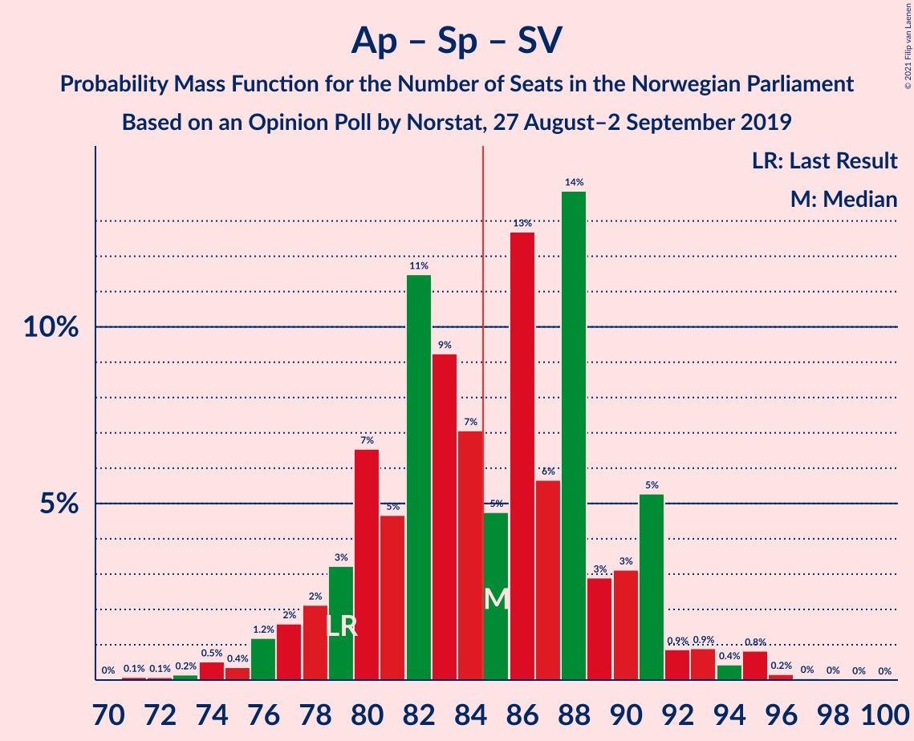

| Number of Seats | Probability | Accumulated | Special Marks |
|:---------------:|:-----------:|:-----------:|:-------------:|
| 70 | 0% | 100% |  |
| 71 | 0.1% | 99.9% |  |
| 72 | 0.1% | 99.8% |  |
| 73 | 0.2% | 99.8% |  |
| 74 | 0.5% | 99.6% |  |
| 75 | 0.4% | 99.1% |  |
| 76 | 1.2% | 98.7% |  |
| 77 | 2% | 98% |  |
| 78 | 2% | 96% |  |
| 79 | 3% | 94% | Last Result |
| 80 | 7% | 91% |  |
| 81 | 5% | 84% |  |
| 82 | 11% | 79% |  |
| 83 | 9% | 68% |  |
| 84 | 7% | 59% |  |
| 85 | 5% | 52% | Median, Majority |
| 86 | 13% | 47% |  |
| 87 | 6% | 34% |  |
| 88 | 14% | 28% |  |
| 89 | 3% | 15% |  |
| 90 | 3% | 12% |  |
| 91 | 5% | 9% |  |
| 92 | 0.9% | 3% |  |
| 93 | 0.9% | 2% |  |
| 94 | 0.4% | 2% |  |
| 95 | 0.8% | 1.1% |  |
| 96 | 0.2% | 0.3% |  |
| 97 | 0% | 0.1% |  |
| 98 | 0% | 0.1% |  |
| 99 | 0% | 0% |  |

### Arbeiderpartiet – Senterpartiet – Kristelig Folkeparti

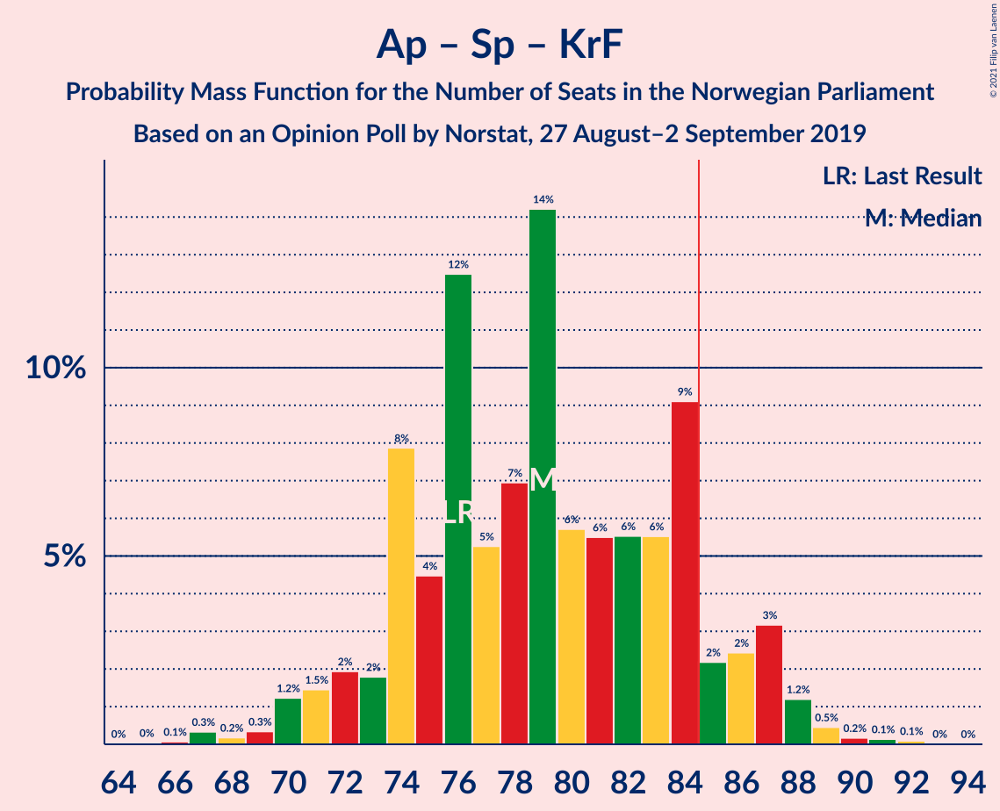

| Number of Seats | Probability | Accumulated | Special Marks |
|:---------------:|:-----------:|:-----------:|:-------------:|
| 65 | 0% | 100% |  |
| 66 | 0.1% | 99.9% |  |
| 67 | 0.3% | 99.8% |  |
| 68 | 0.2% | 99.5% |  |
| 69 | 0.3% | 99.3% |  |
| 70 | 1.2% | 99.0% |  |
| 71 | 1.5% | 98% |  |
| 72 | 2% | 96% |  |
| 73 | 2% | 94% |  |
| 74 | 8% | 93% |  |
| 75 | 4% | 85% |  |
| 76 | 12% | 80% | Last Result |
| 77 | 5% | 68% | Median |
| 78 | 7% | 62% |  |
| 79 | 14% | 56% |  |
| 80 | 6% | 41% |  |
| 81 | 6% | 36% |  |
| 82 | 6% | 30% |  |
| 83 | 6% | 25% |  |
| 84 | 9% | 19% |  |
| 85 | 2% | 10% | Majority |
| 86 | 2% | 8% |  |
| 87 | 3% | 5% |  |
| 88 | 1.2% | 2% |  |
| 89 | 0.5% | 0.9% |  |
| 90 | 0.2% | 0.5% |  |
| 91 | 0.1% | 0.3% |  |
| 92 | 0.1% | 0.1% |  |
| 93 | 0% | 0.1% |  |
| 94 | 0% | 0% |  |

### Høyre – Fremskrittspartiet – Miljøpartiet De Grønne – Kristelig Folkeparti – Venstre

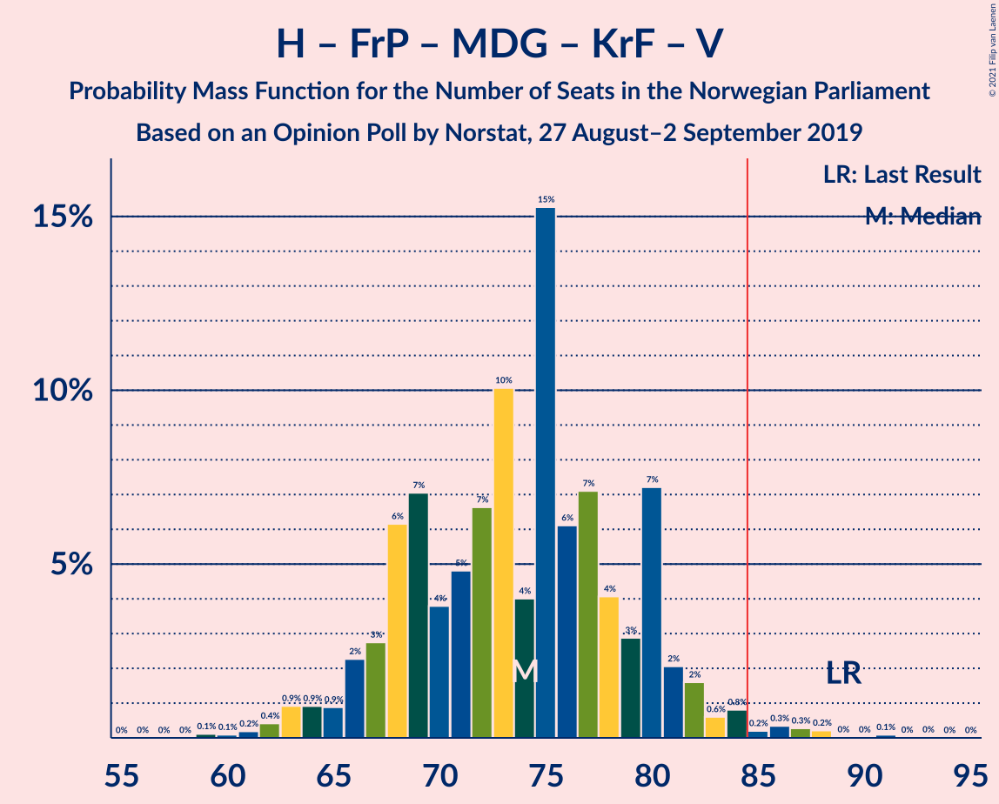

| Number of Seats | Probability | Accumulated | Special Marks |
|:---------------:|:-----------:|:-----------:|:-------------:|
| 59 | 0.1% | 100% |  |
| 60 | 0.1% | 99.9% |  |
| 61 | 0.2% | 99.8% |  |
| 62 | 0.4% | 99.6% |  |
| 63 | 0.9% | 99.2% |  |
| 64 | 0.9% | 98% |  |
| 65 | 0.9% | 97% |  |
| 66 | 2% | 96% |  |
| 67 | 3% | 94% |  |
| 68 | 6% | 91% |  |
| 69 | 7% | 85% |  |
| 70 | 4% | 78% |  |
| 71 | 5% | 74% | Median |
| 72 | 7% | 70% |  |
| 73 | 10% | 63% |  |
| 74 | 4% | 53% |  |
| 75 | 15% | 49% |  |
| 76 | 6% | 34% |  |
| 77 | 7% | 28% |  |
| 78 | 4% | 20% |  |
| 79 | 3% | 16% |  |
| 80 | 7% | 13% |  |
| 81 | 2% | 6% |  |
| 82 | 2% | 4% |  |
| 83 | 0.6% | 3% |  |
| 84 | 0.8% | 2% |  |
| 85 | 0.2% | 1.2% | Majority |
| 86 | 0.3% | 1.0% |  |
| 87 | 0.3% | 0.7% |  |
| 88 | 0.2% | 0.4% |  |
| 89 | 0% | 0.2% | Last Result |
| 90 | 0% | 0.1% |  |
| 91 | 0.1% | 0.1% |  |
| 92 | 0% | 0% |  |

### Arbeiderpartiet – Senterpartiet

| Number of Seats | Probability | Accumulated | Special Marks |
|:---------------:|:-----------:|:-----------:|:-------------:|
| 61 | 0.1% | 100% |  |
| 62 | 0.1% | 99.9% |  |
| 63 | 0.2% | 99.9% |  |
| 64 | 0.3% | 99.7% |  |
| 65 | 0.5% | 99.3% |  |
| 66 | 0.8% | 98.8% |  |
| 67 | 2% | 98% |  |
| 68 | 2% | 96% | Last Result |
| 69 | 3% | 94% |  |
| 70 | 5% | 92% |  |
| 71 | 11% | 87% |  |
| 72 | 7% | 76% |  |
| 73 | 12% | 69% |  |
| 74 | 12% | 57% | Median |
| 75 | 6% | 45% |  |
| 76 | 7% | 39% |  |
| 77 | 9% | 32% |  |
| 78 | 10% | 23% |  |
| 79 | 6% | 13% |  |
| 80 | 3% | 7% |  |
| 81 | 2% | 4% |  |
| 82 | 0.9% | 2% |  |
| 83 | 0.4% | 1.0% |  |
| 84 | 0.2% | 0.7% |  |
| 85 | 0.1% | 0.4% | Majority |
| 86 | 0.3% | 0.4% |  |
| 87 | 0% | 0.1% |  |
| 88 | 0% | 0.1% |  |
| 89 | 0% | 0% |  |

### Høyre – Fremskrittspartiet – Kristelig Folkeparti – Venstre

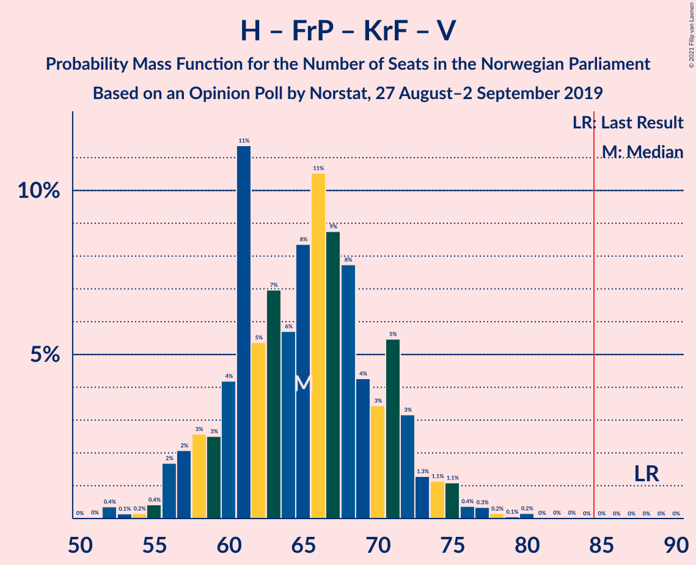

| Number of Seats | Probability | Accumulated | Special Marks |
|:---------------:|:-----------:|:-----------:|:-------------:|
| 51 | 0% | 100% |  |
| 52 | 0.4% | 99.9% |  |
| 53 | 0.1% | 99.6% |  |
| 54 | 0.2% | 99.4% |  |
| 55 | 0.4% | 99.3% |  |
| 56 | 2% | 98.9% |  |
| 57 | 2% | 97% |  |
| 58 | 3% | 95% |  |
| 59 | 3% | 93% |  |
| 60 | 4% | 90% |  |
| 61 | 11% | 86% |  |
| 62 | 5% | 74% | Median |
| 63 | 7% | 69% |  |
| 64 | 6% | 62% |  |
| 65 | 8% | 56% |  |
| 66 | 11% | 48% |  |
| 67 | 9% | 38% |  |
| 68 | 8% | 29% |  |
| 69 | 4% | 21% |  |
| 70 | 3% | 17% |  |
| 71 | 5% | 13% |  |
| 72 | 3% | 8% |  |
| 73 | 1.3% | 5% |  |
| 74 | 1.1% | 3% |  |
| 75 | 1.1% | 2% |  |
| 76 | 0.4% | 1.2% |  |
| 77 | 0.3% | 0.8% |  |
| 78 | 0.2% | 0.4% |  |
| 79 | 0.1% | 0.3% |  |
| 80 | 0.2% | 0.2% |  |
| 81 | 0% | 0.1% |  |
| 82 | 0% | 0.1% |  |
| 83 | 0% | 0% |  |
| 84 | 0% | 0% |  |
| 85 | 0% | 0% | Majority |
| 86 | 0% | 0% |  |
| 87 | 0% | 0% |  |
| 88 | 0% | 0% | Last Result |

### Høyre – Fremskrittspartiet – Venstre

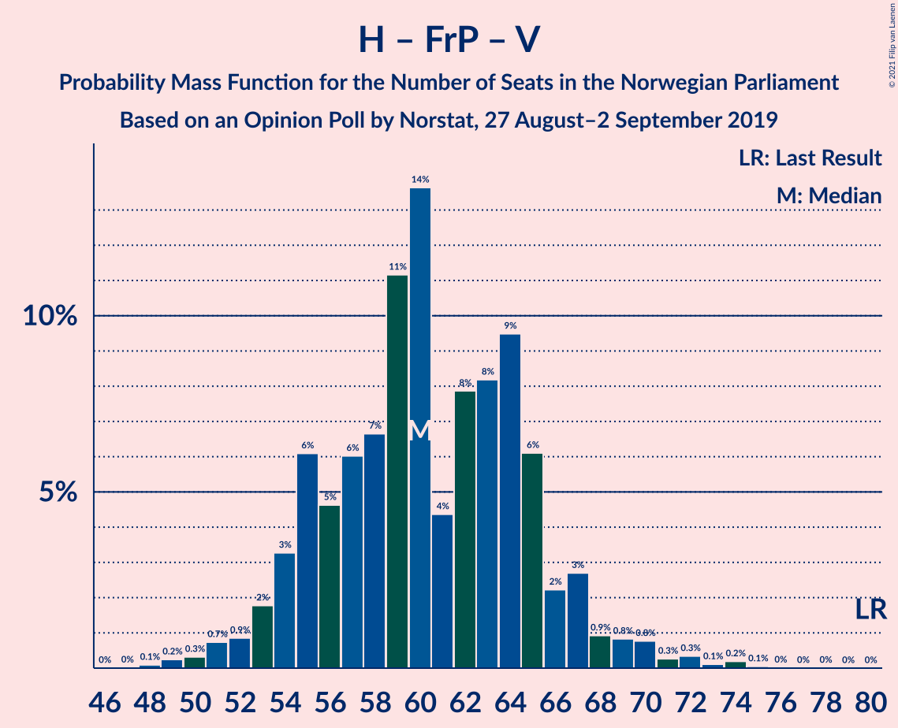

| Number of Seats | Probability | Accumulated | Special Marks |
|:---------------:|:-----------:|:-----------:|:-------------:|
| 48 | 0.1% | 100% |  |
| 49 | 0.2% | 99.9% |  |
| 50 | 0.3% | 99.6% |  |
| 51 | 0.7% | 99.3% |  |
| 52 | 0.9% | 98.6% |  |
| 53 | 2% | 98% |  |
| 54 | 3% | 96% |  |
| 55 | 6% | 93% |  |
| 56 | 5% | 87% |  |
| 57 | 6% | 82% |  |
| 58 | 7% | 76% |  |
| 59 | 11% | 69% | Median |
| 60 | 14% | 58% |  |
| 61 | 4% | 44% |  |
| 62 | 8% | 40% |  |
| 63 | 8% | 32% |  |
| 64 | 9% | 24% |  |
| 65 | 6% | 15% |  |
| 66 | 2% | 8% |  |
| 67 | 3% | 6% |  |
| 68 | 0.9% | 4% |  |
| 69 | 0.8% | 3% |  |
| 70 | 0.8% | 2% |  |
| 71 | 0.3% | 1.0% |  |
| 72 | 0.3% | 0.7% |  |
| 73 | 0.1% | 0.4% |  |
| 74 | 0.2% | 0.3% |  |
| 75 | 0.1% | 0.1% |  |
| 76 | 0% | 0% |  |
| 77 | 0% | 0% |  |
| 78 | 0% | 0% |  |
| 79 | 0% | 0% |  |
| 80 | 0% | 0% | Last Result |

### Høyre – Fremskrittspartiet

| Number of Seats | Probability | Accumulated | Special Marks |
|:---------------:|:-----------:|:-----------:|:-------------:|
| 45 | 0% | 100% |  |
| 46 | 0.2% | 99.9% |  |
| 47 | 0.7% | 99.8% |  |
| 48 | 0.5% | 99.1% |  |
| 49 | 2% | 98.6% |  |
| 50 | 1.2% | 97% |  |
| 51 | 3% | 96% |  |
| 52 | 4% | 92% |  |
| 53 | 10% | 88% |  |
| 54 | 5% | 78% |  |
| 55 | 7% | 73% |  |
| 56 | 10% | 66% |  |
| 57 | 11% | 56% | Median |
| 58 | 10% | 45% |  |
| 59 | 7% | 35% |  |
| 60 | 10% | 28% |  |
| 61 | 3% | 18% |  |
| 62 | 9% | 15% |  |
| 63 | 2% | 6% |  |
| 64 | 2% | 5% |  |
| 65 | 1.5% | 3% |  |
| 66 | 0.5% | 2% |  |
| 67 | 0.5% | 1.2% |  |
| 68 | 0.4% | 0.7% |  |
| 69 | 0.1% | 0.3% |  |
| 70 | 0.1% | 0.1% |  |
| 71 | 0% | 0.1% |  |
| 72 | 0% | 0% | Last Result |

### Arbeiderpartiet – Sosialistisk Venstreparti

| Number of Seats | Probability | Accumulated | Special Marks |
|:---------------:|:-----------:|:-----------:|:-------------:|
| 43 | 0% | 100% |  |
| 44 | 0.1% | 99.9% |  |
| 45 | 0.3% | 99.9% |  |
| 46 | 0.5% | 99.6% |  |
| 47 | 1.3% | 99.1% |  |
| 48 | 1.4% | 98% |  |
| 49 | 2% | 96% |  |
| 50 | 3% | 94% |  |
| 51 | 6% | 92% |  |
| 52 | 8% | 86% |  |
| 53 | 11% | 78% |  |
| 54 | 11% | 67% |  |
| 55 | 9% | 56% |  |
| 56 | 16% | 47% | Median |
| 57 | 13% | 31% |  |
| 58 | 6% | 18% |  |
| 59 | 2% | 12% |  |
| 60 | 2% | 10% | Last Result |
| 61 | 2% | 7% |  |
| 62 | 1.4% | 5% |  |
| 63 | 2% | 4% |  |
| 64 | 0.6% | 2% |  |
| 65 | 0.4% | 1.2% |  |
| 66 | 0.5% | 0.8% |  |
| 67 | 0.1% | 0.2% |  |
| 68 | 0% | 0.1% |  |
| 69 | 0% | 0.1% |  |
| 70 | 0% | 0% |  |

### Høyre – Kristelig Folkeparti – Venstre

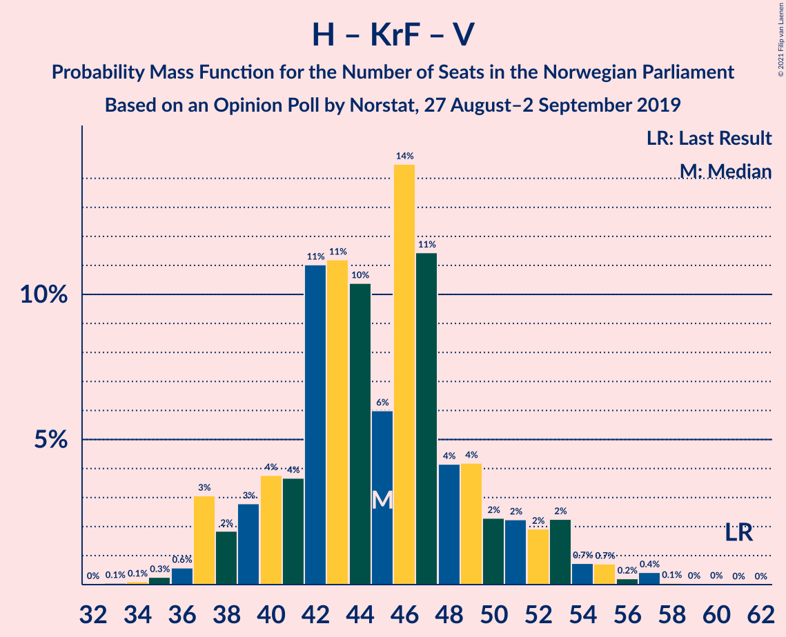

| Number of Seats | Probability | Accumulated | Special Marks |
|:---------------:|:-----------:|:-----------:|:-------------:|
| 33 | 0.1% | 100% |  |
| 34 | 0.1% | 99.9% |  |
| 35 | 0.3% | 99.8% |  |
| 36 | 0.6% | 99.6% |  |
| 37 | 3% | 99.0% |  |
| 38 | 2% | 96% |  |
| 39 | 3% | 94% |  |
| 40 | 4% | 91% |  |
| 41 | 4% | 88% |  |
| 42 | 11% | 84% | Median |
| 43 | 11% | 73% |  |
| 44 | 10% | 62% |  |
| 45 | 6% | 51% |  |
| 46 | 14% | 45% |  |
| 47 | 11% | 31% |  |
| 48 | 4% | 19% |  |
| 49 | 4% | 15% |  |
| 50 | 2% | 11% |  |
| 51 | 2% | 9% |  |
| 52 | 2% | 6% |  |
| 53 | 2% | 4% |  |
| 54 | 0.7% | 2% |  |
| 55 | 0.7% | 1.5% |  |
| 56 | 0.2% | 0.8% |  |
| 57 | 0.4% | 0.6% |  |
| 58 | 0.1% | 0.1% |  |
| 59 | 0% | 0.1% |  |
| 60 | 0% | 0.1% |  |
| 61 | 0% | 0% | Last Result |

### Senterpartiet – Kristelig Folkeparti – Venstre

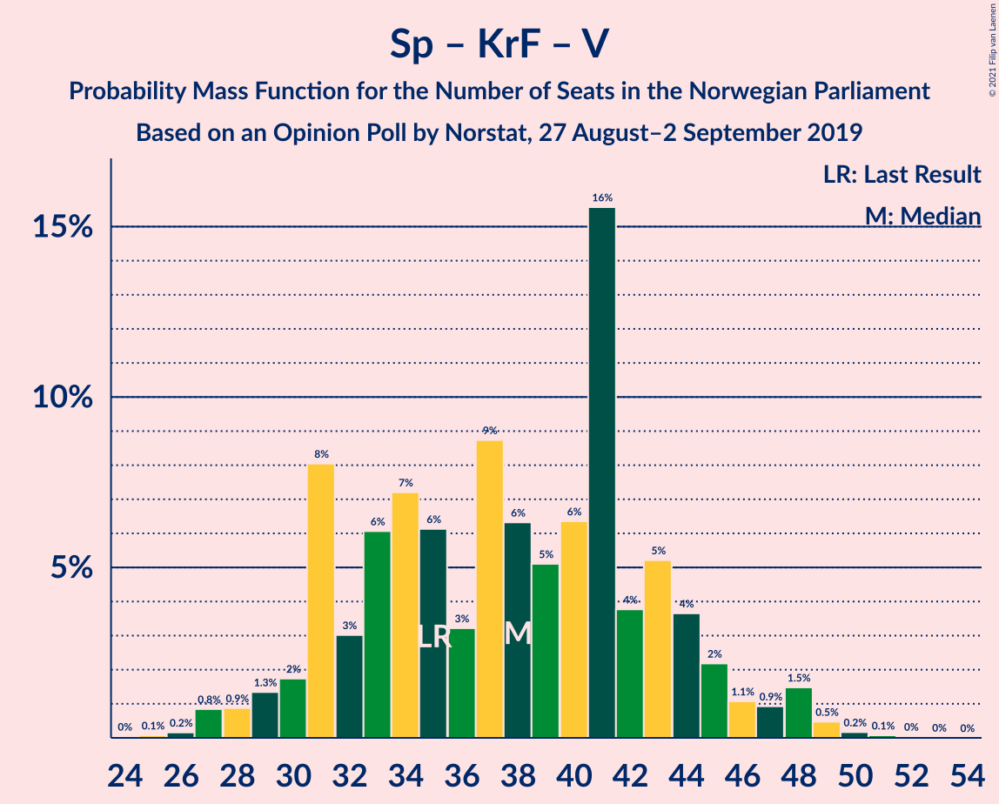

| Number of Seats | Probability | Accumulated | Special Marks |
|:---------------:|:-----------:|:-----------:|:-------------:|
| 24 | 0% | 100% |  |
| 25 | 0.1% | 99.9% |  |
| 26 | 0.2% | 99.9% |  |
| 27 | 0.8% | 99.7% |  |
| 28 | 0.9% | 98.9% |  |
| 29 | 1.3% | 98% |  |
| 30 | 2% | 97% |  |
| 31 | 8% | 95% |  |
| 32 | 3% | 87% |  |
| 33 | 6% | 84% |  |
| 34 | 7% | 78% | Median |
| 35 | 6% | 71% | Last Result |
| 36 | 3% | 64% |  |
| 37 | 9% | 61% |  |
| 38 | 6% | 52% |  |
| 39 | 5% | 46% |  |
| 40 | 6% | 41% |  |
| 41 | 16% | 35% |  |
| 42 | 4% | 19% |  |
| 43 | 5% | 15% |  |
| 44 | 4% | 10% |  |
| 45 | 2% | 6% |  |
| 46 | 1.1% | 4% |  |
| 47 | 0.9% | 3% |  |
| 48 | 1.5% | 2% |  |
| 49 | 0.5% | 0.8% |  |
| 50 | 0.2% | 0.3% |  |
| 51 | 0.1% | 0.1% |  |
| 52 | 0% | 0.1% |  |
| 53 | 0% | 0% |  |

## Technical Information

### Opinion Poll

+ **Polling firm:** Norstat
+ **Commissioner(s):** —
+ **Fieldwork period:** 27 August–2 September 2019

### Calculations

+ **Sample size:** 593
+ **Simulations done:** 1,048,576
+ **Error estimate:** 1.57%

