# Opinion Poll by Norstat, 17–19 September 2019

<a href="#voting-intentions">Voting Intentions</a> | <a href="#seats">Seats</a> | <a href="#coalitions">Coalitions</a> | <a href="#technical-information">Technical Information</a>

## Voting Intentions

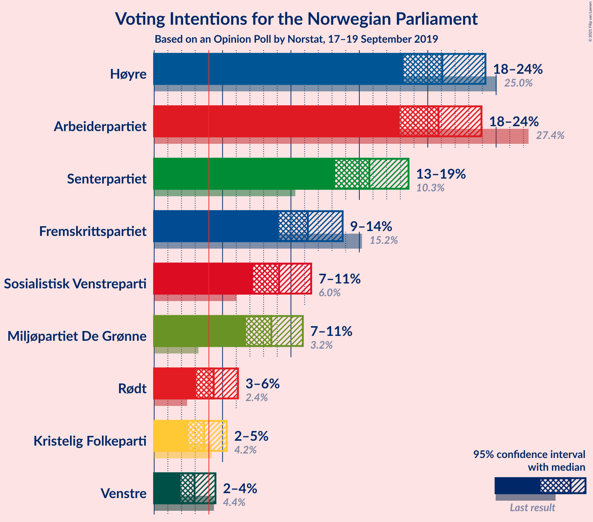

### Confidence Intervals

| Party | Last Result | Poll Result | 80% Confidence Interval | 90% Confidence Interval | 95% Confidence Interval | 99% Confidence Interval |
|:-----:|:-----------:|:-----------:|:-----------------------:|:-----------------------:|:-----------------------:|:-----------------------:|
| Høyre | 25.0% | 21.1% | 19.2–23.1% |18.7–23.7% |18.2–24.2% |17.4–25.2% |
| Arbeiderpartiet | 27.4% | 20.8% | 18.9–22.8% |18.4–23.4% |18.0–23.9% |17.1–24.9% |
| Senterpartiet | 10.3% | 15.7% | 14.1–17.6% |13.6–18.1% |13.2–18.6% |12.5–19.5% |
| Fremskrittspartiet | 15.2% | 11.2% | 9.8–12.9% |9.4–13.4% |9.1–13.8% |8.5–14.6% |
| Sosialistisk Venstreparti | 6.0% | 9.1% | 7.9–10.7% |7.5–11.1% |7.2–11.5% |6.7–12.3% |
| Miljøpartiet De Grønne | 3.2% | 8.6% | 7.3–10.1% |7.0–10.5% |6.7–10.9% |6.2–11.6% |
| Rødt | 2.4% | 4.4% | 3.5–5.5% |3.3–5.8% |3.1–6.1% |2.7–6.7% |
| Kristelig Folkeparti | 4.2% | 3.7% | 2.9–4.7% |2.7–5.0% |2.5–5.3% |2.2–5.9% |
| Venstre | 4.4% | 2.9% | 2.3–3.9% |2.1–4.2% |1.9–4.5% |1.7–5.0% |

*Note:* The poll result column reflects the actual value used in the calculations. Published results may vary slightly, and in addition be rounded to fewer digits.

## Seats

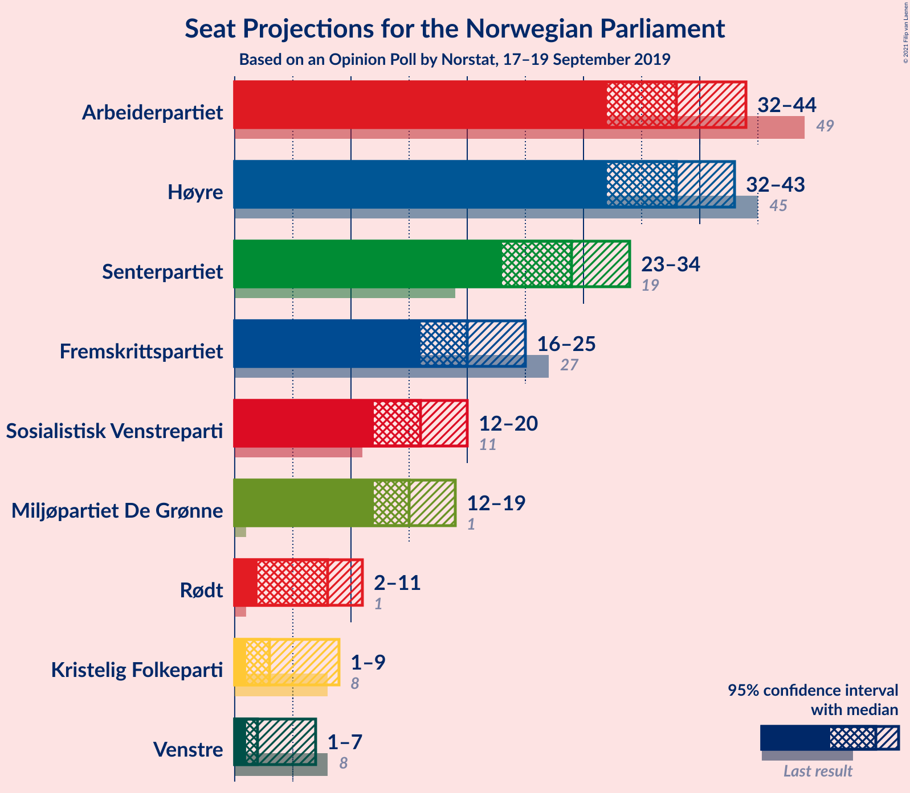

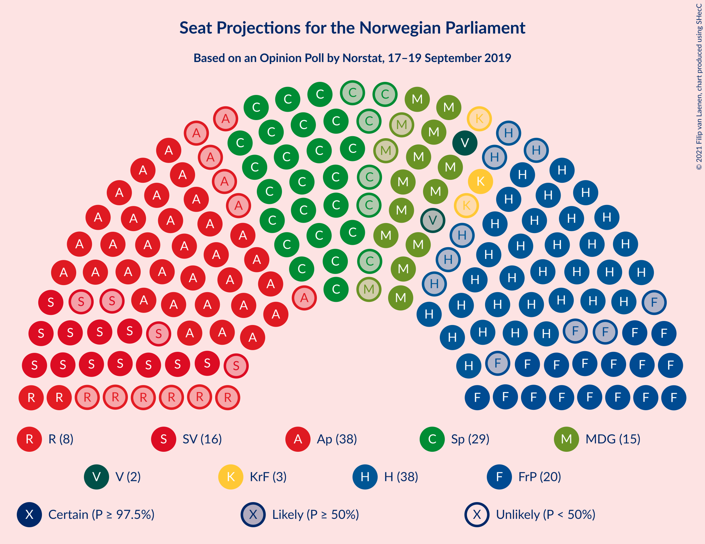

### Confidence Intervals

| Party | Last Result | Median | 80% Confidence Interval | 90% Confidence Interval | 95% Confidence Interval | 99% Confidence Interval |
|:-----:|:-----------:|:------:|:-----------------------:|:-----------------------:|:-----------------------:|:-----------------------:|
| <a href="#høyre">Høyre</a> | 45 | 38 | 33–41 |32–42 |32–43 |30–46 |
| <a href="#arbeiderpartiet">Arbeiderpartiet</a> | 49 | 38 | 35–42 |33–43 |32–44 |30–45 |
| <a href="#senterpartiet">Senterpartiet</a> | 19 | 29 | 25–33 |24–34 |23–34 |22–37 |
| <a href="#fremskrittspartiet">Fremskrittspartiet</a> | 27 | 20 | 17–23 |16–24 |16–25 |14–26 |
| <a href="#sosialistisk-venstreparti">Sosialistisk Venstreparti</a> | 11 | 16 | 13–19 |13–20 |12–20 |11–22 |
| <a href="#miljøpartiet-de-grønne">Miljøpartiet De Grønne</a> | 1 | 15 | 12–18 |12–19 |12–19 |11–21 |
| <a href="#rødt">Rødt</a> | 1 | 8 | 2–9 |2–10 |2–11 |1–12 |
| <a href="#kristelig-folkeparti">Kristelig Folkeparti</a> | 8 | 3 | 1–8 |1–9 |1–9 |0–10 |
| <a href="#venstre">Venstre</a> | 8 | 2 | 1–3 |1–7 |1–7 |0–8 |

### Høyre

*For a full overview of the results for this party, see the [Høyre](party-høyre.html) page.*

| Number of Seats | Probability | Accumulated | Special Marks |
|:---------------:|:-----------:|:-----------:|:-------------:|
| 28 | 0% | 100% |  |
| 29 | 0.3% | 99.9% |  |
| 30 | 0.4% | 99.7% |  |
| 31 | 0.9% | 99.2% |  |
| 32 | 4% | 98% |  |
| 33 | 6% | 94% |  |
| 34 | 7% | 88% |  |
| 35 | 9% | 81% |  |
| 36 | 6% | 72% |  |
| 37 | 11% | 66% |  |
| 38 | 15% | 55% | Median |
| 39 | 12% | 40% |  |
| 40 | 12% | 28% |  |
| 41 | 8% | 16% |  |
| 42 | 5% | 8% |  |
| 43 | 0.9% | 3% |  |
| 44 | 1.1% | 2% |  |
| 45 | 0.4% | 1.1% | Last Result |
| 46 | 0.4% | 0.7% |  |
| 47 | 0.3% | 0.3% |  |
| 48 | 0% | 0.1% |  |
| 49 | 0% | 0% |  |

### Arbeiderpartiet

*For a full overview of the results for this party, see the [Arbeiderpartiet](party-arbeiderpartiet.html) page.*

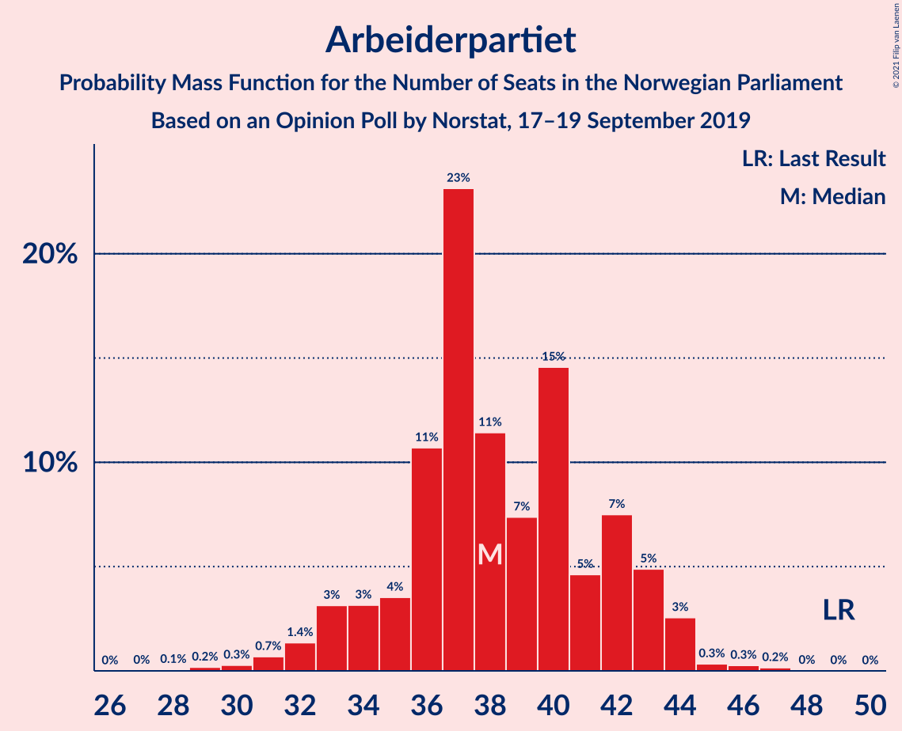

| Number of Seats | Probability | Accumulated | Special Marks |
|:---------------:|:-----------:|:-----------:|:-------------:|
| 28 | 0.1% | 100% |  |
| 29 | 0.2% | 99.9% |  |
| 30 | 0.3% | 99.7% |  |
| 31 | 0.7% | 99.4% |  |
| 32 | 1.4% | 98.8% |  |
| 33 | 3% | 97% |  |
| 34 | 3% | 94% |  |
| 35 | 4% | 91% |  |
| 36 | 11% | 88% |  |
| 37 | 23% | 77% |  |
| 38 | 11% | 54% | Median |
| 39 | 7% | 42% |  |
| 40 | 15% | 35% |  |
| 41 | 5% | 20% |  |
| 42 | 7% | 16% |  |
| 43 | 5% | 8% |  |
| 44 | 3% | 3% |  |
| 45 | 0.3% | 0.8% |  |
| 46 | 0.3% | 0.5% |  |
| 47 | 0.2% | 0.2% |  |
| 48 | 0% | 0% |  |
| 49 | 0% | 0% | Last Result |

### Senterpartiet

*For a full overview of the results for this party, see the [Senterpartiet](party-senterpartiet.html) page.*

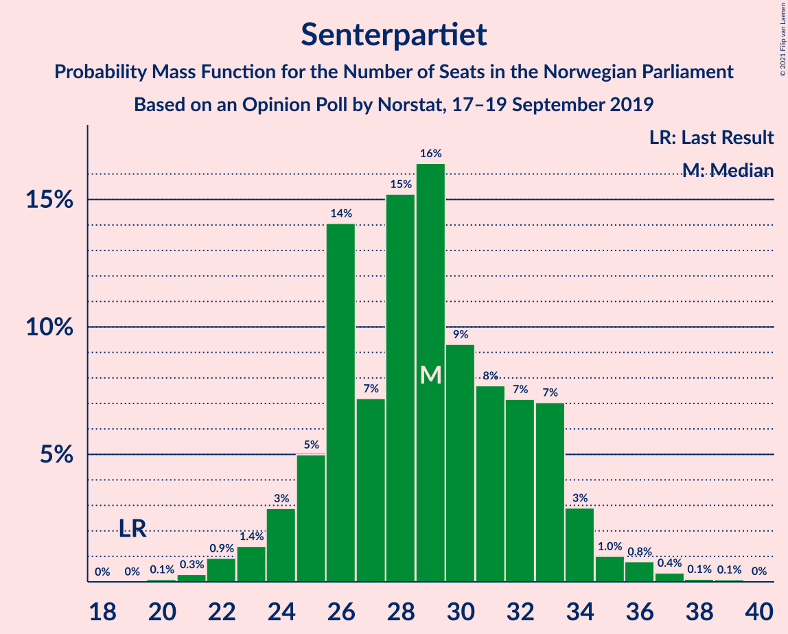

| Number of Seats | Probability | Accumulated | Special Marks |
|:---------------:|:-----------:|:-----------:|:-------------:|
| 19 | 0% | 100% | Last Result |
| 20 | 0.1% | 100% |  |
| 21 | 0.3% | 99.9% |  |
| 22 | 0.9% | 99.6% |  |
| 23 | 1.4% | 98.7% |  |
| 24 | 3% | 97% |  |
| 25 | 5% | 94% |  |
| 26 | 14% | 89% |  |
| 27 | 7% | 75% |  |
| 28 | 15% | 68% |  |
| 29 | 16% | 53% | Median |
| 30 | 9% | 37% |  |
| 31 | 8% | 27% |  |
| 32 | 7% | 19% |  |
| 33 | 7% | 12% |  |
| 34 | 3% | 5% |  |
| 35 | 1.0% | 2% |  |
| 36 | 0.8% | 1.4% |  |
| 37 | 0.4% | 0.6% |  |
| 38 | 0.1% | 0.2% |  |
| 39 | 0.1% | 0.1% |  |
| 40 | 0% | 0% |  |

### Fremskrittspartiet

*For a full overview of the results for this party, see the [Fremskrittspartiet](party-fremskrittspartiet.html) page.*

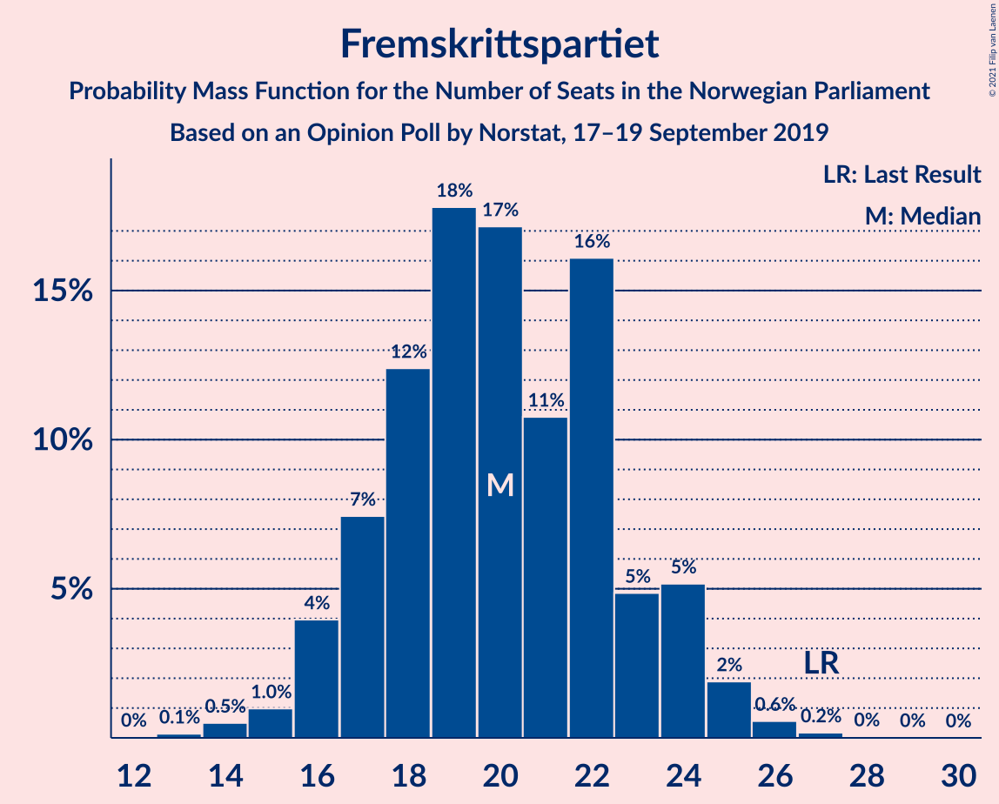

| Number of Seats | Probability | Accumulated | Special Marks |
|:---------------:|:-----------:|:-----------:|:-------------:|
| 13 | 0.1% | 100% |  |
| 14 | 0.5% | 99.8% |  |
| 15 | 1.0% | 99.3% |  |
| 16 | 4% | 98% |  |
| 17 | 7% | 94% |  |
| 18 | 12% | 87% |  |
| 19 | 18% | 75% |  |
| 20 | 17% | 57% | Median |
| 21 | 11% | 40% |  |
| 22 | 16% | 29% |  |
| 23 | 5% | 13% |  |
| 24 | 5% | 8% |  |
| 25 | 2% | 3% |  |
| 26 | 0.6% | 0.8% |  |
| 27 | 0.2% | 0.3% | Last Result |
| 28 | 0% | 0.1% |  |
| 29 | 0% | 0% |  |

### Sosialistisk Venstreparti

*For a full overview of the results for this party, see the [Sosialistisk Venstreparti](party-sosialistiskvenstreparti.html) page.*

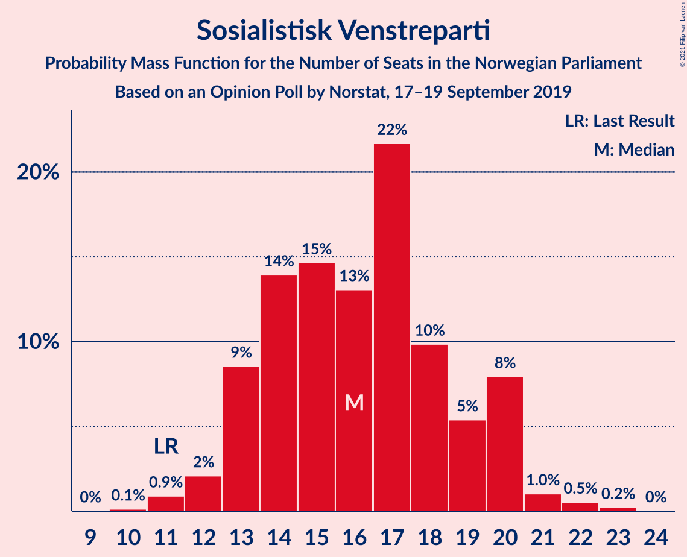

| Number of Seats | Probability | Accumulated | Special Marks |
|:---------------:|:-----------:|:-----------:|:-------------:|
| 10 | 0.1% | 100% |  |
| 11 | 0.9% | 99.9% | Last Result |
| 12 | 2% | 99.0% |  |
| 13 | 9% | 97% |  |
| 14 | 14% | 88% |  |
| 15 | 15% | 74% |  |
| 16 | 13% | 60% | Median |
| 17 | 22% | 47% |  |
| 18 | 10% | 25% |  |
| 19 | 5% | 15% |  |
| 20 | 8% | 10% |  |
| 21 | 1.0% | 2% |  |
| 22 | 0.5% | 0.8% |  |
| 23 | 0.2% | 0.3% |  |
| 24 | 0% | 0% |  |

### Miljøpartiet De Grønne

*For a full overview of the results for this party, see the [Miljøpartiet De Grønne](party-miljøpartietdegrønne.html) page.*

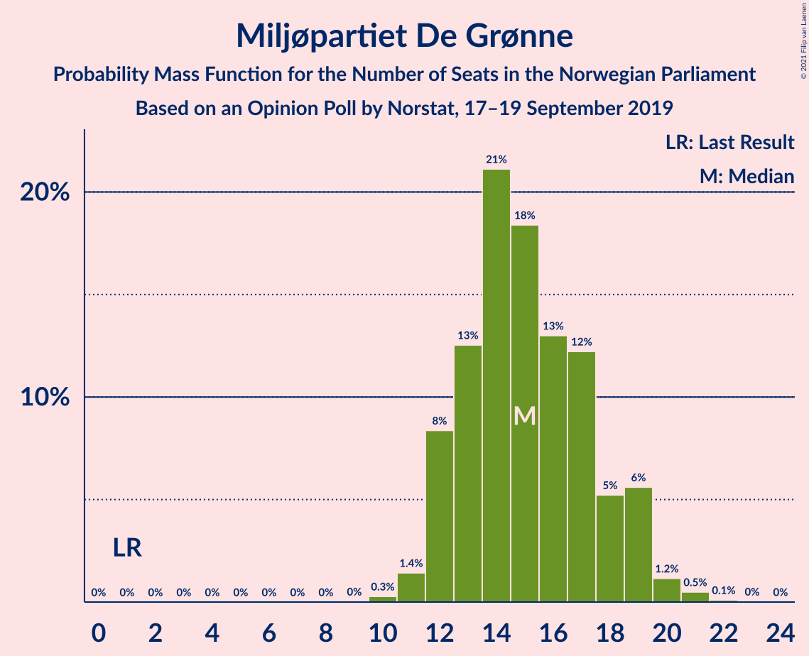

| Number of Seats | Probability | Accumulated | Special Marks |
|:---------------:|:-----------:|:-----------:|:-------------:|
| 1 | 0% | 100% | Last Result |
| 2 | 0% | 100% |  |
| 3 | 0% | 100% |  |
| 4 | 0% | 100% |  |
| 5 | 0% | 100% |  |
| 6 | 0% | 100% |  |
| 7 | 0% | 100% |  |
| 8 | 0% | 100% |  |
| 9 | 0% | 100% |  |
| 10 | 0.3% | 100% |  |
| 11 | 1.4% | 99.7% |  |
| 12 | 8% | 98% |  |
| 13 | 13% | 90% |  |
| 14 | 21% | 77% |  |
| 15 | 18% | 56% | Median |
| 16 | 13% | 38% |  |
| 17 | 12% | 25% |  |
| 18 | 5% | 13% |  |
| 19 | 6% | 7% |  |
| 20 | 1.2% | 2% |  |
| 21 | 0.5% | 0.6% |  |
| 22 | 0.1% | 0.1% |  |
| 23 | 0% | 0% |  |

### Rødt

*For a full overview of the results for this party, see the [Rødt](party-rødt.html) page.*

| Number of Seats | Probability | Accumulated | Special Marks |
|:---------------:|:-----------:|:-----------:|:-------------:|
| 1 | 1.3% | 100% | Last Result |
| 2 | 29% | 98.7% |  |
| 3 | 0% | 70% |  |
| 4 | 0% | 70% |  |
| 5 | 0% | 70% |  |
| 6 | 0.3% | 70% |  |
| 7 | 16% | 70% |  |
| 8 | 25% | 54% | Median |
| 9 | 21% | 29% |  |
| 10 | 5% | 8% |  |
| 11 | 3% | 3% |  |
| 12 | 0.5% | 0.6% |  |
| 13 | 0.1% | 0.1% |  |
| 14 | 0% | 0% |  |

### Kristelig Folkeparti

*For a full overview of the results for this party, see the [Kristelig Folkeparti](party-kristeligfolkeparti.html) page.*

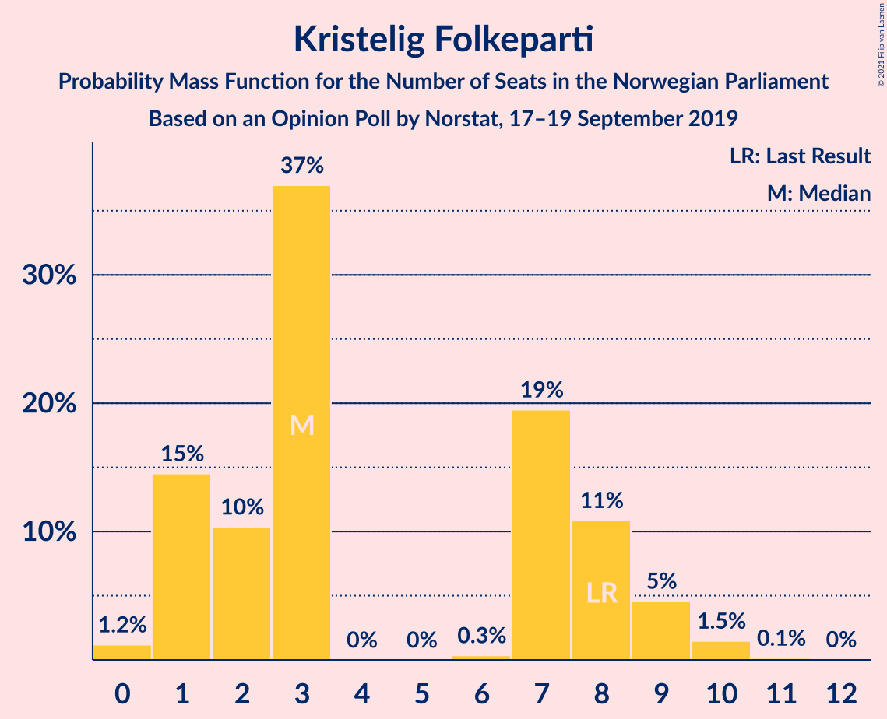

| Number of Seats | Probability | Accumulated | Special Marks |
|:---------------:|:-----------:|:-----------:|:-------------:|
| 0 | 1.2% | 100% |  |
| 1 | 15% | 98.8% |  |
| 2 | 10% | 84% |  |
| 3 | 37% | 74% | Median |
| 4 | 0% | 37% |  |
| 5 | 0% | 37% |  |
| 6 | 0.3% | 37% |  |
| 7 | 19% | 37% |  |
| 8 | 11% | 17% | Last Result |
| 9 | 5% | 6% |  |
| 10 | 1.5% | 2% |  |
| 11 | 0.1% | 0.2% |  |
| 12 | 0% | 0% |  |

### Venstre

*For a full overview of the results for this party, see the [Venstre](party-venstre.html) page.*

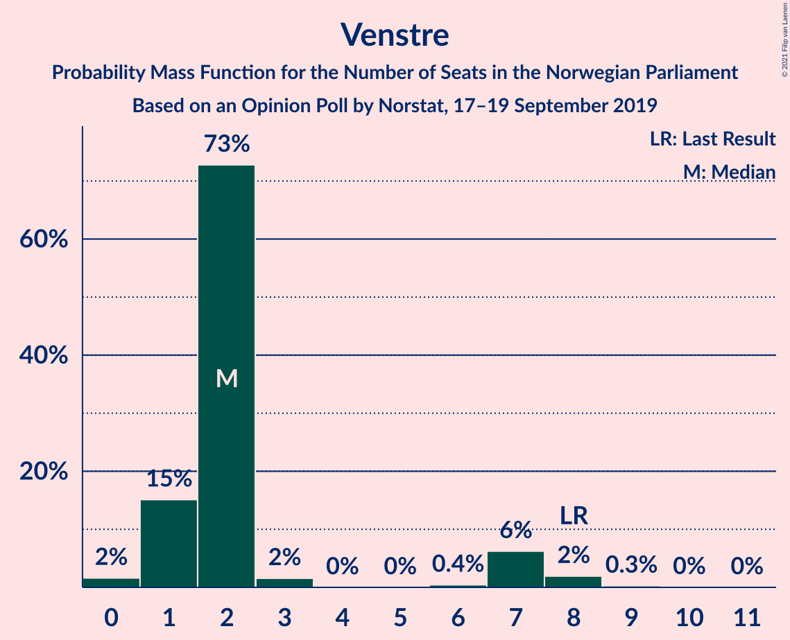

| Number of Seats | Probability | Accumulated | Special Marks |
|:---------------:|:-----------:|:-----------:|:-------------:|
| 0 | 2% | 100% |  |
| 1 | 15% | 98% |  |
| 2 | 73% | 83% | Median |
| 3 | 2% | 10% |  |
| 4 | 0% | 9% |  |
| 5 | 0% | 9% |  |
| 6 | 0.4% | 9% |  |
| 7 | 6% | 9% |  |
| 8 | 2% | 2% | Last Result |
| 9 | 0.3% | 0.3% |  |
| 10 | 0% | 0.1% |  |
| 11 | 0% | 0% |  |

## Coalitions

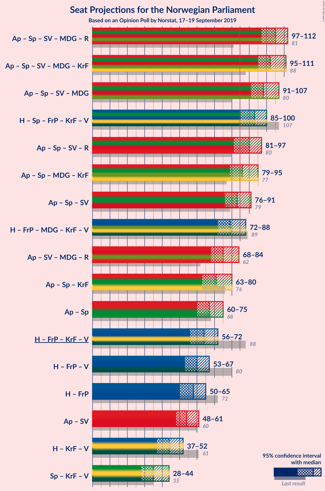

### Confidence Intervals

| Coalition | Last Result | Median | Majority? | 80% Confidence Interval | 90% Confidence Interval | 95% Confidence Interval | 99% Confidence Interval |
|:---------:|:-----------:|:------:|:---------:|:-----------------------:|:-----------------------:|:-----------------------:|:-----------------------:|
| Arbeiderpartiet – Senterpartiet – Sosialistisk Venstreparti – Miljøpartiet De Grønne – Rødt | 81 | 105 | 100% | 99–110 | 98–111 | 97–112 | 94–115 |
| Arbeiderpartiet – Senterpartiet – Sosialistisk Venstreparti – Miljøpartiet De Grønne – Kristelig Folkeparti | 88 | 102 | 100% | 97–108 | 96–110 | 95–111 | 92–114 |
| Arbeiderpartiet – Senterpartiet – Sosialistisk Venstreparti – Miljøpartiet De Grønne | 80 | 98 | 100% | 93–104 | 91–105 | 91–107 | 88–108 |
| Høyre – Senterpartiet – Fremskrittspartiet – Kristelig Folkeparti – Venstre | 107 | 93 | 98% | 88–98 | 86–99 | 85–100 | 83–103 |
| Arbeiderpartiet – Senterpartiet – Sosialistisk Venstreparti – Rødt | 80 | 90 | 88% | 84–95 | 82–96 | 81–97 | 78–100 |
| Arbeiderpartiet – Senterpartiet – Miljøpartiet De Grønne – Kristelig Folkeparti | 77 | 86 | 66% | 81–92 | 80–93 | 79–95 | 76–98 |
| Arbeiderpartiet – Senterpartiet – Sosialistisk Venstreparti | 79 | 83 | 40% | 78–88 | 77–90 | 76–91 | 74–93 |
| Høyre – Fremskrittspartiet – Miljøpartiet De Grønne – Kristelig Folkeparti – Venstre | 89 | 79 | 12% | 74–85 | 73–87 | 72–88 | 69–90 |
| Arbeiderpartiet – Sosialistisk Venstreparti – Miljøpartiet De Grønne – Rødt | 62 | 75 | 1.3% | 71–81 | 70–83 | 68–84 | 66–86 |
| Arbeiderpartiet – Senterpartiet – Kristelig Folkeparti | 76 | 71 | 0.1% | 67–78 | 64–79 | 63–80 | 61–82 |
| Arbeiderpartiet – Senterpartiet | 68 | 67 | 0% | 62–72 | 61–73 | 60–75 | 58–77 |
| Høyre – Fremskrittspartiet – Kristelig Folkeparti – Venstre | 88 | 64 | 0% | 59–70 | 57–71 | 56–72 | 54–75 |
| Høyre – Fremskrittspartiet – Venstre | 80 | 60 | 0% | 55–65 | 53–66 | 53–67 | 50–70 |
| Høyre – Fremskrittspartiet | 72 | 58 | 0% | 53–63 | 51–64 | 50–65 | 48–68 |
| Arbeiderpartiet – Sosialistisk Venstreparti | 60 | 54 | 0% | 50–59 | 49–60 | 48–61 | 46–63 |
| Høyre – Kristelig Folkeparti – Venstre | 61 | 44 | 0% | 39–49 | 37–51 | 37–52 | 35–54 |
| Senterpartiet – Kristelig Folkeparti – Venstre | 35 | 35 | 0% | 31–41 | 29–43 | 28–44 | 27–46 |

### Arbeiderpartiet – Senterpartiet – Sosialistisk Venstreparti – Miljøpartiet De Grønne – Rødt

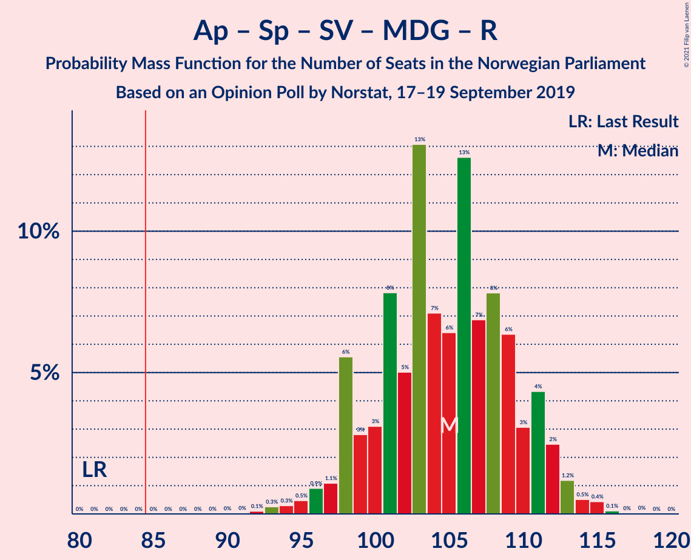

| Number of Seats | Probability | Accumulated | Special Marks |
|:---------------:|:-----------:|:-----------:|:-------------:|
| 81 | 0% | 100% | Last Result |
| 82 | 0% | 100% |  |
| 83 | 0% | 100% |  |
| 84 | 0% | 100% |  |
| 85 | 0% | 100% | Majority |
| 86 | 0% | 100% |  |
| 87 | 0% | 100% |  |
| 88 | 0% | 100% |  |
| 89 | 0% | 100% |  |
| 90 | 0% | 100% |  |
| 91 | 0% | 100% |  |
| 92 | 0.1% | 99.9% |  |
| 93 | 0.3% | 99.8% |  |
| 94 | 0.3% | 99.6% |  |
| 95 | 0.5% | 99.3% |  |
| 96 | 0.9% | 98.8% |  |
| 97 | 1.1% | 98% |  |
| 98 | 6% | 97% |  |
| 99 | 3% | 91% |  |
| 100 | 3% | 88% |  |
| 101 | 8% | 85% |  |
| 102 | 5% | 77% |  |
| 103 | 13% | 72% |  |
| 104 | 7% | 59% |  |
| 105 | 6% | 52% |  |
| 106 | 13% | 46% | Median |
| 107 | 7% | 33% |  |
| 108 | 8% | 26% |  |
| 109 | 6% | 19% |  |
| 110 | 3% | 12% |  |
| 111 | 4% | 9% |  |
| 112 | 2% | 5% |  |
| 113 | 1.2% | 2% |  |
| 114 | 0.5% | 1.1% |  |
| 115 | 0.4% | 0.6% |  |
| 116 | 0.1% | 0.2% |  |
| 117 | 0% | 0.1% |  |
| 118 | 0% | 0% |  |

### Arbeiderpartiet – Senterpartiet – Sosialistisk Venstreparti – Miljøpartiet De Grønne – Kristelig Folkeparti

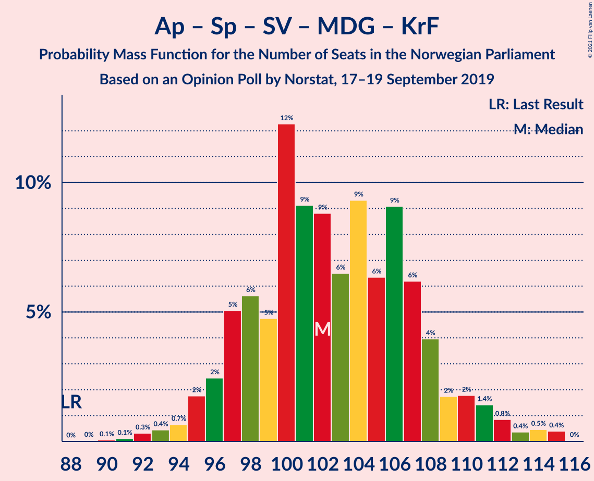

| Number of Seats | Probability | Accumulated | Special Marks |
|:---------------:|:-----------:|:-----------:|:-------------:|
| 88 | 0% | 100% | Last Result |
| 89 | 0% | 100% |  |
| 90 | 0.1% | 99.9% |  |
| 91 | 0.1% | 99.9% |  |
| 92 | 0.3% | 99.8% |  |
| 93 | 0.4% | 99.4% |  |
| 94 | 0.7% | 99.0% |  |
| 95 | 2% | 98% |  |
| 96 | 2% | 97% |  |
| 97 | 5% | 94% |  |
| 98 | 6% | 89% |  |
| 99 | 5% | 83% |  |
| 100 | 12% | 79% |  |
| 101 | 9% | 66% | Median |
| 102 | 9% | 57% |  |
| 103 | 6% | 48% |  |
| 104 | 9% | 42% |  |
| 105 | 6% | 33% |  |
| 106 | 9% | 26% |  |
| 107 | 6% | 17% |  |
| 108 | 4% | 11% |  |
| 109 | 2% | 7% |  |
| 110 | 2% | 5% |  |
| 111 | 1.4% | 4% |  |
| 112 | 0.8% | 2% |  |
| 113 | 0.4% | 1.3% |  |
| 114 | 0.5% | 0.9% |  |
| 115 | 0.4% | 0.4% |  |
| 116 | 0% | 0% |  |

### Arbeiderpartiet – Senterpartiet – Sosialistisk Venstreparti – Miljøpartiet De Grønne

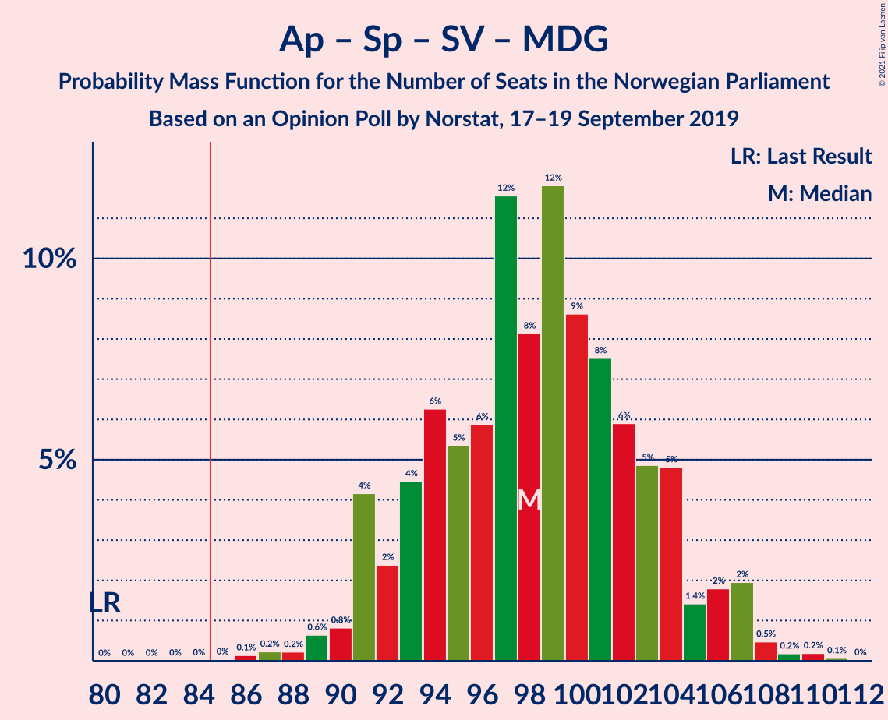

| Number of Seats | Probability | Accumulated | Special Marks |
|:---------------:|:-----------:|:-----------:|:-------------:|
| 80 | 0% | 100% | Last Result |
| 81 | 0% | 100% |  |
| 82 | 0% | 100% |  |
| 83 | 0% | 100% |  |
| 84 | 0% | 100% |  |
| 85 | 0% | 100% | Majority |
| 86 | 0.1% | 99.9% |  |
| 87 | 0.2% | 99.8% |  |
| 88 | 0.2% | 99.6% |  |
| 89 | 0.6% | 99.3% |  |
| 90 | 0.8% | 98.7% |  |
| 91 | 4% | 98% |  |
| 92 | 2% | 94% |  |
| 93 | 4% | 91% |  |
| 94 | 6% | 87% |  |
| 95 | 5% | 81% |  |
| 96 | 6% | 75% |  |
| 97 | 12% | 69% |  |
| 98 | 8% | 58% | Median |
| 99 | 12% | 50% |  |
| 100 | 9% | 38% |  |
| 101 | 8% | 29% |  |
| 102 | 6% | 22% |  |
| 103 | 5% | 16% |  |
| 104 | 5% | 11% |  |
| 105 | 1.4% | 6% |  |
| 106 | 2% | 5% |  |
| 107 | 2% | 3% |  |
| 108 | 0.5% | 0.9% |  |
| 109 | 0.2% | 0.5% |  |
| 110 | 0.2% | 0.3% |  |
| 111 | 0.1% | 0.1% |  |
| 112 | 0% | 0% |  |

### Høyre – Senterpartiet – Fremskrittspartiet – Kristelig Folkeparti – Venstre

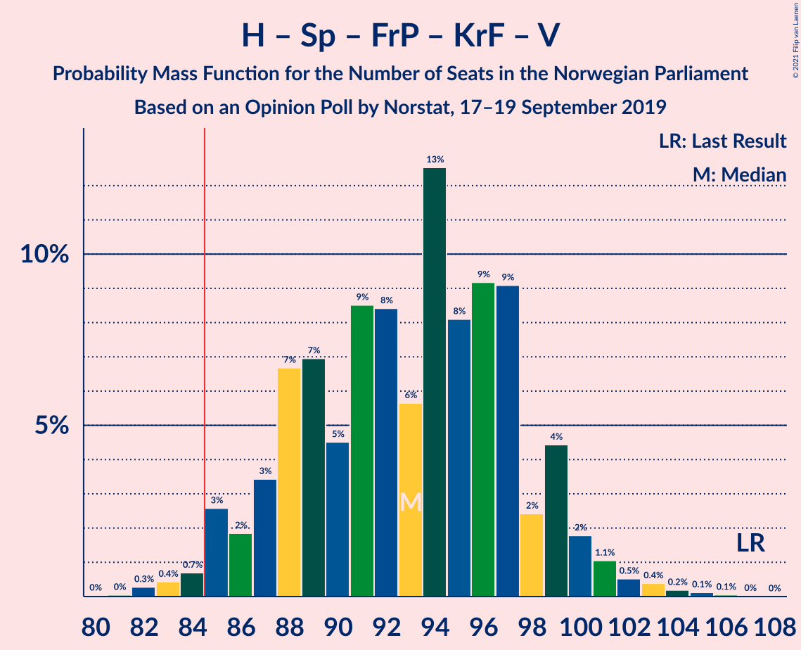

| Number of Seats | Probability | Accumulated | Special Marks |
|:---------------:|:-----------:|:-----------:|:-------------:|
| 80 | 0% | 100% |  |
| 81 | 0% | 99.9% |  |
| 82 | 0.3% | 99.9% |  |
| 83 | 0.4% | 99.6% |  |
| 84 | 0.7% | 99.2% |  |
| 85 | 3% | 98% | Majority |
| 86 | 2% | 96% |  |
| 87 | 3% | 94% |  |
| 88 | 7% | 91% |  |
| 89 | 7% | 84% |  |
| 90 | 5% | 77% |  |
| 91 | 9% | 72% |  |
| 92 | 8% | 64% | Median |
| 93 | 6% | 56% |  |
| 94 | 13% | 50% |  |
| 95 | 8% | 37% |  |
| 96 | 9% | 29% |  |
| 97 | 9% | 20% |  |
| 98 | 2% | 11% |  |
| 99 | 4% | 9% |  |
| 100 | 2% | 4% |  |
| 101 | 1.1% | 2% |  |
| 102 | 0.5% | 1.3% |  |
| 103 | 0.4% | 0.8% |  |
| 104 | 0.2% | 0.4% |  |
| 105 | 0.1% | 0.2% |  |
| 106 | 0.1% | 0.1% |  |
| 107 | 0% | 0% | Last Result |

### Arbeiderpartiet – Senterpartiet – Sosialistisk Venstreparti – Rødt

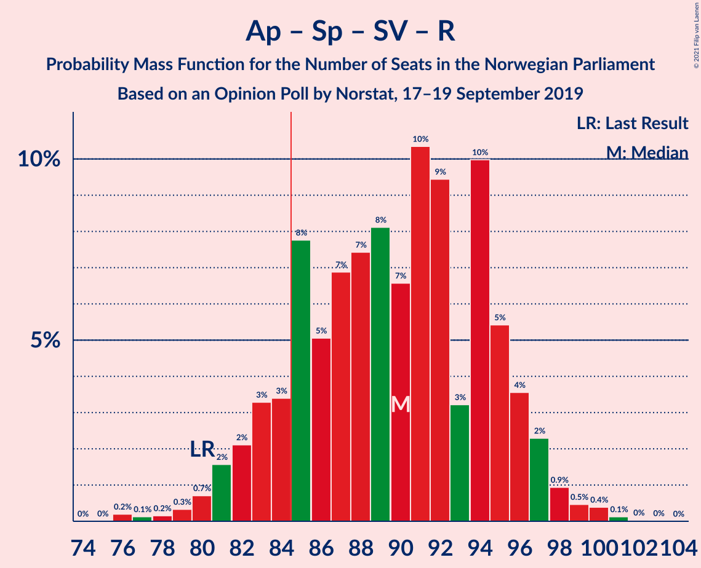

| Number of Seats | Probability | Accumulated | Special Marks |
|:---------------:|:-----------:|:-----------:|:-------------:|
| 76 | 0.2% | 100% |  |
| 77 | 0.1% | 99.8% |  |
| 78 | 0.2% | 99.7% |  |
| 79 | 0.3% | 99.5% |  |
| 80 | 0.7% | 99.2% | Last Result |
| 81 | 2% | 98% |  |
| 82 | 2% | 97% |  |
| 83 | 3% | 95% |  |
| 84 | 3% | 91% |  |
| 85 | 8% | 88% | Majority |
| 86 | 5% | 80% |  |
| 87 | 7% | 75% |  |
| 88 | 7% | 68% |  |
| 89 | 8% | 61% |  |
| 90 | 7% | 53% |  |
| 91 | 10% | 46% | Median |
| 92 | 9% | 36% |  |
| 93 | 3% | 26% |  |
| 94 | 10% | 23% |  |
| 95 | 5% | 13% |  |
| 96 | 4% | 8% |  |
| 97 | 2% | 4% |  |
| 98 | 0.9% | 2% |  |
| 99 | 0.5% | 1.0% |  |
| 100 | 0.4% | 0.6% |  |
| 101 | 0.1% | 0.2% |  |
| 102 | 0% | 0.1% |  |
| 103 | 0% | 0% |  |

### Arbeiderpartiet – Senterpartiet – Miljøpartiet De Grønne – Kristelig Folkeparti

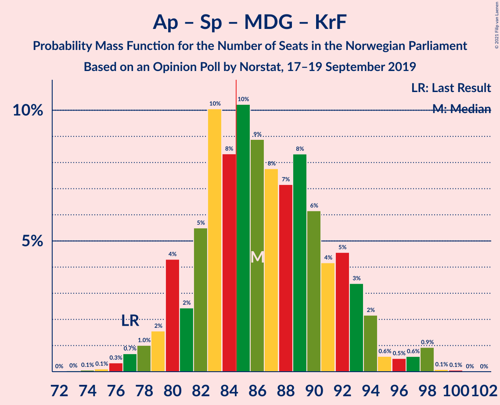

| Number of Seats | Probability | Accumulated | Special Marks |
|:---------------:|:-----------:|:-----------:|:-------------:|
| 73 | 0% | 100% |  |
| 74 | 0.1% | 99.9% |  |
| 75 | 0.1% | 99.9% |  |
| 76 | 0.3% | 99.8% |  |
| 77 | 0.7% | 99.4% | Last Result |
| 78 | 1.0% | 98.8% |  |
| 79 | 2% | 98% |  |
| 80 | 4% | 96% |  |
| 81 | 2% | 92% |  |
| 82 | 5% | 89% |  |
| 83 | 10% | 84% |  |
| 84 | 8% | 74% |  |
| 85 | 10% | 66% | Median, Majority |
| 86 | 9% | 55% |  |
| 87 | 8% | 46% |  |
| 88 | 7% | 39% |  |
| 89 | 8% | 32% |  |
| 90 | 6% | 23% |  |
| 91 | 4% | 17% |  |
| 92 | 5% | 13% |  |
| 93 | 3% | 8% |  |
| 94 | 2% | 5% |  |
| 95 | 0.6% | 3% |  |
| 96 | 0.5% | 2% |  |
| 97 | 0.6% | 2% |  |
| 98 | 0.9% | 1.1% |  |
| 99 | 0.1% | 0.2% |  |
| 100 | 0.1% | 0.1% |  |
| 101 | 0% | 0% |  |

### Arbeiderpartiet – Senterpartiet – Sosialistisk Venstreparti

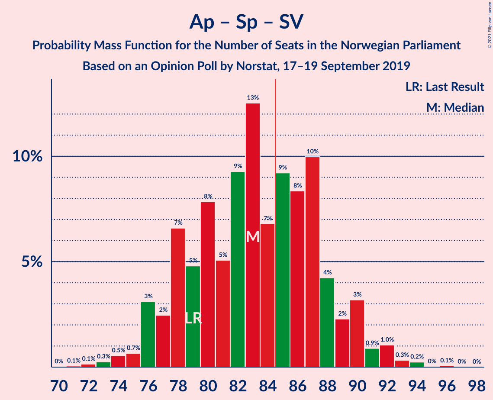

| Number of Seats | Probability | Accumulated | Special Marks |
|:---------------:|:-----------:|:-----------:|:-------------:|
| 71 | 0.1% | 100% |  |
| 72 | 0.1% | 99.9% |  |
| 73 | 0.3% | 99.8% |  |
| 74 | 0.5% | 99.5% |  |
| 75 | 0.7% | 99.0% |  |
| 76 | 3% | 98% |  |
| 77 | 2% | 95% |  |
| 78 | 7% | 93% |  |
| 79 | 5% | 86% | Last Result |
| 80 | 8% | 81% |  |
| 81 | 5% | 74% |  |
| 82 | 9% | 68% |  |
| 83 | 13% | 59% | Median |
| 84 | 7% | 47% |  |
| 85 | 9% | 40% | Majority |
| 86 | 8% | 31% |  |
| 87 | 10% | 22% |  |
| 88 | 4% | 12% |  |
| 89 | 2% | 8% |  |
| 90 | 3% | 6% |  |
| 91 | 0.9% | 3% |  |
| 92 | 1.0% | 2% |  |
| 93 | 0.3% | 0.7% |  |
| 94 | 0.2% | 0.3% |  |
| 95 | 0% | 0.1% |  |
| 96 | 0.1% | 0.1% |  |
| 97 | 0% | 0% |  |

### Høyre – Fremskrittspartiet – Miljøpartiet De Grønne – Kristelig Folkeparti – Venstre

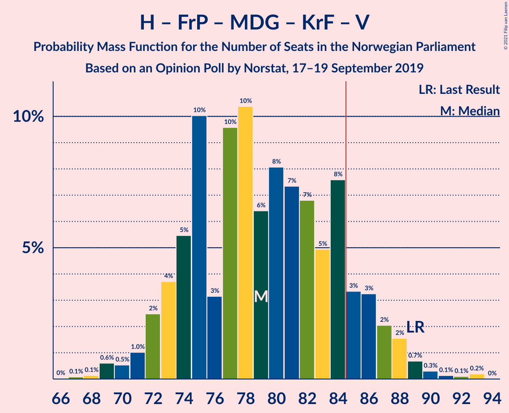

| Number of Seats | Probability | Accumulated | Special Marks |
|:---------------:|:-----------:|:-----------:|:-------------:|
| 67 | 0.1% | 100% |  |
| 68 | 0.1% | 99.9% |  |
| 69 | 0.6% | 99.7% |  |
| 70 | 0.5% | 99.1% |  |
| 71 | 1.0% | 98.6% |  |
| 72 | 2% | 98% |  |
| 73 | 4% | 95% |  |
| 74 | 5% | 91% |  |
| 75 | 10% | 86% |  |
| 76 | 3% | 76% |  |
| 77 | 10% | 73% |  |
| 78 | 10% | 63% | Median |
| 79 | 6% | 53% |  |
| 80 | 8% | 46% |  |
| 81 | 7% | 38% |  |
| 82 | 7% | 31% |  |
| 83 | 5% | 24% |  |
| 84 | 8% | 19% |  |
| 85 | 3% | 12% | Majority |
| 86 | 3% | 8% |  |
| 87 | 2% | 5% |  |
| 88 | 2% | 3% |  |
| 89 | 0.7% | 1.4% | Last Result |
| 90 | 0.3% | 0.7% |  |
| 91 | 0.1% | 0.4% |  |
| 92 | 0.1% | 0.3% |  |
| 93 | 0.2% | 0.2% |  |
| 94 | 0% | 0% |  |

### Arbeiderpartiet – Sosialistisk Venstreparti – Miljøpartiet De Grønne – Rødt

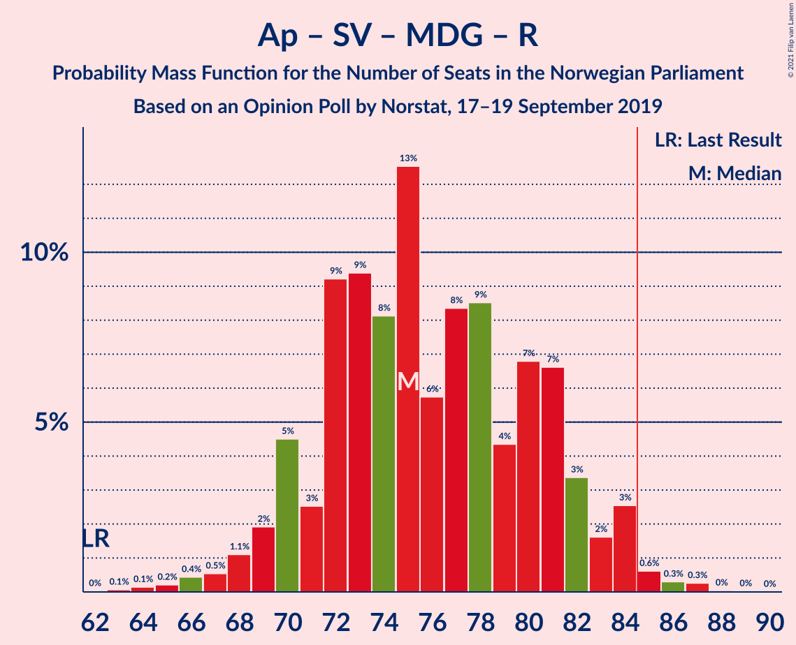

| Number of Seats | Probability | Accumulated | Special Marks |
|:---------------:|:-----------:|:-----------:|:-------------:|
| 62 | 0% | 100% | Last Result |
| 63 | 0.1% | 99.9% |  |
| 64 | 0.1% | 99.9% |  |
| 65 | 0.2% | 99.7% |  |
| 66 | 0.4% | 99.5% |  |
| 67 | 0.5% | 99.1% |  |
| 68 | 1.1% | 98.5% |  |
| 69 | 2% | 97% |  |
| 70 | 5% | 96% |  |
| 71 | 3% | 91% |  |
| 72 | 9% | 88% |  |
| 73 | 9% | 79% |  |
| 74 | 8% | 70% |  |
| 75 | 13% | 62% |  |
| 76 | 6% | 49% |  |
| 77 | 8% | 43% | Median |
| 78 | 9% | 35% |  |
| 79 | 4% | 27% |  |
| 80 | 7% | 22% |  |
| 81 | 7% | 15% |  |
| 82 | 3% | 9% |  |
| 83 | 2% | 5% |  |
| 84 | 3% | 4% |  |
| 85 | 0.6% | 1.3% | Majority |
| 86 | 0.3% | 0.6% |  |
| 87 | 0.3% | 0.3% |  |
| 88 | 0% | 0.1% |  |
| 89 | 0% | 0% |  |

### Arbeiderpartiet – Senterpartiet – Kristelig Folkeparti

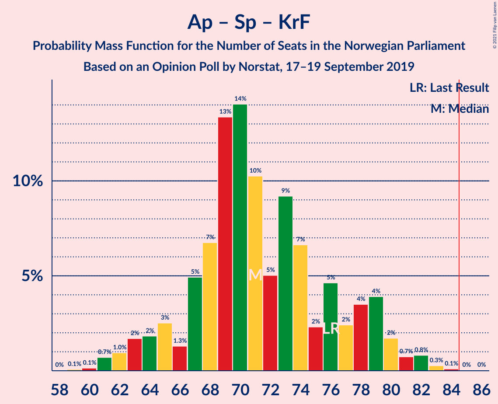

| Number of Seats | Probability | Accumulated | Special Marks |
|:---------------:|:-----------:|:-----------:|:-------------:|
| 59 | 0.1% | 100% |  |
| 60 | 0.1% | 99.9% |  |
| 61 | 0.7% | 99.7% |  |
| 62 | 1.0% | 99.0% |  |
| 63 | 2% | 98% |  |
| 64 | 2% | 96% |  |
| 65 | 3% | 95% |  |
| 66 | 1.3% | 92% |  |
| 67 | 5% | 91% |  |
| 68 | 7% | 86% |  |
| 69 | 13% | 79% |  |
| 70 | 14% | 66% | Median |
| 71 | 10% | 52% |  |
| 72 | 5% | 41% |  |
| 73 | 9% | 36% |  |
| 74 | 7% | 27% |  |
| 75 | 2% | 21% |  |
| 76 | 5% | 18% | Last Result |
| 77 | 2% | 14% |  |
| 78 | 4% | 11% |  |
| 79 | 4% | 8% |  |
| 80 | 2% | 4% |  |
| 81 | 0.7% | 2% |  |
| 82 | 0.8% | 1.3% |  |
| 83 | 0.3% | 0.5% |  |
| 84 | 0.1% | 0.2% |  |
| 85 | 0% | 0.1% | Majority |
| 86 | 0% | 0% |  |

### Arbeiderpartiet – Senterpartiet

| Number of Seats | Probability | Accumulated | Special Marks |
|:---------------:|:-----------:|:-----------:|:-------------:|
| 55 | 0% | 100% |  |
| 56 | 0.1% | 99.9% |  |
| 57 | 0.2% | 99.9% |  |
| 58 | 0.6% | 99.6% |  |
| 59 | 0.7% | 99.0% |  |
| 60 | 2% | 98% |  |
| 61 | 3% | 97% |  |
| 62 | 5% | 94% |  |
| 63 | 7% | 89% |  |
| 64 | 6% | 81% |  |
| 65 | 8% | 76% |  |
| 66 | 13% | 68% |  |
| 67 | 10% | 55% | Median |
| 68 | 8% | 44% | Last Result |
| 69 | 9% | 36% |  |
| 70 | 10% | 27% |  |
| 71 | 5% | 17% |  |
| 72 | 5% | 12% |  |
| 73 | 3% | 7% |  |
| 74 | 2% | 5% |  |
| 75 | 2% | 3% |  |
| 76 | 0.4% | 1.0% |  |
| 77 | 0.4% | 0.6% |  |
| 78 | 0.1% | 0.2% |  |
| 79 | 0% | 0.1% |  |
| 80 | 0.1% | 0.1% |  |
| 81 | 0% | 0% |  |

### Høyre – Fremskrittspartiet – Kristelig Folkeparti – Venstre

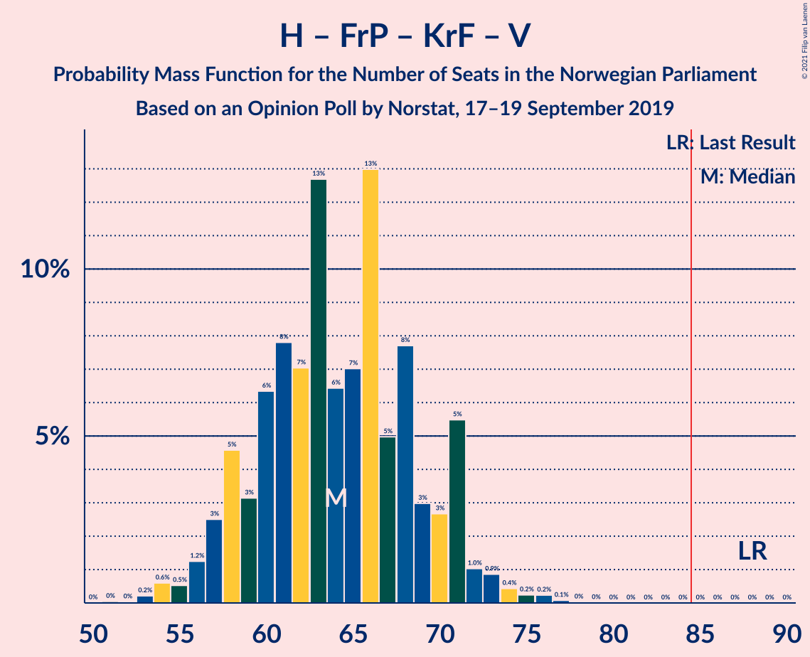

| Number of Seats | Probability | Accumulated | Special Marks |
|:---------------:|:-----------:|:-----------:|:-------------:|
| 51 | 0% | 100% |  |
| 52 | 0% | 99.9% |  |
| 53 | 0.2% | 99.9% |  |
| 54 | 0.6% | 99.7% |  |
| 55 | 0.5% | 99.1% |  |
| 56 | 1.2% | 98.6% |  |
| 57 | 3% | 97% |  |
| 58 | 5% | 95% |  |
| 59 | 3% | 90% |  |
| 60 | 6% | 87% |  |
| 61 | 8% | 81% |  |
| 62 | 7% | 73% |  |
| 63 | 13% | 66% | Median |
| 64 | 6% | 53% |  |
| 65 | 7% | 47% |  |
| 66 | 13% | 40% |  |
| 67 | 5% | 27% |  |
| 68 | 8% | 22% |  |
| 69 | 3% | 14% |  |
| 70 | 3% | 11% |  |
| 71 | 5% | 8% |  |
| 72 | 1.0% | 3% |  |
| 73 | 0.9% | 2% |  |
| 74 | 0.4% | 1.0% |  |
| 75 | 0.2% | 0.6% |  |
| 76 | 0.2% | 0.4% |  |
| 77 | 0.1% | 0.1% |  |
| 78 | 0% | 0% |  |
| 79 | 0% | 0% |  |
| 80 | 0% | 0% |  |
| 81 | 0% | 0% |  |
| 82 | 0% | 0% |  |
| 83 | 0% | 0% |  |
| 84 | 0% | 0% |  |
| 85 | 0% | 0% | Majority |
| 86 | 0% | 0% |  |
| 87 | 0% | 0% |  |
| 88 | 0% | 0% | Last Result |

### Høyre – Fremskrittspartiet – Venstre

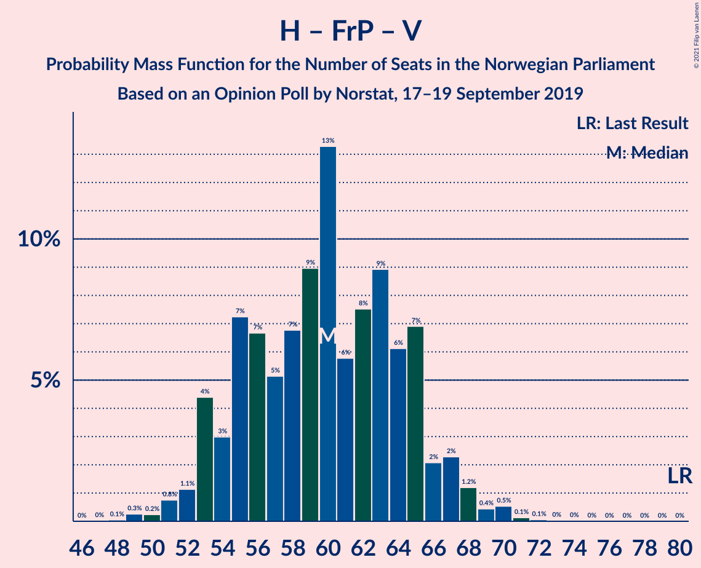

| Number of Seats | Probability | Accumulated | Special Marks |
|:---------------:|:-----------:|:-----------:|:-------------:|
| 48 | 0.1% | 100% |  |
| 49 | 0.3% | 99.9% |  |
| 50 | 0.2% | 99.7% |  |
| 51 | 0.8% | 99.4% |  |
| 52 | 1.1% | 98.7% |  |
| 53 | 4% | 98% |  |
| 54 | 3% | 93% |  |
| 55 | 7% | 90% |  |
| 56 | 7% | 83% |  |
| 57 | 5% | 76% |  |
| 58 | 7% | 71% |  |
| 59 | 9% | 64% |  |
| 60 | 13% | 55% | Median |
| 61 | 6% | 42% |  |
| 62 | 8% | 36% |  |
| 63 | 9% | 29% |  |
| 64 | 6% | 20% |  |
| 65 | 7% | 14% |  |
| 66 | 2% | 7% |  |
| 67 | 2% | 5% |  |
| 68 | 1.2% | 2% |  |
| 69 | 0.4% | 1.2% |  |
| 70 | 0.5% | 0.8% |  |
| 71 | 0.1% | 0.3% |  |
| 72 | 0.1% | 0.1% |  |
| 73 | 0% | 0.1% |  |
| 74 | 0% | 0% |  |
| 75 | 0% | 0% |  |
| 76 | 0% | 0% |  |
| 77 | 0% | 0% |  |
| 78 | 0% | 0% |  |
| 79 | 0% | 0% |  |
| 80 | 0% | 0% | Last Result |

### Høyre – Fremskrittspartiet

| Number of Seats | Probability | Accumulated | Special Marks |
|:---------------:|:-----------:|:-----------:|:-------------:|
| 46 | 0.1% | 100% |  |
| 47 | 0.2% | 99.9% |  |
| 48 | 0.3% | 99.7% |  |
| 49 | 1.2% | 99.4% |  |
| 50 | 1.3% | 98% |  |
| 51 | 4% | 97% |  |
| 52 | 3% | 93% |  |
| 53 | 9% | 91% |  |
| 54 | 7% | 82% |  |
| 55 | 6% | 75% |  |
| 56 | 7% | 69% |  |
| 57 | 9% | 62% |  |
| 58 | 15% | 52% | Median |
| 59 | 5% | 38% |  |
| 60 | 7% | 33% |  |
| 61 | 9% | 26% |  |
| 62 | 5% | 16% |  |
| 63 | 4% | 11% |  |
| 64 | 3% | 7% |  |
| 65 | 2% | 4% |  |
| 66 | 0.8% | 2% |  |
| 67 | 0.3% | 0.9% |  |
| 68 | 0.4% | 0.6% |  |
| 69 | 0.1% | 0.1% |  |
| 70 | 0% | 0.1% |  |
| 71 | 0% | 0% |  |
| 72 | 0% | 0% | Last Result |

### Arbeiderpartiet – Sosialistisk Venstreparti

| Number of Seats | Probability | Accumulated | Special Marks |
|:---------------:|:-----------:|:-----------:|:-------------:|
| 43 | 0.1% | 100% |  |
| 44 | 0.1% | 99.9% |  |
| 45 | 0.2% | 99.8% |  |
| 46 | 0.5% | 99.6% |  |
| 47 | 1.3% | 99.1% |  |
| 48 | 2% | 98% |  |
| 49 | 3% | 96% |  |
| 50 | 6% | 93% |  |
| 51 | 8% | 88% |  |
| 52 | 13% | 80% |  |
| 53 | 7% | 67% |  |
| 54 | 11% | 60% | Median |
| 55 | 9% | 49% |  |
| 56 | 12% | 40% |  |
| 57 | 10% | 29% |  |
| 58 | 6% | 19% |  |
| 59 | 6% | 13% |  |
| 60 | 2% | 6% | Last Result |
| 61 | 2% | 4% |  |
| 62 | 1.0% | 2% |  |
| 63 | 0.8% | 1.1% |  |
| 64 | 0.1% | 0.3% |  |
| 65 | 0.1% | 0.2% |  |
| 66 | 0.1% | 0.1% |  |
| 67 | 0% | 0% |  |

### Høyre – Kristelig Folkeparti – Venstre

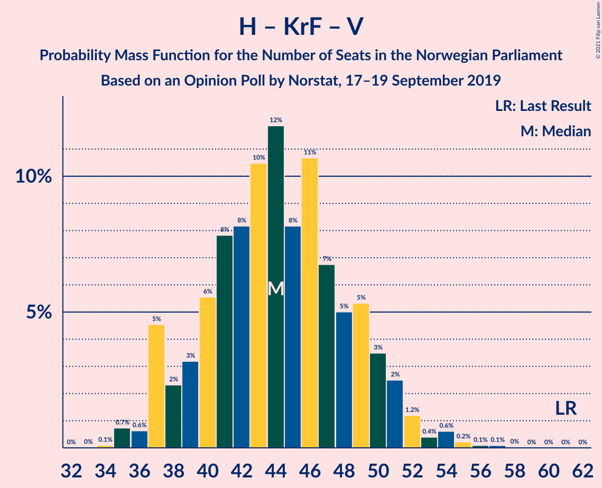

| Number of Seats | Probability | Accumulated | Special Marks |
|:---------------:|:-----------:|:-----------:|:-------------:|
| 34 | 0.1% | 100% |  |
| 35 | 0.7% | 99.9% |  |
| 36 | 0.6% | 99.1% |  |
| 37 | 5% | 98.5% |  |
| 38 | 2% | 94% |  |
| 39 | 3% | 92% |  |
| 40 | 6% | 88% |  |
| 41 | 8% | 83% |  |
| 42 | 8% | 75% |  |
| 43 | 10% | 67% | Median |
| 44 | 12% | 56% |  |
| 45 | 8% | 45% |  |
| 46 | 11% | 36% |  |
| 47 | 7% | 26% |  |
| 48 | 5% | 19% |  |
| 49 | 5% | 14% |  |
| 50 | 3% | 9% |  |
| 51 | 2% | 5% |  |
| 52 | 1.2% | 3% |  |
| 53 | 0.4% | 1.4% |  |
| 54 | 0.6% | 1.0% |  |
| 55 | 0.2% | 0.4% |  |
| 56 | 0.1% | 0.2% |  |
| 57 | 0.1% | 0.1% |  |
| 58 | 0% | 0% |  |
| 59 | 0% | 0% |  |
| 60 | 0% | 0% |  |
| 61 | 0% | 0% | Last Result |

### Senterpartiet – Kristelig Folkeparti – Venstre

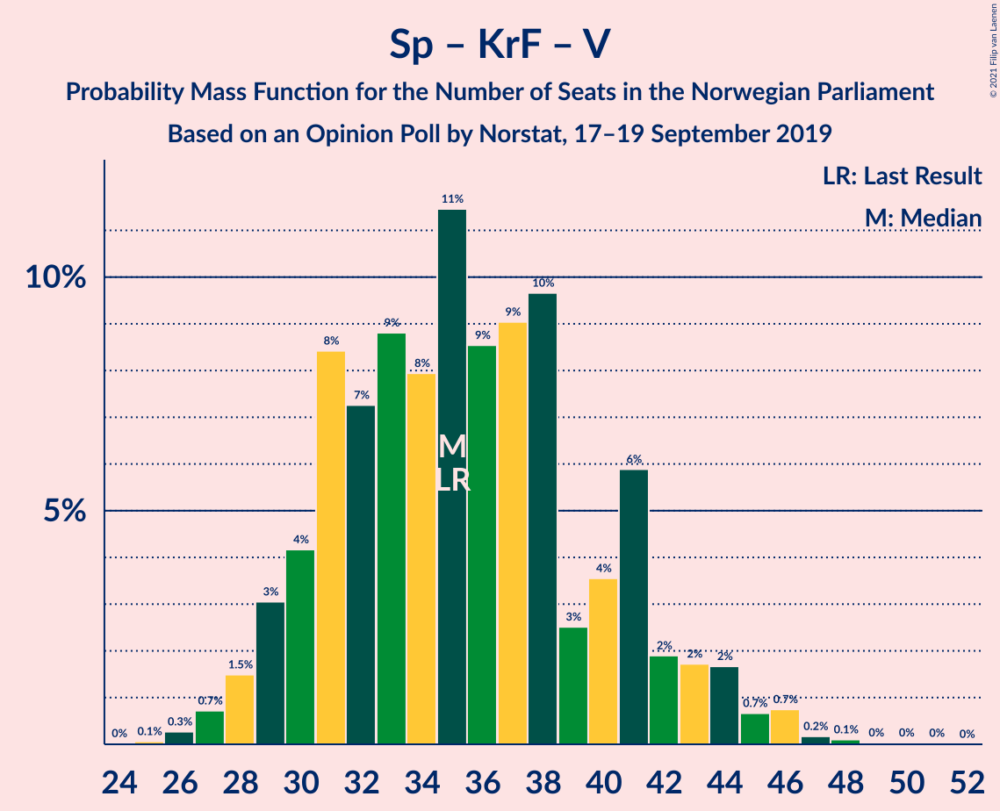

| Number of Seats | Probability | Accumulated | Special Marks |
|:---------------:|:-----------:|:-----------:|:-------------:|
| 25 | 0.1% | 100% |  |
| 26 | 0.3% | 99.9% |  |
| 27 | 0.7% | 99.6% |  |
| 28 | 1.5% | 98.9% |  |
| 29 | 3% | 97% |  |
| 30 | 4% | 94% |  |
| 31 | 8% | 90% |  |
| 32 | 7% | 82% |  |
| 33 | 9% | 75% |  |
| 34 | 8% | 66% | Median |
| 35 | 11% | 58% | Last Result |
| 36 | 9% | 46% |  |
| 37 | 9% | 38% |  |
| 38 | 10% | 29% |  |
| 39 | 3% | 19% |  |
| 40 | 4% | 17% |  |
| 41 | 6% | 13% |  |
| 42 | 2% | 7% |  |
| 43 | 2% | 5% |  |
| 44 | 2% | 3% |  |
| 45 | 0.7% | 2% |  |
| 46 | 0.7% | 1.1% |  |
| 47 | 0.2% | 0.4% |  |
| 48 | 0.1% | 0.2% |  |
| 49 | 0% | 0.1% |  |
| 50 | 0% | 0.1% |  |
| 51 | 0% | 0% |  |

## Technical Information

### Opinion Poll

+ **Polling firm:** Norstat
+ **Commissioner(s):** —
+ **Fieldwork period:** 17–19 September 2019

### Calculations

+ **Sample size:** 712
+ **Simulations done:** 1,048,576
+ **Error estimate:** 1.94%

